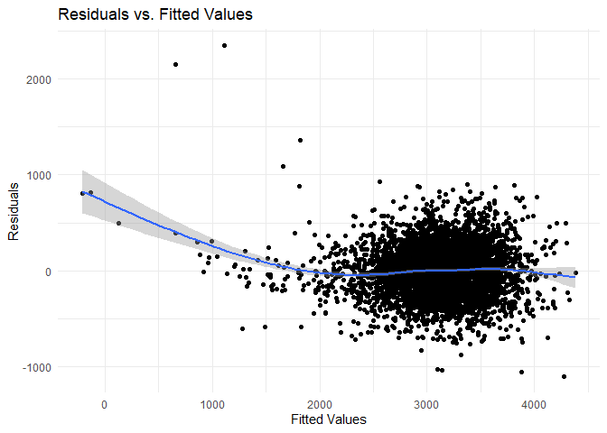

HW6
================
Sarahy Martinez
2024-12-01

``` r
library(tidyverse)
```

    ## ── Attaching core tidyverse packages ──────────────────────── tidyverse 2.0.0 ──
    ## ✔ dplyr     1.1.4     ✔ readr     2.1.5
    ## ✔ forcats   1.0.0     ✔ stringr   1.5.1
    ## ✔ ggplot2   3.5.1     ✔ tibble    3.2.1
    ## ✔ lubridate 1.9.3     ✔ tidyr     1.3.1
    ## ✔ purrr     1.0.2     
    ## ── Conflicts ────────────────────────────────────────── tidyverse_conflicts() ──
    ## ✖ dplyr::filter() masks stats::filter()
    ## ✖ dplyr::lag()    masks stats::lag()
    ## ℹ Use the conflicted package (<http://conflicted.r-lib.org/>) to force all conflicts to become errors

``` r
library(broom)
library(modelr)
```

    ## 
    ## Attaching package: 'modelr'
    ## 
    ## The following object is masked from 'package:broom':
    ## 
    ##     bootstrap

``` r
set.seed(1)
```

\#Problem 1

``` r
weather_df = 
  rnoaa::meteo_pull_monitors(
    c("USW00094728"),
    var = c("PRCP", "TMIN", "TMAX"), 
    date_min = "2017-01-01",
    date_max = "2017-12-31") %>%
  mutate(
    name = recode(id, USW00094728 = "CentralPark_NY"),
    tmin = tmin / 10,
    tmax = tmax / 10) %>%
  select(name, id, everything())
```

# Problem 2

## Problem 2A

``` r
#reading in Washington post data 

homicide_raw_data = read.csv("./homicide-data.csv")

homicide = homicide_raw_data %>% 
  unite(city_state, city, state, sep = ",") %>% 
  mutate(disposition_case = case_when( disposition == "Closed without arrest"~ "unresolved",
                                  disposition == "Closed by arrest" ~ "resolved",
                                  disposition == "Open/No arrest" ~ "unresolved")) %>%
 filter(!city_state %in% c("Dallas,TX", "Phoenix,AZ", "Kansas City,MO", "Tulsa,AL")) %>% 
  filter(victim_race %in% c("White", "Black")) %>% 
  mutate(victim_age = as.numeric(victim_age)) %>% 
  mutate(resolved = as.numeric(disposition_case == "resolved"))
```

    ## Warning: There was 1 warning in `mutate()`.
    ## ℹ In argument: `victim_age = as.numeric(victim_age)`.
    ## Caused by warning:
    ## ! NAs introduced by coercion

## Problem 2B

Using these data, we can fit a logistic regression for the binary
“resolved” outcome and victim demographics as predictors. This uses the
glm function with the family specified to account for the non-Gaussian
outcome distribution.

``` r
baltimore_df = 
  homicide %>% 
  filter(city_state == "Baltimore,MD") %>% 
  mutate(
    resolved = as.numeric(disposition_case == "resolved"),
    victim_age = as.numeric(victim_age),
    victim_race = fct_relevel(victim_race, "White")) %>% 
  select(resolved,victim_age, victim_race, victim_sex)

# applying the glm function
fit_logistic = 
  baltimore_df %>% 
  glm(resolved ~ victim_age + victim_race + victim_sex, data = ., family = binomial()) 

#using the broom tidy function and estimate the odds ratio and confidence interval

Balt_fit_logistic = 
  broom::tidy(fit_logistic, conf.int = TRUE) %>% #conf.int function used to calculate the CI
  mutate(
    OR = exp(estimate),
    OR_conf.low = exp(conf.low),
    OR_conf.high = exp(conf.high)
  ) %>%
  select (OR, OR_conf.low, OR_conf.high) %>% 
  rename(low = "OR_conf.low",
          high = "OR_conf.high") 

Balt_fit_logistic %>% knitr::kable(digits = 2)
```

|   OR |  low | high |
|-----:|-----:|-----:|
| 3.16 | 2.00 | 5.06 |
| 0.99 | 0.99 | 1.00 |
| 0.43 | 0.31 | 0.61 |
| 0.43 | 0.32 | 0.56 |

## Problem 2C

``` r
# taking df homicide and nesting data by city
homicide_data = homicide %>%
  group_by(city_state) %>%
  nest()

# create a function for the logistic regression and extract OR and CI
logistic = function(data) {
  fit = glm(resolved ~ victim_age + victim_race + victim_sex, data = data, family = binomial())
  tidy_fit = tidy(fit, conf.int = TRUE) %>%
    mutate(
      OR = exp(estimate),
      OR_conf.low = exp(conf.low),
      OR_conf.high = exp(conf.high)
    ) %>%
    filter(term == "victim_sexMale") %>%
    select(term, log_OR = estimate, OR, p.value, OR_conf.low, OR_conf.high)
  return(tidy_fit)
}

# Apply the function to each city's data and unnest the results to return values
city_results =
  homicide_data %>%
  mutate(model = purrr::map(data, logistic)) %>%
  unnest(model) %>% 
    select (OR, OR_conf.low, OR_conf.high) %>% 
  rename(Low = "OR_conf.low",
          High = "OR_conf.high") 
```

    ## Warning: There were 45 warnings in `mutate()`.
    ## The first warning was:
    ## ℹ In argument: `model = purrr::map(data, logistic)`.
    ## ℹ In group 1: `city_state = "Albuquerque,NM"`.
    ## Caused by warning:
    ## ! glm.fit: fitted probabilities numerically 0 or 1 occurred
    ## ℹ Run `dplyr::last_dplyr_warnings()` to see the 44 remaining warnings.

    ## Adding missing grouping variables: `city_state`

``` r
# Display the results
city_results %>% knitr::kable(digits = 2)
```

| city_state        |   OR |  Low | High |
|:------------------|-----:|-----:|-----:|
| Albuquerque,NM    | 1.77 | 0.82 | 3.76 |
| Atlanta,GA        | 1.00 | 0.68 | 1.46 |
| Baltimore,MD      | 0.43 | 0.32 | 0.56 |
| Baton Rouge,LA    | 0.38 | 0.20 | 0.68 |
| Birmingham,AL     | 0.87 | 0.57 | 1.31 |
| Boston,MA         | 0.67 | 0.35 | 1.28 |
| Buffalo,NY        | 0.52 | 0.29 | 0.94 |
| Charlotte,NC      | 0.88 | 0.55 | 1.39 |
| Chicago,IL        | 0.41 | 0.34 | 0.50 |
| Cincinnati,OH     | 0.40 | 0.23 | 0.67 |
| Columbus,OH       | 0.53 | 0.38 | 0.75 |
| Denver,CO         | 0.48 | 0.23 | 0.96 |
| Detroit,MI        | 0.58 | 0.46 | 0.73 |
| Durham,NC         | 0.81 | 0.38 | 1.66 |
| Fort Worth,TX     | 0.67 | 0.39 | 1.12 |
| Fresno,CA         | 1.34 | 0.57 | 3.05 |
| Houston,TX        | 0.71 | 0.56 | 0.91 |
| Indianapolis,IN   | 0.92 | 0.68 | 1.24 |
| Jacksonville,FL   | 0.72 | 0.54 | 0.97 |
| Las Vegas,NV      | 0.84 | 0.61 | 1.15 |
| Long Beach,CA     | 0.41 | 0.14 | 1.02 |
| Los Angeles,CA    | 0.66 | 0.46 | 0.95 |
| Louisville,KY     | 0.49 | 0.30 | 0.78 |
| Memphis,TN        | 0.72 | 0.53 | 0.98 |
| Miami,FL          | 0.52 | 0.30 | 0.87 |
| Milwaukee,wI      | 0.73 | 0.50 | 1.05 |
| Minneapolis,MN    | 0.95 | 0.48 | 1.88 |
| Nashville,TN      | 1.03 | 0.68 | 1.56 |
| New Orleans,LA    | 0.58 | 0.42 | 0.81 |
| New York,NY       | 0.26 | 0.13 | 0.49 |
| Oakland,CA        | 0.56 | 0.36 | 0.87 |
| Oklahoma City,OK  | 0.97 | 0.62 | 1.52 |
| Omaha,NE          | 0.38 | 0.20 | 0.71 |
| Philadelphia,PA   | 0.50 | 0.38 | 0.65 |
| Pittsburgh,PA     | 0.43 | 0.26 | 0.70 |
| Richmond,VA       | 1.01 | 0.48 | 1.99 |
| San Antonio,TX    | 0.70 | 0.39 | 1.24 |
| Sacramento,CA     | 0.67 | 0.33 | 1.31 |
| Savannah,GA       | 0.87 | 0.42 | 1.78 |
| San Bernardino,CA | 0.50 | 0.17 | 1.46 |
| San Diego,CA      | 0.41 | 0.19 | 0.83 |
| San Francisco,CA  | 0.61 | 0.31 | 1.16 |
| St. Louis,MO      | 0.70 | 0.53 | 0.93 |
| Stockton,CA       | 1.35 | 0.63 | 2.99 |
| Tampa,FL          | 0.81 | 0.34 | 1.86 |
| Tulsa,OK          | 0.98 | 0.61 | 1.54 |
| Washington,DC     | 0.69 | 0.47 | 1.01 |

## Problem 2D

``` r
# plotting the estimated ORs and CIs for each city according to estimated OR 

city_estimated = ggplot(city_results, aes(x = reorder(city_state, OR), y =OR))+
                          geom_point()+
                          geom_line()+
                          geom_errorbar(aes(ymin = Low, ymax = High), width = 0.2)+
                          labs(title = "Estimated Odds Ratio and CI for Homcides Across Cities",
                                                       x = "City",
                                                        y = "Odds Ratio")+
                              theme(axis.text.x = element_text(angle = 90, hjust = 1))
```

Based on the plot we can see that New Mexico has the largest odds ratio
and confidence interval in comparison to New York who has the smallest
OR and CI. This is interesting given that it is common knowledge that
Chicago, IL has been considered the city and state with the highest
homicide rate yet its OR is less than New York and Baton Rogue, LA.

# Problem 3

## Problem 3A

``` r
child_weight = read.csv("./birthweight.csv")

child_weight = child_weight %>% 
  mutate(
    babysex = factor(babysex, levels = c(1, 2), labels = c("Male", "Female")),
    frace = fct_relevel(factor(frace, levels = c(1, 2, 3, 4, 8, 9),
                               labels = c("White", "Black", "Asian", "Puerto Rican", "Other", "Unknown")),
                        "White", "Black"),
    malform = factor(malform, levels = c(0, 1), labels = c("Absent", "Present")),
    mrace = fct_relevel(factor(mrace, levels = c(1, 2, 3, 4, 8),
                               labels = c("White", "Black", "Asian", "Puerto Rican", "Other")),
                        "White", "Black"),
gaweeks = as.numeric(gaweeks))
```

## Problem 3b

``` r
# developing the regression model, writing the linear regression model with all the potential predictors of low birth weight 

fit = lm(bwt ~ babysex + bhead + blength + delwt + fincome + frace + gaweeks + malform + menarche + mheight + momage + mrace + parity + pnumlbw + pnumsga + ppbmi + ppwt + smoken + wtgain, data = child_weight)

fitted.values(fit) # record of fitted values 
```

    ##         1         2         3         4         5         6         7         8 
    ## 3714.1980 2853.4415 3539.3183 3396.4118 3479.3610 3265.4460 2774.3313 3019.7017 
    ##         9        10        11        12        13        14        15        16 
    ## 3718.8797 3029.6913 3533.2118 3400.2528 3300.4219 3806.8153 3439.0963 2897.9689 
    ##        17        18        19        20        21        22        23        24 
    ## 3843.7402 3712.2609 3896.6965 3475.0731 3357.1982 3241.9606 3090.7185 3524.6002 
    ##        25        26        27        28        29        30        31        32 
    ## 4071.1205 4272.6836 3657.1628 3062.8536 3468.1177 3569.0949 3112.3800 3356.3625 
    ##        33        34        35        36        37        38        39        40 
    ## 3781.6130 3479.4835 4045.2430 3449.5357 3860.2207 3255.7335 3553.6399 3492.9715 
    ##        41        42        43        44        45        46        47        48 
    ## 3645.6728 3258.4656 3465.2863 3396.4098 3045.1135 3183.8440 3193.9152 3267.1172 
    ##        49        50        51        52        53        54        55        56 
    ## 3057.9441 3495.0039 3620.7587 3492.1354 3399.9061 3029.5218 2967.3928 3174.5059 
    ##        57        58        59        60        61        62        63        64 
    ## 3643.1352 3518.0364 3403.2144 3954.3776 3307.6066 1915.2537 3400.5989 2391.3386 
    ##        65        66        67        68        69        70        71        72 
    ## 3307.0752 3567.3560 3383.4733 3283.3946 3532.7716 3402.2598 3466.5832 3727.6778 
    ##        73        74        75        76        77        78        79        80 
    ## 2966.3794 3859.4009 3434.3942 3130.7783 3371.7016 3005.2884 3312.1885 3564.2215 
    ##        81        82        83        84        85        86        87        88 
    ## 3028.6422 3433.5179 3849.8567 2564.0538 3263.3932 3067.4396 2930.8026 3326.5204 
    ##        89        90        91        92        93        94        95        96 
    ## 3401.4627 3179.2297 4006.8925 3279.7126 3444.2664 2951.9436 2698.0491 3846.4356 
    ##        97        98        99       100       101       102       103       104 
    ## 3545.6779 3361.5874 2913.8410 3525.9635 3819.0713 2650.7001 3713.1523 2896.4171 
    ##       105       106       107       108       109       110       111       112 
    ## 3265.8193 3810.7209 2992.0385 4292.0397 2621.1744 2973.1477 3289.6227 3499.2015 
    ##       113       114       115       116       117       118       119       120 
    ## 3328.1663 3648.2590 2721.4360 3070.3321 2713.0838 2498.8441 3492.3620 3087.9195 
    ##       121       122       123       124       125       126       127       128 
    ## 3667.5847 3525.0663 2380.8918 3390.5693 2758.0686 3305.1598 2773.8195 3259.7012 
    ##       129       130       131       132       133       134       135       136 
    ## 3891.1381 3556.9443 2987.6582 3983.6884 3302.5223 2768.0023 2938.8786 3497.0463 
    ##       137       138       139       140       141       142       143       144 
    ## 3110.6701 3646.8451 2864.6547 3016.9117 3359.7343 3352.7508 3238.7610 2689.3854 
    ##       145       146       147       148       149       150       151       152 
    ## 2295.1818 3642.4048 3372.3896 3833.5096 3378.9358 3270.5001 3321.2956 3472.5859 
    ##       153       154       155       156       157       158       159       160 
    ## 3986.1554 3651.2937 3623.2585 3261.7204 3294.3084 3033.7635  653.1588 3312.9587 
    ##       161       162       163       164       165       166       167       168 
    ## 3878.9492 4187.7733 3300.8906 3524.2290 3533.7213 3024.9834 3301.5718 3444.9798 
    ##       169       170       171       172       173       174       175       176 
    ## 2752.0289 3154.9905 3155.2420 2819.6770 3276.6934 3576.9701 3420.0276 3394.7593 
    ##       177       178       179       180       181       182       183       184 
    ## 2800.3902 3144.8216 2750.5984 2862.1782 3253.7926 3400.7101 3345.2746 3369.2006 
    ##       185       186       187       188       189       190       191       192 
    ## 3100.6723 3734.2513 3287.1905 3017.0041 3307.2671 3308.8294 3498.4135 2768.5738 
    ##       193       194       195       196       197       198       199       200 
    ## 2922.6827 2455.6574 3467.7287 2731.6449 3123.3787 3572.0583 3432.3071 3022.8338 
    ##       201       202       203       204       205       206       207       208 
    ## 3037.5481 3524.3436 3815.2798 3326.1760 3348.5822 3276.7945 3718.0022 3188.5143 
    ##       209       210       211       212       213       214       215       216 
    ## 3384.5614 2869.3891 2807.5988 3462.9392 3543.1126 3337.4910 3295.2635 2915.8627 
    ##       217       218       219       220       221       222       223       224 
    ## 2912.5410 2963.3141 3120.9873 2945.2950 3013.0422 3586.9393 3327.9710 3118.2902 
    ##       225       226       227       228       229       230       231       232 
    ## 2615.0390 3503.3167 3512.3943 3379.9540 2968.0293 3320.2552 2910.3064 3409.6590 
    ##       233       234       235       236       237       238       239       240 
    ## 3570.9683 3803.2322 3133.5011 3516.0123 3106.7134 3523.2000 3637.9622 3743.7871 
    ##       241       242       243       244       245       246       247       248 
    ## 3441.7397 3200.9699 3698.9370 3460.9536 3841.7205 3832.5590 3003.2219 3795.6709 
    ##       249       250       251       252       253       254       255       256 
    ## 3138.0222 3426.0396 3137.1644 3838.6239 2806.2624 3364.2035 2734.0413 1803.5110 
    ##       257       258       259       260       261       262       263       264 
    ## 3525.7362 3121.4104 3068.2549 3451.7109 2621.8122 3649.6353 3392.0680 2481.6018 
    ##       265       266       267       268       269       270       271       272 
    ## 3042.9644 3759.5087 3472.2722 3105.8204 3419.7785 3352.6091 3564.4302 3246.8627 
    ##       273       274       275       276       277       278       279       280 
    ## 4085.3904 3381.3799 3231.1225 2962.7432 3593.6907 3778.7425 2948.1725 3527.1275 
    ##       281       282       283       284       285       286       287       288 
    ## 2444.7392 3628.1838 3324.2972 3565.2394 2913.3528 2721.8732 3480.7086 3302.7239 
    ##       289       290       291       292       293       294       295       296 
    ## 3489.3406 2784.6723 3379.9120 3395.2880 3938.9963 3528.0879 3096.6224 2954.8615 
    ##       297       298       299       300       301       302       303       304 
    ## 3495.2038 3551.4907 3580.3948 2987.5451 3159.1686 3089.7333 3436.5711 3023.9614 
    ##       305       306       307       308       309       310       311       312 
    ## 3543.7467 3265.1404 3168.3111 2644.1029 2913.5943 3675.2093 2749.0628 3455.9470 
    ##       313       314       315       316       317       318       319       320 
    ## 3361.4880 3718.8639 3530.3548 3048.5886 2985.9529 3260.2876 3052.6991 3569.6251 
    ##       321       322       323       324       325       326       327       328 
    ## 2575.2956 2791.6060 3692.2207 3647.3685 3655.0461 3100.0824 3281.1060 3256.5566 
    ##       329       330       331       332       333       334       335       336 
    ## 3244.1123 2960.8241 2970.4707 3329.2388 3396.1260 3077.7823 3149.6867 3687.5986 
    ##       337       338       339       340       341       342       343       344 
    ## 3118.8629 3170.2145 3239.3572 2519.0146 3284.0430 3386.1711 3314.8446 2924.3600 
    ##       345       346       347       348       349       350       351       352 
    ## 3087.5438 3037.5576 2982.7519 3340.2341 3535.5990 3207.1256 3413.4578 3473.3884 
    ##       353       354       355       356       357       358       359       360 
    ## 3368.5184 3435.9518 3433.1594 1842.2607 3295.4315 3068.0380 3236.0706 3327.8658 
    ##       361       362       363       364       365       366       367       368 
    ## 3414.4162 3029.4040 3152.9860 3660.1217 3658.0692 3112.5605 2579.0250 2771.3895 
    ##       369       370       371       372       373       374       375       376 
    ## 2840.4603 2770.6377 3458.1107 3249.1040 3360.6398 3076.7827 3363.2866 3100.3538 
    ##       377       378       379       380       381       382       383       384 
    ## 2887.4505 3380.6305 3648.8264 2846.2766 3354.1110 2902.4251 3132.2020 3066.6374 
    ##       385       386       387       388       389       390       391       392 
    ## 3390.5333 3204.1418 3503.9223 3445.6240 3636.7915 3982.1651 3170.5403 3063.9944 
    ##       393       394       395       396       397       398       399       400 
    ## 2782.0672 3132.7820 3528.7813 3093.0721 3303.5534 3151.6934 3331.2425 2346.8240 
    ##       401       402       403       404       405       406       407       408 
    ## 3340.8890 3034.5833 3227.3333 3685.9998 3615.8022 3227.6552 3686.2601 3177.4117 
    ##       409       410       411       412       413       414       415       416 
    ## 3650.4636 3257.7050 3218.0641 3021.3455 3531.3279 3542.3830 3344.0519 3482.6551 
    ##       417       418       419       420       421       422       423       424 
    ## 3393.3230 3211.8777 3094.7943 3407.5149 2792.8987 3199.8009 3144.4227 3502.2198 
    ##       425       426       427       428       429       430       431       432 
    ## 3445.7787 3597.4158 2901.4016 3253.4359 4110.8198 3503.1989 3332.3248 3316.0698 
    ##       433       434       435       436       437       438       439       440 
    ## 2367.5223 3275.9429 3598.5135 3041.9945 3492.0029 3559.4369 3663.9333 3008.1621 
    ##       441       442       443       444       445       446       447       448 
    ## 3439.1999 3552.1255 2773.8078 3458.1171 3146.9615 2868.2630 3292.4017 3045.4880 
    ##       449       450       451       452       453       454       455       456 
    ## 3222.1474 2982.6780 2998.4830 3476.1331 3609.1287 3454.7965 3929.3568 3452.3644 
    ##       457       458       459       460       461       462       463       464 
    ## 2986.2717 3774.9607 3066.4184 2624.9440 2957.2493 2969.4971 3132.3819 3450.9316 
    ##       465       466       467       468       469       470       471       472 
    ## 2954.5006 3281.3906 3006.1829 2721.7553 2845.7575 3016.3922 3539.5842 3312.6749 
    ##       473       474       475       476       477       478       479       480 
    ## 3491.5037 3192.5178 3245.8225 3560.5733 3199.7123 3286.3818 3720.5786 3351.5403 
    ##       481       482       483       484       485       486       487       488 
    ## 3170.7304 3413.3464 2858.5773 2699.4919 2793.0229 3961.6073 3206.5739 3789.2326 
    ##       489       490       491       492       493       494       495       496 
    ## 4009.8257 3504.3529 3512.8768 2341.4038 3916.3538 3513.9560 3569.7851 3468.4748 
    ##       497       498       499       500       501       502       503       504 
    ## 3119.9171 1114.8524 3508.0450 3349.3258 3261.5378 3153.1755 3623.3173 3822.6570 
    ##       505       506       507       508       509       510       511       512 
    ## 2213.5119 2901.5134 3719.4948 3597.2797 3012.7576 3479.5592 3371.9732 3265.9522 
    ##       513       514       515       516       517       518       519       520 
    ## 3442.5124 3418.4984 2475.2414 3424.0998 3479.9385 3579.4036 3588.2008 2677.6115 
    ##       521       522       523       524       525       526       527       528 
    ## 3742.2215 4172.9587 3389.8698 3644.1268 3732.8817 3676.1962 3288.1038 3170.5142 
    ##       529       530       531       532       533       534       535       536 
    ## 3392.2309 2751.5560 3100.1391 2714.2277 3070.8515 2383.7311 2484.3809 3248.1279 
    ##       537       538       539       540       541       542       543       544 
    ## 3391.8094 3212.4637 3501.9275 2650.5932 2734.5354 3136.4876 3129.4286 3020.0977 
    ##       545       546       547       548       549       550       551       552 
    ## 2969.9000 3169.2878 3119.6243 3689.4822 3416.9526 3017.2654 3540.7405 3071.6931 
    ##       553       554       555       556       557       558       559       560 
    ## 2944.5422 3546.2702 3725.0558 3466.4166 4328.4075 3054.2075 2995.8639 2923.6094 
    ##       561       562       563       564       565       566       567       568 
    ## 2987.2381 3316.6775 3214.2660 3203.4290 2927.6011 2977.9352 3109.8076 3835.1820 
    ##       569       570       571       572       573       574       575       576 
    ## 3516.3289 2310.2456 3713.6019 3215.8581 3369.2256 3252.3938 3377.5751 3524.2116 
    ##       577       578       579       580       581       582       583       584 
    ## 3075.9702 3022.7327 3080.6932 3606.2596 2957.2945 4057.7691 3198.9182 3797.8125 
    ##       585       586       587       588       589       590       591       592 
    ## 3790.9357 2632.9837 3051.5547 2891.7520 3563.4966 3159.2919 3649.8391 3454.0314 
    ##       593       594       595       596       597       598       599       600 
    ## 2959.6648 3669.1854 3474.9046 4229.4974 3425.8967 3374.9728 2832.0997 3514.8927 
    ##       601       602       603       604       605       606       607       608 
    ## 3125.4465 3210.9121 3233.7087 3068.5295 3087.2863 3323.4063 2818.5063 3636.0415 
    ##       609       610       611       612       613       614       615       616 
    ## 3312.8287 2709.0362 3424.5192 3422.1971 4125.6484 2967.9326 3295.8230 3035.5824 
    ##       617       618       619       620       621       622       623       624 
    ## 3675.0019 3632.6493 3495.2841 2681.2763 2936.3371 3388.4531 3370.1302 3549.2944 
    ##       625       626       627       628       629       630       631       632 
    ## 3605.4415 2907.5561 3643.3381 3561.4620 3164.7068 3595.9111 3321.0877 2754.2960 
    ##       633       634       635       636       637       638       639       640 
    ## 3580.1912 3178.6764 3067.3364 3375.2361 3510.8649 3368.0311 3192.1327 2508.0530 
    ##       641       642       643       644       645       646       647       648 
    ## 3217.8483 2722.5185 3377.8845 3111.7671 3803.0798 3787.2707 3496.5178 3624.9395 
    ##       649       650       651       652       653       654       655       656 
    ## 2992.9287 2992.8680 3671.6164 3574.9857 3315.5995 3547.7036 3378.3152 2927.2566 
    ##       657       658       659       660       661       662       663       664 
    ## 2837.3975 2931.8258 3227.4771 3132.6761 3004.9751 3348.8971 3439.6827 3576.5685 
    ##       665       666       667       668       669       670       671       672 
    ## 3449.4647 3432.4662 3042.9965 3660.7663 3493.6112 2982.7773 3716.8778 3104.0331 
    ##       673       674       675       676       677       678       679       680 
    ## 3179.9395 2915.7759 2387.6855 3518.8634 3416.2430 3405.9113 3211.1465 3852.6601 
    ##       681       682       683       684       685       686       687       688 
    ## 2944.6741 3224.1438 2733.9796 3536.2649 3366.9771 3174.4510 3195.0454 3197.6164 
    ##       689       690       691       692       693       694       695       696 
    ## 2661.8450 3253.7645 3094.2934 2814.9938 3374.3635 3796.8260 3501.6744 2994.9253 
    ##       697       698       699       700       701       702       703       704 
    ## 3519.2398 3093.0449 3635.0197 3267.4487 2891.0307 3441.9546 3129.9676 3416.8823 
    ##       705       706       707       708       709       710       711       712 
    ## 3111.4395 3450.0944 3295.9410 3687.7668 3624.5698 3269.1438 3420.2468 3236.6409 
    ##       713       714       715       716       717       718       719       720 
    ## 3402.2251 3177.1776 3473.1151 3436.5097 3100.9282 3243.2146 2328.3869 2836.4043 
    ##       721       722       723       724       725       726       727       728 
    ## 3501.3563 3380.2670 3452.6056 3050.1157 3245.7015 2740.0721 3059.3506 2941.7847 
    ##       729       730       731       732       733       734       735       736 
    ## 3091.9343 3619.3407 2179.9099 2510.1417 3766.2679 2853.2909 3163.8588 3169.1749 
    ##       737       738       739       740       741       742       743       744 
    ## 3186.1762 3601.8068 3440.3564 3746.0933 3437.9808 3427.2784 2969.6217 3259.2835 
    ##       745       746       747       748       749       750       751       752 
    ## 2936.0498 3507.2505 3407.2492 3853.4487 3413.7901 3587.5080 2548.4745 3182.9848 
    ##       753       754       755       756       757       758       759       760 
    ## 3419.4901 3781.3290 3776.6119 3111.8162 3367.7143 3355.1633 3189.5894 3621.5521 
    ##       761       762       763       764       765       766       767       768 
    ## 3936.2772 2942.0720 3434.2773 2107.1190 3335.1872 3545.2422 3141.5173 3400.6721 
    ##       769       770       771       772       773       774       775       776 
    ## 2312.7778 3219.4761 3412.5436 3284.8144 2988.8976 3214.5762 3415.6874 2621.7136 
    ##       777       778       779       780       781       782       783       784 
    ## 3160.2826 3026.6436 3305.6991 3202.1192 2854.6106 2837.2168 2606.7970 3357.3074 
    ##       785       786       787       788       789       790       791       792 
    ## 3315.8600 3311.0726 3541.2019 3688.6721 3105.8777 3295.1292 3924.2342 3006.0159 
    ##       793       794       795       796       797       798       799       800 
    ## 3701.2243 2223.7827 3681.8500 3943.8328 3660.4575 3036.8561 3673.6795 2669.5760 
    ##       801       802       803       804       805       806       807       808 
    ## 2652.5858 3631.3677 3526.7128 3590.9462 3474.2059 3420.4890 2846.1197 3663.3519 
    ##       809       810       811       812       813       814       815       816 
    ## 3583.1056 3662.7669 3365.7510 3384.3959 3317.5324 3400.5243 2543.2517 3062.9938 
    ##       817       818       819       820       821       822       823       824 
    ## 3276.5024 3006.3996 2952.2283 4004.7437 2650.8998 3078.6164 3241.9006 3374.3081 
    ##       825       826       827       828       829       830       831       832 
    ## 3305.4586 3380.4335 2513.2274 2042.4153 3686.1256 1658.3271 3178.8842 3176.3524 
    ##       833       834       835       836       837       838       839       840 
    ## 3441.3139 3363.3547 3808.8282 2888.3413 3253.8379 3096.6152 3346.7374 3503.5395 
    ##       841       842       843       844       845       846       847       848 
    ## 3409.9652 3708.2694 3337.2154 3146.3512 3477.5966 3850.3397 2926.3080 3379.5744 
    ##       849       850       851       852       853       854       855       856 
    ## 3269.5516 3676.0172 2998.8580 3127.5229 1541.4079 3809.4678 3192.8640 3525.0578 
    ##       857       858       859       860       861       862       863       864 
    ## 2867.2756 2669.2071 2780.4754 3534.6090 3649.6294 3410.9337 3539.0646 1997.5242 
    ##       865       866       867       868       869       870       871       872 
    ## 3349.3673 2473.3043 2555.7285 3970.6133 3429.2575 3668.1379 4127.9845 3292.1360 
    ##       873       874       875       876       877       878       879       880 
    ## 3436.5144 1807.8226 3082.2262 3449.6405 2865.0111 3410.6592 3201.5003 3286.9684 
    ##       881       882       883       884       885       886       887       888 
    ## 2945.3230 2826.1326 3502.5218 2672.1444 3327.1003 2902.9160 4209.9991 3402.9664 
    ##       889       890       891       892       893       894       895       896 
    ## 2464.5501 2960.2637 3318.4841 3438.6058 3105.3692 3246.3288 3422.3764 3629.7332 
    ##       897       898       899       900       901       902       903       904 
    ## 3428.2596 3100.4024 2808.8252 3414.5983 3103.9966 3118.1620 3283.4693 3185.5554 
    ##       905       906       907       908       909       910       911       912 
    ## 3715.7738 3497.7672 2705.8338 2467.4383 3708.5261 3410.3152 2792.1243 3158.6221 
    ##       913       914       915       916       917       918       919       920 
    ## 3183.6210 2583.7561 2911.3895 3638.2053 2852.0233 3266.6999 3172.2063 2583.4806 
    ##       921       922       923       924       925       926       927       928 
    ## 3516.2525 3418.9227 3513.9069 3484.7944 3092.7260 2879.0917 2884.8494 3681.1769 
    ##       929       930       931       932       933       934       935       936 
    ## 2806.4220 3274.1030 3157.0563 3221.2083 3438.7820 3304.0636 3043.3963 2939.6407 
    ##       937       938       939       940       941       942       943       944 
    ## 3141.5999 2915.3912 2854.3707 3536.0385 3184.8731 2882.8273 3048.4547 2960.5949 
    ##       945       946       947       948       949       950       951       952 
    ## 3610.1749 3086.4933 3325.0830 2305.5217 2962.6586 3246.5659 3528.0087 3197.1656 
    ##       953       954       955       956       957       958       959       960 
    ## 3238.8366 3141.8857 3542.8907 3050.0885 3265.3443 2849.1893 2714.4448 3010.5827 
    ##       961       962       963       964       965       966       967       968 
    ## 2837.1024 2574.6688 3113.1149 3031.5549 3197.7710 2721.3782 2772.3119 3407.6705 
    ##       969       970       971       972       973       974       975       976 
    ## 3425.4778 3623.3606 2464.6321 3567.5613 3439.2778 3261.4390 2820.0919 3051.6174 
    ##       977       978       979       980       981       982       983       984 
    ## 3325.0373 3423.1544 2920.5600 3563.3098 3492.3157 3578.3939 2931.4688 3262.7305 
    ##       985       986       987       988       989       990       991       992 
    ## 3626.4601 3881.7694 3256.1019 2946.1040 3033.4587 3092.0249 3298.5235 2852.7144 
    ##       993       994       995       996       997       998       999      1000 
    ## 3207.4861 3359.0947 3325.4621 3570.5445 3444.6252 3206.8936 2907.8245 3942.1026 
    ##      1001      1002      1003      1004      1005      1006      1007      1008 
    ## 3230.8757 2831.9941 3575.7252 3296.1724 3025.4989 3844.6230 3381.5283 3115.5431 
    ##      1009      1010      1011      1012      1013      1014      1015      1016 
    ## 3608.3631 3201.0057 3196.7176 2939.1014 3457.2356 3244.5572 3607.5117 3471.3399 
    ##      1017      1018      1019      1020      1021      1022      1023      1024 
    ## 3546.1004 3181.9840 3129.4955 2785.0980 3077.1906 3294.8510 3381.5333 2228.5333 
    ##      1025      1026      1027      1028      1029      1030      1031      1032 
    ## 3289.1738 3754.8146 2982.3384 3245.9536 3071.2219 2889.6981 3572.0060 2534.8411 
    ##      1033      1034      1035      1036      1037      1038      1039      1040 
    ## 3859.7518 3185.9232 2909.9658 3630.9742 3267.9427 2928.9713 3069.8275 2697.3080 
    ##      1041      1042      1043      1044      1045      1046      1047      1048 
    ## 3463.1920 3207.8934 3731.0341 3715.8986 3572.9135 3509.3232 3839.3156 3051.6001 
    ##      1049      1050      1051      1052      1053      1054      1055      1056 
    ## 3357.3205 3426.5704 3329.2358 3200.4909 3145.5442 3351.9244 3267.4308 3380.8854 
    ##      1057      1058      1059      1060      1061      1062      1063      1064 
    ## 3067.6027 3748.0127 3470.8283 3453.1860 3339.4322 3205.5557 3242.9829 3591.4814 
    ##      1065      1066      1067      1068      1069      1070      1071      1072 
    ## 3600.4041 2589.7699 3304.5557 3072.1245 3324.5023 3637.2201 3218.3687 3112.3650 
    ##      1073      1074      1075      1076      1077      1078      1079      1080 
    ## 2899.8964 2676.7161 3529.4347 3382.0143 2962.1527 3216.6726 3205.8166 3026.4003 
    ##      1081      1082      1083      1084      1085      1086      1087      1088 
    ## 3070.3172 3182.3699 3269.4601 2424.9394 2966.5415 3292.8738 3269.5595 3222.3933 
    ##      1089      1090      1091      1092      1093      1094      1095      1096 
    ## 3377.8667 2873.0250 3156.9134 3437.6743 3447.8229 3104.4521 3953.2823 3061.2451 
    ##      1097      1098      1099      1100      1101      1102      1103      1104 
    ## 3331.7841 2564.0462 2773.8983 3187.5469 3291.9706 2856.8151 3233.7052 3287.1114 
    ##      1105      1106      1107      1108      1109      1110      1111      1112 
    ## 2954.5063 3274.6115 2817.8138 3288.8882 3206.4066 3266.0817 3127.8320 3420.4925 
    ##      1113      1114      1115      1116      1117      1118      1119      1120 
    ## 3492.0235 2884.8548 2927.7899 3059.1325 3508.7797 3351.9102 3573.1157 2872.4608 
    ##      1121      1122      1123      1124      1125      1126      1127      1128 
    ## 3388.2047 2871.0316 3366.7036 3535.8042 3387.4609 2932.9699 3499.8106 3322.1870 
    ##      1129      1130      1131      1132      1133      1134      1135      1136 
    ## 3619.7246 3430.2755 3154.1012 3376.8806 3438.3774 3458.5389 2971.6515 3406.5755 
    ##      1137      1138      1139      1140      1141      1142      1143      1144 
    ## 3329.1503 3263.8565 2864.4947 3106.4834 2617.7582 2969.6557 2607.2859 3183.0049 
    ##      1145      1146      1147      1148      1149      1150      1151      1152 
    ## 3360.6277 3488.9862 3016.1129 3503.5811 3012.3903 3255.4278 3181.5290 3492.2336 
    ##      1153      1154      1155      1156      1157      1158      1159      1160 
    ## 3326.0287 3229.4564 2955.3980 2706.7637 3123.6606 3007.3420 3632.5467 2484.4054 
    ##      1161      1162      1163      1164      1165      1166      1167      1168 
    ## 3144.8362 3691.4664 2973.0955 3589.4068 3164.7720 3684.3040 3377.3469 3126.2282 
    ##      1169      1170      1171      1172      1173      1174      1175      1176 
    ## 3825.6602 3172.4864 3235.2749 3591.0240 2606.2130 3330.7149 3459.2911 3405.6093 
    ##      1177      1178      1179      1180      1181      1182      1183      1184 
    ## 2983.8220 3090.0367 3297.0034 3207.1653 3134.3764 3027.4560 3860.5480 3187.6011 
    ##      1185      1186      1187      1188      1189      1190      1191      1192 
    ## 3310.3288 3767.8344 2930.7016 3188.2026 3674.1479 3028.4301 3435.4536 3180.3041 
    ##      1193      1194      1195      1196      1197      1198      1199      1200 
    ## 3200.2260 3052.8025 3561.0635 3079.7694 2983.7106 3512.3680 2811.1244 2852.2677 
    ##      1201      1202      1203      1204      1205      1206      1207      1208 
    ## 3376.2150 3177.4823 3172.0893 3530.7390 3622.4672 3349.9209 2923.7513 3216.1715 
    ##      1209      1210      1211      1212      1213      1214      1215      1216 
    ## 3084.5491 3655.6464 3226.0693 3210.1298 3279.7329 3053.3135 2976.8826 3376.1776 
    ##      1217      1218      1219      1220      1221      1222      1223      1224 
    ## 2825.9878 3388.8384 3832.3581 3712.9612 2995.7397 3681.5685 3332.8697 2413.8228 
    ##      1225      1226      1227      1228      1229      1230      1231      1232 
    ## 3328.8684 2862.1014 3075.0677 2973.6687 3293.6945 3971.3430 2704.9169 2980.0783 
    ##      1233      1234      1235      1236      1237      1238      1239      1240 
    ## 3229.5816 3203.8420 3260.0470 3352.7599 2989.5083 3141.4015 2955.6209 3593.4081 
    ##      1241      1242      1243      1244      1245      1246      1247      1248 
    ## 3699.5936 2762.3104 2939.0085 3120.3591 2983.2805 3045.5220 2473.3712 3004.5417 
    ##      1249      1250      1251      1252      1253      1254      1255      1256 
    ## 2692.8413 3321.1634 3227.3107 2858.6143 3240.1155 3384.6379 3309.6357 3290.3889 
    ##      1257      1258      1259      1260      1261      1262      1263      1264 
    ## 2646.5213 2940.2471 3062.0419 3221.0336 2968.8653 2849.2069 3614.5858 2998.5630 
    ##      1265      1266      1267      1268      1269      1270      1271      1272 
    ## 3505.4106 3658.8651 3315.5968 2588.6540 3331.1418 3487.8366 3438.1838 2751.3167 
    ##      1273      1274      1275      1276      1277      1278      1279      1280 
    ## 3094.1130 2832.9602 3060.6611 3074.1291 2423.3518 3165.5733 2456.0944 3351.9663 
    ##      1281      1282      1283      1284      1285      1286      1287      1288 
    ## 3272.8058 2843.7161 2943.0403 2526.8427 3177.0421 3097.2519 3255.9550 3037.7726 
    ##      1289      1290      1291      1292      1293      1294      1295      1296 
    ## 3338.3460 3137.0667 3297.0850 2002.6199 2591.6509 2665.4769 2439.6329 3006.3951 
    ##      1297      1298      1299      1300      1301      1302      1303      1304 
    ## 2786.0154 3395.3633 1962.0419 4034.7671 2699.5823 2793.5410 3269.3131 2397.9114 
    ##      1305      1306      1307      1308      1309      1310      1311      1312 
    ## 3035.8625 2491.0405 2746.7168 2765.4991 3157.1377 3085.8412 2604.3672 2461.6589 
    ##      1313      1314      1315      1316      1317      1318      1319      1320 
    ## 3106.0558 2843.4482 3103.7494 2437.7159 2753.7705 3191.7206 3441.7968 1212.2330 
    ##      1321      1322      1323      1324      1325      1326      1327      1328 
    ## 2773.6643 2628.9447 3142.0424 3137.9516 2532.4789 2826.3830 3466.2692 2986.9640 
    ##      1329      1330      1331      1332      1333      1334      1335      1336 
    ## 2649.8683 2884.7717 3059.8872 3082.7619 2049.3805 2785.6449 2819.9611 2991.7452 
    ##      1337      1338      1339      1340      1341      1342      1343      1344 
    ## 2816.4475 3178.9980 2660.2400 3022.9374 2138.9925 2195.6574 1301.3670 2504.4792 
    ##      1345      1346      1347      1348      1349      1350      1351      1352 
    ## 3132.2766 2446.1912 3130.4701 3503.2545 3425.0007 2692.6849 2591.1271 2947.2223 
    ##      1353      1354      1355      1356      1357      1358      1359      1360 
    ## 2822.1030 2286.3615 2372.5850 2636.8566 2022.2790 3068.1711 2915.7355 3080.1059 
    ##      1361      1362      1363      1364      1365      1366      1367      1368 
    ## 3267.1505 1590.8362 2866.7455 2748.7014 2713.8307 2879.2418 3356.2897 2385.6961 
    ##      1369      1370      1371      1372      1373      1374      1375      1376 
    ## 3136.5434 2833.0965 3104.2092 2822.0101 2878.2245 2455.6854 2996.4542 3277.0452 
    ##      1377      1378      1379      1380      1381      1382      1383      1384 
    ## 3494.4280 2815.9524 3038.4977 1519.2002 2387.8356 2403.2973 2841.0146 3155.4056 
    ##      1385      1386      1387      1388      1389      1390      1391      1392 
    ## 3091.1627 2754.4198 2870.2377 3117.5733 2775.5530 3057.2354 3152.7214 3022.6762 
    ##      1393      1394      1395      1396      1397      1398      1399      1400 
    ## 3243.3115 2545.9139 2695.7915 3192.0638 2502.1578 3353.9870 2883.1309 2305.5003 
    ##      1401      1402      1403      1404      1405      1406      1407      1408 
    ## 2380.0326 3034.6761 2493.5250 2615.6281 3451.3244 3398.4352 2667.1974 3522.8821 
    ##      1409      1410      1411      1412      1413      1414      1415      1416 
    ## 2965.4002 2653.7782 2887.6143 2537.9810 2731.3183 2675.8907 3023.3171 3005.6853 
    ##      1417      1418      1419      1420      1421      1422      1423      1424 
    ## 3077.8282 2856.9498 3057.7280 3176.7997 3080.7384 2490.6163 2365.2300 2142.0577 
    ##      1425      1426      1427      1428      1429      1430      1431      1432 
    ## 2978.6899 2359.9521 2768.8450 3055.7905 2870.0365 3458.4908 3381.9828 2870.5289 
    ##      1433      1434      1435      1436      1437      1438      1439      1440 
    ## 3063.2595 2975.5197 2861.9782 3039.2447 3293.7909 2983.9429 2649.3217 3288.5029 
    ##      1441      1442      1443      1444      1445      1446      1447      1448 
    ## 2913.1076 2613.0499 2881.5982 1514.2259 2888.8903 3244.3627 2481.2328 2775.0517 
    ##      1449      1450      1451      1452      1453      1454      1455      1456 
    ## 3350.3399 2946.3289 3220.5560 3209.8916 2679.8923 2544.6199 3656.1330 2761.2053 
    ##      1457      1458      1459      1460      1461      1462      1463      1464 
    ## 2499.1292 2526.7503 2582.3295 2645.8213 2420.5153 3191.5037 3529.5543 2796.7261 
    ##      1465      1466      1467      1468      1469      1470      1471      1472 
    ## 2646.0077 2861.7538 2932.4467 3037.4777 2681.1260 2350.2917 2583.7603 3139.2879 
    ##      1473      1474      1475      1476      1477      1478      1479      1480 
    ## 3184.1915 2607.9755 2503.5782 3663.1295  655.9233 2659.2172 2957.1298 2456.3754 
    ##      1481      1482      1483      1484      1485      1486      1487      1488 
    ## 2877.7286 3014.3526 3216.9602 2578.9163 2945.2719 3092.8969 3069.3550 2553.3304 
    ##      1489      1490      1491      1492      1493      1494      1495      1496 
    ## 2735.8566 2640.8515 2808.7433 3204.5848 2600.8558 3263.2407 2868.8753 3238.0193 
    ##      1497      1498      1499      1500      1501      1502      1503      1504 
    ## 2683.1068 3315.6321 2779.5636 3155.6435 2978.6620 1665.8918 1970.8168 2165.6879 
    ##      1505      1506      1507      1508      1509      1510      1511      1512 
    ## 1815.9037 2436.0140 3213.4688 2816.0680 3017.6720 3318.7482 2996.1067 2943.6335 
    ##      1513      1514      1515      1516      1517      1518      1519      1520 
    ## 2385.4239 2656.7056 3013.0287 3004.1909 3100.5408 3145.6775 2580.5264 3250.1538 
    ##      1521      1522      1523      1524      1525      1526      1527      1528 
    ## 3526.8523 3237.3833 2393.9131 3083.0359 2608.1289 3618.6936 3376.9368 2938.1006 
    ##      1529      1530      1531      1532      1533      1534      1535      1536 
    ## 3201.2559 2845.8878 2953.0711 3136.0232 3251.7746 2876.5265 3608.3727 3067.8773 
    ##      1537      1538      1539      1540      1541      1542      1543      1544 
    ## 2913.9660 2941.4913 3010.8926 3218.8561 2830.4840 3151.9428 2384.6744 3448.2403 
    ##      1545      1546      1547      1548      1549      1550      1551      1552 
    ## 2814.1278 2373.1459 3030.3124 3218.2471 3558.4957 2661.8825 3245.8859 3270.5587 
    ##      1553      1554      1555      1556      1557      1558      1559      1560 
    ## 2645.3779 3182.8321 2764.5754 2937.7764 3379.7392 2574.5901 2647.3006 3162.3311 
    ##      1561      1562      1563      1564      1565      1566      1567      1568 
    ## 3162.2208 2949.2987 3490.2083 2718.0796 2946.4301 2840.6120 3283.7724 2867.5003 
    ##      1569      1570      1571      1572      1573      1574      1575      1576 
    ## 3375.2278 2679.1900 2918.8043 3885.8099 2836.0001 3192.0776 2480.1732 2992.5077 
    ##      1577      1578      1579      1580      1581      1582      1583      1584 
    ## 3354.9759 3623.8874 3054.7836 2391.2659 2368.3601 2944.0858 3003.2052 3008.3358 
    ##      1585      1586      1587      1588      1589      1590      1591      1592 
    ## 2991.0522 3216.5917 2735.7924 2832.9490 2856.3509 2358.8811 3434.9274 3295.8090 
    ##      1593      1594      1595      1596      1597      1598      1599      1600 
    ## 2841.8094 3190.9991 2485.5862 2843.7627 2976.3680 2996.5610 2908.9853 3310.8069 
    ##      1601      1602      1603      1604      1605      1606      1607      1608 
    ## 3270.0965 2657.3510 2943.7393 2443.9465 3500.1545 2961.7382 3605.2697 3113.8674 
    ##      1609      1610      1611      1612      1613      1614      1615      1616 
    ## 2787.7003 3452.9328 2701.4735 2944.5159 3118.1351 2725.0284 3561.7601 3669.4822 
    ##      1617      1618      1619      1620      1621      1622      1623      1624 
    ## 2936.6918 2847.6909 2487.8031 2920.4164 3367.9217 2123.6008 3087.6091 2893.8489 
    ##      1625      1626      1627      1628      1629      1630      1631      1632 
    ## 3011.8804 3187.4914 3119.4091 2365.1512 2299.2917 3123.1927 3181.3499 2919.2801 
    ##      1633      1634      1635      1636      1637      1638      1639      1640 
    ## 2551.2360 3401.6822 3017.6820 3335.3658 3058.3039 3148.9188 3118.8158 2938.2760 
    ##      1641      1642      1643      1644      1645      1646      1647      1648 
    ## 2930.0212 3417.9621 2642.2173 3295.1430 2747.5240 3288.8655 3059.3161 2540.1036 
    ##      1649      1650      1651      1652      1653      1654      1655      1656 
    ## 3321.0095 2688.2735 1615.7604 3317.8472 3173.1912 3144.4024 2935.8810 3737.7057 
    ##      1657      1658      1659      1660      1661      1662      1663      1664 
    ## 3362.1475 2710.8971 2846.2232 2979.9206 3293.5808 2957.4863 2795.3389 3559.5595 
    ##      1665      1666      1667      1668      1669      1670      1671      1672 
    ## 3267.3053 3061.6979 3293.3863 3421.8985 2652.2105 3710.8082 3572.6089 3240.8222 
    ##      1673      1674      1675      1676      1677      1678      1679      1680 
    ## 2878.2549 2965.9222 3268.6110 3646.5526 2979.5356 3124.1958 3174.4567 2780.3232 
    ##      1681      1682      1683      1684      1685      1686      1687      1688 
    ## 1045.1537 3631.5334 3093.5118 2793.5396 3201.2092 2422.4416 2847.5765 3361.0996 
    ##      1689      1690      1691      1692      1693      1694      1695      1696 
    ## 3617.4427 3657.5095 2493.2474 2910.8314 3195.6445 3523.0906 2916.5390 3293.5431 
    ##      1697      1698      1699      1700      1701      1702      1703      1704 
    ## 3465.7462 2618.0115 3583.0931 3118.4310 3327.4084 2916.6471 3058.4366 3040.0142 
    ##      1705      1706      1707      1708      1709      1710      1711      1712 
    ## 3312.0991 3149.4578 3195.8464 3087.2872 3103.0374 1657.8473 3142.4229 2933.9808 
    ##      1713      1714      1715      1716      1717      1718      1719      1720 
    ## 2488.5586 3305.1948 3462.5397 3187.1109 3289.1065 3072.4852 2173.8110 3230.7318 
    ##      1721      1722      1723      1724      1725      1726      1727      1728 
    ## 1894.7877 2591.6405 3239.1565 3156.6050 2795.8348 2186.2558 3531.7789 3302.8781 
    ##      1729      1730      1731      1732      1733      1734      1735      1736 
    ## 2764.3539 2998.3262 3566.9515 3059.5333 2903.3776 3000.1445 2687.6925 3413.8024 
    ##      1737      1738      1739      1740      1741      1742      1743      1744 
    ## 2726.7298 3053.5162 2394.5155 2603.6502 2233.0812 3552.6584 3197.7609 2614.5818 
    ##      1745      1746      1747      1748      1749      1750      1751      1752 
    ## 2896.4744 3057.9127 2381.6848 1279.7429 4093.7479 2768.9218 3044.3716 3090.8750 
    ##      1753      1754      1755      1756      1757      1758      1759      1760 
    ## 2058.1040 1850.0866 2632.7098 2520.3813 3239.1383 3352.8245 2989.1458 2878.6777 
    ##      1761      1762      1763      1764      1765      1766      1767      1768 
    ## 2694.8265 3396.3209 2795.0891 2315.5742 3004.1045 3004.9781 2987.1691 3323.0400 
    ##      1769      1770      1771      1772      1773      1774      1775      1776 
    ## 3265.9518 2801.1437 2892.2998 3128.7581 2908.7200 2807.7598 1340.1953 3103.4644 
    ##      1777      1778      1779      1780      1781      1782      1783      1784 
    ## 3023.7598 3081.6536 3429.7111 2930.6744 2890.2541 3302.2315 3477.4568 2949.8510 
    ##      1785      1786      1787      1788      1789      1790      1791      1792 
    ## 2672.8639 3014.0838 3158.0519 2705.9375 3090.8388 3187.0559 2771.3194 3359.7251 
    ##      1793      1794      1795      1796      1797      1798      1799      1800 
    ## 3218.1105 3147.8631 2555.3441 3202.8199 3059.8659 3012.2794 3585.4885 3227.2311 
    ##      1801      1802      1803      1804      1805      1806      1807      1808 
    ## 2128.8726 2537.5367 2819.8112 3144.8486 3082.9405 3221.0161 3306.8121 3225.8266 
    ##      1809      1810      1811      1812      1813      1814      1815      1816 
    ## 2414.5914 3633.0101 2147.5014 3006.3538 2005.6081 3307.8548 3486.1541 2839.3707 
    ##      1817      1818      1819      1820      1821      1822      1823      1824 
    ## 3180.5043 2737.4336 2198.6971 3114.5915 3383.9379 1823.6671 2933.1128 2919.5859 
    ##      1825      1826      1827      1828      1829      1830      1831      1832 
    ## 3218.4071 2493.9131 3092.2654 3491.0322 3290.0315 1559.2808 2810.3641 3596.8466 
    ##      1833      1834      1835      1836      1837      1838      1839      1840 
    ## 3395.0567 3772.7181 3332.0409 2809.3385 2892.9921 3308.8674 3611.3432 3077.3256 
    ##      1841      1842      1843      1844      1845      1846      1847      1848 
    ## 3208.0535 3103.7244 3257.9751 2957.4558 3222.7428 2683.1022 3418.7456 3438.0460 
    ##      1849      1850      1851      1852      1853      1854      1855      1856 
    ## 2951.6943 3343.3258 2371.6390 2826.1604 3219.5553 2656.5467 2864.5058 3436.9429 
    ##      1857      1858      1859      1860      1861      1862      1863      1864 
    ## 2824.5006 2751.0134  966.1222 2836.4714 3027.7541 2741.6976 2133.3196 3100.6899 
    ##      1865      1866      1867      1868      1869      1870      1871      1872 
    ## 2631.5438 2319.4322 2524.3341 3058.2169 2762.7157 3000.3488 3655.5515 3152.4965 
    ##      1873      1874      1875      1876      1877      1878      1879      1880 
    ## 2436.1099 2538.8601 3027.0060 2802.5378 3590.4473 3173.4460 2782.0739 2446.2252 
    ##      1881      1882      1883      1884      1885      1886      1887      1888 
    ## 3203.3105 3167.7628 2996.0636 2701.2911 3173.4523 3481.8854 2422.5843 3258.3547 
    ##      1889      1890      1891      1892      1893      1894      1895      1896 
    ## 2370.7046 3049.0346 3317.6456 2601.1670 2920.7961 2864.5692 3113.1357 3302.4085 
    ##      1897      1898      1899      1900      1901      1902      1903      1904 
    ## 3167.2902 2844.2070 2736.3584 2803.8863 2935.7886 2970.3437 3166.1231 3232.0579 
    ##      1905      1906      1907      1908      1909      1910      1911      1912 
    ## 3060.6304 3066.6880 2963.1123 3430.4566 2597.6765 3113.3750 2965.0289 2683.2088 
    ##      1913      1914      1915      1916      1917      1918      1919      1920 
    ## 2529.8967 3633.1861 3801.1547 3386.7160 2745.7989 1940.8779 2629.2417 2721.6670 
    ##      1921      1922      1923      1924      1925      1926      1927      1928 
    ## 2715.6352 3035.5916 2951.8658 3128.2234 3344.4272 3501.3451 2724.3021 3785.0345 
    ##      1929      1930      1931      1932      1933      1934      1935      1936 
    ## 3110.8415 3594.2938 2415.4060 2296.2536 2226.6422 2938.8924 3241.2264 2802.8394 
    ##      1937      1938      1939      1940      1941      1942      1943      1944 
    ## 2533.8091 2357.2217 3283.9167 3388.5710 2652.3015 3127.6775 2783.9554 2842.9299 
    ##      1945      1946      1947      1948      1949      1950      1951      1952 
    ## 2810.7718 1987.1985 3135.4778 2166.1309 3134.0838 2953.1258 3399.5365 2862.2192 
    ##      1953      1954      1955      1956      1957      1958      1959      1960 
    ## 2340.5579 3041.0977 3384.9835 3252.5410 3489.2317 2789.2738 3818.6189 3181.4852 
    ##      1961      1962      1963      1964      1965      1966      1967      1968 
    ## 3148.3178 3643.8517 2943.1489 2919.5862 3385.0824 2850.3095 2406.1305 2588.0802 
    ##      1969      1970      1971      1972      1973      1974      1975      1976 
    ## 2634.9387 3039.9933 2806.8744 2635.1064 2868.9689 1515.5592 3139.6103 2768.0328 
    ##      1977      1978      1979      1980      1981      1982      1983      1984 
    ## 2727.8784 2812.4812 3143.0839 2043.0036 2297.5687 2806.9023 2918.1737 3051.0256 
    ##      1985      1986      1987      1988      1989      1990      1991      1992 
    ## 2834.1016 2322.3404 3060.4444 2762.3459 3529.7120 3040.8685 2956.7183 3259.5920 
    ##      1993      1994      1995      1996      1997      1998      1999      2000 
    ## 2514.8904 2734.7276 2116.8031 3082.3707 2700.6787 3009.0769 3062.5487 3015.6933 
    ##      2001      2002      2003      2004      2005      2006      2007      2008 
    ## 3167.9473 2862.3794 2602.4726 2931.3433 3619.2861 2331.5979 3243.0577 3371.3316 
    ##      2009      2010      2011      2012      2013      2014      2015      2016 
    ## 2285.9310 2800.7102 2973.2685 2824.8415 2226.3712 3679.7694 2988.4245 2737.6068 
    ##      2017      2018      2019      2020      2021      2022      2023      2024 
    ## 1972.4089 3120.3146 2174.0283 3042.6708 2798.8892 3217.0739 2742.7303 2133.4477 
    ##      2025      2026      2027      2028      2029      2030      2031      2032 
    ## 2760.0123 2814.3073 2101.3386 2742.5181 2875.1604 3121.8525 2927.6080 2814.3069 
    ##      2033      2034      2035      2036      2037      2038      2039      2040 
    ## 1650.6951 2927.4397 2087.7297 2951.4149 2129.0586 2230.0874 3328.2581 3015.0868 
    ##      2041      2042      2043      2044      2045      2046      2047      2048 
    ## 2579.6167 2328.8471 2803.8075 3399.6533 2783.3485 3321.6423 3112.8579 3594.7008 
    ##      2049      2050      2051      2052      2053      2054      2055      2056 
    ## 3821.7108 3116.0290 3247.8560 3146.8001 3534.9476 3016.1626 3375.7745 3401.1238 
    ##      2057      2058      2059      2060      2061      2062      2063      2064 
    ## 3361.6011 3470.5540 3145.6600 3457.3482 3218.7546 3239.2498 3356.3714 3266.2506 
    ##      2065      2066      2067      2068      2069      2070      2071      2072 
    ## 3312.0440 3316.2599 3407.8020 3263.2081 3397.9704 3244.8656 4020.3581 3133.8409 
    ##      2073      2074      2075      2076      2077      2078      2079      2080 
    ## 3294.2204 2816.8691 2894.3699 2785.4967 2741.0282 3082.2146 3819.2379 2828.8961 
    ##      2081      2082      2083      2084      2085      2086      2087      2088 
    ## 3092.7910 2799.8690 3294.2805 3743.7729 3102.4435 3128.1390 3249.6884 3262.1920 
    ##      2089      2090      2091      2092      2093      2094      2095      2096 
    ## 3523.4177 3470.5764 3502.5793 3271.8591 3391.9657 3611.5071 3392.2264 3401.7376 
    ##      2097      2098      2099      2100      2101      2102      2103      2104 
    ## 2721.9286 3069.7609 3609.8521 3225.2723 3452.3574 2996.2052 3419.6904 3337.6125 
    ##      2105      2106      2107      2108      2109      2110      2111      2112 
    ## 4185.0436 3700.6117 3616.8441 3252.5663 3490.0654 2721.2946 2822.8267 3219.6626 
    ##      2113      2114      2115      2116      2117      2118      2119      2120 
    ## 3435.1617 2988.7616 4025.9581 3722.0372 4200.2227 3607.2879 3213.1643 3362.8303 
    ##      2121      2122      2123      2124      2125      2126      2127      2128 
    ## 2793.9405 3529.1786 3330.1999 3692.1104 3544.9486 3232.9716 3648.7370 3330.0208 
    ##      2129      2130      2131      2132      2133      2134      2135      2136 
    ## 3245.7929 2617.6604 3583.7686 3361.3514 3590.1552 3583.3968 3360.0699 3282.7448 
    ##      2137      2138      2139      2140      2141      2142      2143      2144 
    ## 3667.8390 3245.3910 3025.2512 3643.5035 3500.7967 3441.9301 3287.2474 3450.7479 
    ##      2145      2146      2147      2148      2149      2150      2151      2152 
    ## 3303.5137 3617.7765 3678.1450 3387.7572 3268.0678 3881.6239 3169.8381 3651.8222 
    ##      2153      2154      2155      2156      2157      2158      2159      2160 
    ## 3183.5712 3120.8605 3700.3183 3429.5604 2830.9715 3400.5576 3805.3177 2964.4413 
    ##      2161      2162      2163      2164      2165      2166      2167      2168 
    ## 3932.0202 3599.9448 2531.7696 3423.9677 3193.4824 3702.3733 3106.8973 3502.3836 
    ##      2169      2170      2171      2172      2173      2174      2175      2176 
    ## 3395.1742 2996.7720 2967.5531 3038.7904 2884.5434 3776.2687 3476.8620 3244.7255 
    ##      2177      2178      2179      2180      2181      2182      2183      2184 
    ## 3276.2650 3487.3719 3663.3659 3687.5569 3685.7716 3004.9955 3503.2694 2856.8101 
    ##      2185      2186      2187      2188      2189      2190      2191      2192 
    ## 3759.6880 2813.0026 3337.6298 3129.2995 3283.6981 3089.9992 3449.7053 3375.8670 
    ##      2193      2194      2195      2196      2197      2198      2199      2200 
    ## 2790.6996 3315.8649 3309.3802 2956.5058 3725.0208 3489.2191 3666.5737 3245.1919 
    ##      2201      2202      2203      2204      2205      2206      2207      2208 
    ## 3523.7266 3226.3424 3185.0286 3208.2306 3400.2508 3045.4944 3567.9817 2936.9111 
    ##      2209      2210      2211      2212      2213      2214      2215      2216 
    ## 3738.6877 3518.8324 3519.5634 3206.4001 3014.6948 3195.2462 3724.9902 3359.8339 
    ##      2217      2218      2219      2220      2221      2222      2223      2224 
    ## 3410.5740 3010.9105 2627.2846 2521.4960 3581.5093 3246.3721 3419.2785 2826.3712 
    ##      2225      2226      2227      2228      2229      2230      2231      2232 
    ## 3279.8805 2828.3836 2437.2477 3098.0456 3097.5536 3558.1845 3367.4080 3070.2727 
    ##      2233      2234      2235      2236      2237      2238      2239      2240 
    ## 3373.8557 3118.0271 2824.3685 3737.9193 3191.2587 2942.2505 3020.3072 3617.5287 
    ##      2241      2242      2243      2244      2245      2246      2247      2248 
    ## 2537.8946 3132.4250 3163.2657 3319.9578 3724.5920 3783.6192 3280.1683 2896.5270 
    ##      2249      2250      2251      2252      2253      2254      2255      2256 
    ## 3733.3100 3036.5597 3402.4171 2855.1486 3503.2474 3445.9105 2774.3689 2904.0571 
    ##      2257      2258      2259      2260      2261      2262      2263      2264 
    ## 3763.5212 3658.7256 3392.5024 3495.8373 3704.5335 3624.2550 3634.4751 3329.0981 
    ##      2265      2266      2267      2268      2269      2270      2271      2272 
    ## 3322.7108 4010.1862 3381.3248 3576.9063 3536.3889 3310.0062 3502.2756 3299.9682 
    ##      2273      2274      2275      2276      2277      2278      2279      2280 
    ## 3169.0938 4173.8871 3454.5922 2999.2510 2886.3271 3742.1057 3367.9468 3357.9899 
    ##      2281      2282      2283      2284      2285      2286      2287      2288 
    ## 3349.8077 3689.6470 3525.8283 3619.3326 3249.7846 3677.2970 3632.4918 3488.8316 
    ##      2289      2290      2291      2292      2293      2294      2295      2296 
    ## 3558.6511 3098.0023 2475.8310 3950.6646 3368.8941 3665.0768 3580.4247 3093.2531 
    ##      2297      2298      2299      2300      2301      2302      2303      2304 
    ## 3077.8538 3105.0406 3783.0784 3543.7737 4007.2778 3302.9496 3043.4183 3502.2932 
    ##      2305      2306      2307      2308      2309      2310      2311      2312 
    ## 3272.8379 2994.5703 3266.4956 3074.2380 3341.8530 3651.6512 3095.8135 3276.8238 
    ##      2313      2314      2315      2316      2317      2318      2319      2320 
    ## 2965.2399 2899.9457 3632.4427 3497.7750 2581.3660 3409.6176 3621.9569 2385.1983 
    ##      2321      2322      2323      2324      2325      2326      2327      2328 
    ## 3176.1819 3222.7487 2911.4757 2988.1168 3548.8393 3318.4236 3181.0237 2773.3052 
    ##      2329      2330      2331      2332      2333      2334      2335      2336 
    ## 3236.4924 3281.3146 3394.0753 2923.2936 3564.2772 3580.2683 3414.1451 3571.5661 
    ##      2337      2338      2339      2340      2341      2342      2343      2344 
    ## 2990.0530 3101.4707 3260.9954 3361.9032 3631.3935 3441.8751 3902.7319 3342.1807 
    ##      2345      2346      2347      2348      2349      2350      2351      2352 
    ## 3643.7247 3064.8532 2321.4243 3369.3312 2967.1792 3396.2056 2876.3684 3867.2394 
    ##      2353      2354      2355      2356      2357      2358      2359      2360 
    ## 3203.7873 2981.4290 3561.5831 3118.4232 3601.7925 3094.2083 3816.6436 3887.9459 
    ##      2361      2362      2363      2364      2365      2366      2367      2368 
    ## 3306.5730 3011.4504 3458.1106 4088.3216 3131.6430 3034.0335 3650.0244 3338.3677 
    ##      2369      2370      2371      2372      2373      2374      2375      2376 
    ## 3403.3304 3464.1845 2433.9936 3865.0817 3440.2174 2250.4155 3343.3271 3404.1037 
    ##      2377      2378      2379      2380      2381      2382      2383      2384 
    ## 3482.5805 3198.9017 3162.6225 3690.1341 3400.7881 2875.2482 2364.5501 3131.3069 
    ##      2385      2386      2387      2388      2389      2390      2391      2392 
    ## 3289.9678 2831.0961 3292.2668 3379.1885 3370.6023 3351.5967 3367.3247 3584.7733 
    ##      2393      2394      2395      2396      2397      2398      2399      2400 
    ## 3186.5790 3163.8428 3113.9101 3390.9655 3388.2551 3099.0471 3423.9606 3415.1153 
    ##      2401      2402      2403      2404      2405      2406      2407      2408 
    ## 2859.5467 2983.3443 3078.8126 3197.2733 3249.4557 3461.5509 3342.9775 3001.5195 
    ##      2409      2410      2411      2412      2413      2414      2415      2416 
    ## 3545.8384 3135.9115 3417.4075 3662.5374 2778.9802 3088.6417 2965.4793 2793.3868 
    ##      2417      2418      2419      2420      2421      2422      2423      2424 
    ## 3091.4364 2893.2946 3156.6661 3072.7670 2852.9135 3483.4992 2900.2054 2829.0081 
    ##      2425      2426      2427      2428      2429      2430      2431      2432 
    ## 3464.2131 3464.9410 2553.8466 3439.4828 3370.2330 3081.8384 3159.3058 3343.9630 
    ##      2433      2434      2435      2436      2437      2438      2439      2440 
    ## 3444.6914 2868.3041 3372.9092 3203.1660 3291.8590 3070.9306 3214.9012 3391.9711 
    ##      2441      2442      2443      2444      2445      2446      2447      2448 
    ## 3122.3121 3080.3166 2743.3267 3747.0648 3568.8144 3604.3073 3306.6671 2795.5119 
    ##      2449      2450      2451      2452      2453      2454      2455      2456 
    ## 2913.4947 2859.3032 3465.0495 3192.1506 3500.5683 3111.6603 1601.8354 3582.8756 
    ##      2457      2458      2459      2460      2461      2462      2463      2464 
    ## 3128.3464 3159.0786 3193.9766 3209.4414 1960.0423 3478.9698 3688.4610 3556.0108 
    ##      2465      2466      2467      2468      2469      2470      2471      2472 
    ## 3933.2249 3707.5341 3167.3500 3002.9827 3559.6230 3580.7579 1803.4333 3148.1719 
    ##      2473      2474      2475      2476      2477      2478      2479      2480 
    ## 2926.4816 3609.4503 2669.3550 3169.2498 3080.0896 2792.6028 3557.2654 3258.6754 
    ##      2481      2482      2483      2484      2485      2486      2487      2488 
    ## 3445.0677 3600.2176 3023.7563 3147.7945 2978.7175 3282.1917 2954.1030 3387.9008 
    ##      2489      2490      2491      2492      2493      2494      2495      2496 
    ## 2831.5817 2533.5252 2910.4572 2666.7021 3281.7769 3152.6606 3168.3213 3276.8030 
    ##      2497      2498      2499      2500      2501      2502      2503      2504 
    ## 2942.0123 3521.3301 3180.9291 3055.6324 3183.4610 1252.3976 2798.9106 2738.3563 
    ##      2505      2506      2507      2508      2509      2510      2511      2512 
    ## 3437.8426 3356.0043 3210.3543 3104.7513 3284.4318 3180.3960 3177.8228 2684.8408 
    ##      2513      2514      2515      2516      2517      2518      2519      2520 
    ## 3722.9951 3280.6457 3277.3638 3195.3949 3304.1313 3449.0687 2815.6044 3172.8664 
    ##      2521      2522      2523      2524      2525      2526      2527      2528 
    ## 2583.8038 3055.8159 2750.2951 3188.3984 3249.9795 2739.0066 3128.2516 2962.5477 
    ##      2529      2530      2531      2532      2533      2534      2535      2536 
    ## 4108.1590 3131.7075 2540.4053 3316.1324 3165.0577 3240.1399 2415.2790 2200.6740 
    ##      2537      2538      2539      2540      2541      2542      2543      2544 
    ## 3007.8537 3273.7569 3298.4413 3479.8131 3216.9916 2659.1329 2538.8165 3707.0872 
    ##      2545      2546      2547      2548      2549      2550      2551      2552 
    ## 2903.4820 2985.8312 3110.8370 3531.2289 2764.1881 2651.0152 3253.2686 2740.0740 
    ##      2553      2554      2555      2556      2557      2558      2559      2560 
    ## 2559.9086 2778.7902 3269.9003 3092.2689 3463.7477 2823.6284 2854.1619 1492.4540 
    ##      2561      2562      2563      2564      2565      2566      2567      2568 
    ## 3066.7339 3538.8785 3096.9469 3419.2163 3591.2659 2935.9826 2949.7142 3712.4839 
    ##      2569      2570      2571      2572      2573      2574      2575      2576 
    ## 3415.5855 2153.6389 2760.2081 3836.8607 2964.2758 3441.7227 2976.3412 3426.1645 
    ##      2577      2578      2579      2580      2581      2582      2583      2584 
    ## 2756.7553 3190.7190 3110.9662 3631.9640 2644.9750 3328.9547 3096.2963 2677.8212 
    ##      2585      2586      2587      2588      2589      2590      2591      2592 
    ## 3024.9778 3009.5434 2933.5413 3678.9273 2872.3675 3241.0321 2976.8902 3285.6655 
    ##      2593      2594      2595      2596      2597      2598      2599      2600 
    ## 3365.1068 2805.7543 3255.1148 2839.9629 3501.5119 3249.3440 3419.1380 3450.7558 
    ##      2601      2602      2603      2604      2605      2606      2607      2608 
    ## 3228.2409 3206.0163 3262.0635 2749.6675 3195.3990 2505.6005 2711.1556 2935.4447 
    ##      2609      2610      2611      2612      2613      2614      2615      2616 
    ## 3134.1470 2830.3436 3265.2010 3091.8593 3149.1961 2947.5049 2913.5088 3267.5931 
    ##      2617      2618      2619      2620      2621      2622      2623      2624 
    ## 2957.4513 3051.6754 3657.2597 2761.5544 3633.9854 2804.7131 3334.2101 3239.6402 
    ##      2625      2626      2627      2628      2629      2630      2631      2632 
    ## 3138.3698 3243.2913 2658.5579 2076.2398 3109.6691 2719.2604 2951.6204 3074.3414 
    ##      2633      2634      2635      2636      2637      2638      2639      2640 
    ## 2730.4990 3298.1685 2978.5408 3789.0277 3229.0955 3184.3998 3254.9648 3290.0045 
    ##      2641      2642      2643      2644      2645      2646      2647      2648 
    ## 3147.7819 2817.7739 3634.4195 2975.1773 3069.5301 2655.1324 2623.5073 2767.6601 
    ##      2649      2650      2651      2652      2653      2654      2655      2656 
    ## 2874.0236 3431.1994 2511.5407 2986.0817 3290.8561 2708.8614 3354.6046 3081.1107 
    ##      2657      2658      2659      2660      2661      2662      2663      2664 
    ## 3001.0551 3681.0140 3420.7052 3414.2756 2431.5171 2789.5418 3174.9698 1982.4256 
    ##      2665      2666      2667      2668      2669      2670      2671      2672 
    ## 2242.5767 3260.4788 3427.3637 -208.0113 3447.7197 3038.9526 3172.1410 2873.6321 
    ##      2673      2674      2675      2676      2677      2678      2679      2680 
    ## 2682.0312 3791.2073 2939.6728 3247.0998 2492.1641 3441.9726 3425.3525 3077.3354 
    ##      2681      2682      2683      2684      2685      2686      2687      2688 
    ## 3023.1678 2548.5409 3267.9539 2835.3807 2563.7337 3162.5411 3133.0434 3119.0370 
    ##      2689      2690      2691      2692      2693      2694      2695      2696 
    ## 2651.8935 2122.2900  127.2125 2895.0056 3216.3227 3356.4919 3431.9033 3022.0424 
    ##      2697      2698      2699      2700      2701      2702      2703      2704 
    ## 3222.8881 2927.1941 3136.0197 3765.8129 1676.2400 3256.2028 3427.9074 3295.5691 
    ##      2705      2706      2707      2708      2709      2710      2711      2712 
    ## 3311.2519 2317.6675 3142.0867 2509.8397 3045.3240 3207.9364 3135.3609 3319.8708 
    ##      2713      2714      2715      2716      2717      2718      2719      2720 
    ## 3386.8433 3217.1659 3279.3288 2066.2101 3356.7332 2683.3128 3146.7787 3017.0103 
    ##      2721      2722      2723      2724      2725      2726      2727      2728 
    ## 3060.2068 3311.1347 3402.7993 3248.3015 2981.0521 3672.0877 3246.3615 2048.1413 
    ##      2729      2730      2731      2732      2733      2734      2735      2736 
    ## 2612.2481 3198.2104 2980.4981 3281.4322 3209.1170 3122.0174 3313.6064 2685.7457 
    ##      2737      2738      2739      2740      2741      2742      2743      2744 
    ## 3208.3742 3458.4729 3087.1848 3285.1797 3359.7777 2209.7316 2951.2679 2921.3085 
    ##      2745      2746      2747      2748      2749      2750      2751      2752 
    ## 3060.0866 2808.1215 2752.8179 3164.2518 2702.9885 3048.0602 3243.2675 3409.6395 
    ##      2753      2754      2755      2756      2757      2758      2759      2760 
    ## 3457.8857 3134.8293 2974.3809 3065.7487 2128.1489 3917.0588 3008.7031 3506.5862 
    ##      2761      2762      2763      2764      2765      2766      2767      2768 
    ## 2305.6203 3287.5976 2825.1944 3099.0440 2313.2087 2957.0980 2076.3143 2751.9956 
    ##      2769      2770      2771      2772      2773      2774      2775      2776 
    ## 3078.5447 3134.3492 2847.9023 2495.6207 3114.4016 3151.5170 3349.5246 3295.7452 
    ##      2777      2778      2779      2780      2781      2782      2783      2784 
    ## 3015.3518 3382.0775 2924.6937 3435.2460 2919.1798 3187.8856 3075.6777 3194.2079 
    ##      2785      2786      2787      2788      2789      2790      2791      2792 
    ## 2441.3530 2918.9370 3142.3110 3205.1406 3214.1167 3042.1023 3161.5759 3236.5491 
    ##      2793      2794      2795      2796      2797      2798      2799      2800 
    ## 3208.6503 2840.1421 3423.2383 2986.5010 1474.7449 3136.3660 3830.7536 3224.5415 
    ##      2801      2802      2803      2804      2805      2806      2807      2808 
    ## 3347.4652 3428.4980 3532.4240 2880.1557 3269.9598 2796.9517 2597.9489 3115.6709 
    ##      2809      2810      2811      2812      2813      2814      2815      2816 
    ## 2566.0614 2987.6905 2732.6209 3210.7631 3420.5152 3397.5271 3056.0306 2760.7530 
    ##      2817      2818      2819      2820      2821      2822      2823      2824 
    ## 3437.6731 3026.8050 3203.9288 3207.2186 3180.0512 2919.9635 2944.4443 2332.0148 
    ##      2825      2826      2827      2828      2829      2830      2831      2832 
    ## 4384.2919 3869.3289 2785.4139 3607.6526 3236.6548 2643.5906 3275.0596 2824.7756 
    ##      2833      2834      2835      2836      2837      2838      2839      2840 
    ## 3605.5386 3236.9825 3536.6920 3665.4451 3234.3243 3113.1914 3788.4030 3652.0650 
    ##      2841      2842      2843      2844      2845      2846      2847      2848 
    ## 3625.0697 3706.6571 3752.4469 2803.4754 3372.8298 3049.0788 3471.3957 3333.9846 
    ##      2849      2850      2851      2852      2853      2854      2855      2856 
    ## 3273.2339 2562.6753 3523.8338 2489.2215 2846.1154 3032.2360 3101.3908 2313.2022 
    ##      2857      2858      2859      2860      2861      2862      2863      2864 
    ## 3309.1152 2956.1106 3057.9484 3226.8215 3128.3477 3320.5196 2903.2109 2913.8001 
    ##      2865      2866      2867      2868      2869      2870      2871      2872 
    ## 3519.1846 3400.3707 3882.9701 2775.9978 3522.8611 3326.8315 2905.6871 2451.2951 
    ##      2873      2874      2875      2876      2877      2878      2879      2880 
    ## 3958.1345 2641.3041 3361.2278 3559.1716 3059.6681 3556.3921 3376.6289 3272.2404 
    ##      2881      2882      2883      2884      2885      2886      2887      2888 
    ## 3236.2853 2956.7890 2902.3981 3731.4865 2957.1973 2834.0239 4075.3536 3252.9909 
    ##      2889      2890      2891      2892      2893      2894      2895      2896 
    ## 3631.3287 3084.0001 3859.4195 3771.9701 3688.3505  961.2573 2729.5998 3047.1905 
    ##      2897      2898      2899      2900      2901      2902      2903      2904 
    ## 2691.4635 3497.7422 2902.1123 3448.4187 2502.8047 2965.0427 3288.3800 3002.4828 
    ##      2905      2906      2907      2908      2909      2910      2911      2912 
    ## 2525.1841 3843.7298 2469.1138 4177.5238 3217.4564 3446.1668 3259.0283 3861.2000 
    ##      2913      2914      2915      2916      2917      2918      2919      2920 
    ## 3308.9357 2891.7353 3188.1677 1699.1916 3023.9371 2650.6515 2602.5065 3940.2978 
    ##      2921      2922      2923      2924      2925      2926      2927      2928 
    ## 3329.0110 3168.9389 2966.0558 2849.7241 3413.1607 3025.6674 3328.8347 3440.8209 
    ##      2929      2930      2931      2932      2933      2934      2935      2936 
    ## 3475.0371 3114.7748 3136.1054 3422.9263 3267.3955 2875.5591 3370.1924 3117.1940 
    ##      2937      2938      2939      2940      2941      2942      2943      2944 
    ## 3489.4565 3627.0326 3064.4129 2619.4935 3184.6746 3384.5748 2960.2763 3778.1295 
    ##      2945      2946      2947      2948      2949      2950      2951      2952 
    ## 2711.6538 3088.2643 3459.5656 2936.4082 3111.5971 2477.9128 3283.3380 2967.2932 
    ##      2953      2954      2955      2956      2957      2958      2959      2960 
    ## 3307.9784 3332.2386 3133.5041 3017.1326 3542.9019 2976.0727 3123.7667 2146.9519 
    ##      2961      2962      2963      2964      2965      2966      2967      2968 
    ## 3135.8448 3142.7630 3213.9498 3519.9022 2974.7645 2549.6827 2933.1133 3016.5874 
    ##      2969      2970      2971      2972      2973      2974      2975      2976 
    ## 3076.5907 3813.6483 3778.2583 3118.6083 3156.5518 3153.6163 2889.9558 2780.6665 
    ##      2977      2978      2979      2980      2981      2982      2983      2984 
    ## 3164.9627 2942.2603 3279.2440 2900.0066 4150.7519 3173.7818 3427.6698 2936.6094 
    ##      2985      2986      2987      2988      2989      2990      2991      2992 
    ## 3514.9363 3736.1707 3338.2972 3244.2825 3592.9053 3359.5261 3738.5736 2963.9541 
    ##      2993      2994      2995      2996      2997      2998      2999      3000 
    ## 2707.0767 2629.5666 3054.8079 3492.9591 3684.7095 3242.0968 3017.6422 3213.7403 
    ##      3001      3002      3003      3004      3005      3006      3007      3008 
    ## 3542.2656 3421.6651 2899.2118 3073.1071 3272.6525 3371.6081 3117.4920 2669.2567 
    ##      3009      3010      3011      3012      3013      3014      3015      3016 
    ## 3224.2680 3398.6848 3078.9143 3008.4391 2947.3913 2944.9579 3049.1284 3084.2254 
    ##      3017      3018      3019      3020      3021      3022      3023      3024 
    ## 3775.2549 3259.7462 2875.1534 3157.9457 3106.0656 4137.9207 2777.6255 2701.0348 
    ##      3025      3026      3027      3028      3029      3030      3031      3032 
    ## 2920.0733 3864.4086 3651.8524 3308.8657 3653.7424 3208.3543 3122.5085 3008.3321 
    ##      3033      3034      3035      3036      3037      3038      3039      3040 
    ## 3463.4499 2967.4432 2965.1289 3396.1611 2695.1003 2925.6516 3029.6994 3169.2172 
    ##      3041      3042      3043      3044      3045      3046      3047      3048 
    ## 2807.4009 2695.7932 2674.1755 2862.9651 3261.4072 3325.7571 3702.3459 2410.8975 
    ##      3049      3050      3051      3052      3053      3054      3055      3056 
    ## 2924.8872 2561.4498 3373.0389 2850.1232 2822.3081 2732.3169 2601.7125 2994.3502 
    ##      3057      3058      3059      3060      3061      3062      3063      3064 
    ## 3730.1262 3461.7110 2957.7593 3146.3735 3209.7389 2561.2605 2089.4123 2642.9980 
    ##      3065      3066      3067      3068      3069      3070      3071      3072 
    ## 2878.5259 2917.4001 3238.7880 3153.6709 3319.3666 2762.2318 3224.3881 3216.7460 
    ##      3073      3074      3075      3076      3077      3078      3079      3080 
    ## 2760.7321 2936.7174 2152.6798 2676.8286 2972.2355 2401.9488 3308.9854 3753.2604 
    ##      3081      3082      3083      3084      3085      3086      3087      3088 
    ## 3545.7958 2928.3590 2565.3629 3235.4936 2891.4656 3149.2906 2987.8308 2728.6096 
    ##      3089      3090      3091      3092      3093      3094      3095      3096 
    ## 2993.1455  993.1579 3548.1191 2607.4110 2790.2550 3287.8660 2882.6247 3346.6660 
    ##      3097      3098      3099      3100      3101      3102      3103      3104 
    ## 1310.7240 2912.7350 2964.6556 2819.5700 2797.5239 3563.8006 3831.7418 3068.7472 
    ##      3105      3106      3107      3108      3109      3110      3111      3112 
    ## 3105.9181 2926.7953 3253.5299 2947.9246 3652.4413 2990.0811 3902.9641 3239.6781 
    ##      3113      3114      3115      3116      3117      3118      3119      3120 
    ## 2782.8687 2863.0112 2536.3719 3316.5658 3564.8886 3012.3301 2711.8828 2622.1695 
    ##      3121      3122      3123      3124      3125      3126      3127      3128 
    ## 3324.3461 3380.5847 3388.1898 3346.0512 3586.5564 3240.6508 -134.8453 2911.9400 
    ##      3129      3130      3131      3132      3133      3134      3135      3136 
    ## 2663.5838 3042.6266 3458.1523 3401.8510 3033.4612 2809.2543 2724.3340 3092.4152 
    ##      3137      3138      3139      3140      3141      3142      3143      3144 
    ## 3027.2507 3172.2687 3343.3492 3308.0556 3534.5555 2847.8337 2913.8645 2113.3397 
    ##      3145      3146      3147      3148      3149      3150      3151      3152 
    ## 3270.6834 2894.8097 3012.4722 2803.1168 2054.4790 2582.2347 3068.9338 2077.3849 
    ##      3153      3154      3155      3156      3157      3158      3159      3160 
    ## 2706.6716 3362.8597 2918.3211 3713.4929 3338.8350 2900.1937 1135.4071 2638.3094 
    ##      3161      3162      3163      3164      3165      3166      3167      3168 
    ## 3154.9712 2826.4625 2502.3946 3215.8208 3402.9188 3279.1205 3093.8427 3277.2320 
    ##      3169      3170      3171      3172      3173      3174      3175      3176 
    ## 3458.8508 2870.5899 2061.1124 2618.4048 3053.9030 3185.2165 2543.2692 2690.5396 
    ##      3177      3178      3179      3180      3181      3182      3183      3184 
    ## 2491.1134 2819.7102 2643.5864 2876.0646 3508.2257 3141.6495 2797.8052 3270.7186 
    ##      3185      3186      3187      3188      3189      3190      3191      3192 
    ## 3537.3781 3276.3276 2852.8961 1806.8387 2320.8436 2986.4504 2834.0835 2932.4481 
    ##      3193      3194      3195      3196      3197      3198      3199      3200 
    ## 2780.1194 2805.1775 3139.2251 3191.0683 1528.4087 3242.7425 3365.0056 2617.9316 
    ##      3201      3202      3203      3204      3205      3206      3207      3208 
    ## 3094.8752 3632.9511 3785.4292 2757.9488 2922.4639 3329.2689 3329.7504 2869.3540 
    ##      3209      3210      3211      3212      3213      3214      3215      3216 
    ## 3097.7633 2898.7511 3298.7888 2810.1993 3189.2370 3457.3006 2930.0707 3048.4782 
    ##      3217      3218      3219      3220      3221      3222      3223      3224 
    ## 2810.8596 3866.9619 2750.7082 2404.9206 3454.4483 3134.2042 2794.1365 2885.5782 
    ##      3225      3226      3227      3228      3229      3230      3231      3232 
    ## 3142.9038 3194.6111 2663.1718 3346.6252 3193.6127 2529.8417 2800.2914 2906.9412 
    ##      3233      3234      3235      3236      3237      3238      3239      3240 
    ## 3268.8420 2981.2976 3166.1282 3136.3008 2740.8946 1287.2094 3235.2672 2931.8364 
    ##      3241      3242      3243      3244      3245      3246      3247      3248 
    ## 2830.6075 3190.7239 2845.1122 2855.6314 3523.3383 3170.0667 2997.5912 2956.9036 
    ##      3249      3250      3251      3252      3253      3254      3255      3256 
    ## 3526.9700 2404.3725 3305.8644 3549.9756 2815.3359 3595.3997 2542.3019 1958.6792 
    ##      3257      3258      3259      3260      3261      3262      3263      3264 
    ## 3433.6874 3558.9709 2822.8322 3536.9368 2032.3529 2817.5927 3066.6530 3407.3221 
    ##      3265      3266      3267      3268      3269      3270      3271      3272 
    ## 3822.6264 2888.4941 2820.6119 3099.0706 3079.3946 3220.5061 2640.9059 3138.8664 
    ##      3273      3274      3275      3276      3277      3278      3279      3280 
    ## 2892.1403 3152.1609 3090.2941 2765.6218 2735.0805 3174.4226 3342.1508 2827.0453 
    ##      3281      3282      3283      3284      3285      3286      3287      3288 
    ## 3286.5625 3218.9503 3067.1537 2739.6380 2683.5734 2980.0835 2978.8732 2820.7388 
    ##      3289      3290      3291      3292      3293      3294      3295      3296 
    ## 2900.5121 3001.4234 3390.9606 3120.0806 3203.7034 3323.7948 2560.6425 2889.7370 
    ##      3297      3298      3299      3300      3301      3302      3303      3304 
    ## 1671.4270 3515.2457 2545.0030 3209.9102 2841.3073 3040.6254 3557.4744 2830.2829 
    ##      3305      3306      3307      3308      3309      3310      3311      3312 
    ## 3156.8438 2905.2950 3002.8661 3055.7794 3427.3434 2602.4037 3452.7578 3183.2120 
    ##      3313      3314      3315      3316      3317      3318      3319      3320 
    ## 3166.4248 2477.4167 3424.3654 3050.0061 2864.1064 3358.7309 3144.3424 3144.2623 
    ##      3321      3322      3323      3324      3325      3326      3327      3328 
    ## 3002.4665 3363.1834 2996.8880 3681.1845 1846.5057 3255.1745 2548.1496 3225.0899 
    ##      3329      3330      3331      3332      3333      3334      3335      3336 
    ## 3157.6858 3099.6095 3823.3610 3392.6592 2777.2056 3348.8373 3095.2175 3351.2077 
    ##      3337      3338      3339      3340      3341      3342      3343      3344 
    ## 3057.8024 3442.1123 3397.1894 2938.9537 2765.0712 2957.5154 3398.7891 1703.4590 
    ##      3345      3346      3347      3348      3349      3350      3351      3352 
    ## 3036.6676 2956.2980 2727.0670 2602.5327 3353.8589 2569.9838 2822.8389 1940.7955 
    ##      3353      3354      3355      3356      3357      3358      3359      3360 
    ## 2700.8254 2745.6078 2964.4414 2906.2215 2162.0197 3087.8572 3428.3972 2988.5713 
    ##      3361      3362      3363      3364      3365      3366      3367      3368 
    ## 2799.6778 3473.1073 2863.7230 3102.5455 2755.6127 3059.8994 2689.2582 3053.0823 
    ##      3369      3370      3371      3372      3373      3374      3375      3376 
    ## 3218.8901 3076.0520 2859.2373 2944.9115 3240.3720 3115.0731 3404.5302 3723.1969 
    ##      3377      3378      3379      3380      3381      3382      3383      3384 
    ## 3032.5104 2468.6974 3365.1111 2944.3952 2751.8385 3349.6747 2258.9397 3733.4062 
    ##      3385      3386      3387      3388      3389      3390      3391      3392 
    ## 2518.9320 3252.0285 3006.3412 3536.2669 2538.1563 2247.3602 3025.9515 3404.2947 
    ##      3393      3394      3395      3396      3397      3398      3399      3400 
    ## 3584.7653 3942.6529 3816.8994 3095.1195 2864.0692 2887.5699 2525.5016 1562.7375 
    ##      3401      3402      3403      3404      3405      3406      3407      3408 
    ## 2589.3234 2648.8319 3815.3366 3023.3158 2602.3604 3522.7211 3352.6387 3494.9289 
    ##      3409      3410      3411      3412      3413      3414      3415      3416 
    ## 2133.3714 2991.1667 3110.0208 3406.9362 2945.2503 2697.0279 3051.5372 2809.0801 
    ##      3417      3418      3419      3420      3421      3422      3423      3424 
    ## 3455.4557 2774.4269 3667.6710 2858.2608 2788.3236 2985.6078 3491.9748 3270.2158 
    ##      3425      3426      3427      3428      3429      3430      3431      3432 
    ## 2830.0682 2149.7971 2702.0191 3585.5933 3283.5549 3184.7001 3021.6802 3493.8875 
    ##      3433      3434      3435      3436      3437      3438      3439      3440 
    ## 3130.3011 2875.6535 3312.6469 3235.2374 2865.7786 1551.9680 2681.7311 2949.5111 
    ##      3441      3442      3443      3444      3445      3446      3447      3448 
    ## 3145.1163 3123.8527 3645.0755 3359.9605 2966.4304 2609.1148 3163.4791 2878.2966 
    ##      3449      3450      3451      3452      3453      3454      3455      3456 
    ## 3048.1473 2649.1762 2812.3556 3012.3914 2988.9133 2629.4411 2973.4629 2910.5632 
    ##      3457      3458      3459      3460      3461      3462      3463      3464 
    ## 3060.3488 2041.9476 3518.4993 3050.0999 3160.6743 2499.5813 3177.5875 2604.5123 
    ##      3465      3466      3467      3468      3469      3470      3471      3472 
    ## 3093.5149 2688.9312 2681.5276 2887.1518 2246.0425 3660.1162 2537.8665 3036.0879 
    ##      3473      3474      3475      3476      3477      3478      3479      3480 
    ## 2811.8668 3287.6704 3506.0868 3262.9035 2666.8009 3337.7614 3291.8939 2699.7783 
    ##      3481      3482      3483      3484      3485      3486      3487      3488 
    ## 3196.6349 3078.9660 2928.4768 2990.3868 2767.3278 2678.7531 2856.2313 3373.1628 
    ##      3489      3490      3491      3492      3493      3494      3495      3496 
    ## 3119.5721 3473.2788 3762.5744 3718.9069 2502.6235 3059.4751 2726.1256 2822.0807 
    ##      3497      3498      3499      3500      3501      3502      3503      3504 
    ## 2723.5267 3304.3304 2611.6224 2483.2187 2653.5994 2927.3410 2653.3268 3605.2629 
    ##      3505      3506      3507      3508      3509      3510      3511      3512 
    ## 2340.8554 3247.5397 2594.0259 2935.7923 2361.2295 2191.8381 3138.8117 3348.8035 
    ##      3513      3514      3515      3516      3517      3518      3519      3520 
    ## 2509.1151 3447.3162 3072.4445 3299.2041 2734.7514 3145.3523 2664.0298 3045.6922 
    ##      3521      3522      3523      3524      3525      3526      3527      3528 
    ## 3457.7735 2914.1754 3300.3246 3284.0434 3378.9603 2700.8551 2739.2043 3216.2767 
    ##      3529      3530      3531      3532      3533      3534      3535      3536 
    ## 3480.1686 3013.6260 3156.4740 2888.4899 2678.9756 3128.8790 3651.0730 2907.7708 
    ##      3537      3538      3539      3540      3541      3542      3543      3544 
    ## 2697.4550 2999.0000 2997.2508 3505.9431 2478.5881 3532.3159 2355.8163 2845.5917 
    ##      3545      3546      3547      3548      3549      3550      3551      3552 
    ## 2241.9772 3107.2276 2764.5930 2388.8037 3195.5793 3764.3370 3169.9754 3149.0276 
    ##      3553      3554      3555      3556      3557      3558      3559      3560 
    ## 3158.9535 2945.8395 2615.1730 3130.7690 3377.5243 3295.2786 2554.2376 2730.5449 
    ##      3561      3562      3563      3564      3565      3566      3567      3568 
    ## 3355.9571 3209.0535 3231.9427 1998.8144 3132.6373 3304.3501 3505.6476 3165.1562 
    ##      3569      3570      3571      3572      3573      3574      3575      3576 
    ## 3625.5465 3347.3949 3491.5975 3087.9186 3178.0163 2869.0237 3137.9137 3014.4638 
    ##      3577      3578      3579      3580      3581      3582      3583      3584 
    ## 3214.0058 3129.9551 3057.2198 3662.2559 3226.9864 3073.1961 2980.2448 2817.8547 
    ##      3585      3586      3587      3588      3589      3590      3591      3592 
    ## 2815.1105 3205.5196 2509.7845 2993.4720 3052.7772 3007.8529 2979.6372 3094.5095 
    ##      3593      3594      3595      3596      3597      3598      3599      3600 
    ## 3567.6628 2890.7911 2737.1966 2993.3452 2840.5242 3226.1654 3459.6720 2855.4285 
    ##      3601      3602      3603      3604      3605      3606      3607      3608 
    ## 2877.8075 1423.4688 1828.5516 2648.6796 3562.2437 3061.1475 3143.0735 2985.0633 
    ##      3609      3610      3611      3612      3613      3614      3615      3616 
    ## 2815.5796 2859.3266 2620.4216 3128.2504 3519.5484 3453.0893 3201.6230 3324.5934 
    ##      3617      3618      3619      3620      3621      3622      3623      3624 
    ## 2622.5827 3145.1584 3263.4434 3305.6997 2414.0524 2369.9056 2933.1411 2722.3011 
    ##      3625      3626      3627      3628      3629      3630      3631      3632 
    ## 2526.7309 1318.9894 2981.5365 3016.7980 3463.8122 2536.5012 2917.4143  920.9117 
    ##      3633      3634      3635      3636      3637      3638      3639      3640 
    ## 2661.9146 3335.4221 3440.9088 2800.1125 2876.6170 2603.3644 2866.0547 3153.2112 
    ##      3641      3642      3643      3644      3645      3646      3647      3648 
    ## 3820.0253 2711.6294 3369.4354 3469.9463 3125.7529 3743.5217 3311.9913 3351.6585 
    ##      3649      3650      3651      3652      3653      3654      3655      3656 
    ## 2904.1731 3035.5938 3229.7247 2946.7049 3386.5136 1950.4415 3144.6051 3353.3097 
    ##      3657      3658      3659      3660      3661      3662      3663      3664 
    ## 3784.9190 3028.3347 3340.6055 2818.3311 2987.9585 3016.6710 3596.5609 3105.0087 
    ##      3665      3666      3667      3668      3669      3670      3671      3672 
    ## 3480.8282 3202.9015 3307.5542 2920.1321 3180.7376 2697.0344 3274.5262 3267.0214 
    ##      3673      3674      3675      3676      3677      3678      3679      3680 
    ## 2876.2487 3392.2978 3473.2951 3310.4973 3417.5196 2616.8488 2681.0729 3300.4304 
    ##      3681      3682      3683      3684      3685      3686      3687      3688 
    ## 3348.2977 2351.1021 3316.9766 3261.6242 2411.2393 2378.0500 2498.3756 2814.1479 
    ##      3689      3690      3691      3692      3693      3694      3695      3696 
    ## 4179.6018 3015.1093 3524.2814 3506.6888 3054.2334 3346.2876 3403.9576 2892.1300 
    ##      3697      3698      3699      3700      3701      3702      3703      3704 
    ## 3275.3498 2787.2724 2774.6999 2618.5926 3386.4177 2843.6790 3531.8568 2663.7492 
    ##      3705      3706      3707      3708      3709      3710      3711      3712 
    ## 3484.7673 3193.2981 3803.3561 3493.5862 3143.3525 3184.5915 2849.7282 3027.5212 
    ##      3713      3714      3715      3716      3717      3718      3719      3720 
    ## 3409.6115 3059.0482 3254.1758 3102.2401 3245.9817 3499.4636 2652.0203 1543.8648 
    ##      3721      3722      3723      3724      3725      3726      3727      3728 
    ## 3272.0528 2972.0993 3046.8157 2918.9784 3318.4675 3221.7922 3222.6856 3092.9002 
    ##      3729      3730      3731      3732      3733      3734      3735      3736 
    ## 3497.9927 3174.1400 2951.0836 3557.2933 3189.1719 3513.1293 3122.3173 3506.7176 
    ##      3737      3738      3739      3740      3741      3742      3743      3744 
    ## 2886.5706 4307.1164 3353.7283 2872.0316 3025.7848 3760.5785 3531.6703 3486.7744 
    ##      3745      3746      3747      3748      3749      3750      3751      3752 
    ## 3381.8548 2576.1334 3127.0100 2898.2499 3300.9836 3317.9301  880.9027 3429.4068 
    ##      3753      3754      3755      3756      3757      3758      3759      3760 
    ## 2888.9793 2813.1151 3249.5589 3067.2995 3888.1073 2891.9235 2740.2279 3160.2617 
    ##      3761      3762      3763      3764      3765      3766      3767      3768 
    ## 2949.8168 3289.3205 3235.7130 3451.3637 3164.3061 2881.1502 3276.2061 2813.6435 
    ##      3769      3770      3771      3772      3773      3774      3775      3776 
    ## 3209.9158 2923.3154 3158.6493 3301.4851 3461.7639 3316.3459 3746.8720 3198.4484 
    ##      3777      3778      3779      3780      3781      3782      3783      3784 
    ## 2974.8009 2919.4655 2598.9601 2626.9284 3389.5157 3308.4317 2403.8409 3077.8332 
    ##      3785      3786      3787      3788      3789      3790      3791      3792 
    ## 3146.2883 2378.4848 2975.4237 3065.5784 2266.3929 3221.1178 3440.0512 3457.7371 
    ##      3793      3794      3795      3796      3797      3798      3799      3800 
    ## 3066.1370 3036.7554 3616.5031 3532.1470 3140.6917 2909.3644 3190.2221 2298.2972 
    ##      3801      3802      3803      3804      3805      3806      3807      3808 
    ## 3048.4705 3509.2678 3459.8543 3219.4827 2756.0713 3231.1522 3325.9674 3392.1608 
    ##      3809      3810      3811      3812      3813      3814      3815      3816 
    ## 3106.8359 3435.3124 3271.6013 2798.6685 3029.0305 3544.8362 3643.8516 3166.7540 
    ##      3817      3818      3819      3820      3821      3822      3823      3824 
    ## 3242.3735 3620.3837 2974.6222 3436.4090 3249.9870 3166.5249 3358.1859 3023.6426 
    ##      3825      3826      3827      3828      3829      3830      3831      3832 
    ## 2760.2797 3289.8711 3270.9995 3580.2142 3410.3535 3132.4454 3710.8258 3711.3616 
    ##      3833      3834      3835      3836      3837      3838      3839      3840 
    ## 3330.6639 3661.0678 2773.6848 2749.6422 3053.4743 3082.6111 3398.2393 3475.8831 
    ##      3841      3842      3843      3844      3845      3846      3847      3848 
    ## 2628.8265 3334.1655 3645.1154 4106.3409 3151.2289 2853.1220 2927.7269 2055.4468 
    ##      3849      3850      3851      3852      3853      3854      3855      3856 
    ## 3569.9835 3561.3432 3081.4503 2714.9175 3108.8663 3329.0563 3410.0057 2578.9902 
    ##      3857      3858      3859      3860      3861      3862      3863      3864 
    ## 2069.8739 3129.7406 2933.6430 2670.1396 3343.9280 2746.6580 3191.1356 3318.3924 
    ##      3865      3866      3867      3868      3869      3870      3871      3872 
    ## 3620.6337 3463.8528 2842.2994 2542.2184 3082.2291 3747.5329 2981.0554 3081.8201 
    ##      3873      3874      3875      3876      3877      3878      3879      3880 
    ## 2963.5764 2928.9854 3122.9458 3770.5399 2977.4264 2959.7662 2923.2808 3143.2703 
    ##      3881      3882      3883      3884      3885      3886      3887      3888 
    ## 3891.5456 3957.5269 3245.5072 2886.5122 3739.7250 4303.9432 3055.1017 2657.0825 
    ##      3889      3890      3891      3892      3893      3894      3895      3896 
    ## 3635.1102 2614.0568 3603.3351 3172.9284 2506.5889 3669.5517 2999.1503 2515.0384 
    ##      3897      3898      3899      3900      3901      3902      3903      3904 
    ## 3336.4910 3250.1079 2335.3543 3093.7179 3762.2709 2009.6355 3049.5112 3305.1657 
    ##      3905      3906      3907      3908      3909      3910      3911      3912 
    ## 3433.9298 2946.1846 3364.2748 3368.5273 2731.3078 2963.3507 3243.0687 3298.2456 
    ##      3913      3914      3915      3916      3917      3918      3919      3920 
    ## 3391.3392 3070.7956 2377.5086 2673.1359 3397.3921 3238.3447 3721.4271 3038.9478 
    ##      3921      3922      3923      3924      3925      3926      3927      3928 
    ## 3162.4147 3555.5565 2666.7384 3511.1280 3781.4032 3308.2590 3229.4604 2743.5940 
    ##      3929      3930      3931      3932      3933      3934      3935      3936 
    ## 3258.3929 2691.5472 2999.7564 3138.9670 3640.8370 3173.3057 3384.3936 3209.0697 
    ##      3937      3938      3939      3940      3941      3942      3943      3944 
    ## 3206.1160 3531.6619 3208.2576 3580.4766 3415.9796 3659.7229 3301.2749 3657.6250 
    ##      3945      3946      3947      3948      3949      3950      3951      3952 
    ## 3081.4552 3430.3033 3602.8679 3244.7782 3784.5528 3187.7121 3408.4680 3877.8594 
    ##      3953      3954      3955      3956      3957      3958      3959      3960 
    ## 2983.4184 3621.8221 3216.6948 3434.6306 3567.7141 3114.9493 3890.1064 3808.6946 
    ##      3961      3962      3963      3964      3965      3966      3967      3968 
    ## 3087.5820 3585.9368 3171.1697 2822.5082 4019.6204 3509.7415 3197.1960 3657.4424 
    ##      3969      3970      3971      3972      3973      3974      3975      3976 
    ## 3243.1432 3054.8517 3050.9585 3285.1758 3543.4973 1903.0420 3688.8149 3696.4629 
    ##      3977      3978      3979      3980      3981      3982      3983      3984 
    ## 2874.6025 3641.9663 3866.4265 3248.7107 3792.4284 3658.2475 3190.3758 3332.3576 
    ##      3985      3986      3987      3988      3989      3990      3991      3992 
    ## 3585.1555 3481.9334 3282.2737 3331.5136 3286.0969 3549.1692 3087.2642 3199.1720 
    ##      3993      3994      3995      3996      3997      3998      3999      4000 
    ## 3092.8791 3727.6104 3187.2374 3354.3117 3018.6631 3947.1368 3929.3634 2774.8312 
    ##      4001      4002      4003      4004      4005      4006      4007      4008 
    ## 3543.7423 2931.6966 3102.2966 3432.7979 3782.9240 3266.2227 2452.7144 3989.2396 
    ##      4009      4010      4011      4012      4013      4014      4015      4016 
    ## 3640.6017 3851.3183 3085.5056 3496.2314 2734.3203 2947.2580 2713.7196 2581.8094 
    ##      4017      4018      4019      4020      4021      4022      4023      4024 
    ## 3145.7391 3183.3292 3422.1976 2816.6292 2886.0450 3188.0224 3128.8414 3799.7190 
    ##      4025      4026      4027      4028      4029      4030      4031      4032 
    ## 3513.8248 3192.2538 2943.2851 2597.4656 2424.7385 3307.3083 3252.0287 3045.3186 
    ##      4033      4034      4035      4036      4037      4038      4039      4040 
    ## 3316.1736 2973.6904 3399.7884 3414.6788 2934.4036 2824.5857  862.2767 2973.1755 
    ##      4041      4042      4043      4044      4045      4046      4047      4048 
    ## 2924.1025 3001.8793 3109.9108 2648.4198 2939.4711 3039.9703 3463.9150 3596.7048 
    ##      4049      4050      4051      4052      4053      4054      4055      4056 
    ## 3639.0193 2968.5552 2271.3829 3935.0961 3085.2409 2705.2895 2933.1838 2729.7485 
    ##      4057      4058      4059      4060      4061      4062      4063      4064 
    ## 3048.6067 3130.3532 3580.6980 3164.6274 2670.4494 3004.0391 2918.1352 3208.6249 
    ##      4065      4066      4067      4068      4069      4070      4071      4072 
    ## 3042.1475 2789.7607 2549.7188 3367.9034 2703.7509 3015.7442 2785.0668 2994.9192 
    ##      4073      4074      4075      4076      4077      4078      4079      4080 
    ## 2815.3636 2650.4228 2170.3842 3006.6211 3070.8921 2615.6048 2454.9590 3265.1367 
    ##      4081      4082      4083      4084      4085      4086      4087      4088 
    ## 3588.5164 3152.1510 2733.1453 3587.6270 3352.7507 3051.9081 3726.0683 2925.4444 
    ##      4089      4090      4091      4092      4093      4094      4095      4096 
    ## 3159.3300 3044.3437 2375.4107 2391.0125 3193.9965 3068.3635 3476.9159 3821.9564 
    ##      4097      4098      4099      4100      4101      4102      4103      4104 
    ## 3223.4703 3182.5265 3548.5448 2762.7713 3703.4221 3274.2570 3239.8342 3068.3072 
    ##      4105      4106      4107      4108      4109      4110      4111      4112 
    ## 3074.5859 3093.7736 3684.6712 2902.8792 3189.6935 3059.1409 2840.5689 2690.6950 
    ##      4113      4114      4115      4116      4117      4118      4119      4120 
    ## 2275.1678 3700.1538 3101.1423 3085.2325 3350.6074 2928.2385 3072.5616 3167.7050 
    ##      4121      4122      4123      4124      4125      4126      4127      4128 
    ## 3655.8438 2877.0206 3113.6537 4190.8856 2287.6909 3458.9246 2876.3958 2899.7788 
    ##      4129      4130      4131      4132      4133      4134      4135      4136 
    ## 3574.0703 3331.3501 3727.3248 3449.7455 3730.6629 3030.5470 3197.7765 3308.8489 
    ##      4137      4138      4139      4140      4141      4142      4143      4144 
    ## 3208.3614 3217.5700 3730.2636 2829.5241 3115.0788 2739.6124 2462.4768 2481.9161 
    ##      4145      4146      4147      4148      4149      4150      4151      4152 
    ## 3177.8549 3160.9916 3814.3700 4030.0895 3055.0081 2962.3117 3350.7925 3089.9326 
    ##      4153      4154      4155      4156      4157      4158      4159      4160 
    ## 2550.3384 3084.6034 2983.2747 2961.4504 3528.5986 2788.9422 2855.9028 2991.2530 
    ##      4161      4162      4163      4164      4165      4166      4167      4168 
    ## 2929.9881 3680.5227 3539.4869 3733.4123 2963.5607 2438.7077 3105.4115 2572.0643 
    ##      4169      4170      4171      4172      4173      4174      4175      4176 
    ## 3231.0146 2888.0247 3216.8148 2681.0362 3356.0478 2940.4012 2645.9347 3730.9232 
    ##      4177      4178      4179      4180      4181      4182      4183      4184 
    ## 3408.5360 2909.4314 2618.2157 2816.2730 2334.5286 2603.8843 3471.3521 3022.8998 
    ##      4185      4186      4187      4188      4189      4190      4191      4192 
    ## 3134.8820 2062.9294 1941.4327 1199.3118 3572.6583 3416.2004 3058.3302 3640.0212 
    ##      4193      4194      4195      4196      4197      4198      4199      4200 
    ## 3200.8391 3192.4664 2961.0018 2867.0951 2844.4983 3434.0472 2592.5667 3447.4525 
    ##      4201      4202      4203      4204      4205      4206      4207      4208 
    ## 2721.3563 3174.0000 2857.5079 3038.8910 2964.5450 3164.6910 3030.8557 2799.7325 
    ##      4209      4210      4211      4212      4213      4214      4215      4216 
    ## 3575.7374 3117.9512 3463.5008 2703.7528 3330.6551 2996.1814 3521.6842 3367.1860 
    ##      4217      4218      4219      4220      4221      4222      4223      4224 
    ## 3041.9129 2718.4553 2733.3659 1346.0179 3219.3434 2978.6663 3301.4779 3083.5577 
    ##      4225      4226      4227      4228      4229      4230      4231      4232 
    ## 2951.1757 2991.8796 2886.3727 3153.6497 3272.3670 3049.4157 2679.3008 3128.0259 
    ##      4233      4234      4235      4236      4237      4238      4239      4240 
    ## 2870.3571 3009.9694 2208.4402 3246.6908 3175.7021 3285.2204 3162.3942 2993.4590 
    ##      4241      4242      4243      4244      4245      4246      4247      4248 
    ## 2935.4426 3614.6742 3099.4074 3103.4901 3570.9227 3599.4290 2866.2767 3550.5123 
    ##      4249      4250      4251      4252      4253      4254      4255      4256 
    ## 2747.3917 3289.0824 3054.6892 3067.2966 3604.2745 2923.9255 1815.8416 2994.2280 
    ##      4257      4258      4259      4260      4261      4262      4263      4264 
    ## 2910.4695 3207.8927 2649.9538 2886.1442 3170.6719 2780.7810 2902.9709 3470.8596 
    ##      4265      4266      4267      4268      4269      4270      4271      4272 
    ## 2854.4122 2884.5667 3409.8039 3100.5670 3434.3422 3050.2835 3026.2190 3006.5608 
    ##      4273      4274      4275      4276      4277      4278      4279      4280 
    ## 2970.3384 3036.9419 2750.5387 3036.1366 2769.2929 2772.4484 2930.4019 2538.2864 
    ##      4281      4282      4283      4284      4285      4286      4287      4288 
    ## 2695.5421 2285.7730 3511.7013 2839.7299 3137.4553 2287.5198 3175.4686 3101.8054 
    ##      4289      4290      4291      4292      4293      4294      4295      4296 
    ## 2898.8482 3440.7495 3018.6064 3175.5495 3300.5368 2751.6959 2561.5441 3286.9862 
    ##      4297      4298      4299      4300      4301      4302      4303      4304 
    ## 3114.6267 3322.9707 2993.1636 3142.6328 3117.2495 3541.7404 2907.3082 2967.8012 
    ##      4305      4306      4307      4308      4309      4310      4311      4312 
    ## 3460.6254 3039.8500 2924.5029 1993.8809 2933.3836 3465.8266 2542.1866 2826.1594 
    ##      4313      4314      4315      4316      4317      4318      4319      4320 
    ## 3443.3033 2493.5362 3714.3945 2694.7721 3125.7356 3582.0056 3705.4896 3121.0292 
    ##      4321      4322      4323      4324      4325      4326      4327      4328 
    ## 2170.8633 3238.5722 3581.0473 3841.9598 2857.0448 3499.4338 3017.0902 2927.2649 
    ##      4329      4330      4331      4332      4333      4334      4335      4336 
    ## 2555.6787 3726.5935 2617.2655 1763.4734 3378.5395 2579.8884 3162.3736 2880.2088 
    ##      4337      4338      4339      4340      4341      4342 
    ## 3420.0047 3091.3986 3256.2106 3299.7200 2495.7836 3290.8838

``` r
residuals(fit) # gives us the residuals 
```

    ##             1             2             3             4             5 
    ## -8.519797e+01  2.085585e+02 -1.943183e+02 -3.344118e+02 -1.053610e+02 
    ##             6             7             8             9            10 
    ##  1.085540e+02 -2.513313e+02 -2.417017e+02 -2.038797e+02  4.293087e+02 
    ##            11            12            13            14            15 
    ## -2.162118e+02  5.874719e+01 -1.254219e+02 -1.778153e+02  1.049037e+02 
    ##            16            17            18            19            20 
    ## -3.469689e+02 -6.117402e+02 -8.326090e+01 -5.226965e+02 -1.300731e+02 
    ##            21            22            23            24            25 
    ## -1.541982e+02 -6.696064e+01  8.428154e+01 -5.476002e+02 -3.861205e+02 
    ##            26            27            28            29            30 
    ## -1.097684e+03 -2.816277e+01 -1.148536e+02 -1.231177e+02 -2.800949e+02 
    ##            31            32            33            34            35 
    ##  5.620002e+00  2.726375e+02 -3.796130e+02  3.475165e+02 -2.462430e+02 
    ##            36            37            38            39            40 
    ## -3.875357e+02 -4.220655e+00 -2.507335e+02 -3.786399e+02 -1.479715e+02 
    ##            41            42            43            44            45 
    ## -4.567278e+01 -2.646565e+01 -2.332863e+02 -2.214098e+02  1.018865e+02 
    ##            46            47            48            49            50 
    ##  1.331560e+02 -2.459152e+02 -2.341172e+02  2.870559e+02 -2.630039e+02 
    ##            51            52            53            54            55 
    ## -3.037587e+02 -3.451354e+02 -2.819061e+02  1.454782e+02 -4.163928e+02 
    ##            56            57            58            59            60 
    ##  1.144941e+02 -2.411352e+02 -3.103638e+01 -2.002144e+02 -4.393776e+02 
    ##            61            62            63            64            65 
    ## -3.876066e+02  9.774628e+01 -3.675989e+02 -1.033856e+01 -1.890752e+02 
    ##            66            67            68            69            70 
    ##  3.264400e+01  1.852667e+01  1.756054e+02 -3.297716e+02 -1.132598e+02 
    ##            71            72            73            74            75 
    ##  7.741682e+01  4.963222e+02  1.236206e+02  5.259911e+01  2.460583e+01 
    ##            76            77            78            79            80 
    ##  2.432217e+02 -5.937016e+02 -4.542884e+02 -8.018852e+01 -2.022155e+01 
    ##            81            82            83            84            85 
    ## -1.086422e+02 -3.517917e+00 -5.085671e+01 -1.260538e+02 -2.863932e+02 
    ##            86            87            88            89            90 
    ## -6.243958e+01  4.619740e+01 -2.085204e+02 -3.394627e+02 -1.172297e+02 
    ##            91            92            93            94            95 
    ## -3.789251e+01 -1.897126e+02 -2.692664e+02 -5.139436e+02 -4.870491e+02 
    ##            96            97            98            99           100 
    ## -2.744356e+02 -5.867795e+01 -2.435874e+02 -1.358410e+02 -1.096352e+01 
    ##           101           102           103           104           105 
    ## -3.320713e+02  7.129987e+01  8.584771e+01  4.775829e+02 -4.308193e+02 
    ##           106           107           108           109           110 
    ## -3.237209e+02  6.929615e+02  4.989603e+02  7.182563e+01 -2.511477e+02 
    ##           111           112           113           114           115 
    ##  1.693773e+02  1.579851e+01 -4.651663e+02 -1.925898e+01 -8.443601e+01 
    ##           116           117           118           119           120 
    ##  4.766789e+01 -4.808383e+01 -2.878441e+02 -1.753620e+02 -5.079195e+02 
    ##           121           122           123           124           125 
    ##  2.444153e+02  3.589337e+02 -2.548918e+02 -2.155693e+02  1.993140e+01 
    ##           126           127           128           129           130 
    ## -3.001598e+02 -2.381948e+01 -3.677012e+02 -7.441381e+02  1.000557e+02 
    ##           131           132           133           134           135 
    ##  1.023418e+02  9.831158e+01 -2.125223e+02 -2.450023e+02  3.812142e+01 
    ##           136           137           138           139           140 
    ##  2.449537e+02 -2.067013e+01 -2.728451e+02 -1.146547e+02  1.860883e+02 
    ##           141           142           143           144           145 
    ##  2.402657e+02 -2.627508e+02  8.432390e+02 -5.913854e+02  2.981822e+01 
    ##           146           147           148           149           150 
    ## -3.254048e+02  1.426104e+02 -1.485096e+02  5.900642e+02 -2.935001e+02 
    ##           151           152           153           154           155 
    ##  1.087044e+02 -1.555859e+02 -4.711554e+02 -3.342937e+02 -2.212585e+02 
    ##           156           157           158           159           160 
    ##  5.942796e+02 -9.130839e+01 -5.676349e+01  3.958412e+02  2.310413e+02 
    ##           161           162           163           164           165 
    ## -1.939492e+02 -3.887733e+02 -5.228906e+02  2.177710e+02  3.782787e+02 
    ##           166           167           168           169           170 
    ##  2.070166e+02  3.834282e+02  4.202019e+01 -1.440289e+02 -4.899905e+02 
    ##           171           172           173           174           175 
    ##  3.597580e+02  7.232297e+01 -1.016934e+02  1.650299e+02  9.497235e+01 
    ##           176           177           178           179           180 
    ## -3.617593e+02  1.476098e+02  2.178400e+00  2.544016e+02  1.428218e+02 
    ##           181           182           183           184           185 
    ## -2.179258e+01  2.282899e+02  3.397254e+02  6.079939e+01 -1.526723e+02 
    ##           186           187           188           189           190 
    ##  5.177487e+02 -1.971905e+02  1.859959e+02  4.347329e+02 -2.468294e+02 
    ##           191           192           193           194           195 
    ##  2.435865e+02 -1.605738e+02 -3.068271e+01 -1.306574e+02 -8.728708e+00 
    ##           196           197           198           199           200 
    ## -3.864493e+01  5.162129e+01  1.419417e+02  1.116929e+02  1.241662e+02 
    ##           201           202           203           204           205 
    ## -3.254807e+01  2.456564e+02 -1.862798e+02  1.038240e+02 -3.582157e+00 
    ##           206           207           208           209           210 
    ## -1.867945e+02  2.509978e+02 -1.555143e+02 -6.756140e+01  1.356109e+02 
    ##           211           212           213           214           215 
    ## -2.845988e+02  4.210608e+02  2.838874e+02 -2.049105e+01  2.197365e+02 
    ##           216           217           218           219           220 
    ##  6.113729e+01 -4.745410e+02  7.506859e+02 -1.729873e+02  5.970499e+01 
    ##           221           222           223           224           225 
    ##  1.049578e+02 -4.293932e+01 -1.249710e+02 -3.962902e+02  2.769610e+02 
    ##           226           227           228           229           230 
    ##  4.068332e+01  5.960568e+01  1.350460e+02  4.339707e+02  2.517448e+02 
    ##           231           232           233           234           235 
    ## -6.993064e+02 -2.346590e+02  3.410317e+02  2.376783e+01 -1.855011e+02 
    ##           236           237           238           239           240 
    ## -5.701228e+01 -3.287134e+02 -2.342000e+02 -2.639622e+02  1.402129e+02 
    ##           241           242           243           244           245 
    ##  4.526026e+01 -2.529699e+02  7.106300e+01 -4.559536e+02  1.552795e+02 
    ##           246           247           248           249           250 
    ## -9.055896e+01 -1.682219e+02 -1.106709e+02 -4.730222e+02 -5.060396e+02 
    ##           251           252           253           254           255 
    ## -4.716438e+01  2.153761e+02  1.417376e+02  1.227965e+02 -3.810413e+02 
    ##           256           257           258           259           260 
    ##  1.048898e+01  1.826382e+01 -3.410387e+00 -3.525495e+01  5.172891e+02 
    ##           261           262           263           264           265 
    ## -1.381216e+01  1.773647e+02 -1.806800e+01  9.839823e+01  2.170356e+02 
    ##           266           267           268           269           270 
    ##  4.924913e+02 -9.827220e+01 -2.138204e+02  3.502215e+02 -2.626091e+02 
    ##           271           272           273           274           275 
    ## -4.464302e+02 -1.848627e+02 -3.153904e+02 -2.063799e+02  3.128775e+02 
    ##           276           277           278           279           280 
    ##  3.262568e+02 -4.969073e+01 -4.337425e+02  2.838275e+02 -4.012749e+01 
    ##           281           282           283           284           285 
    ## -2.617392e+02 -3.391838e+02 -1.212972e+02  4.317606e+02  2.336472e+02 
    ##           286           287           288           289           290 
    ## -2.268732e+02 -3.057086e+02  1.842761e+02  2.246594e+02 -2.046723e+02 
    ##           291           292           293           294           295 
    ##  2.208803e+01  1.197120e+02  1.720037e+02 -3.250879e+02 -9.162240e+01 
    ##           296           297           298           299           300 
    ##  1.921385e+02 -9.320383e+01  2.050928e+01 -3.203948e+02  1.594549e+02 
    ##           301           302           303           304           305 
    ##  1.578314e+02  2.666618e-01  3.624289e+02 -3.869614e+02 -1.987467e+02 
    ##           306           307           308           309           310 
    ##  1.648596e+02  2.056889e+02  2.089713e+01  9.140571e+01  2.937907e+02 
    ##           311           312           313           314           315 
    ##  9.372260e-01  2.860530e+02  2.105120e+02 -8.986391e+01  1.266452e+02 
    ##           316           317           318           319           320 
    ## -1.005886e+02 -3.795289e+01  3.117124e+02 -3.026991e+02  5.123749e+02 
    ##           321           322           323           324           325 
    ##  6.170444e+01  1.283940e+02  2.177932e+01 -1.603685e+02  1.719539e+02 
    ##           326           327           328           329           330 
    ##  3.019176e+02  4.038940e+02 -8.155659e+01  7.288771e+01  1.617595e+01 
    ##           331           332           333           334           335 
    ## -5.604707e+02  2.997612e+02  5.158740e+02 -4.407823e+02  5.331330e+01 
    ##           336           337           338           339           340 
    ## -1.155986e+02 -2.558629e+02  8.978549e+01 -6.435720e+01 -4.490146e+02 
    ##           341           342           343           344           345 
    ##  4.009570e+02 -1.541711e+02 -1.398446e+02 -1.463600e+02  4.564562e+02 
    ##           346           347           348           349           350 
    ##  6.764424e+02 -3.475185e+01 -8.023412e+01  9.340104e+01 -4.125582e+00 
    ##           351           352           353           354           355 
    ##  4.554220e+01  3.536116e+02 -1.365184e+02 -1.759518e+02 -2.301594e+02 
    ##           356           357           358           359           360 
    ##  5.673929e+01  2.156849e+01  4.469620e+02  2.392936e+01  3.011342e+02 
    ##           361           362           363           364           365 
    ## -3.814162e+02  2.595960e+02  2.490140e+02  1.958783e+02  4.529308e+02 
    ##           366           367           368           369           370 
    ## -2.256048e+01 -1.980250e+02 -1.633895e+02 -1.754603e+02 -1.056377e+02 
    ##           371           372           373           374           375 
    ## -1.411107e+02 -4.610399e+01 -1.856398e+02 -2.417827e+02 -7.428660e+01 
    ##           376           377           378           379           380 
    ##  1.316462e+02 -2.445046e+01  5.883695e+02 -1.338264e+02 -2.662766e+02 
    ##           381           382           383           384           385 
    ## -3.211110e+02  2.445749e+02 -4.102020e+02 -1.466374e+02 -3.005333e+02 
    ##           386           387           388           389           390 
    ## -1.711418e+02 -2.149223e+02 -1.566240e+02 -1.777915e+02 -4.101651e+02 
    ##           391           392           393           394           395 
    ## -1.375403e+02 -4.269944e+02  8.093281e+01 -5.247820e+02  7.121870e+01 
    ##           396           397           398           399           400 
    ## -3.072137e+00 -1.285534e+02  8.030656e+01 -9.924252e+01 -2.208240e+02 
    ##           401           402           403           404           405 
    ##  4.110965e+00 -2.958325e+01 -1.653333e+02  1.130002e+02 -2.418022e+02 
    ##           406           407           408           409           410 
    ## -3.076552e+02  2.773987e+01 -5.941174e+01  2.615364e+02 -1.677050e+02 
    ##           411           412           413           414           415 
    ## -2.980641e+02 -4.434551e+01 -1.293279e+02 -5.538296e+01  2.559481e+02 
    ##           416           417           418           419           420 
    ## -8.065507e+01  1.506770e+02 -4.898777e+02 -3.447943e+02 -4.025149e+02 
    ##           421           422           423           424           425 
    ## -3.268987e+02 -1.948009e+02 -1.394227e+02 -3.272198e+02  6.922133e+01 
    ##           426           427           428           429           430 
    ## -8.241580e+01 -3.784016e+02  3.185641e+02  1.701802e+02  2.108011e+02 
    ##           431           432           433           434           435 
    ## -7.232485e+01  1.709302e+02 -7.152234e+01 -4.394286e+01 -1.965135e+02 
    ##           436           437           438           439           440 
    ##  7.600548e+01  7.599971e+02 -3.274369e+02  7.806674e+01  3.938379e+02 
    ##           441           442           443           444           445 
    ## -1.501999e+02  4.448745e+02 -4.488078e+02  4.828829e+02  1.420385e+02 
    ##           446           447           448           449           450 
    ## -6.126295e+01  1.665983e+02  7.251196e+01 -1.601474e+02 -2.046780e+02 
    ##           451           452           453           454           455 
    ##  2.045170e+02 -6.411331e+02  2.468713e+02 -1.947965e+02 -1.873568e+02 
    ##           456           457           458           459           460 
    ##  2.896356e+02 -1.512717e+02  1.090393e+02  3.355816e+02 -5.839440e+02 
    ##           461           462           463           464           465 
    ##  1.047507e+02  2.335029e+02  1.276181e+02 -1.339316e+02 -2.895006e+02 
    ##           466           467           468           469           470 
    ## -2.193906e+02  5.581712e+01 -2.837553e+02 -1.237575e+02  7.360778e+01 
    ##           471           472           473           474           475 
    ##  3.444158e+02 -2.226749e+02 -1.175037e+02 -2.155178e+02 -1.382250e+01 
    ##           476           477           478           479           480 
    ##  4.934267e+02 -5.271231e+01  3.426182e+02  1.064214e+02  1.634597e+02 
    ##           481           482           483           484           485 
    ##  8.926963e+01 -1.243464e+02 -3.635773e+02 -3.449193e+01 -1.560229e+02 
    ##           486           487           488           489           490 
    ## -4.960731e+01 -1.735739e+02  2.367674e+02 -4.082568e+01  2.096471e+02 
    ##           491           492           493           494           495 
    ## -3.098768e+02  3.959620e+01 -4.353776e+00 -2.695601e+01 -3.377851e+02 
    ##           496           497           498           499           500 
    ## -3.847480e+01 -2.849171e+02  2.344148e+03 -7.300450e+02 -4.325773e+00 
    ##           501           502           503           504           505 
    ##  1.684622e+02  3.058245e+02  2.606827e+02 -2.506570e+02 -3.051186e+01 
    ##           506           507           508           509           510 
    ##  4.648664e+01 -6.249476e+01 -1.382797e+02  4.924242e+01  1.494408e+02 
    ##           511           512           513           514           515 
    ## -5.939732e+02  5.104776e+01 -3.245124e+02  1.535016e+02 -9.241384e+00 
    ##           516           517           518           519           520 
    ## -1.920998e+02 -4.993853e+01  1.055964e+02  9.679920e+01 -2.676115e+02 
    ##           521           522           523           524           525 
    ##  4.247785e+02  2.780413e+02 -1.298698e+02  4.087324e+01 -1.608817e+02 
    ##           526           527           528           529           530 
    ## -4.161962e+02  3.408962e+02 -3.925142e+02 -5.572309e+02  1.684440e+02 
    ##           531           532           533           534           535 
    ##  3.298609e+02  3.577231e+01  7.614853e+01 -1.727311e+02 -7.438089e+01 
    ##           536           537           538           539           540 
    ## -1.581279e+02  5.491906e+02  2.465363e+02 -1.849275e+02 -1.845932e+02 
    ##           541           542           543           544           545 
    ##  1.004646e+02  6.651236e+01  7.357139e+01  3.249023e+02  4.041000e+02 
    ##           546           547           548           549           550 
    ##  4.597122e+02 -2.962425e+01  2.225178e+02  1.550474e+02  5.547346e+02 
    ##           551           552           553           554           555 
    ##  1.442595e+02 -1.796931e+02  8.845776e+01  1.677298e+02  1.019442e+02 
    ##           556           557           558           559           560 
    ##  2.185834e+02 -3.024075e+02  6.307925e+02 -4.786393e+01  3.083906e+02 
    ##           561           562           563           564           565 
    ## -9.523811e+01 -2.767752e+01  3.007340e+02  1.135710e+02  2.039889e+01 
    ##           566           567           568           569           570 
    ## -1.149352e+02  1.791924e+02  3.608180e+02  4.526711e+02 -9.924556e+01 
    ##           571           572           573           574           575 
    ## -1.136019e+02 -2.388581e+02 -2.512256e+02 -4.939377e+01  2.514249e+02 
    ##           576           577           578           579           580 
    ## -3.721163e+01 -7.097020e+01 -1.773266e+01  4.063068e+02  1.637404e+02 
    ##           581           582           583           584           585 
    ## -1.222945e+02 -3.176911e+01 -8.091817e+01  5.818749e+01 -3.889357e+02 
    ##           586           587           588           589           590 
    ## -5.298368e+01 -1.315547e+02 -2.547520e+02  1.785034e+02  4.370807e+01 
    ##           591           592           593           594           595 
    ##  6.021609e+02  2.879686e+02 -2.096648e+02  1.578146e+02  1.209540e+01 
    ##           596           597           598           599           600 
    ## -3.349736e+01 -2.508967e+02 -1.999728e+02  1.159003e+02  2.271073e+02 
    ##           601           602           603           604           605 
    ## -1.484465e+02  2.108790e+01 -1.708679e+00  1.914705e+02  1.727137e+02 
    ##           606           607           608           609           610 
    ## -1.204063e+02  2.144937e+02  6.159585e+02 -1.658287e+02 -1.290362e+02 
    ##           611           612           613           614           615 
    ##  2.894808e+02 -4.451971e+02 -6.956484e+02  9.406735e+01  4.917697e+01 
    ##           616           617           618           619           620 
    ## -8.758242e+01  9.998132e+00 -3.649266e+00 -3.628413e+01 -1.862763e+02 
    ##           621           622           623           624           625 
    ##  3.236629e+02  2.405469e+02 -5.313024e+01  2.270555e+01 -9.044148e+01 
    ##           626           627           628           629           630 
    ## -1.855561e+02  4.166192e+01  1.235380e+02 -2.167068e+02  3.308891e+01 
    ##           631           632           633           634           635 
    ##  3.079123e+02  2.507040e+02 -2.631912e+02  4.503236e+02  5.066360e+01 
    ##           636           637           638           639           640 
    ##  2.247639e+02 -2.218649e+02  1.469689e+02 -4.513273e+01  1.569470e+02 
    ##           641           642           643           644           645 
    ##  1.271517e+02 -5.751846e+01  5.911155e+02  1.202329e+02 -1.180798e+02 
    ##           646           647           648           649           650 
    ## -4.527069e+01  3.304822e+02 -5.293947e+01 -4.492872e+01  1.213196e+01 
    ##           651           652           653           654           655 
    ##  9.838356e+01  1.100143e+02 -5.559949e+01  3.642964e+02 -8.931516e+01 
    ##           656           657           658           659           660 
    ##  8.717434e+02 -3.423975e+02  1.581742e+02  4.015229e+02  1.432386e+01 
    ##           661           662           663           664           665 
    ## -2.829751e+02  1.381029e+02  4.163173e+02 -1.175685e+02  3.775353e+02 
    ##           666           667           668           669           670 
    ##  8.253377e+01 -3.799651e+01 -4.857663e+02  7.838884e+01  6.462227e+02 
    ##           671           672           673           674           675 
    ## -4.278778e+02 -1.270331e+02 -3.293952e+01 -5.277589e+01 -2.326855e+02 
    ##           676           677           678           679           680 
    ##  5.351366e+02 -4.224298e+01 -2.029113e+02  2.085353e+01 -1.956601e+02 
    ##           681           682           683           684           685 
    ## -1.666741e+02  2.348562e+02  2.140204e+02 -4.182649e+02 -2.489771e+02 
    ##           686           687           688           689           690 
    ##  1.425490e+02 -7.704540e+01  4.873836e+02  3.115496e+01  3.523550e+01 
    ##           691           692           693           694           695 
    ## -7.132934e+02 -4.339938e+02  2.763653e+01 -3.948260e+02 -9.967436e+01 
    ##           696           697           698           699           700 
    ##  3.807467e+01  1.657602e+02 -2.580449e+02 -6.019682e+00  4.465513e+02 
    ##           701           702           703           704           705 
    ##  2.896933e+01 -2.669546e+02 -1.819676e+02  9.811766e+01 -1.914395e+02 
    ##           706           707           708           709           710 
    ## -5.020944e+02  2.190590e+02 -7.107668e+02  2.314302e+02 -2.071438e+02 
    ##           711           712           713           714           715 
    ##  1.517532e+02 -2.886409e+02 -3.972251e+02 -3.017755e+01 -2.131151e+02 
    ##           716           717           718           719           720 
    ## -2.895097e+02 -2.659282e+02  1.307854e+02 -3.723869e+02  1.965957e+02 
    ##           721           722           723           724           725 
    ## -2.983563e+02  1.347330e+02 -2.496056e+02  2.388843e+02 -1.837015e+02 
    ##           726           727           728           729           730 
    ## -2.450721e+02 -2.635056e+01 -3.047847e+02  2.606573e+01  3.776593e+02 
    ##           731           732           733           734           735 
    ## -5.390986e+01 -5.821417e+02  1.747321e+02  2.087091e+02  3.914122e+01 
    ##           736           737           738           739           740 
    ## -5.117488e+01 -2.661762e+02 -8.680676e+01 -1.233564e+02  5.059067e+02 
    ##           741           742           743           744           745 
    ##  4.901917e+01 -2.522784e+02  4.043783e+02  2.847165e+02  2.389502e+02 
    ##           746           747           748           749           750 
    ## -4.825054e+01 -1.472492e+02  3.425513e+02  1.302099e+02 -1.285080e+02 
    ##           751           752           753           754           755 
    ## -2.804745e+02  2.470152e+02 -4.424901e+02  1.026710e+02 -6.261187e+01 
    ##           756           757           758           759           760 
    ##  6.318377e+01  6.228569e+01 -1.521633e+02 -1.565894e+02 -3.045521e+02 
    ##           761           762           763           764           765 
    ## -8.027723e+01  1.759280e+02  8.072268e+01  1.888810e+02  1.798128e+02 
    ##           766           767           768           769           770 
    ##  5.475777e+01  1.474827e+02 -3.106721e+02  4.652222e+02  3.805239e+02 
    ##           771           772           773           774           775 
    ## -1.054356e+01 -8.181440e+01 -2.668976e+02  3.004238e+02 -1.556874e+02 
    ##           776           777           778           779           780 
    ## -2.407136e+02  4.271740e+01  1.483564e+02 -4.136991e+02 -4.801192e+02 
    ##           781           782           783           784           785 
    ## -1.326106e+02 -3.142168e+02  2.562030e+02 -4.030745e+01 -1.408600e+02 
    ##           786           787           788           789           790 
    ## -2.210726e+02  6.547981e+02 -2.016721e+02  9.712233e+01  2.488708e+02 
    ##           791           792           793           794           795 
    ## -3.522342e+02 -1.990159e+02 -1.862243e+02 -9.778265e+01 -5.918500e+02 
    ##           796           797           798           799           800 
    ## -3.438328e+02 -3.434575e+02 -5.985612e+01  4.373205e+02 -8.957598e+01 
    ##           801           802           803           804           805 
    ## -4.458579e+01 -2.863677e+02 -7.197128e+02 -7.594618e+01 -4.412059e+02 
    ##           806           807           808           809           810 
    ## -5.574890e+02 -2.951197e+02  1.356481e+02 -1.110556e+01 -1.187669e+02 
    ##           811           812           813           814           815 
    ## -2.075100e+01 -3.939593e+01 -1.425324e+02 -2.825243e+02 -4.732517e+02 
    ##           816           817           818           819           820 
    ##  5.500623e+01 -1.650239e+01  2.256004e+02  1.657717e+02  7.725631e+01 
    ##           821           822           823           824           825 
    ## -3.548998e+02  9.638362e+01 -2.939006e+02 -1.143081e+02 -1.874586e+02 
    ##           826           827           828           829           830 
    ## -1.774335e+02 -2.172274e+02 -2.284153e+02 -1.711256e+02  1.091673e+03 
    ##           831           832           833           834           835 
    ## -8.888419e+01 -4.263524e+02  4.146861e+02 -1.033547e+02  1.321718e+02 
    ##           836           837           838           839           840 
    ## -1.953413e+02  2.901621e+02 -3.746152e+02 -2.287374e+02  6.846054e+01 
    ##           841           842           843           844           845 
    ##  1.340348e+02 -1.932694e+02 -3.042154e+02  2.864875e+01 -1.885966e+02 
    ##           846           847           848           849           850 
    ## -2.783397e+02 -2.333080e+02  4.764256e+02  4.444484e+02 -7.601717e+01 
    ##           851           852           853           854           855 
    ## -1.068580e+02 -9.522871e+00 -6.740795e+01  3.295322e+02 -1.786401e+01 
    ##           856           857           858           859           860 
    ## -3.780578e+02 -2.872756e+02  8.079295e+01 -2.004754e+02  1.223910e+02 
    ##           861           862           863           864           865 
    ##  2.063706e+02  1.890663e+02 -1.650646e+02 -1.265242e+02  1.376327e+02 
    ##           866           867           868           869           870 
    ## -5.743043e+02 -4.007285e+02  1.683867e+02 -2.822575e+02  3.858621e+02 
    ##           871           872           873           874           875 
    ## -3.859845e+02  3.368640e+02  1.354856e+02  8.851774e+02  4.327738e+02 
    ##           876           877           878           879           880 
    ## -1.606405e+02 -2.570111e+02  2.743408e+02 -2.650032e+01 -6.499684e+02 
    ##           881           882           883           884           885 
    ## -3.083230e+02  2.358674e+02 -2.995218e+02 -3.471444e+02 -4.071003e+02 
    ##           886           887           888           889           890 
    ##  3.290840e+02  4.960009e+02 -2.896645e+01 -1.685501e+02 -2.952637e+02 
    ##           891           892           893           894           895 
    ## -5.848407e+01  1.903942e+02 -2.703692e+02 -2.413288e+02  3.476236e+02 
    ##           896           897           898           899           900 
    ##  1.122668e+02  5.407404e+02 -3.784024e+02 -5.882519e+01 -1.259833e+01 
    ##           901           902           903           904           905 
    ##  2.700034e+02  1.418380e+02  9.053070e+01 -2.375554e+02  3.102262e+02 
    ##           906           907           908           909           910 
    ##  2.442328e+02  2.991662e+02  1.125617e+02 -3.915261e+02 -1.503152e+02 
    ##           911           912           913           914           915 
    ##  3.828757e+02  2.713779e+02  2.183790e+02 -2.307561e+02  1.786105e+02 
    ##           916           917           918           919           920 
    ##  3.877947e+02  2.379767e+02 -7.156999e+02 -1.672063e+02 -1.734806e+02 
    ##           921           922           923           924           925 
    ## -2.842525e+02  1.530773e+02  3.420931e+02  1.722056e+02  1.672740e+02 
    ##           926           927           928           929           930 
    ##  2.959083e+02  2.901506e+02  2.598231e+02  5.779562e-01  2.128970e+02 
    ##           931           932           933           934           935 
    ## -2.370563e+02  2.087917e+02  2.182180e+02 -1.290636e+02 -1.233963e+02 
    ##           936           937           938           939           940 
    ##  3.735929e+01 -1.645999e+02  2.026088e+02  3.762926e+01  2.339615e+02 
    ##           941           942           943           944           945 
    ## -4.348731e+02 -3.028273e+02  1.835453e+02  1.014051e+02  1.888251e+02 
    ##           946           947           948           949           950 
    ## -2.449328e+01 -3.608305e+01 -9.452168e+01 -3.256586e+02  4.104341e+02 
    ##           951           952           953           954           955 
    ##  3.559913e+02  3.483436e+01  2.201634e+02 -3.638857e+02  1.711093e+02 
    ##           956           957           958           959           960 
    ##  1.529115e+02 -4.023443e+02  2.978107e+02  4.885552e+02 -9.058270e+01 
    ##           961           962           963           964           965 
    ## -8.710243e+01  2.033312e+02 -1.081149e+02 -8.355495e+01  2.612290e+02 
    ##           966           967           968           969           970 
    ##  2.266218e+02  5.688054e+00  5.613295e+02  4.522237e+00  9.063939e+01 
    ##           971           972           973           974           975 
    ## -3.096321e+02  5.714387e+02  7.572219e+01 -1.434390e+02  9.990811e+01 
    ##           976           977           978           979           980 
    ##  2.933826e+02  7.696274e+01  6.308456e+02  2.743998e+01  5.186902e+02 
    ##           981           982           983           984           985 
    ##  5.896843e+02 -6.339394e+01  7.353119e+01  1.392695e+02  5.405399e+02 
    ##           986           987           988           989           990 
    ##  2.230639e+00 -2.791019e+02 -8.310398e+01  5.955413e+02  3.949751e+02 
    ##           991           992           993           994           995 
    ##  1.034765e+02  3.928558e+01 -4.854861e+02  2.979053e+02 -3.646205e+01 
    ##           996           997           998           999          1000 
    ##  5.684555e+02  4.963748e+02  4.781064e+02  1.217552e+01  1.398974e+02 
    ##          1001          1002          1003          1004          1005 
    ##  2.841243e+02  1.160059e+02 -3.172516e+01  1.058276e+02  4.615011e+02 
    ##          1006          1007          1008          1009          1010 
    ## -1.026230e+02 -3.652834e+01  7.684569e+02 -6.436307e+01  2.009943e+02 
    ##          1011          1012          1013          1014          1015 
    ##  6.282357e+00  3.208986e+02 -1.972356e+02  4.444285e+01  4.744883e+02 
    ##          1016          1017          1018          1019          1020 
    ##  7.526601e+02 -2.011004e+02  3.330160e+02  3.855045e+02 -9.209797e+01 
    ##          1021          1022          1023          1024          1025 
    ##  1.548094e+02  3.051490e+02  2.184667e+02 -3.005333e+02 -1.421738e+02 
    ##          1026          1027          1028          1029          1030 
    ##  3.271854e+02  3.066616e+02  2.690464e+02  4.677815e+01 -1.116981e+02 
    ##          1031          1032          1033          1034          1035 
    ##  2.839940e+02 -1.538411e+02  1.662482e+02 -1.092318e+01  3.803423e+01 
    ##          1036          1037          1038          1039          1040 
    ##  2.250258e+02  4.905729e+01 -2.919713e+02 -3.682751e+01 -2.023080e+02 
    ##          1041          1042          1043          1044          1045 
    ##  1.938080e+02  2.410659e+01  1.096593e+01  1.961014e+02  7.080865e+02 
    ##          1046          1047          1048          1049          1050 
    ##  3.746768e+02 -4.031562e+01  2.373999e+02 -9.732045e+01  2.304296e+02 
    ##          1051          1052          1053          1054          1055 
    ##  2.997642e+02  1.445091e+02  1.144558e+02  4.180756e+02  2.475692e+02 
    ##          1056          1057          1058          1059          1060 
    ## -3.758854e+02  2.493973e+02  3.909873e+02  2.711717e+02  2.608140e+02 
    ##          1061          1062          1063          1064          1065 
    ##  9.056777e+01 -2.555719e+00 -1.098285e+01  2.075186e+02  1.135959e+02 
    ##          1066          1067          1068          1069          1070 
    ##  7.523005e+01  2.104443e+02  2.448755e+02  1.054977e+02  2.467799e+02 
    ##          1071          1072          1073          1074          1075 
    ##  2.966313e+02  1.476350e+02 -4.618964e+02  1.628394e+01  1.275653e+02 
    ##          1076          1077          1078          1079          1080 
    ##  4.169857e+02  1.278473e+02  1.853274e+02  4.231834e+02 -1.064003e+02 
    ##          1081          1082          1083          1084          1085 
    ## -3.203172e+02  3.326301e+02  5.295399e+02 -2.139394e+02 -1.854153e+01 
    ##          1086          1087          1088          1089          1090 
    ##  2.791262e+02 -1.515595e+02  3.216067e+02 -1.748667e+02  3.589750e+02 
    ##          1091          1092          1093          1094          1095 
    ## -9.491337e+01  6.443257e+02 -1.588229e+02  2.125479e+02 -9.728235e+01 
    ##          1096          1097          1098          1099          1100 
    ##  8.575490e+01  2.972159e+02 -4.104623e+01  1.181017e+02  4.445305e+01 
    ##          1101          1102          1103          1104          1105 
    ##  6.770294e+02  9.118486e+01  2.812948e+02  3.418886e+02  1.924937e+02 
    ##          1106          1107          1108          1109          1110 
    ##  7.038854e+01  2.721862e+02  3.111118e+02  2.525934e+02  1.079183e+02 
    ##          1111          1112          1113          1114          1115 
    ##  1.611680e+02 -1.884925e+02  4.769765e+02 -2.768548e+02  1.902101e+02 
    ##          1116          1117          1118          1119          1120 
    ## -5.413249e+01  6.220325e+00  2.200898e+02 -1.115741e+00 -6.546079e+01 
    ##          1121          1122          1123          1124          1125 
    ##  4.957953e+02 -1.490316e+02  6.329637e+01  4.611958e+02  6.095391e+02 
    ##          1126          1127          1128          1129          1130 
    ##  1.850301e+02  1.001894e+02  1.648130e+02  3.492754e+02  1.697245e+02 
    ##          1131          1132          1133          1134          1135 
    ##  1.058988e+02 -2.880582e+00  3.036226e+02 -1.985389e+02 -1.646515e+02 
    ##          1136          1137          1138          1139          1140 
    ##  2.784245e+02  1.578497e+02 -1.168565e+02 -1.144947e+02  1.535166e+02 
    ##          1141          1142          1143          1144          1145 
    ## -3.775823e+01 -1.346557e+02  8.571407e+01  3.889951e+02  1.543723e+02 
    ##          1146          1147          1148          1149          1150 
    ## -1.149862e+02 -6.811294e+01  4.654189e+02 -1.203903e+02  1.185722e+02 
    ##          1151          1152          1153          1154          1155 
    ##  5.047101e+01  2.497664e+02  1.039713e+02  4.845436e+02 -9.239804e+01 
    ##          1156          1157          1158          1159          1160 
    ## -3.257637e+02  3.353394e+02  8.265797e+01 -1.175467e+02  9.559464e+01 
    ##          1161          1162          1163          1164          1165 
    ##  3.016376e+01  1.645336e+02 -1.380955e+02  2.665932e+02 -1.317720e+02 
    ##          1166          1167          1168          1169          1170 
    ##  3.696960e+02 -6.034694e+01  2.187718e+02  3.703398e+02  3.051362e+01 
    ##          1171          1172          1173          1174          1175 
    ## -2.872749e+02  2.079760e+02 -8.321303e+01 -1.277149e+02  2.770890e+01 
    ##          1176          1177          1178          1179          1180 
    ## -3.436093e+02  3.901780e+02 -8.503669e+01 -2.350034e+02  5.283471e+01 
    ##          1181          1182          1183          1184          1185 
    ##  4.062363e+01  1.755440e+02  3.354520e+02  3.273989e+02  3.467119e+01 
    ##          1186          1187          1188          1189          1190 
    ##  2.291656e+02  1.022984e+02 -1.320257e+01  2.098521e+02 -1.084301e+02 
    ##          1191          1192          1193          1194          1195 
    ##  1.365464e+02  1.086959e+02  2.017740e+02 -3.308025e+02 -1.706348e+01 
    ##          1196          1197          1198          1199          1200 
    ##  3.222306e+02  2.762894e+02  1.726320e+02  4.778756e+02  9.573227e+01 
    ##          1201          1202          1203          1204          1205 
    ## -3.121498e+01 -3.994823e+02 -5.408932e+01 -3.557390e+02 -1.924672e+02 
    ##          1206          1207          1208          1209          1210 
    ##  3.920791e+02 -3.751311e+00 -2.391715e+02 -1.925491e+02  1.353581e+00 
    ##          1211          1212          1213          1214          1215 
    ## -7.906927e+01 -4.031298e+02  3.202671e+02 -2.463135e+02 -2.888261e+01 
    ##          1216          1217          1218          1219          1220 
    ##  2.808224e+02  1.790122e+02 -2.138384e+02  7.606419e+02  4.830388e+02 
    ##          1221          1222          1223          1224          1225 
    ## -4.773974e+01  3.431527e+00 -4.386966e+01 -4.008228e+02 -1.538684e+02 
    ##          1226          1227          1228          1229          1230 
    ##  1.148986e+02  9.993226e+01 -3.086687e+02  5.130554e+01 -2.342965e+00 
    ##          1231          1232          1233          1234          1235 
    ## -2.099169e+02  2.492170e+01  2.418423e+00 -8.420214e-01  4.539530e+02 
    ##          1236          1237          1238          1239          1240 
    ##  4.172401e+02  2.704917e+02 -1.084015e+02 -1.486209e+02 -4.940810e+01 
    ##          1241          1242          1243          1244          1245 
    ##  9.940641e+01  3.276896e+02  2.359915e+02 -8.735906e+01  1.637195e+02 
    ##          1246          1247          1248          1249          1250 
    ##  1.294780e+02 -3.537115e+01  4.582738e-01  2.841587e+02  2.383660e+01 
    ##          1251          1252          1253          1254          1255 
    ## -3.923107e+02 -8.061427e+01  2.748845e+02  1.023621e+02 -4.963566e+01 
    ##          1256          1257          1258          1259          1260 
    ##  2.661110e+01  4.434787e+02  7.752880e+00 -2.904186e+01  4.079664e+02 
    ##          1261          1262          1263          1264          1265 
    ##  2.061347e+02  7.079312e+01 -1.555858e+02 -1.915630e+02  2.365894e+02 
    ##          1266          1267          1268          1269          1270 
    ##  8.313491e+01 -2.659676e+01  2.183460e+02 -7.114185e+01 -1.138366e+02 
    ##          1271          1272          1273          1274          1275 
    ##  1.058162e+02  1.966833e+02  8.088698e+01  1.720398e+02  1.338884e+00 
    ##          1276          1277          1278          1279          1280 
    ##  1.858709e+02 -4.235185e+01  3.742668e+01  3.789056e+02 -1.489663e+02 
    ##          1281          1282          1283          1284          1285 
    ##  1.291942e+02 -9.371606e+01  4.959708e+00  2.415733e+01 -1.440421e+02 
    ##          1286          1287          1288          1289          1290 
    ##  7.774807e+01 -2.229550e+02  3.642274e+02 -1.913460e+02 -1.039067e+03 
    ##          1291          1292          1293          1294          1295 
    ##  1.329150e+02  9.538015e+01  4.413491e+02  3.395231e+02  3.673671e+02 
    ##          1296          1297          1298          1299          1300 
    ##  2.660486e+01 -1.210154e+02  9.163674e+01 -6.041870e+00 -2.927671e+02 
    ##          1301          1302          1303          1304          1305 
    ##  4.184177e+02  4.145896e+01  3.876869e+02  1.250886e+02  2.811375e+02 
    ##          1306          1307          1308          1309          1310 
    ##  5.995953e+01  2.582832e+02  2.115009e+02 -1.801377e+02 -1.658412e+02 
    ##          1311          1312          1313          1314          1315 
    ##  6.063276e+01 -2.365887e+01 -4.405577e+01  4.855178e+01 -2.967494e+02 
    ##          1316          1317          1318          1319          1320 
    ##  2.272841e+02  1.092295e+02  3.522794e+02  3.572032e+02  6.376700e+01 
    ##          1321          1322          1323          1324          1325 
    ##  3.163357e+02  8.055328e+00 -1.090424e+02  3.704843e+01 -3.214789e+02 
    ##          1326          1327          1328          1329          1330 
    ## -3.033830e+02  1.057308e+02 -2.369640e+02 -1.548683e+02  1.202283e+02 
    ##          1331          1332          1333          1334          1335 
    ## -2.688715e+01  1.492381e+02 -4.333805e+02  4.935507e+01  1.570389e+02 
    ##          1336          1337          1338          1339          1340 
    ##  2.402548e+02  1.855250e+01 -1.739980e+02  1.747600e+02  4.920626e+02 
    ##          1341          1342          1343          1344          1345 
    ##  2.420075e+02  2.143426e+02  2.016330e+02 -3.494792e+02  7.072345e+01 
    ##          1346          1347          1348          1349          1350 
    ##  7.680880e+01  4.415299e+02  5.787455e+02 -5.100073e+01  3.150929e-01 
    ##          1351          1352          1353          1354          1355 
    ## -2.661271e+02  2.277777e+02 -2.421030e+02 -1.883615e+02  8.414954e+00 
    ##          1356          1357          1358          1359          1360 
    ## -5.685665e+01  2.457210e+02 -6.317108e+01  2.872645e+02  9.894061e+00 
    ##          1361          1362          1363          1364          1365 
    ##  2.198495e+02  1.101638e+02 -1.447455e+02  1.712986e+02  3.616934e+01 
    ##          1366          1367          1368          1369          1370 
    ##  5.507582e+02 -6.728969e+01  3.363039e+02  1.045665e+01  2.990352e+01 
    ##          1371          1372          1373          1374          1375 
    ## -4.220919e+01 -2.710101e+02  1.547755e+02 -1.768543e+01  2.065458e+02 
    ##          1376          1377          1378          1379          1380 
    ## -3.290452e+02  4.465720e+02 -2.079524e+02  3.635023e+02  2.387998e+02 
    ##          1381          1382          1383          1384          1385 
    ##  2.201644e+02 -5.029733e+01  2.198537e+01  4.759440e+01 -2.281627e+02 
    ##          1386          1387          1388          1389          1390 
    ##  6.475802e+02  1.347623e+02  4.267438e-01  1.724470e+02  5.147646e+02 
    ##          1391          1392          1393          1394          1395 
    ##  1.922786e+02 -1.026762e+02 -1.131152e+01 -2.291389e+01 -2.791462e+00 
    ##          1396          1397          1398          1399          1400 
    ##  4.929362e+02  7.784216e+01  2.750130e+02 -2.181309e+02 -1.505003e+02 
    ##          1401          1402          1403          1404          1405 
    ## -2.820326e+02  2.253239e+02  3.694750e+02  4.937191e+01  3.186756e+02 
    ##          1406          1407          1408          1409          1410 
    ##  8.856477e+01  8.280261e+01 -2.628821e+02 -1.304002e+02  6.822179e+01 
    ##          1411          1412          1413          1414          1415 
    ##  2.593857e+02  2.400190e+02  1.606817e+02  3.571093e+02 -3.583171e+02 
    ##          1416          1417          1418          1419          1420 
    ## -1.426853e+02  3.241718e+02  6.305022e+01  5.422720e+02  3.382003e+02 
    ##          1421          1422          1423          1424          1425 
    ## -1.327384e+02 -8.061628e+01  4.477002e+01 -2.140577e+02 -1.689885e+00 
    ##          1426          1427          1428          1429          1430 
    ## -6.395207e+01  6.615505e+01 -7.879048e+01  2.479635e+02  3.405092e+02 
    ##          1431          1432          1433          1434          1435 
    ##  3.320172e+02 -1.205289e+02  2.257405e+02  4.834803e+02  1.430218e+02 
    ##          1436          1437          1438          1439          1440 
    ##  3.347553e+02  3.352091e+02  3.610571e+02  1.286783e+02  5.649707e+01 
    ##          1441          1442          1443          1444          1445 
    ##  8.858924e+02  2.395007e+01 -1.859818e+01 -4.022590e+01  2.291097e+02 
    ##          1446          1447          1448          1449          1450 
    ## -1.236268e+01  1.557672e+02  3.999483e+02 -3.173399e+02  2.566711e+02 
    ##          1451          1452          1453          1454          1455 
    ##  6.844398e+01  2.491084e+02  7.010767e+01  6.380089e+00  2.558670e+02 
    ##          1456          1457          1458          1459          1460 
    ##  4.579475e+01  2.228708e+02 -1.737503e+02  3.096705e+02 -2.648213e+02 
    ##          1461          1462          1463          1464          1465 
    ##  7.448469e+01  3.524963e+02 -2.405543e+02  1.802739e+02 -1.230077e+02 
    ##          1466          1467          1468          1469          1470 
    ##  2.002462e+02  1.005533e+02  2.452230e+01  6.887401e+01  2.867083e+02 
    ##          1471          1472          1473          1474          1475 
    ## -3.437603e+02 -3.612879e+02 -9.191524e+00  1.420245e+02  3.314218e+02 
    ##          1476          1477          1478          1479          1480 
    ## -1.191295e+02  2.151077e+03  4.307828e+02  2.748702e+02 -3.303754e+02 
    ##          1481          1482          1483          1484          1485 
    ##  3.822714e+02  2.456474e+02  3.830398e+02  5.680837e+02  8.772809e+01 
    ##          1486          1487          1488          1489          1490 
    ## -2.896867e+00  3.606450e+02  2.666964e+01 -1.385662e+01  2.414854e+01 
    ##          1491          1492          1493          1494          1495 
    ## -1.743291e+00  2.741519e+01  3.614424e+01 -3.240715e+00  4.201247e+02 
    ##          1496          1497          1498          1499          1500 
    ##  1.919807e+02  1.238932e+02 -8.363210e+01  2.824364e+02 -7.176435e+02 
    ##          1501          1502          1503          1504          1505 
    ##  3.663380e+02  3.510816e+01 -1.481681e+01 -1.068786e+01  1.359096e+03 
    ##          1506          1507          1508          1509          1510 
    ##  1.719860e+02 -3.846881e+01  4.159320e+02 -2.106720e+02 -1.157482e+02 
    ##          1511          1512          1513          1514          1515 
    ## -6.151067e+02  4.303665e+02  2.515761e+02 -4.870560e+01  2.759713e+02 
    ##          1516          1517          1518          1519          1520 
    ##  6.248091e+02  2.734592e+02  1.433225e+02 -8.552639e+01 -7.515378e+01 
    ##          1521          1522          1523          1524          1525 
    ##  6.121477e+02 -6.238332e+01 -1.539131e+02  2.059641e+02 -3.121289e+02 
    ##          1526          1527          1528          1529          1530 
    ## -1.316936e+02 -2.936801e+00  2.368994e+02 -2.812559e+02  1.021122e+02 
    ##          1531          1532          1533          1534          1535 
    ## -2.880711e+02  2.089768e+02 -1.897746e+02 -3.535265e+02 -3.483727e+02 
    ##          1536          1537          1538          1539          1540 
    ##  3.061227e+02 -5.096601e+01  3.550865e+01  1.921074e+02 -1.585613e+01 
    ##          1541          1542          1543          1544          1545 
    ## -3.074840e+02 -3.739428e+02 -6.556744e+02 -1.824028e+01  1.338722e+02 
    ##          1546          1547          1548          1549          1550 
    ## -3.321459e+02  2.016876e+02  1.837529e+02 -7.149567e+01 -1.108825e+02 
    ##          1551          1552          1553          1554          1555 
    ## -4.678859e+02  4.644125e+01 -3.203779e+02  1.621679e+02 -7.157536e+01 
    ##          1556          1557          1558          1559          1560 
    ##  1.802236e+02  7.022608e+02  1.184099e+02 -1.243006e+02  2.396689e+02 
    ##          1561          1562          1563          1564          1565 
    ## -2.142208e+02 -1.712987e+02 -3.208308e+00 -1.100796e+02  5.856990e+01 
    ##          1566          1567          1568          1569          1570 
    ## -3.176120e+02  3.322761e+01  2.794997e+02  1.687722e+02 -2.691900e+02 
    ##          1571          1572          1573          1574          1575 
    ## -5.580432e+01 -1.158099e+02  4.529999e+02  7.199224e+02  3.828268e+02 
    ##          1576          1577          1578          1579          1580 
    ##  9.749225e+01  1.600241e+02  9.011258e+01  2.902164e+02 -2.362659e+02 
    ##          1581          1582          1583          1584          1585 
    ##  6.963987e+01 -1.660858e+02  8.679475e+01  1.946642e+02 -2.130522e+02 
    ##          1586          1587          1588          1589          1590 
    ##  1.284083e+02 -2.977924e+02  1.440510e+02  9.164915e+01 -2.328811e+02 
    ##          1591          1592          1593          1594          1595 
    ##  8.007259e+01  2.481910e+02  4.751906e+02 -1.579991e+02 -6.425862e+02 
    ##          1596          1597          1598          1599          1600 
    ##  3.592373e+02  2.266320e+02  2.064390e+02  9.601473e+01  1.481931e+02 
    ##          1601          1602          1603          1604          1605 
    ## -6.709648e+01  1.206490e+02  1.742607e+02 -4.309465e+02 -2.681545e+02 
    ##          1606          1607          1608          1609          1610 
    ##  2.412618e+02 -2.312697e+02 -2.218674e+02 -1.227003e+02 -4.479328e+02 
    ##          1611          1612          1613          1614          1615 
    ## -3.484735e+02 -3.935159e+02 -1.981351e+02  2.497156e+01  1.023993e+01 
    ##          1616          1617          1618          1619          1620 
    ##  7.251778e+01 -2.146918e+02 -9.769093e+01 -1.348031e+02 -8.541639e+01 
    ##          1621          1622          1623          1624          1625 
    ## -3.629217e+02  2.293992e+02  1.723909e+02 -1.848908e+00 -1.198804e+02 
    ##          1626          1627          1628          1629          1630 
    ## -6.949135e+01 -5.740914e+01 -1.251512e+02 -2.292917e+02  2.380729e+01 
    ##          1631          1632          1633          1634          1635 
    ## -9.134992e+01  2.871987e+01 -8.523605e+01 -7.646822e+02  3.563180e+02 
    ##          1636          1637          1638          1639          1640 
    ## -1.323658e+02  5.969605e+01 -1.159188e+02  5.661842e+02  1.797240e+02 
    ##          1641          1642          1643          1644          1645 
    ##  4.719788e+02  1.820379e+02  3.627827e+02 -2.331430e+02 -3.665240e+02 
    ##          1646          1647          1648          1649          1650 
    ##  1.131345e+02 -1.113161e+02 -5.841036e+02 -4.009514e+00 -2.222735e+02 
    ##          1651          1652          1653          1654          1655 
    ##  5.723963e+01 -4.548472e+02  1.158088e+02  2.597645e+00  2.111190e+02 
    ##          1656          1657          1658          1659          1660 
    ## -2.227057e+02 -7.314750e+01 -4.589711e+01 -6.352232e+02  2.507944e+01 
    ##          1661          1662          1663          1664          1665 
    ##  1.934192e+02 -6.894863e+02 -2.153389e+02  1.244050e+01 -1.493053e+02 
    ##          1666          1667          1668          1669          1670 
    ##  2.833021e+02 -3.338628e+01 -1.618985e+02 -2.712105e+02  8.819178e+01 
    ##          1671          1672          1673          1674          1675 
    ##  5.639107e+01 -6.582220e+01 -7.125486e+01  2.660778e+02  2.038896e+01 
    ##          1676          1677          1678          1679          1680 
    ##  1.804474e+02 -3.153558e+01  2.280418e+01 -3.674567e+02  2.667681e+01 
    ##          1681          1682          1683          1684          1685 
    ##  1.458463e+02 -1.165334e+02 -1.023512e+03 -3.275396e+02  8.779078e+01 
    ##          1686          1687          1688          1689          1690 
    ## -3.244416e+02  1.004235e+02 -4.409959e+01 -1.584427e+02  5.649049e+01 
    ##          1691          1692          1693          1694          1695 
    ##  1.752607e+00 -2.178314e+02  1.493555e+02 -1.210906e+02  8.846102e+01 
    ##          1696          1697          1698          1699          1700 
    ##  1.934569e+02  3.612538e+02  4.719885e+02  1.690692e+01 -2.264310e+02 
    ##          1701          1702          1703          1704          1705 
    ## -2.094084e+02  8.835286e+01 -1.954366e+02 -2.620142e+02  1.749009e+02 
    ##          1706          1707          1708          1709          1710 
    ## -1.164578e+02 -7.784643e+01 -3.092872e+02 -1.303735e+01 -1.548473e+02 
    ##          1711          1712          1713          1714          1715 
    ## -3.644229e+02  4.301923e+01  2.894414e+02  6.880524e+01 -3.725397e+02 
    ##          1716          1717          1718          1719          1720 
    ##  7.288908e+01  8.489348e+01  1.595148e+02  1.791890e+02 -8.373181e+01 
    ##          1721          1722          1723          1724          1725 
    ## -1.367877e+02 -2.956405e+02  4.984348e+01 -3.860505e+01 -1.878348e+02 
    ##          1726          1727          1728          1729          1730 
    ##  2.474417e+01  2.672211e+02 -9.987814e+01 -2.983539e+02 -1.063262e+02 
    ##          1731          1732          1733          1734          1735 
    ##  3.170485e+02 -4.795333e+02 -1.813776e+02 -3.631445e+02 -5.069246e+01 
    ##          1736          1737          1738          1739          1740 
    ## -1.248024e+02 -1.757298e+02 -2.051620e+01 -1.545155e+02  1.743498e+02 
    ##          1741          1742          1743          1744          1745 
    ##  1.769188e+02  3.593416e+02  2.612391e+02  2.204182e+02  2.505256e+02 
    ##          1746          1747          1748          1749          1750 
    ## -1.659127e+02 -3.116848e+02 -5.997429e+02  2.432521e+02 -1.609218e+02 
    ##          1751          1752          1753          1754          1755 
    ## -3.223716e+02 -4.538750e+02 -4.510402e+01 -1.490866e+02 -6.197098e+02 
    ##          1756          1757          1758          1759          1760 
    ## -2.243813e+02  4.178617e+02 -1.498245e+02  7.285416e+01  4.132231e+01 
    ##          1761          1762          1763          1764          1765 
    ##  5.517353e+01  4.026791e+02  1.249109e+02 -5.295742e+02 -1.971045e+02 
    ##          1766          1767          1768          1769          1770 
    ##  2.550219e+02 -2.651691e+02  2.769600e+02 -2.039518e+02 -7.914366e+01 
    ##          1771          1772          1773          1774          1775 
    ## -1.422998e+02  4.432419e+02  1.127999e+01 -6.247598e+02 -1.211953e+02 
    ##          1776          1777          1778          1779          1780 
    ##  9.953562e+01  3.212402e+02 -4.865360e+01  1.142889e+02 -2.936744e+02 
    ##          1781          1782          1783          1784          1785 
    ##  2.974595e+01 -3.542315e+02 -7.545681e+01 -8.685098e+01 -1.498639e+02 
    ##          1786          1787          1788          1789          1790 
    ##  4.449162e+02  7.259481e+02 -1.549375e+02  3.681612e+02 -3.800559e+02 
    ##          1791          1792          1793          1794          1795 
    ##  9.168064e+01  2.122749e+02  4.188951e+01 -3.128631e+02 -2.593441e+02 
    ##          1796          1797          1798          1799          1800 
    ##  5.718013e+01 -1.968659e+02 -7.279351e+00  6.385115e+02  1.177689e+02 
    ##          1801          1802          1803          1804          1805 
    ## -2.872573e+00 -7.153673e+01 -2.398112e+02  1.151514e+02  4.040595e+02 
    ##          1806          1807          1808          1809          1810 
    ## -4.140161e+02 -2.448121e+02  3.181734e+02  2.224086e+02 -3.301006e+01 
    ##          1811          1812          1813          1814          1815 
    ## -7.750144e+01 -2.935381e+01 -3.616081e+02  3.211452e+02 -1.691541e+02 
    ##          1816          1817          1818          1819          1820 
    ## -2.023707e+02  7.949567e+01 -1.294336e+02 -6.396971e+02  3.444085e+02 
    ##          1821          1822          1823          1824          1825 
    ## -1.809379e+02 -3.766713e+01 -4.101128e+02 -1.695859e+02 -1.004071e+02 
    ##          1826          1827          1828          1829          1830 
    ##  8.608687e+01 -8.726536e+01 -4.010322e+02 -2.280315e+02 -1.982808e+02 
    ##          1831          1832          1833          1834          1835 
    ##  2.516359e+02 -2.518466e+02 -1.630567e+02 -3.071806e+01  4.195907e+01 
    ##          1836          1837          1838          1839          1840 
    ##  8.266152e+01  3.670079e+02 -1.058674e+02  1.876568e+02  6.967438e+01 
    ##          1841          1842          1843          1844          1845 
    ## -5.053509e+00 -1.372441e+01 -3.949751e+02 -9.445578e+01  9.257175e+00 
    ##          1846          1847          1848          1849          1850 
    ##  6.689779e+01  2.382544e+02  2.469540e+02 -8.869430e+01 -5.432580e+01 
    ##          1851          1852          1853          1854          1855 
    ##  1.233610e+02 -7.616045e+01  1.544447e+02  2.354533e+02 -1.425058e+02 
    ##          1856          1857          1858          1859          1860 
    ## -1.479429e+02 -1.595006e+02  1.119866e+02  1.398778e+02 -1.471447e+00 
    ##          1861          1862          1863          1864          1865 
    ## -7.975411e+01 -1.969756e+01  2.168041e+01 -2.086899e+02 -1.935438e+02 
    ##          1866          1867          1868          1869          1870 
    ## -2.343218e+01  2.666594e+01 -2.232169e+02  1.528430e+01  5.146512e+02 
    ##          1871          1872          1873          1874          1875 
    ##  8.644853e+01  3.065035e+02  1.718901e+02  4.113994e+01 -2.200060e+02 
    ##          1876          1877          1878          1879          1880 
    ##  1.174622e+02  2.085527e+02  7.955540e+02  1.659261e+02 -2.632252e+02 
    ##          1881          1882          1883          1884          1885 
    ##  1.706895e+02  4.322372e+02  2.069364e+02  3.317089e+02  1.155477e+02 
    ##          1886          1887          1888          1889          1890 
    ##  6.001146e+02  2.994157e+02 -1.683547e+02 -4.570462e+01 -1.290346e+02 
    ##          1891          1892          1893          1894          1895 
    ##  7.643544e+02  6.832999e+00  2.542039e+02  3.384308e+02  2.038643e+02 
    ##          1896          1897          1898          1899          1900 
    ##  4.115915e+02  6.470984e+01  2.737930e+02  3.256416e+02  2.291137e+02 
    ##          1901          1902          1903          1904          1905 
    ##  4.942114e+02  1.766563e+02 -4.161231e+02  1.419421e+02  2.563696e+02 
    ##          1906          1907          1908          1909          1910 
    ##  2.331196e+01  1.268877e+02  3.395434e+02  3.223235e+02  4.306250e+02 
    ##          1911          1912          1913          1914          1915 
    ##  2.379711e+02  2.937912e+02  2.771033e+02 -1.741861e+02 -8.715466e+01 
    ##          1916          1917          1918          1919          1920 
    ## -6.971601e+01  3.220107e+01  1.291221e+02 -1.912417e+02  2.263330e+02 
    ##          1921          1922          1923          1924          1925 
    ##  1.763648e+02  8.240840e+01  2.231342e+02  1.037766e+02 -8.442719e+01 
    ##          1926          1927          1928          1929          1930 
    ## -1.843451e+02  8.269791e+01 -4.680345e+02  2.061585e+02  9.070619e+01 
    ##          1931          1932          1933          1934          1935 
    ##  1.645940e+02 -8.525363e+01  4.135779e+01 -2.738924e+02  3.587736e+02 
    ##          1936          1937          1938          1939          1940 
    ## -1.948394e+02  2.161909e+02 -5.432217e+02 -5.191671e+01 -1.285710e+02 
    ##          1941          1942          1943          1944          1945 
    ## -1.573015e+02  5.293225e+02 -3.395543e+01  3.040701e+02 -2.877718e+02 
    ##          1946          1947          1948          1949          1950 
    ## -2.011985e+02 -7.347779e+01 -4.013088e+01  6.891625e+01  4.488742e+02 
    ##          1951          1952          1953          1954          1955 
    ##  5.946350e+01 -8.421922e+01  1.254421e+02  1.909023e+02  1.590165e+02 
    ##          1956          1957          1958          1959          1960 
    ##  2.914590e+02  5.367683e+02  6.697262e+02 -3.886189e+02  5.051479e+01 
    ##          1961          1962          1963          1964          1965 
    ##  6.786822e+02  3.531483e+02  3.385112e+01  4.544138e+02  1.869176e+02 
    ##          1966          1967          1968          1969          1970 
    ##  9.769048e+01  3.718695e+02  1.619198e+02  8.706132e+01  3.340067e+02 
    ##          1971          1972          1973          1974          1975 
    ## -1.138744e+02  5.678936e+02  3.910311e+02  1.284408e+02  1.203897e+02 
    ##          1976          1977          1978          1979          1980 
    ## -4.603282e+01  1.641216e+02  5.051878e+01 -1.380839e+02  1.399964e+02 
    ##          1981          1982          1983          1984          1985 
    ##  2.534313e+02 -2.890234e+01  8.682632e+01  4.359744e+02  2.889835e+01 
    ##          1986          1987          1988          1989          1990 
    ##  2.286596e+02  1.995556e+02  2.706541e+02 -4.271200e+01  1.911315e+02 
    ##          1991          1992          1993          1994          1995 
    ##  1.612817e+02  4.254080e+02  8.109579e+00  1.852724e+02 -1.038031e+02 
    ##          1996          1997          1998          1999          2000 
    ##  2.066293e+02  1.063213e+02  5.292307e+01  3.674513e+02  1.593067e+02 
    ##          2001          2002          2003          2004          2005 
    ##  2.340527e+02  5.762064e+01  1.195274e+02  1.586567e+02  6.571386e+01 
    ##          2006          2007          2008          2009          2010 
    ##  5.604021e+02 -1.250577e+02  2.286684e+02  3.906903e+01 -2.271019e+01 
    ##          2011          2012          2013          2014          2015 
    ## -2.512685e+02  3.221585e+02  9.862877e+01 -3.347694e+02  3.565755e+02 
    ##          2016          2017          2018          2019          2020 
    ## -1.006068e+02 -4.440893e+01  2.816854e+02  2.639717e+02  3.313292e+02 
    ##          2021          2022          2023          2024          2025 
    ##  3.191108e+02  1.492607e+01 -1.057303e+02  7.755230e+01  2.449877e+02 
    ##          2026          2027          2028          2029          2030 
    ##  2.476927e+02 -1.453386e+02  9.248193e+01  2.428396e+02 -3.438525e+02 
    ##          2031          2032          2033          2034          2035 
    ##  2.473920e+02  3.036931e+02 -2.046951e+02  1.905603e+02  1.522703e+02 
    ##          2036          2037          2038          2039          2040 
    ## -3.141494e+01  2.594141e+01 -1.890874e+02  7.257419e+02  3.019132e+02 
    ##          2041          2042          2043          2044          2045 
    ## -1.136167e+02  1.661529e+02  2.011925e+02  2.573467e+02 -4.873485e+02 
    ##          2046          2047          2048          2049          2050 
    ## -4.586423e+02 -1.358579e+02 -1.357008e+02 -1.367108e+02 -2.240290e+02 
    ##          2051          2052          2053          2054          2055 
    ## -4.128560e+02 -5.680008e+01  1.500524e+02 -2.091626e+02 -5.877450e+01 
    ##          2056          2057          2058          2059          2060 
    ## -5.381238e+02  1.253989e+02 -1.155399e+01 -3.956600e+02  1.716518e+02 
    ##          2061          2062          2063          2064          2065 
    ##  4.124542e+01 -4.042498e+02 -6.737139e+01 -1.482506e+02  2.599560e+02 
    ##          2066          2067          2068          2069          2070 
    ## -1.132599e+02 -5.801977e+00 -6.020806e+01  4.029592e+00 -4.378656e+02 
    ##          2071          2072          2073          2074          2075 
    ##  7.706419e+02 -7.184095e+01  3.347796e+02 -2.368691e+02 -3.143699e+02 
    ##          2076          2077          2078          2079          2080 
    ## -1.204967e+02 -4.160282e+02 -2.472146e+02  9.276207e+01 -4.758961e+02 
    ##          2081          2082          2083          2084          2085 
    ## -2.297910e+02 -1.918690e+02 -6.228045e+01 -1.437729e+02 -4.044346e+01 
    ##          2086          2087          2088          2089          2090 
    ##  2.458610e+02  4.073116e+02 -2.291920e+02 -4.054177e+02  4.414236e+02 
    ##          2091          2092          2093          2094          2095 
    ## -3.845793e+02 -9.685911e+01  4.350343e+02  1.749294e+01  1.517736e+02 
    ##          2096          2097          2098          2099          2100 
    ##  2.826236e+01 -3.689286e+02  2.752391e+02  1.891479e+02  3.187277e+02 
    ##          2101          2102          2103          2104          2105 
    ##  4.036426e+02 -1.892052e+02 -1.306904e+02 -1.346125e+02 -1.880436e+02 
    ##          2106          2107          2108          2109          2110 
    ## -7.161171e+01  4.015593e+01 -1.905663e+02 -3.430654e+02  8.570536e+01 
    ##          2111          2112          2113          2114          2115 
    ## -5.548267e+02  1.823374e+02 -2.881617e+02  1.012384e+02  1.130419e+02 
    ##          2116          2117          2118          2119          2120 
    ##  1.996284e+01  3.077773e+02  4.971208e+01 -1.016432e+01  1.521697e+02 
    ##          2121          2122          2123          2124          2125 
    ##  9.805947e+01  1.848214e+02  1.288001e+02  4.988960e+01 -4.829486e+02 
    ##          2126          2127          2128          2129          2130 
    ##  5.602836e+01  2.632630e+02  1.497924e+01  4.320713e+01 -6.046604e+02 
    ##          2131          2132          2133          2134          2135 
    ##  7.323141e+01  1.256486e+02 -1.311552e+02 -2.943968e+02 -2.130699e+02 
    ##          2136          2137          2138          2139          2140 
    ## -5.074483e+01  3.011610e+02  1.460897e+01 -2.025125e+01 -2.415035e+02 
    ##          2141          2142          2143          2144          2145 
    ##  2.132033e+02 -2.099301e+02  8.675258e+01 -1.617479e+02  9.848631e+01 
    ##          2146          2147          2148          2149          2150 
    ##  1.122348e+01  2.338550e+02 -1.847572e+02 -8.067765e+00 -7.066239e+02 
    ##          2151          2152          2153          2154          2155 
    ## -1.928381e+02 -2.218222e+02 -8.571172e+00 -1.728605e+02  9.868170e+01 
    ##          2156          2157          2158          2159          2160 
    ## -3.675604e+02 -2.799715e+02  5.404424e+02  1.066823e+02  9.755867e+01 
    ##          2161          2162          2163          2164          2165 
    ##  3.697976e+01 -2.829448e+02 -1.217696e+02 -4.189677e+02 -4.434824e+02 
    ##          2166          2167          2168          2169          2170 
    ## -3.003733e+02  4.081027e+02 -2.133836e+02  3.482581e+01 -1.047720e+02 
    ##          2171          2172          2173          2174          2175 
    ## -3.305531e+02 -3.379042e+01 -2.154342e+01  4.477313e+02  1.013805e+01 
    ##          2176          2177          2178          2179          2180 
    ## -1.827255e+02 -1.626501e+01  8.462805e+01 -1.193659e+02 -1.155569e+02 
    ##          2181          2182          2183          2184          2185 
    ## -2.877163e+01  2.800451e+01  1.173065e+01  3.461899e+02  5.493120e+02 
    ##          2186          2187          2188          2189          2190 
    ##  2.199740e+01  1.773702e+02 -6.729951e+01 -1.656981e+02 -6.519992e+02 
    ##          2191          2192          2193          2194          2195 
    ##  1.792947e+02  9.051330e+02 -6.356996e+02 -8.386487e+01  6.461978e+01 
    ##          2196          2197          2198          2199          2200 
    ## -4.615058e+02  1.589792e+02 -2.002191e+02 -1.515737e+02 -1.271919e+02 
    ##          2201          2202          2203          2204          2205 
    ##  1.052734e+02 -2.493424e+02 -1.520286e+02  2.376942e+01 -5.932508e+02 
    ##          2206          2207          2208          2209          2210 
    ## -1.249440e+01 -1.659817e+02 -3.569111e+02  2.303123e+02  4.501676e+02 
    ##          2211          2212          2213          2214          2215 
    ## -6.056337e+01  5.359988e+01  2.173052e+02  2.067538e+02  2.440098e+02 
    ##          2216          2217          2218          2219          2220 
    ##  1.416612e+01 -6.557396e+01 -2.039105e+02 -4.722846e+02 -5.549595e+01 
    ##          2221          2222          2223          2224          2225 
    ## -1.225093e+02  7.062791e+01  1.807215e+02 -2.463712e+02  3.771195e+02 
    ##          2226          2227          2228          2229          2230 
    ## -7.838364e+01 -1.412477e+02 -2.630456e+02 -3.195536e+02 -1.561845e+02 
    ##          2231          2232          2233          2234          2235 
    ## -4.194080e+02 -2.632727e+02  1.701443e+02 -1.980271e+02 -1.023685e+02 
    ##          2236          2237          2238          2239          2240 
    ## -5.291932e+01 -2.142587e+02 -2.492505e+02 -7.230723e+01  3.514713e+02 
    ##          2241          2242          2243          2244          2245 
    ##  1.310543e+01  4.115750e+02  6.873431e+01 -2.299578e+02  1.314080e+02 
    ##          2246          2247          2248          2249          2250 
    ##  2.423808e+02 -1.621683e+02 -3.165270e+02  3.486900e+02  5.354403e+02 
    ##          2251          2252          2253          2254          2255 
    ## -4.170657e-01 -3.891486e+02 -2.142474e+02 -2.989105e+02 -1.373689e+02 
    ##          2256          2257          2258          2259          2260 
    ##  7.294292e+01  3.547876e+01  1.402744e+02 -3.595024e+02  1.611627e+02 
    ##          2261          2262          2263          2264          2265 
    ##  3.774665e+02 -5.225499e+01  1.925249e+02 -9.709810e+01  7.928922e+01 
    ##          2266          2267          2268          2269          2270 
    ##  2.988138e+02  3.606752e+02  2.220937e+02 -4.463889e+02  3.469938e+02 
    ##          2271          2272          2273          2274          2275 
    ## -2.422756e+02  2.440318e+02  3.390617e+01 -3.468871e+02  1.174078e+02 
    ##          2276          2277          2278          2279          2280 
    ## -5.125105e+01 -1.363271e+02  2.268943e+02 -2.209468e+02  1.010101e+02 
    ##          2281          2282          2283          2284          2285 
    ##  3.641923e+02  3.643530e+02  3.861717e+02  2.366674e+02  2.372154e+02 
    ##          2286          2287          2288          2289          2290 
    ##  2.917030e+02  5.915082e+02  1.681684e+02 -2.136511e+02 -2.060023e+02 
    ##          2291          2292          2293          2294          2295 
    ## -1.798310e+02  1.033354e+02  2.601059e+02  2.469232e+02  2.465753e+02 
    ##          2296          2297          2298          2299          2300 
    ##  1.387469e+02  4.091462e+02 -1.000406e+02 -3.810784e+02 -8.477371e+01 
    ##          2301          2302          2303          2304          2305 
    ## -9.527780e+01 -4.294959e+01 -3.504183e+02  2.117068e+02  1.011621e+02 
    ##          2306          2307          2308          2309          2310 
    ## -2.165703e+02  4.475044e+02 -1.262380e+02  2.301470e+02  3.334883e+01 
    ##          2311          2312          2313          2314          2315 
    ## -9.081354e+01 -4.482380e+01  3.797601e+02 -1.219457e+02 -3.244272e+01 
    ##          2316          2317          2318          2319          2320 
    ##  3.012250e+02 -3.036596e+01  2.038239e+01  6.304310e+01 -4.198345e+00 
    ##          2321          2322          2323          2324          2325 
    ## -5.818189e+01  3.725131e+01  2.635243e+02  6.118832e+02  1.651607e+02 
    ##          2326          2327          2328          2329          2330 
    ## -1.423600e+00 -1.480237e+02  4.866948e+02  5.055076e+02  2.056854e+02 
    ##          2331          2332          2333          2334          2335 
    ## -3.890753e+02  5.370643e+01  2.917228e+02 -3.626835e+01  1.858549e+02 
    ##          2336          2337          2338          2339          2340 
    ##  1.424339e+02 -1.830530e+02  2.155293e+02 -1.989954e+02  2.380968e+02 
    ##          2341          2342          2343          2344          2345 
    ##  7.346065e+02 -1.187508e+01  6.612681e+02  2.819309e+00  9.827532e+01 
    ##          2346          2347          2348          2349          2350 
    ## -2.853207e+00 -2.542426e+01  1.746688e+02  4.348208e+02  8.277944e+02 
    ##          2351          2352          2353          2354          2355 
    ##  1.563158e+01 -4.372394e+02 -2.267873e+02  2.357098e+01  1.234169e+02 
    ##          2356          2357          2358          2359          2360 
    ##  2.857675e+01  1.972075e+02  6.477917e+02  1.243564e+02  7.610541e+02 
    ##          2361          2362          2363          2364          2365 
    ##  9.542696e+01  7.854959e+01  2.888943e+01  2.486784e+02 -6.964299e+01 
    ##          2366          2367          2368          2369          2370 
    ##  2.829665e+02  3.497562e+01 -2.483677e+02 -1.330400e+00  2.281546e+01 
    ##          2371          2372          2373          2374          2375 
    ## -2.399364e+01  1.609183e+02  1.317826e+02  4.558450e+01  4.556729e+02 
    ##          2376          2377          2378          2379          2380 
    ## -3.010365e+01 -3.645805e+02  3.309831e+01  4.663775e+02  1.658659e+02 
    ##          2381          2382          2383          2384          2385 
    ## -4.237881e+02 -6.824817e+01  1.014499e+02 -3.243069e+02 -1.149678e+02 
    ##          2386          2387          2388          2389          2390 
    ##  1.169039e+02 -2.302668e+02  3.348115e+02 -8.160227e+01  2.204033e+02 
    ##          2391          2392          2393          2394          2395 
    ## -1.073247e+02  1.572267e+02  3.284210e+02  2.101572e+02  8.908990e+01 
    ##          2396          2397          2398          2399          2400 
    ##  2.380345e+02 -1.852551e+02 -2.360471e+02  2.050394e+02  3.838847e+02 
    ##          2401          2402          2403          2404          2405 
    ## -8.154666e+01  1.066557e+02 -3.858126e+02  6.272668e+01 -4.144557e+02 
    ##          2406          2407          2408          2409          2410 
    ##  2.544909e+01  3.420225e+02  4.284805e+02  4.231616e+02  3.908848e+01 
    ##          2411          2412          2413          2414          2415 
    ## -2.704075e+02 -3.353743e+01  1.130198e+02  1.358331e+00 -7.347926e+01 
    ##          2416          2417          2418          2419          2420 
    ##  2.396132e+02  8.356362e+01 -3.029457e+01 -3.786661e+02  3.012330e+02 
    ##          2421          2422          2423          2424          2425 
    ## -3.299135e+02  2.015008e+02 -9.320539e+01  1.189919e+02 -3.172131e+02 
    ##          2426          2427          2428          2429          2430 
    ## -2.329410e+02  2.531534e+02 -3.494828e+02 -3.372330e+02 -1.048384e+02 
    ##          2431          2432          2433          2434          2435 
    ## -4.130579e+01  4.550370e+02  1.843086e+02 -3.173041e+02  1.090808e+00 
    ##          2436          2437          2438          2439          2440 
    ## -8.516596e+01 -2.588590e+02 -6.593056e+01 -3.799012e+02  6.702885e+01 
    ##          2441          2442          2443          2444          2445 
    ##  2.796879e+02  6.336834e+02  3.186733e+02 -6.206480e+01  3.431856e+02 
    ##          2446          2447          2448          2449          2450 
    ## -3.153073e+02 -2.166671e+02 -7.351187e+01 -3.334947e+02  6.069676e+01 
    ##          2451          2452          2453          2454          2455 
    ## -4.600495e+02 -4.515056e+01  5.254317e+02 -1.636603e+02 -1.848354e+02 
    ##          2456          2457          2458          2459          2460 
    ##  6.691244e+02  1.886536e+02  2.999214e+02  6.602340e+01 -2.324414e+02 
    ##          2461          2462          2463          2464          2465 
    ## -2.020423e+02  3.200302e+02  3.085390e+02 -3.530108e+02 -4.182249e+02 
    ##          2466          2467          2468          2469          2470 
    ##  2.894659e+02 -3.043500e+02  3.001729e+01 -1.856230e+02 -3.777579e+02 
    ##          2471          2472          2473          2474          2475 
    ## -1.743327e+01 -3.131719e+02  3.905184e+02 -4.344503e+02  1.656450e+02 
    ##          2476          2477          2478          2479          2480 
    ## -5.124979e+01 -3.870896e+02  9.939719e+01 -1.832654e+02 -3.956754e+02 
    ##          2481          2482          2483          2484          2485 
    ## -5.530677e+02  5.678239e+01 -1.887563e+02  1.412055e+02 -1.717175e+02 
    ##          2486          2487          2488          2489          2490 
    ## -1.071917e+02 -3.171030e+02 -1.559008e+02  1.164183e+02  1.884748e+02 
    ##          2491          2492          2493          2494          2495 
    ##  9.542762e+00  3.952979e+02 -3.047769e+02 -3.466063e+01 -1.633213e+02 
    ##          2496          2497          2498          2499          2500 
    ## -7.538030e+02 -7.901232e+01 -4.593301e+02  7.907092e+01 -5.326324e+02 
    ##          2501          2502          2503          2504          2505 
    ##  3.885390e+02 -6.139762e+01  2.340894e+02  3.964367e+01 -3.758426e+02 
    ##          2506          2507          2508          2509          2510 
    ##  1.589957e+02  1.916457e+02  9.824873e+01 -5.243181e+01 -4.583960e+02 
    ##          2511          2512          2513          2514          2515 
    ##  1.671772e+02 -1.048408e+02 -2.359951e+02 -2.064565e+01  3.963621e+01 
    ##          2516          2517          2518          2519          2520 
    ## -4.173949e+02 -4.971313e+02  2.649313e+02  2.173956e+02 -1.678664e+02 
    ##          2521          2522          2523          2524          2525 
    ## -8.880382e+01 -1.928159e+02  2.770492e+01 -1.553984e+02  2.940205e+02 
    ##          2526          2527          2528          2529          2530 
    ## -1.020066e+02  3.307484e+02 -4.965477e+02 -5.415899e+01  4.682925e+02 
    ##          2531          2532          2533          2534          2535 
    ##  3.959472e+01  3.128676e+02 -4.705768e+01  1.048601e+02  1.077210e+02 
    ##          2536          2537          2538          2539          2540 
    ## -4.567401e+01  1.671463e+02 -1.375693e+01  1.855871e+01  1.771869e+02 
    ##          2541          2542          2543          2544          2545 
    ##  7.200836e+01 -2.213286e+01 -4.381647e+01 -3.050872e+02  1.585180e+02 
    ##          2546          2547          2548          2549          2550 
    ##  4.716883e+01  2.341630e+02  3.247711e+02 -4.218810e+01  2.409848e+02 
    ##          2551          2552          2553          2554          2555 
    ## -2.762686e+02  1.229260e+02  3.320914e+02 -2.837902e+02 -9.490034e+01 
    ##          2556          2557          2558          2559          2560 
    ## -2.852689e+02  2.325231e+01 -3.576284e+02 -2.461619e+02 -5.854540e+02 
    ##          2561          2562          2563          2564          2565 
    ## -1.187339e+02 -1.648785e+02  5.005314e+01  5.777837e+02 -5.012659e+02 
    ##          2566          2567          2568          2569          2570 
    ##  2.960174e+02 -8.671416e+01 -3.954839e+02 -7.058554e+01 -2.826389e+02 
    ##          2571          2572          2573          2574          2575 
    ##  1.317919e+02 -2.368607e+02 -4.132758e+02  3.002773e+02  8.565877e+01 
    ##          2576          2577          2578          2579          2580 
    ##  5.428355e+02 -4.317553e+02  2.112810e+02 -3.039662e+02 -1.169640e+02 
    ##          2581          2582          2583          2584          2585 
    ## -3.199750e+02  7.250453e+02  7.870368e+01 -1.282118e+01  1.220222e+02 
    ##          2586          2587          2588          2589          2590 
    ## -2.595434e+02 -2.685413e+02  1.480727e+02  7.563250e+01 -6.603211e+01 
    ##          2591          2592          2593          2594          2595 
    ##  2.261098e+02  3.133448e+01  5.188932e+02  7.662457e+02  2.038852e+02 
    ##          2596          2597          2598          2599          2600 
    ## -4.019629e+02  1.274881e+02 -3.013440e+02  7.198620e+02 -3.037558e+02 
    ##          2601          2602          2603          2604          2605 
    ## -2.802409e+02  3.089837e+02  1.679365e+02 -2.766749e+01 -1.623990e+02 
    ##          2606          2607          2608          2609          2610 
    ##  6.413995e+02 -1.031556e+02 -4.344468e+01 -4.414699e+01  1.466564e+02 
    ##          2611          2612          2613          2614          2615 
    ## -3.320101e+01 -2.288593e+02 -2.196129e+00  3.414951e+02  2.334912e+02 
    ##          2616          2617          2618          2619          2620 
    ##  1.624069e+02 -9.451345e+00  5.773246e+02 -2.552597e+02 -2.105544e+02 
    ##          2621          2622          2623          2624          2625 
    ##  1.930146e+02  1.152869e+02  4.357899e+02  2.193598e+02  3.766302e+02 
    ##          2626          2627          2628          2629          2630 
    ##  3.287087e+02 -2.205579e+02 -2.052398e+02  1.793309e+02 -1.392604e+02 
    ##          2631          2632          2633          2634          2635 
    ##  1.103796e+02 -6.934137e+01  2.175010e+02  1.038315e+02 -1.540763e+00 
    ##          2636          2637          2638          2639          2640 
    ## -1.040277e+02 -1.390955e+02  1.046002e+02  3.403517e+01  5.089955e+02 
    ##          2641          2642          2643          2644          2645 
    ##  5.521811e+01  3.572261e+02  2.258048e+01  8.682270e+01  1.624699e+02 
    ##          2646          2647          2648          2649          2650 
    ## -1.041324e+02 -2.135073e+02 -2.166601e+02 -1.102355e+01 -3.131994e+02 
    ##          2651          2652          2653          2654          2655 
    ##  9.645933e+01  1.891834e+01  1.681439e+02 -1.578614e+02  4.739542e+01 
    ##          2656          2657          2658          2659          2660 
    ##  4.908893e+02 -3.640551e+02 -5.060140e+02  6.629483e+01 -1.252756e+02 
    ##          2661          2662          2663          2664          2665 
    ## -2.485171e+02  4.545817e+01  1.420302e+02 -1.684256e+02  2.234233e+02 
    ##          2666          2667          2668          2669          2670 
    ##  1.985212e+02 -1.383637e+02  8.030113e+02 -1.307197e+02  1.640474e+02 
    ##          2671          2672          2673          2674          2675 
    ##  2.859045e+00  1.883679e+02 -2.720312e+02 -4.920732e+01  3.493272e+02 
    ##          2676          2677          2678          2679          2680 
    ##  9.790022e+01  1.158359e+02  2.430274e+02 -3.633525e+02  1.266461e+01 
    ##          2681          2682          2683          2684          2685 
    ##  2.088322e+02 -5.354086e+01  1.060461e+02  3.966193e+02  2.992663e+02 
    ##          2686          2687          2688          2689          2690 
    ## -3.275411e+02  1.839566e+02 -5.703704e+01  2.961065e+02 -1.662900e+02 
    ##          2691          2692          2693          2694          2695 
    ##  4.967875e+02  8.199437e+01 -9.832266e+01 -6.749194e+01  2.530967e+02 
    ##          2696          2697          2698          2699          2700 
    ## -1.870424e+02  4.061119e+02 -2.621941e+02 -4.140197e+02 -3.638129e+02 
    ##          2701          2702          2703          2704          2705 
    ## -8.823999e+01  1.457972e+02  2.570926e+02 -2.905691e+02  9.074814e+01 
    ##          2706          2707          2708          2709          2710 
    ##  5.743325e+02  3.291333e+01 -4.118397e+02  7.246760e+02  1.940636e+02 
    ##          2711          2712          2713          2714          2715 
    ##  3.963911e+01 -2.578708e+02 -6.984334e+01  7.183410e+01 -4.163288e+02 
    ##          2716          2717          2718          2719          2720 
    ## -5.321014e+01  1.302668e+02 -1.603128e+02 -3.397787e+02  1.579897e+02 
    ##          2721          2722          2723          2724          2725 
    ## -1.972068e+02 -3.631347e+02  3.672007e+02  4.366985e+02  1.089479e+02 
    ##          2726          2727          2728          2729          2730 
    ##  4.099123e+02 -4.336150e+01 -2.341413e+02 -1.172481e+02  2.317896e+02 
    ##          2731          2732          2733          2734          2735 
    ##  1.375019e+02 -2.484322e+02 -2.891170e+02  1.099826e+02  1.733936e+02 
    ##          2736          2737          2738          2739          2740 
    ##  2.912543e+02 -3.337418e+01 -8.447288e+01 -3.651848e+02 -3.371797e+02 
    ##          2741          2742          2743          2744          2745 
    ##  5.812223e+02  8.626840e+01  1.107321e+02  1.116915e+02 -8.308658e+01 
    ##          2746          2747          2748          2749          2750 
    ## -2.851215e+02 -5.981791e+01  9.574818e+01 -2.079885e+02  1.269398e+02 
    ##          2751          2752          2753          2754          2755 
    ## -7.482675e+02  3.043605e+02 -2.548857e+02 -7.282935e+01  2.619058e+00 
    ##          2756          2757          2758          2759          2760 
    ##  1.092513e+02  2.685112e+01  1.649412e+02  1.382969e+02 -1.958616e+01 
    ##          2761          2762          2763          2764          2765 
    ##  1.937973e+01 -1.125976e+02  3.780558e+01 -2.920440e+02 -2.722087e+02 
    ##          2766          2767          2768          2769          2770 
    ## -1.790980e+02  3.616857e+02  1.680044e+02  3.945533e+01  3.246508e+02 
    ##          2771          2772          2773          2774          2775 
    ##  3.270977e+02  3.673793e+02  6.059844e+01  8.048301e+01  4.494754e+02 
    ##          2776          2777          2778          2779          2780 
    ## -3.757452e+02 -3.503518e+02 -8.077466e+00 -1.466937e+02 -3.324601e+01 
    ##          2781          2782          2783          2784          2785 
    ##  5.782024e+01  2.991144e+02 -7.067770e+01  4.347921e+02 -6.035297e+01 
    ##          2786          2787          2788          2789          2790 
    ##  4.830630e+02 -2.503110e+02 -3.421406e+02 -1.241167e+02  1.328977e+02 
    ##          2791          2792          2793          2794          2795 
    ## -1.565759e+02  5.245089e+01  1.653497e+02  3.628579e+02 -4.923828e+01 
    ##          2796          2797          2798          2799          2800 
    ## -9.501004e+00 -1.427449e+02 -1.033660e+02  1.382464e+02  2.904585e+02 
    ##          2801          2802          2803          2804          2805 
    ##  2.653482e+01  1.435020e+02 -1.584240e+02  3.518443e+02  2.450402e+02 
    ##          2806          2807          2808          2809          2810 
    ## -1.319517e+02 -1.794893e+01 -3.656709e+02  7.093859e+01  1.873095e+02 
    ##          2811          2812          2813          2814          2815 
    ##  1.873791e+02  1.632369e+02 -3.305152e+02 -1.375271e+02  1.189694e+02 
    ##          2816          2817          2818          2819          2820 
    ## -1.527530e+02  1.913269e+02 -2.198050e+02 -5.692880e+01 -8.921862e+01 
    ##          2821          2822          2823          2824          2825 
    ##  1.089488e+02 -2.796346e+01  2.305557e+02 -1.490148e+02 -1.829189e+01 
    ##          2826          2827          2828          2829          2830 
    ## -1.332888e+01  7.758613e+01  3.043474e+02 -3.736548e+02  3.894094e+02 
    ##          2831          2832          2833          2834          2835 
    ##  2.689404e+02 -4.677565e+01 -2.315386e+02 -3.398252e+01 -4.969203e+01 
    ##          2836          2837          2838          2839          2840 
    ##  3.605549e+02 -4.563243e+02 -2.781914e+02 -1.314030e+02 -3.630650e+02 
    ##          2841          2842          2843          2844          2845 
    ##  8.893032e+01 -3.896571e+02 -6.904469e+02  8.852459e+01 -5.582980e+01 
    ##          2846          2847          2848          2849          2850 
    ## -1.570788e+02  2.706043e+02  1.250154e+02 -4.102339e+02 -3.796753e+02 
    ##          2851          2852          2853          2854          2855 
    ##  3.601662e+02  6.177848e+01 -6.811542e+01  7.639784e-01 -4.083908e+02 
    ##          2856          2857          2858          2859          2860 
    ## -1.872022e+02  3.198848e+02 -2.061106e+02 -5.069484e+02 -2.218215e+02 
    ##          2861          2862          2863          2864          2865 
    ##  2.166523e+02  1.664804e+02 -9.621094e+01  4.601999e+02  8.081542e+01 
    ##          2866          2867          2868          2869          2870 
    ##  5.862925e+01 -1.052970e+03 -1.959978e+02  3.611389e+02 -3.788315e+02 
    ##          2871          2872          2873          2874          2875 
    ## -1.836871e+02 -7.029513e+01 -7.413455e+01  4.206959e+02 -4.422781e+01 
    ##          2876          2877          2878          2879          2880 
    ## -1.571716e+02 -2.666812e+01  5.826079e+02 -5.136289e+02 -5.502404e+02 
    ##          2881          2882          2883          2884          2885 
    ## -1.462853e+02 -4.057890e+02  1.026019e+02 -3.294865e+02  1.608027e+02 
    ##          2886          2887          2888          2889          2890 
    ## -5.090239e+02  2.336464e+02  2.060091e+02  7.056713e+02 -3.340001e+02 
    ##          2891          2892          2893          2894          2895 
    ##  8.158054e+01 -3.419701e+02  2.806495e+02  8.774268e+01 -3.659976e+01 
    ##          2896          2897          2898          2899          2900 
    ## -2.691905e+02  1.536495e+00 -9.574216e+01  1.788770e+01  7.475813e+02 
    ##          2901          2902          2903          2904          2905 
    ##  3.601953e+02  6.795735e+01  2.836200e+02  3.145172e+02 -2.851841e+02 
    ##          2906          2907          2908          2909          2910 
    ## -1.587298e+02 -5.911384e+01 -3.215238e+02 -1.844564e+02 -1.616677e+01 
    ##          2911          2912          2913          2914          2915 
    ## -1.970283e+02  7.318000e+02  3.606427e+01 -2.267353e+02  2.708323e+02 
    ##          2916          2917          2918          2919          2920 
    ## -5.519158e+01 -1.889371e+02 -4.265153e+01  1.194935e+02 -3.112978e+02 
    ##          2921          2922          2923          2924          2925 
    ##  1.009890e+02  2.330611e+02  3.229442e+02 -7.172410e+01  5.278393e+02 
    ##          2926          2927          2928          2929          2930 
    ##  4.613326e+02  4.516525e+01  2.161791e+02  9.696289e+01  4.292252e+02 
    ##          2931          2932          2933          2934          2935 
    ##  1.238946e+02 -3.609263e+02  1.066045e+02 -3.245591e+02  4.568076e+02 
    ##          2936          2937          2938          2939          2940 
    ##  8.238060e+02  1.105435e+02 -4.240326e+02  8.258707e+01 -2.944935e+02 
    ##          2941          2942          2943          2944          2945 
    ##  7.532544e+01  7.442516e+01  2.427237e+02 -5.751295e+02 -4.665382e+01 
    ##          2946          2947          2948          2949          2950 
    ##  4.557357e+02 -5.756559e+01 -1.294082e+02 -2.159705e+01  4.700872e+02 
    ##          2951          2952          2953          2954          2955 
    ##  1.756620e+02 -1.042932e+02 -1.897838e+01  2.677614e+02 -4.115041e+02 
    ##          2956          2957          2958          2959          2960 
    ##  5.828674e+02  1.098075e+00 -1.980727e+02 -2.607667e+02  1.780481e+02 
    ##          2961          2962          2963          2964          2965 
    ## -4.584476e+01  4.236963e+00  1.805020e+01 -8.990224e+01  5.823545e+01 
    ##          2966          2967          2968          2969          2970 
    ## -1.966827e+02 -1.551133e+02 -1.245874e+02 -2.135907e+02  8.923517e+02 
    ##          2971          2972          2973          2974          2975 
    ##  1.907417e+02  1.133917e+02  7.544823e+01 -6.361631e+01  3.130442e+02 
    ##          2976          2977          2978          2979          2980 
    ## -3.706665e+02  1.520373e+02 -3.912603e+02 -1.612440e+02  1.049934e+02 
    ##          2981          2982          2983          2984          2985 
    ##  2.432481e+02 -1.117818e+02 -6.206698e+02  1.253906e+02  5.110637e+02 
    ##          2986          2987          2988          2989          2990 
    ## -2.217066e+01 -1.062972e+02 -2.392825e+02  3.760947e+02 -3.545261e+02 
    ##          2991          2992          2993          2994          2995 
    ##  5.984264e+02 -4.689541e+02 -1.840767e+02 -3.335666e+02  1.201921e+02 
    ##          2996          2997          2998          2999          3000 
    ## -9.095913e+01  3.122905e+02  1.790322e+01  4.435777e+01 -2.367403e+02 
    ##          3001          3002          3003          3004          3005 
    ## -2.532656e+02 -3.036651e+02  6.447882e+02 -1.251071e+02  6.393475e+02 
    ##          3006          3007          3008          3009          3010 
    ## -5.086081e+02 -1.694920e+02 -1.462567e+02  3.573199e+01 -3.656848e+02 
    ##          3011          3012          3013          3014          3015 
    ## -2.159143e+02  1.095609e+02  2.276087e+02 -4.219579e+02  5.228716e+02 
    ##          3016          3017          3018          3019          3020 
    ##  1.757746e+02  4.767451e+02  1.992538e+02 -1.531534e+02 -1.529457e+02 
    ##          3021          3022          3023          3024          3025 
    ## -2.430656e+02  4.550793e+02 -2.762550e+01 -8.034831e+00  2.829267e+02 
    ##          3026          3027          3028          3029          3030 
    ##  1.325914e+02  3.741476e+02  3.613432e+01 -2.517424e+02  2.786457e+02 
    ##          3031          3032          3033          3034          3035 
    ##  4.214915e+02 -3.133208e+01 -5.154499e+02  5.195568e+02 -1.021289e+02 
    ##          3036          3037          3038          3039          3040 
    ## -3.911611e+02  1.118997e+02 -9.065156e+01 -1.946994e+02 -1.922172e+02 
    ##          3041          3042          3043          3044          3045 
    ## -1.704009e+02 -8.779323e+01  4.158245e+02 -8.496512e+01 -1.434072e+02 
    ##          3046          3047          3048          3049          3050 
    ##  3.882429e+02  3.965410e+01  2.821025e+02  2.221128e+02  9.255502e+02 
    ##          3051          3052          3053          3054          3055 
    ## -2.260389e+02  2.398768e+02  1.826919e+02 -1.813169e+02  5.732875e+02 
    ##          3056          3057          3058          3059          3060 
    ## -1.735017e+01 -2.151262e+02  5.328901e+01 -3.207593e+02  5.662653e+01 
    ##          3061          3062          3063          3064          3065 
    ##  2.492611e+02 -1.802605e+02 -1.614123e+02  1.640020e+02 -1.552595e+01 
    ##          3066          3067          3068          3069          3070 
    ##  3.059993e+01 -2.617880e+02 -1.766709e+02 -1.443666e+02 -4.023176e+01 
    ##          3071          3072          3073          3074          3075 
    ##  1.206119e+02  2.132540e+02  2.722679e+02  3.232826e+02  1.723202e+02 
    ##          3076          3077          3078          3079          3080 
    ##  5.551714e+02  4.764496e+00 -4.894877e+01 -2.189854e+02 -3.926042e+01 
    ##          3081          3082          3083          3084          3085 
    ## -8.679576e+01 -1.503590e+02 -2.693629e+02  8.150637e+01  3.975344e+02 
    ##          3086          3087          3088          3089          3090 
    ## -1.442906e+02 -2.658308e+02 -9.160962e+01 -5.551455e+02  3.108421e+02 
    ##          3091          3092          3093          3094          3095 
    ## -3.161191e+02  1.145890e+02  1.297450e+02 -1.408660e+02 -1.326247e+02 
    ##          3096          3097          3098          3099          3100 
    ## -3.696660e+02 -6.372403e+01  3.526498e+01 -6.966556e+02  1.854300e+02 
    ##          3101          3102          3103          3104          3105 
    ## -1.325239e+02 -3.038006e+02  1.652582e+02 -3.757472e+02  6.908192e+01 
    ##          3106          3107          3108          3109          3110 
    ## -1.487953e+02  3.464701e+02  7.537354e-02  4.015587e+02 -1.308113e+01 
    ##          3111          3112          3113          3114          3115 
    ##  3.803592e+01 -3.196781e+02  2.221313e+02 -1.130112e+02  1.286281e+02 
    ##          3116          3117          3118          3119          3120 
    ##  1.984342e+02 -1.058886e+02 -5.173301e+02  1.011722e+01  1.848305e+02 
    ##          3121          3122          3123          3124          3125 
    ##  1.906539e+02  2.141534e+01  3.538102e+02 -3.690512e+02  7.044365e+01 
    ##          3126          3127          3128          3129          3130 
    ## -1.786508e+02  8.148453e+02 -2.469400e+02 -3.955838e+02 -9.626590e+00 
    ##          3131          3132          3133          3134          3135 
    ##  5.684767e+01  2.271490e+02  2.853882e+01  1.107457e+02  5.366601e+01 
    ##          3136          3137          3138          3139          3140 
    ##  1.105848e+02  1.197493e+02 -2.522687e+02 -8.334923e+01 -2.750556e+02 
    ##          3141          3142          3143          3144          3145 
    ## -1.045555e+02  1.516629e+01  2.041355e+02 -4.333967e+01  1.831663e+01 
    ##          3146          3147          3148          3149          3150 
    ##  8.219034e+01 -2.054722e+02 -1.951168e+02 -3.254790e+02 -2.292347e+02 
    ##          3151          3152          3153          3154          3155 
    ## -2.909338e+02 -1.493849e+02  1.532844e+01 -4.148597e+02 -1.683211e+02 
    ##          3156          3157          3158          3159          3160 
    ## -1.984929e+02 -1.068350e+02 -3.491937e+02 -2.940707e+01 -3.133094e+02 
    ##          3161          3162          3163          3164          3165 
    ##  4.450288e+02  9.353747e+01  2.756054e+02  1.861792e+02  5.660812e+02 
    ##          3166          3167          3168          3169          3170 
    ##  2.648795e+02  2.231573e+02 -1.302320e+02  8.514917e+01 -1.485899e+02 
    ##          3171          3172          3173          3174          3175 
    ## -2.011244e+01  1.595952e+02  2.630970e+02 -9.521647e+01  1.497308e+02 
    ##          3176          3177          3178          3179          3180 
    ## -1.395396e+02  2.018866e+02 -4.097102e+02  1.064136e+02  2.709354e+02 
    ##          3181          3182          3183          3184          3185 
    ## -1.632257e+02 -1.366495e+02 -1.328052e+02  1.032814e+02 -5.037813e+01 
    ##          3186          3187          3188          3189          3190 
    ##  1.536724e+02  1.801039e+02 -7.783873e+01  6.015644e+01 -3.845039e+01 
    ##          3191          3192          3193          3194          3195 
    ##  2.891647e+01  2.705519e+02  2.528806e+02 -5.517748e+01  3.477749e+02 
    ##          3196          3197          3198          3199          3200 
    ## -1.860683e+02 -5.440874e+01 -1.807425e+02 -1.620056e+02 -3.219316e+02 
    ##          3201          3202          3203          3204          3205 
    ##  1.371248e+02 -8.895112e+01  4.385708e+02  1.340512e+02  1.105361e+02 
    ##          3206          3207          3208          3209          3210 
    ## -2.112689e+02  7.224961e+01  3.336460e+02  2.023674e+01 -6.375109e+01 
    ##          3211          3212          3213          3214          3215 
    ##  4.621124e+01  2.480069e+01  2.127630e+02 -1.123006e+02 -1.520707e+02 
    ##          3216          3217          3218          3219          3220 
    ##  1.545218e+02 -6.085962e+01  2.440381e+02  3.112918e+02 -1.089206e+02 
    ##          3221          3222          3223          3224          3225 
    ##  1.455517e+02 -7.220423e+01  4.086355e+01 -2.257817e+01  6.009616e+01 
    ##          3226          3227          3228          3229          3230 
    ##  4.343889e+02  1.998282e+02  1.123748e+02  2.083873e+02 -2.618417e+02 
    ##          3231          3232          3233          3234          3235 
    ##  2.897086e+02  4.105880e+01  2.751580e+02 -1.742976e+02  8.871778e+00 
    ##          3236          3237          3238          3239          3240 
    ##  6.669915e+01  9.410537e+01  1.679064e+01  2.473280e+01 -1.538364e+02 
    ##          3241          3242          3243          3244          3245 
    ## -5.260753e+01 -1.857239e+02  7.488784e+01  3.636860e+01  3.606617e+02 
    ##          3246          3247          3248          3249          3250 
    ##  3.169333e+02  2.914088e+02 -2.919036e+02 -6.797004e+01  5.627544e+00 
    ##          3251          3252          3253          3254          3255 
    ## -2.158644e+02 -1.479756e+02  4.766412e+01  3.456003e+02 -4.730192e+01 
    ##          3256          3257          3258          3259          3260 
    ## -2.296792e+02 -1.166874e+02  7.002915e+01  1.251678e+02 -6.739368e+02 
    ##          3261          3262          3263          3264          3265 
    ## -1.613529e+02 -6.759275e+01 -3.736530e+02  1.366779e+02  5.143736e+02 
    ##          3266          3267          3268          3269          3270 
    ##  2.585059e+02  4.238807e+01 -1.790706e+02 -4.639465e+01  6.849391e+01 
    ##          3271          3272          3273          3274          3275 
    ##  2.790941e+02 -1.338664e+02 -1.991403e+02  1.928391e+02 -2.829405e+01 
    ##          3276          3277          3278          3279          3280 
    ##  9.737825e+01 -6.940805e+02  5.105774e+02 -3.941508e+02  2.349547e+02 
    ##          3281          3282          3283          3284          3285 
    ##  2.437493e+00 -1.569503e+02  5.084627e+01 -1.596380e+02 -1.885734e+02 
    ##          3286          3287          3288          3289          3290 
    ## -3.150835e+02  5.412684e+01 -2.407388e+02 -9.351209e+01  6.057660e+01 
    ##          3291          3292          3293          3294          3295 
    ## -2.439606e+02  8.291943e+01 -2.557034e+02 -1.207948e+02  4.735749e+01 
    ##          3296          3297          3298          3299          3300 
    ##  3.132630e+02 -1.974270e+02 -3.402457e+02 -1.920030e+02 -3.491018e+01 
    ##          3301          3302          3303          3304          3305 
    ##  1.636927e+02  7.737461e+01  9.952561e+01  1.177171e+02 -2.368438e+02 
    ##          3306          3307          3308          3309          3310 
    ##  2.127050e+02  3.711339e+02  6.222063e+01 -1.673434e+02  1.755963e+02 
    ##          3311          3312          3313          3314          3315 
    ##  3.424221e+01 -2.062120e+02 -3.594248e+02 -3.941671e+01 -3.063654e+02 
    ##          3316          3317          3318          3319          3320 
    ## -1.580061e+02 -5.710639e+01 -2.687309e+02 -2.523424e+02  2.577377e+02 
    ##          3321          3322          3323          3324          3325 
    ## -2.804665e+02 -3.581834e+02  3.611201e+01  8.881554e+01 -2.025057e+02 
    ##          3326          3327          3328          3329          3330 
    ##  2.038255e+02 -8.214958e+01 -1.350899e+02 -6.768579e+01  1.323905e+02 
    ##          3331          3332          3333          3334          3335 
    ##  1.736390e+02 -1.326592e+02  1.997944e+02  2.516273e+01 -2.602175e+02 
    ##          3336          3337          3338          3339          3340 
    ## -4.312077e+02 -5.280240e+01  3.848877e+02 -4.201894e+02  6.604627e+01 
    ##          3341          3342          3343          3344          3345 
    ## -2.140712e+02  1.894846e+02  1.732109e+02  8.254099e+01 -3.146676e+02 
    ##          3346          3347          3348          3349          3350 
    ##  4.737020e+02  2.293303e+01 -7.953265e+01 -3.685891e+01 -4.149838e+02 
    ##          3351          3352          3353          3354          3355 
    ## -1.298389e+02 -9.779545e+01 -9.282540e+01  1.463922e+02 -4.984414e+02 
    ##          3356          3357          3358          3359          3360 
    ##  1.557785e+02 -3.190197e+02  8.714280e+01  5.860282e+01  7.342866e+01 
    ##          3361          3362          3363          3364          3365 
    ## -1.916778e+02  9.889272e+01  1.692770e+02  3.844545e+02  4.763873e+02 
    ##          3366          3367          3368          3369          3370 
    ## -2.528994e+02  2.587418e+02 -1.050823e+02  7.010988e+01  1.394798e+01 
    ##          3371          3372          3373          3374          3375 
    ## -1.092373e+02  1.170885e+02 -2.073720e+02  1.739269e+02  2.546981e+01 
    ##          3376          3377          3378          3379          3380 
    ##  2.738031e+02  1.994896e+02 -5.869735e+01 -2.181111e+02 -4.213952e+02 
    ##          3381          3382          3383          3384          3385 
    ## -1.438385e+02  1.943253e+02  9.406033e+01 -6.154062e+02 -2.393197e+01 
    ##          3386          3387          3388          3389          3390 
    ##  6.497147e+01  6.226588e+02  1.777331e+02 -2.421563e+02 -2.343602e+02 
    ##          3391          3392          3393          3394          3395 
    ## -2.479515e+02 -1.152947e+02  3.842347e+02  5.653471e+02  4.071006e+02 
    ##          3396          3397          3398          3399          3400 
    ## -5.119538e+00  1.409308e+02 -5.256987e+01 -1.155016e+02 -1.457375e+02 
    ##          3401          3402          3403          3404          3405 
    ##  5.006766e+02  1.011681e+02 -3.563366e+02 -4.153158e+02 -2.493604e+02 
    ##          3406          3407          3408          3409          3410 
    ##  4.462789e+02  4.743613e+02  3.320711e+02  7.762862e+01  5.238333e+02 
    ##          3411          3412          3413          3414          3415 
    ## -3.320208e+02  2.500638e+02 -2.525026e+01  3.649721e+02  6.646278e+01 
    ##          3416          3417          3418          3419          3420 
    ##  8.291992e+01  8.854434e+01  2.025731e+02 -6.767103e+01  3.373923e+01 
    ##          3421          3422          3423          3424          3425 
    ## -6.632359e+01 -1.506078e+02 -2.319748e+02 -1.021580e+01  2.599318e+02 
    ##          3426          3427          3428          3429          3430 
    ##  2.882029e+02 -5.190191e+02 -1.265933e+02  5.445147e+00 -1.797001e+02 
    ##          3431          3432          3433          3434          3435 
    ## -4.468020e+01  2.761125e+02  1.866989e+02 -1.265354e+01  4.353099e+00 
    ##          3436          3437          3438          3439          3440 
    ## -2.302374e+02 -4.557786e+02 -1.629680e+02 -4.987311e+02  1.974889e+02 
    ##          3441          3442          3443          3444          3445 
    ## -1.121163e+02 -2.038527e+02 -2.150755e+02 -7.096051e+01 -1.843041e+01 
    ##          3446          3447          3448          3449          3450 
    ## -1.711148e+02 -3.564791e+02 -1.002966e+02 -4.111473e+02  4.382383e+01 
    ##          3451          3452          3453          3454          3455 
    ## -6.235562e+01  2.476086e+02 -1.259133e+02 -4.944112e+01 -2.804629e+02 
    ##          3456          3457          3458          3459          3460 
    ##  1.514368e+02 -1.403488e+02 -9.475974e-01 -2.864993e+02 -1.870999e+02 
    ##          3461          3462          3463          3464          3465 
    ## -1.367433e+01  2.224187e+02  1.114125e+02 -2.515123e+02 -3.155149e+02 
    ##          3466          3467          3468          3469          3470 
    ## -5.193119e+01 -1.015276e+02 -8.015182e+01 -2.330425e+02 -2.011162e+02 
    ##          3471          3472          3473          3474          3475 
    ##  1.271335e+02 -3.087913e+00 -2.888668e+02 -2.546704e+02  1.789132e+02 
    ##          3476          3477          3478          3479          3480 
    ##  1.110965e+02 -2.288009e+02  2.622386e+02 -1.448939e+02  1.632217e+02 
    ##          3481          3482          3483          3484          3485 
    ##  6.365084e+00 -2.719660e+02 -3.647680e+01  4.116132e+02 -1.303278e+02 
    ##          3486          3487          3488          3489          3490 
    ##  1.424693e+01  1.767687e+02 -8.416281e+01 -1.145721e+02 -4.327878e+01 
    ##          3491          3492          3493          3494          3495 
    ## -3.325744e+02  3.630931e+02 -5.186235e+02  1.725249e+02 -4.301256e+02 
    ##          3496          3497          3498          3499          3500 
    ## -2.420807e+02  1.394733e+02  1.256696e+02 -1.456224e+02  1.247813e+02 
    ##          3501          3502          3503          3504          3505 
    ## -1.659940e+01 -4.323410e+02 -3.283268e+02  3.917371e+02 -2.148554e+02 
    ##          3506          3507          3508          3509          3510 
    ## -6.965397e+02 -4.302591e+01 -1.857923e+02 -3.202295e+02 -5.478381e+02 
    ##          3511          3512          3513          3514          3515 
    ## -2.468117e+02 -1.458035e+02 -3.541151e+02  1.168382e+01 -9.544451e+01 
    ##          3516          3517          3518          3519          3520 
    ## -3.222041e+02 -2.397514e+02  1.146477e+02  9.702095e-01  4.430783e+01 
    ##          3521          3522          3523          3524          3525 
    ##  3.692265e+02  6.282460e+01 -2.103246e+02 -1.370434e+02 -1.759603e+02 
    ##          3526          3527          3528          3529          3530 
    ## -7.855058e+00  1.237957e+02 -1.262767e+02  3.758314e+02 -1.216260e+02 
    ##          3531          3532          3533          3534          3535 
    ## -1.234740e+02  1.735101e+02  1.402443e+01  1.881210e+02 -1.640730e+02 
    ##          3536          3537          3538          3539          3540 
    ## -3.277708e+02 -1.744550e+02  3.399996e+01 -5.312508e+02 -5.289431e+02 
    ##          3541          3542          3543          3544          3545 
    ## -3.805881e+02  9.668409e+01 -3.428163e+02 -6.759173e+01  3.660228e+02 
    ##          3546          3547          3548          3549          3550 
    ## -2.442276e+02 -2.415930e+02  4.741963e+02  7.420736e+00 -2.203370e+02 
    ##          3551          3552          3553          3554          3555 
    ## -4.769754e+02  5.397235e+01  1.580465e+02  8.716053e+01  2.182700e+01 
    ##          3556          3557          3558          3559          3560 
    ## -1.827690e+02 -4.005243e+02 -4.032786e+02  8.276244e+01  7.645513e+01 
    ##          3561          3562          3563          3564          3565 
    ##  1.804295e+01 -2.320535e+02 -1.419427e+02 -2.978144e+02 -9.963732e+01 
    ##          3566          3567          3568          3569          3570 
    ##  1.256499e+02  9.435244e+01  2.368438e+02 -2.554649e+01  1.396051e+02 
    ##          3571          3572          3573          3574          3575 
    ##  1.084025e+02 -2.591860e+01 -3.430163e+02 -3.460237e+02  6.508625e+01 
    ##          3576          3577          3578          3579          3580 
    ##  7.553615e+01 -3.900576e+01  1.870449e+02  4.780183e+00  4.767441e+02 
    ##          3581          3582          3583          3584          3585 
    ##  6.201363e+01  4.480386e+01 -2.872448e+02 -3.985473e+01 -3.711052e+01 
    ##          3586          3587          3588          3589          3590 
    ## -3.051956e+01  4.952155e+02  2.955280e+02 -2.747772e+02 -5.128529e+02 
    ##          3591          3592          3593          3594          3595 
    ## -2.637222e+00  8.049051e+01  2.593372e+02 -1.977911e+02  2.108034e+02 
    ##          3596          3597          3598          3599          3600 
    ## -2.713452e+02 -9.052417e+01 -4.191654e+02 -1.146720e+02 -5.874285e+02 
    ##          3601          3602          3603          3604          3605 
    ## -3.828075e+02  1.075312e+02 -5.815516e+02 -3.806796e+02  2.647563e+02 
    ##          3606          3607          3608          3609          3610 
    ##  8.525227e-01 -3.930735e+02 -2.630633e+02  7.642044e+01 -2.223266e+02 
    ##          3611          3612          3613          3614          3615 
    ##  1.657844e+01 -5.772504e+02  2.445164e+01 -5.108926e+01  1.153770e+02 
    ##          3616          3617          3618          3619          3620 
    ##  2.754066e+02 -2.695827e+02 -2.821584e+02  1.385566e+02  3.930026e+01 
    ##          3621          3622          3623          3624          3625 
    ##  2.394762e+01 -2.719056e+02  3.838589e+02 -1.423011e+02  1.102691e+02 
    ##          3626          3627          3628          3629          3630 
    ## -1.569894e+02  5.334635e+02 -6.879798e+01 -1.748122e+02  1.564988e+02 
    ##          3631          3632          3633          3634          3635 
    ##  5.958567e+01 -1.391171e+01 -2.239146e+02  1.795779e+02 -1.090881e+01 
    ##          3636          3637          3638          3639          3640 
    ## -7.811250e+01 -2.116170e+02 -4.773644e+02  1.959453e+02  3.337888e+02 
    ##          3641          3642          3643          3644          3645 
    ## -5.002528e+01 -4.662941e+01 -3.364354e+02  1.020537e+02  1.912471e+02 
    ##          3646          3647          3648          3649          3650 
    ##  5.084783e+02 -3.069913e+02 -1.486585e+02  1.582691e+01  2.640625e+01 
    ##          3651          3652          3653          3654          3655 
    ## -2.247247e+02 -3.667049e+02  4.974864e+02  3.745585e+02 -6.216051e+02 
    ##          3656          3657          3658          3659          3660 
    ## -2.063097e+02  9.908099e+01  4.665319e+00 -2.786055e+02 -6.833108e+01 
    ##          3661          3662          3663          3664          3665 
    ## -2.949585e+02 -1.816710e+02 -2.456095e+01 -1.280087e+02  4.311718e+02 
    ##          3666          3667          3668          3669          3670 
    ## -1.699015e+02  2.924458e+02 -1.981321e+02  1.082624e+02  5.296559e+01 
    ##          3671          3672          3673          3674          3675 
    ##  9.947381e+01 -1.770214e+02 -6.924867e+01 -2.172978e+02  9.870493e+01 
    ##          3676          3677          3678          3679          3680 
    ##  3.185027e+02  9.748041e+01  4.815123e+01  7.209271e+02  2.995696e+02 
    ##          3681          3682          3683          3684          3685 
    ##  6.487023e+02 -2.811021e+02  3.120234e+02  2.823758e+02  5.476070e+01 
    ##          3686          3687          3688          3689          3690 
    ## -2.230500e+02 -2.303756e+02  2.188521e+02  1.863982e+02 -2.931093e+02 
    ##          3691          3692          3693          3694          3695 
    ## -4.062814e+02  8.023112e+02 -3.042334e+02  5.571244e+01  1.110424e+02 
    ##          3696          3697          3698          3699          3700 
    ##  2.828700e+02  2.116502e+02 -1.502724e+02  2.873001e+02 -4.075926e+02 
    ##          3701          3702          3703          3704          3705 
    ## -2.964177e+02  2.463210e+02  3.521432e+02 -1.977492e+02  1.152327e+02 
    ##          3706          3707          3708          3709          3710 
    ##  1.807019e+02 -8.935614e+01  3.334138e+02  4.006475e+02  1.894085e+02 
    ##          3711          3712          3713          3714          3715 
    ## -1.472817e+01  1.474788e+02 -7.611523e+00 -1.390482e+02 -1.361758e+02 
    ##          3716          3717          3718          3719          3720 
    ##  4.475987e+01  2.410183e+02  1.295364e+02 -2.140203e+02 -4.086476e+01 
    ##          3721          3722          3723          3724          3725 
    ##  1.019472e+02  3.290068e+01  4.681843e+02  8.602162e+01 -4.264675e+02 
    ##          3726          3727          3728          3729          3730 
    ##  2.372078e+02 -1.046856e+02  3.090998e+02 -1.809927e+02  3.978600e+02 
    ##          3731          3732          3733          3734          3735 
    ##  2.809164e+02 -1.329331e+01 -2.411719e+02  2.858707e+02  2.226827e+02 
    ##          3736          3737          3738          3739          3740 
    ##  9.328237e+01 -1.365706e+02 -2.251164e+02  7.282717e+02 -2.640316e+02 
    ##          3741          3742          3743          3744          3745 
    ##  6.421517e+01 -3.585785e+02  3.523297e+02  8.522563e+01 -2.918548e+02 
    ##          3746          3747          3748          3749          3750 
    ## -1.101334e+02 -2.350100e+02 -5.172499e+02 -1.198355e+01 -5.793014e+01 
    ##          3751          3752          3753          3754          3755 
    ##  1.680973e+02  2.959323e+01 -1.669793e+02  7.888493e+01 -1.875589e+02 
    ##          3756          3757          3758          3759          3760 
    ## -3.429948e+01 -2.311073e+02  2.807651e+01 -1.322279e+02  3.837383e+02 
    ##          3761          3762          3763          3764          3765 
    ## -8.238168e+02  5.567947e+01 -3.437130e+02 -1.063637e+02  9.569394e+01 
    ##          3766          3767          3768          3769          3770 
    ##  3.884980e+01  2.107939e+02  2.763565e+02 -4.879158e+02  2.796846e+02 
    ##          3771          3772          3773          3774          3775 
    ##  1.635068e+01 -2.684851e+02 -1.727639e+02 -8.783459e+02  8.012801e+01 
    ##          3776          3777          3778          3779          3780 
    ##  2.315516e+02 -1.968009e+02 -3.114655e+02 -3.589601e+02  1.510716e+02 
    ##          3781          3782          3783          3784          3785 
    ##  4.374843e+02 -6.714317e+02 -1.928409e+02 -4.978332e+02 -1.692883e+02 
    ##          3786          3787          3788          3789          3790 
    ##  1.165152e+02 -8.342375e+01 -3.257842e+01 -1.963929e+02  2.658822e+02 
    ##          3791          3792          3793          3794          3795 
    ##  1.039488e+02 -1.407371e+02 -1.461370e+02 -5.975536e+01 -2.995031e+02 
    ##          3796          3797          3798          3799          3800 
    ##  5.498530e+02  2.893083e+02 -4.993644e+02  1.547779e+02 -6.822972e+02 
    ##          3801          3802          3803          3804          3805 
    ## -1.564705e+02 -2.492678e+02  2.821457e+02  2.675173e+02 -2.330713e+02 
    ##          3806          3807          3808          3809          3810 
    ##  3.688478e+02  1.330326e+02  6.683916e+01 -1.298359e+02  5.906876e+02 
    ##          3811          3812          3813          3814          3815 
    ## -1.536013e+02 -6.156685e+02  3.296949e+01  3.671638e+02 -3.268516e+02 
    ##          3816          3817          3818          3819          3820 
    ## -1.975400e+01  1.762650e+01 -5.583837e+02  2.853778e+02  3.055910e+02 
    ##          3821          3822          3823          3824          3825 
    ##  1.240130e+02 -7.652491e+01 -2.681859e+02 -1.864265e+01  4.672027e+01 
    ##          3826          3827          3828          3829          3830 
    ##  5.091289e+02  1.310005e+02 -9.321424e+01  1.896465e+02 -1.554454e+02 
    ##          3831          3832          3833          3834          3835 
    ## -3.658258e+02  2.638422e+00  2.693361e+02  2.799322e+02 -2.506848e+02 
    ##          3836          3837          3838          3839          3840 
    ##  8.535783e+01  8.525651e+00  9.238887e+01 -2.232393e+02 -7.388312e+01 
    ##          3841          3842          3843          3844          3845 
    ## -1.908265e+02 -7.416546e+01 -4.511544e+01  3.166591e+02  2.377112e+01 
    ##          3846          3847          3848          3849          3850 
    ## -2.731220e+02 -1.777269e+02 -4.394468e+02 -8.298352e+01 -7.434317e+01 
    ##          3851          3852          3853          3854          3855 
    ##  6.554967e+01 -3.899175e+02  2.931337e+02  3.279437e+02  1.619943e+02 
    ##          3856          3857          3858          3859          3860 
    ##  1.140098e+02 -2.558739e+02 -1.174063e+01  4.335699e+01  1.928604e+02 
    ##          3861          3862          3863          3864          3865 
    ##  3.007199e+01  3.342028e+00 -1.581356e+02  1.966076e+02  4.333663e+02 
    ##          3866          3867          3868          3869          3870 
    ## -1.188528e+02 -4.042994e+02 -5.862184e+02 -3.042291e+02  2.494671e+02 
    ##          3871          3872          3873          3874          3875 
    ##  3.079446e+02 -2.748201e+02 -3.835764e+02  1.040146e+02 -2.029458e+02 
    ##          3876          3877          3878          3879          3880 
    ## -1.415399e+02  2.757361e+01 -2.097662e+02  5.067192e+02 -3.082703e+02 
    ##          3881          3882          3883          3884          3885 
    ##  2.045436e+01 -7.352690e+01  2.984928e+02  9.048782e+01 -4.507250e+02 
    ##          3886          3887          3888          3889          3890 
    ##  2.890568e+02 -7.021017e+02  3.591753e+01  3.908898e+02  7.894323e+01 
    ##          3891          3892          3893          3894          3895 
    ## -1.733351e+02 -2.249284e+02 -6.858890e+01  4.414483e+02 -1.641503e+02 
    ##          3896          3897          3898          3899          3900 
    ## -4.903841e+01  3.775090e+02 -3.021079e+02 -7.193543e+02 -3.171789e+01 
    ##          3901          3902          3903          3904          3905 
    ## -3.882709e+02 -1.106355e+02 -3.565112e+02 -1.581657e+02  8.107019e+01 
    ##          3906          3907          3908          3909          3910 
    ## -2.241846e+02 -2.742748e+02  3.164727e+02 -1.513078e+02 -7.135071e+01 
    ##          3911          3912          3913          3914          3915 
    ## -6.806872e+01 -3.782456e+02 -1.883392e+02 -6.579560e+01 -1.375086e+02 
    ##          3916          3917          3918          3919          3920 
    ## -5.751359e+02  2.596079e+02 -2.053447e+02 -6.442708e+01  1.360522e+02 
    ##          3921          3922          3923          3924          3925 
    ## -4.441471e+01  1.584435e+02  5.082616e+02 -1.371280e+02 -9.640317e+01 
    ##          3926          3927          3928          3929          3930 
    ## -1.612590e+02  3.145396e+02  3.440601e+01 -3.383929e+02  1.434528e+02 
    ##          3931          3932          3933          3934          3935 
    ## -2.497564e+02 -1.909670e+02  1.291630e+02  8.669428e+01 -4.363936e+02 
    ##          3936          3937          3938          3939          3940 
    ## -6.069696e+00 -3.141160e+02 -2.146619e+02 -9.025761e+01  3.035234e+02 
    ##          3941          3942          3943          3944          3945 
    ##  2.690204e+02 -3.147229e+02  2.987251e+02 -2.862502e+01 -1.044552e+02 
    ##          3946          3947          3948          3949          3950 
    ##  1.986967e+02 -2.858679e+02 -2.117782e+02 -3.255528e+02  1.862879e+02 
    ##          3951          3952          3953          3954          3955 
    ##  1.915320e+02  6.314056e+01  4.958157e+01 -2.182211e+01  1.003052e+02 
    ##          3956          3957          3958          3959          3960 
    ## -6.063056e+01  3.442859e+02 -1.379493e+02  5.328936e+02  4.433054e+02 
    ##          3961          3962          3963          3964          3965 
    ##  2.294180e+02 -3.539368e+02 -2.511697e+02 -5.265082e+02 -7.862041e+01 
    ##          3966          3967          3968          3969          3970 
    ##  1.752585e+02 -1.351960e+02  2.755764e+01 -1.114323e+01  9.214832e+01 
    ##          3971          3972          3973          3974          3975 
    ##  3.790415e+02  5.982418e+01 -2.849728e+01  5.069580e+02 -2.298149e+02 
    ##          3976          3977          3978          3979          3980 
    ##  1.305371e+02 -2.096025e+02 -9.796635e+01 -9.642648e+01 -3.007107e+02 
    ##          3981          3982          3983          3984          3985 
    ##  3.185716e+02  2.827525e+02 -1.003758e+02 -1.573576e+02  1.568445e+02 
    ##          3986          3987          3988          3989          3990 
    ## -4.199334e+02 -1.922737e+02 -2.135136e+02  2.903063e+00  2.208308e+02 
    ##          3991          3992          3993          3994          3995 
    ## -1.952642e+02 -1.661720e+02 -2.008791e+02  9.938958e+01 -1.223738e+01 
    ##          3996          3997          3998          3999          4000 
    ## -2.073117e+02 -2.406631e+02 -3.181368e+02 -3.853634e+02  3.151688e+02 
    ##          4001          4002          4003          4004          4005 
    ##  1.982577e+02  4.530342e+01  2.147034e+02 -5.879795e+01  1.290760e+02 
    ##          4006          4007          4008          4009          4010 
    ##  1.077773e+02 -6.387144e+02  5.747604e+02 -2.386017e+02 -2.793183e+02 
    ##          4011          4012          4013          4014          4015 
    ## -2.505056e+02  2.177686e+02 -9.732032e+01 -1.402580e+02 -4.871960e+01 
    ##          4016          4017          4018          4019          4020 
    ##  3.661906e+02  1.260868e+00 -3.203292e+02 -5.021976e+02  3.013708e+02 
    ##          4021          4022          4023          4024          4025 
    ## -2.304503e+01  1.569776e+02  1.881586e+02 -1.997190e+02  3.131752e+02 
    ##          4026          4027          4028          4029          4030 
    ## -1.872538e+02 -3.352851e+02  2.095344e+02 -1.287385e+02 -6.143083e+02 
    ##          4031          4032          4033          4034          4035 
    ## -1.620287e+02 -1.231861e+01 -7.081736e+02 -3.366904e+02 -2.247884e+02 
    ##          4036          4037          4038          4039          4040 
    ##  1.573212e+02  1.835964e+02 -2.735857e+02  2.997233e+02 -4.221755e+02 
    ##          4041          4042          4043          4044          4045 
    ## -2.311025e+02  5.981207e+02 -2.749108e+02  4.458018e+01  2.635289e+02 
    ##          4046          4047          4048          4049          4050 
    ##  5.600297e+02  2.210850e+02 -3.077048e+02  8.689807e+02  9.344483e+01 
    ##          4051          4052          4053          4054          4055 
    ## -1.453829e+02 -2.210961e+02 -3.072409e+02  3.277105e+02 -3.821838e+02 
    ##          4056          4057          4058          4059          4060 
    ## -3.767485e+02 -3.266067e+02 -9.735324e+01  1.930201e+01 -3.576274e+02 
    ##          4061          4062          4063          4064          4065 
    ##  2.255057e+01 -1.690391e+02  2.568648e+02 -6.856249e+02  1.048525e+02 
    ##          4066          4067          4068          4069          4070 
    ## -3.517607e+02 -1.117188e+02 -1.359034e+02 -2.377509e+02  1.725580e+01 
    ##          4071          4072          4073          4074          4075 
    ## -6.306681e+01  1.008084e+01 -3.773636e+02 -4.242283e+01  1.261580e+01 
    ##          4076          4077          4078          4079          4080 
    ## -3.986211e+02 -2.078921e+02 -9.260476e+01 -2.439590e+02 -4.871367e+02 
    ##          4081          4082          4083          4084          4085 
    ## -1.865164e+02 -2.321510e+02  7.385473e+01 -1.562704e+01  1.342493e+02 
    ##          4086          4087          4088          4089          4090 
    ##  6.609193e+01  7.293173e+01 -3.344441e+01 -4.132998e+01 -9.634372e+01 
    ##          4091          4092          4093          4094          4095 
    ## -3.914107e+02 -9.501250e+01 -3.589965e+02 -3.536346e+01 -6.699159e+02 
    ##          4096          4097          4098          4099          4100 
    ##  9.004364e+01  3.652975e+01 -3.195265e+02 -2.885448e+02 -4.667713e+02 
    ##          4101          4102          4103          4104          4105 
    ## -3.864221e+02  3.827430e+02 -9.283424e+01  2.169280e+01 -3.245859e+02 
    ##          4106          4107          4108          4109          4110 
    ## -8.877357e+01 -2.256712e+02  1.871208e+02 -3.546935e+02 -2.811409e+02 
    ##          4111          4112          4113          4114          4115 
    ## -4.305689e+02 -3.656950e+02  4.983218e+01  1.384621e+01 -6.351423e+02 
    ##          4116          4117          4118          4119          4120 
    ##  6.176749e+01 -2.606074e+02 -3.482385e+02 -1.805616e+02 -5.027050e+02 
    ##          4121          4122          4123          4124          4125 
    ## -5.584381e+01 -4.960206e+02 -1.936537e+02 -5.188558e+01 -1.046909e+02 
    ##          4126          4127          4128          4129          4130 
    ## -5.692463e+01  1.286042e+02 -1.777788e+02 -5.410703e+02 -1.283501e+02 
    ##          4131          4132          4133          4134          4135 
    ## -2.973248e+02 -7.574546e+01  9.633714e+01 -8.254701e+01 -5.047765e+02 
    ##          4136          4137          4138          4139          4140 
    ## -1.058489e+02 -5.361370e+00  1.443001e+01 -4.702636e+02 -1.365241e+02 
    ##          4141          4142          4143          4144          4145 
    ## -3.930788e+02 -6.416124e+02  8.852322e+01 -4.119161e+02  2.521451e+02 
    ##          4146          4147          4148          4149          4150 
    ##  2.690084e+02  2.396300e+02 -2.310895e+02 -5.040081e+02 -3.253117e+02 
    ##          4151          4152          4153          4154          4155 
    ## -5.792534e+00 -2.269326e+02 -2.823384e+02  5.153966e+02 -3.752747e+02 
    ##          4156          4157          4158          4159          4160 
    ## -4.104504e+02 -1.359857e+01 -6.694220e+01  1.490972e+02 -4.112530e+02 
    ##          4161          4162          4163          4164          4165 
    ## -4.349881e+02 -1.935227e+02 -2.224869e+02 -1.941226e+01  6.364393e+02 
    ##          4166          4167          4168          4169          4170 
    ## -2.557077e+02 -1.541146e+01  7.935715e+00  1.709854e+02 -2.800247e+02 
    ##          4171          4172          4173          4174          4175 
    ## -9.881484e+01 -3.850362e+02  2.729522e+02  7.598763e+00 -3.793472e+01 
    ##          4176          4177          4178          4179          4180 
    ## -3.289232e+02 -6.536029e+00  3.856858e+01 -9.521566e+01 -1.232730e+02 
    ##          4181          4182          4183          4184          4185 
    ##  1.884714e+02 -2.508843e+02 -1.263521e+02  3.910020e+01 -2.428820e+02 
    ##          4186          4187          4188          4189          4190 
    ## -1.639294e+02 -4.384327e+02  4.768823e+01 -1.136583e+02 -1.562004e+02 
    ##          4191          4192          4193          4194          4195 
    ## -3.363302e+02 -1.250212e+02  2.160886e+00 -3.854664e+02 -1.540018e+02 
    ##          4196          4197          4198          4199          4200 
    ## -1.450951e+02  2.455017e+02 -6.004721e+01 -2.395667e+02  2.945475e+02 
    ##          4201          4202          4203          4204          4205 
    ## -3.403563e+02  1.000009e+00 -1.645079e+02 -3.168910e+02  1.254550e+02 
    ##          4206          4207          4208          4209          4210 
    ##  3.793090e+02  8.714429e+01 -1.917325e+02 -5.707374e+02 -2.259512e+02 
    ##          4211          4212          4213          4214          4215 
    ## -2.605008e+02 -2.377528e+02 -2.686551e+02 -1.918144e+01  2.483158e+02 
    ##          4216          4217          4218          4219          4220 
    ## -1.641860e+02  1.330871e+02 -1.384553e+02  2.436341e+02  1.498208e+01 
    ##          4221          4222          4223          4224          4225 
    ## -2.713434e+02 -8.666628e+01 -4.664779e+02 -7.855772e+01 -3.175715e+00 
    ##          4226          4227          4228          4229          4230 
    ##  9.812040e+01 -2.337272e+01 -2.616497e+02 -3.803670e+02  9.758434e+01 
    ##          4231          4232          4233          4234          4235 
    ##  7.069921e+01  1.609741e+02 -3.535705e+01 -1.469694e+02 -1.674402e+02 
    ##          4236          4237          4238          4239          4240 
    ## -1.469080e+01  1.982979e+02 -8.222039e+01 -1.853942e+02  1.245410e+02 
    ##          4241          4242          4243          4244          4245 
    ## -4.344258e+01  2.413258e+02 -4.914074e+02  2.985099e+02 -3.679227e+02 
    ##          4246          4247          4248          4249          4250 
    ##  5.757096e+01 -1.162767e+02 -5.455123e+02 -5.439174e+01  2.829176e+02 
    ##          4251          4252          4253          4254          4255 
    ## -1.066892e+02  7.970345e+01 -2.592745e+02 -5.709255e+02 -2.984162e+01 
    ##          4256          4257          4258          4259          4260 
    ## -1.872280e+02  3.753053e+01 -2.308927e+02  7.204624e+01 -1.081442e+02 
    ##          4261          4262          4263          4264          4265 
    ## -3.636719e+02 -2.297810e+02 -3.799709e+02  1.861404e+02 -2.744122e+02 
    ##          4266          4267          4268          4269          4270 
    ## -1.625667e+02 -5.178039e+02 -9.556696e+01 -4.342154e+00 -1.302835e+02 
    ##          4271          4272          4273          4274          4275 
    ##  6.780999e+00 -5.856079e+01 -5.033840e+01 -3.941872e+00 -1.705387e+02 
    ##          4276          4277          4278          4279          4280 
    ## -3.113659e+01 -1.042929e+02 -2.214484e+02 -2.654019e+02  4.171360e+01 
    ##          4281          4282          4283          4284          4285 
    ## -2.005421e+02 -1.877730e+02 -5.067013e+02  2.327014e+01 -1.945528e+01 
    ##          4286          4287          4288          4289          4290 
    ##  2.074802e+02 -2.274686e+02 -2.388054e+02 -3.478482e+02  1.825050e+01 
    ##          4291          4292          4293          4294          4295 
    ## -3.816064e+02  5.645047e+01 -1.825368e+02  1.683041e+02  4.645591e+01 
    ##          4296          4297          4298          4299          4300 
    ## -3.389862e+02  3.373331e+00  7.902925e+01 -3.281636e+02 -2.506328e+02 
    ##          4301          4302          4303          4304          4305 
    ##  3.697505e+02 -1.967404e+02 -4.430825e+01  2.921988e+02  2.637456e+01 
    ##          4306          4307          4308          4309          4310 
    ##  2.214998e+01 -2.025029e+02  2.741191e+02 -4.383836e+02 -2.628266e+02 
    ##          4311          4312          4313          4314          4315 
    ##  8.813393e+00 -2.461594e+02 -4.130327e+01  6.244638e+02 -7.093945e+02 
    ##          4316          4317          4318          4319          4320 
    ## -1.772147e+00 -3.187356e+02 -9.500563e+01 -3.604896e+02 -6.830292e+02 
    ##          4321          4322          4323          4324          4325 
    ##  9.713668e+01 -3.755722e+02  1.329527e+02  1.270402e+02  3.459552e+02 
    ##          4326          4327          4328          4329          4330 
    ## -9.743378e+01  7.290981e+01  7.773510e+01 -3.726787e+02  2.424065e+02 
    ##          4331          4332          4333          4334          4335 
    ## -1.222655e+02  3.915266e+02 -3.165395e+02  3.681116e+02 -1.537365e+01 
    ##          4336          4337          4338          4339          4340 
    ##  1.817912e+02  2.369953e+02  5.560144e+01  1.737894e+02 -2.097200e+02 
    ##          4341          4342 
    ## -2.277836e+02 -5.888376e+01

``` r
# creating residuals and predictions 
modelr::add_residuals(child_weight, fit) 
```

    ##      babysex bhead blength  bwt delwt fincome        frace gaweeks malform
    ## 1     Female    34      51 3629   177      35        White    39.9  Absent
    ## 2       Male    34      48 3062   156      65        Black    25.9  Absent
    ## 3     Female    36      50 3345   148      85        White    39.9  Absent
    ## 4       Male    34      52 3062   157      55        White    40.0  Absent
    ## 5     Female    34      52 3374   156       5        White    41.6  Absent
    ## 6       Male    33      52 3374   129      55        White    40.7  Absent
    ## 7     Female    33      46 2523   126      96        Black    40.3  Absent
    ## 8     Female    33      49 2778   140       5        White    37.4  Absent
    ## 9       Male    36      52 3515   146      85        White    40.3  Absent
    ## 10      Male    33      50 3459   169      75        Black    40.7  Absent
    ## 11    Female    35      51 3317   130      55        White    43.4  Absent
    ## 12      Male    35      51 3459   146      55        White    39.4  Absent
    ## 13    Female    35      48 3175   158      75        White    39.7  Absent
    ## 14      Male    36      53 3629   147      75        White    41.3  Absent
    ## 15      Male    35      51 3544   129      65        White    39.6  Absent
    ## 16    Female    33      49 2551   120      75        Black    38.1  Absent
    ## 17      Male    35      56 3232   147      55        White    42.1  Absent
    ## 18    Female    36      52 3629   154      65        White    40.3  Absent
    ## 19    Female    35      57 3374   147      45        White    39.6  Absent
    ## 20    Female    35      53 3345   127      65        Black    39.7  Absent
    ## 21      Male    34      52 3203   134      25        White    41.1  Absent
    ## 22    Female    35      50 3175   140      85        Black    40.6  Absent
    ## 23      Male    34      49 3175   148      96        Black    39.7  Absent
    ## 24    Female    36      51 2977   135      45        White    41.7  Absent
    ## 25    Female    36      56 3685   170      95        White    40.3  Absent
    ## 26      Male    34      63 3175   143      25        White    41.9  Absent
    ## 27      Male    36      52 3629   152      45        White    39.6  Absent
    ## 28    Female    33      49 2948   129      25        White    41.0  Absent
    ## 29      Male    35      51 3345   145      75        White    41.3  Absent
    ## 30    Female    35      52 3289   135      55        White    40.6  Absent
    ## 31    Female    34      49 3118   161      45        Black    38.9  Absent
    ## 32    Female    34      52 3629   112      25        White    38.0  Absent
    ## 33      Male    36      54 3402   161      95        White    40.1  Absent
    ## 34    Female    35      51 3827   130      45        White    41.3  Absent
    ## 35      Male    38      53 3799   167      75        White    39.9  Absent
    ## 36    Female    33      54 3062   134      65        White    40.4  Absent
    ## 37      Male    35      55 3856   171      85        White    41.1  Absent
    ## 38    Female    34      51 3005   149      85        White    39.3  Absent
    ## 39      Male    35      53 3175   130      45        White    40.4  Absent
    ## 40    Female    34      54 3345   130      95        White    42.1  Absent
    ## 41    Female    35      53 3600   141      35        White    42.3  Absent
    ## 42    Female    34      51 3232   155      55        White    41.6  Absent
    ## 43      Male    35      52 3232   121      75        Asian    42.3  Absent
    ## 44    Female    34      51 3175   142      96        White    42.3  Absent
    ## 45    Female    33      49 3147   140      45        White    40.6  Absent
    ## 46    Female    34      49 3317   142      35        White    40.4  Absent
    ## 47    Female    34      49 2948   135      75        White    42.7  Absent
    ## 48    Female    34      49 3033   128      25        White    41.1  Absent
    ## 49      Male    33      51 3345   140      85        White    38.6  Absent
    ## 50      Male    34      53 3232   150      35        White    39.6  Absent
    ## 51    Female    36      51 3317   136      65        White    42.6  Absent
    ## 52      Male    35      51 3147   165      65        White    40.1  Absent
    ## 53      Male    34      52 3118   130      75        White    41.0  Absent
    ## 54      Male    33      50 3175   168      25        White    40.0  Absent
    ## 55    Female    32      48 2551   170      35        White    39.9  Absent
    ## 56    Female    33      51 3289   155      65        White    41.6  Absent
    ## 57    Female    34      54 3402   154      75        White    40.7  Absent
    ## 58    Female    35      52 3487   121      45        White    39.9  Absent
    ## 59    Female    34      51 3203   132      85        White    43.7  Absent
    ## 60      Male    37      54 3515   143      15        White    41.7  Absent
    ## 61      Male    34      51 2920   129      45        White    39.4  Absent
    ## 62    Female    30      42 2013   150      65        Black    37.7  Absent
    ## 63      Male    34      52 3033   172      85        White    41.1  Absent
    ## 64      Male    31      46 2381   139      75        White    34.7  Absent
    ## 65    Female    33      52 3118   155      45        White    37.9  Absent
    ## 66    Female    34      53 3600   148      45        White    40.9  Absent
    ## 67    Female    33      54 3402   150      45        White    41.4  Absent
    ## 68      Male    34      51 3459   123      45        White    40.0  Absent
    ## 69      Male    36      53 3203   140      55        Black    39.7  Absent
    ## 70      Male    35      50 3289   155      85        White    39.0  Absent
    ## 71      Male    34      53 3544   128      35        White    40.4  Absent
    ## 72    Female    36      52 4224   178      35        White    41.6  Absent
    ## 73      Male    34      47 3090   147      85        White    42.1  Absent
    ## 74      Male    35      56 3912   150      65        White    40.6  Absent
    ## 75      Male    34      53 3459   150      35        White    41.7  Absent
    ## 76      Male    34      50 3374   132      55        White    41.4  Absent
    ## 77    Female    35      52 2778   165      25        Black    30.4  Absent
    ## 78      Male    33      48 2551   157      35        White    37.9  Absent
    ## 79    Female    34      51 3232   123      96        White    38.4  Absent
    ## 80      Male    35      52 3544   137      65        White    42.7  Absent
    ## 81    Female    33      49 2920   135      45        White    38.6  Absent
    ## 82    Female    34      51 3430   172      45        White    40.9  Absent
    ## 83    Female    35      53 3799   189      96        White    44.6  Absent
    ## 84      Male    32      47 2438   137      25        Black    39.0  Absent
    ## 85      Male    34      51 2977   149      15        Asian    40.3  Absent
    ## 86    Female    34      50 3005   137      35        Black    35.9  Absent
    ## 87    Female    34      46 2977   145      75        Black    47.7  Absent
    ## 88      Male    35      50 3118   137      15        White    40.7  Absent
    ## 89    Female    35      51 3062   115      96        Asian    41.4  Absent
    ## 90      Male    34      50 3062   140      95        White    41.4  Absent
    ## 91    Female    36      56 3969   160      96        Black    42.6  Absent
    ## 92      Male    35      51 3090   190      35        White    39.3  Absent
    ## 93    Female    33      54 3175   173      75        White    35.1  Absent
    ## 94    Female    33      48 2438   138      96        White    42.6  Absent
    ## 95    Female    33      45 2211   129      65        White    40.3  Absent
    ## 96      Male    35      55 3572   182      75        White    40.1  Absent
    ## 97      Male    35      52 3487   138      55        White    40.0  Absent
    ## 98      Male    34      52 3118   124      65        White    38.7  Absent
    ## 99    Female    32      49 2778   140      55        White    38.3  Absent
    ## 100   Female    35      51 3515   160      25        White    40.0  Absent
    ## 101     Male    35      56 3487   142      45        White    40.4  Absent
    ## 102   Female    31      48 2722   121      65        White    39.4  Absent
    ## 103   Female    36      53 3799   135      55        White    40.3  Absent
    ## 104   Female    32      49 3374   121      85        White    37.3  Absent
    ## 105     Male    33      52 2835   140      35        White    40.7  Absent
    ## 106   Female    35      55 3487   170      55        White    43.4  Absent
    ## 107   Female    33      48 3685   135      55        White    39.7  Absent
    ## 108     Male    37      58 4791   144      45        White    40.7  Absent
    ## 109     Male    32      47 2693   149      65        White    35.0  Absent
    ## 110     Male    33      49 2722   143      55        White    39.6  Absent
    ## 111   Female    34      50 3459   145      35        White    41.1  Absent
    ## 112   Female    36      50 3515   138       5        White    40.3  Absent
    ## 113     Male    36      49 2863   138      96        Black    41.6  Absent
    ## 114     Male    35      53 3629   141      95        White    42.1  Absent
    ## 115     Male    32      48 2637   120      65        White    35.7  Absent
    ## 116     Male    33      50 3118   145      55        White    39.3  Absent
    ## 117   Female    32      48 2665   145      15        White    38.3  Absent
    ## 118     Male    32      46 2211   143      65        Black    36.4  Absent
    ## 119   Female    34      53 3317   143      35        White    40.3  Absent
    ## 120   Female    33      50 2580   137      55        White    39.6  Absent
    ## 121   Female    35      53 3912   145      55        White    40.1  Absent
    ## 122     Male    35      52 3884   131      45        White    39.7  Absent
    ## 123     Male    31      46 2126   118      75        White    36.3  Absent
    ## 124   Female    34      52 3175   130      25        White    39.9 Present
    ## 125   Female    33      48 2778   175      35        Black    30.6  Absent
    ## 126     Male    34      52 3005   125       5        White    36.9  Absent
    ## 127   Female    34      46 2750   127      75        White    37.0  Absent
    ## 128   Female    33      52 2892   126      25        White    42.0  Absent
    ## 129     Male    35      57 3147   125      96        White    41.6  Absent
    ## 130   Female    35      53 3657   146      55        White    40.1  Absent
    ## 131     Male    34      49 3090   152      96        White    38.7  Absent
    ## 132     Male    36      55 4082   177      65        White    40.3  Absent
    ## 133   Female    34      50 3090   145      85        White    38.4  Absent
    ## 134   Female    32      48 2523   140      45        White    40.9  Absent
    ## 135   Female    33      47 2977   137      65        White    41.6  Absent
    ## 136     Male    35      51 3742   150      85        White    40.4  Absent
    ## 137   Female    33      50 3090   130      25        White    42.0  Absent
    ## 138   Female    34      55 3374   136      75        White    38.3  Absent
    ## 139     Male    33      47 2750   149      95        White    36.9  Absent
    ## 140     Male    35      46 3203   126      55        White    39.0  Absent
    ## 141   Female    33      52 3600   152      96        White    40.6  Absent
    ## 142     Male    35      49 3090   146      96        White    40.0  Absent
    ## 143     Male    35      49 4082   156      35        White    38.7  Absent
    ## 144     Male    33      48 2098   130      35        Black    35.6  Absent
    ## 145   Female    30      45 2325   118      15        White    36.4  Absent
    ## 146   Female    35      53 3317   135      96        White    39.1  Absent
    ## 147     Male    34      51 3515   149      75        White    40.6  Absent
    ## 148   Female    35      55 3685   143      96        White    40.4  Absent
    ## 149     Male    35      48 3969   154      45        White    48.3  Absent
    ## 150     Male    34      52 2977   143      75        White    38.0  Absent
    ## 151     Male    35      49 3430   133      55        White    40.9  Absent
    ## 152   Female    34      53 3317   142      45        White    37.0  Absent
    ## 153     Male    37      54 3515   176      85        White    40.4  Absent
    ## 154     Male    34      56 3317   134      35        White    39.9  Absent
    ## 155     Male    35      51 3402   195      75        White    42.0  Absent
    ## 156     Male    33      52 3856   141      45        White    41.7  Absent
    ## 157     Male    34      51 3203   118      35        White    40.0  Absent
    ## 158   Female    33      48 2977   128      65        White    46.0  Absent
    ## 159     Male    24      37 1049   143      15        Black    27.1  Absent
    ## 160   Female    33      53 3544   121      25        White    39.1  Absent
    ## 161     Male    37      53 3685   156      75        White    41.4  Absent
    ## 162   Female    37      57 3799   142      65        White    41.7  Absent
    ## 163   Female    36      48 2778   133      75        White    35.3  Absent
    ## 164   Female    34      52 3742   159      75        White    43.1  Absent
    ## 165     Male    35      52 3912   144      35        White    41.1  Absent
    ## 166   Female    33      49 3232   132      75        White    38.0  Absent
    ## 167   Female    35      49 3685   130      55        White    39.9  Absent
    ## 168   Female    34      53 3487   120      15        White    40.1  Absent
    ## 169     Male    32      48 2608   141      75        White    37.1  Absent
    ## 170   Female    34      50 2665   132      75        White    40.7  Absent
    ## 171   Female    34      48 3515   141      75        White    40.7  Absent
    ## 172     Male    33      48 2892   145      35        Black    39.0  Absent
    ## 173     Male    35      50 3175   140      15        White    39.6  Absent
    ## 174   Female    35      52 3742   142      55        White    40.7  Absent
    ## 175   Female    35      50 3515   132      45        White    42.0  Absent
    ## 176   Female    35      50 3033   148      45        White    40.4  Absent
    ## 177   Female    32      48 2948   151      75        White    40.1  Absent
    ## 178   Female    34      50 3147   131      55        Black    41.3  Absent
    ## 179   Female    32      49 3005   145      45        Black    39.1  Absent
    ## 180     Male    33      48 3005   130      95        White    39.3  Absent
    ## 181   Female    34      51 3232   116      35        White    39.6  Absent
    ## 182     Male    36      51 3629    96      35        White    42.0  Absent
    ## 183     Male    35      51 3685   138      35        White    41.6  Absent
    ## 184     Male    34      51 3430   166      25        White    39.1  Absent
    ## 185   Female    34      48 2948   139      25        White    38.0  Absent
    ## 186     Male    35      55 4252   130      55        White    41.7  Absent
    ## 187     Male    34      51 3090   144      15        White    38.9  Absent
    ## 188   Female    33      49 3203   115      96        White    40.0  Absent
    ## 189   Female    34      51 3742   124      55        White    40.3  Absent
    ## 190     Male    34      51 3062   131      75        White    42.3  Absent
    ## 191   Female    35      51 3742   135      55        White    41.6  Absent
    ## 192   Female    32      48 2608   138      85        Black    43.0  Absent
    ## 193     Male    33      48 2892   139      75        White    38.7  Absent
    ## 194   Female    31      46 2325   157      75        White    37.1  Absent
    ## 195   Female    34      53 3459   147      65        White    41.9  Absent
    ## 196   Female    32      48 2693   157      35        Black    37.0  Absent
    ## 197   Female    33      51 3175   115      35        White    39.0  Absent
    ## 198     Male    35      51 3714   169      85        White    41.4  Absent
    ## 199     Male    35      51 3544   142      55        White    39.7  Absent
    ## 200   Female    33      50 3147   143      85        Black    40.9  Absent
    ## 201   Female    32      51 3005   120      35        White    40.3  Absent
    ## 202     Male    34      54 3770   136      35        White    39.3  Absent
    ## 203   Female    36      53 3629   145      95        White    40.6  Absent
    ## 204   Female    34      50 3430   145      95        White    40.1  Absent
    ## 205     Male    36      48 3345   140      55        White    41.1  Absent
    ## 206   Female    33      51 3090   174      35        White    39.3  Absent
    ## 207     Male    35      54 3969   137      75        White    41.3  Absent
    ## 208     Male    34      51 3033   122      15        White    40.1  Absent
    ## 209   Female    34      51 3317   162      15        White    40.3  Absent
    ## 210   Female    33      48 3005   124      45        White    38.9  Absent
    ## 211     Male    32      49 2523   132      75        White    38.3  Absent
    ## 212     Male    36      50 3884   117      75        White    41.4  Absent
    ## 213   Female    33      57 3827   145      25        Black    38.7  Absent
    ## 214   Female    34      50 3317   161      55        White    41.0  Absent
    ## 215   Female    34      51 3515   139      55        White    42.6  Absent
    ## 216     Male    33      47 2977   158      35        White    40.1  Absent
    ## 217   Female    33      48 2438   125      96        White    38.1  Absent
    ## 218   Female    33      50 3714   144      25        Black    40.6  Absent
    ## 219   Female    34      49 2948   127      35        White    35.6  Absent
    ## 220   Female    34      48 3005   119      35        Black    41.3  Absent
    ## 221     Male    33      49 3118   139      15        White    39.3  Absent
    ## 222     Male    34      54 3544   154      45        White    40.4  Absent
    ## 223     Male    34      50 3203   175      45        White    40.1  Absent
    ## 224     Male    34      49 2722   137      55        White    40.6  Absent
    ## 225   Female    29      52 2892   127      45        Black    40.0  Absent
    ## 226     Male    35      51 3544   147      96        White    40.3  Absent
    ## 227     Male    35      52 3572   201      65        White    41.1  Absent
    ## 228     Male    35      50 3515   146      75        White    40.1  Absent
    ## 229     Male    35      45 3402   139      45        White    39.9  Absent
    ## 230   Female    33      53 3572   157      45        White    40.4  Absent
    ## 231     Male    34      47 2211   149      25        White    34.3  Absent
    ## 232     Male    35      50 3175   156      75        White    39.4  Absent
    ## 233   Female    35      53 3912   156      35        White    42.4  Absent
    ## 234   Female    35      54 3827   169      25        White    42.1  Absent
    ## 235   Female    33      50 2948   146      45        White    39.0  Absent
    ## 236     Male    35      53 3459   112      55        White    39.0  Absent
    ## 237   Female    33      49 2778   133      75        Asian    39.7  Absent
    ## 238     Male    35      52 3289   144      75        White    40.4  Absent
    ## 239     Male    36      52 3374   157      55        White    42.1  Absent
    ## 240   Female    35      54 3884   162      35        White    40.4  Absent
    ## 241     Male    34      53 3487   137      55        White    39.6  Absent
    ## 242     Male    35      48 2948   127      85        White    39.9  Absent
    ## 243     Male    35      54 3770   129      65        White    42.1  Absent
    ## 244     Male    36      49 3005   151      65        White    40.3  Absent
    ## 245     Male    36      54 3997   132      65        White    42.0  Absent
    ## 246   Female    36      52 3742   187      35        White    41.9  Absent
    ## 247     Male    34      48 2835   104      55        White    42.1  Absent
    ## 248     Male    35      55 3685   155      55        White    39.4  Absent
    ## 249     Male    34      49 2665   137      45        White    39.7  Absent
    ## 250     Male    34      51 2920   161      35        White    41.0  Absent
    ## 251   Female    33      50 3090   133      55        White    40.3  Absent
    ## 252     Male    36      54 4054   168      15        White    40.9  Absent
    ## 253   Female    32      49 2948   134      25        White    39.3  Absent
    ## 254     Male    34      52 3487   130      25        White    40.1  Absent
    ## 255   Female    32      48 2353   140      35        White    38.0  Absent
    ## 256     Male    29      42 1814   140      75        White    33.6  Absent
    ## 257   Female    35      52 3544   143      15        White    40.4  Absent
    ## 258     Male    34      50 3118   136      45        White    38.9  Absent
    ## 259     Male    33      52 3033   169      75        Black    39.4  Absent
    ## 260     Male    36      51 3969   156      45        Black    39.6  Absent
    ## 261   Female    33      47 2608   117      96        Black    33.4  Absent
    ## 262     Male    35      53 3827   146      35        White    42.6  Absent
    ## 263   Female    35      50 3374   131      45        Asian    42.3  Absent
    ## 264     Male    31      47 2580   142      35        White    36.9  Absent
    ## 265   Female    34      48 3260   138      75        White    38.4  Absent
    ## 266   Female    36      54 4252   131      75        White    42.6  Absent
    ## 267     Male    34      52 3374   139      85        White    43.7  Absent
    ## 268     Male    33      52 2892   157      35        White    39.1  Absent
    ## 269   Female    35      51 3770   156      75        White    42.4  Absent
    ## 270     Male    35      50 3090   158      35        Asian    41.0  Absent
    ## 271   Female    34      53 3118   156      75        White    39.3  Absent
    ## 272     Male    34      50 3062   143      35        White    38.4  Absent
    ## 273     Male    37      54 3770   215      35        White    46.4  Absent
    ## 274     Male    35      50 3175   149      15        White    42.0  Absent
    ## 275   Female    34      48 3544   158      96        White    44.7  Absent
    ## 276   Female    33      47 3289   201      85        White    41.1  Absent
    ## 277     Male    35      53 3544   123      65        White    40.6  Absent
    ## 278     Male    36      52 3345   162      96        White    42.6  Absent
    ## 279     Male    33      49 3232   168      96        Black    38.0  Absent
    ## 280     Male    36      52 3487   128      45        White    38.9  Absent
    ## 281   Female    32      44 2183   133      65        White    35.3  Absent
    ## 282   Female    36      52 3289   155      96        Black    41.7  Absent
    ## 283     Male    35      51 3203   127      35        White    44.1  Absent
    ## 284     Male    35      52 3997   128      65        White    42.6  Absent
    ## 285   Female    33      49 3147   128      65        Black    42.0  Absent
    ## 286     Male    32      49 2495   121      65        Black    39.9  Absent
    ## 287     Male    35      51 3175   145      45        White    41.0  Absent
    ## 288   Female    34      50 3487   159      85        White    41.4  Absent
    ## 289   Female    34      54 3714   138      15        White    35.9  Absent
    ## 290     Male    32      49 2580   136      55        White    39.9  Absent
    ## 291     Male    35      51 3402   120      85        White    40.1  Absent
    ## 292     Male    34      53 3515   124      45        Asian    41.3  Absent
    ## 293     Male    35      56 4111   184      75        White    41.0  Absent
    ## 294     Male    34      54 3203   144      35        White    40.6  Absent
    ## 295     Male    34      48 3005   144      35        White    38.7  Absent
    ## 296     Male    33      48 3147   127       5        White    45.3  Absent
    ## 297   Female    35      51 3402   128      65        White    40.1  Absent
    ## 298     Male    36      51 3572   140      15        White    38.7  Absent
    ## 299   Female    35      54 3260   163      75        White    39.7  Absent
    ## 300   Female    33      48 3147   132      45        White    38.3  Absent
    ## 301   Female    33      50 3317   129      55        White    43.1  Absent
    ## 302   Female    34      48 3090   148      45        White    39.1  Absent
    ## 303   Female    34      52 3799   137      75        White    40.7  Absent
    ## 304     Male    32      50 2637   135       5        White    46.0  Absent
    ## 305   Female    35      52 3345   123      65        White    39.3  Absent
    ## 306   Female    33      53 3430   168      75        Black    39.4  Absent
    ## 307     Male    34      49 3374   120      45        White    41.9  Absent
    ## 308   Female    31      49 2665   158      85        Black    36.7  Absent
    ## 309     Male    33      50 3005   140      96        Black    39.6  Absent
    ## 310     Male    34      55 3969   149      15        White    41.0  Absent
    ## 311     Male    33      47 2750   137      85        White    39.9  Absent
    ## 312   Female    34      53 3742   127      85        White    38.9  Absent
    ## 313   Female    34      51 3572   131      95        White    41.7  Absent
    ## 314     Male    35      53 3629   161      75        White    42.4  Absent
    ## 315     Male    35      53 3657   135      35        White    39.0  Absent
    ## 316   Female    33      49 2948   123      85        White    38.3  Absent
    ## 317   Female    34      48 2948   143      45        White    39.1  Absent
    ## 318   Female    34      50 3572   122      75        White    41.6  Absent
    ## 319   Female    34      49 2750   147      35        Black    39.7  Absent
    ## 320     Male    35      53 4082   145      85        White    41.0  Absent
    ## 321   Female    31      47 2637   128      85        White    36.6  Absent
    ## 322   Female    32      48 2920   163      65        White    40.7  Absent
    ## 323   Female    33      56 3714   163      65        White    41.3  Absent
    ## 324     Male    35      52 3487   138      75        White    48.4  Absent
    ## 325   Female    35      54 3827   153      25        White    41.7  Absent
    ## 326     Male    34      50 3402   165      85        Black    39.0  Absent
    ## 327     Male    34      51 3685   150      85        White    37.4  Absent
    ## 328     Male    34      51 3175   148      25        White    43.4  Absent
    ## 329     Male    34      52 3317   145      15        Black    43.0  Absent
    ## 330     Male    33      50 2977   206      95        Black    37.7  Absent
    ## 331     Male    33      50 2410   137      75        Black    40.3  Absent
    ## 332   Female    34      51 3629   130      65        White    39.9  Absent
    ## 333   Female    34      51 3912   145      95        White    39.4  Absent
    ## 334   Female    34      49 2637   115       5        White    39.9  Absent
    ## 335     Male    34      49 3203   128      45        White    40.0  Absent
    ## 336     Male    35      54 3572   155      55        White    40.4  Absent
    ## 337     Male    34      48 2863   148      25        White    42.1  Absent
    ## 338     Male    33      51 3260   144      55        White    39.4  Absent
    ## 339     Male    33      51 3175   168      45        White    39.0  Absent
    ## 340     Male    31      46 2070   148      75        White    33.6  Absent
    ## 341     Male    35      49 3685   140      75        White    38.3  Absent
    ## 342     Male    34      52 3232   134      85        White    40.7  Absent
    ## 343   Female    34      51 3175   125      95        White    39.9  Absent
    ## 344   Female    33      48 2778   129      65        White    41.1  Absent
    ## 345   Female    33      49 3544   153      95        White    37.9  Absent
    ## 346   Female    33      51 3714   144      25        Black    42.7  Absent
    ## 347   Female    34      48 2948   135      45        White    39.1  Absent
    ## 348   Female    35      49 3260   146       5        White    40.3  Absent
    ## 349   Female    35      51 3629   142      95        White    43.0  Absent
    ## 350     Male    35      50 3203   169      45        White    40.0  Absent
    ## 351   Female    34      52 3459   143      35        White    40.1  Absent
    ## 352   Female    34      51 3827   183       5        White    41.4  Absent
    ## 353     Male    34      52 3232   148      15        White    40.4  Absent
    ## 354     Male    35      51 3260   135      45        White    40.7  Absent
    ## 355   Female    35      51 3203   179      65        White    39.3  Absent
    ## 356   Female    29      42 1899   131      55        White    31.3  Absent
    ## 357     Male    34      52 3317   107      55        White    40.7  Absent
    ## 358   Female    33      50 3515   126      65        White    41.4  Absent
    ## 359   Female    33      51 3260   142      85        White    38.9  Absent
    ## 360     Male    35      51 3629   131      15        White    37.6  Absent
    ## 361   Female    34      52 3033   149      45        White    37.6  Absent
    ## 362   Female    34      49 3289   146      35        White    33.1  Absent
    ## 363   Female    33      51 3402   142      75        White    38.4  Absent
    ## 364     Male    36      52 3856   140      65        White    40.3  Absent
    ## 365     Male    35      52 4111   184      45        White    49.1 Present
    ## 366     Male    33      50 3090   176      65        White    40.0  Absent
    ## 367   Female    32      46 2381   121      75        White    34.1  Absent
    ## 368   Female    31      49 2608   146      45        White    38.6  Absent
    ## 369   Female    32      48 2665   129      95        White    38.1  Absent
    ## 370     Male    33      47 2665   100      35        White    39.4  Absent
    ## 371     Male    35      51 3317   153      95        White    40.0  Absent
    ## 372   Female    34      49 3203   152      96        White    39.3  Absent
    ## 373   Female    34      51 3175   140      75        White    39.1  Absent
    ## 374     Male    34      51 2835   136      75        White    41.0  Absent
    ## 375     Male    35      50 3289   167      35        White    39.7  Absent
    ## 376   Female    34      48 3232   136      95        White    41.7  Absent
    ## 377   Female    32      48 2863   139      55        White    41.0  Absent
    ## 378     Male    34      51 3969   140      85        White    41.9  Absent
    ## 379     Male    35      54 3515   134      35        White    39.9  Absent
    ## 380     Male    33      47 2580   146      85        White    39.4  Absent
    ## 381   Female    33      52 3033   154      55        White    41.1  Absent
    ## 382   Female    32      49 3147   129      45        White    37.7  Absent
    ## 383   Female    33      51 2722   132      65        White    41.6  Absent
    ## 384     Male    34      49 2920   118      65        Asian    39.0  Absent
    ## 385     Male    34      52 3090   132      35        White    40.4  Absent
    ## 386     Male    34      50 3033   154      55        White    40.6  Absent
    ## 387   Female    35      51 3289   134      45        White    41.9  Absent
    ## 388   Female    35      52 3289   156      85        Black    40.7  Absent
    ## 389     Male    34      54 3459   160      45        White    45.7  Absent
    ## 390   Female    37      53 3572   163      75        White    42.1  Absent
    ## 391   Female    33      51 3033   122      55        White    41.6  Absent
    ## 392   Female    34      48 2637   180      25        White    45.0  Absent
    ## 393   Female    32      48 2863   118      96        White    38.3  Absent
    ## 394   Female    36      46 2608   120      85        White    41.1  Absent
    ## 395     Male    36      51 3600   135      25        White    40.1  Absent
    ## 396   Female    34      49 3090   134      35        White    40.3  Absent
    ## 397   Female    35      47 3175   177      45        White    42.4  Absent
    ## 398   Female    33      51 3232   143      55        White    39.6  Absent
    ## 399   Female    34      51 3232   140      65        White    43.7  Absent
    ## 400   Female    30      46 2126   116      15        White    39.7  Absent
    ## 401     Male    35      51 3345   136      15        White    37.3  Absent
    ## 402     Male    33      49 3005   146      25        Black    40.0  Absent
    ## 403   Female    33      51 3062   140      55        White    41.6  Absent
    ## 404   Female    36      51 3799   169      45        White    40.0  Absent
    ## 405   Female    35      53 3374   155      25        White    42.4  Absent
    ## 406     Male    34      50 2920   149      55        White    40.1  Absent
    ## 407   Female    35      53 3714   146      45        White    41.3  Absent
    ## 408   Female    34      49 3118   152      35        White    41.7  Absent
    ## 409     Male    35      52 3912   169      96        White    39.9  Absent
    ## 410     Male    34      50 3090   146      75        White    39.6  Absent
    ## 411   Female    34      50 2920   125      15        White    40.1  Absent
    ## 412     Male    33      50 2977   152       5        White    35.1  Absent
    ## 413   Female    34      53 3402   151      55        White    40.7  Absent
    ## 414     Male    35      52 3487   143      96        White    41.0  Absent
    ## 415     Male    34      51 3600   141      75        White    40.0  Absent
    ## 416     Male    35      52 3402   120      35        White    40.3  Absent
    ## 417   Female    33      52 3544   177      75        White    40.7  Absent
    ## 418     Male    34      51 2722   135      25        White    37.7  Absent
    ## 419     Male    34      49 2750   151      25        White    41.4  Absent
    ## 420     Male    34      52 3005   141      85        White    39.4  Absent
    ## 421     Male    32      47 2466   162      96        White    36.6  Absent
    ## 422     Male    34      49 3005   158      75        White    36.4  Absent
    ## 423     Male    34      49 3005   133      35        White    40.3  Absent
    ## 424     Male    34      53 3175   140      65        White    41.0  Absent
    ## 425   Female    35      52 3515   134      55        White    40.0  Absent
    ## 426   Female    35      51 3515   141      35        White    45.7  Absent
    ## 427   Female    32      49 2523   135      95        White    37.9  Absent
    ## 428   Female    34      51 3572   120      45        Asian    41.1  Absent
    ## 429   Female    36      56 4281   185      45        White    42.6  Absent
    ## 430     Male    35      52 3714   129      85        White    39.3  Absent
    ## 431     Male    35      50 3260   142      55        White    40.1  Absent
    ## 432   Female    34      49 3487   201      85        White    41.0  Absent
    ## 433   Female    32      45 2296   150      65        Black    35.0  Absent
    ## 434     Male    34      51 3232   144      85        White    40.4  Absent
    ## 435   Female    34      54 3402   133      96        White    40.4  Absent
    ## 436     Male    33      49 3118   152      35        White    36.3  Absent
    ## 437   Female    34      53 4252   154      45        White    41.6  Absent
    ## 438   Female    35      52 3232   135      65        White    41.1  Absent
    ## 439     Male    35      53 3742   142      45        White    41.4  Absent
    ## 440   Female    32      51 3402   144      25        White    40.6  Absent
    ## 441     Male    35      52 3289   143      25        White    40.4  Absent
    ## 442     Male    36      51 3997   146      35        White    38.6  Absent
    ## 443     Male    33      47 2325   126      75        White    39.3  Absent
    ## 444     Male    34      54 3941   129      85        White    36.6  Absent
    ## 445   Female    35      48 3289   153      35        Black    40.0  Absent
    ## 446   Female    34      47 2807   150      15        White    35.9  Absent
    ## 447     Male    33      52 3459   189      55        White    42.4  Absent
    ## 448     Male    34      48 3118   143      35        White    38.1  Absent
    ## 449   Female    33      52 3062   122      75        White    39.7  Absent
    ## 450   Female    32      49 2778   178      65        White    38.9  Absent
    ## 451     Male    33      49 3203   170      35        White    41.3  Absent
    ## 452     Male    35      51 2835   141       5        White    40.3  Absent
    ## 453     Male    36      52 3856   143      25        White    36.9  Absent
    ## 454   Female    34      53 3260   121      55        White    40.7  Absent
    ## 455     Male    35      57 3742   175      35        White    39.7  Absent
    ## 456     Male    34      52 3742   143      65        White    40.3  Absent
    ## 457     Male    33      49 2835   129      55        White    38.7  Absent
    ## 458   Female    35      55 3884   125      65        White    40.7  Absent
    ## 459   Female    32      51 3402   204      65        Black    38.9  Absent
    ## 460   Female    31      48 2041   116      75        White    40.1  Absent
    ## 461   Female    33      49 3062   135      55        White    39.0  Absent
    ## 462     Male    34      48 3203   145      15        White    38.6  Absent
    ## 463     Male    33      50 3260   161      25        White    39.0  Absent
    ## 464     Male    35      51 3317   151      35        White    36.1  Absent
    ## 465   Female    31      52 2665   121      45        White    39.1  Absent
    ## 466     Male    33      52 3062   137      55        White    40.4  Absent
    ## 467     Male    33      49 3062   138      45        White    39.1  Absent
    ## 468   Female    33      45 2438   149      65        White    42.3  Absent
    ## 469     Male    33      48 2722   130      35        White    40.7  Absent
    ## 470     Male    33      50 3090   114      75        White    38.7  Absent
    ## 471     Male    36      51 3884   137      45        White    41.4  Absent
    ## 472     Male    34      50 3090   159      65        White    41.3  Absent
    ## 473     Male    34      53 3374   145      55        White    38.9  Absent
    ## 474     Male    34      49 2977   156      35        White    39.6  Absent
    ## 475     Male    33      53 3232   166      35        White    35.1  Absent
    ## 476     Male    35      53 4054   118      35        White    41.3  Absent
    ## 477   Female    34      49 3147   146      85        White    40.9  Absent
    ## 478   Female    35      47 3629   164      96        White    41.1  Absent
    ## 479     Male    35      54 3827   147      75        White    41.7  Absent
    ## 480     Male    34      51 3515   149      65        White    39.4  Absent
    ## 481     Male    34      50 3260   140      75        White    40.9  Absent
    ## 482     Male    34      52 3289   159      35        White    38.1  Absent
    ## 483     Male    33      47 2495   141      25        White    36.9  Absent
    ## 484     Male    32      48 2665   122      35        White    38.7  Absent
    ## 485   Female    32      49 2637   145      45        White    39.4  Absent
    ## 486     Male    37      56 3912   114       5        White    40.9  Absent
    ## 487   Female    34      49 3033   164      96        White    41.6  Absent
    ## 488     Male    36      53 4026   177      55 Puerto Rican    40.6  Absent
    ## 489     Male    37      54 3969   145      85        White    42.9  Absent
    ## 490   Female    35      51 3714   167      25        White    39.7  Absent
    ## 491   Female    34      53 3203   136      96        White    40.1  Absent
    ## 492   Female    31      46 2381   112      65        Black    36.9  Absent
    ## 493     Male    37      53 3912   164      55        White    40.7  Absent
    ## 494     Male    34      53 3487   160      85        White    41.1  Absent
    ## 495     Male    36      52 3232   143      45        White    41.0  Absent
    ## 496     Male    35      52 3430   135      25        White    40.3  Absent
    ## 497   Female    33      50 2835   145      25        White    40.9  Absent
    ## 498     Male    35      20 3459   152      25        White    38.7  Absent
    ## 499   Female    35      52 2778   153      35        White    41.4  Absent
    ## 500   Female    35      51 3345   133      65        White    40.1  Absent
    ## 501   Female    34      49 3430   162      65        White    40.0  Absent
    ## 502   Female    33      50 3459   138      65        White    38.9  Absent
    ## 503   Female    35      52 3884   156      45        White    41.9  Absent
    ## 504     Male    35      55 3572   150      95        White    40.7  Absent
    ## 505     Male    31      44 2183   112      75        White    36.7  Absent
    ## 506   Female    32      50 2948   124      65        White    40.7  Absent
    ## 507     Male    36      55 3657   124      55 Puerto Rican    40.6  Absent
    ## 508   Female    35      53 3459   135      55        White    42.3  Absent
    ## 509   Female    34      46 3062   178       5        White    39.1  Absent
    ## 510   Female    35      51 3629   134      65        White    40.0  Absent
    ## 511   Female    34      51 2778   180      95        White    40.3  Absent
    ## 512     Male    34      51 3317   136      45        White    36.9  Absent
    ## 513     Male    35      51 3118   135      95        White    39.1  Absent
    ## 514     Male    34      53 3572   160      65        Black    40.6  Absent
    ## 515   Female    31      45 2466   147      85        White    37.3  Absent
    ## 516     Male    35      50 3232   136      95        White    41.6  Absent
    ## 517     Male    34      53 3430   149      55        White    41.4  Absent
    ## 518   Female    35      52 3685   137      95        White    42.0  Absent
    ## 519     Male    36      51 3685   126      45        White    40.0  Absent
    ## 520   Female    32      47 2410   118      85        White    37.1  Absent
    ## 521     Male    36      54 4167   129      85        White    39.7  Absent
    ## 522     Male    38      54 4451   155      96        White    43.3  Absent
    ## 523     Male    36      51 3260   120      95        Black    39.3  Absent
    ## 524   Female    35      53 3685   142      25        White    41.1  Absent
    ## 525     Male    35      55 3572   141      45        White    41.3  Absent
    ## 526     Male    35      53 3260   168      75        White    41.6  Absent
    ## 527   Female    33      52 3629   156      35        White    41.7  Absent
    ## 528   Female    34      49 2778   149       5        White    40.4  Absent
    ## 529   Female    35      50 2835   133       5        White    42.6  Absent
    ## 530   Female    32      50 2920   132      25 Puerto Rican    36.1  Absent
    ## 531     Male    33      50 3430   164      75        Black    38.4  Absent
    ## 532     Male    32      48 2750   102      35        White    38.0  Absent
    ## 533   Female    33      51 3147   122      15        White    38.6  Absent
    ## 534   Female    30      46 2211   137      65        White    39.9  Absent
    ## 535     Male    32      45 2410   119      55        White    37.7  Absent
    ## 536     Male    35      49 3090   123      55        White    37.0  Absent
    ## 537   Female    34      52 3941   134      65        White    36.9  Absent
    ## 538   Female    33      52 3459   123      96        White    36.4  Absent
    ## 539   Female    36      50 3317   173      85        White    38.1  Absent
    ## 540   Female    32      46 2466   172      96        White    36.3  Absent
    ## 541   Female    32      47 2835   146      85        White    37.0  Absent
    ## 542     Male    34      49 3203   155      65        White    36.0  Absent
    ## 543     Male    34      50 3203   146      25        White    35.6  Absent
    ## 544   Female    34      47 3345   124      96        White    37.1  Absent
    ## 545   Female    33      48 3374   141      96        White    36.9  Absent
    ## 546   Female    33      52 3629   136      75        White    36.6  Absent
    ## 547     Male    33      50 3090   148      96        White    37.0  Absent
    ## 548   Female    35      54 3912   135      65        White    38.9  Absent
    ## 549   Female    34      51 3572   167      55        White    41.3  Absent
    ## 550     Male    33      49 3572   127      95        White    38.7  Absent
    ## 551     Male    35      52 3685   153      65        White    40.4  Absent
    ## 552   Female    32      50 2892   165      85        White    39.3  Absent
    ## 553   Female    33      48 3033   133      45        White    39.9  Absent
    ## 554   Female    34      52 3714   192      85        White    42.3  Absent
    ## 555     Male    36      53 3827   139      45        White    39.3  Absent
    ## 556     Male    35      51 3685   145      35        White    42.1  Absent
    ## 557     Male    38      57 4026   186      45        White    41.9  Absent
    ## 558     Male    33      51 3685   123      65        White    34.3  Absent
    ## 559     Male    33      50 2948   143      35        White    40.9  Absent
    ## 560   Female    32      49 3232   154      35        White    36.9  Absent
    ## 561     Male    33      49 2892   130      96        White    39.3  Absent
    ## 562     Male    35      53 3289   143      45        Black    34.6  Absent
    ## 563     Male    34      50 3515   150      65        White    40.7  Absent
    ## 564     Male    34      50 3317   126      15        White    39.1  Absent
    ## 565   Female    33      48 2948   130      45        White    39.0  Absent
    ## 566   Female    33      49 2863   140      45        White    40.6  Absent
    ## 567     Male    32      51 3289   147      65        White    42.9  Absent
    ## 568   Female    38      51 4196   122      35        White    41.6  Absent
    ## 569     Male    35      51 3969   196      55        White    41.4  Absent
    ## 570   Female    31      44 2211   147      55        Black    41.6  Absent
    ## 571     Male    35      56 3600   142      85        White    40.6  Absent
    ## 572   Female    33      51 2977   141      35        White    41.9  Absent
    ## 573   Female    34      52 3118   148      96        White    39.6  Absent
    ## 574     Male    33      53 3203   142      25        White    40.7  Absent
    ## 575     Male    35      50 3629   155      25        White    39.6  Absent
    ## 576   Female    34      53 3487   144      85        White    42.7  Absent
    ## 577     Male    34      48 3005   185      75        White    40.1  Absent
    ## 578     Male    33      51 3005   114      45        Asian    37.6  Absent
    ## 579   Female    33      52 3487   193      55        Black    40.1  Absent
    ## 580     Male    34      53 3770   154      35        White    46.3  Absent
    ## 581   Female    32      50 2835   133      15        White    40.3  Absent
    ## 582   Female    37      55 4026   150      45        White    42.3  Absent
    ## 583     Male    32      53 3118   135      55        White    41.0  Absent
    ## 584   Female    34      56 3856   150      45        White    42.1  Absent
    ## 585     Male    36      53 3402   165      85        White    41.4  Absent
    ## 586     Male    31      48 2580   135      55        White    38.3  Absent
    ## 587     Male    33      51 2920   119      25        Asian    39.7  Absent
    ## 588   Female    32      50 2637   128      55        Asian    37.6  Absent
    ## 589     Male    35      52 3742   202      96        Black    42.3  Absent
    ## 590   Female    34      48 3203   130      85        White    42.3  Absent
    ## 591   Female    35      52 4252   169      55        White    41.4  Absent
    ## 592     Male    35      51 3742   144      35        White    38.7  Absent
    ## 593     Male    32      50 2750   129      55        White    38.1  Absent
    ## 594     Male    36      52 3827   186      55        Black    41.1  Absent
    ## 595   Female    35      50 3487   142      25        White    44.0  Absent
    ## 596     Male    38      56 4196   129      25        White    41.0  Absent
    ## 597     Male    35      50 3175   162      35        White    41.0  Absent
    ## 598     Male    34      51 3175   146      75        White    41.9  Absent
    ## 599   Female    32      49 2948   225      45        Black    39.3  Absent
    ## 600   Female    34      53 3742   145      96        White    41.0  Absent
    ## 601   Female    35      47 2977   140      85        White    39.7  Absent
    ## 602     Male    34      50 3232   141      25        Asian    40.1  Absent
    ## 603   Female    33      51 3232   155      45        White    41.1  Absent
    ## 604     Male    34      49 3260   141      65        Other    35.7  Absent
    ## 605     Male    32      51 3260   134      75        White    39.6  Absent
    ## 606     Male    35      51 3203   143      55        Black    39.6  Absent
    ## 607     Male    33      48 3033   134      25        White    37.6  Absent
    ## 608     Male    35      53 4252   144      15        White    42.0  Absent
    ## 609     Male    35      50 3147   172      45        White    33.1  Absent
    ## 610   Female    33      47 2580   128      35        White    38.9  Absent
    ## 611     Male    35      51 3714   140      25        White    39.9  Absent
    ## 612     Male    36      50 2977   113      55        White    39.3  Absent
    ## 613     Male    38      53 3430   191      55        White    39.7  Absent
    ## 614     Male    32      50 3062   139      65        White    40.3  Absent
    ## 615   Female    34      51 3345   123      35        White    37.1  Absent
    ## 616   Female    34      49 2948   137      95        White    40.3  Absent
    ## 617   Female    35      53 3685   150      45        White    42.1  Absent
    ## 618     Male    35      53 3629   183      55        White    42.9  Absent
    ## 619     Male    36      49 3459   165      35        White    40.7  Absent
    ## 620     Male    31      49 2495   132      15        White    41.6  Absent
    ## 621     Male    33      48 3260   162      45        White    39.1  Absent
    ## 622     Male    35      52 3629   152      35        Black    40.4  Absent
    ## 623     Male    35      51 3317   129      85        White    37.6  Absent
    ## 624   Female    35      51 3572   148      45        White    41.9  Absent
    ## 625   Female    36      51 3515   137      75        White    40.7  Absent
    ## 626   Female    33      49 2722   134      85        White    39.6  Absent
    ## 627     Male    35      54 3685   154      75        White    40.6  Absent
    ## 628   Female    35      52 3685   160      25        White    40.3  Absent
    ## 629   Female    34      49 2948   143      15        White    37.9  Absent
    ## 630     Male    35      53 3629   136      45        White    41.4  Absent
    ## 631     Male    34      52 3629   164      45        Black    38.7  Absent
    ## 632   Female    32      47 3005   127      65        White    39.9  Absent
    ## 633   Female    36      51 3317   120      75        White    40.7  Absent
    ## 634     Male    34      50 3629   129      75        White    41.7  Absent
    ## 635     Male    35      48 3118   133      35        White    39.6  Absent
    ## 636   Female    34      51 3600   152      65        White    39.3  Absent
    ## 637     Male    35      51 3289   173      65        White    37.0  Absent
    ## 638     Male    34      51 3515   144      95        White    43.4  Absent
    ## 639     Male    34      50 3147   128      85        White    39.3  Absent
    ## 640   Female    32      46 2665   123      15        Black    38.1  Absent
    ## 641     Male    34      51 3345   121      45        White    40.3  Absent
    ## 642   Female    33      46 2665   122       5        White    39.9  Absent
    ## 643     Male    34      51 3969   129      75        White    47.3  Absent
    ## 644   Female    34      48 3232   140      35        White    39.4  Absent
    ## 645     Male    36      52 3685   174      95        White    41.3  Absent
    ## 646   Female    36      53 3742   168      55        White    39.9  Absent
    ## 647     Male    35      52 3827   159      35        White    41.3  Absent
    ## 648     Male    35      53 3572   174       5        Black    35.9  Absent
    ## 649   Female    32      49 2948   165       5        White    41.9  Absent
    ## 650     Male    33      49 3005   128      45        White    38.7  Absent
    ## 651     Male    37      51 3770   135      75        White    39.4  Absent
    ## 652     Male    35      53 3685   129      25        White    41.9  Absent
    ## 653     Male    36      50 3260   126      15        Black    39.7  Absent
    ## 654   Female    35      52 3912   157      75        White    41.3  Absent
    ## 655     Male    34      52 3289   130      95        White    42.0  Absent
    ## 656   Female    33      49 3799   114      65        Asian    38.7  Absent
    ## 657     Male    32      49 2495   119      35        Asian    37.6  Absent
    ## 658     Male    33      49 3090   124      55        White    39.9  Absent
    ## 659     Male    32      53 3629   145      95        White    39.3  Absent
    ## 660     Male    34      50 3147   126      35        White    43.4  Absent
    ## 661     Male    34      48 2722   146      96        White    38.6  Absent
    ## 662     Male    36      49 3487   162      85        White    40.6  Absent
    ## 663   Female    35      51 3856   169      25        White    39.1  Absent
    ## 664     Male    35      54 3459   123      45        White    34.3  Absent
    ## 665     Male    35      51 3827   143      85        White    40.0  Absent
    ## 666   Female    34      53 3515   150       5        White    36.4  Absent
    ## 667   Female    34      48 3005   134      96        White    38.3  Absent
    ## 668     Male    36      52 3175   140      65        White    40.6  Absent
    ## 669     Male    34      53 3572   168      15        White    40.1  Absent
    ## 670   Female    34      48 3629   130      55        White    40.0  Absent
    ## 671   Female    35      52 3289   190      75        White    44.9  Absent
    ## 672     Male    34      49 2977   115      35        White    40.4  Absent
    ## 673   Female    33      51 3147   136      45        White    38.7  Absent
    ## 674   Female    33      48 2863   152      35        White    41.0  Absent
    ## 675     Male    32      46 2155   111      25        White    37.4  Absent
    ## 676   Female    34      53 4054   154      45        White    40.3  Absent
    ## 677     Male    33      54 3374   150      45        White    39.0  Absent
    ## 678   Female    35      50 3203   128      85        White    40.7  Absent
    ## 679   Female    34      50 3232   191      85        White    40.3  Absent
    ## 680     Male    35      55 3657   172      55        White    40.1  Absent
    ## 681   Female    31      51 2778   146      25        White    38.0  Absent
    ## 682     Male    34      50 3459   145      35        White    42.4  Absent
    ## 683   Female    33      48 2948   118      35        Black    38.7  Absent
    ## 684     Male    36      50 3118   140      95        White    40.1  Absent
    ## 685   Female    35      50 3118   162      25        White    41.1  Absent
    ## 686   Female    34      51 3317   133      75        Black    39.7  Absent
    ## 687   Female    33      51 3118   128      55        White    40.1  Absent
    ## 688   Female    33      51 3685   123      96        White    39.1  Absent
    ## 689     Male    32      48 2693   168      65        Black    37.9  Absent
    ## 690   Female    33      51 3289   132      75        White    42.4  Absent
    ## 691     Male    33      49 2381   172      85        White    37.7  Absent
    ## 692     Male    32      48 2381   143      85        White    37.4  Absent
    ## 693   Female    34      52 3402   164      65        White    41.7  Absent
    ## 694     Male    35      55 3402   153      65        White    39.9  Absent
    ## 695     Male    35      51 3402   164      85        White    40.0  Absent
    ## 696     Male    33      49 3033   117      65        White    38.9  Absent
    ## 697     Male    35      52 3685   142      25        White    42.1  Absent
    ## 698   Female    33      50 2835   149       5        White    33.6  Absent
    ## 699   Female    34      54 3629   150      55        White    41.3  Absent
    ## 700     Male    33      51 3714   195      15        White    39.0  Absent
    ## 701     Male    33      49 2920   155      55        White    40.3  Absent
    ## 702   Female    34      52 3175   151      65        White    39.7  Absent
    ## 703     Male    35      48 2948   135      25        White    41.7  Absent
    ## 704   Female    35      50 3515   146      35        White    40.4  Absent
    ## 705     Male    34      50 2920   117      15        Asian    39.3  Absent
    ## 706   Female    36      49 2948   142      35        White    40.4  Absent
    ## 707     Male    35      49 3515   181      75        White    36.4  Absent
    ## 708     Male    33      60 2977   137      75        Black    39.7  Absent
    ## 709     Male    35      53 3856   158      25        White    39.1  Absent
    ## 710     Male    34      52 3062   124      45        White    40.1  Absent
    ## 711   Female    33      53 3572   143      35        Black    41.0  Absent
    ## 712     Male    33      52 2948   138      25        White    38.6  Absent
    ## 713   Female    35      50 3005   177      85        White    37.0  Absent
    ## 714   Female    34      49 3147   139      65        White    40.6  Absent
    ## 715   Female    35      51 3260   143      85        White    39.7  Absent
    ## 716     Male    35      51 3147   133      15        White    41.0  Absent
    ## 717   Female    33      50 2835   127      65        White    38.9  Absent
    ## 718   Female    34      50 3374   136      65        Black    49.3  Absent
    ## 719     Male    30      46 1956   120      65        White    36.1  Absent
    ## 720     Male    32      50 3033   131      55        White    39.7  Absent
    ## 721   Female    35      51 3203   156      85        White    39.6  Absent
    ## 722   Female    34      53 3515   137      45        White    40.7  Absent
    ## 723   Female    35      52 3203   116      85        White    40.1  Absent
    ## 724   Female    33      51 3289   133      35        Black    39.4  Absent
    ## 725     Male    35      49 3062   138      45        Asian    41.6  Absent
    ## 726     Male    33      45 2495   175       5        White    34.6  Absent
    ## 727   Female    33      49 3033   150      25        White    39.4  Absent
    ## 728     Male    33      48 2637   142      25        White    37.6  Absent
    ## 729     Male    34      49 3118   119      45        White    37.9  Absent
    ## 730     Male    35      53 3997   145      55        White    40.0  Absent
    ## 731   Female    31      43 2126   141      75        White    28.4  Absent
    ## 732     Male    32      45 1928   137      55        White    40.0  Absent
    ## 733     Male    35      54 3941   205      15        White    42.3  Absent
    ## 734   Female    34      47 3062   152      85        Black    41.4  Absent
    ## 735   Female    33      51 3203   158      45        White    39.9  Absent
    ## 736   Female    33      51 3118   123      65        White    38.1  Absent
    ## 737     Male    33      50 2920   170      75        White    41.9  Absent
    ## 738     Male    35      52 3515   158      65        White    42.1  Absent
    ## 739     Male    35      51 3317   179      65        White    39.0  Absent
    ## 740   Female    35      54 4252   145       5        White    41.9  Absent
    ## 741     Male    36      51 3487   120      45        White    37.9  Absent
    ## 742     Male    35      51 3175   160      35        White    39.9  Absent
    ## 743   Female    33      49 3374   142       5        White    40.1  Absent
    ## 744   Female    33      51 3544   144      96        White    39.7  Absent
    ## 745     Male    33      48 3175   139      55        White    39.4  Absent
    ## 746   Female    36      49 3459   155      75        White    43.0  Absent
    ## 747     Male    35      51 3260   168      45        White    39.7  Absent
    ## 748     Male    37      52 4196   157      75        White    41.0  Absent
    ## 749     Male    35      51 3544   140      25        White    40.1  Absent
    ## 750     Male    36      52 3459   122      65        White    38.7  Absent
    ## 751     Male    32      45 2268   140      65        White    35.0  Absent
    ## 752   Female    34      50 3430   130      25        Asian    40.4  Absent
    ## 753   Female    34      52 2977   134      65        White    37.9  Absent
    ## 754     Male    35      54 3884   163      45        White    40.3  Absent
    ## 755     Male    35      54 3714   186      35        White    43.3  Absent
    ## 756   Female    33      49 3175   149      65        White    41.6  Absent
    ## 757     Male    35      51 3430   160      75        Black    43.6  Absent
    ## 758     Male    35      49 3203   163      85        White    41.4  Absent
    ## 759     Male    34      50 3033   153      35        White    37.9  Absent
    ## 760   Female    35      53 3317   140      45        White    40.1  Absent
    ## 761     Male    36      55 3856   142      55        White    41.6  Absent
    ## 762   Female    33      47 3118   150      25        White    40.1  Absent
    ## 763     Male    35      51 3515   167      35        White    40.7  Absent
    ## 764   Female    31      44 2296   122      35        White    39.1  Absent
    ## 765     Male    34      51 3515   164      35        White    41.3  Absent
    ## 766     Male    35      52 3600   145      75        White    40.1  Absent
    ## 767   Female    33      50 3289   140      85        White    38.7  Absent
    ## 768     Male    35      51 3090   148      45        White    44.0  Absent
    ## 769   Female    31      46 2778   150      95        Black    37.0  Absent
    ## 770     Male    34      50 3600   158      65        White    39.9  Absent
    ## 771     Male    34      51 3402   163      65        White    40.6  Absent
    ## 772     Male    35      50 3203   144      15        White    38.7  Absent
    ## 773     Male    33      46 2722   211      55        White    43.1  Absent
    ## 774     Male    33      53 3515   124      65        White    39.1  Absent
    ## 775     Male    35      51 3260   119      95        White    43.1  Absent
    ## 776   Female    30      49 2381   125      75        White    37.0  Absent
    ## 777     Male    33      51 3203   134      45        White    38.1  Absent
    ## 778     Male    32      51 3175   148      96        White    41.4  Absent
    ## 779     Male    35      49 2892   132      85        White    42.6  Absent
    ## 780     Male    34      49 2722   142      25        White    41.4  Absent
    ## 781     Male    33      48 2722   132      45        White    40.9  Absent
    ## 782     Male    32      50 2523    99      85        White    40.6  Absent
    ## 783   Female    32      45 2863   157      75        White    38.0  Absent
    ## 784     Male    35      51 3317   146      75        White    39.0  Absent
    ## 785     Male    34      50 3175   139      85        White    40.4  Absent
    ## 786     Male    34      51 3090   142       5        White    41.9  Absent
    ## 787     Male    37      48 4196   157      55        White    40.4  Absent
    ## 788   Female    36      53 3487   136      55        White    40.9  Absent
    ## 789   Female    33      51 3203   143      65        White    40.4  Absent
    ## 790     Male    35      49 3544   137      95        White    39.7  Absent
    ## 791     Male    36      54 3572   165      45        White    42.4  Absent
    ## 792   Female    32      50 2807   122      35        White    41.0  Absent
    ## 793   Female    35      53 3515   154      65        White    42.6  Absent
    ## 794   Female    30      46 2126   136      65        White    35.1  Absent
    ## 795     Male    36      52 3090   164      35        White    37.9  Absent
    ## 796     Male    36      56 3600   119      45        White    42.9  Absent
    ## 797     Male    35      54 3317   134      96        White    37.9  Absent
    ## 798   Female    33      48 2977   147      95        White    41.3  Absent
    ## 799     Male    36      51 4111   169      65        White    40.9  Absent
    ## 800   Female    33      46 2580   173      55        Black    35.7  Absent
    ## 801     Male    32      47 2608   134       5        White    36.6  Absent
    ## 802     Male    35      52 3345   198      85        White    38.7  Absent
    ## 803     Male    35      52 2807   137      55        White    41.0  Absent
    ## 804   Female    35      53 3515   135      96        White    39.9  Absent
    ## 805   Female    36      50 3033   149      96        Black    42.9  Absent
    ## 806     Male    35      51 2863   143      55        White    39.6  Absent
    ## 807     Male    32      49 2551   133      65        White    35.0  Absent
    ## 808     Male    35      54 3799   139      15        White    40.9  Absent
    ## 809   Female    36      51 3572   125      45        White    40.6  Absent
    ## 810   Female    35      54 3544   110      96        White    42.7  Absent
    ## 811     Male    36      50 3345   145      45        Black    39.1  Absent
    ## 812     Male    35      50 3345   135      15        White    41.1  Absent
    ## 813     Male    33      52 3175   165      95 Puerto Rican    41.1  Absent
    ## 814   Female    35      53 3118   112      25        Black    39.6  Absent
    ## 815     Male    32      46 2070   134      45        White    32.3  Absent
    ## 816     Male    35      48 3118   160      95        White    38.9  Absent
    ## 817   Female    34      51 3260   153      96        White    41.7  Absent
    ## 818     Male    33      50 3232   125      45        White    40.3  Absent
    ## 819   Female    32      49 3118   139      65        White    40.3  Absent
    ## 820     Male    38      53 4082   126      96        White    42.1  Absent
    ## 821     Male    32      46 2296   144      35        White    39.0  Absent
    ## 822     Male    34      49 3175   138      96        White    37.3  Absent
    ## 823   Female    33      50 2948   158      96        White    41.1  Absent
    ## 824   Female    34      51 3260   152      25        White    39.7  Absent
    ## 825   Female    36      48 3118   134      96        White    34.9  Absent
    ## 826     Male    35      51 3203   142      85        White    37.3  Absent
    ## 827     Male    32      46 2296   113      85        White    36.0  Absent
    ## 828     Male    31      44 1814   120      35        White    30.1  Absent
    ## 829     Male    35      53 3515   160      75        White    41.9  Absent
    ## 830   Female    33      32 2750   151      55 Puerto Rican    37.4  Absent
    ## 831   Female    34      49 3090   141      45        White    39.4  Absent
    ## 832   Female    34      50 2750   163      96        Black    38.1  Absent
    ## 833   Female    35      51 3856   134      35        White    41.0  Absent
    ## 834     Male    35      49 3260   146      85        White    40.9  Absent
    ## 835     Male    36      52 3941   214      25        White    42.7  Absent
    ## 836   Female    33      48 2693   148      96        White    39.4  Absent
    ## 837   Female    33      50 3544   177      95        White    41.4  Absent
    ## 838   Female    34      48 2722   151      65        Black    40.4  Absent
    ## 839   Female    35      49 3118   133      85        White    40.7  Absent
    ## 840     Male    35      52 3572   143      75        White    39.4  Absent
    ## 841   Female    34      52 3544   153      96        White    40.9  Absent
    ## 842   Female    36      52 3515   139      35        White    42.0  Absent
    ## 843   Female    33      52 3033   144      96        White    41.3  Absent
    ## 844   Female    34      49 3175   159      35        White    33.6  Absent
    ## 845   Female    36      49 3289   134      75        White    41.9  Absent
    ## 846   Female    36      53 3572   160      35        White    41.9  Absent
    ## 847     Male    34      49 2693   128      35        White    38.4  Absent
    ## 848   Female    35      52 3856   134      45        White    35.9  Absent
    ## 849     Male    34      51 3714   148      35        White    39.3  Absent
    ## 850   Female    35      53 3600   155      35        White    40.4  Absent
    ## 851   Female    32      49 2892   155      15        White    41.6  Absent
    ## 852     Male    35      47 3118   138      95        White    39.9  Absent
    ## 853     Male    28      40 1474   164      85        Black    35.3  Absent
    ## 854   Female    36      54 4139   125      45        White    39.4  Absent
    ## 855   Female    34      49 3175   129      35        White    41.6  Absent
    ## 856   Female    34      52 3147   191      95        White    40.7  Absent
    ## 857   Female    33      48 2580   112      65        White    37.9  Absent
    ## 858     Male    32      48 2750   115      75        Black    44.4  Absent
    ## 859   Female    32      47 2580   139      55        White    39.1  Absent
    ## 860     Male    35      52 3657   175      35        White    43.7  Absent
    ## 861     Male    36      52 3856   140      55        White    41.0  Absent
    ## 862     Male    35      50 3600   133      96        White    40.9  Absent
    ## 863   Female    34      53 3374   144      95        White    41.6  Absent
    ## 864   Female    29      45 1871   118      55        White    33.1  Absent
    ## 865     Male    34      51 3487   238      25        Black    39.4  Absent
    ## 866     Male    30      47 1899   141      25        White    39.3  Absent
    ## 867   Female    32      47 2155   144      85        Black    35.1  Absent
    ## 868     Male    38      52 4139   156      35        White    39.7  Absent
    ## 869   Female    35      51 3147   120      35        White    40.3  Absent
    ## 870     Male    36      53 4054   139      25        White    42.7  Absent
    ## 871     Male    37      56 3742   166      45 Puerto Rican    40.3  Absent
    ## 872     Male    34      51 3629   133      55        White    41.1  Absent
    ## 873     Male    33      53 3572   155      55        White    42.0  Absent
    ## 874     Male    31      37 2693   169      45        White    36.3  Absent
    ## 875   Female    33      50 3515   170      35        White    40.9  Absent
    ## 876   Female    34      52 3289   156      65        White    37.0  Absent
    ## 877   Female    33      48 2608   113      55        White    36.7  Absent
    ## 878     Male    35      50 3685   145      85        White    41.7  Absent
    ## 879     Male    34      50 3175   129      25        White    39.0  Absent
    ## 880     Male    34      50 2637   168      25        White    41.4  Absent
    ## 881     Male    34      47 2637   114      85        White    38.9  Absent
    ## 882   Female    32      49 3062   127      15        White    34.1  Absent
    ## 883   Female    35      51 3203   129      85        White    40.9  Absent
    ## 884   Female    31      48 2325   131      96        White    38.3  Absent
    ## 885   Female    34      52 2920   161      25        White    35.3  Absent
    ## 886   Female    33      48 3232   130      35        White    38.7  Absent
    ## 887     Male    37      56 4706   169      25        White    41.9  Absent
    ## 888   Female    34      51 3374   185      85        White    41.4  Absent
    ## 889     Male    32      44 2296   140      85        White    36.0  Absent
    ## 890     Male    33      49 2665   125      95        White    35.0  Absent
    ## 891     Male    35      50 3260   136      65        White    40.3  Absent
    ## 892   Female    34      52 3629   146      96        White    40.3  Absent
    ## 893   Female    33      50 2835   117      75        White    39.9  Absent
    ## 894     Male    34      50 3005   138      55        White    40.7  Absent
    ## 895     Male    35      50 3770   153       5        White    43.1  Absent
    ## 896   Female    35      52 3742   152      96        White    40.9  Absent
    ## 897   Female    34      53 3969   147      96        White    41.1  Absent
    ## 898   Female    33      49 2722   149      85        White    41.1  Absent
    ## 899     Male    32      49 2750   122      96        White    38.7  Absent
    ## 900   Female    33      53 3402   146      96        White    40.6  Absent
    ## 901   Female    33      49 3374   152      35        White    41.0  Absent
    ## 902   Female    33      49 3260   142      96        White    39.7  Absent
    ## 903   Female    34      51 3374   132      96        White    40.1  Absent
    ## 904     Male    34      48 2948   161      85        White    39.6  Absent
    ## 905   Female    36      51 4026   170      96        White    42.6  Absent
    ## 906     Male    35      52 3742   168      65        White    40.7  Absent
    ## 907   Female    32      46 3005   159      85        White    38.7  Absent
    ## 908     Male    32      45 2580   102      96        White    43.0  Absent
    ## 909     Male    36      53 3317   152      96        White    40.3  Absent
    ## 910     Male    35      50 3260   145      35        White    40.1  Absent
    ## 911   Female    30      50 3175   127      65        White    41.0  Absent
    ## 912     Male    34      49 3430   144      45        White    39.6  Absent
    ## 913   Female    33      51 3402   138      55        White    41.7  Absent
    ## 914   Female    29      50 2353   162      65        White    37.6  Absent
    ## 915     Male    33      47 3090   170      35        White    41.0  Absent
    ## 916     Male    36      52 4026   157      85        White    41.7  Absent
    ## 917   Female    33      47 3090   136      95        White    38.7  Absent
    ## 918   Female    34      49 2551   162      96        White    39.1  Absent
    ## 919   Female    34      48 3005   173      45        White    39.6  Absent
    ## 920   Female    32      46 2410   133      95        White    34.0  Absent
    ## 921   Female    35      51 3232   136      85        White    42.4  Absent
    ## 922     Male    35      50 3572   166      95        White    40.7  Absent
    ## 923     Male    36      50 3856   146      45        White    38.9  Absent
    ## 924   Female    36      49 3657   160      85        White    41.7  Absent
    ## 925   Female    33      49 3260   163      75        White    40.1  Absent
    ## 926     Male    33      47 3175   141      75        White    40.6  Absent
    ## 927   Female    33      47 3175   142      96        White    40.4  Absent
    ## 928     Male    36      52 3941   147      96        White    38.9  Absent
    ## 929     Male    33      47 2807   132      85        White    39.1  Absent
    ## 930   Female    34      50 3487   124      35        White    43.1  Absent
    ## 931   Female    34      49 2920   125      95        White    38.9  Absent
    ## 932     Male    34      49 3430   152      75        White    39.7  Absent
    ## 933     Male    36      50 3657   150      85        White    41.3  Absent
    ## 934   Female    32      54 3175   129      96        White    41.3  Absent
    ## 935     Male    34      49 2920   115      96        White    41.0  Absent
    ## 936     Male    33      49 2977   139      75        White    40.3  Absent
    ## 937   Female    34      49 2977   149      65 Puerto Rican    34.3  Absent
    ## 938   Female    33      47 3118   142      55        White    39.7  Absent
    ## 939     Male    32      49 2892   131      96        White    36.3  Absent
    ## 940     Male    35      52 3770   133      96        White    41.3  Absent
    ## 941     Male    34      49 2750   150      75        White    39.3  Absent
    ## 942     Male    32      49 2580   126      65        White    40.0  Absent
    ## 943   Female    33      48 3232   155      96        White    43.0  Absent
    ## 944     Male    33      48 3062   130      75        White    39.9  Absent
    ## 945     Male    34      54 3799   146      85        White    41.0  Absent
    ## 946   Female    34      48 3062   136      65        White    40.3  Absent
    ## 947   Female    34      50 3289   157      85        White    40.4  Absent
    ## 948     Male    31      44 2211   125      96        White    33.9  Absent
    ## 949   Female    33      48 2637   150      96        White    39.7  Absent
    ## 950   Female    34      50 3657   127      75        White    40.9  Absent
    ## 951   Female    35      50 3884   174      96        White    40.9  Absent
    ## 952     Male    34      49 3232   151      85        White    37.0  Absent
    ## 953     Male    35      48 3459   135      96        White    40.1  Absent
    ## 954   Female    34      48 2778   151      35        White    38.1  Absent
    ## 955     Male    35      52 3714   143      96        White    41.7  Absent
    ## 956     Male    34      48 3203   147      96        White    37.9  Absent
    ## 957   Female    34      50 2863   127      95        White    42.0  Absent
    ## 958   Female    32      48 3147   143      55        White    38.9  Absent
    ## 959     Male    32      47 3203   126      75        White    37.6  Absent
    ## 960   Female    33      48 2920   155      95        White    41.1  Absent
    ## 961   Female    33      46 2750   159      65        White    40.4  Absent
    ## 962   Female    32      46 2778   123      15        White    38.1  Absent
    ## 963   Female    34      48 3005   140      55        White    39.1  Absent
    ## 964     Male    34      47 2948   163      95        White    40.4  Absent
    ## 965   Female    33      50 3459   160      65        White    39.9  Absent
    ## 966   Female    32      46 2948   144      96        White    38.0  Absent
    ## 967   Female    32      47 2778   136      96        White    38.6  Absent
    ## 968     Male    35      51 3969   117      75        White    40.0  Absent
    ## 969     Male    35      50 3430   150      55        White    39.0  Absent
    ## 970     Male    36      51 3714   159      75        White    40.0  Absent
    ## 971   Female    31      46 2155   127      65        White    36.0  Absent
    ## 972     Male    35      52 4139   155      75        White    40.4  Absent
    ## 973     Male    35      50 3515   146      96        White    41.4  Absent
    ## 974   Female    34      49 3118   170      45        White    37.3  Absent
    ## 975     Male    33      47 2920   149      45        White    39.4  Absent
    ## 976   Female    33      49 3345   188      85        Black    42.0  Absent
    ## 977   Female    34      51 3402   128      85        White    39.7  Absent
    ## 978   Female    35      50 4054   133      45        White    42.0  Absent
    ## 979   Female    33      47 2948   129      85        White    39.9  Absent
    ## 980     Male    35      52 4082   135      96        White    42.0  Absent
    ## 981   Female    35      50 4082   162      96        White    40.7  Absent
    ## 982     Male    36      51 3515   113      96        White    44.7  Absent
    ## 983     Male    33      49 3005   150      45        Black    40.6  Absent
    ## 984   Female    34      50 3402   133      35        White    41.7  Absent
    ## 985   Female    35      51 4167   166      96        White    42.9  Absent
    ## 986     Male    37      52 3884   183      75        White    41.7  Absent
    ## 987     Male    34      51 2977   125      96        White    39.1  Absent
    ## 988     Male    33      48 2863   182      75        White    39.9  Absent
    ## 989   Female    33      48 3629   147      25        White    44.4  Absent
    ## 990   Female    33      49 3487   138      55        White    40.3  Absent
    ## 991   Female    34      50 3402   145       5        White    40.4  Absent
    ## 992   Female    32      49 2892   110      96        White    39.0  Absent
    ## 993     Male    34      49 2722   144      75        White    43.3  Absent
    ## 994     Male    35      50 3657   148      75        White    39.4  Absent
    ## 995     Male    35      49 3289   144      85        White    39.6  Absent
    ## 996   Female    36      50 4139   136      65        White    42.6  Absent
    ## 997     Male    35      50 3941   160      96        White    39.1  Absent
    ## 998   Female    34      49 3685   141      75        White    40.3  Absent
    ## 999     Male    33      47 2920   132      96        White    39.7  Absent
    ## 1000  Female    37      51 4082   188      45        White    41.6  Absent
    ## 1001  Female    33      50 3515   152      45        White    43.1  Absent
    ## 1002  Female    33      46 2948   122      65        White    39.4  Absent
    ## 1003    Male    35      52 3544   148      96        White    40.9  Absent
    ## 1004  Female    34      50 3402   162      96        White    38.7  Absent
    ## 1005    Male    33      48 3487   179      85        White    39.6  Absent
    ## 1006    Male    36      54 3742   154      95        White    42.3  Absent
    ## 1007    Male    35      49 3345   155      75        White    40.3  Absent
    ## 1008    Male    34      50 3884   128       5        White    39.6  Absent
    ## 1009    Male    35      52 3544   145      96        White    42.7  Absent
    ## 1010  Female    34      49 3402   125      96        White    41.3  Absent
    ## 1011    Male    33      49 3203   176      96        White    41.4  Absent
    ## 1012    Male    33      47 3260   157      25        White    38.7  Absent
    ## 1013    Male    35      51 3260   133      45        White    42.9  Absent
    ## 1014  Female    34      50 3289   158      75        White    40.1  Absent
    ## 1015    Male    36      52 4082   144      45        White    39.6  Absent
    ## 1016  Female    36      50 4224   150      25        White    42.0  Absent
    ## 1017  Female    35      52 3345   128      85        White    41.1  Absent
    ## 1018    Male    33      51 3515   147      55        White    38.6  Absent
    ## 1019    Male    34      49 3515   128      75        White    43.0  Absent
    ## 1020    Male    33      46 2693   121      96        White    39.3  Absent
    ## 1021    Male    33      50 3232   122      96        White    40.1  Absent
    ## 1022    Male    34      50 3600   141      96        White    42.1  Absent
    ## 1023  Female    34      50 3600   171      85        White    41.4  Absent
    ## 1024    Male    30      44 1928   169      75        White    32.4  Absent
    ## 1025  Female    34      50 3147   160      96        White    41.0  Absent
    ## 1026    Male    35      53 4082   180      96        White    41.0  Absent
    ## 1027  Female    34      49 3289   118      55        White    41.7  Absent
    ## 1028  Female    35      50 3515   118      85        Other    42.0  Absent
    ## 1029  Female    34      48 3118   115      96        White    41.4  Absent
    ## 1030    Male    33      48 2778   151      96        White    39.0  Absent
    ## 1031  Female    35      51 3856   150      45        White    44.6  Absent
    ## 1032  Female    31      46 2381   136      45        White    39.4  Absent
    ## 1033    Male    36      54 4026   139      75        White    41.3  Absent
    ## 1034    Male    34      49 3175   141      65        White    40.3  Absent
    ## 1035  Female    33      47 2948   147      55        White    40.4  Absent
    ## 1036    Male    36      51 3856   153      35        White    41.3  Absent
    ## 1037    Male    34      51 3317   118      96        White    40.4  Absent
    ## 1038    Male    33      48 2637   144      96        White    39.7  Absent
    ## 1039    Male    34      48 3033   125      75        White    40.3  Absent
    ## 1040  Female    32      46 2495   133      65        White    41.6  Absent
    ## 1041  Female    34      51 3657   172      75        White    41.6  Absent
    ## 1042    Male    34      49 3232   202      75        White    39.3  Absent
    ## 1043    Male    35      54 3742   132      75        White    43.3  Absent
    ## 1044    Male    36      52 3912   152      75        White    40.4  Absent
    ## 1045    Male    35      52 4281   155      65        White    41.7  Absent
    ## 1046    Male    34      52 3884   162      65        White    40.4  Absent
    ## 1047    Male    35      53 3799   209      96        White    39.3  Absent
    ## 1048    Male    33      50 3289   125      75        White    40.1  Absent
    ## 1049  Female    35      50 3260   122      85        White    40.4  Absent
    ## 1050    Male    35      51 3657   134      75        White    40.0  Absent
    ## 1051  Female    33      51 3629   164      55        White    41.0  Absent
    ## 1052  Female    33      51 3345   124      95        White    40.4  Absent
    ## 1053    Male    33      51 3260   129      55        White    38.9  Absent
    ## 1054    Male    35      50 3770   180      65        White    40.4  Absent
    ## 1055    Male    34      50 3515   144      95        White    40.3  Absent
    ## 1056  Female    34      51 3005   137      96        White    42.6  Absent
    ## 1057  Female    33      49 3317   140      96        White    40.0  Absent
    ## 1058    Male    36      53 4139   145      85        White    41.0  Absent
    ## 1059  Female    34      52 3742   139      96        White    41.6  Absent
    ## 1060  Female    34      51 3714   173      96        White    40.0  Absent
    ## 1061  Female    35      48 3430   220      96        White    42.6  Absent
    ## 1062  Female    33      50 3203   139      96        White    40.3  Absent
    ## 1063  Female    34      49 3232   147      65        White    40.7  Absent
    ## 1064    Male    35      52 3799   141      96        White    41.1  Absent
    ## 1065    Male    33      58 3714    95      45        White    40.6  Absent
    ## 1066  Female    32      46 2665   122      95        White    39.3  Absent
    ## 1067  Female    34      50 3515   141      85        White    41.0  Absent
    ## 1068    Male    33      49 3317   132      96        White    39.6  Absent
    ## 1069    Male    35      49 3430   123      96        White    40.0  Absent
    ## 1070  Female    36      51 3884   143      45        White    40.7  Absent
    ## 1071    Male    34      50 3515   133      75        White    39.1  Absent
    ## 1072  Female    33      50 3260   120      45        White    40.9  Absent
    ## 1073  Female    33      48 2438   124      96        White    40.6  Absent
    ## 1074    Male    32      47 2693   106      96        White    41.0  Absent
    ## 1075  Female    35      51 3657   154      95        White    40.1  Absent
    ## 1076    Male    34      51 3799   143      96        White    40.7  Absent
    ## 1077  Female    32      48 3090   179      65        White    37.7  Absent
    ## 1078    Male    33      51 3402   164      65        White    35.3  Absent
    ## 1079    Male    33      51 3629   140      85        White    40.9  Absent
    ## 1080    Male    33      50 2920   134      75        White    40.4  Absent
    ## 1081  Female    33      49 2750   149      96        White    38.3  Absent
    ## 1082    Male    34      50 3515   154      96        White    36.4  Absent
    ## 1083  Female    34      50 3799   130      55        White    40.0  Absent
    ## 1084    Male    31      45 2211   134      75        White    38.9  Absent
    ## 1085  Female    33      48 2948   131      95        White    40.6  Absent
    ## 1086  Female    35      49 3572   148      96        White    40.7  Absent
    ## 1087    Male    35      48 3118   151      96        White    40.0  Absent
    ## 1088    Male    33      51 3544   140      96        White    40.4  Absent
    ## 1089    Male    34      51 3203   165      96        White    38.0  Absent
    ## 1090  Female    33      48 3232   123      96        White    39.3  Absent
    ## 1091    Male    33      50 3062   154      95        White    39.7  Absent
    ## 1092    Male    35      50 4082   140      96        White    41.0  Absent
    ## 1093    Male    35      52 3289   119      85        White    41.1  Absent
    ## 1094    Male    33      50 3317   130      75        White    40.9  Absent
    ## 1095    Male    37      52 3856   193      85        White    37.3  Absent
    ## 1096  Female    33      48 3147   166      96        White    38.9  Absent
    ## 1097    Male    34      51 3629   156      96        White    40.0  Absent
    ## 1098  Female    31      46 2523   154      25        White    35.7  Absent
    ## 1099  Female    32      48 2892   136      75        White    40.3  Absent
    ## 1100    Male    35      49 3232   137      95        White    35.1  Absent
    ## 1101  Female    34      50 3969   135      95        White    42.1  Absent
    ## 1102    Male    33      48 2948   145      75        White    38.9  Absent
    ## 1103    Male    34      51 3515   127      15        White    40.1  Absent
    ## 1104  Female    34      50 3629   141      75        White    40.7  Absent
    ## 1105  Female    34      47 3147   139      55        White    41.6  Absent
    ## 1106  Female    34      50 3345   131      35        White    40.9  Absent
    ## 1107  Female    32      50 3090   155      96        White    41.1  Absent
    ## 1108    Male    34      50 3600   143      85        White    41.3  Absent
    ## 1109  Female    34      49 3459   131      85        White    40.3  Absent
    ## 1110  Female    33      50 3374   179      96        White    39.7  Absent
    ## 1111    Male    34      49 3289   128      96        White    40.0  Absent
    ## 1112  Female    35      50 3232   144      96        White    41.7  Absent
    ## 1113  Female    35      51 3969   145      96        White    39.6  Absent
    ## 1114  Female    33      47 2608   122      95        White    36.6  Absent
    ## 1115    Male    33      48 3118   124       5        White    40.7  Absent
    ## 1116  Female    32      51 3005   130      65        White    40.0  Absent
    ## 1117    Male    35      52 3515   161      45        White    42.1  Absent
    ## 1118    Male    34      51 3572   136      96        White    41.6  Absent
    ## 1119  Female    35      52 3572   152      95        White    40.9  Absent
    ## 1120    Male    33      47 2807   129      55        White    39.9  Absent
    ## 1121    Male    34      52 3884   141      45        White    37.9  Absent
    ## 1122  Female    33      47 2722   150      35        White    41.1  Absent
    ## 1123  Female    34      51 3430   139      96        White    40.1  Absent
    ## 1124  Female    35      51 3997   153      96        White    40.0  Absent
    ## 1125    Male    33      52 3997   163      75        White    41.3  Absent
    ## 1126    Male    33      48 3118   142      35        White    44.6  Absent
    ## 1127    Male    35      51 3600   149      55        White    40.6  Absent
    ## 1128    Male    34      51 3487   183      96        White    32.3  Absent
    ## 1129  Female    35      51 3969   197      96        White    44.1  Absent
    ## 1130    Male    34      51 3600   166      45        White    39.4  Absent
    ## 1131  Female    33      50 3260   128      96        White    41.3  Absent
    ## 1132  Female    34      51 3374   140      25        White    41.1  Absent
    ## 1133  Female    35      50 3742   136      96        White    45.1  Absent
    ## 1134    Male    35      50 3260   166      96        White    39.7  Absent
    ## 1135    Male    33      48 2807   152      65        White    37.7  Absent
    ## 1136  Female    34      51 3685   147      96        White    41.0  Absent
    ## 1137    Male    35      49 3487   150      96        White    39.0  Absent
    ## 1138    Male    34      51 3147   143      96        White    40.4  Absent
    ## 1139    Male    33      48 2750   119      85        White    40.0  Absent
    ## 1140  Female    32      50 3260   159      96        White    40.1  Absent
    ## 1141    Male    32      46 2580   140      65        White    39.0  Absent
    ## 1142  Female    31      50 2835   177      95        White    40.9  Absent
    ## 1143    Male    32      46 2693   134      75        White    37.9  Absent
    ## 1144  Female    33      51 3572   200      96        White    39.1  Absent
    ## 1145    Male    34      51 3515   157      96        White    40.1  Absent
    ## 1146    Male    35      51 3374   152      55        White    40.7  Absent
    ## 1147  Female    34      47 2948   149      96        White    40.6  Absent
    ## 1148    Male    34      52 3969   172      85        White    40.4  Absent
    ## 1149  Female    34      47 2892   151      96        White    38.9  Absent
    ## 1150    Male    34      50 3374   165      85        White    39.1  Absent
    ## 1151    Male    33      51 3232   140      25        White    39.6  Absent
    ## 1152    Male    35      51 3742   146      55        White    41.1  Absent
    ## 1153  Female    35      49 3430   135      95        White    39.4  Absent
    ## 1154  Female    34      50 3714   195      96        White    41.6  Absent
    ## 1155  Female    32      50 2863   139      95        White    40.4  Absent
    ## 1156    Male    32      48 2381   113      96        White    37.3  Absent
    ## 1157    Male    33      50 3459   135      85        White    39.4  Absent
    ## 1158  Female    33      49 3090   130      15        White    37.4  Absent
    ## 1159    Male    35      51 3515   265      85        White    40.6  Absent
    ## 1160  Female    31      46 2580   119      96        White    38.1  Absent
    ## 1161    Male    34      48 3175   155      85        White    38.7  Absent
    ## 1162    Male    36      52 3856   152      85        White    39.0  Absent
    ## 1163  Female    33      48 2835   146      55        White    38.6  Absent
    ## 1164    Male    35      52 3856   154      96        White    42.0  Absent
    ## 1165    Male    33      49 3033   171      96        White    40.1  Absent
    ## 1166  Female    35      53 4054   146      95        White    42.3  Absent
    ## 1167    Male    35      51 3317   117      75        White    41.4  Absent
    ## 1168  Female    33      50 3345   156      96        White    39.7  Absent
    ## 1169  Female    36      53 4196   153      96        White    42.0  Absent
    ## 1170    Male    34      50 3203   143      75        White    43.0  Absent
    ## 1171    Male    34      49 2948   128      95        White    45.1  Absent
    ## 1172    Male    35      52 3799   163      35        White    42.3  Absent
    ## 1173    Male    32      46 2523   141      75        White    39.3  Absent
    ## 1174    Male    35      49 3203   148      96        White    39.6  Absent
    ## 1175  Female    34      52 3487   135      96        White    42.0  Absent
    ## 1176  Female    34      51 3062   141      75        White    42.3  Absent
    ## 1177  Female    33      48 3374   135      96        White    39.3  Absent
    ## 1178    Male    34      48 3005   154      45        White    35.9  Absent
    ## 1179    Male    35      50 3062   118      95        White    38.6  Absent
    ## 1180    Male    34      50 3260   135      95        White    38.9  Absent
    ## 1181    Male    34      49 3175   137      45        White    38.9  Absent
    ## 1182  Female    33      48 3203   181      35        White    42.0  Absent
    ## 1183    Male    36      54 4196   151      96        White    40.9  Absent
    ## 1184    Male    33      51 3515   124      96        White    41.9  Absent
    ## 1185  Female    33      50 3345   187      96        White    40.1  Absent
    ## 1186    Male    36      53 3997   141      96        White    40.4  Absent
    ## 1187  Female    33      47 3033   136      85        White    39.4  Absent
    ## 1188    Male    34      50 3175   134      95        White    41.4  Absent
    ## 1189    Male    36      52 3884   165      55        White    43.4  Absent
    ## 1190    Male    34      47 2920   147      85        White    37.4  Absent
    ## 1191  Female    35      50 3572   133      96        White    43.0  Absent
    ## 1192  Female    33      50 3289   140      96        White    40.9  Absent
    ## 1193    Male    34      50 3402   147      75        White    40.1  Absent
    ## 1194    Male    34      49 2722   148      96        Black    39.1  Absent
    ## 1195  Female    35      52 3544   145      55        White    40.4  Absent
    ## 1196    Male    33      50 3402   145      95        White    39.9  Absent
    ## 1197    Male    33      49 3260   115      85        White    39.6  Absent
    ## 1198    Male    35      52 3685   156      96        White    40.0  Absent
    ## 1199    Male    33      47 3289   146      75        White    38.9  Absent
    ## 1200  Female    33      46 2948   168      96        White    39.9  Absent
    ## 1201    Male    35      50 3345   140      96        White    43.6  Absent
    ## 1202  Female    33      50 2778   140      45        White    41.0  Absent
    ## 1203    Male    34      50 3118   132      85        White    40.3  Absent
    ## 1204  Female    35      51 3175   143      75        White    40.1  Absent
    ## 1205  Female    36      51 3430   133      85        White    41.1  Absent
    ## 1206  Female    34      49 3742   190      75        White    40.4  Absent
    ## 1207  Female    33      48 2920   146      75        White    37.6  Absent
    ## 1208    Male    34      49 2977   147      75        White    41.3  Absent
    ## 1209    Male    34      48 2892   137      95        White    40.3  Absent
    ## 1210  Female    35      52 3657   161      96        White    41.7  Absent
    ## 1211  Female    34      49 3147   150      96        White    37.1  Absent
    ## 1212    Male    35      47 2807   145      75        White    41.7  Absent
    ## 1213    Male    35      51 3600   138      96        Black    37.3  Absent
    ## 1214    Male    34      47 2807   163      96        White    35.1  Absent
    ## 1215  Female    33      49 2948   142      85        White    41.1  Absent
    ## 1216  Female    36      48 3657   135      65        White    41.6  Absent
    ## 1217    Male    32      49 3005   116      65        White    37.6  Absent
    ## 1218    Male    35      50 3175   136      96        White    40.0  Absent
    ## 1219  Female    35      54 4593   159      75        White    42.7  Absent
    ## 1220    Male    36      53 4196   155      85        White    37.1  Absent
    ## 1221  Female    33      48 2948   131      96        White    39.1  Absent
    ## 1222  Female    35      53 3685   150      96        White    41.9  Absent
    ## 1223    Male    35      50 3289   164      96        White    39.9  Absent
    ## 1224    Male    32      42 2013   165      96        White    37.4 Present
    ## 1225    Male    35      50 3175   136      45        White    39.1  Absent
    ## 1226  Female    32      48 2977   130      85        White    39.4  Absent
    ## 1227  Female    33      49 3175   127      96        White    41.6  Absent
    ## 1228    Male    34      48 2665   133      35        White    37.9  Absent
    ## 1229  Female    34      50 3345   143      96        White    40.1  Absent
    ## 1230  Female    36      54 3969   160      96        White    45.7  Absent
    ## 1231    Male    32      47 2495   133      96        White    42.9  Absent
    ## 1232  Female    33      48 3005   135      85        White    39.4  Absent
    ## 1233    Male    34      49 3232   158      85        White    41.6  Absent
    ## 1234    Male    34      49 3203   165      45        White    39.4  Absent
    ## 1235    Male    33      51 3714   147      96        White    41.4  Absent
    ## 1236  Female    34      50 3770   163      75        White    40.3  Absent
    ## 1237  Female    32      50 3260   130      96        White    40.4  Absent
    ## 1238    Male    34      49 3033   157      96        White    39.1  Absent
    ## 1239  Female    33      50 2807   133       5        Black    37.4  Absent
    ## 1240    Male    36      50 3544   169      96        White    42.3  Absent
    ## 1241    Male    36      52 3799   148      95        White    41.1  Absent
    ## 1242  Female    31      49 3090   121      96        White    39.4  Absent
    ## 1243  Female    32      49 3175   159      65        White    40.4  Absent
    ## 1244    Male    33      50 3033   170      45        White    39.4  Absent
    ## 1245    Male    33      48 3147   139      95        White    40.9  Absent
    ## 1246    Male    34      48 3175   138      65        White    41.3  Absent
    ## 1247  Female    31      45 2438   123      96        White    39.4  Absent
    ## 1248  Female    33      48 3005   155      65        White    40.4  Absent
    ## 1249    Male    33      46 2977   135      85        Black    44.1  Absent
    ## 1250  Female    33      52 3345   150      65        White    43.3  Absent
    ## 1251  Female    34      49 2835   135      96        White    40.6  Absent
    ## 1252  Female    33      47 2778   165      95        White    39.9  Absent
    ## 1253    Male    34      50 3515   138      96        White    37.7  Absent
    ## 1254    Male    35      49 3487   161      85        White    42.4  Absent
    ## 1255    Male    33      52 3260   146      96        White    40.6  Absent
    ## 1256  Female    33      51 3317   161      96        White    40.7  Absent
    ## 1257  Female    32      46 3090   125      96        White    39.0  Absent
    ## 1258    Male    34      46 2948   156      85        White    36.9  Absent
    ## 1259    Male    34      48 3033   154      85        White    39.6  Absent
    ## 1260  Female    34      50 3629   133      96        White    39.7  Absent
    ## 1261  Female    33      48 3175   147      96        White    41.4  Absent
    ## 1262    Male    33      46 2920   136      25        White    43.0  Absent
    ## 1263    Male    36      52 3459   170      25        White    42.3  Absent
    ## 1264  Female    33      48 2807   148      25        White    39.7  Absent
    ## 1265    Male    35      50 3742   180      85        White    41.3  Absent
    ## 1266    Male    35      52 3742   180      96        White    44.7  Absent
    ## 1267    Male    34      50 3289   161      96        White    39.1  Absent
    ## 1268    Male    33      46 2807   140      55        Black    37.9  Absent
    ## 1269    Male    35      50 3260   115      96        White    41.7  Absent
    ## 1270    Male    35      51 3374   155      85        White    41.4  Absent
    ## 1271  Female    34      51 3544   153      96        White    41.9  Absent
    ## 1272  Female    32      47 2948   128      45        White    39.4  Absent
    ## 1273  Female    34      48 3175   127      96        White    41.7  Absent
    ## 1274    Male    34      46 3005   164      25        Black    36.1  Absent
    ## 1275  Female    33      49 3062   178      15        Black    41.9  Absent
    ## 1276  Female    33      50 3260   154       5        Black    40.1  Absent
    ## 1277    Male    32      46 2381   111      15        Black    35.6  Absent
    ## 1278    Male    35      48 3203   147      75        Black    40.6  Absent
    ## 1279    Male    33      45 2835   113      25        Black    36.4  Absent
    ## 1280  Female    35      50 3203   179      15        Black    42.3  Absent
    ## 1281    Male    35      50 3402   207      15        Black    41.0  Absent
    ## 1282  Female    33      48 2750   137      25        Black    41.3  Absent
    ## 1283    Male    33      49 2948   167      25        Black    40.6  Absent
    ## 1284  Female    32      46 2551   131       5        Black    37.6  Absent
    ## 1285  Female    35      48 3033   242      25        Black    40.1  Absent
    ## 1286    Male    34      49 3175   152      15        Black    40.7  Absent
    ## 1287    Male    35      50 3033   158      35        Black    40.7  Absent
    ## 1288  Female    33      50 3402   152      45        Black    39.6  Absent
    ## 1289    Male    35      51 3147   140      25        Black    41.0  Absent
    ## 1290  Female    34      50 2098   137      25        Black    36.3  Absent
    ## 1291  Female    34      52 3430   163      25        Black    35.6  Absent
    ## 1292    Male    31      42 2098   126      15        Black    35.7  Absent
    ## 1293  Female    32      47 3033   112      35        Black    41.4  Absent
    ## 1294  Female    32      46 3005   169      35        Black    41.3  Absent
    ## 1295    Male    31      47 2807   133      55        Black    35.7  Absent
    ## 1296  Female    34      49 3033   148      25        Black    34.6  Absent
    ## 1297    Male    33      48 2665   130      35        Black    38.7  Absent
    ## 1298    Male    36      51 3487   135      25        Black    41.1  Absent
    ## 1299  Female    30      43 1956   130      45        Black    32.0  Absent
    ## 1300  Female    38      53 3742   240      35        Black    38.3  Absent
    ## 1301  Female    32      49 3118   120      25        Black    41.3  Absent
    ## 1302  Female    33      48 2835   122      25        Black    41.4  Absent
    ## 1303    Male    34      51 3657   178      15        Black    39.4  Absent
    ## 1304    Male    32      46 2523   129      15        Black    28.1  Absent
    ## 1305    Male    35      49 3317   140      45        Black    31.0  Absent
    ## 1306    Male    32      46 2551   114      15        Black    42.4  Absent
    ## 1307    Male    33      48 3005   132       5        Black    39.3  Absent
    ## 1308  Female    34      47 2977   110       5        Black    37.1  Absent
    ## 1309    Male    35      48 2977   131      35        Black    48.7  Absent
    ## 1310    Male    33      51 2920   153      15        Black    40.0  Absent
    ## 1311  Female    32      48 2665   128      15        Black    37.4  Absent
    ## 1312  Female    32      45 2438   132      25        Black    38.0  Absent
    ## 1313  Female    33      52 3062   120      25        Black    39.3  Absent
    ## 1314    Male    35      46 2892   108      15        Black    39.1  Absent
    ## 1315  Female    35      48 2807   192      35        Black    38.9  Absent
    ## 1316    Male    32      46 2665   134      25        Black    37.7  Absent
    ## 1317    Male    33      48 2863   136      15        Black    35.7  Absent
    ## 1318    Male    35      49 3544   131      25        Black    42.4  Absent
    ## 1319  Female    35      52 3799   144      15        Black    40.0  Absent
    ## 1320    Male    27      39 1276   137      35        Black    28.3  Absent
    ## 1321    Male    32      50 3090   115      35        Black    41.7  Absent
    ## 1322  Female    32      47 2637   137      25        Black    42.9  Absent
    ## 1323    Male    35      50 3033   134      15        Black    38.0  Absent
    ## 1324  Female    33      51 3175   162      15        Black    40.1  Absent
    ## 1325    Male    33      44 2211   142      15        Black    39.3  Absent
    ## 1326  Female    33      47 2523   133      35        Black    44.0  Absent
    ## 1327    Male    35      50 3572   195      25        Black    44.7  Absent
    ## 1328    Male    34      48 2750   151      15        Black    39.0  Absent
    ## 1329    Male    33      47 2495   111      55        Black    36.7  Absent
    ## 1330    Male    32      50 3005   170       5        Black    38.4  Absent
    ## 1331  Female    35      47 3033   139      35        Black    40.3  Absent
    ## 1332    Male    34      48 3232   215      65        Black    36.0  Absent
    ## 1333    Male    32      42 1616   107      15        Black    33.7  Absent
    ## 1334  Female    33      47 2835   159      25        Black    40.1  Absent
    ## 1335    Male    33      50 2977   121      25        Black    38.1  Absent
    ## 1336  Female    35      48 3232   112      15        Black    40.3  Absent
    ## 1337  Female    33      49 2835   127      15        Black    36.3  Absent
    ## 1338    Male    35      50 3005   133      35        Black    37.0  Absent
    ## 1339    Male    32      47 2835   162      25        Black    38.4  Absent
    ## 1340    Male    35      48 3515   128      15        Black    40.0  Absent
    ## 1341    Male    30      44 2381   156      15        Black    40.7  Absent
    ## 1342    Male    31      44 2410   130      35        Black    37.7  Absent
    ## 1343  Female    27      41 1503    95      25        Black    27.9  Absent
    ## 1344  Female    33      44 2155   136      15        Black    35.1  Absent
    ## 1345    Male    35      49 3203   133      25        Black    39.1  Absent
    ## 1346  Female    32      46 2523   125      25        Black    37.6  Absent
    ## 1347    Male    35      50 3572   132      15        Black    38.1  Absent
    ## 1348    Male    36      51 4082   159      25        Black    40.3  Absent
    ## 1349  Female    35      50 3374   204      25        Black    40.6  Absent
    ## 1350    Male    33      48 2693    99      25        Black    39.0  Absent
    ## 1351  Female    33      45 2325   119      25        Black    39.4  Absent
    ## 1352  Female    33      50 3175   135      15        Black    39.3  Absent
    ## 1353  Female    33      48 2580   155      25        Black    39.4  Absent
    ## 1354    Male    31      45 2098   146      15        Black    36.0  Absent
    ## 1355  Female    31      47 2381   104      25        Black    36.6  Absent
    ## 1356    Male    33      46 2580   127      35        Black    39.0  Absent
    ## 1357    Male    32      41 2268   109      55        Black    38.1  Absent
    ## 1358  Female    33      49 3005   171      25        Black    45.9  Absent
    ## 1359  Female    34      47 3203   154      15        Black    40.1  Absent
    ## 1360    Male    34      51 3090   112       5        Black    39.6  Absent
    ## 1361  Female    34      51 3487   158      15        Black    40.9  Absent
    ## 1362    Male    28      42 1701   116      15        Black    35.9  Absent
    ## 1363    Male    33      49 2722   184      35        Black    40.7  Absent
    ## 1364  Female    34      47 2920   113      15        Black    35.1  Absent
    ## 1365    Male    34      47 2750   130      25        Black    33.6  Absent
    ## 1366  Female    33      48 3430   143      25        Black    40.3  Absent
    ## 1367  Female    35      50 3289   159      15        Black    40.3  Absent
    ## 1368  Female    32      45 2722   120      35        Black    39.9  Absent
    ## 1369    Male    35      49 3147   124      25        Black    39.6  Absent
    ## 1370  Female    33      48 2863   136      25        Black    39.7  Absent
    ## 1371  Female    34      50 3062   126      25        Black    43.1  Absent
    ## 1372    Male    32      51 2551   106      25        Black    37.9  Absent
    ## 1373    Male    34      48 3033   114      55        Black    39.4  Absent
    ## 1374    Male    32      47 2438   111      15        Black    34.6  Absent
    ## 1375  Female    33      49 3203   203      35        Black    36.0  Absent
    ## 1376  Female    35      50 2948   140      35        Black    38.4  Absent
    ## 1377  Female    35      52 3941   168       5        Black    39.1  Absent
    ## 1378  Female    33      48 2608   108      15        Black    40.1  Absent
    ## 1379    Male    34      50 3402   136      15        Black    34.0  Absent
    ## 1380    Male    29      40 1758   131      15        Black    32.1  Absent
    ## 1381  Female    32      44 2608   139      15        Black    38.4  Absent
    ## 1382  Female    31      47 2353   118      15        Black    36.1  Absent
    ## 1383  Female    33      49 2863   122      35        Black    37.4  Absent
    ## 1384  Female    34      50 3203   146      25        Black    39.9  Absent
    ## 1385    Male    35      48 2863   141      25        Black    38.7  Absent
    ## 1386  Female    32      49 3402   122       5        Black    37.0  Absent
    ## 1387  Female    34      49 3005   108      25        Black    37.3  Absent
    ## 1388  Female    34      49 3118   135      25        Black    46.6  Absent
    ## 1389    Male    32      49 2948   150      15        Black    39.9  Absent
    ## 1390  Female    33      50 3572   137      25        Black    41.9  Absent
    ## 1391    Male    35      49 3345   142      55        Black    40.6  Absent
    ## 1392    Male    34      49 2920   135      25        Black    39.4  Absent
    ## 1393  Female    34      52 3232   130      65        Black    40.1  Absent
    ## 1394    Male    33      46 2523   113      25        Black    35.4  Absent
    ## 1395  Female    33      46 2693   132      35        Black    38.9  Absent
    ## 1396  Female    34      50 3685   158      35        Black    41.4  Absent
    ## 1397  Female    32      46 2580   115      25        Black    40.9  Absent
    ## 1398    Male    36      51 3629   123      15        Black    37.1  Absent
    ## 1399    Male    34      47 2665   133      15        Black    40.4  Absent
    ## 1400  Female    31      46 2155   180      15        Black    28.3  Absent
    ## 1401  Female    32      45 2098   130      25        Black    34.4  Absent
    ## 1402    Male    34      49 3260   146      15        Black    38.9  Absent
    ## 1403    Male    33      48 2863   115      25        Black    17.7  Absent
    ## 1404    Male    33      47 2665   155      55        Black    35.6  Absent
    ## 1405  Female    36      49 3770   181      25        Black    38.6  Absent
    ## 1406    Male    36      50 3487   143      15        Black    42.4  Absent
    ## 1407  Female    33      47 2750   133      35        Black    35.3  Absent
    ## 1408  Female    35      51 3260   238      15        Black    44.0  Absent
    ## 1409    Male    35      48 2835   133      45        Black    39.0  Absent
    ## 1410    Male    32      48 2722   131      15        Black    39.3  Absent
    ## 1411    Male    33      49 3147   143      45        Black    41.6  Absent
    ## 1412    Male    32      47 2778   166      25        Black    37.1  Absent
    ## 1413  Female    34      46 2892   129      35        Black    33.6  Absent
    ## 1414    Male    34      47 3033   139      15        Black    36.7  Absent
    ## 1415    Male    34      48 2665   175      15        Black    41.7  Absent
    ## 1416    Male    35      48 2863   133      25        Black    38.7  Absent
    ## 1417  Female    34      50 3402   154      15        Black    41.1  Absent
    ## 1418  Female    32      49 2920   158      25        Black    37.3  Absent
    ## 1419    Male    34      49 3600   155      25        Black    40.4  Absent
    ## 1420    Male    35      50 3515   113      35        Black    41.6  Absent
    ## 1421    Male    34      50 2948   180       5        Black    41.0  Absent
    ## 1422  Female    31      47 2410   132       5        Black    40.6  Absent
    ## 1423    Male    32      45 2410   126      15        Black    35.1  Absent
    ## 1424  Female    31      44 1928   109      15        Black    34.1  Absent
    ## 1425    Male    34      48 2977   160      15        Black    40.0  Absent
    ## 1426  Female    32      45 2296   125      35        Black    29.9  Absent
    ## 1427  Female    33      48 2835   128      25        Black    38.3  Absent
    ## 1428    Male    34      49 2977   136      25        Black    41.1  Absent
    ## 1429    Male    32      50 3118   175      15        Black    41.0  Absent
    ## 1430    Male    35      52 3799   147      15        Black    44.3  Absent
    ## 1431  Female    35      51 3714   149       5        Black    36.1  Absent
    ## 1432    Male    33      49 2750   159      15        Black    39.1  Absent
    ## 1433  Female    35      47 3289   150      15        Black    42.4  Absent
    ## 1434    Male    34      48 3459   131      25        Black    42.1  Absent
    ## 1435    Male    34      48 3005   114      25        Black    40.0  Absent
    ## 1436    Male    34      49 3374   136      15        Black    45.6  Absent
    ## 1437  Female    35      50 3629   150      35        Black    42.1  Absent
    ## 1438    Male    33      50 3345   138      35        Black    38.1  Absent
    ## 1439    Male    32      48 2778   143       5        Black    41.6  Absent
    ## 1440    Male    35      49 3345   155      15        Black    40.3  Absent
    ## 1441    Male    35      47 3799   131      25        Black    36.3  Absent
    ## 1442  Female    32      47 2637   137      25        Black    39.6  Absent
    ## 1443  Female    33      48 2863   137      45        Black    43.4  Absent
    ## 1444    Male    28      43 1474   114       5        Black    30.6  Absent
    ## 1445  Female    32      50 3118   155      15        Black    40.9  Absent
    ## 1446  Female    34      50 3232   161      55        Black    41.7  Absent
    ## 1447    Male    31      48 2637   122      25        Black    36.6  Absent
    ## 1448  Female    32      49 3175   140      25        Black    37.6  Absent
    ## 1449    Male    35      50 3033   165      35        Black    39.0  Absent
    ## 1450    Male    32      49 3203   201      25        Black    39.4  Absent
    ## 1451  Female    34      51 3289   162      15        Black    35.4  Absent
    ## 1452  Female    35      49 3459   160      25        Black    41.1  Absent
    ## 1453    Male    32      49 2750   128      35        Black    36.9  Absent
    ## 1454  Female    32      47 2551   122      15        Black    38.0  Absent
    ## 1455    Male    36      52 3912   175      45        Black    42.3  Absent
    ## 1456  Female    34      46 2807   128      25        Black    36.3  Absent
    ## 1457  Female    32      46 2722   158      35        Black    37.9  Absent
    ## 1458  Female    32      46 2353   134      45        Black    38.3  Absent
    ## 1459  Female    32      48 2892   124      25        Black    39.0  Absent
    ## 1460    Male    32      47 2381   174      45        Black    39.1  Absent
    ## 1461  Female    32      45 2495   102      25        Black    41.9  Absent
    ## 1462  Female    35      49 3544   121      65        Black    40.9  Absent
    ## 1463    Male    35      50 3289   204      35        Black    44.6  Absent
    ## 1464    Male    33      48 2977   117      15        Black    42.9  Absent
    ## 1465  Female    33      46 2523   110      35        Black    42.3  Absent
    ## 1466    Male    34      46 3062   153      35        Black    38.9  Absent
    ## 1467    Male    33      49 3033   119      15        Black    50.7  Absent
    ## 1468    Male    34      49 3062   172      15        Black    39.0  Absent
    ## 1469    Male    33      46 2750   141      55        Black    37.1  Absent
    ## 1470  Female    31      45 2637   131      25        Black    40.9  Absent
    ## 1471    Male    32      47 2240   138       5        Black    39.3  Absent
    ## 1472  Female    35      48 2778   169      15        Black    38.3  Absent
    ## 1473  Female    34      49 3175   197      25        Black    43.1  Absent
    ## 1474  Female    33      46 2750   126      45        Black    37.3  Absent
    ## 1475    Male    31      48 2835   145      25        Black    35.3  Absent
    ## 1476  Female    37      51 3544   140      15        Black    42.7  Absent
    ## 1477  Female    22      39 2807   114      25        Black    39.6  Absent
    ## 1478  Female    32      48 3090   139      45        Black    34.0  Absent
    ## 1479    Male    33      49 3232   168      45        Black    37.6  Absent
    ## 1480  Female    32      45 2126   121      55        Black    38.0  Absent
    ## 1481    Male    33      49 3260   126      15        Black    41.3  Absent
    ## 1482  Female    33      50 3260   183      15        Black    37.4  Absent
    ## 1483  Female    34      50 3600   160      25        Black    42.3  Absent
    ## 1484    Male    33      46 3147   133      45        Black    29.9  Absent
    ## 1485    Male    34      48 3033   162      45        Black    38.1  Absent
    ## 1486    Male    35      49 3090   157      25        Black    39.4  Absent
    ## 1487    Male    35      49 3430   113      25        Black    43.0  Absent
    ## 1488    Male    32      47 2580   123      15        Black    42.0  Absent
    ## 1489  Female    34      46 2722   115      35        Black    38.1  Absent
    ## 1490  Female    32      47 2665   180      25        Black    33.4  Absent
    ## 1491  Female    34      47 2807   116      25        Black    36.6  Absent
    ## 1492    Male    35      50 3232   123      15        Black    40.0  Absent
    ## 1493    Male    33      46 2637   112      15        Black    41.1  Absent
    ## 1494  Female    35      49 3260   177      35        Black    39.6  Absent
    ## 1495  Female    33      47 3289   165      25        Black    39.7  Absent
    ## 1496  Female    34      50 3430   167      35        Black    45.9  Absent
    ## 1497  Female    33      47 2807   137      35        Black    36.4  Absent
    ## 1498  Female    35      50 3232   160      45        Black    41.0  Absent
    ## 1499  Female    32      50 3062   145      15        Black    38.7  Absent
    ## 1500    Male    35      50 2438   128      15        Black    37.6  Absent
    ## 1501  Female    33      50 3345   181      15        Black    38.3  Absent
    ## 1502    Male    29      41 1701   128      15        Black    35.7  Absent
    ## 1503  Female    30      43 1956   120      15        Black    34.1  Absent
    ## 1504    Male    31      44 2155   148      15        Black    28.9  Absent
    ## 1505  Female    33      32 3175   173       5        Black    44.7  Absent
    ## 1506  Female    32      45 2608   134      35        Black    37.4  Absent
    ## 1507    Male    35      50 3175   142      35        Black    37.4  Absent
    ## 1508    Male    33      49 3232   134      25        Black    35.4  Absent
    ## 1509  Female    34      49 2807   140      15        Black    35.4  Absent
    ## 1510    Male    36      49 3203   128      15        Black    43.1  Absent
    ## 1511    Male    33      50 2381   138      25        Black    38.6  Absent
    ## 1512    Male    33      49 3374   156      15        Black    40.0  Absent
    ## 1513    Male    32      45 2637   134      25        Black    38.1  Absent
    ## 1514  Female    33      46 2608   120      25        Black    39.4  Absent
    ## 1515    Male    34      49 3289   127      35        Black    41.4  Absent
    ## 1516  Female    33      50 3629   144      15        Black    39.7  Absent
    ## 1517  Female    34      50 3374   133      15        Black    41.7  Absent
    ## 1518    Male    35      50 3289   120      25        Black    35.1  Absent
    ## 1519    Male    32      47 2495   162       5        Black    36.6  Absent
    ## 1520  Female    35      49 3175   160      25        Black    41.1  Absent
    ## 1521    Male    36      51 4139   173      25        Black    34.3  Absent
    ## 1522    Male    35      51 3175   129      45        Black    37.1  Absent
    ## 1523    Male    31      46 2240   132      55        Black    40.6  Absent
    ## 1524  Female    34      49 3289   143      15        Black    38.3  Absent
    ## 1525    Male    32      49 2296   127      35        Black    36.6  Absent
    ## 1526    Male    35      53 3487   175      45        Black    43.4  Absent
    ## 1527    Male    36      50 3374   142      45        White    42.0  Absent
    ## 1528  Female    33      49 3175   120      55 Puerto Rican    40.6  Absent
    ## 1529    Male    34      52 2920   141       5        Black    34.7  Absent
    ## 1530  Female    32      50 2948   143      96        Black    36.7  Absent
    ## 1531  Female    33      50 2665   133      45        Black    39.7  Absent
    ## 1532    Male    34      48 3345   170      25        White    42.7  Absent
    ## 1533    Male    34      51 3062   173      45        Black    39.7  Absent
    ## 1534  Female    32      51 2523   149      15        Black    35.0  Absent
    ## 1535    Male    35      54 3260   120      35        White    41.7  Absent
    ## 1536    Male    34      50 3374   141      65        Black    39.6  Absent
    ## 1537    Male    33      49 2863   135      25        White    34.6  Absent
    ## 1538  Female    33      49 2977   138      55        Black    41.6  Absent
    ## 1539  Female    33      50 3203   140      35        Black    41.6  Absent
    ## 1540  Female    35      50 3203   148      15        Black    37.4  Absent
    ## 1541    Male    33      49 2523   149      25        Black    38.7  Absent
    ## 1542    Male    35      52 2778    97      45        Black    28.4  Absent
    ## 1543    Male    30      48 1729   146      35        Black    32.7  Absent
    ## 1544  Female    34      51 3430   162      15        White    41.4  Absent
    ## 1545  Female    32      48 2948   133      45        White    37.7  Absent
    ## 1546  Female    31      46 2041   129      45        Black    38.3  Absent
    ## 1547    Male    34      50 3232   149      25        Black    42.3  Absent
    ## 1548    Male    34      50 3402   138      15        White    40.6  Absent
    ## 1549  Female    35      53 3487   160      45        Black    41.1  Absent
    ## 1550    Male    32      48 2551   150      15        Black    38.1  Absent
    ## 1551  Female    34      50 2778   198      25        Black    41.7  Absent
    ## 1552    Male    35      50 3317   159      15        Black    39.9  Absent
    ## 1553    Male    32      48 2325   145      35        Black    36.7  Absent
    ## 1554  Female    35      50 3345   134      15        Black    37.3  Absent
    ## 1555  Female    31      50 2693   146      75        Black    39.6  Absent
    ## 1556  Female    32      50 3118   174      55        Black    39.9  Absent
    ## 1557  Female    34      51 4082   167      35        White    35.9  Absent
    ## 1558    Male    33      49 2693   141      45        Black    24.1  Absent
    ## 1559    Male    32      49 2523   116      15        Black    37.1  Absent
    ## 1560  Female    34      50 3402   166      15        Black    42.1  Absent
    ## 1561    Male    32      52 2948   179      65        Black    38.7  Absent
    ## 1562    Male    34      47 2778   142      25        Black    42.4  Absent
    ## 1563    Male    36      52 3487   130      45        Black    38.3  Absent
    ## 1564    Male    33      48 2608   113      55        Black    37.6  Absent
    ## 1565  Female    33      49 3005   151      35        Black    38.9  Absent
    ## 1566    Male    33      49 2523   111      35        Black    39.0  Absent
    ## 1567  Female    35      49 3317   168      45        Black    40.9  Absent
    ## 1568  Female    32      49 3147   136      35        White    39.6  Absent
    ## 1569    Male    35      51 3544   157      55        Black    38.9  Absent
    ## 1570    Male    32      46 2410   172      55        White    39.3  Absent
    ## 1571    Male    33      49 2863   149      35        Black    37.0  Absent
    ## 1572    Male    37      52 3770   180      35        Other    43.6  Absent
    ## 1573    Male    34      47 3289   134      75        Black    37.6  Absent
    ## 1574    Male    34      51 3912   135      35        Black    40.3  Absent
    ## 1575  Female    31      48 2863   139      25        Black    34.0  Absent
    ## 1576    Male    34      46 3090   213      45        Black    43.6  Absent
    ## 1577  Female    35      51 3515   227      35        Black    40.1  Absent
    ## 1578  Female    35      52 3714   154      65        White    40.1  Absent
    ## 1579    Male    31      52 3345   193      35        Black    46.3  Absent
    ## 1580    Male    31      46 2155   142      65        Black    35.9  Absent
    ## 1581  Female    31      47 2438   107      25        Black    34.3  Absent
    ## 1582  Female    33      50 2778   142      25        Black    37.7  Absent
    ## 1583    Male    33      49 3090   120      96        White    40.4  Absent
    ## 1584    Male    35      47 3203   155      35        Black    37.1  Absent
    ## 1585  Female    34      49 2778   104      25        Black    42.3  Absent
    ## 1586  Female    34      49 3345   132      55        White    39.0  Absent
    ## 1587  Female    32      47 2438   145      35        Black    43.4  Absent
    ## 1588  Female    32      50 2977   132       5        Black    39.3  Absent
    ## 1589    Male    34      47 2948   133      85        Black    38.7  Absent
    ## 1590  Female    30      46 2126   167      96        Black    43.3  Absent
    ## 1591  Female    34      53 3515   144      25        Black    45.0  Absent
    ## 1592    Male    35      50 3544   156      96        Black    37.9  Absent
    ## 1593    Male    34      46 3317   141      35        Black    42.1  Absent
    ## 1594  Female    34      50 3033   129      35        Black    45.3  Absent
    ## 1595  Female    30      47 1843   216      35        Black    39.1  Absent
    ## 1596    Male    33      50 3203   149      35        Black    35.7  Absent
    ## 1597  Female    33      50 3203   136      25        Black    38.6  Absent
    ## 1598    Male    34      49 3203   135      55        White    23.9  Absent
    ## 1599  Female    34      48 3005   118      25        Black    40.4  Absent
    ## 1600  Female    33      53 3459   134      55        White    37.9  Absent
    ## 1601    Male    35      50 3203   150      55        Black    38.7  Absent
    ## 1602  Female    32      48 2778   137       5        Black    35.7  Absent
    ## 1603  Female    33      48 3118   164      75        Black    41.4  Absent
    ## 1604  Female    32      46 2013   115      35        Black    36.9  Absent
    ## 1605  Female    33      53 3232   184      96        Black    49.0  Absent
    ## 1606    Male    34      49 3203   136      45        Black    32.3  Absent
    ## 1607    Male    36      52 3374   151      75        Black    42.1  Absent
    ## 1608    Male    34      49 2892   169      35        White    43.6  Absent
    ## 1609  Female    33      47 2665   156      55        Black    36.0  Absent
    ## 1610    Male    35      51 3005   147      75        White    41.4  Absent
    ## 1611    Male    32      49 2353   140      25        Black    34.4  Absent
    ## 1612    Male    33      50 2551   125      45        Black    41.6  Absent
    ## 1613  Female    33      50 2920   168      25        Black    43.7  Absent
    ## 1614  Female    32      49 2750   129      25        Black    36.4  Absent
    ## 1615  Female    34      53 3572   152      15        White    39.9  Absent
    ## 1616  Female    35      54 3742   206      35        Black    38.4  Absent
    ## 1617  Female    32      50 2722   112      25        White    40.1  Absent
    ## 1618  Female    33      48 2750   135      15        Black    40.0  Absent
    ## 1619    Male    31      45 2353   175      25        White    39.1  Absent
    ## 1620    Male    33      49 2835   174      25        Black    40.7  Absent
    ## 1621  Female    34      52 3005   163      35        Black    46.3  Absent
    ## 1622    Male    31      44 2353   135      35        Black    32.4  Absent
    ## 1623    Male    34      49 3260   145      25        Black    41.7  Absent
    ## 1624  Female    34      47 2892   160      45        Black    38.0  Absent
    ## 1625  Female    33      50 2892   167      45        Black    43.6  Absent
    ## 1626    Male    35      49 3118   140      25        Black    38.7  Absent
    ## 1627  Female    34      49 3062   150      55        White    40.6  Absent
    ## 1628  Female    30      47 2240   142      15        Black    37.6  Absent
    ## 1629  Female    31      45 2070   133       5        Black    36.1  Absent
    ## 1630    Male    34      49 3147   160      25        Black    40.3  Absent
    ## 1631  Female    34      48 3090   174      45        White    40.0  Absent
    ## 1632    Male    33      49 2948   104      45        White    39.3  Absent
    ## 1633    Male    32      45 2466   167      35        Black    40.7  Absent
    ## 1634  Female    34      51 2637   141      25        White    42.6  Absent
    ## 1635    Male    33      50 3374   173      25        Black    39.0  Absent
    ## 1636  Female    34      52 3203   190      35        Black    36.3  Absent
    ## 1637  Female    34      49 3118   143      55        Black    42.0  Absent
    ## 1638    Male    34      50 3033   148      45        Black    40.7  Absent
    ## 1639    Male    35      50 3685   134      45        Black    29.9  Absent
    ## 1640  Female    34      48 3118   115      15        Black    40.4  Absent
    ## 1641    Male    34      47 3402   141      95        Black    42.0  Absent
    ## 1642    Male    36      51 3600   120      35        Black    46.7  Absent
    ## 1643  Female    32      47 3005   150      96        Black    37.3  Absent
    ## 1644    Male    34      49 3062   177      85        Black    49.9  Absent
    ## 1645  Female    32      49 2381   126       5        Black    39.0  Absent
    ## 1646  Female    35      50 3402   110      25        Black    47.1  Absent
    ## 1647    Male    33      51 2948   150      55        Black    41.1  Absent
    ## 1648    Male    31      47 1956   144      25        Black    41.6  Absent
    ## 1649  Female    34      52 3317   135      25        White    40.0  Absent
    ## 1650    Male    32      49 2466   130      55        White    31.9  Absent
    ## 1651    Male    29      42 1673   117      25        Black    35.0  Absent
    ## 1652    Male    35      51 2863   148      65        Black    35.9  Absent
    ## 1653  Female    35      50 3289   144      25        Black    35.0  Absent
    ## 1654  Female    34      50 3147   142      55        Black    40.6  Absent
    ## 1655    Male    34      48 3147   155      45        Black    37.6  Absent
    ## 1656    Male    37      53 3515   150      85        Black    40.0  Absent
    ## 1657    Male    35      51 3289   141      45        Black    42.7  Absent
    ## 1658  Female    32      47 2665   124      35        White    36.9  Absent
    ## 1659    Male    33      49 2211   126      85        Black    39.6  Absent
    ## 1660    Male    33      50 3005   148      25        Black    37.9  Absent
    ## 1661    Male    35      50 3487   166      45        Black    39.4  Absent
    ## 1662  Female    33      47 2268   150      65        White    38.0  Absent
    ## 1663    Male    33      48 2580   141      45        Black    38.9  Absent
    ## 1664    Male    35      52 3572   141      45        White    42.9  Absent
    ## 1665  Female    35      50 3118   125      15        Black    39.6  Absent
    ## 1666  Female    34      49 3345   140      55        Black    41.0  Absent
    ## 1667  Female    33      52 3260   165      25        White    37.4  Absent
    ## 1668  Female    34      52 3260   156      25        Black    45.4  Absent
    ## 1669  Female    33      47 2381   124      35        Black    36.4  Absent
    ## 1670    Male    36      54 3799   145      55        Black    40.3  Absent
    ## 1671    Male    36      52 3629   165      75        Black    40.9  Absent
    ## 1672    Male    35      50 3175   156      25        Black    36.3  Absent
    ## 1673  Female    33      49 2807   152       5        Black    38.1  Absent
    ## 1674    Male    34      49 3232   125      25        Black    35.1  Absent
    ## 1675    Male    35      50 3289   186      45        Black    33.6  Absent
    ## 1676  Female    35      52 3827   150      15        White    41.0  Absent
    ## 1677    Male    35      47 2948   149      45        Black    38.9  Absent
    ## 1678    Male    33      52 3147   143      35        Black    39.6  Absent
    ## 1679    Male    34      50 2807   179      45        Black    40.1  Absent
    ## 1680    Male    33      48 2807   140      25        Black    37.3  Absent
    ## 1681  Female    26      39 1191   121       5        Black    27.7  Absent
    ## 1682  Female    35      54 3515   174      25        Black    42.4  Absent
    ## 1683  Female    34      50 2070   172      55        Black    38.7  Absent
    ## 1684  Female    33      46 2466   171      45        Black    41.4  Absent
    ## 1685  Female    34      50 3289   168      55        White    43.7  Absent
    ## 1686  Female    32      44 2098   136      75        White    35.9  Absent
    ## 1687  Female    33      48 2948   132      15        Black    39.7  Absent
    ## 1688    Male    35      50 3317   196      25        Black    38.9  Absent
    ## 1689    Male    36      53 3459   144      45        Black    40.0  Absent
    ## 1690  Female    36      52 3714   163      15        Black    44.1  Absent
    ## 1691  Female    32      46 2495   132      75        Black    35.1  Absent
    ## 1692  Female    32      51 2693   136      25        Black    40.1  Absent
    ## 1693  Female    34      50 3345   185      35        Black    41.4  Absent
    ## 1694    Male    35      52 3402   138      55        White    39.0  Absent
    ## 1695    Male    34      48 3005   132      35        Black    37.3  Absent
    ## 1696    Male    35      51 3487   150      45        Black    39.4  Absent
    ## 1697  Female    35      54 3827   136       5        Black    35.6  Absent
    ## 1698    Male    32      48 3090   113      25        Black    39.7  Absent
    ## 1699    Male    35      52 3600   150      25        White    43.7  Absent
    ## 1700  Female    34      49 2892   125      35        White    40.3  Absent
    ## 1701    Male    35      51 3118   149      35        Black    39.3  Absent
    ## 1702    Male    33      49 3005   173      75        Black    37.7  Absent
    ## 1703  Female    34      49 2863   128      35        Black    43.4  Absent
    ## 1704    Male    35      48 2778   125      96        Black    39.3  Absent
    ## 1705  Female    35      51 3487   139      15        Black    39.6  Absent
    ## 1706    Male    34      48 3033   152      96        White    42.7  Absent
    ## 1707  Female    34      50 3118   187      25        Black    39.7  Absent
    ## 1708  Female    35      49 2778   133       5        Black    38.1  Absent
    ## 1709  Female    34      49 3090   160      55        Black    39.3  Absent
    ## 1710    Male    28      42 1503   135      25        White    34.3  Absent
    ## 1711  Female    35      50 2778   110      15        Black    40.1  Absent
    ## 1712  Female    33      50 2977   128      45        Black    37.6  Absent
    ## 1713  Female    30      49 2778   142      15        Black    37.9  Absent
    ## 1714    Male    34      51 3374   186       5        Black    41.0  Absent
    ## 1715  Female    33      51 3090   227      96        White    38.6  Absent
    ## 1716  Female    33      51 3260   182      95        Black    37.6  Absent
    ## 1717    Male    34      51 3374   178      45        Black    36.7  Absent
    ## 1718  Female    33      52 3232   132       5        Black    36.9  Absent
    ## 1719    Male    31      43 2353   140      85        Black    37.0  Absent
    ## 1720    Male    35      50 3147   133       5        Black    40.9  Absent
    ## 1721    Male    30      42 1758   125      95        Black    32.7  Absent
    ## 1722    Male    33      45 2296   125      85        Black    42.4  Absent
    ## 1723  Female    33      51 3289   124      35        White    42.6  Absent
    ## 1724    Male    34      49 3118   161      25        Black    40.0  Absent
    ## 1725  Female    34      46 2608   125      75        Black    39.3  Absent
    ## 1726  Female    32      43 2211   104      15        Black    36.1  Absent
    ## 1727    Male    35      54 3799   137      15        Black    38.4  Absent
    ## 1728    Male    35      49 3203   152      25        White    37.9  Absent
    ## 1729    Male    33      47 2466   141      25        Black    39.4  Absent
    ## 1730    Male    34      49 2892   231      45        Black    37.3  Absent
    ## 1731    Male    36      52 3884   146      85        Black    39.7  Absent
    ## 1732  Female    34      49 2580   148      25        Black    40.9  Absent
    ## 1733  Female    35      46 2722   118      15        Black    39.6  Absent
    ## 1734    Male    34      49 2637   142      25        Black    39.3  Absent
    ## 1735    Male    33      46 2637   148      45        Black    41.6  Absent
    ## 1736    Male    35      50 3289   148      65        White    44.0  Absent
    ## 1737  Female    33      47 2551   124      45        White    41.4  Absent
    ## 1738  Female    33      50 3033   146      55        Black    42.3  Absent
    ## 1739    Male    31      46 2240   139      45        Black    35.4  Absent
    ## 1740  Female    32      48 2778   141      15        Black    35.3  Absent
    ## 1741  Female    33      40 2410   153      15        Black    38.1  Absent
    ## 1742  Female    36      50 3912   173      35        Black    41.0  Absent
    ## 1743    Male    35      50 3459   112      15        White    35.0  Absent
    ## 1744    Male    31      48 2835   166      15        Black    39.4  Absent
    ## 1745    Male    35      47 3147   121      15        Black    35.3  Absent
    ## 1746  Female    34      49 2892   139      55        Black    39.6  Absent
    ## 1747    Male    31      47 2070   108      45        Black    38.0  Absent
    ## 1748  Female    27      39  680   146      96        Black    27.9  Absent
    ## 1749  Female    38      52 4337   175      45        White    42.9  Absent
    ## 1750  Female    32      50 2608   116      25        Black    37.9  Absent
    ## 1751  Female    34      49 2722   137      55        Black    37.4  Absent
    ## 1752    Male    34      49 2637   143      85        White    40.6  Absent
    ## 1753  Female    30      44 2013   118      55        Black    34.0  Absent
    ## 1754  Female    30      42 1701   118      96        Black    32.7  Absent
    ## 1755  Female    32      47 2013   147      25        Black    41.6  Absent
    ## 1756    Male    31      47 2296   124      55        Black    42.9  Absent
    ## 1757    Male    34      50 3657   180      25        White    39.0  Absent
    ## 1758  Female    34      51 3203   142      35        White    39.7  Absent
    ## 1759  Female    34      50 3062   110      35        Black    34.9  Absent
    ## 1760    Male    33      50 2920   135      15        Black    37.9  Absent
    ## 1761  Female    33      47 2750   135       5        Black    38.6  Absent
    ## 1762    Male    35      52 3799   135      85        Black    37.6  Absent
    ## 1763  Female    32      49 2920   147      55        Black    39.3  Absent
    ## 1764    Male    31      45 1786   144      55        Black    38.3  Absent
    ## 1765    Male    34      49 2807   140      25        Black    38.1  Absent
    ## 1766  Female    33      51 3260   131      45        White    45.3  Absent
    ## 1767    Male    34      48 2722   142      35        Black    40.4  Absent
    ## 1768  Female    34      51 3600   150      25        Black    47.3  Absent
    ## 1769    Male    34      51 3062   148      15        White    35.3  Absent
    ## 1770  Female    33      48 2722   123       5        Black    40.7  Absent
    ## 1771  Female    33      47 2750   155      95        Black    40.6  Absent
    ## 1772    Male    34      49 3572   137      65        Black    44.4  Absent
    ## 1773  Female    32      49 2920   182       5        Black    42.4  Absent
    ## 1774    Male    32      48 2183   221      65        Black    33.6  Absent
    ## 1775    Male    26      43 1219   138      35        Black    28.6  Absent
    ## 1776    Male    34      49 3203   149      15        White    41.0  Absent
    ## 1777    Male    34      49 3345   131      45        Black    41.6  Absent
    ## 1778  Female    34      50 3033   123      45        Black    35.9  Absent
    ## 1779    Male    35      53 3544   128      45        Black    39.6  Absent
    ## 1780  Female    33      50 2637   118      45        Black    41.3  Absent
    ## 1781    Male    33      48 2920   135      95        Black    43.7  Absent
    ## 1782    Male    35      50 2948   146      65        Black    41.7  Absent
    ## 1783    Male    35      52 3402   163      25        Black    40.0  Absent
    ## 1784    Male    33      49 2863   105      45        White    39.6  Absent
    ## 1785  Female    31      49 2523   145      45        Black    40.7  Absent
    ## 1786    Male    34      50 3459   124      25        Black    35.9  Absent
    ## 1787    Male    35      49 3884   156      75        Black    36.3  Absent
    ## 1788  Female    32      49 2551   133      55        Black    39.4  Absent
    ## 1789  Female    35      47 3459   126      25        White    39.4  Absent
    ## 1790    Male    34      49 2807   248      35        Black    39.1  Absent
    ## 1791    Male    33      49 2863   105      25        Black    38.1  Absent
    ## 1792    Male    35      51 3572   161      35        Black    39.0  Absent
    ## 1793    Male    35      50 3260   127      25        Black    38.9  Absent
    ## 1794    Male    34      50 2835   124      45        White    39.7  Absent
    ## 1795  Female    32      47 2296   118      25        Black    37.0  Absent
    ## 1796  Female    34      51 3260   128      55        Black    39.4  Absent
    ## 1797    Male    33      51 2863   155      65        Black    38.0  Absent
    ## 1798    Male    33      49 3005   172      55        Black    38.0  Absent
    ## 1799    Male    35      52 4224   155      55        White    40.4  Absent
    ## 1800  Female    33      49 3345   229      35        Black    42.3  Absent
    ## 1801  Female    31      43 2126   110      96        Black    37.9  Absent
    ## 1802  Female    32      46 2466   138      35        Black    38.1  Absent
    ## 1803  Female    33      48 2580   147      45        White    34.7  Absent
    ## 1804    Male    34      50 3260   173      25        Black    42.1  Absent
    ## 1805  Female    34      50 3487   126       5        Black    41.9  Absent
    ## 1806  Female    34      48 2807   194      75        White    43.9  Absent
    ## 1807  Female    34      50 3062   163      35        White    36.0  Absent
    ## 1808    Male    35      51 3544   132      35        Black    35.9  Absent
    ## 1809    Male    32      45 2637   135      55        Black    37.7  Absent
    ## 1810  Female    35      51 3600   188      45        White    39.7  Absent
    ## 1811    Male    30      46 2070   137      35        Black    28.0  Absent
    ## 1812  Female    35      47 2977   152      75        Black    35.4  Absent
    ## 1813  Female    30      44 1644   137      25        Black    32.4  Absent
    ## 1814    Male    34      52 3629   149       5        Black    42.7  Absent
    ## 1815    Male    36      50 3317   144      55        Black    42.0  Absent
    ## 1816    Male    33      48 2637   163      45        Black    38.6  Absent
    ## 1817    Male    34      49 3260   130      75        White    39.9  Absent
    ## 1818    Male    33      47 2608   131      15        Black    39.1  Absent
    ## 1819    Male    31      45 1559   171       5        Black    30.3  Absent
    ## 1820    Male    34      50 3459   156      15        Black    38.3  Absent
    ## 1821  Female    35      50 3203   171      96        Black    41.4  Absent
    ## 1822    Male    29      43 1786   116      55        Black    35.6  Absent
    ## 1823    Male    33      48 2523   194      35        Black    34.9  Absent
    ## 1824    Male    33      49 2750   104      45        White    38.1  Absent
    ## 1825    Male    35      50 3118   120      55        Black    40.6  Absent
    ## 1826  Female    32      46 2580   131      15        Black    37.1  Absent
    ## 1827    Male    33      51 3005   120      35        White    39.4  Absent
    ## 1828  Female    35      50 3090   174      15        White    42.0  Absent
    ## 1829    Male    35      49 3062   157      65        White    40.6  Absent
    ## 1830  Female    28      41 1361   160      15        Black    35.6  Absent
    ## 1831  Female    32      49 3062   148      25        Black    40.4  Absent
    ## 1832  Female    35      51 3345   188      25        White    42.4  Absent
    ## 1833  Female    35      50 3232   121      25        White    41.9  Absent
    ## 1834  Female    36      52 3742   171      35        White    39.1  Absent
    ## 1835  Female    35      50 3374   160      85        Black    38.9  Absent
    ## 1836  Female    34      48 2892    97      15        Black    36.4  Absent
    ## 1837    Male    33      49 3260   129      25        Black    39.7  Absent
    ## 1838    Male    34      51 3203   176       5        Black    39.9  Absent
    ## 1839    Male    36      53 3799   221      45        Black    39.9  Absent
    ## 1840  Female    35      49 3147   153      75        Black    31.9  Absent
    ## 1841    Male    35      49 3203   146      95        White    38.7  Absent
    ## 1842    Male    34      50 3090   150      65        Black    40.1  Absent
    ## 1843    Male    35      49 2863   163      45        White    34.1  Absent
    ## 1844  Female    33      49 2863   142      25        Black    38.6  Absent
    ## 1845    Male    35      49 3232   161      25        Black    39.1  Absent
    ## 1846    Male    31      49 2750   130      45        Black    44.7  Absent
    ## 1847    Male    35      51 3657   152      15        White    40.9  Absent
    ## 1848  Female    35      52 3685   156       5        Black    40.7  Absent
    ## 1849  Female    33      47 2863   212      96        Black    39.4  Absent
    ## 1850  Female    34      51 3289   188      25        White    38.6  Absent
    ## 1851    Male    32      45 2495   112      55        Black    43.9  Absent
    ## 1852  Female    33      47 2750   145      45        Black    41.6  Absent
    ## 1853    Male    35      49 3374   137      75        White    40.6  Absent
    ## 1854    Male    33      47 2892   129       5        Black    39.0  Absent
    ## 1855  Female    33      46 2722   142       5        White    41.9  Absent
    ## 1856    Male    34      52 3289   167       5        Black    45.7  Absent
    ## 1857  Female    33      48 2665   125      65        Black    38.9  Absent
    ## 1858  Female    33      48 2863   135      25        Black    36.0  Absent
    ## 1859    Male    26      38 1106   134      15        Black    28.0  Absent
    ## 1860  Female    34      47 2835   132      25        Black    38.1  Absent
    ## 1861  Female    33      49 2948   164      65        Black    40.9  Absent
    ## 1862    Male    33      48 2722   123      15        Black    38.9  Absent
    ## 1863  Female    31      44 2155   109      25        Black    34.0  Absent
    ## 1864    Male    35      48 2892   140      75        Black    40.9  Absent
    ## 1865  Female    32      48 2438   124      25        Black    41.4  Absent
    ## 1866  Female    31      44 2296   176      45        Black    37.0  Absent
    ## 1867  Female    32      46 2551   115      15        Black    41.6  Absent
    ## 1868    Male    33      50 2835   165      25        Black    39.0  Absent
    ## 1869    Male    33      47 2778   131      25        Black    43.0  Absent
    ## 1870    Male    34      49 3515   141      45        Black    41.4  Absent
    ## 1871  Female    35      53 3742   166      25        White    40.3  Absent
    ## 1872  Female    35      48 3459   158       5        Black    41.7  Absent
    ## 1873    Male    33      45 2608   114      15        Black    37.0  Absent
    ## 1874    Male    32      47 2580   136      35        Black    37.3  Absent
    ## 1875    Male    33      50 2807   156      25        Black    40.1  Absent
    ## 1876    Male    33      49 2920   122      15        Black    40.1  Absent
    ## 1877    Male    37      52 3799   122      55        Black    40.3  Absent
    ## 1878    Male    34      49 3969   190      45        Black    40.7  Absent
    ## 1879    Male    33      48 2948   131      25        Black    39.4  Absent
    ## 1880  Female    32      47 2183   114       5        Black    37.3  Absent
    ## 1881  Female    35      49 3374   146      75        Black    40.3  Absent
    ## 1882    Male    33      52 3600   144      25        White    33.1  Absent
    ## 1883  Female    34      47 3203   146       5        Black    41.7  Absent
    ## 1884  Female    34      46 3033   146      25        Black    28.6  Absent
    ## 1885  Female    35      48 3289   172      15        Black    40.6  Absent
    ## 1886    Male    36      50 4082   186      45        Black    37.0  Absent
    ## 1887  Female    32      45 2722   145       5        Black    37.4  Absent
    ## 1888    Male    35      50 3090   134      85        White    40.9  Absent
    ## 1889    Male    32      45 2325   119      25        Black    35.9  Absent
    ## 1890  Female    35      47 2920   159      65        Black    35.1  Absent
    ## 1891  Female    34      52 4082   164      55        Black    39.9  Absent
    ## 1892    Male    32      47 2608   145       5        Black    39.3  Absent
    ## 1893  Female    33      50 3175   130       5        Black    37.9  Absent
    ## 1894  Female    33      48 3203   148      15        Black    41.9  Absent
    ## 1895    Male    34      49 3317   198      15        Black    39.7  Absent
    ## 1896    Male    34      51 3714   130      25        White    40.1  Absent
    ## 1897  Female    33      51 3232   147      55        White    42.4  Absent
    ## 1898  Female    33      48 3118   162      25        Black    35.6  Absent
    ## 1899    Male    32      48 3062   150      55        White    34.1  Absent
    ## 1900  Female    33      48 3033   147       5        Black    39.7  Absent
    ## 1901    Male    34      48 3430   138      35        Black    40.4  Absent
    ## 1902  Female    33      50 3147   127       5        Black    39.4  Absent
    ## 1903    Male    34      49 2750   183      15        Black    40.1  Absent
    ## 1904    Male    35      50 3374   150      35        Black    38.6  Absent
    ## 1905    Male    34      49 3317   174       5        Black    39.3  Absent
    ## 1906    Male    34      48 3090   131      25        White    39.0  Absent
    ## 1907  Female    35      47 3090   128      15        Black    35.9  Absent
    ## 1908  Female    35      51 3770   166      15        Black    42.4  Absent
    ## 1909  Female    32      47 2920   143      15        Black    38.6  Absent
    ## 1910    Male    34      50 3544   138      25        Black    40.1  Absent
    ## 1911    Male    34      48 3203   160       5        Black    40.7  Absent
    ## 1912    Male    33      47 2977   124      25        White    36.3  Absent
    ## 1913  Female    32      46 2807   150      15        Black    38.7  Absent
    ## 1914    Male    36      53 3459   154      35        Black    45.7  Absent
    ## 1915    Male    36      54 3714   150      35        White    39.7  Absent
    ## 1916    Male    35      50 3317   168      55        Black    44.7  Absent
    ## 1917    Male    33      47 2778   152      35        Black    37.3  Absent
    ## 1918  Female    30      42 2070   118       5        Black    41.0  Absent
    ## 1919    Male    32      47 2438   131      35        Black    42.9  Absent
    ## 1920  Female    33      47 2948   122      25        Black    38.0  Absent
    ## 1921  Female    32      49 2892   132       5        Black    36.1  Absent
    ## 1922  Female    34      49 3118   156      35        Black    35.7  Absent
    ## 1923  Female    32      51 3175   155       5        Other    39.0  Absent
    ## 1924  Female    33      50 3232   163      45        Black    45.7  Absent
    ## 1925  Female    34      50 3260   158      35        White    43.7  Absent
    ## 1926  Female    34      52 3317   170      25        White    39.9  Absent
    ## 1927  Female    33      46 2807   130      15        Black    42.9  Absent
    ## 1928    Male    36      54 3317   129      25        White    40.6  Absent
    ## 1929    Male    34      50 3317   145      35        Black    40.3  Absent
    ## 1930    Male    37      50 3685   154      35        Black    41.0  Absent
    ## 1931  Female    32      45 2580   144      45        Black    35.7  Absent
    ## 1932    Male    31      45 2211   134      15        Black    35.1  Absent
    ## 1933  Female    30      45 2268   152      15        Black    37.0  Absent
    ## 1934    Male    34      47 2665   152      15        Black    39.6  Absent
    ## 1935    Male    36      48 3600   156      25        Black    40.9  Absent
    ## 1936    Male    34      47 2608   132      15        Black    38.9  Absent
    ## 1937  Female    32      47 2750   110      45        Black    40.7  Absent
    ## 1938    Male    30      47 1814   189       5        Black    36.7  Absent
    ## 1939  Female    35      50 3232   205      15        Black    40.0  Absent
    ## 1940    Male    36      51 3260   129       5        Black    39.4  Absent
    ## 1941  Female    32      47 2495   139      15        Black    43.4  Absent
    ## 1942  Female    34      49 3657   216      35        Black    40.7  Absent
    ## 1943    Male    34      47 2750   116      65        Black    36.6  Absent
    ## 1944    Male    33      48 3147   141      95        Black    38.7  Absent
    ## 1945  Female    33      47 2523   138      25        Black    40.9  Absent
    ## 1946    Male    29      44 1786   143      25        Black    37.3  Absent
    ## 1947  Female    34      49 3062   128       5        White    41.1  Absent
    ## 1948    Male    31      42 2126   126      55        White    38.0  Absent
    ## 1949    Male    34      50 3203   115      25        White    38.0  Absent
    ## 1950  Female    33      50 3402   125      35        Black    40.3  Absent
    ## 1951    Male    36      51 3459   157       5        Black    39.4  Absent
    ## 1952  Female    33      48 2778   126      96        Black    39.4  Absent
    ## 1953  Female    31      44 2466   154      45        Black    39.9  Absent
    ## 1954    Male    34      49 3232   165      55        Black    39.7  Absent
    ## 1955  Female    35      49 3544   174      25        White    41.4  Absent
    ## 1956    Male    34      49 3544   156      45        White    44.0  Absent
    ## 1957    Male    35      50 4026   168      25        White    44.3  Absent
    ## 1958  Female    33      48 3459   127      25        Black    39.7  Absent
    ## 1959  Female    37      52 3430   139       5        White    39.7  Absent
    ## 1960    Male    33      50 3232   133      65        White    42.9  Absent
    ## 1961  Female    35      49 3827   125      35        White    32.1  Absent
    ## 1962  Female    35      53 3997   138      25        White    42.3  Absent
    ## 1963  Female    33      48 2977   181      25        Black    35.9  Absent
    ## 1964  Female    33      48 3374   144      15        Black    40.9  Absent
    ## 1965    Male    35      51 3572   124      35        White    39.4  Absent
    ## 1966  Female    33      49 2948   135      15        Black    36.1  Absent
    ## 1967    Male    31      47 2778   116       5        Black    38.1  Absent
    ## 1968    Male    32      47 2750   140      15        Black    42.0  Absent
    ## 1969  Female    32      48 2722   118      25        Black    37.9  Absent
    ## 1970  Female    35      47 3374   148      35        Black    36.6  Absent
    ## 1971    Male    34      46 2693   120      15        Black    44.4  Absent
    ## 1972    Male    32      49 3203   119      35        Black    38.7  Absent
    ## 1973  Female    32      48 3260   130      55        White    40.7  Absent
    ## 1974  Female    27      44 1644   110      15        Black    32.3  Absent
    ## 1975  Female    33      51 3260   146      45        Black    43.6  Absent
    ## 1976  Female    33      48 2722   119      55        Black    41.1  Absent
    ## 1977  Female    32      48 2892   137      15        Black    40.9  Absent
    ## 1978  Female    34      46 2863   148      25        Black    39.1  Absent
    ## 1979  Female    33      49 3005   175      75        White    37.7  Absent
    ## 1980    Male    32      42 2183   106      35        Black    34.1  Absent
    ## 1981  Female    33      42 2551   107      55        Black    40.0  Absent
    ## 1982  Female    33      48 2778   125      15        Black    39.9  Absent
    ## 1983  Female    33      49 3005   128      25        Black    42.6  Absent
    ## 1984  Female    32      52 3487   148       5        Black    41.7  Absent
    ## 1985    Male    33      47 2863   167      45        Black    38.4  Absent
    ## 1986  Female    31      45 2551   157      15        Black    36.7  Absent
    ## 1987    Male    33      49 3260   148      45        White    41.3  Absent
    ## 1988  Female    33      48 3033   117       5        Black    38.3  Absent
    ## 1989  Female    36      51 3487   136      35        Black    42.9  Absent
    ## 1990  Female    35      48 3232   147      15        Black    30.4  Absent
    ## 1991    Male    33      49 3118   151      96        Black    46.0  Absent
    ## 1992    Male    35      51 3685   151       5        Black    39.4  Absent
    ## 1993  Female    31      43 2523   122       5        Black    20.1  Absent
    ## 1994  Female    30      49 2920   180      25        White    41.3  Absent
    ## 1995    Male    31      43 2013   148      35        Black    32.0  Absent
    ## 1996    Male    34      47 3289   164      35        White    41.1  Absent
    ## 1997    Male    33      48 2807   129       5        Black    35.4  Absent
    ## 1998    Male    34      49 3062   123      15        Black    38.7  Absent
    ## 1999  Female    33      49 3430   148      45        White    38.1  Absent
    ## 2000    Male    34      49 3175   144      25        Black    39.3  Absent
    ## 2001  Female    34      50 3402   180      35        Black    39.4  Absent
    ## 2002  Female    33      49 2920   134      45        White    41.6  Absent
    ## 2003  Female    33      46 2722   120      15        Black    41.4  Absent
    ## 2004  Female    33      48 3090   127      96        White    41.3  Absent
    ## 2005    Male    36      51 3685   161      55        White    45.0  Absent
    ## 2006    Male    32      44 2892   117      96        Black    38.3  Absent
    ## 2007  Female    34      52 3118   130      15        Black    40.6  Absent
    ## 2008  Female    35      51 3600   166      25        Black    40.3  Absent
    ## 2009  Female    31      45 2325   152      45        Black    34.9  Absent
    ## 2010  Female    33      48 2778   138      35        Black    37.4  Absent
    ## 2011    Male    34      47 2722   144      45        White    35.9  Absent
    ## 2012    Male    32      49 3147   174      55        Black    37.6  Absent
    ## 2013  Female    31      46 2325   155      45        Black    39.4  Absent
    ## 2014    Male    35      55 3345   170      25        Black    38.7  Absent
    ## 2015    Male    33      50 3345   122      15        White    38.3  Absent
    ## 2016    Male    33      48 2637   125      45        Black    35.1  Absent
    ## 2017  Female    30      41 1928   150      55        Black    36.4  Absent
    ## 2018  Female    34      49 3402   124      25        White    36.3  Absent
    ## 2019  Female    31      45 2438   121      25        Black    30.4  Absent
    ## 2020    Male    36      47 3374   142      25        Black    37.3  Absent
    ## 2021    Male    32      51 3118   117      45        Black    36.9  Absent
    ## 2022    Male    35      50 3232   158      15        Black    33.0  Absent
    ## 2023  Female    33      46 2637   115      25        White    37.0  Absent
    ## 2024    Male    32      42 2211   117      55        Black    33.0  Absent
    ## 2025    Male    32      49 3005   154      55        Black    37.9  Absent
    ## 2026  Female    33      48 3062   145      15        Black    40.3  Absent
    ## 2027    Male    31      44 1956   124      25        Black    30.4  Absent
    ## 2028  Female    34      46 2835   130       5        Black    37.0  Absent
    ## 2029  Female    33      46 3118   155      96        White    39.1  Absent
    ## 2030  Female    34      50 2778   150      55        Black    40.3  Absent
    ## 2031    Male    35      47 3175   121      55        Black    40.7  Absent
    ## 2032  Female    33      49 3118   134       5        Black    38.9  Absent
    ## 2033    Male    29      40 1446   138      25        Black    35.0  Absent
    ## 2034    Male    35      47 3118   104      15        Black    41.0  Absent
    ## 2035  Female    30      43 2240   114      25        White    35.9  Absent
    ## 2036    Male    34      48 2920   143      65        Black    39.0  Absent
    ## 2037    Male    30      44 2155   144      25        White    35.4  Absent
    ## 2038  Female    32      45 2041   115      15        Black    34.4  Absent
    ## 2039    Male    34      51 4054   173      35        White    38.6  Absent
    ## 2040  Female    33      50 3317   121       5        Black    47.0  Absent
    ## 2041    Male    33      45 2466   133      25        Black    40.4  Absent
    ## 2042  Female    31      46 2495   143      35        Black    30.1  Absent
    ## 2043  Female    33      47 3005   141      25        Black    41.1  Absent
    ## 2044  Female    35      51 3657   166      15        Black    37.6  Absent
    ## 2045    Male    32      49 2296   125      45        White    34.4  Absent
    ## 2046  Female    34      50 2863   143      95        White    41.7  Absent
    ## 2047    Male    34      49 2977   126      25        White    37.4  Absent
    ## 2048  Female    35      52 3459   155      25        White    40.4  Absent
    ## 2049    Male    35      55 3685   155      35        White    40.0  Absent
    ## 2050  Female    33      50 2892   128      75        White    40.6  Absent
    ## 2051  Female    33      51 2835   140      75        White    40.4  Absent
    ## 2052    Male    35      48 3090   125      45        White    38.4  Absent
    ## 2053  Female    34      53 3685   120      55        White    46.4  Absent
    ## 2054    Male    34      48 2807   128      65        Asian    39.3  Absent
    ## 2055    Male    35      51 3317   141      15        White    40.6  Absent
    ## 2056    Male    35      50 2863   151      75        White    41.7  Absent
    ## 2057    Male    35      51 3487   122      35        White    40.0  Absent
    ## 2058    Male    34      52 3459   157      65        White    41.9  Absent
    ## 2059    Male    35      47 2750   131      55        White    40.1  Absent
    ## 2060  Female    35      48 3629   193      75        White    42.7  Absent
    ## 2061  Female    34      50 3260   121      95        White    39.3  Absent
    ## 2062    Male    34      50 2835   142      35        White    40.9  Absent
    ## 2063  Female    34      50 3289   148      55        White    42.7  Absent
    ## 2064  Female    34      50 3118   141      35        White    39.6  Absent
    ## 2065  Female    34      52 3572   120      45        Asian    40.4  Absent
    ## 2066    Male    35      49 3203   144      45        White    40.1  Absent
    ## 2067    Male    35      50 3402   152      45        White    41.4  Absent
    ## 2068  Female    34      51 3203   139      35        Black    40.4  Absent
    ## 2069  Female    34      52 3402   138      65        White    41.0  Absent
    ## 2070  Female    33      51 2807   170       5        White    38.9  Absent
    ## 2071  Female    36      55 4791   172      35        White    41.4  Absent
    ## 2072  Female    32      52 3062   137      35        White    41.3  Absent
    ## 2073  Female    34      51 3629   115      45        White    40.6  Absent
    ## 2074  Female    31      50 2580   121      25        White    39.1  Absent
    ## 2075    Male    32      50 2580   144      15        White    39.1  Absent
    ## 2076    Male    32      48 2665   134      65        White    40.9  Absent
    ## 2077  Female    31      49 2325   132      15        White    36.6  Absent
    ## 2078    Male    34      48 2835   148       5        White    38.0  Absent
    ## 2079    Male    36      53 3912   163      35        White    41.7  Absent
    ## 2080    Male    33      47 2353   125      25        White    35.6  Absent
    ## 2081  Female    34      48 2863   156      25        White    35.1  Absent
    ## 2082    Male    32      48 2608   135      55        White    38.7  Absent
    ## 2083  Female    33      52 3232   147      35        White    41.7  Absent
    ## 2084  Female    36      52 3600   157      45        White    42.7  Absent
    ## 2085  Female    33      50 3062   146      35        White    35.3  Absent
    ## 2086    Male    34      51 3374    98      25        Asian    38.7  Absent
    ## 2087  Female    33      51 3657   150      65        White    39.6  Absent
    ## 2088    Male    33      52 3033   148      96        White    40.6  Absent
    ## 2089    Male    35      51 3118   150      65        White    42.0  Absent
    ## 2090    Male    35      51 3912   134      55        White    40.6  Absent
    ## 2091    Male    35      52 3118   139      25        White    40.4  Absent
    ## 2092  Female    32      52 3175   163      15        White    41.3  Absent
    ## 2093    Male    35      51 3827   142       5        White    39.7  Absent
    ## 2094    Male    36      53 3629   145      96        White    39.4  Absent
    ## 2095    Male    34      52 3544   152      45        White    39.4  Absent
    ## 2096    Male    35      50 3430   143      96        White    39.6  Absent
    ## 2097  Female    32      48 2353   125      25        White    38.3  Absent
    ## 2098    Male    33      50 3345   125      35        White    39.0  Absent
    ## 2099  Female    35      53 3799   122      35        White    41.7  Absent
    ## 2100  Female    33      51 3544   139      65        White    40.7  Absent
    ## 2101  Female    34      52 3856   151      35        White    40.4  Absent
    ## 2102    Male    33      50 2807   121      25        Asian    38.6  Absent
    ## 2103  Female    34      52 3289   142      25        White    39.3  Absent
    ## 2104    Male    34      50 3203   162      75        White    43.9  Absent
    ## 2105    Male    37      56 3997   181      35        White    38.6  Absent
    ## 2106    Male    35      54 3629   144      85        White    41.4  Absent
    ## 2107  Female    35      52 3657   166      45        White    38.7  Absent
    ## 2108    Male    35      48 3062   152      55        White    40.3  Absent
    ## 2109  Female    35      50 3147   157      45        White    41.3  Absent
    ## 2110  Female    33      47 2807   136      25        White    39.4  Absent
    ## 2111    Male    33      47 2268   139      45        White    36.7  Absent
    ## 2112    Male    33      50 3402   168      35        White    39.9  Absent
    ## 2113    Male    35      51 3147   164      45        White    37.0  Absent
    ## 2114    Male    34      48 3090   139      35        White    37.3  Absent
    ## 2115    Male    36      55 4139   176      25        White    40.6  Absent
    ## 2116  Female    36      52 3742   153      25        White    41.3  Absent
    ## 2117    Male    37      55 4508   210      45        White    40.6  Absent
    ## 2118    Male    35      52 3657   148      96        White    42.6  Absent
    ## 2119  Female    34      50 3203   131      55        White    40.7  Absent
    ## 2120    Male    33      53 3515   157      45        White    40.0  Absent
    ## 2121    Male    32      48 2892   132      65        White    36.0  Absent
    ## 2122  Female    35      51 3714   163      95        White    38.7  Absent
    ## 2123  Female    34      50 3459   140      35        White    42.4  Absent
    ## 2124    Male    36      52 3742   145      75        White    41.3  Absent
    ## 2125    Male    36      52 3062   125      75        White    38.6  Absent
    ## 2126    Male    34      49 3289   158      35        White    39.6  Absent
    ## 2127  Female    34      54 3912   163      65        White    40.7  Absent
    ## 2128    Male    33      52 3345   177      35        White    40.0  Absent
    ## 2129    Male    33      51 3289   132      65        White    44.7  Absent
    ## 2130    Male    33      45 2013   140      35        White    29.3  Absent
    ## 2131    Male    35      52 3657   142      96        White    41.3  Absent
    ## 2132  Female    34      50 3487   157      45        White    40.0  Absent
    ## 2133    Male    35      53 3459   145      35        White    39.4  Absent
    ## 2134    Male    35      50 3289   206      55        White    40.7  Absent
    ## 2135  Female    34      51 3147   135      25        White    40.9  Absent
    ## 2136    Male    33      52 3232   153      35        White    40.6  Absent
    ## 2137    Male    35      52 3969   159      96        White    42.7  Absent
    ## 2138    Male    34      51 3260   140      15        White    38.7  Absent
    ## 2139    Male    34      49 3005   125      75        White    40.1  Absent
    ## 2140    Male    36      51 3402   157      95        White    41.4  Absent
    ## 2141  Female    35      51 3714   156      25        White    39.3  Absent
    ## 2142    Male    34      52 3232   130      96        White    40.9  Absent
    ## 2143  Female    33      51 3374   174      65        White    41.7  Absent
    ## 2144  Female    34      52 3289   153      65        White    38.6  Absent
    ## 2145    Male    34      51 3402   155      65        White    39.3  Absent
    ## 2146  Female    35      52 3629   150      85        White    40.7  Absent
    ## 2147  Female    36      51 3912   152      75        White    40.7  Absent
    ## 2148    Male    34      53 3203   131      45        White    41.0  Absent
    ## 2149  Female    34      49 3260   150      96        White    40.9  Absent
    ## 2150    Male    36      55 3175   134      55        White    41.6  Absent
    ## 2151  Female    33      50 2977   155      96        White    35.9  Absent
    ## 2152    Male    36      52 3430   130      75        White    41.0  Absent
    ## 2153    Male    33      51 3175   142      55        White    41.1  Absent
    ## 2154  Female    33      49 2948   139      55        Asian    42.1  Absent
    ## 2155    Male    35      54 3799   148       5        White    41.4  Absent
    ## 2156    Male    35      50 3062   138      55        White    41.1  Absent
    ## 2157    Male    33      47 2551   126      45        White    36.9  Absent
    ## 2158    Male    34      52 3941   143      75        White    38.3  Absent
    ## 2159    Male    36      54 3912   147      15        White    39.9  Absent
    ## 2160    Male    33      49 3062   138      25        White    37.4  Absent
    ## 2161    Male    37      53 3969   141      85        White    41.9  Absent
    ## 2162  Female    35      51 3317   172      96        White    39.0  Absent
    ## 2163    Male    31      46 2410   158       5        Other    37.3  Absent
    ## 2164    Male    35      50 3005   181      35        White    40.7  Absent
    ## 2165    Male    34      49 2750   146      35        White    38.4  Absent
    ## 2166  Female    36      51 3402   176      25        White    40.4  Absent
    ## 2167    Male    32      52 3515   133      25        White    39.7  Absent
    ## 2168  Female    34      51 3289   164      35        White    43.1  Absent
    ## 2169    Male    35      51 3430   140      35        White    40.6  Absent
    ## 2170  Female    33      48 2892   136      45        White    40.7  Absent
    ## 2171  Female    32      50 2637   136      85        White    39.6  Absent
    ## 2172  Female    34      47 3005   187      15        White    40.6  Absent
    ## 2173  Female    33      47 2863   138      65        White    37.0  Absent
    ## 2174    Male    36      54 4224   161      45        White    40.1  Absent
    ## 2175  Female    34      52 3487   151      35        White    41.0  Absent
    ## 2176  Female    34      50 3062   134      15        White    38.7  Absent
    ## 2177  Female    34      49 3260   154      35        Asian    39.1  Absent
    ## 2178    Male    33      54 3572   170      25        White    38.9  Absent
    ## 2179    Male    35      52 3544   144      15        White    50.9  Absent
    ## 2180    Male    36      53 3572   134      55        White    37.4  Absent
    ## 2181    Male    36      52 3657   140      25        White    41.1  Absent
    ## 2182  Female    32      50 3033   128      55        White    40.7  Absent
    ## 2183  Female    35      51 3515   148      35        White    42.7  Absent
    ## 2184    Male    31      51 3203   121      35        White    40.0 Present
    ## 2185    Male    36      53 4309   148      65        White    38.7  Absent
    ## 2186  Female    32      48 2835   121      25        White    40.7  Absent
    ## 2187    Male    34      52 3515   132      45        White    40.3  Absent
    ## 2188    Male    34      50 3062   137      45        White    40.9  Absent
    ## 2189  Female    34      51 3118   125      75        White    37.3  Absent
    ## 2190  Female    32      48 2438   211      96        White    40.0  Absent
    ## 2191  Female    35      50 3629   152      45        White    40.6  Absent
    ## 2192  Female    33      53 4281   142      25        White    41.6  Absent
    ## 2193  Female    32      47 2155   147      25        White    38.9  Absent
    ## 2194    Male    35      49 3232   126      65        White    40.6  Absent
    ## 2195    Male    35      49 3374   146      45        White    39.9  Absent
    ## 2196  Female    34      47 2495   147      96        White    39.0  Absent
    ## 2197    Male    35      54 3884   134      55        White    44.0  Absent
    ## 2198    Male    35      50 3289   186      55        White    41.3  Absent
    ## 2199  Female    35      51 3515   186      65        White    40.1  Absent
    ## 2200  Female    34      49 3118   136      65        White    41.3  Absent
    ## 2201    Male    35      51 3629   164      45        White    41.4  Absent
    ## 2202  Female    34      49 2977   156      55        White    38.9  Absent
    ## 2203  Female    34      48 3033   160      55        White    38.1  Absent
    ## 2204  Female    35      48 3232   140      25        White    40.7  Absent
    ## 2205    Male    35      52 2807   134      96        White    39.4  Absent
    ## 2206    Male    34      48 3033   127      55        White    38.3  Absent
    ## 2207    Male    36      52 3402   138      55        White    38.3  Absent
    ## 2208  Female    34      46 2580   127      55        White    38.9  Absent
    ## 2209  Female    35      53 3969   164      45        White    42.0  Absent
    ## 2210    Male    35      52 3969   134      25        White    40.4  Absent
    ## 2211    Male    36      51 3459   138      25        Asian    42.4  Absent
    ## 2212    Male    34      50 3260   126      35        White    40.1  Absent
    ## 2213    Male    32      50 3232   133      25        White    41.4  Absent
    ## 2214    Male    34      50 3402   156      55        White    38.4  Absent
    ## 2215  Female    35      53 3969   160      45        White    42.3  Absent
    ## 2216  Female    35      49 3374   149      75        White    40.7  Absent
    ## 2217  Female    35      50 3345   205      65        White    41.3  Absent
    ## 2218    Male    33      50 2807   128      35        White    41.1  Absent
    ## 2219    Male    32      47 2155   120      25        White    39.9  Absent
    ## 2220  Female    31      47 2466   100      35        White    36.3  Absent
    ## 2221    Male    35      51 3459   176      45        White    40.1  Absent
    ## 2222    Male    34      50 3317   143      55        White    40.7  Absent
    ## 2223    Male    35      50 3600   144      95        White    39.6  Absent
    ## 2224  Female    33      46 2580   135      45        White    38.6  Absent
    ## 2225    Male    34      51 3657   143      55        White    40.1  Absent
    ## 2226    Male    32      49 2750   151      35        White    35.9  Absent
    ## 2227    Male    33      44 2296   125      55        Black    36.6  Absent
    ## 2228  Female    33      51 2835   139      25        White    28.4  Absent
    ## 2229  Female    34      48 2778   133      15        White    39.7  Absent
    ## 2230  Female    36      51 3402   159      25        White    41.6  Absent
    ## 2231  Female    35      48 2948   171      45        White    41.9  Absent
    ## 2232  Female    34      48 2807   135      15        White    39.7  Absent
    ## 2233    Male    34      51 3544   155      55        White    42.0  Absent
    ## 2234  Female    34      49 2920   111      25        White    40.0  Absent
    ## 2235    Male    34      46 2722   139      35        White    38.0  Absent
    ## 2236  Female    36      52 3685   149      35        White    42.6  Absent
    ## 2237    Male    34      50 2977   124      35        White    40.0  Absent
    ## 2238  Female    32      49 2693   130      45        White    40.4  Absent
    ## 2239  Female    33      48 2948   133      95        White    40.3  Absent
    ## 2240  Female    34      53 3969   177      35        White    40.3  Absent
    ## 2241    Male    31      48 2551   114      25        Asian    36.6  Absent
    ## 2242    Male    33      51 3544   136      95        White    41.9  Absent
    ## 2243    Male    32      51 3232   160      45        White    39.4  Absent
    ## 2244    Male    35      49 3090   144      65        White    41.3  Absent
    ## 2245    Male    35      53 3856   195      85        White    37.4  Absent
    ## 2246    Male    35      55 4026   201      25        White    41.3  Absent
    ## 2247    Male    35      50 3118   108      55        Asian    43.3  Absent
    ## 2248  Female    33      48 2580   124      15        White    40.9  Absent
    ## 2249    Male    36      53 4082   167      15        White    36.4  Absent
    ## 2250  Female    32      50 3572   143      55        White    41.1  Absent
    ## 2251    Male    35      50 3402   156      25        White    40.6  Absent
    ## 2252  Female    33      47 2466   137      35        White    40.6  Absent
    ## 2253  Female    36      49 3289   145      55        White    41.1  Absent
    ## 2254    Male    35      51 3147   165      25        White    39.3  Absent
    ## 2255    Male    32      47 2637   149      25        White    40.6  Absent
    ## 2256    Male    33      48 2977   131      55        White    41.1  Absent
    ## 2257    Male    36      52 3799   192      96        White    42.6  Absent
    ## 2258    Male    35      53 3799   150      65        White    40.1  Absent
    ## 2259    Male    34      51 3033   147      35        White    43.1  Absent
    ## 2260    Male    34      53 3657   137      55        White    40.0  Absent
    ## 2261    Male    35      53 4082   169      95        White    40.3  Absent
    ## 2262    Male    36      51 3572   144      35        White    41.0  Absent
    ## 2263  Female    36      50 3827   167      45        White    40.6  Absent
    ## 2264    Male    35      49 3232   147      35        White    40.9  Absent
    ## 2265  Female    35      49 3402   127      25        White    41.7  Absent
    ## 2266    Male    37      54 4309   174      85        White    40.0  Absent
    ## 2267    Male    35      50 3742   130      96        White    40.1  Absent
    ## 2268  Female    35      52 3799   159      55        White    39.4  Absent
    ## 2269    Male    35      52 3090   135      55        White    41.6  Absent
    ## 2270    Male    34      51 3657   150      15        White    39.1  Absent
    ## 2271  Female    37      48 3260   129      35        White    40.7  Absent
    ## 2272  Female    34      51 3544   134      25        White    37.6  Absent
    ## 2273  Female    33      51 3203   134      45        White    37.3  Absent
    ## 2274    Male    36      58 3827   154      45        White    41.0  Absent
    ## 2275    Male    35      51 3572   138      45        White    39.9  Absent
    ## 2276    Male    33      49 2948   135      65        White    37.0  Absent
    ## 2277    Male    34      47 2750   117      95        White    40.9  Absent
    ## 2278    Male    35      54 3969   156      45        White    44.0  Absent
    ## 2279    Male    36      49 3147   123      95        Asian    41.3  Absent
    ## 2280  Female    34      51 3459   144      25        White    40.0  Absent
    ## 2281    Male    35      51 3714   145      45        White    38.7  Absent
    ## 2282    Male    36      52 4054   153      75        White    40.1  Absent
    ## 2283  Female    34      53 3912   156      25        White    40.3  Absent
    ## 2284    Male    36      52 3856   136      75        White    36.7  Absent
    ## 2285  Female    34      50 3487   147      45        White    40.0  Absent
    ## 2286    Male    36      51 3969   154      85        White    42.6  Absent
    ## 2287  Female    36      51 4224   146      45        White    42.7  Absent
    ## 2288  Female    35      51 3657   125      96        White    41.1  Absent
    ## 2289  Female    36      50 3345   135      75        White    41.7  Absent
    ## 2290  Female    34      47 2892   162      15        White    41.4 Present
    ## 2291  Female    32      46 2296   114       5        White    39.0  Absent
    ## 2292    Male    37      54 4054   133      96        White    41.0  Absent
    ## 2293  Female    34      50 3629   137      35        White    44.4  Absent
    ## 2294    Male    36      52 3912   148      75        White    42.0  Absent
    ## 2295    Male    35      51 3827   148      96        White    42.4  Absent
    ## 2296    Male    35      46 3232   134      55        White    43.1  Absent
    ## 2297    Male    33      50 3487   142      55        Asian    41.0  Absent
    ## 2298  Female    34      48 3005   140      35        White    39.9  Absent
    ## 2299  Female    35      53 3402   173      55        White    43.0  Absent
    ## 2300    Male    35      51 3459   240      65        White    39.3  Absent
    ## 2301    Male    39      51 3912   156      35        White    40.4  Absent
    ## 2302    Male    34      50 3260   144      35        White    40.9  Absent
    ## 2303    Male    34      47 2693   152       5        White    40.1  Absent
    ## 2304  Female    34      53 3714   145      25        White    39.6  Absent
    ## 2305    Male    34      50 3374   137      25        White    40.3  Absent
    ## 2306  Female    34      46 2778   151      96        White    47.9  Absent
    ## 2307  Female    33      50 3714   187      45        White    40.9  Absent
    ## 2308    Male    34      48 2948   140      75        White    41.0  Absent
    ## 2309    Male    34      51 3572   142      75        White    38.7  Absent
    ## 2310  Female    35      53 3685   141      45        White    41.4  Absent
    ## 2311  Female    34      48 3005   138      35        White    39.7  Absent
    ## 2312  Female    34      50 3232   146      25        White    39.3  Absent
    ## 2313  Female    33      48 3345   151      35        White    41.3  Absent
    ## 2314    Male    33      48 2778   147      65        White    40.3  Absent
    ## 2315  Female    36      52 3600   153      96        White    40.0  Absent
    ## 2316  Female    34      53 3799   155      85        White    35.6  Absent
    ## 2317    Male    31      47 2551   163      25        White    38.3  Absent
    ## 2318    Male    35      50 3430   142      65        White    39.7  Absent
    ## 2319    Male    35      53 3685   147      65        White    40.3  Absent
    ## 2320    Male    31      45 2381   117       5        White    39.4  Absent
    ## 2321    Male    35      48 3118   140      35        White    38.4  Absent
    ## 2322    Male    33      51 3260   144      25        White    43.6  Absent
    ## 2323    Male    33      48 3175   159      35        White    38.0  Absent
    ## 2324  Female    33      49 3600   123      35        Asian    40.4  Absent
    ## 2325  Female    36      50 3714   139      35        White    41.6  Absent
    ## 2326    Male    34      50 3317   166      45        Asian    37.0  Absent
    ## 2327    Male    35      49 3033   114      45        Asian    41.0  Absent
    ## 2328    Male    32      50 3260   121      35        White    42.1  Absent
    ## 2329  Female    33      51 3742   143      25        White    43.4  Absent
    ## 2330    Male    34      49 3487   153      45        White    45.1  Absent
    ## 2331  Female    35      50 3005   135      35        White    40.6  Absent
    ## 2332    Male    32      50 2977   130      35        White    40.4  Absent
    ## 2333  Female    34      52 3856   173      95        White    41.6  Absent
    ## 2334    Male    36      51 3544   137      85        White    39.1  Absent
    ## 2335  Female    35      50 3600   141      75        White    39.9  Absent
    ## 2336  Female    35      51 3714   173      85        White    43.7  Absent
    ## 2337    Male    32      49 2807   174      75        Black    38.9  Absent
    ## 2338    Male    32      51 3317   137      96        White    40.1  Absent
    ## 2339    Male    34      49 3062   160      75        White    43.4  Absent
    ## 2340    Male    35      50 3600   132      45        White    39.6  Absent
    ## 2341    Male    35      53 4366   139      55        White    39.9 Present
    ## 2342    Male    34      52 3430   161      25        White    41.1  Absent
    ## 2343    Male    37      53 4564   163      45        White    39.3  Absent
    ## 2344  Female    34      51 3345   158      25        White    39.4  Absent
    ## 2345  Female    36      51 3742   165      35        White    40.3  Absent
    ## 2346  Female    33      49 3062   137      35        White    39.6  Absent
    ## 2347    Male    31      44 2296   151      35        White    42.1  Absent
    ## 2348  Female    35      51 3544   125      35        White    39.3  Absent
    ## 2349    Male    32      51 3402   143      25        Asian    40.6  Absent
    ## 2350  Female    35      52 4224   151      45        White    39.3  Absent
    ## 2351  Female    32      48 2892   140      85        White    38.7  Absent
    ## 2352    Male    35      55 3430   173      15        White    41.3  Absent
    ## 2353  Female    34      49 2977   141      25        White    39.3  Absent
    ## 2354    Male    33      49 3005   133      35        White    38.7  Absent
    ## 2355    Male    35      52 3685   138      95        White    40.3 Present
    ## 2356    Male    34      48 3147   154      95        White    38.0  Absent
    ## 2357    Male    35      53 3799   155      35        White    39.6  Absent
    ## 2358  Female    33      49 3742   138      95        White    41.1  Absent
    ## 2359    Male    36      53 3941   158      45        White    41.7  Absent
    ## 2360    Male    36      52 4649   260      35        White    41.4  Absent
    ## 2361    Male    35      49 3402   142      35        White    39.3  Absent
    ## 2362    Male    33      48 3090   156      35        White    40.3  Absent
    ## 2363    Male    35      51 3487   141      65        White    38.9  Absent
    ## 2364    Male    35      58 4337   191      35        White    40.4  Absent
    ## 2365    Male    34      49 3062   139      55        White    40.6  Absent
    ## 2366    Male    34      49 3317   122      25        Asian    37.9  Absent
    ## 2367    Male    36      52 3685   131      65        White    41.3  Absent
    ## 2368  Female    35      49 3090   134      45        White    42.1  Absent
    ## 2369    Male    34      52 3402   136      25        White    41.7  Absent
    ## 2370  Female    34      51 3487   172      55        White    41.7  Absent
    ## 2371    Male    31      46 2410   127      55        White    33.6  Absent
    ## 2372  Female    36      53 4026   177      15        White    41.4  Absent
    ## 2373  Female    33      54 3572   147      15        White    40.6  Absent
    ## 2374  Female    30      45 2296   147      25        White    38.4  Absent
    ## 2375    Male    34      51 3799   134      65        White    40.6  Absent
    ## 2376  Female    35      50 3374   142      85        White    39.4  Absent
    ## 2377  Female    34      52 3118   164      15        White    39.3  Absent
    ## 2378    Male    34      51 3232   120      65        Asian    39.4  Absent
    ## 2379  Female    33      49 3629   176      75        White    41.7  Absent
    ## 2380  Female    35      52 3856   170      45        White    41.3  Absent
    ## 2381    Male    35      50 2977   142      96        White    39.7  Absent
    ## 2382  Female    33      48 2807   110      55        Asian    39.0  Absent
    ## 2383  Female    31      45 2466   133      65        White    32.7  Absent
    ## 2384  Female    32      51 2807   130      65        White    42.4  Absent
    ## 2385  Female    34      49 3175   179      65        White    41.9  Absent
    ## 2386    Male    32      49 2948   134      45        Asian    37.7  Absent
    ## 2387  Female    34      50 3062   142      45        White    41.6  Absent
    ## 2388    Male    34      52 3714   140      45        White    40.9  Absent
    ## 2389  Female    34      51 3289   138      35        White    41.3  Absent
    ## 2390    Male    35      52 3572   144      55        White    38.0  Absent
    ## 2391    Male    34      51 3260   152      55        White    39.7  Absent
    ## 2392    Male    35      52 3742   161      35        White    39.7  Absent
    ## 2393    Male    33      51 3515   137      35        White    39.3  Absent
    ## 2394    Male    34      50 3374   130      35        Asian    40.4  Absent
    ## 2395    Male    34      49 3203   147      95        White    38.7  Absent
    ## 2396    Male    35      51 3629   131      45        White    40.4  Absent
    ## 2397  Female    35      50 3203   134      75        White    39.6  Absent
    ## 2398    Male    34      49 2863   139      75        White    35.0  Absent
    ## 2399    Male    35      51 3629   126      45        White    41.6  Absent
    ## 2400    Male    35      51 3799   142      65        White    38.6  Absent
    ## 2401  Female    33      48 2778   106      65        Asian    39.3  Absent
    ## 2402    Male    35      48 3090   120      25        White    20.3  Absent
    ## 2403    Male    33      49 2693   168      45        White    39.3  Absent
    ## 2404  Female    34      48 3260   147      35        Black    42.0  Absent
    ## 2405    Male    35      48 2835   152      85        White    39.9  Absent
    ## 2406    Male    35      50 3487   172      45        White    43.0  Absent
    ## 2407  Female    35      49 3685   138      65        White    40.1  Absent
    ## 2408  Female    33      49 3430   112      55        White    40.3  Absent
    ## 2409    Male    34      53 3969   154      35        White    40.0  Absent
    ## 2410  Female    34      49 3175   138      75        White    45.3  Absent
    ## 2411  Female    35      50 3147   132      96        White    41.6  Absent
    ## 2412    Male    37      51 3629   130      75        White    39.9  Absent
    ## 2413  Female    32      49 2892   127      25 Puerto Rican    38.3  Absent
    ## 2414  Female    33      49 3090   177      25        Black    46.7  Absent
    ## 2415    Male    33      51 2892   143      35 Puerto Rican    33.4  Absent
    ## 2416    Male    32      50 3033   130      25 Puerto Rican    42.1  Absent
    ## 2417    Male    34      49 3175   145      15        Black    41.1  Absent
    ## 2418  Female    33      48 2863   122      15        White    37.7  Absent
    ## 2419  Female    34      50 2778   142      55        White    40.1  Absent
    ## 2420  Female    34      50 3374   112      65 Puerto Rican    39.3  Absent
    ## 2421    Male    34      47 2523   131      35 Puerto Rican    38.4  Absent
    ## 2422    Male    36      51 3685   145      25 Puerto Rican    41.1  Absent
    ## 2423  Female    33      50 2807   130      85 Puerto Rican    38.7  Absent
    ## 2424  Female    32      50 2948   128      25 Puerto Rican    39.1  Absent
    ## 2425    Male    36      49 3147   150      25 Puerto Rican    49.3  Absent
    ## 2426  Female    35      53 3232   168      55 Puerto Rican    35.1  Absent
    ## 2427  Female    31      48 2807   106      25 Puerto Rican    39.3  Absent
    ## 2428    Male    36      51 3090   146      55        Black    40.6  Absent
    ## 2429    Male    36      50 3033   160      75 Puerto Rican    39.0  Absent
    ## 2430    Male    35      49 2977   130      25        White    41.1  Absent
    ## 2431  Female    34      50 3118   138      55        Black    38.7  Absent
    ## 2432  Female    35      51 3799   125      25 Puerto Rican    42.1  Absent
    ## 2433    Male    35      51 3629   172      15        Black    42.7  Absent
    ## 2434    Male    34      47 2551   162      55        Black    38.6  Absent
    ## 2435    Male    35      51 3374   137      35 Puerto Rican    44.6  Absent
    ## 2436    Male    35      48 3118   140      55 Puerto Rican    46.7  Absent
    ## 2437    Male    34      50 3033   158      25        White    42.1  Absent
    ## 2438  Female    34      50 3005   126      55        Black    37.0  Absent
    ## 2439    Male    34      50 2835   164      65        Black    41.1  Absent
    ## 2440  Female    35      50 3459   161      55 Puerto Rican    39.0  Absent
    ## 2441  Female    33      51 3402   159      35 Puerto Rican    41.4  Absent
    ## 2442  Female    33      51 3714   135      45        Black    37.6  Absent
    ## 2443  Female    33      48 3062   122      35 Puerto Rican    34.9  Absent
    ## 2444    Male    36      54 3685   161      25 Puerto Rican    39.9  Absent
    ## 2445    Male    36      52 3912   148      35 Puerto Rican    38.3  Absent
    ## 2446  Female    35      53 3289   168      35 Puerto Rican    40.1  Absent
    ## 2447    Male    35      49 3090   174      55 Puerto Rican    39.7  Absent
    ## 2448  Female    32      48 2722   158      45 Puerto Rican    39.4  Absent
    ## 2449    Male    33      49 2580   118      25        White    35.0  Absent
    ## 2450    Male    33      51 2920    96      25 Puerto Rican    35.9  Absent
    ## 2451  Female    35      51 3005   146      35        White    39.4  Absent
    ## 2452    Male    34      51 3147   139      25        Black    39.1  Absent
    ## 2453    Male    36      52 4026   138      35        Black    38.4  Absent
    ## 2454    Male    34      50 2948   129      25        Black    44.4  Absent
    ## 2455    Male    27      43 1417   156      25        Black    30.3  Absent
    ## 2456    Male    35      53 4252   170      55 Puerto Rican    38.9  Absent
    ## 2457  Female    35      49 3317   128      25        Black    38.0  Absent
    ## 2458  Female    35      50 3459   104      25 Puerto Rican    38.7  Absent
    ## 2459    Male    35      50 3260   135      25        Black    41.4  Absent
    ## 2460    Male    34      50 2977   156      55        Black    42.4  Absent
    ## 2461  Female    29      45 1758   129      25        Black    37.1  Absent
    ## 2462    Male    36      51 3799   139      35 Puerto Rican    40.6  Absent
    ## 2463    Male    38      51 3997   130      55 Puerto Rican    41.6  Absent
    ## 2464  Female    34      54 3203   154      25        Black    41.6  Absent
    ## 2465    Male    41      48 3515   124      25        White    39.7  Absent
    ## 2466    Male    35      55 3997   170      55        Black    41.7  Absent
    ## 2467  Female    34      50 2863   172      45        Black    40.4  Absent
    ## 2468    Male    34      49 3033   123      35 Puerto Rican    39.6  Absent
    ## 2469    Male    36      51 3374   142      55        White    40.0  Absent
    ## 2470    Male    35      54 3203   161      35        Asian    34.9  Absent
    ## 2471  Female    31      40 1786    99       5 Puerto Rican    32.0  Absent
    ## 2472  Female    34      51 2835   126      35 Puerto Rican    35.0  Absent
    ## 2473    Male    33      49 3317   153      25        Black    39.1  Absent
    ## 2474  Female    36      51 3175   190      25 Puerto Rican    38.3  Absent
    ## 2475  Female    31      49 2835   157      25 Puerto Rican    39.1  Absent
    ## 2476  Female    34      50 3118   158      15        Black    41.0  Absent
    ## 2477  Female    33      50 2693   106      15        White    40.7  Absent
    ## 2478  Female    32      49 2892   156      25 Puerto Rican    40.1  Absent
    ## 2479  Female    35      53 3374   146      35 Puerto Rican    43.3  Absent
    ## 2480    Male    35      50 2863   141      45 Puerto Rican    41.4  Absent
    ## 2481    Male    36      52 2892   123      95 Puerto Rican    36.3  Absent
    ## 2482    Male    36      53 3657   160      45        Black    35.6  Absent
    ## 2483  Female    33      48 2835   157      35        White    39.6  Absent
    ## 2484  Female    35      49 3289   134      15        Black    37.9  Absent
    ## 2485  Female    33      50 2807   109      25        White    38.3  Absent
    ## 2486  Female    34      50 3175   173      15        Black    43.9  Absent
    ## 2487  Female    34      48 2637   116      45 Puerto Rican    40.7  Absent
    ## 2488    Male    35      50 3232   146      15        White    40.7  Absent
    ## 2489  Female    33      48 2948   154      35        Black    33.9  Absent
    ## 2490    Male    32      47 2722   131      25 Puerto Rican    35.0  Absent
    ## 2491  Female    34      48 2920   125      25 Puerto Rican    37.3  Absent
    ## 2492    Male    33      48 3062   131      15        Black    31.1  Absent
    ## 2493    Male    35      52 2977   140      55        Black    37.3  Absent
    ## 2494    Male    34      50 3118   142      25 Puerto Rican    39.6  Absent
    ## 2495  Female    35      49 3005   149      35        Black    42.6  Absent
    ## 2496  Female    35      50 2523   147      25        Black    41.3  Absent
    ## 2497    Male    33      50 2863   120      35 Puerto Rican    38.9  Absent
    ## 2498  Female    35      52 3062   130      45 Puerto Rican    43.6  Absent
    ## 2499    Male    34      50 3260   138      45 Puerto Rican    41.0  Absent
    ## 2500    Male    35      48 2523   130      35 Puerto Rican    40.4  Absent
    ## 2501    Male    35      50 3572   113      35 Puerto Rican    39.7  Absent
    ## 2502    Male    27      40 1191   119      25        Black    29.7  Absent
    ## 2503    Male    33      47 3033   171       5 Puerto Rican    38.4  Absent
    ## 2504    Male    32      49 2778   170      55        Black    37.3  Absent
    ## 2505    Male    35      52 3062   153      65 Puerto Rican    40.6  Absent
    ## 2506  Female    34      50 3515   172      45        White    37.6  Absent
    ## 2507    Male    35      50 3402   127      25 Puerto Rican    40.7  Absent
    ## 2508  Female    33      51 3203   158      35 Puerto Rican    38.9  Absent
    ## 2509    Male    34      52 3232   152      35 Puerto Rican    39.4  Absent
    ## 2510  Female    34      50 2722   160      35        Black    39.4  Absent
    ## 2511  Female    34      50 3345   138      75 Puerto Rican    39.6  Absent
    ## 2512  Female    33      47 2580   132      25        Black    35.3  Absent
    ## 2513    Male    36      52 3487   174      55        White    40.0  Absent
    ## 2514    Male    34      52 3260   154      35 Puerto Rican    41.0  Absent
    ## 2515  Female    34      52 3317   161      35 Puerto Rican    36.6  Absent
    ## 2516    Male    35      50 2778   130      55        Black    37.9  Absent
    ## 2517  Female    34      50 2807   214      55        Black    40.1  Absent
    ## 2518  Female    34      53 3714   158      55 Puerto Rican    38.4  Absent
    ## 2519  Female    32      49 3033   157      65        Black    38.9  Absent
    ## 2520  Female    34      50 3005   142      75 Puerto Rican    38.6  Absent
    ## 2521  Female    33      46 2495   125      25 Puerto Rican    33.4  Absent
    ## 2522  Female    34      49 2863   129      85        Black    39.0  Absent
    ## 2523    Male    32      48 2778   145      35 Puerto Rican    40.4  Absent
    ## 2524  Female    35      49 3033   133      25        Black    41.0  Absent
    ## 2525  Female    34      50 3544   151      65 Puerto Rican    41.4  Absent
    ## 2526    Male    33      47 2637   130      35 Puerto Rican    39.7  Absent
    ## 2527  Female    34      51 3459   192      35 Puerto Rican    37.1  Absent
    ## 2528    Male    33      49 2466   130      35 Puerto Rican    42.9  Absent
    ## 2529    Male    37      54 4054   237      35 Puerto Rican    39.9  Absent
    ## 2530    Male    34      51 3600   140      35 Puerto Rican    36.1  Absent
    ## 2531  Female    30      49 2580   115      65 Puerto Rican    42.6  Absent
    ## 2532    Male    34      51 3629   155      35        White    39.9  Absent
    ## 2533  Female    34      49 3118   146      35        Black    45.6  Absent
    ## 2534    Male    35      53 3345   127      35 Puerto Rican    25.0  Absent
    ## 2535    Male    30      48 2523   152      65        Black    37.4  Absent
    ## 2536  Female    31      42 2155   129      45        White    34.4  Absent
    ## 2537  Female    34      48 3175   108      35 Puerto Rican    42.6  Absent
    ## 2538    Male    35      51 3260   140      25 Puerto Rican    35.3  Absent
    ## 2539  Female    36      51 3317   109      25 Puerto Rican    40.7  Absent
    ## 2540    Male    35      52 3657   158      35 Puerto Rican    38.3  Absent
    ## 2541  Female    33      53 3289   129      25        Black    41.0  Absent
    ## 2542  Female    32      47 2637   128      35 Puerto Rican    41.0  Absent
    ## 2543  Female    32      47 2495   107       5        Black    40.4  Absent
    ## 2544    Male    36      53 3402   149      55 Puerto Rican    40.7  Absent
    ## 2545  Female    32      50 3062   161      35        Black    40.0  Absent
    ## 2546    Male    34      50 3033   114      15 Puerto Rican    41.1  Absent
    ## 2547  Female    34      50 3345   129      25 Puerto Rican    38.3  Absent
    ## 2548  Female    36      52 3856   117      25        Black    43.4  Absent
    ## 2549    Male    33      48 2722   138      25        Black    40.7  Absent
    ## 2550  Female    32      47 2892   138      25        Black    35.3  Absent
    ## 2551  Female    35      49 2977   187      75        Black    38.3  Absent
    ## 2552  Female    30      50 2863   234      35        Black    38.4  Absent
    ## 2553    Male    31      48 2892   163      35        Black    34.1  Absent
    ## 2554  Female    32      49 2495   133      45 Puerto Rican    35.6  Absent
    ## 2555  Female    33      51 3175   182      96        Black    40.6  Absent
    ## 2556  Female    33      49 2807   158      25        Black    39.7  Absent
    ## 2557  Female    34      52 3487   178      55 Puerto Rican    46.4  Absent
    ## 2558    Male    33      49 2466   128      35        Black    39.4  Absent
    ## 2559  Female    33      48 2608   128      35 Puerto Rican    38.0  Absent
    ## 2560  Female    28      40  907   126      25        Black    32.3  Absent
    ## 2561    Male    34      49 2948   155      55        Black    39.9  Absent
    ## 2562  Female    35      52 3374   155      35 Puerto Rican    40.4  Absent
    ## 2563  Female    33      51 3147   143      45        Black    41.7  Absent
    ## 2564    Male    36      51 3997   172      25        Black    31.3  Absent
    ## 2565  Female    35      54 3090   142      35 Puerto Rican    35.6  Absent
    ## 2566    Male    34      48 3232   158      25 Puerto Rican    40.6  Absent
    ## 2567    Male    34      49 2863   125      35 Puerto Rican    39.9  Absent
    ## 2568  Female    37      51 3317   155      25 Puerto Rican    44.4  Absent
    ## 2569    Male    35      50 3345   168      25        White    37.1  Absent
    ## 2570    Male    31      43 1871   116      25        White    38.0  Absent
    ## 2571    Male    33      49 2892   127      25        Black    39.0  Absent
    ## 2572    Male    36      54 3600   149      35        White    45.4  Absent
    ## 2573    Male    34      48 2551   156      35        White    35.9  Absent
    ## 2574  Female    34      52 3742   176      25 Puerto Rican    42.9  Absent
    ## 2575  Female    34      49 3062   143      15 Puerto Rican    40.1  Absent
    ## 2576    Male    35      52 3969   158      65 Puerto Rican    40.4  Absent
    ## 2577    Male    34      47 2325   123      25 Puerto Rican    35.3  Absent
    ## 2578    Male    34      50 3402   131      45        White    41.3  Absent
    ## 2579  Female    34      51 2807   120      45        Black    40.1  Absent
    ## 2580  Female    35      52 3515   146      45        White    41.7  Absent
    ## 2581  Female    31      49 2325   126      35        Black    40.4  Absent
    ## 2582    Male    35      51 4054   123      25 Puerto Rican    44.1  Absent
    ## 2583    Male    33      51 3175   158      35        Black    40.1  Absent
    ## 2584  Female    32      50 2665   138      25        Black    26.6  Absent
    ## 2585    Male    34      49 3147   134      15 Puerto Rican    38.6  Absent
    ## 2586  Female    33      50 2750   139      35 Puerto Rican    40.6  Absent
    ## 2587  Female    34      48 2665   112      35 Puerto Rican    40.0  Absent
    ## 2588  Female    35      53 3827   186      35        White    41.7  Absent
    ## 2589    Male    33      49 2948   149      35        Black    39.1  Absent
    ## 2590    Male    35      51 3175   143      55 Puerto Rican    37.6  Absent
    ## 2591    Male    34      50 3203   124       5        Black    33.9  Absent
    ## 2592  Female    34      50 3317   147      35        White    39.7  Absent
    ## 2593    Male    34      52 3884   155      45        Black    43.9  Absent
    ## 2594    Male    32      49 3572   134      35 Puerto Rican    41.4  Absent
    ## 2595  Female    34      51 3459   142      45 Puerto Rican    42.3  Absent
    ## 2596    Male    34      47 2438   147      25 Puerto Rican    38.1  Absent
    ## 2597    Male    34      53 3629   154      75        White    39.3  Absent
    ## 2598  Female    35      49 2948   156      55        Black    39.9  Absent
    ## 2599  Female    34      53 4139   151      65        Black    41.3  Absent
    ## 2600    Male    36      51 3147   122      55 Puerto Rican    44.1  Absent
    ## 2601    Male    35      50 2948   160      35        Black    41.4  Absent
    ## 2602  Female    33      53 3515   147      25 Puerto Rican    34.3  Absent
    ## 2603  Female    34      51 3430   140      45        White    41.0  Absent
    ## 2604    Male    33      47 2722   172       5        Black    38.3  Absent
    ## 2605  Female    34      50 3033   150      25        Black    40.1  Absent
    ## 2606    Male    32      46 3147   143      15        Black    40.6  Absent
    ## 2607    Male    32      49 2608   125      25 Puerto Rican    36.9  Absent
    ## 2608  Female    32      50 2892   145      35 Puerto Rican    41.6  Absent
    ## 2609    Male    34      49 3090   174      25        Black    43.9  Absent
    ## 2610  Female    34      48 2977   115      25 Puerto Rican    34.1  Absent
    ## 2611  Female    33      52 3232   117      45        White    42.6  Absent
    ## 2612    Male    34      50 2863   151      35        Black    41.0  Absent
    ## 2613  Female    34      50 3147   139      35 Puerto Rican    41.4  Absent
    ## 2614  Female    33      50 3289   144      35 Puerto Rican    35.9  Absent
    ## 2615  Female    33      50 3147   106      45        Black    40.4  Absent
    ## 2616  Female    34      51 3430   180      35        Black    41.0  Absent
    ## 2617    Male    34      48 2948   127      45 Puerto Rican    39.6  Absent
    ## 2618  Female    35      46 3629   143      15        White    40.9  Absent
    ## 2619  Female    35      55 3402   142      35 Puerto Rican    39.6  Absent
    ## 2620  Female    32      50 2551   111      25 Puerto Rican    35.9  Absent
    ## 2621  Female    35      55 3827   140      35        Other    41.1  Absent
    ## 2622  Female    33      48 2920   114      35 Puerto Rican    39.9  Absent
    ## 2623    Male    34      52 3770   165      25 Puerto Rican    42.1  Absent
    ## 2624  Female    34      50 3459   236      55        Black    39.3  Absent
    ## 2625  Female    34      50 3515   132      45 Puerto Rican    41.1  Absent
    ## 2626  Female    34      50 3572   143      55 Puerto Rican    41.0  Absent
    ## 2627    Male    33      48 2438   127      35 Puerto Rican    39.1  Absent
    ## 2628  Female    31      45 1871   123      35 Puerto Rican    20.4  Absent
    ## 2629    Male    34      50 3289   146      15        Black    40.9  Absent
    ## 2630  Female    33      47 2580   124      25 Puerto Rican    35.0  Absent
    ## 2631    Male    33      50 3062   116      35 Puerto Rican    39.1  Absent
    ## 2632    Male    35      47 3005   156      35 Puerto Rican    40.1  Absent
    ## 2633  Female    33      46 2948   149      35 Puerto Rican    39.0  Absent
    ## 2634  Female    35      50 3402   168      35        Black    39.4  Absent
    ## 2635  Female    33      48 2977   205      55        Black    39.1  Absent
    ## 2636    Male    37      53 3685   110      35        White    38.9  Absent
    ## 2637    Male    34      50 3090   120      35        White    44.4  Absent
    ## 2638  Female    34      50 3289   218      25        Black    34.3  Absent
    ## 2639  Female    34      51 3289   152      45        Black    38.1  Absent
    ## 2640    Male    34      52 3799   148      15        Black    41.6  Absent
    ## 2641    Male    34      51 3203   118      55 Puerto Rican    39.9  Absent
    ## 2642  Female    32      49 3175   136      55 Puerto Rican    40.9  Absent
    ## 2643  Female    36      51 3657   167      25 Puerto Rican    45.4  Absent
    ## 2644  Female    33      49 3062   143      45 Puerto Rican    41.1  Absent
    ## 2645  Female    34      48 3232   173       5        Black    39.3  Absent
    ## 2646    Male    32      47 2551   160      45        Black    35.7  Absent
    ## 2647  Female    31      47 2410   139      35 Puerto Rican    41.0  Absent
    ## 2648  Female    33      46 2551   132      25        White    33.0  Absent
    ## 2649    Male    33      49 2863   130      75        Black    39.1  Absent
    ## 2650    Male    35      51 3118   163      55 Puerto Rican    39.0  Absent
    ## 2651  Female    32      47 2608   115      25 Puerto Rican    32.0  Absent
    ## 2652  Female    33      50 3005   134      25 Puerto Rican    38.1  Absent
    ## 2653    Male    35      49 3459   168      35 Puerto Rican    43.3  Absent
    ## 2654  Female    33      49 2551   107      25 Puerto Rican    28.4  Absent
    ## 2655  Female    35      50 3402   177      25 Puerto Rican    37.9  Absent
    ## 2656  Female    34      50 3572   167      55 Puerto Rican    33.1  Absent
    ## 2657  Female    33      49 2637   130      25        White    38.4  Absent
    ## 2658    Male    37      52 3175   174      35        Black    40.0  Absent
    ## 2659  Female    36      49 3487   172      35        Black    40.7  Absent
    ## 2660    Male    36      50 3289   119      65        White    39.9  Absent
    ## 2661  Female    31      47 2183   150      45        Black    30.0  Absent
    ## 2662    Male    33      48 2835   150      45        Black    37.0  Absent
    ## 2663  Female    34      51 3317   134      35 Puerto Rican    38.0  Absent
    ## 2664  Female    30      43 1814   132      35        Black    33.1  Absent
    ## 2665    Male    31      47 2466   113      15        Black    33.9  Absent
    ## 2666  Female    34      51 3459   129      45        White    37.1  Absent
    ## 2667  Female    34      50 3289   245      25 Puerto Rican    42.6  Absent
    ## 2668  Female    21      32  595   113      15        Black    27.0  Absent
    ## 2669  Female    35      52 3317   120      55 Puerto Rican    43.7  Absent
    ## 2670    Male    34      49 3203   152      25        Black    38.1  Absent
    ## 2671  Female    33      52 3175   135      25 Puerto Rican    41.9  Absent
    ## 2672  Female    33      49 3062   122      35        Black    40.3  Absent
    ## 2673    Male    33      48 2410   114      35 Puerto Rican    36.7  Absent
    ## 2674    Male    36      54 3742   133      35        White    41.9  Absent
    ## 2675  Female    33      50 3289   117      35        Black    39.1  Absent
    ## 2676    Male    34      52 3345   143      45 Puerto Rican    41.6  Absent
    ## 2677  Female    31      48 2608   110      35        Black    39.7  Absent
    ## 2678    Male    35      53 3685   189      35 Puerto Rican    25.9  Absent
    ## 2679    Male    35      50 3062   151      35 Puerto Rican    49.9  Absent
    ## 2680  Female    33      51 3090   141      35 Puerto Rican    35.3  Absent
    ## 2681    Male    33      51 3232   139      35 Puerto Rican    34.6  Absent
    ## 2682  Female    33      46 2495   110      45 Puerto Rican    38.4  Absent
    ## 2683  Female    34      52 3374   149      35        Black    39.4  Absent
    ## 2684  Female    33      49 3232   133      45 Puerto Rican    39.7  Absent
    ## 2685  Female    32      49 2863   147      35        Black    18.7  Absent
    ## 2686    Male    34      51 2835   133      35 Puerto Rican    41.0  Absent
    ## 2687    Male    34      50 3317   146      35 Puerto Rican    42.4  Absent
    ## 2688    Male    33      51 3062   159      45 Puerto Rican    38.7  Absent
    ## 2689  Female    31      50 2948   134      15        Black    39.1  Absent
    ## 2690    Male    31      44 1956   147      35 Puerto Rican    31.7  Absent
    ## 2691    Male    23      33  624   110      35 Puerto Rican    20.1  Absent
    ## 2692  Female    33      48 2977   158      45        Black    39.1  Absent
    ## 2693  Female    34      52 3118   131      15        Black    37.1  Absent
    ## 2694    Male    35      51 3289   167      55        Black    42.0  Absent
    ## 2695  Female    36      51 3685   139      25 Puerto Rican    40.4  Absent
    ## 2696  Female    34      47 2835   169      35        Black    41.6  Absent
    ## 2697  Female    34      51 3629   154      25        Black    39.3  Absent
    ## 2698    Male    33      50 2665    96      25 Puerto Rican    43.4  Absent
    ## 2699    Male    35      48 2722   174      35        White    26.9  Absent
    ## 2700    Male    37      54 3402   120      35 Puerto Rican    37.9  Absent
    ## 2701  Female    28      43 1588   135      15        Black    30.6  Absent
    ## 2702    Male    35      50 3402   158      35        Black    41.3  Absent
    ## 2703  Female    35      52 3685   188      15        Black    31.9  Absent
    ## 2704  Female    34      52 3005   130      15 Puerto Rican    41.6  Absent
    ## 2705    Male    35      51 3402   176      25        Black    40.0  Absent
    ## 2706  Female    31      45 2892   117      35 Puerto Rican    39.4  Absent
    ## 2707    Male    34      50 3175   136      35 Puerto Rican    39.4  Absent
    ## 2708    Male    32      46 2098   137      25 Puerto Rican    36.7  Absent
    ## 2709  Female    34      49 3770   122      25 Puerto Rican    42.4  Absent
    ## 2710  Female    34      50 3402   142      25 Puerto Rican    43.3  Absent
    ## 2711    Male    35      48 3175   147      45 Puerto Rican    41.4  Absent
    ## 2712  Female    35      51 3062   130      35 Puerto Rican    36.9  Absent
    ## 2713    Male    35      52 3317   140      15        Black    39.3  Absent
    ## 2714  Female    35      49 3289   146      25 Puerto Rican    38.0  Absent
    ## 2715    Male    34      52 2863   138      35 Puerto Rican    39.9  Absent
    ## 2716  Female    30      44 2013   137      35 Puerto Rican    34.1  Absent
    ## 2717    Male    35      51 3487   183      55        Black    38.1  Absent
    ## 2718    Male    33      48 2523   150      65        Black    34.6  Absent
    ## 2719  Female    33      50 2807   135      35        White    41.9  Absent
    ## 2720  Female    33      49 3175   158      85        Black    40.9  Absent
    ## 2721    Male    34      50 2863   160      55 Puerto Rican    29.1  Absent
    ## 2722    Male    35      50 2948   136      35        Black    39.9  Absent
    ## 2723    Male    35      53 3770   118      35 Puerto Rican    41.3  Absent
    ## 2724  Female    35      49 3685   184      25        Black    39.1  Absent
    ## 2725  Female    34      49 3090   111      25 Puerto Rican    41.7  Absent
    ## 2726    Male    37      51 4082   134      25        White    40.7  Absent
    ## 2727  Female    35      50 3203   144      55        Black    41.1  Absent
    ## 2728  Female    30      44 1814   103      35 Puerto Rican    35.7  Absent
    ## 2729  Female    33      46 2495   146      15        Black    37.1  Absent
    ## 2730  Female    33      51 3430   177      25 Puerto Rican    40.9  Absent
    ## 2731    Male    34      49 3118   138      15        Black    38.7  Absent
    ## 2732  Female    34      51 3033   183      35 Puerto Rican    39.4  Absent
    ## 2733  Female    34      50 2920   150      15        White    40.1  Absent
    ## 2734    Male    34      49 3232   135       5        White    39.7  Absent
    ## 2735    Male    35      51 3487   119      35 Puerto Rican    43.0  Absent
    ## 2736  Female    32      48 2977   118      35        Black    42.6  Absent
    ## 2737  Female    35      50 3175   127      25 Puerto Rican    39.4  Absent
    ## 2738    Male    35      52 3374   150      55 Puerto Rican    39.9  Absent
    ## 2739  Female    35      49 2722   116      35 Puerto Rican    34.0  Absent
    ## 2740  Female    35      50 2948   134      25 Puerto Rican    39.7  Absent
    ## 2741    Male    34      53 3941   135      25 Puerto Rican    42.0  Absent
    ## 2742    Male    31      46 2296   100      35 Puerto Rican    32.7  Absent
    ## 2743    Male    34      49 3062   136      35        Black    38.9  Absent
    ## 2744  Female    33      50 3033   111      35 Puerto Rican    44.1  Absent
    ## 2745  Female    34      49 2977   132      25 Puerto Rican    39.6  Absent
    ## 2746  Female    33      47 2523   146      25 Puerto Rican    39.9  Absent
    ## 2747    Male    34      47 2693   131      45 Puerto Rican    39.3  Absent
    ## 2748  Female    34      51 3260   129      45        Black    38.7  Absent
    ## 2749  Female    32      49 2495    95      35        White    32.7  Absent
    ## 2750  Female    33      49 3175   129      35        White    40.4  Absent
    ## 2751  Female    36      49 2495   141      45 Puerto Rican    36.9  Absent
    ## 2752  Female    35      51 3714   173      25        White    39.9  Absent
    ## 2753  Female    35      51 3203   165      25 Puerto Rican    37.3  Absent
    ## 2754  Female    35      49 3062   125      45 Puerto Rican    35.3  Absent
    ## 2755    Male    34      47 2977   183      25        Black    38.9  Absent
    ## 2756  Female    33      51 3175   141      45 Puerto Rican    38.1  Absent
    ## 2757    Male    31      45 2155   129      45        Black    31.9  Absent
    ## 2758    Male    37      53 4082   147      35        White    41.1  Absent
    ## 2759  Female    34      49 3147   164      25 Puerto Rican    36.6  Absent
    ## 2760    Male    35      53 3487   143      65        Black    40.0  Absent
    ## 2761  Female    30      46 2325   178      45        Black    35.0  Absent
    ## 2762    Male    34      51 3175   157      35        White    40.3  Absent
    ## 2763  Female    33      48 2863   144      15        Asian    38.9  Absent
    ## 2764  Female    33      51 2807   148      35        Black    39.6  Absent
    ## 2765    Male    32      44 2041   141      25 Puerto Rican    39.0  Absent
    ## 2766    Male    34      49 2778   133      35        Black    37.0  Absent
    ## 2767  Female    30      44 2438   109      35 Puerto Rican    37.3  Absent
    ## 2768    Male    33      48 2920   147      35 Puerto Rican    37.0  Absent
    ## 2769    Male    32      52 3118   189      35        Black    41.0  Absent
    ## 2770  Female    34      50 3459   134      25 Puerto Rican    41.4  Absent
    ## 2771  Female    31      49 3175   230      35        Black    38.7  Absent
    ## 2772  Female    32      47 2863   118      35 Puerto Rican    40.4  Absent
    ## 2773    Male    34      50 3175   145      35 Puerto Rican    39.1  Absent
    ## 2774  Female    33      52 3232   139      25 Puerto Rican    40.0  Absent
    ## 2775    Male    34      54 3799   125      25        Black    39.0  Absent
    ## 2776  Female    35      51 2920   144      55        Black    40.3  Absent
    ## 2777  Female    32      50 2665   141      35 Puerto Rican    43.0  Absent
    ## 2778  Female    35      50 3374   159      35 Puerto Rican    43.6  Absent
    ## 2779    Male    33      49 2778   154      45        Black    39.3  Absent
    ## 2780    Male    35      51 3402   188      25        Black    39.6  Absent
    ## 2781  Female    32      50 2977   137      65 Puerto Rican    44.3  Absent
    ## 2782    Male    34      51 3487   146      25        Black    38.4  Absent
    ## 2783  Female    35      47 3005   184      55 Puerto Rican    36.0  Absent
    ## 2784    Male    34      52 3629   129      25 Puerto Rican    35.1  Absent
    ## 2785  Female    31      46 2381   127      25 Puerto Rican    41.3  Absent
    ## 2786    Male    33      49 3402   142      55        White    40.1  Absent
    ## 2787  Female    34      49 2892   155      35 Puerto Rican    41.1  Absent
    ## 2788  Female    35      48 2863   162      55 Puerto Rican    39.3  Absent
    ## 2789  Female    34      50 3090   143      35 Puerto Rican    45.3  Absent
    ## 2790  Female    33      48 3175   151      25        White    38.3  Absent
    ## 2791  Female    33      50 3005   158      35 Puerto Rican    40.6  Absent
    ## 2792    Male    34      52 3289   152      55 Puerto Rican    39.3  Absent
    ## 2793  Female    34      51 3374   162      35        Black    38.3  Absent
    ## 2794  Female    34      47 3203   118      35 Puerto Rican    39.3  Absent
    ## 2795    Male    36      50 3374   122      45        White    41.0  Absent
    ## 2796  Female    33      50 2977   128      55 Puerto Rican    39.7  Absent
    ## 2797  Female    27      42 1332   120      35 Puerto Rican    31.6  Absent
    ## 2798  Female    35      49 3033   115      25 Puerto Rican    40.7  Absent
    ## 2799    Male    37      53 3969   199      35        Black    44.0  Absent
    ## 2800  Female    34      51 3515   169      35 Puerto Rican    40.6  Absent
    ## 2801  Female    36      50 3374   114       5 Puerto Rican    40.1  Absent
    ## 2802    Male    37      49 3572   162      35 Puerto Rican    37.3  Absent
    ## 2803    Male    37      51 3374   133      25        Black    39.0  Absent
    ## 2804  Female    33      48 3232   150      55        Black    39.4  Absent
    ## 2805  Female    35      51 3515   115      25 Puerto Rican    40.0  Absent
    ## 2806  Female    33      47 2665   137      55        Black    39.7  Absent
    ## 2807    Male    33      47 2580   118      35 Puerto Rican    37.9  Absent
    ## 2808    Male    35      48 2750   156      65 Puerto Rican    36.6  Absent
    ## 2809  Female    32      47 2637   128      25        Black    33.9  Absent
    ## 2810  Female    34      48 3175   134      35        Black    40.3  Absent
    ## 2811    Male    32      47 2920   143      15        White    38.9  Absent
    ## 2812    Male    35      50 3374   126      35 Puerto Rican    40.4  Absent
    ## 2813    Male    36      50 3090   139      35 Puerto Rican    37.3  Absent
    ## 2814    Male    35      52 3260   140      35 Puerto Rican    40.3  Absent
    ## 2815  Female    34      50 3175   119      55 Puerto Rican    39.6  Absent
    ## 2816    Male    32      49 2608   133      35        Black    39.3  Absent
    ## 2817  Female    35      51 3629   146      25        Black    41.6  Absent
    ## 2818    Male    33      50 2807   119      35        Black    41.1  Absent
    ## 2819  Female    35      50 3147   132      55        Black    40.6  Absent
    ## 2820  Female    35      49 3118   138      45        Black    41.3  Absent
    ## 2821    Male    34      50 3289   165      25        Black    39.0  Absent
    ## 2822  Female    33      49 2892   161      35        Black    39.0  Absent
    ## 2823  Female    34      49 3175   110      15 Puerto Rican    40.9  Absent
    ## 2824  Female    31      46 2183   107      35 Puerto Rican    39.3  Absent
    ## 2825    Male    38      58 4366   182      45        Black    41.9  Absent
    ## 2826    Male    35      54 3856   198      25        Black    45.3  Absent
    ## 2827  Female    32      49 2863   135      15        Black    39.9  Absent
    ## 2828    Male    34      53 3912   195      45        White    41.1  Absent
    ## 2829    Male    34      49 2863   159      15        White    45.0  Absent
    ## 2830    Male    32      48 3033   123      25        Black    39.6  Absent
    ## 2831    Male    34      50 3544   149      35        White    39.0  Absent
    ## 2832  Female    33      47 2778   139      35        White    39.3  Absent
    ## 2833    Male    35      52 3374   180      25        White    40.9  Absent
    ## 2834    Male    33      54 3203   129      25        Black    39.7  Absent
    ## 2835  Female    35      50 3487   154      45        White    45.0  Absent
    ## 2836  Female    35      52 4026   215      35        Asian    39.6  Absent
    ## 2837  Female    34      50 2778   111      25        White    42.1  Absent
    ## 2838  Female    32      52 2835   139      25        White    36.6  Absent
    ## 2839    Male    36      54 3657   177      15        Other    35.4  Absent
    ## 2840    Male    35      53 3289   165       5        White    42.1  Absent
    ## 2841    Male    35      52 3714   186      95        White    43.9  Absent
    ## 2842    Male    36      52 3317   168      15        White    41.4  Absent
    ## 2843    Male    36      53 3062   145      15        White    41.7  Absent
    ## 2844  Female    32      48 2892   141      15        White    40.7  Absent
    ## 2845    Male    34      51 3317   152      35        White    40.1  Absent
    ## 2846  Female    33      51 2892   127      35        White    36.3  Absent
    ## 2847    Male    35      52 3742   146      25        White    42.1  Absent
    ## 2848  Female    34      51 3459   139      35        White    40.7  Absent
    ## 2849  Female    34      51 2863   152      55        White    39.1  Absent
    ## 2850  Female    31      47 2183   126      65        White    40.1  Absent
    ## 2851    Male    35      52 3884   137      45        White    41.6  Absent
    ## 2852  Female    32      47 2551   107      25        Black    37.6  Absent
    ## 2853  Female    32      48 2778   154       5        White    37.7  Absent
    ## 2854    Male    33      50 3033   128       5        White    40.6  Absent
    ## 2855  Female    33      51 2693   124       5        White    40.7  Absent
    ## 2856    Male    32      44 2126   136      45        Black    33.9  Absent
    ## 2857    Male    34      51 3629   145      25        White    40.1  Absent
    ## 2858  Female    33      48 2750   172       5        Black    36.4  Absent
    ## 2859    Male    33      49 2551   165      25        White    39.4  Absent
    ## 2860  Female    34      50 3005   180       5        White    40.7  Absent
    ## 2861    Male    33      50 3345   139      25        White    40.7  Absent
    ## 2862  Female    34      50 3487   168       5        White    38.1  Absent
    ## 2863  Female    32      49 2807   165      35        Black    43.1  Absent
    ## 2864  Female    33      49 3374   130      15        White    39.6  Absent
    ## 2865  Female    35      52 3600   156      25        White    40.9  Absent
    ## 2866  Female    35      51 3459   173      25        Black    41.0  Absent
    ## 2867    Male    36      53 2830   160      55        White    46.7  Absent
    ## 2868  Female    32      49 2580   114      45        Black    44.0  Absent
    ## 2869    Male    35      52 3884   152      25        White    42.9  Absent
    ## 2870    Male    34      51 2948   189      75        Black    40.4  Absent
    ## 2871  Female    34      49 2722   117      25        Black    32.4  Absent
    ## 2872  Female    33      46 2381   106       5        Black    38.1  Absent
    ## 2873    Male    37      53 3884   178      65        White    41.1  Absent
    ## 2874  Female    31      48 3062   143      35        Black    41.9  Absent
    ## 2875  Female    34      51 3317   143      35        White    41.4  Absent
    ## 2876    Male    34      54 3402   171      25        White    38.4  Absent
    ## 2877  Female    33      52 3033   131      15        Black    39.1  Absent
    ## 2878    Male    34      53 4139   153      55        White    42.0  Absent
    ## 2879    Male    35      50 2863   149      45        White    38.3  Absent
    ## 2880  Female    34      50 2722   142      35        White    42.3  Absent
    ## 2881  Female    34      52 3090   142      45        Black    39.3  Absent
    ## 2882  Female    33      48 2551   149      35        Other    41.4  Absent
    ## 2883    Male    33      49 3005   146      45        Black    37.7  Absent
    ## 2884    Male    36      53 3402   137      45        White    42.1  Absent
    ## 2885    Male    32      51 3118   152      45        Black    40.0  Absent
    ## 2886    Male    33      47 2325   144      25        White    35.3  Absent
    ## 2887    Male    37      54 4309   182      45        White    42.1  Absent
    ## 2888  Female    34      49 3459   232      15        Black    39.6  Absent
    ## 2889  Female    35      51 4337   175      45        White    40.9  Absent
    ## 2890  Female    32      52 2750   146      96        White    33.7  Absent
    ## 2891    Male    36      54 3941   165      15        White    47.0  Absent
    ## 2892    Male    36      53 3430   164      45        White    37.7  Absent
    ## 2893    Male    35      52 3969   160      35        White    45.3  Absent
    ## 2894  Female    25      37 1049   153      15        White    27.4  Absent
    ## 2895  Female    32      48 2693    86      25        White    39.1  Absent
    ## 2896    Male    33      50 2778   124      25        White    38.0  Absent
    ## 2897  Female    32      48 2693   150      45        Black    40.6  Absent
    ## 2898  Female    33      54 3402   142      25        White    41.0  Absent
    ## 2899    Male    33      47 2920   180      25        Black    43.3  Absent
    ## 2900  Female    35      51 4196   149      25        White    41.7  Absent
    ## 2901    Male    31      47 2863   140      45        Black    38.7  Absent
    ## 2902  Female    32      49 3033   142      25        White    44.7  Absent
    ## 2903    Male    34      50 3572   159      35        White    40.0  Absent
    ## 2904    Male    33      50 3317   136      15        White    40.9  Absent
    ## 2905    Male    32      47 2240   120      65        Black    37.4  Absent
    ## 2906  Female    34      54 3685   232      15        White    43.3  Absent
    ## 2907  Female    31      45 2410   174       5        White    35.7  Absent
    ## 2908  Female    38      55 3856   131      25        White    41.9  Absent
    ## 2909  Female    34      49 3033   140      35        White    41.7  Absent
    ## 2910  Female    36      50 3430   139      45        White    33.0  Absent
    ## 2911    Male    35      50 3062   191      35        Black    37.1  Absent
    ## 2912    Male    36      53 4593   187      25        White    38.6  Absent
    ## 2913  Female    34      50 3345   152      65        White    37.6  Absent
    ## 2914    Male    32      48 2665   199       5        White    39.7  Absent
    ## 2915  Female    34      51 3459   122      65        Black    41.3  Absent
    ## 2916  Female    28      42 1644   101       5        White    33.9  Absent
    ## 2917    Male    33      49 2835   145      25        White    42.4  Absent
    ## 2918    Male    32      48 2608   133      45        Black    37.7  Absent
    ## 2919  Female    34      47 2722   123      15        Black    20.3  Absent
    ## 2920    Male    37      53 3629   177      55        White    40.7  Absent
    ## 2921  Female    35      50 3430   167      15        Black    40.3  Absent
    ## 2922  Female    34      50 3402   153      25        Black    39.9  Absent
    ## 2923  Female    33      48 3289   157      25        White    40.6  Absent
    ## 2924  Female    32      49 2778   122      45        White    40.1  Absent
    ## 2925    Male    34      53 3941   131      15        White    41.9  Absent
    ## 2926  Female    33      50 3487   125      55        White    41.3  Absent
    ## 2927  Female    35      50 3374   150       5        White    37.4  Absent
    ## 2928  Female    33      52 3657   171      95        White    41.7  Absent
    ## 2929  Female    36      51 3572   135      75        Black    41.3  Absent
    ## 2930    Male    34      49 3544   158      96        Black    39.7  Absent
    ## 2931    Male    34      50 3260   149      15        Black    39.1  Absent
    ## 2932    Male    34      52 3062   161      25        White    40.9  Absent
    ## 2933  Female    35      49 3374   124      15        White    39.4  Absent
    ## 2934    Male    33      48 2551   156      15        Black    38.6  Absent
    ## 2935    Male    34      51 3827   144      45        White    43.7  Absent
    ## 2936    Male    34      48 3941   157      95        White    39.1  Absent
    ## 2937    Male    35      52 3600   131      25        White    40.6  Absent
    ## 2938  Female    35      51 3203   190      15        White    42.9  Absent
    ## 2939  Female    33      50 3147   147      35        Black    42.9  Absent
    ## 2940    Male    32      46 2325   161      15        White    36.1 Present
    ## 2941  Female    34      49 3260   142       5        White    39.4  Absent
    ## 2942    Male    34      50 3459   185      55        White    41.7  Absent
    ## 2943    Male    32      49 3203   166      15        White    38.3  Absent
    ## 2944    Male    36      52 3203   245      25        White    39.7  Absent
    ## 2945  Female    31      48 2665   165      25        White    32.9  Absent
    ## 2946  Female    34      49 3544   125      25        Black    43.6  Absent
    ## 2947    Male    34      52 3402   185      45        White    40.1  Absent
    ## 2948  Female    32      49 2807   126      25        White    41.6  Absent
    ## 2949  Female    33      49 3090   144      55        White    39.3  Absent
    ## 2950  Female    30      47 2948   154      35        Black    40.1  Absent
    ## 2951    Male    34      52 3459   161       5        Black    38.7  Absent
    ## 2952    Male    33      48 2863   144      35        Black    41.0  Absent
    ## 2953  Female    34      50 3289   148      35        White    41.3  Absent
    ## 2954    Male    34      50 3600   136      15        White    47.4  Absent
    ## 2955  Female    34      49 2722   153      25        White    32.3  Absent
    ## 2956  Female    33      49 3600   156      45        Black    43.1  Absent
    ## 2957    Male    37      50 3544   174      25        White    39.1  Absent
    ## 2958    Male    33      48 2778   154      35        White    41.6  Absent
    ## 2959    Male    33      51 2863   145      45        White    36.3  Absent
    ## 2960    Male    30      45 2325   131      75        Black    35.4  Absent
    ## 2961  Female    33      51 3090   133      35        White    38.3  Absent
    ## 2962  Female    32      52 3147   131      45        White    41.0  Absent
    ## 2963    Male    34      50 3232   153      25        White    39.0  Absent
    ## 2964  Female    35      51 3430   225      55        White    41.9  Absent
    ## 2965  Female    34      49 3033   113      25        Black    39.9  Absent
    ## 2966  Female    31      45 2353   148      15        White    43.9  Absent
    ## 2967  Female    33      48 2778   170      25        Black    39.4 Present
    ## 2968  Female    34      49 2892   126      96        White    33.4  Absent
    ## 2969  Female    33      50 2863   134       5        White    34.7  Absent
    ## 2970  Female    35      53 4706   243      15        Black    40.4  Absent
    ## 2971    Male    37      51 3969   165      25        White    41.1  Absent
    ## 2972    Male    33      51 3232   154      65        White    39.3  Absent
    ## 2973  Female    33      50 3232   141      15        White    40.0  Absent
    ## 2974    Male    34      50 3090   180      35        White    40.0  Absent
    ## 2975  Female    33      48 3203   165      45        Black    36.6  Absent
    ## 2976    Male    33      47 2410   132      25        White    39.6  Absent
    ## 2977    Male    33      51 3317   127      35        White    45.6  Absent
    ## 2978  Female    33      48 2551   134      25        White    38.9  Absent
    ## 2979  Female    35      50 3118   134      35        Black    42.3  Absent
    ## 2980    Male    33      48 3005   108      96        White    43.1  Absent
    ## 2981    Male    36      55 4394   334      45        White    35.7  Absent
    ## 2982  Female    33      50 3062   141      55        White    41.0  Absent
    ## 2983  Female    35      50 2807   190      25        Black    42.0  Absent
    ## 2984  Female    33      48 3062   136      35        White    43.9  Absent
    ## 2985    Male    34      53 4026   185      45        White    39.4  Absent
    ## 2986    Male    36      52 3714   171      55        White    46.1  Absent
    ## 2987    Male    34      52 3232   142      15        White    42.3  Absent
    ## 2988    Male    33      52 3005   128      15        White    40.7  Absent
    ## 2989    Male    35      52 3969   162      55        White    39.4  Absent
    ## 2990  Female    34      50 3005   173      15        White    43.6  Absent
    ## 2991    Male    36      53 4337   147       5        White    38.6  Absent
    ## 2992  Female    33      49 2495   163       0        White    36.7  Absent
    ## 2993  Female    32      47 2523   167      35        Black    38.0  Absent
    ## 2994  Female    32      45 2296   145      15        Other    39.1  Absent
    ## 2995    Male    33      50 3175   135      25        White    33.9  Absent
    ## 2996  Female    35      53 3402   153      35        Black    39.6  Absent
    ## 2997    Male    35      52 3997   211      45        White    38.7  Absent
    ## 2998    Male    34      50 3260   132      45        White    38.1  Absent
    ## 2999    Male    34      47 3062   149       5        White    37.6  Absent
    ## 3000  Female    34      49 2977   150      45        White    41.1  Absent
    ## 3001    Male    35      52 3289   140      15        White    42.3  Absent
    ## 3002  Female    35      51 3118   152       5        White    43.1  Absent
    ## 3003    Male    33      51 3544   152       5        Black    26.4  Absent
    ## 3004    Male    33      50 2948   131      55        White    39.0  Absent
    ## 3005  Female    33      51 3912   152      25        White    41.6  Absent
    ## 3006  Female    32      51 2863   234      35        White    45.4  Absent
    ## 3007    Male    34      49 2948   120       5        White    39.9  Absent
    ## 3008  Female    32      46 2523   155      95        White    40.1  Absent
    ## 3009    Male    34      51 3260   122      65        White    36.4  Absent
    ## 3010    Male    34      51 3033   192      45        White    38.0  Absent
    ## 3011    Male    33      49 2863   163      25        White    37.4  Absent
    ## 3012    Male    33      49 3118   146      45        White    38.1  Absent
    ## 3013  Female    34      48 3175   139       5        Black    37.1  Absent
    ## 3014  Female    34      46 2523   162      35        White    36.7  Absent
    ## 3015  Female    33      49 3572   173       5        Black    41.6  Absent
    ## 3016    Male    33      51 3260   127      96        White    38.0  Absent
    ## 3017    Male    36      53 4252   163      55        White    40.4  Absent
    ## 3018    Male    34      50 3459   141      25        White    39.6  Absent
    ## 3019  Female    35      45 2722   127      25        White    41.7 Present
    ## 3020  Female    34      50 3005   145      25        Black    40.0  Absent
    ## 3021    Male    35      48 2863   110      75        Other    40.0  Absent
    ## 3022    Male    38      54 4593   186      25        White    42.1  Absent
    ## 3023  Female    32      47 2750   126      25        White    43.1  Absent
    ## 3024    Male    33      46 2693   113      25        White    40.9  Absent
    ## 3025    Male    33      50 3203   137      45        Black    37.3  Absent
    ## 3026  Female    36      53 3997   170      55        White    39.4  Absent
    ## 3027  Female    35      53 4026   162      55        White    35.1  Absent
    ## 3028    Male    34      51 3345   153      45        White    39.9  Absent
    ## 3029    Male    36      53 3402   130      25        White    41.0  Absent
    ## 3030    Male    35      49 3487   153      45        White    41.1  Absent
    ## 3031  Female    33      50 3544   125      15        White    41.4  Absent
    ## 3032  Female    33      48 2977   192      35        White    37.1  Absent
    ## 3033  Female    35      51 2948   138      25        White    42.1  Absent
    ## 3034    Male    34      48 3487   163      25        Black    38.3  Absent
    ## 3035    Male    32      50 2863   192      25        Black    39.3  Absent
    ## 3036  Female    34      53 3005   161      25        Black    40.1  Absent
    ## 3037    Male    31      50 2807   137      55        Black    40.7  Absent
    ## 3038  Female    33      50 2835   133      25        Black    39.9  Absent
    ## 3039    Male    34      49 2835   141      25        Black    41.7  Absent
    ## 3040  Female    34      50 2977   144       5        Black    40.9  Absent
    ## 3041    Male    33      49 2637   122      45        Black    40.9  Absent
    ## 3042    Male    33      47 2608   129      35        Black    40.1  Absent
    ## 3043  Female    32      49 3090   122      25        Black    40.7  Absent
    ## 3044    Male    32      50 2778   150      25        Black    40.4  Absent
    ## 3045  Female    34      51 3118   152      35        Black    40.0  Absent
    ## 3046    Male    33      53 3714   171      55        Black    40.3  Absent
    ## 3047    Male    34      55 3742   193      35        Black    42.1  Absent
    ## 3048  Female    31      46 2693   144      55        Black    43.0  Absent
    ## 3049  Female    33      48 3147   168      15        Black    40.1  Absent
    ## 3050    Male    33      47 3487   155      55        Black    25.7  Absent
    ## 3051  Female    35      50 3147   141      35        White    39.7  Absent
    ## 3052  Female    33      50 3090   146       5        Black    30.3  Absent
    ## 3053  Female    33      49 3005   148      55        Black    39.1  Absent
    ## 3054  Female    31      50 2551   145      45        Black    39.0  Absent
    ## 3055    Male    31      49 3175   135      15        Black    39.6  Absent
    ## 3056    Male    32      51 2977   177      65        Black    38.4  Absent
    ## 3057    Male    36      54 3515   169       5        Black    41.4  Absent
    ## 3058  Female    35      52 3515   160      25        Black    40.3  Absent
    ## 3059  Female    33      49 2637   170      25        Black    40.4  Absent
    ## 3060  Female    33      52 3203   140      15        Black    39.9  Absent
    ## 3061  Female    33      51 3459   172      15        Black    41.6  Absent
    ## 3062    Male    32      47 2381   138       5        Black    39.4  Absent
    ## 3063    Male    31      44 1928   114       5        Black    35.6  Absent
    ## 3064    Male    32      48 2807   115      15        Black    40.9  Absent
    ## 3065  Female    32      50 2863   139      25        Black    40.3  Absent
    ## 3066    Male    32      51 2948   138      35        Black    39.6  Absent
    ## 3067  Female    34      51 2977   141      45        Black    38.1  Absent
    ## 3068    Male    34      50 2977   140      15        Black    44.7  Absent
    ## 3069  Female    35      51 3175   140      25        Black    40.0  Absent
    ## 3070  Female    32      49 2722   134      45        Black    36.0  Absent
    ## 3071    Male    33      53 3345   164      25        Black    34.6  Absent
    ## 3072  Female    33      53 3430   192      25        Black    32.9  Absent
    ## 3073  Female    32      50 3033   158      25        Black    40.7  Absent
    ## 3074    Male    33      50 3260   155      25        Black    35.9  Absent
    ## 3075  Female    30      46 2325   138      25        Black    26.0  Absent
    ## 3076    Male    32      49 3232   144      25        Black    33.9  Absent
    ## 3077  Female    33      51 2977   117      15        Black    40.6  Absent
    ## 3078    Male    30      48 2353   158      25        Black    33.4  Absent
    ## 3079    Male    35      51 3090   136      15 Puerto Rican    39.6  Absent
    ## 3080    Male    36      54 3714   140      25        White    43.7  Absent
    ## 3081    Male    35      53 3459   161      55        Black    41.6  Absent
    ## 3082  Female    34      47 2778   153       5        Black    40.3  Absent
    ## 3083    Male    32      47 2296   142      65        Black    37.0  Absent
    ## 3084    Male    33      54 3317   148      45        Black    42.1  Absent
    ## 3085    Male    33      50 3289   135      55        Black    33.6  Absent
    ## 3086    Male    33      51 3005   149      25        White    40.0  Absent
    ## 3087  Female    33      51 2722   108      25        Black    40.4  Absent
    ## 3088    Male    32      49 2637   127      25        Black    40.7  Absent
    ## 3089    Male    34      49 2438   143      35        Black    41.4  Absent
    ## 3090  Female    26      37 1304   137      25        Black    31.9  Absent
    ## 3091    Male    36      53 3232   139      25        Black    42.0  Absent
    ## 3092  Female    33      48 2722   136      25        Black    25.4  Absent
    ## 3093  Female    32      50 2920   147       5        Black    32.9  Absent
    ## 3094  Female    33      53 3147   181      15        Black    42.7  Absent
    ## 3095  Female    32      52 2750   110      15        Black    39.7  Absent
    ## 3096  Female    34      52 2977   158      75        Black    40.9  Absent
    ## 3097  Female    28      38 1247   166      55        Black    32.7  Absent
    ## 3098  Female    33      49 2948   148      15        Black    39.7  Absent
    ## 3099    Male    33      50 2268   128      25        Black    40.7  Absent
    ## 3100  Female    32      50 3005   153       5        Black    35.0  Absent
    ## 3101  Female    33      48 2665   132      15        Black    38.6  Absent
    ## 3102    Male    34      55 3260   169      25        Black    41.4  Absent
    ## 3103    Male    35      56 3997   208      25        Black    40.6  Absent
    ## 3104  Female    33      51 2693   138      15        Black    40.6  Absent
    ## 3105  Female    34      49 3175   165      25        Black    39.6  Absent
    ## 3106  Female    32      50 2778   158      15        Black    43.0  Absent
    ## 3107  Female    34      51 3600   201      45        Black    30.3  Absent
    ## 3108    Male    33      50 2948   126      35        Black    39.1  Absent
    ## 3109  Female    36      54 4054   149      15        Black    36.9  Absent
    ## 3110    Male    34      50 2977   123      25        Black    35.4  Absent
    ## 3111    Male    36      56 3941   172      35        Black    42.4  Absent
    ## 3112  Female    34      52 2920   126      25        Black    40.9  Absent
    ## 3113    Male    34      49 3005   179      45        Black    19.6  Absent
    ## 3114  Female    33      48 2750   166      35        Black    40.6  Absent
    ## 3115    Male    32      48 2665    92      35        Black    39.4  Absent
    ## 3116  Female    34      52 3515   148       5        Black    39.1  Absent
    ## 3117  Female    35      53 3459   168      15        Black    40.0  Absent
    ## 3118    Male    33      50 2495   172      55        Black    36.9  Absent
    ## 3119    Male    33      46 2722   168      15        Black    36.7  Absent
    ## 3120    Male    31      50 2807   109      25 Puerto Rican    38.4  Absent
    ## 3121    Male    33      54 3515   190       5        Black    36.0  Absent
    ## 3122  Female    35      49 3402   206      45        Black    40.9  Absent
    ## 3123    Male    35      51 3742   158      25        Black    39.7  Absent
    ## 3124    Male    35      51 2977   159      15        Black    36.4  Absent
    ## 3125    Male    35      54 3657   152      35        Black    41.3  Absent
    ## 3126    Male    35      49 3062   214      25        Black    35.7  Absent
    ## 3127  Female    22      31  680   110       5        Black    25.7  Absent
    ## 3128    Male    33      49 2665   139      45        Black    43.7  Absent
    ## 3129  Female    32      48 2268   149      25        Black    36.1  Absent
    ## 3130    Male    34      51 3033   120      35        Black    35.3  Absent
    ## 3131  Female    35      53 3515   171      25        Black    38.9  Absent
    ## 3132    Male    35      53 3629   121      25        Black    39.9  Absent
    ## 3133  Female    34      48 3062   162      25        Black    40.9  Absent
    ## 3134  Female    33      48 2920   147      35        Black    41.3  Absent
    ## 3135  Female    32      49 2778   163      35        Black    27.6  Absent
    ## 3136  Female    33      51 3203   140      35        Black    39.9  Absent
    ## 3137  Female    34      50 3147   114       5        Black    39.0  Absent
    ## 3138  Female    34      51 2920   129      25 Puerto Rican    44.6  Absent
    ## 3139  Female    34      53 3260   158      35        Black    36.9  Absent
    ## 3140    Male    35      52 3033   126      35        Black    39.7  Absent
    ## 3141    Male    35      54 3430   154      15        Black    35.7  Absent
    ## 3142  Female    33      48 2863   156      35        Black    39.6  Absent
    ## 3143    Male    33      50 3118   135      25        Black    41.4  Absent
    ## 3144    Male    29      48 2070   120      35        Black    32.7  Absent
    ## 3145    Male    35      50 3289   126      45        White    33.7  Absent
    ## 3146  Female    32      51 2977   133      15        Black    40.4  Absent
    ## 3147  Female    32      52 2807   137      15        Black    40.4  Absent
    ## 3148  Female    33      49 2608   127      25        Black    34.3  Absent
    ## 3149  Female    29      46 1729   142      45        Black    32.3  Absent
    ## 3150  Female    32      49 2353   137       5        Black    31.1  Absent
    ## 3151  Female    33      51 2778   161      15        Black    38.7  Absent
    ## 3152  Female    30      44 1928   137      25        Black    36.3  Absent
    ## 3153  Female    32      49 2722   114      35        Black    37.7  Absent
    ## 3154    Male    35      50 2948   160      75        Black    41.6  Absent
    ## 3155    Male    33      49 2750   123      25 Puerto Rican    39.4  Absent
    ## 3156    Male    36      54 3515   153      15        Black    44.0  Absent
    ## 3157    Male    36      50 3232   152      25        Black    34.3  Absent
    ## 3158    Male    33      50 2551   133      15        Black    34.6  Absent
    ## 3159  Female    27      38 1106   116      45        Black    34.0  Absent
    ## 3160  Female    33      47 2325   114      45        Black    35.3  Absent
    ## 3161    Male    33      52 3600   189       5        Black    36.9  Absent
    ## 3162  Female    33      48 2920   156      15        Black    38.9  Absent
    ## 3163  Female    32      47 2778   135      55        Black    40.1  Absent
    ## 3164  Female    33      53 3402   134      35        Black    39.3  Absent
    ## 3165    Male    34      53 3969   173      25        Black    38.9  Absent
    ## 3166  Female    34      52 3544   148      35        Black    40.1  Absent
    ## 3167    Male    33      51 3317   137      15        Black    41.7  Absent
    ## 3168  Female    34      52 3147   137      15        Black    40.9  Absent
    ## 3169    Male    34      54 3544   162      65        Black    38.4  Absent
    ## 3170    Male    33      49 2722   114      25 Puerto Rican    39.4  Absent
    ## 3171  Female    30      44 2041   129      35        White    40.7  Absent
    ## 3172  Female    32      48 2778   123      25        Black    37.0  Absent
    ## 3173  Female    32      52 3317   147      25        Black    39.4  Absent
    ## 3174    Male    34      51 3090   151      25        Black    40.3  Absent
    ## 3175    Male    32      48 2693   137      55        Black    29.0  Absent
    ## 3176  Female    33      46 2551   130      15        Black    43.4  Absent
    ## 3177    Male    32      46 2693   129      55        Black    40.7  Absent
    ## 3178    Male    33      47 2410   176      15        Black    40.0  Absent
    ## 3179  Female    32      47 2750   179      15        Black    35.0  Absent
    ## 3180  Female    32      50 3147   143      25        Black    43.3  Absent
    ## 3181    Male    35      53 3345   152      25 Puerto Rican    41.7  Absent
    ## 3182  Female    34      49 3005   161      35        Black    41.3  Absent
    ## 3183    Male    33      47 2665   180      35        Black    39.4  Absent
    ## 3184  Female    34      51 3374   157      15        Black    41.4  Absent
    ## 3185  Female    35      52 3487   165      45        Black    41.6  Absent
    ## 3186    Male    34      53 3430   162      25        Black    36.9  Absent
    ## 3187    Male    34      48 3033   144      45        Black    32.3  Absent
    ## 3188  Female    29      43 1729   137      55        Black    31.4  Absent
    ## 3189    Male    31      46 2381   128      25        Black    35.3  Absent
    ## 3190  Female    33      50 2948   141      15        Black    38.7  Absent
    ## 3191  Female    32      49 2863   150      55        Black    36.9  Absent
    ## 3192    Male    34      48 3203   171      45        Black    32.1  Absent
    ## 3193    Male    31      51 3033   160      15        Black    38.6  Absent
    ## 3194  Female    33      48 2750   173      25        Black    37.7  Absent
    ## 3195  Female    33      52 3487   133       5        Black    39.9  Absent
    ## 3196  Female    33      52 3005   156      25        Black    41.6  Absent
    ## 3197    Male    29      40 1474   104       5        Black    35.7  Absent
    ## 3198  Female    33      52 3062   185      45        Black    40.0  Absent
    ## 3199  Female    35      51 3203   158       5        Black    33.7  Absent
    ## 3200  Female    32      47 2296   130      95        Black    36.6  Absent
    ## 3201  Female    34      50 3232   155      25        White    40.0  Absent
    ## 3202    Male    34      56 3544   194      35        Black    40.7  Absent
    ## 3203    Male    37      54 4224   137      15        Black    39.0  Absent
    ## 3204    Male    32      50 2892   130      25        Black    39.1  Absent
    ## 3205  Female    34      48 3033   112      25        Black    41.0  Absent
    ## 3206    Male    34      53 3118   132      45        Black    40.1  Absent
    ## 3207  Female    34      52 3402   158      45        Black    40.1  Absent
    ## 3208  Female    33      49 3203   128      35        Black    40.3  Absent
    ## 3209  Female    34      51 3118   155      96        Black    31.0  Absent
    ## 3210    Male    33      52 2835   163      25        Black    25.0  Absent
    ## 3211    Male    35      51 3345   135      45 Puerto Rican    39.0  Absent
    ## 3212    Male    32      50 2835   155      45        Black    34.3  Absent
    ## 3213    Male    34      49 3402   191      15        Black    40.4  Absent
    ## 3214    Male    35      52 3345   144      15        Black    43.9  Absent
    ## 3215    Male    33      49 2778   135      15        Black    43.7  Absent
    ## 3216    Male    33      51 3203   159      15        Black    39.9  Absent
    ## 3217  Female    33      48 2750   150      45        Black    33.4  Absent
    ## 3218    Male    36      55 4111   151      45        White    35.7  Absent
    ## 3219    Male    33      48 3062   119      25        Black    40.9  Absent
    ## 3220  Female    31      46 2296   127      75        Black    36.3  Absent
    ## 3221    Male    35      52 3600   170      25        Black    41.9  Absent
    ## 3222    Male    34      50 3062   226      35        Black    40.0  Absent
    ## 3223  Female    32      49 2835   141      25 Puerto Rican    39.6  Absent
    ## 3224  Female    33      49 2863   126      35        Black    39.7  Absent
    ## 3225    Male    34      50 3203   139      25        Black    44.9  Absent
    ## 3226    Male    33      52 3629   157      75        Black    37.9  Absent
    ## 3227  Female    32      48 2863   125      45        Black    38.7  Absent
    ## 3228  Female    34      52 3459   178      15        Black    41.1  Absent
    ## 3229    Male    33      52 3402   144      35        Black    40.7  Absent
    ## 3230  Female    32      46 2268   128      25        Black    37.4  Absent
    ## 3231    Male    33      48 3090   140      25        Black    41.4  Absent
    ## 3232    Male    32      51 2948   143      25        Black    39.1  Absent
    ## 3233    Male    34      53 3544   146       5        Black    36.7  Absent
    ## 3234  Female    33      50 2807   144      25        Black    38.4  Absent
    ## 3235    Male    34      51 3175   143      35        Black    39.9  Absent
    ## 3236    Male    33      52 3203   133      35        Black    41.6  Absent
    ## 3237    Male    33      47 2835   131      35        Black    42.4  Absent
    ## 3238    Male    27      39 1304   138      35        Black    34.6  Absent
    ## 3239  Female    34      51 3260   161      95        Black    38.4  Absent
    ## 3240  Female    33      49 2778   134      15        Black    42.1  Absent
    ## 3241    Male    32      49 2778   168      25        Black    37.3  Absent
    ## 3242  Female    32      52 3005   136      85        White    39.6  Absent
    ## 3243  Female    32      51 2920   155       5        Black    36.6  Absent
    ## 3244  Female    31      50 2892   178      25        Black    43.3  Absent
    ## 3245  Female    35      53 3884   180      35        Black    30.7  Absent
    ## 3246    Male    33      52 3487   141      35        Black    40.7  Absent
    ## 3247    Male    34      49 3289   129      45        Black    39.9  Absent
    ## 3248    Male    33      50 2665   128      25        Black    45.9  Absent
    ## 3249    Male    35      53 3459   168      45        Black    40.6  Absent
    ## 3250  Female    31      47 2410   126      25        Black    38.9  Absent
    ## 3251    Male    35      51 3090   132      15        Black    40.4  Absent
    ## 3252    Male    34      54 3402   155      25        White    38.9  Absent
    ## 3253  Female    33      48 2863   124      35        Black    38.6  Absent
    ## 3254    Male    35      54 3941   179       5        Black    36.6  Absent
    ## 3255    Male    31      48 2495   137      15        Black    38.0  Absent
    ## 3256    Male    30      44 1729   121      15        Black    32.4  Absent
    ## 3257    Male    35      52 3317   164      25        Black    40.4  Absent
    ## 3258  Female    34      54 3629   217       5        Black    41.6  Absent
    ## 3259  Female    33      47 2948   189      45        Black    39.3  Absent
    ## 3260  Female    33      57 2863   150       5        Black    39.4  Absent
    ## 3261    Male    30      43 1871   166      45        Black    32.1  Absent
    ## 3262  Female    32      49 2750   143      35        Black    39.6  Absent
    ## 3263  Female    33      51 2693   142      15        Black    40.4  Absent
    ## 3264    Male    34      54 3544   198      15        Black    34.6  Absent
    ## 3265    Male    37      53 4337   147      15        Black    42.1  Absent
    ## 3266    Male    33      50 3147   150      15        Black    39.9  Absent
    ## 3267  Female    32      50 2863   128      35        Black    40.7  Absent
    ## 3268    Male    33      50 2920   187      15        Black    40.4  Absent
    ## 3269  Female    33      51 3033   113       5        White    36.6  Absent
    ## 3270  Female    36      48 3289   142       5        Black    36.4  Absent
    ## 3271    Male    31      49 2920   142      25        Black    37.3  Absent
    ## 3272    Male    34      51 3005   135      85        Black    39.6  Absent
    ## 3273    Male    32      51 2693   149      35        Black    38.4  Absent
    ## 3274    Male    34      50 3345   151      35        Black    39.9  Absent
    ## 3275  Female    33      51 3062   155      15        Black    38.4  Absent
    ## 3276  Female    32      51 2863   121      35        Black    28.1  Absent
    ## 3277  Female    33      46 2041   139      35        White    36.1  Absent
    ## 3278    Male    32      53 3685   172      15        Black    38.4  Absent
    ## 3279  Female    34      48 2948   262      65        Black    41.4  Absent
    ## 3280  Female    33      49 3062   126      25        Black    39.4  Absent
    ## 3281  Female    34      52 3289   135      25        Black    38.4  Absent
    ## 3282  Female    33      51 3062   155      35        White    40.0  Absent
    ## 3283  Female    33      50 3118   170      15        Black    40.1  Absent
    ## 3284  Female    32      50 2580   148      35        Black    34.7  Absent
    ## 3285    Male    33      48 2495   113      25        Black    38.7  Absent
    ## 3286    Male    32      53 2665   129      25        Black    34.6  Absent
    ## 3287  Female    34      49 3033   113      15 Puerto Rican    39.3  Absent
    ## 3288  Female    33      48 2580   138      25 Puerto Rican    41.6  Absent
    ## 3289  Female    31      52 2807   153      65        Black    39.9  Absent
    ## 3290  Female    33      50 3062   142      45        Black    38.4  Absent
    ## 3291    Male    34      54 3147   130      35        White    39.1  Absent
    ## 3292  Female    34      51 3203   142      25        Black    34.6  Absent
    ## 3293  Female    33      52 2948   157      15        Black    40.1  Absent
    ## 3294    Male    34      53 3203   171      15 Puerto Rican    40.7  Absent
    ## 3295  Female    32      47 2608   122      45        Black    40.0  Absent
    ## 3296  Female    33      49 3203   141      15        Black    38.6  Absent
    ## 3297  Female    27      44 1474   145      25        Black    35.3  Absent
    ## 3298    Male    35      53 3175   167       5        Black    37.3  Absent
    ## 3299    Male    31      49 2353   153      15        Black    37.6  Absent
    ## 3300  Female    34      51 3175   134      65        Black    40.7  Absent
    ## 3301    Male    33      50 3005   152      25        Black    30.6  Absent
    ## 3302    Male    34      51 3118   150      35        Black    37.9  Absent
    ## 3303    Male    35      53 3657   165      25        Black    45.4  Absent
    ## 3304    Male    33      49 2948   123      35        Black    42.3  Absent
    ## 3305    Male    34      51 2920   146      25        Black    36.3  Absent
    ## 3306    Male    33      50 3118   120      15        Black    42.6  Absent
    ## 3307  Female    34      51 3374   146      15        Black    36.3  Absent
    ## 3308  Female    34      49 3118   149      25        Black    39.1  Absent
    ## 3309  Female    34      53 3260   178      15        Black    39.9  Absent
    ## 3310  Female    32      48 2778   109      25        Black    37.0  Absent
    ## 3311  Female    36      50 3487   151      15        Black    41.3  Absent
    ## 3312  Female    34      50 2977   131      15        Black    46.0  Absent
    ## 3313  Female    34      51 2807   123      25        Black    40.9  Absent
    ## 3314    Male    32      46 2438   127      35        Black    40.4  Absent
    ## 3315  Female    33      55 3118   170      25        Black    40.6  Absent
    ## 3316    Male    34      51 2892   124      55        Black    40.7  Absent
    ## 3317  Female    32      50 2807   143      15        Black    39.3  Absent
    ## 3318  Female    33      54 3090   134      45 Puerto Rican    43.1  Absent
    ## 3319    Male    34      48 2892   192      15        Black    45.4  Absent
    ## 3320  Female    34      50 3402   121      45        Black    43.1  Absent
    ## 3321  Female    33      50 2722   127      25        Black    42.7  Absent
    ## 3322    Male    35      51 3005   157      55        Black    41.1  Absent
    ## 3323  Female    33      50 3033   139      35        Black    39.9  Absent
    ## 3324  Female    35      53 3770   161      35        White    41.3  Absent
    ## 3325    Male    29      44 1644   125      35        Black    31.6  Absent
    ## 3326    Male    33      53 3459   142      45        Black    40.4  Absent
    ## 3327  Female    33      45 2466   132      15        Black    38.7  Absent
    ## 3328    Male    34      52 3090   142      96        Black    34.9  Absent
    ## 3329  Female    34      50 3090   199      25        Black    37.1  Absent
    ## 3330    Male    34      51 3232   125      25        Black    42.1  Absent
    ## 3331  Female    36      51 3997   235      55        Black    40.3  Absent
    ## 3332    Male    35      51 3260   182      35        Black    36.6  Absent
    ## 3333    Male    32      50 2977   166      25        Black    31.9  Absent
    ## 3334    Male    35      52 3374   134      25 Puerto Rican    40.0  Absent
    ## 3335    Male    33      51 2835   152      15        Black    44.4  Absent
    ## 3336    Male    35      51 2920   160      65        Black    38.3  Absent
    ## 3337    Male    34      51 3005   155       5        Black    42.4  Absent
    ## 3338    Male    36      49 3827   181      25        Black    46.1 Present
    ## 3339  Female    35      52 2977   133      35        Black    44.7  Absent
    ## 3340    Male    32      52 3005   131      65        Black    40.0  Absent
    ## 3341    Male    32      48 2551   177      45        Black    40.3  Absent
    ## 3342    Male    33      52 3147   131      25        Black    29.0  Absent
    ## 3343  Female    34      53 3572   152      25        Black    38.3  Absent
    ## 3344  Female    29      42 1786   134      45        Black    28.3  Absent
    ## 3345    Male    32      52 2722   159      35        Black    36.9  Absent
    ## 3346  Female    33      51 3430   153      25        Black    27.0  Absent
    ## 3347    Male    32      49 2750   122      45 Puerto Rican    37.4  Absent
    ## 3348    Male    33      46 2523   142       5        Black    35.4  Absent
    ## 3349    Male    34      51 3317   227      25        Black    47.9  Absent
    ## 3350    Male    31      48 2155   140      25        Black    40.9  Absent
    ## 3351  Female    32      49 2693   139      45        Black    40.9  Absent
    ## 3352  Female    29      43 1843   164      25        Black    35.7  Absent
    ## 3353  Female    32      50 2608   119       5        Black    40.9  Absent
    ## 3354  Female    32      49 2892   146      35        Black    36.9  Absent
    ## 3355    Male    34      50 2466   123      15        Black    33.3  Absent
    ## 3356  Female    33      49 3062   132      65        Black    40.1  Absent
    ## 3357  Female    31      43 1843   142      35        Black    38.3  Absent
    ## 3358  Female    33      51 3175   150      35        Black    38.9  Absent
    ## 3359  Female    34      52 3487   198      55        Black    45.4  Absent
    ## 3360    Male    35      48 3062   123      25        Black    39.6  Absent
    ## 3361  Female    32      50 2608   124      35        Black    35.4  Absent
    ## 3362    Male    34      54 3572   160      15        Black    39.6  Absent
    ## 3363    Male    32      50 3033   172      35        Black    39.6  Absent
    ## 3364    Male    34      49 3487   131      15        White    41.1  Absent
    ## 3365    Male    32      49 3232   153      95        Black    37.9  Absent
    ## 3366    Male    34      50 2807   136      25        Black    39.4  Absent
    ## 3367  Female    32      47 2948   141      15        Black    42.6  Absent
    ## 3368  Female    32      52 2948   151      15        Black    40.6  Absent
    ## 3369    Male    34      52 3289   117      25        Black    40.0  Absent
    ## 3370    Male    34      50 3090   151      45        Black    37.6  Absent
    ## 3371    Male    32      51 2750   130      35        Black    37.9  Absent
    ## 3372  Female    33      50 3062   125      35        Black    38.6  Absent
    ## 3373    Male    35      50 3033   146      25        Black    38.7  Absent
    ## 3374  Female    33      51 3289   177      15        Black    33.4  Absent
    ## 3375    Male    34      54 3430   158       5        Black    38.7  Absent
    ## 3376    Male    36      53 3997   195      15        Black    46.4  Absent
    ## 3377    Male    32      53 3232   123      65        Black    42.0  Absent
    ## 3378  Female    31      48 2410   110      15        Black    38.0  Absent
    ## 3379  Female    33      53 3147   132      25        White    44.7  Absent
    ## 3380    Male    33      50 2523   138      45        Black    41.3  Absent
    ## 3381    Male    32      50 2608   131      25        Black    44.4  Absent
    ## 3382    Male    35      51 3544   128       5        Black    46.4  Absent
    ## 3383  Female    30      45 2353   136      75        Black    41.1  Absent
    ## 3384  Female    35      52 3118   256      25        Black    42.6  Absent
    ## 3385  Female    30      49 2495   147      35        Black    36.1  Absent
    ## 3386    Male    34      53 3317   142      25        Black    38.1  Absent
    ## 3387  Female    33      50 3629   149      25        Black    39.7  Absent
    ## 3388  Female    35      53 3714   190      35        Black    38.7  Absent
    ## 3389    Male    32      48 2296   124      15        Black    34.0  Absent
    ## 3390    Male    31      47 2013   105      15        Black    28.3  Absent
    ## 3391  Female    33      50 2778   160      25        Black    41.4  Absent
    ## 3392  Female    35      51 3289   214      25        Black    39.4  Absent
    ## 3393  Female    36      51 3969   158      25        Black    45.6  Absent
    ## 3394    Male    36      57 4508   145      55        Black    41.3  Absent
    ## 3395    Male    35      55 4224   154      25        White    40.9  Absent
    ## 3396    Male    33      51 3090   146      35        Black    39.6  Absent
    ## 3397    Male    32      51 3005   153      15        Black    37.7  Absent
    ## 3398    Male    32      51 2835   128      15 Puerto Rican    41.1  Absent
    ## 3399    Male    33      46 2410   116      25        Black    36.3  Absent
    ## 3400    Male    28      42 1417   132      25        Black    29.3  Absent
    ## 3401    Male    31      49 3090   130      75        Black    37.3  Absent
    ## 3402  Female    31      49 2750   122      35        Black    41.4  Absent
    ## 3403  Female    35      53 3459   187      25        White    46.6  Absent
    ## 3404    Male    35      47 2608   139      35        Black    40.1  Absent
    ## 3405  Female    33      46 2353   139      55        Black    43.7  Absent
    ## 3406    Male    35      54 3969   139       5        Black    39.1  Absent
    ## 3407    Male    35      52 3827   153      35        Black    31.4  Absent
    ## 3408    Male    35      53 3827   178      15        Black    40.3  Absent
    ## 3409    Male    30      46 2211   115      25        Black    36.7  Absent
    ## 3410    Male    34      49 3515   137      25        Black    37.6  Absent
    ## 3411  Female    33      52 2778   139      15        Black    40.1  Absent
    ## 3412    Male    34      53 3657   218      35        Black    34.1  Absent
    ## 3413  Female    33      50 2920   137      25        Black    37.0  Absent
    ## 3414    Male    32      52 3062   120      15        Black    24.0  Absent
    ## 3415  Female    33      51 3118   137      25        Black    40.7  Absent
    ## 3416  Female    33      49 2892   114      15        Black    37.1  Absent
    ## 3417  Female    34      52 3544   198       5        Black    40.4  Absent
    ## 3418    Male    33      48 2977   149       5        Black    38.6  Absent
    ## 3419    Male    35      53 3600   192      45        Black    45.1  Absent
    ## 3420  Female    32      49 2892   155      35        Black    38.9  Absent
    ## 3421    Male    33      49 2722   144      45        Black    36.3  Absent
    ## 3422    Male    33      51 2835   160      75        Black    38.6  Absent
    ## 3423  Female    35      51 3260   169      35        White    40.3  Absent
    ## 3424  Female    35      51 3260   125      25 Puerto Rican    36.1  Absent
    ## 3425  Female    34      46 3090   137      45        Black    40.4  Absent
    ## 3426    Male    30      46 2438   124       5        Black    37.4  Absent
    ## 3427  Female    32      48 2183   149      25        Black    38.4  Absent
    ## 3428    Male    36      53 3459   142      15        Black    45.9  Absent
    ## 3429  Female    34      51 3289   128       5        Black    51.3  Absent
    ## 3430  Female    33      51 3005   163      35        Black    39.4  Absent
    ## 3431    Male    33      51 2977   142      25        Black    38.6  Absent
    ## 3432  Female    34      51 3770   209      25        Black    46.6  Absent
    ## 3433  Female    34      50 3317   130       5        Black    39.9  Absent
    ## 3434  Female    33      48 2863   151      35        Black    40.7  Absent
    ## 3435  Female    34      51 3317   139      25        White    39.9  Absent
    ## 3436  Female    34      51 3005   138      25        Black    43.3  Absent
    ## 3437    Male    34      46 2410   186      55        Black    37.1  Absent
    ## 3438  Female    28      41 1389   108      25        Black    37.6  Absent
    ## 3439    Male    32      48 2183   211      15        Black    36.9  Absent
    ## 3440    Male    33      50 3147   125      25        Black    40.0  Absent
    ## 3441  Female    34      49 3033   166      25        Black    42.4  Absent
    ## 3442    Male    33      49 2920   164      25        White    43.4  Absent
    ## 3443    Male    35      54 3430   167      25        White    38.1  Absent
    ## 3444  Female    35      51 3289   174       5        Black    38.1  Absent
    ## 3445  Female    33      50 2948   136      85        Black    39.9  Absent
    ## 3446  Female    32      46 2438   126      55        Black    42.9  Absent
    ## 3447  Female    33      52 2807   166      25        Black    38.9  Absent
    ## 3448    Male    33      49 2778   138      25        Black    38.3  Absent
    ## 3449  Female    33      50 2637   174      55        Black    37.4  Absent
    ## 3450  Female    33      48 2693   130      35        Black    32.0  Absent
    ## 3451  Female    31      51 2750   137      25        Black    40.6  Absent
    ## 3452    Male    33      51 3260   154      15        Black    39.0  Absent
    ## 3453  Female    33      50 2863   118      45        Black    43.4  Absent
    ## 3454    Male    33      46 2580   154      45        Black    35.4  Absent
    ## 3455    Male    32      51 2693   171      15        Black    39.1  Absent
    ## 3456  Female    32      51 3062   121       5        Black    41.9  Absent
    ## 3457    Male    34      50 2920   128      45        Black    40.9  Absent
    ## 3458    Male    30      45 2041   106      45        Black    34.1  Absent
    ## 3459    Male    35      52 3232   202      35        Black    39.3  Absent
    ## 3460  Female    33      50 2863   175      96        Black    36.9  Absent
    ## 3461    Male    34      51 3147   193      55        Black    36.3  Absent
    ## 3462    Male    31      48 2722   124      25        Black    41.7  Absent
    ## 3463  Female    35      50 3289   135      35        Black    33.1  Absent
    ## 3464    Male    32      46 2353   185      25        Black    41.6  Absent
    ## 3465    Male    34      50 2778   155      35        Black    37.6  Absent
    ## 3466  Female    33      46 2637   161      55        Black    38.0  Absent
    ## 3467    Male    32      48 2580   132      15        Black    41.3  Absent
    ## 3468  Female    34      47 2807   133      55 Puerto Rican    36.7  Absent
    ## 3469  Female    31      44 2013   138      25        Black    39.3  Absent
    ## 3470  Female    35      54 3459   166      45        Black    42.7  Absent
    ## 3471  Female    30      49 2665   143      35        Black    41.1  Absent
    ## 3472  Female    32      50 3033   220      25        Black    41.7  Absent
    ## 3473  Female    32      48 2523   153      35        Black    43.7  Absent
    ## 3474    Male    34      52 3033   181      35        Black    40.1  Absent
    ## 3475  Female    35      53 3685   156      35        Black    41.0  Absent
    ## 3476  Female    34      52 3374   151      45        Black    37.9  Absent
    ## 3477    Male    32      46 2438   175      25        Black    42.1  Absent
    ## 3478    Male    35      51 3600   164      45        Black    38.7  Absent
    ## 3479    Male    36      50 3147   118      25        Black    41.0  Absent
    ## 3480  Female    34      48 2863   134      25        Black    19.0  Absent
    ## 3481  Female    33      52 3203   150      15        Black    41.6  Absent
    ## 3482    Male    34      49 2807   177      35        Black    39.4  Absent
    ## 3483  Female    33      49 2892   155      96        Black    36.1  Absent
    ## 3484  Female    33      50 3402   122      96        Black    40.1  Absent
    ## 3485  Female    32      48 2637   132      15        Black    43.7  Absent
    ## 3486  Female    33      47 2693   120      25        Black    38.6  Absent
    ## 3487  Female    33      48 3033   155      35        Black    36.1  Absent
    ## 3488    Male    35      52 3289   147      25        Black    40.0  Absent
    ## 3489    Male    33      52 3005   146      55        Black    39.9  Absent
    ## 3490    Male    35      51 3430   191      35        Black    38.7  Absent
    ## 3491    Male    36      53 3430   186      25        Black    41.7  Absent
    ## 3492    Male    36      54 4082   159      65        Black    40.4  Absent
    ## 3493  Female    31      47 1984   137      45        Black    36.0  Absent
    ## 3494    Male    34      49 3232   151      25        Black    41.1  Absent
    ## 3495  Female    33      47 2296   149      25        White    35.3  Absent
    ## 3496  Female    32      50 2580   129      25        Black    38.1  Absent
    ## 3497    Male    32      49 2863   113      25        Black    41.6  Absent
    ## 3498    Male    33      52 3430   156      35        Black    41.3  Absent
    ## 3499    Male    32      47 2466   143      25        Black    39.3  Absent
    ## 3500    Male    32      47 2608   131       5        Black    38.7  Absent
    ## 3501    Male    33      48 2637   131      15        Black    32.0  Absent
    ## 3502    Male    34      49 2495   121      35        Black    38.4  Absent
    ## 3503    Male    33      46 2325   136      65        Black    40.0  Absent
    ## 3504  Female    35      52 3997   188      35        Black    45.0  Absent
    ## 3505    Male    31      46 2126   132      25        Black    35.9  Absent
    ## 3506    Male    33      52 2551   165      65        Black    49.9  Absent
    ## 3507  Female    32      47 2551   120      15        Black    40.7  Absent
    ## 3508    Male    32      50 2750   146      45        Black    42.6  Absent
    ## 3509    Male    32      45 2041   142       5        Black    37.6  Absent
    ## 3510    Male    31      43 1644   162      96        Black    35.3  Absent
    ## 3511  Female    33      51 2892   154      15        Black    42.9  Absent
    ## 3512    Male    34      50 3203   211      35        White    39.0  Absent
    ## 3513  Female    32      47 2155   124      35        Black    36.9  Absent
    ## 3514    Male    35      51 3459   226      35        Black    40.1  Absent
    ## 3515    Male    34      50 2977   149      45        Black    39.4  Absent
    ## 3516    Male    34      52 2977   166      25        Black    38.3  Absent
    ## 3517  Female    33      50 2495   124      25        Black    26.1  Absent
    ## 3518    Male    34      51 3260   123      15 Puerto Rican    39.9  Absent
    ## 3519  Female    33      46 2665   119      55 Puerto Rican    40.0  Absent
    ## 3520  Female    34      50 3090   106      15 Puerto Rican    39.9  Absent
    ## 3521    Male    35      53 3827   145      35        Black    39.0  Absent
    ## 3522  Female    33      50 2977   120      25        Black    38.7  Absent
    ## 3523    Male    35      53 3090   158      25        Black    22.1 Present
    ## 3524    Male    34      52 3147   169      25        Black    36.9  Absent
    ## 3525    Male    36      50 3203   145      15        Black    41.6  Absent
    ## 3526    Male    32      47 2693   173      75        Black    39.4  Absent
    ## 3527  Female    32      48 2863   154      35        Black    40.4  Absent
    ## 3528  Female    34      51 3090   141      25        Black    39.3  Absent
    ## 3529    Male    34      54 3856   181      35        Black    39.1  Absent
    ## 3530  Female    33      50 2892   157      45        Black    37.6  Absent
    ## 3531  Female    33      51 3033   172      25        Black    40.6  Absent
    ## 3532    Male    34      48 3062   124       5        Black    39.9  Absent
    ## 3533  Female    32      47 2693   145      25        Black    42.4  Absent
    ## 3534    Male    34      50 3317   150      25        Black    38.9  Absent
    ## 3535  Female    36      52 3487   161      96        Black    39.7  Absent
    ## 3536  Female    33      49 2580   131      35        Black    39.3  Absent
    ## 3537  Female    32      48 2523   166      25        Black    38.3  Absent
    ## 3538  Female    33      48 3033   154      96        White    42.0  Absent
    ## 3539    Male    33      49 2466   160      95        Black    42.6  Absent
    ## 3540  Female    34      52 2977   184      15        White    39.7  Absent
    ## 3541  Female    32      45 2098   150      25        Black    36.4  Absent
    ## 3542  Female    35      52 3629   165      35        Black    44.0  Absent
    ## 3543    Male    31      45 2013   166      35        White    32.9  Absent
    ## 3544  Female    33      49 2778   129      35        Black    35.3  Absent
    ## 3545    Male    30      47 2608   128      15        Black    38.1  Absent
    ## 3546    Male    32      52 2863   157      95        Black    41.4  Absent
    ## 3547  Female    32      50 2523   132      35        Black    38.9  Absent
    ## 3548    Male    32      46 2863   110      25        Black    34.9  Absent
    ## 3549    Male    33      51 3203   175      15        Black    47.0  Absent
    ## 3550  Female    35      55 3544   157      15        Black    41.6  Absent
    ## 3551    Male    34      49 2693   178      25        White    41.1  Absent
    ## 3552  Female    34      50 3203   157      55        Black    37.7  Absent
    ## 3553    Male    34      51 3317   109      25        Black    44.4  Absent
    ## 3554  Female    33      49 3033   172      15        Black    38.1  Absent
    ## 3555  Female    31      49 2637   127      55        Black    38.9  Absent
    ## 3556    Male    34      49 2948   165      35        Black    40.7  Absent
    ## 3557    Male    36      50 2977   186      35        Black    40.4  Absent
    ## 3558    Male    35      51 2892   144      55        Black    37.3  Absent
    ## 3559  Female    31      48 2637   152      35        Black    38.3  Absent
    ## 3560  Female    32      48 2807   176      25        Black    35.9  Absent
    ## 3561    Male    35      51 3374   133      95        Black    42.0  Absent
    ## 3562    Male    34      51 2977   169      15        Black    38.1  Absent
    ## 3563  Female    34      51 3090   164      25        Black    41.1  Absent
    ## 3564    Male    30      44 1701   144      35        Black    28.7  Absent
    ## 3565    Male    35      49 3033   130       5        Black    38.9  Absent
    ## 3566  Female    35      51 3430   125      25        Black    40.9  Absent
    ## 3567    Male    36      52 3600   153      45        White    40.3  Absent
    ## 3568    Male    34      50 3402   142      35        Black    40.6  Absent
    ## 3569  Female    35      54 3600   159      35        Black    40.4  Absent
    ## 3570    Male    35      51 3487   152      35        Black    38.3  Absent
    ## 3571  Female    36      51 3600   170      25        Black    39.4  Absent
    ## 3572    Male    33      50 3062   169       5        Black    44.7  Absent
    ## 3573  Female    34      51 2835   136      25        Black    40.0  Absent
    ## 3574  Female    34      47 2523   163      15        Black    36.6  Absent
    ## 3575    Male    34      51 3203   132      55        Black    37.1  Absent
    ## 3576    Male    33      51 3090   134      25        Black    38.7  Absent
    ## 3577  Female    34      51 3175   144      35        Black    39.9  Absent
    ## 3578  Female    33      51 3317   202      35        Black    40.7  Absent
    ## 3579  Female    34      49 3062   126      25        Black    43.0  Absent
    ## 3580    Male    36      54 4139   146      75        Black    36.1  Absent
    ## 3581    Male    35      51 3289   126      55        Black    40.1  Absent
    ## 3582    Male    33      51 3118   149      25        Black    40.0  Absent
    ## 3583  Female    33      49 2693   137      45        Black    43.4  Absent
    ## 3584  Female    32      48 2778   169      55        Black    43.7  Absent
    ## 3585    Male    32      51 2778   112      25        Black    41.9  Absent
    ## 3586  Female    34      50 3175   159      25        Black    41.1  Absent
    ## 3587    Male    32      48 3005   144      35        Black    30.4  Absent
    ## 3588  Female    33      50 3289   144      25        Black    40.4  Absent
    ## 3589  Female    34      48 2778   219      75        Black    36.4  Absent
    ## 3590    Male    34      49 2495   125      35        Black    40.0  Absent
    ## 3591    Male    34      48 2977   124      55        Black    41.6  Absent
    ## 3592    Male    34      51 3175   120      55        Black    37.6  Absent
    ## 3593  Female    36      52 3827   141      25        Black    39.3  Absent
    ## 3594    Male    33      48 2693   136      35 Puerto Rican    40.4  Absent
    ## 3595    Male    33      48 2948   118      25        Black    40.1  Absent
    ## 3596    Male    33      50 2722   142      25        Black    44.3  Absent
    ## 3597    Male    33      48 2750   150      25        Black    39.1  Absent
    ## 3598    Male    35      51 2807   129      25        Black    34.4  Absent
    ## 3599    Male    35      52 3345   147      45        Black    45.9  Absent
    ## 3600    Male    33      49 2268   140      35        Black    37.3  Absent
    ## 3601    Male    34      47 2495   125      35        Black    40.9  Absent
    ## 3602    Male    28      41 1531   118      45        Black    32.4  Absent
    ## 3603  Female    30      42 1247   124      45        Black    29.6  Absent
    ## 3604  Female    32      48 2268   108      35 Puerto Rican    41.3  Absent
    ## 3605    Male    36      52 3827   152      45        Black    41.4  Absent
    ## 3606    Male    34      50 3062   131      25        Black    40.4  Absent
    ## 3607  Female    34      51 2750   133      25        Black    37.6  Absent
    ## 3608    Male    34      49 2722   129      25 Puerto Rican    37.9  Absent
    ## 3609    Male    33      48 2892   154       5        Black    39.9  Absent
    ## 3610    Male    33      48 2637   146      55        Black    40.1  Absent
    ## 3611  Female    32      48 2637   153      25        Black    36.4  Absent
    ## 3612    Male    35      50 2551   132      25        Black    38.9  Absent
    ## 3613    Male    36      52 3544   131      15        Black    43.6  Absent
    ## 3614    Male    36      52 3402   126      15        Black    39.1  Absent
    ## 3615  Female    32      53 3317   200      65        Black    37.7  Absent
    ## 3616  Female    35      51 3600   153      35        Black    35.6  Absent
    ## 3617  Female    32      47 2353   153      25        Black    34.4  Absent
    ## 3618  Female    34      50 2863   149      15        Black    40.0  Absent
    ## 3619    Male    34      51 3402   146      25        Black    43.3  Absent
    ## 3620    Male    34      52 3345   149       5        Black    42.3  Absent
    ## 3621    Male    32      46 2438   120      45        Black    37.1  Absent
    ## 3622    Male    31      46 2098   166      55        Black    33.7  Absent
    ## 3623    Male    34      49 3317   134      25        Black    35.3  Absent
    ## 3624  Female    33      47 2580   113      55        Black    41.0  Absent
    ## 3625  Female    31      48 2637   123      25        Black    40.4  Absent
    ## 3626    Male    27      40 1162   149      15        Black    29.0  Absent
    ## 3627  Female    32      51 3515   167      45        Black    36.6  Absent
    ## 3628  Female    33      49 2948   171      15        Black    41.1  Absent
    ## 3629    Male    35      53 3289   130      35        Black    45.4  Absent
    ## 3630    Male    31      48 2693   136      25        Black    37.9  Absent
    ## 3631    Male    33      49 2977   132      45        Black    39.1  Absent
    ## 3632  Female    26      36  907   165      45        Black    26.7  Absent
    ## 3633  Female    32      48 2438   127      45        Black    39.4  Absent
    ## 3634  Female    34      52 3515   152      75        Black    40.6  Absent
    ## 3635    Male    36      50 3430   152      35        Black    43.0  Absent
    ## 3636  Female    32      50 2722   106      35        Black    40.1  Absent
    ## 3637    Male    33      49 2665   154       5        Black    40.4  Absent
    ## 3638  Female    33      46 2126   133      45        Black    35.3  Absent
    ## 3639  Female    32      49 3062   151      55        Black    38.9  Absent
    ## 3640    Male    34      51 3487   135      35        Black    39.3  Absent
    ## 3641  Female    37      53 3770   158      25 Puerto Rican    36.9  Absent
    ## 3642    Male    33      47 2665   125      55        Black    39.3  Absent
    ## 3643    Male    35      52 3033   146      75        Black    37.4  Absent
    ## 3644    Male    34      53 3572   169      55        Black    43.6  Absent
    ## 3645  Female    34      51 3317   169      55        Black    30.1  Absent
    ## 3646    Male    35      56 4252   138      25        Black    42.0  Absent
    ## 3647  Female    34      51 3005   148      35        Black    46.7  Absent
    ## 3648    Male    35      52 3203   131      15        Black    40.0  Absent
    ## 3649  Female    33      48 2920   166      45        Black    39.3  Absent
    ## 3650  Female    34      49 3062   133      25        Black    36.9  Absent
    ## 3651  Female    34      51 3005   161      25        Black    40.1  Absent
    ## 3652    Male    34      48 2580   147      25        Black    38.7  Absent
    ## 3653    Male    36      51 3884   134      55        Black    35.7  Absent
    ## 3654  Female    30      42 2325   128      45        Black    38.1  Absent
    ## 3655    Male    34      51 2523   136      25        Black    41.1  Absent
    ## 3656  Female    34      52 3147   149      75        Black    41.6  Absent
    ## 3657  Female    36      53 3884   149      65        White    39.4  Absent
    ## 3658    Male    33      50 3033   156      55        Black    38.3  Absent
    ## 3659    Male    35      51 3062   162      25        Black    39.0  Absent
    ## 3660    Male    33      49 2750   132      25        Black    37.6  Absent
    ## 3661  Female    34      48 2693   149      25        Black    38.4  Absent
    ## 3662  Female    33      52 2835   149      55        Black    25.7  Absent
    ## 3663  Female    35      53 3572   205      35        Black    41.7  Absent
    ## 3664    Male    33      51 2977   188      25        Black    38.7  Absent
    ## 3665    Male    35      53 3912   155      55        Black    39.6  Absent
    ## 3666  Female    34      50 3033   150      55        Black    42.0  Absent
    ## 3667  Female    34      52 3600   153      25        Black    40.1  Absent
    ## 3668    Male    33      49 2722   131      45 Puerto Rican    39.9  Absent
    ## 3669  Female    34      50 3289   164      25        Black    41.9  Absent
    ## 3670    Male    32      48 2750   137      55        Black    38.9  Absent
    ## 3671  Female    34      51 3374   213       5        Black    38.0  Absent
    ## 3672  Female    35      51 3090   117      35        Black    39.0  Absent
    ## 3673  Female    33      48 2807   152      35        Black    40.0  Absent
    ## 3674    Male    33      55 3175   114      25        White    40.7  Absent
    ## 3675  Female    34      53 3572   140       5        White    39.3  Absent
    ## 3676    Male    35      48 3629   198      55        White    38.7  Absent
    ## 3677  Female    35      51 3515   133      25        White    39.9  Absent
    ## 3678  Female    31      48 2665   133      45        White    33.9  Absent
    ## 3679  Female    31      48 3402   124      25        White    44.4  Absent
    ## 3680  Female    34      51 3600   149      45        White    39.1  Absent
    ## 3681  Female    34      51 3997   177      35        White    39.0  Absent
    ## 3682  Female    31      44 2070   113      55        White    38.4  Absent
    ## 3683    Male    34      51 3629   143      35        White    39.0  Absent
    ## 3684  Female    35      49 3544   140      55        White    40.0  Absent
    ## 3685  Female    30      47 2466   128      25        White    34.6  Absent
    ## 3686    Male    32      46 2155   113      35        White    34.9  Absent
    ## 3687    Male    30      49 2268   140      35        White    34.9  Absent
    ## 3688    Male    33      49 3033   121      85        Black    40.6  Absent
    ## 3689    Male    37      56 4366   173      35        White    39.9  Absent
    ## 3690  Female    32      48 2722   196      15        White    39.1  Absent
    ## 3691    Male    35      53 3118   133      25        White    39.7  Absent
    ## 3692  Female    35      52 4309   128      15        White    39.0  Absent
    ## 3693    Male    33      50 2750   153      35        White    37.4  Absent
    ## 3694  Female    33      54 3402   136      45        White    40.4  Absent
    ## 3695  Female    34      52 3515   129      15        White    39.7  Absent
    ## 3696  Female    32      49 3175   186      15        Black    40.3  Absent
    ## 3697  Female    34      50 3487   142       5        White    37.7  Absent
    ## 3698    Male    32      49 2637   142      15        White    39.4  Absent
    ## 3699    Male    32      49 3062   128      15        White    40.1  Absent
    ## 3700  Female    32      48 2211   134      55        Black    33.9  Absent
    ## 3701  Female    35      50 3090   134      65        White    38.7  Absent
    ## 3702    Male    33      47 3090   140      45        White    42.4  Absent
    ## 3703    Male    35      52 3884   148      55        White    39.6  Absent
    ## 3704  Female    33      46 2466   138      15        Black    37.3  Absent
    ## 3705  Female    34      51 3600   170      65        White    41.3  Absent
    ## 3706  Female    34      49 3374   149      15        White    41.3  Absent
    ## 3707    Male    35      55 3714   149      35        White    41.3  Absent
    ## 3708    Male    35      53 3827   143      35        White    28.4  Absent
    ## 3709    Male    34      51 3544   145      75        White    26.1  Absent
    ## 3710    Male    33      52 3374   128      15        White    37.6  Absent
    ## 3711  Female    32      49 2835   134      96        White    40.0  Absent
    ## 3712  Female    35      48 3175   117      25        Black    37.6  Absent
    ## 3713    Male    35      53 3402   122      35        Black    39.7  Absent
    ## 3714  Female    33      50 2920   140      15        White    40.6  Absent
    ## 3715  Female    34      52 3118   138      85        Black    38.1  Absent
    ## 3716  Female    33      49 3147   164      75        White    43.3  Absent
    ## 3717  Female    34      50 3487   132      65        White    39.4  Absent
    ## 3718    Male    34      52 3629   176      75        White    41.1  Absent
    ## 3719    Male    32      47 2438   132      35        White    37.3  Absent
    ## 3720    Male    29      39 1503   164      45        White    25.9  Absent
    ## 3721    Male    35      49 3374   164      25        White    40.0  Absent
    ## 3722    Male    33      50 3005   154      45        Black    37.0  Absent
    ## 3723    Male    33      49 3515   147      25        White    45.9  Absent
    ## 3724  Female    32      49 3005   140      85        White    37.9  Absent
    ## 3725    Male    35      50 2892   130      25        White    42.0  Absent
    ## 3726    Male    34      51 3459   110      35        White    40.3  Absent
    ## 3727  Female    34      50 3118   112      65        White    39.9  Absent
    ## 3728  Female    33      50 3402   131      55        White    42.1  Absent
    ## 3729  Female    35      51 3317   184      55        White    41.6  Absent
    ## 3730  Female    34      51 3572   121      15        Black    41.7  Absent
    ## 3731  Female    32      50 3232   166      55        Black    37.7  Absent
    ## 3732    Male    34      54 3544   137      75        White    40.0  Absent
    ## 3733  Female    34      49 2948   148      55        White    38.7  Absent
    ## 3734    Male    35      51 3799   160      35        Other    41.7  Absent
    ## 3735    Male    34      47 3345   154      95        White    41.9  Absent
    ## 3736    Male    34      53 3600   141      15        White    44.6  Absent
    ## 3737  Female    32      49 2750   155      35        White    41.0  Absent
    ## 3738    Male    38      56 4082   144      96        White    44.0  Absent
    ## 3739    Male    34      51 4082   137      35        White    42.4  Absent
    ## 3740    Male    32      50 2608   150      25        White    36.3 Present
    ## 3741  Female    33      49 3090   169      15        Black    41.1  Absent
    ## 3742    Male    35      53 3402   166      25        White    44.0  Absent
    ## 3743    Male    35      52 3884   158      75        Black    39.9  Absent
    ## 3744  Female    34      52 3572   156      15        White    41.6  Absent
    ## 3745  Female    34      52 3090   140      95        White    39.6  Absent
    ## 3746  Female    32      46 2466   130      45        White    38.6  Absent
    ## 3747  Female    33      50 2892   127      85        White    37.4  Absent
    ## 3748  Female    32      49 2381   118      65        White    39.9  Absent
    ## 3749  Female    33      53 3289   121      95        White    38.9  Absent
    ## 3750    Male    34      51 3260   178      65        Black    41.4  Absent
    ## 3751  Female    25      37 1049   136      55        White    28.9  Absent
    ## 3752    Male    35      52 3459   124      25        White    41.7  Absent
    ## 3753    Male    33      48 2722   138      35        White    38.1  Absent
    ## 3754  Female    33      46 2892   156      25        White    38.1  Absent
    ## 3755  Female    35      49 3062   143       5        White    40.0  Absent
    ## 3756    Male    34      50 3033   120      75        Black    38.6  Absent
    ## 3757    Male    36      53 3657   185      45        White    42.3  Absent
    ## 3758  Female    32      50 2920   146      75        Black    39.9  Absent
    ## 3759  Female    32      47 2608   140      35        White    40.4  Absent
    ## 3760  Female    33      50 3544   144      55        White    44.1  Absent
    ## 3761    Male    33      48 2126   164      35        White    38.4  Absent
    ## 3762  Female    34      50 3345   143      35        White    38.9  Absent
    ## 3763  Female    33      51 2892   150      65        White    39.0  Absent
    ## 3764    Male    34      54 3345   133      25 Puerto Rican    38.9  Absent
    ## 3765  Female    34      48 3260   156      96        White    37.9  Absent
    ## 3766  Female    32      49 2920   122      45        White    41.1  Absent
    ## 3767    Male    34      51 3487   130      95        White    41.4  Absent
    ## 3768  Female    31      49 3090   139      25        White    39.4  Absent
    ## 3769    Male    33      50 2722   181      65        White    37.0  Absent
    ## 3770  Female    32      48 3203   156       5        White    40.4  Absent
    ## 3771  Female    34      49 3175   203      35        Black    40.7  Absent
    ## 3772    Male    35      51 3033   133      55        Black    40.9  Absent
    ## 3773    Male    35      51 3289   136      35        White    41.7  Absent
    ## 3774  Female    34      51 2438   138      45        White    40.4  Absent
    ## 3775  Female    35      53 3827   161      96        White    42.1  Absent
    ## 3776    Male    34      51 3430   145      15        Black    40.0  Absent
    ## 3777  Female    32      50 2778   136      25        Black    41.0  Absent
    ## 3778  Female    32      49 2608   158      45        White    37.9  Absent
    ## 3779  Female    32      46 2240   144      35        White    40.1  Absent
    ## 3780  Female    32      48 2778   100      35        White    37.0  Absent
    ## 3781    Male    35      50 3827   198      25        White    41.4  Absent
    ## 3782  Female    34      48 2637   187      55        White    47.3  Absent
    ## 3783  Female    30      47 2211   142      35        White    37.6  Absent
    ## 3784  Female    32      51 2580   152      25        White    38.4  Absent
    ## 3785    Male    34      49 2977   157      45        White    36.7  Absent
    ## 3786  Female    32      46 2495   123      35        White    30.7  Absent
    ## 3787    Male    33      50 2892   107      85        White    39.9  Absent
    ## 3788    Male    34      50 3033   150      45        Black    39.3  Absent
    ## 3789  Female    29      48 2070   101      55        White    36.9  Absent
    ## 3790    Male    35      49 3487   149      55        Black    43.4  Absent
    ## 3791    Male    35      52 3544   138      15        White    41.3  Absent
    ## 3792  Female    34      51 3317   188      55        White    42.0  Absent
    ## 3793    Male    33      51 2920   135      25        White    41.7  Absent
    ## 3794  Female    33      50 2977   140      45        White    40.0  Absent
    ## 3795    Male    35      52 3317   167      35        White    41.0  Absent
    ## 3796    Male    35      51 4082   158      25        White    40.1  Absent
    ## 3797  Female    34      51 3430   134       5        Black    39.1  Absent
    ## 3798    Male    33      46 2410   176      35        White    39.4  Absent
    ## 3799    Male    34      49 3345   132       5        White    42.6  Absent
    ## 3800    Male    31      45 1616   105      65        White    37.1  Absent
    ## 3801  Female    33      50 2892   136      25        White    40.1  Absent
    ## 3802    Male    35      51 3260   132      35        White    47.7  Absent
    ## 3803  Female    34      52 3742   142      35        White    41.6  Absent
    ## 3804    Male    34      51 3487   136      45        White    38.3  Absent
    ## 3805  Female    32      49 2523   104      25        White    41.9  Absent
    ## 3806  Female    33      51 3600   142      15        White    40.6  Absent
    ## 3807  Female    34      51 3459   190      25        White    40.4  Absent
    ## 3808    Male    35      51 3459   125      45        White    41.6  Absent
    ## 3809  Female    33      49 2977   165      96        White    40.0  Absent
    ## 3810    Male    35      51 4026   130      45        White    41.9  Absent
    ## 3811    Male    34      51 3118   125      45        White    40.0  Absent
    ## 3812  Female    32      49 2183   131      55        Black    41.4  Absent
    ## 3813  Female    33      50 3062   166      25        White    45.6  Absent
    ## 3814  Female    35      52 3912   130      25        White    39.6  Absent
    ## 3815    Male    35      53 3317   145      75        White    40.3  Absent
    ## 3816  Female    34      50 3147   141      75        Black    40.7  Absent
    ## 3817    Male    33      51 3260   179      35        White    38.9  Absent
    ## 3818    Male    36      52 3062   168      35        White    40.9  Absent
    ## 3819    Male    34      47 3260   126      65        White    41.7  Absent
    ## 3820    Male    35      51 3742   146      25        White    39.9  Absent
    ## 3821    Male    35      50 3374   131      55        White    38.7  Absent
    ## 3822  Female    33      48 3090   167      85        White    42.9  Absent
    ## 3823    Male    32      55 3090   147      35        White    40.4  Absent
    ## 3824  Female    32      50 3005   150      25        White    40.1  Absent
    ## 3825  Female    32      48 2807   113      25        White    40.4  Absent
    ## 3826    Male    34      49 3799   163      75        White    42.3  Absent
    ## 3827  Female    34      50 3402   140      96        White    40.1  Absent
    ## 3828  Female    34      53 3487   156      35        White    42.0  Absent
    ## 3829    Male    35      52 3600   123      45        White    41.4  Absent
    ## 3830  Female    33      52 2977    95      25        White    40.4  Absent
    ## 3831    Male    35      50 3345   249      25        White    42.9  Absent
    ## 3832    Male    35      55 3714   141      25        White    34.7  Absent
    ## 3833    Male    35      50 3600   150      75        White    37.6  Absent
    ## 3834  Female    35      52 3941   187      25        White    41.0  Absent
    ## 3835  Female    34      45 2523   124      35        White    40.4  Absent
    ## 3836  Female    32      48 2835   127      25        White    38.9  Absent
    ## 3837  Female    33      50 3062   147      55        Black    43.6  Absent
    ## 3838    Male    34      50 3175   148      25        Black    39.0  Absent
    ## 3839    Male    36      51 3175   135      25        White    38.1  Absent
    ## 3840  Female    34      52 3402   150      96        White    39.0  Absent
    ## 3841  Female    31      46 2438   165      45        White    40.6  Absent
    ## 3842    Male    33      53 3260   126      45        White    40.9  Absent
    ## 3843    Male    35      53 3600   197      35        White    40.0  Absent
    ## 3844  Female    37      54 4423   171      45        White    44.0  Absent
    ## 3845  Female    34      49 3175   142      75        White    42.7  Absent
    ## 3846  Female    34      47 2580   109      25        White    35.4  Absent
    ## 3847  Female    34      47 2750   126      96        Black    40.6  Absent
    ## 3848    Male    31      42 1616   109      55        Black    38.4  Absent
    ## 3849  Female    35      51 3487   157      25        White    42.9  Absent
    ## 3850  Female    34      54 3487   134      45        White    39.7  Absent
    ## 3851    Male    33      50 3147   141      25        White    38.1  Absent
    ## 3852  Female    31      48 2325   135      75        White    36.4  Absent
    ## 3853    Male    33      52 3402   173      45        White    40.0  Absent
    ## 3854  Female    34      52 3657   128      65        White    41.7  Absent
    ## 3855    Male    35      52 3572   133      25        White    35.6  Absent
    ## 3856  Female    30      49 2693   120      25        White    41.1  Absent
    ## 3857    Male    31      43 1814   189      65        Black    37.7  Absent
    ## 3858    Male    33      53 3118   112      55        White    39.3  Absent
    ## 3859  Female    33      48 2977   157      35        White    40.9  Absent
    ## 3860    Male    32      48 2863   126      35        White    28.9  Absent
    ## 3861    Male    35      51 3374   170      45        Black    43.0  Absent
    ## 3862    Male    32      50 2750   121      95        Black    36.1  Absent
    ## 3863  Female    34      51 3033   138      25        Other    41.0  Absent
    ## 3864  Female    34      52 3515   122       5        Asian    39.3  Absent
    ## 3865  Female    34      54 4054   149      15        White    41.6  Absent
    ## 3866    Male    34      54 3345   111      15        White    39.9  Absent
    ## 3867  Female    32      49 2438   173      55        Black    44.7  Absent
    ## 3868  Female    30      47 1956   155      35        White    37.0  Absent
    ## 3869    Male    35      48 2778   127      45        Black    42.0  Absent
    ## 3870  Female    36      54 3997   128      25        White    42.7  Absent
    ## 3871    Male    33      50 3289   123      45        White    40.3  Absent
    ## 3872  Female    33      48 2807   175      35        White    43.0  Absent
    ## 3873    Male    33      49 2580   130      45        White    37.7  Absent
    ## 3874  Female    33      48 3033   139      25        White    42.6  Absent
    ## 3875    Male    33      49 2920   164      35        White    41.6  Absent
    ## 3876  Female    34      54 3629   254      96        White    40.3  Absent
    ## 3877    Male    33      49 3005   118       5        White    40.1  Absent
    ## 3878  Female    31      51 2750   158      45        White    40.6  Absent
    ## 3879  Female    33      49 3430   156      45        Black    40.0  Absent
    ## 3880    Male    34      49 2835   172      35        White    43.7  Absent
    ## 3881  Female    36      52 3912   240      65        White    39.4  Absent
    ## 3882  Female    36      54 3884   173      65        White    42.3  Absent
    ## 3883  Female    34      51 3544   133      45        White    39.9  Absent
    ## 3884  Female    32      52 2977   127      85        White    36.3  Absent
    ## 3885  Female    36      54 3289   136      25        White    39.7  Absent
    ## 3886    Male    38      56 4593   176      65        White    43.4  Absent
    ## 3887    Male    34      49 2353   148      25 Puerto Rican    40.4  Absent
    ## 3888    Male    32      49 2693   116      35        White    40.0  Absent
    ## 3889  Female    34      54 4026   167      15        White    40.4  Absent
    ## 3890  Female    32      47 2693   127      55        White    39.3  Absent
    ## 3891    Male    35      53 3430   164      15        White    40.3  Absent
    ## 3892  Female    35      49 2948   110      35        White    42.4  Absent
    ## 3893    Male    31      45 2438   170      65        White    35.9  Absent
    ## 3894    Male    34      54 4111   175      35        White    40.3  Absent
    ## 3895  Female    33      48 2835   180      65        White    33.6  Absent
    ## 3896  Female    31      47 2466   108      55        White    37.3  Absent
    ## 3897  Female    34      51 3714   126       5        White    41.3  Absent
    ## 3898  Female    33      51 2948   130      45        White    41.9  Absent
    ## 3899    Male    32      44 1616   122      25        White    36.3  Absent
    ## 3900    Male    33      51 3062   148       5        Black    43.6  Absent
    ## 3901  Female    34      56 3374   189      25        White    39.1  Absent
    ## 3902    Male    30      46 1899   106      25        Black    31.3  Absent
    ## 3903    Male    33      49 2693   166      35        White    45.0  Absent
    ## 3904  Female    34      51 3147   134      96        White    40.9  Absent
    ## 3905    Male    34      53 3515   152      65        White    41.0  Absent
    ## 3906    Male    34      47 2722   142      25        White    40.7  Absent
    ## 3907  Female    33      53 3090   171      75        White    40.6  Absent
    ## 3908  Female    33      52 3685   166      35        White    43.4  Absent
    ## 3909    Male    32      48 2580   121      25        White    36.3  Absent
    ## 3910    Male    32      52 2892   116      45        White    42.1  Absent
    ## 3911  Female    35      50 3175   133      15        Black    40.1  Absent
    ## 3912  Female    34      49 2920   152      15        White    42.7  Absent
    ## 3913  Female    35      51 3203   122      15        Asian    41.4  Absent
    ## 3914  Female    33      50 3005   143      35        White    39.7  Absent
    ## 3915  Female    30      48 2240   131      25        Black    33.0  Absent
    ## 3916    Male    31      46 2098   173      35        White    38.1  Absent
    ## 3917    Male    35      52 3657   133      25        White    40.1  Absent
    ## 3918  Female    34      49 3033   177      75        White    39.4  Absent
    ## 3919  Female    36      52 3657   143      65        White    40.9  Absent
    ## 3920    Male    33      49 3175   139      55        White    37.1  Absent
    ## 3921    Male    34      50 3118   125      75        White    38.9  Absent
    ## 3922    Male    34      54 3714   170      45        Black    40.3  Absent
    ## 3923  Female    32      48 3175   112      15        Other    43.6  Absent
    ## 3924    Male    35      51 3374   173      35        White    40.7  Absent
    ## 3925  Female    35      54 3685   198      65        White    42.0  Absent
    ## 3926    Male    35      49 3147   160      15        Other    39.3  Absent
    ## 3927    Male    33      52 3544   167      65        White    40.9  Absent
    ## 3928  Female    32      47 2778   151      45        Black    41.9  Absent
    ## 3929    Male    33      51 2920   162       5        White    41.1  Absent
    ## 3930    Male    32      46 2835   145      85        White    37.6  Absent
    ## 3931  Female    33      49 2750   123      35        White    39.7  Absent
    ## 3932  Female    33      51 2948   175      55        Black    38.9  Absent
    ## 3933    Male    36      53 3770   155      25        Black    38.6  Absent
    ## 3934  Female    34      51 3260   148      35        Black    41.6  Absent
    ## 3935    Male    33      51 2948   208      85        White    40.1  Absent
    ## 3936    Male    34      50 3203   206      35        White    41.0  Absent
    ## 3937    Male    35      49 2892   124      45        White    39.3  Absent
    ## 3938    Male    35      51 3317   142      85        White    44.0  Absent
    ## 3939    Male    34      49 3118   200      25        White    39.4  Absent
    ## 3940    Male    35      52 3884   134      45        White    43.4  Absent
    ## 3941  Female    34      52 3685   131      65        White    41.4  Absent
    ## 3942    Male    35      53 3345   155      35        White    40.7  Absent
    ## 3943    Male    33      53 3600   152      65        White    40.7  Absent
    ## 3944  Female    36      51 3629   148      45        White    42.0  Absent
    ## 3945  Female    33      50 2977   119      65        White    39.0  Absent
    ## 3946    Male    35      50 3629   151      35        White    40.0  Absent
    ## 3947  Female    34      54 3317   149      25        White    40.3  Absent
    ## 3948  Female    34      50 3033   142      25        White    41.4  Absent
    ## 3949    Male    36      53 3459   168      35        White    38.0  Absent
    ## 3950  Female    32      52 3374   144      65        White    39.3  Absent
    ## 3951    Male    34      52 3600   144      45        White    39.6  Absent
    ## 3952  Female    35      56 3941   161      95        White    38.1  Absent
    ## 3953  Female    34      47 3033   118      96        Asian    41.4  Absent
    ## 3954  Female    34      54 3600   134      45        White    43.3  Absent
    ## 3955  Female    33      51 3317   118      96        White    39.7  Absent
    ## 3956    Male    34      52 3374   146      35        White    40.1  Absent
    ## 3957  Female    34      53 3912   154      55        White    40.4  Absent
    ## 3958  Female    34      49 2977   153      45        White    37.1  Absent
    ## 3959  Female    35      55 4423   164      65        White    41.0  Absent
    ## 3960    Male    36      54 4252   121      95        White    42.3  Absent
    ## 3961  Female    32      50 3317   154      85        White    40.9  Absent
    ## 3962    Male    35      55 3232   142      95        Black    35.0  Absent
    ## 3963    Male    33      51 2920   145      45        White    37.3  Absent
    ## 3964    Male    32      49 2296   135      96        White    39.6  Absent
    ## 3965    Male    37      54 3941   172      85        White    40.7  Absent
    ## 3966    Male    34      53 3685   165      25        White    41.4  Absent
    ## 3967    Male    34      49 3062   147      85        White    39.4  Absent
    ## 3968    Male    35      52 3685   172      65        White    38.9  Absent
    ## 3969  Female    34      49 3232   149      25        White    40.0  Absent
    ## 3970    Male    33      50 3147   118      55        White    39.3  Absent
    ## 3971    Male    33      49 3430   147      95        White    39.9  Absent
    ## 3972  Female    33      51 3345   162      25        White    40.3  Absent
    ## 3973    Male    34      53 3515   142      95        White    40.6  Absent
    ## 3974  Female    33      33 2410   153      65        White    36.1  Absent
    ## 3975  Female    36      52 3459   145      15        White    38.4  Absent
    ## 3976    Male    35      53 3827   155      95        White    42.0  Absent
    ## 3977  Female    33      49 2665   145      95        White    39.4  Absent
    ## 3978  Female    36      51 3544   144      35        White    40.9  Absent
    ## 3979    Male    36      53 3770   164      85        White    40.9  Absent
    ## 3980  Female    34      49 2948   152      45        White    40.0  Absent
    ## 3981  Female    35      54 4111   158      96        White    41.1  Absent
    ## 3982  Female    35      52 3941   171      55        White    41.4  Absent
    ## 3983  Female    34      49 3090   126      65        White    45.0  Absent
    ## 3984  Female    34      51 3175   149      95        White    40.6  Absent
    ## 3985  Female    35      51 3742   162      65        White    44.4  Absent
    ## 3986    Male    35      51 3062   160       5        White    40.7  Absent
    ## 3987    Male    33      51 3090   174      55        White    42.1  Absent
    ## 3988    Male    35      50 3118   131      15        White    37.1  Absent
    ## 3989    Male    32      54 3289   138      65        White    38.4  Absent
    ## 3990  Female    35      51 3770   149      55        White    43.1  Absent
    ## 3991  Female    34      49 2892   126      95        White    41.0  Absent
    ## 3992  Female    34      49 3033   145      85        White    42.6  Absent
    ## 3993  Female    33      48 2892   161      65        White    43.9  Absent
    ## 3994  Female    35      54 3827   142      65        White    41.9  Absent
    ## 3995    Male    33      51 3175   131      95        White    39.0 Present
    ## 3996    Male    34      52 3147   148      45        Asian    40.6  Absent
    ## 3997    Male    33      49 2778   163      75        White    40.1  Absent
    ## 3998  Female    36      55 3629   139      75        White    42.4  Absent
    ## 3999    Male    37      53 3544   146      85        White    41.3  Absent
    ## 4000  Female    31      50 3090   124      65        White    40.6  Absent
    ## 4001  Female    34      52 3742   165      65        White    42.4  Absent
    ## 4002    Male    33      49 2977   128      65        White    40.9  Absent
    ## 4003    Male    33      50 3317   137      25        White    40.3  Absent
    ## 4004  Female    34      51 3374   175      75        White    41.0  Absent
    ## 4005  Female    35      53 3912   172      85        White    42.6  Absent
    ## 4006    Male    33      53 3374   132      75        White    33.0  Absent
    ## 4007  Female    31      45 1814   132      75        White    35.6  Absent
    ## 4008  Female    36      55 4564   143      96        White    43.1  Absent
    ## 4009  Female    36      51 3402   134      65        White    41.0  Absent
    ## 4010    Male    35      57 3572   162      45        Black    40.9  Absent
    ## 4011    Male    34      51 2835   114      15        Black    41.6  Absent
    ## 4012    Male    35      55 3714   132      65        Black    27.9  Absent
    ## 4013    Male    32      49 2637   139      15        Black    38.7  Absent
    ## 4014    Male    34      49 2807   126      85        Black    34.9  Absent
    ## 4015    Male    32      49 2665   140      25        Black    38.0  Absent
    ## 4016  Female    31      48 2948   144      45        Black    38.7  Absent
    ## 4017  Female    34      50 3147   157      25        Black    38.7  Absent
    ## 4018    Male    35      49 2863   147      25        Black    39.6  Absent
    ## 4019    Male    35      53 2920   131      25        Black    38.4  Absent
    ## 4020  Female    33      48 3118   125      15        Black    41.7  Absent
    ## 4021  Female    35      45 2863   144      35        Black    39.6  Absent
    ## 4022    Male    34      51 3345   133      15        Black    41.6  Absent
    ## 4023  Female    33      51 3317   155      15        Black    40.1  Absent
    ## 4024  Female    36      54 3600   142      35        Black    44.7  Absent
    ## 4025    Male    36      52 3827   131      25        Black    41.3  Absent
    ## 4026  Female    34      51 3005   136      35        Black    40.9  Absent
    ## 4027  Female    34      49 2608   114      45        Black    44.3  Absent
    ## 4028    Male    32      48 2807   144      15        Black    32.1  Absent
    ## 4029  Female    32      46 2296   130      15        Black    31.4  Absent
    ## 4030  Female    34      53 2693   117      25        Black    40.0  Absent
    ## 4031  Female    35      50 3090   140      25        Black    39.3  Absent
    ## 4032  Female    33      51 3033   134      35        Black    39.6  Absent
    ## 4033    Male    35      51 2608   132      55        Black    40.7  Absent
    ## 4034    Male    33      51 2637   119      25        Black    38.9  Absent
    ## 4035    Male    34      54 3175   145      35        Black    38.4  Absent
    ## 4036  Female    34      54 3572   121      15        Black    42.6  Absent
    ## 4037    Male    35      46 3118   126      55        Black    41.3  Absent
    ## 4038    Male    33      49 2551   118      15        Black    39.7  Absent
    ## 4039    Male    25      39 1162   117       5        Black    28.4  Absent
    ## 4040    Male    34      49 2551   121      25        Black    38.6  Absent
    ## 4041    Male    32      49 2693   193      55        Black    40.7  Absent
    ## 4042    Male    36      46 3600   132      25        Black    37.6  Absent
    ## 4043    Male    33      52 2835   154      15        Black    39.6  Absent
    ## 4044    Male    33      47 2693   137      15        Black    35.7  Absent
    ## 4045  Female    35      46 3203   130      25        Black    39.3  Absent
    ## 4046  Female    32      51 3600   165      15        Black    38.6  Absent
    ## 4047    Male    36      51 3685   176      45        Black    38.1  Absent
    ## 4048    Male    36      53 3289   133      25        Black    41.1  Absent
    ## 4049    Male    34      57 4508   173      25        Black    38.9  Absent
    ## 4050    Male    34      49 3062   114       5        Black    37.3  Absent
    ## 4051    Male    31      46 2126   133      25        Black    33.4  Absent
    ## 4052    Male    37      55 3714   158      25        Black    40.9  Absent
    ## 4053    Male    33      52 2778   134      35        Black    38.4  Absent
    ## 4054    Male    33      47 3033   160       5        Black    38.4  Absent
    ## 4055  Female    34      48 2551   131      25        Black    39.4  Absent
    ## 4056    Male    33      48 2353   130      25        Black    36.0  Absent
    ## 4057  Female    34      51 2722   126      15        Black    32.4  Absent
    ## 4058  Female    34      51 3033   135      35        Black    34.3  Absent
    ## 4059    Male    36      52 3600   154       5        Black    38.9  Absent
    ## 4060  Female    33      52 2807   143      25        Black    43.4  Absent
    ## 4061    Male    32      48 2693   153      15        Black    37.9  Absent
    ## 4062  Female    33      52 2835   137      45        Black    28.3  Absent
    ## 4063    Male    31      52 3175   158      15        Black    39.4  Absent
    ## 4064  Female    35      50 2523   113       5        Black    41.6  Absent
    ## 4065    Male    36      46 3147   142      25        Black    37.1  Absent
    ## 4066  Female    32      48 2438   163      25        Black    37.9  Absent
    ## 4067  Female    32      46 2438   145      15        Black    38.6  Absent
    ## 4068    Male    35      52 3232   150      15        Black    38.6  Absent
    ## 4069  Female    32      48 2466   145      25        Black    38.6  Absent
    ## 4070  Female    33      50 3033   161       5        Black    41.6  Absent
    ## 4071  Female    33      48 2722   119      55        Black    39.4  Absent
    ## 4072  Female    33      50 3005   140      15        Black    40.1  Absent
    ## 4073    Male    33      48 2438   147      55        Black    38.3  Absent
    ## 4074    Male    33      46 2608   132      75        Black    38.1  Absent
    ## 4075    Male    30      46 2183   147      45        Black    30.0  Absent
    ## 4076  Female    33      50 2608   127      15        Black    41.7  Absent
    ## 4077    Male    33      51 2863   149       5        Black    38.7  Absent
    ## 4078  Female    32      46 2523   148      25        Black    44.4  Absent
    ## 4079  Female    31      46 2211   147      15        Black    38.3  Absent
    ## 4080  Female    34      52 2778   152      25        Black    38.4  Absent
    ## 4081    Male    36      51 3402   147      45        Black    49.4  Absent
    ## 4082    Male    34      50 2920   157       5        Black    41.3  Absent
    ## 4083    Male    32      50 2807   119      15        Black    37.9  Absent
    ## 4084    Male    36      52 3572   161      15        Black    41.0  Absent
    ## 4085    Male    35      52 3487   125      15        Black    40.0  Absent
    ## 4086  Female    33      50 3118   175      25        Black    38.1  Absent
    ## 4087  Female    36      55 3799   140       5        Black    39.3  Absent
    ## 4088  Female    33      50 2892   122      25        Black    39.7  Absent
    ## 4089    Male    34      51 3118   159      45        Black    35.6  Absent
    ## 4090    Male    34      49 2948   143      35        Black    40.3  Absent
    ## 4091  Female    31      45 1984   107      15        Black    46.9  Absent
    ## 4092  Female    31      47 2296   111      15        Black    36.0  Absent
    ## 4093    Male    34      51 2835   141      25        Black    40.0  Absent
    ## 4094  Female    33      51 3033   143      25        Black    39.0  Absent
    ## 4095    Male    37      51 2807   122      25        Black    41.3  Absent
    ## 4096    Male    36      56 3912   144      25        Black    39.7  Absent
    ## 4097    Male    35      51 3260   109      35        Black    41.6  Absent
    ## 4098    Male    34      52 2863   125      15        Black    36.1  Absent
    ## 4099    Male    36      54 3260   122      45        Black    35.1  Absent
    ## 4100  Female    32      48 2296   136      35        Black    46.0  Absent
    ## 4101    Male    36      54 3317   133      45        Black    42.9  Absent
    ## 4102    Male    34      51 3657   171      15        Black    40.3  Absent
    ## 4103    Male    33      53 3147   149      85        Black    40.6  Absent
    ## 4104    Male    33      51 3090   164      15        Black    39.7  Absent
    ## 4105  Female    34      49 2750   131      15        Black    44.0  Absent
    ## 4106    Male    34      50 3005   133      15        Black    39.9  Absent
    ## 4107    Male    35      55 3459   170      25        Black    40.4  Absent
    ## 4108    Male    33      50 3090   127      25        Black    37.6  Absent
    ## 4109    Male    35      50 2835   142      35        Black    41.4  Absent
    ## 4110  Female    33      52 2778   119      15        Black    39.6  Absent
    ## 4111  Female    32      49 2410   151      15        Black    40.6  Absent
    ## 4112    Male    32      48 2325   129       5        Black    43.3  Absent
    ## 4113  Female    30      47 2325   135      35        Black    30.3  Absent
    ## 4114  Female    36      53 3714   159      15        Black    41.3  Absent
    ## 4115  Female    34      49 2466   146      35        Black    41.7  Absent
    ## 4116  Female    32      51 3147   229      35        Black    42.0  Absent
    ## 4117    Male    35      51 3090   160      25        Black    40.0  Absent
    ## 4118  Female    33      50 2580   102      15        Black    41.3  Absent
    ## 4119    Male    34      51 2892   125      15        Black    37.6  Absent
    ## 4120  Female    34      51 2665   131      15        Black    39.0  Absent
    ## 4121  Female    35      53 3600   180      25        Black    41.6  Absent
    ## 4122    Male    32      50 2381   160      25        Black    39.0  Absent
    ## 4123  Female    34      50 2920   125      15        Black    41.4  Absent
    ## 4124  Female    35      58 4139   240      35        Black    45.1  Absent
    ## 4125    Male    31      46 2183   102      15        Black    39.1  Absent
    ## 4126  Female    34      54 3402   152      25        Black    38.9  Absent
    ## 4127    Male    33      49 3005   130      15        Black    39.0  Absent
    ## 4128  Female    33      50 2722   131      25        Black    39.3  Absent
    ## 4129    Male    35      54 3033   158      75        Black    36.7  Absent
    ## 4130    Male    33      53 3203   158      15        Black    46.1  Absent
    ## 4131  Female    35      56 3430   191      25        Black    42.6  Absent
    ## 4132  Female    35      53 3374   123      15        Black    40.4  Absent
    ## 4133    Male    37      53 3827   143      35        Black    41.0  Absent
    ## 4134    Male    34      49 2948   160      45        Black    37.3  Absent
    ## 4135    Male    34      51 2693   131      15        Black    39.6  Absent
    ## 4136  Female    35      51 3203   142      15        Black    40.0  Absent
    ## 4137    Male    35      51 3203   125      25        Black    40.4  Absent
    ## 4138  Female    32      53 3232   171      25        Black    41.0  Absent
    ## 4139    Male    36      54 3260   150      55        Black    42.3  Absent
    ## 4140  Female    33      50 2693   138      35        Black    28.1  Absent
    ## 4141  Female    33      51 2722   143      15        Black    42.9  Absent
    ## 4142  Female    33      47 2098   123      35        Black    39.7  Absent
    ## 4143  Female    31      48 2551   135      25        Black    34.9  Absent
    ## 4144  Female    31      47 2070   136      15        Black    37.3  Absent
    ## 4145  Female    34      51 3430   155      15        Black    39.0  Absent
    ## 4146    Male    34      51 3430   134      25        Black    40.1  Absent
    ## 4147    Male    35      56 4054   162      25        Black    44.9  Absent
    ## 4148    Male    37      56 3799   171      25        Black    41.1  Absent
    ## 4149  Female    33      49 2551   159       5        Black    42.6  Absent
    ## 4150  Female    33      51 2637   123      15        Black    36.9  Absent
    ## 4151  Female    34      53 3345   134      25        Black    39.9  Absent
    ## 4152  Female    33      52 2863   156      45        Black    38.9  Absent
    ## 4153    Male    32      47 2268   102      15        White    33.7  Absent
    ## 4154  Female    33      50 3600   176      65        Black    40.3  Absent
    ## 4155    Male    33      50 2608   158      45        Black    40.1  Absent
    ## 4156  Female    34      47 2551   147      55        Black    40.7  Absent
    ## 4157    Male    34      55 3515   145      25        Black    38.7  Absent
    ## 4158  Female    32      49 2722   150      25        Black    35.4  Absent
    ## 4159    Male    33      49 3005   122       5        Black    39.3  Absent
    ## 4160  Female    32      51 2580   148      35        Black    41.9  Absent
    ## 4161    Male    33      50 2495   128      15        Black    37.7  Absent
    ## 4162  Female    35      55 3487   139      65        Black    41.0  Absent
    ## 4163    Male    36      51 3317   186      65        Black    40.9  Absent
    ## 4164    Male    35      56 3714   143      45        Black    40.4  Absent
    ## 4165    Male    33      50 3600   144      35        Black    38.7  Absent
    ## 4166    Male    32      46 2183   120      25        Black    35.0  Absent
    ## 4167    Male    35      49 3090   137      25        Black    37.7  Absent
    ## 4168    Male    33      47 2580   117       5        Black    38.3  Absent
    ## 4169  Female    33      52 3402   172      25        Black    41.4  Absent
    ## 4170  Female    33      49 2608   125      25        Black    39.7  Absent
    ## 4171    Male    35      51 3118   148      15        Black    31.0  Absent
    ## 4172    Male    31      49 2296   165      25        Black    40.0  Absent
    ## 4173  Female    34      53 3629   136      45        Black    39.9  Absent
    ## 4174  Female    33      49 2948   150      15        Black    36.1  Absent
    ## 4175    Male    34      47 2608    96      25        Black    30.6  Absent
    ## 4176    Male    37      51 3402   182      25        Black    43.6  Absent
    ## 4177    Male    36      51 3402   146      15        Black    39.9  Absent
    ## 4178    Male    33      50 2948   134      25        Black    40.1  Absent
    ## 4179    Male    32      48 2523   129      15        Black    34.7  Absent
    ## 4180  Female    33      48 2693   147       5        Black    39.9  Absent
    ## 4181  Female    31      45 2523   144       5        Black    36.7  Absent
    ## 4182  Female    32      47 2353   132      25        Black    36.1  Absent
    ## 4183    Male    34      53 3345   173      25        Black    46.7  Absent
    ## 4184    Male    34      49 3062   148      35        Black    39.3  Absent
    ## 4185  Female    34      50 2892   142      55        Black    39.1  Absent
    ## 4186    Male    30      44 1899   142      35        Black    34.6  Absent
    ## 4187    Male    29      44 1503   127       5        Black    34.7  Absent
    ## 4188  Female    27      38 1247   123      35        Black    34.9  Absent
    ## 4189    Male    37      52 3459   121      25        Black    38.6  Absent
    ## 4190  Female    36      51 3260   133      15        Black    40.1  Absent
    ## 4191    Male    34      49 2722   183      25        Black    38.3  Absent
    ## 4192    Male    36      53 3515   159      15        Black    39.9  Absent
    ## 4193  Female    34      51 3203   145      45        Black    38.7  Absent
    ## 4194  Female    33      50 2807   217      15        Black    40.7  Absent
    ## 4195    Male    32      52 2807   145      25        Black    34.6  Absent
    ## 4196  Female    33      50 2722   124       5        Black    40.3  Absent
    ## 4197    Male    33      50 3090   148       5        Black    40.7  Absent
    ## 4198    Male    35      53 3374   126      15        Black    40.1  Absent
    ## 4199  Female    32      48 2353   163      25        Black    29.9  Absent
    ## 4200    Male    34      54 3742   152      35        Black    38.4  Absent
    ## 4201    Male    32      49 2381   129      25        Black    37.9  Absent
    ## 4202  Female    34      52 3175   135      25        Black    34.3  Absent
    ## 4203    Male    32      50 2693   145      25        Black    37.3  Absent
    ## 4204    Male    34      50 2722   148      45        Black    40.3  Absent
    ## 4205    Male    34      49 3090   131      35        Black    36.4  Absent
    ## 4206    Male    33      53 3544   115      75        Black    39.9  Absent
    ## 4207    Male    34      50 3118   119      55        Black    39.1  Absent
    ## 4208    Male    33      49 2608   126      15        Black    38.1  Absent
    ## 4209    Male    36      53 3005   140      96        Black    38.6  Absent
    ## 4210    Male    34      51 2892   147      45        Black    38.9  Absent
    ## 4211    Male    35      52 3203   161       5        Black    40.0  Absent
    ## 4212  Female    33      46 2466   138      25        Black    34.6  Absent
    ## 4213    Male    33      54 3062   144      35        Black    44.4  Absent
    ## 4214    Male    33      51 2977   124      65        Black    40.3  Absent
    ## 4215    Male    34      55 3770   161      45        Black    40.6  Absent
    ## 4216    Male    35      52 3203   140      25        Black    39.4  Absent
    ## 4217  Female    33      50 3175   139      25        Black    41.6  Absent
    ## 4218  Female    33      47 2580   125      25        Black    38.3  Absent
    ## 4219  Female    33      47 2977   125      25        Black    41.3  Absent
    ## 4220  Female    27      40 1361   138      15        Black    29.9  Absent
    ## 4221    Male    35      49 2948   155      15        Black    41.0  Absent
    ## 4222  Female    32      51 2892   141      45        Black    39.4  Absent
    ## 4223    Male    35      50 2835   150      85        Black    40.6  Absent
    ## 4224    Male    34      51 3005   136      25        Black    34.6  Absent
    ## 4225    Male    34      49 2948   131      45        Black    36.6  Absent
    ## 4226  Female    32      51 3090   140      35        Black    41.4  Absent
    ## 4227    Male    34      48 2863   123      35        Black    37.1  Absent
    ## 4228  Female    34      48 2892   126      15        White    46.1  Absent
    ## 4229    Male    35      50 2892   152      15        Black    41.0  Absent
    ## 4230  Female    34      49 3147   137      15        Black    39.4  Absent
    ## 4231    Male    32      49 2750   129      15        Black    36.4  Absent
    ## 4232  Female    34      50 3289   137      35        Black    38.9  Absent
    ## 4233    Male    33      49 2835   129      35        Black    39.4  Absent
    ## 4234  Female    34      48 2863   130      55        Black    40.9  Absent
    ## 4235  Female    29      46 2041   145      15        White    31.9  Absent
    ## 4236  Female    35      50 3232   126      45        Black    38.9  Absent
    ## 4237  Female    34      50 3374   168      35        Black    40.1  Absent
    ## 4238    Male    33      53 3203   171      45        Black    40.0  Absent
    ## 4239  Female    35      50 2977   131      25        Black    38.3  Absent
    ## 4240  Female    34      49 3118   126      25        Black    38.7  Absent
    ## 4241    Male    34      49 2892   133      15        Black    36.3  Absent
    ## 4242    Male    37      52 3856   122      25        Black    40.4  Absent
    ## 4243    Male    34      50 2608   158      15        Black    40.1  Absent
    ## 4244  Female    34      50 3402   157      15        Black    37.7  Absent
    ## 4245  Female    35      52 3203   150      35        Black    49.0  Absent
    ## 4246    Male    36      53 3657   154      45        Black    40.6  Absent
    ## 4247    Male    33      49 2750   123      25        Black    39.0  Absent
    ## 4248    Male    35      52 3005   220       5        Black    42.1  Absent
    ## 4249  Female    33      48 2693   143      25        Black    32.1  Absent
    ## 4250    Male    35      51 3572   157      25        Black    39.1  Absent
    ## 4251    Male    33      51 2948   158      25        Black    37.4  Absent
    ## 4252  Female    34      49 3147   138      25        Black    40.6  Absent
    ## 4253    Male    37      50 3345   182      25        Black    38.3  Absent
    ## 4254    Male    33      49 2353   144      25        Black    40.0  Absent
    ## 4255    Male    29      44 1786   129      45        Black    32.6  Absent
    ## 4256  Female    33      50 2807   142      35        Black    40.0  Absent
    ## 4257  Female    33      49 2948   142      15        Black    39.4  Absent
    ## 4258    Male    34      51 2977   152      35        Black    37.1  Absent
    ## 4259  Female    31      49 2722   140      55        Black    39.3  Absent
    ## 4260  Female    33      49 2778   130      25        Black    38.7  Absent
    ## 4261    Male    34      50 2807   162      35        Black    38.1  Absent
    ## 4262  Female    33      48 2551   138      25        Black    37.0  Absent
    ## 4263    Male    33      50 2523   140      15        Black    31.1  Absent
    ## 4264    Male    35      53 3657   195      25        Black    31.3  Absent
    ## 4265    Male    33      49 2580   150      65        Black    33.9  Absent
    ## 4266  Female    33      49 2722   127      35        Black    37.6  Absent
    ## 4267  Female    35      51 2892   161       5        Black    42.3  Absent
    ## 4268  Female    34      50 3005   136      15        Black    38.0  Absent
    ## 4269    Male    36      52 3430   131      25        Black    39.6  Absent
    ## 4270  Female    34      49 2920   135      15        Black    38.6 Present
    ## 4271    Male    33      51 3033   143      45        Black    34.7  Absent
    ## 4272    Male    33      50 2948   154      45        Black    37.1  Absent
    ## 4273    Male    32      52 2920   140      95        Black    38.9  Absent
    ## 4274  Female    34      49 3033   131      15        Black    39.1  Absent
    ## 4275  Female    33      47 2580   136      55        Black    34.3  Absent
    ## 4276  Female    33      50 3005   139      25        Black    40.9  Absent
    ## 4277    Male    32      49 2665   141      35        Black    38.6  Absent
    ## 4278    Male    32      48 2551   149      55        Black    40.9  Absent
    ## 4279  Female    34      49 2665   148      15        Black    30.1  Absent
    ## 4280  Female    32      47 2580   126      35        Black    32.0  Absent
    ## 4281    Male    32      48 2495   139      96        Black    39.9  Absent
    ## 4282  Female    31      45 2098   125      45        Black    35.1  Absent
    ## 4283  Female    35      51 3005   146      45        White    41.0  Absent
    ## 4284    Male    32      49 2863   114      15        Black    39.1  Absent
    ## 4285    Male    34      51 3118   138      25        Black    37.7  Absent
    ## 4286  Female    31      46 2495   126      35        Black    32.0  Absent
    ## 4287    Male    35      49 2948   139      45        Black    38.3  Absent
    ## 4288  Female    35      48 2863   125      25        Black    39.3  Absent
    ## 4289    Male    34      49 2551   118      15        Black    37.6  Absent
    ## 4290    Male    36      51 3459   148      15        Black    40.9  Absent
    ## 4291  Female    33      50 2637   155      45        Black    37.1  Absent
    ## 4292    Male    34      51 3232   169      35        Black    35.1  Absent
    ## 4293    Male    35      50 3118   166      35        Black    41.0  Absent
    ## 4294  Female    30      50 2920   190      35        Black    39.3  Absent
    ## 4295  Female    32      47 2608   138      25        Black    32.6  Absent
    ## 4296    Male    35      50 2948   145      35        Black    40.1  Absent
    ## 4297    Male    34      50 3118   174      35        Black    39.1  Absent
    ## 4298    Male    35      50 3402   167      45        Black    42.0  Absent
    ## 4299  Female    33      50 2665   140      35        Black    39.7  Absent
    ## 4300  Female    33      49 2892   193      25        Black    40.7  Absent
    ## 4301  Female    34      50 3487   163      15        Black    38.1  Absent
    ## 4302    Male    35      53 3345   161      15        Black    39.9  Absent
    ## 4303  Female    32      50 2863   145      55        Black    37.6  Absent
    ## 4304  Female    33      51 3260   113      15        Black    38.7  Absent
    ## 4305  Female    36      51 3487   137      35        Black    39.1  Absent
    ## 4306  Female    34      50 3062   135      15        Black    35.0  Absent
    ## 4307    Male    34      48 2722   144      25        Black    36.9  Absent
    ## 4308  Female    30      44 2268   114      25        Black    32.0  Absent
    ## 4309    Male    33      50 2495   128      25        Black    39.7  Absent
    ## 4310  Female    35      51 3203   183      15        Black    39.4  Absent
    ## 4311  Female    32      47 2551   118      25        Black    39.9  Absent
    ## 4312  Female    32      49 2580   119      45        Black    45.7  Absent
    ## 4313  Female    36      50 3402   141      25        Black    43.1  Absent
    ## 4314    Male    31      48 3118   130      15        Black    33.7  Absent
    ## 4315    Male    37      52 3005   155      15        Black    40.7  Absent
    ## 4316    Male    31      49 2693   176      25        Black    39.4  Absent
    ## 4317  Female    34      50 2807   136      35        Black    38.9  Absent
    ## 4318  Female    35      52 3487   136      55        White    41.6  Absent
    ## 4319  Female    37      52 3345   135      25        Black    44.6  Absent
    ## 4320  Female    34      49 2438   200      25        Black    40.9  Absent
    ## 4321  Female    30      45 2268   126      45        Black    38.4  Absent
    ## 4322  Female    34      51 2863   159      35        Black    38.0  Absent
    ## 4323    Male    36      52 3714   150      25        Black    41.4  Absent
    ## 4324    Male    37      53 3969   162      45        Black    40.7  Absent
    ## 4325    Male    33      49 3203   120      55        Black    40.6  Absent
    ## 4326  Female    35      51 3402   169      15        Black    44.4  Absent
    ## 4327  Female    33      50 3090   144      15        Black    36.7  Absent
    ## 4328  Female    33      49 3005   154      35        Black    36.0  Absent
    ## 4329  Female    31      45 2183   286      45        Black    41.0  Absent
    ## 4330    Male    38      51 3969   137      25        Black    40.6  Absent
    ## 4331  Female    32      48 2495   122      15        Black    38.4  Absent
    ## 4332  Female    30      41 2155   110      15        Black    35.7  Absent
    ## 4333    Male    36      50 3062   142      45        Black    39.7  Absent
    ## 4334    Male    31      48 2948   183      15        Black    39.6  Absent
    ## 4335  Female    35      48 3147   146      25        Black    39.6  Absent
    ## 4336  Female    34      47 3062   126       5        Black    40.1  Absent
    ## 4337  Female    35      52 3657   142      55        Black    40.0  Absent
    ## 4338    Male    34      50 3147   129      25        Black    39.0  Absent
    ## 4339    Male    34      51 3430   158      25        Black    39.4  Absent
    ## 4340    Male    35      52 3090   128      15        Black    38.1  Absent
    ## 4341  Female    32      46 2268   120       5        Black    39.0  Absent
    ## 4342  Female    34      52 3232   149      25        Black    40.6  Absent
    ##      menarche mheight momage        mrace parity pnumlbw pnumsga    ppbmi ppwt
    ## 1          13      63     36        White      3       0       0 26.27184  148
    ## 2          14      65     25        Black      0       0       0 21.34485  128
    ## 3          12      64     29        White      0       0       0 23.56517  137
    ## 4          14      64     18        White      0       0       0 21.84508  127
    ## 5          13      66     20        White      0       0       0 21.02642  130
    ## 6          12      66     23        White      0       0       0 18.60030  115
    ## 7          14      72     29        Black      0       0       0 14.27034  105
    ## 8          12      62     19        White      0       0       0 21.81089  119
    ## 9          11      61     13        White      0       0       0 19.88106  105
    ## 10         12      64     19        Black      0       0       0 24.94123  145
    ## 11         13      67     23        White      0       0       0 17.26446  110
    ## 12         12      62     16        White      0       0       0 21.07775  115
    ## 13         13      64     28        White      0       0       0 23.22115  135
    ## 14         11      68     23        White      0       0       0 19.19829  126
    ## 15         12      62     21        White      0       0       0 19.24491  105
    ## 16         11      64     19        Black      0       0       0 17.20085  100
    ## 17         13      62     27        White      0       0       0 21.44432  117
    ## 18         11      64     21        White      0       0       0 23.73717  138
    ## 19         12      69     24        White      0       0       0 19.23779  130
    ## 20         14      68     18        Black      0       0       0 17.82699  117
    ## 21         14      61     23        White      0       0       0 22.72121  120
    ## 22         14      64     19        Black      0       0       0 22.01709  128
    ## 23         10      64     18        Black      0       0       0 18.92094  110
    ## 24         13      62     17        White      0       0       0 20.16133  110
    ## 25         12      69     24        White      0       0       0 22.19744  150
    ## 26         13      68     20        White      0       0       0 18.58882  122
    ## 27         11      63     21        White      0       0       0 23.07662  130
    ## 28         13      77     21        White      0       0       0 13.07137  110
    ## 29         12      63     19        White      0       0       0 21.30149  120
    ## 30         13      66     29        White      0       0       0 19.24726  119
    ## 31         10      65     19        Black      0       0       0 22.51215  135
    ## 32         10      62     17        White      0       0       0 16.49563   90
    ## 33         11      66     24        White      0       0       0 22.64384  140
    ## 34         12      61     22        White      0       0       0 19.88106  105
    ## 35         12      64     21        White      0       0       0 21.50106  125
    ## 36         12      65     28        White      0       0       0 19.84404  119
    ## 37         13      65     26        White      0       0       0 23.34593  140
    ## 38         14      67     20        White      0       0       0 21.97295  140
    ## 39         13      64     18        White      0       0       0 19.78098  115
    ## 40         10      63     20        White      0       0       0 20.41393  115
    ## 41         14      64     18        White      0       0       0 19.60897  114
    ## 42         15      61     19        White      0       0       0 31.80969  168
    ## 43         13      64     26        Asian      0       0       0 17.71688  103
    ## 44         17      65     25        White      0       0       0 20.01080  120
    ## 45         12      64     18        White      0       0       0 20.29700  118
    ## 46         12      64     20        White      0       0       0 22.53312  131
    ## 47         12      62     17        White      0       0       0 22.91060  125
    ## 48         12      69     18        White      0       0       0 14.05838   95
    ## 49         13      64     25        White      0       0       0 19.78098  115
    ## 50         12      66     20        White      0       0       0 21.02642  130
    ## 51         14      63     20        White      0       0       0 19.70388  111
    ## 52         13      67     19        White      0       0       0 21.18820  135
    ## 53         12      62     30        White      0       0       0 20.16133  110
    ## 54         13      61     22        White      0       0       0 28.40151  150
    ## 55          8      63     21        White      0       0       0 23.07662  130
    ## 56         15      66     21        White      0       0       0 21.83513  135
    ## 57         14      67     25        White      0       0       0 20.40345  130
    ## 58         11      62     23        White      0       0       0 18.87834  103
    ## 59         13      64     22        White      0       0       0 18.74893  109
    ## 60         12      63     18        White      0       0       0 21.47901  121
    ## 61         11      64     25        White      0       0       0 18.92094  110
    ## 62         13      69     27        Black      0       0       0 21.16156  143
    ## 63         16      67     26        White      0       0       0 22.75770  145
    ## 64         12      62     21        White      0       0       0 21.99418  120
    ## 65         11      65     16        White      0       0       0 22.17863  133
    ## 66         13      67     27        White      0       0       0 18.99090  121
    ## 67         14      65     24        White      0       0       0 21.67837  130
    ## 68         12      59     22        White      0       0       0 19.63259   97
    ## 69         14      64     17        Black      0       0       0 21.15705  123
    ## 70         11      61     24        White      0       0       0 24.61464  130
    ## 71         13      66     21        White      0       0       0 17.79159  110
    ## 72         13      65     21        White      0       0       0 22.51215  135
    ## 73         12      65     20        White      0       0       0 23.51269  141
    ## 74         12      64     23        White      0       0       0 22.36111  130
    ## 75         13      65     21        White      0       0       0 20.34431  122
    ## 76         12      63     25        White      0       0       0 21.65652  122
    ## 77         13      67     18        Black      0       0       0 21.81600  139
    ## 78         13      66     19        White      0       0       0 20.37946  126
    ## 79         11      62     33        White      0       0       0 19.79476  108
    ## 80         13      62     19        White      0       0       0 20.16133  110
    ## 81         10      62     20        White      0       0       0 21.07775  115
    ## 82         12      67     22        White      0       0       0 21.97295  140
    ## 83         14      65     22        White      0       0       0 23.34593  140
    ## 84         13      63     26        Black      0       0       0 23.07662  130
    ## 85         13      65     21        Asian      0       0       0 21.67837  130
    ## 86         15      62     19        Black      0       0       0 21.07775  115
    ## 87         11      61     21        Black      0       0       0 23.66793  125
    ## 88         12      61     27        White      0       0       0 24.61464  130
    ## 89         13      64     23        Asian      0       0       0 16.85683   98
    ## 90         13      64     23        White      0       0       0 23.90918  139
    ## 91         12      67     20        Black      0       0       0 18.52006  118
    ## 92         18      65     42        White      0       0       0 30.84998  185
    ## 93         12      61     21        White      0       0       0 27.83348  147
    ## 94         13      67     16        White      0       0       0 18.04921  115
    ## 95         13      66     20        White      0       0       0 16.65940  103
    ## 96         13      67     23        White      0       0       0 25.11194  160
    ## 97         13      68     28        White      0       0       0 18.89356  124
    ## 98         13      62     25        White      0       0       0 18.32848  100
    ## 99         12      65     20        White      0       0       0 19.67728  118
    ## 100        13      69     24        White      0       0       0 21.45753  145
    ## 101        12      63     29        White      0       0       0 22.89911  129
    ## 102        13      57     21        White      0       0       0 21.25134   98
    ## 103        12      64     19        White      0       0       0 16.85683   98
    ## 104        13      63     20        White      0       0       0 17.21871   97
    ## 105        12      64     23        White      0       0       0 21.32906  124
    ## 106         9      63     17        White      0       0       0 27.33692  154
    ## 107        12      66     21        White      0       0       0 19.40900  120
    ## 108        12      63     20        White      0       0       0 19.17134  108
    ## 109        12      64     23        White      0       0       0 22.70512  132
    ## 110        10      64     20        White      0       0       0 20.12500  117
    ## 111        13      66     24        White      0       0       0 21.34991  132
    ## 112        16      62     24        White      0       0       0 21.99418  120
    ## 113        13      65     20        Black      0       0       0 20.01080  120
    ## 114        10      65     19        White      0       0       0 20.84458  125
    ## 115        15      63     19        White      0       0       0 19.52637  110
    ## 116        13      61     19        White      0       0       0 25.56136  135
    ## 117        15      67     23        White      0       0       0 19.61870  125
    ## 118        14      67     33        Black      0       0       0 21.81600  139
    ## 119        11      63     21        White      0       0       0 22.72159  128
    ## 120        13      65     27        White      0       0       0 23.34593  140
    ## 121        11      67     24        White      0       0       0 19.93260  127
    ## 122        11      66     24        White      0       0       0 18.60030  115
    ## 123        11      61     19        White      0       0       0 21.77449  115
    ## 124        10      61     20        White      0       0       0 21.77449  115
    ## 125        12      61     20        Black      0       0       0 27.45480  145
    ## 126        12      60     22        White      0       0       0 20.54928  105
    ## 127        13      59     20        White      0       0       0 23.68055  117
    ## 128        13      61     19        White      0       0       0 20.82778  110
    ## 129        14      61     22        White      0       0       0 19.88106  105
    ## 130        13      66     25        White      0       0       0 20.21771  125
    ## 131        13      65     32        White      0       0       0 23.34593  140
    ## 132        11      66     22        White      0       0       0 24.26126  150
    ## 133        12      65     24        White      0       0       0 20.01080  120
    ## 134        13      60     26        White      0       0       0 22.50636  115
    ## 135        13      59     39        White      0       0       0 22.26376  110
    ## 136        12      67     22        White      0       0       0 21.03125  134
    ## 137        12      60     20        White      0       0       0 22.50636  115
    ## 138        12      65     27        White      0       0       0 19.51053  117
    ## 139        15      64     28        White      0       0       0 23.22115  135
    ## 140        12      66     22        White      0       0       0 20.21771  125
    ## 141        12      65     24        White      0       0       0 21.17809  127
    ## 142        14      69     21        White      0       0       0 18.94182  128
    ## 143        12      67     24        White      0       0       0 26.68144  170
    ## 144        12      62     39        Black      0       0       0 18.69505  102
    ## 145        13      63     17        White      0       0       0 16.86368   95
    ## 146        12      64     23        White      0       0       0 19.26495  112
    ## 147        12      67     19        White      0       0       0 20.08955  128
    ## 148        12      67     22        White      0       0       0 19.14785  122
    ## 149        14      63     35        White      0       0       0 21.47901  121
    ## 150        14      66     29        White      0       0       0 21.99687  136
    ## 151        14      66     22        White      0       0       0 18.11507  112
    ## 152        11      65     18        White      0       0       0 20.84458  125
    ## 153        13      67     22        White      0       0       0 26.68144  170
    ## 154        13      64     20        White      0       0       0 21.67307  126
    ## 155         9      65     24        White      0       0       0 25.84728  155
    ## 156        13      63     21        White      0       0       0 19.52637  110
    ## 157         9      63     19        White      0       0       0 17.39622   98
    ## 158        13      61     23        White      0       0       0 18.74500   99
    ## 159        13      64     18        Black      0       0       0 22.36111  130
    ## 160        12      61     22        White      0       0       0 18.93434  100
    ## 161        13      58     23        White      0       0       0 28.27403  135
    ## 162        13      62     23        White      0       0       0 23.82703  130
    ## 163        12      63     26        White      0       0       0 20.23642  114
    ## 164        13      70     25        White      0       0       0 20.84883  145
    ## 165        14      63     22        White      0       0       0 22.01154  124
    ## 166        13      66     23        White      0       0       0 20.21771  125
    ## 167        12      61     27        White      0       0       0 21.20646  112
    ## 168        11      59     19        White      0       0       0 19.22779   95
    ## 169        10      64     23        White      0       0       0 19.26495  112
    ## 170        13      66     21        White      0       0       0 20.70294  128
    ## 171        12      64     20        White      0       0       0 20.29700  118
    ## 172        14      61     21        Black      0       0       0 22.15318  117
    ## 173        10      65     24        White      0       0       0 20.67783  124
    ## 174        14      68     20        White      0       0       0 17.97935  118
    ## 175        12      64     25        White      0       0       0 19.60897  114
    ## 176        12      62     22        White      0       0       0 24.74345  135
    ## 177        12      61     21        White      0       0       0 23.09990  122
    ## 178        12      64     24        Black      0       0       0 19.43696  113
    ## 179        12      65     25        Black      0       0       0 20.17756  121
    ## 180        15      63     22        White      0       0       0 18.63881  105
    ## 181        14      62     20        White      0       0       0 20.16133  110
    ## 182        13      56     19        White      0       0       0 17.74847   79
    ## 183        11      59     19        White      0       0       0 21.65657  107
    ## 184        13      66     18        White      0       0       0 20.37946  126
    ## 185        11      63     20        White      0       0       0 19.17134  108
    ## 186        13      59     20        White      0       0       0 21.65657  107
    ## 187        13      61     18        White      0       0       0 20.82778  110
    ## 188        13      62     21        White      0       0       0 18.69505  102
    ## 189        12      63     21        White      0       0       0 20.05890  113
    ## 190        13      62     27        White      0       0       0 22.17746  121
    ## 191        13      63     26        White      0       0       0 20.05890  113
    ## 192        11      61     25        Black      0       0       0 21.77449  115
    ## 193        13      62     22        White      0       0       0 21.07775  115
    ## 194        14      62     21        White      0       0       0 26.02645  142
    ## 195        12      64     19        White      0       0       0 20.29700  118
    ## 196        13      64     20        Black      0       0       0 22.36111  130
    ## 197        12      60     16        White      0       0       0 19.96216  102
    ## 198        12      67     25        White      0       0       0 21.97295  140
    ## 199        16      60     26        White      0       0       0 23.09348  118
    ## 200        13      65     24        Black      0       0       0 21.17809  127
    ## 201        13      66     23        White      0       0       0 18.60030  115
    ## 202        13      65     25        White      0       0       0 20.34431  122
    ## 203        15      66     26        White      0       0       0 19.40900  120
    ## 204        10      61     26        White      0       0       0 20.25975  107
    ## 205        15      65     23        White      0       0       0 21.67837  130
    ## 206        14      63     29        White      0       0       0 25.73930  145
    ## 207        10      65     21        White      0       0       0 19.34377  116
    ## 208        14      65     21        White      0       0       0 17.50945  105
    ## 209        11      62     17        White      0       0       0 24.19360  132
    ## 210        12      62     22        White      0       0       0 17.96191   98
    ## 211        16      62     23        White      0       0       0 22.17746  121
    ## 212        15      62     23        White      0       0       0 19.06162  104
    ## 213        12      65     21        Black      0       0       0 20.01080  120
    ## 214        12      66     19        White      0       0       0 22.64384  140
    ## 215        14      62     25        White      0       0       0 20.16133  110
    ## 216        12      60     23        White      0       0       0 25.44197  130
    ## 217        12      60     21        White      0       0       0 19.17933   98
    ## 218        11      61     19        Black      0       0       0 26.12939  138
    ## 219        12      62     17        White      0       0       0 19.24491  105
    ## 220        12      60     19        Black      0       0       0 19.37504   99
    ## 221        13      63     20        White      0       0       0 21.30149  120
    ## 222        12      66     23        White      0       0       0 21.83513  135
    ## 223        13      66     20        White      0       0       0 23.93777  148
    ## 224        12      65     18        White      0       0       0 18.34323  110
    ## 225        12      62     22        Black      0       0       0 19.06162  104
    ## 226        11      63     18        White      0       0       0 20.94647  118
    ## 227        10      63     22        White      0       0       0 40.29532  227
    ## 228        12      64     20        White      0       0       0 22.87713  133
    ## 229        13      65     18        White      0       0       0 19.17702  115
    ## 230        13      68     31        White      0       0       0 20.41723  134
    ## 231        11      64     40        White      0       0       0 25.97329  151
    ## 232        13      66     28        White      0       0       0 22.64384  140
    ## 233        12      64     22        White      0       0       0 24.94123  145
    ## 234        12      64     20        White      0       0       0 23.39316  136
    ## 235        15      63     21        White      0       0       0 22.01154  124
    ## 236        11      60     26        White      0       0       0 19.57075  100
    ## 237        12      66     23        White      0       0       0 18.27681  113
    ## 238        12      67     27        White      0       0       0 22.44380  143
    ## 239        13      60     22        White      0       0       0 30.33466  155
    ## 240        15      69     22        White      0       0       0 22.19744  150
    ## 241        13      65     24        White      0       0       0 19.51053  117
    ## 242        12      64     19        White      0       0       0 19.78098  115
    ## 243        12      62     22        White      0       0       0 18.87834  103
    ## 244        12      61     21        White      0       0       0 23.47858  124
    ## 245        13      60     29        White      0       0       0 19.17933   98
    ## 246        12      67     25        White      0       0       0 24.17024  154
    ## 247        14      62     19        White      0       0       0 15.57921   85
    ## 248        11      64     21        White      0       0       0 22.01709  128
    ## 249        13      66     28        White      0       0       0 20.21771  125
    ## 250        11      66     23        White      0       0       0 20.21771  125
    ## 251        12      61     20        White      0       0       0 20.44909  108
    ## 252        12      64     20        White      0       0       0 23.22115  135
    ## 253        10      61     17        White      0       0       0 22.34252  118
    ## 254        16      66     22        White      0       0       0 18.92378  117
    ## 255        13      65     20        White      0       0       0 20.84458  125
    ## 256        13      64     20        White      0       0       0 22.36111  130
    ## 257        14      65     19        White      0       0       0 22.51215  135
    ## 258        14      65     24        White      0       0       0 20.34431  122
    ## 259        11      65     21        Black      0       0       0 26.01404  156
    ## 260        11      65     19        Black      0       0       0 24.17971  145
    ## 261        13      63     19        Black      0       0       0 19.52637  110
    ## 262        11      62     23        White      0       0       0 21.99418  120
    ## 263        13      65     26        Asian      0       0       0 16.67566  100
    ## 264        14      64     19        White      0       0       0 18.57692  108
    ## 265        13      68     30        White      0       0       0 19.80776  130
    ## 266        13      63     21        White      0       0       0 19.70388  111
    ## 267        12      66     23        White      0       0       0 19.08552  118
    ## 268        12      65     42        White      0       0       0 23.01242  138
    ## 269        12      65     19        White      0       0       0 21.67837  130
    ## 270        12      65     19        White      0       0       0 22.51215  135
    ## 271        13      70     27        White      0       0       0 19.84234  138
    ## 272        13      64     18        White      0       0       0 19.95299  116
    ## 273        16      66     20        White      0       0       0 27.49609  170
    ## 274        16      62     25        White      0       0       0 23.82703  130
    ## 275        16      64     21        White      0       0       0 22.36111  130
    ## 276        12      68     20        White      0       0       0 28.64507  188
    ## 277        14      65     25        White      0       0       0 17.50945  105
    ## 278        12      66     19        White      0       0       0 21.02642  130
    ## 279        15      64     17        Black      0       0       0 23.04914  134
    ## 280        15      62     21        White      0       0       0 18.69505  102
    ## 281        10      61     18        White      0       0       0 22.15318  117
    ## 282        13      65     24        Black      0       0       0 21.67837  130
    ## 283        16      62     23        White      0       0       0 21.99418  120
    ## 284        12      63     21        White      0       0       0 17.75124  100
    ## 285        11      62     20        Black      0       0       0 19.79476  108
    ## 286        12      61     19        Black      0       0       0 19.88106  105
    ## 287        13      66     22        White      0       0       0 20.54120  127
    ## 288        13      63     22        White      0       0       0 22.89911  129
    ## 289        10      61     23        White      0       0       0 22.34252  118
    ## 290        14      61     23        White      0       0       0 22.15318  117
    ## 291        15      60     26        White      0       0       0 21.52782  110
    ## 292        14      63     25        Asian      0       0       0 17.92876  101
    ## 293         8      62     21        White      0       0       0 28.40915  155
    ## 294        14      66     29        White      0       0       0 22.48210  139
    ## 295        11      67     21        White      0       0       0 20.40345  130
    ## 296        11      60     19        White      0       0       0 22.50636  115
    ## 297        14      68     24        White      0       0       0 16.76041  110
    ## 298        15      62     37        White      0       0       0 21.99418  120
    ## 299        15      65     24        White      0       0       0 25.01350  150
    ## 300        11      65     25        White      0       0       0 18.34323  110
    ## 301        14      63     26        White      0       0       0 19.52637  110
    ## 302        12      65     20        White      0       0       0 24.17971  145
    ## 303        12      65     26        White      0       0       0 20.51107  123
    ## 304        13      61     20        White      0       0       0 20.44909  108
    ## 305        11      61     22        White      0       0       0 17.60894   93
    ## 306        16      65     23        Black      0       0       0 25.01350  150
    ## 307        12      63     21        White      0       0       0 17.39622   98
    ## 308        15      65     31        Black      0       0       0 25.01350  150
    ## 309        12      52     24        Black      0       0       0 32.04855  123
    ## 310         9      65     17        White      0       0       0 20.01080  120
    ## 311        11      62     22        White      0       0       0 21.26104  116
    ## 312        16      64     38        White      0       0       0 19.26495  112
    ## 313        13      60     22        White      0       0       0 20.54928  105
    ## 314        13      66     30        White      0       0       0 21.02642  130
    ## 315        14      64     21        White      0       0       0 17.88889  104
    ## 316        12      65     23        White      0       0       0 17.34269  104
    ## 317        12      64     21        White      0       0       0 20.64102  120
    ## 318        12      61     21        White      0       0       0 19.31303  102
    ## 319        14      66     21        Black      0       0       0 21.99687  136
    ## 320        12      67     24        White      0       0       0 21.97295  140
    ## 321        15      62     22        White      0       0       0 21.07775  115
    ## 322        14      62     21        White      0       0       0 26.57630  145
    ## 323        13      69     24        White      0       0       0 20.71761  140
    ## 324        12      64     20        White      0       0       0 19.43696  113
    ## 325        13      65     23        White      0       0       0 21.84512  131
    ## 326         9      65     17        Black      0       0       0 25.01350  150
    ## 327        14      64     20        White      0       0       0 21.32906  124
    ## 328        15      62     20        White      0       0       0 22.91060  125
    ## 329        12      62     16        Black      0       0       0 21.99418  120
    ## 330        14      65     31        Black      0       0       0 37.52025  225
    ## 331        19      65     39        Black      0       0       0 20.51107  123
    ## 332        14      64     27        White      0       0       0 19.78098  115
    ## 333        10      68     21        White      0       0       0 19.50303  128
    ## 334        11      64     19        White      0       0       0 21.50106  125
    ## 335        12      65     25        White      0       0       0 18.34323  110
    ## 336        16      67     22        White      0       0       0 21.18820  135
    ## 337        11      63     17        White      0       0       0 21.47901  121
    ## 338        12      64     18        White      0       0       0 19.78098  115
    ## 339        11      66     22        White      0       0       0 23.93777  148
    ## 340        13      69     24        White      0       0       0 19.97770  135
    ## 341        13      67     26        White      0       0       0 20.71735  132
    ## 342        17      62     25        White      0       0       0 20.71119  113
    ## 343        12      64     25        White      0       0       0 20.29700  118
    ## 344        12      62     20        White      0       0       0 21.62761  118
    ## 345        12      68     25        White      0       0       0 21.63617  142
    ## 346        14      68     29        Black      0       0       0 22.09327  145
    ## 347        13      62     22        White      0       0       0 23.82703  130
    ## 348        12      64     20        White      0       0       0 21.32906  124
    ## 349        12      66     24        White      0       0       0 20.21771  125
    ## 350        13      66     22        White      0       0       0 25.87867  160
    ## 351        13      65     20        White      0       0       0 18.84350  113
    ## 352        11      69     17        White      0       0       0 22.93736  155
    ## 353        13      59     23        White      0       0       0 26.31172  130
    ## 354        13      64     22        White      0       0       0 20.98504  122
    ## 355        12      65     26        White      0       0       0 27.51485  165
    ## 356        13      65     19        White      0       0       0 20.17756  121
    ## 357        12      60     21        White      0       0       0 16.43943   84
    ## 358        15      61     23        White      0       0       0 23.85727  126
    ## 359        11      64     24        White      0       0       0 20.64102  120
    ## 360        12      66     28        White      0       0       0 18.11507  112
    ## 361        12      66     25        White      0       0       0 21.83513  135
    ## 362        12      62     16        White      0       0       0 22.17746  121
    ## 363        13      64     20        White      0       0       0 21.67307  126
    ## 364        13      66     21        White      0       0       0 20.70294  128
    ## 365        13      67     35        White      0       0       0 23.38549  149
    ## 366        12      65     18        White      0       0       0 24.17971  145
    ## 367        14      64     25        White      0       0       0 16.51282   96
    ## 368        13      62     18        White      0       0       0 20.71119  113
    ## 369        12      62     19        White      0       0       0 19.24491  105
    ## 370        13      58     41        White      0       0       0 18.84935   90
    ## 371        17      64     21        White      0       0       0 20.64102  120
    ## 372        11      66     19        White      0       0       0 21.02642  130
    ## 373        12      65     22        White      0       0       0 20.01080  120
    ## 374        14      67     22        Black      0       0       0 19.93260  127
    ## 375        10      62     20        White      0       0       0 26.57630  145
    ## 376        11      55     22        White      0       0       0 27.48315  118
    ## 377        13      65     21        White      0       0       0 19.67728  118
    ## 378        12      66     23        White      0       0       0 19.08552  118
    ## 379        13      65     22        White      0       0       0 20.51107  123
    ## 380        16      65     20        White      0       0       0 22.51215  135
    ## 381        11      63     20        White      0       0       0 22.18905  125
    ## 382        12      64     26        White      0       0       0 18.92094  110
    ## 383        14      65     19        White      0       0       0 18.17648  109
    ## 384        13      62     27        Asian      0       0       0 17.22877   94
    ## 385        12      63     22        White      0       0       0 19.52637  110
    ## 386        12      61     22        White      0       0       0 26.69742  141
    ## 387        13      64     25        White      0       0       0 19.26495  112
    ## 388        16      65     20        Black      0       0       0 23.34593  140
    ## 389        15      67     22        White      0       0       0 22.75770  145
    ## 390        13      67     23        White      0       0       0 22.28685  142
    ## 391        10      62     19        White      0       0       0 20.16133  110
    ## 392        13      66     19        White      0       0       0 30.73092  190
    ## 393        13      60     24        White      0       0       0 20.35358  104
    ## 394        13      61     25 Puerto Rican      0       0       0 20.82778  110
    ## 395        11      62     19        White      0       0       0 20.16133  110
    ## 396        13      65     29        White      0       0       0 20.01080  120
    ## 397        12      67     22        White      0       0       0 23.54244  150
    ## 398        11      64     21        White      0       0       0 19.95299  116
    ## 399        12      62     18        White      0       0       0 23.82703  130
    ## 400        12      58     23        White      0       0       0 21.99091  105
    ## 401        14      63     18        White      0       0       0 20.94647  118
    ## 402        14      64     23        White      0       0       0 23.04914  134
    ## 403        13      61     22        White      0       0       0 22.34252  118
    ## 404        16      71     24        White      0       0       0 21.10426  151
    ## 405        12      67     21        White      0       0       0 21.18820  135
    ## 406        12      60     18        White      0       0       0 24.65914  126
    ## 407        13      66     22        White      0       0       0 19.40900  120
    ## 408        11      66     21        White      0       0       0 20.21771  125
    ## 409        13      66     20        White      0       0       0 20.21771  125
    ## 410        13      64     22        White      0       0       0 21.84508  127
    ## 411        14      61     23        White      0       0       0 20.07040  106
    ## 412        12      67     25        White      0       0       0 21.97295  140
    ## 413        13      67     25        White      0       0       0 21.65905  138
    ## 414        12      62     20        White      0       0       0 22.91060  125
    ## 415        12      62     18        White      0       0       0 20.52790  112
    ## 416        14      63     29        White      0       0       0 18.63881  105
    ## 417        13      64     18        White      0       0       0 24.94123  145
    ## 418        10      63     22        White      0       0       0 22.18905  125
    ## 419        10      60     19        White      0       0       0 24.85485  127
    ## 420        13      64     23        White      0       0       0 20.64102  120
    ## 421        11      64     21        White      0       0       0 23.22115  135
    ## 422        14      69     27        White      0       0       0 20.42165  138
    ## 423        11      63     21        White      0       0       0 21.30149  120
    ## 424        16      69     23        White      0       0       0 17.75796  120
    ## 425        12      63     18        White      0       0       0 20.41393  115
    ## 426        13      67     20        White      0       0       0 17.26446  110
    ## 427        12      62     24        White      0       0       0 21.99418  120
    ## 428        14      63     26        Asian      0       0       0 18.10627  102
    ## 429        12      67     26        White      0       0       0 25.58279  163
    ## 430        11      64     23        White      0       0       0 20.12500  117
    ## 431        12      63     25        White      0       0       0 20.94647  118
    ## 432        14      63     36        White      0       0       0 31.77473  179
    ## 433        13      62     21        Black      0       0       0 22.91060  125
    ## 434        12      64     19        White      0       0       0 21.15705  123
    ## 435        11      62     26        White      0       0       0 19.61148  107
    ## 436        14      66     21        White      0       0       0 20.21771  125
    ## 437        13      67     21        White      0       0       0 20.71735  132
    ## 438        12      62     30        White      0       0       0 21.44432  117
    ## 439        13      64     19        White      0       0       0 18.23290  106
    ## 440        12      62     18        White      0       0       0 21.26104  116
    ## 441        11      60     19        White      0       0       0 22.11494  113
    ## 442        13      63     18        White      0       0       0 22.18905  125
    ## 443        12      59     22        White      0       0       0 19.22779   95
    ## 444        12      62     20        White      0       0       0 22.36075  122
    ## 445        15      65     23        Black      0       0       0 21.51161  129
    ## 446        11      64     26        White      0       0       0 25.80128  150
    ## 447        11      63     20        White      0       0       0 28.40199  160
    ## 448        14      64     24        White      0       0       0 23.04914  134
    ## 449        12      63     21        White      0       0       0 20.41393  115
    ## 450        13      66     27        White      0       0       0 26.68738  165
    ## 451        13      68     24        White      0       0       0 24.37878  160
    ## 452        17      62     23        White      0       0       0 18.32848  100
    ## 453        13      70     24        White      0       0       0 20.12991  140
    ## 454        13      63     22        White      0       0       0 19.52637  110
    ## 455        11      65     25        White      0       0       0 27.18134  163
    ## 456        13      63     21        White      0       0       0 18.63881  105
    ## 457        12      62     16        White      0       0       0 19.24491  105
    ## 458        13      67     21        White      0       0       0 17.73531  113
    ## 459        12      66     30        Black      0       0       0 29.11351  180
    ## 460        12      65     22        White      0       0       0 17.50945  105
    ## 461        13      64     22        White      0       0       0 20.46901  119
    ## 462        10      64     22        White      0       0       0 21.50106  125
    ## 463        13      64     23        White      0       0       0 24.08119  140
    ## 464        13      67     23        White      0       0       0 20.08955  128
    ## 465        13      61     25        White      0       0       0 20.82778  110
    ## 466        14      65     19        White      0       0       0 18.34323  110
    ## 467        12      60     20        White      0       0       0 21.13641  108
    ## 468        12      66     34        White      0       0       0 19.40900  120
    ## 469        14      64     20        White      0       0       0 19.60897  114
    ## 470        13      58     22        White      0       0       0 20.94372  100
    ## 471        14      65     20        White      0       0       0 18.67674  112
    ## 472        11      63     23        White      0       0       0 23.60915  133
    ## 473        11      64     23        White      0       0       0 20.64102  120
    ## 474        12      66     17        White      0       0       0 20.21771  125
    ## 475        11      66     23        White      0       0       0 24.26126  150
    ## 476        13      64     25        White      0       0       0 18.57692  108
    ## 477        12      62     24        White      0       0       0 24.74345  135
    ## 478        12      66     24        White      0       0       0 21.83513  135
    ## 479        13      64     20        White      0       0       0 21.50106  125
    ## 480        11      64     21        White      0       0       0 21.50106  125
    ## 481        17      68     22        White      0       0       0 19.04593  125
    ## 482        16      63     31        White      0       0       0 23.07662  130
    ## 483        11      65     19        White      0       0       0 20.51107  123
    ## 484        13      63     21        White      0       0       0 18.99383  107
    ## 485        13      62     20        White      0       0       0 21.99418  120
    ## 486        11      59     18 Puerto Rican      0       0       0 19.22779   95
    ## 487        13      68     26        White      0       0       0 21.63617  142
    ## 488        13      66     22        White      0       0       0 23.45255  145
    ## 489        14      67     22        White      0       0       0 19.61870  125
    ## 490        13      68     22        White      0       0       0 22.85511  150
    ## 491        11      65     26        White      0       0       0 20.34431  122
    ## 492        13      61     23        Black      0       0       0 18.55565   98
    ## 493        16      69     23        White      0       0       0 22.19744  150
    ## 494        13      60     23        White      0       0       0 26.42051  135
    ## 495        11      62     19        Asian      0       0       0 22.91060  125
    ## 496        15      68     19        White      0       0       0 18.74119  123
    ## 497        14      60     29        White      0       0       0 25.44197  130
    ## 498        10      64     22        White      0       0       0 24.08119  140
    ## 499        10      66     19        White      0       0       0 21.83513  135
    ## 500        12      62     27        White      0       0       0 22.54403  123
    ## 501        11      66     19        White      0       0       0 22.64384  140
    ## 502        13      63     32        White      0       0       0 19.88139  112
    ## 503        12      65     22        White      0       0       0 21.67837  130
    ## 504        12      66     24        White      0       0       0 20.21771  125
    ## 505        13      62     16        White      0       0       0 19.06162  104
    ## 506        11      62     20        White      0       0       0 22.36075  122
    ## 507        13      61     28        Asian      0       0       0 19.50237  103
    ## 508        14      63     31        White      0       0       0 23.96418  135
    ## 509        10      68     22        White      0       0       0 25.75009  169
    ## 510        12      62     21        White      0       0       0 20.16133  110
    ## 511        10      65     22        White      0       0       0 25.01350  150
    ## 512        12      63     20        White      0       0       0 21.30149  120
    ## 513        12      65     22        White      0       0       0 20.34431  122
    ## 514        11      65     20        Black      0       0       0 21.51161  129
    ## 515        13      64     22        White      0       0       0 23.39316  136
    ## 516        14      65     19        White      0       0       0 18.34323  110
    ## 517        11      64     30        White      0       0       0 21.50106  125
    ## 518        12      63     22        White      0       0       0 21.30149  120
    ## 519        11      62     23        White      0       0       0 17.41206   95
    ## 520        13      61     20        White      0       0       0 21.20646  112
    ## 521        13      58     27        White      0       0       0 24.71359  118
    ## 522        14      66     28        White      0       0       0 21.02642  130
    ## 523        13      59     21        Black      0       0       0 20.23978  100
    ## 524        12      64     20        White      0       0       0 20.98504  122
    ## 525        12      66     19        White      0       0       0 22.64384  140
    ## 526        11      66     19        White      0       0       0 24.58474  152
    ## 527        12      68     23        White      0       0       0 21.02670  138
    ## 528        10      67     18        White      0       0       0 21.18820  135
    ## 529        14      64     20        White      0       0       0 20.64102  120
    ## 530        12      61     16        Black      0       0       0 19.88106  105
    ## 531        12      63     21        White      0       0       0 25.73930  145
    ## 532        10      60     18        White      0       0       0 17.61367   90
    ## 533        12      62     18        White      0       0       0 17.96191   98
    ## 534        12      62     17        White      0       0       0 21.99418  120
    ## 535        11      63     22        White      0       0       0 20.23642  114
    ## 536        13      66     27        White      0       0       0 17.79159  110
    ## 537        14      66     23        White      0       0       0 18.92378  117
    ## 538        13      62     22        White      0       0       0 20.16133  110
    ## 539        13      70     24        White      0       0       0 23.29318  162
    ## 540        12      65     23        White      0       0       0 25.01350  150
    ## 541        13      64     25        White      0       0       0 22.87713  133
    ## 542        13      62     19        White      0       0       0 24.19360  132
    ## 543        16      58     20        White      0       0       0 27.22684  130
    ## 544        13      65     24        White      0       0       0 17.34269  104
    ## 545        12      63     22        White      0       0       0 20.41393  115
    ## 546        15      67     26        White      0       0       0 18.83396  120
    ## 547        12      66     32        White      0       0       0 21.51165  133
    ## 548        11      64     18        White      0       0       0 20.29700  118
    ## 549        14      67     25        White      0       0       0 23.54244  150
    ## 550        13      64     24        White      0       0       0 18.92094  110
    ## 551        12      62     20        White      0       0       0 24.74345  135
    ## 552        14      61     23        White      0       0       0 24.61464  130
    ## 553        13      62     22        White      0       0       0 22.54403  123
    ## 554        12      64     23        White      0       0       0 29.24145  170
    ## 555        12      67     22        White      0       0       0 20.08955  128
    ## 556        14      64     24        White      0       0       0 22.36111  130
    ## 557        11      65     22        White      0       0       0 31.68376  190
    ## 558        12      63     19        White      0       0       0 18.28378  103
    ## 559        12      62     20        White      0       0       0 20.89447  114
    ## 560        12      62     31        White      0       0       0 24.19360  132
    ## 561        12      64     18        White      0       0       0 18.92094  110
    ## 562        13      61     16        Black      0       0       0 24.61464  130
    ## 563        13      64     19        White      0       0       0 21.50106  125
    ## 564        14      64     22        White      0       0       0 18.40491  107
    ## 565        13      60     19        White      0       0       0 22.50636  115
    ## 566        16      61     24        White      0       0       0 20.82778  110
    ## 567        13      60     21        White      0       0       0 22.89777  117
    ## 568        13      63     20        White      0       0       0 19.52637  110
    ## 569        13      64     20        White      0       0       0 29.24145  170
    ## 570        16      65     24        White      0       0       0 22.51215  135
    ## 571        12      66     22        White      0       0       0 20.21771  125
    ## 572        14      63     27        White      0       0       0 22.72159  128
    ## 573        13      62     18        White      0       0       0 21.07775  115
    ## 574        10      63     20        White      0       0       0 21.65652  122
    ## 575        14      65     31        White      0       0       0 22.34539  134
    ## 576        15      57     22        White      0       0       0 23.85354  110
    ## 577        13      64     23        White      0       0       0 31.30555  182
    ## 578        11      59     34        Asian      0       0       0 20.23978  100
    ## 579        15      68     21        Black      0       0       0 25.14062  165
    ## 580        11      67     18        White      0       0       0 19.93260  127
    ## 581        13      62     16        White      0       0       0 19.06162  104
    ## 582        14      65     19        White      0       0       0 23.34593  140
    ## 583        14      65     22        White      0       0       0 18.84350  113
    ## 584        12      65     16        White      0       0       0 20.01080  120
    ## 585        12      64     25        White      0       0       0 23.22115  135
    ## 586        11      63     21        White      0       0       0 20.41393  115
    ## 587        13      59     30        Asian      0       0       0 20.23978  100
    ## 588        12      61     26        Asian      0       0       0 20.25975  107
    ## 589        14      66     28        Black      0       0       0 27.49609  170
    ## 590        13      65     23        White      0       0       0 18.34323  110
    ## 591        14      68     21        White      0       0       0 22.09327  145
    ## 592        14      67     19        White      0       0       0 19.61870  125
    ## 593        12      65     21        White      0       0       0 18.34323  110
    ## 594        12      68     33        Black      0       0       0 23.61695  155
    ## 595        13      67     20        White      0       0       0 17.26446  110
    ## 596        13      64     17        White      0       0       0 17.37286  101
    ## 597        13      67     19        White      0       0       0 22.28685  142
    ## 598        12      68     23        White      0       0       0 20.26486  133
    ## 599        11      68     25        Black      0       0       0 31.99715  210
    ## 600        13      66     21        White      0       0       0 22.15861  137
    ## 601        15      61     33        White      0       0       0 22.91055  121
    ## 602        12      61     19        White      0       0       0 22.72121  120
    ## 603        14      68     21        White      0       0       0 21.63617  142
    ## 604        11      64     22        White      0       0       0 25.45726  148
    ## 605        11      67     27        White      0       0       0 18.04921  115
    ## 606        13      63     21        Black      0       0       0 20.41393  115
    ## 607        13      65     18        White      0       0       0 21.34485  128
    ## 608        15      64     19        White      0       0       0 19.95299  116
    ## 609        12      66     18        White      0       0       0 23.45255  145
    ## 610        15      62     19        White      0       0       0 20.52790  112
    ## 611        12      62     20        White      0       0       0 22.72732  124
    ## 612        15      62     27        White      0       0       0 18.87834  103
    ## 613        12      65     20        White      0       0       0 24.17971  145
    ## 614        13      62     18        White      0       0       0 21.81089  119
    ## 615        13      63     19        White      0       0       0 17.39622   98
    ## 616        11      65     23        White      0       0       0 22.51215  135
    ## 617        13      65     19        White      0       0       0 21.67837  130
    ## 618        11      62     21        White      0       0       0 34.09098  186
    ## 619        13      65     23        White      0       0       0 23.34593  140
    ## 620        12      63     18        White      0       0       0 19.52637  110
    ## 621        13      60     20        White      0       0       0 26.02909  133
    ## 622        16      67     18        Black      0       0       0 22.28685  142
    ## 623        12      64     23        White      0       0       0 19.26495  112
    ## 624        14      65     26        White      0       0       0 19.67728  118
    ## 625        13      59     22        White      0       0       0 22.66856  112
    ## 626        12      63     19        White      0       0       0 20.94647  118
    ## 627        14      65     17        White      0       0       0 20.67783  124
    ## 628        13      66     25        White      0       0       0 20.54120  127
    ## 629        14      65     21        White      0       0       0 21.17809  127
    ## 630        12      63     20        White      0       0       0 21.47901  121
    ## 631        14      65     23        Black      0       0       0 21.67837  130
    ## 632        13      61     20        White      0       0       0 20.25975  107
    ## 633        14      61     26        White      0       0       0 18.93434  100
    ## 634        15      66     21        White      0       0       0 18.60030  115
    ## 635        13      66     19        White      0       0       0 18.92378  117
    ## 636        13      64     27        White      0       0       0 22.36111  130
    ## 637        10      65     24        White      0       0       0 24.17971  145
    ## 638        13      62     28        White      0       0       0 23.09389  126
    ## 639        14      61     19        White      0       0       0 21.58515  114
    ## 640        11      64     20        Black      0       0       0 19.09295  111
    ## 641        11      61     21        White      0       0       0 20.44909  108
    ## 642        12      65     20        White      0       0       0 17.50945  105
    ## 643        14      69     21        White      0       0       0 16.27813  110
    ## 644        11      63     29        White      0       0       0 22.01154  124
    ## 645        14      67     20        White      0       0       0 21.18820  135
    ## 646        12      64     21        White      0       0       0 26.66132  155
    ## 647        12      64     20        White      0       0       0 22.36111  130
    ## 648        14      67     18        White      0       0       0 23.54244  150
    ## 649        13      66     17        White      0       0       0 21.83513  135
    ## 650        16      63     29        White      0       0       0 19.52637  110
    ## 651        14      64     26        White      0       0       0 22.18910  129
    ## 652        12      62     26        White      0       0       0 20.16133  110
    ## 653        13      63     20        Black      0       0       0 18.63881  105
    ## 654        12      60     22        White      0       0       0 25.83339  132
    ## 655        12      57     22        White      0       0       0 23.85354  110
    ## 656        12      62     24        Asian      0       0       0 18.51177  101
    ## 657        14      62     27        White      0       0       0 19.61148  107
    ## 658        15      63     23        White      0       0       0 17.75124  100
    ## 659        12      64     21        White      0       0       0 21.50106  125
    ## 660        13      63     24        White      0       0       0 19.17134  108
    ## 661        13      65     24        White      0       0       0 23.17917  139
    ## 662        14      62     22        White      0       0       0 27.49272  150
    ## 663        14      66     17        White      0       0       0 22.64384  140
    ## 664        12      62     16        White      0       0       0 18.69505  102
    ## 665        13      62     22        White      0       0       0 21.99418  120
    ## 666        14      62     15        White      0       0       0 22.36075  122
    ## 667        11      61     20        White      0       0       0 25.56136  135
    ## 668        15      65     25        White      0       0       0 20.84458  125
    ## 669        11      66     22        White      0       0       0 25.71693  159
    ## 670        14      63     24        White      0       0       0 18.10627  102
    ## 671        11      65     20        White      0       0       0 27.51485  165
    ## 672        13      59     22        White      0       0       0 19.22779   95
    ## 673        13      63     22        White      0       0       0 21.47901  121
    ## 674        12      65     19        White      0       0       0 23.01242  138
    ## 675        12      52     22        Black      0       0       0 22.92904   88
    ## 676        13      66     17        White      0       0       0 19.73249  122
    ## 677        14      65     20        White      0       0       0 21.67837  130
    ## 678        11      65     22        White      0       0       0 19.17702  115
    ## 679        15      69     25        White      0       0       0 24.41719  165
    ## 680        12      68     24        White      0       0       0 22.09327  145
    ## 681        13      64     19        White      0       0       0 21.15705  123
    ## 682        12      64     22        White      0       0       0 20.64102  120
    ## 683        14      62     23        Black      0       0       0 18.69505  102
    ## 684        11      62     24        White      0       0       0 20.89447  114
    ## 685        11      63     18        White      0       0       0 23.78667  134
    ## 686        12      65     18        Black      0       0       0 20.01080  120
    ## 687        13      63     28        White      0       0       0 19.88139  112
    ## 688        14      64     21        White      0       0       0 17.71688  103
    ## 689        11      63     30        Black      0       0       0 27.33692  154
    ## 690        13      64     21        White      0       0       0 18.74893  109
    ## 691        13      68     25        White      0       0       0 23.46458  154
    ## 692        14      69     19        White      0       0       0 19.97770  135
    ## 693        12      66     22        White      0       0       0 25.06996  155
    ## 694        14      67     23        White      0       0       0 20.71735  132
    ## 695        13      67     22        White      0       0       0 23.54244  150
    ## 696        14      62     24        White      0       0       0 17.22877   94
    ## 697        13      61     22        White      0       0       0 23.85727  126
    ## 698        11      63     16        White      0       0       0 21.30149  120
    ## 699        11      68     18        White      0       0       0 19.04593  125
    ## 700        11      63     21        White      0       0       0 29.82209  168
    ## 701        13      66     25        White      0       0       0 21.83513  135
    ## 702        10      63     28        White      0       0       0 23.96418  135
    ## 703        13      65     19        White      0       0       0 20.01080  120
    ## 704        14      66     22        White      0       0       0 21.02642  130
    ## 705        14      61     25        Asian      0       0       0 17.98763   95
    ## 706        13      68     21        White      0       0       0 18.43645  121
    ## 707        13      63     28        White      0       0       0 29.28955  165
    ## 708        13      65     21        Black      0       0       0 22.51215  135
    ## 709        11      64     18        White      0       0       0 23.22115  135
    ## 710         9      65     19        White      0       0       0 19.17702  115
    ## 711        13      68     21        White      0       0       0 19.04593  125
    ## 712        14      64     21        White      0       0       0 19.78098  115
    ## 713        15      67     19        White      0       0       0 24.32719  155
    ## 714        11      62     15        White      0       0       0 23.46046  128
    ## 715        14      66     17        White      0       0       0 20.70294  128
    ## 716        14      64     20        White      0       0       0 19.78098  115
    ## 717        13      64     24        White      0       0       0 19.78098  115
    ## 718        16      63     22        Black      0       0       0 19.70388  111
    ## 719        12      64     17        White      0       0       0 17.54487  102
    ## 720        13      65     20        White      0       0       0 18.34323  110
    ## 721         9      61     22        White      0       0       0 26.12939  138
    ## 722        14      61     20        White      0       0       0 22.34252  118
    ## 723        13      60     20        White      0       0       0 19.17933   98
    ## 724        12      62     17        Black      0       0       0 20.71119  113
    ## 725        16      63     26        Asian      0       0       0 20.23642  114
    ## 726        12      67     19        White      0       0       0 24.17024  154
    ## 727        15      68     21        White      0       0       0 21.33144  140
    ## 728        13      67     19        White      0       0       0 19.93260  127
    ## 729        12      60     22        White      0       0       0 19.57075  100
    ## 730        12      64     25        White      0       0       0 21.50106  125
    ## 731         9      64     18        White      0       0       0 18.92094  110
    ## 732        14      61     18        White      0       0       0 20.44909  108
    ## 733        13      69     23        White      0       0       0 26.19298  177
    ## 734        10      61     22        Black      0       0       0 24.99333  132
    ## 735        12      68     25        White      0       0       0 21.94091  144
    ## 736        14      60     24        White      0       0       0 18.78792   96
    ## 737        12      68     24        White      0       0       0 22.09327  145
    ## 738        14      68     22        White      0       0       0 21.33144  140
    ## 739        11      61     22        White      0       0       0 30.29495  160
    ## 740        12      63     19        White      0       0       0 20.41393  115
    ## 741        12      61     20        White      0       0       0 20.82778  110
    ## 742        11      58     21        White      0       0       0 30.99671  148
    ## 743        14      64     20        White      0       0       0 18.92094  110
    ## 744        11      67     24        White      0       0       0 19.93260  127
    ## 745        12      60     22        White      0       0       0 23.48490  120
    ## 746        12      61     23        White      0       0       0 25.94005  137
    ## 747        13      65     23        White      0       0       0 24.17971  145
    ## 748        12      68     29        White      0       0       0 21.78854  143
    ## 749        13      63     20        White      0       0       0 19.88139  112
    ## 750        10      60     24        White      0       0       0 21.52782  110
    ## 751        13      64     25        White      0       0       0 21.50106  125
    ## 752        15      62     28        Asian      0       0       0 19.61148  107
    ## 753        13      67     20        White      0       0       0 17.73531  113
    ## 754        11      68     18        White      0       0       0 19.80776  130
    ## 755        12      64     23        White      0       0       0 25.80128  150
    ## 756        11      60     21        White      0       0       0 23.48490  120
    ## 757        12      63     26        Black      0       0       0 26.62687  150
    ## 758        10      57     24        White      0       0       0 29.27480  135
    ## 759        12      62     23        White      0       0       0 23.82703  130
    ## 760        14      64     18        White      0       0       0 20.98504  122
    ## 761        13      65     24        White      0       0       0 19.17702  115
    ## 762        12      66     22        White      0       0       0 21.34991  132
    ## 763        12      65     19        White      0       0       0 22.84566  137
    ## 764        12      66     29        White      0       0       0 17.79159  110
    ## 765        12      62     19        White      0       0       0 24.56017  134
    ## 766        15      64     31        White      0       0       0 21.50106  125
    ## 767        13      62     21        White      0       0       0 21.07775  115
    ## 768        13      61     20        White      0       0       0 23.66793  125
    ## 769        14      66     22        Black      0       0       0 23.45255  145
    ## 770        16      65     22        White      0       0       0 23.34593  140
    ## 771        12      67     21        White      0       0       0 21.18820  135
    ## 772        12      67     21        White      0       0       0 19.61870  125
    ## 773        13      65     21        White      0       0       0 30.01620  180
    ## 774        14      53     23        White      0       0       0 28.84403  115
    ## 775        13      60     25        White      0       0       0 18.20079   93
    ## 776        11      62     25        White      0       0       0 19.61148  107
    ## 777        13      62     24        White      0       0       0 20.16133  110
    ## 778        12      62     19        White      0       0       0 22.91060  125
    ## 779        17      66     22        White      0       0       0 16.98288  105
    ## 780        13      66     17        White      0       0       0 19.40900  120
    ## 781        15      62     23        White      0       0       0 20.16133  110
    ## 782        10      58     21        White      0       0       0 16.75498   80
    ## 783        11      61     21        White      0       0       0 24.61464  130
    ## 784        13      65     21        White      0       0       0 21.67837  130
    ## 785        12      68     23        White      0       0       0 17.06515  112
    ## 786        13      65     22        White      0       0       0 19.34377  116
    ## 787        13      66     23        White      0       0       0 21.83513  135
    ## 788        13      62     21        White      0       0       0 19.24491  105
    ## 789        12      62     21        White      0       0       0 20.71119  113
    ## 790        11      65     21        White      0       0       0 19.51053  117
    ## 791        14      71     25        White      0       0       0 19.98615  143
    ## 792        15      64     21        White      0       0       0 15.99679   93
    ## 793         9      64     21        White      0       0       0 21.50106  125
    ## 794        11      64     18        White      0       0       0 18.92094  110
    ## 795        11      62     19        White      0       0       0 24.74345  135
    ## 796        11      61     22        White      0       0       0 19.12369  101
    ## 797        13      63     20        White      0       0       0 19.70388  111
    ## 798        14      63     27        White      0       0       0 22.01154  124
    ## 799        11      63     18        White      0       0       0 24.14169  136
    ## 800        11      62     31        Black      0       0       0 30.79185  168
    ## 801        11      59     20        White      0       0       0 22.87095  113
    ## 802        12      64     23        White      0       0       0 29.24145  170
    ## 803        12      63     28        White      0       0       0 21.65652  122
    ## 804        13      60     20        White      0       0       0 22.50636  115
    ## 805        11      67     27        Black      0       0       0 21.34515  136
    ## 806        12      65     25        White      0       0       0 20.51107  123
    ## 807        12      64     23        White      0       0       0 19.95299  116
    ## 808        13      62     23        White      0       0       0 21.99418  120
    ## 809        12      63     23        White      0       0       0 19.52637  110
    ## 810        14      62     17        White      0       0       0 18.32848  100
    ## 811        15      63     23        Black      0       0       0 21.30149  120
    ## 812        14      64     27        White      0       0       0 19.26495  112
    ## 813        13      65     19        White      0       0       0 21.67837  130
    ## 814        13      62     17        Black      0       0       0 17.04549   93
    ## 815        12      63     19        White      0       0       0 22.89911  129
    ## 816        12      64     23        White      0       0       0 24.42521  142
    ## 817        16      65     22        White      0       0       0 20.84458  125
    ## 818        13      60     19        White      0       0       0 20.54928  105
    ## 819        11      62     22        White      0       0       0 21.07775  115
    ## 820        14      62     24        White      0       0       0 19.06162  104
    ## 821        13      62     19        White      0       0       0 20.16133  110
    ## 822        11      63     22        White      0       0       0 19.52637  110
    ## 823        12      65     19        White      0       0       0 20.84458  125
    ## 824        12      67     22        White      0       0       0 21.18820  135
    ## 825        13      62     18        White      0       0       0 20.16133  110
    ## 826        10      61     17        White      0       0       0 22.72121  120
    ## 827        14      62     19        White      0       0       0 17.59534   96
    ## 828        12      65     22        White      0       0       0 18.84350  113
    ## 829        11      65     25        White      0       0       0 22.84566  137
    ## 830        11      63     23 Puerto Rican      0       0       0 24.85174  140
    ## 831        11      64     22        White      0       0       0 22.36111  130
    ## 832        13      67     19        Black      0       0       0 22.75770  145
    ## 833        12      63     18        White      0       0       0 19.34886  109
    ## 834        13      64     21        White      0       0       0 19.78098  115
    ## 835        11      65     20        White      0       0       0 31.68376  190
    ## 836        14      64     23        White      0       0       0 20.64102  120
    ## 837        13      65     23        White      0       0       0 25.01350  150
    ## 838        13      63     25        White      0       0       0 23.43164  132
    ## 839        13      65     19        White      0       0       0 18.00972  108
    ## 840        12      63     23        White      0       0       0 23.07662  130
    ## 841        11      64     19        White      0       0       0 22.36111  130
    ## 842        15      65     20        White      0       0       0 19.67728  118
    ## 843        13      62     23        White      0       0       0 21.44432  117
    ## 844        13      63     17        White      0       0       0 24.31920  137
    ## 845        13      64     22        White      0       0       0 20.12500  117
    ## 846        12      62     17        White      0       0       0 21.99418  120
    ## 847        10      60     22        White      0       0       0 20.94070  107
    ## 848        12      64     20        White      0       0       0 21.32906  124
    ## 849        12      66     20        White      0       0       0 19.08552  118
    ## 850        13      63     23        White      0       0       0 22.18905  125
    ## 851         9      62     18        White      0       0       0 22.36075  122
    ## 852        11      61     21        White      0       0       0 23.28924  123
    ## 853        13      64     28        Black      0       0       0 25.45726  148
    ## 854        10      62     22        White      0       0       0 19.06162  104
    ## 855        11      66     21        White      0       0       0 19.40900  120
    ## 856        15      75     22        White      0       0       0 21.91924  175
    ## 857        12      62     21        White      0       0       0 19.61148  107
    ## 858        11      64     18        Black      0       0       0 17.02884   99
    ## 859        12      63     18        White      0       0       0 20.76896  117
    ## 860        13      68     22        White      0       0       0 20.26486  133
    ## 861        13      63     31        White      0       0       0 22.89911  129
    ## 862        10      64     19        White      0       0       0 18.92094  110
    ## 863        12      67     21        White      0       0       0 20.87430  133
    ## 864        14      63     18        White      0       0       0 19.52637  110
    ## 865        14      65     18        Black      0       0       0 31.68376  190
    ## 866        12      64     20        White      0       0       0 21.84508  127
    ## 867        11      62     24        Black      0       0       0 24.37688  133
    ## 868        11      64     19        White      0       0       0 20.64102  120
    ## 869        12      63     28        White      0       0       0 19.52637  110
    ## 870        13      60     23        White      0       0       0 24.46343  125
    ## 871        12      68     20        White      0       0       0 21.33144  140
    ## 872        14      63     23        White      0       0       0 21.83403  123
    ## 873        14      69     25        White      0       0       0 19.23779  130
    ## 874        13      62     20        White      0       0       0 24.56017  134
    ## 875        14      61     23        White      0       0       0 28.02283  148
    ## 876        11      69     21        White      0       0       0 20.71761  140
    ## 877        12      59     19        White      0       0       0 20.64458  102
    ## 878        13      60     31        White      0       0       0 23.48490  120
    ## 879        10      62     19        White      0       0       0 18.87834  103
    ## 880        12      68     22        White      0       0       0 22.09327  145
    ## 881         9      61     24        White      0       0       0 20.25975  107
    ## 882        12      62     22        White      0       0       0 20.16133  110
    ## 883        11      65     24        White      0       0       0 18.34323  110
    ## 884        14      64     21        White      0       0       0 21.67307  126
    ## 885        14      68     25        White      0       0       0 21.33144  140
    ## 886        16      62     23        White      0       0       0 22.72732  124
    ## 887        13      70     19        White      0       0       0 20.12991  140
    ## 888        11      66     19        White      0       0       0 24.26126  150
    ## 889        12      63     23        White      0       0       0 20.41393  115
    ## 890        12      62     30        White      0       0       0 20.16133  110
    ## 891        13      59     21        White      0       0       0 24.28774  120
    ## 892        13      64     26        White      0       0       0 20.64102  120
    ## 893        14      63     24        White      0       0       0 15.44358   87
    ## 894        10      60     20        White      0       0       0 22.50636  115
    ## 895        12      63     20        White      0       0       0 21.30149  120
    ## 896        13      65     28        White      0       0       0 20.84458  125
    ## 897        11      66     26        White      0       0       0 19.89423  123
    ## 898        13      65     25        White      0       0       0 22.51215  135
    ## 899        13      67     25        White      0       0       0 16.32276  104
    ## 900        13      67     27        White      0       0       0 20.40345  130
    ## 901        11      63     28        White      0       0       0 21.65652  122
    ## 902        12      68     22        White      0       0       0 18.28409  120
    ## 903        13      66     27        White      0       0       0 17.79159  110
    ## 904        11      63     32        White      0       0       0 22.18905  125
    ## 905        13      68     26        White      0       0       0 22.24564  146
    ## 906        12      66     21        White      0       0       0 22.64384  140
    ## 907        12      67     23        White      0       0       0 22.28685  142
    ## 908        12      60     27        White      0       0       0 17.61367   90
    ## 909        14      66     31        White      0       0       0 20.21771  125
    ## 910        13      66     20        White      0       0       0 19.40900  120
    ## 911        11      64     21        White      0       0       0 16.34081   95
    ## 912        13      62     23        White      0       0       0 22.91060  125
    ## 913        12      65     22        White      0       0       0 20.84458  125
    ## 914        11      66     22        White      0       0       0 25.23171  156
    ## 915        11      66     28        White      0       0       0 21.83513  135
    ## 916        12      64     20        White      0       0       0 22.36111  130
    ## 917        13      60     23        White      0       0       0 25.44197  130
    ## 918        13      69     28        White      0       0       0 21.45753  145
    ## 919        12      65     21        White      0       0       0 22.84566  137
    ## 920        12      63     23        White      0       0       0 19.52637  110
    ## 921        11      63     36        White      0       0       0 21.30149  120
    ## 922        12      67     23        White      0       0       0 24.48414  156
    ## 923        12      66     25        White      0       0       0 21.02642  130
    ## 924        14      65     23        White      0       0       0 25.84728  155
    ## 925        12      64     27        White      0       0       0 26.31730  153
    ## 926         9      63     20        White      0       0       0 22.89911  129
    ## 927        11      62     21        White      0       0       0 22.54403  123
    ## 928        12      66     23        White      0       0       0 21.02642  130
    ## 929        13      62     22        White      0       0       0 19.79476  108
    ## 930        12      64     21        White      0       0       0 18.92094  110
    ## 931        14      65     19        White      0       0       0 19.17702  115
    ## 932        11      66     22        White      0       0       0 21.02642  130
    ## 933        10      65     24        White      0       0       0 22.51215  135
    ## 934        11      60     26        White      0       0       0 21.91924  112
    ## 935        12      65     22        White      0       0       0 18.00972  108
    ## 936        13      62     22        White      0       0       0 21.99418  120
    ## 937        11      63     17        White      0       0       0 20.41393  115
    ## 938        12      63     23        White      0       0       0 22.01154  124
    ## 939        14      64     26        White      0       0       0 20.12500  117
    ## 940        13      66     26        White      0       0       0 20.05597  124
    ## 941        13      65     24        White      0       0       0 22.34539  134
    ## 942        12      63     21        White      0       0       0 19.52637  110
    ## 943        13      66     21        White      0       0       0 21.34991  132
    ## 944        12      63     26        White      0       0       0 19.52637  110
    ## 945        12      68     28        White      0       0       0 19.50303  128
    ## 946        12      62     20        White      0       0       0 21.81089  119
    ## 947        14      66     24        White      0       0       0 22.32035  138
    ## 948        11      61     23        White      0       0       0 20.63843  109
    ## 949        13      62     30        White      0       0       0 22.36075  122
    ## 950        12      62     23        White      0       0       0 21.07775  115
    ## 951        12      62     30        White      0       0       0 24.74345  135
    ## 952        10      65     23        White      0       0       0 21.01134  126
    ## 953        10      64     27        White      0       0       0 20.64102  120
    ## 954        13      69     23        White      0       0       0 19.97770  135
    ## 955        13      70     23        White      0       0       0 17.97313  125
    ## 956        12      63     23        White      0       0       0 20.76896  117
    ## 957        13      62     21        White      0       0       0 20.71119  113
    ## 958        13      62     19        White      0       0       0 22.17746  121
    ## 959        12      62     21        White      0       0       0 19.24491  105
    ## 960        13      66     16        White      0       0       0 20.05597  124
    ## 961        12      69     22        White      0       0       0 23.67727  160
    ## 962        11      50     20        White      0       0       0 29.59097  105
    ## 963        14      64     22        White      0       0       0 20.81303  121
    ## 964        11      61     23        White      0       0       0 29.34823  155
    ## 965        13      65     21        White      0       0       0 22.51215  135
    ## 966        13      65     28        White      0       0       0 20.84458  125
    ## 967        12      65     33        White      0       0       0 21.17809  127
    ## 968        14      65     26        White      0       0       0 18.00972  108
    ## 969        11      66     20        White      0       0       0 19.73249  122
    ## 970        15      65     23        White      0       0       0 20.01080  120
    ## 971        13      65     22        White      0       0       0 19.67728  118
    ## 972        11      65     21        White      0       0       0 23.01242  138
    ## 973        11      66     23        White      0       0       0 20.37946  126
    ## 974        12      67     20        White      0       0       0 21.97295  140
    ## 975        13      62     22        White      0       0       0 24.74345  135
    ## 976        12      67     22        Black      0       0       0 21.18820  135
    ## 977        13      64     23        White      0       0       0 19.78098  115
    ## 978        12      62     21        White      0       0       0 19.79476  108
    ## 979        12      65     24        White      0       0       0 18.67674  112
    ## 980        12      64     22        White      0       0       0 19.78098  115
    ## 981        13      68     28        White      0       0       0 21.63617  142
    ## 982        17      62     35        White      0       0       0 18.32848  100
    ## 983        11      66     20        Black      0       0       0 21.83513  135
    ## 984        13      60     20        White      0       0       0 21.52782  110
    ## 985        13      68     25        White      0       0       0 20.56960  135
    ## 986        14      64     21        White      0       0       0 27.52136  160
    ## 987        12      63     22        White      0       0       0 19.17134  108
    ## 988        11      66     21        White      0       0       0 26.68738  165
    ## 989        13      66     22        White      0       0       0 20.37946  126
    ## 990        12      65     20        White      0       0       0 19.17702  115
    ## 991        13      67     20        White      0       0       0 18.67701  119
    ## 992        12      58     23        White      0       0       0 18.84935   90
    ## 993        13      68     27        White      0       0       0 20.56960  135
    ## 994        13      66     22        White      0       0       0 21.99687  136
    ## 995        10      68     23        White      0       0       0 20.56960  135
    ## 996        12      62     24        White      0       0       0 20.52790  112
    ## 997        12      64     26        White      0       0       0 22.36111  130
    ## 998        13      67     23        White      0       0       0 20.71735  132
    ## 999        11      65     23        White      0       0       0 18.67674  112
    ## 1000       13      67     26        White      0       0       0 21.18820  135
    ## 1001       11      60     18        White      0       0       0 21.52782  110
    ## 1002       11      63     20        White      0       0       0 17.21871   97
    ## 1003       11      63     25        White      0       0       0 22.18905  125
    ## 1004       13      70     21        White      0       0       0 23.00561  160
    ## 1005       13      66     24        White      0       0       0 26.68738  165
    ## 1006       13      68     20        White      0       0       0 20.56960  135
    ## 1007       11      66     21        White      0       0       0 20.37946  126
    ## 1008       11      61     19        White      0       0       0 21.20646  112
    ## 1009       14      65     23        White      0       0       0 19.17702  115
    ## 1010       10      63     27        White      0       0       0 19.52637  110
    ## 1011       13      66     37        White      0       0       0 22.32035  138
    ## 1012       11      61     19        White      0       0       0 21.77449  115
    ## 1013       13      65     29        White      0       0       0 20.84458  125
    ## 1014       13      67     24        White      0       0       0 21.18820  135
    ## 1015       12      64     22        White      0       0       0 20.29700  118
    ## 1016       15      68     19        White      0       0       0 20.87433  137
    ## 1017       12      61     34        White      0       0       0 21.20646  112
    ## 1018       12      63     21        White      0       0       0 22.72159  128
    ## 1019       13      62     19        White      0       0       0 20.16133  110
    ## 1020       10      63     22        White      0       0       0 18.99383  107
    ## 1021       12      66     22        White      0       0       0 19.40900  120
    ## 1022       14      68     23        White      0       0       0 19.50303  128
    ## 1023       12      64     23        White      0       0       0 24.08119  140
    ## 1024       10      66     22        White      0       0       0 25.06996  155
    ## 1025        8      61     21        White      0       0       0 29.34823  155
    ## 1026       14      65     38        White      0       0       0 23.34593  140
    ## 1027       13      64     24        White      0       0       0 18.06089  105
    ## 1028       16      62     23        White      0       0       0 17.96191   98
    ## 1029       11      60     24        White      0       0       0 20.94070  107
    ## 1030       12      65     23        White      0       0       0 19.51053  117
    ## 1031       12      65     20        White      0       0       0 20.84458  125
    ## 1032       12      63     20        White      0       0       0 22.72159  128
    ## 1033       12      65     34        White      0       0       0 19.34377  116
    ## 1034       11      63     21        White      0       0       0 21.30149  120
    ## 1035       13      66     23        White      0       0       0 20.21771  125
    ## 1036       15      66     24        White      0       0       0 21.02642  130
    ## 1037       11      62     27        White      0       0       0 19.06162  104
    ## 1038       14      68     27        White      0       0       0 19.50303  128
    ## 1039       15      61     23        White      0       0       0 19.31303  102
    ## 1040       13      62     22        White      0       0       0 21.99418  120
    ## 1041       12      69     23        White      0       0       0 22.34543  151
    ## 1042       13      63     22        White      0       0       0 33.72736  190
    ## 1043       12      62     26        White      0       0       0 18.87834  103
    ## 1044       12      67     24        White      0       0       0 20.40345  130
    ## 1045       12      65     24        White      0       0       0 23.34593  140
    ## 1046       10      68     21        White      0       0       0 19.80776  130
    ## 1047       12      65     25        White      0       0       0 22.01188  132
    ## 1048       13      65     22        White      0       0       0 18.34323  110
    ## 1049       11      65     25        White      0       0       0 19.67728  118
    ## 1050       11      63     26        White      0       0       0 21.30149  120
    ## 1051       12      66     29        White      0       0       0 21.02642  130
    ## 1052       13      62     25        White      0       0       0 19.42819  106
    ## 1053       12      61     20        White      0       0       0 20.82778  110
    ## 1054       13      65     20        White      0       0       0 26.68106  160
    ## 1055       15      65     24        White      0       0       0 21.01134  126
    ## 1056       16      60     22        White      0       0       0 20.94070  107
    ## 1057       13      66     23        White      0       0       0 21.34991  132
    ## 1058       12      66     21        White      0       0       0 19.89423  123
    ## 1059       13      66     23        White      0       0       0 19.40900  120
    ## 1060       10      65     25        White      0       0       0 24.17971  145
    ## 1061       11      63     25        White      0       0       0 35.50249  200
    ## 1062       11      65     27        White      0       0       0 18.34323  110
    ## 1063       15      70     24        White      0       0       0 19.26720  134
    ## 1064       14      67     21        White      0       0       0 18.04921  115
    ## 1065       10      58     22        White      0       0       0 17.80217   85
    ## 1066       13      62     24        White      0       0       0 20.16133  110
    ## 1067       10      64     23        White      0       0       0 21.32906  124
    ## 1068       15      66     27        White      0       0       0 16.98288  105
    ## 1069       16      69     28        White      0       0       0 15.39023  104
    ## 1070       13      60     20        White      0       0       0 20.74499  106
    ## 1071       12      61     38        White      0       0       0 22.34252  118
    ## 1072       11      63     22        White      0       0       0 18.81632  106
    ## 1073       12      63     25        White      0       0       0 19.88139  112
    ## 1074       11      64     24        White      0       0       0 16.34081   95
    ## 1075       11      64     32        White      0       0       0 23.22115  135
    ## 1076       13      65     26        White      0       0       0 19.17702  115
    ## 1077       11      66     22        White      0       0       0 23.12906  143
    ## 1078       11      65     24        White      0       0       0 22.51215  135
    ## 1079       13      63     20        White      0       0       0 21.30149  120
    ## 1080       14      64     21        White      0       0       0 19.26495  112
    ## 1081       13      65     31        White      0       0       0 22.84566  137
    ## 1082       13      64     23        White      0       0       0 20.64102  120
    ## 1083       12      64     22        White      0       0       0 18.92094  110
    ## 1084       16      62     22        White      0       0       0 18.87834  103
    ## 1085       13      62     25        White      0       0       0 22.17746  121
    ## 1086       13      66     31        White      0       0       0 20.54120  127
    ## 1087       12      64     20        White      0       0       0 18.92094  110
    ## 1088       12      68     23        White      0       0       0 19.50303  128
    ## 1089       14      66     29        White      0       0       0 22.64384  140
    ## 1090       13      54     24        White      0       0       0 26.57756  110
    ## 1091       12      63     24        White      0       0       0 23.07662  130
    ## 1092       12      63     23        White      0       0       0 18.99383  107
    ## 1093       11      62     20 Puerto Rican      0       0       0 18.87834  103
    ## 1094       11      62     25        White      0       0       0 21.07775  115
    ## 1095        9      66     19        White      0       0       0 21.83513  135
    ## 1096       12      65     23        White      0       0       0 23.34593  140
    ## 1097       14      63     21        White      0       0       0 22.72159  128
    ## 1098       14      66     22        White      0       0       0 21.34991  132
    ## 1099       14      66     21        White      0       0       0 19.40900  120
    ## 1100       16      62     21        White      0       0       0 20.52790  112
    ## 1101       11      61     22        White      0       0       0 20.25975  107
    ## 1102       12      61     22        White      0       0       0 23.66793  125
    ## 1103       11      61     17        White      0       0       0 20.07040  106
    ## 1104       14      67     22        White      0       0       0 19.61870  125
    ## 1105       12      63     21        White      0       0       0 22.18905  125
    ## 1106       11      65     20        White      0       0       0 16.17540   97
    ## 1107       11      68     28        White      0       0       0 22.85511  150
    ## 1108       14      64     22        White      0       0       0 20.29700  118
    ## 1109       11      63     21        White      0       0       0 19.52637  110
    ## 1110       13      66     27        White      0       0       0 23.45255  145
    ## 1111       13      64     25        White      0       0       0 18.40491  107
    ## 1112       14      62     30        White      0       0       0 23.82703  130
    ## 1113       13      63     21        White      0       0       0 22.18905  125
    ## 1114       12      65     25        White      0       0       0 17.00918  102
    ## 1115       11      59     20        White      0       0       0 19.83499   98
    ## 1116       14      62     22        White      0       0       0 20.52790  112
    ## 1117       10      65     23        White      0       0       0 21.67837  130
    ## 1118       12      62     23        White      0       0       0 20.52790  112
    ## 1119       12      66     22        White      0       0       0 21.02642  130
    ## 1120       11      63     17        White      0       0       0 19.52637  110
    ## 1121       15      66     19        White      0       0       0 19.08552  118
    ## 1122       10      65     17        White      0       0       0 21.67837  130
    ## 1123       13      64     23        White      0       0       0 19.26495  112
    ## 1124       11      64     29        White      0       0       0 22.36111  130
    ## 1125       10      63     20        White      0       0       0 21.30149  120
    ## 1126       12      64     19        White      0       0       0 18.92094  110
    ## 1127       10      65     18        White      0       0       0 19.17702  115
    ## 1128       15      70     26        White      0       0       0 23.00561  160
    ## 1129       13      64     21        White      0       0       0 30.61752  178
    ## 1130       11      67     31        White      0       0       0 20.40345  130
    ## 1131       10      62     27        White      0       0       0 20.16133  110
    ## 1132       11      63     23        White      0       0       0 19.52637  110
    ## 1133       14      64     23        White      0       0       0 20.29700  118
    ## 1134       10      63     20        White      0       0       0 23.96418  135
    ## 1135       13      64     26        White      0       0       0 22.36111  130
    ## 1136       12      66     25        White      0       0       0 20.37946  126
    ## 1137       13      66     22        White      0       0       0 21.34991  132
    ## 1138       12      66     25        White      0       0       0 20.21771  125
    ## 1139       13      61     23        White      0       0       0 19.88106  105
    ## 1140       12      63     23        White      0       0       0 21.30149  120
    ## 1141       12      65     26        White      0       0       0 20.84458  125
    ## 1142       12      66     24        White      0       0       0 25.87867  160
    ## 1143       12      63     23        White      0       0       0 19.88139  112
    ## 1144       13      67     26        White      0       0       0 28.25093  180
    ## 1145       13      67     23        White      0       0       0 22.75770  145
    ## 1146       13      66     25        White      0       0       0 21.83513  135
    ## 1147       13      66     25        White      0       0       0 20.21771  125
    ## 1148       13      68     25        White      0       0       0 22.24564  146
    ## 1149       13      63     27        White      0       0       0 22.01154  124
    ## 1150       11      67     22        White      0       0       0 20.40345  130
    ## 1151       13      64     18        White      0       0       0 20.46901  119
    ## 1152       12      68     25        White      0       0       0 20.26486  133
    ## 1153       14      65     33        White      0       0       0 20.34431  122
    ## 1154       12      65     22        White      0       0       0 33.35133  200
    ## 1155       14      64     24        White      0       0       0 20.64102  120
    ## 1156       13      59     21        White      0       0       0 21.85897  108
    ## 1157       12      68     27        White      0       0       0 19.04593  125
    ## 1158       12      61     21        White      0       0       0 18.93434  100
    ## 1159       12      67     20        White      0       0       0 34.52892  220
    ## 1160       14      62     22        White      0       0       0 17.96191   98
    ## 1161       12      66     20        White      0       0       0 21.02642  130
    ## 1162       10      64     21        White      0       0       0 22.36111  130
    ## 1163       13      62     30        White      0       0       0 23.82703  130
    ## 1164       14      65     26        White      0       0       0 22.51215  135
    ## 1165        9      66     23        White      0       0       0 22.32035  138
    ## 1166       15      65     22        White      0       0       0 20.84458  125
    ## 1167       14      62     21        White      0       0       0 19.24491  105
    ## 1168       13      66     22        White      0       0       0 20.21771  125
    ## 1169       11      64     25        White      0       0       0 23.04914  134
    ## 1170       14      65     20        White      0       0       0 23.67945  142
    ## 1171       12      62     29        White      0       0       0 19.06162  104
    ## 1172       15      65     21        White      0       0       0 23.34593  140
    ## 1173       16      63     43        White      0       0       0 20.41393  115
    ## 1174       12      65     41        White      0       0       0 22.51215  135
    ## 1175       14      66     28        White      0       0       0 19.40900  120
    ## 1176       12      66     25        White      0       0       0 19.73249  122
    ## 1177       13      63     26        White      0       0       0 20.94647  118
    ## 1178       11      68     22        White      0       0       0 21.02670  138
    ## 1179       12      67     24        White      0       0       0 17.57836  112
    ## 1180       16      63     23        White      0       0       0 21.65652  122
    ## 1181       14      68     26        White      0       0       0 20.56960  135
    ## 1182       13      66     20        White      0       0       0 25.06996  155
    ## 1183       11      62     23        White      0       0       0 22.91060  125
    ## 1184       12      62     25        White      0       0       0 19.79476  108
    ## 1185       13      63     26        White      0       0       0 23.96418  135
    ## 1186       13      67     25        White      0       0       0 19.61870  125
    ## 1187       12      66     23        White      0       0       0 19.24726  119
    ## 1188       12      62     23        White      0       0       0 22.54403  123
    ## 1189       12      67     19        White      0       0       0 21.97295  140
    ## 1190       11      62     24        White      0       0       0 21.99418  120
    ## 1191       13      65     33        White      0       0       0 20.51107  123
    ## 1192       11      65     29        White      0       0       0 20.34431  122
    ## 1193       14      67     18        White      0       0       0 19.61870  125
    ## 1194        9      62     20        Black      0       0       0 21.99418  120
    ## 1195       12      64     21        White      0       0       0 22.36111  130
    ## 1196       11      62     22        White      0       0       0 21.44432  117
    ## 1197       12      59     31        White      0       0       0 19.63259   97
    ## 1198       14      68     26        White      0       0       0 19.80776  130
    ## 1199        8      64     20        White      0       0       0 24.42521  142
    ## 1200       14      59     22        White      0       0       0 25.29973  125
    ## 1201       14      63     22        White      0       0       0 21.30149  120
    ## 1202       12      68     23        White      0       0       0 18.74119  123
    ## 1203       14      63     23        White      0       0       0 21.30149  120
    ## 1204       12      66     22        White      0       0       0 18.92378  117
    ## 1205       14      61     19        White      0       0       0 19.88106  105
    ## 1206       10      64     23        White      0       0       0 25.80128  150
    ## 1207       11      65     20        White      0       0       0 21.67837  130
    ## 1208       12      62     23        White      0       0       0 21.99418  120
    ## 1209       11      60     22        White      0       0       0 23.09348  118
    ## 1210       14      67     24        White      0       0       0 21.18820  135
    ## 1211       11      65     24        White      0       0       0 20.84458  125
    ## 1212       12      67     28        White      0       0       0 20.08955  128
    ## 1213       11      65     16        Black      0       0       0 21.34485  128
    ## 1214       13      68     20        White      0       0       0 20.72197  136
    ## 1215       12      63     23        White      0       0       0 23.07662  130
    ## 1216       12      64     21        White      0       0       0 20.29700  118
    ## 1217       12      60     19        White      0       0       0 18.98362   97
    ## 1218       10      60     24        White      0       0       0 21.52782  110
    ## 1219       13      68     23        White      0       0       0 19.50303  128
    ## 1220       16      67     22        White      0       0       0 17.42141  111
    ## 1221       11      63     25        White      0       0       0 19.34886  109
    ## 1222       14      63     23        White      0       0       0 22.54408  127
    ## 1223       11      66     23        White      0       0       0 24.26126  150
    ## 1224       13      61     25        White      0       0       0 19.50237  103
    ## 1225       11      62     18        White      0       0       0 21.26104  116
    ## 1226       12      66     24        White      0       0       0 18.60030  115
    ## 1227       11      63     25        White      0       0       0 19.88139  112
    ## 1228       12      62     21        White      0       0       0 21.62761  118
    ## 1229       13      64     25        White      0       0       0 21.50106  125
    ## 1230       11      67     19        White      0       0       0 21.97295  140
    ## 1231       13      64     23        White      0       0       0 20.29700  118
    ## 1232       14      65     28        White      0       0       0 20.51107  123
    ## 1233       11      64     18        White      0       0       0 22.36111  130
    ## 1234       13      67     21        White      0       0       0 22.28685  142
    ## 1235       12      66     23        White      0       0       0 19.73249  122
    ## 1236       11      66     23        White      0       0       0 22.48210  139
    ## 1237       12      63     21        White      0       0       0 21.30149  120
    ## 1238       12      65     23        White      0       0       0 24.17971  145
    ## 1239       13      63     18        Black      0       0       0 19.52637  110
    ## 1240       11      69     21        White      0       0       0 21.45753  145
    ## 1241       15      64     23        White      0       0       0 21.50106  125
    ## 1242       14      62     22        White      0       0       0 19.24491  105
    ## 1243       11      61     19        White      0       0       0 28.02283  148
    ## 1244       13      68     20        White      0       0       0 25.90246  170
    ## 1245       13      62     23        White      0       0       0 21.44432  117
    ## 1246       13      62     18        White      0       0       0 21.99418  120
    ## 1247       14      62     22        White      0       0       0 19.06162  104
    ## 1248       12      63     21        White      0       0       0 25.20677  142
    ## 1249       15      63     24        Black      0       0       0 22.18905  125
    ## 1250       12      63     21        White      0       0       0 21.12398  119
    ## 1251       10      64     22        White      0       0       0 19.78098  115
    ## 1252       10      66     19        White      0       0       0 22.64384  140
    ## 1253       12      62     23        White      0       0       0 20.52790  112
    ## 1254       12      64     23        White      0       0       0 23.73717  138
    ## 1255       12      65     21        White      0       0       0 20.84458  125
    ## 1256       13      70     20        White      0       0       0 20.41748  142
    ## 1257       14      61     22        White      0       0       0 21.77449  115
    ## 1258       14      63     24        White      0       0       0 23.96418  135
    ## 1259       11      59     24        White      0       0       0 28.33570  140
    ## 1260       13      66     22        White      0       0       0 22.48210  139
    ## 1261       10      63     22        White      0       0       0 23.43164  132
    ## 1262        9      63     20        White      0       0       0 20.41393  115
    ## 1263       12      66     22        White      0       0       0 22.96732  142
    ## 1264       13      67     21        White      0       0       0 21.18820  135
    ## 1265       13      69     20        White      0       0       0 22.93736  155
    ## 1266       13      64     22        White      0       0       0 24.08119  140
    ## 1267       12      66     23        White      0       0       0 21.83513  135
    ## 1268       13      63     23        Black      0       0       0 25.20677  142
    ## 1269       13      60     22        White      0       0       0 19.96216  102
    ## 1270       11      65     21        White      0       0       0 24.17971  145
    ## 1271       12      68     25        White      0       0       0 19.04593  125
    ## 1272       13      60     28        White      0       0       0 20.54928  105
    ## 1273       13      63     27        White      0       0       0 18.81632  106
    ## 1274       16      64     20        Black      0       0       0 21.50106  125
    ## 1275       15      66     17        Black      0       0       0 21.51165  133
    ## 1276       12      65     14        Black      0       0       0 19.17702  115
    ## 1277       13      64     19        Black      0       0       0 17.20085  100
    ## 1278        9      66     16        Black      0       0       0 19.08552  118
    ## 1279       14      64     22        Black      0       0       0 17.71688  103
    ## 1280       12      63     24        Black      0       0       0 27.51443  155
    ## 1281       12      67     22        Black      0       0       0 31.38993  200
    ## 1282       14      64     17        Black      0       0       0 20.64102  120
    ## 1283       12      67     20        Black      0       0       0 24.32719  155
    ## 1284       13      65     20        Black      0       0       0 18.84350  113
    ## 1285       12      64     22        Black      0       0       0 41.28204  240
    ## 1286       11      65     20        Black      0       0       0 20.01080  120
    ## 1287       13      67     23        Black      0       0       0 22.91464  146
    ## 1288       14      65     22        Black      0       0       0 21.17809  127
    ## 1289       13      67     21        Black      0       0       0 18.83396  120
    ## 1290        9      64     19        Black      0       0       0 17.71688  103
    ## 1291       14      65     21        Black      0       0       0 22.01188  132
    ## 1292       12      61     20        Black      0       0       0 20.07040  106
    ## 1293       13      63     19        Black      0       0       0 17.75124  100
    ## 1294       13      64     18        Black      0       0       0 23.22115  135
    ## 1295       10      63     16        Black      0       0       0 19.52637  110
    ## 1296       13      65     15        Black      0       0       0 21.51161  129
    ## 1297       11      64     14        Black      0       0       0 19.78098  115
    ## 1298       14      63     17        Black      0       0       0 21.30149  120
    ## 1299       13      63     18        Black      0       0       0 20.41393  115
    ## 1300       15      66     24        Black      0       0       0 33.96576  210
    ## 1301       11      51     18        Black      0       0       0 26.54579   98
    ## 1302       16      63     19        Black      0       0       0 19.17134  108
    ## 1303       13      62     18        Black      0       0       0 24.74345  135
    ## 1304       12      62     17        Black      0       0       0 18.32848  100
    ## 1305       13      61     19        Black      0       0       0 22.34252  118
    ## 1306       10      61     16        Black      0       0       0 18.93434  100
    ## 1307       14      65     19        Black      0       0       0 21.67837  130
    ## 1308       12      61     20        Black      0       0       0 17.98763   95
    ## 1309       11      60     14        Black      0       0       0 19.76645  101
    ## 1310       12      62     17        Black      0       0       0 21.99418  120
    ## 1311       15      65     17        Black      0       0       0 19.01026  114
    ## 1312       14      61     17        Black      0       0       0 19.31303  102
    ## 1313       14      62     17        Black      0       0       0 17.59534   96
    ## 1314       13      60     22        Black      0       0       0 17.61367   90
    ## 1315       13      61     22        Black      0       0       0 33.13510  175
    ## 1316       13      65     16        Black      0       0       0 20.84458  125
    ## 1317       12      64     15        Black      0       0       0 20.64102  120
    ## 1318       12      63     15        Black      0       0       0 18.10627  102
    ## 1319       14      65     21        Black      0       0       0 19.34377  116
    ## 1320       13      64     18        Black      0       0       0 20.98504  122
    ## 1321       15      61     19        Black      0       0       0 19.88106  105
    ## 1322       13      67     20        Black      0       0       0 19.46175  124
    ## 1323       11      60     15        Black      0       0       0 24.85485  127
    ## 1324       11      68     18        Black      0       0       0 20.56960  135
    ## 1325       13      64     18        Black      0       0       0 19.78098  115
    ## 1326       12      64     18        Black      0       0       0 18.92094  110
    ## 1327       12      68     20        Black      0       0       0 21.33144  140
    ## 1328       11      64     14        Black      0       0       0 20.64102  120
    ## 1329       13      63     17        Black      0       0       0 17.39622   98
    ## 1330       15      67     30        Black      0       0       0 23.22854  148
    ## 1331       13      64     16        Black      0       0       0 18.92094  110
    ## 1332       12      68     17        Black      0       0       0 27.73087  182
    ## 1333       13      61     18        Black      0       0       0 19.88106  105
    ## 1334       13      68     19        Black      0       0       0 23.61695  155
    ## 1335       12      63     22        Black      0       0       0 19.88139  112
    ## 1336       14      59     19        Black      0       0       0 20.03739   99
    ## 1337       12      63     16        Black      0       0       0 21.30149  120
    ## 1338       11      60     18        Black      0       0       0 21.52782  110
    ## 1339       13      64     18        Black      0       0       0 22.36111  130
    ## 1340       14      61     18        Black      0       0       0 21.58515  114
    ## 1341       13      67     21        Black      0       0       0 21.97295  140
    ## 1342       15      63     19        Black      0       0       0 20.41393  115
    ## 1343       13      61     17        Black      0       0       0 15.14747   80
    ## 1344       12      64     17        Black      0       0       0 18.92094  110
    ## 1345       14      63     21        Black      0       0       0 19.88139  112
    ## 1346       14      60     15        Black      0       0       0 22.50636  115
    ## 1347       12      60     19        Black      0       0       0 21.52782  110
    ## 1348       13      64     21        Black      0       0       0 21.84508  127
    ## 1349       14      67     20        Black      0       0       0 25.89669  165
    ## 1350       13      59     16        Black      0       0       0 17.60861   87
    ## 1351       12      61     13        Black      0       0       0 17.04091   90
    ## 1352       11      63     18        Black      0       0       0 19.52637  110
    ## 1353       13      66     18        Black      0       0       0 25.06996  155
    ## 1354       12      63     19        Black      0       0       0 22.72159  128
    ## 1355       11      60     18        Black      0       0       0 18.59221   95
    ## 1356       11      61     19        Black      0       0       0 19.88106  105
    ## 1357       16      60     17        Black      0       0       0 20.15787  103
    ## 1358       11      65     21        Black      0       0       0 24.17971  145
    ## 1359       14      62     17        Black      0       0       0 22.91060  125
    ## 1360       12      62     16        Black      0       0       0 17.59534   96
    ## 1361       15      69     17        Black      0       0       0 19.53375  132
    ## 1362       12      60     15        Black      0       0       0 19.96216  102
    ## 1363       11      67     19        Black      0       0       0 27.46618  175
    ## 1364       14      59     15        Black      0       0       0 20.23978  100
    ## 1365       12      62     17        Black      0       0       0 22.91060  125
    ## 1366       11      64     19        Black      0       0       0 20.29700  118
    ## 1367       10      65     16        Black      0       0       0 20.01080  120
    ## 1368       14      64     20        Black      0       0       0 17.71688  103
    ## 1369       11      62     17        Black      0       0       0 18.14520   99
    ## 1370       12      63     19        Black      0       0       0 20.94647  118
    ## 1371       12      61     16        Black      0       0       0 21.77449  115
    ## 1372       14      65     19        Black      0       0       0 16.00864   96
    ## 1373       12      66     17        Black      0       0       0 18.60030  115
    ## 1374       13      62     15        Black      0       0       0 19.24491  105
    ## 1375       14      65     23        Black      0       0       0 29.18242  175
    ## 1376       13      65     17        Black      0       0       0 18.50999  111
    ## 1377       13      66     15        Black      0       0       0 21.02642  130
    ## 1378       13      66     20        Black      0       0       0 14.55675   90
    ## 1379       13      64     15        Black      0       0       0 18.92094  110
    ## 1380       12      62     18        Black      0       0       0 21.62761  118
    ## 1381       14      65     16        Black      0       0       0 20.51107  123
    ## 1382       13      64     20        Black      0       0       0 18.06089  105
    ## 1383       15      61     17        Black      0       0       0 19.50237  103
    ## 1384       13      63     25        Black      0       0       0 21.12398  119
    ## 1385       13      64     18        Black      0       0       0 19.43696  113
    ## 1386       13      66     17        Black      0       0       0 15.85069   98
    ## 1387       13      48     17        Black      0       0       0 27.52136   90
    ## 1388       15      62     18        Black      0       0       0 20.16133  110
    ## 1389       11      65     18        Black      0       0       0 22.51215  135
    ## 1390       13      69     21        Black      0       0       0 16.27813  110
    ## 1391       11      63     15        Black      0       0       0 23.07662  130
    ## 1392       14      64     17        Black      0       0       0 18.92094  110
    ## 1393       13      63     15        Black      0       0       0 21.30149  120
    ## 1394       13      63     17        Black      0       0       0 18.28378  103
    ## 1395       12      64     21        Black      0       0       0 17.37286  101
    ## 1396        9      63     20        Black      0       0       0 23.96418  135
    ## 1397       14      59     17        Black      0       0       0 19.43019   96
    ## 1398       12      61     16        Black      0       0       0 19.88106  105
    ## 1399       11      67     18        Black      0       0       0 18.04921  115
    ## 1400       13      60     18        Black      0       0       0 32.29173  165
    ## 1401       12      61     18        Black      0       0       0 22.15318  117
    ## 1402       13      64     16        Black      0       0       0 20.64102  120
    ## 1403       12      60     15        Black      0       0       0 19.17933   98
    ## 1404       12      64     15        Black      0       0       0 24.08119  140
    ## 1405       10      64     16        Black      0       0       0 22.36111  130
    ## 1406       13      60     22        Black      0       0       0 21.52782  110
    ## 1407       14      62     18        Black      0       0       0 22.72732  124
    ## 1408       11      64     16        Black      0       0       0 36.12179  210
    ## 1409       13      64     22        Black      0       0       0 19.95299  116
    ## 1410       11      63     18        Black      0       0       0 20.59144  116
    ## 1411       12      66     17        Black      0       0       0 20.21771  125
    ## 1412       13      62     18        Black      0       0       0 24.74345  135
    ## 1413       12      64     17        Black      0       0       0 19.78098  115
    ## 1414       16      64     18        Black      0       0       0 20.64102  120
    ## 1415       11      66     24        Black      0       0       0 21.02642  130
    ## 1416       15      64     23        Black      0       0       0 21.32906  124
    ## 1417       13      64     21        Black      0       0       0 28.38140  165
    ## 1418       13      67     16        Black      0       0       0 18.83396  120
    ## 1419       11      62     15        Black      0       0       0 23.82703  130
    ## 1420       13      59     20        Black      0       0       0 19.22779   95
    ## 1421       13      65     18        Black      0       0       0 24.67999  148
    ## 1422       13      66     18        Black      0       0       0 18.60030  115
    ## 1423       14      63     17        Black      0       0       0 19.17134  108
    ## 1424       16      63     20        Black      0       0       0 16.86368   95
    ## 1425       12      61     23        Black      0       0       0 25.56136  135
    ## 1426       11      66     18        Black      0       0       0 18.27681  113
    ## 1427       11      65     16        Black      0       0       0 19.17702  115
    ## 1428       12      64     20        Black      0       0       0 18.92094  110
    ## 1429        9      67     18        Black      0       0       0 22.28685  142
    ## 1430       11      63     18        Black      0       0       0 21.30149  120
    ## 1431       11      67     17        Black      0       0       0 15.69496  100
    ## 1432       13      68     33        Black      0       0       0 20.11250  132
    ## 1433       14      67     16        Black      0       0       0 21.97295  140
    ## 1434       17      67     19        Black      0       0       0 17.26446  110
    ## 1435       12      59     17        Black      0       0       0 20.64458  102
    ## 1436       14      61     16        Black      0       0       0 21.20646  112
    ## 1437       14      66     16        Black      0       0       0 17.79159  110
    ## 1438       12      66     17        Black      0       0       0 17.79159  110
    ## 1439       14      61     19        Black      0       0       0 22.34252  118
    ## 1440       13      69     23        Black      0       0       0 16.27813  110
    ## 1441       14      63     18        Black      0       0       0 21.30149  120
    ## 1442       13      63     18        Black      0       0       0 21.47901  121
    ## 1443       13      60     17        Black      0       0       0 21.52782  110
    ## 1444       11      63     20        Black      0       0       0 18.81632  106
    ## 1445       12      66     17        Black      0       0       0 23.29081  144
    ## 1446       15      61     18        Black      0       0       0 20.82778  110
    ## 1447       14      60     17        Black      0       0       0 18.59221   95
    ## 1448       13      68     18        Black      0       0       0 16.76041  110
    ## 1449       12      71     14        Black      0       0       0 18.16923  130
    ## 1450       10      66     15        Black      0       0       0 24.09951  149
    ## 1451       14      64     15        Black      0       0       0 21.50106  125
    ## 1452       14      61     18        Black      0       0       0 26.12939  138
    ## 1453       12      62     16        Black      0       0       0 21.44432  117
    ## 1454       12      60     16        Black      0       0       0 20.54928  105
    ## 1455       12      64     16        Black      0       0       0 22.87713  133
    ## 1456       12      63     16        Black      0       0       0 19.52637  110
    ## 1457       15      66     21        Black      0       0       0 25.71693  159
    ## 1458       11      60     21        Black      0       0       0 22.50636  115
    ## 1459       13      61     17        Black      0       0       0 22.72121  120
    ## 1460       13      67     17        Black      0       0       0 25.89669  165
    ## 1461       13      61     19        Black      0       0       0 17.04091   90
    ## 1462       10      63     22        Black      0       0       0 17.75124  100
    ## 1463       15      62     23        Black      0       0       0 21.99418  120
    ## 1464       10      62     17        Black      0       0       0 19.06162  104
    ## 1465       14      60     20        Black      0       0       0 18.39650   94
    ## 1466       13      67     18        Black      0       0       0 19.14785  122
    ## 1467       15      64     19        Black      0       0       0 18.92094  110
    ## 1468       11      64     19        Black      0       0       0 27.86538  162
    ## 1469        9      61     20        Black      0       0       0 19.88106  105
    ## 1470       13      62     18        Black      0       0       0 20.16133  110
    ## 1471       13      62     23        Black      0       0       0 21.99418  120
    ## 1472       13      64     17        Black      0       0       0 24.94123  145
    ## 1473       10      61     19        Black      0       0       0 32.18838  170
    ## 1474       13      65     24        Black      0       0       0 18.34323  110
    ## 1475       14      66     18        Black      0       0       0 21.34991  132
    ## 1476       11      61     14        Black      0       0       0 18.93434  100
    ## 1477       12      61     17        Black      0       0       0 19.31303  102
    ## 1478       13      66     20        Black      0       0       0 19.89423  123
    ## 1479       12      65     17        Black      0       0       0 21.67837  130
    ## 1480       11      63     18        Black      0       0       0 17.75124  100
    ## 1481       11      59     19        Black      0       0       0 20.23978  100
    ## 1482       12      66     25        Black      0       0       0 28.30480  175
    ## 1483       12      64     16        Black      0       0       0 22.18910  129
    ## 1484       10      63     18        Black      0       0       0 18.46129  104
    ## 1485       14      62     22        Black      0       0       0 26.57630  145
    ## 1486       12      64     23        Black      0       0       0 23.04914  134
    ## 1487       11      63     19        Black      0       0       0 22.18905  125
    ## 1488       14      65     22        Black      0       0       0 20.01080  120
    ## 1489       13      60     19        Black      0       0       0 19.57075  100
    ## 1490       13      64     18        Black      0       0       0 25.80128  150
    ## 1491       14      61     19        Black      0       0       0 18.17697   96
    ## 1492       14      63     19        Black      0       0       0 17.75124  100
    ## 1493       13      63     14        Black      0       0       0 17.75124  100
    ## 1494       12      64     17        Black      0       0       0 25.45726  148
    ## 1495       13      63     20        Black      0       0       0 21.30149  120
    ## 1496       11      65     16        Black      0       0       0 25.01350  150
    ## 1497       12      63     18        Black      0       0       0 22.18905  125
    ## 1498       12      63     16        Black      0       0       0 23.96418  135
    ## 1499       14      67     19        Black      0       0       0 19.61870  125
    ## 1500       11      61     19        Black      0       0       0 18.17697   96
    ## 1501        9      64     16        Black      0       0       0 31.99358  186
    ## 1502       14      63     21        Black      0       0       0 19.88139  112
    ## 1503       14      61     16        Black      0       0       0 17.98763   95
    ## 1504       14      62     17        Black      0       0       0 20.16133  110
    ## 1505       15      68     20        Black      0       0       0 20.56960  135
    ## 1506       11      61     16        Black      0       0       0 22.15318  117
    ## 1507       13      64     17        Black      0       0       0 19.09295  111
    ## 1508       11      61     18        Black      0       0       0 21.96384  116
    ## 1509       13      63     15        Black      0       0       0 19.52637  110
    ## 1510       13      63     17        Black      0       0       0 17.75124  100
    ## 1511       15      68     17        Black      0       0       0 16.76041  110
    ## 1512       14      66     20        Black      0       0       0 21.02642  130
    ## 1513       11      59     14        Black      0       0       0 24.28774  120
    ## 1514       15      64     19        Black      0       0       0 17.37286  101
    ## 1515       15      62     19        Black      0       0       0 19.24491  105
    ## 1516       13      65     19        Black      0       0       0 20.84458  125
    ## 1517       13      63     20        Black      0       0       0 21.83403  123
    ## 1518       12      62     18        Black      0       0       0 17.77863   97
    ## 1519       11      69     20        Black      0       0       0 19.23779  130
    ## 1520       13      62     16        Black      0       0       0 23.09389  126
    ## 1521       14      67     19        Black      0       0       0 18.83396  120
    ## 1522       15      62     18        Black      0       0       0 20.16133  110
    ## 1523       14      61     16        Black      0       0       0 20.82778  110
    ## 1524       11      64     22        Black      0       0       0 18.92094  110
    ## 1525       12      64     16        Black      0       0       0 18.92094  110
    ## 1526       12      67     22        Black      0       0       0 21.97295  140
    ## 1527       12      63     20        White      0       0       0 22.18905  125
    ## 1528       10      63     20 Puerto Rican      0       0       0 18.63881  105
    ## 1529       13      67     24        Black      0       0       0 19.61870  125
    ## 1530       13      63     28        Black      0       0       0 19.34886  109
    ## 1531       12      60     14        Black      0       0       0 22.70207  116
    ## 1532       11      64     20        White      0       0       0 21.84508  127
    ## 1533       12      66     21        Black      0       0       0 24.26126  150
    ## 1534       12      61     17        Black      0       0       0 24.61464  130
    ## 1535       13      65     18        White      0       0       0 15.84188   95
    ## 1536       14      65     26        Black      0       0       0 23.34593  140
    ## 1537       12      62     15        White      0       0       0 21.99418  120
    ## 1538       11      63     20        Black      0       0       0 20.94647  118
    ## 1539       14      67     18        Black      0       0       0 19.61870  125
    ## 1540       13      66     16        Black      0       0       0 22.64384  140
    ## 1541       13      65     16        Black      0       0       0 25.68052  154
    ## 1542       12      61     15        Black      0       0       0 16.09419   85
    ## 1543       16      69     19        Black      0       0       0 18.49787  125
    ## 1544       12      64     17        White      0       0       0 19.78098  115
    ## 1545       15      62     16        White      0       0       0 19.97805  109
    ## 1546       11      62     25        Black      0       0       0 22.36075  122
    ## 1547       17      62     22        Black      0       0       0 22.91060  125
    ## 1548       11      64     20        White      0       0       0 21.32906  124
    ## 1549       11      67     18        Black      0       0       0 21.50210  137
    ## 1550       11      64     16        Black      0       0       0 23.22115  135
    ## 1551       11      68     16        Black      0       0       0 27.88323  183
    ## 1552        9      63     14        Black      0       0       0 23.96418  135
    ## 1553       11      63     13        Black      0       0       0 23.07662  130
    ## 1554       13      61     20        Black      0       0       0 21.77449  115
    ## 1555       14      67     20        Black      0       0       0 20.40345  130
    ## 1556       13      66     19        Black      0       0       0 23.45255  145
    ## 1557       12      65     17        White      0       0       0 21.51161  129
    ## 1558       13      67     18        Black      0       0       0 22.91464  146
    ## 1559       10      58     14        Black      0       0       0 21.15316  101
    ## 1560       13      64     20        Black      0       0       0 26.83333  156
    ## 1561       14      66     24        Black      0       0       0 19.40900  120
    ## 1562       12      64     25        Black      0       0       0 18.92094  110
    ## 1563       13      63     16        Black      0       0       0 18.63881  105
    ## 1564       10      59     14        Black      0       0       0 20.23978  100
    ## 1565       13      68     17        Black      0       0       0 20.56960  135
    ## 1566       10      60     13        Black      0       0       0 16.63513   85
    ## 1567       12      67     21        Black      0       0       0 21.18820  135
    ## 1568       13      65     22        White      0       0       0 17.50945  105
    ## 1569       12      66     15        Black      0       0       0 20.21771  125
    ## 1570       11      63     15        White      0       0       0 27.51443  155
    ## 1571       11      64     17        Black      0       0       0 19.95299  116
    ## 1572       11      62     15        White      0       0       0 27.49272  150
    ## 1573       13      63     19        Black      0       0       0 21.12398  119
    ## 1574       11      62     13        Black      0       0       0 19.24491  105
    ## 1575       11      60     15        Black      0       0       0 24.46343  125
    ## 1576       14      69     17        Black      0       0       0 27.37685  185
    ## 1577       13      64     26        Black      0       0       0 42.65811  248
    ## 1578       11      60     23        White      0       0       0 21.91924  112
    ## 1579       13      69     14        Black      0       0       0 24.12122  163
    ## 1580       12      67     15        Black      0       0       0 19.61870  125
    ## 1581       10      63     12        Black      0       0       0 17.57373   99
    ## 1582       12      62     17        Black      0       0       0 23.82703  130
    ## 1583       11      61     18        White      0       0       0 19.88106  105
    ## 1584       11      62     18        Black      0       0       0 23.64374  129
    ## 1585       12      63     14        Black      0       0       0 16.86368   95
    ## 1586       13      68     21        White      0       0       0 16.76041  110
    ## 1587       12      65     14        Black      0       0       0 17.84296  107
    ## 1588       13      62     16        Black      0       0       0 19.24491  105
    ## 1589       12      65     22        Black      0       0       0 20.51107  123
    ## 1590       11      64     14        Black      0       0       0 28.38140  165
    ## 1591       13      63     16        Black      0       0       0 20.41393  115
    ## 1592       11      63     19        Black      0       0       0 21.30149  120
    ## 1593       14      65     17        Black      0       0       0 19.67728  118
    ## 1594       13      63     15        Black      0       0       0 17.75124  100
    ## 1595       11      63     19        Black      0       0       0 34.61493  195
    ## 1596       13      64     14        Black      0       0       0 26.66132  155
    ## 1597       11      61     13        Black      0       0       0 20.82778  110
    ## 1598       12      64     17        White      0       0       0 18.92094  110
    ## 1599       13      60     15        Black      0       0       0 19.57075  100
    ## 1600       11      64     17        White      0       0       0 18.06089  105
    ## 1601       14      67     16        Black      0       0       0 19.61870  125
    ## 1602       13      64     14        Black      0       0       0 19.78098  115
    ## 1603       12      70     16        Black      0       0       0 19.41099  135
    ## 1604       11      63     13        Black      0       0       0 20.41393  115
    ## 1605       13      70     21        Black      0       0       0 20.84883  145
    ## 1606       12      63     14        Black      0       0       0 18.63881  105
    ## 1607       11      66     13        Black      0       0       0 19.40900  120
    ## 1608       13      65     19        White      0       0       0 21.67837  130
    ## 1609       13      67     14        Black      0       0       0 19.93260  127
    ## 1610       12      62     17        White      0       0       0 21.44432  117
    ## 1611       12      64     14        Black      0       0       0 20.64102  120
    ## 1612       11      61     15        Black      0       0       0 20.82778  110
    ## 1613       12      67     21        Black      0       0       0 21.50210  137
    ## 1614       14      61     20        Black      0       0       0 19.88106  105
    ## 1615       12      66     15        White      0       0       0 18.92378  117
    ## 1616       12      66     16        Black      0       0       0 28.95177  179
    ## 1617       15      60     17        White      0       0       0 17.61367   90
    ## 1618       12      62     16        Black      0       0       0 19.42819  106
    ## 1619       13      66     36        White      0       0       0 26.20216  162
    ## 1620       11      66     15        Black      0       0       0 27.17261  168
    ## 1621       12      63     15        Black      0       0       0 25.73930  145
    ## 1622       12      60     14        Black      0       0       0 23.48490  120
    ## 1623       10      64     14        Black      0       0       0 18.92094  110
    ## 1624       11      64     15        Black      0       0       0 25.80128  150
    ## 1625       11      64     14        Black      0       0       0 30.10149  175
    ## 1626       13      66     15        Black      0       0       0 17.46810  108
    ## 1627       13      63     19        White      0       0       0 23.07662  130
    ## 1628       13      64     17        Black      0       0       0 20.29700  118
    ## 1629       12      62     16        Black      0       0       0 20.16133  110
    ## 1630       13      68     16        Black      0       0       0 19.19829  126
    ## 1631       12      66     19        White      0       0       0 22.15861  137
    ## 1632       13      61     22        White      0       0       0 18.93434  100
    ## 1633       10      66     14        Black      0       0       0 22.80558  141
    ## 1634       11      64     16        White      0       0       0 19.43696  113
    ## 1635       13      66     13        Black      0       0       0 24.26126  150
    ## 1636       14      69     19        Black      0       0       0 25.30509  171
    ## 1637       14      62     21        Black      0       0       0 23.82703  130
    ## 1638       11      66     20        Black      0       0       0 20.70294  128
    ## 1639       12      63     15        Black      0       0       0 19.52637  110
    ## 1640       12      61     19        Black      0       0       0 17.41959   92
    ## 1641       11      63     14        Black      0       0       0 20.76896  117
    ## 1642       13      57     15        Black      0       0       0 22.33559  103
    ## 1643       13      65     20        Black      0       0       0 22.51215  135
    ## 1644       11      67     15        Black      0       0       0 21.18820  135
    ## 1645       11      63     19        Black      0       0       0 19.52637  110
    ## 1646       10      59     18        Black      0       0       0 17.20382   85
    ## 1647       12      60     18        Black      0       0       0 25.44197  130
    ## 1648       11      64     21        Black      0       0       0 19.95299  116
    ## 1649       13      67     17        White      0       0       0 18.83396  120
    ## 1650       13      64     22        White      0       0       0 20.29700  118
    ## 1651       11      59     14        Black      0       0       0 28.33570  140
    ## 1652       12      64     16        Black      0       0       0 19.95299  116
    ## 1653       13      61     17        Black      0       0       0 24.23596  128
    ## 1654       12      63     16        Black      0       0       0 21.65652  122
    ## 1655       12      62     14        Black      0       0       0 24.92674  136
    ## 1656       10      60     21        Black      0       0       0 25.44197  130
    ## 1657       14      63     20        Black      0       0       0 19.52637  110
    ## 1658       11      65     18        White      0       0       0 19.17702  115
    ## 1659       13      61     20        Black      0       0       0 21.77449  115
    ## 1660       13      64     18        Black      0       0       0 20.64102  120
    ## 1661       13      65     22        Black      0       0       0 23.34593  140
    ## 1662       14      67     15        White      0       0       0 18.83396  120
    ## 1663       15      60     25        Black      0       0       0 23.09348  118
    ## 1664       13      66     19        White      0       0       0 19.08552  118
    ## 1665       11      68     32        Black      0       0       0 16.76041  110
    ## 1666       15      64     18        Black      0       0       0 19.26495  112
    ## 1667       12      63     17        White      0       0       0 25.38428  143
    ## 1668       13      63     16        Black      0       0       0 19.88139  112
    ## 1669       11      63     13        Black      0       0       0 21.65652  122
    ## 1670        9      63     17        Black      0       0       0 20.76896  117
    ## 1671       11      61     22        Black      0       0       0 26.88677  142
    ## 1672       13      66     16        Black      0       0       0 21.02642  130
    ## 1673       12      61     14        Black      0       0       0 22.72121  120
    ## 1674       13      61     15        Black      0       0       0 17.04091   90
    ## 1675       12      67     21        Black      0       0       0 24.32719  155
    ## 1676       10      66     16        White      0       0       0 17.95333  111
    ## 1677       13      63     41        Black      0       0       0 25.20677  142
    ## 1678       14      67     21        Black      0       0       0 20.40345  130
    ## 1679       15      66     19        Black      0       0       0 24.26126  150
    ## 1680       12      64     13        Black      0       0       0 20.64102  120
    ## 1681       15      61     16        Black      0       0       0 19.88106  105
    ## 1682       12      63     19        Black      0       0       0 27.51443  155
    ## 1683       12      63     22        Black      0       0       0 31.95224  180
    ## 1684       11      67     17        Black      0       0       0 23.54244  150
    ## 1685       11      67     18        White      0       0       0 28.09398  179
    ## 1686       12      65     20        White      0       0       0 20.01080  120
    ## 1687       11      65     15        Black      0       0       0 18.50999  111
    ## 1688       12      67     15        Black      0       0       0 25.11194  160
    ## 1689       12      61     14        Black      0       0       0 20.82778  110
    ## 1690       12      65     20        Black      0       0       0 22.17863  133
    ## 1691       11      63     16        Black      0       0       0 21.30149  120
    ## 1692       14      61     22        Black      0       0       0 22.53187  119
    ## 1693       13      63     22        Black      0       0       0 30.17711  170
    ## 1694       13      66     18        White      0       0       0 19.40900  120
    ## 1695       13      63     25        Black      0       0       0 19.52637  110
    ## 1696       15      65     19        Black      0       0       0 23.34593  140
    ## 1697       13      63     15        Black      0       0       0 22.18905  125
    ## 1698       10      60     18        Black      0       0       0 19.17933   98
    ## 1699       13      64     28        White      0       0       0 21.50106  125
    ## 1700       16      60     21        White      0       0       0 22.31065  114
    ## 1701       12      66     15        Black      0       0       0 21.02642  130
    ## 1702        9      59     21        Black      0       0       0 29.14529  144
    ## 1703       13      62     15        Black      0       0       0 19.24491  105
    ## 1704       12      60     22        Black      0       0       0 21.52782  110
    ## 1705       12      64     14        Black      0       0       0 19.95299  116
    ## 1706       12      66     22        White      0       0       0 21.02642  130
    ## 1707       10      64     16        Black      0       0       0 29.06944  169
    ## 1708       11      57     14        Black      0       0       0 24.93779  115
    ## 1709       12      68     21        Black      0       0       0 22.09327  145
    ## 1710       13      62     18        White      0       0       0 21.99418  120
    ## 1711       13      57     14        Black      0       0       0 20.16709   93
    ## 1712       13      59     17        Black      0       0       0 21.25177  105
    ## 1713       11      63     20        Black      0       0       0 23.07662  130
    ## 1714       12      70     18        Black      0       0       0 23.00561  160
    ## 1715       12      66     22        White      0       0       0 24.26126  150
    ## 1716       11      71     22        Black      0       0       0 22.36213  160
    ## 1717        9      64     20        Black      0       0       0 22.36111  130
    ## 1718       11      59     14        Black      0       0       0 22.26376  110
    ## 1719       12      66     17        Black      0       0       0 20.05597  124
    ## 1720       11      65     21        Black      0       0       0 19.67728  118
    ## 1721       10      64     22        Black      0       0       0 18.92094  110
    ## 1722       13      60     18        Black      0       0       0 19.17933   98
    ## 1723        9      61     21        White      0       0       0 18.17697   96
    ## 1724       11      67     19        Black      0       0       0 18.04921  115
    ## 1725       12      63     21        Black      0       0       0 19.88139  112
    ## 1726       11      64     14        Black      0       0       0 15.48077   90
    ## 1727       12      63     17        Black      0       0       0 18.63881  105
    ## 1728       13      65     17        White      0       0       0 20.84458  125
    ## 1729       12      61     15        Black      0       0       0 19.88106  105
    ## 1730       14      64     31        Black      0       0       0 38.70192  225
    ## 1731       13      65     21        Black      0       0       0 19.67728  118
    ## 1732       12      64     15        Black      0       0       0 23.22115  135
    ## 1733       14      63     16        Black      0       0       0 17.92876  101
    ## 1734       10      62     23        Black      0       0       0 22.91060  125
    ## 1735       10      68     20        Black      0       0       0 19.04593  125
    ## 1736       12      65     18        White      0       0       0 20.84458  125
    ## 1737       11      61     20        Black      0       0       0 21.20646  112
    ## 1738       13      62     17        Black      0       0       0 21.44432  117
    ## 1739       12      67     14        Black      0       0       0 18.04921  115
    ## 1740       13      61     18        Black      0       0       0 25.75071  136
    ## 1741       11      62     19        Black      0       0       0 24.74345  135
    ## 1742       12      61     19        Black      0       0       0 20.82778  110
    ## 1743       15      60     17        White      0       0       0 19.57075  100
    ## 1744       12      65     22        Black      0       0       0 22.51215  135
    ## 1745       16      61     20        Black      0       0       0 18.93434  100
    ## 1746       16      65     23        Black      0       0       0 19.67728  118
    ## 1747       12      61     16        Black      0       0       0 18.17697   96
    ## 1748       13      63     23        Black      0       0       0 22.18905  125
    ## 1749       11      61     15        White      0       0       0 22.72121  120
    ## 1750       14      61     23        Black      0       0       0 19.69172  104
    ## 1751       12      63     16        Black      0       0       0 19.52637  110
    ## 1752       13      62     26        White      0       0       0 22.36075  122
    ## 1753       11      67     18        Black      0       0       0 17.57836  112
    ## 1754       11      63     23        Black      0       0       0 18.63881  105
    ## 1755       15      63     15        Black      0       0       0 22.18905  125
    ## 1756        9      59     18        Black      0       0       0 18.21581   90
    ## 1757       13      63     18        White      0       0       0 26.09433  147
    ## 1758       13      64     21        White      0       0       0 20.64102  120
    ## 1759       12      61     16        Black      0       0       0 18.74500   99
    ## 1760       12      65     17        Black      0       0       0 19.51053  117
    ## 1761       14      63     28        Black      0       0       0 20.41393  115
    ## 1762       13      64     19        Black      0       0       0 17.88889  104
    ## 1763       13      62     16        Black      0       0       0 22.91060  125
    ## 1764       15      64     24        Black      0       0       0 22.01709  128
    ## 1765       13      66     16        Black      0       0       0 20.21771  125
    ## 1766       12      63     19        White      0       0       0 23.96418  135
    ## 1767       15      67     17        Black      0       0       0 18.52006  118
    ## 1768        9      60     17        Black      0       0       0 23.09348  118
    ## 1769       15      62     18        White      0       0       0 18.87834  103
    ## 1770       13      62     18        Black      0       0       0 19.79476  108
    ## 1771       11      63     16        Black      0       0       0 19.34886  109
    ## 1772       11      61     16        Black      0       0       0 17.98763   95
    ## 1773       13      63     18        Black      0       0       0 26.09433  147
    ## 1774       12      64     17        Black      0       0       0 29.24145  170
    ## 1775       11      65     21        Black      0       0       0 21.34485  128
    ## 1776       12      64     19        White      0       0       0 21.50106  125
    ## 1777       13      67     18        Black      0       0       0 16.79361  107
    ## 1778       10      64     14        Black      0       0       0 17.20085  100
    ## 1779       12      61     28        Black      0       0       0 20.63843  109
    ## 1780       13      63     20        Black      0       0       0 20.94647  118
    ## 1781       12      64     30        Black      0       0       0 19.78098  115
    ## 1782       12      66     16        Black      0       0       0 19.57075  121
    ## 1783       11      66     17        Black      0       0       0 20.37946  126
    ## 1784       12      67     26        White      0       0       0 13.18377   84
    ## 1785       12      61     14        Black      0       0       0 23.09990  122
    ## 1786       13      62     16        Black      0       0       0 19.24491  105
    ## 1787       12      64     18        Black      0       0       0 23.22115  135
    ## 1788       14      64     20        Black      0       0       0 21.32906  124
    ## 1789       14      61     19        White      0       0       0 18.93434  100
    ## 1790       15      67     17        Black      0       0       0 33.74417  215
    ## 1791       14      60     14        Black      0       0       0 17.61367   90
    ## 1792       11      63     16        Black      0       0       0 22.89911  129
    ## 1793       10      62     19        Black      0       0       0 18.32848  100
    ## 1794       14      63     16        White      0       0       0 15.97612   90
    ## 1795       12      65     15        Black      0       0       0 18.34323  110
    ## 1796       12      63     17        Black      0       0       0 18.10627  102
    ## 1797       11      64     18        Black      0       0       0 23.39316  136
    ## 1798       12      69     20        Black      0       0       0 19.97770  135
    ## 1799       14      70     20        White      0       0       0 19.84234  138
    ## 1800       11      67     24        Black      0       0       0 25.89669  165
    ## 1801       10      59     24        Black      0       0       0 19.63259   97
    ## 1802       11      62     24        Black      0       0       0 22.17746  121
    ## 1803       13      66     17        Black      0       0       0 19.57075  121
    ## 1804       10      63     19        Black      0       0       0 22.89911  129
    ## 1805       13      63     24        Black      0       0       0 19.34886  109
    ## 1806       13      64     19        White      0       0       0 25.80128  150
    ## 1807       14      64     21        White      0       0       0 21.32906  124
    ## 1808       13      61     21        Black      0       0       0 21.77449  115
    ## 1809       12      61     15        Black      0       0       0 21.58515  114
    ## 1810       13      67     18        White      0       0       0 22.28685  142
    ## 1811       13      63     13        Black      0       0       0 19.52637  110
    ## 1812       13      67     18        Black      0       0       0 19.61870  125
    ## 1813       10      62     17        Black      0       0       0 21.99418  120
    ## 1814       12      63     16        Black      0       0       0 20.76896  117
    ## 1815       11      65     14        Black      0       0       0 16.17540   97
    ## 1816       13      65     23        Black      0       0       0 24.67999  148
    ## 1817       11      65     21        White      0       0       0 18.34323  110
    ## 1818       13      66     17        Black      0       0       0 17.79159  110
    ## 1819        9      61     19        Black      0       0       0 32.75641  173
    ## 1820       13      65     19        Black      0       0       0 22.34539  134
    ## 1821       13      67     22        Black      0       0       0 21.18820  135
    ## 1822       13      65     18        Black      0       0       0 17.67620  106
    ## 1823       11      63     18        Black      0       0       0 24.85174  140
    ## 1824       12      62     16        White      0       0       0 17.77863   97
    ## 1825       11      62     14        Black      0       0       0 17.77863   97
    ## 1826       13      61     22        Black      0       0       0 20.25975  107
    ## 1827       13      62     16        White      0       0       0 21.26104  116
    ## 1828       13      64     21        White      0       0       0 24.42521  142
    ## 1829       12      62     22        White      0       0       0 22.91060  125
    ## 1830       12      65     26        Black      0       0       0 24.84674  149
    ## 1831       14      64     16        Black      0       0       0 21.67307  126
    ## 1832        9      65     15        White      0       0       0 25.84728  155
    ## 1833       11      65     14        White      0       0       0 17.50945  105
    ## 1834       11      64     17        White      0       0       0 22.70512  132
    ## 1835       11      62     18        Black      0       0       0 21.99418  120
    ## 1836       11      62     14        Black      0       0       0 17.96191   98
    ## 1837       12      64     19        Black      0       0       0 18.06089  105
    ## 1838       13      68     20        Black      0       0       0 20.41723  134
    ## 1839       12      65     16        Black      0       0       0 36.68646  220
    ## 1840       16      66     19        Black      0       0       0 23.12906  143
    ## 1841       12      70     23        White      0       0       0 20.84883  145
    ## 1842       14      65     17        Black      0       0       0 23.34593  140
    ## 1843       13      65     19        White      0       0       0 24.67999  148
    ## 1844       12      62     14        Black      0       0       0 18.32848  100
    ## 1845       11      67     21        Black      0       0       0 21.18820  135
    ## 1846       12      60     18        Black      0       0       0 19.57075  100
    ## 1847       12      64     19        White      0       0       0 23.39316  136
    ## 1848       10      64     14        Black      0       0       0 23.73717  138
    ## 1849       12      62     33        Black      0       0       0 31.15842  170
    ## 1850       11      63     22        White      0       0       0 30.17711  170
    ## 1851       15      58     15        Black      0       0       0 19.89654   95
    ## 1852       13      61     18        Black      0       0       0 20.82778  110
    ## 1853       14      66     24        White      0       0       0 19.57075  121
    ## 1854       11      63     17        Black      0       0       0 18.28378  103
    ## 1855       12      64     17        White      0       0       0 20.64102  120
    ## 1856       10      64     19        Black      0       0       0 20.46901  119
    ## 1857       13      67     20        Black      0       0       0 18.04921  115
    ## 1858       13      62     22        Black      0       0       0 20.16133  110
    ## 1859       13      67     32        Black      0       0       0 21.18820  135
    ## 1860       11      62     20        Black      0       0       0 21.99418  120
    ## 1861       14      66     17        Black      0       0       0 21.02642  130
    ## 1862       12      61     16        Black      0       0       0 21.01712  111
    ## 1863       13      58     19        Black      0       0       0 18.63991   89
    ## 1864       13      62     23        Black      0       0       0 21.81089  119
    ## 1865       12      60     18        Black      0       0       0 19.17933   98
    ## 1866       15      63     27        Black      0       0       0 26.62687  150
    ## 1867       12      62     23        Black      0       0       0 18.69505  102
    ## 1868       12      63     17        Black      0       0       0 21.30149  120
    ## 1869       12      63     16        Black      0       0       0 19.52637  110
    ## 1870       13      59     17        Black      0       0       0 23.88294  118
    ## 1871       12      64     18        White      0       0       0 25.80128  150
    ## 1872       12      63     14        Black      0       0       0 23.96418  135
    ## 1873       13      54     17        Black      0       0       0 23.43657   97
    ## 1874       16      60     18        Black      0       0       0 23.09348  118
    ## 1875       10      64     18        Black      0       0       0 22.01709  128
    ## 1876       14      61     16        Black      0       0       0 20.82778  110
    ## 1877       12      65     19        Black      0       0       0 20.01080  120
    ## 1878       10      63     24        Black      0       0       0 26.62687  150
    ## 1879       14      64     17        Black      0       0       0 19.78098  115
    ## 1880       16      60     19        Black      0       0       0 24.46343  125
    ## 1881       13      62     23        Black      0       0       0 23.09389  126
    ## 1882       12      62     20        White      0       0       0 23.27717  127
    ## 1883       15      64     23        Black      1       0       0 21.67307  126
    ## 1884       13      65     15        Black      0       0       0 21.67837  130
    ## 1885       12      63     18        Black      0       0       0 25.91682  146
    ## 1886       13      64     17        Black      0       0       0 23.22115  135
    ## 1887       11      58     16        Black      0       0       0 27.01740  129
    ## 1888       12      64     18        White      0       0       0 18.92094  110
    ## 1889       11      58     16        Black      0       0       0 18.84935   90
    ## 1890       12      63     13        Black      0       0       0 22.18905  125
    ## 1891       13      67     18        Black      0       0       0 23.38549  149
    ## 1892       11      60     16        Black      0       0       0 23.48490  120
    ## 1893       14      66     15        Black      0       0       0 20.37946  126
    ## 1894       13      63     19        Black      0       0       0 22.72159  128
    ## 1895       12      68     24        Black      0       0       0 28.18797  185
    ## 1896       12      62     19        White      0       0       0 19.42819  106
    ## 1897       11      62     20        White      0       0       0 24.19360  132
    ## 1898       12      63     16        Black      0       0       0 23.96418  135
    ## 1899       12      62     20        White      0       0       0 24.74345  135
    ## 1900       11      63     20        Black      0       0       0 22.54408  127
    ## 1901       13      63     17        Black      0       0       0 21.83403  123
    ## 1902       12      62     18        Black      0       0       0 18.14520   99
    ## 1903       13      65     16        Black      0       0       0 22.51215  135
    ## 1904       12      66     18        Black      0       0       0 21.83513  135
    ## 1905       10      61     14        Black      0       0       0 28.40151  150
    ## 1906       14      63     16        White      0       0       0 18.81632  106
    ## 1907       14      63     16        Black      0       0       0 18.81632  106
    ## 1908       13      67     21        Black      0       0       0 22.28685  142
    ## 1909       16      63     24        Black      0       0       0 23.07662  130
    ## 1910       11      66     14        Black      0       0       0 19.40900  120
    ## 1911       11      59     16        Black      0       0       0 27.72850  137
    ## 1912       12      64     17        White      0       0       0 16.51282   96
    ## 1913       13      60     19        Black      0       0       0 26.22480  134
    ## 1914       13      59     19        Black      0       0       0 28.13330  139
    ## 1915        9      68     16        White      0       0       0 19.80776  130
    ## 1916       10      63     17        Black      0       0       0 23.07662  130
    ## 1917       12      67     18        Black      0       0       0 21.18820  135
    ## 1918       13      59     16        Black      0       0       0 20.23978  100
    ## 1919       11      61     19        Black      0       0       0 20.82778  110
    ## 1920       14      64     26        Black      0       0       0 18.06089  105
    ## 1921       11      61     14        Black      0       0       0 21.20646  112
    ## 1922       10      59     13        Black      0       0       0 25.29973  125
    ## 1923       12      66     18        Black      0       0       0 21.99687  136
    ## 1924       12      62     19        Black      0       0       0 23.27717  127
    ## 1925       12      62     17        White      0       0       0 24.19360  132
    ## 1926       12      62     16        White      0       0       0 23.82703  130
    ## 1927       14      65     19        Black      0       0       0 18.17648  109
    ## 1928       13      62     20        White      0       0       0 19.61148  107
    ## 1929       14      61     22        Black      0       0       0 22.53187  119
    ## 1930       13      63     17        Black      0       0       0 18.63881  105
    ## 1931       13      61     29        Black      0       0       0 25.56136  135
    ## 1932       18      68     21        Black      0       0       0 15.23674  100
    ## 1933       14      62     17        Black      0       0       0 21.99418  120
    ## 1934       12      61     14        Black      0       0       0 19.88106  105
    ## 1935       11      61     15        Black      0       0       0 24.04661  127
    ## 1936       11      63     19        Black      0       0       0 23.07662  130
    ## 1937       11      61     16        Black      0       0       0 21.77449  115
    ## 1938       11      68     23        Black      0       0       0 28.79744  189
    ## 1939       15      67     19        Black      0       0       0 33.27332  212
    ## 1940       10      61     20        Black      0       0       0 21.58515  114
    ## 1941       11      63     14        Black      0       0       0 19.52637  110
    ## 1942       12      64     20        Black      0       0       0 36.80982  214
    ## 1943       11      62     17        Black      0       0       0 19.24491  105
    ## 1944       13      64     16        Black      0       0       0 19.78098  115
    ## 1945       11      65     18        Black      0       0       0 18.84350  113
    ## 1946       13      63     15        Black      0       0       0 19.88139  112
    ## 1947       12      65     19        White      0       0       0 18.67674  112
    ## 1948       15      63     17        White      0       0       0 17.75124  100
    ## 1949       11      61     17        White      0       0       0 20.25975  107
    ## 1950       12      66     21        Black      0       0       0 18.11507  112
    ## 1951       12      62     18        Black      0       0       0 24.56017  134
    ## 1952       13      64     21        Black      0       0       0 17.02884   99
    ## 1953       13      60     19        Black      0       0       0 22.31065  114
    ## 1954       14      64     21        Black      0       0       0 26.48931  154
    ## 1955       14      69     18        White      0       0       0 24.41719  165
    ## 1956       12      65     16        White      0       0       0 22.34539  134
    ## 1957       14      64     24        White      0       0       0 23.56517  137
    ## 1958       12      63     17        Black      0       0       0 21.30149  120
    ## 1959       13      64     18        White      0       0       0 19.26495  112
    ## 1960       12      64     19        White      0       0       0 17.02884   99
    ## 1961       13      58     19        White      0       0       0 24.08528  115
    ## 1962       13      66     20        White      0       0       0 20.21771  125
    ## 1963       11      65     17        Black      0       0       0 22.51215  135
    ## 1964       10      69     16        Black      0       0       0 17.75796  120
    ## 1965       14      65     19        White      0       0       0 19.67728  118
    ## 1966       14      65     20        Black      0       0       0 18.34323  110
    ## 1967       13      60     19        Black      0       0       0 18.00509   92
    ## 1968       13      62     21        Black      0       0       0 23.82703  130
    ## 1969       12      64     17        Black      0       0       0 18.92094  110
    ## 1970       11      62     18        Black      0       0       0 21.07775  115
    ## 1971       12      61     16        Black      0       0       0 17.60894   93
    ## 1972       12      59     19        Black      0       0       0 22.66856  112
    ## 1973       11      61     14        White      0       0       0 18.93434  100
    ## 1974       11      61     18        Black      0       0       0 20.82778  110
    ## 1975       12      65     16        Black      0       0       0 21.01134  126
    ## 1976       12      58     15        Black      0       0       0 23.45697  112
    ## 1977       13      65     19        Black      0       0       0 19.67728  118
    ## 1978       12      61     14        Black      0       0       0 24.23596  128
    ## 1979       14      64     17        White      0       0       0 23.56517  137
    ## 1980       15      62     19        Black      0       0       0 20.16133  110
    ## 1981       11      58     17        Black      0       0       0 20.10597   96
    ## 1982       12      59     18        Black      0       0       0 20.23978  100
    ## 1983       10      59     15        Black      0       0       0 20.64458  102
    ## 1984       11      63     16        Black      0       0       0 22.18905  125
    ## 1985       12      68     17        Black      0       0       0 20.56960  135
    ## 1986       14      57     23        Black      0       0       0 28.19055  130
    ## 1987       14      65     23        White      0       0       0 20.01080  120
    ## 1988       11      58     18        Black      0       0       0 19.89654   95
    ## 1989       11      65     19        Black      0       0       0 18.34323  110
    ## 1990       13      66     18        Black      0       0       0 19.40900  120
    ## 1991       13      60     17        Black      0       0       0 27.00763  138
    ## 1992       11      59     21        Black      0       0       0 28.74049  142
    ## 1993       14      61     27        Black      6       0       0 17.79828   94
    ## 1994       12      63     17        White      0       0       0 26.62687  150
    ## 1995       14      69     19        Black      0       0       0 20.12568  136
    ## 1996       14      64     23        White      0       0       0 23.56517  137
    ## 1997       16      62     19        Black      0       0       0 20.52790  112
    ## 1998       14      68     17        Black      0       0       0 15.84621  104
    ## 1999       13      64     18        White      0       0       0 21.67307  126
    ## 2000       13      64     17        Black      0       0       0 21.84508  127
    ## 2001       13      62     15        Black      0       0       0 29.32557  160
    ## 2002       17      63     21        White      0       0       0 20.41393  115
    ## 2003       14      65     21        Black      0       0       0 19.17702  115
    ## 2004       13      61     20        White      0       0       0 20.63843  109
    ## 2005       13      66     20        White      0       0       0 21.02642  130
    ## 2006       12      61     17        Black      0       0       0 17.98763   95
    ## 2007       11      61     17        Black      0       0       0 21.77449  115
    ## 2008       11      64     17        Black      0       0       0 25.80128  150
    ## 2009       12      67     17        Black      0       0       0 23.54244  150
    ## 2010       14      64     22        Black      0       0       0 21.50106  125
    ## 2011       12      63     17        White      0       0       0 19.52637  110
    ## 2012       13      63     19        Black      0       0       0 23.96418  135
    ## 2013       13      62     26        Black      0       0       0 36.84025  201
    ## 2014       14      63     20        Black      0       0       0 23.07662  130
    ## 2015       12      61     17        White      0       0       0 19.69172  104
    ## 2016       12      62     16        Black      0       0       0 19.24491  105
    ## 2017       14      67     17        Black      0       0       0 18.04921  115
    ## 2018       13      61     15        White      0       0       0 18.55565   98
    ## 2019       15      61     18        Black      0       0       0 20.82778  110
    ## 2020       14      65     16        Black      0       0       0 22.51215  135
    ## 2021       14      63     17        Black      0       0       0 20.05890  113
    ## 2022       13      66     17        Black      0       0       0 20.54120  127
    ## 2023       10      61     17        White      0       0       0 18.93434  100
    ## 2024       14      66     16        Black      0       0       0 16.49765  102
    ## 2025       12      63     26        Black      0       0       0 23.96418  135
    ## 2026       12      59     16        Black      0       0       0 26.31172  130
    ## 2027       13      65     14        Black      0       0       0 19.17702  115
    ## 2028       13      61     18        Black      0       0       0 21.77449  115
    ## 2029       13      63     18        White      0       0       0 23.07662  130
    ## 2030       12      60     15        Black      0       0       0 26.22480  134
    ## 2031       14      61     17        Black      0       0       0 22.34252  118
    ## 2032       11      59     18        Black      0       0       0 24.89493  123
    ## 2033       12      64     19        Black      0       0       0 19.78098  115
    ## 2034       13      61     17        Black      0       0       0 17.04091   90
    ## 2035       12      62     18        White      0       0       0 16.49563   90
    ## 2036       12      62     14        Black      0       0       0 21.99418  120
    ## 2037       14      63     20        White      0       0       0 20.94647  118
    ## 2038       17      60     36        Black      0       0       0 17.61367   90
    ## 2039       14      65     18        White      0       0       0 25.01350  150
    ## 2040       11      62     15        Black      0       0       0 20.16133  110
    ## 2041       11      64     18        Black      0       0       0 20.64102  120
    ## 2042       14      66     19        Black      0       0       0 20.70294  128
    ## 2043       11      64     17        Black      0       0       0 20.29700  118
    ## 2044       13      65     17        Black      0       0       0 21.17809  127
    ## 2045       15      63     20        White      0       0       0 20.41393  115
    ## 2046       15      65     20        White      0       0       0 20.01080  120
    ## 2047       11      64     21        White      0       0       0 18.92094  110
    ## 2048       11      67     20        White      0       0       0 21.65905  138
    ## 2049       14      60     20        White      0       0       0 20.35358  104
    ## 2050       15      61     21        White      0       0       0 20.44909  108
    ## 2051       14      68     25        White      0       0       0 19.04593  125
    ## 2052       13      61     18        White      0       0       0 21.20646  112
    ## 2053       13      62     19        White      0       0       0 17.59534   96
    ## 2054       14      63     24        Asian      0       0       0 18.10627  102
    ## 2055       12      63     20        White      0       0       0 19.88139  112
    ## 2056       12      64     19        White      0       0       0 21.50106  125
    ## 2057       12      62     19        White      0       0       0 18.87834  103
    ## 2058       11      67     25        White      0       0       0 21.97295  140
    ## 2059       11      64     27        White      0       0       0 19.78098  115
    ## 2060       15      63     18        White      0       0       0 23.96418  135
    ## 2061       14      65     19        White      0       0       0 18.67674  112
    ## 2062       12      67     19        White      0       0       0 20.40345  130
    ## 2063       13      66     20        White      0       0       0 19.40900  120
    ## 2064       12      61     19        White      0       0       0 20.82778  110
    ## 2065       13      62     27        Asian      0       0       0 19.06162  104
    ## 2066       16      64     22        White      0       0       0 20.29700  118
    ## 2067       16      63     22        White      0       0       0 20.94647  118
    ## 2068       13      66     23        Black      0       0       0 17.30636  107
    ## 2069       11      68     23        White      0       0       0 17.06515  112
    ## 2070       11      63     17        White      0       0       0 23.43164  132
    ## 2071       11      68     18        White      0       0       0 22.09327  145
    ## 2072       15      62     26        White      0       0       0 22.91060  125
    ## 2073       14      66     18        White      0       0       0 17.62985  109
    ## 2074       10      65     18        White      0       0       0 16.34215   98
    ## 2075       13      62     23        White      0       0       0 26.57630  145
    ## 2076       16      62     23        White      0       0       0 19.97805  109
    ## 2077       13      62     21        White      0       0       0 20.16133  110
    ## 2078       13      66     24        White      0       0       0 19.73249  122
    ## 2079       14      63     26        White      0       0       0 22.54408  127
    ## 2080       13      61     23        White      0       0       0 17.41959   92
    ## 2081       16      67     21        White      0       0       0 21.50210  137
    ## 2082       12      63     16        White      0       0       0 20.41393  115
    ## 2083       10      63     19        White      0       0       0 21.30149  120
    ## 2084       12      66     21        White      0       0       0 20.21771  125
    ## 2085       14      65     21        White      0       0       0 20.84458  125
    ## 2086       13      60     23        Asian      0       0       0 16.43943   84
    ## 2087       13      66     22        White      0       0       0 21.02642  130
    ## 2088       14      65     21        White      0       0       0 20.84458  125
    ## 2089       13      67     19        White      0       0       0 19.93260  127
    ## 2090       12      64     23        White      0       0       0 18.92094  110
    ## 2091       13      62     16        White      0       0       0 22.17746  121
    ## 2092       14      69     24        White      0       0       0 19.23779  130
    ## 2093       12      64     16        White      0       0       0 20.98504  122
    ## 2094       14      69     19        White      0       0       0 22.19744  150
    ## 2095       13      62     19        White      0       0       0 24.19360  132
    ## 2096       12      63     17        White      0       0       0 19.52637  110
    ## 2097       11      62     17        White      0       0       0 20.16133  110
    ## 2098       12      60     21        White      0       0       0 19.57075  100
    ## 2099       13      65     22        White      0       0       0 18.34323  110
    ## 2100       13      63     31        White      0       0       0 21.65652  122
    ## 2101       13      65     21        White      0       0       0 21.67837  130
    ## 2102       18      61     25        Asian      0       0       0 16.66222   88
    ## 2103       11      63     20        White      0       0       0 21.30149  120
    ## 2104       12      64     18        White      0       0       0 20.12500  117
    ## 2105       11      69     20        White      0       0       0 22.78938  154
    ## 2106       12      66     24        White      0       0       0 21.83513  135
    ## 2107       12      67     20        White      0       0       0 21.97295  140
    ## 2108       16      62     19        White      0       0       0 22.36075  122
    ## 2109       13      68     18        White      0       0       0 19.80776  130
    ## 2110       12      58     19        White      0       0       0 24.08528  115
    ## 2111       12      65     22        White      0       0       0 20.84458  125
    ## 2112       11      68     19        White      0       0       0 20.56960  135
    ## 2113       15      65     22        White      0       0       0 25.01350  150
    ## 2114       13      65     19        White      0       0       0 21.67837  130
    ## 2115       10      68     27        White      0       0       0 21.02670  138
    ## 2116       13      64     20        White      0       0       0 22.36111  130
    ## 2117       14      67     20        White      0       0       0 24.79804  158
    ## 2118       12      69     19        White      0       0       0 19.68173  133
    ## 2119       16      62     22        White      0       0       0 22.91060  125
    ## 2120       13      59     18        White      0       0       0 25.29973  125
    ## 2121       13      65     24        White      0       0       0 18.67674  112
    ## 2122       11      65     20        White      0       0       0 23.34593  140
    ## 2123       13      66     30        White      0       0       0 18.92378  117
    ## 2124       12      66     27        White      0       0       0 21.34991  132
    ## 2125       13      65     26        Asian      0       0       0 17.84296  107
    ## 2126       14      61     24        White      0       0       0 21.58515  114
    ## 2127       12      66     24        White      0       0       0 22.64384  140
    ## 2128       12      68     20        White      0       0       0 23.31221  153
    ## 2129       11      62     23        White      0       0       0 19.79476  108
    ## 2130       14      66     21        White      0       0       0 19.89423  123
    ## 2131       12      66     21        White      0       0       0 19.40900  120
    ## 2132       13      68     22        White      0       0       0 19.04593  125
    ## 2133       14      60     30        White      0       0       0 23.48490  120
    ## 2134       11      68     21        White      0       0       0 24.37878  160
    ## 2135       14      65     24        White      0       0       0 18.84350  113
    ## 2136       11      63     20        White      0       0       0 23.96418  135
    ## 2137       12      63     18        White      0       0       0 19.88139  112
    ## 2138       12      54     21        White      0       0       0 26.57756  110
    ## 2139       13      60     17        White      0       0       0 21.13641  108
    ## 2140       14      64     36        White      0       0       0 20.64102  120
    ## 2141       12      66     22        White      0       0       0 21.83513  135
    ## 2142       13      67     21        White      0       0       0 16.63666  106
    ## 2143       12      63     21        White      0       0       0 27.51443  155
    ## 2144       12      69     19        White      0       0       0 20.71761  140
    ## 2145       13      64     24        White      0       0       0 23.56517  137
    ## 2146       13      66     21        White      0       0       0 20.21771  125
    ## 2147       13      66     20        White      0       0       0 20.21771  125
    ## 2148       12      60     16        White      0       0       0 21.52782  110
    ## 2149       13      68     21        White      0       0       0 19.80776  130
    ## 2150       11      66     22        White      0       0       0 17.79159  110
    ## 2151       12      67     19        White      0       0       0 20.40345  130
    ## 2152       12      60     18        White      0       0       0 20.54928  105
    ## 2153       11      64     21        White      0       0       0 20.64102  120
    ## 2154       12      62     25        White      0       0       0 21.07775  115
    ## 2155       13      66     19        White      0       0       0 21.02642  130
    ## 2156       11      67     23        White      0       0       0 18.04921  115
    ## 2157       13      67     17        White      0       0       0 16.95056  108
    ## 2158       13      62     24        White      0       0       0 21.07775  115
    ## 2159       15      64     19        White      0       0       0 21.50106  125
    ## 2160       10      65     18        White      0       0       0 20.01080  120
    ## 2161       12      67     20        White      0       0       0 18.52006  118
    ## 2162       14      67     20        White      0       0       0 20.71735  132
    ## 2163       12      61     18        White      0       0       0 25.56136  135
    ## 2164       12      64     17        White      0       0       0 28.72542  167
    ## 2165       13      61     19        White      0       0       0 19.88106  105
    ## 2166       11      65     19        White      0       0       0 24.17971  145
    ## 2167       14      63     22        White      0       0       0 20.05890  113
    ## 2168       13      63     21        White      0       0       0 19.52637  110
    ## 2169       11      55     17        White      0       0       0 27.94897  120
    ## 2170       14      65     22        White      0       0       0 19.67728  118
    ## 2171       13      68     16        White      0       0       0 19.04593  125
    ## 2172       11      62     20        White      0       0       0 28.77572  157
    ## 2173       13      62     23        White      0       0       0 21.07775  115
    ## 2174       14      67     19        White      0       0       0 21.03125  134
    ## 2175       12      67     21        White      0       0       0 20.40345  130
    ## 2176       11      60     21        White      0       0       0 20.74499  106
    ## 2177       13      70     21        White      0       0       0 18.97963  132
    ## 2178       13      67     22        White      0       0       0 21.97295  140
    ## 2179       12      66     20        White      0       0       0 19.73249  122
    ## 2180       12      59     16        White      0       0       0 21.25177  105
    ## 2181       13      63     21        White      0       0       0 19.52637  110
    ## 2182       13      64     23        White      0       0       0 18.92094  110
    ## 2183       12      61     20        White      0       0       0 20.82778  110
    ## 2184       12      59     23        White      0       0       0 22.26376  110
    ## 2185       12      65     21        White      0       0       0 20.51107  123
    ## 2186       13      64     24        White      0       0       0 19.26495  112
    ## 2187       12      64     22        White      0       0       0 20.98504  122
    ## 2188       13      62     21        White      0       0       0 22.36075  122
    ## 2189       14      64     19        White      0       0       0 19.26495  112
    ## 2190       13      69     16        White      0       0       0 23.67727  160
    ## 2191       11      64     19        White      0       0       0 20.29700  118
    ## 2192       13      64     19        White      0       0       0 21.50106  125
    ## 2193       14      68     20        White      0       0       0 20.11250  132
    ## 2194       11      60     19        White      0       0       0 17.61367   90
    ## 2195       12      60     22        White      0       0       0 23.09348  118
    ## 2196       13      62     21        White      0       0       0 24.74345  135
    ## 2197       11      66     30        White      0       0       0 19.73249  122
    ## 2198       12      65     26        White      0       0       0 26.68106  160
    ## 2199       15      67     19        White      0       0       0 19.61870  125
    ## 2200       11      66     27        White      0       0       0 18.60030  115
    ## 2201       17      67     27        White      0       0       0 21.97295  140
    ## 2202       12      65     23        White      0       0       0 22.01188  132
    ## 2203       12      70     28        White      0       0       0 20.12991  140
    ## 2204       14      66     22        White      0       0       0 20.21771  125
    ## 2205       15      62     23        White      0       0       0 21.62761  118
    ## 2206       12      62     23        White      0       0       0 20.16133  110
    ## 2207       13      62     20        White      0       0       0 20.52790  112
    ## 2208       13      65     25        White      0       0       0 19.17702  115
    ## 2209       12      67     24        White      0       0       0 21.18820  135
    ## 2210       12      62     21        White      0       0       0 20.16133  110
    ## 2211       12      60     24        Asian      0       0       0 22.50636  115
    ## 2212       12      63     21        White      0       0       0 19.88139  112
    ## 2213       10      63     25        White      0       0       0 18.63881  105
    ## 2214       14      68     18        White      0       0       0 19.80776  130
    ## 2215       12      67     23        White      0       0       0 21.18820  135
    ## 2216       16      65     22        White      0       0       0 21.17809  127
    ## 2217       14      70     27        White      0       0       0 30.91379  215
    ## 2218       13      63     21        White      0       0       0 20.41393  115
    ## 2219       11      62     22        White      0       0       0 21.99418  120
    ## 2220       14      59     28        White      0       0       0 16.19183   80
    ## 2221       13      67     21        White      0       0       0 21.18820  135
    ## 2222       13      65     19        White      0       0       0 20.34431  122
    ## 2223       12      67     26        White      0       0       0 19.61870  125
    ## 2224       12      65     23        White      0       0       0 19.67728  118
    ## 2225       14      66     21        White      0       0       0 17.79159  110
    ## 2226       13      64     19        White      0       0       0 22.36111  130
    ## 2227       13      61     20        Black      0       0       0 20.82778  110
    ## 2228       13      66     20        White      0       0       0 17.79159  110
    ## 2229       13      62     20        White      0       0       0 20.16133  110
    ## 2230       13      65     21        White      0       0       0 23.34593  140
    ## 2231       13      64     24        White      0       0       0 23.22115  135
    ## 2232       12      64     19        White      0       0       0 19.78098  115
    ## 2233       14      63     23        White      0       0       0 23.07662  130
    ## 2234       16      61     26        White      0       0       0 17.79828   94
    ## 2235       14      66     23        Asian      0       0       0 20.21771  125
    ## 2236       13      64     21        White      0       0       0 21.50106  125
    ## 2237       15      64     19        White      0       0       0 16.85683   98
    ## 2238       11      61     18        White      0       0       0 18.55565   98
    ## 2239       13      64     25        White      0       0       0 18.57692  108
    ## 2240       13      65     19        White      0       0       0 22.51215  135
    ## 2241       14      63     25        Asian      0       0       0 17.21871   97
    ## 2242       14      65     22        White      0       0       0 19.17702  115
    ## 2243       11      65     16        White      0       0       0 18.67674  112
    ## 2244       13      63     21        White      0       0       0 22.18905  125
    ## 2245       13      64     16        White      0       0       0 25.80128  150
    ## 2246       11      66     21        White      0       0       0 29.76047  184
    ## 2247       15      62     32        Asian      0       0       0 16.86220   92
    ## 2248       13      64     19        White      0       0       0 20.29700  118
    ## 2249       12      67     18        White      0       0       0 23.54244  150
    ## 2250       12      64     23        White      0       0       0 21.32906  124
    ## 2251       12      67     20        White      0       0       0 20.40345  130
    ## 2252       13      63     19        White      0       0       0 21.30149  120
    ## 2253       11      65     30        White      0       0       0 21.01134  126
    ## 2254       11      63     19        White      0       0       0 27.51443  155
    ## 2255       12      63     25        White      0       0       0 19.70388  111
    ## 2256       12      64     22        White      0       0       0 18.92094  110
    ## 2257       11      69     20        White      0       0       0 22.93736  155
    ## 2258       13      65     22        White      0       0       0 20.01080  120
    ## 2259       12      63     19        White      0       0       0 20.41393  115
    ## 2260       12      64     24        White      0       0       0 18.92094  110
    ## 2261       12      66     24        White      0       0       0 22.64384  140
    ## 2262       12      63     35        White      0       0       0 20.76896  117
    ## 2263       13      65     35        White      0       0       0 22.34539  134
    ## 2264       12      64     22        White      0       0       0 20.64102  120
    ## 2265       13      66     24        White      0       0       0 18.60030  115
    ## 2266       12      70     29        White      0       0       0 21.56776  150
    ## 2267       15      64     21        White      0       0       0 18.40491  107
    ## 2268       13      64     22        White      0       0       0 24.08119  140
    ## 2269       11      62     20        White      0       0       0 19.97805  109
    ## 2270       13      64     19        White      0       0       0 22.70512  132
    ## 2271       14      66     20        White      0       0       0 18.60030  115
    ## 2272       11      64     21        White      0       0       0 20.64102  120
    ## 2273       15      65     20        White      0       0       0 19.67728  118
    ## 2274       12      68     19        White      0       0       0 17.52225  115
    ## 2275       12      63     22        White      0       0       0 20.41393  115
    ## 2276       12      63     24        White      0       0       0 20.76896  117
    ## 2277       12      59     18        White      0       0       0 19.43019   96
    ## 2278       14      65     26        White      0       0       0 23.34593  140
    ## 2279       13      61     26        Asian      0       0       0 18.36631   97
    ## 2280       14      67     22        White      0       0       0 20.08955  128
    ## 2281       12      62     19        White      0       0       0 21.99418  120
    ## 2282       12      66     19        White      0       0       0 19.40900  120
    ## 2283       12      66     20        White      0       0       0 22.64384  140
    ## 2284       13      63     20        White      0       0       0 20.05890  113
    ## 2285       13      66     23        White      0       0       0 20.70294  128
    ## 2286       13      68     20        White      0       0       0 20.11250  132
    ## 2287       13      63     22        White      0       0       0 23.25413  131
    ## 2288       12      61     17        White      0       0       0 18.36631   97
    ## 2289       12      64     23        White      0       0       0 20.12500  117
    ## 2290       11      62     18        White      0       0       0 25.29331  138
    ## 2291       13      60     21        Asian      0       0       0 19.17933   98
    ## 2292       12      62     17        White      0       0       0 20.16133  110
    ## 2293       12      64     20        White      0       0       0 17.20085  100
    ## 2294       14      65     18        White      0       0       0 20.67783  124
    ## 2295       10      68     19        White      0       0       0 17.52225  115
    ## 2296       13      64     17        White      0       0       0 19.78098  115
    ## 2297       14      65     28        Asian      0       0       0 20.01080  120
    ## 2298       13      64     19        White      0       0       0 19.78098  115
    ## 2299       11      68     23        White      0       0       0 21.48380  141
    ## 2300       15      70     20        White      0       0       0 30.19487  210
    ## 2301       13      68     22        White      0       0       0 21.33144  140
    ## 2302       10      62     21        White      0       0       0 19.61148  107
    ## 2303       11      61     19        White      0       0       0 21.20646  112
    ## 2304       13      66     20        White      0       0       0 20.70294  128
    ## 2305       13      66     26        White      0       0       0 18.11507  112
    ## 2306       13      64     20        White      0       0       0 19.78098  115
    ## 2307       13      66     22        White      0       0       0 25.06996  155
    ## 2308       11      65     23        White      0       0       0 19.17702  115
    ## 2309       11      67     25        White      0       0       0 19.61870  125
    ## 2310       12      64     20        White      0       0       0 19.60897  114
    ## 2311       14      62     30        White      0       0       0 22.36075  122
    ## 2312       12      67     19        White      0       0       0 20.71735  132
    ## 2313       15      65     29        White      0       0       0 25.68052  154
    ## 2314       12      65     26        White      0       0       0 21.34485  128
    ## 2315       11      62     20        White      0       0       0 23.27717  127
    ## 2316       16      67     21        White      0       0       0 20.87430  133
    ## 2317       11      63     20        White      0       0       0 24.85174  140
    ## 2318       14      67     25        White      0       0       0 18.83396  120
    ## 2319       12      66     20        White      0       0       0 21.51165  133
    ## 2320       14      63     17        White      0       0       0 18.28378  103
    ## 2321       13      62     21        White      0       0       0 20.16133  110
    ## 2322       13      64     19        White      0       0       0 20.64102  120
    ## 2323       11      64     20        White      0       0       0 21.67307  126
    ## 2324       15      62     27        Asian      0       0       0 17.04549   93
    ## 2325       12      62     27        White      0       0       0 21.62761  118
    ## 2326       13      67     26        White      0       0       0 21.50210  137
    ## 2327       16      57     28        Asian      0       0       0 17.99858   83
    ## 2328       13      62     19        White      0       0       0 18.32848  100
    ## 2329       11      62     19        White      0       0       0 23.46046  128
    ## 2330       11      63     20        White      0       0       0 21.47901  121
    ## 2331       12      60     22        White      0       0       0 21.52782  110
    ## 2332       12      64     19        White      0       0       0 19.78098  115
    ## 2333       11      67     21        White      0       0       0 22.12990  141
    ## 2334       10      63     26        White      0       0       0 21.30149  120
    ## 2335       14      63     22        White      0       0       0 20.94647  118
    ## 2336       13      63     23        White      0       0       0 27.51443  155
    ## 2337       10      68     24        White      0       0       0 24.37878  160
    ## 2338       12      65     27        White      0       0       0 18.67674  112
    ## 2339       14      64     25        White      0       0       0 23.22115  135
    ## 2340       13      62     22        White      0       0       0 19.61148  107
    ## 2341       13      64     20        White      0       0       0 19.26495  112
    ## 2342       14      65     25        White      0       0       0 23.34593  140
    ## 2343       12      66     21        White      0       0       0 21.83513  135
    ## 2344       11      64     20        White      0       0       0 25.45726  148
    ## 2345       11      62     23        White      0       0       0 26.57630  145
    ## 2346       13      64     22        White      0       0       0 19.78098  115
    ## 2347       14      63     18        White      0       0       0 23.96418  135
    ## 2348       14      55     31        White      0       0       0 26.78443  115
    ## 2349       13      60     25        Asian      0       0       0 24.46343  125
    ## 2350       12      63     21        White      0       0       0 21.30149  120
    ## 2351       13      63     21        White      0       0       0 19.52637  110
    ## 2352       13      68     21        White      0       0       0 21.33144  140
    ## 2353       14      65     22        White      0       0       0 19.51053  117
    ## 2354       12      61     20        White      0       0       0 21.39581  113
    ## 2355       13      65     23        White      0       0       0 19.67728  118
    ## 2356       11      65     20        White      0       0       0 22.51215  135
    ## 2357       13      60     25        White      0       0       0 25.83339  132
    ## 2358       14      62     22        White      0       0       0 20.52790  112
    ## 2359       12      64     16        White      0       0       0 20.98504  122
    ## 2360       14      67     20        White      0       0       0 34.52892  220
    ## 2361       13      64     22        White      0       0       0 20.29700  118
    ## 2362       12      61     19        White      0       0       0 21.20646  112
    ## 2363       11      64     22        White      0       0       0 20.64102  120
    ## 2364       11      67     21        White      0       0       0 26.05364  166
    ## 2365       14      66     17        White      0       0       0 19.73249  122
    ## 2366       13      61     25        Asian      0       0       0 18.93434  100
    ## 2367       15      62     18        White      0       0       0 19.24491  105
    ## 2368       11      66     23        White      0       0       0 18.92378  117
    ## 2369       16      63     20        White      0       0       0 19.52637  110
    ## 2370       13      68     22        White      0       0       0 22.09327  145
    ## 2371       15      60     18        White      0       0       0 20.54928  105
    ## 2372       11      67     19        White      0       0       0 23.54244  150
    ## 2373       13      65     21        White      0       0       0 20.01080  120
    ## 2374       13      63     23        White      0       0       0 23.25413  131
    ## 2375       11      61     19        White      0       0       0 19.31303  102
    ## 2376       12      66     20        White      0       0       0 19.89423  123
    ## 2377       13      68     24        White      0       0       0 21.33144  140
    ## 2378       16      65     29        Asian      0       0       0 18.34323  110
    ## 2379       14      69     24        White      0       0       0 23.97324  162
    ## 2380       13      67     27        White      0       0       0 20.56040  131
    ## 2381       13      64     18        White      0       0       0 20.29700  118
    ## 2382       13      63     24        Asian      0       0       0 15.62109   88
    ## 2383       13      61     18        White      0       0       0 18.55565   98
    ## 2384       11      65     24        White      0       0       0 18.00972  108
    ## 2385       12      62     21        White      0       0       0 24.74345  135
    ## 2386       13      64     22        Asian      0       0       0 18.06089  105
    ## 2387       13      64     18        White      0       0       0 21.15705  123
    ## 2388       15      64     18        White      0       0       0 21.84508  127
    ## 2389       14      65     19        White      0       0       0 19.17702  115
    ## 2390       12      66     26        White      0       0       0 19.40900  120
    ## 2391       12      67     20        White      0       0       0 20.40345  130
    ## 2392       12      66     22        White      0       0       0 21.83513  135
    ## 2393       12      65     24        White      0       0       0 19.67728  118
    ## 2394       14      64     24        Asian      0       0       0 18.92094  110
    ## 2395       13      63     19        White      0       0       0 21.65652  122
    ## 2396       14      65     23        White      0       0       0 19.17702  115
    ## 2397       14      65     19        White      0       0       0 20.01080  120
    ## 2398       14      63     21        White      0       0       0 21.30149  120
    ## 2399       12      65     20        White      0       0       0 20.01080  120
    ## 2400       11      66     18        White      0       0       0 18.92378  117
    ## 2401       13      62     23        Asian      0       0       0 15.94578   87
    ## 2402       11      64     22        White      0       0       0 16.68483   97
    ## 2403       12      65     17        White      0       0       0 23.51269  141
    ## 2404       10      65     22        White      0       0       0 19.17702  115
    ## 2405       12      62     19        White      0       0       0 23.82703  130
    ## 2406       15      65     21        White      0       0       0 25.01350  150
    ## 2407       13      67     20        White      0       0       0 19.30480  123
    ## 2408       14      61     21        White      0       0       0 18.17697   96
    ## 2409       11      68     21        White      0       0       0 19.19829  126
    ## 2410       15      63     18        White      0       0       0 22.18905  125
    ## 2411       15      62     23        White      0       0       0 19.97805  109
    ## 2412       12      64     16        White      0       0       0 17.20085  100
    ## 2413       11      62     23 Puerto Rican      0       0       0 20.16133  110
    ## 2414       10      66     21        Black      0       0       0 24.26126  150
    ## 2415       12      61     15 Puerto Rican      0       0       0 25.18267  133
    ## 2416       12      62     22 Puerto Rican      0       0       0 19.24491  105
    ## 2417       14      66     17        Black      0       0       0 17.79159  110
    ## 2418       13      63     18        White      0       0       0 18.63881  105
    ## 2419        9      61     19 Puerto Rican      0       0       0 22.34252  118
    ## 2420       11      59     20 Puerto Rican      0       0       0 20.84698  103
    ## 2421       14      64     19 Puerto Rican      0       0       0 20.81303  121
    ## 2422       14      58     21 Puerto Rican      0       0       0 22.82866  109
    ## 2423       15      65     21 Puerto Rican      0       0       0 20.01080  120
    ## 2424       16      61     19 Puerto Rican      0       0       0 21.58515  114
    ## 2425       11      62     18 Puerto Rican      0       0       0 21.99418  120
    ## 2426       12      63     18 Puerto Rican      0       0       0 29.11204  164
    ## 2427       11      60     17 Puerto Rican      0       0       0 16.04801   82
    ## 2428       15      59     19        Black      0       0       0 24.28774  120
    ## 2429       16      60     37 Puerto Rican      0       0       0 30.13895  154
    ## 2430       12      60     16 Puerto Rican      0       0       0 20.35358  104
    ## 2431       12      69     22        Black      0       0       0 17.75796  120
    ## 2432       13      60     16 Puerto Rican      0       0       0 20.54928  105
    ## 2433       11      66     22        Black      0       0       0 22.15861  137
    ## 2434       10      61     18        Black      0       0       0 26.50808  140
    ## 2435       12      60     22 Puerto Rican      0       0       0 22.89777  117
    ## 2436       13      62     19 Puerto Rican      0       0       0 21.07775  115
    ## 2437       14      62     20 Puerto Rican      0       0       0 20.16133  110
    ## 2438       14      63     20        Black      0       0       0 19.17134  108
    ## 2439       13      68     23        Black      0       0       0 19.80776  130
    ## 2440       14      72     19 Puerto Rican      0       0       0 18.34757  135
    ## 2441       14      63     18 Puerto Rican      0       0       0 26.09433  147
    ## 2442       14      65     22        Black      0       0       0 17.50945  105
    ## 2443       11      60     18 Puerto Rican      0       0       0 21.72353  111
    ## 2444       11      60     15 Puerto Rican      0       0       0 24.46343  125
    ## 2445       11      63     25 Puerto Rican      0       0       0 21.30149  120
    ## 2446       11      64     18 Puerto Rican      0       0       0 22.36111  130
    ## 2447       12      64     23 Puerto Rican      0       0       0 22.36111  130
    ## 2448       10      64     18 Puerto Rican      0       0       0 23.22115  135
    ## 2449       13      62     20        White      0       0       0 19.24491  105
    ## 2450       12      58     17 Puerto Rican      0       0       0 21.57203  103
    ## 2451       10      60     18        White      0       0       0 24.46343  125
    ## 2452       14      65     27        Black      0       0       0 18.84350  113
    ## 2453       13      60     26        Black      0       0       0 21.13641  108
    ## 2454       17      66     23        Black      0       0       0 19.40900  120
    ## 2455       11      61     19        Black      0       0       0 21.77449  115
    ## 2456       12      65     22 Puerto Rican      0       0       0 22.51215  135
    ## 2457       10      64     20        Black      0       0       0 20.29700  118
    ## 2458       12      57     21 Puerto Rican      0       0       0 20.38394   94
    ## 2459       13      58     24        Black      0       0       0 25.13247  120
    ## 2460       11      67     24        Black      0       0       0 20.40345  130
    ## 2461       13      63     18        Black      0       0       0 21.83403  123
    ## 2462       12      62     15 Puerto Rican      0       0       0 21.07775  115
    ## 2463       11      60     19 Puerto Rican      0       0       0 21.52782  110
    ## 2464       13      65     16        Black      0       0       0 17.34269  104
    ## 2465       14      59     22        White      0       0       0 21.85897  108
    ## 2466       13      62     21        Black      0       0       0 24.74345  135
    ## 2467       13      61     19        Black      0       0       0 27.45480  145
    ## 2468       14      61     22 Puerto Rican      0       0       0 20.25975  107
    ## 2469       14      61     28 Puerto Rican      0       0       0 19.88106  105
    ## 2470       11      66     19        Black      0       0       0 20.05597  124
    ## 2471       11      57     20 Puerto Rican      0       0       0 18.43228   85
    ## 2472       11      59     18 Puerto Rican      0       0       0 20.23978  100
    ## 2473        9      62     18        Black      0       0       0 22.91060  125
    ## 2474       14      66     22 Puerto Rican      0       0       0 24.42300  151
    ## 2475       13      63     21 Puerto Rican      0       0       0 21.30149  120
    ## 2476       12      64     27        Black      0       0       0 24.08119  140
    ## 2477       14      61     29        White      0       0       0 16.09419   85
    ## 2478       11      61     20 Puerto Rican      0       0       0 27.45480  145
    ## 2479       12      61     20 Puerto Rican      0       0       0 23.66793  125
    ## 2480       14      64     21 Puerto Rican      0       0       0 22.70512  132
    ## 2481       12      60     22 Puerto Rican      0       0       0 20.54928  105
    ## 2482       15      66     19        Black      0       0       0 21.34991  132
    ## 2483       11      65     26        White      0       0       0 21.67837  130
    ## 2484       12      65     21        Black      0       0       0 20.01080  120
    ## 2485       12      58     16 Puerto Rican      0       0       0 18.43048   88
    ## 2486       12      63     20        Black      0       0       0 22.89911  129
    ## 2487       13      58     17 Puerto Rican      0       0       0 19.89654   95
    ## 2488       14      62     25        White      0       0       0 21.99418  120
    ## 2489       12      61     15        Black      0       0       0 21.96384  116
    ## 2490       13      59     20 Puerto Rican      0       0       0 23.47815  116
    ## 2491       10      57     25 Puerto Rican      0       0       0 24.50409  113
    ## 2492       13      62     20        Black      0       0       0 21.99418  120
    ## 2493       12      66     19        Black      0       0       0 19.40900  120
    ## 2494       14      59     23        White      0       0       0 25.09733  124
    ## 2495       13      56     18        Black      0       0       0 30.32966  135
    ## 2496       13      66     20        Black      0       0       0 21.99687  136
    ## 2497       12      63     22 Puerto Rican      0       0       0 18.10627  102
    ## 2498       13      59     17 Puerto Rican      0       0       0 16.19183   80
    ## 2499       12      59     19 Puerto Rican      0       0       0 19.22779   95
    ## 2500       11      60     18 Puerto Rican      0       0       0 24.07202  123
    ## 2501       15      57     24 Puerto Rican      0       0       0 19.51653   90
    ## 2502       11      62     22        Black      0       0       0 18.69505  102
    ## 2503       14      62     18 Puerto Rican      0       0       0 26.57630  145
    ## 2504       15      65     21        Black      0       0       0 22.01188  132
    ## 2505       10      64     20 Puerto Rican      0       0       0 24.59722  143
    ## 2506       11      65     22        White      0       0       0 22.34539  134
    ## 2507       10      59     16 Puerto Rican      0       0       0 23.27575  115
    ## 2508       13      62     17 Puerto Rican      0       0       0 25.65988  140
    ## 2509       13      62     20 Puerto Rican      0       0       0 24.01031  131
    ## 2510       12      67     21        Black      0       0       0 21.97295  140
    ## 2511       14      63     18 Puerto Rican      0       0       0 19.52637  110
    ## 2512       11      65     17        Black      0       0       0 19.84404  119
    ## 2513       15      62     30        White      0       0       0 26.39301  144
    ## 2514       12      59     17 Puerto Rican      0       0       0 27.93090  138
    ## 2515       13      65     21 Puerto Rican      0       0       0 25.84728  155
    ## 2516       13      64     20        Black      0       0       0 18.92094  110
    ## 2517       14      66     20        Black      0       0       0 28.30480  175
    ## 2518       11      62     21 Puerto Rican      0       0       0 21.99418  120
    ## 2519       13      62     20        Black      0       0       0 21.07775  115
    ## 2520       11      65     21 Puerto Rican      0       0       0 20.01080  120
    ## 2521       11      58     17 Puerto Rican      0       0       0 23.45697  112
    ## 2522       15      64     18        Black      0       0       0 17.71688  103
    ## 2523       13      60     18 Puerto Rican      0       0       0 20.54928  105
    ## 2524       12      57     21        Black      0       0       0 21.03449   97
    ## 2525       11      65     16 Puerto Rican      0       0       0 20.01080  120
    ## 2526       13      62     19 Puerto Rican      0       0       0 21.07775  115
    ## 2527       15      66     31 Puerto Rican      0       0       0 33.31879  206
    ## 2528       10      64     17 Puerto Rican      0       0       0 18.92094  110
    ## 2529       10      69     20        White      0       0       0 24.41719  165
    ## 2530       15      58     27 Puerto Rican      0       0       0 24.92303  119
    ## 2531       11      61     18 Puerto Rican      0       0       0 18.93434  100
    ## 2532       12      62     21        White      0       0       0 25.65988  140
    ## 2533       13      66     18        Black      0       0       0 19.24726  119
    ## 2534       13      61     20 Puerto Rican      0       0       0 19.88106  105
    ## 2535       14      66     20        Black      0       0       0 21.02642  130
    ## 2536       11      62     18        White      0       0       0 19.24491  105
    ## 2537       15      63     22 Puerto Rican      0       0       0 14.55602   82
    ## 2538       12      62     20 Puerto Rican      0       0       0 21.99418  120
    ## 2539       13      60     18        Black      0       0       0 19.17933   98
    ## 2540       16      64     18 Puerto Rican      0       0       0 19.26495  112
    ## 2541       15      63     19        Black      0       0       0 18.10627  102
    ## 2542       15      61     18 Puerto Rican      0       0       0 18.93434  100
    ## 2543       17      65     18        Black      0       0       0 15.34161   92
    ## 2544       13      63     22 Puerto Rican      0       0       0 18.99383  107
    ## 2545       12      64     20        Black      0       0       0 24.42521  142
    ## 2546       15      60     17 Puerto Rican      0       0       0 17.61367   90
    ## 2547       10      62     19 Puerto Rican      0       0       0 21.07775  115
    ## 2548       11      60     19        Black      0       0       0 18.78792   96
    ## 2549       13      64     21        Black      0       0       0 21.32906  124
    ## 2550       13      64     16        Asian      0       0       0 18.74893  109
    ## 2551       13      64     20        Black      0       0       0 28.38140  165
    ## 2552       10      60     19        Black      0       0       0 37.18442  190
    ## 2553       12      65     20        Black      0       0       0 22.51215  135
    ## 2554       11      60     19 Puerto Rican      0       0       0 18.78792   96
    ## 2555       12      66     21        Black      0       0       0 20.86468  129
    ## 2556       12      64     17 Puerto Rican      0       0       0 19.78098  115
    ## 2557       11      64     24 Puerto Rican      0       0       0 27.00534  157
    ## 2558       13      61     19        Black      0       0       0 22.72121  120
    ## 2559       11      64     18 Puerto Rican      0       0       0 18.57692  108
    ## 2560       13      65     20        Black      0       0       0 17.67620  106
    ## 2561       12      62     20        Black      0       0       0 23.09389  126
    ## 2562       15      64     24 Puerto Rican      0       0       0 18.92094  110
    ## 2563       10      64     19        Black      0       0       0 22.36111  130
    ## 2564       14      63     19        Black      0       0       0 23.96418  135
    ## 2565       12      62     21 Puerto Rican      0       0       0 18.32848  100
    ## 2566       13      61     18 Puerto Rican      0       0       0 23.66793  125
    ## 2567       13      62     16        Black      0       0       0 17.96191   98
    ## 2568       14      65     26 Puerto Rican      0       0       0 22.51215  135
    ## 2569       12      64     20        White      0       0       0 23.22115  135
    ## 2570       13      59     24 Puerto Rican      0       0       0 19.43019   96
    ## 2571       16      60     20        Black      0       0       0 22.50636  115
    ## 2572       11      60     21        White      0       0       0 23.48490  120
    ## 2573       13      64     25        White      0       0       0 24.08119  140
    ## 2574       13      62     18 Puerto Rican      0       0       0 24.74345  135
    ## 2575       10      54     18 Puerto Rican      0       0       0 26.57756  110
    ## 2576       11      63     20 Puerto Rican      0       0       0 25.73930  145
    ## 2577       14      56     17 Puerto Rican      0       0       0 24.71306  110
    ## 2578       13      57     28        White      0       0       0 25.58834  118
    ## 2579       14      60     19        Black      0       0       0 20.94070  107
    ## 2580       13      62     20        White      0       0       0 18.87834  103
    ## 2581       12      63     21        Black      0       0       0 19.17134  108
    ## 2582       13      61     17 Puerto Rican      0       0       0 17.04091   90
    ## 2583       14      66     21        Black      0       0       0 21.51165  133
    ## 2584       13      62     17        Black      0       0       0 21.62761  118
    ## 2585       12      59     16 Puerto Rican      0       0       0 21.25177  105
    ## 2586       12      60     22 Puerto Rican      0       0       0 23.48490  120
    ## 2587       14      63     17 Puerto Rican      0       0       0 17.57373   99
    ## 2588       11      65     24 Puerto Rican      0       0       0 27.18134  163
    ## 2589       11      63     17        Black      0       0       0 24.14169  136
    ## 2590       13      62     20        Black      0       0       0 21.07775  115
    ## 2591       12      62     18        Black      0       0       0 20.16133  110
    ## 2592       12      62     24        White      0       0       0 21.99418  120
    ## 2593       10      63     14        Black      0       0       0 21.30149  120
    ## 2594       15      62     26 Puerto Rican      0       0       0 20.16133  110
    ## 2595       11      58     17 Puerto Rican      0       0       0 24.08528  115
    ## 2596       16      61     25 Puerto Rican      0       0       0 23.66793  125
    ## 2597       14      65     22        White      0       0       0 22.01188  132
    ## 2598       14      67     20        Black      0       0       0 20.24650  129
    ## 2599       13      63     19        Black      0       0       0 19.52637  110
    ## 2600       13      62     23 Puerto Rican      0       0       0 19.24491  105
    ## 2601       13      68     24        Black      0       0       0 20.56960  135
    ## 2602       12      62     19 Puerto Rican      0       0       0 21.07775  115
    ## 2603       15      58     24 Puerto Rican      0       0       0 25.13247  120
    ## 2604       12      64     18        Black      0       0       0 27.34935  159
    ## 2605       14      63     25        Black      0       0       0 19.17134  108
    ## 2606       13      62     21        Black      0       0       0 24.74345  135
    ## 2607       13      61     22 Puerto Rican      0       0       0 20.82778  110
    ## 2608       14      60     18 Puerto Rican      0       0       0 21.91924  112
    ## 2609       14      66     24        Black      0       0       0 24.26126  150
    ## 2610       13      58     18 Puerto Rican      0       0       0 23.03810  110
    ## 2611       13      63     22        White      0       0       0 18.63881  105
    ## 2612       13      61     19        Black      0       0       0 26.31874  139
    ## 2613       13      58     23 Puerto Rican      0       0       0 24.71359  118
    ## 2614       13      62     18 Puerto Rican      0       0       0 24.37688  133
    ## 2615       11      60     17        Black      0       0       0 18.78792   96
    ## 2616       12      64     21        Black      0       0       0 28.38140  165
    ## 2617       11      62     15 Puerto Rican      0       0       0 19.42819  106
    ## 2618       13      58     15        White      0       0       0 27.22684  130
    ## 2619       14      63     32 Puerto Rican      0       0       0 21.30149  120
    ## 2620       13      62     16 Puerto Rican      0       0       0 19.24491  105
    ## 2621       12      63     19        Black      0       0       0 20.05890  113
    ## 2622       14      60     16 Puerto Rican      0       0       0 19.17933   98
    ## 2623       13      62     21 Puerto Rican      0       0       0 26.57630  145
    ## 2624       12      62     17        Black      0       0       0 38.48981  210
    ## 2625       11      60     18 Puerto Rican      0       0       0 22.89777  117
    ## 2626       15      63     23        White      0       0       0 21.30149  120
    ## 2627       13      63     21        Black      0       0       0 21.12398  119
    ## 2628       11      61     16 Puerto Rican      0       0       0 23.66793  125
    ## 2629       13      66     18        Black      0       0       0 20.54120  127
    ## 2630       12      58     15 Puerto Rican      0       0       0 19.26823   92
    ## 2631       12      65     19 Puerto Rican      0       0       0 17.50945  105
    ## 2632       13      60     39 Puerto Rican      0       0       0 25.44197  130
    ## 2633       10      61     21 Puerto Rican      0       0       0 22.72121  120
    ## 2634       13      68     18        Black      0       0       0 23.61695  155
    ## 2635       13      66     20        Black      0       0       0 28.30480  175
    ## 2636       14      61     24        White      0       0       0 16.66222   88
    ## 2637       16      59     21        White      0       0       0 19.63259   97
    ## 2638       16      64     19        Black      0       0       0 32.68162  190
    ## 2639       12      67     19        Black      0       0       0 18.83396  120
    ## 2640       10      67     17        Black      0       0       0 21.18820  135
    ## 2641       16      61     22 Puerto Rican      0       0       0 19.31303  102
    ## 2642       14      66     18 Puerto Rican      0       0       0 20.21771  125
    ## 2643       13      62     19 Puerto Rican      0       0       0 23.82703  130
    ## 2644       13      60     19 Puerto Rican      0       0       0 21.52782  110
    ## 2645       12      67     16        Black      0       0       0 21.18820  135
    ## 2646       13      65     24        Black      0       0       0 20.34431  122
    ## 2647       12      60     23        White      0       0       0 21.33211  109
    ## 2648       12      64     21        White      0       0       0 18.23290  106
    ## 2649       12      62     21        Black      0       0       0 19.79476  108
    ## 2650       14      61     25        White      0       0       0 25.56136  135
    ## 2651       14      58     24 Puerto Rican      0       0       0 19.68710   94
    ## 2652       13      62     17 Puerto Rican      0       0       0 21.07775  115
    ## 2653       12      63     19 Puerto Rican      0       0       0 24.85174  140
    ## 2654       11      56     19 Puerto Rican      0       0       0 21.34310   95
    ## 2655       12      63     18 Puerto Rican      0       0       0 25.56179  144
    ## 2656       11      62     23 Puerto Rican      0       0       0 30.24200  165
    ## 2657       10      59     18        White      0       0       0 22.66856  112
    ## 2658       11      62     17        Black      0       0       0 24.74345  135
    ## 2659       13      63     22        Black      0       0       0 23.60915  133
    ## 2660       14      53     27        White      0       0       0 24.58013   98
    ## 2661       16      70     19        Black      0       0       0 19.41099  135
    ## 2662       11      66     23        Black      0       0       0 23.45255  145
    ## 2663       15      62     23 Puerto Rican      0       0       0 22.17746  121
    ## 2664       12      61     17        Black      0       0       0 20.82778  110
    ## 2665       14      62     22        Black      0       0       0 18.69505  102
    ## 2666       14      60     28        White      0       0       0 22.50636  115
    ## 2667       13      66     20        White      0       0       0 32.34834  200
    ## 2668       12      61     20        Black      0       0       0 23.47858  124
    ## 2669       13      60     21 Puerto Rican      0       0       0 19.17933   98
    ## 2670       11      67     15        Black      0       0       0 21.18820  135
    ## 2671       13      60     19 Puerto Rican      0       0       0 22.50636  115
    ## 2672       12      64     20        Black      0       0       0 19.95299  116
    ## 2673       11      59     17 Puerto Rican      0       0       0 20.84698  103
    ## 2674       13      61     20        White      0       0       0 21.77449  115
    ## 2675       17      60     23        Black      0       0       0 17.61367   90
    ## 2676       10      62     19 Puerto Rican      0       0       0 25.65988  140
    ## 2677       13      60     20        Black      0       0       0 19.57075  100
    ## 2678       12      65     19 Puerto Rican      0       0       0 25.01350  150
    ## 2679       14      63     20 Puerto Rican      0       0       0 20.94647  118
    ## 2680       12      64     20 Puerto Rican      0       0       0 19.95299  116
    ## 2681       11      62     18 Puerto Rican      0       0       0 21.07775  115
    ## 2682       12      59     17 Puerto Rican      0       0       0 18.21581   90
    ## 2683       12      61     20        Black      0       0       0 23.85727  126
    ## 2684       16      62     22 Puerto Rican      0       0       0 20.52790  112
    ## 2685       13      64     23        Black      0       0       0 20.98504  122
    ## 2686       12      59     19 Puerto Rican      0       0       0 24.69254  122
    ## 2687       12      60     24 Puerto Rican      0       0       0 26.42051  135
    ## 2688       15      63     33 Puerto Rican      0       0       0 23.07662  130
    ## 2689       16      61     19        Black      0       0       0 24.04661  127
    ## 2690       13      61     21 Puerto Rican      0       0       0 22.15318  117
    ## 2691       11      63     18 Puerto Rican      0       0       0 17.75124  100
    ## 2692       14      66     23        Black      0       0       0 19.40900  120
    ## 2693       13      63     21        Black      0       0       0 20.41393  115
    ## 2694       13      60     34        Black      0       0       0 27.59475  141
    ## 2695       12      59     18 Puerto Rican      0       0       0 19.83499   98
    ## 2696       13      67     21        Black      0       0       0 20.71735  132
    ## 2697       15      65     19        Black      0       0       0 22.01188  132
    ## 2698       12      57     23 Puerto Rican      0       0       0 17.34803   80
    ## 2699       12      63     23        White      0       0       0 26.27184  148
    ## 2700       11      61     20 Puerto Rican      0       0       0 18.93434  100
    ## 2701       11      63     18        Black      0       0       0 22.18905  125
    ## 2702       13      64     20        Black      0       0       0 23.22115  135
    ## 2703        9      66     23        Black      0       0       0 26.20216  162
    ## 2704       13      60     15 Puerto Rican      0       0       0 20.54928  105
    ## 2705       15      61     21        Black      0       0       0 31.24166  165
    ## 2706       11      62     16 Puerto Rican      0       0       0 20.16133  110
    ## 2707       12      63     15 Puerto Rican      0       0       0 19.17134  108
    ## 2708       11      62     16 Puerto Rican      0       0       0 21.07775  115
    ## 2709       12      61     17 Puerto Rican      0       0       0 18.55565   98
    ## 2710       15      62     24 Puerto Rican      0       0       0 21.07775  115
    ## 2711       12      61     16 Puerto Rican      0       0       0 21.96384  116
    ## 2712       13      61     20 Puerto Rican      0       0       0 19.69172  104
    ## 2713       12      66     18        Black      0       0       0 19.57075  121
    ## 2714       12      61     20 Puerto Rican      0       0       0 21.96384  116
    ## 2715       14      65     28 Puerto Rican      0       0       0 20.67783  124
    ## 2716       12      60     20 Puerto Rican      0       0       0 25.44197  130
    ## 2717       13      65     21        Black      0       0       0 27.51485  165
    ## 2718       11      60     25        Black      0       0       0 28.37758  145
    ## 2719       11      59     25        White      0       0       0 22.26376  110
    ## 2720       13      64     18        Black      0       0       0 20.64102  120
    ## 2721       13      65     17 Puerto Rican      0       0       0 22.84566  137
    ## 2722       12      59     20 Puerto Rican      0       0       0 22.26376  110
    ## 2723       12      63     18 Puerto Rican      0       0       0 21.83403  123
    ## 2724       15      64     28        Black      0       0       0 27.52136  160
    ## 2725       13      57     22 Puerto Rican      0       0       0 23.20299  107
    ## 2726       10      63     25        White      0       0       0 23.07662  130
    ## 2727       11      64     20        Black      0       0       0 18.40491  107
    ## 2728       14      63     26 Puerto Rican      0       0       0 17.39622   98
    ## 2729       15      62     23        Black      0       0       0 22.72732  124
    ## 2730       12      60     22 Puerto Rican      0       0       0 27.39904  140
    ## 2731       13      62     23        Black      0       0       0 22.72732  124
    ## 2732       12      64     21 Puerto Rican      0       0       0 29.24145  170
    ## 2733       14      64     19 Puerto Rican      0       0       0 20.64102  120
    ## 2734       13      59     28        White      0       0       0 23.27575  115
    ## 2735       11      59     18 Puerto Rican      0       0       0 20.64458  102
    ## 2736       14      63     16        Black      0       0       0 18.63881  105
    ## 2737       11      58     17 Puerto Rican      0       0       0 23.03810  110
    ## 2738       12      61     21 Puerto Rican      0       0       0 22.15318  117
    ## 2739       12      58     19 Puerto Rican      0       0       0 19.68710   94
    ## 2740       13      59     17 Puerto Rican      0       0       0 20.23978  100
    ## 2741       13      63     19 Puerto Rican      0       0       0 21.12398  119
    ## 2742       13      56     18 Puerto Rican      0       0       0 21.34310   95
    ## 2743       10      62     21        Black      0       0       0 18.69505  102
    ## 2744       16      63     19 Puerto Rican      0       0       0 16.68617   94
    ## 2745       14      62     16 Puerto Rican      0       0       0 20.16133  110
    ## 2746       14      62     21 Puerto Rican      0       0       0 21.62761  118
    ## 2747       13      58     24 Puerto Rican      0       0       0 24.08528  115
    ## 2748       14      60     23        Black      0       0       0 20.54928  105
    ## 2749       14      56     24        White      0       0       0 19.09645   85
    ## 2750       14      61     21        White      0       0       0 19.50237  103
    ## 2751       11      59     21 Puerto Rican      0       0       0 21.25177  105
    ## 2752       10      62     16 Puerto Rican      0       0       0 24.74345  135
    ## 2753       13      64     18 Puerto Rican      0       0       0 19.60897  114
    ## 2754       15      60     19 Puerto Rican      0       0       0 19.17933   98
    ## 2755       13      66     21        Black      0       0       0 24.26126  150
    ## 2756       13      60     19 Puerto Rican      0       0       0 23.48490  120
    ## 2757       14      59     19        Black      0       0       0 23.47815  116
    ## 2758       11      61     22        White      0       0       0 20.82778  110
    ## 2759       11      62     23 Puerto Rican      0       0       0 24.74345  135
    ## 2760       12      65     26        Black      0       0       0 19.51053  117
    ## 2761       13      64     18        Black      0       0       0 27.34935  159
    ## 2762        9      57     17 Puerto Rican      0       0       0 26.02205  120
    ## 2763       11      60     20 Puerto Rican      0       0       0 26.22480  134
    ## 2764       13      61     18        Black      0       0       0 21.77449  115
    ## 2765       14      60     19 Puerto Rican      0       0       0 22.50636  115
    ## 2766       12      62     18        Black      0       0       0 21.62761  118
    ## 2767       10      59     15 Puerto Rican      0       0       0 19.22779   95
    ## 2768       11      63     21 Puerto Rican      0       0       0 24.85174  140
    ## 2769       13      62     21        Black      0       0       0 29.69214  162
    ## 2770       12      60     20 Puerto Rican      0       0       0 23.48490  120
    ## 2771       15      66     23        Black      0       0       0 29.92221  185
    ## 2772       13      64     19 Puerto Rican      0       0       0 25.45726  148
    ## 2773       11      61     18 Puerto Rican      0       0       0 24.23596  128
    ## 2774       11      62     15 Puerto Rican      0       0       0 19.97805  109
    ## 2775       12      64     21        Black      0       0       0 19.09295  111
    ## 2776       13      63     21        Black      0       0       0 25.56179  144
    ## 2777       14      65     25        White      0       0       0 19.67728  118
    ## 2778       14      61     20 Puerto Rican      0       0       0 23.66793  125
    ## 2779       12      64     21        Black      0       0       0 22.70512  132
    ## 2780       13      69     15        Black      0       0       0 22.93736  155
    ## 2781       12      62     17 Puerto Rican      0       0       0 20.16133  110
    ## 2782       13      66     20        Black      0       0       0 20.05597  124
    ## 2783       13      64     16 Puerto Rican      0       0       0 29.24145  170
    ## 2784       11      63     17 Puerto Rican      0       0       0 20.59144  116
    ## 2785       13      59     20 Puerto Rican      0       0       0 21.25177  105
    ## 2786       14      63     21        Black      0       0       0 19.52637  110
    ## 2787       12      62     22 Puerto Rican      0       0       0 22.17746  121
    ## 2788       11      62     21 Puerto Rican      0       0       0 23.82703  130
    ## 2789       13      63     16 Puerto Rican      0       0       0 22.18905  125
    ## 2790       11      67     19        White      0       0       0 18.83396  120
    ## 2791       16      63     25        White      0       0       0 21.30149  120
    ## 2792       12      61     19 Puerto Rican      0       0       0 25.18267  133
    ## 2793       16      68     23        Black      0       0       0 23.31221  153
    ## 2794       11      62     20 Puerto Rican      0       0       0 21.26104  116
    ## 2795       13      60     21        White      0       0       0 22.50636  115
    ## 2796       15      62     20 Puerto Rican      0       0       0 20.89447  114
    ## 2797       12      60     15 Puerto Rican      0       0       0 20.74499  106
    ## 2798       14      60     20 Puerto Rican      0       0       0 20.54928  105
    ## 2799       12      60     19        Black      0       0       0 35.22734  180
    ## 2800       12      63     18 Puerto Rican      0       0       0 25.73930  145
    ## 2801       15      62     18 Puerto Rican      0       0       0 18.32848  100
    ## 2802       11      63     21 Puerto Rican      0       0       0 27.15940  153
    ## 2803       14      59     20 Puerto Rican      0       0       0 22.26376  110
    ## 2804       12      64     18        Black      0       0       0 21.67307  126
    ## 2805       13      58     22 Puerto Rican      0       0       0 21.99091  105
    ## 2806       13      65     18        Black      0       0       0 17.50945  105
    ## 2807       10      58     18 Puerto Rican      0       0       0 22.61922  108
    ## 2808       12      55     20 Puerto Rican      0       0       0 26.78443  115
    ## 2809       13      64     15        Black      0       0       0 17.88889  104
    ## 2810       11      61     16        Black      0       0       0 19.88106  105
    ## 2811       11      62     22        White      0       0       0 22.91060  125
    ## 2812       15      62     20 Puerto Rican      0       0       0 21.07775  115
    ## 2813       12      58     30        White      0       0       0 23.03810  110
    ## 2814       11      62     18 Puerto Rican      0       0       0 23.27717  127
    ## 2815       14      55     23 Puerto Rican      0       0       0 24.22244  104
    ## 2816       13      65     18        Black      0       0       0 18.67674  112
    ## 2817       12      64     18        Black      0       0       0 17.20085  100
    ## 2818       13      62     23 Puerto Rican      0       0       0 16.86220   92
    ## 2819       11      59     18        Black      0       0       0 24.28774  120
    ## 2820       14      61     25        Black      0       0       0 20.82778  110
    ## 2821       12      65     23        Black      0       0       0 21.67837  130
    ## 2822       12      66     17        Black      0       0       0 25.23171  156
    ## 2823       14      60     19 Puerto Rican      0       0       0 23.48490  120
    ## 2824       12      59     23 Puerto Rican      0       0       0 22.26376  110
    ## 2825       15      72     35        Black      0       0       0 20.38619  150
    ## 2826       11      64     20        White      0       0       0 28.38140  165
    ## 2827       13      61     20        Black      0       0       0 20.25975  107
    ## 2828       13      66     20        White      0       0       0 26.20216  162
    ## 2829       12      63     21        White      0       0       0 20.41393  115
    ## 2830       12      61     19        Black      0       0       0 18.93434  100
    ## 2831       13      67     18        White      0       0       0 19.61870  125
    ## 2832       12      65     18        White      0       0       0 19.51053  117
    ## 2833       12      62     20        White      0       0       0 27.49272  150
    ## 2834       13      64     19        Black      0       0       0 19.78098  115
    ## 2835       12      66     17        White      0       0       0 19.40900  120
    ## 2836       16      66     19        White      0       0       0 29.11351  180
    ## 2837       14      64     17        White      0       0       0 16.51282   96
    ## 2838       15      69     17        White      0       0       0 19.23779  130
    ## 2839       12      60     19        White      0       0       0 28.37758  145
    ## 2840       15      70     19        White      0       0       0 20.41748  142
    ## 2841       11      64     20        White      0       0       0 27.52136  160
    ## 2842       10      62     15        White      0       0       0 26.57630  145
    ## 2843       13      62     19        White      0       0       0 20.16133  110
    ## 2844       12      66     25        White      0       0       0 17.30636  107
    ## 2845       13      62     29        White      0       0       0 21.26104  116
    ## 2846       11      63     18        White      0       0       0 19.52637  110
    ## 2847       13      65     20        White      0       0       0 20.84458  125
    ## 2848        9      64     17        White      0       0       0 17.88889  104
    ## 2849       12      62     26        White      0       0       0 23.09389  126
    ## 2850       15      61     19        White      0       0       0 20.44909  108
    ## 2851       11      62     24        White      0       0       0 21.07775  115
    ## 2852       12      59     16        Black      0       0       0 21.25177  105
    ## 2853       13      61     19        White      0       0       0 23.85727  126
    ## 2854       13      60     18        White      0       0       0 19.96216  102
    ## 2855       14      63     19        White      0       0       0 17.39622   98
    ## 2856       14      64     22        Black      0       0       0 19.78098  115
    ## 2857       15      63     19        White      0       0       0 22.18905  125
    ## 2858       14      64     19        White      0       0       0 26.48931  154
    ## 2859       11      64     18        White      0       0       0 20.98504  122
    ## 2860       12      63     20        White      0       0       0 31.95224  180
    ## 2861       13      64     21        White      0       0       0 19.78098  115
    ## 2862       15      64     19        White      0       0       0 21.50106  125
    ## 2863       12      65     14        Black      0       0       0 21.84512  131
    ## 2864       14      61     19        White      0       0       0 17.79828   94
    ## 2865       13      68     17        White      0       0       0 20.26486  133
    ## 2866       13      67     16        Black      0       0       0 23.54244  150
    ## 2867       13      67     17        White      0       0       0 20.40345  130
    ## 2868       10      61     14        Black      0       0       0 18.17697   96
    ## 2869       13      63     18        White      0       0       0 26.09433  147
    ## 2870       11      63     14        Black      0       0       0 25.73930  145
    ## 2871       13      61     17        Black      0       0       0 18.93434  100
    ## 2872       12      59     19        Black      0       0       0 20.84698  103
    ## 2873       11      62     29        White      0       0       0 27.49272  150
    ## 2874       14      66     19        Black      0       0       0 18.60030  115
    ## 2875       12      63     18        White      0       0       0 19.70388  111
    ## 2876       15      68     18        White      0       0       0 21.63617  142
    ## 2877       12      62     14        Black      0       0       0 22.17746  121
    ## 2878       13      66     18        White      0       0       0 16.98288  105
    ## 2879       13      65     19        White      0       0       0 20.01080  120
    ## 2880       11      61     17        White      0       0       0 22.72121  120
    ## 2881       12      62     19        Black      0       0       0 21.81089  119
    ## 2882       13      62     30        White      0       0       0 22.91060  125
    ## 2883       16      68     19        Black      0       0       0 19.19829  126
    ## 2884       11      62     18        White      0       0       0 22.36075  122
    ## 2885       15      67     19        Black      0       0       0 19.61870  125
    ## 2886       14      69     18        White      0       0       0 16.27813  110
    ## 2887       12      67     20        White      0       0       0 21.97295  140
    ## 2888       12      69     21        Black      0       0       0 29.00466  196
    ## 2889       12      67     19        White      0       0       0 20.40345  130
    ## 2890       14      62     17        White      0       0       0 23.82703  130
    ## 2891       15      66     20        White      0       0       0 21.34991  132
    ## 2892       12      65     17        White      0       0       0 22.51215  135
    ## 2893       13      65     20        White      0       0       0 19.17702  115
    ## 2894       11      66     20        White      0       0       0 24.26126  150
    ## 2895       13      62     18        White      0       0       0 13.19651   72
    ## 2896       13      63     17        White      0       0       0 17.39622   98
    ## 2897       13      64     21        Black      0       0       0 22.87713  133
    ## 2898       13      60     21        White      0       0       0 18.59221   95
    ## 2899       10      63     17        Black      0       0       0 24.31920  137
    ## 2900       14      64     18        White      0       0       0 20.98504  122
    ## 2901       13      67     18        Black      0       0       0 18.52006  118
    ## 2902       12      64     18        White      0       0       0 21.15705  123
    ## 2903       12      71     17        White      0       0       0 20.26568  145
    ## 2904       13      63     20        White      0       0       0 20.94647  118
    ## 2905       13      60     18        Black      0       0       0 20.74499  106
    ## 2906       15      63     18        White      0       0       0 28.40199  160
    ## 2907       11      66     19        White      0       0       0 24.90822  154
    ## 2908       10      61     17        White      0       0       0 20.07040  106
    ## 2909       11      61     17        White      0       0       0 21.58515  114
    ## 2910       14      61     16        White      0       0       0 21.20646  112
    ## 2911       12      63     15        Black      0       0       0 29.99960  169
    ## 2912       13      65     27        White      0       0       0 23.34593  140
    ## 2913       11      65     17        White      0       0       0 20.34431  122
    ## 2914       11      64     22        White      0       0       0 30.10149  175
    ## 2915       13      66     20        Black      0       0       0 18.60030  115
    ## 2916       15      59     23        White      0       0       0 17.40621   86
    ## 2917       13      65     21        White      0       0       0 20.84458  125
    ## 2918       12      64     15        Black      0       0       0 20.12500  117
    ## 2919       13      62     14        Black      0       0       0 21.07775  115
    ## 2920        9      62     21        White      0       0       0 25.65988  140
    ## 2921       14      67     21        Black      0       0       0 22.44380  143
    ## 2922       11      65     17        Black      0       0       0 21.67837  130
    ## 2923       13      63     19        White      0       0       0 22.54408  127
    ## 2924       13      62     17        White      0       0       0 18.69505  102
    ## 2925       17      63     20        White      0       0       0 22.18905  125
    ## 2926       11      62     19        White      0       0       0 18.32848  100
    ## 2927       13      66     19        White      0       0       0 21.83513  135
    ## 2928       11      65     18        White      0       0       0 21.67837  130
    ## 2929       15      63     24        Black      0       0       0 17.57373   99
    ## 2930       11      67     20        Black      0       0       0 20.71735  132
    ## 2931       12      67     17        Black      0       0       0 19.61870  125
    ## 2932       11      61     19        White      0       0       0 26.31874  139
    ## 2933       14      61     17        White      0       0       0 16.47288   87
    ## 2934       13      67     18        Black      0       0       0 19.61870  125
    ## 2935       14      63     20        White      0       0       0 21.30149  120
    ## 2936       12      62     16        White      0       0       0 24.74345  135
    ## 2937       12      61     15        White      0       0       0 21.39581  113
    ## 2938       15      69     20        White      0       0       0 23.67727  160
    ## 2939       13      64     17        Black      0       0       0 20.64102  120
    ## 2940       13      67     19        White      0       0       0 21.97295  140
    ## 2941       13      70     19        White      0       0       0 17.25421  120
    ## 2942       12      66     15        White      0       0       0 24.26126  150
    ## 2943       12      63     23        White      0       0       0 23.07662  130
    ## 2944       13      65     19        White      0       0       0 38.68754  232
    ## 2945       10      69     18        White      0       0       0 21.01358  142
    ## 2946       13      61     16        Black      0       0       0 17.41959   92
    ## 2947       11      68     20        White      0       0       0 23.46458  154
    ## 2948       13      59     17        White      0       0       0 18.21581   90
    ## 2949       12      66     19        White      0       0       0 18.60030  115
    ## 2950       11      64     17        Black      0       0       0 18.92094  110
    ## 2951       14      59     18        Black      0       0       0 24.08534  119
    ## 2952       12      69     18        White      0       0       0 19.97770  135
    ## 2953       12      63     19        White      0       0       0 21.83403  123
    ## 2954       14      65     22        White      0       0       0 17.00918  102
    ## 2955       14      67     18        White      0       0       0 21.18820  135
    ## 2956       14      64     17        Black      0       0       0 21.32906  124
    ## 2957       13      62     18        White      0       0       0 29.32557  160
    ## 2958       13      66     18        White      0       0       0 21.83513  135
    ## 2959       12      61     18        White      0       0       0 24.61464  130
    ## 2960       12      63     18        Black      0       0       0 19.88139  112
    ## 2961       10      65     18        White      0       0       0 20.01080  120
    ## 2962       12      60     22        White      0       0       0 21.52782  110
    ## 2963       15      65     19        White      0       0       0 21.17809  127
    ## 2964       10      60     22        White      0       0       0 32.87885  168
    ## 2965       13      57     18        Black      0       0       0 19.51653   90
    ## 2966       11      68     21        White      0       0       0 17.82699  117
    ## 2967       14      63     25        Black      0       0       0 22.18905  125
    ## 2968       13      59     16        White      0       0       0 20.84698  103
    ## 2969       13      64     23        White      0       0       0 18.92094  110
    ## 2970        9      64     20        White      0       0       0 37.32585  217
    ## 2971       12      63     22        White      0       0       0 24.14169  136
    ## 2972       12      66     18        White      0       0       0 20.70294  128
    ## 2973       13      64     24        White      0       0       0 19.78098  115
    ## 2974       12      62     17        White      0       0       0 30.24200  165
    ## 2975       11      66     17        Black      0       0       0 22.32035  138
    ## 2976       14      64     22        White      0       0       0 18.92094  110
    ## 2977       16      64     17        White      0       0       0 18.92094  110
    ## 2978       13      64     18        White      0       0       0 18.06089  105
    ## 2979       12      61     22        Black      0       0       0 20.82778  110
    ## 2980       11      61     15        White      0       0       0 20.44909  108
    ## 2981       10      66     23        White      0       0       0 46.09639  285
    ## 2982       10      63     15        White      0       0       0 20.59144  116
    ## 2983       13      71     19        Black      0       0       0 22.36213  160
    ## 2984       12      64     15        White      0       0       0 19.78098  115
    ## 2985       12      68     21        White      0       0       0 22.09327  145
    ## 2986       12      68     18        White      0       0       0 21.33144  140
    ## 2987       12      66     18        White      0       0       0 21.02642  130
    ## 2988       15      63     19        White      0       0       0 18.46129  104
    ## 2989       12      61     22        White      0       0       0 23.09990  122
    ## 2990       15      67     19        White      0       0       0 24.32719  155
    ## 2991       13      61     18        White      0       0       0 20.82778  110
    ## 2992       12      64     19        White      0       0       0 24.08119  140
    ## 2993       13      59     18        Black      0       0       0 23.88294  118
    ## 2994       14      62     18        White      0       0       0 21.07775  115
    ## 2995       12      65     17        White      0       0       0 18.34323  110
    ## 2996       13      65     18        Black      0       0       0 23.17917  139
    ## 2997       14      67     20        White      0       0       0 26.52449  169
    ## 2998       12      64     17        White      0       0       0 17.54487  102
    ## 2999       14      66     22        White      0       0       0 20.21771  125
    ## 3000       11      63     20        White      0       0       0 23.96418  135
    ## 3001       11      69     17        White      0       0       0 18.79384  127
    ## 3002       12      67     26        White      0       0       0 19.77565  126
    ## 3003       14      67     19        Black      0       0       0 20.40345  130
    ## 3004       12      64     16        White      0       0       0 19.26495  112
    ## 3005       13      66     19        White      0       0       0 20.70294  128
    ## 3006       12      69     35        White      0       0       0 26.63693  180
    ## 3007       13      60     20        White      0       0       0 16.63513   85
    ## 3008       14      63     19        White      0       0       0 22.18905  125
    ## 3009       11      59     15        White      0       0       0 20.23978  100
    ## 3010       13      67     17        White      0       0       0 23.54244  150
    ## 3011       13      65     20        White      0       0       0 21.67837  130
    ## 3012       13      62     19        White      0       0       0 21.07775  115
    ## 3013       12      65     17        Black      0       0       0 20.01080  120
    ## 3014       11      64     17        White      0       0       0 23.22115  135
    ## 3015       11      65     22        Black      0       0       0 22.51215  135
    ## 3016       13      65     18        White      0       0       0 17.17594  103
    ## 3017       12      65     18        White      0       0       0 24.17971  145
    ## 3018       13      66     18        White      0       0       0 16.17417  100
    ## 3019       11      60     16        White      0       0       0 20.35358  104
    ## 3020       12      64     22        Black      0       0       0 20.64102  120
    ## 3021       11      60     19        White      0       0       0 19.17933   98
    ## 3022       12      68     20        White      0       0       0 23.61695  155
    ## 3023       10      61     18        White      0       0       0 17.98763   95
    ## 3024       12      60     27        White      0       0       0 19.17933   98
    ## 3025       12      62     15        Black      0       0       0 21.07775  115
    ## 3026       13      68     16        White      0       0       0 20.56960  135
    ## 3027       11      63     17        White      0       0       0 22.18905  125
    ## 3028       11      67     16        White      0       0       0 21.18820  135
    ## 3029       12      61     19        White      0       0       0 24.61464  130
    ## 3030       13      62     22        White      0       0       0 25.47659  139
    ## 3031       13      63     18        White      0       0       0 18.63881  105
    ## 3032       14      67     17        White      0       0       0 24.79804  158
    ## 3033       13      62     19        White      0       0       0 22.91060  125
    ## 3034       12      61     21        Black      0       0       0 25.94005  137
    ## 3035       12      66     16        Black      0       0       0 25.06996  155
    ## 3036       17      65     20        Black      0       0       0 22.51215  135
    ## 3037       14      62     17        Black      0       0       0 21.07775  115
    ## 3038       15      64     17        Black      0       0       0 20.81303  121
    ## 3039       16      64     22        Black      0       0       0 21.50106  125
    ## 3040       12      62     19        Black      0       0       0 20.16133  110
    ## 3041       10      63     25        Black      0       0       0 20.76896  117
    ## 3042       13      63     25        Black      0       0       0 18.63881  105
    ## 3043       15      61     26        Black      0       0       0 19.88106  105
    ## 3044       13      67     23        Black      0       0       0 18.83396  120
    ## 3045       14      65     18        Black      0       0       0 20.01080  120
    ## 3046       11      67     17        Black      0       0       0 20.40345  130
    ## 3047       13      67     16        Black      0       0       0 21.03125  134
    ## 3048       14      62     30        Black      0       0       0 25.11002  137
    ## 3049       11      67     17        Black      0       0       0 22.28685  142
    ## 3050       12      63     21        Black      0       0       0 23.96418  135
    ## 3051       12      61     19        White      0       0       0 23.66793  125
    ## 3052       13      64     15        Black      0       0       0 24.08119  140
    ## 3053       11      63     19        Black      0       0       0 23.78667  134
    ## 3054       12      64     18        Black      0       0       0 22.18910  129
    ## 3055       12      59     16        Black      0       0       0 22.26376  110
    ## 3056       12      64     16        Black      0       0       0 24.94123  145
    ## 3057       14      62     18        Black      0       0       0 25.11002  137
    ## 3058       12      66     21        Black      0       0       0 22.64384  140
    ## 3059       11      61     23        Black      0       0       0 27.45480  145
    ## 3060       13      62     19        Black      0       0       0 21.07775  115
    ## 3061       13      64     20        Black      0       0       0 21.50106  125
    ## 3062       13      61     18        Black      0       0       0 23.66793  125
    ## 3063       15      59     18        Black      0       0       0 19.83499   98
    ## 3064       13      60     19        Black      0       0       0 18.00509   92
    ## 3065       12      63     22        Black      0       0       0 20.59144  116
    ## 3066       13      63     17        Black      0       0       0 18.10627  102
    ## 3067       11      67     24        Black      0       0       0 17.89226  114
    ## 3068       14      65     18        Black      0       0       0 20.17756  121
    ## 3069       12      60     19        Black      0       0       0 23.09348  118
    ## 3070       12      64     18        Black      0       0       0 18.74893  109
    ## 3071       15      70     19        Black      0       0       0 19.55477  136
    ## 3072       11      63     21        Black      0       0       0 25.20677  142
    ## 3073       13      59     26        Black      0       0       0 31.37166  155
    ## 3074       14      61     20        Black      0       0       0 24.61464  130
    ## 3075       10      63     16        Black      0       0       0 19.52637  110
    ## 3076       12      65     20        Black      0       0       0 21.67837  130
    ## 3077       13      59     25        Black      0       0       0 20.44218  101
    ## 3078       10      63     16        Black      0       0       0 23.07662  130
    ## 3079       12      60     20 Puerto Rican      0       0       0 22.50636  115
    ## 3080       11      64     23        White      0       0       0 21.50106  125
    ## 3081       11      63     20        Black      0       0       0 23.07662  130
    ## 3082       10      62     16        Black      0       0       0 23.64374  129
    ## 3083       12      63     19        Black      0       0       0 22.18905  125
    ## 3084       12      62     26        Black      0       0       0 25.47659  139
    ## 3085       13      63     17        Black      0       0       0 20.41393  115
    ## 3086       13      69     23        White      0       0       0 18.49787  125
    ## 3087       12      60     26        Black      0       0       0 17.80938   91
    ## 3088       13      62     18        Black      0       0       0 20.16133  110
    ## 3089       14      59     21        Black      0       0       0 26.71651  132
    ## 3090       14      63     17        Black      0       0       0 21.30149  120
    ## 3091       11      63     19        Black      0       0       0 19.52637  110
    ## 3092       13      63     15        Black      0       0       0 21.30149  120
    ## 3093       12      67     19        Black      0       0       0 18.67701  119
    ## 3094       11      64     19        Black      0       0       0 28.03739  163
    ## 3095       16      62     20        Black      0       0       0 17.59534   96
    ## 3096       12      64     18        Black      0       0       0 22.01709  128
    ## 3097       13      66     21        Black      0       0       0 25.87867  160
    ## 3098       12      64     18        Black      0       0       0 22.70512  132
    ## 3099       12      60     18        Black      0       0       0 19.17933   98
    ## 3100       15      63     15        Black      0       0       0 22.18905  125
    ## 3101       14      65     16        Black      0       0       0 20.17756  121
    ## 3102       11      62     16        Black      0       0       0 24.74345  135
    ## 3103       12      67     29        Black      0       0       0 28.40788  181
    ## 3104       12      62     18        Black      0       0       0 21.44432  117
    ## 3105       11      62     18        Black      0       0       0 23.82703  130
    ## 3106       13      60     21        Black      0       0       0 25.24626  129
    ## 3107       12      65     22        Black      0       0       0 26.68106  160
    ## 3108       14      65     21        Black      0       0       0 17.84296  107
    ## 3109       14      65     24        Black      0       0       0 22.51215  135
    ## 3110       13      62     15        Black      0       0       0 20.16133  110
    ## 3111       11      64     21        Black      0       0       0 25.80128  150
    ## 3112       12      66     17        Black      0       0       0 20.05597  124
    ## 3113       14      65     20        Black      0       0       0 25.01350  150
    ## 3114       11      66     35        Black      0       0       0 23.77603  147
    ## 3115       10      56     20        Black      0       0       0 17.97313   80
    ## 3116       10      63     17        Black      0       0       0 18.63881  105
    ## 3117       11      70     19        Black      0       0       0 21.56776  150
    ## 3118       12      63     21        Black      0       0       0 25.38428  143
    ## 3119       11      63     17        Black      0       0       0 22.18905  125
    ## 3120       11      59     16 Puerto Rican      0       0       0 20.23978  100
    ## 3121       12      62     16        Black      0       0       0 28.04258  153
    ## 3122       12      66     18        Black      0       0       0 25.87867  160
    ## 3123       13      61     23        Black      0       0       0 20.82778  110
    ## 3124       12      63     18        Black      0       0       0 20.76896  117
    ## 3125       11      63     18        Black      0       0       0 22.18905  125
    ## 3126       13      63     15        Black      0       0       0 31.95224  180
    ## 3127       11      61     16        Black      0       0       0 20.07040  106
    ## 3128       12      62     22        Black      0       0       0 20.16133  110
    ## 3129       16      63     21        Black      0       0       0 23.43164  132
    ## 3130       13      62     17        Black      0       0       0 21.07775  115
    ## 3131       15      63     19        Black      0       0       0 26.62687  150
    ## 3132       17      65     22        Black      0       0       0 17.17594  103
    ## 3133       13      64     20        Black      0       0       0 23.73717  138
    ## 3134        5      61     17        Black      0       0       0 24.99333  132
    ## 3135       12      64     16        Black      0       0       0 21.67307  126
    ## 3136       15      62     21        Black      0       0       0 19.61148  107
    ## 3137       11      60     14        Black      0       0       0 19.17933   98
    ## 3138       12      66     17        Black      0       0       0 19.24726  119
    ## 3139       12      62     14        Black      0       0       0 24.74345  135
    ## 3140       13      64     16        Black      0       0       0 18.23290  106
    ## 3141       13      63     16        Black      0       0       0 20.94647  118
    ## 3142       12      64     17        Black      0       0       0 24.08119  140
    ## 3143       14      62     17        Black      0       0       0 21.07775  115
    ## 3144       12      63     16        Black      0       0       0 19.52637  110
    ## 3145       15      62     22        White      0       0       0 19.06162  104
    ## 3146       12      60     19        Black      0       0       0 23.48490  120
    ## 3147       10      66     15        Black      0       0       0 19.08552  118
    ## 3148       14      62     17        Black      0       0       0 17.96191   98
    ## 3149       13      68     18        Black      0       0       0 19.80776  130
    ## 3150       14      62     21        Black      0       0       0 24.56017  134
    ## 3151       12      62     18        Black      0       0       0 26.39301  144
    ## 3152       13      61     18        Black      0       0       0 23.09990  122
    ## 3153       12      61     16        Black      0       0       0 18.36631   97
    ## 3154       10      65     18        Black      0       0       0 20.17756  121
    ## 3155       11      58     21 Puerto Rican      0       0       0 17.38329   83
    ## 3156       13      63     19        Black      0       0       0 23.96418  135
    ## 3157       11      63     14        Black      0       0       0 21.65652  122
    ## 3158       11      63     30        Black      0       0       0 20.41393  115
    ## 3159       16      65     21        Black      0       0       0 20.17756  121
    ## 3160       11      62     17        Black      0       0       0 19.24491  105
    ## 3161       11      66     15        Black      0       0       0 25.87867  160
    ## 3162       12      63     22        Black      0       0       0 24.85174  140
    ## 3163       13      61     17        Black      0       0       0 23.66793  125
    ## 3164       12      61     15        Black      0       0       0 19.88106  105
    ## 3165        9      65     20        Black      0       0       0 23.34593  140
    ## 3166       12      62     19        Black      0       0       0 21.99418  120
    ## 3167       11      64     18        Black      0       0       0 18.06089  105
    ## 3168       12      63     17        Black      0       0       0 20.94647  118
    ## 3169       11      61     18        Black      0       0       0 23.66793  125
    ## 3170       13      60     21 Puerto Rican      0       0       0 17.61367   90
    ## 3171       11      58     19        White      0       0       0 23.03810  110
    ## 3172       14      61     19        Black      0       0       0 20.82778  110
    ## 3173       12      64     16        Black      0       0       0 19.95299  116
    ## 3174       12      64     21        Black      0       0       0 23.56517  137
    ## 3175       10      63     18        Black      0       0       0 22.01154  124
    ## 3176       14      58     17        Black      0       0       0 21.99091  105
    ## 3177       15      63     19        Black      0       0       0 20.23642  114
    ## 3178       13      65     23        Black      0       0       0 25.01350  150
    ## 3179       11      64     21        Black      0       0       0 27.52136  160
    ## 3180       11      62     22        Black      0       0       0 24.74345  135
    ## 3181       12      63     20 Puerto Rican      0       0       0 23.96418  135
    ## 3182       10      58     18        Black      0       0       0 24.29472  116
    ## 3183       10      64     15        Black      0       0       0 28.03739  163
    ## 3184       14      68     19        Black      0       0       0 20.41723  134
    ## 3185       12      69     20        Black      0       0       0 19.97770  135
    ## 3186       14      66     16        Black      0       0       0 24.09951  149
    ## 3187       10      58     19        Black      0       0       0 25.13247  120
    ## 3188       11      62     17        Black      0       0       0 21.07775  115
    ## 3189       11      63     16        Black      0       0       0 18.99383  107
    ## 3190       13      65     17        Black      0       0       0 20.34431  122
    ## 3191       12      65     20        Black      0       0       0 19.17702  115
    ## 3192       11      64     15        Black      0       0       0 23.90918  139
    ## 3193       10      60     20        Black      0       0       0 27.39904  140
    ## 3194       13      61     34        Black      0       0       0 33.13510  175
    ## 3195       11      63     15        Black      0       0       0 19.52637  110
    ## 3196       11      59     19        Black      0       0       0 25.29973  125
    ## 3197       13      60     19        Black      0       0       0 18.00509   92
    ## 3198       13      63     23        Black      0       0       0 27.51443  155
    ## 3199       10      65     15        Black      0       0       0 18.34323  110
    ## 3200       11      60     19        Black      0       0       0 19.57075  100
    ## 3201       13      62     18        White      0       0       0 23.82703  130
    ## 3202       12      62     18        Black      0       0       0 31.34171  171
    ## 3203       13      61     16        Black      0       0       0 19.88106  105
    ## 3204       15      61     24        Black      0       0       0 21.58515  114
    ## 3205       10      61     13        Black      0       0       0 18.55565   98
    ## 3206       11      66     18        Black      0       0       0 16.17417  100
    ## 3207       11      64     17        Black      0       0       0 23.04914  134
    ## 3208       11      60     14        Black      0       0       0 20.94070  107
    ## 3209       12      62     18        Black      0       0       0 26.20973  143
    ## 3210       12      61     34        Black      0       0       0 27.45480  145
    ## 3211       14      60     19 Puerto Rican      0       0       0 22.50636  115
    ## 3212       12      63     16        Black      0       0       0 23.07662  130
    ## 3213       12      64     22        Black      0       0       0 23.22115  135
    ## 3214       12      67     17        Black      0       0       0 19.30480  123
    ## 3215       12      62     15        Black      0       0       0 20.16133  110
    ## 3216       15      66     19        Black      0       0       0 23.77603  147
    ## 3217       13      62     23        Black      0       0       0 21.99418  120
    ## 3218       13      62     16        White      0       0       0 21.62761  118
    ## 3219       12      63     19        Black      0       0       0 19.52637  110
    ## 3220       10      62     18        Black      0       0       0 18.51177  101
    ## 3221       12      65     22        Black      0       0       0 22.34539  134
    ## 3222       12      65     36        Black      0       0       0 34.35187  206
    ## 3223       11      62     18 Puerto Rican      0       0       0 23.82703  130
    ## 3224       12      63     14        Black      0       0       0 19.34886  109
    ## 3225       16      59     26        Black      0       0       0 22.26376  110
    ## 3226       11      65     17        Black      0       0       0 20.01080  120
    ## 3227       11      64     17        Black      0       0       0 20.12500  117
    ## 3228       11      60     16        Black      0       0       0 29.35612  150
    ## 3229       13      64     27        Black      0       0       0 18.23290  106
    ## 3230       12      61     19        Black      0       0       0 18.74500   99
    ## 3231       12      60     27        Black      0       0       0 25.05055  128
    ## 3232       13      65     16        Black      0       0       0 19.51053  117
    ## 3233       12      63     16        Black      0       0       0 21.30149  120
    ## 3234       12      63     19        Black      0       0       0 22.18905  125
    ## 3235       14      64     22        Black      0       0       0 22.18910  129
    ## 3236       13      63     21        Black      0       0       0 19.52637  110
    ## 3237       13      64     15        Black      0       0       0 18.92094  110
    ## 3238       13      60     16        Black      0       0       0 21.91924  112
    ## 3239       12      67     19        Black      0       0       0 22.75770  145
    ## 3240       13      61     23        Black      0       0       0 20.82778  110
    ## 3241       11      67     19        Black      0       0       0 20.71735  132
    ## 3242       14      64     19        White      0       0       0 18.06089  105
    ## 3243       15      64     17        Black      0       0       0 26.83333  156
    ## 3244       13      63     19        Black      0       0       0 23.07662  130
    ## 3245       12      63     21        Black      0       0       0 22.72159  128
    ## 3246       13      64     15        Black      0       0       0 18.06089  105
    ## 3247       12      59     20        Black      0       0       0 21.25177  105
    ## 3248       11      60     19        Black      0       0       0 20.94070  107
    ## 3249       14      63     26        Black      0       0       0 24.85174  140
    ## 3250       13      64     16        Black      0       0       0 19.95299  116
    ## 3251        9      61     19        Black      0       0       0 20.25975  107
    ## 3252       12      64     18        White      0       0       0 23.22115  135
    ## 3253       10      61     19        Black      0       0       0 18.93434  100
    ## 3254       13      60     19        Black      0       0       0 25.44197  130
    ## 3255       12      61     22        Black      0       0       0 20.25975  107
    ## 3256       13      64     15        Black      0       0       0 19.09295  111
    ## 3257       12      66     17        Black      0       0       0 23.45255  145
    ## 3258       13      69     23        Black      0       0       0 30.33651  205
    ## 3259       12      63     19        Black      0       0       0 31.06468  175
    ## 3260       12      63     19        Black      0       0       0 22.18905  125
    ## 3261       14      65     18        Black      0       0       0 22.84566  137
    ## 3262       14      66     17        Black      0       0       0 19.24726  119
    ## 3263       13      64     19        Black      0       0       0 21.84508  127
    ## 3264       12      68     15        Black      0       0       0 26.35956  173
    ## 3265       13      66     22        Black      0       0       0 17.30636  107
    ## 3266       12      62     19        Black      0       0       0 22.91060  125
    ## 3267       12      61     17        Black      0       0       0 20.82778  110
    ## 3268        9      63     20        Black      0       0       0 26.27184  148
    ## 3269       13      60     21        White      0       0       0 19.57075  100
    ## 3270       12      60     16        Black      0       0       0 20.35358  104
    ## 3271       11      64     21        Black      0       0       0 19.09295  111
    ## 3272       12      58     18        Black      0       0       0 24.71359  118
    ## 3273       14      62     17        Black      0       0       0 23.82703  130
    ## 3274       11      65     18        Black      0       0       0 20.67783  124
    ## 3275       13      66     22        Black      0       0       0 21.83513  135
    ## 3276       11      60     16        Black      0       0       0 19.37504   99
    ## 3277       13      62     23        White      0       0       0 23.82703  130
    ## 3278       13      66     20        Black      0       0       0 20.37946  126
    ## 3279       13      67     27        Black      0       0       0 29.82043  190
    ## 3280       11      62     18        Black      0       0       0 20.52790  112
    ## 3281       13      63     15        Black      0       0       0 17.75124  100
    ## 3282       12      60     19        White      0       0       0 24.65914  126
    ## 3283       12      65     25        Black      0       0       0 23.67945  142
    ## 3284       12      64     16        Black      0       0       0 27.34935  159
    ## 3285       13      63     21        Black      0       0       0 18.28378  103
    ## 3286       12      63     16        Black      0       0       0 19.52637  110
    ## 3287       15      60     18 Puerto Rican      0       0       0 19.76645  101
    ## 3288       12      62     31        Black      0       0       0 20.16133  110
    ## 3289       12      64     17        Black      0       0       0 24.08119  140
    ## 3290       12      64     21        Black      0       0       0 20.64102  120
    ## 3291       13      61     24        White      0       0       0 21.77449  115
    ## 3292       12      66     15        Black      0       0       0 22.15861  137
    ## 3293       13      63     19        Black      0       0       0 21.83403  123
    ## 3294       11      63     16        Black      0       0       0 26.09433  147
    ## 3295       13      61     17        Black      0       0       0 20.25975  107
    ## 3296       12      63     14        Black      0       0       0 20.94647  118
    ## 3297       13      60     15        Black      0       0       0 25.83339  132
    ## 3298       12      67     26        Black      0       0       0 21.50210  137
    ## 3299       11      61     22        Black      0       0       0 23.09990  122
    ## 3300       13      65     17        Black      0       0       0 19.84404  119
    ## 3301       14      62     18        Black      0       0       0 25.65988  140
    ## 3302       14      63     18        Black      0       0       0 24.49672  138
    ## 3303       14      63     17        Black      0       0       0 24.85174  140
    ## 3304       14      64     19        Black      0       0       0 19.95299  116
    ## 3305       13      65     24        Black      0       0       0 20.84458  125
    ## 3306       14      63     17        Black      0       0       0 18.10627  102
    ## 3307       13      64     24        Black      0       0       0 23.22115  135
    ## 3308       12      64     23        Black      0       0       0 20.64102  120
    ## 3309       15      65     21        Black      0       0       0 25.01350  150
    ## 3310       13      63     15        Black      0       0       0 17.75124  100
    ## 3311       13      63     17        Black      0       0       0 20.59144  116
    ## 3312       12      63     17        Black      0       0       0 19.52637  110
    ## 3313       12      58     17        Black      0       0       0 20.52485   98
    ## 3314       18      60     19        Black      0       0       0 21.52782  110
    ## 3315       11      65     20        Black      0       0       0 25.84728  155
    ## 3316       15      62     18        Black      0       0       0 19.61148  107
    ## 3317       15      64     18        Black      0       0       0 20.29700  118
    ## 3318       12      60     18 Puerto Rican      0       0       0 21.13641  108
    ## 3319       14      68     15        Black      0       0       0 22.85511  150
    ## 3320       13      62     17        Black      0       0       0 17.59534   96
    ## 3321       14      62     16        Black      0       0       0 18.69505  102
    ## 3322       13      62     25        Black      0       0       0 22.54403  123
    ## 3323       12      66     21        Black      0       0       0 17.79159  110
    ## 3324       15      65     22        White      0       0       0 23.01242  138
    ## 3325       12      62     22        Black      0       0       0 21.26104  116
    ## 3326       12      65     21        Black      0       0       0 18.34323  110
    ## 3327       11      61     18        Black      0       0       0 23.66793  125
    ## 3328       16      62     19        Black      0       0       0 20.16133  110
    ## 3329        9      63     18        Black      0       0       0 33.72736  190
    ## 3330       13      62     15        Black      0       0       0 21.99418  120
    ## 3331       12      68     26        Black      0       0       0 22.85511  150
    ## 3332       13      65     21        Black      0       0       0 23.67945  142
    ## 3333       12      66     17        Black      0       0       0 23.45255  145
    ## 3334       11      59     16 Puerto Rican      0       0       0 25.50213  126
    ## 3335       13      61     19        Black      0       0       0 22.34252  118
    ## 3336       11      62     18        Black      0       0       0 23.64374  129
    ## 3337       14      63     17        Black      0       0       0 24.31920  137
    ## 3338       12      62     23        Black      0       0       0 24.74345  135
    ## 3339       12      64     31        Black      0       0       0 18.06089  105
    ## 3340       14      67     19        Black      0       0       0 17.26446  110
    ## 3341       12      63     15        Black      0       0       0 26.62687  150
    ## 3342       11      63     18        Black      0       0       0 21.30149  120
    ## 3343       11      66     15        Black      0       0       0 19.73249  122
    ## 3344       12      64     17        Black      0       0       0 21.15705  123
    ## 3345       10      62     20        Black      0       0       0 21.81089  119
    ## 3346       12      66     15        Black      0       0       0 21.02642  130
    ## 3347       13      61     23 Puerto Rican      0       0       0 19.69172  104
    ## 3348       13      64     19        Black      0       0       0 21.84508  127
    ## 3349       11      61     21        Black      0       0       0 37.86868  200
    ## 3350       13      62     18        Black      0       0       0 21.07775  115
    ## 3351       12      64     17        Black      0       0       0 19.78098  115
    ## 3352       11      68     17        Black      0       0       0 23.46458  154
    ## 3353       12      63     18        Black      0       0       0 20.41393  115
    ## 3354       14      65     18        Black      0       0       0 22.67891  136
    ## 3355       12      61     15        Black      0       0       0 18.74500   99
    ## 3356       12      66     18        Black      0       0       0 20.37946  126
    ## 3357       14      60     20        Black      0       0       0 20.94070  107
    ## 3358       12      63     16        Black      0       0       0 22.18905  125
    ## 3359       12      67     26        Black      0       0       0 29.66348  189
    ## 3360       13      61     20        Black      0       0       0 21.77449  115
    ## 3361       13      63     24        Black      0       0       0 18.10627  102
    ## 3362       13      67     22        Black      0       0       0 20.40345  130
    ## 3363       12      61     22        Black      0       0       0 29.34823  155
    ## 3364       11      61     20        White      0       0       0 17.41959   92
    ## 3365       13      63     20        Black      0       0       0 24.85174  140
    ## 3366       13      61     21        Black      0       0       0 21.39581  113
    ## 3367       12      63     19        Black      0       0       0 20.23642  114
    ## 3368       13      64     23        Black      0       0       0 21.84508  127
    ## 3369       12      59     18        Black      0       0       0 17.20382   85
    ## 3370       12      61     17        Black      0       0       0 24.99333  132
    ## 3371       14      63     17        Black      0       0       0 19.52637  110
    ## 3372       14      59     17        Black      0       0       0 19.83499   98
    ## 3373       10      62     15        Black      0       0       0 21.44432  117
    ## 3374       10      65     18        Black      0       0       0 22.17863  133
    ## 3375       11      64     18        Black      0       0       0 23.04914  134
    ## 3376        9      61     15        Black      0       0       0 31.62035  167
    ## 3377       12      62     20        Black      0       0       0 21.26104  116
    ## 3378       13      61     18        Black      0       0       0 17.79828   94
    ## 3379       12      63     23        White      0       0       0 17.75124  100
    ## 3380       12      62     16        Black      0       0       0 22.91060  125
    ## 3381       13      64     25        Black      0       0       0 21.32906  124
    ## 3382       14      63     15        Black      0       0       0 18.63881  105
    ## 3383       12      65     19        Black      0       0       0 18.00972  108
    ## 3384       13      63     16        Black      0       0       0 32.83980  185
    ## 3385       13      63     23        Black      0       0       0 21.12398  119
    ## 3386       14      61     17        Black      0       0       0 24.99333  132
    ## 3387       12      66     20        Black      0       0       0 19.57075  121
    ## 3388       15      66     18        Black      0       0       0 25.06996  155
    ## 3389       12      62     19        Black      0       0       0 22.36075  122
    ## 3390       11      60     19        Black      0       0       0 18.78792   96
    ## 3391       13      64     16        Black      0       0       0 25.11324  146
    ## 3392       11      67     22        Black      0       0       0 30.76213  196
    ## 3393       13      67     17        Black      0       0       0 21.18820  135
    ## 3394       14      64     18        Black      0       0       0 19.78098  115
    ## 3395       13      65     18        White      0       0       0 20.17756  121
    ## 3396       11      63     27        Black      0       0       0 20.05890  113
    ## 3397       13      65     18        Black      0       0       0 25.01350  150
    ## 3398       13      61     19 Puerto Rican      0       0       0 20.82778  110
    ## 3399       10      53     13        Black      0       0       0 24.32932   97
    ## 3400       12      64     15        Black      0       0       0 20.64102  120
    ## 3401       11      63     16        Black      0       0       0 20.41393  115
    ## 3402       14      64     18        Black      0       0       0 17.88889  104
    ## 3403       10      63     18        White      0       0       0 26.62687  150
    ## 3404       11      62     18        Black      0       0       0 20.16133  110
    ## 3405       13      61     22        Black      0       0       0 28.40151  150
    ## 3406       14      63     19        Black      0       0       0 19.34886  109
    ## 3407       11      63     17        Black      0       0       0 20.41393  115
    ## 3408       11      62     20        Black      0       0       0 27.49272  150
    ## 3409       12      59     18        Black      0       0       0 21.25177  105
    ## 3410       12      62     19        Black      0       0       0 21.07775  115
    ## 3411       15      64     20        Black      0       0       0 20.29700  118
    ## 3412       12      66     18        Black      0       0       0 27.81957  172
    ## 3413       12      60     17        Black      0       0       0 21.91924  112
    ## 3414       12      61     14        Black      0       0       0 21.96384  116
    ## 3415       13      60     16        Black      0       0       0 21.72353  111
    ## 3416       14      60     21        Black      0       0       0 19.37504   99
    ## 3417       11      67     18        Black      0       0       0 23.38549  149
    ## 3418       12      58     17        Black      0       0       0 27.22684  130
    ## 3419       13      66     19        Black      0       0       0 24.26126  150
    ## 3420       14      66     21        Black      0       0       0 18.60030  115
    ## 3421       15      64     19        Black      0       0       0 22.70512  132
    ## 3422        9      62     14        Black      0       0       0 31.15842  170
    ## 3423       11      63     19        White      0       0       0 28.40199  160
    ## 3424       13      59     19 Puerto Rican      0       0       0 21.25177  105
    ## 3425       11      60     17        Black      0       0       0 21.52782  110
    ## 3426       13      64     17        Black      0       0       0 22.36111  130
    ## 3427        9      60     15        Black      0       0       0 25.05055  128
    ## 3428       15      60     19        Black      0       0       0 23.09348  118
    ## 3429       14      59     18        Black      0       0       0 21.25177  105
    ## 3430       12      69     17        Black      0       0       0 18.79384  127
    ## 3431       14      61     17        Black      0       0       0 22.15318  117
    ## 3432       11      64     19        Black      0       0       0 25.62927  149
    ## 3433       11      62     23        Black      0       0       0 18.51177  101
    ## 3434       11      61     16        Black      0       0       0 23.85727  126
    ## 3435       15      62     23        White      0       0       0 22.54403  123
    ## 3436       16      62     19        Black      0       0       0 20.16133  110
    ## 3437       11      63     17        Black      0       0       0 24.67423  139
    ## 3438       14      61     21        Black      0       0       0 18.36631   97
    ## 3439       14      69     19        Black      0       0       0 28.11676  190
    ## 3440       12      58     16        Black      0       0       0 18.84935   90
    ## 3441       13      65     18        Black      0       0       0 23.17917  139
    ## 3442       11      64     18        White      0       0       0 24.08119  140
    ## 3443       11      63     21        White      0       0       0 25.73930  145
    ## 3444       10      61     19        Black      0       0       0 28.40151  150
    ## 3445       10      65     17        Black      0       0       0 17.17594  103
    ## 3446       13      60     22        Black      0       0       0 17.61367   90
    ## 3447       10      58     13        Black      0       0       0 28.27403  135
    ## 3448       12      61     18        Black      0       0       0 20.82778  110
    ## 3449       16      63     20        Black      0       0       0 24.85174  140
    ## 3450       11      60     15        Black      0       0       0 23.48490  120
    ## 3451       10      59     19        Black      0       0       0 22.26376  110
    ## 3452       11      59     17        Black      0       0       0 26.31172  130
    ## 3453       13      63     15        Black      0       0       0 18.46129  104
    ## 3454        9      62     19        Black      0       0       0 25.65988  140
    ## 3455       13      65     16        Black      0       0       0 21.67837  130
    ## 3456       14      63     19        Black      0       0       0 18.81632  106
    ## 3457       10      58     19        Black      0       0       0 21.99091  105
    ## 3458       13      61     20        Black      0       0       0 18.55565   98
    ## 3459       11      67     21        Black      0       0       0 26.68144  170
    ## 3460       11      62     18        Black      0       0       0 26.57630  145
    ## 3461       15      64     44        Black      0       0       0 34.05769  198
    ## 3462       17      61     19        Black      0       0       0 18.55565   98
    ## 3463       12      63     15        Black      0       0       0 20.05890  113
    ## 3464       11      61     17        Black      0       0       0 28.21217  149
    ## 3465       16      61     20        Black      0       0       0 23.85727  126
    ## 3466       11      64     17        Black      0       0       0 23.22115  135
    ## 3467       14      59     20        Black      0       0       0 20.64458  102
    ## 3468       14      61     22 Puerto Rican      0       0       0 20.82778  110
    ## 3469       12      63     16        Black      0       0       0 22.72159  128
    ## 3470       11      63     19        Black      0       0       0 24.31920  137
    ## 3471       10      63     15        Black      0       0       0 22.89911  129
    ## 3472       10      67     18        Black      0       0       0 28.09398  179
    ## 3473       10      62     17        Black      0       0       0 22.17746  121
    ## 3474       14      64     31        Black      0       0       0 27.52136  160
    ## 3475       13      63     15        Black      0       0       0 24.67423  139
    ## 3476       11      63     16        Black      0       0       0 24.14169  136
    ## 3477       16      65     22        Black      0       0       0 22.51215  135
    ## 3478       13      65     21        Black      0       0       0 24.17971  145
    ## 3479       12      58     25        Black      0       0       0 20.10597   96
    ## 3480       14      61     17        Black      0       0       0 21.96384  116
    ## 3481       13      66     19        Black      0       0       0 20.86468  129
    ## 3482       14      62     20        Black      0       0       0 27.49272  150
    ## 3483       13      62     15        Black      0       0       0 22.54403  123
    ## 3484       10      63     17        Black      0       0       0 17.75124  100
    ## 3485       12      64     17        Black      0       0       0 18.23290  106
    ## 3486       11      62     18        Black      0       0       0 19.42819  106
    ## 3487       11      63     18        Black      0       0       0 22.18905  125
    ## 3488       13      63     32        Black      0       0       0 23.43164  132
    ## 3489       13      65     22        Black      0       0       0 22.67891  136
    ## 3490       13      63     21        Black      0       0       0 23.07662  130
    ## 3491       13      64     22        Black      0       0       0 21.15705  123
    ## 3492       13      63     18        Black      0       0       0 21.47901  121
    ## 3493       12      64     18        Black      0       0       0 18.23290  106
    ## 3494       13      67     20        Black      0       0       0 18.83396  120
    ## 3495       13      61     20        White      0       0       0 26.50808  140
    ## 3496       10      61     15        Black      0       0       0 20.44909  108
    ## 3497       10      60     19        Black      0       0       0 18.59221   95
    ## 3498       12      63     18        White      0       0       0 21.30149  120
    ## 3499       14      65     18        Black      0       0       0 19.84404  119
    ## 3500       16      62     19        Black      0       0       0 22.17746  121
    ## 3501       11      60     22        Black      0       0       0 23.09348  118
    ## 3502       15      61     19        Black      0       0       0 19.88106  105
    ## 3503       16      60     21        Black      0       0       0 21.13641  108
    ## 3504       12      64     19        Black      0       0       0 24.94123  145
    ## 3505       13      65     16        Black      0       0       0 19.67728  118
    ## 3506       11      64     20        Black      0       0       0 25.80128  150
    ## 3507       11      63     17        Black      0       0       0 19.52637  110
    ## 3508       11      64     15        Black      0       0       0 18.74893  109
    ## 3509       12      63     21        Black      0       0       0 20.05890  113
    ## 3510       17      64     21        Black      0       0       0 21.50106  125
    ## 3511       17      65     20        Black      0       0       0 20.84458  125
    ## 3512       11      63     21        White      0       0       0 32.83980  185
    ## 3513       12      64     21        Black      0       0       0 17.20085  100
    ## 3514       11      67     21        Black      0       0       0 32.80247  209
    ## 3515       16      63     21        Black      0       0       0 23.96418  135
    ## 3516       14      64     24        Black      0       0       0 23.22115  135
    ## 3517       12      65     20        Black      0       0       0 20.17756  121
    ## 3518       17      62     20 Puerto Rican      0       0       0 19.61148  107
    ## 3519       14      59     25 Puerto Rican      0       0       0 21.25177  105
    ## 3520       13      59     19 Puerto Rican      0       0       0 19.83499   98
    ## 3521       13      62     38        Black      0       0       0 22.91060  125
    ## 3522       15      62     20        Black      0       0       0 19.24491  105
    ## 3523       11      66     14        Black      0       0       0 22.48210  139
    ## 3524       11      66     21        Black      0       0       0 23.77603  147
    ## 3525       12      62     18        Black      0       0       0 22.72732  124
    ## 3526       16      65     19        Black      0       0       0 23.34593  140
    ## 3527       13      63     21        Black      0       0       0 23.96418  135
    ## 3528       14      62     21        Black      0       0       0 19.97805  109
    ## 3529       12      67     16        Black      0       0       0 24.79804  158
    ## 3530       11      63     16        Black      0       0       0 22.18905  125
    ## 3531       10      65     19        Black      0       0       0 22.51215  135
    ## 3532       13      61     18        Black      0       0       0 20.63843  109
    ## 3533       13      62     18        Black      0       0       0 21.99418  120
    ## 3534       13      67     17        Black      0       0       0 20.08955  128
    ## 3535       12      67     18        Black      0       0       0 19.93260  127
    ## 3536       11      62     17        Black      0       0       0 19.79476  108
    ## 3537       11      62     16        Black      0       0       0 26.57630  145
    ## 3538       12      64     21        White      0       0       0 22.36111  130
    ## 3539       17      67     22        Black      0       0       0 21.18820  135
    ## 3540       10      62     19        White      0       0       0 21.07775  115
    ## 3541       12      67     17        Black      0       0       0 20.24650  129
    ## 3542       14      67     17        Black      0       0       0 20.71735  132
    ## 3543       15      62     19        White      0       0       0 23.82703  130
    ## 3544       14      63     15        Black      0       0       0 17.75124  100
    ## 3545       12      60     16        Black      0       0       0 22.31065  114
    ## 3546        9      66     20        Black      0       0       0 20.54120  127
    ## 3547       16      61     20        Black      0       0       0 23.66793  125
    ## 3548       12      60     17        Black      0       0       0 18.00509   92
    ## 3549       10      60     19        Black      0       0       0 27.00763  138
    ## 3550       13      66     19        Black      0       0       0 17.79159  110
    ## 3551       13      64     19        White      0       0       0 25.45726  148
    ## 3552       10      64     17        Black      0       0       0 23.39316  136
    ## 3553       11      60     17        Black      0       0       0 17.61367   90
    ## 3554       13      66     16        Black      0       0       0 22.32035  138
    ## 3555       11      62     16        Black      0       0       0 20.16133  110
    ## 3556       10      64     16        Black      0       0       0 21.84508  127
    ## 3557       12      64     20        Black      0       0       0 29.41346  171
    ## 3558       12      62     16        Black      0       0       0 19.97805  109
    ## 3559       14      68     16        Black      0       0       0 20.56960  135
    ## 3560       12      62     26        Black      0       0       0 27.49272  150
    ## 3561       13      61     19        Black      0       0       0 18.93434  100
    ## 3562       12      62     18        Black      0       0       0 24.56017  134
    ## 3563       14      60     15        Black      0       0       0 27.39904  140
    ## 3564       12      65     17        Black      0       0       0 20.01080  120
    ## 3565       13      62     17        Black      0       0       0 18.32848  100
    ## 3566       12      62     21        Black      0       0       0 20.16133  110
    ## 3567       13      66     18        White      0       0       0 21.02642  130
    ## 3568       10      63     19        Black      0       0       0 18.63881  105
    ## 3569       10      65     20        Black      0       0       0 22.17863  133
    ## 3570       13      65     18        Black      0       0       0 20.01080  120
    ## 3571       12      62     16        Black      0       0       0 27.49272  150
    ## 3572       12      59     24        Black      0       0       0 26.31172  130
    ## 3573       11      64     20        Black      0       0       0 20.98504  122
    ## 3574       12      68     19        Black      0       0       0 22.55037  148
    ## 3575       12      61     19        Black      0       0       0 20.25975  107
    ## 3576       12      63     17        Black      0       0       0 19.88139  112
    ## 3577       11      60     17        Black      0       0       0 22.70207  116
    ## 3578       13      64     24        Black      0       0       0 32.68162  190
    ## 3579       12      61     16        Black      0       0       0 19.69172  104
    ## 3580       13      64     17        Black      0       0       0 20.29700  118
    ## 3581       14      62     22        Black      0       0       0 19.97805  109
    ## 3582       12      63     22        Black      0       0       0 21.30149  120
    ## 3583       11      67     17        Black      0       0       0 18.04921  115
    ## 3584       10      60     17        Black      0       0       0 27.59475  141
    ## 3585       15      61     18        Black      0       0       0 20.25975  107
    ## 3586       12      64     21        Black      0       0       0 22.01709  128
    ## 3587       13      63     16        Black      0       0       0 20.23642  114
    ## 3588       10      62     16        Black      0       0       0 22.91060  125
    ## 3589       15      62     38        Black      0       0       0 35.37397  193
    ## 3590       10      63     20        Black      0       0       0 18.10627  102
    ## 3591       15      64     28        Black      0       0       0 16.51282   96
    ## 3592       15      65     19        Black      0       0       0 18.34323  110
    ## 3593       11      62     16        Black      0       0       0 19.42819  106
    ## 3594       15      61     21        White      0       0       0 21.77449  115
    ## 3595       12      64     17        Black      0       0       0 18.06089  105
    ## 3596       12      65     16        Black      0       0       0 20.67783  124
    ## 3597       13      63     19        Black      0       0       0 21.65652  122
    ## 3598       12      66     17        Black      0       0       0 18.76204  116
    ## 3599       13      63     18        Black      0       0       0 22.54408  127
    ## 3600       11      66     17        Black      0       0       0 20.21771  125
    ## 3601       12      64     15        Black      0       0       0 17.02884   99
    ## 3602       13      61     18        Black      0       0       0 20.82778  110
    ## 3603       17      62     20        Black      0       0       0 20.16133  110
    ## 3604       16      60     17 Puerto Rican      0       0       0 19.96216  102
    ## 3605       13      64     17        Black      0       0       0 22.01709  128
    ## 3606       12      64     19        Black      0       0       0 21.15705  123
    ## 3607       13      61     19        Black      0       0       0 21.77449  115
    ## 3608       13      59     19 Puerto Rican      0       0       0 22.26376  110
    ## 3609       14      63     18        Black      0       0       0 24.31920  137
    ## 3610       13      66     22        Black      0       0       0 20.21771  125
    ## 3611       13      64     18        Black      0       0       0 21.50106  125
    ## 3612       12      63     17        Black      0       0       0 23.96418  135
    ## 3613       12      59     18        Black      0       0       0 21.65657  107
    ## 3614       16      63     19        Black      0       0       0 19.52637  110
    ## 3615       11      64     20        Black      0       0       0 28.38140  165
    ## 3616       10      68     17        Black      0       0       0 21.33144  140
    ## 3617        9      66     16        Black      0       0       0 21.02642  130
    ## 3618       12      62     23        Black      0       0       0 22.91060  125
    ## 3619       12      63     18        Black      0       0       0 19.52637  110
    ## 3620       11      63     16        Black      0       0       0 21.47901  121
    ## 3621       15      62     20        Black      0       0       0 18.51177  101
    ## 3622       11      66     16        Black      0       0       0 24.26126  150
    ## 3623       14      65     19        Black      0       0       0 20.01080  120
    ## 3624       13      57     17        Black      0       0       0 18.86598   87
    ## 3625       12      62     15        Black      0       0       0 17.59534   96
    ## 3626       11      67     17        Black      0       0       0 21.81600  139
    ## 3627       12      63     16        Black      0       0       0 23.60915  133
    ## 3628       12      62     14        Black      0       0       0 24.19360  132
    ## 3629       15      63     16        Black      0       0       0 21.47901  121
    ## 3630       12      63     16        Black      0       0       0 19.52637  110
    ## 3631       14      65     18        Black      0       0       0 16.67566  100
    ## 3632       14      63     19        Black      0       0       0 25.20677  142
    ## 3633       13      65     15        Black      0       0       0 19.01026  114
    ## 3634       12      63     17        Black      0       0       0 19.52637  110
    ## 3635       11      64     14        Black      0       0       0 21.50106  125
    ## 3636       12      60     15        Black      0       0       0 16.63513   85
    ## 3637       13      61     19        Black      0       0       0 23.28924  123
    ## 3638       11      59     16        Black      0       0       0 23.68055  117
    ## 3639       15      67     21        Black      0       0       0 18.04921  115
    ## 3640       10      63     19        Black      0       0       0 21.47901  121
    ## 3641       15      62     17 Puerto Rican      0       0       0 20.16133  110
    ## 3642       13      64     20        Black      0       0       0 19.09295  111
    ## 3643       13      62     17        Black      0       0       0 22.54403  123
    ## 3644       12      60     14        Black      0       0       0 23.48490  120
    ## 3645       11      62     18        Black      0       0       0 26.94287  147
    ## 3646       11      64     19        Black      0       0       0 18.23290  106
    ## 3647       12      63     24        Black      0       0       0 21.83403  123
    ## 3648       13      63     15        Black      0       0       0 19.17134  108
    ## 3649       11      63     19        Black      0       0       0 24.67423  139
    ## 3650       12      68     15        Black      0       0       0 17.52225  115
    ## 3651       12      63     20        Black      0       0       0 23.43164  132
    ## 3652       14      66     17        Black      0       0       0 19.40900  120
    ## 3653       15      61     16        Black      0       0       0 19.69172  104
    ## 3654       13      61     20        Black      0       0       0 20.82778  110
    ## 3655       12      63     20        Black      0       0       0 19.88139  112
    ## 3656       11      63     17        Black      0       0       0 20.76896  117
    ## 3657       11      63     21        White      0       0       0 22.18905  125
    ## 3658       10      64     19        Black      0       0       0 20.29700  118
    ## 3659       14      60     23        Black      0       0       0 23.48490  120
    ## 3660       12      64     27        Black      0       0       0 19.95299  116
    ## 3661       13      65     19        Black      0       0       0 21.17809  127
    ## 3662       14      66     15        Black      0       0       0 20.70294  128
    ## 3663       11      64     20        Black      0       0       0 30.96153  180
    ## 3664        9      64     20        Black      0       0       0 29.41346  171
    ## 3665       13      66     18        Black      0       0       0 22.15861  137
    ## 3666       10      62     21        Black      0       0       0 21.99418  120
    ## 3667       13      64     21        Black      0       0       0 22.53312  131
    ## 3668       13      63     21 Puerto Rican      0       0       0 19.52637  110
    ## 3669       14      66     16        Black      0       0       0 22.64384  140
    ## 3670       11      60     22        Black      0       0       0 20.54928  105
    ## 3671       13      65     17        Black      0       0       0 32.35079  194
    ## 3672       12      62     19        Black      0       0       0 19.06162  104
    ## 3673       12      66     15        Black      0       0       0 21.83513  135
    ## 3674       14      64     21        White      0       0       0 15.48077   90
    ## 3675       14      60     16        White      0       0       0 21.52782  110
    ## 3676       15      64     22        White      0       0       0 28.38140  165
    ## 3677       11      64     20        White      0       0       0 19.78098  115
    ## 3678       14      66     21        White      0       0       0 19.08552  118
    ## 3679       12      60     18        White      0       0       0 20.35358  104
    ## 3680       15      64     21        White      0       0       0 23.22115  135
    ## 3681       12      67     16        White      0       0       0 22.44380  143
    ## 3682       10      60     22        White      0       0       0 18.00509   92
    ## 3683       12      63     17        White      0       0       0 20.76896  117
    ## 3684       13      62     21        White      0       0       0 21.07775  115
    ## 3685       14      62     22        White      0       0       0 20.16133  110
    ## 3686       13      60     18        White      0       0       0 20.54928  105
    ## 3687       12      67     18        White      0       0       0 21.03125  134
    ## 3688       12      60     23        Black      0       0       0 20.54928  105
    ## 3689       11      63     20        White      0       0       0 23.96418  135
    ## 3690       13      63     15        White      0       0       0 21.30149  120
    ## 3691       12      59     19        White      0       0       0 21.25177  105
    ## 3692       11      63     20        White      0       0       0 17.75124  100
    ## 3693       15      62     21        White      0       0       0 22.91060  125
    ## 3694       14      67     18        White      0       0       0 19.14785  122
    ## 3695       13      61     21        White      0       0       0 18.74500   99
    ## 3696       12      66     20        Black      0       0       0 25.87867  160
    ## 3697       14      66     20        White      0       0       0 18.27681  113
    ## 3698       12      61     18        White      0       0       0 22.72121  120
    ## 3699       15      59     29        White      0       0       0 20.23978  100
    ## 3700       12      65     17        Black      0       0       0 20.01080  120
    ## 3701       15      61     19        White      0       0       0 19.69172  104
    ## 3702       16      61     19        White      0       0       0 22.34252  118
    ## 3703        9      65     15        White      0       0       0 22.67891  136
    ## 3704       14      65     21        Black      0       0       0 20.01080  120
    ## 3705       10      65     17        White      0       0       0 21.51161  129
    ## 3706       16      61     19        White      0       0       0 24.04661  127
    ## 3707       10      63     18        White      0       0       0 21.30149  120
    ## 3708       12      63     17        White      0       0       0 19.88139  112
    ## 3709       12      65     18        White      0       0       0 17.50945  105
    ## 3710       12      63     19        White      0       0       0 20.41393  115
    ## 3711       11      62     17        White      0       0       0 20.16133  110
    ## 3712       10      62     19        Black      0       0       0 19.24491  105
    ## 3713       13      59     21        Black      0       0       0 19.83499   98
    ## 3714       13      61     15        White      0       0       0 21.77449  115
    ## 3715       12      63     17        Black      0       0       0 21.30149  120
    ## 3716       11      64     19        White      0       0       0 22.01709  128
    ## 3717       13      61     18        White      0       0       0 20.82778  110
    ## 3718       12      64     18        White      0       0       0 24.94123  145
    ## 3719       13      66     21        White      0       0       0 18.43855  114
    ## 3720       14      61     21        White      0       0       0 25.56136  135
    ## 3721       12      64     21        White      0       0       0 24.08119  140
    ## 3722       11      67     17        Black      0       0       0 20.87430  133
    ## 3723       11      61     16        White      0       0       0 27.64414  146
    ## 3724       12      61     17        White      0       0       0 20.82778  110
    ## 3725       12      61     19        White      0       0       0 21.20646  112
    ## 3726       11      61     22        White      0       0       0 20.25975  107
    ## 3727       13      61     18        White      0       0       0 17.04091   90
    ## 3728       14      61     19        White      0       0       0 18.74500   99
    ## 3729       11      62     22        White      0       0       0 29.32557  160
    ## 3730       11      59     16        Black      0       0       0 19.83499   98
    ## 3731       13      64     16        Black      0       0       0 20.98504  122
    ## 3732       13      65     19        White      0       0       0 19.51053  117
    ## 3733       14      60     18        White      0       0       0 23.48490  120
    ## 3734       12      62     20        White      0       0       0 24.19360  132
    ## 3735       11      63     18        White      0       0       0 20.76896  117
    ## 3736       12      62     21        White      0       0       0 21.26104  116
    ## 3737       12      66     18        White      0       0       0 21.83513  135
    ## 3738       10      65     20        White      0       0       0 17.50945  105
    ## 3739       11      61     18        White      0       0       0 20.25975  107
    ## 3740       13      65     23        White      0       0       0 21.67837  130
    ## 3741       13      65     26        Black      0       0       0 22.51215  135
    ## 3742       12      65     21        White      0       0       0 20.01080  120
    ## 3743       13      63     19        White      0       0       0 20.41393  115
    ## 3744       15      61     17        White      0       0       0 21.58515  114
    ## 3745       11      64     17        White      0       0       0 19.09295  111
    ## 3746       11      62     20        White      0       0       0 21.07775  115
    ## 3747       12      67     17        White      0       0       0 15.69496  100
    ## 3748       11      60     19        White      0       0       0 18.59221   95
    ## 3749       14      66     20        White      0       0       0 16.17417  100
    ## 3750       11      62     19        Black      0       0       0 24.19360  132
    ## 3751       12      62     17        White      0       0       0 23.09389  126
    ## 3752       12      63     17        White      0       0       0 19.17134  108
    ## 3753       13      64     19        White      0       0       0 20.29700  118
    ## 3754       14      62     20        White      0       0       0 22.91060  125
    ## 3755       12      59     17        White      0       0       0 20.64458  102
    ## 3756       14      62     17        Black      0       0       0 17.41206   95
    ## 3757       13      64     18        White      0       0       0 24.08119  140
    ## 3758       13      62     19        Black      0       0       0 20.16133  110
    ## 3759       11      64     22        White      0       0       0 18.23290  106
    ## 3760       10      61     18        White      0       0       0 23.47858  124
    ## 3761       10      64     19        White      0       0       0 24.08119  140
    ## 3762       11      60     17        White      0       0       0 20.54928  105
    ## 3763       12      64     19        White      0       0       0 22.01709  128
    ## 3764       11      59     19        White      0       0       0 22.26376  110
    ## 3765       13      65     17        White      0       0       0 21.34485  128
    ## 3766       10      59     20        White      0       0       0 22.26376  110
    ## 3767       12      64     17        White      0       0       0 17.71688  103
    ## 3768       11      63     33        White      0       0       0 19.52637  110
    ## 3769       14      64     19        White      0       0       0 23.22115  135
    ## 3770       11      62     17        White      0       0       0 21.07775  115
    ## 3771       11      67     18        Black      0       0       0 29.82043  190
    ## 3772       14      64     21        Black      0       0       0 19.43696  113
    ## 3773       10      64     18        White      0       0       0 20.64102  120
    ## 3774       14      60     18        White      0       0       0 21.91924  112
    ## 3775       13      63     17        White      0       0       0 21.30149  120
    ## 3776       13      66     17        Black      0       0       0 19.40900  120
    ## 3777       14      65     16        White      0       0       0 19.67728  118
    ## 3778       11      62     16        White      0       0       0 22.72732  124
    ## 3779       11      64     21        White      0       0       0 20.12500  117
    ## 3780       13      62     17        White      0       0       0 18.32848  100
    ## 3781       11      67     19        White      0       0       0 22.75770  145
    ## 3782       12      67     21        White      0       0       0 25.73974  164
    ## 3783       15      64     19        White      0       0       0 19.78098  115
    ## 3784       12      64     22        White      0       0       0 23.22115  135
    ## 3785       11      65     19        White      0       0       0 22.51215  135
    ## 3786       15      58     21        White      0       0       0 26.17966  125
    ## 3787       10      62     15        White      0       0       0 17.59534   96
    ## 3788       13      58     21        Black      0       0       0 28.27403  135
    ## 3789       12      57     20        White      0       0       0 15.17953   70
    ## 3790       15      61     22        Black      0       0       0 22.53187  119
    ## 3791       11      62     16        White      0       0       0 20.52790  112
    ## 3792       12      66     18        White      0       0       0 24.26126  150
    ## 3793       12      62     17        White      0       0       0 19.24491  105
    ## 3794       16      64     20        White      0       0       0 20.64102  120
    ## 3795        9      64     19        White      0       0       0 23.39316  136
    ## 3796       13      68     33        White      0       0       0 19.80776  130
    ## 3797       14      60     19        Black      0       0       0 23.09348  118
    ## 3798       11      62     23        White      0       0       0 24.74345  135
    ## 3799       13      65     18        White      0       0       0 18.34323  110
    ## 3800       11      57     21        White      0       0       0 19.51653   90
    ## 3801       12      63     18        White      0       0       0 19.52637  110
    ## 3802       14      61     18        White      0       0       0 20.63843  109
    ## 3803       12      63     21        White      0       0       0 20.41393  115
    ## 3804       14      63     20        White      0       0       0 19.52637  110
    ## 3805       13      61     20        White      0       0       0 17.98763   95
    ## 3806       11      62     18        White      0       0       0 21.07775  115
    ## 3807       14      64     23        White      0       0       0 22.70512  132
    ## 3808       13      61     19        White      0       0       0 19.31303  102
    ## 3809       10      60     20        White      0       0       0 27.98617  143
    ## 3810       11      60     18        White      0       0       0 19.57075  100
    ## 3811       14      60     20        White      0       0       0 20.35358  104
    ## 3812       14      62     20        Black      0       0       0 19.79476  108
    ## 3813       11      62     20        White      0       0       0 27.49272  150
    ## 3814       12      62     16        White      0       0       0 18.32848  100
    ## 3815       14      65     20        White      0       0       0 19.67728  118
    ## 3816       13      62     20        Black      0       0       0 20.52790  112
    ## 3817       12      67     17        White      0       0       0 22.60075  144
    ## 3818        9      63     20        White      0       0       0 25.91682  146
    ## 3819       11      58     17        White      0       0       0 21.57203  103
    ## 3820       13      61     20        White      0       0       0 23.66793  125
    ## 3821       10      62     17        White      0       0       0 20.34462  111
    ## 3822       11      65     19        White      0       0       0 19.84404  119
    ## 3823       12      58     18        White      0       0       0 24.71359  118
    ## 3824       11      61     20        White      0       0       0 23.66793  125
    ## 3825       13      61     20        White      0       0       0 18.93434  100
    ## 3826       11      61     19        White      0       0       0 22.53187  119
    ## 3827       15      67     20        White      0       0       0 18.04921  115
    ## 3828       13      63     18        White      0       0       0 21.12398  119
    ## 3829       14      62     18        White      0       0       0 19.06162  104
    ## 3830       12      63     18        White      0       0       0 16.86368   95
    ## 3831       12      63     19        White      0       0       0 28.40199  160
    ## 3832       14      64     18        White      0       0       0 18.92094  110
    ## 3833       11      58     19        White      0       0       0 28.06459  134
    ## 3834       11      66     24        White      0       0       0 23.45255  145
    ## 3835       13      61     22        White      0       0       0 18.93434  100
    ## 3836       13      62     18        White      0       0       0 20.52790  112
    ## 3837       13      61     25        Black      0       0       0 23.47858  124
    ## 3838       10      60     20        Black      0       0       0 25.44197  130
    ## 3839       14      61     18        White      0       0       0 20.25975  107
    ## 3840       14      62     16        White      0       0       0 20.16133  110
    ## 3841       13      62     18        White      0       0       0 21.99418  120
    ## 3842       11      64     21        White      0       0       0 18.57692  108
    ## 3843       14      64     21        White      0       0       0 32.33760  188
    ## 3844       15      66     20        White      0       0       0 21.83513  135
    ## 3845       13      65     19        White      0       0       0 23.34593  140
    ## 3846       12      60     17        White      0       0       0 21.33211  109
    ## 3847       13      62     16        Black      0       0       0 17.41206   95
    ## 3848       12      66     19        Black      0       0       0 15.68895   97
    ## 3849       13      63     18        White      0       0       0 21.30149  120
    ## 3850       12      62     17        White      0       0       0 20.16133  110
    ## 3851       14      67     19        White      0       0       0 20.40345  130
    ## 3852       11      63     20        White      0       0       0 18.99383  107
    ## 3853       12      66     21        Black      0       0       0 25.87867  160
    ## 3854       13      63     24        White      0       0       0 18.46129  104
    ## 3855       13      63     19        White      0       0       0 19.70388  111
    ## 3856       14      55     19        White      0       0       0 19.79718   85
    ## 3857       13      66     22        Black      0       0       0 32.34834  200
    ## 3858       13      62     18        White      0       0       0 20.52790  112
    ## 3859       12      64     18        White      0       0       0 20.29700  118
    ## 3860       12      63     27        White      0       0       0 19.88139  112
    ## 3861       14      65     18        Black      0       0       0 25.01350  150
    ## 3862       14      57     17        Black      0       0       0 21.03449   97
    ## 3863       14      66     24        Asian      0       0       0 18.60030  115
    ## 3864       13      61     24        Asian      0       0       0 17.41959   92
    ## 3865       13      66     18        White      0       0       0 20.21771  125
    ## 3866       13      61     17        White      0       0       0 17.79828   94
    ## 3867       12      60     18        Black      0       0       0 29.35612  150
    ## 3868       11      65     22        White      0       0       0 21.51161  129
    ## 3869       12      63     18        Black      0       0       0 19.52637  110
    ## 3870       11      61     20        White      0       0       0 19.50237  103
    ## 3871       12      63     23        White      0       0       0 19.34886  109
    ## 3872       10      66     19        White      0       0       0 24.26126  150
    ## 3873       13      64     18        White      0       0       0 21.15705  123
    ## 3874       12      65     21        White      0       0       0 20.01080  120
    ## 3875       14      68     26        White      0       0       0 21.63617  142
    ## 3876       13      70     22        White      0       0       0 34.22085  238
    ## 3877        9      61     19        White      0       0       0 16.09419   85
    ## 3878       13      58     27        White      0       0       0 27.22684  130
    ## 3879       13      61     18        Black      0       0       0 26.50808  140
    ## 3880       14      66     17        White      0       0       0 25.87867  160
    ## 3881       11      65     24        White      0       0       0 31.68376  190
    ## 3882       12      67     18        White      0       0       0 21.97295  140
    ## 3883       13      62     18        White      0       0       0 19.42819  106
    ## 3884       14      63     18        White      0       0       0 20.41393  115
    ## 3885       16      65     19        White      0       0       0 18.17648  109
    ## 3886       13      64     21        White      0       0       0 27.52136  160
    ## 3887       14      61     17 Puerto Rican      0       0       0 24.04661  127
    ## 3888       12      63     20        White      0       0       0 18.28378  103
    ## 3889       13      64     18        White      0       0       0 22.87713  133
    ## 3890       11      64     17        White      0       0       0 19.09295  111
    ## 3891       13      63     18        White      0       0       0 23.60915  133
    ## 3892       10      64     19        White      0       0       0 18.92094  110
    ## 3893       12      61     17        White      0       0       0 21.77449  115
    ## 3894       12      61     18        White      0       0       0 22.91055  121
    ## 3895       10      61     17        White      0       0       0 28.40151  150
    ## 3896       13      59     17        White      0       0       0 20.23978  100
    ## 3897       10      61     16        White      0       0       0 18.93434  100
    ## 3898       13      62     19        White      0       0       0 17.59534   96
    ## 3899       13      66     18        White      0       0       0 16.17417  100
    ## 3900       15      66     21        Black      0       0       0 17.79159  110
    ## 3901       13      64     23        White      0       0       0 30.10149  175
    ## 3902       13      60     16        Black      0       0       0 19.96216  102
    ## 3903       12      61     21        White      0       0       0 25.56136  135
    ## 3904       12      62     18        White      0       0       0 21.99418  120
    ## 3905       13      64     18        White      0       0       0 20.98504  122
    ## 3906       10      63     19        White      0       0       0 20.76896  117
    ## 3907       10      67     21        White      0       0       0 23.54244  150
    ## 3908       11      65     18        White      0       0       0 22.01188  132
    ## 3909       13      64     16        White      0       0       0 18.40491  107
    ## 3910        9      57     21        White      0       0       0 19.29968   89
    ## 3911       13      63     20        Black      0       0       0 19.52637  110
    ## 3912       11      62     28        White      0       0       0 20.16133  110
    ## 3913       14      60     25        Asian      0       0       0 18.00509   92
    ## 3914       14      62     20        White      0       0       0 23.27717  127
    ## 3915       12      64     16        Black      0       0       0 18.40491  107
    ## 3916       12      64     19        White      0       0       0 20.29700  118
    ## 3917       11      63     21        Black      0       0       0 17.75124  100
    ## 3918       12      65     18        White      0       0       0 21.67837  130
    ## 3919       11      59     18        White      0       0       0 21.65657  107
    ## 3920       11      64     18        White      0       0       0 18.92094  110
    ## 3921       15      63     16        White      0       0       0 17.57373   99
    ## 3922       11      66     18        Black      0       0       0 19.40900  120
    ## 3923       14      62     16        Black      0       0       0 17.41206   95
    ## 3924       13      64     20        White      0       0       0 25.80128  150
    ## 3925       12      62     18        White      0       0       0 30.97514  169
    ## 3926       12      65     17        White      0       0       0 20.84458  125
    ## 3927       12      61     19        White      0       0       0 22.72121  120
    ## 3928       13      65     20        Black      0       0       0 18.34323  110
    ## 3929       12      64     20        White      0       0       0 22.36111  130
    ## 3930       14      65     18        White      0       0       0 20.01080  120
    ## 3931       13      64     18        White      0       0       0 18.92094  110
    ## 3932       11      68     19        Black      0       0       0 24.37878  160
    ## 3933       13      67     18        Black      0       0       0 18.83396  120
    ## 3934       13      62     21        Black      0       0       0 23.82703  130
    ## 3935       15      65     19        White      0       0       0 23.84620  143
    ## 3936       11      62     21        White      0       0       0 36.65696  200
    ## 3937       11      60     18        White      0       0       0 19.96216  102
    ## 3938       13      66     18        White      0       0       0 19.08552  118
    ## 3939       10      59     25        White      0       0       0 34.40763  170
    ## 3940       13      64     17        White      0       0       0 18.06089  105
    ## 3941       13      63     26        White      0       0       0 20.76896  117
    ## 3942       14      67     21        White      0       0       0 20.40345  130
    ## 3943       12      67     24        White      0       0       0 20.71735  132
    ## 3944       12      64     20        White      0       0       0 21.50106  125
    ## 3945       14      60     22        White      0       0       0 19.17933   98
    ## 3946       13      68     22        White      0       0       0 19.35066  127
    ## 3947       12      67     22        White      0       0       0 19.61870  125
    ## 3948       15      65     23        White      0       0       0 20.17756  121
    ## 3949       11      63     24        White      0       0       0 23.96418  135
    ## 3950       12      68     20        White      0       0       0 19.50303  128
    ## 3951       12      66     27        White      0       0       0 19.89423  123
    ## 3952       12      63     21        White      0       0       0 24.85174  140
    ## 3953       14      64     28        Asian      0       0       0 16.85683   98
    ## 3954       14      65     23        White      0       0       0 18.34323  110
    ## 3955       12      66     24        White      0       0       0 16.17417  100
    ## 3956       12      65     22        White      0       0       0 18.34323  110
    ## 3957       13      66     23        White      0       0       0 20.21771  125
    ## 3958       12      64     19        White      0       0       0 21.32906  124
    ## 3959       11      65     29        White      0       0       0 21.67837  130
    ## 3960       10      59     24        White      0       0       0 19.83499   98
    ## 3961       15      69     30        White      0       0       0 19.97770  135
    ## 3962       12      66     30        Black      0       0       0 20.54120  127
    ## 3963       14      65     29        White      0       0       0 21.17809  127
    ## 3964       12      65     25        White      0       0       0 19.67728  118
    ## 3965       10      67     20        White      0       0       0 21.03125  134
    ## 3966       11      62     22        White      0       0       0 26.75958  146
    ## 3967       12      64     23        White      0       0       0 21.50106  125
    ## 3968       12      68     22        White      0       0       0 19.80776  130
    ## 3969       13      66     24        White      0       0       0 19.73249  122
    ## 3970       11      61     27        White      0       0       0 19.69172  104
    ## 3971       12      62     23        White      0       0       0 23.64374  129
    ## 3972       12      64     22        White      0       0       0 22.36111  130
    ## 3973       12      66     27        White      0       0       0 18.27681  113
    ## 3974       13      67     31        White      0       0       0 19.46175  124
    ## 3975       10      66     17        White      0       0       0 20.21771  125
    ## 3976       11      66     22        White      0       0       0 21.02642  130
    ## 3977       12      63     22        White      0       0       0 23.07662  130
    ## 3978       13      65     19        White      0       0       0 20.01080  120
    ## 3979       13      64     30        White      0       0       0 20.29700  118
    ## 3980       15      67     22        White      0       0       0 19.77565  126
    ## 3981       14      66     23        White      0       0       0 21.02642  130
    ## 3982       12      67     21        White      0       0       0 22.75770  145
    ## 3983       14      65     22        White      0       0       0 18.34323  110
    ## 3984        9      62     27        White      0       0       0 21.62761  118
    ## 3985       14      66     19        White      0       0       0 22.48210  139
    ## 3986       11      64     18        White      0       0       0 24.08119  140
    ## 3987       11      65     26        White      0       0       0 23.34593  140
    ## 3988       17      65     19        White      0       0       0 17.50945  105
    ## 3989       14      64     18        White      0       0       0 18.92094  110
    ## 3990       13      65     19        White      0       0       0 20.84458  125
    ## 3991       12      61     24        White      0       0       0 20.63843  109
    ## 3992       12      64     24        White      0       0       0 18.92094  110
    ## 3993       11      65     30        White      0       0       0 23.67945  142
    ## 3994       14      62     24        White      0       0       0 21.99418  120
    ## 3995       12      61     24        White      0       0       0 20.25975  107
    ## 3996       16      66     29        Asian      0       0       0 20.70294  128
    ## 3997       12      63     25        White      0       0       0 23.25413  131
    ## 3998       11      63     24        White      0       0       0 21.30149  120
    ## 3999       12      65     25        White      0       0       0 20.01080  120
    ## 4000       12      60     22        White      0       0       0 20.54928  105
    ## 4001       12      64     21        White      0       0       0 22.01709  128
    ## 4002       16      60     21        White      0       0       0 19.17933   98
    ## 4003       12      64     24        White      0       0       0 20.98504  122
    ## 4004       13      68     21        White      0       0       0 20.87433  137
    ## 4005       11      67     21        White      0       0       0 21.65905  138
    ## 4006       13      63     16        White      0       0       0 18.63881  105
    ## 4007       11      67     19        White      0       0       0 19.30480  123
    ## 4008       12      64     24        White      0       0       0 20.12500  117
    ## 4009       12      62     21        White      0       0       0 18.87834  103
    ## 4010       11      62     17        Black      0       0       0 22.36075  122
    ## 4011       13      57     19        Black      0       0       0 20.60079   95
    ## 4012       10      66     14        Black      0       0       0 17.79159  110
    ## 4013       12      64     19        Black      0       0       0 21.50106  125
    ## 4014       12      63     19        Black      0       0       0 19.88139  112
    ## 4015       13      66     16        Black      0       0       0 21.83513  135
    ## 4016       16      64     20        Black      0       0       0 20.64102  120
    ## 4017       12      66     26        Black      0       0       0 23.12906  143
    ## 4018       12      64     15        Black      0       0       0 20.64102  120
    ## 4019       10      60     17        Black      0       0       0 20.74499  106
    ## 4020       12      61     20        Black      0       0       0 20.82778  110
    ## 4021       13      62     22        Black      0       0       0 21.99418  120
    ## 4022       12      63     15        Black      0       0       0 19.34886  109
    ## 4023       11      65     16        Black      0       0       0 20.84458  125
    ## 4024       12      64     15        Black      0       0       0 18.06089  105
    ## 4025       12      63     16        Black      0       0       0 19.52637  110
    ## 4026       12      64     20        Black      0       0       0 19.78098  115
    ## 4027       13      60     19        Black      0       0       0 22.50636  115
    ## 4028       11      61     15        Black      0       0       0 22.72121  120
    ## 4029       13      63     18        Black      0       0       0 20.94647  118
    ## 4030       10      65     19        Black      0       0       0 18.34323  110
    ## 4031       13      64     16        Black      0       0       0 20.64102  120
    ## 4032       13      62     21        Black      0       0       0 21.44432  117
    ## 4033       12      65     18        Black      0       0       0 19.17702  115
    ## 4034       12      60     16        Black      0       0       0 18.59221   95
    ## 4035       12      62     22        Black      0       0       0 21.99418  120
    ## 4036       10      62     15        Black      0       0       0 19.24491  105
    ## 4037       14      63     21        Black      0       0       0 18.46129  104
    ## 4038       14      64     23        Black      0       0       0 19.09295  111
    ## 4039       11      60     21        Black      0       0       0 22.50636  115
    ## 4040       14      62     16        Black      0       0       0 17.96191   98
    ## 4041       14      63     21        Black      0       0       0 25.73930  145
    ## 4042       14      63     22        Black      0       0       0 20.59144  116
    ## 4043       12      65     21        Black      0       0       0 24.51323  147
    ## 4044       10      64     14        Black      0       0       0 23.22115  135
    ## 4045       12      63     15        Black      0       0       0 19.17134  108
    ## 4046       13      68     22        Black      0       0       0 19.35066  127
    ## 4047       11      65     18        Black      0       0       0 25.84728  155
    ## 4048       13      62     15        Black      0       0       0 19.24491  105
    ## 4049        9      69     21        Black      0       0       0 22.49341  152
    ## 4050       12      62     20        Black      0       0       0 15.57921   85
    ## 4051       12      63     20        Black      0       0       0 23.07662  130
    ## 4052       12      64     25        Black      0       0       0 22.36111  130
    ## 4053       14      64     23        Black      0       0       0 19.78098  115
    ## 4054       11      60     19        Black      0       0       0 28.37758  145
    ## 4055       13      64     20        Black      0       0       0 20.98504  122
    ## 4056       13      62     16        Black      0       0       0 21.26104  116
    ## 4057       15      60     23        Black      0       0       0 21.91924  112
    ## 4058       14      62     16        Black      0       0       0 20.16133  110
    ## 4059       12      70     15        Black      0       0       0 18.11692  126
    ## 4060       12      63     20        Black      0       0       0 23.60915  133
    ## 4061       12      62     15        Black      0       0       0 21.99418  120
    ## 4062       14      64     17        Black      0       0       0 20.64102  120
    ## 4063       13      68     17        Black      0       0       0 20.11250  132
    ## 4064       14      63     20        Black      0       0       0 17.75124  100
    ## 4065       12      64     18        Black      0       0       0 20.64102  120
    ## 4066       15      64     17        Black      0       0       0 20.12500  117
    ## 4067       13      68     26        Black      0       0       0 21.33144  140
    ## 4068       12      62     18        Black      0       0       0 23.82703  130
    ## 4069       12      63     21        Black      0       0       0 22.54408  127
    ## 4070       10      65     19        Black      0       0       0 26.18079  157
    ## 4071       13      60     16        Black      0       0       0 19.57075  100
    ## 4072       12      64     16        Black      0       0       0 20.98504  122
    ## 4073       13      63     17        Black      0       0       0 22.36657  126
    ## 4074       12      64     17        Black      0       0       0 19.60897  114
    ## 4075       12      65     18        Black      0       0       0 22.34539  134
    ## 4076       11      65     20        Black      0       0       0 18.34323  110
    ## 4077       13      68     16        Black      0       0       0 19.04593  125
    ## 4078       12      64     21        Black      0       0       0 21.84508  127
    ## 4079       13      65     22        Black      0       0       0 20.01080  120
    ## 4080       14      64     19        Black      0       0       0 23.39316  136
    ## 4081       13      67     17        Black      0       0       0 19.61870  125
    ## 4082       15      61     16        Black      0       0       0 22.72121  120
    ## 4083       13      63     17        Black      0       0       0 20.41393  115
    ## 4084       14      65     15        Black      0       0       0 21.34485  128
    ## 4085       13      63     19        Black      0       0       0 18.63881  105
    ## 4086       10      68     22        Black      0       0       0 24.37878  160
    ## 4087       12      63     15        Black      0       0       0 22.72159  128
    ## 4088       12      59     16        Black      0       0       0 21.65657  107
    ## 4089       12      66     19        Black      0       0       0 23.45255  145
    ## 4090       13      63     18        Black      0       0       0 20.94647  118
    ## 4091       13      65     18        Black      0       0       0 16.17540   97
    ## 4092       11      62     16        Black      0       0       0 18.32848  100
    ## 4093       11      65     19        Black      0       0       0 19.84404  119
    ## 4094       15      65     18        Black      0       0       0 17.50945  105
    ## 4095       14      57     21        Black      0       0       0 24.93779  115
    ## 4096       13      65     21        Black      0       0       0 20.84458  125
    ## 4097       13      59     18        Black      0       0       0 20.03739   99
    ## 4098       11      66     17        Black      0       0       0 18.27681  113
    ## 4099       10      61     19        Black      0       0       0 21.39581  113
    ## 4100       12      62     15        Black      0       0       0 21.99418  120
    ## 4101       12      66     15        Black      0       0       0 18.60030  115
    ## 4102       14      71     20        Black      0       0       0 20.68497  148
    ## 4103       12      65     17        Black      0       0       0 21.67837  130
    ## 4104       12      63     19        Black      0       0       0 25.73930  145
    ## 4105       13      62     17        Black      0       0       0 20.16133  110
    ## 4106       12      63     19        Black      0       0       0 19.52637  110
    ## 4107       12      66     19        Black      0       0       0 23.45255  145
    ## 4108       14      62     22        Black      0       0       0 20.16133  110
    ## 4109       15      62     21        Black      0       0       0 24.56017  134
    ## 4110       12      64     17        Black      0       0       0 20.64102  120
    ## 4111       13      67     17        Black      0       0       0 19.61870  125
    ## 4112       13      65     15        Black      0       0       0 18.34323  110
    ## 4113       14      63     18        Black      0       0       0 19.17134  108
    ## 4114       13      67     17        Black      0       0       0 20.40345  130
    ## 4115       12      64     18        Black      0       0       0 20.98504  122
    ## 4116       12      67     23        Black      0       0       0 34.52892  220
    ## 4117       12      63     24        Black      0       0       0 23.96418  135
    ## 4118       11      63     20        Black      0       0       0 16.68617   94
    ## 4119       12      62     15        Black      0       0       0 21.99418  120
    ## 4120       12      63     15        Black      0       0       0 20.05890  113
    ## 4121       12      60     14        Black      0       0       0 22.50636  115
    ## 4122       11      66     18        Black      0       0       0 22.64384  140
    ## 4123       12      65     16        Black      0       0       0 18.67674  112
    ## 4124       12      67     18        Black      0       0       0 28.25093  180
    ## 4125       15      62     19        Black      0       0       0 17.41206   95
    ## 4126       15      65     20        Black      0       0       0 20.01080  120
    ## 4127       11      62     17        Black      0       0       0 19.06162  104
    ## 4128       13      62     16        Black      0       0       0 24.74345  135
    ## 4129       11      62     15        Black      0       0       0 21.99418  120
    ## 4130       14      63     20        Black      0       0       0 21.12398  119
    ## 4131       11      66     24        Black      0       0       0 33.96576  210
    ## 4132       11      62     15        Black      0       0       0 19.24491  105
    ## 4133       13      63     21        Black      0       0       0 22.01154  124
    ## 4134       12      62     14        Black      0       0       0 24.74345  135
    ## 4135       11      66     21        Black      0       0       0 16.98288  105
    ## 4136       12      62     16        Black      0       0       0 23.46046  128
    ## 4137       12      48     15        Black      0       0       0 30.57929  100
    ## 4138       12      69     15        Black      0       0       0 20.27366  137
    ## 4139       11      63     18        Black      0       0       0 21.30149  120
    ## 4140       13      62     17        Black      0       0       0 22.91060  125
    ## 4141       11      63     14        Black      0       0       0 21.30149  120
    ## 4142       13      67     17        Black      0       0       0 18.04921  115
    ## 4143       13      64     21        Black      0       0       0 23.73717  138
    ## 4144       11      63     14        Black      0       0       0 19.88139  112
    ## 4145       12      55     21        Black      0       0       0 30.27805  130
    ## 4146       13      63     19        Black      0       0       0 20.41393  115
    ## 4147       12      62     15        Black      0       0       0 22.17746  121
    ## 4148       12      64     14        Black      0       0       0 24.08119  140
    ## 4149       12      64     14        Black      0       0       0 18.92094  110
    ## 4150       11      62     21        Black      0       0       0 21.99418  120
    ## 4151       15      62     20        Black      0       0       0 19.24491  105
    ## 4152       10      62     17        Black      0       0       0 29.87543  163
    ## 4153       12      54     21        White      0       0       0 20.05397   83
    ## 4154       12      67     17        Black      0       0       0 24.32719  155
    ## 4155       15      66     20        Black      0       0       0 23.93777  148
    ## 4156       11      66     14        Black      0       0       0 19.89423  123
    ## 4157       12      66     19        Black      0       0       0 17.79159  110
    ## 4158       12      64     15        Black      0       0       0 20.29700  118
    ## 4159       11      64     17        Black      0       0       0 18.06089  105
    ## 4160       13      62     22        Black      0       0       0 21.99418  120
    ## 4161       12      65     17        Black      0       0       0 18.34323  110
    ## 4162       12      65     19        Black      0       0       0 19.17702  115
    ## 4163       12      63     20        Black      0       0       0 28.40199  160
    ## 4164       13      66     18        Black      0       0       0 18.60030  115
    ## 4165       13      64     20        Black      0       0       0 21.50106  125
    ## 4166       14      63     21        Black      0       0       0 18.28378  103
    ## 4167       13      65     16        Black      0       0       0 21.17809  127
    ## 4168       13      63     19        Black      0       0       0 21.30149  120
    ## 4169       13      68     22        Black      0       0       0 23.61695  155
    ## 4170       12      61     21        Black      0       0       0 19.69172  104
    ## 4171       12      64     16        Black      0       0       0 21.84508  127
    ## 4172       14      63     18        Black      0       0       0 24.31920  137
    ## 4173       13      64     16        Black      0       0       0 19.78098  115
    ## 4174       12      69     17        Black      0       0       0 18.64585  126
    ## 4175       12      60     21        Black      0       0       0 17.61367   90
    ## 4176       13      68     22        Black      0       0       0 22.85511  150
    ## 4177       13      65     24        Black      0       0       0 20.84458  125
    ## 4178       11      65     21        Black      0       0       0 23.34593  140
    ## 4179       13      62     14        Black      0       0       0 18.32848  100
    ## 4180       12      65     20        Black      0       0       0 21.17809  127
    ## 4181       12      62     15        Black      0       0       0 21.26104  116
    ## 4182       14      69     25        Black      0       0       0 16.27813  110
    ## 4183       15      68     19        Black      0       0       0 21.63617  142
    ## 4184       13      64     19        Black      0       0       0 22.70512  132
    ## 4185       12      69     18        Black      0       0       0 19.97770  135
    ## 4186       12      62     22        Black      0       0       0 22.54403  123
    ## 4187       15      66     19        Black      0       0       0 16.17417  100
    ## 4188       11      62     21        Black      0       0       0 21.07775  115
    ## 4189       13      63     21        Black      0       0       0 19.52637  110
    ## 4190       15      64     18        Black      0       0       0 21.50106  125
    ## 4191       11      60     14        Black      0       0       0 29.35612  150
    ## 4192       11      64     15        Black      0       0       0 22.36111  130
    ## 4193       14      66     19        Black      0       0       0 21.02642  130
    ## 4194       11      61     16        Black      0       0       0 30.86298  163
    ## 4195       14      67     18        Black      0       0       0 19.14785  122
    ## 4196       13      63     16        Black      0       0       0 18.63881  105
    ## 4197       13      62     21        Black      0       0       0 25.65988  140
    ## 4198       14      63     18        Black      0       0       0 18.28378  103
    ## 4199       12      66     21        Black      0       0       0 26.68738  165
    ## 4200       12      67     19        Black      0       0       0 19.61870  125
    ## 4201       12      65     19        Black      0       0       0 19.17702  115
    ## 4202       11      60     17        Black      0       0       0 23.48490  120
    ## 4203       11      63     15        Black      0       0       0 19.34886  109
    ## 4204       13      63     22        Black      0       0       0 25.73930  145
    ## 4205       14      66     21        Black      0       0       0 19.40900  120
    ## 4206       14      65     17        Black      0       0       0 16.67566  100
    ## 4207       14      63     18        Black      0       0       0 19.52637  110
    ## 4208       13      60     17        Black      0       0       0 22.50636  115
    ## 4209       14      62     18        Black      0       0       0 21.99418  120
    ## 4210       12      63     26        Black      0       0       0 26.80438  151
    ## 4211       14      66     19        Black      0       0       0 20.05597  124
    ## 4212        0      68     13        Black      0       0       0 18.13172  119
    ## 4213       13      62     22        Black      0       0       0 21.99418  120
    ## 4214       14      59     19        Black      0       0       0 21.45417  106
    ## 4215       12      65     16        Black      0       0       0 23.84620  143
    ## 4216       14      65     20        Black      0       0       0 20.84458  125
    ## 4217       12      65     16        Black      0       0       0 18.00972  108
    ## 4218       12      63     19        Black      0       0       0 19.52637  110
    ## 4219       13      61     16        Black      0       0       0 20.82778  110
    ## 4220       12      65     20        Black      0       0       0 19.67728  118
    ## 4221       11      64     15        Black      0       0       0 21.50106  125
    ## 4222        9      62     20        Black      0       0       0 19.97805  109
    ## 4223       11      63     22        Black      0       0       0 21.30149  120
    ## 4224       15      63     17        Black      0       0       0 21.30149  120
    ## 4225       12      63     15        Black      0       0       0 21.30149  120
    ## 4226       12      66     14        Black      0       0       0 18.60030  115
    ## 4227       13      62     18        Black      0       0       0 18.69505  102
    ## 4228       13      61     19        White      0       0       0 19.50237  103
    ## 4229        9      65     20        Black      0       0       0 22.51215  135
    ## 4230       12      64     16        Black      0       0       0 19.78098  115
    ## 4231       15      65     19        Black      0       0       0 18.67674  112
    ## 4232       12      66     20        Black      0       0       0 19.40900  120
    ## 4233       11      63     19        Black      0       0       0 19.52637  110
    ## 4234       13      63     16        Black      0       0       0 17.39622   98
    ## 4235       14      63     23        White      0       0       0 22.18905  125
    ## 4236       13      67     18        Black      0       0       0 17.26446  110
    ## 4237       14      64     22        Black      0       0       0 25.28525  147
    ## 4238       14      66     19        Black      0       0       0 22.64384  140
    ## 4239       13      62     15        Black      0       0       0 23.82703  130
    ## 4240       13      62     21        Black      0       0       0 20.52790  112
    ## 4241       13      60     15        Black      0       0       0 21.52782  110
    ## 4242       12      63     14        Black      0       0       0 18.28378  103
    ## 4243       12      65     14        Black      0       0       0 25.01350  150
    ## 4244       11      64     20        Black      0       0       0 25.45726  148
    ## 4245       13      62     16        Black      0       0       0 20.16133  110
    ## 4246       12      65     20        Black      0       0       0 24.34647  146
    ## 4247       14      62     20        Black      0       0       0 17.41206   95
    ## 4248       12      66     19        Black      0       0       0 30.73092  190
    ## 4249       11      66     18        Black      0       0       0 21.83513  135
    ## 4250       14      65     19        Black      0       0       0 25.01350  150
    ## 4251       13      63     16        Black      0       0       0 23.07662  130
    ## 4252       14      66     17        Black      0       0       0 19.24726  119
    ## 4253       13      64     19        Black      0       0       0 23.39316  136
    ## 4254       11      65     14        Black      0       0       0 20.01080  120
    ## 4255       13      64     20        Black      0       0       0 21.32906  124
    ## 4256       13      63     19        Black      0       0       0 22.01154  124
    ## 4257       15      65     19        Black      0       0       0 20.84458  125
    ## 4258       14      66     20        Black      0       0       0 19.40900  120
    ## 4259       13      66     17        Black      0       0       0 21.02642  130
    ## 4260       11      61     16        Black      0       0       0 20.44909  108
    ## 4261       12      62     16        Black      0       0       0 20.71119  113
    ## 4262       12      62     14        Black      0       0       0 22.91060  125
    ## 4263       12      65     17        Black      0       0       0 18.34323  110
    ## 4264       10      66     20        Black      0       0       0 27.49609  170
    ## 4265       13      62     17        Black      0       0       0 21.99418  120
    ## 4266       14      66     17        Black      0       0       0 17.79159  110
    ## 4267       12      70     16        Black      0       0       0 21.28019  148
    ## 4268       12      65     20        Black      0       0       0 20.01080  120
    ## 4269       14      64     16        Black      0       0       0 22.70512  132
    ## 4270       13      64     14        Black      0       0       0 18.92094  110
    ## 4271       14      67     21        Black      0       0       0 18.67701  119
    ## 4272       14      65     17        Black      0       0       0 19.84404  119
    ## 4273       13      63     19        Black      0       0       0 22.72159  128
    ## 4274        9      63     14        Black      0       0       0 19.52637  110
    ## 4275       14      67     22        Black      0       0       0 17.26446  110
    ## 4276       13      65     19        Black      0       0       0 18.67674  112
    ## 4277       13      65     22        Black      0       0       0 19.84404  119
    ## 4278       13      66     15        Black      0       0       0 18.60030  115
    ## 4279       15      57     16        Black      0       0       0 24.93779  115
    ## 4280       15      67     16        Black      0       0       0 17.26446  110
    ## 4281       14      63     18        Black      0       0       0 21.30149  120
    ## 4282       13      63     19        Black      0       0       0 18.63881  105
    ## 4283       13      65     18        White      0       0       0 20.67783  124
    ## 4284       15      61     23        White      0       0       0 17.98763   95
    ## 4285       12      63     16        Black      0       0       0 21.30149  120
    ## 4286       12      61     17        Black      0       0       0 21.77449  115
    ## 4287       13      67     18        Black      0       0       0 18.04921  115
    ## 4288       13      65     15        Black      0       0       0 16.67566  100
    ## 4289       15      60     31        Black      0       0       0 21.52782  110
    ## 4290       14      63     17        Black      0       0       0 23.07662  130
    ## 4291       13      68     19        Black      0       0       0 20.72197  136
    ## 4292       12      66     16        Black      0       0       0 24.26126  150
    ## 4293       13      66     20        Black      0       0       0 23.45255  145
    ## 4294       10      64     20        Black      0       0       0 24.94123  145
    ## 4295       13      62     15        Black      0       0       0 20.16133  110
    ## 4296       13      64     21        Black      0       0       0 18.92094  110
    ## 4297       13      63     19        Black      0       0       0 23.96418  135
    ## 4298       14      61     19        Black      0       0       0 24.61464  130
    ## 4299       12      68     15        Black      0       0       0 20.26486  133
    ## 4300       15      67     18        Black      0       0       0 20.08955  128
    ## 4301       12      66     21        Black      0       0       0 24.58474  152
    ## 4302       13      66     20        Black      0       0       0 20.21771  125
    ## 4303       12      65     16        Black      0       0       0 18.34323  110
    ## 4304       11      58     21        Black      0       0       0 20.94372  100
    ## 4305       15      61     19        Black      0       0       0 19.88106  105
    ## 4306       13      62     16        Black      0       0       0 21.62761  118
    ## 4307       13      62     18        Black      0       0       0 21.62761  118
    ## 4308       16      65     20        Black      0       0       0 17.17594  103
    ## 4309       12      62     19        Black      0       0       0 20.34462  111
    ## 4310       15      69     16        Black      0       0       0 21.16156  143
    ## 4311       12      60     17        Black      0       0       0 22.50636  115
    ## 4312       13      63     17        Black      0       0       0 17.75124  100
    ## 4313       13      68     20        Black      0       0       0 18.28409  120
    ## 4314       13      60     16        Black      0       0       0 17.61367   90
    ## 4315       11      63     15        Black      0       0       0 20.94647  118
    ## 4316       11      64     17        Black      0       0       0 26.14529  152
    ## 4317       12      64     16        Black      0       0       0 19.43696  113
    ## 4318       13      62     20        White      0       0       0 19.61148  107
    ## 4319       11      60     16        Black      0       0       0 21.91924  112
    ## 4320       12      66     16        Black      0       0       0 31.53963  195
    ## 4321       14      62     16        Black      0       0       0 20.16133  110
    ## 4322       13      64     21        Black      0       0       0 22.36111  130
    ## 4323       14      62     19        Black      0       0       0 20.16133  110
    ## 4324       12      66     19        Black      0       0       0 19.40900  120
    ## 4325       16      64     21        Black      0       0       0 18.40491  107
    ## 4326       12      69     16        Black      0       0       0 19.97770  135
    ## 4327       12      68     19        Black      0       0       0 17.82699  117
    ## 4328       14      66     21        Black      0       0       0 20.86468  129
    ## 4329       11      70     18        Black      0       0       0 41.26632  287
    ## 4330       13      65     18        Black      0       0       0 18.50999  111
    ## 4331       13      58     20        Black      0       0       0 22.61922  108
    ## 4332       13      61     13        Black      0       0       0 19.88106  105
    ## 4333       13      63     15        Black      0       0       0 20.41393  115
    ## 4334       11      64     20        Black      0       0       0 27.52136  160
    ## 4335       10      65     17        Black      0       0       0 19.17702  115
    ## 4336       13      63     18        Black      0       0       0 18.46129  104
    ## 4337       13      63     16        Black      0       0       0 21.30149  120
    ## 4338       12      64     20        Black      0       0       0 18.06089  105
    ## 4339       12      66     18        Black      0       0       0 19.73249  122
    ## 4340       14      56     18        Black      0       0       0 21.56776   96
    ## 4341       13      62     17        Black      0       0       0 19.24491  105
    ## 4342       11      63     16        Black      0       0       0 23.43164  132
    ##      smoken wtgain         resid
    ## 1     0.000     29 -8.519797e+01
    ## 2     0.000     28  2.085585e+02
    ## 3     1.000     11 -1.943183e+02
    ## 4    10.000     30 -3.344118e+02
    ## 5     1.000     26 -1.053610e+02
    ## 6     0.000     14  1.085540e+02
    ## 7     0.000     21 -2.513313e+02
    ## 8     0.000     21 -2.417017e+02
    ## 9     0.000     41 -2.038797e+02
    ## 10    4.000     24  4.293087e+02
    ## 11    0.125     20 -2.162118e+02
    ## 12   15.000     31  5.874719e+01
    ## 13    0.000     23 -1.254219e+02
    ## 14    0.000     21 -1.778153e+02
    ## 15    0.000     24  1.049037e+02
    ## 16    0.000     20 -3.469689e+02
    ## 17    8.000     30 -6.117402e+02
    ## 18    0.000     16 -8.326090e+01
    ## 19   15.000     17 -5.226965e+02
    ## 20    0.000     10 -1.300731e+02
    ## 21    0.000     14 -1.541982e+02
    ## 22    4.000     12 -6.696064e+01
    ## 23    5.000     38  8.428154e+01
    ## 24   20.000     25 -5.476002e+02
    ## 25    3.000     20 -3.861205e+02
    ## 26    0.000     21 -1.097684e+03
    ## 27    4.000     22 -2.816277e+01
    ## 28   20.000     19 -1.148536e+02
    ## 29    5.000     25 -1.231177e+02
    ## 30    0.000     16 -2.800949e+02
    ## 31    0.000     26  5.620002e+00
    ## 32    0.000     22  2.726375e+02
    ## 33   20.000     21 -3.796130e+02
    ## 34    0.000     25  3.475165e+02
    ## 35   12.000     42 -2.462430e+02
    ## 36    0.000     15 -3.875357e+02
    ## 37    0.000     31 -4.220655e+00
    ## 38   20.000      9 -2.507335e+02
    ## 39    5.000     15 -3.786399e+02
    ## 40   20.000     15 -1.479715e+02
    ## 41    5.000     27 -4.567278e+01
    ## 42    4.000    -13 -2.646565e+01
    ## 43    0.000     18 -2.332863e+02
    ## 44    0.000     22 -2.214098e+02
    ## 45    8.000     22  1.018865e+02
    ## 46    0.000     11  1.331560e+02
    ## 47    0.000     10 -2.459152e+02
    ## 48    0.000     33 -2.341172e+02
    ## 49   30.000     25  2.870559e+02
    ## 50    0.000     20 -2.630039e+02
    ## 51    5.000     25 -3.037587e+02
    ## 52   10.000     30 -3.451354e+02
    ## 53    0.000     20 -2.819061e+02
    ## 54   20.000     18  1.454782e+02
    ## 55    0.000     40 -4.163928e+02
    ## 56   20.000     20  1.144941e+02
    ## 57    0.000     24 -2.411352e+02
    ## 58    0.000     18 -3.103638e+01
    ## 59    0.000     23 -2.002144e+02
    ## 60    0.000     22 -4.393776e+02
    ## 61    0.000     19 -3.876066e+02
    ## 62   20.000      7  9.774628e+01
    ## 63   20.000     27 -3.675989e+02
    ## 64   20.000     19 -1.033856e+01
    ## 65    0.000     22 -1.890752e+02
    ## 66    0.000     27  3.264400e+01
    ## 67   20.000     20  1.852667e+01
    ## 68    0.000     26  1.756054e+02
    ## 69   10.000     17 -3.297716e+02
    ## 70    0.000     25 -1.132598e+02
    ## 71    0.000     18  7.741682e+01
    ## 72   20.000     43  4.963222e+02
    ## 73   15.000      6  1.236206e+02
    ## 74    0.000     20  5.259911e+01
    ## 75   20.000     28  2.460583e+01
    ## 76   20.000     10  2.432217e+02
    ## 77    0.000     26 -5.937016e+02
    ## 78    0.000     31 -4.542884e+02
    ## 79    0.000     15 -8.018852e+01
    ## 80    0.000     27 -2.022155e+01
    ## 81    3.000     20 -1.086422e+02
    ## 82    6.000     32 -3.517917e+00
    ## 83    0.000     49 -5.085671e+01
    ## 84    0.000      7 -1.260538e+02
    ## 85    0.000     19 -2.863932e+02
    ## 86    0.000     22 -6.243958e+01
    ## 87    0.000     20  4.619740e+01
    ## 88    0.000      7 -2.085204e+02
    ## 89    0.000     17 -3.394627e+02
    ## 90   10.000      1 -1.172297e+02
    ## 91    0.000     42 -3.789251e+01
    ## 92   40.000      5 -1.897126e+02
    ## 93    0.000     26 -2.692664e+02
    ## 94   23.000     23 -5.139436e+02
    ## 95   20.000     26 -4.870491e+02
    ## 96    0.000     22 -2.744356e+02
    ## 97    0.000     14 -5.867795e+01
    ## 98    0.750     24 -2.435874e+02
    ## 99    5.000     22 -1.358410e+02
    ## 100   0.000     15 -1.096352e+01
    ## 101   0.000     13 -3.320713e+02
    ## 102   3.000     23  7.129987e+01
    ## 103  20.000     37  8.584771e+01
    ## 104   0.000     24  4.775829e+02
    ## 105   0.000     16 -4.308193e+02
    ## 106  10.000     16 -3.237209e+02
    ## 107   0.000     15  6.929615e+02
    ## 108   0.000     36  4.989603e+02
    ## 109  20.000     17  7.182563e+01
    ## 110  20.000     26 -2.511477e+02
    ## 111   0.000     13  1.693773e+02
    ## 112   0.000     18  1.579851e+01
    ## 113   0.000     18 -4.651663e+02
    ## 114   0.000     16 -1.925898e+01
    ## 115   0.000     10 -8.443601e+01
    ## 116   0.000     10  4.766789e+01
    ## 117  30.000     20 -4.808383e+01
    ## 118   0.125      4 -2.878441e+02
    ## 119   0.000     15 -1.753620e+02
    ## 120   0.000     -3 -5.079195e+02
    ## 121   0.000     18  2.444153e+02
    ## 122   0.000     16  3.589337e+02
    ## 123  10.000      3 -2.548918e+02
    ## 124   0.000     15 -2.155693e+02
    ## 125  10.000     30  1.993140e+01
    ## 126   0.000     20 -3.001598e+02
    ## 127  20.000     10 -2.381948e+01
    ## 128   0.000     16 -3.677012e+02
    ## 129   0.000     20 -7.441381e+02
    ## 130  22.000     21  1.000557e+02
    ## 131  40.000     12  1.023418e+02
    ## 132   0.000     27  9.831158e+01
    ## 133   0.000     25 -2.125223e+02
    ## 134  20.000     25 -2.450023e+02
    ## 135   0.000     27  3.812142e+01
    ## 136   0.000     16  2.449537e+02
    ## 137   0.000     15 -2.067013e+01
    ## 138   0.000     19 -2.728451e+02
    ## 139   0.000     14 -1.146547e+02
    ## 140   0.000      1  1.860883e+02
    ## 141   0.000     25  2.402657e+02
    ## 142   0.000     18 -2.627508e+02
    ## 143   0.000    -14  8.432390e+02
    ## 144  20.000     28 -5.913854e+02
    ## 145   0.000     23  2.981822e+01
    ## 146   0.000     23 -3.254048e+02
    ## 147   0.750     21  1.426104e+02
    ## 148   0.000     21 -1.485096e+02
    ## 149   0.000     33  5.900642e+02
    ## 150  20.000      7 -2.935001e+02
    ## 151   0.000     21  1.087044e+02
    ## 152   0.000     17 -1.555859e+02
    ## 153   0.000      6 -4.711554e+02
    ## 154   0.000      8 -3.342937e+02
    ## 155   3.000     40 -2.212585e+02
    ## 156  10.000     31  5.942796e+02
    ## 157   0.000     20 -9.130839e+01
    ## 158   5.000     29 -5.676349e+01
    ## 159   0.000     13  3.958412e+02
    ## 160   0.000     21  2.310413e+02
    ## 161   0.000     21 -1.939492e+02
    ## 162   0.000     12 -3.887733e+02
    ## 163   6.000     19 -5.228906e+02
    ## 164   0.000     14  2.177710e+02
    ## 165   0.000     20  3.782787e+02
    ## 166   0.000      7  2.070166e+02
    ## 167   0.000     18  3.834282e+02
    ## 168   0.750     25  4.202019e+01
    ## 169  20.000     29 -1.440289e+02
    ## 170  20.000      4 -4.899905e+02
    ## 171   0.000     23  3.597580e+02
    ## 172   0.000     28  7.232297e+01
    ## 173  20.000     16 -1.016934e+02
    ## 174   6.000     24  1.650299e+02
    ## 175   0.000     18  9.497235e+01
    ## 176   0.000     13 -3.617593e+02
    ## 177  20.000     29  1.476098e+02
    ## 178   0.000     18  2.178400e+00
    ## 179  15.000     24  2.544016e+02
    ## 180  20.000     25  1.428218e+02
    ## 181   0.000      6 -2.179258e+01
    ## 182  15.000     17  2.282899e+02
    ## 183  25.000     31  3.397254e+02
    ## 184   8.000     40  6.079939e+01
    ## 185   5.000     31 -1.526723e+02
    ## 186   0.000     23  5.177487e+02
    ## 187   7.000     34 -1.971905e+02
    ## 188   0.000     13  1.859959e+02
    ## 189   0.000     11  4.347329e+02
    ## 190   0.000     10 -2.468294e+02
    ## 191   0.000     22  2.435865e+02
    ## 192   0.000     23 -1.605738e+02
    ## 193   7.000     24 -3.068271e+01
    ## 194  20.000     15 -1.306574e+02
    ## 195  20.000     29 -8.728708e+00
    ## 196   0.000     27 -3.864493e+01
    ## 197   0.000     13  5.162129e+01
    ## 198   0.000     29  1.419417e+02
    ## 199   0.000     24  1.116929e+02
    ## 200   2.000     16  1.241662e+02
    ## 201   0.000      5 -3.254807e+01
    ## 202   0.000     14  2.456564e+02
    ## 203   0.000     25 -1.862798e+02
    ## 204   3.000     38  1.038240e+02
    ## 205   0.000     10 -3.582157e+00
    ## 206   0.000     29 -1.867945e+02
    ## 207   0.000     21  2.509978e+02
    ## 208  20.000     17 -1.555143e+02
    ## 209   2.000     30 -6.756140e+01
    ## 210  20.000     26  1.356109e+02
    ## 211   7.000     11 -2.845988e+02
    ## 212   0.000     13  4.210608e+02
    ## 213   0.000     25  2.838874e+02
    ## 214   0.000     21 -2.049105e+01
    ## 215  20.000     29  2.197365e+02
    ## 216   0.000     28  6.113729e+01
    ## 217  10.000     27 -4.745410e+02
    ## 218   0.000      6  7.506859e+02
    ## 219   0.000     22 -1.729873e+02
    ## 220   0.000     20  5.970499e+01
    ## 221   0.000     19  1.049578e+02
    ## 222   0.000     19 -4.293932e+01
    ## 223   0.000     27 -1.249710e+02
    ## 224  18.000     27 -3.962902e+02
    ## 225   0.000     23  2.769610e+02
    ## 226   0.000     29  4.068332e+01
    ## 227   0.000    -26  5.960568e+01
    ## 228   0.000     13  1.350460e+02
    ## 229  10.000     24  4.339707e+02
    ## 230  25.000     23  2.517448e+02
    ## 231   3.000     -2 -6.993064e+02
    ## 232   0.000     16 -2.346590e+02
    ## 233  18.000     11  3.410317e+02
    ## 234   0.000     33  2.376783e+01
    ## 235   0.000     22 -1.855011e+02
    ## 236   0.000     12 -5.701228e+01
    ## 237   0.000     20 -3.287134e+02
    ## 238   0.000      1 -2.342000e+02
    ## 239   0.000      2 -2.639622e+02
    ## 240   0.000     12  1.402129e+02
    ## 241   7.000     20  4.526026e+01
    ## 242   0.000     12 -2.529699e+02
    ## 243   0.000     26  7.106300e+01
    ## 244   0.000     27 -4.559536e+02
    ## 245   0.000     34  1.552795e+02
    ## 246   0.000     33 -9.055896e+01
    ## 247  10.000     19 -1.682219e+02
    ## 248   0.000     27 -1.106709e+02
    ## 249   5.000     12 -4.730222e+02
    ## 250   0.000     36 -5.060396e+02
    ## 251   0.000     25 -4.716438e+01
    ## 252  10.000     33  2.153761e+02
    ## 253  18.000     16  1.417376e+02
    ## 254   0.000     13  1.227965e+02
    ## 255  20.000     15 -3.810413e+02
    ## 256  20.000     10  1.048898e+01
    ## 257   0.000      8  1.826382e+01
    ## 258  20.000     14 -3.410387e+00
    ## 259  20.000     13 -3.525495e+01
    ## 260   0.000     11  5.172891e+02
    ## 261   5.000      7 -1.381216e+01
    ## 262   0.000     26  1.773647e+02
    ## 263   0.000     31 -1.806800e+01
    ## 264  30.000     34  9.839823e+01
    ## 265  15.000      8  2.170356e+02
    ## 266  20.000     20  4.924913e+02
    ## 267   0.000     21 -9.827220e+01
    ## 268  40.000     19 -2.138204e+02
    ## 269  30.000     26  3.502215e+02
    ## 270  20.000     23 -2.626091e+02
    ## 271   0.000     18 -4.464302e+02
    ## 272   0.000     27 -1.848627e+02
    ## 273  20.000     45 -3.153904e+02
    ## 274   0.000     19 -2.063799e+02
    ## 275   0.000     28  3.128775e+02
    ## 276  15.000     13  3.262568e+02
    ## 277   0.000     18 -4.969073e+01
    ## 278   0.750     32 -4.337425e+02
    ## 279   3.000     34  2.838275e+02
    ## 280  20.000     26 -4.012749e+01
    ## 281   8.000     16 -2.617392e+02
    ## 282   0.000     25 -3.391838e+02
    ## 283  20.000      7 -1.212972e+02
    ## 284   0.000     28  4.317606e+02
    ## 285   5.000     20  2.336472e+02
    ## 286   0.000     16 -2.268732e+02
    ## 287   0.000     18 -3.057086e+02
    ## 288  10.000     30  1.842761e+02
    ## 289   4.000     20  2.246594e+02
    ## 290  20.000     19 -2.046723e+02
    ## 291   0.000     10  2.208803e+01
    ## 292   0.000     23  1.197120e+02
    ## 293   0.000     29  1.720037e+02
    ## 294   0.750      5 -3.250879e+02
    ## 295   0.000     14 -9.162240e+01
    ## 296   0.000     12  1.921385e+02
    ## 297   0.000     18 -9.320383e+01
    ## 298   0.000     20  2.050928e+01
    ## 299  30.000     13 -3.203948e+02
    ## 300   0.000     22  1.594549e+02
    ## 301   0.000     19  1.578314e+02
    ## 302   0.000      3  2.666618e-01
    ## 303   0.000     14  3.624289e+02
    ## 304   2.000     27 -3.869614e+02
    ## 305   0.000     30 -1.987467e+02
    ## 306   0.000     18  1.648596e+02
    ## 307   0.000     22  2.056889e+02
    ## 308   0.000      8  2.089713e+01
    ## 309   0.750     17  9.140571e+01
    ## 310   1.000     29  2.937907e+02
    ## 311  30.000     21  9.372260e-01
    ## 312   3.000     15  2.860530e+02
    ## 313   0.000     26  2.105120e+02
    ## 314   0.000     31 -8.986391e+01
    ## 315  16.000     31  1.266452e+02
    ## 316   0.000     19 -1.005886e+02
    ## 317  30.000     23 -3.795289e+01
    ## 318   0.000     20  3.117124e+02
    ## 319   0.000     11 -3.026991e+02
    ## 320  10.000      5  5.123749e+02
    ## 321   0.000     13  6.170444e+01
    ## 322  20.000     18  1.283940e+02
    ## 323   0.000     23  2.177932e+01
    ## 324   0.000     25 -1.603685e+02
    ## 325  20.000     22  1.719539e+02
    ## 326  10.000     15  3.019176e+02
    ## 327  10.000     26  4.038940e+02
    ## 328  20.000     23 -8.155659e+01
    ## 329  10.000     25  7.288771e+01
    ## 330   0.000    -19  1.617595e+01
    ## 331   0.000     14 -5.604707e+02
    ## 332   0.000     15  2.997612e+02
    ## 333   0.000     17  5.158740e+02
    ## 334   0.000    -10 -4.407823e+02
    ## 335   3.000     18  5.331330e+01
    ## 336   6.000     20 -1.155986e+02
    ## 337   5.000     27 -2.558629e+02
    ## 338  10.000     29  8.978549e+01
    ## 339   0.000     20 -6.435720e+01
    ## 340   0.000     13 -4.490146e+02
    ## 341   0.000      8  4.009570e+02
    ## 342   0.000     21 -1.541711e+02
    ## 343   0.000      7 -1.398446e+02
    ## 344   8.000     11 -1.463600e+02
    ## 345   0.000     11  4.564562e+02
    ## 346  10.000     -1  6.764424e+02
    ## 347  15.000      5 -3.475185e+01
    ## 348   0.000     22 -8.023412e+01
    ## 349   2.000     17  9.340104e+01
    ## 350  40.000      9 -4.125582e+00
    ## 351  10.000     30  4.554220e+01
    ## 352   0.000     28  3.536116e+02
    ## 353   0.000     18 -1.365184e+02
    ## 354   0.000     13 -1.759518e+02
    ## 355  20.000     14 -2.301594e+02
    ## 356  10.000     10  5.673929e+01
    ## 357  10.000     23  2.156849e+01
    ## 358   0.000      0  4.469620e+02
    ## 359   0.125     22  2.392936e+01
    ## 360  20.000     19  3.011342e+02
    ## 361   0.000     14 -3.814162e+02
    ## 362  20.000     25  2.595960e+02
    ## 363  10.000     16  2.490140e+02
    ## 364   0.000     12  1.958783e+02
    ## 365  24.000     35  4.529308e+02
    ## 366  20.000     31 -2.256048e+01
    ## 367  13.000     25 -1.980250e+02
    ## 368  10.000     33 -1.633895e+02
    ## 369   0.000     24 -1.754603e+02
    ## 370   0.000     10 -1.056377e+02
    ## 371  10.000     33 -1.411107e+02
    ## 372   0.000     22 -4.610399e+01
    ## 373   0.000     20 -1.856398e+02
    ## 374  20.000      9 -2.417827e+02
    ## 375  10.000     22 -7.428660e+01
    ## 376   0.000     18  1.316462e+02
    ## 377   0.000     21 -2.445046e+01
    ## 378   0.000     22  5.883695e+02
    ## 379   0.000     11 -1.338264e+02
    ## 380   6.000     11 -2.662766e+02
    ## 381   0.000     29 -3.211110e+02
    ## 382   0.000     19  2.445749e+02
    ## 383  23.000     23 -4.102020e+02
    ## 384   0.000     24 -1.466374e+02
    ## 385   0.000     22 -3.005333e+02
    ## 386   8.000     13 -1.711418e+02
    ## 387   0.000     22 -2.149223e+02
    ## 388   0.000     16 -1.566240e+02
    ## 389   0.750     15 -1.777915e+02
    ## 390   0.000     21 -4.101651e+02
    ## 391   4.000     12 -1.375403e+02
    ## 392  20.000    -10 -4.269944e+02
    ## 393   1.000     14  8.093281e+01
    ## 394   0.000     10 -5.247820e+02
    ## 395  10.000     25  7.121870e+01
    ## 396  20.000     14 -3.072137e+00
    ## 397   0.000     27 -1.285534e+02
    ## 398  20.000     27  8.030656e+01
    ## 399   6.000     10 -9.924252e+01
    ## 400   0.000     11 -2.208240e+02
    ## 401  10.000     18  4.110965e+00
    ## 402   0.000     12 -2.958325e+01
    ## 403   0.000     22 -1.653333e+02
    ## 404   0.000     18  1.130002e+02
    ## 405  17.000     20 -2.418022e+02
    ## 406   4.000     23 -3.076552e+02
    ## 407   0.000     26  2.773987e+01
    ## 408  20.000     27 -5.941174e+01
    ## 409   2.000     44  2.615364e+02
    ## 410   0.000     19 -1.677050e+02
    ## 411   0.750     19 -2.980641e+02
    ## 412  10.000     12 -4.434551e+01
    ## 413   0.000     13 -1.293279e+02
    ## 414   0.000     18 -5.538296e+01
    ## 415   0.000     29  2.559481e+02
    ## 416   0.000     15 -8.065507e+01
    ## 417   0.000     32  1.506770e+02
    ## 418  10.000     10 -4.898777e+02
    ## 419  20.000     24 -3.447943e+02
    ## 420   0.000     21 -4.025149e+02
    ## 421   0.000     27 -3.268987e+02
    ## 422   0.000     20 -1.948009e+02
    ## 423   0.000     13 -1.394227e+02
    ## 424   3.000     20 -3.272198e+02
    ## 425  20.000     19  6.922133e+01
    ## 426   0.000     31 -8.241580e+01
    ## 427   0.000     15 -3.784016e+02
    ## 428   0.000     18  3.185641e+02
    ## 429   0.000     22  1.701802e+02
    ## 430   0.000     12  2.108011e+02
    ## 431  13.000     24 -7.232485e+01
    ## 432   0.000     22  1.709302e+02
    ## 433  20.000     25 -7.152234e+01
    ## 434  15.000     21 -4.394286e+01
    ## 435   0.000     26 -1.965135e+02
    ## 436   0.000     27  7.600548e+01
    ## 437  15.000     22  7.599971e+02
    ## 438   0.000     18 -3.274369e+02
    ## 439   0.000     36  7.806674e+01
    ## 440  20.000     28  3.938379e+02
    ## 441  20.000     30 -1.501999e+02
    ## 442   3.000     21  4.448745e+02
    ## 443  20.000     31 -4.488078e+02
    ## 444   0.000      7  4.828829e+02
    ## 445   0.000     24  1.420385e+02
    ## 446  20.000      0 -6.126295e+01
    ## 447  20.000     29  1.665983e+02
    ## 448   0.000      9  7.251196e+01
    ## 449   3.000      7 -1.601474e+02
    ## 450   0.000     13 -2.046780e+02
    ## 451  20.000     10  2.045170e+02
    ## 452   0.000     41 -6.411331e+02
    ## 453   2.000      3  2.468713e+02
    ## 454   0.000     11 -1.947965e+02
    ## 455   2.000     12 -1.873568e+02
    ## 456   0.000     38  2.896356e+02
    ## 457   5.000     24 -1.512717e+02
    ## 458   0.000     12  1.090393e+02
    ## 459   0.000     24  3.355816e+02
    ## 460  15.000     11 -5.839440e+02
    ## 461  18.000     16  1.047507e+02
    ## 462  25.000     20  2.335029e+02
    ## 463   0.000     21  1.276181e+02
    ## 464   0.000     23 -1.339316e+02
    ## 465   0.000     11 -2.895006e+02
    ## 466   2.000     27 -2.193906e+02
    ## 467   5.000     30  5.581712e+01
    ## 468  30.000     29 -2.837553e+02
    ## 469  20.000     16 -1.237575e+02
    ## 470   0.000     14  7.360778e+01
    ## 471  15.000     25  3.444158e+02
    ## 472   0.000     26 -2.226749e+02
    ## 473   0.000     25 -1.175037e+02
    ## 474   8.000     31 -2.155178e+02
    ## 475  17.000     16 -1.382250e+01
    ## 476   0.000     10  4.934267e+02
    ## 477   0.000     11 -5.271231e+01
    ## 478   0.000     29  3.426182e+02
    ## 479   0.000     22  1.064214e+02
    ## 480   0.000     24  1.634597e+02
    ## 481  20.000     15  8.926963e+01
    ## 482   0.000     29 -1.243464e+02
    ## 483   0.000     18 -3.635773e+02
    ## 484  15.000     15 -3.449193e+01
    ## 485  30.000     25 -1.560229e+02
    ## 486   0.000     19 -4.960731e+01
    ## 487  20.000     22 -1.735739e+02
    ## 488   1.000     32  2.367674e+02
    ## 489   0.000     20 -4.082568e+01
    ## 490   5.000     17  2.096471e+02
    ## 491   0.000     14 -3.098768e+02
    ## 492   0.000     14  3.959620e+01
    ## 493   0.000     14 -4.353776e+00
    ## 494   0.000     25 -2.695601e+01
    ## 495   0.000     18 -3.377851e+02
    ## 496  10.000     12 -3.847480e+01
    ## 497   0.000     15 -2.849171e+02
    ## 498   0.000     12  2.344148e+03
    ## 499  20.000     18 -7.300450e+02
    ## 500  20.000     10 -4.325773e+00
    ## 501   0.000     22  1.684622e+02
    ## 502   0.000     26  3.058245e+02
    ## 503   1.000     26  2.606827e+02
    ## 504   0.000     25 -2.506570e+02
    ## 505  15.000      8 -3.051186e+01
    ## 506  10.000      2  4.648664e+01
    ## 507   0.000     21 -6.249476e+01
    ## 508   0.000      0 -1.382797e+02
    ## 509   0.000      9  4.924242e+01
    ## 510   0.000     24  1.494408e+02
    ## 511  20.000     30 -5.939732e+02
    ## 512   0.000     16  5.104776e+01
    ## 513   0.000     13 -3.245124e+02
    ## 514   0.000     31  1.535016e+02
    ## 515   0.000     11 -9.241384e+00
    ## 516   0.000     26 -1.920998e+02
    ## 517  10.000     24 -4.993853e+01
    ## 518   0.000     17  1.055964e+02
    ## 519   0.000     31  9.679920e+01
    ## 520   0.000      6 -2.676115e+02
    ## 521   0.000     11  4.247785e+02
    ## 522   0.000     25  2.780413e+02
    ## 523   0.000     20 -1.298698e+02
    ## 524   0.000     20  4.087324e+01
    ## 525   0.000      1 -1.608817e+02
    ## 526   0.000     16 -4.161962e+02
    ## 527  15.000     18  3.408962e+02
    ## 528  10.000     14 -3.925142e+02
    ## 529   0.000     13 -5.572309e+02
    ## 530   0.000     27  1.684440e+02
    ## 531  10.000     19  3.298609e+02
    ## 532   0.000     12  3.577231e+01
    ## 533  20.000     24  7.614853e+01
    ## 534  10.000     17 -1.727311e+02
    ## 535   7.000      5 -7.438089e+01
    ## 536   0.000     13 -1.581279e+02
    ## 537   0.000     17  5.491906e+02
    ## 538   0.000     13  2.465363e+02
    ## 539  18.000     11 -1.849275e+02
    ## 540  20.000     22 -1.845932e+02
    ## 541   5.000     13  1.004646e+02
    ## 542   2.000     23  6.651236e+01
    ## 543   2.000     16  7.357139e+01
    ## 544   0.000     20  3.249023e+02
    ## 545   4.000     26  4.041000e+02
    ## 546  20.000     16  4.597122e+02
    ## 547   0.000     15 -2.962425e+01
    ## 548   0.000     17  2.225178e+02
    ## 549   0.000     17  1.550474e+02
    ## 550   0.000     17  5.547346e+02
    ## 551   0.000     18  1.442595e+02
    ## 552   0.000     35 -1.796931e+02
    ## 553   0.000     10  8.845776e+01
    ## 554   0.000     22  1.677298e+02
    ## 555   0.000     11  1.019442e+02
    ## 556   0.000     15  2.185834e+02
    ## 557   0.000     -4 -3.024075e+02
    ## 558  10.000     20  6.307925e+02
    ## 559  30.000     29 -4.786393e+01
    ## 560   0.000     22  3.083906e+02
    ## 561  10.000     20 -9.523811e+01
    ## 562  10.000     13 -2.767752e+01
    ## 563  15.000     25  3.007340e+02
    ## 564   0.000     19  1.135710e+02
    ## 565   0.000     15  2.039889e+01
    ## 566  20.000     30 -1.149352e+02
    ## 567   0.000     30  1.791924e+02
    ## 568   0.000     12  3.608180e+02
    ## 569  10.000     26  4.526711e+02
    ## 570  30.000     12 -9.924556e+01
    ## 571  30.000     17 -1.136019e+02
    ## 572   0.000     13 -2.388581e+02
    ## 573  20.000     33 -2.512256e+02
    ## 574  20.000     20 -4.939377e+01
    ## 575   5.000     21  2.514249e+02
    ## 576   2.000     34 -3.721163e+01
    ## 577  10.000      3 -7.097020e+01
    ## 578   0.000     14 -1.773266e+01
    ## 579  40.000     28  4.063068e+02
    ## 580   0.000     27  1.637404e+02
    ## 581  10.000     29 -1.222945e+02
    ## 582   0.000     10 -3.176911e+01
    ## 583   6.000     22 -8.091817e+01
    ## 584   0.000     30  5.818749e+01
    ## 585   8.000     30 -3.889357e+02
    ## 586  10.000     20 -5.298368e+01
    ## 587   0.000     19 -1.315547e+02
    ## 588   0.000     21 -2.547520e+02
    ## 589   0.125     32  1.785034e+02
    ## 590   0.000     20  4.370807e+01
    ## 591   0.000     24  6.021609e+02
    ## 592   0.000     19  2.879686e+02
    ## 593   0.000     19 -2.096648e+02
    ## 594   0.000     31  1.578146e+02
    ## 595   6.000     32  1.209540e+01
    ## 596   0.000     28 -3.349736e+01
    ## 597   2.000     20 -2.508967e+02
    ## 598   0.000     13 -1.999728e+02
    ## 599  20.000     15  1.159003e+02
    ## 600   0.000      8  2.271073e+02
    ## 601   9.000     19 -1.484465e+02
    ## 602   8.000     21  2.108790e+01
    ## 603   5.000     13 -1.708679e+00
    ## 604   0.000     -7  1.914705e+02
    ## 605   0.000     19  1.727137e+02
    ## 606   2.000     28 -1.204063e+02
    ## 607  15.000      6  2.144937e+02
    ## 608   0.000     28  6.159585e+02
    ## 609  13.000     27 -1.658287e+02
    ## 610  30.000     16 -1.290362e+02
    ## 611   0.000     16  2.894808e+02
    ## 612   0.000     10 -4.451971e+02
    ## 613   4.000     46 -6.956484e+02
    ## 614   2.000     20  9.406735e+01
    ## 615   0.000     25  4.917697e+01
    ## 616  30.000      2 -8.758242e+01
    ## 617   0.000     20  9.998132e+00
    ## 618   0.000     -3 -3.649266e+00
    ## 619   0.000     25 -3.628413e+01
    ## 620  20.000     22 -1.862763e+02
    ## 621  10.000     29  3.236629e+02
    ## 622   0.125     10  2.405469e+02
    ## 623  10.000     17 -5.313024e+01
    ## 624   0.000     30  2.270555e+01
    ## 625   0.000     25 -9.044148e+01
    ## 626  30.000     16 -1.855561e+02
    ## 627  20.000     30  4.166192e+01
    ## 628  15.000     33  1.235380e+02
    ## 629   0.000     16 -2.167068e+02
    ## 630   0.000     15  3.308891e+01
    ## 631   0.000     34  3.079123e+02
    ## 632   0.000     20  2.507040e+02
    ## 633   0.000     20 -2.631912e+02
    ## 634  15.000     14  4.503236e+02
    ## 635  30.000     16  5.066360e+01
    ## 636   0.000     22  2.247639e+02
    ## 637   0.000     28 -2.218649e+02
    ## 638   0.000     18  1.469689e+02
    ## 639   0.000     14 -4.513273e+01
    ## 640   0.000     12  1.569470e+02
    ## 641  10.000     13  1.271517e+02
    ## 642  18.000     17 -5.751846e+01
    ## 643  11.000     19  5.911155e+02
    ## 644   0.000     16  1.202329e+02
    ## 645   0.000     39 -1.180798e+02
    ## 646   0.000     13 -4.527069e+01
    ## 647  20.000     29  3.304822e+02
    ## 648   1.000     24 -5.293947e+01
    ## 649   6.000     30 -4.492872e+01
    ## 650   0.000     18  1.213196e+01
    ## 651   0.000      6  9.838356e+01
    ## 652   4.000     19  1.100143e+02
    ## 653   4.000     21 -5.559949e+01
    ## 654  10.000     25  3.642964e+02
    ## 655   0.000     20 -8.931516e+01
    ## 656   0.000     13  8.717434e+02
    ## 657   0.000     12 -3.423975e+02
    ## 658  18.000     24  1.581742e+02
    ## 659   0.000     20  4.015229e+02
    ## 660  25.000     18  1.432386e+01
    ## 661  15.000      7 -2.829751e+02
    ## 662  20.000     12  1.381029e+02
    ## 663  20.000     29  4.163173e+02
    ## 664   0.000     21 -1.175685e+02
    ## 665   3.000     23  3.775353e+02
    ## 666   6.000     28  8.253377e+01
    ## 667   0.000     -1 -3.799651e+01
    ## 668   0.000     15 -4.857663e+02
    ## 669   0.000      9  7.838884e+01
    ## 670  30.000     28  6.462227e+02
    ## 671   0.000     25 -4.278778e+02
    ## 672   0.000     20 -1.270331e+02
    ## 673   0.000     15 -3.293952e+01
    ## 674  20.000     14 -5.277589e+01
    ## 675   0.000     23 -2.326855e+02
    ## 676  10.000     32  5.351366e+02
    ## 677   1.000     20 -4.224298e+01
    ## 678   0.000     13 -2.029113e+02
    ## 679  40.000     26  2.085353e+01
    ## 680   0.000     27 -1.956601e+02
    ## 681   0.000     23 -1.666741e+02
    ## 682  15.000     25  2.348562e+02
    ## 683  10.000     16  2.140204e+02
    ## 684   0.000     26 -4.182649e+02
    ## 685  20.000     28 -2.489771e+02
    ## 686   5.000     13  1.425490e+02
    ## 687   0.000     16 -7.704540e+01
    ## 688   0.000     20  4.873836e+02
    ## 689  10.000     14  3.115496e+01
    ## 690   0.000     23  3.523550e+01
    ## 691   0.000     18 -7.132934e+02
    ## 692   0.750      8 -4.339938e+02
    ## 693  20.000      9  2.763653e+01
    ## 694   0.000     21 -3.948260e+02
    ## 695   0.000     14 -9.967436e+01
    ## 696   0.000     23  3.807467e+01
    ## 697   0.000     16  1.657602e+02
    ## 698   0.000     29 -2.580449e+02
    ## 699   4.000     25 -6.019682e+00
    ## 700   0.000     27  4.465513e+02
    ## 701  40.000     20  2.896933e+01
    ## 702   0.000     16 -2.669546e+02
    ## 703  20.000     15 -1.819676e+02
    ## 704   0.000     16  9.811766e+01
    ## 705   0.000     22 -1.914395e+02
    ## 706  10.000     21 -5.020944e+02
    ## 707   4.000     16  2.190590e+02
    ## 708   0.000      2 -7.107668e+02
    ## 709   0.000     23  2.314302e+02
    ## 710  20.000      9 -2.071438e+02
    ## 711   0.000     18  1.517532e+02
    ## 712   2.000     23 -2.886409e+02
    ## 713  10.000     22 -3.972251e+02
    ## 714   0.000     11 -3.017755e+01
    ## 715   3.000     15 -2.131151e+02
    ## 716   0.000     18 -2.895097e+02
    ## 717   0.000     12 -2.659282e+02
    ## 718   0.000     25  1.307854e+02
    ## 719   5.000     18 -3.723869e+02
    ## 720  30.000     21  1.965957e+02
    ## 721   0.000     18 -2.983563e+02
    ## 722  20.000     19  1.347330e+02
    ## 723  10.000     18 -2.496056e+02
    ## 724   0.000     20  2.388843e+02
    ## 725   0.000     24 -1.837015e+02
    ## 726   0.000     21 -2.450721e+02
    ## 727   1.000     10 -2.635056e+01
    ## 728   0.000     15 -3.047847e+02
    ## 729   0.000     19  2.606573e+01
    ## 730   0.000     20  3.776593e+02
    ## 731  20.000     31 -5.390986e+01
    ## 732  20.000     29 -5.821417e+02
    ## 733  15.000     28  1.747321e+02
    ## 734  20.000     20  2.087091e+02
    ## 735  20.000     14  3.914122e+01
    ## 736   0.000     27 -5.117488e+01
    ## 737  10.000     25 -2.661762e+02
    ## 738   0.000     18 -8.680676e+01
    ## 739  10.000     19 -1.233564e+02
    ## 740   0.000     30  5.059067e+02
    ## 741  10.000     10  4.901917e+01
    ## 742   0.000     12 -2.522784e+02
    ## 743  25.000     32  4.043783e+02
    ## 744   0.000     17  2.847165e+02
    ## 745   0.000     19  2.389502e+02
    ## 746   0.000     18 -4.825054e+01
    ## 747  20.000     23 -1.472492e+02
    ## 748   0.000     14  3.425513e+02
    ## 749  10.000     28  1.302099e+02
    ## 750   0.125     12 -1.285080e+02
    ## 751   0.000     15 -2.804745e+02
    ## 752   0.000     23  2.470152e+02
    ## 753   0.750     21 -4.424901e+02
    ## 754   0.000     33  1.026710e+02
    ## 755  10.000     36 -6.261187e+01
    ## 756   0.000     29  6.318377e+01
    ## 757   0.000     10  6.228569e+01
    ## 758   0.000     28 -1.521633e+02
    ## 759  10.000     23 -1.565894e+02
    ## 760   0.000     18 -3.045521e+02
    ## 761   0.000     27 -8.027723e+01
    ## 762   0.000     18  1.759280e+02
    ## 763  20.000     30  8.072268e+01
    ## 764  60.000     12  1.888810e+02
    ## 765  10.000     30  1.798128e+02
    ## 766   0.000     20  5.475777e+01
    ## 767   0.000     25  1.474827e+02
    ## 768  20.000     23 -3.106721e+02
    ## 769  20.000      5  4.652222e+02
    ## 770  10.000     18  3.805239e+02
    ## 771   0.000     28 -1.054356e+01
    ## 772  20.000     19 -8.181440e+01
    ## 773   0.000     31 -2.668976e+02
    ## 774   0.000      9  3.004238e+02
    ## 775  10.000     26 -1.556874e+02
    ## 776   0.000     18 -2.407136e+02
    ## 777   0.000     24  4.271740e+01
    ## 778  15.000     23  1.483564e+02
    ## 779  10.000     27 -4.136991e+02
    ## 780   0.000     22 -4.801192e+02
    ## 781  20.000     22 -1.326106e+02
    ## 782  15.000     19 -3.142168e+02
    ## 783  10.000     27  2.562030e+02
    ## 784  20.000     16 -4.030745e+01
    ## 785   0.000     27 -1.408600e+02
    ## 786  10.000     26 -2.210726e+02
    ## 787   0.000     22  6.547981e+02
    ## 788  20.000     31 -2.016721e+02
    ## 789  30.000     30  9.712233e+01
    ## 790   6.000     20  2.488708e+02
    ## 791   0.000     22 -3.522342e+02
    ## 792   2.000     29 -1.990159e+02
    ## 793   5.000     29 -1.862243e+02
    ## 794  40.000     26 -9.778265e+01
    ## 795   0.000     29 -5.918500e+02
    ## 796   0.000     18 -3.438328e+02
    ## 797   0.000     23 -3.434575e+02
    ## 798   0.000     23 -5.985612e+01
    ## 799   0.000     33  4.373205e+02
    ## 800   0.000      5 -8.957598e+01
    ## 801   5.000     21 -4.458579e+01
    ## 802   0.000     28 -2.863677e+02
    ## 803   0.000     15 -7.197128e+02
    ## 804   4.000     20 -7.594618e+01
    ## 805   0.000     13 -4.412059e+02
    ## 806  10.000     20 -5.574890e+02
    ## 807   0.000     17 -2.951197e+02
    ## 808   0.000     19  1.356481e+02
    ## 809   0.000     15 -1.110556e+01
    ## 810   0.000     10 -1.187669e+02
    ## 811   0.750     25 -2.075100e+01
    ## 812   0.000     23 -3.939593e+01
    ## 813   2.000     35 -1.425324e+02
    ## 814   5.000     19 -2.825243e+02
    ## 815   0.000      5 -4.732517e+02
    ## 816  40.000     18  5.500623e+01
    ## 817  30.000     28 -1.650239e+01
    ## 818  13.000     20  2.256004e+02
    ## 819   0.000     24  1.657717e+02
    ## 820   0.000     22  7.725631e+01
    ## 821  10.000     34 -3.548998e+02
    ## 822  20.000     28  9.638362e+01
    ## 823   0.000     33 -2.939006e+02
    ## 824   0.125     17 -1.143081e+02
    ## 825   5.000     24 -1.874586e+02
    ## 826  10.000     22 -1.774335e+02
    ## 827  15.000     17 -2.172274e+02
    ## 828  40.000      7 -2.284153e+02
    ## 829   0.000     23 -1.711256e+02
    ## 830   0.000     11  1.091673e+03
    ## 831   0.000     11 -8.888419e+01
    ## 832   0.000     18 -4.263524e+02
    ## 833  10.000     25  4.146861e+02
    ## 834   0.000     31 -1.033547e+02
    ## 835   0.000     24  1.321718e+02
    ## 836  30.000     28 -1.953413e+02
    ## 837   0.000     27  2.901621e+02
    ## 838  13.000     19 -3.746152e+02
    ## 839   3.000     25 -2.287374e+02
    ## 840   2.000     13  6.846054e+01
    ## 841  15.000     23  1.340348e+02
    ## 842   0.000     21 -1.932694e+02
    ## 843   0.000     27 -3.042154e+02
    ## 844   0.000     22  2.864875e+01
    ## 845   0.000     17 -1.885966e+02
    ## 846   0.000     40 -2.783397e+02
    ## 847  40.000     21 -2.333080e+02
    ## 848  20.000     10  4.764256e+02
    ## 849  20.000     30  4.444484e+02
    ## 850   0.000     30 -7.601717e+01
    ## 851   1.000     33 -1.068580e+02
    ## 852   2.000     15 -9.522871e+00
    ## 853   4.000     16 -6.740795e+01
    ## 854   0.000     21  3.295322e+02
    ## 855   0.000      9 -1.786401e+01
    ## 856  10.000     16 -3.780578e+02
    ## 857   4.000      5 -2.872756e+02
    ## 858  10.000     16  8.079295e+01
    ## 859   0.000     22 -2.004754e+02
    ## 860  35.000     42  1.223910e+02
    ## 861   0.000     11  2.063706e+02
    ## 862   0.000     23  1.890663e+02
    ## 863   0.000     11 -1.650646e+02
    ## 864  20.000      8 -1.265242e+02
    ## 865   7.000     48  1.376327e+02
    ## 866   0.000     14 -5.743043e+02
    ## 867   6.000     11 -4.007285e+02
    ## 868   3.000     36  1.683867e+02
    ## 869   0.000     10 -2.822575e+02
    ## 870  10.000     14  3.858621e+02
    ## 871   0.000     26 -3.859845e+02
    ## 872   0.000     10  3.368640e+02
    ## 873   0.000     25  1.354856e+02
    ## 874  20.000     35  8.851774e+02
    ## 875  20.000     22  4.327738e+02
    ## 876   0.000     16 -1.606405e+02
    ## 877   0.000     11 -2.570111e+02
    ## 878   0.000     25  2.743408e+02
    ## 879   5.000     26 -2.650032e+01
    ## 880  10.000     23 -6.499684e+02
    ## 881   0.000      7 -3.083230e+02
    ## 882   0.125     17  2.358674e+02
    ## 883   0.000     19 -2.995218e+02
    ## 884   0.000      5 -3.471444e+02
    ## 885  20.000     21 -4.071003e+02
    ## 886   0.000      6  3.290840e+02
    ## 887   0.000     29  4.960009e+02
    ## 888  20.000     35 -2.896645e+01
    ## 889  10.000     25 -1.685501e+02
    ## 890   0.000     15 -2.952637e+02
    ## 891   4.000     16 -5.848407e+01
    ## 892   7.000     26  1.903942e+02
    ## 893   7.000     30 -2.703692e+02
    ## 894   0.000     23 -2.413288e+02
    ## 895   6.000     33  3.476236e+02
    ## 896   0.000     27  1.122668e+02
    ## 897  30.000     24  5.407404e+02
    ## 898   0.000     14 -3.784024e+02
    ## 899  20.000     18 -5.882519e+01
    ## 900   0.000     16 -1.259833e+01
    ## 901   5.000     30  2.700034e+02
    ## 902   1.000     22  1.418380e+02
    ## 903  20.000     22  9.053070e+01
    ## 904   0.000     36 -2.375554e+02
    ## 905   5.000     24  3.102262e+02
    ## 906  25.000     28  2.442328e+02
    ## 907  10.000     17  2.991662e+02
    ## 908  20.000     12  1.125617e+02
    ## 909  20.000     27 -3.915261e+02
    ## 910   0.000     25 -1.503152e+02
    ## 911   0.000     32  3.828757e+02
    ## 912   0.000     19  2.713779e+02
    ## 913  10.000     13  2.183790e+02
    ## 914   6.000      6 -2.307561e+02
    ## 915  20.000     35  1.786105e+02
    ## 916  20.000     27  3.877947e+02
    ## 917   0.000      6  2.379767e+02
    ## 918   0.000     17 -7.156999e+02
    ## 919  10.000     36 -1.672063e+02
    ## 920  15.000     23 -1.734806e+02
    ## 921   0.000     16 -2.842525e+02
    ## 922   3.000     10  1.530773e+02
    ## 923   0.000     16  3.420931e+02
    ## 924   0.000      5  1.722056e+02
    ## 925   0.000     10  1.672740e+02
    ## 926   3.000     12  2.959083e+02
    ## 927  10.000     19  2.901506e+02
    ## 928   0.000     17  2.598231e+02
    ## 929  15.000     24  5.779562e-01
    ## 930   0.000     14  2.128970e+02
    ## 931   0.000     10 -2.370563e+02
    ## 932   0.000     22  2.087917e+02
    ## 933  24.000     15  2.182180e+02
    ## 934   0.000     17 -1.290636e+02
    ## 935  20.000      7 -1.233963e+02
    ## 936  20.000     19  3.735929e+01
    ## 937   0.000     34 -1.645999e+02
    ## 938   0.000     18  2.026088e+02
    ## 939   0.000     14  3.762926e+01
    ## 940   0.000      9  2.339615e+02
    ## 941   0.000     16 -4.348731e+02
    ## 942   0.000     16 -3.028273e+02
    ## 943   8.000     23  1.835453e+02
    ## 944   0.000     20  1.014051e+02
    ## 945   0.000     18  1.888251e+02
    ## 946   5.000     17 -2.449328e+01
    ## 947   0.000     19 -3.608305e+01
    ## 948   0.000     16 -9.452168e+01
    ## 949  15.000     28 -3.256586e+02
    ## 950   0.000     12  4.104341e+02
    ## 951   0.000     39  3.559913e+02
    ## 952   0.000     25  3.483436e+01
    ## 953   0.000     15  2.201634e+02
    ## 954   0.000     16 -3.638857e+02
    ## 955  13.000     18  1.711093e+02
    ## 956  15.000     30  1.529115e+02
    ## 957   0.000     14 -4.023443e+02
    ## 958   0.000     22  2.978107e+02
    ## 959   0.000     21  4.885552e+02
    ## 960  15.000     31 -9.058270e+01
    ## 961   5.000     -1 -8.710243e+01
    ## 962   0.000     18  2.033312e+02
    ## 963   0.000     19 -1.081149e+02
    ## 964   0.000      8 -8.355495e+01
    ## 965   0.000     25  2.612290e+02
    ## 966   0.000     19  2.266218e+02
    ## 967   0.000      9  5.688054e+00
    ## 968   0.000      9  5.613295e+02
    ## 969   0.000     28  4.522237e+00
    ## 970  10.000     39  9.063939e+01
    ## 971   8.000      9 -3.096321e+02
    ## 972   0.000     17  5.714387e+02
    ## 973   0.125     20  7.572219e+01
    ## 974   0.000     30 -1.434390e+02
    ## 975  10.000     14  9.990811e+01
    ## 976  20.000     53  2.933826e+02
    ## 977   0.000     13  7.696274e+01
    ## 978   0.000     25  6.308456e+02
    ## 979   0.000     17  2.743998e+01
    ## 980   0.000     20  5.186902e+02
    ## 981   0.000     20  5.896843e+02
    ## 982   0.000     13 -6.339394e+01
    ## 983   0.000     15  7.353119e+01
    ## 984   0.000     23  1.392695e+02
    ## 985   0.000     31  5.405399e+02
    ## 986   0.000     23  2.230639e+00
    ## 987   8.000     17 -2.791019e+02
    ## 988  20.000     17 -8.310398e+01
    ## 989   7.000     21  5.955413e+02
    ## 990   0.000     23  3.949751e+02
    ## 991   3.000     26  1.034765e+02
    ## 992   2.000     20  3.928558e+01
    ## 993   4.000      9 -4.854861e+02
    ## 994   5.000     12  2.979053e+02
    ## 995   0.000      9 -3.646205e+01
    ## 996   0.000     24  5.684555e+02
    ## 997   0.000     30  4.963748e+02
    ## 998   0.000      9  4.781064e+02
    ## 999   0.000     20  1.217552e+01
    ## 1000  0.000     53  1.398974e+02
    ## 1001  0.750     42  2.841243e+02
    ## 1002  0.000     25  1.160059e+02
    ## 1003  0.000     23 -3.172516e+01
    ## 1004  0.000      2  1.058276e+02
    ## 1005  0.000     14  4.615011e+02
    ## 1006 10.000     19 -1.026230e+02
    ## 1007  0.000     29 -3.652834e+01
    ## 1008 15.000     16  7.684569e+02
    ## 1009  1.000     30 -6.436307e+01
    ## 1010  0.750     15  2.009943e+02
    ## 1011  0.000     38  6.282357e+00
    ## 1012  0.000     42  3.208986e+02
    ## 1013  0.000      8 -1.972356e+02
    ## 1014 20.000     23  4.444285e+01
    ## 1015 15.000     26  4.744883e+02
    ## 1016 20.000     13  7.526601e+02
    ## 1017  0.000     16 -2.011004e+02
    ## 1018  0.000     19  3.330160e+02
    ## 1019 10.000     18  3.855045e+02
    ## 1020  0.000     14 -9.209797e+01
    ## 1021  0.000      2  1.548094e+02
    ## 1022  0.000     13  3.051490e+02
    ## 1023  0.000     31  2.184667e+02
    ## 1024  3.000     14 -3.005333e+02
    ## 1025  0.000      5 -1.421738e+02
    ## 1026  0.000     40  3.271854e+02
    ## 1027 40.000     13  3.066616e+02
    ## 1028 30.000     20  2.690464e+02
    ## 1029  0.000      8  4.677815e+01
    ## 1030 30.000     34 -1.116981e+02
    ## 1031  0.000     25  2.839940e+02
    ## 1032  0.000      8 -1.538411e+02
    ## 1033  0.000     23  1.662482e+02
    ## 1034  0.000     21 -1.092318e+01
    ## 1035 10.000     22  3.803423e+01
    ## 1036  0.000     23  2.250258e+02
    ## 1037  5.000     14  4.905729e+01
    ## 1038 15.000     16 -2.919713e+02
    ## 1039  0.000     23 -3.682751e+01
    ## 1040  0.000     13 -2.023080e+02
    ## 1041  0.000     21  1.938080e+02
    ## 1042  5.000     12  2.410659e+01
    ## 1043  0.000     29  1.096593e+01
    ## 1044  1.000     22  1.961014e+02
    ## 1045  0.000     15  7.080865e+02
    ## 1046  0.000     32  3.746768e+02
    ## 1047  7.000     77 -4.031562e+01
    ## 1048 10.000     15  2.373999e+02
    ## 1049  3.000      4 -9.732045e+01
    ## 1050  3.000     14  2.304296e+02
    ## 1051  0.000     34  2.997642e+02
    ## 1052  0.000     18  1.445091e+02
    ## 1053  0.000     19  1.144558e+02
    ## 1054 20.000     20  4.180756e+02
    ## 1055  0.000     18  2.475692e+02
    ## 1056  0.000     30 -3.758854e+02
    ## 1057  0.000      8  2.493973e+02
    ## 1058  8.000     22  3.909873e+02
    ## 1059  0.000     19  2.711717e+02
    ## 1060  0.000     28  2.608140e+02
    ## 1061 16.000     20  9.056777e+01
    ## 1062  0.000     29 -2.555719e+00
    ## 1063  0.000     13 -1.098285e+01
    ## 1064  0.000     26  2.075186e+02
    ## 1065  0.000     10  1.135959e+02
    ## 1066 15.000     12  7.523005e+01
    ## 1067  0.000     17  2.104443e+02
    ## 1068  0.000     27  2.448755e+02
    ## 1069  0.000     19  1.054977e+02
    ## 1070  1.000     37  2.467799e+02
    ## 1071  0.000     15  2.966313e+02
    ## 1072  0.000     14  1.476350e+02
    ## 1073 15.000     12 -4.618964e+02
    ## 1074 10.000     11  1.628394e+01
    ## 1075  0.000     19  1.275653e+02
    ## 1076  0.000     28  4.169857e+02
    ## 1077  0.000     36  1.278473e+02
    ## 1078  0.000     29  1.853274e+02
    ## 1079  0.000     20  4.231834e+02
    ## 1080 20.000     22 -1.064003e+02
    ## 1081  0.000     12 -3.203172e+02
    ## 1082 20.000     34  3.326301e+02
    ## 1083  0.000     20  5.295399e+02
    ## 1084 10.000     31 -2.139394e+02
    ## 1085  0.000     10 -1.854153e+01
    ## 1086 20.000     21  2.791262e+02
    ## 1087 10.000     41 -1.515595e+02
    ## 1088  0.000     12  3.216067e+02
    ## 1089  0.000     25 -1.748667e+02
    ## 1090  5.000     13  3.589750e+02
    ## 1091  0.000     24 -9.491337e+01
    ## 1092  0.000     33  6.443257e+02
    ## 1093  0.000     16 -1.588229e+02
    ## 1094  0.000     15  2.125479e+02
    ## 1095  4.000     58 -9.728235e+01
    ## 1096  0.000     26  8.575490e+01
    ## 1097  8.000     28  2.972159e+02
    ## 1098  0.000     22 -4.104623e+01
    ## 1099 20.000     16  1.181017e+02
    ## 1100 12.000     25  4.445305e+01
    ## 1101  5.000     28  6.770294e+02
    ## 1102 20.000     20  9.118486e+01
    ## 1103 10.000     21  2.812948e+02
    ## 1104  3.000     16  3.418886e+02
    ## 1105 20.000     14  1.924937e+02
    ## 1106 10.000     34  7.038854e+01
    ## 1107 50.000      5  2.721862e+02
    ## 1108  0.000     25  3.111118e+02
    ## 1109  0.000     21  2.525934e+02
    ## 1110  0.000     34  1.079183e+02
    ## 1111 10.000     21  1.611680e+02
    ## 1112  0.000     14 -1.884925e+02
    ## 1113  0.000     20  4.769765e+02
    ## 1114  0.000     20 -2.768548e+02
    ## 1115  0.000     26  1.902101e+02
    ## 1116  0.000     18 -5.413249e+01
    ## 1117 25.000     31  6.220325e+00
    ## 1118  0.000     24  2.200898e+02
    ## 1119 10.000     22 -1.115741e+00
    ## 1120  0.000     19 -6.546079e+01
    ## 1121  0.000     23  4.957953e+02
    ## 1122 18.000     20 -1.490316e+02
    ## 1123  4.000     27  6.329637e+01
    ## 1124  0.000     23  4.611958e+02
    ## 1125  0.000     43  6.095391e+02
    ## 1126 25.000     32  1.850301e+02
    ## 1127  6.000     34  1.001894e+02
    ## 1128  6.000     23  1.648130e+02
    ## 1129  0.000     19  3.492754e+02
    ## 1130  0.000     36  1.697245e+02
    ## 1131  0.000     18  1.058988e+02
    ## 1132  2.000     30 -2.880582e+00
    ## 1133  6.000     18  3.036226e+02
    ## 1134  0.000     31 -1.985389e+02
    ## 1135  0.000     22 -1.646515e+02
    ## 1136  0.750     21  2.784245e+02
    ## 1137  0.000     18  1.578497e+02
    ## 1138 20.000     18 -1.168565e+02
    ## 1139 10.000     14 -1.144947e+02
    ## 1140  0.000     39  1.535166e+02
    ## 1141 13.000     15 -3.775823e+01
    ## 1142  0.000     17 -1.346557e+02
    ## 1143 12.000     22  8.571407e+01
    ## 1144 30.000     20  3.889951e+02
    ## 1145  0.125     12  1.543723e+02
    ## 1146  0.000     17 -1.149862e+02
    ## 1147 20.000     24 -6.811294e+01
    ## 1148  0.000     26  4.654189e+02
    ## 1149 15.000     27 -1.203903e+02
    ## 1150 20.000     35  1.185722e+02
    ## 1151  0.000     21  5.047101e+01
    ## 1152  0.000     13  2.497664e+02
    ## 1153  0.000     13  1.039713e+02
    ## 1154 20.000     -5  4.845436e+02
    ## 1155 15.000     19 -9.239804e+01
    ## 1156  0.000      5 -3.257637e+02
    ## 1157  0.000     10  3.353394e+02
    ## 1158  4.000     30  8.265797e+01
    ## 1159 20.000     45 -1.175467e+02
    ## 1160 10.000     21  9.559464e+01
    ## 1161  0.000     25  3.016376e+01
    ## 1162  0.000     22  1.645336e+02
    ## 1163  0.000     16 -1.380955e+02
    ## 1164  0.000     19  2.665932e+02
    ## 1165  0.000     33 -1.317720e+02
    ## 1166  0.000     21  3.696960e+02
    ## 1167  6.000     12 -6.034694e+01
    ## 1168 20.000     31  2.187718e+02
    ## 1169  0.000     19  3.703398e+02
    ## 1170 15.000      1  3.051362e+01
    ## 1171  0.000     24 -2.872749e+02
    ## 1172  0.000     23  2.079760e+02
    ## 1173 20.000     26 -8.321303e+01
    ## 1174  0.000     13 -1.277149e+02
    ## 1175  0.000     15  2.770890e+01
    ## 1176  0.000     19 -3.436093e+02
    ## 1177  0.000     17  3.901780e+02
    ## 1178  0.750     16 -8.503669e+01
    ## 1179  8.000      6 -2.350034e+02
    ## 1180  0.000     13  5.283471e+01
    ## 1181  0.000      2  4.062363e+01
    ## 1182 15.000     26  1.755440e+02
    ## 1183  0.000     26  3.354520e+02
    ## 1184  0.000     16  3.273989e+02
    ## 1185  0.000     52  3.467119e+01
    ## 1186  0.000     16  2.291656e+02
    ## 1187  0.000     17  1.022984e+02
    ## 1188 10.000     11 -1.320257e+01
    ## 1189 20.000     25  2.098521e+02
    ## 1190  0.000     27 -1.084301e+02
    ## 1191  0.000     10  1.365464e+02
    ## 1192  1.000     18  1.086959e+02
    ## 1193 18.000     22  2.017740e+02
    ## 1194  4.000     28 -3.308025e+02
    ## 1195  0.000     15 -1.706348e+01
    ## 1196 15.000     28  3.222306e+02
    ## 1197  0.000     18  2.762894e+02
    ## 1198 20.000     26  1.726320e+02
    ## 1199 12.000      4  4.778756e+02
    ## 1200 15.000     43  9.573227e+01
    ## 1201 10.000     20 -3.121498e+01
    ## 1202  1.000     17 -3.994823e+02
    ## 1203 10.000     12 -5.408932e+01
    ## 1204  0.000     26 -3.557390e+02
    ## 1205  0.000     28 -1.924672e+02
    ## 1206  0.000     40  3.920791e+02
    ## 1207 13.000     16 -3.751311e+00
    ## 1208  0.000     27 -2.391715e+02
    ## 1209  1.000     19 -1.925491e+02
    ## 1210  0.000     26  1.353581e+00
    ## 1211  0.000     25 -7.906927e+01
    ## 1212  0.000     17 -4.031298e+02
    ## 1213  0.000     10  3.202671e+02
    ## 1214  1.000     27 -2.463135e+02
    ## 1215 20.000     12 -2.888261e+01
    ## 1216  5.000     17  2.808224e+02
    ## 1217  0.000     19  1.790122e+02
    ## 1218  0.000     26 -2.138384e+02
    ## 1219  0.000     31  7.606419e+02
    ## 1220 20.000     44  4.830388e+02
    ## 1221  0.000     22 -4.773974e+01
    ## 1222  0.000     23  3.431527e+00
    ## 1223 20.000     14 -4.386966e+01
    ## 1224 20.000     62 -4.008228e+02
    ## 1225  5.000     20 -1.538684e+02
    ## 1226  0.000     15  1.148986e+02
    ## 1227  0.000     15  9.993226e+01
    ## 1228 13.000     15 -3.086687e+02
    ## 1229  0.000     18  5.130554e+01
    ## 1230  0.000     20 -2.342965e+00
    ## 1231 17.000     15 -2.099169e+02
    ## 1232  0.000     12  2.492170e+01
    ## 1233  5.000     28  2.418423e+00
    ## 1234  5.000     23 -8.420214e-01
    ## 1235  1.000     25  4.539530e+02
    ## 1236  0.000     24  4.172401e+02
    ## 1237  0.000     10  2.704917e+02
    ## 1238 10.000     12 -1.084015e+02
    ## 1239  0.000     23 -1.486209e+02
    ## 1240 10.000     24 -4.940810e+01
    ## 1241  0.000     23  9.940641e+01
    ## 1242  0.000     16  3.276896e+02
    ## 1243  0.000     11  2.359915e+02
    ## 1244  0.000      0 -8.735906e+01
    ## 1245  0.000     22  1.637195e+02
    ## 1246 10.000     18  1.294780e+02
    ## 1247  0.000     19 -3.537115e+01
    ## 1248  0.000     13  4.582738e-01
    ## 1249  0.000     10  2.841587e+02
    ## 1250 12.000     31  2.383660e+01
    ## 1251  0.000     20 -3.923107e+02
    ## 1252 30.000     25 -8.061427e+01
    ## 1253  0.000     26  2.748845e+02
    ## 1254  0.000     23  1.023621e+02
    ## 1255  0.000     21 -4.963566e+01
    ## 1256  4.000     19  2.661110e+01
    ## 1257  0.000     10  4.434787e+02
    ## 1258  0.000     21  7.752880e+00
    ## 1259  5.000     14 -2.904186e+01
    ## 1260  0.000     -6  4.079664e+02
    ## 1261 12.000     15  2.061347e+02
    ## 1262  0.000     21  7.079312e+01
    ## 1263 30.000     28 -1.555858e+02
    ## 1264  0.000     13 -1.915630e+02
    ## 1265  0.000     25  2.365894e+02
    ## 1266 10.000     40  8.313491e+01
    ## 1267  0.000     26 -2.659676e+01
    ## 1268  1.000     -2  2.183460e+02
    ## 1269  0.000     13 -7.114185e+01
    ## 1270  0.000     10 -1.138366e+02
    ## 1271  5.000     28  1.058162e+02
    ## 1272  0.000     23  1.966833e+02
    ## 1273 10.000     21  8.088698e+01
    ## 1274  0.000     39  1.720398e+02
    ## 1275  2.000     45  1.338884e+00
    ## 1276  0.000     39  1.858709e+02
    ## 1277  0.000     11 -4.235185e+01
    ## 1278  0.000     29  3.742668e+01
    ## 1279  7.000     10  3.789056e+02
    ## 1280  0.000     24 -1.489663e+02
    ## 1281 10.000      7  1.291942e+02
    ## 1282  1.000     17 -9.371606e+01
    ## 1283  0.000     12  4.959708e+00
    ## 1284  0.000     18  2.415733e+01
    ## 1285  7.000      2 -1.440421e+02
    ## 1286  0.000     32  7.774807e+01
    ## 1287  3.000     12 -2.229550e+02
    ## 1288  0.000     25  3.642274e+02
    ## 1289  1.000     20 -1.913460e+02
    ## 1290  0.000     34 -1.039067e+03
    ## 1291  0.000     31  1.329150e+02
    ## 1292  4.000     20  9.538015e+01
    ## 1293  1.000     12  4.413491e+02
    ## 1294  0.000     34  3.395231e+02
    ## 1295  1.000     23  3.673671e+02
    ## 1296  0.000     19  2.660486e+01
    ## 1297  0.000     15 -1.210154e+02
    ## 1298  5.000     15  9.163674e+01
    ## 1299  0.000     15 -6.041870e+00
    ## 1300  0.000     30 -2.927671e+02
    ## 1301  2.000     22  4.184177e+02
    ## 1302  3.000     14  4.145896e+01
    ## 1303  0.000     43  3.876869e+02
    ## 1304  0.000     29  1.250886e+02
    ## 1305  2.000     22  2.811375e+02
    ## 1306  2.000     14  5.995953e+01
    ## 1307  1.000      2  2.582832e+02
    ## 1308  6.000     15  2.115009e+02
    ## 1309  4.000     30 -1.801377e+02
    ## 1310  0.000     33 -1.658412e+02
    ## 1311 10.000     14  6.063276e+01
    ## 1312  0.000     30 -2.365887e+01
    ## 1313  0.000     24 -4.405577e+01
    ## 1314  0.000     18  4.855178e+01
    ## 1315 10.000     17 -2.967494e+02
    ## 1316  9.000      9  2.272841e+02
    ## 1317  0.000     16  1.092295e+02
    ## 1318  0.000     29  3.522794e+02
    ## 1319  0.000     28  3.572032e+02
    ## 1320  0.000     15  6.376700e+01
    ## 1321  0.000     10  3.163357e+02
    ## 1322 10.000     13  8.055328e+00
    ## 1323  0.000      7 -1.090424e+02
    ## 1324  4.000     27  3.704843e+01
    ## 1325  0.000     27 -3.214789e+02
    ## 1326  0.000     23 -3.033830e+02
    ## 1327  5.000     55  1.057308e+02
    ## 1328  0.000     31 -2.369640e+02
    ## 1329  0.000     13 -1.548683e+02
    ## 1330  0.000     22  1.202283e+02
    ## 1331  1.000     29 -2.688715e+01
    ## 1332  0.000     33  1.492381e+02
    ## 1333  0.000      2 -4.333805e+02
    ## 1334  0.000      4  4.935507e+01
    ## 1335 15.000      9  1.570389e+02
    ## 1336  5.000     13  2.402548e+02
    ## 1337  1.000      7  1.855250e+01
    ## 1338  0.000     23 -1.739980e+02
    ## 1339  0.000     32  1.747600e+02
    ## 1340  0.000     14  4.920626e+02
    ## 1341  6.000     16  2.420075e+02
    ## 1342  0.000     15  2.143426e+02
    ## 1343  0.000     15  2.016330e+02
    ## 1344  0.000     26 -3.494792e+02
    ## 1345  0.000     21  7.072345e+01
    ## 1346  3.000     10  7.680880e+01
    ## 1347 10.000     22  4.415299e+02
    ## 1348  0.000     32  5.787455e+02
    ## 1349  0.000     39 -5.100073e+01
    ## 1350  0.000     12  3.150929e-01
    ## 1351  0.000     29 -2.661271e+02
    ## 1352 10.000     25  2.277777e+02
    ## 1353  0.000      0 -2.421030e+02
    ## 1354  0.000     18 -1.883615e+02
    ## 1355  0.000      9  8.414954e+00
    ## 1356  0.000     22 -5.685665e+01
    ## 1357  2.000      6  2.457210e+02
    ## 1358  0.000     26 -6.317108e+01
    ## 1359  3.000     29  2.872645e+02
    ## 1360  5.000     16  9.894061e+00
    ## 1361  3.000     26  2.198495e+02
    ## 1362  0.000     14  1.101638e+02
    ## 1363 20.000      9 -1.447455e+02
    ## 1364  0.000     13  1.712986e+02
    ## 1365  5.000      5  3.616934e+01
    ## 1366  0.000     25  5.507582e+02
    ## 1367  0.000     39 -6.728969e+01
    ## 1368 15.000     17  3.363039e+02
    ## 1369  0.000     25  1.045665e+01
    ## 1370  0.000     18  2.990352e+01
    ## 1371  0.000     11 -4.220919e+01
    ## 1372  0.000     10 -2.710101e+02
    ## 1373  0.000     -1  1.547755e+02
    ## 1374  0.000      6 -1.768543e+01
    ## 1375  0.000     28  2.065458e+02
    ## 1376  0.000     29 -3.290452e+02
    ## 1377  0.000     38  4.465720e+02
    ## 1378  0.000     18 -2.079524e+02
    ## 1379  0.000     26  3.635023e+02
    ## 1380  9.000     13  2.387998e+02
    ## 1381  0.000     16  2.201644e+02
    ## 1382  3.000     13 -5.029733e+01
    ## 1383  0.000     19  2.198537e+01
    ## 1384  0.000     27  4.759440e+01
    ## 1385  0.000     28 -2.281627e+02
    ## 1386  0.000     24  6.475802e+02
    ## 1387  0.000     18  1.347623e+02
    ## 1388  0.000     25  4.267438e-01
    ## 1389  0.000     15  1.724470e+02
    ## 1390  4.000     27  5.147646e+02
    ## 1391  0.000     12  1.922786e+02
    ## 1392  0.000     25 -1.026762e+02
    ## 1393  0.000     10 -1.131152e+01
    ## 1394  0.000     10 -2.291389e+01
    ## 1395  4.000     31 -2.791462e+00
    ## 1396  0.000     23  4.929362e+02
    ## 1397  0.000     19  7.784216e+01
    ## 1398  0.000     18  2.750130e+02
    ## 1399  2.000     18 -2.181309e+02
    ## 1400  3.000     15 -1.505003e+02
    ## 1401  0.000     13 -2.820326e+02
    ## 1402  0.000     26  2.253239e+02
    ## 1403  0.000     17  3.694750e+02
    ## 1404 20.000     15  4.937191e+01
    ## 1405  0.000     51  3.186756e+02
    ## 1406  1.000     33  8.856477e+01
    ## 1407  0.000      9  8.280261e+01
    ## 1408  4.000     28 -2.628821e+02
    ## 1409 20.000     17 -1.304002e+02
    ## 1410  0.000     15  6.822179e+01
    ## 1411 10.000     18  2.593857e+02
    ## 1412 20.000     31  2.400190e+02
    ## 1413  0.000     14  1.606817e+02
    ## 1414 30.000     19  3.571093e+02
    ## 1415 18.000     45 -3.583171e+02
    ## 1416  4.000      9 -1.426853e+02
    ## 1417  0.000    -11  3.241718e+02
    ## 1418  0.000     38  6.305022e+01
    ## 1419  0.000     25  5.422720e+02
    ## 1420  0.000     18  3.382003e+02
    ## 1421 25.000     32 -1.327384e+02
    ## 1422  4.000     17 -8.061628e+01
    ## 1423  1.000     18  4.477002e+01
    ## 1424  0.000     14 -2.140577e+02
    ## 1425  0.000     25 -1.689885e+00
    ## 1426  0.000     12 -6.395207e+01
    ## 1427  8.000     13  6.615505e+01
    ## 1428  0.000     26 -7.879048e+01
    ## 1429 20.000     33  2.479635e+02
    ## 1430  0.000     27  3.405092e+02
    ## 1431  5.000     49  3.320172e+02
    ## 1432 20.000     27 -1.205289e+02
    ## 1433  0.000     10  2.257405e+02
    ## 1434  0.000     21  4.834803e+02
    ## 1435  0.000     12  1.430218e+02
    ## 1436  6.000     24  3.347553e+02
    ## 1437 15.000     40  3.352091e+02
    ## 1438  1.000     28  3.610571e+02
    ## 1439 10.000     25  1.286783e+02
    ## 1440  0.000     45  5.649707e+01
    ## 1441  1.000     11  8.858924e+02
    ## 1442  1.000     16  2.395007e+01
    ## 1443  0.000     27 -1.859818e+01
    ## 1444 20.000      8 -4.022590e+01
    ## 1445  0.000     11  2.291097e+02
    ## 1446  0.000     51 -1.236268e+01
    ## 1447  0.000     27  1.557672e+02
    ## 1448 10.000     30  3.999483e+02
    ## 1449  0.000     35 -3.173399e+02
    ## 1450  1.000     52  2.566711e+02
    ## 1451  0.000     37  6.844398e+01
    ## 1452  0.000     22  2.491084e+02
    ## 1453  0.000     11  7.010767e+01
    ## 1454  3.000     17  6.380089e+00
    ## 1455  0.000     42  2.558670e+02
    ## 1456  0.000     18  4.579475e+01
    ## 1457  5.000     -1  2.228708e+02
    ## 1458  0.000     19 -1.737503e+02
    ## 1459  8.000      4  3.096705e+02
    ## 1460  0.000      9 -2.648213e+02
    ## 1461  0.000     12  7.448469e+01
    ## 1462  0.000     21  3.524963e+02
    ## 1463  1.000     84 -2.405543e+02
    ## 1464  0.000     13  1.802739e+02
    ## 1465  0.000     16 -1.230077e+02
    ## 1466  0.000     31  2.002462e+02
    ## 1467  4.000      9  1.005533e+02
    ## 1468  0.000     10  2.452230e+01
    ## 1469  1.000     36  6.887401e+01
    ## 1470  0.000     21  2.867083e+02
    ## 1471  0.000     18 -3.437603e+02
    ## 1472  0.000     24 -3.612879e+02
    ## 1473  0.000     27 -9.191524e+00
    ## 1474 10.000     16  1.420245e+02
    ## 1475  0.000     13  3.314218e+02
    ## 1476  0.000     40 -1.191295e+02
    ## 1477  0.000     12  2.151077e+03
    ## 1478  0.000     16  4.307828e+02
    ## 1479  3.000     38  2.748702e+02
    ## 1480  0.000     21 -3.303754e+02
    ## 1481  0.000     26  3.822714e+02
    ## 1482  0.000      8  2.456474e+02
    ## 1483  0.000     31  3.830398e+02
    ## 1484  0.000     29  5.680837e+02
    ## 1485  0.000     17  8.772809e+01
    ## 1486 20.000     23 -2.896867e+00
    ## 1487  0.000    -12  3.606450e+02
    ## 1488  4.000      3  2.666964e+01
    ## 1489  0.000     15 -1.385662e+01
    ## 1490  2.000     30  2.414854e+01
    ## 1491  0.000     20 -1.743291e+00
    ## 1492  0.000     23  2.741519e+01
    ## 1493  2.000     12  3.614424e+01
    ## 1494  0.000     29 -3.240715e+00
    ## 1495  0.000     45  4.201247e+02
    ## 1496  1.000     17  1.919807e+02
    ## 1497  5.000     12  1.238932e+02
    ## 1498  0.000     25 -8.363210e+01
    ## 1499 20.000     20  2.824364e+02
    ## 1500 10.000     32 -7.176435e+02
    ## 1501  0.000     -5  3.663380e+02
    ## 1502  4.000     16  3.510816e+01
    ## 1503  0.000     25 -1.481681e+01
    ## 1504  1.000     38 -1.068786e+01
    ## 1505  0.000     38  1.359096e+03
    ## 1506  0.000     17  1.719860e+02
    ## 1507  5.000     31 -3.846881e+01
    ## 1508  0.000     18  4.159320e+02
    ## 1509  0.000     30 -2.106720e+02
    ## 1510  0.000     28 -1.157482e+02
    ## 1511  0.000     28 -6.151067e+02
    ## 1512  0.000     26  4.303665e+02
    ## 1513  1.000     14  2.515761e+02
    ## 1514  0.000     19 -4.870560e+01
    ## 1515  0.000     22  2.759713e+02
    ## 1516  0.000     19  6.248091e+02
    ## 1517  1.000     10  2.734592e+02
    ## 1518  0.000     23  1.433225e+02
    ## 1519 20.000     32 -8.552639e+01
    ## 1520  0.000     34 -7.515378e+01
    ## 1521  0.000     53  6.121477e+02
    ## 1522  0.750     19 -6.238332e+01
    ## 1523  0.000     22 -1.539131e+02
    ## 1524  0.000     33  2.059641e+02
    ## 1525 20.000     17 -3.121289e+02
    ## 1526  0.000     35 -1.316936e+02
    ## 1527 30.000     17 -2.936801e+00
    ## 1528  0.000     15  2.368994e+02
    ## 1529  0.000     16 -2.812559e+02
    ## 1530 10.000     34  1.021122e+02
    ## 1531  1.000     17 -2.880711e+02
    ## 1532 20.000     43  2.089768e+02
    ## 1533  0.000     23 -1.897746e+02
    ## 1534  0.000     19 -3.535265e+02
    ## 1535 16.000     25 -3.483727e+02
    ## 1536  0.000      1  3.061227e+02
    ## 1537  5.000     15 -5.096601e+01
    ## 1538  2.000     20  3.550865e+01
    ## 1539  3.000     15  1.921074e+02
    ## 1540  0.000      8 -1.585613e+01
    ## 1541  0.000     -5 -3.074840e+02
    ## 1542  0.000     12 -3.739428e+02
    ## 1543  0.000     21 -6.556744e+02
    ## 1544  3.000     47 -1.824028e+01
    ## 1545  0.000     24  1.338722e+02
    ## 1546  0.000      7 -3.321459e+02
    ## 1547 20.000     24  2.016876e+02
    ## 1548  3.000     14  1.837529e+02
    ## 1549  2.000     23 -7.149567e+01
    ## 1550  2.000     15 -1.108825e+02
    ## 1551  0.000     15 -4.678859e+02
    ## 1552  0.000     24  4.644125e+01
    ## 1553  0.000     15 -3.203779e+02
    ## 1554  3.000     19  1.621679e+02
    ## 1555  0.000     16 -7.157536e+01
    ## 1556  5.000     29  1.802236e+02
    ## 1557  3.000     38  7.022608e+02
    ## 1558 20.000     -5  1.184099e+02
    ## 1559  0.125     15 -1.243006e+02
    ## 1560  0.000     10  2.396689e+02
    ## 1561  0.000     59 -2.142208e+02
    ## 1562  0.000     32 -1.712987e+02
    ## 1563  0.125     25 -3.208308e+00
    ## 1564  0.000     13 -1.100796e+02
    ## 1565  0.000     16  5.856990e+01
    ## 1566  0.000     26 -3.176120e+02
    ## 1567  4.000     33  3.322761e+01
    ## 1568 20.000     31  2.794997e+02
    ## 1569  0.000     32  1.687722e+02
    ## 1570  7.000     17 -2.691900e+02
    ## 1571  0.000     33 -5.580432e+01
    ## 1572  4.000     30 -1.158099e+02
    ## 1573  0.000     15  4.529999e+02
    ## 1574  0.125     30  7.199224e+02
    ## 1575  0.000     14  3.828268e+02
    ## 1576  1.000     28  9.749225e+01
    ## 1577  0.000    -21  1.600241e+02
    ## 1578  0.000     42  9.011258e+01
    ## 1579  2.000     30  2.902164e+02
    ## 1580  0.000     17 -2.362659e+02
    ## 1581  0.000      8  6.963987e+01
    ## 1582  0.000     12 -1.660858e+02
    ## 1583  0.000     15  8.679475e+01
    ## 1584  0.000     26  1.946642e+02
    ## 1585  1.000      9 -2.130522e+02
    ## 1586  0.000     22  1.284083e+02
    ## 1587  3.000     38 -2.977924e+02
    ## 1588  3.000     27  1.440510e+02
    ## 1589  0.000     10  9.164915e+01
    ## 1590  0.000      2 -2.328811e+02
    ## 1591  0.000     29  8.007259e+01
    ## 1592  0.000     36  2.481910e+02
    ## 1593  0.000     23  4.751906e+02
    ## 1594  0.750     29 -1.579991e+02
    ## 1595  0.000     21 -6.425862e+02
    ## 1596  4.000     -6  3.592373e+02
    ## 1597  0.125     26  2.266320e+02
    ## 1598  0.000     25  2.064390e+02
    ## 1599  2.000     18  9.601473e+01
    ## 1600 12.000     29  1.481931e+02
    ## 1601  0.000     25 -6.709648e+01
    ## 1602  1.000     22  1.206490e+02
    ## 1603  8.000     29  1.742607e+02
    ## 1604  0.000      0 -4.309465e+02
    ## 1605  1.000     39 -2.681545e+02
    ## 1606  0.000     31  2.412618e+02
    ## 1607  2.000     31 -2.312697e+02
    ## 1608 40.000     39 -2.218674e+02
    ## 1609  3.000     29 -1.227003e+02
    ## 1610 10.000     30 -4.479328e+02
    ## 1611  0.000     20 -3.484735e+02
    ## 1612  0.125     15 -3.935159e+02
    ## 1613  4.000     31 -1.981351e+02
    ## 1614  0.000     24  2.497156e+01
    ## 1615  0.000     35  1.023993e+01
    ## 1616  0.000     27  7.251778e+01
    ## 1617  0.000     22 -2.146918e+02
    ## 1618  1.000     29 -9.769093e+01
    ## 1619  6.000     13 -1.348031e+02
    ## 1620  2.000      6 -8.541639e+01
    ## 1621  2.000     18 -3.629217e+02
    ## 1622  1.000     15  2.293992e+02
    ## 1623  3.000     35  1.723909e+02
    ## 1624  0.000     10 -1.848908e+00
    ## 1625  0.125     -8 -1.198804e+02
    ## 1626  0.125     32 -6.949135e+01
    ## 1627 20.000     20 -5.740914e+01
    ## 1628  0.000     24 -1.251512e+02
    ## 1629  0.000     23 -2.292917e+02
    ## 1630  0.000     34  2.380729e+01
    ## 1631 11.000     37 -9.134992e+01
    ## 1632  0.000      4  2.871987e+01
    ## 1633  0.000     26 -8.523605e+01
    ## 1634  0.000     28 -7.646822e+02
    ## 1635  1.000     23  3.563180e+02
    ## 1636  0.000     19 -1.323658e+02
    ## 1637  0.000     13  5.969605e+01
    ## 1638  0.125     20 -1.159188e+02
    ## 1639  0.000     24  5.661842e+02
    ## 1640  0.000     23  1.797240e+02
    ## 1641  0.000     24  4.719788e+02
    ## 1642  3.000     17  1.820379e+02
    ## 1643  0.000     15  3.627827e+02
    ## 1644  0.000     42 -2.331430e+02
    ## 1645  0.000     16 -3.665240e+02
    ## 1646  0.000     25  1.131345e+02
    ## 1647  0.000     20 -1.113161e+02
    ## 1648  0.000     28 -5.841036e+02
    ## 1649 20.000     15 -4.009514e+00
    ## 1650 20.000     12 -2.222735e+02
    ## 1651  0.000    -23  5.723963e+01
    ## 1652  0.000     32 -4.548472e+02
    ## 1653  1.000     16  1.158088e+02
    ## 1654  0.000     20  2.597645e+00
    ## 1655  0.000     19  2.111190e+02
    ## 1656  0.000     20 -2.227057e+02
    ## 1657  1.000     31 -7.314750e+01
    ## 1658  0.000      9 -4.589711e+01
    ## 1659  0.000     11 -6.352232e+02
    ## 1660  0.000     28  2.507944e+01
    ## 1661  0.000     26  1.934192e+02
    ## 1662  0.000     30 -6.894863e+02
    ## 1663  0.000     23 -2.153389e+02
    ## 1664  5.000     23  1.244050e+01
    ## 1665  0.000     15 -1.493053e+02
    ## 1666  6.000     28  2.833021e+02
    ## 1667  0.000     22 -3.338628e+01
    ## 1668  0.000     44 -1.618985e+02
    ## 1669  2.000      2 -2.712105e+02
    ## 1670  0.000     28  8.819178e+01
    ## 1671  0.000     23  5.639107e+01
    ## 1672  0.000     26 -6.582220e+01
    ## 1673 10.000     32 -7.125486e+01
    ## 1674  0.000     35  2.660778e+02
    ## 1675  3.000     31  2.038896e+01
    ## 1676  0.000     39  1.804474e+02
    ## 1677  2.000      7 -3.153558e+01
    ## 1678  0.000     13  2.280418e+01
    ## 1679  4.000     29 -3.674567e+02
    ## 1680  2.000     20  2.667681e+01
    ## 1681  0.000     16  1.458463e+02
    ## 1682  0.000     19 -1.165334e+02
    ## 1683  0.000     -8 -1.023512e+03
    ## 1684  0.000     21 -3.275396e+02
    ## 1685 20.000    -11  8.779078e+01
    ## 1686 20.000     16 -3.244416e+02
    ## 1687  0.000     21  1.004235e+02
    ## 1688  0.000     36 -4.409959e+01
    ## 1689  0.000     34 -1.584427e+02
    ## 1690  0.000     30  5.649049e+01
    ## 1691  0.000     12  1.752607e+00
    ## 1692  0.000     17 -2.178314e+02
    ## 1693  0.000     15  1.493555e+02
    ## 1694  0.000     18 -1.210906e+02
    ## 1695  0.000     22  8.846102e+01
    ## 1696  0.000     10  1.934569e+02
    ## 1697  0.000     11  3.612538e+02
    ## 1698  0.000     15  4.719885e+02
    ## 1699  3.000     25  1.690692e+01
    ## 1700  0.000     11 -2.264310e+02
    ## 1701  0.000     19 -2.094084e+02
    ## 1702  5.000     29  8.835286e+01
    ## 1703  3.000     23 -1.954366e+02
    ## 1704  0.000     15 -2.620142e+02
    ## 1705  5.000     23  1.749009e+02
    ## 1706  7.000     22 -1.164578e+02
    ## 1707  0.000     18 -7.784643e+01
    ## 1708  3.000     18 -3.092872e+02
    ## 1709  0.000     15 -1.303735e+01
    ## 1710 20.000     15 -1.548473e+02
    ## 1711  3.000     17 -3.644229e+02
    ## 1712  0.000     23  4.301923e+01
    ## 1713  0.000     12  2.894414e+02
    ## 1714  0.000     26  6.880524e+01
    ## 1715 10.000     77 -3.725397e+02
    ## 1716  0.000     22  7.288908e+01
    ## 1717  0.000     48  8.489348e+01
    ## 1718  0.000     22  1.595148e+02
    ## 1719  0.000     16  1.791890e+02
    ## 1720  0.000     15 -8.373181e+01
    ## 1721  0.000     15 -1.367877e+02
    ## 1722  4.000     27 -2.956405e+02
    ## 1723  0.000     28  4.984348e+01
    ## 1724  0.000     46 -3.860505e+01
    ## 1725  0.125     13 -1.878348e+02
    ## 1726 10.000     14  2.474417e+01
    ## 1727  0.750     32  2.672211e+02
    ## 1728  2.000     27 -9.987814e+01
    ## 1729  0.000     36 -2.983539e+02
    ## 1730 20.000      6 -1.063262e+02
    ## 1731  0.000     28  3.170485e+02
    ## 1732  0.000     13 -4.795333e+02
    ## 1733  0.000     17 -1.813776e+02
    ## 1734  3.000     17 -3.631445e+02
    ## 1735 14.000     23 -5.069246e+01
    ## 1736  9.000     23 -1.248024e+02
    ## 1737  0.000     12 -1.757298e+02
    ## 1738  0.000     29 -2.051620e+01
    ## 1739  0.000     24 -1.545155e+02
    ## 1740  0.000      5  1.743498e+02
    ## 1741  0.000     18  1.769188e+02
    ## 1742  0.000     63  3.593416e+02
    ## 1743  3.000     12  2.612391e+02
    ## 1744  3.000     31  2.204182e+02
    ## 1745  0.000     21  2.505256e+02
    ## 1746  0.750     21 -1.659127e+02
    ## 1747  0.000     12 -3.116848e+02
    ## 1748  0.000     21 -5.997429e+02
    ## 1749  3.000     55  2.432521e+02
    ## 1750  0.000     12 -1.609218e+02
    ## 1751  0.000     27 -3.223716e+02
    ## 1752 20.000     21 -4.538750e+02
    ## 1753  0.000      6 -4.510402e+01
    ## 1754 10.000     13 -1.490866e+02
    ## 1755  6.000     22 -6.197098e+02
    ## 1756  0.000     34 -2.243813e+02
    ## 1757 15.000     33  4.178617e+02
    ## 1758  0.000     22 -1.498245e+02
    ## 1759  0.000     11  7.285416e+01
    ## 1760 13.000     18  4.132231e+01
    ## 1761 10.000     20  5.517353e+01
    ## 1762  0.000     31  4.026791e+02
    ## 1763  0.000     22  1.249109e+02
    ## 1764  0.125     16 -5.295742e+02
    ## 1765  0.000     15 -1.971045e+02
    ## 1766 40.000     -4  2.550219e+02
    ## 1767  0.000     24 -2.651691e+02
    ## 1768  0.000     32  2.769600e+02
    ## 1769 10.000     45 -2.039518e+02
    ## 1770  0.000     15 -7.914366e+01
    ## 1771  0.000     46 -1.422998e+02
    ## 1772  0.000     42  4.432419e+02
    ## 1773  0.000     35  1.127999e+01
    ## 1774  4.000     51 -6.247598e+02
    ## 1775 10.000     10 -1.211953e+02
    ## 1776 20.000     24  9.953562e+01
    ## 1777 10.000     24  3.212402e+02
    ## 1778  0.000     23 -4.865360e+01
    ## 1779  0.000     19  1.142889e+02
    ## 1780  0.000      0 -2.936744e+02
    ## 1781  0.000     20  2.974595e+01
    ## 1782  0.000     25 -3.542315e+02
    ## 1783  0.750     37 -7.545681e+01
    ## 1784 15.000     21 -8.685098e+01
    ## 1785  0.000     23 -1.498639e+02
    ## 1786  0.000     19  4.449162e+02
    ## 1787  0.000     21  7.259481e+02
    ## 1788 10.000      9 -1.549375e+02
    ## 1789 10.000     26  3.681612e+02
    ## 1790  5.000     33 -3.800559e+02
    ## 1791  1.000     15  9.168064e+01
    ## 1792  0.000     32  2.122749e+02
    ## 1793  0.000     27  4.188951e+01
    ## 1794 20.000     34 -3.128631e+02
    ## 1795  0.000      8 -2.593441e+02
    ## 1796  0.000     26  5.718013e+01
    ## 1797  0.000     19 -1.968659e+02
    ## 1798  0.000     37 -7.279351e+00
    ## 1799  0.000     17  6.385115e+02
    ## 1800  0.000     64  1.177689e+02
    ## 1801  0.000     13 -2.872573e+00
    ## 1802  0.000     17 -7.153673e+01
    ## 1803  0.000     26 -2.398112e+02
    ## 1804 20.000     44  1.151514e+02
    ## 1805  7.000     17  4.040595e+02
    ## 1806 20.000     44 -4.140161e+02
    ## 1807  0.000     39 -2.448121e+02
    ## 1808  0.000     17  3.181734e+02
    ## 1809  2.000     21  2.224086e+02
    ## 1810  0.000     46 -3.301006e+01
    ## 1811  0.000     27 -7.750144e+01
    ## 1812 10.000     27 -2.935381e+01
    ## 1813 10.000     17 -3.616081e+02
    ## 1814  2.000     32  3.211452e+02
    ## 1815  0.000     47 -1.691541e+02
    ## 1816  0.000     15 -2.023707e+02
    ## 1817  0.000     20  7.949567e+01
    ## 1818  0.000     21 -1.294336e+02
    ## 1819  0.000     -2 -6.396971e+02
    ## 1820  0.000     22  3.444085e+02
    ## 1821  5.000     36 -1.809379e+02
    ## 1822  1.000     10 -3.766713e+01
    ## 1823  0.000     54 -4.101128e+02
    ## 1824  0.000      7 -1.695859e+02
    ## 1825  0.000     23 -1.004071e+02
    ## 1826  4.000     24  8.608687e+01
    ## 1827  0.125      4 -8.726536e+01
    ## 1828  2.000     32 -4.010322e+02
    ## 1829 15.000     32 -2.280315e+02
    ## 1830 16.000     11 -1.982808e+02
    ## 1831  0.000     22  2.516359e+02
    ## 1832  5.000     33 -2.518466e+02
    ## 1833  0.000     16 -1.630567e+02
    ## 1834  0.000     39 -3.071806e+01
    ## 1835  2.000     40  4.195907e+01
    ## 1836  0.000     -1  8.266152e+01
    ## 1837  0.000     24  3.670079e+02
    ## 1838  0.000     42 -1.058674e+02
    ## 1839 10.000      1  1.876568e+02
    ## 1840  5.000     10  6.967438e+01
    ## 1841 20.000      1 -5.053509e+00
    ## 1842  0.000     10 -1.372441e+01
    ## 1843  0.000     15 -3.949751e+02
    ## 1844  0.000     42 -9.445578e+01
    ## 1845  0.000     26  9.257175e+00
    ## 1846  0.000     30  6.689779e+01
    ## 1847  9.000     16  2.382544e+02
    ## 1848  0.000     18  2.469540e+02
    ## 1849  0.000     42 -8.869430e+01
    ## 1850 10.000     18 -5.432580e+01
    ## 1851 10.000     17  1.233610e+02
    ## 1852  0.000     35 -7.616045e+01
    ## 1853 20.000     16  1.544447e+02
    ## 1854 15.000     26  2.354533e+02
    ## 1855  0.000     22 -1.425058e+02
    ## 1856  0.000     48 -1.479429e+02
    ## 1857  0.000     10 -1.595006e+02
    ## 1858 10.000     25  1.119866e+02
    ## 1859  3.000     -1  1.398778e+02
    ## 1860  2.000     12 -1.471447e+00
    ## 1861  0.000     34 -7.975411e+01
    ## 1862  0.000     12 -1.969756e+01
    ## 1863  0.000     20  2.168041e+01
    ## 1864  0.000     21 -2.086899e+02
    ## 1865 15.000     26 -1.935438e+02
    ## 1866  0.000     26 -2.343218e+01
    ## 1867  0.000     13  2.666594e+01
    ## 1868  0.000     45 -2.232169e+02
    ## 1869  0.750     21  1.528430e+01
    ## 1870  5.000     23  5.146512e+02
    ## 1871  0.000     16  8.644853e+01
    ## 1872  0.000     23  3.065035e+02
    ## 1873  2.000     17  1.718901e+02
    ## 1874  0.000     18  4.113994e+01
    ## 1875  0.000     28 -2.200060e+02
    ## 1876  4.000     12  1.174622e+02
    ## 1877  0.750      2  2.085527e+02
    ## 1878  0.000     40  7.955540e+02
    ## 1879  1.000     16  1.659261e+02
    ## 1880  1.000    -11 -2.632252e+02
    ## 1881  0.000     20  1.706895e+02
    ## 1882  0.000     17  4.322372e+02
    ## 1883  5.000     20  2.069364e+02
    ## 1884  0.000     16  3.317089e+02
    ## 1885  0.000     26  1.155477e+02
    ## 1886  0.000     51  6.001146e+02
    ## 1887  0.000     16  2.994157e+02
    ## 1888 30.000     24 -1.683547e+02
    ## 1889  1.000     29 -4.570462e+01
    ## 1890  0.000     34 -1.290346e+02
    ## 1891  2.000     15  7.643544e+02
    ## 1892  0.000     25  6.832999e+00
    ## 1893  0.000      4  2.542039e+02
    ## 1894  2.000     20  3.384308e+02
    ## 1895  0.000     13  2.038643e+02
    ## 1896  0.000     24  4.115915e+02
    ## 1897 15.000     15  6.470984e+01
    ## 1898  0.000     27  2.737930e+02
    ## 1899  5.000     15  3.256416e+02
    ## 1900 10.000     20  2.291137e+02
    ## 1901  0.000     15  4.942114e+02
    ## 1902  2.000     28  1.766563e+02
    ## 1903  0.000     48 -4.161231e+02
    ## 1904  1.000     15  1.419421e+02
    ## 1905  0.000     24  2.563696e+02
    ## 1906  0.000     25  2.331196e+01
    ## 1907  0.000     22  1.268877e+02
    ## 1908  0.000     24  3.395434e+02
    ## 1909  0.000     13  3.223235e+02
    ## 1910  0.000     18  4.306250e+02
    ## 1911  0.000     23  2.379711e+02
    ## 1912 33.000     28  2.937912e+02
    ## 1913  0.000     16  2.771033e+02
    ## 1914  0.000     15 -1.741861e+02
    ## 1915 11.000     20 -8.715466e+01
    ## 1916  0.000     38 -6.971601e+01
    ## 1917  1.000     17  3.220107e+01
    ## 1918  0.000     18  1.291221e+02
    ## 1919  0.000     21 -1.912417e+02
    ## 1920  0.000     17  2.263330e+02
    ## 1921  0.000     20  1.763648e+02
    ## 1922  0.000     31  8.240840e+01
    ## 1923  0.000     19  2.231342e+02
    ## 1924  2.000     36  1.037766e+02
    ## 1925  0.000     26 -8.442719e+01
    ## 1926  0.000     40 -1.843451e+02
    ## 1927  0.000     21  8.269791e+01
    ## 1928  0.000     22 -4.680345e+02
    ## 1929  0.000     26  2.061585e+02
    ## 1930  1.000     49  9.070619e+01
    ## 1931  0.000      9  1.645940e+02
    ## 1932  5.000     34 -8.525363e+01
    ## 1933  0.000     32  4.135779e+01
    ## 1934  0.000     47 -2.738924e+02
    ## 1935  3.000     29  3.587736e+02
    ## 1936  0.000      2 -1.948394e+02
    ## 1937  0.000     -5  2.161909e+02
    ## 1938  0.000      0 -5.432217e+02
    ## 1939  0.000     -7 -5.191671e+01
    ## 1940  0.000     15 -1.285710e+02
    ## 1941 10.000     29 -1.573015e+02
    ## 1942  0.000      2  5.293225e+02
    ## 1943  0.000     11 -3.395543e+01
    ## 1944  0.000     26  3.040701e+02
    ## 1945  0.000     25 -2.877718e+02
    ## 1946  1.000     31 -2.011985e+02
    ## 1947 10.000     16 -7.347779e+01
    ## 1948 10.000     26 -4.013088e+01
    ## 1949  0.000      8  6.891625e+01
    ## 1950  7.000     13  4.488742e+02
    ## 1951 10.000     23  5.946350e+01
    ## 1952  0.750     27 -8.421922e+01
    ## 1953  0.000     40  1.254421e+02
    ## 1954  0.000     11  1.909023e+02
    ## 1955  0.000      9  1.590165e+02
    ## 1956  0.000     22  2.914590e+02
    ## 1957  0.000     31  5.367683e+02
    ## 1958  0.000      7  6.697262e+02
    ## 1959  0.000     27 -3.886189e+02
    ## 1960  1.000     34  5.051479e+01
    ## 1961  0.000     10  6.786822e+02
    ## 1962  0.000     13  3.531483e+02
    ## 1963  0.000     46  3.385112e+01
    ## 1964  0.000     24  4.544138e+02
    ## 1965  0.000      6  1.869176e+02
    ## 1966  8.000     25  9.769048e+01
    ## 1967  0.000     24  3.718695e+02
    ## 1968  2.000     10  1.619198e+02
    ## 1969  0.000      8  8.706132e+01
    ## 1970  0.000     33  3.340067e+02
    ## 1971  3.000     27 -1.138744e+02
    ## 1972  5.000      7  5.678936e+02
    ## 1973  0.000     30  3.910311e+02
    ## 1974 10.000      0  1.284408e+02
    ## 1975  0.000     20  1.203897e+02
    ## 1976  0.000      7 -4.603282e+01
    ## 1977  0.000     19  1.641216e+02
    ## 1978  0.000     20  5.051878e+01
    ## 1979  0.000     38 -1.380839e+02
    ## 1980  0.000     -4  1.399964e+02
    ## 1981  1.000     11  2.534313e+02
    ## 1982  0.000     25 -2.890234e+01
    ## 1983  2.000     26  8.682632e+01
    ## 1984  0.000     23  4.359744e+02
    ## 1985  0.000     32  2.889835e+01
    ## 1986  0.000     27  2.286596e+02
    ## 1987  7.000     28  1.995556e+02
    ## 1988  0.000     22  2.706541e+02
    ## 1989  0.000     26 -4.271200e+01
    ## 1990  0.000     27  1.911315e+02
    ## 1991  0.000     13  1.612817e+02
    ## 1992  0.000      9  4.254080e+02
    ## 1993  3.000     28  8.109579e+00
    ## 1994  6.000     30  1.852724e+02
    ## 1995  0.000     12 -1.038031e+02
    ## 1996  0.000     27  2.066293e+02
    ## 1997  3.000     17  1.063213e+02
    ## 1998  0.000     19  5.292307e+01
    ## 1999  0.000     22  3.674513e+02
    ## 2000  0.000     17  1.593067e+02
    ## 2001  0.000     20  2.340527e+02
    ## 2002 40.000     19  5.762064e+01
    ## 2003 10.000      5  1.195274e+02
    ## 2004 10.000     18  1.586567e+02
    ## 2005 20.000     31  6.571386e+01
    ## 2006  3.000     22  5.604021e+02
    ## 2007  0.000     15 -1.250577e+02
    ## 2008  0.000     16  2.286684e+02
    ## 2009  3.000      2  3.906903e+01
    ## 2010  0.000     13 -2.271019e+01
    ## 2011  8.000     34 -2.512685e+02
    ## 2012  3.000     39  3.221585e+02
    ## 2013 10.000    -46  9.862877e+01
    ## 2014  0.000     40 -3.347694e+02
    ## 2015 10.000     18  3.565755e+02
    ## 2016  0.000     20 -1.006068e+02
    ## 2017  0.000     35 -4.440893e+01
    ## 2018  0.000     26  2.816854e+02
    ## 2019  0.000     11  2.639717e+02
    ## 2020  7.000      7  3.313292e+02
    ## 2021  0.000      4  3.191108e+02
    ## 2022  0.000     31  1.492607e+01
    ## 2023  0.000     15 -1.057303e+02
    ## 2024  0.000     15  7.755230e+01
    ## 2025  2.000     19  2.449877e+02
    ## 2026  0.000     15  2.476927e+02
    ## 2027  0.000      9 -1.453386e+02
    ## 2028  0.000     15  9.248193e+01
    ## 2029  0.000     25  2.428396e+02
    ## 2030  0.000     16 -3.438525e+02
    ## 2031  0.000      3  2.473920e+02
    ## 2032  7.000     11  3.036931e+02
    ## 2033  0.000     23 -2.046951e+02
    ## 2034  0.000     14  1.905603e+02
    ## 2035 10.000     24  1.522703e+02
    ## 2036  0.000     23 -3.141494e+01
    ## 2037 20.000     26  2.594141e+01
    ## 2038 30.000     25 -1.890874e+02
    ## 2039  6.000     23  7.257419e+02
    ## 2040  0.000     11  3.019132e+02
    ## 2041  0.000     13 -1.136167e+02
    ## 2042  0.000     15  1.661529e+02
    ## 2043  0.000     23  2.011925e+02
    ## 2044  0.000     39  2.573467e+02
    ## 2045  0.000     10 -4.873485e+02
    ## 2046  0.000     23 -4.586423e+02
    ## 2047  0.125     16 -1.358579e+02
    ## 2048  0.000     17 -1.357008e+02
    ## 2049  0.125     51 -1.367108e+02
    ## 2050  0.000     20 -2.240290e+02
    ## 2051  0.000     15 -4.128560e+02
    ## 2052  0.000     13 -5.680008e+01
    ## 2053  2.000     24  1.500524e+02
    ## 2054  0.000     26 -2.091626e+02
    ## 2055 20.000     29 -5.877450e+01
    ## 2056  8.000     26 -5.381238e+02
    ## 2057 10.000     19  1.253989e+02
    ## 2058  0.000     17 -1.155399e+01
    ## 2059  0.000     16 -3.956600e+02
    ## 2060  0.000     58  1.716518e+02
    ## 2061  2.000      9  4.124542e+01
    ## 2062  4.000     12 -4.042498e+02
    ## 2063  0.000     28 -6.737139e+01
    ## 2064  3.000     31 -1.482506e+02
    ## 2065  0.000     16  2.599560e+02
    ## 2066  0.000     26 -1.132599e+02
    ## 2067  5.000     34 -5.801977e+00
    ## 2068  0.000     32 -6.020806e+01
    ## 2069 20.000     26  4.029592e+00
    ## 2070  8.000     38 -4.378656e+02
    ## 2071  0.000     27  7.706419e+02
    ## 2072  0.000     12 -7.184095e+01
    ## 2073  0.000      6  3.347796e+02
    ## 2074 10.000     23 -2.368691e+02
    ## 2075  2.000     -1 -3.143699e+02
    ## 2076 10.000     25 -1.204967e+02
    ## 2077  0.000     22 -4.160282e+02
    ## 2078  5.000     26 -2.472146e+02
    ## 2079  0.000     36  9.276207e+01
    ## 2080  0.000     33 -4.758961e+02
    ## 2081  0.000     19 -2.297910e+02
    ## 2082  2.000     20 -1.918690e+02
    ## 2083 10.000     27 -6.228045e+01
    ## 2084 10.000     32 -1.437729e+02
    ## 2085  0.000     21 -4.044346e+01
    ## 2086  0.000     14  2.458610e+02
    ## 2087  0.000     20  4.073116e+02
    ## 2088 10.000     23 -2.291920e+02
    ## 2089  0.000     23 -4.054177e+02
    ## 2090  0.000     24  4.414236e+02
    ## 2091  0.000     18 -3.845793e+02
    ## 2092  0.000     33 -9.685911e+01
    ## 2093 10.000     20  4.350343e+02
    ## 2094 20.000     -5  1.749294e+01
    ## 2095  0.000     20  1.517736e+02
    ## 2096  4.000     33  2.826236e+01
    ## 2097 15.000     15 -3.689286e+02
    ## 2098  0.000     25  2.752391e+02
    ## 2099  0.000     12  1.891479e+02
    ## 2100  0.000     17  3.187277e+02
    ## 2101  0.000     21  4.036426e+02
    ## 2102  0.000     33 -1.892052e+02
    ## 2103  0.000     22 -1.306904e+02
    ## 2104 13.000     45 -1.346125e+02
    ## 2105  0.000     27 -1.880436e+02
    ## 2106  0.000      9 -7.161171e+01
    ## 2107  0.000     26  4.015593e+01
    ## 2108  0.000     30 -1.905663e+02
    ## 2109  0.000     27 -3.430654e+02
    ## 2110 30.000     21  8.570536e+01
    ## 2111  5.000     14 -5.548267e+02
    ## 2112  0.000     33  1.823374e+02
    ## 2113  0.000     14 -2.881617e+02
    ## 2114 10.000      9  1.012384e+02
    ## 2115  0.000     38  1.130419e+02
    ## 2116  0.000     23  1.996284e+01
    ## 2117  4.000     52  3.077773e+02
    ## 2118  0.000     15  4.971208e+01
    ## 2119  0.000      6 -1.016432e+01
    ## 2120  0.000     32  1.521697e+02
    ## 2121  0.000     20  9.805947e+01
    ## 2122  1.000     23  1.848214e+02
    ## 2123  0.000     23  1.288001e+02
    ## 2124  0.000     13  4.988960e+01
    ## 2125  0.000     18 -4.829486e+02
    ## 2126  0.000     44  5.602836e+01
    ## 2127  0.000     23  2.632630e+02
    ## 2128  5.000     24  1.497924e+01
    ## 2129  0.000     24  4.320713e+01
    ## 2130  0.000     17 -6.046604e+02
    ## 2131  0.000     22  7.323141e+01
    ## 2132  0.000     32  1.256486e+02
    ## 2133  0.000     25 -1.311552e+02
    ## 2134  0.000     46 -2.943968e+02
    ## 2135  0.000     22 -2.130699e+02
    ## 2136  0.000     18 -5.074483e+01
    ## 2137  0.000     47  3.011610e+02
    ## 2138  4.000     30  1.460897e+01
    ## 2139 20.000     17 -2.025125e+01
    ## 2140 10.000     37 -2.415035e+02
    ## 2141  2.000     21  2.132033e+02
    ## 2142  0.000     24 -2.099301e+02
    ## 2143  0.000     19  8.675258e+01
    ## 2144  0.000     13 -1.617479e+02
    ## 2145  7.000     18  9.848631e+01
    ## 2146  0.000     25  1.122348e+01
    ## 2147  0.000     27  2.338550e+02
    ## 2148 12.000     21 -1.847572e+02
    ## 2149  0.000     20 -8.067765e+00
    ## 2150 10.000     24 -7.066239e+02
    ## 2151  0.000     25 -1.928381e+02
    ## 2152  0.000     25 -2.218222e+02
    ## 2153  8.000     22 -8.571172e+00
    ## 2154  0.000     24 -1.728605e+02
    ## 2155  0.000     18  9.868170e+01
    ## 2156  0.000     23 -3.675604e+02
    ## 2157  4.000     18 -2.799715e+02
    ## 2158  0.000     28  5.404424e+02
    ## 2159  0.000     22  1.066823e+02
    ## 2160 10.000     18  9.755867e+01
    ## 2161  0.000     23  3.697976e+01
    ## 2162  0.000     40 -2.829448e+02
    ## 2163  0.000     23 -1.217696e+02
    ## 2164  0.000     14 -4.189677e+02
    ## 2165  0.000     41 -4.434824e+02
    ## 2166  0.125     31 -3.003733e+02
    ## 2167  0.000     20  4.081027e+02
    ## 2168  0.000     54 -2.133836e+02
    ## 2169  2.000     20  3.482581e+01
    ## 2170  0.000     18 -1.047720e+02
    ## 2171 10.000     11 -3.305531e+02
    ## 2172 20.000     30 -3.379042e+01
    ## 2173  0.000     23 -2.154342e+01
    ## 2174 20.000     27  4.477313e+02
    ## 2175  0.000     21  1.013805e+01
    ## 2176  0.000     28 -1.827255e+02
    ## 2177  0.000     22 -1.626501e+01
    ## 2178  0.000     30  8.462805e+01
    ## 2179  2.000     22 -1.193659e+02
    ## 2180  0.000     29 -1.155569e+02
    ## 2181  0.000     30 -2.877163e+01
    ## 2182  0.000     18  2.800451e+01
    ## 2183 10.000     38  1.173065e+01
    ## 2184  0.000     11  3.461899e+02
    ## 2185  0.000     25  5.493120e+02
    ## 2186  0.000      9  2.199740e+01
    ## 2187  6.000     10  1.773702e+02
    ## 2188 20.000     15 -6.729951e+01
    ## 2189  0.000     13 -1.656981e+02
    ## 2190  0.000     51 -6.519992e+02
    ## 2191  5.000     34  1.792947e+02
    ## 2192  0.000     17  9.051330e+02
    ## 2193  0.000     15 -6.356996e+02
    ## 2194  0.000     36 -8.386487e+01
    ## 2195  0.000     28  6.461978e+01
    ## 2196 15.000     12 -4.615058e+02
    ## 2197  0.000     12  1.589792e+02
    ## 2198  0.000     26 -2.002191e+02
    ## 2199  2.000     61 -1.515737e+02
    ## 2200  0.000     21 -1.271919e+02
    ## 2201  0.000     24  1.052734e+02
    ## 2202  2.000     24 -2.493424e+02
    ## 2203  0.000     20 -1.520286e+02
    ## 2204 10.000     15  2.376942e+01
    ## 2205 20.000     16 -5.932508e+02
    ## 2206  0.000     17 -1.249440e+01
    ## 2207 15.000     26 -1.659817e+02
    ## 2208  0.000     12 -3.569111e+02
    ## 2209  0.000     29  2.303123e+02
    ## 2210  0.000     24  4.501676e+02
    ## 2211  0.000     23 -6.056337e+01
    ## 2212  0.000     14  5.359988e+01
    ## 2213  0.000     28  2.173052e+02
    ## 2214 20.000     26  2.067538e+02
    ## 2215  0.000     25  2.440098e+02
    ## 2216  0.750     22  1.416612e+01
    ## 2217 12.000    -10 -6.557396e+01
    ## 2218 15.000     13 -2.039105e+02
    ## 2219  8.000      0 -4.722846e+02
    ## 2220  0.000     20 -5.549595e+01
    ## 2221  0.000     41 -1.225093e+02
    ## 2222  5.000     21  7.062791e+01
    ## 2223  0.000     19  1.807215e+02
    ## 2224  0.000     17 -2.463712e+02
    ## 2225 20.000     33  3.771195e+02
    ## 2226 10.000     21 -7.838364e+01
    ## 2227  0.000     15 -1.412477e+02
    ## 2228  4.000     29 -2.630456e+02
    ## 2229  0.000     23 -3.195536e+02
    ## 2230 20.000     19 -1.561845e+02
    ## 2231  0.000     36 -4.194080e+02
    ## 2232  8.000     20 -2.632727e+02
    ## 2233  0.000     25  1.701443e+02
    ## 2234  0.000     17 -1.980271e+02
    ## 2235  0.000     14 -1.023685e+02
    ## 2236  0.000     24 -5.291932e+01
    ## 2237  8.000     26 -2.142587e+02
    ## 2238  0.750     32 -2.492505e+02
    ## 2239  0.000     25 -7.230723e+01
    ## 2240  0.000     42  3.514713e+02
    ## 2241  0.000     17  1.310543e+01
    ## 2242 20.000     21  4.115750e+02
    ## 2243  1.000     48  6.873431e+01
    ## 2244  0.000     19 -2.299578e+02
    ## 2245  0.000     45  1.314080e+02
    ## 2246 15.000     17  2.423808e+02
    ## 2247  0.000     16 -1.621683e+02
    ## 2248  8.000      6 -3.165270e+02
    ## 2249  0.000     17  3.486900e+02
    ## 2250  0.000     19  5.354403e+02
    ## 2251  8.000     26 -4.170657e-01
    ## 2252 10.000     17 -3.891486e+02
    ## 2253  0.000     19 -2.142474e+02
    ## 2254  0.000     10 -2.989105e+02
    ## 2255 10.000     38 -1.373689e+02
    ## 2256 15.000     21  7.294292e+01
    ## 2257 20.000     37  3.547876e+01
    ## 2258  0.000     30  1.402744e+02
    ## 2259  0.000     32 -3.595024e+02
    ## 2260  0.000     27  1.611627e+02
    ## 2261  0.000     29  3.774665e+02
    ## 2262  0.000     27 -5.225499e+01
    ## 2263  0.000     33  1.925249e+02
    ## 2264  3.000     27 -9.709810e+01
    ## 2265  0.000     12  7.928922e+01
    ## 2266 10.000     24  2.988138e+02
    ## 2267  0.000     23  3.606752e+02
    ## 2268  0.000     19  2.220937e+02
    ## 2269  3.000     26 -4.463889e+02
    ## 2270  0.000     18  3.469938e+02
    ## 2271  0.000     14 -2.422756e+02
    ## 2272  0.000     14  2.440318e+02
    ## 2273  0.000     16  3.390617e+01
    ## 2274 10.000     39 -3.468871e+02
    ## 2275  0.000     23  1.174078e+02
    ## 2276  0.000     18 -5.125105e+01
    ## 2277 20.000     21 -1.363271e+02
    ## 2278  0.000     16  2.268943e+02
    ## 2279  0.000     26 -2.209468e+02
    ## 2280  0.000     16  1.010101e+02
    ## 2281 20.000     25  3.641923e+02
    ## 2282 10.000     33  3.643530e+02
    ## 2283  0.000     16  3.861717e+02
    ## 2284  1.000     23  2.366674e+02
    ## 2285 10.000     19  2.372154e+02
    ## 2286  0.000     22  2.917030e+02
    ## 2287  0.000     15  5.915082e+02
    ## 2288  0.000     28  1.681684e+02
    ## 2289  0.000     18 -2.136511e+02
    ## 2290  0.750     24 -2.060023e+02
    ## 2291 10.000     16 -1.798310e+02
    ## 2292  0.000     23  1.033354e+02
    ## 2293  0.000     37  2.601059e+02
    ## 2294 10.000     24  2.469232e+02
    ## 2295  0.000     33  2.465753e+02
    ## 2296  2.000     19  1.387469e+02
    ## 2297  0.000     22  4.091462e+02
    ## 2298  6.000     25 -1.000406e+02
    ## 2299  0.000     32 -3.810784e+02
    ## 2300 20.000     30 -8.477371e+01
    ## 2301  2.000     16 -9.527780e+01
    ## 2302  0.000     37 -4.294959e+01
    ## 2303  5.000     40 -3.504183e+02
    ## 2304  0.000     17  2.117068e+02
    ## 2305  0.000     25  1.011621e+02
    ## 2306 30.000     36 -2.165703e+02
    ## 2307  0.000     32  4.475044e+02
    ## 2308 15.000     25 -1.262380e+02
    ## 2309  0.000     17  2.301470e+02
    ## 2310  4.000     27  3.334883e+01
    ## 2311  0.000     16 -9.081354e+01
    ## 2312  0.000     14 -4.482380e+01
    ## 2313  0.000     -3  3.797601e+02
    ## 2314 20.000     19 -1.219457e+02
    ## 2315 20.000     26 -3.244272e+01
    ## 2316  0.000     22  3.012250e+02
    ## 2317 13.000     23 -3.036596e+01
    ## 2318  0.000     22  2.038239e+01
    ## 2319  0.000     14  6.304310e+01
    ## 2320  3.000     14 -4.198345e+00
    ## 2321  9.000     30 -5.818189e+01
    ## 2322  4.000     24  3.725131e+01
    ## 2323 20.000     33  2.635243e+02
    ## 2324  0.000     30  6.118832e+02
    ## 2325  0.000     21  1.651607e+02
    ## 2326  0.000     29 -1.423600e+00
    ## 2327  0.000     31 -1.480237e+02
    ## 2328 40.000     21  4.866948e+02
    ## 2329  0.000     15  5.055076e+02
    ## 2330  0.000     32  2.056854e+02
    ## 2331  0.000     25 -3.890753e+02
    ## 2332  8.000     15  5.370643e+01
    ## 2333  0.000     32  2.917228e+02
    ## 2334  0.000     17 -3.626835e+01
    ## 2335  0.000     23  1.858549e+02
    ## 2336  0.000     18  1.424339e+02
    ## 2337  0.000     14 -1.830530e+02
    ## 2338  0.000     25  2.155293e+02
    ## 2339  0.000     25 -1.989954e+02
    ## 2340  0.125     25  2.380968e+02
    ## 2341  0.000     27  7.346065e+02
    ## 2342  0.000     21 -1.187508e+01
    ## 2343  5.000     28  6.612681e+02
    ## 2344  0.000     10  2.819309e+00
    ## 2345  0.000     20  9.827532e+01
    ## 2346  0.000     22 -2.853207e+00
    ## 2347 20.000     16 -2.542426e+01
    ## 2348  0.000     10  1.746688e+02
    ## 2349  0.000     18  4.348208e+02
    ## 2350 40.000     31  8.277944e+02
    ## 2351  1.000     30  1.563158e+01
    ## 2352  0.000     33 -4.372394e+02
    ## 2353  0.000     24 -2.267873e+02
    ## 2354  3.000     20  2.357098e+01
    ## 2355  0.000     20  1.234169e+02
    ## 2356  0.000     19  2.857675e+01
    ## 2357  0.000     23  1.972075e+02
    ## 2358  0.000     26  6.477917e+02
    ## 2359  1.000     36  1.243564e+02
    ## 2360  3.000     40  7.610541e+02
    ## 2361  0.000     24  9.542696e+01
    ## 2362  5.000     44  7.854959e+01
    ## 2363  0.000     21  2.888943e+01
    ## 2364  0.125     25  2.486784e+02
    ## 2365 10.000     17 -6.964299e+01
    ## 2366  0.000     22  2.829665e+02
    ## 2367  2.000     26  3.497562e+01
    ## 2368  5.000     17 -2.483677e+02
    ## 2369  0.000     26 -1.330400e+00
    ## 2370  0.000     27  2.281546e+01
    ## 2371  0.000     22 -2.399364e+01
    ## 2372  0.000     27  1.609183e+02
    ## 2373  8.000     27  1.317826e+02
    ## 2374 20.000     16  4.558450e+01
    ## 2375  0.000     32  4.556729e+02
    ## 2376  5.000     19 -3.010365e+01
    ## 2377  0.000     24 -3.645805e+02
    ## 2378  0.000     10  3.309831e+01
    ## 2379  0.000     14  4.663775e+02
    ## 2380  0.000     39  1.658659e+02
    ## 2381  0.000     24 -4.237881e+02
    ## 2382  0.000     22 -6.824817e+01
    ## 2383 15.000     35  1.014499e+02
    ## 2384  0.000     22 -3.243069e+02
    ## 2385 10.000     44 -1.149678e+02
    ## 2386  0.000     29  1.169039e+02
    ## 2387  0.000     19 -2.302668e+02
    ## 2388  0.000     13  3.348115e+02
    ## 2389  0.000     23 -8.160227e+01
    ## 2390 40.000     24  2.204033e+02
    ## 2391  0.000     22 -1.073247e+02
    ## 2392  0.000     26  1.572267e+02
    ## 2393  0.000     19  3.284210e+02
    ## 2394  0.000     20  2.101572e+02
    ## 2395 15.000     25  8.908990e+01
    ## 2396 10.000     16  2.380345e+02
    ## 2397  0.000     14 -1.852551e+02
    ## 2398  2.000     19 -2.360471e+02
    ## 2399  0.000      6  2.050394e+02
    ## 2400 13.000     25  3.838847e+02
    ## 2401  0.000     19 -8.154666e+01
    ## 2402  0.000     23  1.066557e+02
    ## 2403  4.000     27 -3.858126e+02
    ## 2404  5.000     32  6.272668e+01
    ## 2405  0.000     22 -4.144557e+02
    ## 2406  0.000     22  2.544909e+01
    ## 2407  0.000     15  3.420225e+02
    ## 2408  0.000     16  4.284805e+02
    ## 2409  0.000     28  4.231616e+02
    ## 2410 20.000     13  3.908848e+01
    ## 2411  0.000     23 -2.704075e+02
    ## 2412 15.000     30 -3.353743e+01
    ## 2413  0.000     17  1.130198e+02
    ## 2414  2.000     27  1.358331e+00
    ## 2415  0.000     10 -7.347926e+01
    ## 2416 20.000     25  2.396132e+02
    ## 2417  0.750     35  8.356362e+01
    ## 2418  5.000     17 -3.029457e+01
    ## 2419 15.000     24 -3.786661e+02
    ## 2420  0.000      9  3.012330e+02
    ## 2421  0.000     10 -3.299135e+02
    ## 2422  2.000     36  2.015008e+02
    ## 2423 20.000     10 -9.320539e+01
    ## 2424  0.000     14  1.189919e+02
    ## 2425  0.000     30 -3.172131e+02
    ## 2426  0.000      4 -2.329410e+02
    ## 2427  0.000     24  2.531534e+02
    ## 2428  0.000     26 -3.494828e+02
    ## 2429  0.000      6 -3.372330e+02
    ## 2430 30.000     26 -1.048384e+02
    ## 2431  0.000     18 -4.130579e+01
    ## 2432  0.000     20  4.550370e+02
    ## 2433  0.000     35  1.843086e+02
    ## 2434  6.000     22 -3.173041e+02
    ## 2435  0.000     20  1.090808e+00
    ## 2436  0.000     25 -8.516596e+01
    ## 2437  0.000     48 -2.588590e+02
    ## 2438  0.000     18 -6.593056e+01
    ## 2439  3.000     34 -3.799012e+02
    ## 2440  0.000     26  6.702885e+01
    ## 2441  0.000     12  2.796879e+02
    ## 2442  0.000     30  6.336834e+02
    ## 2443  3.000     11  3.186733e+02
    ## 2444  0.000     36 -6.206480e+01
    ## 2445  0.000     28  3.431856e+02
    ## 2446  3.000     38 -3.153073e+02
    ## 2447  2.000     44 -2.166671e+02
    ## 2448  0.000     23 -7.351187e+01
    ## 2449  0.000     13 -3.334947e+02
    ## 2450  0.000     -7  6.069676e+01
    ## 2451  0.000     21 -4.600495e+02
    ## 2452  0.000     26 -4.515056e+01
    ## 2453  0.000     30  5.254317e+02
    ## 2454  0.000      9 -1.636603e+02
    ## 2455  3.000     41 -1.848354e+02
    ## 2456  0.000     35  6.691244e+02
    ## 2457  0.750     10  1.886536e+02
    ## 2458  0.000     10  2.999214e+02
    ## 2459  0.000     15  6.602340e+01
    ## 2460  0.000     26 -2.324414e+02
    ## 2461 10.000      6 -2.020423e+02
    ## 2462  0.000     24  3.200302e+02
    ## 2463  8.000     20  3.085390e+02
    ## 2464  0.000     50 -3.530108e+02
    ## 2465  0.000     16 -4.182249e+02
    ## 2466  0.000     35  2.894659e+02
    ## 2467  4.000     27 -3.043500e+02
    ## 2468  0.000     16  3.001729e+01
    ## 2469  0.000     37 -1.856230e+02
    ## 2470  0.000     37 -3.777579e+02
    ## 2471  1.000     14 -1.743327e+01
    ## 2472  1.000     26 -3.131719e+02
    ## 2473  0.000     28  3.905184e+02
    ## 2474  1.000     39 -4.344503e+02
    ## 2475 17.000     37  1.656450e+02
    ## 2476  0.000     18 -5.124979e+01
    ## 2477  0.000     21 -3.870896e+02
    ## 2478  5.000     11  9.939719e+01
    ## 2479  0.000     21 -1.832654e+02
    ## 2480  0.000      9 -3.956754e+02
    ## 2481  6.000     18 -5.530677e+02
    ## 2482  0.000     28  5.678239e+01
    ## 2483  5.000     27 -1.887563e+02
    ## 2484  0.000     14  1.412055e+02
    ## 2485  0.000     21 -1.717175e+02
    ## 2486  0.000     44 -1.071917e+02
    ## 2487  0.000     21 -3.171030e+02
    ## 2488  0.000     26 -1.559008e+02
    ## 2489  0.000     38  1.164183e+02
    ## 2490  0.000     15  1.884748e+02
    ## 2491  0.000     12  9.542762e+00
    ## 2492  0.000     11  3.952979e+02
    ## 2493 20.000     20 -3.047769e+02
    ## 2494  0.000     18 -3.466063e+01
    ## 2495  0.000     14 -1.633213e+02
    ## 2496  0.000     11 -7.538030e+02
    ## 2497  4.000     18 -7.901232e+01
    ## 2498  0.000     50 -4.593301e+02
    ## 2499  0.000     43  7.907092e+01
    ## 2500  0.000      7 -5.326324e+02
    ## 2501  0.000     23  3.885390e+02
    ## 2502  5.000     17 -6.139762e+01
    ## 2503  0.000     26  2.340894e+02
    ## 2504 20.000     38  3.964367e+01
    ## 2505  0.000     10 -3.758426e+02
    ## 2506  0.000     38  1.589957e+02
    ## 2507  0.000     12  1.916457e+02
    ## 2508  0.000     18  9.824873e+01
    ## 2509  1.000     21 -5.243181e+01
    ## 2510  0.000     20 -4.583960e+02
    ## 2511  1.000     28  1.671772e+02
    ## 2512  4.000     13 -1.048408e+02
    ## 2513  0.000     30 -2.359951e+02
    ## 2514  0.000     16 -2.064565e+01
    ## 2515  0.000      6  3.963621e+01
    ## 2516  2.000     20 -4.173949e+02
    ## 2517  0.000     39 -4.971313e+02
    ## 2518  0.000     38  2.649313e+02
    ## 2519 10.000     42  2.173956e+02
    ## 2520  3.000     22 -1.678664e+02
    ## 2521  0.000     13 -8.880382e+01
    ## 2522  0.000     26 -1.928159e+02
    ## 2523  3.000     40  2.770492e+01
    ## 2524  0.000     36 -1.553984e+02
    ## 2525  0.000     31  2.940205e+02
    ## 2526  0.000     15 -1.020066e+02
    ## 2527 15.000    -14  3.307484e+02
    ## 2528  0.000     20 -4.965477e+02
    ## 2529 20.000     72 -5.415899e+01
    ## 2530  0.000     21  4.682925e+02
    ## 2531  1.000     15  3.959472e+01
    ## 2532  0.000     15  3.128676e+02
    ## 2533  0.000     27 -4.705768e+01
    ## 2534 10.000     22  1.048601e+02
    ## 2535  6.000     22  1.077210e+02
    ## 2536  1.000     24 -4.567401e+01
    ## 2537  0.000     26  1.671463e+02
    ## 2538  1.000     20 -1.375693e+01
    ## 2539  4.000     11  1.855871e+01
    ## 2540  1.000     46  1.771869e+02
    ## 2541  2.000     27  7.200836e+01
    ## 2542  2.000     28 -2.213286e+01
    ## 2543  8.000     15 -4.381647e+01
    ## 2544  0.000     42 -3.050872e+02
    ## 2545  0.000     19  1.585180e+02
    ## 2546 20.000     24  4.716883e+01
    ## 2547  0.000     14  2.341630e+02
    ## 2548  0.000     21  3.247711e+02
    ## 2549 10.000     14 -4.218810e+01
    ## 2550  4.000     29  2.409848e+02
    ## 2551  0.000     22 -2.762686e+02
    ## 2552  8.000     44  1.229260e+02
    ## 2553  0.000     28  3.320914e+02
    ## 2554  4.000     37 -2.837902e+02
    ## 2555  0.000     53 -9.490034e+01
    ## 2556  3.000     43 -2.852689e+02
    ## 2557  0.000     21  2.325231e+01
    ## 2558  0.000      8 -3.576284e+02
    ## 2559  0.000     20 -2.461619e+02
    ## 2560  1.000     20 -5.854540e+02
    ## 2561  1.000     29 -1.187339e+02
    ## 2562  0.000     45 -1.648785e+02
    ## 2563  0.000     13  5.005314e+01
    ## 2564  0.000     37  5.777837e+02
    ## 2565  2.000     42 -5.012659e+02
    ## 2566 20.000     33  2.960174e+02
    ## 2567  0.000     27 -8.671416e+01
    ## 2568  0.000     20 -3.954839e+02
    ## 2569  0.000     33 -7.058554e+01
    ## 2570  5.000     20 -2.826389e+02
    ## 2571 10.000     12  1.317919e+02
    ## 2572 10.000     29 -2.368607e+02
    ## 2573 20.000     16 -4.132758e+02
    ## 2574  0.000     41  3.002773e+02
    ## 2575 20.000     33  8.565877e+01
    ## 2576  3.000     13  5.428355e+02
    ## 2577  0.000     13 -4.317553e+02
    ## 2578  0.000     13  2.112810e+02
    ## 2579  5.000     13 -3.039662e+02
    ## 2580  0.000     43 -1.169640e+02
    ## 2581  0.000     18 -3.199750e+02
    ## 2582 10.000     33  7.250453e+02
    ## 2583  1.000     25  7.870368e+01
    ## 2584  4.000     20 -1.282118e+01
    ## 2585  0.000     29  1.220222e+02
    ## 2586  2.000     19 -2.595434e+02
    ## 2587  3.000     13 -2.685413e+02
    ## 2588  0.000     23  1.480727e+02
    ## 2589  2.000     13  7.563250e+01
    ## 2590  0.000     28 -6.603211e+01
    ## 2591  0.000     14  2.261098e+02
    ## 2592  1.000     27  3.133448e+01
    ## 2593  0.000     35  5.188932e+02
    ## 2594  0.000     24  7.662457e+02
    ## 2595  1.000     27  2.038852e+02
    ## 2596  8.000     22 -4.019629e+02
    ## 2597  0.000     22  1.274881e+02
    ## 2598  1.000     27 -3.013440e+02
    ## 2599  6.000     41  7.198620e+02
    ## 2600  7.000     17 -3.037558e+02
    ## 2601 20.000     25 -2.802409e+02
    ## 2602  4.000     32  3.089837e+02
    ## 2603  0.000     20  1.679365e+02
    ## 2604  0.000     13 -2.766749e+01
    ## 2605  1.000     42 -1.623990e+02
    ## 2606  0.000      8  6.413995e+02
    ## 2607  0.000     15 -1.031556e+02
    ## 2608  0.000     33 -4.344468e+01
    ## 2609  2.000     24 -4.414699e+01
    ## 2610  0.000      5  1.466564e+02
    ## 2611  0.000     12 -3.320101e+01
    ## 2612  0.000     12 -2.288593e+02
    ## 2613  0.000     21 -2.196129e+00
    ## 2614  2.000     11  3.414951e+02
    ## 2615  0.000     10  2.334912e+02
    ## 2616  0.000     15  1.624069e+02
    ## 2617  1.000     21 -9.451345e+00
    ## 2618  0.000     13  5.773246e+02
    ## 2619  4.000     22 -2.552597e+02
    ## 2620  0.000      6 -2.105544e+02
    ## 2621  5.000     27  1.930146e+02
    ## 2622  0.000     16  1.152869e+02
    ## 2623  0.000     20  4.357899e+02
    ## 2624  7.000     26  2.193598e+02
    ## 2625  0.000     15  3.766302e+02
    ## 2626  0.000     23  3.287087e+02
    ## 2627  8.000      8 -2.205579e+02
    ## 2628  0.000     -2 -2.052398e+02
    ## 2629  4.000     19  1.793309e+02
    ## 2630  0.000     32 -1.392604e+02
    ## 2631  0.000     11  1.103796e+02
    ## 2632  0.000     26 -6.934137e+01
    ## 2633  5.000     29  2.175010e+02
    ## 2634  1.000     13  1.038315e+02
    ## 2635  0.000     30 -1.540763e+00
    ## 2636  0.000     22 -1.040277e+02
    ## 2637  0.000     23 -1.390955e+02
    ## 2638  0.000     28  1.046002e+02
    ## 2639  2.000     32  3.403517e+01
    ## 2640  0.000     13  5.089955e+02
    ## 2641  0.000     16  5.521811e+01
    ## 2642  2.000     11  3.572261e+02
    ## 2643  0.000     37  2.258048e+01
    ## 2644  3.000     33  8.682270e+01
    ## 2645  3.000     38  1.624699e+02
    ## 2646  1.000     38 -1.041324e+02
    ## 2647  0.000     30 -2.135073e+02
    ## 2648  0.000     26 -2.166601e+02
    ## 2649  2.000     22 -1.102355e+01
    ## 2650  0.000     28 -3.131994e+02
    ## 2651  0.000     21  9.645933e+01
    ## 2652  0.000     19  1.891834e+01
    ## 2653  0.000     28  1.681439e+02
    ## 2654  0.000     12 -1.578614e+02
    ## 2655  0.000     33  4.739542e+01
    ## 2656  0.000      2  4.908893e+02
    ## 2657  0.000     18 -3.640551e+02
    ## 2658 12.000     39 -5.060140e+02
    ## 2659  0.000     39  6.629483e+01
    ## 2660  0.000     21 -1.252756e+02
    ## 2661  1.000     15 -2.485171e+02
    ## 2662  0.000      5  4.545817e+01
    ## 2663  0.000     13  1.420302e+02
    ## 2664  0.000     22 -1.684256e+02
    ## 2665 19.000     11  2.234233e+02
    ## 2666  0.000     14  1.985212e+02
    ## 2667 10.000     45 -1.383637e+02
    ## 2668  0.000    -11  8.030113e+02
    ## 2669  0.000     22 -1.307197e+02
    ## 2670  0.000     17  1.640474e+02
    ## 2671  0.000     20  2.859045e+00
    ## 2672  0.000      6  1.883679e+02
    ## 2673 10.000     11 -2.720312e+02
    ## 2674  0.000     18 -4.920732e+01
    ## 2675  0.000     27  3.493272e+02
    ## 2676  4.000      3  9.790022e+01
    ## 2677  0.000     10  1.158359e+02
    ## 2678  4.000     39  2.430274e+02
    ## 2679  0.000     33 -3.633525e+02
    ## 2680  0.000     25  1.266461e+01
    ## 2681  0.000     24  2.088322e+02
    ## 2682 20.000     20 -5.354086e+01
    ## 2683  3.000     23  1.060461e+02
    ## 2684 20.000     21  3.966193e+02
    ## 2685  3.000     25  2.992663e+02
    ## 2686  0.000     11 -3.275411e+02
    ## 2687  0.000     11  1.839566e+02
    ## 2688  0.000     29 -5.703704e+01
    ## 2689  0.000      7  2.961065e+02
    ## 2690 20.000     30 -1.662900e+02
    ## 2691  0.000     10  4.967875e+02
    ## 2692  8.000     38  8.199437e+01
    ## 2693  0.000     16 -9.832266e+01
    ## 2694  5.000     26 -6.749194e+01
    ## 2695 20.000     41  2.530967e+02
    ## 2696  3.000     37 -1.870424e+02
    ## 2697  0.000     22  4.061119e+02
    ## 2698  0.000     16 -2.621941e+02
    ## 2699  0.000     26 -4.140197e+02
    ## 2700  0.000     20 -3.638129e+02
    ## 2701  0.000     10 -8.823999e+01
    ## 2702  6.000     23  1.457972e+02
    ## 2703  0.000     26  2.570926e+02
    ## 2704  0.750     25 -2.905691e+02
    ## 2705  0.000     11  9.074814e+01
    ## 2706  0.000      7  5.743325e+02
    ## 2707  0.000     28  3.291333e+01
    ## 2708  4.000     22 -4.118397e+02
    ## 2709  8.000     24  7.246760e+02
    ## 2710  0.000     27  1.940636e+02
    ## 2711  5.000     31  3.963911e+01
    ## 2712  0.000     26 -2.578708e+02
    ## 2713  0.000     19 -6.984334e+01
    ## 2714  0.000     30  7.183410e+01
    ## 2715  0.000     14 -4.163288e+02
    ## 2716  0.000      7 -5.321014e+01
    ## 2717  0.000     18  1.302668e+02
    ## 2718 10.000      5 -1.603128e+02
    ## 2719  0.000     25 -3.397787e+02
    ## 2720  2.000     38  1.579897e+02
    ## 2721  0.000     23 -1.972068e+02
    ## 2722  0.000     26 -3.631347e+02
    ## 2723  1.000     -5  3.672007e+02
    ## 2724  0.000     24  4.366985e+02
    ## 2725  0.000      4  1.089479e+02
    ## 2726  0.000      4  4.099123e+02
    ## 2727 20.000     37 -4.336150e+01
    ## 2728  0.000      5 -2.341413e+02
    ## 2729 10.000     22 -1.172481e+02
    ## 2730  0.000     37  2.317896e+02
    ## 2731  0.000     14  1.375019e+02
    ## 2732  0.000     13 -2.484322e+02
    ## 2733  8.000     30 -2.891170e+02
    ## 2734  0.000     20  1.099826e+02
    ## 2735  0.000     17  1.733936e+02
    ## 2736  1.000     13  2.912543e+02
    ## 2737  4.000     17 -3.337418e+01
    ## 2738  0.000     33 -8.447288e+01
    ## 2739  0.000     22 -3.651848e+02
    ## 2740  0.000     34 -3.371797e+02
    ## 2741  0.000     16  5.812223e+02
    ## 2742  0.000      5  8.626840e+01
    ## 2743 20.000     34  1.107321e+02
    ## 2744 20.000     17  1.116915e+02
    ## 2745  0.000     22 -8.308658e+01
    ## 2746  3.000     28 -2.851215e+02
    ## 2747 20.000     16 -5.981791e+01
    ## 2748  0.000     24  9.574818e+01
    ## 2749  0.000     10 -2.079885e+02
    ## 2750  0.000     26  1.269398e+02
    ## 2751 20.000     36 -7.482675e+02
    ## 2752 20.000     38  3.043605e+02
    ## 2753  0.000     51 -2.548857e+02
    ## 2754  0.000     27 -7.282935e+01
    ## 2755  0.000     33  2.619058e+00
    ## 2756  1.000     21  1.092513e+02
    ## 2757 10.000     13  2.685112e+01
    ## 2758  0.000     37  1.649412e+02
    ## 2759 20.000     29  1.382969e+02
    ## 2760  0.000     26 -1.958616e+01
    ## 2761  0.000     19  1.937973e+01
    ## 2762  3.000     37 -1.125976e+02
    ## 2763 15.000     10  3.780558e+01
    ## 2764  0.000     33 -2.920440e+02
    ## 2765 18.000     26 -2.722087e+02
    ## 2766  1.000     15 -1.790980e+02
    ## 2767  0.000     14  3.616857e+02
    ## 2768 10.000      7  1.680044e+02
    ## 2769  0.750     27  3.945533e+01
    ## 2770  0.000     14  3.246508e+02
    ## 2771  0.750     45  3.270977e+02
    ## 2772  5.000    -30  3.673793e+02
    ## 2773  0.000     17  6.059844e+01
    ## 2774 10.000     30  8.048301e+01
    ## 2775  2.000     14  4.494754e+02
    ## 2776  0.000      0 -3.757452e+02
    ## 2777  0.000     23 -3.503518e+02
    ## 2778  0.000     34 -8.077466e+00
    ## 2779  0.000     22 -1.466937e+02
    ## 2780  0.000     33 -3.324601e+01
    ## 2781 10.000     27  5.782024e+01
    ## 2782  0.000     22  2.991144e+02
    ## 2783  0.000     14 -7.067770e+01
    ## 2784  0.000     13  4.347921e+02
    ## 2785  0.000     22 -6.035297e+01
    ## 2786  0.000     32  4.830630e+02
    ## 2787  3.000     34 -2.503110e+02
    ## 2788  0.000     32 -3.421406e+02
    ## 2789  1.000     18 -1.241167e+02
    ## 2790  0.000     31  1.328977e+02
    ## 2791  0.000     38 -1.565759e+02
    ## 2792 10.000     19  5.245089e+01
    ## 2793  0.000      9  1.653497e+02
    ## 2794  2.000      2  3.628579e+02
    ## 2795  2.000      7 -4.923828e+01
    ## 2796  0.000     14 -9.501004e+00
    ## 2797  2.000     14 -1.427449e+02
    ## 2798  0.000     10 -1.033660e+02
    ## 2799  0.000     19  1.382464e+02
    ## 2800 15.000     24  2.904585e+02
    ## 2801  0.000     14  2.653482e+01
    ## 2802  0.000      9  1.435020e+02
    ## 2803 17.000     23 -1.584240e+02
    ## 2804  0.000     24  3.518443e+02
    ## 2805  0.000     10  2.450402e+02
    ## 2806  4.000     32 -1.319517e+02
    ## 2807 15.000     10 -1.794893e+01
    ## 2808  0.000     41 -3.656709e+02
    ## 2809  0.000     24  7.093859e+01
    ## 2810  0.000     29  1.873095e+02
    ## 2811  0.000     18  1.873791e+02
    ## 2812  0.000     11  1.632369e+02
    ## 2813  0.000     29 -3.305152e+02
    ## 2814  0.000     13 -1.375271e+02
    ## 2815  2.000     15  1.189694e+02
    ## 2816  0.000     21 -1.527530e+02
    ## 2817  0.000     46  1.913269e+02
    ## 2818  7.000     27 -2.198050e+02
    ## 2819  3.000     12 -5.692880e+01
    ## 2820  0.000     28 -8.921862e+01
    ## 2821  0.000     35  1.089488e+02
    ## 2822  0.000      5 -2.796346e+01
    ## 2823  0.000    -10  2.305557e+02
    ## 2824  0.000     -3 -1.490148e+02
    ## 2825  4.000     32 -1.829189e+01
    ## 2826  0.000     33 -1.332888e+01
    ## 2827  0.000     28  7.758613e+01
    ## 2828  0.000     33  3.043474e+02
    ## 2829 15.000     44 -3.736548e+02
    ## 2830  2.000     23  3.894094e+02
    ## 2831  0.000     24  2.689404e+02
    ## 2832 20.000     22 -4.677565e+01
    ## 2833  0.000     30 -2.315386e+02
    ## 2834  0.000     14 -3.398252e+01
    ## 2835  0.000     34 -4.969203e+01
    ## 2836 10.000     35  3.605549e+02
    ## 2837  0.000     15 -4.563243e+02
    ## 2838  0.000      9 -2.781914e+02
    ## 2839  5.000     32 -1.314030e+02
    ## 2840  8.000     23 -3.630650e+02
    ## 2841 10.000     26  8.893032e+01
    ## 2842  0.000     23 -3.896571e+02
    ## 2843  5.000     35 -6.904469e+02
    ## 2844 25.000     34  8.852459e+01
    ## 2845  0.000     36 -5.582980e+01
    ## 2846 20.000     17 -1.570788e+02
    ## 2847 19.000     21  2.706043e+02
    ## 2848 15.000     35  1.250154e+02
    ## 2849 20.000     26 -4.102339e+02
    ## 2850 10.000     18 -3.796753e+02
    ## 2851  4.000     22  3.601662e+02
    ## 2852  0.000      2  6.177848e+01
    ## 2853  0.000     28 -6.811542e+01
    ## 2854 10.000     26  7.639784e-01
    ## 2855 20.000     26 -4.083908e+02
    ## 2856  2.000     21 -1.872022e+02
    ## 2857  0.000     20  3.198848e+02
    ## 2858  7.000     18 -2.061106e+02
    ## 2859 15.000     43 -5.069484e+02
    ## 2860  9.000      0 -2.218215e+02
    ## 2861  0.000     24  2.166523e+02
    ## 2862  3.000     43  1.664804e+02
    ## 2863  2.000     34 -9.621094e+01
    ## 2864 30.000     36  4.601999e+02
    ## 2865 20.000     23  8.081542e+01
    ## 2866  4.000     23  5.862925e+01
    ## 2867  0.750     30 -1.052970e+03
    ## 2868  3.000     18 -1.959978e+02
    ## 2869  0.000      5  3.611389e+02
    ## 2870  0.000     44 -3.788315e+02
    ## 2871  0.000     17 -1.836871e+02
    ## 2872 20.000      3 -7.029513e+01
    ## 2873  0.000     28 -7.413455e+01
    ## 2874  2.000     28  4.206959e+02
    ## 2875  7.000     32 -4.422781e+01
    ## 2876 10.000     29 -1.571716e+02
    ## 2877  5.000     10 -2.666812e+01
    ## 2878 10.000     48  5.826079e+02
    ## 2879  5.000     29 -5.136289e+02
    ## 2880  4.000     22 -5.502404e+02
    ## 2881  9.000     23 -1.462853e+02
    ## 2882 15.000     24 -4.057890e+02
    ## 2883  0.000     20  1.026019e+02
    ## 2884  0.000     15 -3.294865e+02
    ## 2885  3.000     27  1.608027e+02
    ## 2886 15.000     34 -5.090239e+02
    ## 2887  6.000     42  2.336464e+02
    ## 2888  0.000     36  2.060091e+02
    ## 2889  0.000     45  7.056713e+02
    ## 2890  0.000     16 -3.340001e+02
    ## 2891 20.000     33  8.158054e+01
    ## 2892  0.000     29 -3.419701e+02
    ## 2893  0.000     45  2.806495e+02
    ## 2894  0.000      3  8.774268e+01
    ## 2895  2.000     14 -3.659976e+01
    ## 2896  5.000     26 -2.691905e+02
    ## 2897 10.000     17  1.536495e+00
    ## 2898  0.000     47 -9.574216e+01
    ## 2899  0.750     43  1.788770e+01
    ## 2900 15.000     27  7.475813e+02
    ## 2901  0.000     22  3.601953e+02
    ## 2902  5.000     19  6.795735e+01
    ## 2903  3.000     14  2.836200e+02
    ## 2904 20.000     18  3.145172e+02
    ## 2905  0.000     14 -2.851841e+02
    ## 2906  3.000     72 -1.587298e+02
    ## 2907  9.000     20 -5.911384e+01
    ## 2908  0.000     25 -3.215238e+02
    ## 2909  0.000     26 -1.844564e+02
    ## 2910  0.000     27 -1.616677e+01
    ## 2911  3.000     22 -1.970283e+02
    ## 2912  0.000     47  7.318000e+02
    ## 2913  0.000     30  3.606427e+01
    ## 2914  6.000     24 -2.267353e+02
    ## 2915  0.000      7  2.708323e+02
    ## 2916  0.000     15 -5.519158e+01
    ## 2917 11.000     20 -1.889371e+02
    ## 2918  0.000     16 -4.265153e+01
    ## 2919  0.000      8  1.194935e+02
    ## 2920  7.000     37 -3.112978e+02
    ## 2921  0.000     24  1.009890e+02
    ## 2922  0.000     23  2.330611e+02
    ## 2923 15.000     30  3.229442e+02
    ## 2924 10.000     20 -7.172410e+01
    ## 2925  0.000      6  5.278393e+02
    ## 2926 25.000     25  4.613326e+02
    ## 2927 10.000     15  4.516525e+01
    ## 2928  0.000     41  2.161791e+02
    ## 2929 10.000     36  9.696289e+01
    ## 2930  0.000     26  4.292252e+02
    ## 2931  0.000     24  1.238946e+02
    ## 2932  0.000     22 -3.609263e+02
    ## 2933  9.000     37  1.066045e+02
    ## 2934  0.000     31 -3.245591e+02
    ## 2935  0.000     24  4.568076e+02
    ## 2936  0.000     22  8.238060e+02
    ## 2937  0.000     18  1.105435e+02
    ## 2938  0.000     30 -4.240326e+02
    ## 2939  0.000     27  8.258707e+01
    ## 2940 15.000     21 -2.944935e+02
    ## 2941 10.000     22  7.532544e+01
    ## 2942  0.000     35  7.442516e+01
    ## 2943  0.000     36  2.427237e+02
    ## 2944  0.000     13 -5.751295e+02
    ## 2945  4.000     23 -4.665382e+01
    ## 2946  0.000     33  4.557357e+02
    ## 2947 13.000     31 -5.756559e+01
    ## 2948  0.000     36 -1.294082e+02
    ## 2949  0.000     29 -2.159705e+01
    ## 2950  0.000     44  4.700872e+02
    ## 2951  0.000     42  1.756620e+02
    ## 2952  7.000      9 -1.042932e+02
    ## 2953  0.000     25 -1.897838e+01
    ## 2954  6.000     34  2.677614e+02
    ## 2955  0.000     18 -4.115041e+02
    ## 2956  0.000     32  5.828674e+02
    ## 2957 20.000     14  1.098075e+00
    ## 2958  7.000     19 -1.980727e+02
    ## 2959  0.000     15 -2.607667e+02
    ## 2960  0.000     19  1.780481e+02
    ## 2961 10.000     13 -4.584476e+01
    ## 2962  0.000     21  4.236963e+00
    ## 2963 10.000     26  1.805020e+01
    ## 2964 40.000     57 -8.990224e+01
    ## 2965  0.000     23  5.823545e+01
    ## 2966 15.000     31 -1.966827e+02
    ## 2967  5.000     45 -1.551133e+02
    ## 2968 15.000     23 -1.245874e+02
    ## 2969  0.000     24 -2.135907e+02
    ## 2970  0.000     26  8.923517e+02
    ## 2971  0.000     29  1.907417e+02
    ## 2972 25.000     26  1.133917e+02
    ## 2973  0.000     26  7.544823e+01
    ## 2974 25.000     15 -6.361631e+01
    ## 2975  0.000     27  3.130442e+02
    ## 2976 19.000     22 -3.706665e+02
    ## 2977 10.000     17  1.520373e+02
    ## 2978 10.000     29 -3.912603e+02
    ## 2979  0.000     24 -1.612440e+02
    ## 2980  0.000      0  1.049934e+02
    ## 2981 10.000     49  2.432481e+02
    ## 2982  0.000     25 -1.117818e+02
    ## 2983  0.000     30 -6.206698e+02
    ## 2984 20.000     21  1.253906e+02
    ## 2985 20.000     40  5.110637e+02
    ## 2986 20.000     31 -2.217066e+01
    ## 2987 15.000     12 -1.062972e+02
    ## 2988  0.000     24 -2.392825e+02
    ## 2989  0.000     40  3.760947e+02
    ## 2990  0.000     18 -3.545261e+02
    ## 2991  0.000     37  5.984264e+02
    ## 2992 20.000     23 -4.689541e+02
    ## 2993  0.000     49 -1.840767e+02
    ## 2994  2.000     30 -3.335666e+02
    ## 2995  0.000     25  1.201921e+02
    ## 2996  0.000     14 -9.095913e+01
    ## 2997  0.000     42  3.122905e+02
    ## 2998  0.000     30  1.790322e+01
    ## 2999  0.000     24  4.435777e+01
    ## 3000  0.000     15 -2.367403e+02
    ## 3001  5.000     13 -2.532656e+02
    ## 3002 30.000     26 -3.036651e+02
    ## 3003  5.000     22  6.447882e+02
    ## 3004  4.000     19 -1.251071e+02
    ## 3005  0.000     24  6.393475e+02
    ## 3006  9.000     54 -5.086081e+02
    ## 3007  5.000     35 -1.694920e+02
    ## 3008 20.000     30 -1.462567e+02
    ## 3009  2.000     22  3.573199e+01
    ## 3010 10.000     42 -3.656848e+02
    ## 3011  0.000     33 -2.159143e+02
    ## 3012  7.000     31  1.095609e+02
    ## 3013  0.000     19  2.276087e+02
    ## 3014  9.000     27 -4.219579e+02
    ## 3015  0.000     38  5.228716e+02
    ## 3016 20.000     24  1.757746e+02
    ## 3017  0.000     18  4.767451e+02
    ## 3018 10.000     41  1.992538e+02
    ## 3019 30.000     23 -1.531534e+02
    ## 3020  0.000     25 -1.529457e+02
    ## 3021 10.000     12 -2.430656e+02
    ## 3022 15.000     31  4.550793e+02
    ## 3023  8.000     31 -2.762550e+01
    ## 3024 10.000     15 -8.034831e+00
    ## 3025  3.000     22  2.829267e+02
    ## 3026  0.000     35  1.325914e+02
    ## 3027  0.000     37  3.741476e+02
    ## 3028 10.000     18  3.613432e+01
    ## 3029  0.000      0 -2.517424e+02
    ## 3030 20.000     14  2.786457e+02
    ## 3031  0.000     20  4.214915e+02
    ## 3032 15.000     34 -3.133208e+01
    ## 3033  0.000     13 -5.154499e+02
    ## 3034  0.000     26  5.195568e+02
    ## 3035  0.000     37 -1.021289e+02
    ## 3036  0.000     26 -3.911611e+02
    ## 3037  3.000     22  1.118997e+02
    ## 3038  7.000     12 -9.065156e+01
    ## 3039  0.000     16 -1.946994e+02
    ## 3040  0.000     34 -1.922172e+02
    ## 3041 10.000      5 -1.704009e+02
    ## 3042 10.000     24 -8.779323e+01
    ## 3043 15.000     17  4.158245e+02
    ## 3044 10.000     30 -8.496512e+01
    ## 3045  0.000     32 -1.434072e+02
    ## 3046  2.000     41  3.882429e+02
    ## 3047  0.000     59  3.965410e+01
    ## 3048  7.000      7  2.821025e+02
    ## 3049  1.000     26  2.221128e+02
    ## 3050 10.000     20  9.255502e+02
    ## 3051  0.000     16 -2.260389e+02
    ## 3052  0.000      6  2.398768e+02
    ## 3053 20.000     14  1.826919e+02
    ## 3054  0.000     16 -1.813169e+02
    ## 3055  0.000     25  5.732875e+02
    ## 3056  0.000     32 -1.735017e+01
    ## 3057  0.000     32 -2.151262e+02
    ## 3058  0.000     20  5.328901e+01
    ## 3059  4.000     25 -3.207593e+02
    ## 3060  0.000     25  5.662653e+01
    ## 3061  0.000     47  2.492611e+02
    ## 3062  0.000     13 -1.802605e+02
    ## 3063  5.000     16 -1.614123e+02
    ## 3064  0.000     23  1.640020e+02
    ## 3065  0.125     23 -1.552595e+01
    ## 3066  6.000     36  3.059993e+01
    ## 3067  1.000     27 -2.617880e+02
    ## 3068  0.125     19 -1.766709e+02
    ## 3069  0.000     22 -1.443666e+02
    ## 3070  0.125     25 -4.023176e+01
    ## 3071  0.000     28  1.206119e+02
    ## 3072 17.000     50  2.132540e+02
    ## 3073 15.000      3  2.722679e+02
    ## 3074  0.000     25  3.232826e+02
    ## 3075  3.000     28  1.723202e+02
    ## 3076  4.000     14  5.551714e+02
    ## 3077  7.000     16  4.764496e+00
    ## 3078  0.000     28 -4.894877e+01
    ## 3079  0.000     21 -2.189854e+02
    ## 3080 18.000     15 -3.926042e+01
    ## 3081  0.000     31 -8.679576e+01
    ## 3082  0.000     24 -1.503590e+02
    ## 3083  4.000     17 -2.693629e+02
    ## 3084  9.000      9  8.150637e+01
    ## 3085  0.000     20  3.975344e+02
    ## 3086 20.000     24 -1.442906e+02
    ## 3087  4.000     17 -2.658308e+02
    ## 3088  1.000     17 -9.160962e+01
    ## 3089  0.000     11 -5.551455e+02
    ## 3090  0.000     17  3.108421e+02
    ## 3091 18.000     29 -3.161191e+02
    ## 3092 10.000     16  1.145890e+02
    ## 3093 10.000     28  1.297450e+02
    ## 3094  5.000     18 -1.408660e+02
    ## 3095 10.000     14 -1.326247e+02
    ## 3096  3.000     30 -3.696660e+02
    ## 3097 15.000      6 -6.372403e+01
    ## 3098  2.000     16  3.526498e+01
    ## 3099  0.000     30 -6.966556e+02
    ## 3100  2.000     28  1.854300e+02
    ## 3101  0.000     11 -1.325239e+02
    ## 3102  0.000     34 -3.038006e+02
    ## 3103  0.000     27  1.652582e+02
    ## 3104  0.000     21 -3.757472e+02
    ## 3105  3.000     35  6.908192e+01
    ## 3106  0.000     29 -1.487953e+02
    ## 3107  0.000     41  3.464701e+02
    ## 3108  0.000     19  7.537354e-02
    ## 3109  1.000     14  4.015587e+02
    ## 3110  0.000     13 -1.308113e+01
    ## 3111  0.000     22  3.803592e+01
    ## 3112  0.000      2 -3.196781e+02
    ## 3113 20.000     29  2.221313e+02
    ## 3114 13.000     19 -1.130112e+02
    ## 3115  3.000     12  1.286281e+02
    ## 3116  5.000     43  1.984342e+02
    ## 3117  0.000     18 -1.058886e+02
    ## 3118  0.000     29 -5.173301e+02
    ## 3119  4.000     43  1.011722e+01
    ## 3120  0.000      9  1.848305e+02
    ## 3121  0.000     37  1.906539e+02
    ## 3122  0.000     46  2.141534e+01
    ## 3123  0.000     48  3.538102e+02
    ## 3124  0.000     42 -3.690512e+02
    ## 3125  0.000     27  7.044365e+01
    ## 3126  0.000     34 -1.786508e+02
    ## 3127  0.125      4  8.148453e+02
    ## 3128 10.000     29 -2.469400e+02
    ## 3129  0.000     17 -3.955838e+02
    ## 3130  0.000      5 -9.626590e+00
    ## 3131 10.000     21  5.684767e+01
    ## 3132  4.000     18  2.271490e+02
    ## 3133  0.125     24  2.853882e+01
    ## 3134 13.000     15  1.107457e+02
    ## 3135  2.000     37  5.366601e+01
    ## 3136  0.125     33  1.105848e+02
    ## 3137  3.000     16  1.197493e+02
    ## 3138  0.000     10 -2.522687e+02
    ## 3139  0.000     23 -8.334923e+01
    ## 3140 11.000     20 -2.750556e+02
    ## 3141  0.000     36 -1.045555e+02
    ## 3142  3.000     16  1.516629e+01
    ## 3143 10.000     20  2.041355e+02
    ## 3144  9.000     10 -4.333967e+01
    ## 3145  0.000     22  1.831663e+01
    ## 3146  0.000     13  8.219034e+01
    ## 3147  5.000     19 -2.054722e+02
    ## 3148  9.000     29 -1.951168e+02
    ## 3149 10.000     12 -3.254790e+02
    ## 3150  8.000      3 -2.292347e+02
    ## 3151  0.000     17 -2.909338e+02
    ## 3152  0.000     15 -1.493849e+02
    ## 3153  0.000     17  1.532844e+01
    ## 3154  0.000     39 -4.148597e+02
    ## 3155  0.000     40 -1.683211e+02
    ## 3156  0.000     18 -1.984929e+02
    ## 3157  0.000     30 -1.068350e+02
    ## 3158  0.000     18 -3.491937e+02
    ## 3159  3.000     -5 -2.940707e+01
    ## 3160  3.000      9 -3.133094e+02
    ## 3161  7.000     29  4.450288e+02
    ## 3162  4.000     16  9.353747e+01
    ## 3163 20.000     10  2.756054e+02
    ## 3164  0.000     29  1.861792e+02
    ## 3165  3.000     33  5.660812e+02
    ## 3166  6.000     28  2.648795e+02
    ## 3167  1.000     32  2.231573e+02
    ## 3168  0.000     19 -1.302320e+02
    ## 3169  0.000     37  8.514917e+01
    ## 3170  0.000     24 -1.485899e+02
    ## 3171 40.000     19 -2.011244e+01
    ## 3172  0.000     13  1.595952e+02
    ## 3173  0.000     31  2.630970e+02
    ## 3174  0.000     14 -9.521647e+01
    ## 3175  2.000     13  1.497308e+02
    ## 3176  0.000     25 -1.395396e+02
    ## 3177  5.000     15  2.018866e+02
    ## 3178  0.000     26 -4.097102e+02
    ## 3179  0.125     19  1.064136e+02
    ## 3180  0.000      8  2.709354e+02
    ## 3181  2.000     17 -1.632257e+02
    ## 3182  0.000     45 -1.366495e+02
    ## 3183  0.000     17 -1.328052e+02
    ## 3184  1.000     23  1.032814e+02
    ## 3185  0.000     30 -5.037813e+01
    ## 3186  7.000     13  1.536724e+02
    ## 3187  1.000     24  1.801039e+02
    ## 3188 10.000     22 -7.783873e+01
    ## 3189  4.000     21  6.015644e+01
    ## 3190  0.125     19 -3.845039e+01
    ## 3191  0.000     35  2.891647e+01
    ## 3192  3.000     32  2.705519e+02
    ## 3193  0.125     20  2.528806e+02
    ## 3194  0.000     -2 -5.517748e+01
    ## 3195  0.000     23  3.477749e+02
    ## 3196  1.000     31 -1.860683e+02
    ## 3197  3.000     12 -5.440874e+01
    ## 3198  0.000     30 -1.807425e+02
    ## 3199  2.000     48 -1.620056e+02
    ## 3200  0.000     30 -3.219316e+02
    ## 3201 40.000     25  1.371248e+02
    ## 3202  1.000     23 -8.895112e+01
    ## 3203  0.000     32  4.385708e+02
    ## 3204  5.000     16  1.340512e+02
    ## 3205  0.000     14  1.105361e+02
    ## 3206 10.000     32 -2.112689e+02
    ## 3207  0.000     24  7.224961e+01
    ## 3208  5.000     21  3.336460e+02
    ## 3209  3.000     12  2.023674e+01
    ## 3210 15.000     18 -6.375109e+01
    ## 3211  0.000     20  4.621124e+01
    ## 3212  0.000     25  2.480069e+01
    ## 3213  3.000     56  2.127630e+02
    ## 3214  0.000     21 -1.123006e+02
    ## 3215  0.000     25 -1.520707e+02
    ## 3216  1.000     12  1.545218e+02
    ## 3217  0.000     30 -6.085962e+01
    ## 3218  0.000     33  2.440381e+02
    ## 3219  4.000      9  3.112918e+02
    ## 3220  0.000     26 -1.089206e+02
    ## 3221 10.000     36  1.455517e+02
    ## 3222 23.000     20 -7.220423e+01
    ## 3223  0.000     11  4.086355e+01
    ## 3224  1.000     17 -2.257817e+01
    ## 3225  0.000     29  6.009616e+01
    ## 3226  0.000     37  4.343889e+02
    ## 3227  0.000      8  1.998282e+02
    ## 3228  0.000     28  1.123748e+02
    ## 3229  0.000     38  2.083873e+02
    ## 3230  0.000     29 -2.618417e+02
    ## 3231  0.000     12  2.897086e+02
    ## 3232  5.000     26  4.105880e+01
    ## 3233  7.000     26  2.751580e+02
    ## 3234  0.125     19 -1.742976e+02
    ## 3235  0.000     14  8.871778e+00
    ## 3236  0.000     23  6.669915e+01
    ## 3237  5.000     21  9.410537e+01
    ## 3238  0.000     26  1.679064e+01
    ## 3239  3.000     16  2.473280e+01
    ## 3240  0.000     24 -1.538364e+02
    ## 3241  3.000     36 -5.260753e+01
    ## 3242  0.000     31 -1.857239e+02
    ## 3243  2.000     -1  7.488784e+01
    ## 3244  9.000     48  3.636860e+01
    ## 3245  0.000     52  3.606617e+02
    ## 3246  1.000     36  3.169333e+02
    ## 3247  0.000     24  2.914088e+02
    ## 3248 10.000     21 -2.919036e+02
    ## 3249  0.000     28 -6.797004e+01
    ## 3250 10.000     10  5.627544e+00
    ## 3251  0.000     25 -2.158644e+02
    ## 3252  0.125     20 -1.479756e+02
    ## 3253  0.000     24  4.766412e+01
    ## 3254  0.000     49  3.456003e+02
    ## 3255  0.000     30 -4.730192e+01
    ## 3256  5.000     10 -2.296792e+02
    ## 3257  0.000     19 -1.166874e+02
    ## 3258  0.000     12  7.002915e+01
    ## 3259  0.000     14  1.251678e+02
    ## 3260  0.000     25 -6.739368e+02
    ## 3261  0.000     29 -1.613529e+02
    ## 3262  0.000     24 -6.759275e+01
    ## 3263  0.000     15 -3.736530e+02
    ## 3264 10.000     25  1.366779e+02
    ## 3265  0.000     40  5.143736e+02
    ## 3266 20.000     25  2.585059e+02
    ## 3267  4.000     18  4.238807e+01
    ## 3268  0.000     39 -1.790706e+02
    ## 3269  1.000     13 -4.639465e+01
    ## 3270  0.000     38  6.849391e+01
    ## 3271  1.000     31  2.790941e+02
    ## 3272  0.000     17 -1.338664e+02
    ## 3273  0.000     19 -1.991403e+02
    ## 3274  0.000     27  1.928391e+02
    ## 3275  0.125     20 -2.829405e+01
    ## 3276  0.000     22  9.737825e+01
    ## 3277  4.000      9 -6.940805e+02
    ## 3278  0.000     46  5.105774e+02
    ## 3279  0.000     72 -3.941508e+02
    ## 3280 10.000     14  2.349547e+02
    ## 3281  0.000     35  2.437493e+00
    ## 3282  4.000     29 -1.569503e+02
    ## 3283  2.000     28  5.084627e+01
    ## 3284  0.000    -11 -1.596380e+02
    ## 3285 11.000     10 -1.885734e+02
    ## 3286  0.000     19 -3.150835e+02
    ## 3287  1.000     12  5.412684e+01
    ## 3288  1.000     28 -2.407388e+02
    ## 3289  0.000     13 -9.351209e+01
    ## 3290  0.000     22  6.057660e+01
    ## 3291 20.000     15 -2.439606e+02
    ## 3292  0.000      5  8.291943e+01
    ## 3293  0.000     34 -2.557034e+02
    ## 3294  0.000     24 -1.207948e+02
    ## 3295  6.000     15  4.735749e+01
    ## 3296  4.000     23  3.132630e+02
    ## 3297  0.000     13 -1.974270e+02
    ## 3298  0.000     30 -3.402457e+02
    ## 3299 20.000     31 -1.920030e+02
    ## 3300  0.000     15 -3.491018e+01
    ## 3301  0.000     12  1.636927e+02
    ## 3302 20.000     12  7.737461e+01
    ## 3303  0.000     25  9.952561e+01
    ## 3304  7.000      7  1.177171e+02
    ## 3305  0.000     21 -2.368438e+02
    ## 3306 10.000     18  2.127050e+02
    ## 3307 30.000     11  3.711339e+02
    ## 3308  7.000     29  6.222063e+01
    ## 3309  0.000     28 -1.673434e+02
    ## 3310  0.000      9  1.755963e+02
    ## 3311  0.000     35  3.424221e+01
    ## 3312  0.000     21 -2.062120e+02
    ## 3313  0.000     25 -3.594248e+02
    ## 3314  0.000     17 -3.941671e+01
    ## 3315  0.000     15 -3.063654e+02
    ## 3316 19.000     17 -1.580061e+02
    ## 3317  1.000     25 -5.710639e+01
    ## 3318  0.000     26 -2.687309e+02
    ## 3319  4.000     42 -2.523424e+02
    ## 3320  0.000     25  2.577377e+02
    ## 3321  1.000     25 -2.804665e+02
    ## 3322  4.000     34 -3.581834e+02
    ## 3323 10.000     29  3.611201e+01
    ## 3324  0.000     23  8.881554e+01
    ## 3325  0.000      9 -2.025057e+02
    ## 3326  0.000     32  2.038255e+02
    ## 3327  0.000      7 -8.214958e+01
    ## 3328  0.000     32 -1.350899e+02
    ## 3329  0.000      9 -6.768579e+01
    ## 3330  5.000      5  1.323905e+02
    ## 3331  0.000     85  1.736390e+02
    ## 3332  0.000     40 -1.326592e+02
    ## 3333  5.000     21  1.997944e+02
    ## 3334  0.000      8  2.516273e+01
    ## 3335  7.000     34 -2.602175e+02
    ## 3336  0.000     31 -4.312077e+02
    ## 3337 30.000     18 -5.280240e+01
    ## 3338 10.000     46  3.848877e+02
    ## 3339 20.000     28 -4.201894e+02
    ## 3340 15.000     21  6.604627e+01
    ## 3341  0.000     27 -2.140712e+02
    ## 3342  0.000     11  1.894846e+02
    ## 3343  0.000     30  1.732109e+02
    ## 3344  3.000     11  8.254099e+01
    ## 3345  0.000     40 -3.146676e+02
    ## 3346  2.000     23  4.737020e+02
    ## 3347  0.000     18  2.293303e+01
    ## 3348  0.000     15 -7.953265e+01
    ## 3349 10.000     27 -3.685891e+01
    ## 3350  0.000     25 -4.149838e+02
    ## 3351  0.000     24 -1.298389e+02
    ## 3352  0.000     10 -9.779545e+01
    ## 3353 20.000      4 -9.282540e+01
    ## 3354  0.000     10  1.463922e+02
    ## 3355  5.000     24 -4.984414e+02
    ## 3356  0.000      6  1.557785e+02
    ## 3357 10.000     35 -3.190197e+02
    ## 3358  0.000     25  8.714280e+01
    ## 3359  0.000      9  5.860282e+01
    ## 3360  3.000      8  7.342866e+01
    ## 3361  0.000     22 -1.916778e+02
    ## 3362  0.000     30  9.889272e+01
    ## 3363  0.000     17  1.692770e+02
    ## 3364 20.000     39  3.844545e+02
    ## 3365  0.000     13  4.763873e+02
    ## 3366  4.000     23 -2.528994e+02
    ## 3367  0.000     27  2.587418e+02
    ## 3368  0.000     24 -1.050823e+02
    ## 3369  0.000     32  7.010988e+01
    ## 3370  0.000     19  1.394798e+01
    ## 3371  2.000     20 -1.092373e+02
    ## 3372  0.000     27  1.170885e+02
    ## 3373  1.000     29 -2.073720e+02
    ## 3374  3.000     44  1.739269e+02
    ## 3375  4.000     24  2.546981e+01
    ## 3376  6.000     28  2.738031e+02
    ## 3377  0.000      7  1.994896e+02
    ## 3378  4.000     16 -5.869735e+01
    ## 3379 15.000     32 -2.181111e+02
    ## 3380  3.000     13 -4.213952e+02
    ## 3381 20.000      7 -1.438385e+02
    ## 3382  1.000     23  1.943253e+02
    ## 3383  6.000     28  9.406033e+01
    ## 3384  0.000     71 -6.154062e+02
    ## 3385  0.000     28 -2.393197e+01
    ## 3386  1.000     10  6.497147e+01
    ## 3387  9.000     28  6.226588e+02
    ## 3388 11.000     35  1.777331e+02
    ## 3389  0.000      2 -2.421563e+02
    ## 3390  0.000      9 -2.343602e+02
    ## 3391  0.000     14 -2.479515e+02
    ## 3392 10.000     18 -1.152947e+02
    ## 3393  0.000     23  3.842347e+02
    ## 3394  0.000     30  5.653471e+02
    ## 3395  0.000     33  4.071006e+02
    ## 3396  0.000     33 -5.119538e+00
    ## 3397  0.000      3  1.409308e+02
    ## 3398  6.000     18 -5.256987e+01
    ## 3399  0.000     19 -1.155016e+02
    ## 3400  0.000     12 -1.457375e+02
    ## 3401  0.000     15  5.006766e+02
    ## 3402  0.000     18  1.011681e+02
    ## 3403  0.000     37 -3.563366e+02
    ## 3404  1.000     29 -4.153158e+02
    ## 3405 10.000    -11 -2.493604e+02
    ## 3406  2.000     30  4.462789e+02
    ## 3407  0.000     38  4.743613e+02
    ## 3408  7.000     28  3.320711e+02
    ## 3409  3.000     10  7.762862e+01
    ## 3410  0.000     22  5.238333e+02
    ## 3411  7.000     21 -3.320208e+02
    ## 3412 10.000     46  2.500638e+02
    ## 3413  1.000     25 -2.525026e+01
    ## 3414  3.000      4  3.649721e+02
    ## 3415  3.000     26  6.646278e+01
    ## 3416  0.000     15  8.291992e+01
    ## 3417  2.000     49  8.854434e+01
    ## 3418  0.000     19  2.025731e+02
    ## 3419  0.000     42 -6.767103e+01
    ## 3420  3.000     40  3.373923e+01
    ## 3421 10.000     12 -6.632359e+01
    ## 3422  1.000    -10 -1.506078e+02
    ## 3423  0.000      9 -2.319748e+02
    ## 3424  0.000     20 -1.021580e+01
    ## 3425  1.000     27  2.599318e+02
    ## 3426  0.000     -6  2.882029e+02
    ## 3427  0.000     21 -5.190191e+02
    ## 3428 10.000     24 -1.265933e+02
    ## 3429  0.000     23  5.445147e+00
    ## 3430  0.000     36 -1.797001e+02
    ## 3431  0.000     25 -4.468020e+01
    ## 3432  0.000     60  2.761125e+02
    ## 3433  0.125     29  1.866989e+02
    ## 3434  0.000     25 -1.265354e+01
    ## 3435  0.000     16  4.353099e+00
    ## 3436  0.750     28 -2.302374e+02
    ## 3437 10.000     47 -4.557786e+02
    ## 3438  0.000     11 -1.629680e+02
    ## 3439 20.000     21 -4.987311e+02
    ## 3440  0.000     35  1.974889e+02
    ## 3441  0.000     27 -1.121163e+02
    ## 3442  0.000     24 -2.038527e+02
    ## 3443 10.000     22 -2.150755e+02
    ## 3444  0.000     24 -7.096051e+01
    ## 3445 20.000     33 -1.843041e+01
    ## 3446  0.000     36 -1.711148e+02
    ## 3447  2.000     31 -3.564791e+02
    ## 3448  0.000     28 -1.002966e+02
    ## 3449  0.000     34 -4.111473e+02
    ## 3450 10.000     10  4.382383e+01
    ## 3451  0.000     27 -6.235562e+01
    ## 3452  5.000     24  2.476086e+02
    ## 3453  0.000     14 -1.259133e+02
    ## 3454  0.000     14 -4.944112e+01
    ## 3455  7.000     41 -2.804629e+02
    ## 3456  0.000     15  1.514368e+02
    ## 3457  4.000     23 -1.403488e+02
    ## 3458  0.000      8 -9.475974e-01
    ## 3459  1.000     32 -2.864993e+02
    ## 3460  1.000     30 -1.870999e+02
    ## 3461  0.000     -5 -1.367433e+01
    ## 3462  8.000     26  2.224187e+02
    ## 3463  0.000     22  1.114125e+02
    ## 3464 10.000     36 -2.515123e+02
    ## 3465  0.000     29 -3.155149e+02
    ## 3466 10.000     26 -5.193119e+01
    ## 3467  0.000     30 -1.015276e+02
    ## 3468  0.000     23 -8.015182e+01
    ## 3469  0.000     10 -2.330425e+02
    ## 3470  0.000     29 -2.011162e+02
    ## 3471  0.000     14  1.271335e+02
    ## 3472 10.000     41 -3.087913e+00
    ## 3473  0.000     32 -2.888668e+02
    ## 3474  7.000     21 -2.546704e+02
    ## 3475  0.000     17  1.789132e+02
    ## 3476  0.000     15  1.110965e+02
    ## 3477  0.000     40 -2.288009e+02
    ## 3478  0.000     19  2.622386e+02
    ## 3479  5.000     22 -1.448939e+02
    ## 3480  0.000     18  1.632217e+02
    ## 3481  0.000     21  6.365084e+00
    ## 3482  0.000     27 -2.719660e+02
    ## 3483  2.000     32 -3.647680e+01
    ## 3484  3.000     22  4.116132e+02
    ## 3485  0.000     26 -1.303278e+02
    ## 3486  6.000     14  1.424693e+01
    ## 3487  0.000     30  1.767687e+02
    ## 3488  2.000     15 -8.416281e+01
    ## 3489  0.000     10 -1.145721e+02
    ## 3490  0.000     61 -4.327878e+01
    ## 3491  6.000     63 -3.325744e+02
    ## 3492  6.000     38  3.630931e+02
    ## 3493  0.000     31 -5.186235e+02
    ## 3494 10.000     31  1.725249e+02
    ## 3495 20.000      9 -4.301256e+02
    ## 3496  0.000     21 -2.420807e+02
    ## 3497  0.000     18  1.394733e+02
    ## 3498 10.000     36  1.256696e+02
    ## 3499  3.000     24 -1.456224e+02
    ## 3500 10.000     10  1.247813e+02
    ## 3501  5.000     13 -1.659940e+01
    ## 3502  4.000     16 -4.323410e+02
    ## 3503  2.000     28 -3.283268e+02
    ## 3504  0.000     43  3.917371e+02
    ## 3505  0.000     14 -2.148554e+02
    ## 3506  6.000     15 -6.965397e+02
    ## 3507  0.000     10 -4.302591e+01
    ## 3508  0.000     37 -1.857923e+02
    ## 3509 20.000     29 -3.202295e+02
    ## 3510  5.000     37 -5.478381e+02
    ## 3511  1.000     29 -2.468117e+02
    ## 3512  0.000     26 -1.458035e+02
    ## 3513 20.000     24 -3.541151e+02
    ## 3514  0.000     17  1.168382e+01
    ## 3515  2.000     14 -9.544451e+01
    ## 3516  0.000     31 -3.222041e+02
    ## 3517 10.000      3 -2.397514e+02
    ## 3518  0.000     16  1.146477e+02
    ## 3519  0.000     14  9.702095e-01
    ## 3520  0.000      8  4.430783e+01
    ## 3521  0.000     20  3.692265e+02
    ## 3522  2.000     15  6.282460e+01
    ## 3523  0.000     19 -2.103246e+02
    ## 3524  0.000     22 -1.370434e+02
    ## 3525  0.000     21 -1.759603e+02
    ## 3526  0.000     33 -7.855058e+00
    ## 3527  0.000     19  1.237957e+02
    ## 3528  0.000     32 -1.262767e+02
    ## 3529  0.000     23  3.758314e+02
    ## 3530  4.000     32 -1.216260e+02
    ## 3531  7.000     37 -1.234740e+02
    ## 3532  0.000     15  1.735101e+02
    ## 3533  0.000     25  1.402443e+01
    ## 3534  0.000     22  1.881210e+02
    ## 3535  0.000     34 -1.640730e+02
    ## 3536  0.000     23 -3.277708e+02
    ## 3537  7.000     21 -1.744550e+02
    ## 3538 14.000     24  3.399996e+01
    ## 3539  0.000     25 -5.312508e+02
    ## 3540 20.000     69 -5.289431e+02
    ## 3541  3.000     21 -3.805881e+02
    ## 3542  3.000     33  9.668409e+01
    ## 3543 20.000     36 -3.428163e+02
    ## 3544  5.000     29 -6.759173e+01
    ## 3545  6.000     14  3.660228e+02
    ## 3546  0.000     30 -2.442276e+02
    ## 3547  4.000      7 -2.415930e+02
    ## 3548  4.000     18  4.741963e+02
    ## 3549  2.000     37  7.420736e+00
    ## 3550  0.000     47 -2.203370e+02
    ## 3551 18.000     30 -4.769754e+02
    ## 3552  0.000     21  5.397235e+01
    ## 3553  0.000     19  1.580465e+02
    ## 3554 10.000     34  8.716053e+01
    ## 3555  2.000     17  2.182700e+01
    ## 3556  0.000     38 -1.827690e+02
    ## 3557 10.000     15 -4.005243e+02
    ## 3558  5.000     35 -4.032786e+02
    ## 3559 10.000     17  8.276244e+01
    ## 3560  1.000     26  7.645513e+01
    ## 3561  0.000     33  1.804295e+01
    ## 3562  3.000     35 -2.320535e+02
    ## 3563  0.000     24 -1.419427e+02
    ## 3564  6.000     24 -2.978144e+02
    ## 3565  1.000     30 -9.963732e+01
    ## 3566  0.000     15  1.256499e+02
    ## 3567 40.000     23  9.435244e+01
    ## 3568  0.000     37  2.368438e+02
    ## 3569  1.000     26 -2.554649e+01
    ## 3570  0.000     32  1.396051e+02
    ## 3571  0.000     20  1.084025e+02
    ## 3572  0.000     39 -2.591860e+01
    ## 3573  3.000     14 -3.430163e+02
    ## 3574  9.000     15 -3.460237e+02
    ## 3575  0.000     25  6.508625e+01
    ## 3576  2.000     22  7.553615e+01
    ## 3577  0.000     28 -3.900576e+01
    ## 3578  5.000     12  1.870449e+02
    ## 3579  0.000     22  4.780183e+00
    ## 3580  0.000     28  4.767441e+02
    ## 3581 10.000     17  6.201363e+01
    ## 3582  2.000     29  4.480386e+01
    ## 3583  4.000     22 -2.872448e+02
    ## 3584  0.000     28 -3.985473e+01
    ## 3585  3.000      5 -3.711052e+01
    ## 3586  0.000     31 -3.051956e+01
    ## 3587 20.000     30  4.952155e+02
    ## 3588  2.000     19  2.955280e+02
    ## 3589  5.000     26 -2.747772e+02
    ## 3590  3.000     23 -5.128529e+02
    ## 3591  0.000     28 -2.637222e+00
    ## 3592  2.000     10  8.049051e+01
    ## 3593  0.000     35  2.593372e+02
    ## 3594  0.000     21 -1.977911e+02
    ## 3595  8.000     13  2.108034e+02
    ## 3596  7.000     18 -2.713452e+02
    ## 3597  0.000     28 -9.052417e+01
    ## 3598  0.000     13 -4.191654e+02
    ## 3599  0.000     20 -1.146720e+02
    ## 3600  4.000     15 -5.874285e+02
    ## 3601  2.000     26 -3.828075e+02
    ## 3602 11.000      8  1.075312e+02
    ## 3603  0.000     14 -5.815516e+02
    ## 3604  0.000      6 -3.806796e+02
    ## 3605  0.000     24  2.647563e+02
    ## 3606  1.000      8  8.525227e-01
    ## 3607  0.000     18 -3.930735e+02
    ## 3608  0.000     19 -2.630633e+02
    ## 3609  0.000     17  7.642044e+01
    ## 3610  0.000     21 -2.223266e+02
    ## 3611 20.000     28  1.657844e+01
    ## 3612  3.000     -3 -5.772504e+02
    ## 3613  0.000     24  2.445164e+01
    ## 3614  0.000     16 -5.108926e+01
    ## 3615  2.000     35  1.153770e+02
    ## 3616  0.000     13  2.754066e+02
    ## 3617  2.000     23 -2.695827e+02
    ## 3618  0.000     24 -2.821584e+02
    ## 3619  0.000     36  1.385566e+02
    ## 3620  0.000     28  3.930026e+01
    ## 3621 10.000     19  2.394762e+01
    ## 3622  4.000     16 -2.719056e+02
    ## 3623  4.000     14  3.838589e+02
    ## 3624  0.000     26 -1.423011e+02
    ## 3625 10.000     27  1.102691e+02
    ## 3626  0.000     10 -1.569894e+02
    ## 3627  0.000     34  5.334635e+02
    ## 3628  0.000     39 -6.879798e+01
    ## 3629  0.000      9 -1.748122e+02
    ## 3630  1.000     26  1.564988e+02
    ## 3631  0.000     32  5.958567e+01
    ## 3632  0.000     23 -1.391171e+01
    ## 3633  5.000     13 -2.239146e+02
    ## 3634  8.000     42  1.795779e+02
    ## 3635  0.000     27 -1.090881e+01
    ## 3636  0.000     21 -7.811250e+01
    ## 3637 10.000     31 -2.116170e+02
    ## 3638  0.000     16 -4.773644e+02
    ## 3639  0.000     36  1.959453e+02
    ## 3640  0.000     14  3.337888e+02
    ## 3641  1.000     48 -5.002528e+01
    ## 3642  0.000     14 -4.662941e+01
    ## 3643  0.000     23 -3.364354e+02
    ## 3644  0.000     49  1.020537e+02
    ## 3645  3.000     22  1.912471e+02
    ## 3646  0.000     32  5.084783e+02
    ## 3647  0.000     25 -3.069913e+02
    ## 3648  3.000     23 -1.486585e+02
    ## 3649  0.000     27  1.582691e+01
    ## 3650  0.000     18  2.640625e+01
    ## 3651  6.000     29 -2.247247e+02
    ## 3652  6.000     27 -3.667049e+02
    ## 3653  0.000     30  4.974864e+02
    ## 3654  0.000     18  3.745585e+02
    ## 3655 10.000     24 -6.216051e+02
    ## 3656  1.000     32 -2.063097e+02
    ## 3657  0.000     24  9.908099e+01
    ## 3658  3.000     38  4.665319e+00
    ## 3659  4.000     42 -2.786055e+02
    ## 3660  8.000     16 -6.833108e+01
    ## 3661  0.000     22 -2.949585e+02
    ## 3662  0.000     21 -1.816710e+02
    ## 3663  5.000     25 -2.456095e+01
    ## 3664  0.000     17 -1.280087e+02
    ## 3665  2.000     18  4.311718e+02
    ## 3666  0.000     30 -1.699015e+02
    ## 3667  0.000     22  2.924458e+02
    ## 3668  0.000     21 -1.981321e+02
    ## 3669  5.000     24  1.082624e+02
    ## 3670  0.000     32  5.296559e+01
    ## 3671  1.000     19  9.947381e+01
    ## 3672  0.000     13 -1.770214e+02
    ## 3673  0.000     17 -6.924867e+01
    ## 3674 15.000     24 -2.172978e+02
    ## 3675  0.000     30  9.870493e+01
    ## 3676  3.000     33  3.185027e+02
    ## 3677 10.000     18  9.748041e+01
    ## 3678  7.000     15  4.815123e+01
    ## 3679 10.000     20  7.209271e+02
    ## 3680  6.000     14  2.995696e+02
    ## 3681 20.000     34  6.487023e+02
    ## 3682  3.000     21 -2.811021e+02
    ## 3683  1.000     26  3.120234e+02
    ## 3684 15.000     25  2.823758e+02
    ## 3685  2.000     18  5.476070e+01
    ## 3686 30.000      8 -2.230500e+02
    ## 3687 15.000      6 -2.303756e+02
    ## 3688 10.000     16  2.188521e+02
    ## 3689  0.000     38  1.863982e+02
    ## 3690 10.000     76 -2.931093e+02
    ## 3691 10.000     28 -4.062814e+02
    ## 3692  7.000     28  8.023112e+02
    ## 3693 10.000     28 -3.042334e+02
    ## 3694 20.000     14  5.571244e+01
    ## 3695  0.000     30  1.110424e+02
    ## 3696  0.000     26  2.828700e+02
    ## 3697  0.000     29  2.116502e+02
    ## 3698 20.000     22 -1.502724e+02
    ## 3699 20.000     28  2.873001e+02
    ## 3700  5.000     14 -4.075926e+02
    ## 3701  0.000     30 -2.964177e+02
    ## 3702 10.000     22  2.463210e+02
    ## 3703  0.000     12  3.521432e+02
    ## 3704  0.000     18 -1.977492e+02
    ## 3705  0.000     41  1.152327e+02
    ## 3706  0.000     22  1.807019e+02
    ## 3707  0.000     29 -8.935614e+01
    ## 3708  0.000     31  3.334138e+02
    ## 3709 20.000     40  4.006475e+02
    ## 3710  1.000     13  1.894085e+02
    ## 3711 20.000     24 -1.472817e+01
    ## 3712  0.000     12  1.474788e+02
    ## 3713  0.000     24 -7.611523e+00
    ## 3714 15.000     25 -1.390482e+02
    ## 3715  2.000     18 -1.361758e+02
    ## 3716 20.000     36  4.475987e+01
    ## 3717  0.000     22  2.410183e+02
    ## 3718  0.000     31  1.295364e+02
    ## 3719 15.000     18 -2.140203e+02
    ## 3720 20.000     29 -4.086476e+01
    ## 3721 15.000     24  1.019472e+02
    ## 3722  4.000     21  3.290068e+01
    ## 3723  0.000      1  4.681843e+02
    ## 3724  3.000     30  8.602162e+01
    ## 3725  8.000     18 -4.264675e+02
    ## 3726  0.000      3  2.372078e+02
    ## 3727  0.000     22 -1.046856e+02
    ## 3728 15.000     32  3.090998e+02
    ## 3729 15.000     24 -1.809927e+02
    ## 3730  0.000     23  3.978600e+02
    ## 3731  0.000     44  2.809164e+02
    ## 3732  0.000     20 -1.329331e+01
    ## 3733  0.000     28 -2.411719e+02
    ## 3734  0.000     28  2.858707e+02
    ## 3735  0.000     37  2.226827e+02
    ## 3736  3.000     25  9.328237e+01
    ## 3737 20.000     20 -1.365706e+02
    ## 3738 10.000     39 -2.251164e+02
    ## 3739  0.000     30  7.282717e+02
    ## 3740 20.000     20 -2.640316e+02
    ## 3741  0.000     34  6.421517e+01
    ## 3742  0.000     46 -3.585785e+02
    ## 3743 20.000     43  3.523297e+02
    ## 3744  0.000     42  8.522563e+01
    ## 3745 17.000     29 -2.918548e+02
    ## 3746 18.000     15 -1.101334e+02
    ## 3747  5.000     27 -2.350100e+02
    ## 3748  0.000     23 -5.172499e+02
    ## 3749 12.000     21 -1.198355e+01
    ## 3750  1.000     46 -5.793014e+01
    ## 3751 15.000     10  1.680973e+02
    ## 3752 15.000     16  2.959323e+01
    ## 3753 10.000     20 -1.669793e+02
    ## 3754  8.000     31  7.888493e+01
    ## 3755 20.000     41 -1.875589e+02
    ## 3756  0.000     25 -3.429948e+01
    ## 3757  0.000     45 -2.311073e+02
    ## 3758  6.000     36  2.807651e+01
    ## 3759 20.000     34 -1.322279e+02
    ## 3760  6.000     20  3.837383e+02
    ## 3761 10.000     24 -8.238168e+02
    ## 3762  0.000     38  5.567947e+01
    ## 3763  0.000     22 -3.437130e+02
    ## 3764  0.000     23 -1.063637e+02
    ## 3765  0.000     28  9.569394e+01
    ## 3766  0.000     12  3.884980e+01
    ## 3767 17.000     27  2.107939e+02
    ## 3768  3.000     29  2.763565e+02
    ## 3769  0.000     46 -4.879158e+02
    ## 3770  0.750     41  2.796846e+02
    ## 3771  0.000     13  1.635068e+01
    ## 3772  3.000     20 -2.684851e+02
    ## 3773  0.000     16 -1.727639e+02
    ## 3774  4.000     26 -8.783459e+02
    ## 3775  0.000     41  8.012801e+01
    ## 3776  2.000     25  2.315516e+02
    ## 3777 10.000     18 -1.968009e+02
    ## 3778 10.000     34 -3.114655e+02
    ## 3779 30.000     27 -3.589601e+02
    ## 3780 15.000      0  1.510716e+02
    ## 3781 40.000     53  4.374843e+02
    ## 3782  0.000     23 -6.714317e+02
    ## 3783 22.000     27 -1.928409e+02
    ## 3784  0.000     17 -4.978332e+02
    ## 3785  6.000     22 -1.692883e+02
    ## 3786 20.000     -2  1.165152e+02
    ## 3787 15.000     11 -8.342375e+01
    ## 3788  0.000     15 -3.257842e+01
    ## 3789 20.000     31 -1.963929e+02
    ## 3790  0.000     30  2.658822e+02
    ## 3791 20.000     26  1.039488e+02
    ## 3792 10.000     38 -1.407371e+02
    ## 3793 30.000     30 -1.461370e+02
    ## 3794 20.000     20 -5.975536e+01
    ## 3795  0.000     31 -2.995031e+02
    ## 3796  0.000     28  5.498530e+02
    ## 3797  0.000     16  2.893083e+02
    ## 3798  0.000     41 -4.993644e+02
    ## 3799  0.000     22  1.547779e+02
    ## 3800 10.000     15 -6.822972e+02
    ## 3801 20.000     26 -1.564705e+02
    ## 3802  0.000     23 -2.492678e+02
    ## 3803  0.000     27  2.821457e+02
    ## 3804 17.000     26  2.675173e+02
    ## 3805 20.000      9 -2.330713e+02
    ## 3806  0.000     27  3.688478e+02
    ## 3807 40.000     58  1.330326e+02
    ## 3808  9.000     23  6.683916e+01
    ## 3809  0.750     22 -1.298359e+02
    ## 3810  6.000     30  5.906876e+02
    ## 3811  0.000     21 -1.536013e+02
    ## 3812  0.000     23 -6.156685e+02
    ## 3813 40.000     16  3.296949e+01
    ## 3814  0.000     30  3.671638e+02
    ## 3815  0.000     27 -3.268516e+02
    ## 3816  0.000     29 -1.975400e+01
    ## 3817 10.000     35  1.762650e+01
    ## 3818 20.000     22 -5.583837e+02
    ## 3819  5.000     23  2.853778e+02
    ## 3820  0.000     21  3.055910e+02
    ## 3821 20.000     20  1.240130e+02
    ## 3822  0.000     48 -7.652491e+01
    ## 3823  0.000     29 -2.681859e+02
    ## 3824  0.000     25 -1.864265e+01
    ## 3825  5.000     13  4.672027e+01
    ## 3826  0.000     44  5.091289e+02
    ## 3827 10.000     25  1.310005e+02
    ## 3828  0.000     37 -9.321424e+01
    ## 3829 18.000     19  1.896465e+02
    ## 3830  8.000      0 -1.554454e+02
    ## 3831  6.000     89 -3.658258e+02
    ## 3832  0.000     31  2.638422e+00
    ## 3833  0.000     16  2.693361e+02
    ## 3834 10.000     42  2.799322e+02
    ## 3835 20.000     24 -2.506848e+02
    ## 3836 10.000     15  8.535783e+01
    ## 3837  0.000     23  8.525651e+00
    ## 3838  0.000     18  9.238887e+01
    ## 3839 30.000     28 -2.232393e+02
    ## 3840  0.000     40 -7.388312e+01
    ## 3841 10.000     45 -1.908265e+02
    ## 3842  0.000     18 -7.416546e+01
    ## 3843  0.000      9 -4.511544e+01
    ## 3844  0.000     36  3.166591e+02
    ## 3845 10.000      2  2.377112e+01
    ## 3846  3.000      0 -2.731220e+02
    ## 3847  0.000     31 -1.777269e+02
    ## 3848  0.000     12 -4.394468e+02
    ## 3849  0.000     37 -8.298352e+01
    ## 3850  0.000     24 -7.434317e+01
    ## 3851  0.000     11  6.554967e+01
    ## 3852  0.000     28 -3.899175e+02
    ## 3853 10.000     13  2.931337e+02
    ## 3854 23.000     24  3.279437e+02
    ## 3855 10.000     22  1.619943e+02
    ## 3856 10.000     35  1.140098e+02
    ## 3857 20.000    -11 -2.558739e+02
    ## 3858 20.000      0 -1.174063e+01
    ## 3859 30.000     39  4.335699e+01
    ## 3860  0.000     14  1.928604e+02
    ## 3861 10.000     20  3.007199e+01
    ## 3862  0.000     24  3.342028e+00
    ## 3863 20.000     23 -1.581356e+02
    ## 3864  0.000     30  1.966076e+02
    ## 3865  0.000     24  4.333663e+02
    ## 3866  0.000     17 -1.188528e+02
    ## 3867 10.000     23 -4.042994e+02
    ## 3868  0.000     26 -5.862184e+02
    ## 3869  0.000     17 -3.042291e+02
    ## 3870 20.000     25  2.494671e+02
    ## 3871 20.000     14  3.079446e+02
    ## 3872  6.000     25 -2.748201e+02
    ## 3873  0.000      7 -3.835764e+02
    ## 3874 20.000     19  1.040146e+02
    ## 3875  0.000     22 -2.029458e+02
    ## 3876  0.000     16 -1.415399e+02
    ## 3877 10.000     33  2.757361e+01
    ## 3878  4.000     28 -2.097662e+02
    ## 3879  0.000     16  5.067192e+02
    ## 3880 20.000     12 -3.082703e+02
    ## 3881  6.000     50  2.045436e+01
    ## 3882  3.000     33 -7.352690e+01
    ## 3883 20.000     27  2.984928e+02
    ## 3884 40.000     12  9.048782e+01
    ## 3885 20.000     27 -4.507250e+02
    ## 3886  0.000     16  2.890568e+02
    ## 3887  0.000     21 -7.021017e+02
    ## 3888 40.000     13  3.591753e+01
    ## 3889  2.000     34  3.908898e+02
    ## 3890 30.000     16  7.894323e+01
    ## 3891 10.000     31 -1.733351e+02
    ## 3892 20.000      0 -2.249284e+02
    ## 3893 10.000     55 -6.858890e+01
    ## 3894  0.000     54  4.414483e+02
    ## 3895  0.000     30 -1.641503e+02
    ## 3896  0.000      8 -4.903841e+01
    ## 3897  0.000     26  3.775090e+02
    ## 3898  0.000     34 -3.021079e+02
    ## 3899 30.000     22 -7.193543e+02
    ## 3900 12.000     38 -3.171789e+01
    ## 3901  0.000     14 -3.882709e+02
    ## 3902 10.000      4 -1.106355e+02
    ## 3903 20.000     31 -3.565112e+02
    ## 3904  7.000     14 -1.581657e+02
    ## 3905 20.000     30  8.107019e+01
    ## 3906 20.000     25 -2.241846e+02
    ## 3907 20.000     21 -2.742748e+02
    ## 3908 10.000     34  3.164727e+02
    ## 3909  2.000     14 -1.513078e+02
    ## 3910 30.000     27 -7.135071e+01
    ## 3911  2.000     23 -6.806872e+01
    ## 3912  0.000     42 -3.782456e+02
    ## 3913  0.000     30 -1.883392e+02
    ## 3914  9.000     16 -6.579560e+01
    ## 3915  0.000     24 -1.375086e+02
    ## 3916  0.000     55 -5.751359e+02
    ## 3917  0.000     33  2.596079e+02
    ## 3918 20.000     47 -2.053447e+02
    ## 3919  0.000     36 -6.442708e+01
    ## 3920  0.000     29  1.360522e+02
    ## 3921 12.000     26 -4.441471e+01
    ## 3922  0.000     50  1.584435e+02
    ## 3923  3.000     17  5.082616e+02
    ## 3924  0.000     23 -1.371280e+02
    ## 3925 10.000     29 -9.640317e+01
    ## 3926 12.000     35 -1.612590e+02
    ## 3927 30.000     47  3.145396e+02
    ## 3928  2.000     41  3.440601e+01
    ## 3929  0.000     32 -3.383929e+02
    ## 3930  0.000     25  1.434528e+02
    ## 3931  4.000     13 -2.497564e+02
    ## 3932  0.000     15 -1.909670e+02
    ## 3933  3.000     35  1.291630e+02
    ## 3934 10.000     18  8.669428e+01
    ## 3935  7.000     65 -4.363936e+02
    ## 3936 20.000      6 -6.069696e+00
    ## 3937 10.000     22 -3.141160e+02
    ## 3938  1.000     24 -2.146619e+02
    ## 3939 10.000     30 -9.025761e+01
    ## 3940  0.000     29  3.035234e+02
    ## 3941  0.000     14  2.690204e+02
    ## 3942  0.000     25 -3.147229e+02
    ## 3943 20.000     20  2.987251e+02
    ## 3944  0.000     23 -2.862502e+01
    ## 3945  0.000     21 -1.044552e+02
    ## 3946  0.000     24  1.986967e+02
    ## 3947  4.000     24 -2.858679e+02
    ## 3948 10.000     21 -2.117782e+02
    ## 3949  0.000     33 -3.255528e+02
    ## 3950  0.000     16  1.862879e+02
    ## 3951  3.000     21  1.915320e+02
    ## 3952  0.000     21  6.314056e+01
    ## 3953  0.000     20  4.958157e+01
    ## 3954  0.000     24 -2.182211e+01
    ## 3955  0.000     18  1.003052e+02
    ## 3956  5.000     36 -6.063056e+01
    ## 3957  0.000     29  3.442859e+02
    ## 3958 20.000     29 -1.379493e+02
    ## 3959  0.000     34  5.328936e+02
    ## 3960  0.000     23  4.433054e+02
    ## 3961  0.000     19  2.294180e+02
    ## 3962  0.000     15 -3.539368e+02
    ## 3963  0.000     18 -2.511697e+02
    ## 3964 20.000     17 -5.265082e+02
    ## 3965 13.000     38 -7.862041e+01
    ## 3966  0.000     19  1.752585e+02
    ## 3967  0.000     22 -1.351960e+02
    ## 3968  0.000     42  2.755764e+01
    ## 3969  0.000     27 -1.114323e+01
    ## 3970  0.000     14  9.214832e+01
    ## 3971  0.000     18  3.790415e+02
    ## 3972  0.000     32  5.982418e+01
    ## 3973  0.000     29 -2.849728e+01
    ## 3974  0.000     29  5.069580e+02
    ## 3975  0.000     20 -2.298149e+02
    ## 3976  0.000     25  1.305371e+02
    ## 3977 40.000     15 -2.096025e+02
    ## 3978  0.000     24 -9.796635e+01
    ## 3979  0.000     46 -9.642648e+01
    ## 3980  0.000     26 -3.007107e+02
    ## 3981  0.000     28  3.185716e+02
    ## 3982  0.000     26  2.827525e+02
    ## 3983 10.000     16 -1.003758e+02
    ## 3984 18.000     31 -1.573576e+02
    ## 3985  0.000     23  1.568445e+02
    ## 3986  0.000     20 -4.199334e+02
    ## 3987  8.000     34 -1.922737e+02
    ## 3988  0.000     26 -2.135136e+02
    ## 3989  0.000     28  2.903063e+00
    ## 3990  0.000     24  2.208308e+02
    ## 3991 20.000     17 -1.952642e+02
    ## 3992 20.000     35 -1.661720e+02
    ## 3993  0.000     19 -2.008791e+02
    ## 3994  0.000     22  9.938958e+01
    ## 3995  0.000     24 -1.223738e+01
    ## 3996  0.000     20 -2.073117e+02
    ## 3997 20.000     32 -2.406631e+02
    ## 3998  0.000     19 -3.181368e+02
    ## 3999  0.000     26 -3.853634e+02
    ## 4000 15.000     19  3.151688e+02
    ## 4001  0.000     37  1.982577e+02
    ## 4002 20.000     30  4.530342e+01
    ## 4003  0.000     15  2.147034e+02
    ## 4004 13.000     38 -5.879795e+01
    ## 4005  0.000     34  1.290760e+02
    ## 4006  0.000     27  1.077773e+02
    ## 4007  0.000      9 -6.387144e+02
    ## 4008  0.000     26  5.747604e+02
    ## 4009  0.000     31 -2.386017e+02
    ## 4010  0.000     40 -2.793183e+02
    ## 4011  4.000     19 -2.505056e+02
    ## 4012  0.000     22  2.177686e+02
    ## 4013  0.000     14 -9.732032e+01
    ## 4014  0.000     14 -1.402580e+02
    ## 4015  0.000      5 -4.871960e+01
    ## 4016  1.000     24  3.661906e+02
    ## 4017  0.000     14  1.260868e+00
    ## 4018  0.000     27 -3.203292e+02
    ## 4019  0.000     25 -5.021976e+02
    ## 4020  0.000     15  3.013708e+02
    ## 4021  1.000     24 -2.304503e+01
    ## 4022  0.000     24  1.569776e+02
    ## 4023  1.000     30  1.881586e+02
    ## 4024  0.000     37 -1.997190e+02
    ## 4025  0.000     21  3.131752e+02
    ## 4026  6.000     21 -1.872538e+02
    ## 4027 10.000     -1 -3.352851e+02
    ## 4028  0.000     24  2.095344e+02
    ## 4029  0.000     12 -1.287385e+02
    ## 4030  0.000      7 -6.143083e+02
    ## 4031  0.000     20 -1.620287e+02
    ## 4032  0.000     17 -1.231861e+01
    ## 4033  0.000     17 -7.081736e+02
    ## 4034  3.000     24 -3.366904e+02
    ## 4035  0.000     25 -2.247884e+02
    ## 4036  0.000     16  1.573212e+02
    ## 4037  0.000     22  1.835964e+02
    ## 4038  0.000      7 -2.735857e+02
    ## 4039  0.000      2  2.997233e+02
    ## 4040  0.000     23 -4.221755e+02
    ## 4041  0.000     48 -2.311025e+02
    ## 4042  1.000     16  5.981207e+02
    ## 4043  0.000      7 -2.749108e+02
    ## 4044  0.000      2  4.458018e+01
    ## 4045  0.000     22  2.635289e+02
    ## 4046  0.000     38  5.600297e+02
    ## 4047  5.000     21  2.210850e+02
    ## 4048  0.000     28 -3.077048e+02
    ## 4049 15.000     21  8.689807e+02
    ## 4050  0.000     29  9.344483e+01
    ## 4051  1.000      3 -1.453829e+02
    ## 4052  0.000     28 -2.210961e+02
    ## 4053  2.000     19 -3.072409e+02
    ## 4054  3.000     15  3.277105e+02
    ## 4055  0.000      9 -3.821838e+02
    ## 4056  0.000     14 -3.767485e+02
    ## 4057  0.000     14 -3.266067e+02
    ## 4058  0.000     25 -9.735324e+01
    ## 4059  0.000     28  1.930201e+01
    ## 4060  0.000     10 -3.576274e+02
    ## 4061  7.000     33  2.255057e+01
    ## 4062  0.000     17 -1.690391e+02
    ## 4063  0.000     26  2.568648e+02
    ## 4064  0.000     13 -6.856249e+02
    ## 4065  0.000     22  1.048525e+02
    ## 4066  0.000     46 -3.517607e+02
    ## 4067  0.000      5 -1.117188e+02
    ## 4068  0.000     20 -1.359034e+02
    ## 4069  0.000     18 -2.377509e+02
    ## 4070  0.000      4  1.725580e+01
    ## 4071  1.000     19 -6.306681e+01
    ## 4072  0.000     18  1.008084e+01
    ## 4073  0.000     21 -3.773636e+02
    ## 4074  0.000     18 -4.242283e+01
    ## 4075  0.000     13  1.261580e+01
    ## 4076  0.000     17 -3.986211e+02
    ## 4077  1.000     24 -2.078921e+02
    ## 4078  5.000     21 -9.260476e+01
    ## 4079  0.000     27 -2.439590e+02
    ## 4080  0.000     16 -4.871367e+02
    ## 4081  0.000     22 -1.865164e+02
    ## 4082  0.000     37 -2.321510e+02
    ## 4083  0.000      4  7.385473e+01
    ## 4084  0.000     33 -1.562704e+01
    ## 4085  0.000     20  1.342493e+02
    ## 4086  0.000     15  6.609193e+01
    ## 4087  0.000     12  7.293173e+01
    ## 4088  0.000     15 -3.344441e+01
    ## 4089  0.000     14 -4.132998e+01
    ## 4090  0.000     25 -9.634372e+01
    ## 4091  0.000     10 -3.914107e+02
    ## 4092  0.000     11 -9.501250e+01
    ## 4093  1.000     22 -3.589965e+02
    ## 4094 10.000     38 -3.536346e+01
    ## 4095  0.000      7 -6.699159e+02
    ## 4096  0.000     19  9.004364e+01
    ## 4097  0.000     10  3.652975e+01
    ## 4098  0.000     12 -3.195265e+02
    ## 4099  0.000      9 -2.885448e+02
    ## 4100  0.000     16 -4.667713e+02
    ## 4101  0.000     18 -3.864221e+02
    ## 4102  0.000     23  3.827430e+02
    ## 4103  0.000     19 -9.283424e+01
    ## 4104  0.000     19  2.169280e+01
    ## 4105  0.000     21 -3.245859e+02
    ## 4106  0.000     23 -8.877357e+01
    ## 4107  0.000     25 -2.256712e+02
    ## 4108  0.000     17  1.871208e+02
    ## 4109  3.000      8 -3.546935e+02
    ## 4110  0.000     -1 -2.811409e+02
    ## 4111  2.000     26 -4.305689e+02
    ## 4112  4.000     19 -3.656950e+02
    ## 4113  0.000     27  4.983218e+01
    ## 4114  0.000     29  1.384621e+01
    ## 4115  0.000     24 -6.351423e+02
    ## 4116  0.000      9  6.176749e+01
    ## 4117  0.000     25 -2.606074e+02
    ## 4118  0.000      8 -3.482385e+02
    ## 4119  0.000      5 -1.805616e+02
    ## 4120  0.000     18 -5.027050e+02
    ## 4121  0.000     65 -5.584381e+01
    ## 4122  0.000     20 -4.960206e+02
    ## 4123  0.000     13 -1.936537e+02
    ## 4124  0.000     60 -5.188558e+01
    ## 4125  0.000      7 -1.046909e+02
    ## 4126  2.000     32 -5.692463e+01
    ## 4127  0.000     26  1.286042e+02
    ## 4128  0.000     -4 -1.777788e+02
    ## 4129  0.000     38 -5.410703e+02
    ## 4130  0.000     39 -1.283501e+02
    ## 4131  0.000    -19 -2.973248e+02
    ## 4132  0.000     18 -7.574546e+01
    ## 4133  0.000     19  9.633714e+01
    ## 4134  0.000     25 -8.254701e+01
    ## 4135  0.000     26 -5.047765e+02
    ## 4136  0.000     14 -1.058489e+02
    ## 4137  0.000     25 -5.361370e+00
    ## 4138  1.000     34  1.443001e+01
    ## 4139  2.000     30 -4.702636e+02
    ## 4140  0.000     13 -1.365241e+02
    ## 4141  0.000     23 -3.930788e+02
    ## 4142  0.000      8 -6.416124e+02
    ## 4143  0.000     -3  8.852322e+01
    ## 4144  0.000     24 -4.119161e+02
    ## 4145  0.000     25  2.521451e+02
    ## 4146  0.000     19  2.690084e+02
    ## 4147  0.000     41  2.396300e+02
    ## 4148  0.000     31 -2.310895e+02
    ## 4149  0.000     49 -5.040081e+02
    ## 4150  0.000      3 -3.253117e+02
    ## 4151  0.000     29 -5.792534e+00
    ## 4152  0.000     -7 -2.269326e+02
    ## 4153  1.000     19 -2.823384e+02
    ## 4154  1.000     21  5.153966e+02
    ## 4155  0.000     10 -3.752747e+02
    ## 4156  0.000     24 -4.104504e+02
    ## 4157  0.000     35 -1.359857e+01
    ## 4158  0.000     32 -6.694220e+01
    ## 4159  0.000     17  1.490972e+02
    ## 4160  0.000     28 -4.112530e+02
    ## 4161  0.000     18 -4.349881e+02
    ## 4162  0.000     24 -1.935227e+02
    ## 4163  0.000     26 -2.224869e+02
    ## 4164  0.000     28 -1.941226e+01
    ## 4165  0.000     19  6.364393e+02
    ## 4166  0.000     17 -2.557077e+02
    ## 4167  0.000     10 -1.541146e+01
    ## 4168 10.000     -3  7.935715e+00
    ## 4169  0.000     17  1.709854e+02
    ## 4170  0.000     21 -2.800247e+02
    ## 4171  0.000     21 -9.881484e+01
    ## 4172  0.000     28 -3.850362e+02
    ## 4173  0.000     21  2.729522e+02
    ## 4174  0.000     24  7.598763e+00
    ## 4175  0.000      6 -3.793472e+01
    ## 4176  0.000     32 -3.289232e+02
    ## 4177 10.000     21 -6.536029e+00
    ## 4178  0.000     -6  3.856858e+01
    ## 4179  0.000     29 -9.521566e+01
    ## 4180 10.000     20 -1.232730e+02
    ## 4181  0.000     28  1.884714e+02
    ## 4182  6.000     22 -2.508843e+02
    ## 4183  6.000     31 -1.263521e+02
    ## 4184  0.000     16  3.910020e+01
    ## 4185  0.000      7 -2.428820e+02
    ## 4186  0.000     19 -1.639294e+02
    ## 4187  0.000     27 -4.384327e+02
    ## 4188  0.000      8  4.768823e+01
    ## 4189  0.000     11 -1.136583e+02
    ## 4190  0.000      8 -1.562004e+02
    ## 4191  5.000     33 -3.363302e+02
    ## 4192  0.000     29 -1.250212e+02
    ## 4193  0.000     15  2.160886e+00
    ## 4194  0.000     54 -3.854664e+02
    ## 4195  0.000     23 -1.540018e+02
    ## 4196 20.000     19 -1.450951e+02
    ## 4197 20.000      8  2.455017e+02
    ## 4198  0.000     23 -6.004721e+01
    ## 4199  0.000     -2 -2.395667e+02
    ## 4200  0.000     27  2.945475e+02
    ## 4201  0.000     14 -3.403563e+02
    ## 4202  0.000     15  1.000009e+00
    ## 4203  0.000     36 -1.645079e+02
    ## 4204  7.000      3 -3.168910e+02
    ## 4205  0.000     11  1.254550e+02
    ## 4206  0.000     15  3.793090e+02
    ## 4207  0.000      9  8.714429e+01
    ## 4208  0.000     11 -1.917325e+02
    ## 4209  0.000     20 -5.707374e+02
    ## 4210  0.000     -4 -2.259512e+02
    ## 4211  0.000     37 -2.605008e+02
    ## 4212  0.000     19 -2.377528e+02
    ## 4213  0.000     24 -2.686551e+02
    ## 4214  0.000     18 -1.918144e+01
    ## 4215  0.000     18  2.483158e+02
    ## 4216  0.000     15 -1.641860e+02
    ## 4217  3.000     31  1.330871e+02
    ## 4218  0.000     15 -1.384553e+02
    ## 4219  0.000     15  2.436341e+02
    ## 4220  2.000     20  1.498208e+01
    ## 4221  0.000     30 -2.713434e+02
    ## 4222  0.000     32 -8.666628e+01
    ## 4223  0.000     30 -4.664779e+02
    ## 4224  0.000     16 -7.855772e+01
    ## 4225  0.000     11 -3.175715e+00
    ## 4226  0.000     25  9.812040e+01
    ## 4227  0.000     21 -2.337272e+01
    ## 4228  0.000     23 -2.616497e+02
    ## 4229  0.000     17 -3.803670e+02
    ## 4230  0.000     22  9.758434e+01
    ## 4231  4.000     17  7.069921e+01
    ## 4232  0.000     17  1.609741e+02
    ## 4233  1.000     19 -3.535705e+01
    ## 4234  0.000     32 -1.469694e+02
    ## 4235  2.000     20 -1.674402e+02
    ## 4236  0.000     16 -1.469080e+01
    ## 4237  0.000     21  1.982979e+02
    ## 4238  0.000     31 -8.222039e+01
    ## 4239  0.000      1 -1.853942e+02
    ## 4240  0.000     14  1.245410e+02
    ## 4241  3.000     23 -4.344258e+01
    ## 4242  0.000     19  2.413258e+02
    ## 4243  0.000      8 -4.914074e+02
    ## 4244  0.000      9  2.985099e+02
    ## 4245  0.000     40 -3.679227e+02
    ## 4246  0.000      8  5.757096e+01
    ## 4247  0.000     28 -1.162767e+02
    ## 4248  0.750     30 -5.455123e+02
    ## 4249  0.750      8 -5.439174e+01
    ## 4250  0.000      7  2.829176e+02
    ## 4251  0.000     28 -1.066892e+02
    ## 4252  0.000     19  7.970345e+01
    ## 4253  0.000     46 -2.592745e+02
    ## 4254  0.000     24 -5.709255e+02
    ## 4255 10.000      5 -2.984162e+01
    ## 4256  0.000     18 -1.872280e+02
    ## 4257  0.000     17  3.753053e+01
    ## 4258  0.000     32 -2.308927e+02
    ## 4259  0.000     10  7.204624e+01
    ## 4260  0.000     22 -1.081442e+02
    ## 4261  2.000     49 -3.636719e+02
    ## 4262  0.000     13 -2.297810e+02
    ## 4263  0.000     30 -3.799709e+02
    ## 4264  0.000     25  1.861404e+02
    ## 4265  2.000     30 -2.744122e+02
    ## 4266  0.000     17 -1.625667e+02
    ## 4267  0.000     13 -5.178039e+02
    ## 4268  0.000     16 -9.556696e+01
    ## 4269  0.000     -1 -4.342154e+00
    ## 4270  0.000     25 -1.302835e+02
    ## 4271  0.000     24  6.780999e+00
    ## 4272  0.000     35 -5.856079e+01
    ## 4273  0.000     12 -5.033840e+01
    ## 4274  0.000     21 -3.941872e+00
    ## 4275  0.000     26 -1.705387e+02
    ## 4276  0.000     27 -3.113659e+01
    ## 4277  0.000     22 -1.042929e+02
    ## 4278  0.000     34 -2.214484e+02
    ## 4279  0.000     33 -2.654019e+02
    ## 4280  0.000     16  4.171360e+01
    ## 4281  0.000     19 -2.005421e+02
    ## 4282  0.000     20 -1.877730e+02
    ## 4283  0.000     22 -5.067013e+02
    ## 4284  0.000     19  2.327014e+01
    ## 4285  0.000     18 -1.945528e+01
    ## 4286  0.000     11  2.074802e+02
    ## 4287  0.000     24 -2.274686e+02
    ## 4288  0.000     25 -2.388054e+02
    ## 4289  2.000      8 -3.478482e+02
    ## 4290  0.000     18  1.825050e+01
    ## 4291  0.000     19 -3.816064e+02
    ## 4292  0.000     19  5.645047e+01
    ## 4293  0.000     21 -1.825368e+02
    ## 4294  0.000     45  1.683041e+02
    ## 4295  0.000     28  4.645591e+01
    ## 4296  0.000     35 -3.389862e+02
    ## 4297 15.000     39  3.373331e+00
    ## 4298  0.000     37  7.902925e+01
    ## 4299  0.000      7 -3.281636e+02
    ## 4300  0.000     65 -2.506328e+02
    ## 4301  3.000     11  3.697505e+02
    ## 4302  0.000     36 -1.967404e+02
    ## 4303  0.000     35 -4.430825e+01
    ## 4304  0.000     13  2.921988e+02
    ## 4305  0.000     32  2.637456e+01
    ## 4306  0.000     17  2.214998e+01
    ## 4307  0.000     26 -2.025029e+02
    ## 4308  2.000     11  2.741191e+02
    ## 4309  0.000     17 -4.383836e+02
    ## 4310  0.000     40 -2.628266e+02
    ## 4311  0.000      3  8.813393e+00
    ## 4312  0.000     19 -2.461594e+02
    ## 4313  4.000     21 -4.130327e+01
    ## 4314  0.000     40  6.244638e+02
    ## 4315  0.000     37 -7.093945e+02
    ## 4316  0.000     24 -1.772147e+00
    ## 4317  0.000     23 -3.187356e+02
    ## 4318  0.000     29 -9.500563e+01
    ## 4319  0.000     23 -3.604896e+02
    ## 4320  0.000      5 -6.830292e+02
    ## 4321  0.000     16  9.713668e+01
    ## 4322  0.000     29 -3.755722e+02
    ## 4323  0.000     40  1.329527e+02
    ## 4324  0.000     42  1.270402e+02
    ## 4325  0.000     13  3.459552e+02
    ## 4326  0.000     34 -9.743378e+01
    ## 4327  0.000     27  7.290981e+01
    ## 4328  0.000     25  7.773510e+01
    ## 4329  0.000     -1 -3.726787e+02
    ## 4330  0.000     26  2.424065e+02
    ## 4331  0.000     14 -1.222655e+02
    ## 4332  2.000      5  3.915266e+02
    ## 4333  0.000     27 -3.165395e+02
    ## 4334 10.000     23  3.681116e+02
    ## 4335  0.000     31 -1.537365e+01
    ## 4336  0.000     22  1.817912e+02
    ## 4337  0.000     22  2.369953e+02
    ## 4338  0.000     24  5.560144e+01
    ## 4339  0.000     36  1.737894e+02
    ## 4340  3.000     32 -2.097200e+02
    ## 4341  0.000     15 -2.277836e+02
    ## 4342  0.000     17 -5.888376e+01

``` r
modelr::add_predictions(child_weight, fit)
```

    ##      babysex bhead blength  bwt delwt fincome        frace gaweeks malform
    ## 1     Female    34      51 3629   177      35        White    39.9  Absent
    ## 2       Male    34      48 3062   156      65        Black    25.9  Absent
    ## 3     Female    36      50 3345   148      85        White    39.9  Absent
    ## 4       Male    34      52 3062   157      55        White    40.0  Absent
    ## 5     Female    34      52 3374   156       5        White    41.6  Absent
    ## 6       Male    33      52 3374   129      55        White    40.7  Absent
    ## 7     Female    33      46 2523   126      96        Black    40.3  Absent
    ## 8     Female    33      49 2778   140       5        White    37.4  Absent
    ## 9       Male    36      52 3515   146      85        White    40.3  Absent
    ## 10      Male    33      50 3459   169      75        Black    40.7  Absent
    ## 11    Female    35      51 3317   130      55        White    43.4  Absent
    ## 12      Male    35      51 3459   146      55        White    39.4  Absent
    ## 13    Female    35      48 3175   158      75        White    39.7  Absent
    ## 14      Male    36      53 3629   147      75        White    41.3  Absent
    ## 15      Male    35      51 3544   129      65        White    39.6  Absent
    ## 16    Female    33      49 2551   120      75        Black    38.1  Absent
    ## 17      Male    35      56 3232   147      55        White    42.1  Absent
    ## 18    Female    36      52 3629   154      65        White    40.3  Absent
    ## 19    Female    35      57 3374   147      45        White    39.6  Absent
    ## 20    Female    35      53 3345   127      65        Black    39.7  Absent
    ## 21      Male    34      52 3203   134      25        White    41.1  Absent
    ## 22    Female    35      50 3175   140      85        Black    40.6  Absent
    ## 23      Male    34      49 3175   148      96        Black    39.7  Absent
    ## 24    Female    36      51 2977   135      45        White    41.7  Absent
    ## 25    Female    36      56 3685   170      95        White    40.3  Absent
    ## 26      Male    34      63 3175   143      25        White    41.9  Absent
    ## 27      Male    36      52 3629   152      45        White    39.6  Absent
    ## 28    Female    33      49 2948   129      25        White    41.0  Absent
    ## 29      Male    35      51 3345   145      75        White    41.3  Absent
    ## 30    Female    35      52 3289   135      55        White    40.6  Absent
    ## 31    Female    34      49 3118   161      45        Black    38.9  Absent
    ## 32    Female    34      52 3629   112      25        White    38.0  Absent
    ## 33      Male    36      54 3402   161      95        White    40.1  Absent
    ## 34    Female    35      51 3827   130      45        White    41.3  Absent
    ## 35      Male    38      53 3799   167      75        White    39.9  Absent
    ## 36    Female    33      54 3062   134      65        White    40.4  Absent
    ## 37      Male    35      55 3856   171      85        White    41.1  Absent
    ## 38    Female    34      51 3005   149      85        White    39.3  Absent
    ## 39      Male    35      53 3175   130      45        White    40.4  Absent
    ## 40    Female    34      54 3345   130      95        White    42.1  Absent
    ## 41    Female    35      53 3600   141      35        White    42.3  Absent
    ## 42    Female    34      51 3232   155      55        White    41.6  Absent
    ## 43      Male    35      52 3232   121      75        Asian    42.3  Absent
    ## 44    Female    34      51 3175   142      96        White    42.3  Absent
    ## 45    Female    33      49 3147   140      45        White    40.6  Absent
    ## 46    Female    34      49 3317   142      35        White    40.4  Absent
    ## 47    Female    34      49 2948   135      75        White    42.7  Absent
    ## 48    Female    34      49 3033   128      25        White    41.1  Absent
    ## 49      Male    33      51 3345   140      85        White    38.6  Absent
    ## 50      Male    34      53 3232   150      35        White    39.6  Absent
    ## 51    Female    36      51 3317   136      65        White    42.6  Absent
    ## 52      Male    35      51 3147   165      65        White    40.1  Absent
    ## 53      Male    34      52 3118   130      75        White    41.0  Absent
    ## 54      Male    33      50 3175   168      25        White    40.0  Absent
    ## 55    Female    32      48 2551   170      35        White    39.9  Absent
    ## 56    Female    33      51 3289   155      65        White    41.6  Absent
    ## 57    Female    34      54 3402   154      75        White    40.7  Absent
    ## 58    Female    35      52 3487   121      45        White    39.9  Absent
    ## 59    Female    34      51 3203   132      85        White    43.7  Absent
    ## 60      Male    37      54 3515   143      15        White    41.7  Absent
    ## 61      Male    34      51 2920   129      45        White    39.4  Absent
    ## 62    Female    30      42 2013   150      65        Black    37.7  Absent
    ## 63      Male    34      52 3033   172      85        White    41.1  Absent
    ## 64      Male    31      46 2381   139      75        White    34.7  Absent
    ## 65    Female    33      52 3118   155      45        White    37.9  Absent
    ## 66    Female    34      53 3600   148      45        White    40.9  Absent
    ## 67    Female    33      54 3402   150      45        White    41.4  Absent
    ## 68      Male    34      51 3459   123      45        White    40.0  Absent
    ## 69      Male    36      53 3203   140      55        Black    39.7  Absent
    ## 70      Male    35      50 3289   155      85        White    39.0  Absent
    ## 71      Male    34      53 3544   128      35        White    40.4  Absent
    ## 72    Female    36      52 4224   178      35        White    41.6  Absent
    ## 73      Male    34      47 3090   147      85        White    42.1  Absent
    ## 74      Male    35      56 3912   150      65        White    40.6  Absent
    ## 75      Male    34      53 3459   150      35        White    41.7  Absent
    ## 76      Male    34      50 3374   132      55        White    41.4  Absent
    ## 77    Female    35      52 2778   165      25        Black    30.4  Absent
    ## 78      Male    33      48 2551   157      35        White    37.9  Absent
    ## 79    Female    34      51 3232   123      96        White    38.4  Absent
    ## 80      Male    35      52 3544   137      65        White    42.7  Absent
    ## 81    Female    33      49 2920   135      45        White    38.6  Absent
    ## 82    Female    34      51 3430   172      45        White    40.9  Absent
    ## 83    Female    35      53 3799   189      96        White    44.6  Absent
    ## 84      Male    32      47 2438   137      25        Black    39.0  Absent
    ## 85      Male    34      51 2977   149      15        Asian    40.3  Absent
    ## 86    Female    34      50 3005   137      35        Black    35.9  Absent
    ## 87    Female    34      46 2977   145      75        Black    47.7  Absent
    ## 88      Male    35      50 3118   137      15        White    40.7  Absent
    ## 89    Female    35      51 3062   115      96        Asian    41.4  Absent
    ## 90      Male    34      50 3062   140      95        White    41.4  Absent
    ## 91    Female    36      56 3969   160      96        Black    42.6  Absent
    ## 92      Male    35      51 3090   190      35        White    39.3  Absent
    ## 93    Female    33      54 3175   173      75        White    35.1  Absent
    ## 94    Female    33      48 2438   138      96        White    42.6  Absent
    ## 95    Female    33      45 2211   129      65        White    40.3  Absent
    ## 96      Male    35      55 3572   182      75        White    40.1  Absent
    ## 97      Male    35      52 3487   138      55        White    40.0  Absent
    ## 98      Male    34      52 3118   124      65        White    38.7  Absent
    ## 99    Female    32      49 2778   140      55        White    38.3  Absent
    ## 100   Female    35      51 3515   160      25        White    40.0  Absent
    ## 101     Male    35      56 3487   142      45        White    40.4  Absent
    ## 102   Female    31      48 2722   121      65        White    39.4  Absent
    ## 103   Female    36      53 3799   135      55        White    40.3  Absent
    ## 104   Female    32      49 3374   121      85        White    37.3  Absent
    ## 105     Male    33      52 2835   140      35        White    40.7  Absent
    ## 106   Female    35      55 3487   170      55        White    43.4  Absent
    ## 107   Female    33      48 3685   135      55        White    39.7  Absent
    ## 108     Male    37      58 4791   144      45        White    40.7  Absent
    ## 109     Male    32      47 2693   149      65        White    35.0  Absent
    ## 110     Male    33      49 2722   143      55        White    39.6  Absent
    ## 111   Female    34      50 3459   145      35        White    41.1  Absent
    ## 112   Female    36      50 3515   138       5        White    40.3  Absent
    ## 113     Male    36      49 2863   138      96        Black    41.6  Absent
    ## 114     Male    35      53 3629   141      95        White    42.1  Absent
    ## 115     Male    32      48 2637   120      65        White    35.7  Absent
    ## 116     Male    33      50 3118   145      55        White    39.3  Absent
    ## 117   Female    32      48 2665   145      15        White    38.3  Absent
    ## 118     Male    32      46 2211   143      65        Black    36.4  Absent
    ## 119   Female    34      53 3317   143      35        White    40.3  Absent
    ## 120   Female    33      50 2580   137      55        White    39.6  Absent
    ## 121   Female    35      53 3912   145      55        White    40.1  Absent
    ## 122     Male    35      52 3884   131      45        White    39.7  Absent
    ## 123     Male    31      46 2126   118      75        White    36.3  Absent
    ## 124   Female    34      52 3175   130      25        White    39.9 Present
    ## 125   Female    33      48 2778   175      35        Black    30.6  Absent
    ## 126     Male    34      52 3005   125       5        White    36.9  Absent
    ## 127   Female    34      46 2750   127      75        White    37.0  Absent
    ## 128   Female    33      52 2892   126      25        White    42.0  Absent
    ## 129     Male    35      57 3147   125      96        White    41.6  Absent
    ## 130   Female    35      53 3657   146      55        White    40.1  Absent
    ## 131     Male    34      49 3090   152      96        White    38.7  Absent
    ## 132     Male    36      55 4082   177      65        White    40.3  Absent
    ## 133   Female    34      50 3090   145      85        White    38.4  Absent
    ## 134   Female    32      48 2523   140      45        White    40.9  Absent
    ## 135   Female    33      47 2977   137      65        White    41.6  Absent
    ## 136     Male    35      51 3742   150      85        White    40.4  Absent
    ## 137   Female    33      50 3090   130      25        White    42.0  Absent
    ## 138   Female    34      55 3374   136      75        White    38.3  Absent
    ## 139     Male    33      47 2750   149      95        White    36.9  Absent
    ## 140     Male    35      46 3203   126      55        White    39.0  Absent
    ## 141   Female    33      52 3600   152      96        White    40.6  Absent
    ## 142     Male    35      49 3090   146      96        White    40.0  Absent
    ## 143     Male    35      49 4082   156      35        White    38.7  Absent
    ## 144     Male    33      48 2098   130      35        Black    35.6  Absent
    ## 145   Female    30      45 2325   118      15        White    36.4  Absent
    ## 146   Female    35      53 3317   135      96        White    39.1  Absent
    ## 147     Male    34      51 3515   149      75        White    40.6  Absent
    ## 148   Female    35      55 3685   143      96        White    40.4  Absent
    ## 149     Male    35      48 3969   154      45        White    48.3  Absent
    ## 150     Male    34      52 2977   143      75        White    38.0  Absent
    ## 151     Male    35      49 3430   133      55        White    40.9  Absent
    ## 152   Female    34      53 3317   142      45        White    37.0  Absent
    ## 153     Male    37      54 3515   176      85        White    40.4  Absent
    ## 154     Male    34      56 3317   134      35        White    39.9  Absent
    ## 155     Male    35      51 3402   195      75        White    42.0  Absent
    ## 156     Male    33      52 3856   141      45        White    41.7  Absent
    ## 157     Male    34      51 3203   118      35        White    40.0  Absent
    ## 158   Female    33      48 2977   128      65        White    46.0  Absent
    ## 159     Male    24      37 1049   143      15        Black    27.1  Absent
    ## 160   Female    33      53 3544   121      25        White    39.1  Absent
    ## 161     Male    37      53 3685   156      75        White    41.4  Absent
    ## 162   Female    37      57 3799   142      65        White    41.7  Absent
    ## 163   Female    36      48 2778   133      75        White    35.3  Absent
    ## 164   Female    34      52 3742   159      75        White    43.1  Absent
    ## 165     Male    35      52 3912   144      35        White    41.1  Absent
    ## 166   Female    33      49 3232   132      75        White    38.0  Absent
    ## 167   Female    35      49 3685   130      55        White    39.9  Absent
    ## 168   Female    34      53 3487   120      15        White    40.1  Absent
    ## 169     Male    32      48 2608   141      75        White    37.1  Absent
    ## 170   Female    34      50 2665   132      75        White    40.7  Absent
    ## 171   Female    34      48 3515   141      75        White    40.7  Absent
    ## 172     Male    33      48 2892   145      35        Black    39.0  Absent
    ## 173     Male    35      50 3175   140      15        White    39.6  Absent
    ## 174   Female    35      52 3742   142      55        White    40.7  Absent
    ## 175   Female    35      50 3515   132      45        White    42.0  Absent
    ## 176   Female    35      50 3033   148      45        White    40.4  Absent
    ## 177   Female    32      48 2948   151      75        White    40.1  Absent
    ## 178   Female    34      50 3147   131      55        Black    41.3  Absent
    ## 179   Female    32      49 3005   145      45        Black    39.1  Absent
    ## 180     Male    33      48 3005   130      95        White    39.3  Absent
    ## 181   Female    34      51 3232   116      35        White    39.6  Absent
    ## 182     Male    36      51 3629    96      35        White    42.0  Absent
    ## 183     Male    35      51 3685   138      35        White    41.6  Absent
    ## 184     Male    34      51 3430   166      25        White    39.1  Absent
    ## 185   Female    34      48 2948   139      25        White    38.0  Absent
    ## 186     Male    35      55 4252   130      55        White    41.7  Absent
    ## 187     Male    34      51 3090   144      15        White    38.9  Absent
    ## 188   Female    33      49 3203   115      96        White    40.0  Absent
    ## 189   Female    34      51 3742   124      55        White    40.3  Absent
    ## 190     Male    34      51 3062   131      75        White    42.3  Absent
    ## 191   Female    35      51 3742   135      55        White    41.6  Absent
    ## 192   Female    32      48 2608   138      85        Black    43.0  Absent
    ## 193     Male    33      48 2892   139      75        White    38.7  Absent
    ## 194   Female    31      46 2325   157      75        White    37.1  Absent
    ## 195   Female    34      53 3459   147      65        White    41.9  Absent
    ## 196   Female    32      48 2693   157      35        Black    37.0  Absent
    ## 197   Female    33      51 3175   115      35        White    39.0  Absent
    ## 198     Male    35      51 3714   169      85        White    41.4  Absent
    ## 199     Male    35      51 3544   142      55        White    39.7  Absent
    ## 200   Female    33      50 3147   143      85        Black    40.9  Absent
    ## 201   Female    32      51 3005   120      35        White    40.3  Absent
    ## 202     Male    34      54 3770   136      35        White    39.3  Absent
    ## 203   Female    36      53 3629   145      95        White    40.6  Absent
    ## 204   Female    34      50 3430   145      95        White    40.1  Absent
    ## 205     Male    36      48 3345   140      55        White    41.1  Absent
    ## 206   Female    33      51 3090   174      35        White    39.3  Absent
    ## 207     Male    35      54 3969   137      75        White    41.3  Absent
    ## 208     Male    34      51 3033   122      15        White    40.1  Absent
    ## 209   Female    34      51 3317   162      15        White    40.3  Absent
    ## 210   Female    33      48 3005   124      45        White    38.9  Absent
    ## 211     Male    32      49 2523   132      75        White    38.3  Absent
    ## 212     Male    36      50 3884   117      75        White    41.4  Absent
    ## 213   Female    33      57 3827   145      25        Black    38.7  Absent
    ## 214   Female    34      50 3317   161      55        White    41.0  Absent
    ## 215   Female    34      51 3515   139      55        White    42.6  Absent
    ## 216     Male    33      47 2977   158      35        White    40.1  Absent
    ## 217   Female    33      48 2438   125      96        White    38.1  Absent
    ## 218   Female    33      50 3714   144      25        Black    40.6  Absent
    ## 219   Female    34      49 2948   127      35        White    35.6  Absent
    ## 220   Female    34      48 3005   119      35        Black    41.3  Absent
    ## 221     Male    33      49 3118   139      15        White    39.3  Absent
    ## 222     Male    34      54 3544   154      45        White    40.4  Absent
    ## 223     Male    34      50 3203   175      45        White    40.1  Absent
    ## 224     Male    34      49 2722   137      55        White    40.6  Absent
    ## 225   Female    29      52 2892   127      45        Black    40.0  Absent
    ## 226     Male    35      51 3544   147      96        White    40.3  Absent
    ## 227     Male    35      52 3572   201      65        White    41.1  Absent
    ## 228     Male    35      50 3515   146      75        White    40.1  Absent
    ## 229     Male    35      45 3402   139      45        White    39.9  Absent
    ## 230   Female    33      53 3572   157      45        White    40.4  Absent
    ## 231     Male    34      47 2211   149      25        White    34.3  Absent
    ## 232     Male    35      50 3175   156      75        White    39.4  Absent
    ## 233   Female    35      53 3912   156      35        White    42.4  Absent
    ## 234   Female    35      54 3827   169      25        White    42.1  Absent
    ## 235   Female    33      50 2948   146      45        White    39.0  Absent
    ## 236     Male    35      53 3459   112      55        White    39.0  Absent
    ## 237   Female    33      49 2778   133      75        Asian    39.7  Absent
    ## 238     Male    35      52 3289   144      75        White    40.4  Absent
    ## 239     Male    36      52 3374   157      55        White    42.1  Absent
    ## 240   Female    35      54 3884   162      35        White    40.4  Absent
    ## 241     Male    34      53 3487   137      55        White    39.6  Absent
    ## 242     Male    35      48 2948   127      85        White    39.9  Absent
    ## 243     Male    35      54 3770   129      65        White    42.1  Absent
    ## 244     Male    36      49 3005   151      65        White    40.3  Absent
    ## 245     Male    36      54 3997   132      65        White    42.0  Absent
    ## 246   Female    36      52 3742   187      35        White    41.9  Absent
    ## 247     Male    34      48 2835   104      55        White    42.1  Absent
    ## 248     Male    35      55 3685   155      55        White    39.4  Absent
    ## 249     Male    34      49 2665   137      45        White    39.7  Absent
    ## 250     Male    34      51 2920   161      35        White    41.0  Absent
    ## 251   Female    33      50 3090   133      55        White    40.3  Absent
    ## 252     Male    36      54 4054   168      15        White    40.9  Absent
    ## 253   Female    32      49 2948   134      25        White    39.3  Absent
    ## 254     Male    34      52 3487   130      25        White    40.1  Absent
    ## 255   Female    32      48 2353   140      35        White    38.0  Absent
    ## 256     Male    29      42 1814   140      75        White    33.6  Absent
    ## 257   Female    35      52 3544   143      15        White    40.4  Absent
    ## 258     Male    34      50 3118   136      45        White    38.9  Absent
    ## 259     Male    33      52 3033   169      75        Black    39.4  Absent
    ## 260     Male    36      51 3969   156      45        Black    39.6  Absent
    ## 261   Female    33      47 2608   117      96        Black    33.4  Absent
    ## 262     Male    35      53 3827   146      35        White    42.6  Absent
    ## 263   Female    35      50 3374   131      45        Asian    42.3  Absent
    ## 264     Male    31      47 2580   142      35        White    36.9  Absent
    ## 265   Female    34      48 3260   138      75        White    38.4  Absent
    ## 266   Female    36      54 4252   131      75        White    42.6  Absent
    ## 267     Male    34      52 3374   139      85        White    43.7  Absent
    ## 268     Male    33      52 2892   157      35        White    39.1  Absent
    ## 269   Female    35      51 3770   156      75        White    42.4  Absent
    ## 270     Male    35      50 3090   158      35        Asian    41.0  Absent
    ## 271   Female    34      53 3118   156      75        White    39.3  Absent
    ## 272     Male    34      50 3062   143      35        White    38.4  Absent
    ## 273     Male    37      54 3770   215      35        White    46.4  Absent
    ## 274     Male    35      50 3175   149      15        White    42.0  Absent
    ## 275   Female    34      48 3544   158      96        White    44.7  Absent
    ## 276   Female    33      47 3289   201      85        White    41.1  Absent
    ## 277     Male    35      53 3544   123      65        White    40.6  Absent
    ## 278     Male    36      52 3345   162      96        White    42.6  Absent
    ## 279     Male    33      49 3232   168      96        Black    38.0  Absent
    ## 280     Male    36      52 3487   128      45        White    38.9  Absent
    ## 281   Female    32      44 2183   133      65        White    35.3  Absent
    ## 282   Female    36      52 3289   155      96        Black    41.7  Absent
    ## 283     Male    35      51 3203   127      35        White    44.1  Absent
    ## 284     Male    35      52 3997   128      65        White    42.6  Absent
    ## 285   Female    33      49 3147   128      65        Black    42.0  Absent
    ## 286     Male    32      49 2495   121      65        Black    39.9  Absent
    ## 287     Male    35      51 3175   145      45        White    41.0  Absent
    ## 288   Female    34      50 3487   159      85        White    41.4  Absent
    ## 289   Female    34      54 3714   138      15        White    35.9  Absent
    ## 290     Male    32      49 2580   136      55        White    39.9  Absent
    ## 291     Male    35      51 3402   120      85        White    40.1  Absent
    ## 292     Male    34      53 3515   124      45        Asian    41.3  Absent
    ## 293     Male    35      56 4111   184      75        White    41.0  Absent
    ## 294     Male    34      54 3203   144      35        White    40.6  Absent
    ## 295     Male    34      48 3005   144      35        White    38.7  Absent
    ## 296     Male    33      48 3147   127       5        White    45.3  Absent
    ## 297   Female    35      51 3402   128      65        White    40.1  Absent
    ## 298     Male    36      51 3572   140      15        White    38.7  Absent
    ## 299   Female    35      54 3260   163      75        White    39.7  Absent
    ## 300   Female    33      48 3147   132      45        White    38.3  Absent
    ## 301   Female    33      50 3317   129      55        White    43.1  Absent
    ## 302   Female    34      48 3090   148      45        White    39.1  Absent
    ## 303   Female    34      52 3799   137      75        White    40.7  Absent
    ## 304     Male    32      50 2637   135       5        White    46.0  Absent
    ## 305   Female    35      52 3345   123      65        White    39.3  Absent
    ## 306   Female    33      53 3430   168      75        Black    39.4  Absent
    ## 307     Male    34      49 3374   120      45        White    41.9  Absent
    ## 308   Female    31      49 2665   158      85        Black    36.7  Absent
    ## 309     Male    33      50 3005   140      96        Black    39.6  Absent
    ## 310     Male    34      55 3969   149      15        White    41.0  Absent
    ## 311     Male    33      47 2750   137      85        White    39.9  Absent
    ## 312   Female    34      53 3742   127      85        White    38.9  Absent
    ## 313   Female    34      51 3572   131      95        White    41.7  Absent
    ## 314     Male    35      53 3629   161      75        White    42.4  Absent
    ## 315     Male    35      53 3657   135      35        White    39.0  Absent
    ## 316   Female    33      49 2948   123      85        White    38.3  Absent
    ## 317   Female    34      48 2948   143      45        White    39.1  Absent
    ## 318   Female    34      50 3572   122      75        White    41.6  Absent
    ## 319   Female    34      49 2750   147      35        Black    39.7  Absent
    ## 320     Male    35      53 4082   145      85        White    41.0  Absent
    ## 321   Female    31      47 2637   128      85        White    36.6  Absent
    ## 322   Female    32      48 2920   163      65        White    40.7  Absent
    ## 323   Female    33      56 3714   163      65        White    41.3  Absent
    ## 324     Male    35      52 3487   138      75        White    48.4  Absent
    ## 325   Female    35      54 3827   153      25        White    41.7  Absent
    ## 326     Male    34      50 3402   165      85        Black    39.0  Absent
    ## 327     Male    34      51 3685   150      85        White    37.4  Absent
    ## 328     Male    34      51 3175   148      25        White    43.4  Absent
    ## 329     Male    34      52 3317   145      15        Black    43.0  Absent
    ## 330     Male    33      50 2977   206      95        Black    37.7  Absent
    ## 331     Male    33      50 2410   137      75        Black    40.3  Absent
    ## 332   Female    34      51 3629   130      65        White    39.9  Absent
    ## 333   Female    34      51 3912   145      95        White    39.4  Absent
    ## 334   Female    34      49 2637   115       5        White    39.9  Absent
    ## 335     Male    34      49 3203   128      45        White    40.0  Absent
    ## 336     Male    35      54 3572   155      55        White    40.4  Absent
    ## 337     Male    34      48 2863   148      25        White    42.1  Absent
    ## 338     Male    33      51 3260   144      55        White    39.4  Absent
    ## 339     Male    33      51 3175   168      45        White    39.0  Absent
    ## 340     Male    31      46 2070   148      75        White    33.6  Absent
    ## 341     Male    35      49 3685   140      75        White    38.3  Absent
    ## 342     Male    34      52 3232   134      85        White    40.7  Absent
    ## 343   Female    34      51 3175   125      95        White    39.9  Absent
    ## 344   Female    33      48 2778   129      65        White    41.1  Absent
    ## 345   Female    33      49 3544   153      95        White    37.9  Absent
    ## 346   Female    33      51 3714   144      25        Black    42.7  Absent
    ## 347   Female    34      48 2948   135      45        White    39.1  Absent
    ## 348   Female    35      49 3260   146       5        White    40.3  Absent
    ## 349   Female    35      51 3629   142      95        White    43.0  Absent
    ## 350     Male    35      50 3203   169      45        White    40.0  Absent
    ## 351   Female    34      52 3459   143      35        White    40.1  Absent
    ## 352   Female    34      51 3827   183       5        White    41.4  Absent
    ## 353     Male    34      52 3232   148      15        White    40.4  Absent
    ## 354     Male    35      51 3260   135      45        White    40.7  Absent
    ## 355   Female    35      51 3203   179      65        White    39.3  Absent
    ## 356   Female    29      42 1899   131      55        White    31.3  Absent
    ## 357     Male    34      52 3317   107      55        White    40.7  Absent
    ## 358   Female    33      50 3515   126      65        White    41.4  Absent
    ## 359   Female    33      51 3260   142      85        White    38.9  Absent
    ## 360     Male    35      51 3629   131      15        White    37.6  Absent
    ## 361   Female    34      52 3033   149      45        White    37.6  Absent
    ## 362   Female    34      49 3289   146      35        White    33.1  Absent
    ## 363   Female    33      51 3402   142      75        White    38.4  Absent
    ## 364     Male    36      52 3856   140      65        White    40.3  Absent
    ## 365     Male    35      52 4111   184      45        White    49.1 Present
    ## 366     Male    33      50 3090   176      65        White    40.0  Absent
    ## 367   Female    32      46 2381   121      75        White    34.1  Absent
    ## 368   Female    31      49 2608   146      45        White    38.6  Absent
    ## 369   Female    32      48 2665   129      95        White    38.1  Absent
    ## 370     Male    33      47 2665   100      35        White    39.4  Absent
    ## 371     Male    35      51 3317   153      95        White    40.0  Absent
    ## 372   Female    34      49 3203   152      96        White    39.3  Absent
    ## 373   Female    34      51 3175   140      75        White    39.1  Absent
    ## 374     Male    34      51 2835   136      75        White    41.0  Absent
    ## 375     Male    35      50 3289   167      35        White    39.7  Absent
    ## 376   Female    34      48 3232   136      95        White    41.7  Absent
    ## 377   Female    32      48 2863   139      55        White    41.0  Absent
    ## 378     Male    34      51 3969   140      85        White    41.9  Absent
    ## 379     Male    35      54 3515   134      35        White    39.9  Absent
    ## 380     Male    33      47 2580   146      85        White    39.4  Absent
    ## 381   Female    33      52 3033   154      55        White    41.1  Absent
    ## 382   Female    32      49 3147   129      45        White    37.7  Absent
    ## 383   Female    33      51 2722   132      65        White    41.6  Absent
    ## 384     Male    34      49 2920   118      65        Asian    39.0  Absent
    ## 385     Male    34      52 3090   132      35        White    40.4  Absent
    ## 386     Male    34      50 3033   154      55        White    40.6  Absent
    ## 387   Female    35      51 3289   134      45        White    41.9  Absent
    ## 388   Female    35      52 3289   156      85        Black    40.7  Absent
    ## 389     Male    34      54 3459   160      45        White    45.7  Absent
    ## 390   Female    37      53 3572   163      75        White    42.1  Absent
    ## 391   Female    33      51 3033   122      55        White    41.6  Absent
    ## 392   Female    34      48 2637   180      25        White    45.0  Absent
    ## 393   Female    32      48 2863   118      96        White    38.3  Absent
    ## 394   Female    36      46 2608   120      85        White    41.1  Absent
    ## 395     Male    36      51 3600   135      25        White    40.1  Absent
    ## 396   Female    34      49 3090   134      35        White    40.3  Absent
    ## 397   Female    35      47 3175   177      45        White    42.4  Absent
    ## 398   Female    33      51 3232   143      55        White    39.6  Absent
    ## 399   Female    34      51 3232   140      65        White    43.7  Absent
    ## 400   Female    30      46 2126   116      15        White    39.7  Absent
    ## 401     Male    35      51 3345   136      15        White    37.3  Absent
    ## 402     Male    33      49 3005   146      25        Black    40.0  Absent
    ## 403   Female    33      51 3062   140      55        White    41.6  Absent
    ## 404   Female    36      51 3799   169      45        White    40.0  Absent
    ## 405   Female    35      53 3374   155      25        White    42.4  Absent
    ## 406     Male    34      50 2920   149      55        White    40.1  Absent
    ## 407   Female    35      53 3714   146      45        White    41.3  Absent
    ## 408   Female    34      49 3118   152      35        White    41.7  Absent
    ## 409     Male    35      52 3912   169      96        White    39.9  Absent
    ## 410     Male    34      50 3090   146      75        White    39.6  Absent
    ## 411   Female    34      50 2920   125      15        White    40.1  Absent
    ## 412     Male    33      50 2977   152       5        White    35.1  Absent
    ## 413   Female    34      53 3402   151      55        White    40.7  Absent
    ## 414     Male    35      52 3487   143      96        White    41.0  Absent
    ## 415     Male    34      51 3600   141      75        White    40.0  Absent
    ## 416     Male    35      52 3402   120      35        White    40.3  Absent
    ## 417   Female    33      52 3544   177      75        White    40.7  Absent
    ## 418     Male    34      51 2722   135      25        White    37.7  Absent
    ## 419     Male    34      49 2750   151      25        White    41.4  Absent
    ## 420     Male    34      52 3005   141      85        White    39.4  Absent
    ## 421     Male    32      47 2466   162      96        White    36.6  Absent
    ## 422     Male    34      49 3005   158      75        White    36.4  Absent
    ## 423     Male    34      49 3005   133      35        White    40.3  Absent
    ## 424     Male    34      53 3175   140      65        White    41.0  Absent
    ## 425   Female    35      52 3515   134      55        White    40.0  Absent
    ## 426   Female    35      51 3515   141      35        White    45.7  Absent
    ## 427   Female    32      49 2523   135      95        White    37.9  Absent
    ## 428   Female    34      51 3572   120      45        Asian    41.1  Absent
    ## 429   Female    36      56 4281   185      45        White    42.6  Absent
    ## 430     Male    35      52 3714   129      85        White    39.3  Absent
    ## 431     Male    35      50 3260   142      55        White    40.1  Absent
    ## 432   Female    34      49 3487   201      85        White    41.0  Absent
    ## 433   Female    32      45 2296   150      65        Black    35.0  Absent
    ## 434     Male    34      51 3232   144      85        White    40.4  Absent
    ## 435   Female    34      54 3402   133      96        White    40.4  Absent
    ## 436     Male    33      49 3118   152      35        White    36.3  Absent
    ## 437   Female    34      53 4252   154      45        White    41.6  Absent
    ## 438   Female    35      52 3232   135      65        White    41.1  Absent
    ## 439     Male    35      53 3742   142      45        White    41.4  Absent
    ## 440   Female    32      51 3402   144      25        White    40.6  Absent
    ## 441     Male    35      52 3289   143      25        White    40.4  Absent
    ## 442     Male    36      51 3997   146      35        White    38.6  Absent
    ## 443     Male    33      47 2325   126      75        White    39.3  Absent
    ## 444     Male    34      54 3941   129      85        White    36.6  Absent
    ## 445   Female    35      48 3289   153      35        Black    40.0  Absent
    ## 446   Female    34      47 2807   150      15        White    35.9  Absent
    ## 447     Male    33      52 3459   189      55        White    42.4  Absent
    ## 448     Male    34      48 3118   143      35        White    38.1  Absent
    ## 449   Female    33      52 3062   122      75        White    39.7  Absent
    ## 450   Female    32      49 2778   178      65        White    38.9  Absent
    ## 451     Male    33      49 3203   170      35        White    41.3  Absent
    ## 452     Male    35      51 2835   141       5        White    40.3  Absent
    ## 453     Male    36      52 3856   143      25        White    36.9  Absent
    ## 454   Female    34      53 3260   121      55        White    40.7  Absent
    ## 455     Male    35      57 3742   175      35        White    39.7  Absent
    ## 456     Male    34      52 3742   143      65        White    40.3  Absent
    ## 457     Male    33      49 2835   129      55        White    38.7  Absent
    ## 458   Female    35      55 3884   125      65        White    40.7  Absent
    ## 459   Female    32      51 3402   204      65        Black    38.9  Absent
    ## 460   Female    31      48 2041   116      75        White    40.1  Absent
    ## 461   Female    33      49 3062   135      55        White    39.0  Absent
    ## 462     Male    34      48 3203   145      15        White    38.6  Absent
    ## 463     Male    33      50 3260   161      25        White    39.0  Absent
    ## 464     Male    35      51 3317   151      35        White    36.1  Absent
    ## 465   Female    31      52 2665   121      45        White    39.1  Absent
    ## 466     Male    33      52 3062   137      55        White    40.4  Absent
    ## 467     Male    33      49 3062   138      45        White    39.1  Absent
    ## 468   Female    33      45 2438   149      65        White    42.3  Absent
    ## 469     Male    33      48 2722   130      35        White    40.7  Absent
    ## 470     Male    33      50 3090   114      75        White    38.7  Absent
    ## 471     Male    36      51 3884   137      45        White    41.4  Absent
    ## 472     Male    34      50 3090   159      65        White    41.3  Absent
    ## 473     Male    34      53 3374   145      55        White    38.9  Absent
    ## 474     Male    34      49 2977   156      35        White    39.6  Absent
    ## 475     Male    33      53 3232   166      35        White    35.1  Absent
    ## 476     Male    35      53 4054   118      35        White    41.3  Absent
    ## 477   Female    34      49 3147   146      85        White    40.9  Absent
    ## 478   Female    35      47 3629   164      96        White    41.1  Absent
    ## 479     Male    35      54 3827   147      75        White    41.7  Absent
    ## 480     Male    34      51 3515   149      65        White    39.4  Absent
    ## 481     Male    34      50 3260   140      75        White    40.9  Absent
    ## 482     Male    34      52 3289   159      35        White    38.1  Absent
    ## 483     Male    33      47 2495   141      25        White    36.9  Absent
    ## 484     Male    32      48 2665   122      35        White    38.7  Absent
    ## 485   Female    32      49 2637   145      45        White    39.4  Absent
    ## 486     Male    37      56 3912   114       5        White    40.9  Absent
    ## 487   Female    34      49 3033   164      96        White    41.6  Absent
    ## 488     Male    36      53 4026   177      55 Puerto Rican    40.6  Absent
    ## 489     Male    37      54 3969   145      85        White    42.9  Absent
    ## 490   Female    35      51 3714   167      25        White    39.7  Absent
    ## 491   Female    34      53 3203   136      96        White    40.1  Absent
    ## 492   Female    31      46 2381   112      65        Black    36.9  Absent
    ## 493     Male    37      53 3912   164      55        White    40.7  Absent
    ## 494     Male    34      53 3487   160      85        White    41.1  Absent
    ## 495     Male    36      52 3232   143      45        White    41.0  Absent
    ## 496     Male    35      52 3430   135      25        White    40.3  Absent
    ## 497   Female    33      50 2835   145      25        White    40.9  Absent
    ## 498     Male    35      20 3459   152      25        White    38.7  Absent
    ## 499   Female    35      52 2778   153      35        White    41.4  Absent
    ## 500   Female    35      51 3345   133      65        White    40.1  Absent
    ## 501   Female    34      49 3430   162      65        White    40.0  Absent
    ## 502   Female    33      50 3459   138      65        White    38.9  Absent
    ## 503   Female    35      52 3884   156      45        White    41.9  Absent
    ## 504     Male    35      55 3572   150      95        White    40.7  Absent
    ## 505     Male    31      44 2183   112      75        White    36.7  Absent
    ## 506   Female    32      50 2948   124      65        White    40.7  Absent
    ## 507     Male    36      55 3657   124      55 Puerto Rican    40.6  Absent
    ## 508   Female    35      53 3459   135      55        White    42.3  Absent
    ## 509   Female    34      46 3062   178       5        White    39.1  Absent
    ## 510   Female    35      51 3629   134      65        White    40.0  Absent
    ## 511   Female    34      51 2778   180      95        White    40.3  Absent
    ## 512     Male    34      51 3317   136      45        White    36.9  Absent
    ## 513     Male    35      51 3118   135      95        White    39.1  Absent
    ## 514     Male    34      53 3572   160      65        Black    40.6  Absent
    ## 515   Female    31      45 2466   147      85        White    37.3  Absent
    ## 516     Male    35      50 3232   136      95        White    41.6  Absent
    ## 517     Male    34      53 3430   149      55        White    41.4  Absent
    ## 518   Female    35      52 3685   137      95        White    42.0  Absent
    ## 519     Male    36      51 3685   126      45        White    40.0  Absent
    ## 520   Female    32      47 2410   118      85        White    37.1  Absent
    ## 521     Male    36      54 4167   129      85        White    39.7  Absent
    ## 522     Male    38      54 4451   155      96        White    43.3  Absent
    ## 523     Male    36      51 3260   120      95        Black    39.3  Absent
    ## 524   Female    35      53 3685   142      25        White    41.1  Absent
    ## 525     Male    35      55 3572   141      45        White    41.3  Absent
    ## 526     Male    35      53 3260   168      75        White    41.6  Absent
    ## 527   Female    33      52 3629   156      35        White    41.7  Absent
    ## 528   Female    34      49 2778   149       5        White    40.4  Absent
    ## 529   Female    35      50 2835   133       5        White    42.6  Absent
    ## 530   Female    32      50 2920   132      25 Puerto Rican    36.1  Absent
    ## 531     Male    33      50 3430   164      75        Black    38.4  Absent
    ## 532     Male    32      48 2750   102      35        White    38.0  Absent
    ## 533   Female    33      51 3147   122      15        White    38.6  Absent
    ## 534   Female    30      46 2211   137      65        White    39.9  Absent
    ## 535     Male    32      45 2410   119      55        White    37.7  Absent
    ## 536     Male    35      49 3090   123      55        White    37.0  Absent
    ## 537   Female    34      52 3941   134      65        White    36.9  Absent
    ## 538   Female    33      52 3459   123      96        White    36.4  Absent
    ## 539   Female    36      50 3317   173      85        White    38.1  Absent
    ## 540   Female    32      46 2466   172      96        White    36.3  Absent
    ## 541   Female    32      47 2835   146      85        White    37.0  Absent
    ## 542     Male    34      49 3203   155      65        White    36.0  Absent
    ## 543     Male    34      50 3203   146      25        White    35.6  Absent
    ## 544   Female    34      47 3345   124      96        White    37.1  Absent
    ## 545   Female    33      48 3374   141      96        White    36.9  Absent
    ## 546   Female    33      52 3629   136      75        White    36.6  Absent
    ## 547     Male    33      50 3090   148      96        White    37.0  Absent
    ## 548   Female    35      54 3912   135      65        White    38.9  Absent
    ## 549   Female    34      51 3572   167      55        White    41.3  Absent
    ## 550     Male    33      49 3572   127      95        White    38.7  Absent
    ## 551     Male    35      52 3685   153      65        White    40.4  Absent
    ## 552   Female    32      50 2892   165      85        White    39.3  Absent
    ## 553   Female    33      48 3033   133      45        White    39.9  Absent
    ## 554   Female    34      52 3714   192      85        White    42.3  Absent
    ## 555     Male    36      53 3827   139      45        White    39.3  Absent
    ## 556     Male    35      51 3685   145      35        White    42.1  Absent
    ## 557     Male    38      57 4026   186      45        White    41.9  Absent
    ## 558     Male    33      51 3685   123      65        White    34.3  Absent
    ## 559     Male    33      50 2948   143      35        White    40.9  Absent
    ## 560   Female    32      49 3232   154      35        White    36.9  Absent
    ## 561     Male    33      49 2892   130      96        White    39.3  Absent
    ## 562     Male    35      53 3289   143      45        Black    34.6  Absent
    ## 563     Male    34      50 3515   150      65        White    40.7  Absent
    ## 564     Male    34      50 3317   126      15        White    39.1  Absent
    ## 565   Female    33      48 2948   130      45        White    39.0  Absent
    ## 566   Female    33      49 2863   140      45        White    40.6  Absent
    ## 567     Male    32      51 3289   147      65        White    42.9  Absent
    ## 568   Female    38      51 4196   122      35        White    41.6  Absent
    ## 569     Male    35      51 3969   196      55        White    41.4  Absent
    ## 570   Female    31      44 2211   147      55        Black    41.6  Absent
    ## 571     Male    35      56 3600   142      85        White    40.6  Absent
    ## 572   Female    33      51 2977   141      35        White    41.9  Absent
    ## 573   Female    34      52 3118   148      96        White    39.6  Absent
    ## 574     Male    33      53 3203   142      25        White    40.7  Absent
    ## 575     Male    35      50 3629   155      25        White    39.6  Absent
    ## 576   Female    34      53 3487   144      85        White    42.7  Absent
    ## 577     Male    34      48 3005   185      75        White    40.1  Absent
    ## 578     Male    33      51 3005   114      45        Asian    37.6  Absent
    ## 579   Female    33      52 3487   193      55        Black    40.1  Absent
    ## 580     Male    34      53 3770   154      35        White    46.3  Absent
    ## 581   Female    32      50 2835   133      15        White    40.3  Absent
    ## 582   Female    37      55 4026   150      45        White    42.3  Absent
    ## 583     Male    32      53 3118   135      55        White    41.0  Absent
    ## 584   Female    34      56 3856   150      45        White    42.1  Absent
    ## 585     Male    36      53 3402   165      85        White    41.4  Absent
    ## 586     Male    31      48 2580   135      55        White    38.3  Absent
    ## 587     Male    33      51 2920   119      25        Asian    39.7  Absent
    ## 588   Female    32      50 2637   128      55        Asian    37.6  Absent
    ## 589     Male    35      52 3742   202      96        Black    42.3  Absent
    ## 590   Female    34      48 3203   130      85        White    42.3  Absent
    ## 591   Female    35      52 4252   169      55        White    41.4  Absent
    ## 592     Male    35      51 3742   144      35        White    38.7  Absent
    ## 593     Male    32      50 2750   129      55        White    38.1  Absent
    ## 594     Male    36      52 3827   186      55        Black    41.1  Absent
    ## 595   Female    35      50 3487   142      25        White    44.0  Absent
    ## 596     Male    38      56 4196   129      25        White    41.0  Absent
    ## 597     Male    35      50 3175   162      35        White    41.0  Absent
    ## 598     Male    34      51 3175   146      75        White    41.9  Absent
    ## 599   Female    32      49 2948   225      45        Black    39.3  Absent
    ## 600   Female    34      53 3742   145      96        White    41.0  Absent
    ## 601   Female    35      47 2977   140      85        White    39.7  Absent
    ## 602     Male    34      50 3232   141      25        Asian    40.1  Absent
    ## 603   Female    33      51 3232   155      45        White    41.1  Absent
    ## 604     Male    34      49 3260   141      65        Other    35.7  Absent
    ## 605     Male    32      51 3260   134      75        White    39.6  Absent
    ## 606     Male    35      51 3203   143      55        Black    39.6  Absent
    ## 607     Male    33      48 3033   134      25        White    37.6  Absent
    ## 608     Male    35      53 4252   144      15        White    42.0  Absent
    ## 609     Male    35      50 3147   172      45        White    33.1  Absent
    ## 610   Female    33      47 2580   128      35        White    38.9  Absent
    ## 611     Male    35      51 3714   140      25        White    39.9  Absent
    ## 612     Male    36      50 2977   113      55        White    39.3  Absent
    ## 613     Male    38      53 3430   191      55        White    39.7  Absent
    ## 614     Male    32      50 3062   139      65        White    40.3  Absent
    ## 615   Female    34      51 3345   123      35        White    37.1  Absent
    ## 616   Female    34      49 2948   137      95        White    40.3  Absent
    ## 617   Female    35      53 3685   150      45        White    42.1  Absent
    ## 618     Male    35      53 3629   183      55        White    42.9  Absent
    ## 619     Male    36      49 3459   165      35        White    40.7  Absent
    ## 620     Male    31      49 2495   132      15        White    41.6  Absent
    ## 621     Male    33      48 3260   162      45        White    39.1  Absent
    ## 622     Male    35      52 3629   152      35        Black    40.4  Absent
    ## 623     Male    35      51 3317   129      85        White    37.6  Absent
    ## 624   Female    35      51 3572   148      45        White    41.9  Absent
    ## 625   Female    36      51 3515   137      75        White    40.7  Absent
    ## 626   Female    33      49 2722   134      85        White    39.6  Absent
    ## 627     Male    35      54 3685   154      75        White    40.6  Absent
    ## 628   Female    35      52 3685   160      25        White    40.3  Absent
    ## 629   Female    34      49 2948   143      15        White    37.9  Absent
    ## 630     Male    35      53 3629   136      45        White    41.4  Absent
    ## 631     Male    34      52 3629   164      45        Black    38.7  Absent
    ## 632   Female    32      47 3005   127      65        White    39.9  Absent
    ## 633   Female    36      51 3317   120      75        White    40.7  Absent
    ## 634     Male    34      50 3629   129      75        White    41.7  Absent
    ## 635     Male    35      48 3118   133      35        White    39.6  Absent
    ## 636   Female    34      51 3600   152      65        White    39.3  Absent
    ## 637     Male    35      51 3289   173      65        White    37.0  Absent
    ## 638     Male    34      51 3515   144      95        White    43.4  Absent
    ## 639     Male    34      50 3147   128      85        White    39.3  Absent
    ## 640   Female    32      46 2665   123      15        Black    38.1  Absent
    ## 641     Male    34      51 3345   121      45        White    40.3  Absent
    ## 642   Female    33      46 2665   122       5        White    39.9  Absent
    ## 643     Male    34      51 3969   129      75        White    47.3  Absent
    ## 644   Female    34      48 3232   140      35        White    39.4  Absent
    ## 645     Male    36      52 3685   174      95        White    41.3  Absent
    ## 646   Female    36      53 3742   168      55        White    39.9  Absent
    ## 647     Male    35      52 3827   159      35        White    41.3  Absent
    ## 648     Male    35      53 3572   174       5        Black    35.9  Absent
    ## 649   Female    32      49 2948   165       5        White    41.9  Absent
    ## 650     Male    33      49 3005   128      45        White    38.7  Absent
    ## 651     Male    37      51 3770   135      75        White    39.4  Absent
    ## 652     Male    35      53 3685   129      25        White    41.9  Absent
    ## 653     Male    36      50 3260   126      15        Black    39.7  Absent
    ## 654   Female    35      52 3912   157      75        White    41.3  Absent
    ## 655     Male    34      52 3289   130      95        White    42.0  Absent
    ## 656   Female    33      49 3799   114      65        Asian    38.7  Absent
    ## 657     Male    32      49 2495   119      35        Asian    37.6  Absent
    ## 658     Male    33      49 3090   124      55        White    39.9  Absent
    ## 659     Male    32      53 3629   145      95        White    39.3  Absent
    ## 660     Male    34      50 3147   126      35        White    43.4  Absent
    ## 661     Male    34      48 2722   146      96        White    38.6  Absent
    ## 662     Male    36      49 3487   162      85        White    40.6  Absent
    ## 663   Female    35      51 3856   169      25        White    39.1  Absent
    ## 664     Male    35      54 3459   123      45        White    34.3  Absent
    ## 665     Male    35      51 3827   143      85        White    40.0  Absent
    ## 666   Female    34      53 3515   150       5        White    36.4  Absent
    ## 667   Female    34      48 3005   134      96        White    38.3  Absent
    ## 668     Male    36      52 3175   140      65        White    40.6  Absent
    ## 669     Male    34      53 3572   168      15        White    40.1  Absent
    ## 670   Female    34      48 3629   130      55        White    40.0  Absent
    ## 671   Female    35      52 3289   190      75        White    44.9  Absent
    ## 672     Male    34      49 2977   115      35        White    40.4  Absent
    ## 673   Female    33      51 3147   136      45        White    38.7  Absent
    ## 674   Female    33      48 2863   152      35        White    41.0  Absent
    ## 675     Male    32      46 2155   111      25        White    37.4  Absent
    ## 676   Female    34      53 4054   154      45        White    40.3  Absent
    ## 677     Male    33      54 3374   150      45        White    39.0  Absent
    ## 678   Female    35      50 3203   128      85        White    40.7  Absent
    ## 679   Female    34      50 3232   191      85        White    40.3  Absent
    ## 680     Male    35      55 3657   172      55        White    40.1  Absent
    ## 681   Female    31      51 2778   146      25        White    38.0  Absent
    ## 682     Male    34      50 3459   145      35        White    42.4  Absent
    ## 683   Female    33      48 2948   118      35        Black    38.7  Absent
    ## 684     Male    36      50 3118   140      95        White    40.1  Absent
    ## 685   Female    35      50 3118   162      25        White    41.1  Absent
    ## 686   Female    34      51 3317   133      75        Black    39.7  Absent
    ## 687   Female    33      51 3118   128      55        White    40.1  Absent
    ## 688   Female    33      51 3685   123      96        White    39.1  Absent
    ## 689     Male    32      48 2693   168      65        Black    37.9  Absent
    ## 690   Female    33      51 3289   132      75        White    42.4  Absent
    ## 691     Male    33      49 2381   172      85        White    37.7  Absent
    ## 692     Male    32      48 2381   143      85        White    37.4  Absent
    ## 693   Female    34      52 3402   164      65        White    41.7  Absent
    ## 694     Male    35      55 3402   153      65        White    39.9  Absent
    ## 695     Male    35      51 3402   164      85        White    40.0  Absent
    ## 696     Male    33      49 3033   117      65        White    38.9  Absent
    ## 697     Male    35      52 3685   142      25        White    42.1  Absent
    ## 698   Female    33      50 2835   149       5        White    33.6  Absent
    ## 699   Female    34      54 3629   150      55        White    41.3  Absent
    ## 700     Male    33      51 3714   195      15        White    39.0  Absent
    ## 701     Male    33      49 2920   155      55        White    40.3  Absent
    ## 702   Female    34      52 3175   151      65        White    39.7  Absent
    ## 703     Male    35      48 2948   135      25        White    41.7  Absent
    ## 704   Female    35      50 3515   146      35        White    40.4  Absent
    ## 705     Male    34      50 2920   117      15        Asian    39.3  Absent
    ## 706   Female    36      49 2948   142      35        White    40.4  Absent
    ## 707     Male    35      49 3515   181      75        White    36.4  Absent
    ## 708     Male    33      60 2977   137      75        Black    39.7  Absent
    ## 709     Male    35      53 3856   158      25        White    39.1  Absent
    ## 710     Male    34      52 3062   124      45        White    40.1  Absent
    ## 711   Female    33      53 3572   143      35        Black    41.0  Absent
    ## 712     Male    33      52 2948   138      25        White    38.6  Absent
    ## 713   Female    35      50 3005   177      85        White    37.0  Absent
    ## 714   Female    34      49 3147   139      65        White    40.6  Absent
    ## 715   Female    35      51 3260   143      85        White    39.7  Absent
    ## 716     Male    35      51 3147   133      15        White    41.0  Absent
    ## 717   Female    33      50 2835   127      65        White    38.9  Absent
    ## 718   Female    34      50 3374   136      65        Black    49.3  Absent
    ## 719     Male    30      46 1956   120      65        White    36.1  Absent
    ## 720     Male    32      50 3033   131      55        White    39.7  Absent
    ## 721   Female    35      51 3203   156      85        White    39.6  Absent
    ## 722   Female    34      53 3515   137      45        White    40.7  Absent
    ## 723   Female    35      52 3203   116      85        White    40.1  Absent
    ## 724   Female    33      51 3289   133      35        Black    39.4  Absent
    ## 725     Male    35      49 3062   138      45        Asian    41.6  Absent
    ## 726     Male    33      45 2495   175       5        White    34.6  Absent
    ## 727   Female    33      49 3033   150      25        White    39.4  Absent
    ## 728     Male    33      48 2637   142      25        White    37.6  Absent
    ## 729     Male    34      49 3118   119      45        White    37.9  Absent
    ## 730     Male    35      53 3997   145      55        White    40.0  Absent
    ## 731   Female    31      43 2126   141      75        White    28.4  Absent
    ## 732     Male    32      45 1928   137      55        White    40.0  Absent
    ## 733     Male    35      54 3941   205      15        White    42.3  Absent
    ## 734   Female    34      47 3062   152      85        Black    41.4  Absent
    ## 735   Female    33      51 3203   158      45        White    39.9  Absent
    ## 736   Female    33      51 3118   123      65        White    38.1  Absent
    ## 737     Male    33      50 2920   170      75        White    41.9  Absent
    ## 738     Male    35      52 3515   158      65        White    42.1  Absent
    ## 739     Male    35      51 3317   179      65        White    39.0  Absent
    ## 740   Female    35      54 4252   145       5        White    41.9  Absent
    ## 741     Male    36      51 3487   120      45        White    37.9  Absent
    ## 742     Male    35      51 3175   160      35        White    39.9  Absent
    ## 743   Female    33      49 3374   142       5        White    40.1  Absent
    ## 744   Female    33      51 3544   144      96        White    39.7  Absent
    ## 745     Male    33      48 3175   139      55        White    39.4  Absent
    ## 746   Female    36      49 3459   155      75        White    43.0  Absent
    ## 747     Male    35      51 3260   168      45        White    39.7  Absent
    ## 748     Male    37      52 4196   157      75        White    41.0  Absent
    ## 749     Male    35      51 3544   140      25        White    40.1  Absent
    ## 750     Male    36      52 3459   122      65        White    38.7  Absent
    ## 751     Male    32      45 2268   140      65        White    35.0  Absent
    ## 752   Female    34      50 3430   130      25        Asian    40.4  Absent
    ## 753   Female    34      52 2977   134      65        White    37.9  Absent
    ## 754     Male    35      54 3884   163      45        White    40.3  Absent
    ## 755     Male    35      54 3714   186      35        White    43.3  Absent
    ## 756   Female    33      49 3175   149      65        White    41.6  Absent
    ## 757     Male    35      51 3430   160      75        Black    43.6  Absent
    ## 758     Male    35      49 3203   163      85        White    41.4  Absent
    ## 759     Male    34      50 3033   153      35        White    37.9  Absent
    ## 760   Female    35      53 3317   140      45        White    40.1  Absent
    ## 761     Male    36      55 3856   142      55        White    41.6  Absent
    ## 762   Female    33      47 3118   150      25        White    40.1  Absent
    ## 763     Male    35      51 3515   167      35        White    40.7  Absent
    ## 764   Female    31      44 2296   122      35        White    39.1  Absent
    ## 765     Male    34      51 3515   164      35        White    41.3  Absent
    ## 766     Male    35      52 3600   145      75        White    40.1  Absent
    ## 767   Female    33      50 3289   140      85        White    38.7  Absent
    ## 768     Male    35      51 3090   148      45        White    44.0  Absent
    ## 769   Female    31      46 2778   150      95        Black    37.0  Absent
    ## 770     Male    34      50 3600   158      65        White    39.9  Absent
    ## 771     Male    34      51 3402   163      65        White    40.6  Absent
    ## 772     Male    35      50 3203   144      15        White    38.7  Absent
    ## 773     Male    33      46 2722   211      55        White    43.1  Absent
    ## 774     Male    33      53 3515   124      65        White    39.1  Absent
    ## 775     Male    35      51 3260   119      95        White    43.1  Absent
    ## 776   Female    30      49 2381   125      75        White    37.0  Absent
    ## 777     Male    33      51 3203   134      45        White    38.1  Absent
    ## 778     Male    32      51 3175   148      96        White    41.4  Absent
    ## 779     Male    35      49 2892   132      85        White    42.6  Absent
    ## 780     Male    34      49 2722   142      25        White    41.4  Absent
    ## 781     Male    33      48 2722   132      45        White    40.9  Absent
    ## 782     Male    32      50 2523    99      85        White    40.6  Absent
    ## 783   Female    32      45 2863   157      75        White    38.0  Absent
    ## 784     Male    35      51 3317   146      75        White    39.0  Absent
    ## 785     Male    34      50 3175   139      85        White    40.4  Absent
    ## 786     Male    34      51 3090   142       5        White    41.9  Absent
    ## 787     Male    37      48 4196   157      55        White    40.4  Absent
    ## 788   Female    36      53 3487   136      55        White    40.9  Absent
    ## 789   Female    33      51 3203   143      65        White    40.4  Absent
    ## 790     Male    35      49 3544   137      95        White    39.7  Absent
    ## 791     Male    36      54 3572   165      45        White    42.4  Absent
    ## 792   Female    32      50 2807   122      35        White    41.0  Absent
    ## 793   Female    35      53 3515   154      65        White    42.6  Absent
    ## 794   Female    30      46 2126   136      65        White    35.1  Absent
    ## 795     Male    36      52 3090   164      35        White    37.9  Absent
    ## 796     Male    36      56 3600   119      45        White    42.9  Absent
    ## 797     Male    35      54 3317   134      96        White    37.9  Absent
    ## 798   Female    33      48 2977   147      95        White    41.3  Absent
    ## 799     Male    36      51 4111   169      65        White    40.9  Absent
    ## 800   Female    33      46 2580   173      55        Black    35.7  Absent
    ## 801     Male    32      47 2608   134       5        White    36.6  Absent
    ## 802     Male    35      52 3345   198      85        White    38.7  Absent
    ## 803     Male    35      52 2807   137      55        White    41.0  Absent
    ## 804   Female    35      53 3515   135      96        White    39.9  Absent
    ## 805   Female    36      50 3033   149      96        Black    42.9  Absent
    ## 806     Male    35      51 2863   143      55        White    39.6  Absent
    ## 807     Male    32      49 2551   133      65        White    35.0  Absent
    ## 808     Male    35      54 3799   139      15        White    40.9  Absent
    ## 809   Female    36      51 3572   125      45        White    40.6  Absent
    ## 810   Female    35      54 3544   110      96        White    42.7  Absent
    ## 811     Male    36      50 3345   145      45        Black    39.1  Absent
    ## 812     Male    35      50 3345   135      15        White    41.1  Absent
    ## 813     Male    33      52 3175   165      95 Puerto Rican    41.1  Absent
    ## 814   Female    35      53 3118   112      25        Black    39.6  Absent
    ## 815     Male    32      46 2070   134      45        White    32.3  Absent
    ## 816     Male    35      48 3118   160      95        White    38.9  Absent
    ## 817   Female    34      51 3260   153      96        White    41.7  Absent
    ## 818     Male    33      50 3232   125      45        White    40.3  Absent
    ## 819   Female    32      49 3118   139      65        White    40.3  Absent
    ## 820     Male    38      53 4082   126      96        White    42.1  Absent
    ## 821     Male    32      46 2296   144      35        White    39.0  Absent
    ## 822     Male    34      49 3175   138      96        White    37.3  Absent
    ## 823   Female    33      50 2948   158      96        White    41.1  Absent
    ## 824   Female    34      51 3260   152      25        White    39.7  Absent
    ## 825   Female    36      48 3118   134      96        White    34.9  Absent
    ## 826     Male    35      51 3203   142      85        White    37.3  Absent
    ## 827     Male    32      46 2296   113      85        White    36.0  Absent
    ## 828     Male    31      44 1814   120      35        White    30.1  Absent
    ## 829     Male    35      53 3515   160      75        White    41.9  Absent
    ## 830   Female    33      32 2750   151      55 Puerto Rican    37.4  Absent
    ## 831   Female    34      49 3090   141      45        White    39.4  Absent
    ## 832   Female    34      50 2750   163      96        Black    38.1  Absent
    ## 833   Female    35      51 3856   134      35        White    41.0  Absent
    ## 834     Male    35      49 3260   146      85        White    40.9  Absent
    ## 835     Male    36      52 3941   214      25        White    42.7  Absent
    ## 836   Female    33      48 2693   148      96        White    39.4  Absent
    ## 837   Female    33      50 3544   177      95        White    41.4  Absent
    ## 838   Female    34      48 2722   151      65        Black    40.4  Absent
    ## 839   Female    35      49 3118   133      85        White    40.7  Absent
    ## 840     Male    35      52 3572   143      75        White    39.4  Absent
    ## 841   Female    34      52 3544   153      96        White    40.9  Absent
    ## 842   Female    36      52 3515   139      35        White    42.0  Absent
    ## 843   Female    33      52 3033   144      96        White    41.3  Absent
    ## 844   Female    34      49 3175   159      35        White    33.6  Absent
    ## 845   Female    36      49 3289   134      75        White    41.9  Absent
    ## 846   Female    36      53 3572   160      35        White    41.9  Absent
    ## 847     Male    34      49 2693   128      35        White    38.4  Absent
    ## 848   Female    35      52 3856   134      45        White    35.9  Absent
    ## 849     Male    34      51 3714   148      35        White    39.3  Absent
    ## 850   Female    35      53 3600   155      35        White    40.4  Absent
    ## 851   Female    32      49 2892   155      15        White    41.6  Absent
    ## 852     Male    35      47 3118   138      95        White    39.9  Absent
    ## 853     Male    28      40 1474   164      85        Black    35.3  Absent
    ## 854   Female    36      54 4139   125      45        White    39.4  Absent
    ## 855   Female    34      49 3175   129      35        White    41.6  Absent
    ## 856   Female    34      52 3147   191      95        White    40.7  Absent
    ## 857   Female    33      48 2580   112      65        White    37.9  Absent
    ## 858     Male    32      48 2750   115      75        Black    44.4  Absent
    ## 859   Female    32      47 2580   139      55        White    39.1  Absent
    ## 860     Male    35      52 3657   175      35        White    43.7  Absent
    ## 861     Male    36      52 3856   140      55        White    41.0  Absent
    ## 862     Male    35      50 3600   133      96        White    40.9  Absent
    ## 863   Female    34      53 3374   144      95        White    41.6  Absent
    ## 864   Female    29      45 1871   118      55        White    33.1  Absent
    ## 865     Male    34      51 3487   238      25        Black    39.4  Absent
    ## 866     Male    30      47 1899   141      25        White    39.3  Absent
    ## 867   Female    32      47 2155   144      85        Black    35.1  Absent
    ## 868     Male    38      52 4139   156      35        White    39.7  Absent
    ## 869   Female    35      51 3147   120      35        White    40.3  Absent
    ## 870     Male    36      53 4054   139      25        White    42.7  Absent
    ## 871     Male    37      56 3742   166      45 Puerto Rican    40.3  Absent
    ## 872     Male    34      51 3629   133      55        White    41.1  Absent
    ## 873     Male    33      53 3572   155      55        White    42.0  Absent
    ## 874     Male    31      37 2693   169      45        White    36.3  Absent
    ## 875   Female    33      50 3515   170      35        White    40.9  Absent
    ## 876   Female    34      52 3289   156      65        White    37.0  Absent
    ## 877   Female    33      48 2608   113      55        White    36.7  Absent
    ## 878     Male    35      50 3685   145      85        White    41.7  Absent
    ## 879     Male    34      50 3175   129      25        White    39.0  Absent
    ## 880     Male    34      50 2637   168      25        White    41.4  Absent
    ## 881     Male    34      47 2637   114      85        White    38.9  Absent
    ## 882   Female    32      49 3062   127      15        White    34.1  Absent
    ## 883   Female    35      51 3203   129      85        White    40.9  Absent
    ## 884   Female    31      48 2325   131      96        White    38.3  Absent
    ## 885   Female    34      52 2920   161      25        White    35.3  Absent
    ## 886   Female    33      48 3232   130      35        White    38.7  Absent
    ## 887     Male    37      56 4706   169      25        White    41.9  Absent
    ## 888   Female    34      51 3374   185      85        White    41.4  Absent
    ## 889     Male    32      44 2296   140      85        White    36.0  Absent
    ## 890     Male    33      49 2665   125      95        White    35.0  Absent
    ## 891     Male    35      50 3260   136      65        White    40.3  Absent
    ## 892   Female    34      52 3629   146      96        White    40.3  Absent
    ## 893   Female    33      50 2835   117      75        White    39.9  Absent
    ## 894     Male    34      50 3005   138      55        White    40.7  Absent
    ## 895     Male    35      50 3770   153       5        White    43.1  Absent
    ## 896   Female    35      52 3742   152      96        White    40.9  Absent
    ## 897   Female    34      53 3969   147      96        White    41.1  Absent
    ## 898   Female    33      49 2722   149      85        White    41.1  Absent
    ## 899     Male    32      49 2750   122      96        White    38.7  Absent
    ## 900   Female    33      53 3402   146      96        White    40.6  Absent
    ## 901   Female    33      49 3374   152      35        White    41.0  Absent
    ## 902   Female    33      49 3260   142      96        White    39.7  Absent
    ## 903   Female    34      51 3374   132      96        White    40.1  Absent
    ## 904     Male    34      48 2948   161      85        White    39.6  Absent
    ## 905   Female    36      51 4026   170      96        White    42.6  Absent
    ## 906     Male    35      52 3742   168      65        White    40.7  Absent
    ## 907   Female    32      46 3005   159      85        White    38.7  Absent
    ## 908     Male    32      45 2580   102      96        White    43.0  Absent
    ## 909     Male    36      53 3317   152      96        White    40.3  Absent
    ## 910     Male    35      50 3260   145      35        White    40.1  Absent
    ## 911   Female    30      50 3175   127      65        White    41.0  Absent
    ## 912     Male    34      49 3430   144      45        White    39.6  Absent
    ## 913   Female    33      51 3402   138      55        White    41.7  Absent
    ## 914   Female    29      50 2353   162      65        White    37.6  Absent
    ## 915     Male    33      47 3090   170      35        White    41.0  Absent
    ## 916     Male    36      52 4026   157      85        White    41.7  Absent
    ## 917   Female    33      47 3090   136      95        White    38.7  Absent
    ## 918   Female    34      49 2551   162      96        White    39.1  Absent
    ## 919   Female    34      48 3005   173      45        White    39.6  Absent
    ## 920   Female    32      46 2410   133      95        White    34.0  Absent
    ## 921   Female    35      51 3232   136      85        White    42.4  Absent
    ## 922     Male    35      50 3572   166      95        White    40.7  Absent
    ## 923     Male    36      50 3856   146      45        White    38.9  Absent
    ## 924   Female    36      49 3657   160      85        White    41.7  Absent
    ## 925   Female    33      49 3260   163      75        White    40.1  Absent
    ## 926     Male    33      47 3175   141      75        White    40.6  Absent
    ## 927   Female    33      47 3175   142      96        White    40.4  Absent
    ## 928     Male    36      52 3941   147      96        White    38.9  Absent
    ## 929     Male    33      47 2807   132      85        White    39.1  Absent
    ## 930   Female    34      50 3487   124      35        White    43.1  Absent
    ## 931   Female    34      49 2920   125      95        White    38.9  Absent
    ## 932     Male    34      49 3430   152      75        White    39.7  Absent
    ## 933     Male    36      50 3657   150      85        White    41.3  Absent
    ## 934   Female    32      54 3175   129      96        White    41.3  Absent
    ## 935     Male    34      49 2920   115      96        White    41.0  Absent
    ## 936     Male    33      49 2977   139      75        White    40.3  Absent
    ## 937   Female    34      49 2977   149      65 Puerto Rican    34.3  Absent
    ## 938   Female    33      47 3118   142      55        White    39.7  Absent
    ## 939     Male    32      49 2892   131      96        White    36.3  Absent
    ## 940     Male    35      52 3770   133      96        White    41.3  Absent
    ## 941     Male    34      49 2750   150      75        White    39.3  Absent
    ## 942     Male    32      49 2580   126      65        White    40.0  Absent
    ## 943   Female    33      48 3232   155      96        White    43.0  Absent
    ## 944     Male    33      48 3062   130      75        White    39.9  Absent
    ## 945     Male    34      54 3799   146      85        White    41.0  Absent
    ## 946   Female    34      48 3062   136      65        White    40.3  Absent
    ## 947   Female    34      50 3289   157      85        White    40.4  Absent
    ## 948     Male    31      44 2211   125      96        White    33.9  Absent
    ## 949   Female    33      48 2637   150      96        White    39.7  Absent
    ## 950   Female    34      50 3657   127      75        White    40.9  Absent
    ## 951   Female    35      50 3884   174      96        White    40.9  Absent
    ## 952     Male    34      49 3232   151      85        White    37.0  Absent
    ## 953     Male    35      48 3459   135      96        White    40.1  Absent
    ## 954   Female    34      48 2778   151      35        White    38.1  Absent
    ## 955     Male    35      52 3714   143      96        White    41.7  Absent
    ## 956     Male    34      48 3203   147      96        White    37.9  Absent
    ## 957   Female    34      50 2863   127      95        White    42.0  Absent
    ## 958   Female    32      48 3147   143      55        White    38.9  Absent
    ## 959     Male    32      47 3203   126      75        White    37.6  Absent
    ## 960   Female    33      48 2920   155      95        White    41.1  Absent
    ## 961   Female    33      46 2750   159      65        White    40.4  Absent
    ## 962   Female    32      46 2778   123      15        White    38.1  Absent
    ## 963   Female    34      48 3005   140      55        White    39.1  Absent
    ## 964     Male    34      47 2948   163      95        White    40.4  Absent
    ## 965   Female    33      50 3459   160      65        White    39.9  Absent
    ## 966   Female    32      46 2948   144      96        White    38.0  Absent
    ## 967   Female    32      47 2778   136      96        White    38.6  Absent
    ## 968     Male    35      51 3969   117      75        White    40.0  Absent
    ## 969     Male    35      50 3430   150      55        White    39.0  Absent
    ## 970     Male    36      51 3714   159      75        White    40.0  Absent
    ## 971   Female    31      46 2155   127      65        White    36.0  Absent
    ## 972     Male    35      52 4139   155      75        White    40.4  Absent
    ## 973     Male    35      50 3515   146      96        White    41.4  Absent
    ## 974   Female    34      49 3118   170      45        White    37.3  Absent
    ## 975     Male    33      47 2920   149      45        White    39.4  Absent
    ## 976   Female    33      49 3345   188      85        Black    42.0  Absent
    ## 977   Female    34      51 3402   128      85        White    39.7  Absent
    ## 978   Female    35      50 4054   133      45        White    42.0  Absent
    ## 979   Female    33      47 2948   129      85        White    39.9  Absent
    ## 980     Male    35      52 4082   135      96        White    42.0  Absent
    ## 981   Female    35      50 4082   162      96        White    40.7  Absent
    ## 982     Male    36      51 3515   113      96        White    44.7  Absent
    ## 983     Male    33      49 3005   150      45        Black    40.6  Absent
    ## 984   Female    34      50 3402   133      35        White    41.7  Absent
    ## 985   Female    35      51 4167   166      96        White    42.9  Absent
    ## 986     Male    37      52 3884   183      75        White    41.7  Absent
    ## 987     Male    34      51 2977   125      96        White    39.1  Absent
    ## 988     Male    33      48 2863   182      75        White    39.9  Absent
    ## 989   Female    33      48 3629   147      25        White    44.4  Absent
    ## 990   Female    33      49 3487   138      55        White    40.3  Absent
    ## 991   Female    34      50 3402   145       5        White    40.4  Absent
    ## 992   Female    32      49 2892   110      96        White    39.0  Absent
    ## 993     Male    34      49 2722   144      75        White    43.3  Absent
    ## 994     Male    35      50 3657   148      75        White    39.4  Absent
    ## 995     Male    35      49 3289   144      85        White    39.6  Absent
    ## 996   Female    36      50 4139   136      65        White    42.6  Absent
    ## 997     Male    35      50 3941   160      96        White    39.1  Absent
    ## 998   Female    34      49 3685   141      75        White    40.3  Absent
    ## 999     Male    33      47 2920   132      96        White    39.7  Absent
    ## 1000  Female    37      51 4082   188      45        White    41.6  Absent
    ## 1001  Female    33      50 3515   152      45        White    43.1  Absent
    ## 1002  Female    33      46 2948   122      65        White    39.4  Absent
    ## 1003    Male    35      52 3544   148      96        White    40.9  Absent
    ## 1004  Female    34      50 3402   162      96        White    38.7  Absent
    ## 1005    Male    33      48 3487   179      85        White    39.6  Absent
    ## 1006    Male    36      54 3742   154      95        White    42.3  Absent
    ## 1007    Male    35      49 3345   155      75        White    40.3  Absent
    ## 1008    Male    34      50 3884   128       5        White    39.6  Absent
    ## 1009    Male    35      52 3544   145      96        White    42.7  Absent
    ## 1010  Female    34      49 3402   125      96        White    41.3  Absent
    ## 1011    Male    33      49 3203   176      96        White    41.4  Absent
    ## 1012    Male    33      47 3260   157      25        White    38.7  Absent
    ## 1013    Male    35      51 3260   133      45        White    42.9  Absent
    ## 1014  Female    34      50 3289   158      75        White    40.1  Absent
    ## 1015    Male    36      52 4082   144      45        White    39.6  Absent
    ## 1016  Female    36      50 4224   150      25        White    42.0  Absent
    ## 1017  Female    35      52 3345   128      85        White    41.1  Absent
    ## 1018    Male    33      51 3515   147      55        White    38.6  Absent
    ## 1019    Male    34      49 3515   128      75        White    43.0  Absent
    ## 1020    Male    33      46 2693   121      96        White    39.3  Absent
    ## 1021    Male    33      50 3232   122      96        White    40.1  Absent
    ## 1022    Male    34      50 3600   141      96        White    42.1  Absent
    ## 1023  Female    34      50 3600   171      85        White    41.4  Absent
    ## 1024    Male    30      44 1928   169      75        White    32.4  Absent
    ## 1025  Female    34      50 3147   160      96        White    41.0  Absent
    ## 1026    Male    35      53 4082   180      96        White    41.0  Absent
    ## 1027  Female    34      49 3289   118      55        White    41.7  Absent
    ## 1028  Female    35      50 3515   118      85        Other    42.0  Absent
    ## 1029  Female    34      48 3118   115      96        White    41.4  Absent
    ## 1030    Male    33      48 2778   151      96        White    39.0  Absent
    ## 1031  Female    35      51 3856   150      45        White    44.6  Absent
    ## 1032  Female    31      46 2381   136      45        White    39.4  Absent
    ## 1033    Male    36      54 4026   139      75        White    41.3  Absent
    ## 1034    Male    34      49 3175   141      65        White    40.3  Absent
    ## 1035  Female    33      47 2948   147      55        White    40.4  Absent
    ## 1036    Male    36      51 3856   153      35        White    41.3  Absent
    ## 1037    Male    34      51 3317   118      96        White    40.4  Absent
    ## 1038    Male    33      48 2637   144      96        White    39.7  Absent
    ## 1039    Male    34      48 3033   125      75        White    40.3  Absent
    ## 1040  Female    32      46 2495   133      65        White    41.6  Absent
    ## 1041  Female    34      51 3657   172      75        White    41.6  Absent
    ## 1042    Male    34      49 3232   202      75        White    39.3  Absent
    ## 1043    Male    35      54 3742   132      75        White    43.3  Absent
    ## 1044    Male    36      52 3912   152      75        White    40.4  Absent
    ## 1045    Male    35      52 4281   155      65        White    41.7  Absent
    ## 1046    Male    34      52 3884   162      65        White    40.4  Absent
    ## 1047    Male    35      53 3799   209      96        White    39.3  Absent
    ## 1048    Male    33      50 3289   125      75        White    40.1  Absent
    ## 1049  Female    35      50 3260   122      85        White    40.4  Absent
    ## 1050    Male    35      51 3657   134      75        White    40.0  Absent
    ## 1051  Female    33      51 3629   164      55        White    41.0  Absent
    ## 1052  Female    33      51 3345   124      95        White    40.4  Absent
    ## 1053    Male    33      51 3260   129      55        White    38.9  Absent
    ## 1054    Male    35      50 3770   180      65        White    40.4  Absent
    ## 1055    Male    34      50 3515   144      95        White    40.3  Absent
    ## 1056  Female    34      51 3005   137      96        White    42.6  Absent
    ## 1057  Female    33      49 3317   140      96        White    40.0  Absent
    ## 1058    Male    36      53 4139   145      85        White    41.0  Absent
    ## 1059  Female    34      52 3742   139      96        White    41.6  Absent
    ## 1060  Female    34      51 3714   173      96        White    40.0  Absent
    ## 1061  Female    35      48 3430   220      96        White    42.6  Absent
    ## 1062  Female    33      50 3203   139      96        White    40.3  Absent
    ## 1063  Female    34      49 3232   147      65        White    40.7  Absent
    ## 1064    Male    35      52 3799   141      96        White    41.1  Absent
    ## 1065    Male    33      58 3714    95      45        White    40.6  Absent
    ## 1066  Female    32      46 2665   122      95        White    39.3  Absent
    ## 1067  Female    34      50 3515   141      85        White    41.0  Absent
    ## 1068    Male    33      49 3317   132      96        White    39.6  Absent
    ## 1069    Male    35      49 3430   123      96        White    40.0  Absent
    ## 1070  Female    36      51 3884   143      45        White    40.7  Absent
    ## 1071    Male    34      50 3515   133      75        White    39.1  Absent
    ## 1072  Female    33      50 3260   120      45        White    40.9  Absent
    ## 1073  Female    33      48 2438   124      96        White    40.6  Absent
    ## 1074    Male    32      47 2693   106      96        White    41.0  Absent
    ## 1075  Female    35      51 3657   154      95        White    40.1  Absent
    ## 1076    Male    34      51 3799   143      96        White    40.7  Absent
    ## 1077  Female    32      48 3090   179      65        White    37.7  Absent
    ## 1078    Male    33      51 3402   164      65        White    35.3  Absent
    ## 1079    Male    33      51 3629   140      85        White    40.9  Absent
    ## 1080    Male    33      50 2920   134      75        White    40.4  Absent
    ## 1081  Female    33      49 2750   149      96        White    38.3  Absent
    ## 1082    Male    34      50 3515   154      96        White    36.4  Absent
    ## 1083  Female    34      50 3799   130      55        White    40.0  Absent
    ## 1084    Male    31      45 2211   134      75        White    38.9  Absent
    ## 1085  Female    33      48 2948   131      95        White    40.6  Absent
    ## 1086  Female    35      49 3572   148      96        White    40.7  Absent
    ## 1087    Male    35      48 3118   151      96        White    40.0  Absent
    ## 1088    Male    33      51 3544   140      96        White    40.4  Absent
    ## 1089    Male    34      51 3203   165      96        White    38.0  Absent
    ## 1090  Female    33      48 3232   123      96        White    39.3  Absent
    ## 1091    Male    33      50 3062   154      95        White    39.7  Absent
    ## 1092    Male    35      50 4082   140      96        White    41.0  Absent
    ## 1093    Male    35      52 3289   119      85        White    41.1  Absent
    ## 1094    Male    33      50 3317   130      75        White    40.9  Absent
    ## 1095    Male    37      52 3856   193      85        White    37.3  Absent
    ## 1096  Female    33      48 3147   166      96        White    38.9  Absent
    ## 1097    Male    34      51 3629   156      96        White    40.0  Absent
    ## 1098  Female    31      46 2523   154      25        White    35.7  Absent
    ## 1099  Female    32      48 2892   136      75        White    40.3  Absent
    ## 1100    Male    35      49 3232   137      95        White    35.1  Absent
    ## 1101  Female    34      50 3969   135      95        White    42.1  Absent
    ## 1102    Male    33      48 2948   145      75        White    38.9  Absent
    ## 1103    Male    34      51 3515   127      15        White    40.1  Absent
    ## 1104  Female    34      50 3629   141      75        White    40.7  Absent
    ## 1105  Female    34      47 3147   139      55        White    41.6  Absent
    ## 1106  Female    34      50 3345   131      35        White    40.9  Absent
    ## 1107  Female    32      50 3090   155      96        White    41.1  Absent
    ## 1108    Male    34      50 3600   143      85        White    41.3  Absent
    ## 1109  Female    34      49 3459   131      85        White    40.3  Absent
    ## 1110  Female    33      50 3374   179      96        White    39.7  Absent
    ## 1111    Male    34      49 3289   128      96        White    40.0  Absent
    ## 1112  Female    35      50 3232   144      96        White    41.7  Absent
    ## 1113  Female    35      51 3969   145      96        White    39.6  Absent
    ## 1114  Female    33      47 2608   122      95        White    36.6  Absent
    ## 1115    Male    33      48 3118   124       5        White    40.7  Absent
    ## 1116  Female    32      51 3005   130      65        White    40.0  Absent
    ## 1117    Male    35      52 3515   161      45        White    42.1  Absent
    ## 1118    Male    34      51 3572   136      96        White    41.6  Absent
    ## 1119  Female    35      52 3572   152      95        White    40.9  Absent
    ## 1120    Male    33      47 2807   129      55        White    39.9  Absent
    ## 1121    Male    34      52 3884   141      45        White    37.9  Absent
    ## 1122  Female    33      47 2722   150      35        White    41.1  Absent
    ## 1123  Female    34      51 3430   139      96        White    40.1  Absent
    ## 1124  Female    35      51 3997   153      96        White    40.0  Absent
    ## 1125    Male    33      52 3997   163      75        White    41.3  Absent
    ## 1126    Male    33      48 3118   142      35        White    44.6  Absent
    ## 1127    Male    35      51 3600   149      55        White    40.6  Absent
    ## 1128    Male    34      51 3487   183      96        White    32.3  Absent
    ## 1129  Female    35      51 3969   197      96        White    44.1  Absent
    ## 1130    Male    34      51 3600   166      45        White    39.4  Absent
    ## 1131  Female    33      50 3260   128      96        White    41.3  Absent
    ## 1132  Female    34      51 3374   140      25        White    41.1  Absent
    ## 1133  Female    35      50 3742   136      96        White    45.1  Absent
    ## 1134    Male    35      50 3260   166      96        White    39.7  Absent
    ## 1135    Male    33      48 2807   152      65        White    37.7  Absent
    ## 1136  Female    34      51 3685   147      96        White    41.0  Absent
    ## 1137    Male    35      49 3487   150      96        White    39.0  Absent
    ## 1138    Male    34      51 3147   143      96        White    40.4  Absent
    ## 1139    Male    33      48 2750   119      85        White    40.0  Absent
    ## 1140  Female    32      50 3260   159      96        White    40.1  Absent
    ## 1141    Male    32      46 2580   140      65        White    39.0  Absent
    ## 1142  Female    31      50 2835   177      95        White    40.9  Absent
    ## 1143    Male    32      46 2693   134      75        White    37.9  Absent
    ## 1144  Female    33      51 3572   200      96        White    39.1  Absent
    ## 1145    Male    34      51 3515   157      96        White    40.1  Absent
    ## 1146    Male    35      51 3374   152      55        White    40.7  Absent
    ## 1147  Female    34      47 2948   149      96        White    40.6  Absent
    ## 1148    Male    34      52 3969   172      85        White    40.4  Absent
    ## 1149  Female    34      47 2892   151      96        White    38.9  Absent
    ## 1150    Male    34      50 3374   165      85        White    39.1  Absent
    ## 1151    Male    33      51 3232   140      25        White    39.6  Absent
    ## 1152    Male    35      51 3742   146      55        White    41.1  Absent
    ## 1153  Female    35      49 3430   135      95        White    39.4  Absent
    ## 1154  Female    34      50 3714   195      96        White    41.6  Absent
    ## 1155  Female    32      50 2863   139      95        White    40.4  Absent
    ## 1156    Male    32      48 2381   113      96        White    37.3  Absent
    ## 1157    Male    33      50 3459   135      85        White    39.4  Absent
    ## 1158  Female    33      49 3090   130      15        White    37.4  Absent
    ## 1159    Male    35      51 3515   265      85        White    40.6  Absent
    ## 1160  Female    31      46 2580   119      96        White    38.1  Absent
    ## 1161    Male    34      48 3175   155      85        White    38.7  Absent
    ## 1162    Male    36      52 3856   152      85        White    39.0  Absent
    ## 1163  Female    33      48 2835   146      55        White    38.6  Absent
    ## 1164    Male    35      52 3856   154      96        White    42.0  Absent
    ## 1165    Male    33      49 3033   171      96        White    40.1  Absent
    ## 1166  Female    35      53 4054   146      95        White    42.3  Absent
    ## 1167    Male    35      51 3317   117      75        White    41.4  Absent
    ## 1168  Female    33      50 3345   156      96        White    39.7  Absent
    ## 1169  Female    36      53 4196   153      96        White    42.0  Absent
    ## 1170    Male    34      50 3203   143      75        White    43.0  Absent
    ## 1171    Male    34      49 2948   128      95        White    45.1  Absent
    ## 1172    Male    35      52 3799   163      35        White    42.3  Absent
    ## 1173    Male    32      46 2523   141      75        White    39.3  Absent
    ## 1174    Male    35      49 3203   148      96        White    39.6  Absent
    ## 1175  Female    34      52 3487   135      96        White    42.0  Absent
    ## 1176  Female    34      51 3062   141      75        White    42.3  Absent
    ## 1177  Female    33      48 3374   135      96        White    39.3  Absent
    ## 1178    Male    34      48 3005   154      45        White    35.9  Absent
    ## 1179    Male    35      50 3062   118      95        White    38.6  Absent
    ## 1180    Male    34      50 3260   135      95        White    38.9  Absent
    ## 1181    Male    34      49 3175   137      45        White    38.9  Absent
    ## 1182  Female    33      48 3203   181      35        White    42.0  Absent
    ## 1183    Male    36      54 4196   151      96        White    40.9  Absent
    ## 1184    Male    33      51 3515   124      96        White    41.9  Absent
    ## 1185  Female    33      50 3345   187      96        White    40.1  Absent
    ## 1186    Male    36      53 3997   141      96        White    40.4  Absent
    ## 1187  Female    33      47 3033   136      85        White    39.4  Absent
    ## 1188    Male    34      50 3175   134      95        White    41.4  Absent
    ## 1189    Male    36      52 3884   165      55        White    43.4  Absent
    ## 1190    Male    34      47 2920   147      85        White    37.4  Absent
    ## 1191  Female    35      50 3572   133      96        White    43.0  Absent
    ## 1192  Female    33      50 3289   140      96        White    40.9  Absent
    ## 1193    Male    34      50 3402   147      75        White    40.1  Absent
    ## 1194    Male    34      49 2722   148      96        Black    39.1  Absent
    ## 1195  Female    35      52 3544   145      55        White    40.4  Absent
    ## 1196    Male    33      50 3402   145      95        White    39.9  Absent
    ## 1197    Male    33      49 3260   115      85        White    39.6  Absent
    ## 1198    Male    35      52 3685   156      96        White    40.0  Absent
    ## 1199    Male    33      47 3289   146      75        White    38.9  Absent
    ## 1200  Female    33      46 2948   168      96        White    39.9  Absent
    ## 1201    Male    35      50 3345   140      96        White    43.6  Absent
    ## 1202  Female    33      50 2778   140      45        White    41.0  Absent
    ## 1203    Male    34      50 3118   132      85        White    40.3  Absent
    ## 1204  Female    35      51 3175   143      75        White    40.1  Absent
    ## 1205  Female    36      51 3430   133      85        White    41.1  Absent
    ## 1206  Female    34      49 3742   190      75        White    40.4  Absent
    ## 1207  Female    33      48 2920   146      75        White    37.6  Absent
    ## 1208    Male    34      49 2977   147      75        White    41.3  Absent
    ## 1209    Male    34      48 2892   137      95        White    40.3  Absent
    ## 1210  Female    35      52 3657   161      96        White    41.7  Absent
    ## 1211  Female    34      49 3147   150      96        White    37.1  Absent
    ## 1212    Male    35      47 2807   145      75        White    41.7  Absent
    ## 1213    Male    35      51 3600   138      96        Black    37.3  Absent
    ## 1214    Male    34      47 2807   163      96        White    35.1  Absent
    ## 1215  Female    33      49 2948   142      85        White    41.1  Absent
    ## 1216  Female    36      48 3657   135      65        White    41.6  Absent
    ## 1217    Male    32      49 3005   116      65        White    37.6  Absent
    ## 1218    Male    35      50 3175   136      96        White    40.0  Absent
    ## 1219  Female    35      54 4593   159      75        White    42.7  Absent
    ## 1220    Male    36      53 4196   155      85        White    37.1  Absent
    ## 1221  Female    33      48 2948   131      96        White    39.1  Absent
    ## 1222  Female    35      53 3685   150      96        White    41.9  Absent
    ## 1223    Male    35      50 3289   164      96        White    39.9  Absent
    ## 1224    Male    32      42 2013   165      96        White    37.4 Present
    ## 1225    Male    35      50 3175   136      45        White    39.1  Absent
    ## 1226  Female    32      48 2977   130      85        White    39.4  Absent
    ## 1227  Female    33      49 3175   127      96        White    41.6  Absent
    ## 1228    Male    34      48 2665   133      35        White    37.9  Absent
    ## 1229  Female    34      50 3345   143      96        White    40.1  Absent
    ## 1230  Female    36      54 3969   160      96        White    45.7  Absent
    ## 1231    Male    32      47 2495   133      96        White    42.9  Absent
    ## 1232  Female    33      48 3005   135      85        White    39.4  Absent
    ## 1233    Male    34      49 3232   158      85        White    41.6  Absent
    ## 1234    Male    34      49 3203   165      45        White    39.4  Absent
    ## 1235    Male    33      51 3714   147      96        White    41.4  Absent
    ## 1236  Female    34      50 3770   163      75        White    40.3  Absent
    ## 1237  Female    32      50 3260   130      96        White    40.4  Absent
    ## 1238    Male    34      49 3033   157      96        White    39.1  Absent
    ## 1239  Female    33      50 2807   133       5        Black    37.4  Absent
    ## 1240    Male    36      50 3544   169      96        White    42.3  Absent
    ## 1241    Male    36      52 3799   148      95        White    41.1  Absent
    ## 1242  Female    31      49 3090   121      96        White    39.4  Absent
    ## 1243  Female    32      49 3175   159      65        White    40.4  Absent
    ## 1244    Male    33      50 3033   170      45        White    39.4  Absent
    ## 1245    Male    33      48 3147   139      95        White    40.9  Absent
    ## 1246    Male    34      48 3175   138      65        White    41.3  Absent
    ## 1247  Female    31      45 2438   123      96        White    39.4  Absent
    ## 1248  Female    33      48 3005   155      65        White    40.4  Absent
    ## 1249    Male    33      46 2977   135      85        Black    44.1  Absent
    ## 1250  Female    33      52 3345   150      65        White    43.3  Absent
    ## 1251  Female    34      49 2835   135      96        White    40.6  Absent
    ## 1252  Female    33      47 2778   165      95        White    39.9  Absent
    ## 1253    Male    34      50 3515   138      96        White    37.7  Absent
    ## 1254    Male    35      49 3487   161      85        White    42.4  Absent
    ## 1255    Male    33      52 3260   146      96        White    40.6  Absent
    ## 1256  Female    33      51 3317   161      96        White    40.7  Absent
    ## 1257  Female    32      46 3090   125      96        White    39.0  Absent
    ## 1258    Male    34      46 2948   156      85        White    36.9  Absent
    ## 1259    Male    34      48 3033   154      85        White    39.6  Absent
    ## 1260  Female    34      50 3629   133      96        White    39.7  Absent
    ## 1261  Female    33      48 3175   147      96        White    41.4  Absent
    ## 1262    Male    33      46 2920   136      25        White    43.0  Absent
    ## 1263    Male    36      52 3459   170      25        White    42.3  Absent
    ## 1264  Female    33      48 2807   148      25        White    39.7  Absent
    ## 1265    Male    35      50 3742   180      85        White    41.3  Absent
    ## 1266    Male    35      52 3742   180      96        White    44.7  Absent
    ## 1267    Male    34      50 3289   161      96        White    39.1  Absent
    ## 1268    Male    33      46 2807   140      55        Black    37.9  Absent
    ## 1269    Male    35      50 3260   115      96        White    41.7  Absent
    ## 1270    Male    35      51 3374   155      85        White    41.4  Absent
    ## 1271  Female    34      51 3544   153      96        White    41.9  Absent
    ## 1272  Female    32      47 2948   128      45        White    39.4  Absent
    ## 1273  Female    34      48 3175   127      96        White    41.7  Absent
    ## 1274    Male    34      46 3005   164      25        Black    36.1  Absent
    ## 1275  Female    33      49 3062   178      15        Black    41.9  Absent
    ## 1276  Female    33      50 3260   154       5        Black    40.1  Absent
    ## 1277    Male    32      46 2381   111      15        Black    35.6  Absent
    ## 1278    Male    35      48 3203   147      75        Black    40.6  Absent
    ## 1279    Male    33      45 2835   113      25        Black    36.4  Absent
    ## 1280  Female    35      50 3203   179      15        Black    42.3  Absent
    ## 1281    Male    35      50 3402   207      15        Black    41.0  Absent
    ## 1282  Female    33      48 2750   137      25        Black    41.3  Absent
    ## 1283    Male    33      49 2948   167      25        Black    40.6  Absent
    ## 1284  Female    32      46 2551   131       5        Black    37.6  Absent
    ## 1285  Female    35      48 3033   242      25        Black    40.1  Absent
    ## 1286    Male    34      49 3175   152      15        Black    40.7  Absent
    ## 1287    Male    35      50 3033   158      35        Black    40.7  Absent
    ## 1288  Female    33      50 3402   152      45        Black    39.6  Absent
    ## 1289    Male    35      51 3147   140      25        Black    41.0  Absent
    ## 1290  Female    34      50 2098   137      25        Black    36.3  Absent
    ## 1291  Female    34      52 3430   163      25        Black    35.6  Absent
    ## 1292    Male    31      42 2098   126      15        Black    35.7  Absent
    ## 1293  Female    32      47 3033   112      35        Black    41.4  Absent
    ## 1294  Female    32      46 3005   169      35        Black    41.3  Absent
    ## 1295    Male    31      47 2807   133      55        Black    35.7  Absent
    ## 1296  Female    34      49 3033   148      25        Black    34.6  Absent
    ## 1297    Male    33      48 2665   130      35        Black    38.7  Absent
    ## 1298    Male    36      51 3487   135      25        Black    41.1  Absent
    ## 1299  Female    30      43 1956   130      45        Black    32.0  Absent
    ## 1300  Female    38      53 3742   240      35        Black    38.3  Absent
    ## 1301  Female    32      49 3118   120      25        Black    41.3  Absent
    ## 1302  Female    33      48 2835   122      25        Black    41.4  Absent
    ## 1303    Male    34      51 3657   178      15        Black    39.4  Absent
    ## 1304    Male    32      46 2523   129      15        Black    28.1  Absent
    ## 1305    Male    35      49 3317   140      45        Black    31.0  Absent
    ## 1306    Male    32      46 2551   114      15        Black    42.4  Absent
    ## 1307    Male    33      48 3005   132       5        Black    39.3  Absent
    ## 1308  Female    34      47 2977   110       5        Black    37.1  Absent
    ## 1309    Male    35      48 2977   131      35        Black    48.7  Absent
    ## 1310    Male    33      51 2920   153      15        Black    40.0  Absent
    ## 1311  Female    32      48 2665   128      15        Black    37.4  Absent
    ## 1312  Female    32      45 2438   132      25        Black    38.0  Absent
    ## 1313  Female    33      52 3062   120      25        Black    39.3  Absent
    ## 1314    Male    35      46 2892   108      15        Black    39.1  Absent
    ## 1315  Female    35      48 2807   192      35        Black    38.9  Absent
    ## 1316    Male    32      46 2665   134      25        Black    37.7  Absent
    ## 1317    Male    33      48 2863   136      15        Black    35.7  Absent
    ## 1318    Male    35      49 3544   131      25        Black    42.4  Absent
    ## 1319  Female    35      52 3799   144      15        Black    40.0  Absent
    ## 1320    Male    27      39 1276   137      35        Black    28.3  Absent
    ## 1321    Male    32      50 3090   115      35        Black    41.7  Absent
    ## 1322  Female    32      47 2637   137      25        Black    42.9  Absent
    ## 1323    Male    35      50 3033   134      15        Black    38.0  Absent
    ## 1324  Female    33      51 3175   162      15        Black    40.1  Absent
    ## 1325    Male    33      44 2211   142      15        Black    39.3  Absent
    ## 1326  Female    33      47 2523   133      35        Black    44.0  Absent
    ## 1327    Male    35      50 3572   195      25        Black    44.7  Absent
    ## 1328    Male    34      48 2750   151      15        Black    39.0  Absent
    ## 1329    Male    33      47 2495   111      55        Black    36.7  Absent
    ## 1330    Male    32      50 3005   170       5        Black    38.4  Absent
    ## 1331  Female    35      47 3033   139      35        Black    40.3  Absent
    ## 1332    Male    34      48 3232   215      65        Black    36.0  Absent
    ## 1333    Male    32      42 1616   107      15        Black    33.7  Absent
    ## 1334  Female    33      47 2835   159      25        Black    40.1  Absent
    ## 1335    Male    33      50 2977   121      25        Black    38.1  Absent
    ## 1336  Female    35      48 3232   112      15        Black    40.3  Absent
    ## 1337  Female    33      49 2835   127      15        Black    36.3  Absent
    ## 1338    Male    35      50 3005   133      35        Black    37.0  Absent
    ## 1339    Male    32      47 2835   162      25        Black    38.4  Absent
    ## 1340    Male    35      48 3515   128      15        Black    40.0  Absent
    ## 1341    Male    30      44 2381   156      15        Black    40.7  Absent
    ## 1342    Male    31      44 2410   130      35        Black    37.7  Absent
    ## 1343  Female    27      41 1503    95      25        Black    27.9  Absent
    ## 1344  Female    33      44 2155   136      15        Black    35.1  Absent
    ## 1345    Male    35      49 3203   133      25        Black    39.1  Absent
    ## 1346  Female    32      46 2523   125      25        Black    37.6  Absent
    ## 1347    Male    35      50 3572   132      15        Black    38.1  Absent
    ## 1348    Male    36      51 4082   159      25        Black    40.3  Absent
    ## 1349  Female    35      50 3374   204      25        Black    40.6  Absent
    ## 1350    Male    33      48 2693    99      25        Black    39.0  Absent
    ## 1351  Female    33      45 2325   119      25        Black    39.4  Absent
    ## 1352  Female    33      50 3175   135      15        Black    39.3  Absent
    ## 1353  Female    33      48 2580   155      25        Black    39.4  Absent
    ## 1354    Male    31      45 2098   146      15        Black    36.0  Absent
    ## 1355  Female    31      47 2381   104      25        Black    36.6  Absent
    ## 1356    Male    33      46 2580   127      35        Black    39.0  Absent
    ## 1357    Male    32      41 2268   109      55        Black    38.1  Absent
    ## 1358  Female    33      49 3005   171      25        Black    45.9  Absent
    ## 1359  Female    34      47 3203   154      15        Black    40.1  Absent
    ## 1360    Male    34      51 3090   112       5        Black    39.6  Absent
    ## 1361  Female    34      51 3487   158      15        Black    40.9  Absent
    ## 1362    Male    28      42 1701   116      15        Black    35.9  Absent
    ## 1363    Male    33      49 2722   184      35        Black    40.7  Absent
    ## 1364  Female    34      47 2920   113      15        Black    35.1  Absent
    ## 1365    Male    34      47 2750   130      25        Black    33.6  Absent
    ## 1366  Female    33      48 3430   143      25        Black    40.3  Absent
    ## 1367  Female    35      50 3289   159      15        Black    40.3  Absent
    ## 1368  Female    32      45 2722   120      35        Black    39.9  Absent
    ## 1369    Male    35      49 3147   124      25        Black    39.6  Absent
    ## 1370  Female    33      48 2863   136      25        Black    39.7  Absent
    ## 1371  Female    34      50 3062   126      25        Black    43.1  Absent
    ## 1372    Male    32      51 2551   106      25        Black    37.9  Absent
    ## 1373    Male    34      48 3033   114      55        Black    39.4  Absent
    ## 1374    Male    32      47 2438   111      15        Black    34.6  Absent
    ## 1375  Female    33      49 3203   203      35        Black    36.0  Absent
    ## 1376  Female    35      50 2948   140      35        Black    38.4  Absent
    ## 1377  Female    35      52 3941   168       5        Black    39.1  Absent
    ## 1378  Female    33      48 2608   108      15        Black    40.1  Absent
    ## 1379    Male    34      50 3402   136      15        Black    34.0  Absent
    ## 1380    Male    29      40 1758   131      15        Black    32.1  Absent
    ## 1381  Female    32      44 2608   139      15        Black    38.4  Absent
    ## 1382  Female    31      47 2353   118      15        Black    36.1  Absent
    ## 1383  Female    33      49 2863   122      35        Black    37.4  Absent
    ## 1384  Female    34      50 3203   146      25        Black    39.9  Absent
    ## 1385    Male    35      48 2863   141      25        Black    38.7  Absent
    ## 1386  Female    32      49 3402   122       5        Black    37.0  Absent
    ## 1387  Female    34      49 3005   108      25        Black    37.3  Absent
    ## 1388  Female    34      49 3118   135      25        Black    46.6  Absent
    ## 1389    Male    32      49 2948   150      15        Black    39.9  Absent
    ## 1390  Female    33      50 3572   137      25        Black    41.9  Absent
    ## 1391    Male    35      49 3345   142      55        Black    40.6  Absent
    ## 1392    Male    34      49 2920   135      25        Black    39.4  Absent
    ## 1393  Female    34      52 3232   130      65        Black    40.1  Absent
    ## 1394    Male    33      46 2523   113      25        Black    35.4  Absent
    ## 1395  Female    33      46 2693   132      35        Black    38.9  Absent
    ## 1396  Female    34      50 3685   158      35        Black    41.4  Absent
    ## 1397  Female    32      46 2580   115      25        Black    40.9  Absent
    ## 1398    Male    36      51 3629   123      15        Black    37.1  Absent
    ## 1399    Male    34      47 2665   133      15        Black    40.4  Absent
    ## 1400  Female    31      46 2155   180      15        Black    28.3  Absent
    ## 1401  Female    32      45 2098   130      25        Black    34.4  Absent
    ## 1402    Male    34      49 3260   146      15        Black    38.9  Absent
    ## 1403    Male    33      48 2863   115      25        Black    17.7  Absent
    ## 1404    Male    33      47 2665   155      55        Black    35.6  Absent
    ## 1405  Female    36      49 3770   181      25        Black    38.6  Absent
    ## 1406    Male    36      50 3487   143      15        Black    42.4  Absent
    ## 1407  Female    33      47 2750   133      35        Black    35.3  Absent
    ## 1408  Female    35      51 3260   238      15        Black    44.0  Absent
    ## 1409    Male    35      48 2835   133      45        Black    39.0  Absent
    ## 1410    Male    32      48 2722   131      15        Black    39.3  Absent
    ## 1411    Male    33      49 3147   143      45        Black    41.6  Absent
    ## 1412    Male    32      47 2778   166      25        Black    37.1  Absent
    ## 1413  Female    34      46 2892   129      35        Black    33.6  Absent
    ## 1414    Male    34      47 3033   139      15        Black    36.7  Absent
    ## 1415    Male    34      48 2665   175      15        Black    41.7  Absent
    ## 1416    Male    35      48 2863   133      25        Black    38.7  Absent
    ## 1417  Female    34      50 3402   154      15        Black    41.1  Absent
    ## 1418  Female    32      49 2920   158      25        Black    37.3  Absent
    ## 1419    Male    34      49 3600   155      25        Black    40.4  Absent
    ## 1420    Male    35      50 3515   113      35        Black    41.6  Absent
    ## 1421    Male    34      50 2948   180       5        Black    41.0  Absent
    ## 1422  Female    31      47 2410   132       5        Black    40.6  Absent
    ## 1423    Male    32      45 2410   126      15        Black    35.1  Absent
    ## 1424  Female    31      44 1928   109      15        Black    34.1  Absent
    ## 1425    Male    34      48 2977   160      15        Black    40.0  Absent
    ## 1426  Female    32      45 2296   125      35        Black    29.9  Absent
    ## 1427  Female    33      48 2835   128      25        Black    38.3  Absent
    ## 1428    Male    34      49 2977   136      25        Black    41.1  Absent
    ## 1429    Male    32      50 3118   175      15        Black    41.0  Absent
    ## 1430    Male    35      52 3799   147      15        Black    44.3  Absent
    ## 1431  Female    35      51 3714   149       5        Black    36.1  Absent
    ## 1432    Male    33      49 2750   159      15        Black    39.1  Absent
    ## 1433  Female    35      47 3289   150      15        Black    42.4  Absent
    ## 1434    Male    34      48 3459   131      25        Black    42.1  Absent
    ## 1435    Male    34      48 3005   114      25        Black    40.0  Absent
    ## 1436    Male    34      49 3374   136      15        Black    45.6  Absent
    ## 1437  Female    35      50 3629   150      35        Black    42.1  Absent
    ## 1438    Male    33      50 3345   138      35        Black    38.1  Absent
    ## 1439    Male    32      48 2778   143       5        Black    41.6  Absent
    ## 1440    Male    35      49 3345   155      15        Black    40.3  Absent
    ## 1441    Male    35      47 3799   131      25        Black    36.3  Absent
    ## 1442  Female    32      47 2637   137      25        Black    39.6  Absent
    ## 1443  Female    33      48 2863   137      45        Black    43.4  Absent
    ## 1444    Male    28      43 1474   114       5        Black    30.6  Absent
    ## 1445  Female    32      50 3118   155      15        Black    40.9  Absent
    ## 1446  Female    34      50 3232   161      55        Black    41.7  Absent
    ## 1447    Male    31      48 2637   122      25        Black    36.6  Absent
    ## 1448  Female    32      49 3175   140      25        Black    37.6  Absent
    ## 1449    Male    35      50 3033   165      35        Black    39.0  Absent
    ## 1450    Male    32      49 3203   201      25        Black    39.4  Absent
    ## 1451  Female    34      51 3289   162      15        Black    35.4  Absent
    ## 1452  Female    35      49 3459   160      25        Black    41.1  Absent
    ## 1453    Male    32      49 2750   128      35        Black    36.9  Absent
    ## 1454  Female    32      47 2551   122      15        Black    38.0  Absent
    ## 1455    Male    36      52 3912   175      45        Black    42.3  Absent
    ## 1456  Female    34      46 2807   128      25        Black    36.3  Absent
    ## 1457  Female    32      46 2722   158      35        Black    37.9  Absent
    ## 1458  Female    32      46 2353   134      45        Black    38.3  Absent
    ## 1459  Female    32      48 2892   124      25        Black    39.0  Absent
    ## 1460    Male    32      47 2381   174      45        Black    39.1  Absent
    ## 1461  Female    32      45 2495   102      25        Black    41.9  Absent
    ## 1462  Female    35      49 3544   121      65        Black    40.9  Absent
    ## 1463    Male    35      50 3289   204      35        Black    44.6  Absent
    ## 1464    Male    33      48 2977   117      15        Black    42.9  Absent
    ## 1465  Female    33      46 2523   110      35        Black    42.3  Absent
    ## 1466    Male    34      46 3062   153      35        Black    38.9  Absent
    ## 1467    Male    33      49 3033   119      15        Black    50.7  Absent
    ## 1468    Male    34      49 3062   172      15        Black    39.0  Absent
    ## 1469    Male    33      46 2750   141      55        Black    37.1  Absent
    ## 1470  Female    31      45 2637   131      25        Black    40.9  Absent
    ## 1471    Male    32      47 2240   138       5        Black    39.3  Absent
    ## 1472  Female    35      48 2778   169      15        Black    38.3  Absent
    ## 1473  Female    34      49 3175   197      25        Black    43.1  Absent
    ## 1474  Female    33      46 2750   126      45        Black    37.3  Absent
    ## 1475    Male    31      48 2835   145      25        Black    35.3  Absent
    ## 1476  Female    37      51 3544   140      15        Black    42.7  Absent
    ## 1477  Female    22      39 2807   114      25        Black    39.6  Absent
    ## 1478  Female    32      48 3090   139      45        Black    34.0  Absent
    ## 1479    Male    33      49 3232   168      45        Black    37.6  Absent
    ## 1480  Female    32      45 2126   121      55        Black    38.0  Absent
    ## 1481    Male    33      49 3260   126      15        Black    41.3  Absent
    ## 1482  Female    33      50 3260   183      15        Black    37.4  Absent
    ## 1483  Female    34      50 3600   160      25        Black    42.3  Absent
    ## 1484    Male    33      46 3147   133      45        Black    29.9  Absent
    ## 1485    Male    34      48 3033   162      45        Black    38.1  Absent
    ## 1486    Male    35      49 3090   157      25        Black    39.4  Absent
    ## 1487    Male    35      49 3430   113      25        Black    43.0  Absent
    ## 1488    Male    32      47 2580   123      15        Black    42.0  Absent
    ## 1489  Female    34      46 2722   115      35        Black    38.1  Absent
    ## 1490  Female    32      47 2665   180      25        Black    33.4  Absent
    ## 1491  Female    34      47 2807   116      25        Black    36.6  Absent
    ## 1492    Male    35      50 3232   123      15        Black    40.0  Absent
    ## 1493    Male    33      46 2637   112      15        Black    41.1  Absent
    ## 1494  Female    35      49 3260   177      35        Black    39.6  Absent
    ## 1495  Female    33      47 3289   165      25        Black    39.7  Absent
    ## 1496  Female    34      50 3430   167      35        Black    45.9  Absent
    ## 1497  Female    33      47 2807   137      35        Black    36.4  Absent
    ## 1498  Female    35      50 3232   160      45        Black    41.0  Absent
    ## 1499  Female    32      50 3062   145      15        Black    38.7  Absent
    ## 1500    Male    35      50 2438   128      15        Black    37.6  Absent
    ## 1501  Female    33      50 3345   181      15        Black    38.3  Absent
    ## 1502    Male    29      41 1701   128      15        Black    35.7  Absent
    ## 1503  Female    30      43 1956   120      15        Black    34.1  Absent
    ## 1504    Male    31      44 2155   148      15        Black    28.9  Absent
    ## 1505  Female    33      32 3175   173       5        Black    44.7  Absent
    ## 1506  Female    32      45 2608   134      35        Black    37.4  Absent
    ## 1507    Male    35      50 3175   142      35        Black    37.4  Absent
    ## 1508    Male    33      49 3232   134      25        Black    35.4  Absent
    ## 1509  Female    34      49 2807   140      15        Black    35.4  Absent
    ## 1510    Male    36      49 3203   128      15        Black    43.1  Absent
    ## 1511    Male    33      50 2381   138      25        Black    38.6  Absent
    ## 1512    Male    33      49 3374   156      15        Black    40.0  Absent
    ## 1513    Male    32      45 2637   134      25        Black    38.1  Absent
    ## 1514  Female    33      46 2608   120      25        Black    39.4  Absent
    ## 1515    Male    34      49 3289   127      35        Black    41.4  Absent
    ## 1516  Female    33      50 3629   144      15        Black    39.7  Absent
    ## 1517  Female    34      50 3374   133      15        Black    41.7  Absent
    ## 1518    Male    35      50 3289   120      25        Black    35.1  Absent
    ## 1519    Male    32      47 2495   162       5        Black    36.6  Absent
    ## 1520  Female    35      49 3175   160      25        Black    41.1  Absent
    ## 1521    Male    36      51 4139   173      25        Black    34.3  Absent
    ## 1522    Male    35      51 3175   129      45        Black    37.1  Absent
    ## 1523    Male    31      46 2240   132      55        Black    40.6  Absent
    ## 1524  Female    34      49 3289   143      15        Black    38.3  Absent
    ## 1525    Male    32      49 2296   127      35        Black    36.6  Absent
    ## 1526    Male    35      53 3487   175      45        Black    43.4  Absent
    ## 1527    Male    36      50 3374   142      45        White    42.0  Absent
    ## 1528  Female    33      49 3175   120      55 Puerto Rican    40.6  Absent
    ## 1529    Male    34      52 2920   141       5        Black    34.7  Absent
    ## 1530  Female    32      50 2948   143      96        Black    36.7  Absent
    ## 1531  Female    33      50 2665   133      45        Black    39.7  Absent
    ## 1532    Male    34      48 3345   170      25        White    42.7  Absent
    ## 1533    Male    34      51 3062   173      45        Black    39.7  Absent
    ## 1534  Female    32      51 2523   149      15        Black    35.0  Absent
    ## 1535    Male    35      54 3260   120      35        White    41.7  Absent
    ## 1536    Male    34      50 3374   141      65        Black    39.6  Absent
    ## 1537    Male    33      49 2863   135      25        White    34.6  Absent
    ## 1538  Female    33      49 2977   138      55        Black    41.6  Absent
    ## 1539  Female    33      50 3203   140      35        Black    41.6  Absent
    ## 1540  Female    35      50 3203   148      15        Black    37.4  Absent
    ## 1541    Male    33      49 2523   149      25        Black    38.7  Absent
    ## 1542    Male    35      52 2778    97      45        Black    28.4  Absent
    ## 1543    Male    30      48 1729   146      35        Black    32.7  Absent
    ## 1544  Female    34      51 3430   162      15        White    41.4  Absent
    ## 1545  Female    32      48 2948   133      45        White    37.7  Absent
    ## 1546  Female    31      46 2041   129      45        Black    38.3  Absent
    ## 1547    Male    34      50 3232   149      25        Black    42.3  Absent
    ## 1548    Male    34      50 3402   138      15        White    40.6  Absent
    ## 1549  Female    35      53 3487   160      45        Black    41.1  Absent
    ## 1550    Male    32      48 2551   150      15        Black    38.1  Absent
    ## 1551  Female    34      50 2778   198      25        Black    41.7  Absent
    ## 1552    Male    35      50 3317   159      15        Black    39.9  Absent
    ## 1553    Male    32      48 2325   145      35        Black    36.7  Absent
    ## 1554  Female    35      50 3345   134      15        Black    37.3  Absent
    ## 1555  Female    31      50 2693   146      75        Black    39.6  Absent
    ## 1556  Female    32      50 3118   174      55        Black    39.9  Absent
    ## 1557  Female    34      51 4082   167      35        White    35.9  Absent
    ## 1558    Male    33      49 2693   141      45        Black    24.1  Absent
    ## 1559    Male    32      49 2523   116      15        Black    37.1  Absent
    ## 1560  Female    34      50 3402   166      15        Black    42.1  Absent
    ## 1561    Male    32      52 2948   179      65        Black    38.7  Absent
    ## 1562    Male    34      47 2778   142      25        Black    42.4  Absent
    ## 1563    Male    36      52 3487   130      45        Black    38.3  Absent
    ## 1564    Male    33      48 2608   113      55        Black    37.6  Absent
    ## 1565  Female    33      49 3005   151      35        Black    38.9  Absent
    ## 1566    Male    33      49 2523   111      35        Black    39.0  Absent
    ## 1567  Female    35      49 3317   168      45        Black    40.9  Absent
    ## 1568  Female    32      49 3147   136      35        White    39.6  Absent
    ## 1569    Male    35      51 3544   157      55        Black    38.9  Absent
    ## 1570    Male    32      46 2410   172      55        White    39.3  Absent
    ## 1571    Male    33      49 2863   149      35        Black    37.0  Absent
    ## 1572    Male    37      52 3770   180      35        Other    43.6  Absent
    ## 1573    Male    34      47 3289   134      75        Black    37.6  Absent
    ## 1574    Male    34      51 3912   135      35        Black    40.3  Absent
    ## 1575  Female    31      48 2863   139      25        Black    34.0  Absent
    ## 1576    Male    34      46 3090   213      45        Black    43.6  Absent
    ## 1577  Female    35      51 3515   227      35        Black    40.1  Absent
    ## 1578  Female    35      52 3714   154      65        White    40.1  Absent
    ## 1579    Male    31      52 3345   193      35        Black    46.3  Absent
    ## 1580    Male    31      46 2155   142      65        Black    35.9  Absent
    ## 1581  Female    31      47 2438   107      25        Black    34.3  Absent
    ## 1582  Female    33      50 2778   142      25        Black    37.7  Absent
    ## 1583    Male    33      49 3090   120      96        White    40.4  Absent
    ## 1584    Male    35      47 3203   155      35        Black    37.1  Absent
    ## 1585  Female    34      49 2778   104      25        Black    42.3  Absent
    ## 1586  Female    34      49 3345   132      55        White    39.0  Absent
    ## 1587  Female    32      47 2438   145      35        Black    43.4  Absent
    ## 1588  Female    32      50 2977   132       5        Black    39.3  Absent
    ## 1589    Male    34      47 2948   133      85        Black    38.7  Absent
    ## 1590  Female    30      46 2126   167      96        Black    43.3  Absent
    ## 1591  Female    34      53 3515   144      25        Black    45.0  Absent
    ## 1592    Male    35      50 3544   156      96        Black    37.9  Absent
    ## 1593    Male    34      46 3317   141      35        Black    42.1  Absent
    ## 1594  Female    34      50 3033   129      35        Black    45.3  Absent
    ## 1595  Female    30      47 1843   216      35        Black    39.1  Absent
    ## 1596    Male    33      50 3203   149      35        Black    35.7  Absent
    ## 1597  Female    33      50 3203   136      25        Black    38.6  Absent
    ## 1598    Male    34      49 3203   135      55        White    23.9  Absent
    ## 1599  Female    34      48 3005   118      25        Black    40.4  Absent
    ## 1600  Female    33      53 3459   134      55        White    37.9  Absent
    ## 1601    Male    35      50 3203   150      55        Black    38.7  Absent
    ## 1602  Female    32      48 2778   137       5        Black    35.7  Absent
    ## 1603  Female    33      48 3118   164      75        Black    41.4  Absent
    ## 1604  Female    32      46 2013   115      35        Black    36.9  Absent
    ## 1605  Female    33      53 3232   184      96        Black    49.0  Absent
    ## 1606    Male    34      49 3203   136      45        Black    32.3  Absent
    ## 1607    Male    36      52 3374   151      75        Black    42.1  Absent
    ## 1608    Male    34      49 2892   169      35        White    43.6  Absent
    ## 1609  Female    33      47 2665   156      55        Black    36.0  Absent
    ## 1610    Male    35      51 3005   147      75        White    41.4  Absent
    ## 1611    Male    32      49 2353   140      25        Black    34.4  Absent
    ## 1612    Male    33      50 2551   125      45        Black    41.6  Absent
    ## 1613  Female    33      50 2920   168      25        Black    43.7  Absent
    ## 1614  Female    32      49 2750   129      25        Black    36.4  Absent
    ## 1615  Female    34      53 3572   152      15        White    39.9  Absent
    ## 1616  Female    35      54 3742   206      35        Black    38.4  Absent
    ## 1617  Female    32      50 2722   112      25        White    40.1  Absent
    ## 1618  Female    33      48 2750   135      15        Black    40.0  Absent
    ## 1619    Male    31      45 2353   175      25        White    39.1  Absent
    ## 1620    Male    33      49 2835   174      25        Black    40.7  Absent
    ## 1621  Female    34      52 3005   163      35        Black    46.3  Absent
    ## 1622    Male    31      44 2353   135      35        Black    32.4  Absent
    ## 1623    Male    34      49 3260   145      25        Black    41.7  Absent
    ## 1624  Female    34      47 2892   160      45        Black    38.0  Absent
    ## 1625  Female    33      50 2892   167      45        Black    43.6  Absent
    ## 1626    Male    35      49 3118   140      25        Black    38.7  Absent
    ## 1627  Female    34      49 3062   150      55        White    40.6  Absent
    ## 1628  Female    30      47 2240   142      15        Black    37.6  Absent
    ## 1629  Female    31      45 2070   133       5        Black    36.1  Absent
    ## 1630    Male    34      49 3147   160      25        Black    40.3  Absent
    ## 1631  Female    34      48 3090   174      45        White    40.0  Absent
    ## 1632    Male    33      49 2948   104      45        White    39.3  Absent
    ## 1633    Male    32      45 2466   167      35        Black    40.7  Absent
    ## 1634  Female    34      51 2637   141      25        White    42.6  Absent
    ## 1635    Male    33      50 3374   173      25        Black    39.0  Absent
    ## 1636  Female    34      52 3203   190      35        Black    36.3  Absent
    ## 1637  Female    34      49 3118   143      55        Black    42.0  Absent
    ## 1638    Male    34      50 3033   148      45        Black    40.7  Absent
    ## 1639    Male    35      50 3685   134      45        Black    29.9  Absent
    ## 1640  Female    34      48 3118   115      15        Black    40.4  Absent
    ## 1641    Male    34      47 3402   141      95        Black    42.0  Absent
    ## 1642    Male    36      51 3600   120      35        Black    46.7  Absent
    ## 1643  Female    32      47 3005   150      96        Black    37.3  Absent
    ## 1644    Male    34      49 3062   177      85        Black    49.9  Absent
    ## 1645  Female    32      49 2381   126       5        Black    39.0  Absent
    ## 1646  Female    35      50 3402   110      25        Black    47.1  Absent
    ## 1647    Male    33      51 2948   150      55        Black    41.1  Absent
    ## 1648    Male    31      47 1956   144      25        Black    41.6  Absent
    ## 1649  Female    34      52 3317   135      25        White    40.0  Absent
    ## 1650    Male    32      49 2466   130      55        White    31.9  Absent
    ## 1651    Male    29      42 1673   117      25        Black    35.0  Absent
    ## 1652    Male    35      51 2863   148      65        Black    35.9  Absent
    ## 1653  Female    35      50 3289   144      25        Black    35.0  Absent
    ## 1654  Female    34      50 3147   142      55        Black    40.6  Absent
    ## 1655    Male    34      48 3147   155      45        Black    37.6  Absent
    ## 1656    Male    37      53 3515   150      85        Black    40.0  Absent
    ## 1657    Male    35      51 3289   141      45        Black    42.7  Absent
    ## 1658  Female    32      47 2665   124      35        White    36.9  Absent
    ## 1659    Male    33      49 2211   126      85        Black    39.6  Absent
    ## 1660    Male    33      50 3005   148      25        Black    37.9  Absent
    ## 1661    Male    35      50 3487   166      45        Black    39.4  Absent
    ## 1662  Female    33      47 2268   150      65        White    38.0  Absent
    ## 1663    Male    33      48 2580   141      45        Black    38.9  Absent
    ## 1664    Male    35      52 3572   141      45        White    42.9  Absent
    ## 1665  Female    35      50 3118   125      15        Black    39.6  Absent
    ## 1666  Female    34      49 3345   140      55        Black    41.0  Absent
    ## 1667  Female    33      52 3260   165      25        White    37.4  Absent
    ## 1668  Female    34      52 3260   156      25        Black    45.4  Absent
    ## 1669  Female    33      47 2381   124      35        Black    36.4  Absent
    ## 1670    Male    36      54 3799   145      55        Black    40.3  Absent
    ## 1671    Male    36      52 3629   165      75        Black    40.9  Absent
    ## 1672    Male    35      50 3175   156      25        Black    36.3  Absent
    ## 1673  Female    33      49 2807   152       5        Black    38.1  Absent
    ## 1674    Male    34      49 3232   125      25        Black    35.1  Absent
    ## 1675    Male    35      50 3289   186      45        Black    33.6  Absent
    ## 1676  Female    35      52 3827   150      15        White    41.0  Absent
    ## 1677    Male    35      47 2948   149      45        Black    38.9  Absent
    ## 1678    Male    33      52 3147   143      35        Black    39.6  Absent
    ## 1679    Male    34      50 2807   179      45        Black    40.1  Absent
    ## 1680    Male    33      48 2807   140      25        Black    37.3  Absent
    ## 1681  Female    26      39 1191   121       5        Black    27.7  Absent
    ## 1682  Female    35      54 3515   174      25        Black    42.4  Absent
    ## 1683  Female    34      50 2070   172      55        Black    38.7  Absent
    ## 1684  Female    33      46 2466   171      45        Black    41.4  Absent
    ## 1685  Female    34      50 3289   168      55        White    43.7  Absent
    ## 1686  Female    32      44 2098   136      75        White    35.9  Absent
    ## 1687  Female    33      48 2948   132      15        Black    39.7  Absent
    ## 1688    Male    35      50 3317   196      25        Black    38.9  Absent
    ## 1689    Male    36      53 3459   144      45        Black    40.0  Absent
    ## 1690  Female    36      52 3714   163      15        Black    44.1  Absent
    ## 1691  Female    32      46 2495   132      75        Black    35.1  Absent
    ## 1692  Female    32      51 2693   136      25        Black    40.1  Absent
    ## 1693  Female    34      50 3345   185      35        Black    41.4  Absent
    ## 1694    Male    35      52 3402   138      55        White    39.0  Absent
    ## 1695    Male    34      48 3005   132      35        Black    37.3  Absent
    ## 1696    Male    35      51 3487   150      45        Black    39.4  Absent
    ## 1697  Female    35      54 3827   136       5        Black    35.6  Absent
    ## 1698    Male    32      48 3090   113      25        Black    39.7  Absent
    ## 1699    Male    35      52 3600   150      25        White    43.7  Absent
    ## 1700  Female    34      49 2892   125      35        White    40.3  Absent
    ## 1701    Male    35      51 3118   149      35        Black    39.3  Absent
    ## 1702    Male    33      49 3005   173      75        Black    37.7  Absent
    ## 1703  Female    34      49 2863   128      35        Black    43.4  Absent
    ## 1704    Male    35      48 2778   125      96        Black    39.3  Absent
    ## 1705  Female    35      51 3487   139      15        Black    39.6  Absent
    ## 1706    Male    34      48 3033   152      96        White    42.7  Absent
    ## 1707  Female    34      50 3118   187      25        Black    39.7  Absent
    ## 1708  Female    35      49 2778   133       5        Black    38.1  Absent
    ## 1709  Female    34      49 3090   160      55        Black    39.3  Absent
    ## 1710    Male    28      42 1503   135      25        White    34.3  Absent
    ## 1711  Female    35      50 2778   110      15        Black    40.1  Absent
    ## 1712  Female    33      50 2977   128      45        Black    37.6  Absent
    ## 1713  Female    30      49 2778   142      15        Black    37.9  Absent
    ## 1714    Male    34      51 3374   186       5        Black    41.0  Absent
    ## 1715  Female    33      51 3090   227      96        White    38.6  Absent
    ## 1716  Female    33      51 3260   182      95        Black    37.6  Absent
    ## 1717    Male    34      51 3374   178      45        Black    36.7  Absent
    ## 1718  Female    33      52 3232   132       5        Black    36.9  Absent
    ## 1719    Male    31      43 2353   140      85        Black    37.0  Absent
    ## 1720    Male    35      50 3147   133       5        Black    40.9  Absent
    ## 1721    Male    30      42 1758   125      95        Black    32.7  Absent
    ## 1722    Male    33      45 2296   125      85        Black    42.4  Absent
    ## 1723  Female    33      51 3289   124      35        White    42.6  Absent
    ## 1724    Male    34      49 3118   161      25        Black    40.0  Absent
    ## 1725  Female    34      46 2608   125      75        Black    39.3  Absent
    ## 1726  Female    32      43 2211   104      15        Black    36.1  Absent
    ## 1727    Male    35      54 3799   137      15        Black    38.4  Absent
    ## 1728    Male    35      49 3203   152      25        White    37.9  Absent
    ## 1729    Male    33      47 2466   141      25        Black    39.4  Absent
    ## 1730    Male    34      49 2892   231      45        Black    37.3  Absent
    ## 1731    Male    36      52 3884   146      85        Black    39.7  Absent
    ## 1732  Female    34      49 2580   148      25        Black    40.9  Absent
    ## 1733  Female    35      46 2722   118      15        Black    39.6  Absent
    ## 1734    Male    34      49 2637   142      25        Black    39.3  Absent
    ## 1735    Male    33      46 2637   148      45        Black    41.6  Absent
    ## 1736    Male    35      50 3289   148      65        White    44.0  Absent
    ## 1737  Female    33      47 2551   124      45        White    41.4  Absent
    ## 1738  Female    33      50 3033   146      55        Black    42.3  Absent
    ## 1739    Male    31      46 2240   139      45        Black    35.4  Absent
    ## 1740  Female    32      48 2778   141      15        Black    35.3  Absent
    ## 1741  Female    33      40 2410   153      15        Black    38.1  Absent
    ## 1742  Female    36      50 3912   173      35        Black    41.0  Absent
    ## 1743    Male    35      50 3459   112      15        White    35.0  Absent
    ## 1744    Male    31      48 2835   166      15        Black    39.4  Absent
    ## 1745    Male    35      47 3147   121      15        Black    35.3  Absent
    ## 1746  Female    34      49 2892   139      55        Black    39.6  Absent
    ## 1747    Male    31      47 2070   108      45        Black    38.0  Absent
    ## 1748  Female    27      39  680   146      96        Black    27.9  Absent
    ## 1749  Female    38      52 4337   175      45        White    42.9  Absent
    ## 1750  Female    32      50 2608   116      25        Black    37.9  Absent
    ## 1751  Female    34      49 2722   137      55        Black    37.4  Absent
    ## 1752    Male    34      49 2637   143      85        White    40.6  Absent
    ## 1753  Female    30      44 2013   118      55        Black    34.0  Absent
    ## 1754  Female    30      42 1701   118      96        Black    32.7  Absent
    ## 1755  Female    32      47 2013   147      25        Black    41.6  Absent
    ## 1756    Male    31      47 2296   124      55        Black    42.9  Absent
    ## 1757    Male    34      50 3657   180      25        White    39.0  Absent
    ## 1758  Female    34      51 3203   142      35        White    39.7  Absent
    ## 1759  Female    34      50 3062   110      35        Black    34.9  Absent
    ## 1760    Male    33      50 2920   135      15        Black    37.9  Absent
    ## 1761  Female    33      47 2750   135       5        Black    38.6  Absent
    ## 1762    Male    35      52 3799   135      85        Black    37.6  Absent
    ## 1763  Female    32      49 2920   147      55        Black    39.3  Absent
    ## 1764    Male    31      45 1786   144      55        Black    38.3  Absent
    ## 1765    Male    34      49 2807   140      25        Black    38.1  Absent
    ## 1766  Female    33      51 3260   131      45        White    45.3  Absent
    ## 1767    Male    34      48 2722   142      35        Black    40.4  Absent
    ## 1768  Female    34      51 3600   150      25        Black    47.3  Absent
    ## 1769    Male    34      51 3062   148      15        White    35.3  Absent
    ## 1770  Female    33      48 2722   123       5        Black    40.7  Absent
    ## 1771  Female    33      47 2750   155      95        Black    40.6  Absent
    ## 1772    Male    34      49 3572   137      65        Black    44.4  Absent
    ## 1773  Female    32      49 2920   182       5        Black    42.4  Absent
    ## 1774    Male    32      48 2183   221      65        Black    33.6  Absent
    ## 1775    Male    26      43 1219   138      35        Black    28.6  Absent
    ## 1776    Male    34      49 3203   149      15        White    41.0  Absent
    ## 1777    Male    34      49 3345   131      45        Black    41.6  Absent
    ## 1778  Female    34      50 3033   123      45        Black    35.9  Absent
    ## 1779    Male    35      53 3544   128      45        Black    39.6  Absent
    ## 1780  Female    33      50 2637   118      45        Black    41.3  Absent
    ## 1781    Male    33      48 2920   135      95        Black    43.7  Absent
    ## 1782    Male    35      50 2948   146      65        Black    41.7  Absent
    ## 1783    Male    35      52 3402   163      25        Black    40.0  Absent
    ## 1784    Male    33      49 2863   105      45        White    39.6  Absent
    ## 1785  Female    31      49 2523   145      45        Black    40.7  Absent
    ## 1786    Male    34      50 3459   124      25        Black    35.9  Absent
    ## 1787    Male    35      49 3884   156      75        Black    36.3  Absent
    ## 1788  Female    32      49 2551   133      55        Black    39.4  Absent
    ## 1789  Female    35      47 3459   126      25        White    39.4  Absent
    ## 1790    Male    34      49 2807   248      35        Black    39.1  Absent
    ## 1791    Male    33      49 2863   105      25        Black    38.1  Absent
    ## 1792    Male    35      51 3572   161      35        Black    39.0  Absent
    ## 1793    Male    35      50 3260   127      25        Black    38.9  Absent
    ## 1794    Male    34      50 2835   124      45        White    39.7  Absent
    ## 1795  Female    32      47 2296   118      25        Black    37.0  Absent
    ## 1796  Female    34      51 3260   128      55        Black    39.4  Absent
    ## 1797    Male    33      51 2863   155      65        Black    38.0  Absent
    ## 1798    Male    33      49 3005   172      55        Black    38.0  Absent
    ## 1799    Male    35      52 4224   155      55        White    40.4  Absent
    ## 1800  Female    33      49 3345   229      35        Black    42.3  Absent
    ## 1801  Female    31      43 2126   110      96        Black    37.9  Absent
    ## 1802  Female    32      46 2466   138      35        Black    38.1  Absent
    ## 1803  Female    33      48 2580   147      45        White    34.7  Absent
    ## 1804    Male    34      50 3260   173      25        Black    42.1  Absent
    ## 1805  Female    34      50 3487   126       5        Black    41.9  Absent
    ## 1806  Female    34      48 2807   194      75        White    43.9  Absent
    ## 1807  Female    34      50 3062   163      35        White    36.0  Absent
    ## 1808    Male    35      51 3544   132      35        Black    35.9  Absent
    ## 1809    Male    32      45 2637   135      55        Black    37.7  Absent
    ## 1810  Female    35      51 3600   188      45        White    39.7  Absent
    ## 1811    Male    30      46 2070   137      35        Black    28.0  Absent
    ## 1812  Female    35      47 2977   152      75        Black    35.4  Absent
    ## 1813  Female    30      44 1644   137      25        Black    32.4  Absent
    ## 1814    Male    34      52 3629   149       5        Black    42.7  Absent
    ## 1815    Male    36      50 3317   144      55        Black    42.0  Absent
    ## 1816    Male    33      48 2637   163      45        Black    38.6  Absent
    ## 1817    Male    34      49 3260   130      75        White    39.9  Absent
    ## 1818    Male    33      47 2608   131      15        Black    39.1  Absent
    ## 1819    Male    31      45 1559   171       5        Black    30.3  Absent
    ## 1820    Male    34      50 3459   156      15        Black    38.3  Absent
    ## 1821  Female    35      50 3203   171      96        Black    41.4  Absent
    ## 1822    Male    29      43 1786   116      55        Black    35.6  Absent
    ## 1823    Male    33      48 2523   194      35        Black    34.9  Absent
    ## 1824    Male    33      49 2750   104      45        White    38.1  Absent
    ## 1825    Male    35      50 3118   120      55        Black    40.6  Absent
    ## 1826  Female    32      46 2580   131      15        Black    37.1  Absent
    ## 1827    Male    33      51 3005   120      35        White    39.4  Absent
    ## 1828  Female    35      50 3090   174      15        White    42.0  Absent
    ## 1829    Male    35      49 3062   157      65        White    40.6  Absent
    ## 1830  Female    28      41 1361   160      15        Black    35.6  Absent
    ## 1831  Female    32      49 3062   148      25        Black    40.4  Absent
    ## 1832  Female    35      51 3345   188      25        White    42.4  Absent
    ## 1833  Female    35      50 3232   121      25        White    41.9  Absent
    ## 1834  Female    36      52 3742   171      35        White    39.1  Absent
    ## 1835  Female    35      50 3374   160      85        Black    38.9  Absent
    ## 1836  Female    34      48 2892    97      15        Black    36.4  Absent
    ## 1837    Male    33      49 3260   129      25        Black    39.7  Absent
    ## 1838    Male    34      51 3203   176       5        Black    39.9  Absent
    ## 1839    Male    36      53 3799   221      45        Black    39.9  Absent
    ## 1840  Female    35      49 3147   153      75        Black    31.9  Absent
    ## 1841    Male    35      49 3203   146      95        White    38.7  Absent
    ## 1842    Male    34      50 3090   150      65        Black    40.1  Absent
    ## 1843    Male    35      49 2863   163      45        White    34.1  Absent
    ## 1844  Female    33      49 2863   142      25        Black    38.6  Absent
    ## 1845    Male    35      49 3232   161      25        Black    39.1  Absent
    ## 1846    Male    31      49 2750   130      45        Black    44.7  Absent
    ## 1847    Male    35      51 3657   152      15        White    40.9  Absent
    ## 1848  Female    35      52 3685   156       5        Black    40.7  Absent
    ## 1849  Female    33      47 2863   212      96        Black    39.4  Absent
    ## 1850  Female    34      51 3289   188      25        White    38.6  Absent
    ## 1851    Male    32      45 2495   112      55        Black    43.9  Absent
    ## 1852  Female    33      47 2750   145      45        Black    41.6  Absent
    ## 1853    Male    35      49 3374   137      75        White    40.6  Absent
    ## 1854    Male    33      47 2892   129       5        Black    39.0  Absent
    ## 1855  Female    33      46 2722   142       5        White    41.9  Absent
    ## 1856    Male    34      52 3289   167       5        Black    45.7  Absent
    ## 1857  Female    33      48 2665   125      65        Black    38.9  Absent
    ## 1858  Female    33      48 2863   135      25        Black    36.0  Absent
    ## 1859    Male    26      38 1106   134      15        Black    28.0  Absent
    ## 1860  Female    34      47 2835   132      25        Black    38.1  Absent
    ## 1861  Female    33      49 2948   164      65        Black    40.9  Absent
    ## 1862    Male    33      48 2722   123      15        Black    38.9  Absent
    ## 1863  Female    31      44 2155   109      25        Black    34.0  Absent
    ## 1864    Male    35      48 2892   140      75        Black    40.9  Absent
    ## 1865  Female    32      48 2438   124      25        Black    41.4  Absent
    ## 1866  Female    31      44 2296   176      45        Black    37.0  Absent
    ## 1867  Female    32      46 2551   115      15        Black    41.6  Absent
    ## 1868    Male    33      50 2835   165      25        Black    39.0  Absent
    ## 1869    Male    33      47 2778   131      25        Black    43.0  Absent
    ## 1870    Male    34      49 3515   141      45        Black    41.4  Absent
    ## 1871  Female    35      53 3742   166      25        White    40.3  Absent
    ## 1872  Female    35      48 3459   158       5        Black    41.7  Absent
    ## 1873    Male    33      45 2608   114      15        Black    37.0  Absent
    ## 1874    Male    32      47 2580   136      35        Black    37.3  Absent
    ## 1875    Male    33      50 2807   156      25        Black    40.1  Absent
    ## 1876    Male    33      49 2920   122      15        Black    40.1  Absent
    ## 1877    Male    37      52 3799   122      55        Black    40.3  Absent
    ## 1878    Male    34      49 3969   190      45        Black    40.7  Absent
    ## 1879    Male    33      48 2948   131      25        Black    39.4  Absent
    ## 1880  Female    32      47 2183   114       5        Black    37.3  Absent
    ## 1881  Female    35      49 3374   146      75        Black    40.3  Absent
    ## 1882    Male    33      52 3600   144      25        White    33.1  Absent
    ## 1883  Female    34      47 3203   146       5        Black    41.7  Absent
    ## 1884  Female    34      46 3033   146      25        Black    28.6  Absent
    ## 1885  Female    35      48 3289   172      15        Black    40.6  Absent
    ## 1886    Male    36      50 4082   186      45        Black    37.0  Absent
    ## 1887  Female    32      45 2722   145       5        Black    37.4  Absent
    ## 1888    Male    35      50 3090   134      85        White    40.9  Absent
    ## 1889    Male    32      45 2325   119      25        Black    35.9  Absent
    ## 1890  Female    35      47 2920   159      65        Black    35.1  Absent
    ## 1891  Female    34      52 4082   164      55        Black    39.9  Absent
    ## 1892    Male    32      47 2608   145       5        Black    39.3  Absent
    ## 1893  Female    33      50 3175   130       5        Black    37.9  Absent
    ## 1894  Female    33      48 3203   148      15        Black    41.9  Absent
    ## 1895    Male    34      49 3317   198      15        Black    39.7  Absent
    ## 1896    Male    34      51 3714   130      25        White    40.1  Absent
    ## 1897  Female    33      51 3232   147      55        White    42.4  Absent
    ## 1898  Female    33      48 3118   162      25        Black    35.6  Absent
    ## 1899    Male    32      48 3062   150      55        White    34.1  Absent
    ## 1900  Female    33      48 3033   147       5        Black    39.7  Absent
    ## 1901    Male    34      48 3430   138      35        Black    40.4  Absent
    ## 1902  Female    33      50 3147   127       5        Black    39.4  Absent
    ## 1903    Male    34      49 2750   183      15        Black    40.1  Absent
    ## 1904    Male    35      50 3374   150      35        Black    38.6  Absent
    ## 1905    Male    34      49 3317   174       5        Black    39.3  Absent
    ## 1906    Male    34      48 3090   131      25        White    39.0  Absent
    ## 1907  Female    35      47 3090   128      15        Black    35.9  Absent
    ## 1908  Female    35      51 3770   166      15        Black    42.4  Absent
    ## 1909  Female    32      47 2920   143      15        Black    38.6  Absent
    ## 1910    Male    34      50 3544   138      25        Black    40.1  Absent
    ## 1911    Male    34      48 3203   160       5        Black    40.7  Absent
    ## 1912    Male    33      47 2977   124      25        White    36.3  Absent
    ## 1913  Female    32      46 2807   150      15        Black    38.7  Absent
    ## 1914    Male    36      53 3459   154      35        Black    45.7  Absent
    ## 1915    Male    36      54 3714   150      35        White    39.7  Absent
    ## 1916    Male    35      50 3317   168      55        Black    44.7  Absent
    ## 1917    Male    33      47 2778   152      35        Black    37.3  Absent
    ## 1918  Female    30      42 2070   118       5        Black    41.0  Absent
    ## 1919    Male    32      47 2438   131      35        Black    42.9  Absent
    ## 1920  Female    33      47 2948   122      25        Black    38.0  Absent
    ## 1921  Female    32      49 2892   132       5        Black    36.1  Absent
    ## 1922  Female    34      49 3118   156      35        Black    35.7  Absent
    ## 1923  Female    32      51 3175   155       5        Other    39.0  Absent
    ## 1924  Female    33      50 3232   163      45        Black    45.7  Absent
    ## 1925  Female    34      50 3260   158      35        White    43.7  Absent
    ## 1926  Female    34      52 3317   170      25        White    39.9  Absent
    ## 1927  Female    33      46 2807   130      15        Black    42.9  Absent
    ## 1928    Male    36      54 3317   129      25        White    40.6  Absent
    ## 1929    Male    34      50 3317   145      35        Black    40.3  Absent
    ## 1930    Male    37      50 3685   154      35        Black    41.0  Absent
    ## 1931  Female    32      45 2580   144      45        Black    35.7  Absent
    ## 1932    Male    31      45 2211   134      15        Black    35.1  Absent
    ## 1933  Female    30      45 2268   152      15        Black    37.0  Absent
    ## 1934    Male    34      47 2665   152      15        Black    39.6  Absent
    ## 1935    Male    36      48 3600   156      25        Black    40.9  Absent
    ## 1936    Male    34      47 2608   132      15        Black    38.9  Absent
    ## 1937  Female    32      47 2750   110      45        Black    40.7  Absent
    ## 1938    Male    30      47 1814   189       5        Black    36.7  Absent
    ## 1939  Female    35      50 3232   205      15        Black    40.0  Absent
    ## 1940    Male    36      51 3260   129       5        Black    39.4  Absent
    ## 1941  Female    32      47 2495   139      15        Black    43.4  Absent
    ## 1942  Female    34      49 3657   216      35        Black    40.7  Absent
    ## 1943    Male    34      47 2750   116      65        Black    36.6  Absent
    ## 1944    Male    33      48 3147   141      95        Black    38.7  Absent
    ## 1945  Female    33      47 2523   138      25        Black    40.9  Absent
    ## 1946    Male    29      44 1786   143      25        Black    37.3  Absent
    ## 1947  Female    34      49 3062   128       5        White    41.1  Absent
    ## 1948    Male    31      42 2126   126      55        White    38.0  Absent
    ## 1949    Male    34      50 3203   115      25        White    38.0  Absent
    ## 1950  Female    33      50 3402   125      35        Black    40.3  Absent
    ## 1951    Male    36      51 3459   157       5        Black    39.4  Absent
    ## 1952  Female    33      48 2778   126      96        Black    39.4  Absent
    ## 1953  Female    31      44 2466   154      45        Black    39.9  Absent
    ## 1954    Male    34      49 3232   165      55        Black    39.7  Absent
    ## 1955  Female    35      49 3544   174      25        White    41.4  Absent
    ## 1956    Male    34      49 3544   156      45        White    44.0  Absent
    ## 1957    Male    35      50 4026   168      25        White    44.3  Absent
    ## 1958  Female    33      48 3459   127      25        Black    39.7  Absent
    ## 1959  Female    37      52 3430   139       5        White    39.7  Absent
    ## 1960    Male    33      50 3232   133      65        White    42.9  Absent
    ## 1961  Female    35      49 3827   125      35        White    32.1  Absent
    ## 1962  Female    35      53 3997   138      25        White    42.3  Absent
    ## 1963  Female    33      48 2977   181      25        Black    35.9  Absent
    ## 1964  Female    33      48 3374   144      15        Black    40.9  Absent
    ## 1965    Male    35      51 3572   124      35        White    39.4  Absent
    ## 1966  Female    33      49 2948   135      15        Black    36.1  Absent
    ## 1967    Male    31      47 2778   116       5        Black    38.1  Absent
    ## 1968    Male    32      47 2750   140      15        Black    42.0  Absent
    ## 1969  Female    32      48 2722   118      25        Black    37.9  Absent
    ## 1970  Female    35      47 3374   148      35        Black    36.6  Absent
    ## 1971    Male    34      46 2693   120      15        Black    44.4  Absent
    ## 1972    Male    32      49 3203   119      35        Black    38.7  Absent
    ## 1973  Female    32      48 3260   130      55        White    40.7  Absent
    ## 1974  Female    27      44 1644   110      15        Black    32.3  Absent
    ## 1975  Female    33      51 3260   146      45        Black    43.6  Absent
    ## 1976  Female    33      48 2722   119      55        Black    41.1  Absent
    ## 1977  Female    32      48 2892   137      15        Black    40.9  Absent
    ## 1978  Female    34      46 2863   148      25        Black    39.1  Absent
    ## 1979  Female    33      49 3005   175      75        White    37.7  Absent
    ## 1980    Male    32      42 2183   106      35        Black    34.1  Absent
    ## 1981  Female    33      42 2551   107      55        Black    40.0  Absent
    ## 1982  Female    33      48 2778   125      15        Black    39.9  Absent
    ## 1983  Female    33      49 3005   128      25        Black    42.6  Absent
    ## 1984  Female    32      52 3487   148       5        Black    41.7  Absent
    ## 1985    Male    33      47 2863   167      45        Black    38.4  Absent
    ## 1986  Female    31      45 2551   157      15        Black    36.7  Absent
    ## 1987    Male    33      49 3260   148      45        White    41.3  Absent
    ## 1988  Female    33      48 3033   117       5        Black    38.3  Absent
    ## 1989  Female    36      51 3487   136      35        Black    42.9  Absent
    ## 1990  Female    35      48 3232   147      15        Black    30.4  Absent
    ## 1991    Male    33      49 3118   151      96        Black    46.0  Absent
    ## 1992    Male    35      51 3685   151       5        Black    39.4  Absent
    ## 1993  Female    31      43 2523   122       5        Black    20.1  Absent
    ## 1994  Female    30      49 2920   180      25        White    41.3  Absent
    ## 1995    Male    31      43 2013   148      35        Black    32.0  Absent
    ## 1996    Male    34      47 3289   164      35        White    41.1  Absent
    ## 1997    Male    33      48 2807   129       5        Black    35.4  Absent
    ## 1998    Male    34      49 3062   123      15        Black    38.7  Absent
    ## 1999  Female    33      49 3430   148      45        White    38.1  Absent
    ## 2000    Male    34      49 3175   144      25        Black    39.3  Absent
    ## 2001  Female    34      50 3402   180      35        Black    39.4  Absent
    ## 2002  Female    33      49 2920   134      45        White    41.6  Absent
    ## 2003  Female    33      46 2722   120      15        Black    41.4  Absent
    ## 2004  Female    33      48 3090   127      96        White    41.3  Absent
    ## 2005    Male    36      51 3685   161      55        White    45.0  Absent
    ## 2006    Male    32      44 2892   117      96        Black    38.3  Absent
    ## 2007  Female    34      52 3118   130      15        Black    40.6  Absent
    ## 2008  Female    35      51 3600   166      25        Black    40.3  Absent
    ## 2009  Female    31      45 2325   152      45        Black    34.9  Absent
    ## 2010  Female    33      48 2778   138      35        Black    37.4  Absent
    ## 2011    Male    34      47 2722   144      45        White    35.9  Absent
    ## 2012    Male    32      49 3147   174      55        Black    37.6  Absent
    ## 2013  Female    31      46 2325   155      45        Black    39.4  Absent
    ## 2014    Male    35      55 3345   170      25        Black    38.7  Absent
    ## 2015    Male    33      50 3345   122      15        White    38.3  Absent
    ## 2016    Male    33      48 2637   125      45        Black    35.1  Absent
    ## 2017  Female    30      41 1928   150      55        Black    36.4  Absent
    ## 2018  Female    34      49 3402   124      25        White    36.3  Absent
    ## 2019  Female    31      45 2438   121      25        Black    30.4  Absent
    ## 2020    Male    36      47 3374   142      25        Black    37.3  Absent
    ## 2021    Male    32      51 3118   117      45        Black    36.9  Absent
    ## 2022    Male    35      50 3232   158      15        Black    33.0  Absent
    ## 2023  Female    33      46 2637   115      25        White    37.0  Absent
    ## 2024    Male    32      42 2211   117      55        Black    33.0  Absent
    ## 2025    Male    32      49 3005   154      55        Black    37.9  Absent
    ## 2026  Female    33      48 3062   145      15        Black    40.3  Absent
    ## 2027    Male    31      44 1956   124      25        Black    30.4  Absent
    ## 2028  Female    34      46 2835   130       5        Black    37.0  Absent
    ## 2029  Female    33      46 3118   155      96        White    39.1  Absent
    ## 2030  Female    34      50 2778   150      55        Black    40.3  Absent
    ## 2031    Male    35      47 3175   121      55        Black    40.7  Absent
    ## 2032  Female    33      49 3118   134       5        Black    38.9  Absent
    ## 2033    Male    29      40 1446   138      25        Black    35.0  Absent
    ## 2034    Male    35      47 3118   104      15        Black    41.0  Absent
    ## 2035  Female    30      43 2240   114      25        White    35.9  Absent
    ## 2036    Male    34      48 2920   143      65        Black    39.0  Absent
    ## 2037    Male    30      44 2155   144      25        White    35.4  Absent
    ## 2038  Female    32      45 2041   115      15        Black    34.4  Absent
    ## 2039    Male    34      51 4054   173      35        White    38.6  Absent
    ## 2040  Female    33      50 3317   121       5        Black    47.0  Absent
    ## 2041    Male    33      45 2466   133      25        Black    40.4  Absent
    ## 2042  Female    31      46 2495   143      35        Black    30.1  Absent
    ## 2043  Female    33      47 3005   141      25        Black    41.1  Absent
    ## 2044  Female    35      51 3657   166      15        Black    37.6  Absent
    ## 2045    Male    32      49 2296   125      45        White    34.4  Absent
    ## 2046  Female    34      50 2863   143      95        White    41.7  Absent
    ## 2047    Male    34      49 2977   126      25        White    37.4  Absent
    ## 2048  Female    35      52 3459   155      25        White    40.4  Absent
    ## 2049    Male    35      55 3685   155      35        White    40.0  Absent
    ## 2050  Female    33      50 2892   128      75        White    40.6  Absent
    ## 2051  Female    33      51 2835   140      75        White    40.4  Absent
    ## 2052    Male    35      48 3090   125      45        White    38.4  Absent
    ## 2053  Female    34      53 3685   120      55        White    46.4  Absent
    ## 2054    Male    34      48 2807   128      65        Asian    39.3  Absent
    ## 2055    Male    35      51 3317   141      15        White    40.6  Absent
    ## 2056    Male    35      50 2863   151      75        White    41.7  Absent
    ## 2057    Male    35      51 3487   122      35        White    40.0  Absent
    ## 2058    Male    34      52 3459   157      65        White    41.9  Absent
    ## 2059    Male    35      47 2750   131      55        White    40.1  Absent
    ## 2060  Female    35      48 3629   193      75        White    42.7  Absent
    ## 2061  Female    34      50 3260   121      95        White    39.3  Absent
    ## 2062    Male    34      50 2835   142      35        White    40.9  Absent
    ## 2063  Female    34      50 3289   148      55        White    42.7  Absent
    ## 2064  Female    34      50 3118   141      35        White    39.6  Absent
    ## 2065  Female    34      52 3572   120      45        Asian    40.4  Absent
    ## 2066    Male    35      49 3203   144      45        White    40.1  Absent
    ## 2067    Male    35      50 3402   152      45        White    41.4  Absent
    ## 2068  Female    34      51 3203   139      35        Black    40.4  Absent
    ## 2069  Female    34      52 3402   138      65        White    41.0  Absent
    ## 2070  Female    33      51 2807   170       5        White    38.9  Absent
    ## 2071  Female    36      55 4791   172      35        White    41.4  Absent
    ## 2072  Female    32      52 3062   137      35        White    41.3  Absent
    ## 2073  Female    34      51 3629   115      45        White    40.6  Absent
    ## 2074  Female    31      50 2580   121      25        White    39.1  Absent
    ## 2075    Male    32      50 2580   144      15        White    39.1  Absent
    ## 2076    Male    32      48 2665   134      65        White    40.9  Absent
    ## 2077  Female    31      49 2325   132      15        White    36.6  Absent
    ## 2078    Male    34      48 2835   148       5        White    38.0  Absent
    ## 2079    Male    36      53 3912   163      35        White    41.7  Absent
    ## 2080    Male    33      47 2353   125      25        White    35.6  Absent
    ## 2081  Female    34      48 2863   156      25        White    35.1  Absent
    ## 2082    Male    32      48 2608   135      55        White    38.7  Absent
    ## 2083  Female    33      52 3232   147      35        White    41.7  Absent
    ## 2084  Female    36      52 3600   157      45        White    42.7  Absent
    ## 2085  Female    33      50 3062   146      35        White    35.3  Absent
    ## 2086    Male    34      51 3374    98      25        Asian    38.7  Absent
    ## 2087  Female    33      51 3657   150      65        White    39.6  Absent
    ## 2088    Male    33      52 3033   148      96        White    40.6  Absent
    ## 2089    Male    35      51 3118   150      65        White    42.0  Absent
    ## 2090    Male    35      51 3912   134      55        White    40.6  Absent
    ## 2091    Male    35      52 3118   139      25        White    40.4  Absent
    ## 2092  Female    32      52 3175   163      15        White    41.3  Absent
    ## 2093    Male    35      51 3827   142       5        White    39.7  Absent
    ## 2094    Male    36      53 3629   145      96        White    39.4  Absent
    ## 2095    Male    34      52 3544   152      45        White    39.4  Absent
    ## 2096    Male    35      50 3430   143      96        White    39.6  Absent
    ## 2097  Female    32      48 2353   125      25        White    38.3  Absent
    ## 2098    Male    33      50 3345   125      35        White    39.0  Absent
    ## 2099  Female    35      53 3799   122      35        White    41.7  Absent
    ## 2100  Female    33      51 3544   139      65        White    40.7  Absent
    ## 2101  Female    34      52 3856   151      35        White    40.4  Absent
    ## 2102    Male    33      50 2807   121      25        Asian    38.6  Absent
    ## 2103  Female    34      52 3289   142      25        White    39.3  Absent
    ## 2104    Male    34      50 3203   162      75        White    43.9  Absent
    ## 2105    Male    37      56 3997   181      35        White    38.6  Absent
    ## 2106    Male    35      54 3629   144      85        White    41.4  Absent
    ## 2107  Female    35      52 3657   166      45        White    38.7  Absent
    ## 2108    Male    35      48 3062   152      55        White    40.3  Absent
    ## 2109  Female    35      50 3147   157      45        White    41.3  Absent
    ## 2110  Female    33      47 2807   136      25        White    39.4  Absent
    ## 2111    Male    33      47 2268   139      45        White    36.7  Absent
    ## 2112    Male    33      50 3402   168      35        White    39.9  Absent
    ## 2113    Male    35      51 3147   164      45        White    37.0  Absent
    ## 2114    Male    34      48 3090   139      35        White    37.3  Absent
    ## 2115    Male    36      55 4139   176      25        White    40.6  Absent
    ## 2116  Female    36      52 3742   153      25        White    41.3  Absent
    ## 2117    Male    37      55 4508   210      45        White    40.6  Absent
    ## 2118    Male    35      52 3657   148      96        White    42.6  Absent
    ## 2119  Female    34      50 3203   131      55        White    40.7  Absent
    ## 2120    Male    33      53 3515   157      45        White    40.0  Absent
    ## 2121    Male    32      48 2892   132      65        White    36.0  Absent
    ## 2122  Female    35      51 3714   163      95        White    38.7  Absent
    ## 2123  Female    34      50 3459   140      35        White    42.4  Absent
    ## 2124    Male    36      52 3742   145      75        White    41.3  Absent
    ## 2125    Male    36      52 3062   125      75        White    38.6  Absent
    ## 2126    Male    34      49 3289   158      35        White    39.6  Absent
    ## 2127  Female    34      54 3912   163      65        White    40.7  Absent
    ## 2128    Male    33      52 3345   177      35        White    40.0  Absent
    ## 2129    Male    33      51 3289   132      65        White    44.7  Absent
    ## 2130    Male    33      45 2013   140      35        White    29.3  Absent
    ## 2131    Male    35      52 3657   142      96        White    41.3  Absent
    ## 2132  Female    34      50 3487   157      45        White    40.0  Absent
    ## 2133    Male    35      53 3459   145      35        White    39.4  Absent
    ## 2134    Male    35      50 3289   206      55        White    40.7  Absent
    ## 2135  Female    34      51 3147   135      25        White    40.9  Absent
    ## 2136    Male    33      52 3232   153      35        White    40.6  Absent
    ## 2137    Male    35      52 3969   159      96        White    42.7  Absent
    ## 2138    Male    34      51 3260   140      15        White    38.7  Absent
    ## 2139    Male    34      49 3005   125      75        White    40.1  Absent
    ## 2140    Male    36      51 3402   157      95        White    41.4  Absent
    ## 2141  Female    35      51 3714   156      25        White    39.3  Absent
    ## 2142    Male    34      52 3232   130      96        White    40.9  Absent
    ## 2143  Female    33      51 3374   174      65        White    41.7  Absent
    ## 2144  Female    34      52 3289   153      65        White    38.6  Absent
    ## 2145    Male    34      51 3402   155      65        White    39.3  Absent
    ## 2146  Female    35      52 3629   150      85        White    40.7  Absent
    ## 2147  Female    36      51 3912   152      75        White    40.7  Absent
    ## 2148    Male    34      53 3203   131      45        White    41.0  Absent
    ## 2149  Female    34      49 3260   150      96        White    40.9  Absent
    ## 2150    Male    36      55 3175   134      55        White    41.6  Absent
    ## 2151  Female    33      50 2977   155      96        White    35.9  Absent
    ## 2152    Male    36      52 3430   130      75        White    41.0  Absent
    ## 2153    Male    33      51 3175   142      55        White    41.1  Absent
    ## 2154  Female    33      49 2948   139      55        Asian    42.1  Absent
    ## 2155    Male    35      54 3799   148       5        White    41.4  Absent
    ## 2156    Male    35      50 3062   138      55        White    41.1  Absent
    ## 2157    Male    33      47 2551   126      45        White    36.9  Absent
    ## 2158    Male    34      52 3941   143      75        White    38.3  Absent
    ## 2159    Male    36      54 3912   147      15        White    39.9  Absent
    ## 2160    Male    33      49 3062   138      25        White    37.4  Absent
    ## 2161    Male    37      53 3969   141      85        White    41.9  Absent
    ## 2162  Female    35      51 3317   172      96        White    39.0  Absent
    ## 2163    Male    31      46 2410   158       5        Other    37.3  Absent
    ## 2164    Male    35      50 3005   181      35        White    40.7  Absent
    ## 2165    Male    34      49 2750   146      35        White    38.4  Absent
    ## 2166  Female    36      51 3402   176      25        White    40.4  Absent
    ## 2167    Male    32      52 3515   133      25        White    39.7  Absent
    ## 2168  Female    34      51 3289   164      35        White    43.1  Absent
    ## 2169    Male    35      51 3430   140      35        White    40.6  Absent
    ## 2170  Female    33      48 2892   136      45        White    40.7  Absent
    ## 2171  Female    32      50 2637   136      85        White    39.6  Absent
    ## 2172  Female    34      47 3005   187      15        White    40.6  Absent
    ## 2173  Female    33      47 2863   138      65        White    37.0  Absent
    ## 2174    Male    36      54 4224   161      45        White    40.1  Absent
    ## 2175  Female    34      52 3487   151      35        White    41.0  Absent
    ## 2176  Female    34      50 3062   134      15        White    38.7  Absent
    ## 2177  Female    34      49 3260   154      35        Asian    39.1  Absent
    ## 2178    Male    33      54 3572   170      25        White    38.9  Absent
    ## 2179    Male    35      52 3544   144      15        White    50.9  Absent
    ## 2180    Male    36      53 3572   134      55        White    37.4  Absent
    ## 2181    Male    36      52 3657   140      25        White    41.1  Absent
    ## 2182  Female    32      50 3033   128      55        White    40.7  Absent
    ## 2183  Female    35      51 3515   148      35        White    42.7  Absent
    ## 2184    Male    31      51 3203   121      35        White    40.0 Present
    ## 2185    Male    36      53 4309   148      65        White    38.7  Absent
    ## 2186  Female    32      48 2835   121      25        White    40.7  Absent
    ## 2187    Male    34      52 3515   132      45        White    40.3  Absent
    ## 2188    Male    34      50 3062   137      45        White    40.9  Absent
    ## 2189  Female    34      51 3118   125      75        White    37.3  Absent
    ## 2190  Female    32      48 2438   211      96        White    40.0  Absent
    ## 2191  Female    35      50 3629   152      45        White    40.6  Absent
    ## 2192  Female    33      53 4281   142      25        White    41.6  Absent
    ## 2193  Female    32      47 2155   147      25        White    38.9  Absent
    ## 2194    Male    35      49 3232   126      65        White    40.6  Absent
    ## 2195    Male    35      49 3374   146      45        White    39.9  Absent
    ## 2196  Female    34      47 2495   147      96        White    39.0  Absent
    ## 2197    Male    35      54 3884   134      55        White    44.0  Absent
    ## 2198    Male    35      50 3289   186      55        White    41.3  Absent
    ## 2199  Female    35      51 3515   186      65        White    40.1  Absent
    ## 2200  Female    34      49 3118   136      65        White    41.3  Absent
    ## 2201    Male    35      51 3629   164      45        White    41.4  Absent
    ## 2202  Female    34      49 2977   156      55        White    38.9  Absent
    ## 2203  Female    34      48 3033   160      55        White    38.1  Absent
    ## 2204  Female    35      48 3232   140      25        White    40.7  Absent
    ## 2205    Male    35      52 2807   134      96        White    39.4  Absent
    ## 2206    Male    34      48 3033   127      55        White    38.3  Absent
    ## 2207    Male    36      52 3402   138      55        White    38.3  Absent
    ## 2208  Female    34      46 2580   127      55        White    38.9  Absent
    ## 2209  Female    35      53 3969   164      45        White    42.0  Absent
    ## 2210    Male    35      52 3969   134      25        White    40.4  Absent
    ## 2211    Male    36      51 3459   138      25        Asian    42.4  Absent
    ## 2212    Male    34      50 3260   126      35        White    40.1  Absent
    ## 2213    Male    32      50 3232   133      25        White    41.4  Absent
    ## 2214    Male    34      50 3402   156      55        White    38.4  Absent
    ## 2215  Female    35      53 3969   160      45        White    42.3  Absent
    ## 2216  Female    35      49 3374   149      75        White    40.7  Absent
    ## 2217  Female    35      50 3345   205      65        White    41.3  Absent
    ## 2218    Male    33      50 2807   128      35        White    41.1  Absent
    ## 2219    Male    32      47 2155   120      25        White    39.9  Absent
    ## 2220  Female    31      47 2466   100      35        White    36.3  Absent
    ## 2221    Male    35      51 3459   176      45        White    40.1  Absent
    ## 2222    Male    34      50 3317   143      55        White    40.7  Absent
    ## 2223    Male    35      50 3600   144      95        White    39.6  Absent
    ## 2224  Female    33      46 2580   135      45        White    38.6  Absent
    ## 2225    Male    34      51 3657   143      55        White    40.1  Absent
    ## 2226    Male    32      49 2750   151      35        White    35.9  Absent
    ## 2227    Male    33      44 2296   125      55        Black    36.6  Absent
    ## 2228  Female    33      51 2835   139      25        White    28.4  Absent
    ## 2229  Female    34      48 2778   133      15        White    39.7  Absent
    ## 2230  Female    36      51 3402   159      25        White    41.6  Absent
    ## 2231  Female    35      48 2948   171      45        White    41.9  Absent
    ## 2232  Female    34      48 2807   135      15        White    39.7  Absent
    ## 2233    Male    34      51 3544   155      55        White    42.0  Absent
    ## 2234  Female    34      49 2920   111      25        White    40.0  Absent
    ## 2235    Male    34      46 2722   139      35        White    38.0  Absent
    ## 2236  Female    36      52 3685   149      35        White    42.6  Absent
    ## 2237    Male    34      50 2977   124      35        White    40.0  Absent
    ## 2238  Female    32      49 2693   130      45        White    40.4  Absent
    ## 2239  Female    33      48 2948   133      95        White    40.3  Absent
    ## 2240  Female    34      53 3969   177      35        White    40.3  Absent
    ## 2241    Male    31      48 2551   114      25        Asian    36.6  Absent
    ## 2242    Male    33      51 3544   136      95        White    41.9  Absent
    ## 2243    Male    32      51 3232   160      45        White    39.4  Absent
    ## 2244    Male    35      49 3090   144      65        White    41.3  Absent
    ## 2245    Male    35      53 3856   195      85        White    37.4  Absent
    ## 2246    Male    35      55 4026   201      25        White    41.3  Absent
    ## 2247    Male    35      50 3118   108      55        Asian    43.3  Absent
    ## 2248  Female    33      48 2580   124      15        White    40.9  Absent
    ## 2249    Male    36      53 4082   167      15        White    36.4  Absent
    ## 2250  Female    32      50 3572   143      55        White    41.1  Absent
    ## 2251    Male    35      50 3402   156      25        White    40.6  Absent
    ## 2252  Female    33      47 2466   137      35        White    40.6  Absent
    ## 2253  Female    36      49 3289   145      55        White    41.1  Absent
    ## 2254    Male    35      51 3147   165      25        White    39.3  Absent
    ## 2255    Male    32      47 2637   149      25        White    40.6  Absent
    ## 2256    Male    33      48 2977   131      55        White    41.1  Absent
    ## 2257    Male    36      52 3799   192      96        White    42.6  Absent
    ## 2258    Male    35      53 3799   150      65        White    40.1  Absent
    ## 2259    Male    34      51 3033   147      35        White    43.1  Absent
    ## 2260    Male    34      53 3657   137      55        White    40.0  Absent
    ## 2261    Male    35      53 4082   169      95        White    40.3  Absent
    ## 2262    Male    36      51 3572   144      35        White    41.0  Absent
    ## 2263  Female    36      50 3827   167      45        White    40.6  Absent
    ## 2264    Male    35      49 3232   147      35        White    40.9  Absent
    ## 2265  Female    35      49 3402   127      25        White    41.7  Absent
    ## 2266    Male    37      54 4309   174      85        White    40.0  Absent
    ## 2267    Male    35      50 3742   130      96        White    40.1  Absent
    ## 2268  Female    35      52 3799   159      55        White    39.4  Absent
    ## 2269    Male    35      52 3090   135      55        White    41.6  Absent
    ## 2270    Male    34      51 3657   150      15        White    39.1  Absent
    ## 2271  Female    37      48 3260   129      35        White    40.7  Absent
    ## 2272  Female    34      51 3544   134      25        White    37.6  Absent
    ## 2273  Female    33      51 3203   134      45        White    37.3  Absent
    ## 2274    Male    36      58 3827   154      45        White    41.0  Absent
    ## 2275    Male    35      51 3572   138      45        White    39.9  Absent
    ## 2276    Male    33      49 2948   135      65        White    37.0  Absent
    ## 2277    Male    34      47 2750   117      95        White    40.9  Absent
    ## 2278    Male    35      54 3969   156      45        White    44.0  Absent
    ## 2279    Male    36      49 3147   123      95        Asian    41.3  Absent
    ## 2280  Female    34      51 3459   144      25        White    40.0  Absent
    ## 2281    Male    35      51 3714   145      45        White    38.7  Absent
    ## 2282    Male    36      52 4054   153      75        White    40.1  Absent
    ## 2283  Female    34      53 3912   156      25        White    40.3  Absent
    ## 2284    Male    36      52 3856   136      75        White    36.7  Absent
    ## 2285  Female    34      50 3487   147      45        White    40.0  Absent
    ## 2286    Male    36      51 3969   154      85        White    42.6  Absent
    ## 2287  Female    36      51 4224   146      45        White    42.7  Absent
    ## 2288  Female    35      51 3657   125      96        White    41.1  Absent
    ## 2289  Female    36      50 3345   135      75        White    41.7  Absent
    ## 2290  Female    34      47 2892   162      15        White    41.4 Present
    ## 2291  Female    32      46 2296   114       5        White    39.0  Absent
    ## 2292    Male    37      54 4054   133      96        White    41.0  Absent
    ## 2293  Female    34      50 3629   137      35        White    44.4  Absent
    ## 2294    Male    36      52 3912   148      75        White    42.0  Absent
    ## 2295    Male    35      51 3827   148      96        White    42.4  Absent
    ## 2296    Male    35      46 3232   134      55        White    43.1  Absent
    ## 2297    Male    33      50 3487   142      55        Asian    41.0  Absent
    ## 2298  Female    34      48 3005   140      35        White    39.9  Absent
    ## 2299  Female    35      53 3402   173      55        White    43.0  Absent
    ## 2300    Male    35      51 3459   240      65        White    39.3  Absent
    ## 2301    Male    39      51 3912   156      35        White    40.4  Absent
    ## 2302    Male    34      50 3260   144      35        White    40.9  Absent
    ## 2303    Male    34      47 2693   152       5        White    40.1  Absent
    ## 2304  Female    34      53 3714   145      25        White    39.6  Absent
    ## 2305    Male    34      50 3374   137      25        White    40.3  Absent
    ## 2306  Female    34      46 2778   151      96        White    47.9  Absent
    ## 2307  Female    33      50 3714   187      45        White    40.9  Absent
    ## 2308    Male    34      48 2948   140      75        White    41.0  Absent
    ## 2309    Male    34      51 3572   142      75        White    38.7  Absent
    ## 2310  Female    35      53 3685   141      45        White    41.4  Absent
    ## 2311  Female    34      48 3005   138      35        White    39.7  Absent
    ## 2312  Female    34      50 3232   146      25        White    39.3  Absent
    ## 2313  Female    33      48 3345   151      35        White    41.3  Absent
    ## 2314    Male    33      48 2778   147      65        White    40.3  Absent
    ## 2315  Female    36      52 3600   153      96        White    40.0  Absent
    ## 2316  Female    34      53 3799   155      85        White    35.6  Absent
    ## 2317    Male    31      47 2551   163      25        White    38.3  Absent
    ## 2318    Male    35      50 3430   142      65        White    39.7  Absent
    ## 2319    Male    35      53 3685   147      65        White    40.3  Absent
    ## 2320    Male    31      45 2381   117       5        White    39.4  Absent
    ## 2321    Male    35      48 3118   140      35        White    38.4  Absent
    ## 2322    Male    33      51 3260   144      25        White    43.6  Absent
    ## 2323    Male    33      48 3175   159      35        White    38.0  Absent
    ## 2324  Female    33      49 3600   123      35        Asian    40.4  Absent
    ## 2325  Female    36      50 3714   139      35        White    41.6  Absent
    ## 2326    Male    34      50 3317   166      45        Asian    37.0  Absent
    ## 2327    Male    35      49 3033   114      45        Asian    41.0  Absent
    ## 2328    Male    32      50 3260   121      35        White    42.1  Absent
    ## 2329  Female    33      51 3742   143      25        White    43.4  Absent
    ## 2330    Male    34      49 3487   153      45        White    45.1  Absent
    ## 2331  Female    35      50 3005   135      35        White    40.6  Absent
    ## 2332    Male    32      50 2977   130      35        White    40.4  Absent
    ## 2333  Female    34      52 3856   173      95        White    41.6  Absent
    ## 2334    Male    36      51 3544   137      85        White    39.1  Absent
    ## 2335  Female    35      50 3600   141      75        White    39.9  Absent
    ## 2336  Female    35      51 3714   173      85        White    43.7  Absent
    ## 2337    Male    32      49 2807   174      75        Black    38.9  Absent
    ## 2338    Male    32      51 3317   137      96        White    40.1  Absent
    ## 2339    Male    34      49 3062   160      75        White    43.4  Absent
    ## 2340    Male    35      50 3600   132      45        White    39.6  Absent
    ## 2341    Male    35      53 4366   139      55        White    39.9 Present
    ## 2342    Male    34      52 3430   161      25        White    41.1  Absent
    ## 2343    Male    37      53 4564   163      45        White    39.3  Absent
    ## 2344  Female    34      51 3345   158      25        White    39.4  Absent
    ## 2345  Female    36      51 3742   165      35        White    40.3  Absent
    ## 2346  Female    33      49 3062   137      35        White    39.6  Absent
    ## 2347    Male    31      44 2296   151      35        White    42.1  Absent
    ## 2348  Female    35      51 3544   125      35        White    39.3  Absent
    ## 2349    Male    32      51 3402   143      25        Asian    40.6  Absent
    ## 2350  Female    35      52 4224   151      45        White    39.3  Absent
    ## 2351  Female    32      48 2892   140      85        White    38.7  Absent
    ## 2352    Male    35      55 3430   173      15        White    41.3  Absent
    ## 2353  Female    34      49 2977   141      25        White    39.3  Absent
    ## 2354    Male    33      49 3005   133      35        White    38.7  Absent
    ## 2355    Male    35      52 3685   138      95        White    40.3 Present
    ## 2356    Male    34      48 3147   154      95        White    38.0  Absent
    ## 2357    Male    35      53 3799   155      35        White    39.6  Absent
    ## 2358  Female    33      49 3742   138      95        White    41.1  Absent
    ## 2359    Male    36      53 3941   158      45        White    41.7  Absent
    ## 2360    Male    36      52 4649   260      35        White    41.4  Absent
    ## 2361    Male    35      49 3402   142      35        White    39.3  Absent
    ## 2362    Male    33      48 3090   156      35        White    40.3  Absent
    ## 2363    Male    35      51 3487   141      65        White    38.9  Absent
    ## 2364    Male    35      58 4337   191      35        White    40.4  Absent
    ## 2365    Male    34      49 3062   139      55        White    40.6  Absent
    ## 2366    Male    34      49 3317   122      25        Asian    37.9  Absent
    ## 2367    Male    36      52 3685   131      65        White    41.3  Absent
    ## 2368  Female    35      49 3090   134      45        White    42.1  Absent
    ## 2369    Male    34      52 3402   136      25        White    41.7  Absent
    ## 2370  Female    34      51 3487   172      55        White    41.7  Absent
    ## 2371    Male    31      46 2410   127      55        White    33.6  Absent
    ## 2372  Female    36      53 4026   177      15        White    41.4  Absent
    ## 2373  Female    33      54 3572   147      15        White    40.6  Absent
    ## 2374  Female    30      45 2296   147      25        White    38.4  Absent
    ## 2375    Male    34      51 3799   134      65        White    40.6  Absent
    ## 2376  Female    35      50 3374   142      85        White    39.4  Absent
    ## 2377  Female    34      52 3118   164      15        White    39.3  Absent
    ## 2378    Male    34      51 3232   120      65        Asian    39.4  Absent
    ## 2379  Female    33      49 3629   176      75        White    41.7  Absent
    ## 2380  Female    35      52 3856   170      45        White    41.3  Absent
    ## 2381    Male    35      50 2977   142      96        White    39.7  Absent
    ## 2382  Female    33      48 2807   110      55        Asian    39.0  Absent
    ## 2383  Female    31      45 2466   133      65        White    32.7  Absent
    ## 2384  Female    32      51 2807   130      65        White    42.4  Absent
    ## 2385  Female    34      49 3175   179      65        White    41.9  Absent
    ## 2386    Male    32      49 2948   134      45        Asian    37.7  Absent
    ## 2387  Female    34      50 3062   142      45        White    41.6  Absent
    ## 2388    Male    34      52 3714   140      45        White    40.9  Absent
    ## 2389  Female    34      51 3289   138      35        White    41.3  Absent
    ## 2390    Male    35      52 3572   144      55        White    38.0  Absent
    ## 2391    Male    34      51 3260   152      55        White    39.7  Absent
    ## 2392    Male    35      52 3742   161      35        White    39.7  Absent
    ## 2393    Male    33      51 3515   137      35        White    39.3  Absent
    ## 2394    Male    34      50 3374   130      35        Asian    40.4  Absent
    ## 2395    Male    34      49 3203   147      95        White    38.7  Absent
    ## 2396    Male    35      51 3629   131      45        White    40.4  Absent
    ## 2397  Female    35      50 3203   134      75        White    39.6  Absent
    ## 2398    Male    34      49 2863   139      75        White    35.0  Absent
    ## 2399    Male    35      51 3629   126      45        White    41.6  Absent
    ## 2400    Male    35      51 3799   142      65        White    38.6  Absent
    ## 2401  Female    33      48 2778   106      65        Asian    39.3  Absent
    ## 2402    Male    35      48 3090   120      25        White    20.3  Absent
    ## 2403    Male    33      49 2693   168      45        White    39.3  Absent
    ## 2404  Female    34      48 3260   147      35        Black    42.0  Absent
    ## 2405    Male    35      48 2835   152      85        White    39.9  Absent
    ## 2406    Male    35      50 3487   172      45        White    43.0  Absent
    ## 2407  Female    35      49 3685   138      65        White    40.1  Absent
    ## 2408  Female    33      49 3430   112      55        White    40.3  Absent
    ## 2409    Male    34      53 3969   154      35        White    40.0  Absent
    ## 2410  Female    34      49 3175   138      75        White    45.3  Absent
    ## 2411  Female    35      50 3147   132      96        White    41.6  Absent
    ## 2412    Male    37      51 3629   130      75        White    39.9  Absent
    ## 2413  Female    32      49 2892   127      25 Puerto Rican    38.3  Absent
    ## 2414  Female    33      49 3090   177      25        Black    46.7  Absent
    ## 2415    Male    33      51 2892   143      35 Puerto Rican    33.4  Absent
    ## 2416    Male    32      50 3033   130      25 Puerto Rican    42.1  Absent
    ## 2417    Male    34      49 3175   145      15        Black    41.1  Absent
    ## 2418  Female    33      48 2863   122      15        White    37.7  Absent
    ## 2419  Female    34      50 2778   142      55        White    40.1  Absent
    ## 2420  Female    34      50 3374   112      65 Puerto Rican    39.3  Absent
    ## 2421    Male    34      47 2523   131      35 Puerto Rican    38.4  Absent
    ## 2422    Male    36      51 3685   145      25 Puerto Rican    41.1  Absent
    ## 2423  Female    33      50 2807   130      85 Puerto Rican    38.7  Absent
    ## 2424  Female    32      50 2948   128      25 Puerto Rican    39.1  Absent
    ## 2425    Male    36      49 3147   150      25 Puerto Rican    49.3  Absent
    ## 2426  Female    35      53 3232   168      55 Puerto Rican    35.1  Absent
    ## 2427  Female    31      48 2807   106      25 Puerto Rican    39.3  Absent
    ## 2428    Male    36      51 3090   146      55        Black    40.6  Absent
    ## 2429    Male    36      50 3033   160      75 Puerto Rican    39.0  Absent
    ## 2430    Male    35      49 2977   130      25        White    41.1  Absent
    ## 2431  Female    34      50 3118   138      55        Black    38.7  Absent
    ## 2432  Female    35      51 3799   125      25 Puerto Rican    42.1  Absent
    ## 2433    Male    35      51 3629   172      15        Black    42.7  Absent
    ## 2434    Male    34      47 2551   162      55        Black    38.6  Absent
    ## 2435    Male    35      51 3374   137      35 Puerto Rican    44.6  Absent
    ## 2436    Male    35      48 3118   140      55 Puerto Rican    46.7  Absent
    ## 2437    Male    34      50 3033   158      25        White    42.1  Absent
    ## 2438  Female    34      50 3005   126      55        Black    37.0  Absent
    ## 2439    Male    34      50 2835   164      65        Black    41.1  Absent
    ## 2440  Female    35      50 3459   161      55 Puerto Rican    39.0  Absent
    ## 2441  Female    33      51 3402   159      35 Puerto Rican    41.4  Absent
    ## 2442  Female    33      51 3714   135      45        Black    37.6  Absent
    ## 2443  Female    33      48 3062   122      35 Puerto Rican    34.9  Absent
    ## 2444    Male    36      54 3685   161      25 Puerto Rican    39.9  Absent
    ## 2445    Male    36      52 3912   148      35 Puerto Rican    38.3  Absent
    ## 2446  Female    35      53 3289   168      35 Puerto Rican    40.1  Absent
    ## 2447    Male    35      49 3090   174      55 Puerto Rican    39.7  Absent
    ## 2448  Female    32      48 2722   158      45 Puerto Rican    39.4  Absent
    ## 2449    Male    33      49 2580   118      25        White    35.0  Absent
    ## 2450    Male    33      51 2920    96      25 Puerto Rican    35.9  Absent
    ## 2451  Female    35      51 3005   146      35        White    39.4  Absent
    ## 2452    Male    34      51 3147   139      25        Black    39.1  Absent
    ## 2453    Male    36      52 4026   138      35        Black    38.4  Absent
    ## 2454    Male    34      50 2948   129      25        Black    44.4  Absent
    ## 2455    Male    27      43 1417   156      25        Black    30.3  Absent
    ## 2456    Male    35      53 4252   170      55 Puerto Rican    38.9  Absent
    ## 2457  Female    35      49 3317   128      25        Black    38.0  Absent
    ## 2458  Female    35      50 3459   104      25 Puerto Rican    38.7  Absent
    ## 2459    Male    35      50 3260   135      25        Black    41.4  Absent
    ## 2460    Male    34      50 2977   156      55        Black    42.4  Absent
    ## 2461  Female    29      45 1758   129      25        Black    37.1  Absent
    ## 2462    Male    36      51 3799   139      35 Puerto Rican    40.6  Absent
    ## 2463    Male    38      51 3997   130      55 Puerto Rican    41.6  Absent
    ## 2464  Female    34      54 3203   154      25        Black    41.6  Absent
    ## 2465    Male    41      48 3515   124      25        White    39.7  Absent
    ## 2466    Male    35      55 3997   170      55        Black    41.7  Absent
    ## 2467  Female    34      50 2863   172      45        Black    40.4  Absent
    ## 2468    Male    34      49 3033   123      35 Puerto Rican    39.6  Absent
    ## 2469    Male    36      51 3374   142      55        White    40.0  Absent
    ## 2470    Male    35      54 3203   161      35        Asian    34.9  Absent
    ## 2471  Female    31      40 1786    99       5 Puerto Rican    32.0  Absent
    ## 2472  Female    34      51 2835   126      35 Puerto Rican    35.0  Absent
    ## 2473    Male    33      49 3317   153      25        Black    39.1  Absent
    ## 2474  Female    36      51 3175   190      25 Puerto Rican    38.3  Absent
    ## 2475  Female    31      49 2835   157      25 Puerto Rican    39.1  Absent
    ## 2476  Female    34      50 3118   158      15        Black    41.0  Absent
    ## 2477  Female    33      50 2693   106      15        White    40.7  Absent
    ## 2478  Female    32      49 2892   156      25 Puerto Rican    40.1  Absent
    ## 2479  Female    35      53 3374   146      35 Puerto Rican    43.3  Absent
    ## 2480    Male    35      50 2863   141      45 Puerto Rican    41.4  Absent
    ## 2481    Male    36      52 2892   123      95 Puerto Rican    36.3  Absent
    ## 2482    Male    36      53 3657   160      45        Black    35.6  Absent
    ## 2483  Female    33      48 2835   157      35        White    39.6  Absent
    ## 2484  Female    35      49 3289   134      15        Black    37.9  Absent
    ## 2485  Female    33      50 2807   109      25        White    38.3  Absent
    ## 2486  Female    34      50 3175   173      15        Black    43.9  Absent
    ## 2487  Female    34      48 2637   116      45 Puerto Rican    40.7  Absent
    ## 2488    Male    35      50 3232   146      15        White    40.7  Absent
    ## 2489  Female    33      48 2948   154      35        Black    33.9  Absent
    ## 2490    Male    32      47 2722   131      25 Puerto Rican    35.0  Absent
    ## 2491  Female    34      48 2920   125      25 Puerto Rican    37.3  Absent
    ## 2492    Male    33      48 3062   131      15        Black    31.1  Absent
    ## 2493    Male    35      52 2977   140      55        Black    37.3  Absent
    ## 2494    Male    34      50 3118   142      25 Puerto Rican    39.6  Absent
    ## 2495  Female    35      49 3005   149      35        Black    42.6  Absent
    ## 2496  Female    35      50 2523   147      25        Black    41.3  Absent
    ## 2497    Male    33      50 2863   120      35 Puerto Rican    38.9  Absent
    ## 2498  Female    35      52 3062   130      45 Puerto Rican    43.6  Absent
    ## 2499    Male    34      50 3260   138      45 Puerto Rican    41.0  Absent
    ## 2500    Male    35      48 2523   130      35 Puerto Rican    40.4  Absent
    ## 2501    Male    35      50 3572   113      35 Puerto Rican    39.7  Absent
    ## 2502    Male    27      40 1191   119      25        Black    29.7  Absent
    ## 2503    Male    33      47 3033   171       5 Puerto Rican    38.4  Absent
    ## 2504    Male    32      49 2778   170      55        Black    37.3  Absent
    ## 2505    Male    35      52 3062   153      65 Puerto Rican    40.6  Absent
    ## 2506  Female    34      50 3515   172      45        White    37.6  Absent
    ## 2507    Male    35      50 3402   127      25 Puerto Rican    40.7  Absent
    ## 2508  Female    33      51 3203   158      35 Puerto Rican    38.9  Absent
    ## 2509    Male    34      52 3232   152      35 Puerto Rican    39.4  Absent
    ## 2510  Female    34      50 2722   160      35        Black    39.4  Absent
    ## 2511  Female    34      50 3345   138      75 Puerto Rican    39.6  Absent
    ## 2512  Female    33      47 2580   132      25        Black    35.3  Absent
    ## 2513    Male    36      52 3487   174      55        White    40.0  Absent
    ## 2514    Male    34      52 3260   154      35 Puerto Rican    41.0  Absent
    ## 2515  Female    34      52 3317   161      35 Puerto Rican    36.6  Absent
    ## 2516    Male    35      50 2778   130      55        Black    37.9  Absent
    ## 2517  Female    34      50 2807   214      55        Black    40.1  Absent
    ## 2518  Female    34      53 3714   158      55 Puerto Rican    38.4  Absent
    ## 2519  Female    32      49 3033   157      65        Black    38.9  Absent
    ## 2520  Female    34      50 3005   142      75 Puerto Rican    38.6  Absent
    ## 2521  Female    33      46 2495   125      25 Puerto Rican    33.4  Absent
    ## 2522  Female    34      49 2863   129      85        Black    39.0  Absent
    ## 2523    Male    32      48 2778   145      35 Puerto Rican    40.4  Absent
    ## 2524  Female    35      49 3033   133      25        Black    41.0  Absent
    ## 2525  Female    34      50 3544   151      65 Puerto Rican    41.4  Absent
    ## 2526    Male    33      47 2637   130      35 Puerto Rican    39.7  Absent
    ## 2527  Female    34      51 3459   192      35 Puerto Rican    37.1  Absent
    ## 2528    Male    33      49 2466   130      35 Puerto Rican    42.9  Absent
    ## 2529    Male    37      54 4054   237      35 Puerto Rican    39.9  Absent
    ## 2530    Male    34      51 3600   140      35 Puerto Rican    36.1  Absent
    ## 2531  Female    30      49 2580   115      65 Puerto Rican    42.6  Absent
    ## 2532    Male    34      51 3629   155      35        White    39.9  Absent
    ## 2533  Female    34      49 3118   146      35        Black    45.6  Absent
    ## 2534    Male    35      53 3345   127      35 Puerto Rican    25.0  Absent
    ## 2535    Male    30      48 2523   152      65        Black    37.4  Absent
    ## 2536  Female    31      42 2155   129      45        White    34.4  Absent
    ## 2537  Female    34      48 3175   108      35 Puerto Rican    42.6  Absent
    ## 2538    Male    35      51 3260   140      25 Puerto Rican    35.3  Absent
    ## 2539  Female    36      51 3317   109      25 Puerto Rican    40.7  Absent
    ## 2540    Male    35      52 3657   158      35 Puerto Rican    38.3  Absent
    ## 2541  Female    33      53 3289   129      25        Black    41.0  Absent
    ## 2542  Female    32      47 2637   128      35 Puerto Rican    41.0  Absent
    ## 2543  Female    32      47 2495   107       5        Black    40.4  Absent
    ## 2544    Male    36      53 3402   149      55 Puerto Rican    40.7  Absent
    ## 2545  Female    32      50 3062   161      35        Black    40.0  Absent
    ## 2546    Male    34      50 3033   114      15 Puerto Rican    41.1  Absent
    ## 2547  Female    34      50 3345   129      25 Puerto Rican    38.3  Absent
    ## 2548  Female    36      52 3856   117      25        Black    43.4  Absent
    ## 2549    Male    33      48 2722   138      25        Black    40.7  Absent
    ## 2550  Female    32      47 2892   138      25        Black    35.3  Absent
    ## 2551  Female    35      49 2977   187      75        Black    38.3  Absent
    ## 2552  Female    30      50 2863   234      35        Black    38.4  Absent
    ## 2553    Male    31      48 2892   163      35        Black    34.1  Absent
    ## 2554  Female    32      49 2495   133      45 Puerto Rican    35.6  Absent
    ## 2555  Female    33      51 3175   182      96        Black    40.6  Absent
    ## 2556  Female    33      49 2807   158      25        Black    39.7  Absent
    ## 2557  Female    34      52 3487   178      55 Puerto Rican    46.4  Absent
    ## 2558    Male    33      49 2466   128      35        Black    39.4  Absent
    ## 2559  Female    33      48 2608   128      35 Puerto Rican    38.0  Absent
    ## 2560  Female    28      40  907   126      25        Black    32.3  Absent
    ## 2561    Male    34      49 2948   155      55        Black    39.9  Absent
    ## 2562  Female    35      52 3374   155      35 Puerto Rican    40.4  Absent
    ## 2563  Female    33      51 3147   143      45        Black    41.7  Absent
    ## 2564    Male    36      51 3997   172      25        Black    31.3  Absent
    ## 2565  Female    35      54 3090   142      35 Puerto Rican    35.6  Absent
    ## 2566    Male    34      48 3232   158      25 Puerto Rican    40.6  Absent
    ## 2567    Male    34      49 2863   125      35 Puerto Rican    39.9  Absent
    ## 2568  Female    37      51 3317   155      25 Puerto Rican    44.4  Absent
    ## 2569    Male    35      50 3345   168      25        White    37.1  Absent
    ## 2570    Male    31      43 1871   116      25        White    38.0  Absent
    ## 2571    Male    33      49 2892   127      25        Black    39.0  Absent
    ## 2572    Male    36      54 3600   149      35        White    45.4  Absent
    ## 2573    Male    34      48 2551   156      35        White    35.9  Absent
    ## 2574  Female    34      52 3742   176      25 Puerto Rican    42.9  Absent
    ## 2575  Female    34      49 3062   143      15 Puerto Rican    40.1  Absent
    ## 2576    Male    35      52 3969   158      65 Puerto Rican    40.4  Absent
    ## 2577    Male    34      47 2325   123      25 Puerto Rican    35.3  Absent
    ## 2578    Male    34      50 3402   131      45        White    41.3  Absent
    ## 2579  Female    34      51 2807   120      45        Black    40.1  Absent
    ## 2580  Female    35      52 3515   146      45        White    41.7  Absent
    ## 2581  Female    31      49 2325   126      35        Black    40.4  Absent
    ## 2582    Male    35      51 4054   123      25 Puerto Rican    44.1  Absent
    ## 2583    Male    33      51 3175   158      35        Black    40.1  Absent
    ## 2584  Female    32      50 2665   138      25        Black    26.6  Absent
    ## 2585    Male    34      49 3147   134      15 Puerto Rican    38.6  Absent
    ## 2586  Female    33      50 2750   139      35 Puerto Rican    40.6  Absent
    ## 2587  Female    34      48 2665   112      35 Puerto Rican    40.0  Absent
    ## 2588  Female    35      53 3827   186      35        White    41.7  Absent
    ## 2589    Male    33      49 2948   149      35        Black    39.1  Absent
    ## 2590    Male    35      51 3175   143      55 Puerto Rican    37.6  Absent
    ## 2591    Male    34      50 3203   124       5        Black    33.9  Absent
    ## 2592  Female    34      50 3317   147      35        White    39.7  Absent
    ## 2593    Male    34      52 3884   155      45        Black    43.9  Absent
    ## 2594    Male    32      49 3572   134      35 Puerto Rican    41.4  Absent
    ## 2595  Female    34      51 3459   142      45 Puerto Rican    42.3  Absent
    ## 2596    Male    34      47 2438   147      25 Puerto Rican    38.1  Absent
    ## 2597    Male    34      53 3629   154      75        White    39.3  Absent
    ## 2598  Female    35      49 2948   156      55        Black    39.9  Absent
    ## 2599  Female    34      53 4139   151      65        Black    41.3  Absent
    ## 2600    Male    36      51 3147   122      55 Puerto Rican    44.1  Absent
    ## 2601    Male    35      50 2948   160      35        Black    41.4  Absent
    ## 2602  Female    33      53 3515   147      25 Puerto Rican    34.3  Absent
    ## 2603  Female    34      51 3430   140      45        White    41.0  Absent
    ## 2604    Male    33      47 2722   172       5        Black    38.3  Absent
    ## 2605  Female    34      50 3033   150      25        Black    40.1  Absent
    ## 2606    Male    32      46 3147   143      15        Black    40.6  Absent
    ## 2607    Male    32      49 2608   125      25 Puerto Rican    36.9  Absent
    ## 2608  Female    32      50 2892   145      35 Puerto Rican    41.6  Absent
    ## 2609    Male    34      49 3090   174      25        Black    43.9  Absent
    ## 2610  Female    34      48 2977   115      25 Puerto Rican    34.1  Absent
    ## 2611  Female    33      52 3232   117      45        White    42.6  Absent
    ## 2612    Male    34      50 2863   151      35        Black    41.0  Absent
    ## 2613  Female    34      50 3147   139      35 Puerto Rican    41.4  Absent
    ## 2614  Female    33      50 3289   144      35 Puerto Rican    35.9  Absent
    ## 2615  Female    33      50 3147   106      45        Black    40.4  Absent
    ## 2616  Female    34      51 3430   180      35        Black    41.0  Absent
    ## 2617    Male    34      48 2948   127      45 Puerto Rican    39.6  Absent
    ## 2618  Female    35      46 3629   143      15        White    40.9  Absent
    ## 2619  Female    35      55 3402   142      35 Puerto Rican    39.6  Absent
    ## 2620  Female    32      50 2551   111      25 Puerto Rican    35.9  Absent
    ## 2621  Female    35      55 3827   140      35        Other    41.1  Absent
    ## 2622  Female    33      48 2920   114      35 Puerto Rican    39.9  Absent
    ## 2623    Male    34      52 3770   165      25 Puerto Rican    42.1  Absent
    ## 2624  Female    34      50 3459   236      55        Black    39.3  Absent
    ## 2625  Female    34      50 3515   132      45 Puerto Rican    41.1  Absent
    ## 2626  Female    34      50 3572   143      55 Puerto Rican    41.0  Absent
    ## 2627    Male    33      48 2438   127      35 Puerto Rican    39.1  Absent
    ## 2628  Female    31      45 1871   123      35 Puerto Rican    20.4  Absent
    ## 2629    Male    34      50 3289   146      15        Black    40.9  Absent
    ## 2630  Female    33      47 2580   124      25 Puerto Rican    35.0  Absent
    ## 2631    Male    33      50 3062   116      35 Puerto Rican    39.1  Absent
    ## 2632    Male    35      47 3005   156      35 Puerto Rican    40.1  Absent
    ## 2633  Female    33      46 2948   149      35 Puerto Rican    39.0  Absent
    ## 2634  Female    35      50 3402   168      35        Black    39.4  Absent
    ## 2635  Female    33      48 2977   205      55        Black    39.1  Absent
    ## 2636    Male    37      53 3685   110      35        White    38.9  Absent
    ## 2637    Male    34      50 3090   120      35        White    44.4  Absent
    ## 2638  Female    34      50 3289   218      25        Black    34.3  Absent
    ## 2639  Female    34      51 3289   152      45        Black    38.1  Absent
    ## 2640    Male    34      52 3799   148      15        Black    41.6  Absent
    ## 2641    Male    34      51 3203   118      55 Puerto Rican    39.9  Absent
    ## 2642  Female    32      49 3175   136      55 Puerto Rican    40.9  Absent
    ## 2643  Female    36      51 3657   167      25 Puerto Rican    45.4  Absent
    ## 2644  Female    33      49 3062   143      45 Puerto Rican    41.1  Absent
    ## 2645  Female    34      48 3232   173       5        Black    39.3  Absent
    ## 2646    Male    32      47 2551   160      45        Black    35.7  Absent
    ## 2647  Female    31      47 2410   139      35 Puerto Rican    41.0  Absent
    ## 2648  Female    33      46 2551   132      25        White    33.0  Absent
    ## 2649    Male    33      49 2863   130      75        Black    39.1  Absent
    ## 2650    Male    35      51 3118   163      55 Puerto Rican    39.0  Absent
    ## 2651  Female    32      47 2608   115      25 Puerto Rican    32.0  Absent
    ## 2652  Female    33      50 3005   134      25 Puerto Rican    38.1  Absent
    ## 2653    Male    35      49 3459   168      35 Puerto Rican    43.3  Absent
    ## 2654  Female    33      49 2551   107      25 Puerto Rican    28.4  Absent
    ## 2655  Female    35      50 3402   177      25 Puerto Rican    37.9  Absent
    ## 2656  Female    34      50 3572   167      55 Puerto Rican    33.1  Absent
    ## 2657  Female    33      49 2637   130      25        White    38.4  Absent
    ## 2658    Male    37      52 3175   174      35        Black    40.0  Absent
    ## 2659  Female    36      49 3487   172      35        Black    40.7  Absent
    ## 2660    Male    36      50 3289   119      65        White    39.9  Absent
    ## 2661  Female    31      47 2183   150      45        Black    30.0  Absent
    ## 2662    Male    33      48 2835   150      45        Black    37.0  Absent
    ## 2663  Female    34      51 3317   134      35 Puerto Rican    38.0  Absent
    ## 2664  Female    30      43 1814   132      35        Black    33.1  Absent
    ## 2665    Male    31      47 2466   113      15        Black    33.9  Absent
    ## 2666  Female    34      51 3459   129      45        White    37.1  Absent
    ## 2667  Female    34      50 3289   245      25 Puerto Rican    42.6  Absent
    ## 2668  Female    21      32  595   113      15        Black    27.0  Absent
    ## 2669  Female    35      52 3317   120      55 Puerto Rican    43.7  Absent
    ## 2670    Male    34      49 3203   152      25        Black    38.1  Absent
    ## 2671  Female    33      52 3175   135      25 Puerto Rican    41.9  Absent
    ## 2672  Female    33      49 3062   122      35        Black    40.3  Absent
    ## 2673    Male    33      48 2410   114      35 Puerto Rican    36.7  Absent
    ## 2674    Male    36      54 3742   133      35        White    41.9  Absent
    ## 2675  Female    33      50 3289   117      35        Black    39.1  Absent
    ## 2676    Male    34      52 3345   143      45 Puerto Rican    41.6  Absent
    ## 2677  Female    31      48 2608   110      35        Black    39.7  Absent
    ## 2678    Male    35      53 3685   189      35 Puerto Rican    25.9  Absent
    ## 2679    Male    35      50 3062   151      35 Puerto Rican    49.9  Absent
    ## 2680  Female    33      51 3090   141      35 Puerto Rican    35.3  Absent
    ## 2681    Male    33      51 3232   139      35 Puerto Rican    34.6  Absent
    ## 2682  Female    33      46 2495   110      45 Puerto Rican    38.4  Absent
    ## 2683  Female    34      52 3374   149      35        Black    39.4  Absent
    ## 2684  Female    33      49 3232   133      45 Puerto Rican    39.7  Absent
    ## 2685  Female    32      49 2863   147      35        Black    18.7  Absent
    ## 2686    Male    34      51 2835   133      35 Puerto Rican    41.0  Absent
    ## 2687    Male    34      50 3317   146      35 Puerto Rican    42.4  Absent
    ## 2688    Male    33      51 3062   159      45 Puerto Rican    38.7  Absent
    ## 2689  Female    31      50 2948   134      15        Black    39.1  Absent
    ## 2690    Male    31      44 1956   147      35 Puerto Rican    31.7  Absent
    ## 2691    Male    23      33  624   110      35 Puerto Rican    20.1  Absent
    ## 2692  Female    33      48 2977   158      45        Black    39.1  Absent
    ## 2693  Female    34      52 3118   131      15        Black    37.1  Absent
    ## 2694    Male    35      51 3289   167      55        Black    42.0  Absent
    ## 2695  Female    36      51 3685   139      25 Puerto Rican    40.4  Absent
    ## 2696  Female    34      47 2835   169      35        Black    41.6  Absent
    ## 2697  Female    34      51 3629   154      25        Black    39.3  Absent
    ## 2698    Male    33      50 2665    96      25 Puerto Rican    43.4  Absent
    ## 2699    Male    35      48 2722   174      35        White    26.9  Absent
    ## 2700    Male    37      54 3402   120      35 Puerto Rican    37.9  Absent
    ## 2701  Female    28      43 1588   135      15        Black    30.6  Absent
    ## 2702    Male    35      50 3402   158      35        Black    41.3  Absent
    ## 2703  Female    35      52 3685   188      15        Black    31.9  Absent
    ## 2704  Female    34      52 3005   130      15 Puerto Rican    41.6  Absent
    ## 2705    Male    35      51 3402   176      25        Black    40.0  Absent
    ## 2706  Female    31      45 2892   117      35 Puerto Rican    39.4  Absent
    ## 2707    Male    34      50 3175   136      35 Puerto Rican    39.4  Absent
    ## 2708    Male    32      46 2098   137      25 Puerto Rican    36.7  Absent
    ## 2709  Female    34      49 3770   122      25 Puerto Rican    42.4  Absent
    ## 2710  Female    34      50 3402   142      25 Puerto Rican    43.3  Absent
    ## 2711    Male    35      48 3175   147      45 Puerto Rican    41.4  Absent
    ## 2712  Female    35      51 3062   130      35 Puerto Rican    36.9  Absent
    ## 2713    Male    35      52 3317   140      15        Black    39.3  Absent
    ## 2714  Female    35      49 3289   146      25 Puerto Rican    38.0  Absent
    ## 2715    Male    34      52 2863   138      35 Puerto Rican    39.9  Absent
    ## 2716  Female    30      44 2013   137      35 Puerto Rican    34.1  Absent
    ## 2717    Male    35      51 3487   183      55        Black    38.1  Absent
    ## 2718    Male    33      48 2523   150      65        Black    34.6  Absent
    ## 2719  Female    33      50 2807   135      35        White    41.9  Absent
    ## 2720  Female    33      49 3175   158      85        Black    40.9  Absent
    ## 2721    Male    34      50 2863   160      55 Puerto Rican    29.1  Absent
    ## 2722    Male    35      50 2948   136      35        Black    39.9  Absent
    ## 2723    Male    35      53 3770   118      35 Puerto Rican    41.3  Absent
    ## 2724  Female    35      49 3685   184      25        Black    39.1  Absent
    ## 2725  Female    34      49 3090   111      25 Puerto Rican    41.7  Absent
    ## 2726    Male    37      51 4082   134      25        White    40.7  Absent
    ## 2727  Female    35      50 3203   144      55        Black    41.1  Absent
    ## 2728  Female    30      44 1814   103      35 Puerto Rican    35.7  Absent
    ## 2729  Female    33      46 2495   146      15        Black    37.1  Absent
    ## 2730  Female    33      51 3430   177      25 Puerto Rican    40.9  Absent
    ## 2731    Male    34      49 3118   138      15        Black    38.7  Absent
    ## 2732  Female    34      51 3033   183      35 Puerto Rican    39.4  Absent
    ## 2733  Female    34      50 2920   150      15        White    40.1  Absent
    ## 2734    Male    34      49 3232   135       5        White    39.7  Absent
    ## 2735    Male    35      51 3487   119      35 Puerto Rican    43.0  Absent
    ## 2736  Female    32      48 2977   118      35        Black    42.6  Absent
    ## 2737  Female    35      50 3175   127      25 Puerto Rican    39.4  Absent
    ## 2738    Male    35      52 3374   150      55 Puerto Rican    39.9  Absent
    ## 2739  Female    35      49 2722   116      35 Puerto Rican    34.0  Absent
    ## 2740  Female    35      50 2948   134      25 Puerto Rican    39.7  Absent
    ## 2741    Male    34      53 3941   135      25 Puerto Rican    42.0  Absent
    ## 2742    Male    31      46 2296   100      35 Puerto Rican    32.7  Absent
    ## 2743    Male    34      49 3062   136      35        Black    38.9  Absent
    ## 2744  Female    33      50 3033   111      35 Puerto Rican    44.1  Absent
    ## 2745  Female    34      49 2977   132      25 Puerto Rican    39.6  Absent
    ## 2746  Female    33      47 2523   146      25 Puerto Rican    39.9  Absent
    ## 2747    Male    34      47 2693   131      45 Puerto Rican    39.3  Absent
    ## 2748  Female    34      51 3260   129      45        Black    38.7  Absent
    ## 2749  Female    32      49 2495    95      35        White    32.7  Absent
    ## 2750  Female    33      49 3175   129      35        White    40.4  Absent
    ## 2751  Female    36      49 2495   141      45 Puerto Rican    36.9  Absent
    ## 2752  Female    35      51 3714   173      25        White    39.9  Absent
    ## 2753  Female    35      51 3203   165      25 Puerto Rican    37.3  Absent
    ## 2754  Female    35      49 3062   125      45 Puerto Rican    35.3  Absent
    ## 2755    Male    34      47 2977   183      25        Black    38.9  Absent
    ## 2756  Female    33      51 3175   141      45 Puerto Rican    38.1  Absent
    ## 2757    Male    31      45 2155   129      45        Black    31.9  Absent
    ## 2758    Male    37      53 4082   147      35        White    41.1  Absent
    ## 2759  Female    34      49 3147   164      25 Puerto Rican    36.6  Absent
    ## 2760    Male    35      53 3487   143      65        Black    40.0  Absent
    ## 2761  Female    30      46 2325   178      45        Black    35.0  Absent
    ## 2762    Male    34      51 3175   157      35        White    40.3  Absent
    ## 2763  Female    33      48 2863   144      15        Asian    38.9  Absent
    ## 2764  Female    33      51 2807   148      35        Black    39.6  Absent
    ## 2765    Male    32      44 2041   141      25 Puerto Rican    39.0  Absent
    ## 2766    Male    34      49 2778   133      35        Black    37.0  Absent
    ## 2767  Female    30      44 2438   109      35 Puerto Rican    37.3  Absent
    ## 2768    Male    33      48 2920   147      35 Puerto Rican    37.0  Absent
    ## 2769    Male    32      52 3118   189      35        Black    41.0  Absent
    ## 2770  Female    34      50 3459   134      25 Puerto Rican    41.4  Absent
    ## 2771  Female    31      49 3175   230      35        Black    38.7  Absent
    ## 2772  Female    32      47 2863   118      35 Puerto Rican    40.4  Absent
    ## 2773    Male    34      50 3175   145      35 Puerto Rican    39.1  Absent
    ## 2774  Female    33      52 3232   139      25 Puerto Rican    40.0  Absent
    ## 2775    Male    34      54 3799   125      25        Black    39.0  Absent
    ## 2776  Female    35      51 2920   144      55        Black    40.3  Absent
    ## 2777  Female    32      50 2665   141      35 Puerto Rican    43.0  Absent
    ## 2778  Female    35      50 3374   159      35 Puerto Rican    43.6  Absent
    ## 2779    Male    33      49 2778   154      45        Black    39.3  Absent
    ## 2780    Male    35      51 3402   188      25        Black    39.6  Absent
    ## 2781  Female    32      50 2977   137      65 Puerto Rican    44.3  Absent
    ## 2782    Male    34      51 3487   146      25        Black    38.4  Absent
    ## 2783  Female    35      47 3005   184      55 Puerto Rican    36.0  Absent
    ## 2784    Male    34      52 3629   129      25 Puerto Rican    35.1  Absent
    ## 2785  Female    31      46 2381   127      25 Puerto Rican    41.3  Absent
    ## 2786    Male    33      49 3402   142      55        White    40.1  Absent
    ## 2787  Female    34      49 2892   155      35 Puerto Rican    41.1  Absent
    ## 2788  Female    35      48 2863   162      55 Puerto Rican    39.3  Absent
    ## 2789  Female    34      50 3090   143      35 Puerto Rican    45.3  Absent
    ## 2790  Female    33      48 3175   151      25        White    38.3  Absent
    ## 2791  Female    33      50 3005   158      35 Puerto Rican    40.6  Absent
    ## 2792    Male    34      52 3289   152      55 Puerto Rican    39.3  Absent
    ## 2793  Female    34      51 3374   162      35        Black    38.3  Absent
    ## 2794  Female    34      47 3203   118      35 Puerto Rican    39.3  Absent
    ## 2795    Male    36      50 3374   122      45        White    41.0  Absent
    ## 2796  Female    33      50 2977   128      55 Puerto Rican    39.7  Absent
    ## 2797  Female    27      42 1332   120      35 Puerto Rican    31.6  Absent
    ## 2798  Female    35      49 3033   115      25 Puerto Rican    40.7  Absent
    ## 2799    Male    37      53 3969   199      35        Black    44.0  Absent
    ## 2800  Female    34      51 3515   169      35 Puerto Rican    40.6  Absent
    ## 2801  Female    36      50 3374   114       5 Puerto Rican    40.1  Absent
    ## 2802    Male    37      49 3572   162      35 Puerto Rican    37.3  Absent
    ## 2803    Male    37      51 3374   133      25        Black    39.0  Absent
    ## 2804  Female    33      48 3232   150      55        Black    39.4  Absent
    ## 2805  Female    35      51 3515   115      25 Puerto Rican    40.0  Absent
    ## 2806  Female    33      47 2665   137      55        Black    39.7  Absent
    ## 2807    Male    33      47 2580   118      35 Puerto Rican    37.9  Absent
    ## 2808    Male    35      48 2750   156      65 Puerto Rican    36.6  Absent
    ## 2809  Female    32      47 2637   128      25        Black    33.9  Absent
    ## 2810  Female    34      48 3175   134      35        Black    40.3  Absent
    ## 2811    Male    32      47 2920   143      15        White    38.9  Absent
    ## 2812    Male    35      50 3374   126      35 Puerto Rican    40.4  Absent
    ## 2813    Male    36      50 3090   139      35 Puerto Rican    37.3  Absent
    ## 2814    Male    35      52 3260   140      35 Puerto Rican    40.3  Absent
    ## 2815  Female    34      50 3175   119      55 Puerto Rican    39.6  Absent
    ## 2816    Male    32      49 2608   133      35        Black    39.3  Absent
    ## 2817  Female    35      51 3629   146      25        Black    41.6  Absent
    ## 2818    Male    33      50 2807   119      35        Black    41.1  Absent
    ## 2819  Female    35      50 3147   132      55        Black    40.6  Absent
    ## 2820  Female    35      49 3118   138      45        Black    41.3  Absent
    ## 2821    Male    34      50 3289   165      25        Black    39.0  Absent
    ## 2822  Female    33      49 2892   161      35        Black    39.0  Absent
    ## 2823  Female    34      49 3175   110      15 Puerto Rican    40.9  Absent
    ## 2824  Female    31      46 2183   107      35 Puerto Rican    39.3  Absent
    ## 2825    Male    38      58 4366   182      45        Black    41.9  Absent
    ## 2826    Male    35      54 3856   198      25        Black    45.3  Absent
    ## 2827  Female    32      49 2863   135      15        Black    39.9  Absent
    ## 2828    Male    34      53 3912   195      45        White    41.1  Absent
    ## 2829    Male    34      49 2863   159      15        White    45.0  Absent
    ## 2830    Male    32      48 3033   123      25        Black    39.6  Absent
    ## 2831    Male    34      50 3544   149      35        White    39.0  Absent
    ## 2832  Female    33      47 2778   139      35        White    39.3  Absent
    ## 2833    Male    35      52 3374   180      25        White    40.9  Absent
    ## 2834    Male    33      54 3203   129      25        Black    39.7  Absent
    ## 2835  Female    35      50 3487   154      45        White    45.0  Absent
    ## 2836  Female    35      52 4026   215      35        Asian    39.6  Absent
    ## 2837  Female    34      50 2778   111      25        White    42.1  Absent
    ## 2838  Female    32      52 2835   139      25        White    36.6  Absent
    ## 2839    Male    36      54 3657   177      15        Other    35.4  Absent
    ## 2840    Male    35      53 3289   165       5        White    42.1  Absent
    ## 2841    Male    35      52 3714   186      95        White    43.9  Absent
    ## 2842    Male    36      52 3317   168      15        White    41.4  Absent
    ## 2843    Male    36      53 3062   145      15        White    41.7  Absent
    ## 2844  Female    32      48 2892   141      15        White    40.7  Absent
    ## 2845    Male    34      51 3317   152      35        White    40.1  Absent
    ## 2846  Female    33      51 2892   127      35        White    36.3  Absent
    ## 2847    Male    35      52 3742   146      25        White    42.1  Absent
    ## 2848  Female    34      51 3459   139      35        White    40.7  Absent
    ## 2849  Female    34      51 2863   152      55        White    39.1  Absent
    ## 2850  Female    31      47 2183   126      65        White    40.1  Absent
    ## 2851    Male    35      52 3884   137      45        White    41.6  Absent
    ## 2852  Female    32      47 2551   107      25        Black    37.6  Absent
    ## 2853  Female    32      48 2778   154       5        White    37.7  Absent
    ## 2854    Male    33      50 3033   128       5        White    40.6  Absent
    ## 2855  Female    33      51 2693   124       5        White    40.7  Absent
    ## 2856    Male    32      44 2126   136      45        Black    33.9  Absent
    ## 2857    Male    34      51 3629   145      25        White    40.1  Absent
    ## 2858  Female    33      48 2750   172       5        Black    36.4  Absent
    ## 2859    Male    33      49 2551   165      25        White    39.4  Absent
    ## 2860  Female    34      50 3005   180       5        White    40.7  Absent
    ## 2861    Male    33      50 3345   139      25        White    40.7  Absent
    ## 2862  Female    34      50 3487   168       5        White    38.1  Absent
    ## 2863  Female    32      49 2807   165      35        Black    43.1  Absent
    ## 2864  Female    33      49 3374   130      15        White    39.6  Absent
    ## 2865  Female    35      52 3600   156      25        White    40.9  Absent
    ## 2866  Female    35      51 3459   173      25        Black    41.0  Absent
    ## 2867    Male    36      53 2830   160      55        White    46.7  Absent
    ## 2868  Female    32      49 2580   114      45        Black    44.0  Absent
    ## 2869    Male    35      52 3884   152      25        White    42.9  Absent
    ## 2870    Male    34      51 2948   189      75        Black    40.4  Absent
    ## 2871  Female    34      49 2722   117      25        Black    32.4  Absent
    ## 2872  Female    33      46 2381   106       5        Black    38.1  Absent
    ## 2873    Male    37      53 3884   178      65        White    41.1  Absent
    ## 2874  Female    31      48 3062   143      35        Black    41.9  Absent
    ## 2875  Female    34      51 3317   143      35        White    41.4  Absent
    ## 2876    Male    34      54 3402   171      25        White    38.4  Absent
    ## 2877  Female    33      52 3033   131      15        Black    39.1  Absent
    ## 2878    Male    34      53 4139   153      55        White    42.0  Absent
    ## 2879    Male    35      50 2863   149      45        White    38.3  Absent
    ## 2880  Female    34      50 2722   142      35        White    42.3  Absent
    ## 2881  Female    34      52 3090   142      45        Black    39.3  Absent
    ## 2882  Female    33      48 2551   149      35        Other    41.4  Absent
    ## 2883    Male    33      49 3005   146      45        Black    37.7  Absent
    ## 2884    Male    36      53 3402   137      45        White    42.1  Absent
    ## 2885    Male    32      51 3118   152      45        Black    40.0  Absent
    ## 2886    Male    33      47 2325   144      25        White    35.3  Absent
    ## 2887    Male    37      54 4309   182      45        White    42.1  Absent
    ## 2888  Female    34      49 3459   232      15        Black    39.6  Absent
    ## 2889  Female    35      51 4337   175      45        White    40.9  Absent
    ## 2890  Female    32      52 2750   146      96        White    33.7  Absent
    ## 2891    Male    36      54 3941   165      15        White    47.0  Absent
    ## 2892    Male    36      53 3430   164      45        White    37.7  Absent
    ## 2893    Male    35      52 3969   160      35        White    45.3  Absent
    ## 2894  Female    25      37 1049   153      15        White    27.4  Absent
    ## 2895  Female    32      48 2693    86      25        White    39.1  Absent
    ## 2896    Male    33      50 2778   124      25        White    38.0  Absent
    ## 2897  Female    32      48 2693   150      45        Black    40.6  Absent
    ## 2898  Female    33      54 3402   142      25        White    41.0  Absent
    ## 2899    Male    33      47 2920   180      25        Black    43.3  Absent
    ## 2900  Female    35      51 4196   149      25        White    41.7  Absent
    ## 2901    Male    31      47 2863   140      45        Black    38.7  Absent
    ## 2902  Female    32      49 3033   142      25        White    44.7  Absent
    ## 2903    Male    34      50 3572   159      35        White    40.0  Absent
    ## 2904    Male    33      50 3317   136      15        White    40.9  Absent
    ## 2905    Male    32      47 2240   120      65        Black    37.4  Absent
    ## 2906  Female    34      54 3685   232      15        White    43.3  Absent
    ## 2907  Female    31      45 2410   174       5        White    35.7  Absent
    ## 2908  Female    38      55 3856   131      25        White    41.9  Absent
    ## 2909  Female    34      49 3033   140      35        White    41.7  Absent
    ## 2910  Female    36      50 3430   139      45        White    33.0  Absent
    ## 2911    Male    35      50 3062   191      35        Black    37.1  Absent
    ## 2912    Male    36      53 4593   187      25        White    38.6  Absent
    ## 2913  Female    34      50 3345   152      65        White    37.6  Absent
    ## 2914    Male    32      48 2665   199       5        White    39.7  Absent
    ## 2915  Female    34      51 3459   122      65        Black    41.3  Absent
    ## 2916  Female    28      42 1644   101       5        White    33.9  Absent
    ## 2917    Male    33      49 2835   145      25        White    42.4  Absent
    ## 2918    Male    32      48 2608   133      45        Black    37.7  Absent
    ## 2919  Female    34      47 2722   123      15        Black    20.3  Absent
    ## 2920    Male    37      53 3629   177      55        White    40.7  Absent
    ## 2921  Female    35      50 3430   167      15        Black    40.3  Absent
    ## 2922  Female    34      50 3402   153      25        Black    39.9  Absent
    ## 2923  Female    33      48 3289   157      25        White    40.6  Absent
    ## 2924  Female    32      49 2778   122      45        White    40.1  Absent
    ## 2925    Male    34      53 3941   131      15        White    41.9  Absent
    ## 2926  Female    33      50 3487   125      55        White    41.3  Absent
    ## 2927  Female    35      50 3374   150       5        White    37.4  Absent
    ## 2928  Female    33      52 3657   171      95        White    41.7  Absent
    ## 2929  Female    36      51 3572   135      75        Black    41.3  Absent
    ## 2930    Male    34      49 3544   158      96        Black    39.7  Absent
    ## 2931    Male    34      50 3260   149      15        Black    39.1  Absent
    ## 2932    Male    34      52 3062   161      25        White    40.9  Absent
    ## 2933  Female    35      49 3374   124      15        White    39.4  Absent
    ## 2934    Male    33      48 2551   156      15        Black    38.6  Absent
    ## 2935    Male    34      51 3827   144      45        White    43.7  Absent
    ## 2936    Male    34      48 3941   157      95        White    39.1  Absent
    ## 2937    Male    35      52 3600   131      25        White    40.6  Absent
    ## 2938  Female    35      51 3203   190      15        White    42.9  Absent
    ## 2939  Female    33      50 3147   147      35        Black    42.9  Absent
    ## 2940    Male    32      46 2325   161      15        White    36.1 Present
    ## 2941  Female    34      49 3260   142       5        White    39.4  Absent
    ## 2942    Male    34      50 3459   185      55        White    41.7  Absent
    ## 2943    Male    32      49 3203   166      15        White    38.3  Absent
    ## 2944    Male    36      52 3203   245      25        White    39.7  Absent
    ## 2945  Female    31      48 2665   165      25        White    32.9  Absent
    ## 2946  Female    34      49 3544   125      25        Black    43.6  Absent
    ## 2947    Male    34      52 3402   185      45        White    40.1  Absent
    ## 2948  Female    32      49 2807   126      25        White    41.6  Absent
    ## 2949  Female    33      49 3090   144      55        White    39.3  Absent
    ## 2950  Female    30      47 2948   154      35        Black    40.1  Absent
    ## 2951    Male    34      52 3459   161       5        Black    38.7  Absent
    ## 2952    Male    33      48 2863   144      35        Black    41.0  Absent
    ## 2953  Female    34      50 3289   148      35        White    41.3  Absent
    ## 2954    Male    34      50 3600   136      15        White    47.4  Absent
    ## 2955  Female    34      49 2722   153      25        White    32.3  Absent
    ## 2956  Female    33      49 3600   156      45        Black    43.1  Absent
    ## 2957    Male    37      50 3544   174      25        White    39.1  Absent
    ## 2958    Male    33      48 2778   154      35        White    41.6  Absent
    ## 2959    Male    33      51 2863   145      45        White    36.3  Absent
    ## 2960    Male    30      45 2325   131      75        Black    35.4  Absent
    ## 2961  Female    33      51 3090   133      35        White    38.3  Absent
    ## 2962  Female    32      52 3147   131      45        White    41.0  Absent
    ## 2963    Male    34      50 3232   153      25        White    39.0  Absent
    ## 2964  Female    35      51 3430   225      55        White    41.9  Absent
    ## 2965  Female    34      49 3033   113      25        Black    39.9  Absent
    ## 2966  Female    31      45 2353   148      15        White    43.9  Absent
    ## 2967  Female    33      48 2778   170      25        Black    39.4 Present
    ## 2968  Female    34      49 2892   126      96        White    33.4  Absent
    ## 2969  Female    33      50 2863   134       5        White    34.7  Absent
    ## 2970  Female    35      53 4706   243      15        Black    40.4  Absent
    ## 2971    Male    37      51 3969   165      25        White    41.1  Absent
    ## 2972    Male    33      51 3232   154      65        White    39.3  Absent
    ## 2973  Female    33      50 3232   141      15        White    40.0  Absent
    ## 2974    Male    34      50 3090   180      35        White    40.0  Absent
    ## 2975  Female    33      48 3203   165      45        Black    36.6  Absent
    ## 2976    Male    33      47 2410   132      25        White    39.6  Absent
    ## 2977    Male    33      51 3317   127      35        White    45.6  Absent
    ## 2978  Female    33      48 2551   134      25        White    38.9  Absent
    ## 2979  Female    35      50 3118   134      35        Black    42.3  Absent
    ## 2980    Male    33      48 3005   108      96        White    43.1  Absent
    ## 2981    Male    36      55 4394   334      45        White    35.7  Absent
    ## 2982  Female    33      50 3062   141      55        White    41.0  Absent
    ## 2983  Female    35      50 2807   190      25        Black    42.0  Absent
    ## 2984  Female    33      48 3062   136      35        White    43.9  Absent
    ## 2985    Male    34      53 4026   185      45        White    39.4  Absent
    ## 2986    Male    36      52 3714   171      55        White    46.1  Absent
    ## 2987    Male    34      52 3232   142      15        White    42.3  Absent
    ## 2988    Male    33      52 3005   128      15        White    40.7  Absent
    ## 2989    Male    35      52 3969   162      55        White    39.4  Absent
    ## 2990  Female    34      50 3005   173      15        White    43.6  Absent
    ## 2991    Male    36      53 4337   147       5        White    38.6  Absent
    ## 2992  Female    33      49 2495   163       0        White    36.7  Absent
    ## 2993  Female    32      47 2523   167      35        Black    38.0  Absent
    ## 2994  Female    32      45 2296   145      15        Other    39.1  Absent
    ## 2995    Male    33      50 3175   135      25        White    33.9  Absent
    ## 2996  Female    35      53 3402   153      35        Black    39.6  Absent
    ## 2997    Male    35      52 3997   211      45        White    38.7  Absent
    ## 2998    Male    34      50 3260   132      45        White    38.1  Absent
    ## 2999    Male    34      47 3062   149       5        White    37.6  Absent
    ## 3000  Female    34      49 2977   150      45        White    41.1  Absent
    ## 3001    Male    35      52 3289   140      15        White    42.3  Absent
    ## 3002  Female    35      51 3118   152       5        White    43.1  Absent
    ## 3003    Male    33      51 3544   152       5        Black    26.4  Absent
    ## 3004    Male    33      50 2948   131      55        White    39.0  Absent
    ## 3005  Female    33      51 3912   152      25        White    41.6  Absent
    ## 3006  Female    32      51 2863   234      35        White    45.4  Absent
    ## 3007    Male    34      49 2948   120       5        White    39.9  Absent
    ## 3008  Female    32      46 2523   155      95        White    40.1  Absent
    ## 3009    Male    34      51 3260   122      65        White    36.4  Absent
    ## 3010    Male    34      51 3033   192      45        White    38.0  Absent
    ## 3011    Male    33      49 2863   163      25        White    37.4  Absent
    ## 3012    Male    33      49 3118   146      45        White    38.1  Absent
    ## 3013  Female    34      48 3175   139       5        Black    37.1  Absent
    ## 3014  Female    34      46 2523   162      35        White    36.7  Absent
    ## 3015  Female    33      49 3572   173       5        Black    41.6  Absent
    ## 3016    Male    33      51 3260   127      96        White    38.0  Absent
    ## 3017    Male    36      53 4252   163      55        White    40.4  Absent
    ## 3018    Male    34      50 3459   141      25        White    39.6  Absent
    ## 3019  Female    35      45 2722   127      25        White    41.7 Present
    ## 3020  Female    34      50 3005   145      25        Black    40.0  Absent
    ## 3021    Male    35      48 2863   110      75        Other    40.0  Absent
    ## 3022    Male    38      54 4593   186      25        White    42.1  Absent
    ## 3023  Female    32      47 2750   126      25        White    43.1  Absent
    ## 3024    Male    33      46 2693   113      25        White    40.9  Absent
    ## 3025    Male    33      50 3203   137      45        Black    37.3  Absent
    ## 3026  Female    36      53 3997   170      55        White    39.4  Absent
    ## 3027  Female    35      53 4026   162      55        White    35.1  Absent
    ## 3028    Male    34      51 3345   153      45        White    39.9  Absent
    ## 3029    Male    36      53 3402   130      25        White    41.0  Absent
    ## 3030    Male    35      49 3487   153      45        White    41.1  Absent
    ## 3031  Female    33      50 3544   125      15        White    41.4  Absent
    ## 3032  Female    33      48 2977   192      35        White    37.1  Absent
    ## 3033  Female    35      51 2948   138      25        White    42.1  Absent
    ## 3034    Male    34      48 3487   163      25        Black    38.3  Absent
    ## 3035    Male    32      50 2863   192      25        Black    39.3  Absent
    ## 3036  Female    34      53 3005   161      25        Black    40.1  Absent
    ## 3037    Male    31      50 2807   137      55        Black    40.7  Absent
    ## 3038  Female    33      50 2835   133      25        Black    39.9  Absent
    ## 3039    Male    34      49 2835   141      25        Black    41.7  Absent
    ## 3040  Female    34      50 2977   144       5        Black    40.9  Absent
    ## 3041    Male    33      49 2637   122      45        Black    40.9  Absent
    ## 3042    Male    33      47 2608   129      35        Black    40.1  Absent
    ## 3043  Female    32      49 3090   122      25        Black    40.7  Absent
    ## 3044    Male    32      50 2778   150      25        Black    40.4  Absent
    ## 3045  Female    34      51 3118   152      35        Black    40.0  Absent
    ## 3046    Male    33      53 3714   171      55        Black    40.3  Absent
    ## 3047    Male    34      55 3742   193      35        Black    42.1  Absent
    ## 3048  Female    31      46 2693   144      55        Black    43.0  Absent
    ## 3049  Female    33      48 3147   168      15        Black    40.1  Absent
    ## 3050    Male    33      47 3487   155      55        Black    25.7  Absent
    ## 3051  Female    35      50 3147   141      35        White    39.7  Absent
    ## 3052  Female    33      50 3090   146       5        Black    30.3  Absent
    ## 3053  Female    33      49 3005   148      55        Black    39.1  Absent
    ## 3054  Female    31      50 2551   145      45        Black    39.0  Absent
    ## 3055    Male    31      49 3175   135      15        Black    39.6  Absent
    ## 3056    Male    32      51 2977   177      65        Black    38.4  Absent
    ## 3057    Male    36      54 3515   169       5        Black    41.4  Absent
    ## 3058  Female    35      52 3515   160      25        Black    40.3  Absent
    ## 3059  Female    33      49 2637   170      25        Black    40.4  Absent
    ## 3060  Female    33      52 3203   140      15        Black    39.9  Absent
    ## 3061  Female    33      51 3459   172      15        Black    41.6  Absent
    ## 3062    Male    32      47 2381   138       5        Black    39.4  Absent
    ## 3063    Male    31      44 1928   114       5        Black    35.6  Absent
    ## 3064    Male    32      48 2807   115      15        Black    40.9  Absent
    ## 3065  Female    32      50 2863   139      25        Black    40.3  Absent
    ## 3066    Male    32      51 2948   138      35        Black    39.6  Absent
    ## 3067  Female    34      51 2977   141      45        Black    38.1  Absent
    ## 3068    Male    34      50 2977   140      15        Black    44.7  Absent
    ## 3069  Female    35      51 3175   140      25        Black    40.0  Absent
    ## 3070  Female    32      49 2722   134      45        Black    36.0  Absent
    ## 3071    Male    33      53 3345   164      25        Black    34.6  Absent
    ## 3072  Female    33      53 3430   192      25        Black    32.9  Absent
    ## 3073  Female    32      50 3033   158      25        Black    40.7  Absent
    ## 3074    Male    33      50 3260   155      25        Black    35.9  Absent
    ## 3075  Female    30      46 2325   138      25        Black    26.0  Absent
    ## 3076    Male    32      49 3232   144      25        Black    33.9  Absent
    ## 3077  Female    33      51 2977   117      15        Black    40.6  Absent
    ## 3078    Male    30      48 2353   158      25        Black    33.4  Absent
    ## 3079    Male    35      51 3090   136      15 Puerto Rican    39.6  Absent
    ## 3080    Male    36      54 3714   140      25        White    43.7  Absent
    ## 3081    Male    35      53 3459   161      55        Black    41.6  Absent
    ## 3082  Female    34      47 2778   153       5        Black    40.3  Absent
    ## 3083    Male    32      47 2296   142      65        Black    37.0  Absent
    ## 3084    Male    33      54 3317   148      45        Black    42.1  Absent
    ## 3085    Male    33      50 3289   135      55        Black    33.6  Absent
    ## 3086    Male    33      51 3005   149      25        White    40.0  Absent
    ## 3087  Female    33      51 2722   108      25        Black    40.4  Absent
    ## 3088    Male    32      49 2637   127      25        Black    40.7  Absent
    ## 3089    Male    34      49 2438   143      35        Black    41.4  Absent
    ## 3090  Female    26      37 1304   137      25        Black    31.9  Absent
    ## 3091    Male    36      53 3232   139      25        Black    42.0  Absent
    ## 3092  Female    33      48 2722   136      25        Black    25.4  Absent
    ## 3093  Female    32      50 2920   147       5        Black    32.9  Absent
    ## 3094  Female    33      53 3147   181      15        Black    42.7  Absent
    ## 3095  Female    32      52 2750   110      15        Black    39.7  Absent
    ## 3096  Female    34      52 2977   158      75        Black    40.9  Absent
    ## 3097  Female    28      38 1247   166      55        Black    32.7  Absent
    ## 3098  Female    33      49 2948   148      15        Black    39.7  Absent
    ## 3099    Male    33      50 2268   128      25        Black    40.7  Absent
    ## 3100  Female    32      50 3005   153       5        Black    35.0  Absent
    ## 3101  Female    33      48 2665   132      15        Black    38.6  Absent
    ## 3102    Male    34      55 3260   169      25        Black    41.4  Absent
    ## 3103    Male    35      56 3997   208      25        Black    40.6  Absent
    ## 3104  Female    33      51 2693   138      15        Black    40.6  Absent
    ## 3105  Female    34      49 3175   165      25        Black    39.6  Absent
    ## 3106  Female    32      50 2778   158      15        Black    43.0  Absent
    ## 3107  Female    34      51 3600   201      45        Black    30.3  Absent
    ## 3108    Male    33      50 2948   126      35        Black    39.1  Absent
    ## 3109  Female    36      54 4054   149      15        Black    36.9  Absent
    ## 3110    Male    34      50 2977   123      25        Black    35.4  Absent
    ## 3111    Male    36      56 3941   172      35        Black    42.4  Absent
    ## 3112  Female    34      52 2920   126      25        Black    40.9  Absent
    ## 3113    Male    34      49 3005   179      45        Black    19.6  Absent
    ## 3114  Female    33      48 2750   166      35        Black    40.6  Absent
    ## 3115    Male    32      48 2665    92      35        Black    39.4  Absent
    ## 3116  Female    34      52 3515   148       5        Black    39.1  Absent
    ## 3117  Female    35      53 3459   168      15        Black    40.0  Absent
    ## 3118    Male    33      50 2495   172      55        Black    36.9  Absent
    ## 3119    Male    33      46 2722   168      15        Black    36.7  Absent
    ## 3120    Male    31      50 2807   109      25 Puerto Rican    38.4  Absent
    ## 3121    Male    33      54 3515   190       5        Black    36.0  Absent
    ## 3122  Female    35      49 3402   206      45        Black    40.9  Absent
    ## 3123    Male    35      51 3742   158      25        Black    39.7  Absent
    ## 3124    Male    35      51 2977   159      15        Black    36.4  Absent
    ## 3125    Male    35      54 3657   152      35        Black    41.3  Absent
    ## 3126    Male    35      49 3062   214      25        Black    35.7  Absent
    ## 3127  Female    22      31  680   110       5        Black    25.7  Absent
    ## 3128    Male    33      49 2665   139      45        Black    43.7  Absent
    ## 3129  Female    32      48 2268   149      25        Black    36.1  Absent
    ## 3130    Male    34      51 3033   120      35        Black    35.3  Absent
    ## 3131  Female    35      53 3515   171      25        Black    38.9  Absent
    ## 3132    Male    35      53 3629   121      25        Black    39.9  Absent
    ## 3133  Female    34      48 3062   162      25        Black    40.9  Absent
    ## 3134  Female    33      48 2920   147      35        Black    41.3  Absent
    ## 3135  Female    32      49 2778   163      35        Black    27.6  Absent
    ## 3136  Female    33      51 3203   140      35        Black    39.9  Absent
    ## 3137  Female    34      50 3147   114       5        Black    39.0  Absent
    ## 3138  Female    34      51 2920   129      25 Puerto Rican    44.6  Absent
    ## 3139  Female    34      53 3260   158      35        Black    36.9  Absent
    ## 3140    Male    35      52 3033   126      35        Black    39.7  Absent
    ## 3141    Male    35      54 3430   154      15        Black    35.7  Absent
    ## 3142  Female    33      48 2863   156      35        Black    39.6  Absent
    ## 3143    Male    33      50 3118   135      25        Black    41.4  Absent
    ## 3144    Male    29      48 2070   120      35        Black    32.7  Absent
    ## 3145    Male    35      50 3289   126      45        White    33.7  Absent
    ## 3146  Female    32      51 2977   133      15        Black    40.4  Absent
    ## 3147  Female    32      52 2807   137      15        Black    40.4  Absent
    ## 3148  Female    33      49 2608   127      25        Black    34.3  Absent
    ## 3149  Female    29      46 1729   142      45        Black    32.3  Absent
    ## 3150  Female    32      49 2353   137       5        Black    31.1  Absent
    ## 3151  Female    33      51 2778   161      15        Black    38.7  Absent
    ## 3152  Female    30      44 1928   137      25        Black    36.3  Absent
    ## 3153  Female    32      49 2722   114      35        Black    37.7  Absent
    ## 3154    Male    35      50 2948   160      75        Black    41.6  Absent
    ## 3155    Male    33      49 2750   123      25 Puerto Rican    39.4  Absent
    ## 3156    Male    36      54 3515   153      15        Black    44.0  Absent
    ## 3157    Male    36      50 3232   152      25        Black    34.3  Absent
    ## 3158    Male    33      50 2551   133      15        Black    34.6  Absent
    ## 3159  Female    27      38 1106   116      45        Black    34.0  Absent
    ## 3160  Female    33      47 2325   114      45        Black    35.3  Absent
    ## 3161    Male    33      52 3600   189       5        Black    36.9  Absent
    ## 3162  Female    33      48 2920   156      15        Black    38.9  Absent
    ## 3163  Female    32      47 2778   135      55        Black    40.1  Absent
    ## 3164  Female    33      53 3402   134      35        Black    39.3  Absent
    ## 3165    Male    34      53 3969   173      25        Black    38.9  Absent
    ## 3166  Female    34      52 3544   148      35        Black    40.1  Absent
    ## 3167    Male    33      51 3317   137      15        Black    41.7  Absent
    ## 3168  Female    34      52 3147   137      15        Black    40.9  Absent
    ## 3169    Male    34      54 3544   162      65        Black    38.4  Absent
    ## 3170    Male    33      49 2722   114      25 Puerto Rican    39.4  Absent
    ## 3171  Female    30      44 2041   129      35        White    40.7  Absent
    ## 3172  Female    32      48 2778   123      25        Black    37.0  Absent
    ## 3173  Female    32      52 3317   147      25        Black    39.4  Absent
    ## 3174    Male    34      51 3090   151      25        Black    40.3  Absent
    ## 3175    Male    32      48 2693   137      55        Black    29.0  Absent
    ## 3176  Female    33      46 2551   130      15        Black    43.4  Absent
    ## 3177    Male    32      46 2693   129      55        Black    40.7  Absent
    ## 3178    Male    33      47 2410   176      15        Black    40.0  Absent
    ## 3179  Female    32      47 2750   179      15        Black    35.0  Absent
    ## 3180  Female    32      50 3147   143      25        Black    43.3  Absent
    ## 3181    Male    35      53 3345   152      25 Puerto Rican    41.7  Absent
    ## 3182  Female    34      49 3005   161      35        Black    41.3  Absent
    ## 3183    Male    33      47 2665   180      35        Black    39.4  Absent
    ## 3184  Female    34      51 3374   157      15        Black    41.4  Absent
    ## 3185  Female    35      52 3487   165      45        Black    41.6  Absent
    ## 3186    Male    34      53 3430   162      25        Black    36.9  Absent
    ## 3187    Male    34      48 3033   144      45        Black    32.3  Absent
    ## 3188  Female    29      43 1729   137      55        Black    31.4  Absent
    ## 3189    Male    31      46 2381   128      25        Black    35.3  Absent
    ## 3190  Female    33      50 2948   141      15        Black    38.7  Absent
    ## 3191  Female    32      49 2863   150      55        Black    36.9  Absent
    ## 3192    Male    34      48 3203   171      45        Black    32.1  Absent
    ## 3193    Male    31      51 3033   160      15        Black    38.6  Absent
    ## 3194  Female    33      48 2750   173      25        Black    37.7  Absent
    ## 3195  Female    33      52 3487   133       5        Black    39.9  Absent
    ## 3196  Female    33      52 3005   156      25        Black    41.6  Absent
    ## 3197    Male    29      40 1474   104       5        Black    35.7  Absent
    ## 3198  Female    33      52 3062   185      45        Black    40.0  Absent
    ## 3199  Female    35      51 3203   158       5        Black    33.7  Absent
    ## 3200  Female    32      47 2296   130      95        Black    36.6  Absent
    ## 3201  Female    34      50 3232   155      25        White    40.0  Absent
    ## 3202    Male    34      56 3544   194      35        Black    40.7  Absent
    ## 3203    Male    37      54 4224   137      15        Black    39.0  Absent
    ## 3204    Male    32      50 2892   130      25        Black    39.1  Absent
    ## 3205  Female    34      48 3033   112      25        Black    41.0  Absent
    ## 3206    Male    34      53 3118   132      45        Black    40.1  Absent
    ## 3207  Female    34      52 3402   158      45        Black    40.1  Absent
    ## 3208  Female    33      49 3203   128      35        Black    40.3  Absent
    ## 3209  Female    34      51 3118   155      96        Black    31.0  Absent
    ## 3210    Male    33      52 2835   163      25        Black    25.0  Absent
    ## 3211    Male    35      51 3345   135      45 Puerto Rican    39.0  Absent
    ## 3212    Male    32      50 2835   155      45        Black    34.3  Absent
    ## 3213    Male    34      49 3402   191      15        Black    40.4  Absent
    ## 3214    Male    35      52 3345   144      15        Black    43.9  Absent
    ## 3215    Male    33      49 2778   135      15        Black    43.7  Absent
    ## 3216    Male    33      51 3203   159      15        Black    39.9  Absent
    ## 3217  Female    33      48 2750   150      45        Black    33.4  Absent
    ## 3218    Male    36      55 4111   151      45        White    35.7  Absent
    ## 3219    Male    33      48 3062   119      25        Black    40.9  Absent
    ## 3220  Female    31      46 2296   127      75        Black    36.3  Absent
    ## 3221    Male    35      52 3600   170      25        Black    41.9  Absent
    ## 3222    Male    34      50 3062   226      35        Black    40.0  Absent
    ## 3223  Female    32      49 2835   141      25 Puerto Rican    39.6  Absent
    ## 3224  Female    33      49 2863   126      35        Black    39.7  Absent
    ## 3225    Male    34      50 3203   139      25        Black    44.9  Absent
    ## 3226    Male    33      52 3629   157      75        Black    37.9  Absent
    ## 3227  Female    32      48 2863   125      45        Black    38.7  Absent
    ## 3228  Female    34      52 3459   178      15        Black    41.1  Absent
    ## 3229    Male    33      52 3402   144      35        Black    40.7  Absent
    ## 3230  Female    32      46 2268   128      25        Black    37.4  Absent
    ## 3231    Male    33      48 3090   140      25        Black    41.4  Absent
    ## 3232    Male    32      51 2948   143      25        Black    39.1  Absent
    ## 3233    Male    34      53 3544   146       5        Black    36.7  Absent
    ## 3234  Female    33      50 2807   144      25        Black    38.4  Absent
    ## 3235    Male    34      51 3175   143      35        Black    39.9  Absent
    ## 3236    Male    33      52 3203   133      35        Black    41.6  Absent
    ## 3237    Male    33      47 2835   131      35        Black    42.4  Absent
    ## 3238    Male    27      39 1304   138      35        Black    34.6  Absent
    ## 3239  Female    34      51 3260   161      95        Black    38.4  Absent
    ## 3240  Female    33      49 2778   134      15        Black    42.1  Absent
    ## 3241    Male    32      49 2778   168      25        Black    37.3  Absent
    ## 3242  Female    32      52 3005   136      85        White    39.6  Absent
    ## 3243  Female    32      51 2920   155       5        Black    36.6  Absent
    ## 3244  Female    31      50 2892   178      25        Black    43.3  Absent
    ## 3245  Female    35      53 3884   180      35        Black    30.7  Absent
    ## 3246    Male    33      52 3487   141      35        Black    40.7  Absent
    ## 3247    Male    34      49 3289   129      45        Black    39.9  Absent
    ## 3248    Male    33      50 2665   128      25        Black    45.9  Absent
    ## 3249    Male    35      53 3459   168      45        Black    40.6  Absent
    ## 3250  Female    31      47 2410   126      25        Black    38.9  Absent
    ## 3251    Male    35      51 3090   132      15        Black    40.4  Absent
    ## 3252    Male    34      54 3402   155      25        White    38.9  Absent
    ## 3253  Female    33      48 2863   124      35        Black    38.6  Absent
    ## 3254    Male    35      54 3941   179       5        Black    36.6  Absent
    ## 3255    Male    31      48 2495   137      15        Black    38.0  Absent
    ## 3256    Male    30      44 1729   121      15        Black    32.4  Absent
    ## 3257    Male    35      52 3317   164      25        Black    40.4  Absent
    ## 3258  Female    34      54 3629   217       5        Black    41.6  Absent
    ## 3259  Female    33      47 2948   189      45        Black    39.3  Absent
    ## 3260  Female    33      57 2863   150       5        Black    39.4  Absent
    ## 3261    Male    30      43 1871   166      45        Black    32.1  Absent
    ## 3262  Female    32      49 2750   143      35        Black    39.6  Absent
    ## 3263  Female    33      51 2693   142      15        Black    40.4  Absent
    ## 3264    Male    34      54 3544   198      15        Black    34.6  Absent
    ## 3265    Male    37      53 4337   147      15        Black    42.1  Absent
    ## 3266    Male    33      50 3147   150      15        Black    39.9  Absent
    ## 3267  Female    32      50 2863   128      35        Black    40.7  Absent
    ## 3268    Male    33      50 2920   187      15        Black    40.4  Absent
    ## 3269  Female    33      51 3033   113       5        White    36.6  Absent
    ## 3270  Female    36      48 3289   142       5        Black    36.4  Absent
    ## 3271    Male    31      49 2920   142      25        Black    37.3  Absent
    ## 3272    Male    34      51 3005   135      85        Black    39.6  Absent
    ## 3273    Male    32      51 2693   149      35        Black    38.4  Absent
    ## 3274    Male    34      50 3345   151      35        Black    39.9  Absent
    ## 3275  Female    33      51 3062   155      15        Black    38.4  Absent
    ## 3276  Female    32      51 2863   121      35        Black    28.1  Absent
    ## 3277  Female    33      46 2041   139      35        White    36.1  Absent
    ## 3278    Male    32      53 3685   172      15        Black    38.4  Absent
    ## 3279  Female    34      48 2948   262      65        Black    41.4  Absent
    ## 3280  Female    33      49 3062   126      25        Black    39.4  Absent
    ## 3281  Female    34      52 3289   135      25        Black    38.4  Absent
    ## 3282  Female    33      51 3062   155      35        White    40.0  Absent
    ## 3283  Female    33      50 3118   170      15        Black    40.1  Absent
    ## 3284  Female    32      50 2580   148      35        Black    34.7  Absent
    ## 3285    Male    33      48 2495   113      25        Black    38.7  Absent
    ## 3286    Male    32      53 2665   129      25        Black    34.6  Absent
    ## 3287  Female    34      49 3033   113      15 Puerto Rican    39.3  Absent
    ## 3288  Female    33      48 2580   138      25 Puerto Rican    41.6  Absent
    ## 3289  Female    31      52 2807   153      65        Black    39.9  Absent
    ## 3290  Female    33      50 3062   142      45        Black    38.4  Absent
    ## 3291    Male    34      54 3147   130      35        White    39.1  Absent
    ## 3292  Female    34      51 3203   142      25        Black    34.6  Absent
    ## 3293  Female    33      52 2948   157      15        Black    40.1  Absent
    ## 3294    Male    34      53 3203   171      15 Puerto Rican    40.7  Absent
    ## 3295  Female    32      47 2608   122      45        Black    40.0  Absent
    ## 3296  Female    33      49 3203   141      15        Black    38.6  Absent
    ## 3297  Female    27      44 1474   145      25        Black    35.3  Absent
    ## 3298    Male    35      53 3175   167       5        Black    37.3  Absent
    ## 3299    Male    31      49 2353   153      15        Black    37.6  Absent
    ## 3300  Female    34      51 3175   134      65        Black    40.7  Absent
    ## 3301    Male    33      50 3005   152      25        Black    30.6  Absent
    ## 3302    Male    34      51 3118   150      35        Black    37.9  Absent
    ## 3303    Male    35      53 3657   165      25        Black    45.4  Absent
    ## 3304    Male    33      49 2948   123      35        Black    42.3  Absent
    ## 3305    Male    34      51 2920   146      25        Black    36.3  Absent
    ## 3306    Male    33      50 3118   120      15        Black    42.6  Absent
    ## 3307  Female    34      51 3374   146      15        Black    36.3  Absent
    ## 3308  Female    34      49 3118   149      25        Black    39.1  Absent
    ## 3309  Female    34      53 3260   178      15        Black    39.9  Absent
    ## 3310  Female    32      48 2778   109      25        Black    37.0  Absent
    ## 3311  Female    36      50 3487   151      15        Black    41.3  Absent
    ## 3312  Female    34      50 2977   131      15        Black    46.0  Absent
    ## 3313  Female    34      51 2807   123      25        Black    40.9  Absent
    ## 3314    Male    32      46 2438   127      35        Black    40.4  Absent
    ## 3315  Female    33      55 3118   170      25        Black    40.6  Absent
    ## 3316    Male    34      51 2892   124      55        Black    40.7  Absent
    ## 3317  Female    32      50 2807   143      15        Black    39.3  Absent
    ## 3318  Female    33      54 3090   134      45 Puerto Rican    43.1  Absent
    ## 3319    Male    34      48 2892   192      15        Black    45.4  Absent
    ## 3320  Female    34      50 3402   121      45        Black    43.1  Absent
    ## 3321  Female    33      50 2722   127      25        Black    42.7  Absent
    ## 3322    Male    35      51 3005   157      55        Black    41.1  Absent
    ## 3323  Female    33      50 3033   139      35        Black    39.9  Absent
    ## 3324  Female    35      53 3770   161      35        White    41.3  Absent
    ## 3325    Male    29      44 1644   125      35        Black    31.6  Absent
    ## 3326    Male    33      53 3459   142      45        Black    40.4  Absent
    ## 3327  Female    33      45 2466   132      15        Black    38.7  Absent
    ## 3328    Male    34      52 3090   142      96        Black    34.9  Absent
    ## 3329  Female    34      50 3090   199      25        Black    37.1  Absent
    ## 3330    Male    34      51 3232   125      25        Black    42.1  Absent
    ## 3331  Female    36      51 3997   235      55        Black    40.3  Absent
    ## 3332    Male    35      51 3260   182      35        Black    36.6  Absent
    ## 3333    Male    32      50 2977   166      25        Black    31.9  Absent
    ## 3334    Male    35      52 3374   134      25 Puerto Rican    40.0  Absent
    ## 3335    Male    33      51 2835   152      15        Black    44.4  Absent
    ## 3336    Male    35      51 2920   160      65        Black    38.3  Absent
    ## 3337    Male    34      51 3005   155       5        Black    42.4  Absent
    ## 3338    Male    36      49 3827   181      25        Black    46.1 Present
    ## 3339  Female    35      52 2977   133      35        Black    44.7  Absent
    ## 3340    Male    32      52 3005   131      65        Black    40.0  Absent
    ## 3341    Male    32      48 2551   177      45        Black    40.3  Absent
    ## 3342    Male    33      52 3147   131      25        Black    29.0  Absent
    ## 3343  Female    34      53 3572   152      25        Black    38.3  Absent
    ## 3344  Female    29      42 1786   134      45        Black    28.3  Absent
    ## 3345    Male    32      52 2722   159      35        Black    36.9  Absent
    ## 3346  Female    33      51 3430   153      25        Black    27.0  Absent
    ## 3347    Male    32      49 2750   122      45 Puerto Rican    37.4  Absent
    ## 3348    Male    33      46 2523   142       5        Black    35.4  Absent
    ## 3349    Male    34      51 3317   227      25        Black    47.9  Absent
    ## 3350    Male    31      48 2155   140      25        Black    40.9  Absent
    ## 3351  Female    32      49 2693   139      45        Black    40.9  Absent
    ## 3352  Female    29      43 1843   164      25        Black    35.7  Absent
    ## 3353  Female    32      50 2608   119       5        Black    40.9  Absent
    ## 3354  Female    32      49 2892   146      35        Black    36.9  Absent
    ## 3355    Male    34      50 2466   123      15        Black    33.3  Absent
    ## 3356  Female    33      49 3062   132      65        Black    40.1  Absent
    ## 3357  Female    31      43 1843   142      35        Black    38.3  Absent
    ## 3358  Female    33      51 3175   150      35        Black    38.9  Absent
    ## 3359  Female    34      52 3487   198      55        Black    45.4  Absent
    ## 3360    Male    35      48 3062   123      25        Black    39.6  Absent
    ## 3361  Female    32      50 2608   124      35        Black    35.4  Absent
    ## 3362    Male    34      54 3572   160      15        Black    39.6  Absent
    ## 3363    Male    32      50 3033   172      35        Black    39.6  Absent
    ## 3364    Male    34      49 3487   131      15        White    41.1  Absent
    ## 3365    Male    32      49 3232   153      95        Black    37.9  Absent
    ## 3366    Male    34      50 2807   136      25        Black    39.4  Absent
    ## 3367  Female    32      47 2948   141      15        Black    42.6  Absent
    ## 3368  Female    32      52 2948   151      15        Black    40.6  Absent
    ## 3369    Male    34      52 3289   117      25        Black    40.0  Absent
    ## 3370    Male    34      50 3090   151      45        Black    37.6  Absent
    ## 3371    Male    32      51 2750   130      35        Black    37.9  Absent
    ## 3372  Female    33      50 3062   125      35        Black    38.6  Absent
    ## 3373    Male    35      50 3033   146      25        Black    38.7  Absent
    ## 3374  Female    33      51 3289   177      15        Black    33.4  Absent
    ## 3375    Male    34      54 3430   158       5        Black    38.7  Absent
    ## 3376    Male    36      53 3997   195      15        Black    46.4  Absent
    ## 3377    Male    32      53 3232   123      65        Black    42.0  Absent
    ## 3378  Female    31      48 2410   110      15        Black    38.0  Absent
    ## 3379  Female    33      53 3147   132      25        White    44.7  Absent
    ## 3380    Male    33      50 2523   138      45        Black    41.3  Absent
    ## 3381    Male    32      50 2608   131      25        Black    44.4  Absent
    ## 3382    Male    35      51 3544   128       5        Black    46.4  Absent
    ## 3383  Female    30      45 2353   136      75        Black    41.1  Absent
    ## 3384  Female    35      52 3118   256      25        Black    42.6  Absent
    ## 3385  Female    30      49 2495   147      35        Black    36.1  Absent
    ## 3386    Male    34      53 3317   142      25        Black    38.1  Absent
    ## 3387  Female    33      50 3629   149      25        Black    39.7  Absent
    ## 3388  Female    35      53 3714   190      35        Black    38.7  Absent
    ## 3389    Male    32      48 2296   124      15        Black    34.0  Absent
    ## 3390    Male    31      47 2013   105      15        Black    28.3  Absent
    ## 3391  Female    33      50 2778   160      25        Black    41.4  Absent
    ## 3392  Female    35      51 3289   214      25        Black    39.4  Absent
    ## 3393  Female    36      51 3969   158      25        Black    45.6  Absent
    ## 3394    Male    36      57 4508   145      55        Black    41.3  Absent
    ## 3395    Male    35      55 4224   154      25        White    40.9  Absent
    ## 3396    Male    33      51 3090   146      35        Black    39.6  Absent
    ## 3397    Male    32      51 3005   153      15        Black    37.7  Absent
    ## 3398    Male    32      51 2835   128      15 Puerto Rican    41.1  Absent
    ## 3399    Male    33      46 2410   116      25        Black    36.3  Absent
    ## 3400    Male    28      42 1417   132      25        Black    29.3  Absent
    ## 3401    Male    31      49 3090   130      75        Black    37.3  Absent
    ## 3402  Female    31      49 2750   122      35        Black    41.4  Absent
    ## 3403  Female    35      53 3459   187      25        White    46.6  Absent
    ## 3404    Male    35      47 2608   139      35        Black    40.1  Absent
    ## 3405  Female    33      46 2353   139      55        Black    43.7  Absent
    ## 3406    Male    35      54 3969   139       5        Black    39.1  Absent
    ## 3407    Male    35      52 3827   153      35        Black    31.4  Absent
    ## 3408    Male    35      53 3827   178      15        Black    40.3  Absent
    ## 3409    Male    30      46 2211   115      25        Black    36.7  Absent
    ## 3410    Male    34      49 3515   137      25        Black    37.6  Absent
    ## 3411  Female    33      52 2778   139      15        Black    40.1  Absent
    ## 3412    Male    34      53 3657   218      35        Black    34.1  Absent
    ## 3413  Female    33      50 2920   137      25        Black    37.0  Absent
    ## 3414    Male    32      52 3062   120      15        Black    24.0  Absent
    ## 3415  Female    33      51 3118   137      25        Black    40.7  Absent
    ## 3416  Female    33      49 2892   114      15        Black    37.1  Absent
    ## 3417  Female    34      52 3544   198       5        Black    40.4  Absent
    ## 3418    Male    33      48 2977   149       5        Black    38.6  Absent
    ## 3419    Male    35      53 3600   192      45        Black    45.1  Absent
    ## 3420  Female    32      49 2892   155      35        Black    38.9  Absent
    ## 3421    Male    33      49 2722   144      45        Black    36.3  Absent
    ## 3422    Male    33      51 2835   160      75        Black    38.6  Absent
    ## 3423  Female    35      51 3260   169      35        White    40.3  Absent
    ## 3424  Female    35      51 3260   125      25 Puerto Rican    36.1  Absent
    ## 3425  Female    34      46 3090   137      45        Black    40.4  Absent
    ## 3426    Male    30      46 2438   124       5        Black    37.4  Absent
    ## 3427  Female    32      48 2183   149      25        Black    38.4  Absent
    ## 3428    Male    36      53 3459   142      15        Black    45.9  Absent
    ## 3429  Female    34      51 3289   128       5        Black    51.3  Absent
    ## 3430  Female    33      51 3005   163      35        Black    39.4  Absent
    ## 3431    Male    33      51 2977   142      25        Black    38.6  Absent
    ## 3432  Female    34      51 3770   209      25        Black    46.6  Absent
    ## 3433  Female    34      50 3317   130       5        Black    39.9  Absent
    ## 3434  Female    33      48 2863   151      35        Black    40.7  Absent
    ## 3435  Female    34      51 3317   139      25        White    39.9  Absent
    ## 3436  Female    34      51 3005   138      25        Black    43.3  Absent
    ## 3437    Male    34      46 2410   186      55        Black    37.1  Absent
    ## 3438  Female    28      41 1389   108      25        Black    37.6  Absent
    ## 3439    Male    32      48 2183   211      15        Black    36.9  Absent
    ## 3440    Male    33      50 3147   125      25        Black    40.0  Absent
    ## 3441  Female    34      49 3033   166      25        Black    42.4  Absent
    ## 3442    Male    33      49 2920   164      25        White    43.4  Absent
    ## 3443    Male    35      54 3430   167      25        White    38.1  Absent
    ## 3444  Female    35      51 3289   174       5        Black    38.1  Absent
    ## 3445  Female    33      50 2948   136      85        Black    39.9  Absent
    ## 3446  Female    32      46 2438   126      55        Black    42.9  Absent
    ## 3447  Female    33      52 2807   166      25        Black    38.9  Absent
    ## 3448    Male    33      49 2778   138      25        Black    38.3  Absent
    ## 3449  Female    33      50 2637   174      55        Black    37.4  Absent
    ## 3450  Female    33      48 2693   130      35        Black    32.0  Absent
    ## 3451  Female    31      51 2750   137      25        Black    40.6  Absent
    ## 3452    Male    33      51 3260   154      15        Black    39.0  Absent
    ## 3453  Female    33      50 2863   118      45        Black    43.4  Absent
    ## 3454    Male    33      46 2580   154      45        Black    35.4  Absent
    ## 3455    Male    32      51 2693   171      15        Black    39.1  Absent
    ## 3456  Female    32      51 3062   121       5        Black    41.9  Absent
    ## 3457    Male    34      50 2920   128      45        Black    40.9  Absent
    ## 3458    Male    30      45 2041   106      45        Black    34.1  Absent
    ## 3459    Male    35      52 3232   202      35        Black    39.3  Absent
    ## 3460  Female    33      50 2863   175      96        Black    36.9  Absent
    ## 3461    Male    34      51 3147   193      55        Black    36.3  Absent
    ## 3462    Male    31      48 2722   124      25        Black    41.7  Absent
    ## 3463  Female    35      50 3289   135      35        Black    33.1  Absent
    ## 3464    Male    32      46 2353   185      25        Black    41.6  Absent
    ## 3465    Male    34      50 2778   155      35        Black    37.6  Absent
    ## 3466  Female    33      46 2637   161      55        Black    38.0  Absent
    ## 3467    Male    32      48 2580   132      15        Black    41.3  Absent
    ## 3468  Female    34      47 2807   133      55 Puerto Rican    36.7  Absent
    ## 3469  Female    31      44 2013   138      25        Black    39.3  Absent
    ## 3470  Female    35      54 3459   166      45        Black    42.7  Absent
    ## 3471  Female    30      49 2665   143      35        Black    41.1  Absent
    ## 3472  Female    32      50 3033   220      25        Black    41.7  Absent
    ## 3473  Female    32      48 2523   153      35        Black    43.7  Absent
    ## 3474    Male    34      52 3033   181      35        Black    40.1  Absent
    ## 3475  Female    35      53 3685   156      35        Black    41.0  Absent
    ## 3476  Female    34      52 3374   151      45        Black    37.9  Absent
    ## 3477    Male    32      46 2438   175      25        Black    42.1  Absent
    ## 3478    Male    35      51 3600   164      45        Black    38.7  Absent
    ## 3479    Male    36      50 3147   118      25        Black    41.0  Absent
    ## 3480  Female    34      48 2863   134      25        Black    19.0  Absent
    ## 3481  Female    33      52 3203   150      15        Black    41.6  Absent
    ## 3482    Male    34      49 2807   177      35        Black    39.4  Absent
    ## 3483  Female    33      49 2892   155      96        Black    36.1  Absent
    ## 3484  Female    33      50 3402   122      96        Black    40.1  Absent
    ## 3485  Female    32      48 2637   132      15        Black    43.7  Absent
    ## 3486  Female    33      47 2693   120      25        Black    38.6  Absent
    ## 3487  Female    33      48 3033   155      35        Black    36.1  Absent
    ## 3488    Male    35      52 3289   147      25        Black    40.0  Absent
    ## 3489    Male    33      52 3005   146      55        Black    39.9  Absent
    ## 3490    Male    35      51 3430   191      35        Black    38.7  Absent
    ## 3491    Male    36      53 3430   186      25        Black    41.7  Absent
    ## 3492    Male    36      54 4082   159      65        Black    40.4  Absent
    ## 3493  Female    31      47 1984   137      45        Black    36.0  Absent
    ## 3494    Male    34      49 3232   151      25        Black    41.1  Absent
    ## 3495  Female    33      47 2296   149      25        White    35.3  Absent
    ## 3496  Female    32      50 2580   129      25        Black    38.1  Absent
    ## 3497    Male    32      49 2863   113      25        Black    41.6  Absent
    ## 3498    Male    33      52 3430   156      35        Black    41.3  Absent
    ## 3499    Male    32      47 2466   143      25        Black    39.3  Absent
    ## 3500    Male    32      47 2608   131       5        Black    38.7  Absent
    ## 3501    Male    33      48 2637   131      15        Black    32.0  Absent
    ## 3502    Male    34      49 2495   121      35        Black    38.4  Absent
    ## 3503    Male    33      46 2325   136      65        Black    40.0  Absent
    ## 3504  Female    35      52 3997   188      35        Black    45.0  Absent
    ## 3505    Male    31      46 2126   132      25        Black    35.9  Absent
    ## 3506    Male    33      52 2551   165      65        Black    49.9  Absent
    ## 3507  Female    32      47 2551   120      15        Black    40.7  Absent
    ## 3508    Male    32      50 2750   146      45        Black    42.6  Absent
    ## 3509    Male    32      45 2041   142       5        Black    37.6  Absent
    ## 3510    Male    31      43 1644   162      96        Black    35.3  Absent
    ## 3511  Female    33      51 2892   154      15        Black    42.9  Absent
    ## 3512    Male    34      50 3203   211      35        White    39.0  Absent
    ## 3513  Female    32      47 2155   124      35        Black    36.9  Absent
    ## 3514    Male    35      51 3459   226      35        Black    40.1  Absent
    ## 3515    Male    34      50 2977   149      45        Black    39.4  Absent
    ## 3516    Male    34      52 2977   166      25        Black    38.3  Absent
    ## 3517  Female    33      50 2495   124      25        Black    26.1  Absent
    ## 3518    Male    34      51 3260   123      15 Puerto Rican    39.9  Absent
    ## 3519  Female    33      46 2665   119      55 Puerto Rican    40.0  Absent
    ## 3520  Female    34      50 3090   106      15 Puerto Rican    39.9  Absent
    ## 3521    Male    35      53 3827   145      35        Black    39.0  Absent
    ## 3522  Female    33      50 2977   120      25        Black    38.7  Absent
    ## 3523    Male    35      53 3090   158      25        Black    22.1 Present
    ## 3524    Male    34      52 3147   169      25        Black    36.9  Absent
    ## 3525    Male    36      50 3203   145      15        Black    41.6  Absent
    ## 3526    Male    32      47 2693   173      75        Black    39.4  Absent
    ## 3527  Female    32      48 2863   154      35        Black    40.4  Absent
    ## 3528  Female    34      51 3090   141      25        Black    39.3  Absent
    ## 3529    Male    34      54 3856   181      35        Black    39.1  Absent
    ## 3530  Female    33      50 2892   157      45        Black    37.6  Absent
    ## 3531  Female    33      51 3033   172      25        Black    40.6  Absent
    ## 3532    Male    34      48 3062   124       5        Black    39.9  Absent
    ## 3533  Female    32      47 2693   145      25        Black    42.4  Absent
    ## 3534    Male    34      50 3317   150      25        Black    38.9  Absent
    ## 3535  Female    36      52 3487   161      96        Black    39.7  Absent
    ## 3536  Female    33      49 2580   131      35        Black    39.3  Absent
    ## 3537  Female    32      48 2523   166      25        Black    38.3  Absent
    ## 3538  Female    33      48 3033   154      96        White    42.0  Absent
    ## 3539    Male    33      49 2466   160      95        Black    42.6  Absent
    ## 3540  Female    34      52 2977   184      15        White    39.7  Absent
    ## 3541  Female    32      45 2098   150      25        Black    36.4  Absent
    ## 3542  Female    35      52 3629   165      35        Black    44.0  Absent
    ## 3543    Male    31      45 2013   166      35        White    32.9  Absent
    ## 3544  Female    33      49 2778   129      35        Black    35.3  Absent
    ## 3545    Male    30      47 2608   128      15        Black    38.1  Absent
    ## 3546    Male    32      52 2863   157      95        Black    41.4  Absent
    ## 3547  Female    32      50 2523   132      35        Black    38.9  Absent
    ## 3548    Male    32      46 2863   110      25        Black    34.9  Absent
    ## 3549    Male    33      51 3203   175      15        Black    47.0  Absent
    ## 3550  Female    35      55 3544   157      15        Black    41.6  Absent
    ## 3551    Male    34      49 2693   178      25        White    41.1  Absent
    ## 3552  Female    34      50 3203   157      55        Black    37.7  Absent
    ## 3553    Male    34      51 3317   109      25        Black    44.4  Absent
    ## 3554  Female    33      49 3033   172      15        Black    38.1  Absent
    ## 3555  Female    31      49 2637   127      55        Black    38.9  Absent
    ## 3556    Male    34      49 2948   165      35        Black    40.7  Absent
    ## 3557    Male    36      50 2977   186      35        Black    40.4  Absent
    ## 3558    Male    35      51 2892   144      55        Black    37.3  Absent
    ## 3559  Female    31      48 2637   152      35        Black    38.3  Absent
    ## 3560  Female    32      48 2807   176      25        Black    35.9  Absent
    ## 3561    Male    35      51 3374   133      95        Black    42.0  Absent
    ## 3562    Male    34      51 2977   169      15        Black    38.1  Absent
    ## 3563  Female    34      51 3090   164      25        Black    41.1  Absent
    ## 3564    Male    30      44 1701   144      35        Black    28.7  Absent
    ## 3565    Male    35      49 3033   130       5        Black    38.9  Absent
    ## 3566  Female    35      51 3430   125      25        Black    40.9  Absent
    ## 3567    Male    36      52 3600   153      45        White    40.3  Absent
    ## 3568    Male    34      50 3402   142      35        Black    40.6  Absent
    ## 3569  Female    35      54 3600   159      35        Black    40.4  Absent
    ## 3570    Male    35      51 3487   152      35        Black    38.3  Absent
    ## 3571  Female    36      51 3600   170      25        Black    39.4  Absent
    ## 3572    Male    33      50 3062   169       5        Black    44.7  Absent
    ## 3573  Female    34      51 2835   136      25        Black    40.0  Absent
    ## 3574  Female    34      47 2523   163      15        Black    36.6  Absent
    ## 3575    Male    34      51 3203   132      55        Black    37.1  Absent
    ## 3576    Male    33      51 3090   134      25        Black    38.7  Absent
    ## 3577  Female    34      51 3175   144      35        Black    39.9  Absent
    ## 3578  Female    33      51 3317   202      35        Black    40.7  Absent
    ## 3579  Female    34      49 3062   126      25        Black    43.0  Absent
    ## 3580    Male    36      54 4139   146      75        Black    36.1  Absent
    ## 3581    Male    35      51 3289   126      55        Black    40.1  Absent
    ## 3582    Male    33      51 3118   149      25        Black    40.0  Absent
    ## 3583  Female    33      49 2693   137      45        Black    43.4  Absent
    ## 3584  Female    32      48 2778   169      55        Black    43.7  Absent
    ## 3585    Male    32      51 2778   112      25        Black    41.9  Absent
    ## 3586  Female    34      50 3175   159      25        Black    41.1  Absent
    ## 3587    Male    32      48 3005   144      35        Black    30.4  Absent
    ## 3588  Female    33      50 3289   144      25        Black    40.4  Absent
    ## 3589  Female    34      48 2778   219      75        Black    36.4  Absent
    ## 3590    Male    34      49 2495   125      35        Black    40.0  Absent
    ## 3591    Male    34      48 2977   124      55        Black    41.6  Absent
    ## 3592    Male    34      51 3175   120      55        Black    37.6  Absent
    ## 3593  Female    36      52 3827   141      25        Black    39.3  Absent
    ## 3594    Male    33      48 2693   136      35 Puerto Rican    40.4  Absent
    ## 3595    Male    33      48 2948   118      25        Black    40.1  Absent
    ## 3596    Male    33      50 2722   142      25        Black    44.3  Absent
    ## 3597    Male    33      48 2750   150      25        Black    39.1  Absent
    ## 3598    Male    35      51 2807   129      25        Black    34.4  Absent
    ## 3599    Male    35      52 3345   147      45        Black    45.9  Absent
    ## 3600    Male    33      49 2268   140      35        Black    37.3  Absent
    ## 3601    Male    34      47 2495   125      35        Black    40.9  Absent
    ## 3602    Male    28      41 1531   118      45        Black    32.4  Absent
    ## 3603  Female    30      42 1247   124      45        Black    29.6  Absent
    ## 3604  Female    32      48 2268   108      35 Puerto Rican    41.3  Absent
    ## 3605    Male    36      52 3827   152      45        Black    41.4  Absent
    ## 3606    Male    34      50 3062   131      25        Black    40.4  Absent
    ## 3607  Female    34      51 2750   133      25        Black    37.6  Absent
    ## 3608    Male    34      49 2722   129      25 Puerto Rican    37.9  Absent
    ## 3609    Male    33      48 2892   154       5        Black    39.9  Absent
    ## 3610    Male    33      48 2637   146      55        Black    40.1  Absent
    ## 3611  Female    32      48 2637   153      25        Black    36.4  Absent
    ## 3612    Male    35      50 2551   132      25        Black    38.9  Absent
    ## 3613    Male    36      52 3544   131      15        Black    43.6  Absent
    ## 3614    Male    36      52 3402   126      15        Black    39.1  Absent
    ## 3615  Female    32      53 3317   200      65        Black    37.7  Absent
    ## 3616  Female    35      51 3600   153      35        Black    35.6  Absent
    ## 3617  Female    32      47 2353   153      25        Black    34.4  Absent
    ## 3618  Female    34      50 2863   149      15        Black    40.0  Absent
    ## 3619    Male    34      51 3402   146      25        Black    43.3  Absent
    ## 3620    Male    34      52 3345   149       5        Black    42.3  Absent
    ## 3621    Male    32      46 2438   120      45        Black    37.1  Absent
    ## 3622    Male    31      46 2098   166      55        Black    33.7  Absent
    ## 3623    Male    34      49 3317   134      25        Black    35.3  Absent
    ## 3624  Female    33      47 2580   113      55        Black    41.0  Absent
    ## 3625  Female    31      48 2637   123      25        Black    40.4  Absent
    ## 3626    Male    27      40 1162   149      15        Black    29.0  Absent
    ## 3627  Female    32      51 3515   167      45        Black    36.6  Absent
    ## 3628  Female    33      49 2948   171      15        Black    41.1  Absent
    ## 3629    Male    35      53 3289   130      35        Black    45.4  Absent
    ## 3630    Male    31      48 2693   136      25        Black    37.9  Absent
    ## 3631    Male    33      49 2977   132      45        Black    39.1  Absent
    ## 3632  Female    26      36  907   165      45        Black    26.7  Absent
    ## 3633  Female    32      48 2438   127      45        Black    39.4  Absent
    ## 3634  Female    34      52 3515   152      75        Black    40.6  Absent
    ## 3635    Male    36      50 3430   152      35        Black    43.0  Absent
    ## 3636  Female    32      50 2722   106      35        Black    40.1  Absent
    ## 3637    Male    33      49 2665   154       5        Black    40.4  Absent
    ## 3638  Female    33      46 2126   133      45        Black    35.3  Absent
    ## 3639  Female    32      49 3062   151      55        Black    38.9  Absent
    ## 3640    Male    34      51 3487   135      35        Black    39.3  Absent
    ## 3641  Female    37      53 3770   158      25 Puerto Rican    36.9  Absent
    ## 3642    Male    33      47 2665   125      55        Black    39.3  Absent
    ## 3643    Male    35      52 3033   146      75        Black    37.4  Absent
    ## 3644    Male    34      53 3572   169      55        Black    43.6  Absent
    ## 3645  Female    34      51 3317   169      55        Black    30.1  Absent
    ## 3646    Male    35      56 4252   138      25        Black    42.0  Absent
    ## 3647  Female    34      51 3005   148      35        Black    46.7  Absent
    ## 3648    Male    35      52 3203   131      15        Black    40.0  Absent
    ## 3649  Female    33      48 2920   166      45        Black    39.3  Absent
    ## 3650  Female    34      49 3062   133      25        Black    36.9  Absent
    ## 3651  Female    34      51 3005   161      25        Black    40.1  Absent
    ## 3652    Male    34      48 2580   147      25        Black    38.7  Absent
    ## 3653    Male    36      51 3884   134      55        Black    35.7  Absent
    ## 3654  Female    30      42 2325   128      45        Black    38.1  Absent
    ## 3655    Male    34      51 2523   136      25        Black    41.1  Absent
    ## 3656  Female    34      52 3147   149      75        Black    41.6  Absent
    ## 3657  Female    36      53 3884   149      65        White    39.4  Absent
    ## 3658    Male    33      50 3033   156      55        Black    38.3  Absent
    ## 3659    Male    35      51 3062   162      25        Black    39.0  Absent
    ## 3660    Male    33      49 2750   132      25        Black    37.6  Absent
    ## 3661  Female    34      48 2693   149      25        Black    38.4  Absent
    ## 3662  Female    33      52 2835   149      55        Black    25.7  Absent
    ## 3663  Female    35      53 3572   205      35        Black    41.7  Absent
    ## 3664    Male    33      51 2977   188      25        Black    38.7  Absent
    ## 3665    Male    35      53 3912   155      55        Black    39.6  Absent
    ## 3666  Female    34      50 3033   150      55        Black    42.0  Absent
    ## 3667  Female    34      52 3600   153      25        Black    40.1  Absent
    ## 3668    Male    33      49 2722   131      45 Puerto Rican    39.9  Absent
    ## 3669  Female    34      50 3289   164      25        Black    41.9  Absent
    ## 3670    Male    32      48 2750   137      55        Black    38.9  Absent
    ## 3671  Female    34      51 3374   213       5        Black    38.0  Absent
    ## 3672  Female    35      51 3090   117      35        Black    39.0  Absent
    ## 3673  Female    33      48 2807   152      35        Black    40.0  Absent
    ## 3674    Male    33      55 3175   114      25        White    40.7  Absent
    ## 3675  Female    34      53 3572   140       5        White    39.3  Absent
    ## 3676    Male    35      48 3629   198      55        White    38.7  Absent
    ## 3677  Female    35      51 3515   133      25        White    39.9  Absent
    ## 3678  Female    31      48 2665   133      45        White    33.9  Absent
    ## 3679  Female    31      48 3402   124      25        White    44.4  Absent
    ## 3680  Female    34      51 3600   149      45        White    39.1  Absent
    ## 3681  Female    34      51 3997   177      35        White    39.0  Absent
    ## 3682  Female    31      44 2070   113      55        White    38.4  Absent
    ## 3683    Male    34      51 3629   143      35        White    39.0  Absent
    ## 3684  Female    35      49 3544   140      55        White    40.0  Absent
    ## 3685  Female    30      47 2466   128      25        White    34.6  Absent
    ## 3686    Male    32      46 2155   113      35        White    34.9  Absent
    ## 3687    Male    30      49 2268   140      35        White    34.9  Absent
    ## 3688    Male    33      49 3033   121      85        Black    40.6  Absent
    ## 3689    Male    37      56 4366   173      35        White    39.9  Absent
    ## 3690  Female    32      48 2722   196      15        White    39.1  Absent
    ## 3691    Male    35      53 3118   133      25        White    39.7  Absent
    ## 3692  Female    35      52 4309   128      15        White    39.0  Absent
    ## 3693    Male    33      50 2750   153      35        White    37.4  Absent
    ## 3694  Female    33      54 3402   136      45        White    40.4  Absent
    ## 3695  Female    34      52 3515   129      15        White    39.7  Absent
    ## 3696  Female    32      49 3175   186      15        Black    40.3  Absent
    ## 3697  Female    34      50 3487   142       5        White    37.7  Absent
    ## 3698    Male    32      49 2637   142      15        White    39.4  Absent
    ## 3699    Male    32      49 3062   128      15        White    40.1  Absent
    ## 3700  Female    32      48 2211   134      55        Black    33.9  Absent
    ## 3701  Female    35      50 3090   134      65        White    38.7  Absent
    ## 3702    Male    33      47 3090   140      45        White    42.4  Absent
    ## 3703    Male    35      52 3884   148      55        White    39.6  Absent
    ## 3704  Female    33      46 2466   138      15        Black    37.3  Absent
    ## 3705  Female    34      51 3600   170      65        White    41.3  Absent
    ## 3706  Female    34      49 3374   149      15        White    41.3  Absent
    ## 3707    Male    35      55 3714   149      35        White    41.3  Absent
    ## 3708    Male    35      53 3827   143      35        White    28.4  Absent
    ## 3709    Male    34      51 3544   145      75        White    26.1  Absent
    ## 3710    Male    33      52 3374   128      15        White    37.6  Absent
    ## 3711  Female    32      49 2835   134      96        White    40.0  Absent
    ## 3712  Female    35      48 3175   117      25        Black    37.6  Absent
    ## 3713    Male    35      53 3402   122      35        Black    39.7  Absent
    ## 3714  Female    33      50 2920   140      15        White    40.6  Absent
    ## 3715  Female    34      52 3118   138      85        Black    38.1  Absent
    ## 3716  Female    33      49 3147   164      75        White    43.3  Absent
    ## 3717  Female    34      50 3487   132      65        White    39.4  Absent
    ## 3718    Male    34      52 3629   176      75        White    41.1  Absent
    ## 3719    Male    32      47 2438   132      35        White    37.3  Absent
    ## 3720    Male    29      39 1503   164      45        White    25.9  Absent
    ## 3721    Male    35      49 3374   164      25        White    40.0  Absent
    ## 3722    Male    33      50 3005   154      45        Black    37.0  Absent
    ## 3723    Male    33      49 3515   147      25        White    45.9  Absent
    ## 3724  Female    32      49 3005   140      85        White    37.9  Absent
    ## 3725    Male    35      50 2892   130      25        White    42.0  Absent
    ## 3726    Male    34      51 3459   110      35        White    40.3  Absent
    ## 3727  Female    34      50 3118   112      65        White    39.9  Absent
    ## 3728  Female    33      50 3402   131      55        White    42.1  Absent
    ## 3729  Female    35      51 3317   184      55        White    41.6  Absent
    ## 3730  Female    34      51 3572   121      15        Black    41.7  Absent
    ## 3731  Female    32      50 3232   166      55        Black    37.7  Absent
    ## 3732    Male    34      54 3544   137      75        White    40.0  Absent
    ## 3733  Female    34      49 2948   148      55        White    38.7  Absent
    ## 3734    Male    35      51 3799   160      35        Other    41.7  Absent
    ## 3735    Male    34      47 3345   154      95        White    41.9  Absent
    ## 3736    Male    34      53 3600   141      15        White    44.6  Absent
    ## 3737  Female    32      49 2750   155      35        White    41.0  Absent
    ## 3738    Male    38      56 4082   144      96        White    44.0  Absent
    ## 3739    Male    34      51 4082   137      35        White    42.4  Absent
    ## 3740    Male    32      50 2608   150      25        White    36.3 Present
    ## 3741  Female    33      49 3090   169      15        Black    41.1  Absent
    ## 3742    Male    35      53 3402   166      25        White    44.0  Absent
    ## 3743    Male    35      52 3884   158      75        Black    39.9  Absent
    ## 3744  Female    34      52 3572   156      15        White    41.6  Absent
    ## 3745  Female    34      52 3090   140      95        White    39.6  Absent
    ## 3746  Female    32      46 2466   130      45        White    38.6  Absent
    ## 3747  Female    33      50 2892   127      85        White    37.4  Absent
    ## 3748  Female    32      49 2381   118      65        White    39.9  Absent
    ## 3749  Female    33      53 3289   121      95        White    38.9  Absent
    ## 3750    Male    34      51 3260   178      65        Black    41.4  Absent
    ## 3751  Female    25      37 1049   136      55        White    28.9  Absent
    ## 3752    Male    35      52 3459   124      25        White    41.7  Absent
    ## 3753    Male    33      48 2722   138      35        White    38.1  Absent
    ## 3754  Female    33      46 2892   156      25        White    38.1  Absent
    ## 3755  Female    35      49 3062   143       5        White    40.0  Absent
    ## 3756    Male    34      50 3033   120      75        Black    38.6  Absent
    ## 3757    Male    36      53 3657   185      45        White    42.3  Absent
    ## 3758  Female    32      50 2920   146      75        Black    39.9  Absent
    ## 3759  Female    32      47 2608   140      35        White    40.4  Absent
    ## 3760  Female    33      50 3544   144      55        White    44.1  Absent
    ## 3761    Male    33      48 2126   164      35        White    38.4  Absent
    ## 3762  Female    34      50 3345   143      35        White    38.9  Absent
    ## 3763  Female    33      51 2892   150      65        White    39.0  Absent
    ## 3764    Male    34      54 3345   133      25 Puerto Rican    38.9  Absent
    ## 3765  Female    34      48 3260   156      96        White    37.9  Absent
    ## 3766  Female    32      49 2920   122      45        White    41.1  Absent
    ## 3767    Male    34      51 3487   130      95        White    41.4  Absent
    ## 3768  Female    31      49 3090   139      25        White    39.4  Absent
    ## 3769    Male    33      50 2722   181      65        White    37.0  Absent
    ## 3770  Female    32      48 3203   156       5        White    40.4  Absent
    ## 3771  Female    34      49 3175   203      35        Black    40.7  Absent
    ## 3772    Male    35      51 3033   133      55        Black    40.9  Absent
    ## 3773    Male    35      51 3289   136      35        White    41.7  Absent
    ## 3774  Female    34      51 2438   138      45        White    40.4  Absent
    ## 3775  Female    35      53 3827   161      96        White    42.1  Absent
    ## 3776    Male    34      51 3430   145      15        Black    40.0  Absent
    ## 3777  Female    32      50 2778   136      25        Black    41.0  Absent
    ## 3778  Female    32      49 2608   158      45        White    37.9  Absent
    ## 3779  Female    32      46 2240   144      35        White    40.1  Absent
    ## 3780  Female    32      48 2778   100      35        White    37.0  Absent
    ## 3781    Male    35      50 3827   198      25        White    41.4  Absent
    ## 3782  Female    34      48 2637   187      55        White    47.3  Absent
    ## 3783  Female    30      47 2211   142      35        White    37.6  Absent
    ## 3784  Female    32      51 2580   152      25        White    38.4  Absent
    ## 3785    Male    34      49 2977   157      45        White    36.7  Absent
    ## 3786  Female    32      46 2495   123      35        White    30.7  Absent
    ## 3787    Male    33      50 2892   107      85        White    39.9  Absent
    ## 3788    Male    34      50 3033   150      45        Black    39.3  Absent
    ## 3789  Female    29      48 2070   101      55        White    36.9  Absent
    ## 3790    Male    35      49 3487   149      55        Black    43.4  Absent
    ## 3791    Male    35      52 3544   138      15        White    41.3  Absent
    ## 3792  Female    34      51 3317   188      55        White    42.0  Absent
    ## 3793    Male    33      51 2920   135      25        White    41.7  Absent
    ## 3794  Female    33      50 2977   140      45        White    40.0  Absent
    ## 3795    Male    35      52 3317   167      35        White    41.0  Absent
    ## 3796    Male    35      51 4082   158      25        White    40.1  Absent
    ## 3797  Female    34      51 3430   134       5        Black    39.1  Absent
    ## 3798    Male    33      46 2410   176      35        White    39.4  Absent
    ## 3799    Male    34      49 3345   132       5        White    42.6  Absent
    ## 3800    Male    31      45 1616   105      65        White    37.1  Absent
    ## 3801  Female    33      50 2892   136      25        White    40.1  Absent
    ## 3802    Male    35      51 3260   132      35        White    47.7  Absent
    ## 3803  Female    34      52 3742   142      35        White    41.6  Absent
    ## 3804    Male    34      51 3487   136      45        White    38.3  Absent
    ## 3805  Female    32      49 2523   104      25        White    41.9  Absent
    ## 3806  Female    33      51 3600   142      15        White    40.6  Absent
    ## 3807  Female    34      51 3459   190      25        White    40.4  Absent
    ## 3808    Male    35      51 3459   125      45        White    41.6  Absent
    ## 3809  Female    33      49 2977   165      96        White    40.0  Absent
    ## 3810    Male    35      51 4026   130      45        White    41.9  Absent
    ## 3811    Male    34      51 3118   125      45        White    40.0  Absent
    ## 3812  Female    32      49 2183   131      55        Black    41.4  Absent
    ## 3813  Female    33      50 3062   166      25        White    45.6  Absent
    ## 3814  Female    35      52 3912   130      25        White    39.6  Absent
    ## 3815    Male    35      53 3317   145      75        White    40.3  Absent
    ## 3816  Female    34      50 3147   141      75        Black    40.7  Absent
    ## 3817    Male    33      51 3260   179      35        White    38.9  Absent
    ## 3818    Male    36      52 3062   168      35        White    40.9  Absent
    ## 3819    Male    34      47 3260   126      65        White    41.7  Absent
    ## 3820    Male    35      51 3742   146      25        White    39.9  Absent
    ## 3821    Male    35      50 3374   131      55        White    38.7  Absent
    ## 3822  Female    33      48 3090   167      85        White    42.9  Absent
    ## 3823    Male    32      55 3090   147      35        White    40.4  Absent
    ## 3824  Female    32      50 3005   150      25        White    40.1  Absent
    ## 3825  Female    32      48 2807   113      25        White    40.4  Absent
    ## 3826    Male    34      49 3799   163      75        White    42.3  Absent
    ## 3827  Female    34      50 3402   140      96        White    40.1  Absent
    ## 3828  Female    34      53 3487   156      35        White    42.0  Absent
    ## 3829    Male    35      52 3600   123      45        White    41.4  Absent
    ## 3830  Female    33      52 2977    95      25        White    40.4  Absent
    ## 3831    Male    35      50 3345   249      25        White    42.9  Absent
    ## 3832    Male    35      55 3714   141      25        White    34.7  Absent
    ## 3833    Male    35      50 3600   150      75        White    37.6  Absent
    ## 3834  Female    35      52 3941   187      25        White    41.0  Absent
    ## 3835  Female    34      45 2523   124      35        White    40.4  Absent
    ## 3836  Female    32      48 2835   127      25        White    38.9  Absent
    ## 3837  Female    33      50 3062   147      55        Black    43.6  Absent
    ## 3838    Male    34      50 3175   148      25        Black    39.0  Absent
    ## 3839    Male    36      51 3175   135      25        White    38.1  Absent
    ## 3840  Female    34      52 3402   150      96        White    39.0  Absent
    ## 3841  Female    31      46 2438   165      45        White    40.6  Absent
    ## 3842    Male    33      53 3260   126      45        White    40.9  Absent
    ## 3843    Male    35      53 3600   197      35        White    40.0  Absent
    ## 3844  Female    37      54 4423   171      45        White    44.0  Absent
    ## 3845  Female    34      49 3175   142      75        White    42.7  Absent
    ## 3846  Female    34      47 2580   109      25        White    35.4  Absent
    ## 3847  Female    34      47 2750   126      96        Black    40.6  Absent
    ## 3848    Male    31      42 1616   109      55        Black    38.4  Absent
    ## 3849  Female    35      51 3487   157      25        White    42.9  Absent
    ## 3850  Female    34      54 3487   134      45        White    39.7  Absent
    ## 3851    Male    33      50 3147   141      25        White    38.1  Absent
    ## 3852  Female    31      48 2325   135      75        White    36.4  Absent
    ## 3853    Male    33      52 3402   173      45        White    40.0  Absent
    ## 3854  Female    34      52 3657   128      65        White    41.7  Absent
    ## 3855    Male    35      52 3572   133      25        White    35.6  Absent
    ## 3856  Female    30      49 2693   120      25        White    41.1  Absent
    ## 3857    Male    31      43 1814   189      65        Black    37.7  Absent
    ## 3858    Male    33      53 3118   112      55        White    39.3  Absent
    ## 3859  Female    33      48 2977   157      35        White    40.9  Absent
    ## 3860    Male    32      48 2863   126      35        White    28.9  Absent
    ## 3861    Male    35      51 3374   170      45        Black    43.0  Absent
    ## 3862    Male    32      50 2750   121      95        Black    36.1  Absent
    ## 3863  Female    34      51 3033   138      25        Other    41.0  Absent
    ## 3864  Female    34      52 3515   122       5        Asian    39.3  Absent
    ## 3865  Female    34      54 4054   149      15        White    41.6  Absent
    ## 3866    Male    34      54 3345   111      15        White    39.9  Absent
    ## 3867  Female    32      49 2438   173      55        Black    44.7  Absent
    ## 3868  Female    30      47 1956   155      35        White    37.0  Absent
    ## 3869    Male    35      48 2778   127      45        Black    42.0  Absent
    ## 3870  Female    36      54 3997   128      25        White    42.7  Absent
    ## 3871    Male    33      50 3289   123      45        White    40.3  Absent
    ## 3872  Female    33      48 2807   175      35        White    43.0  Absent
    ## 3873    Male    33      49 2580   130      45        White    37.7  Absent
    ## 3874  Female    33      48 3033   139      25        White    42.6  Absent
    ## 3875    Male    33      49 2920   164      35        White    41.6  Absent
    ## 3876  Female    34      54 3629   254      96        White    40.3  Absent
    ## 3877    Male    33      49 3005   118       5        White    40.1  Absent
    ## 3878  Female    31      51 2750   158      45        White    40.6  Absent
    ## 3879  Female    33      49 3430   156      45        Black    40.0  Absent
    ## 3880    Male    34      49 2835   172      35        White    43.7  Absent
    ## 3881  Female    36      52 3912   240      65        White    39.4  Absent
    ## 3882  Female    36      54 3884   173      65        White    42.3  Absent
    ## 3883  Female    34      51 3544   133      45        White    39.9  Absent
    ## 3884  Female    32      52 2977   127      85        White    36.3  Absent
    ## 3885  Female    36      54 3289   136      25        White    39.7  Absent
    ## 3886    Male    38      56 4593   176      65        White    43.4  Absent
    ## 3887    Male    34      49 2353   148      25 Puerto Rican    40.4  Absent
    ## 3888    Male    32      49 2693   116      35        White    40.0  Absent
    ## 3889  Female    34      54 4026   167      15        White    40.4  Absent
    ## 3890  Female    32      47 2693   127      55        White    39.3  Absent
    ## 3891    Male    35      53 3430   164      15        White    40.3  Absent
    ## 3892  Female    35      49 2948   110      35        White    42.4  Absent
    ## 3893    Male    31      45 2438   170      65        White    35.9  Absent
    ## 3894    Male    34      54 4111   175      35        White    40.3  Absent
    ## 3895  Female    33      48 2835   180      65        White    33.6  Absent
    ## 3896  Female    31      47 2466   108      55        White    37.3  Absent
    ## 3897  Female    34      51 3714   126       5        White    41.3  Absent
    ## 3898  Female    33      51 2948   130      45        White    41.9  Absent
    ## 3899    Male    32      44 1616   122      25        White    36.3  Absent
    ## 3900    Male    33      51 3062   148       5        Black    43.6  Absent
    ## 3901  Female    34      56 3374   189      25        White    39.1  Absent
    ## 3902    Male    30      46 1899   106      25        Black    31.3  Absent
    ## 3903    Male    33      49 2693   166      35        White    45.0  Absent
    ## 3904  Female    34      51 3147   134      96        White    40.9  Absent
    ## 3905    Male    34      53 3515   152      65        White    41.0  Absent
    ## 3906    Male    34      47 2722   142      25        White    40.7  Absent
    ## 3907  Female    33      53 3090   171      75        White    40.6  Absent
    ## 3908  Female    33      52 3685   166      35        White    43.4  Absent
    ## 3909    Male    32      48 2580   121      25        White    36.3  Absent
    ## 3910    Male    32      52 2892   116      45        White    42.1  Absent
    ## 3911  Female    35      50 3175   133      15        Black    40.1  Absent
    ## 3912  Female    34      49 2920   152      15        White    42.7  Absent
    ## 3913  Female    35      51 3203   122      15        Asian    41.4  Absent
    ## 3914  Female    33      50 3005   143      35        White    39.7  Absent
    ## 3915  Female    30      48 2240   131      25        Black    33.0  Absent
    ## 3916    Male    31      46 2098   173      35        White    38.1  Absent
    ## 3917    Male    35      52 3657   133      25        White    40.1  Absent
    ## 3918  Female    34      49 3033   177      75        White    39.4  Absent
    ## 3919  Female    36      52 3657   143      65        White    40.9  Absent
    ## 3920    Male    33      49 3175   139      55        White    37.1  Absent
    ## 3921    Male    34      50 3118   125      75        White    38.9  Absent
    ## 3922    Male    34      54 3714   170      45        Black    40.3  Absent
    ## 3923  Female    32      48 3175   112      15        Other    43.6  Absent
    ## 3924    Male    35      51 3374   173      35        White    40.7  Absent
    ## 3925  Female    35      54 3685   198      65        White    42.0  Absent
    ## 3926    Male    35      49 3147   160      15        Other    39.3  Absent
    ## 3927    Male    33      52 3544   167      65        White    40.9  Absent
    ## 3928  Female    32      47 2778   151      45        Black    41.9  Absent
    ## 3929    Male    33      51 2920   162       5        White    41.1  Absent
    ## 3930    Male    32      46 2835   145      85        White    37.6  Absent
    ## 3931  Female    33      49 2750   123      35        White    39.7  Absent
    ## 3932  Female    33      51 2948   175      55        Black    38.9  Absent
    ## 3933    Male    36      53 3770   155      25        Black    38.6  Absent
    ## 3934  Female    34      51 3260   148      35        Black    41.6  Absent
    ## 3935    Male    33      51 2948   208      85        White    40.1  Absent
    ## 3936    Male    34      50 3203   206      35        White    41.0  Absent
    ## 3937    Male    35      49 2892   124      45        White    39.3  Absent
    ## 3938    Male    35      51 3317   142      85        White    44.0  Absent
    ## 3939    Male    34      49 3118   200      25        White    39.4  Absent
    ## 3940    Male    35      52 3884   134      45        White    43.4  Absent
    ## 3941  Female    34      52 3685   131      65        White    41.4  Absent
    ## 3942    Male    35      53 3345   155      35        White    40.7  Absent
    ## 3943    Male    33      53 3600   152      65        White    40.7  Absent
    ## 3944  Female    36      51 3629   148      45        White    42.0  Absent
    ## 3945  Female    33      50 2977   119      65        White    39.0  Absent
    ## 3946    Male    35      50 3629   151      35        White    40.0  Absent
    ## 3947  Female    34      54 3317   149      25        White    40.3  Absent
    ## 3948  Female    34      50 3033   142      25        White    41.4  Absent
    ## 3949    Male    36      53 3459   168      35        White    38.0  Absent
    ## 3950  Female    32      52 3374   144      65        White    39.3  Absent
    ## 3951    Male    34      52 3600   144      45        White    39.6  Absent
    ## 3952  Female    35      56 3941   161      95        White    38.1  Absent
    ## 3953  Female    34      47 3033   118      96        Asian    41.4  Absent
    ## 3954  Female    34      54 3600   134      45        White    43.3  Absent
    ## 3955  Female    33      51 3317   118      96        White    39.7  Absent
    ## 3956    Male    34      52 3374   146      35        White    40.1  Absent
    ## 3957  Female    34      53 3912   154      55        White    40.4  Absent
    ## 3958  Female    34      49 2977   153      45        White    37.1  Absent
    ## 3959  Female    35      55 4423   164      65        White    41.0  Absent
    ## 3960    Male    36      54 4252   121      95        White    42.3  Absent
    ## 3961  Female    32      50 3317   154      85        White    40.9  Absent
    ## 3962    Male    35      55 3232   142      95        Black    35.0  Absent
    ## 3963    Male    33      51 2920   145      45        White    37.3  Absent
    ## 3964    Male    32      49 2296   135      96        White    39.6  Absent
    ## 3965    Male    37      54 3941   172      85        White    40.7  Absent
    ## 3966    Male    34      53 3685   165      25        White    41.4  Absent
    ## 3967    Male    34      49 3062   147      85        White    39.4  Absent
    ## 3968    Male    35      52 3685   172      65        White    38.9  Absent
    ## 3969  Female    34      49 3232   149      25        White    40.0  Absent
    ## 3970    Male    33      50 3147   118      55        White    39.3  Absent
    ## 3971    Male    33      49 3430   147      95        White    39.9  Absent
    ## 3972  Female    33      51 3345   162      25        White    40.3  Absent
    ## 3973    Male    34      53 3515   142      95        White    40.6  Absent
    ## 3974  Female    33      33 2410   153      65        White    36.1  Absent
    ## 3975  Female    36      52 3459   145      15        White    38.4  Absent
    ## 3976    Male    35      53 3827   155      95        White    42.0  Absent
    ## 3977  Female    33      49 2665   145      95        White    39.4  Absent
    ## 3978  Female    36      51 3544   144      35        White    40.9  Absent
    ## 3979    Male    36      53 3770   164      85        White    40.9  Absent
    ## 3980  Female    34      49 2948   152      45        White    40.0  Absent
    ## 3981  Female    35      54 4111   158      96        White    41.1  Absent
    ## 3982  Female    35      52 3941   171      55        White    41.4  Absent
    ## 3983  Female    34      49 3090   126      65        White    45.0  Absent
    ## 3984  Female    34      51 3175   149      95        White    40.6  Absent
    ## 3985  Female    35      51 3742   162      65        White    44.4  Absent
    ## 3986    Male    35      51 3062   160       5        White    40.7  Absent
    ## 3987    Male    33      51 3090   174      55        White    42.1  Absent
    ## 3988    Male    35      50 3118   131      15        White    37.1  Absent
    ## 3989    Male    32      54 3289   138      65        White    38.4  Absent
    ## 3990  Female    35      51 3770   149      55        White    43.1  Absent
    ## 3991  Female    34      49 2892   126      95        White    41.0  Absent
    ## 3992  Female    34      49 3033   145      85        White    42.6  Absent
    ## 3993  Female    33      48 2892   161      65        White    43.9  Absent
    ## 3994  Female    35      54 3827   142      65        White    41.9  Absent
    ## 3995    Male    33      51 3175   131      95        White    39.0 Present
    ## 3996    Male    34      52 3147   148      45        Asian    40.6  Absent
    ## 3997    Male    33      49 2778   163      75        White    40.1  Absent
    ## 3998  Female    36      55 3629   139      75        White    42.4  Absent
    ## 3999    Male    37      53 3544   146      85        White    41.3  Absent
    ## 4000  Female    31      50 3090   124      65        White    40.6  Absent
    ## 4001  Female    34      52 3742   165      65        White    42.4  Absent
    ## 4002    Male    33      49 2977   128      65        White    40.9  Absent
    ## 4003    Male    33      50 3317   137      25        White    40.3  Absent
    ## 4004  Female    34      51 3374   175      75        White    41.0  Absent
    ## 4005  Female    35      53 3912   172      85        White    42.6  Absent
    ## 4006    Male    33      53 3374   132      75        White    33.0  Absent
    ## 4007  Female    31      45 1814   132      75        White    35.6  Absent
    ## 4008  Female    36      55 4564   143      96        White    43.1  Absent
    ## 4009  Female    36      51 3402   134      65        White    41.0  Absent
    ## 4010    Male    35      57 3572   162      45        Black    40.9  Absent
    ## 4011    Male    34      51 2835   114      15        Black    41.6  Absent
    ## 4012    Male    35      55 3714   132      65        Black    27.9  Absent
    ## 4013    Male    32      49 2637   139      15        Black    38.7  Absent
    ## 4014    Male    34      49 2807   126      85        Black    34.9  Absent
    ## 4015    Male    32      49 2665   140      25        Black    38.0  Absent
    ## 4016  Female    31      48 2948   144      45        Black    38.7  Absent
    ## 4017  Female    34      50 3147   157      25        Black    38.7  Absent
    ## 4018    Male    35      49 2863   147      25        Black    39.6  Absent
    ## 4019    Male    35      53 2920   131      25        Black    38.4  Absent
    ## 4020  Female    33      48 3118   125      15        Black    41.7  Absent
    ## 4021  Female    35      45 2863   144      35        Black    39.6  Absent
    ## 4022    Male    34      51 3345   133      15        Black    41.6  Absent
    ## 4023  Female    33      51 3317   155      15        Black    40.1  Absent
    ## 4024  Female    36      54 3600   142      35        Black    44.7  Absent
    ## 4025    Male    36      52 3827   131      25        Black    41.3  Absent
    ## 4026  Female    34      51 3005   136      35        Black    40.9  Absent
    ## 4027  Female    34      49 2608   114      45        Black    44.3  Absent
    ## 4028    Male    32      48 2807   144      15        Black    32.1  Absent
    ## 4029  Female    32      46 2296   130      15        Black    31.4  Absent
    ## 4030  Female    34      53 2693   117      25        Black    40.0  Absent
    ## 4031  Female    35      50 3090   140      25        Black    39.3  Absent
    ## 4032  Female    33      51 3033   134      35        Black    39.6  Absent
    ## 4033    Male    35      51 2608   132      55        Black    40.7  Absent
    ## 4034    Male    33      51 2637   119      25        Black    38.9  Absent
    ## 4035    Male    34      54 3175   145      35        Black    38.4  Absent
    ## 4036  Female    34      54 3572   121      15        Black    42.6  Absent
    ## 4037    Male    35      46 3118   126      55        Black    41.3  Absent
    ## 4038    Male    33      49 2551   118      15        Black    39.7  Absent
    ## 4039    Male    25      39 1162   117       5        Black    28.4  Absent
    ## 4040    Male    34      49 2551   121      25        Black    38.6  Absent
    ## 4041    Male    32      49 2693   193      55        Black    40.7  Absent
    ## 4042    Male    36      46 3600   132      25        Black    37.6  Absent
    ## 4043    Male    33      52 2835   154      15        Black    39.6  Absent
    ## 4044    Male    33      47 2693   137      15        Black    35.7  Absent
    ## 4045  Female    35      46 3203   130      25        Black    39.3  Absent
    ## 4046  Female    32      51 3600   165      15        Black    38.6  Absent
    ## 4047    Male    36      51 3685   176      45        Black    38.1  Absent
    ## 4048    Male    36      53 3289   133      25        Black    41.1  Absent
    ## 4049    Male    34      57 4508   173      25        Black    38.9  Absent
    ## 4050    Male    34      49 3062   114       5        Black    37.3  Absent
    ## 4051    Male    31      46 2126   133      25        Black    33.4  Absent
    ## 4052    Male    37      55 3714   158      25        Black    40.9  Absent
    ## 4053    Male    33      52 2778   134      35        Black    38.4  Absent
    ## 4054    Male    33      47 3033   160       5        Black    38.4  Absent
    ## 4055  Female    34      48 2551   131      25        Black    39.4  Absent
    ## 4056    Male    33      48 2353   130      25        Black    36.0  Absent
    ## 4057  Female    34      51 2722   126      15        Black    32.4  Absent
    ## 4058  Female    34      51 3033   135      35        Black    34.3  Absent
    ## 4059    Male    36      52 3600   154       5        Black    38.9  Absent
    ## 4060  Female    33      52 2807   143      25        Black    43.4  Absent
    ## 4061    Male    32      48 2693   153      15        Black    37.9  Absent
    ## 4062  Female    33      52 2835   137      45        Black    28.3  Absent
    ## 4063    Male    31      52 3175   158      15        Black    39.4  Absent
    ## 4064  Female    35      50 2523   113       5        Black    41.6  Absent
    ## 4065    Male    36      46 3147   142      25        Black    37.1  Absent
    ## 4066  Female    32      48 2438   163      25        Black    37.9  Absent
    ## 4067  Female    32      46 2438   145      15        Black    38.6  Absent
    ## 4068    Male    35      52 3232   150      15        Black    38.6  Absent
    ## 4069  Female    32      48 2466   145      25        Black    38.6  Absent
    ## 4070  Female    33      50 3033   161       5        Black    41.6  Absent
    ## 4071  Female    33      48 2722   119      55        Black    39.4  Absent
    ## 4072  Female    33      50 3005   140      15        Black    40.1  Absent
    ## 4073    Male    33      48 2438   147      55        Black    38.3  Absent
    ## 4074    Male    33      46 2608   132      75        Black    38.1  Absent
    ## 4075    Male    30      46 2183   147      45        Black    30.0  Absent
    ## 4076  Female    33      50 2608   127      15        Black    41.7  Absent
    ## 4077    Male    33      51 2863   149       5        Black    38.7  Absent
    ## 4078  Female    32      46 2523   148      25        Black    44.4  Absent
    ## 4079  Female    31      46 2211   147      15        Black    38.3  Absent
    ## 4080  Female    34      52 2778   152      25        Black    38.4  Absent
    ## 4081    Male    36      51 3402   147      45        Black    49.4  Absent
    ## 4082    Male    34      50 2920   157       5        Black    41.3  Absent
    ## 4083    Male    32      50 2807   119      15        Black    37.9  Absent
    ## 4084    Male    36      52 3572   161      15        Black    41.0  Absent
    ## 4085    Male    35      52 3487   125      15        Black    40.0  Absent
    ## 4086  Female    33      50 3118   175      25        Black    38.1  Absent
    ## 4087  Female    36      55 3799   140       5        Black    39.3  Absent
    ## 4088  Female    33      50 2892   122      25        Black    39.7  Absent
    ## 4089    Male    34      51 3118   159      45        Black    35.6  Absent
    ## 4090    Male    34      49 2948   143      35        Black    40.3  Absent
    ## 4091  Female    31      45 1984   107      15        Black    46.9  Absent
    ## 4092  Female    31      47 2296   111      15        Black    36.0  Absent
    ## 4093    Male    34      51 2835   141      25        Black    40.0  Absent
    ## 4094  Female    33      51 3033   143      25        Black    39.0  Absent
    ## 4095    Male    37      51 2807   122      25        Black    41.3  Absent
    ## 4096    Male    36      56 3912   144      25        Black    39.7  Absent
    ## 4097    Male    35      51 3260   109      35        Black    41.6  Absent
    ## 4098    Male    34      52 2863   125      15        Black    36.1  Absent
    ## 4099    Male    36      54 3260   122      45        Black    35.1  Absent
    ## 4100  Female    32      48 2296   136      35        Black    46.0  Absent
    ## 4101    Male    36      54 3317   133      45        Black    42.9  Absent
    ## 4102    Male    34      51 3657   171      15        Black    40.3  Absent
    ## 4103    Male    33      53 3147   149      85        Black    40.6  Absent
    ## 4104    Male    33      51 3090   164      15        Black    39.7  Absent
    ## 4105  Female    34      49 2750   131      15        Black    44.0  Absent
    ## 4106    Male    34      50 3005   133      15        Black    39.9  Absent
    ## 4107    Male    35      55 3459   170      25        Black    40.4  Absent
    ## 4108    Male    33      50 3090   127      25        Black    37.6  Absent
    ## 4109    Male    35      50 2835   142      35        Black    41.4  Absent
    ## 4110  Female    33      52 2778   119      15        Black    39.6  Absent
    ## 4111  Female    32      49 2410   151      15        Black    40.6  Absent
    ## 4112    Male    32      48 2325   129       5        Black    43.3  Absent
    ## 4113  Female    30      47 2325   135      35        Black    30.3  Absent
    ## 4114  Female    36      53 3714   159      15        Black    41.3  Absent
    ## 4115  Female    34      49 2466   146      35        Black    41.7  Absent
    ## 4116  Female    32      51 3147   229      35        Black    42.0  Absent
    ## 4117    Male    35      51 3090   160      25        Black    40.0  Absent
    ## 4118  Female    33      50 2580   102      15        Black    41.3  Absent
    ## 4119    Male    34      51 2892   125      15        Black    37.6  Absent
    ## 4120  Female    34      51 2665   131      15        Black    39.0  Absent
    ## 4121  Female    35      53 3600   180      25        Black    41.6  Absent
    ## 4122    Male    32      50 2381   160      25        Black    39.0  Absent
    ## 4123  Female    34      50 2920   125      15        Black    41.4  Absent
    ## 4124  Female    35      58 4139   240      35        Black    45.1  Absent
    ## 4125    Male    31      46 2183   102      15        Black    39.1  Absent
    ## 4126  Female    34      54 3402   152      25        Black    38.9  Absent
    ## 4127    Male    33      49 3005   130      15        Black    39.0  Absent
    ## 4128  Female    33      50 2722   131      25        Black    39.3  Absent
    ## 4129    Male    35      54 3033   158      75        Black    36.7  Absent
    ## 4130    Male    33      53 3203   158      15        Black    46.1  Absent
    ## 4131  Female    35      56 3430   191      25        Black    42.6  Absent
    ## 4132  Female    35      53 3374   123      15        Black    40.4  Absent
    ## 4133    Male    37      53 3827   143      35        Black    41.0  Absent
    ## 4134    Male    34      49 2948   160      45        Black    37.3  Absent
    ## 4135    Male    34      51 2693   131      15        Black    39.6  Absent
    ## 4136  Female    35      51 3203   142      15        Black    40.0  Absent
    ## 4137    Male    35      51 3203   125      25        Black    40.4  Absent
    ## 4138  Female    32      53 3232   171      25        Black    41.0  Absent
    ## 4139    Male    36      54 3260   150      55        Black    42.3  Absent
    ## 4140  Female    33      50 2693   138      35        Black    28.1  Absent
    ## 4141  Female    33      51 2722   143      15        Black    42.9  Absent
    ## 4142  Female    33      47 2098   123      35        Black    39.7  Absent
    ## 4143  Female    31      48 2551   135      25        Black    34.9  Absent
    ## 4144  Female    31      47 2070   136      15        Black    37.3  Absent
    ## 4145  Female    34      51 3430   155      15        Black    39.0  Absent
    ## 4146    Male    34      51 3430   134      25        Black    40.1  Absent
    ## 4147    Male    35      56 4054   162      25        Black    44.9  Absent
    ## 4148    Male    37      56 3799   171      25        Black    41.1  Absent
    ## 4149  Female    33      49 2551   159       5        Black    42.6  Absent
    ## 4150  Female    33      51 2637   123      15        Black    36.9  Absent
    ## 4151  Female    34      53 3345   134      25        Black    39.9  Absent
    ## 4152  Female    33      52 2863   156      45        Black    38.9  Absent
    ## 4153    Male    32      47 2268   102      15        White    33.7  Absent
    ## 4154  Female    33      50 3600   176      65        Black    40.3  Absent
    ## 4155    Male    33      50 2608   158      45        Black    40.1  Absent
    ## 4156  Female    34      47 2551   147      55        Black    40.7  Absent
    ## 4157    Male    34      55 3515   145      25        Black    38.7  Absent
    ## 4158  Female    32      49 2722   150      25        Black    35.4  Absent
    ## 4159    Male    33      49 3005   122       5        Black    39.3  Absent
    ## 4160  Female    32      51 2580   148      35        Black    41.9  Absent
    ## 4161    Male    33      50 2495   128      15        Black    37.7  Absent
    ## 4162  Female    35      55 3487   139      65        Black    41.0  Absent
    ## 4163    Male    36      51 3317   186      65        Black    40.9  Absent
    ## 4164    Male    35      56 3714   143      45        Black    40.4  Absent
    ## 4165    Male    33      50 3600   144      35        Black    38.7  Absent
    ## 4166    Male    32      46 2183   120      25        Black    35.0  Absent
    ## 4167    Male    35      49 3090   137      25        Black    37.7  Absent
    ## 4168    Male    33      47 2580   117       5        Black    38.3  Absent
    ## 4169  Female    33      52 3402   172      25        Black    41.4  Absent
    ## 4170  Female    33      49 2608   125      25        Black    39.7  Absent
    ## 4171    Male    35      51 3118   148      15        Black    31.0  Absent
    ## 4172    Male    31      49 2296   165      25        Black    40.0  Absent
    ## 4173  Female    34      53 3629   136      45        Black    39.9  Absent
    ## 4174  Female    33      49 2948   150      15        Black    36.1  Absent
    ## 4175    Male    34      47 2608    96      25        Black    30.6  Absent
    ## 4176    Male    37      51 3402   182      25        Black    43.6  Absent
    ## 4177    Male    36      51 3402   146      15        Black    39.9  Absent
    ## 4178    Male    33      50 2948   134      25        Black    40.1  Absent
    ## 4179    Male    32      48 2523   129      15        Black    34.7  Absent
    ## 4180  Female    33      48 2693   147       5        Black    39.9  Absent
    ## 4181  Female    31      45 2523   144       5        Black    36.7  Absent
    ## 4182  Female    32      47 2353   132      25        Black    36.1  Absent
    ## 4183    Male    34      53 3345   173      25        Black    46.7  Absent
    ## 4184    Male    34      49 3062   148      35        Black    39.3  Absent
    ## 4185  Female    34      50 2892   142      55        Black    39.1  Absent
    ## 4186    Male    30      44 1899   142      35        Black    34.6  Absent
    ## 4187    Male    29      44 1503   127       5        Black    34.7  Absent
    ## 4188  Female    27      38 1247   123      35        Black    34.9  Absent
    ## 4189    Male    37      52 3459   121      25        Black    38.6  Absent
    ## 4190  Female    36      51 3260   133      15        Black    40.1  Absent
    ## 4191    Male    34      49 2722   183      25        Black    38.3  Absent
    ## 4192    Male    36      53 3515   159      15        Black    39.9  Absent
    ## 4193  Female    34      51 3203   145      45        Black    38.7  Absent
    ## 4194  Female    33      50 2807   217      15        Black    40.7  Absent
    ## 4195    Male    32      52 2807   145      25        Black    34.6  Absent
    ## 4196  Female    33      50 2722   124       5        Black    40.3  Absent
    ## 4197    Male    33      50 3090   148       5        Black    40.7  Absent
    ## 4198    Male    35      53 3374   126      15        Black    40.1  Absent
    ## 4199  Female    32      48 2353   163      25        Black    29.9  Absent
    ## 4200    Male    34      54 3742   152      35        Black    38.4  Absent
    ## 4201    Male    32      49 2381   129      25        Black    37.9  Absent
    ## 4202  Female    34      52 3175   135      25        Black    34.3  Absent
    ## 4203    Male    32      50 2693   145      25        Black    37.3  Absent
    ## 4204    Male    34      50 2722   148      45        Black    40.3  Absent
    ## 4205    Male    34      49 3090   131      35        Black    36.4  Absent
    ## 4206    Male    33      53 3544   115      75        Black    39.9  Absent
    ## 4207    Male    34      50 3118   119      55        Black    39.1  Absent
    ## 4208    Male    33      49 2608   126      15        Black    38.1  Absent
    ## 4209    Male    36      53 3005   140      96        Black    38.6  Absent
    ## 4210    Male    34      51 2892   147      45        Black    38.9  Absent
    ## 4211    Male    35      52 3203   161       5        Black    40.0  Absent
    ## 4212  Female    33      46 2466   138      25        Black    34.6  Absent
    ## 4213    Male    33      54 3062   144      35        Black    44.4  Absent
    ## 4214    Male    33      51 2977   124      65        Black    40.3  Absent
    ## 4215    Male    34      55 3770   161      45        Black    40.6  Absent
    ## 4216    Male    35      52 3203   140      25        Black    39.4  Absent
    ## 4217  Female    33      50 3175   139      25        Black    41.6  Absent
    ## 4218  Female    33      47 2580   125      25        Black    38.3  Absent
    ## 4219  Female    33      47 2977   125      25        Black    41.3  Absent
    ## 4220  Female    27      40 1361   138      15        Black    29.9  Absent
    ## 4221    Male    35      49 2948   155      15        Black    41.0  Absent
    ## 4222  Female    32      51 2892   141      45        Black    39.4  Absent
    ## 4223    Male    35      50 2835   150      85        Black    40.6  Absent
    ## 4224    Male    34      51 3005   136      25        Black    34.6  Absent
    ## 4225    Male    34      49 2948   131      45        Black    36.6  Absent
    ## 4226  Female    32      51 3090   140      35        Black    41.4  Absent
    ## 4227    Male    34      48 2863   123      35        Black    37.1  Absent
    ## 4228  Female    34      48 2892   126      15        White    46.1  Absent
    ## 4229    Male    35      50 2892   152      15        Black    41.0  Absent
    ## 4230  Female    34      49 3147   137      15        Black    39.4  Absent
    ## 4231    Male    32      49 2750   129      15        Black    36.4  Absent
    ## 4232  Female    34      50 3289   137      35        Black    38.9  Absent
    ## 4233    Male    33      49 2835   129      35        Black    39.4  Absent
    ## 4234  Female    34      48 2863   130      55        Black    40.9  Absent
    ## 4235  Female    29      46 2041   145      15        White    31.9  Absent
    ## 4236  Female    35      50 3232   126      45        Black    38.9  Absent
    ## 4237  Female    34      50 3374   168      35        Black    40.1  Absent
    ## 4238    Male    33      53 3203   171      45        Black    40.0  Absent
    ## 4239  Female    35      50 2977   131      25        Black    38.3  Absent
    ## 4240  Female    34      49 3118   126      25        Black    38.7  Absent
    ## 4241    Male    34      49 2892   133      15        Black    36.3  Absent
    ## 4242    Male    37      52 3856   122      25        Black    40.4  Absent
    ## 4243    Male    34      50 2608   158      15        Black    40.1  Absent
    ## 4244  Female    34      50 3402   157      15        Black    37.7  Absent
    ## 4245  Female    35      52 3203   150      35        Black    49.0  Absent
    ## 4246    Male    36      53 3657   154      45        Black    40.6  Absent
    ## 4247    Male    33      49 2750   123      25        Black    39.0  Absent
    ## 4248    Male    35      52 3005   220       5        Black    42.1  Absent
    ## 4249  Female    33      48 2693   143      25        Black    32.1  Absent
    ## 4250    Male    35      51 3572   157      25        Black    39.1  Absent
    ## 4251    Male    33      51 2948   158      25        Black    37.4  Absent
    ## 4252  Female    34      49 3147   138      25        Black    40.6  Absent
    ## 4253    Male    37      50 3345   182      25        Black    38.3  Absent
    ## 4254    Male    33      49 2353   144      25        Black    40.0  Absent
    ## 4255    Male    29      44 1786   129      45        Black    32.6  Absent
    ## 4256  Female    33      50 2807   142      35        Black    40.0  Absent
    ## 4257  Female    33      49 2948   142      15        Black    39.4  Absent
    ## 4258    Male    34      51 2977   152      35        Black    37.1  Absent
    ## 4259  Female    31      49 2722   140      55        Black    39.3  Absent
    ## 4260  Female    33      49 2778   130      25        Black    38.7  Absent
    ## 4261    Male    34      50 2807   162      35        Black    38.1  Absent
    ## 4262  Female    33      48 2551   138      25        Black    37.0  Absent
    ## 4263    Male    33      50 2523   140      15        Black    31.1  Absent
    ## 4264    Male    35      53 3657   195      25        Black    31.3  Absent
    ## 4265    Male    33      49 2580   150      65        Black    33.9  Absent
    ## 4266  Female    33      49 2722   127      35        Black    37.6  Absent
    ## 4267  Female    35      51 2892   161       5        Black    42.3  Absent
    ## 4268  Female    34      50 3005   136      15        Black    38.0  Absent
    ## 4269    Male    36      52 3430   131      25        Black    39.6  Absent
    ## 4270  Female    34      49 2920   135      15        Black    38.6 Present
    ## 4271    Male    33      51 3033   143      45        Black    34.7  Absent
    ## 4272    Male    33      50 2948   154      45        Black    37.1  Absent
    ## 4273    Male    32      52 2920   140      95        Black    38.9  Absent
    ## 4274  Female    34      49 3033   131      15        Black    39.1  Absent
    ## 4275  Female    33      47 2580   136      55        Black    34.3  Absent
    ## 4276  Female    33      50 3005   139      25        Black    40.9  Absent
    ## 4277    Male    32      49 2665   141      35        Black    38.6  Absent
    ## 4278    Male    32      48 2551   149      55        Black    40.9  Absent
    ## 4279  Female    34      49 2665   148      15        Black    30.1  Absent
    ## 4280  Female    32      47 2580   126      35        Black    32.0  Absent
    ## 4281    Male    32      48 2495   139      96        Black    39.9  Absent
    ## 4282  Female    31      45 2098   125      45        Black    35.1  Absent
    ## 4283  Female    35      51 3005   146      45        White    41.0  Absent
    ## 4284    Male    32      49 2863   114      15        Black    39.1  Absent
    ## 4285    Male    34      51 3118   138      25        Black    37.7  Absent
    ## 4286  Female    31      46 2495   126      35        Black    32.0  Absent
    ## 4287    Male    35      49 2948   139      45        Black    38.3  Absent
    ## 4288  Female    35      48 2863   125      25        Black    39.3  Absent
    ## 4289    Male    34      49 2551   118      15        Black    37.6  Absent
    ## 4290    Male    36      51 3459   148      15        Black    40.9  Absent
    ## 4291  Female    33      50 2637   155      45        Black    37.1  Absent
    ## 4292    Male    34      51 3232   169      35        Black    35.1  Absent
    ## 4293    Male    35      50 3118   166      35        Black    41.0  Absent
    ## 4294  Female    30      50 2920   190      35        Black    39.3  Absent
    ## 4295  Female    32      47 2608   138      25        Black    32.6  Absent
    ## 4296    Male    35      50 2948   145      35        Black    40.1  Absent
    ## 4297    Male    34      50 3118   174      35        Black    39.1  Absent
    ## 4298    Male    35      50 3402   167      45        Black    42.0  Absent
    ## 4299  Female    33      50 2665   140      35        Black    39.7  Absent
    ## 4300  Female    33      49 2892   193      25        Black    40.7  Absent
    ## 4301  Female    34      50 3487   163      15        Black    38.1  Absent
    ## 4302    Male    35      53 3345   161      15        Black    39.9  Absent
    ## 4303  Female    32      50 2863   145      55        Black    37.6  Absent
    ## 4304  Female    33      51 3260   113      15        Black    38.7  Absent
    ## 4305  Female    36      51 3487   137      35        Black    39.1  Absent
    ## 4306  Female    34      50 3062   135      15        Black    35.0  Absent
    ## 4307    Male    34      48 2722   144      25        Black    36.9  Absent
    ## 4308  Female    30      44 2268   114      25        Black    32.0  Absent
    ## 4309    Male    33      50 2495   128      25        Black    39.7  Absent
    ## 4310  Female    35      51 3203   183      15        Black    39.4  Absent
    ## 4311  Female    32      47 2551   118      25        Black    39.9  Absent
    ## 4312  Female    32      49 2580   119      45        Black    45.7  Absent
    ## 4313  Female    36      50 3402   141      25        Black    43.1  Absent
    ## 4314    Male    31      48 3118   130      15        Black    33.7  Absent
    ## 4315    Male    37      52 3005   155      15        Black    40.7  Absent
    ## 4316    Male    31      49 2693   176      25        Black    39.4  Absent
    ## 4317  Female    34      50 2807   136      35        Black    38.9  Absent
    ## 4318  Female    35      52 3487   136      55        White    41.6  Absent
    ## 4319  Female    37      52 3345   135      25        Black    44.6  Absent
    ## 4320  Female    34      49 2438   200      25        Black    40.9  Absent
    ## 4321  Female    30      45 2268   126      45        Black    38.4  Absent
    ## 4322  Female    34      51 2863   159      35        Black    38.0  Absent
    ## 4323    Male    36      52 3714   150      25        Black    41.4  Absent
    ## 4324    Male    37      53 3969   162      45        Black    40.7  Absent
    ## 4325    Male    33      49 3203   120      55        Black    40.6  Absent
    ## 4326  Female    35      51 3402   169      15        Black    44.4  Absent
    ## 4327  Female    33      50 3090   144      15        Black    36.7  Absent
    ## 4328  Female    33      49 3005   154      35        Black    36.0  Absent
    ## 4329  Female    31      45 2183   286      45        Black    41.0  Absent
    ## 4330    Male    38      51 3969   137      25        Black    40.6  Absent
    ## 4331  Female    32      48 2495   122      15        Black    38.4  Absent
    ## 4332  Female    30      41 2155   110      15        Black    35.7  Absent
    ## 4333    Male    36      50 3062   142      45        Black    39.7  Absent
    ## 4334    Male    31      48 2948   183      15        Black    39.6  Absent
    ## 4335  Female    35      48 3147   146      25        Black    39.6  Absent
    ## 4336  Female    34      47 3062   126       5        Black    40.1  Absent
    ## 4337  Female    35      52 3657   142      55        Black    40.0  Absent
    ## 4338    Male    34      50 3147   129      25        Black    39.0  Absent
    ## 4339    Male    34      51 3430   158      25        Black    39.4  Absent
    ## 4340    Male    35      52 3090   128      15        Black    38.1  Absent
    ## 4341  Female    32      46 2268   120       5        Black    39.0  Absent
    ## 4342  Female    34      52 3232   149      25        Black    40.6  Absent
    ##      menarche mheight momage        mrace parity pnumlbw pnumsga    ppbmi ppwt
    ## 1          13      63     36        White      3       0       0 26.27184  148
    ## 2          14      65     25        Black      0       0       0 21.34485  128
    ## 3          12      64     29        White      0       0       0 23.56517  137
    ## 4          14      64     18        White      0       0       0 21.84508  127
    ## 5          13      66     20        White      0       0       0 21.02642  130
    ## 6          12      66     23        White      0       0       0 18.60030  115
    ## 7          14      72     29        Black      0       0       0 14.27034  105
    ## 8          12      62     19        White      0       0       0 21.81089  119
    ## 9          11      61     13        White      0       0       0 19.88106  105
    ## 10         12      64     19        Black      0       0       0 24.94123  145
    ## 11         13      67     23        White      0       0       0 17.26446  110
    ## 12         12      62     16        White      0       0       0 21.07775  115
    ## 13         13      64     28        White      0       0       0 23.22115  135
    ## 14         11      68     23        White      0       0       0 19.19829  126
    ## 15         12      62     21        White      0       0       0 19.24491  105
    ## 16         11      64     19        Black      0       0       0 17.20085  100
    ## 17         13      62     27        White      0       0       0 21.44432  117
    ## 18         11      64     21        White      0       0       0 23.73717  138
    ## 19         12      69     24        White      0       0       0 19.23779  130
    ## 20         14      68     18        Black      0       0       0 17.82699  117
    ## 21         14      61     23        White      0       0       0 22.72121  120
    ## 22         14      64     19        Black      0       0       0 22.01709  128
    ## 23         10      64     18        Black      0       0       0 18.92094  110
    ## 24         13      62     17        White      0       0       0 20.16133  110
    ## 25         12      69     24        White      0       0       0 22.19744  150
    ## 26         13      68     20        White      0       0       0 18.58882  122
    ## 27         11      63     21        White      0       0       0 23.07662  130
    ## 28         13      77     21        White      0       0       0 13.07137  110
    ## 29         12      63     19        White      0       0       0 21.30149  120
    ## 30         13      66     29        White      0       0       0 19.24726  119
    ## 31         10      65     19        Black      0       0       0 22.51215  135
    ## 32         10      62     17        White      0       0       0 16.49563   90
    ## 33         11      66     24        White      0       0       0 22.64384  140
    ## 34         12      61     22        White      0       0       0 19.88106  105
    ## 35         12      64     21        White      0       0       0 21.50106  125
    ## 36         12      65     28        White      0       0       0 19.84404  119
    ## 37         13      65     26        White      0       0       0 23.34593  140
    ## 38         14      67     20        White      0       0       0 21.97295  140
    ## 39         13      64     18        White      0       0       0 19.78098  115
    ## 40         10      63     20        White      0       0       0 20.41393  115
    ## 41         14      64     18        White      0       0       0 19.60897  114
    ## 42         15      61     19        White      0       0       0 31.80969  168
    ## 43         13      64     26        Asian      0       0       0 17.71688  103
    ## 44         17      65     25        White      0       0       0 20.01080  120
    ## 45         12      64     18        White      0       0       0 20.29700  118
    ## 46         12      64     20        White      0       0       0 22.53312  131
    ## 47         12      62     17        White      0       0       0 22.91060  125
    ## 48         12      69     18        White      0       0       0 14.05838   95
    ## 49         13      64     25        White      0       0       0 19.78098  115
    ## 50         12      66     20        White      0       0       0 21.02642  130
    ## 51         14      63     20        White      0       0       0 19.70388  111
    ## 52         13      67     19        White      0       0       0 21.18820  135
    ## 53         12      62     30        White      0       0       0 20.16133  110
    ## 54         13      61     22        White      0       0       0 28.40151  150
    ## 55          8      63     21        White      0       0       0 23.07662  130
    ## 56         15      66     21        White      0       0       0 21.83513  135
    ## 57         14      67     25        White      0       0       0 20.40345  130
    ## 58         11      62     23        White      0       0       0 18.87834  103
    ## 59         13      64     22        White      0       0       0 18.74893  109
    ## 60         12      63     18        White      0       0       0 21.47901  121
    ## 61         11      64     25        White      0       0       0 18.92094  110
    ## 62         13      69     27        Black      0       0       0 21.16156  143
    ## 63         16      67     26        White      0       0       0 22.75770  145
    ## 64         12      62     21        White      0       0       0 21.99418  120
    ## 65         11      65     16        White      0       0       0 22.17863  133
    ## 66         13      67     27        White      0       0       0 18.99090  121
    ## 67         14      65     24        White      0       0       0 21.67837  130
    ## 68         12      59     22        White      0       0       0 19.63259   97
    ## 69         14      64     17        Black      0       0       0 21.15705  123
    ## 70         11      61     24        White      0       0       0 24.61464  130
    ## 71         13      66     21        White      0       0       0 17.79159  110
    ## 72         13      65     21        White      0       0       0 22.51215  135
    ## 73         12      65     20        White      0       0       0 23.51269  141
    ## 74         12      64     23        White      0       0       0 22.36111  130
    ## 75         13      65     21        White      0       0       0 20.34431  122
    ## 76         12      63     25        White      0       0       0 21.65652  122
    ## 77         13      67     18        Black      0       0       0 21.81600  139
    ## 78         13      66     19        White      0       0       0 20.37946  126
    ## 79         11      62     33        White      0       0       0 19.79476  108
    ## 80         13      62     19        White      0       0       0 20.16133  110
    ## 81         10      62     20        White      0       0       0 21.07775  115
    ## 82         12      67     22        White      0       0       0 21.97295  140
    ## 83         14      65     22        White      0       0       0 23.34593  140
    ## 84         13      63     26        Black      0       0       0 23.07662  130
    ## 85         13      65     21        Asian      0       0       0 21.67837  130
    ## 86         15      62     19        Black      0       0       0 21.07775  115
    ## 87         11      61     21        Black      0       0       0 23.66793  125
    ## 88         12      61     27        White      0       0       0 24.61464  130
    ## 89         13      64     23        Asian      0       0       0 16.85683   98
    ## 90         13      64     23        White      0       0       0 23.90918  139
    ## 91         12      67     20        Black      0       0       0 18.52006  118
    ## 92         18      65     42        White      0       0       0 30.84998  185
    ## 93         12      61     21        White      0       0       0 27.83348  147
    ## 94         13      67     16        White      0       0       0 18.04921  115
    ## 95         13      66     20        White      0       0       0 16.65940  103
    ## 96         13      67     23        White      0       0       0 25.11194  160
    ## 97         13      68     28        White      0       0       0 18.89356  124
    ## 98         13      62     25        White      0       0       0 18.32848  100
    ## 99         12      65     20        White      0       0       0 19.67728  118
    ## 100        13      69     24        White      0       0       0 21.45753  145
    ## 101        12      63     29        White      0       0       0 22.89911  129
    ## 102        13      57     21        White      0       0       0 21.25134   98
    ## 103        12      64     19        White      0       0       0 16.85683   98
    ## 104        13      63     20        White      0       0       0 17.21871   97
    ## 105        12      64     23        White      0       0       0 21.32906  124
    ## 106         9      63     17        White      0       0       0 27.33692  154
    ## 107        12      66     21        White      0       0       0 19.40900  120
    ## 108        12      63     20        White      0       0       0 19.17134  108
    ## 109        12      64     23        White      0       0       0 22.70512  132
    ## 110        10      64     20        White      0       0       0 20.12500  117
    ## 111        13      66     24        White      0       0       0 21.34991  132
    ## 112        16      62     24        White      0       0       0 21.99418  120
    ## 113        13      65     20        Black      0       0       0 20.01080  120
    ## 114        10      65     19        White      0       0       0 20.84458  125
    ## 115        15      63     19        White      0       0       0 19.52637  110
    ## 116        13      61     19        White      0       0       0 25.56136  135
    ## 117        15      67     23        White      0       0       0 19.61870  125
    ## 118        14      67     33        Black      0       0       0 21.81600  139
    ## 119        11      63     21        White      0       0       0 22.72159  128
    ## 120        13      65     27        White      0       0       0 23.34593  140
    ## 121        11      67     24        White      0       0       0 19.93260  127
    ## 122        11      66     24        White      0       0       0 18.60030  115
    ## 123        11      61     19        White      0       0       0 21.77449  115
    ## 124        10      61     20        White      0       0       0 21.77449  115
    ## 125        12      61     20        Black      0       0       0 27.45480  145
    ## 126        12      60     22        White      0       0       0 20.54928  105
    ## 127        13      59     20        White      0       0       0 23.68055  117
    ## 128        13      61     19        White      0       0       0 20.82778  110
    ## 129        14      61     22        White      0       0       0 19.88106  105
    ## 130        13      66     25        White      0       0       0 20.21771  125
    ## 131        13      65     32        White      0       0       0 23.34593  140
    ## 132        11      66     22        White      0       0       0 24.26126  150
    ## 133        12      65     24        White      0       0       0 20.01080  120
    ## 134        13      60     26        White      0       0       0 22.50636  115
    ## 135        13      59     39        White      0       0       0 22.26376  110
    ## 136        12      67     22        White      0       0       0 21.03125  134
    ## 137        12      60     20        White      0       0       0 22.50636  115
    ## 138        12      65     27        White      0       0       0 19.51053  117
    ## 139        15      64     28        White      0       0       0 23.22115  135
    ## 140        12      66     22        White      0       0       0 20.21771  125
    ## 141        12      65     24        White      0       0       0 21.17809  127
    ## 142        14      69     21        White      0       0       0 18.94182  128
    ## 143        12      67     24        White      0       0       0 26.68144  170
    ## 144        12      62     39        Black      0       0       0 18.69505  102
    ## 145        13      63     17        White      0       0       0 16.86368   95
    ## 146        12      64     23        White      0       0       0 19.26495  112
    ## 147        12      67     19        White      0       0       0 20.08955  128
    ## 148        12      67     22        White      0       0       0 19.14785  122
    ## 149        14      63     35        White      0       0       0 21.47901  121
    ## 150        14      66     29        White      0       0       0 21.99687  136
    ## 151        14      66     22        White      0       0       0 18.11507  112
    ## 152        11      65     18        White      0       0       0 20.84458  125
    ## 153        13      67     22        White      0       0       0 26.68144  170
    ## 154        13      64     20        White      0       0       0 21.67307  126
    ## 155         9      65     24        White      0       0       0 25.84728  155
    ## 156        13      63     21        White      0       0       0 19.52637  110
    ## 157         9      63     19        White      0       0       0 17.39622   98
    ## 158        13      61     23        White      0       0       0 18.74500   99
    ## 159        13      64     18        Black      0       0       0 22.36111  130
    ## 160        12      61     22        White      0       0       0 18.93434  100
    ## 161        13      58     23        White      0       0       0 28.27403  135
    ## 162        13      62     23        White      0       0       0 23.82703  130
    ## 163        12      63     26        White      0       0       0 20.23642  114
    ## 164        13      70     25        White      0       0       0 20.84883  145
    ## 165        14      63     22        White      0       0       0 22.01154  124
    ## 166        13      66     23        White      0       0       0 20.21771  125
    ## 167        12      61     27        White      0       0       0 21.20646  112
    ## 168        11      59     19        White      0       0       0 19.22779   95
    ## 169        10      64     23        White      0       0       0 19.26495  112
    ## 170        13      66     21        White      0       0       0 20.70294  128
    ## 171        12      64     20        White      0       0       0 20.29700  118
    ## 172        14      61     21        Black      0       0       0 22.15318  117
    ## 173        10      65     24        White      0       0       0 20.67783  124
    ## 174        14      68     20        White      0       0       0 17.97935  118
    ## 175        12      64     25        White      0       0       0 19.60897  114
    ## 176        12      62     22        White      0       0       0 24.74345  135
    ## 177        12      61     21        White      0       0       0 23.09990  122
    ## 178        12      64     24        Black      0       0       0 19.43696  113
    ## 179        12      65     25        Black      0       0       0 20.17756  121
    ## 180        15      63     22        White      0       0       0 18.63881  105
    ## 181        14      62     20        White      0       0       0 20.16133  110
    ## 182        13      56     19        White      0       0       0 17.74847   79
    ## 183        11      59     19        White      0       0       0 21.65657  107
    ## 184        13      66     18        White      0       0       0 20.37946  126
    ## 185        11      63     20        White      0       0       0 19.17134  108
    ## 186        13      59     20        White      0       0       0 21.65657  107
    ## 187        13      61     18        White      0       0       0 20.82778  110
    ## 188        13      62     21        White      0       0       0 18.69505  102
    ## 189        12      63     21        White      0       0       0 20.05890  113
    ## 190        13      62     27        White      0       0       0 22.17746  121
    ## 191        13      63     26        White      0       0       0 20.05890  113
    ## 192        11      61     25        Black      0       0       0 21.77449  115
    ## 193        13      62     22        White      0       0       0 21.07775  115
    ## 194        14      62     21        White      0       0       0 26.02645  142
    ## 195        12      64     19        White      0       0       0 20.29700  118
    ## 196        13      64     20        Black      0       0       0 22.36111  130
    ## 197        12      60     16        White      0       0       0 19.96216  102
    ## 198        12      67     25        White      0       0       0 21.97295  140
    ## 199        16      60     26        White      0       0       0 23.09348  118
    ## 200        13      65     24        Black      0       0       0 21.17809  127
    ## 201        13      66     23        White      0       0       0 18.60030  115
    ## 202        13      65     25        White      0       0       0 20.34431  122
    ## 203        15      66     26        White      0       0       0 19.40900  120
    ## 204        10      61     26        White      0       0       0 20.25975  107
    ## 205        15      65     23        White      0       0       0 21.67837  130
    ## 206        14      63     29        White      0       0       0 25.73930  145
    ## 207        10      65     21        White      0       0       0 19.34377  116
    ## 208        14      65     21        White      0       0       0 17.50945  105
    ## 209        11      62     17        White      0       0       0 24.19360  132
    ## 210        12      62     22        White      0       0       0 17.96191   98
    ## 211        16      62     23        White      0       0       0 22.17746  121
    ## 212        15      62     23        White      0       0       0 19.06162  104
    ## 213        12      65     21        Black      0       0       0 20.01080  120
    ## 214        12      66     19        White      0       0       0 22.64384  140
    ## 215        14      62     25        White      0       0       0 20.16133  110
    ## 216        12      60     23        White      0       0       0 25.44197  130
    ## 217        12      60     21        White      0       0       0 19.17933   98
    ## 218        11      61     19        Black      0       0       0 26.12939  138
    ## 219        12      62     17        White      0       0       0 19.24491  105
    ## 220        12      60     19        Black      0       0       0 19.37504   99
    ## 221        13      63     20        White      0       0       0 21.30149  120
    ## 222        12      66     23        White      0       0       0 21.83513  135
    ## 223        13      66     20        White      0       0       0 23.93777  148
    ## 224        12      65     18        White      0       0       0 18.34323  110
    ## 225        12      62     22        Black      0       0       0 19.06162  104
    ## 226        11      63     18        White      0       0       0 20.94647  118
    ## 227        10      63     22        White      0       0       0 40.29532  227
    ## 228        12      64     20        White      0       0       0 22.87713  133
    ## 229        13      65     18        White      0       0       0 19.17702  115
    ## 230        13      68     31        White      0       0       0 20.41723  134
    ## 231        11      64     40        White      0       0       0 25.97329  151
    ## 232        13      66     28        White      0       0       0 22.64384  140
    ## 233        12      64     22        White      0       0       0 24.94123  145
    ## 234        12      64     20        White      0       0       0 23.39316  136
    ## 235        15      63     21        White      0       0       0 22.01154  124
    ## 236        11      60     26        White      0       0       0 19.57075  100
    ## 237        12      66     23        White      0       0       0 18.27681  113
    ## 238        12      67     27        White      0       0       0 22.44380  143
    ## 239        13      60     22        White      0       0       0 30.33466  155
    ## 240        15      69     22        White      0       0       0 22.19744  150
    ## 241        13      65     24        White      0       0       0 19.51053  117
    ## 242        12      64     19        White      0       0       0 19.78098  115
    ## 243        12      62     22        White      0       0       0 18.87834  103
    ## 244        12      61     21        White      0       0       0 23.47858  124
    ## 245        13      60     29        White      0       0       0 19.17933   98
    ## 246        12      67     25        White      0       0       0 24.17024  154
    ## 247        14      62     19        White      0       0       0 15.57921   85
    ## 248        11      64     21        White      0       0       0 22.01709  128
    ## 249        13      66     28        White      0       0       0 20.21771  125
    ## 250        11      66     23        White      0       0       0 20.21771  125
    ## 251        12      61     20        White      0       0       0 20.44909  108
    ## 252        12      64     20        White      0       0       0 23.22115  135
    ## 253        10      61     17        White      0       0       0 22.34252  118
    ## 254        16      66     22        White      0       0       0 18.92378  117
    ## 255        13      65     20        White      0       0       0 20.84458  125
    ## 256        13      64     20        White      0       0       0 22.36111  130
    ## 257        14      65     19        White      0       0       0 22.51215  135
    ## 258        14      65     24        White      0       0       0 20.34431  122
    ## 259        11      65     21        Black      0       0       0 26.01404  156
    ## 260        11      65     19        Black      0       0       0 24.17971  145
    ## 261        13      63     19        Black      0       0       0 19.52637  110
    ## 262        11      62     23        White      0       0       0 21.99418  120
    ## 263        13      65     26        Asian      0       0       0 16.67566  100
    ## 264        14      64     19        White      0       0       0 18.57692  108
    ## 265        13      68     30        White      0       0       0 19.80776  130
    ## 266        13      63     21        White      0       0       0 19.70388  111
    ## 267        12      66     23        White      0       0       0 19.08552  118
    ## 268        12      65     42        White      0       0       0 23.01242  138
    ## 269        12      65     19        White      0       0       0 21.67837  130
    ## 270        12      65     19        White      0       0       0 22.51215  135
    ## 271        13      70     27        White      0       0       0 19.84234  138
    ## 272        13      64     18        White      0       0       0 19.95299  116
    ## 273        16      66     20        White      0       0       0 27.49609  170
    ## 274        16      62     25        White      0       0       0 23.82703  130
    ## 275        16      64     21        White      0       0       0 22.36111  130
    ## 276        12      68     20        White      0       0       0 28.64507  188
    ## 277        14      65     25        White      0       0       0 17.50945  105
    ## 278        12      66     19        White      0       0       0 21.02642  130
    ## 279        15      64     17        Black      0       0       0 23.04914  134
    ## 280        15      62     21        White      0       0       0 18.69505  102
    ## 281        10      61     18        White      0       0       0 22.15318  117
    ## 282        13      65     24        Black      0       0       0 21.67837  130
    ## 283        16      62     23        White      0       0       0 21.99418  120
    ## 284        12      63     21        White      0       0       0 17.75124  100
    ## 285        11      62     20        Black      0       0       0 19.79476  108
    ## 286        12      61     19        Black      0       0       0 19.88106  105
    ## 287        13      66     22        White      0       0       0 20.54120  127
    ## 288        13      63     22        White      0       0       0 22.89911  129
    ## 289        10      61     23        White      0       0       0 22.34252  118
    ## 290        14      61     23        White      0       0       0 22.15318  117
    ## 291        15      60     26        White      0       0       0 21.52782  110
    ## 292        14      63     25        Asian      0       0       0 17.92876  101
    ## 293         8      62     21        White      0       0       0 28.40915  155
    ## 294        14      66     29        White      0       0       0 22.48210  139
    ## 295        11      67     21        White      0       0       0 20.40345  130
    ## 296        11      60     19        White      0       0       0 22.50636  115
    ## 297        14      68     24        White      0       0       0 16.76041  110
    ## 298        15      62     37        White      0       0       0 21.99418  120
    ## 299        15      65     24        White      0       0       0 25.01350  150
    ## 300        11      65     25        White      0       0       0 18.34323  110
    ## 301        14      63     26        White      0       0       0 19.52637  110
    ## 302        12      65     20        White      0       0       0 24.17971  145
    ## 303        12      65     26        White      0       0       0 20.51107  123
    ## 304        13      61     20        White      0       0       0 20.44909  108
    ## 305        11      61     22        White      0       0       0 17.60894   93
    ## 306        16      65     23        Black      0       0       0 25.01350  150
    ## 307        12      63     21        White      0       0       0 17.39622   98
    ## 308        15      65     31        Black      0       0       0 25.01350  150
    ## 309        12      52     24        Black      0       0       0 32.04855  123
    ## 310         9      65     17        White      0       0       0 20.01080  120
    ## 311        11      62     22        White      0       0       0 21.26104  116
    ## 312        16      64     38        White      0       0       0 19.26495  112
    ## 313        13      60     22        White      0       0       0 20.54928  105
    ## 314        13      66     30        White      0       0       0 21.02642  130
    ## 315        14      64     21        White      0       0       0 17.88889  104
    ## 316        12      65     23        White      0       0       0 17.34269  104
    ## 317        12      64     21        White      0       0       0 20.64102  120
    ## 318        12      61     21        White      0       0       0 19.31303  102
    ## 319        14      66     21        Black      0       0       0 21.99687  136
    ## 320        12      67     24        White      0       0       0 21.97295  140
    ## 321        15      62     22        White      0       0       0 21.07775  115
    ## 322        14      62     21        White      0       0       0 26.57630  145
    ## 323        13      69     24        White      0       0       0 20.71761  140
    ## 324        12      64     20        White      0       0       0 19.43696  113
    ## 325        13      65     23        White      0       0       0 21.84512  131
    ## 326         9      65     17        Black      0       0       0 25.01350  150
    ## 327        14      64     20        White      0       0       0 21.32906  124
    ## 328        15      62     20        White      0       0       0 22.91060  125
    ## 329        12      62     16        Black      0       0       0 21.99418  120
    ## 330        14      65     31        Black      0       0       0 37.52025  225
    ## 331        19      65     39        Black      0       0       0 20.51107  123
    ## 332        14      64     27        White      0       0       0 19.78098  115
    ## 333        10      68     21        White      0       0       0 19.50303  128
    ## 334        11      64     19        White      0       0       0 21.50106  125
    ## 335        12      65     25        White      0       0       0 18.34323  110
    ## 336        16      67     22        White      0       0       0 21.18820  135
    ## 337        11      63     17        White      0       0       0 21.47901  121
    ## 338        12      64     18        White      0       0       0 19.78098  115
    ## 339        11      66     22        White      0       0       0 23.93777  148
    ## 340        13      69     24        White      0       0       0 19.97770  135
    ## 341        13      67     26        White      0       0       0 20.71735  132
    ## 342        17      62     25        White      0       0       0 20.71119  113
    ## 343        12      64     25        White      0       0       0 20.29700  118
    ## 344        12      62     20        White      0       0       0 21.62761  118
    ## 345        12      68     25        White      0       0       0 21.63617  142
    ## 346        14      68     29        Black      0       0       0 22.09327  145
    ## 347        13      62     22        White      0       0       0 23.82703  130
    ## 348        12      64     20        White      0       0       0 21.32906  124
    ## 349        12      66     24        White      0       0       0 20.21771  125
    ## 350        13      66     22        White      0       0       0 25.87867  160
    ## 351        13      65     20        White      0       0       0 18.84350  113
    ## 352        11      69     17        White      0       0       0 22.93736  155
    ## 353        13      59     23        White      0       0       0 26.31172  130
    ## 354        13      64     22        White      0       0       0 20.98504  122
    ## 355        12      65     26        White      0       0       0 27.51485  165
    ## 356        13      65     19        White      0       0       0 20.17756  121
    ## 357        12      60     21        White      0       0       0 16.43943   84
    ## 358        15      61     23        White      0       0       0 23.85727  126
    ## 359        11      64     24        White      0       0       0 20.64102  120
    ## 360        12      66     28        White      0       0       0 18.11507  112
    ## 361        12      66     25        White      0       0       0 21.83513  135
    ## 362        12      62     16        White      0       0       0 22.17746  121
    ## 363        13      64     20        White      0       0       0 21.67307  126
    ## 364        13      66     21        White      0       0       0 20.70294  128
    ## 365        13      67     35        White      0       0       0 23.38549  149
    ## 366        12      65     18        White      0       0       0 24.17971  145
    ## 367        14      64     25        White      0       0       0 16.51282   96
    ## 368        13      62     18        White      0       0       0 20.71119  113
    ## 369        12      62     19        White      0       0       0 19.24491  105
    ## 370        13      58     41        White      0       0       0 18.84935   90
    ## 371        17      64     21        White      0       0       0 20.64102  120
    ## 372        11      66     19        White      0       0       0 21.02642  130
    ## 373        12      65     22        White      0       0       0 20.01080  120
    ## 374        14      67     22        Black      0       0       0 19.93260  127
    ## 375        10      62     20        White      0       0       0 26.57630  145
    ## 376        11      55     22        White      0       0       0 27.48315  118
    ## 377        13      65     21        White      0       0       0 19.67728  118
    ## 378        12      66     23        White      0       0       0 19.08552  118
    ## 379        13      65     22        White      0       0       0 20.51107  123
    ## 380        16      65     20        White      0       0       0 22.51215  135
    ## 381        11      63     20        White      0       0       0 22.18905  125
    ## 382        12      64     26        White      0       0       0 18.92094  110
    ## 383        14      65     19        White      0       0       0 18.17648  109
    ## 384        13      62     27        Asian      0       0       0 17.22877   94
    ## 385        12      63     22        White      0       0       0 19.52637  110
    ## 386        12      61     22        White      0       0       0 26.69742  141
    ## 387        13      64     25        White      0       0       0 19.26495  112
    ## 388        16      65     20        Black      0       0       0 23.34593  140
    ## 389        15      67     22        White      0       0       0 22.75770  145
    ## 390        13      67     23        White      0       0       0 22.28685  142
    ## 391        10      62     19        White      0       0       0 20.16133  110
    ## 392        13      66     19        White      0       0       0 30.73092  190
    ## 393        13      60     24        White      0       0       0 20.35358  104
    ## 394        13      61     25 Puerto Rican      0       0       0 20.82778  110
    ## 395        11      62     19        White      0       0       0 20.16133  110
    ## 396        13      65     29        White      0       0       0 20.01080  120
    ## 397        12      67     22        White      0       0       0 23.54244  150
    ## 398        11      64     21        White      0       0       0 19.95299  116
    ## 399        12      62     18        White      0       0       0 23.82703  130
    ## 400        12      58     23        White      0       0       0 21.99091  105
    ## 401        14      63     18        White      0       0       0 20.94647  118
    ## 402        14      64     23        White      0       0       0 23.04914  134
    ## 403        13      61     22        White      0       0       0 22.34252  118
    ## 404        16      71     24        White      0       0       0 21.10426  151
    ## 405        12      67     21        White      0       0       0 21.18820  135
    ## 406        12      60     18        White      0       0       0 24.65914  126
    ## 407        13      66     22        White      0       0       0 19.40900  120
    ## 408        11      66     21        White      0       0       0 20.21771  125
    ## 409        13      66     20        White      0       0       0 20.21771  125
    ## 410        13      64     22        White      0       0       0 21.84508  127
    ## 411        14      61     23        White      0       0       0 20.07040  106
    ## 412        12      67     25        White      0       0       0 21.97295  140
    ## 413        13      67     25        White      0       0       0 21.65905  138
    ## 414        12      62     20        White      0       0       0 22.91060  125
    ## 415        12      62     18        White      0       0       0 20.52790  112
    ## 416        14      63     29        White      0       0       0 18.63881  105
    ## 417        13      64     18        White      0       0       0 24.94123  145
    ## 418        10      63     22        White      0       0       0 22.18905  125
    ## 419        10      60     19        White      0       0       0 24.85485  127
    ## 420        13      64     23        White      0       0       0 20.64102  120
    ## 421        11      64     21        White      0       0       0 23.22115  135
    ## 422        14      69     27        White      0       0       0 20.42165  138
    ## 423        11      63     21        White      0       0       0 21.30149  120
    ## 424        16      69     23        White      0       0       0 17.75796  120
    ## 425        12      63     18        White      0       0       0 20.41393  115
    ## 426        13      67     20        White      0       0       0 17.26446  110
    ## 427        12      62     24        White      0       0       0 21.99418  120
    ## 428        14      63     26        Asian      0       0       0 18.10627  102
    ## 429        12      67     26        White      0       0       0 25.58279  163
    ## 430        11      64     23        White      0       0       0 20.12500  117
    ## 431        12      63     25        White      0       0       0 20.94647  118
    ## 432        14      63     36        White      0       0       0 31.77473  179
    ## 433        13      62     21        Black      0       0       0 22.91060  125
    ## 434        12      64     19        White      0       0       0 21.15705  123
    ## 435        11      62     26        White      0       0       0 19.61148  107
    ## 436        14      66     21        White      0       0       0 20.21771  125
    ## 437        13      67     21        White      0       0       0 20.71735  132
    ## 438        12      62     30        White      0       0       0 21.44432  117
    ## 439        13      64     19        White      0       0       0 18.23290  106
    ## 440        12      62     18        White      0       0       0 21.26104  116
    ## 441        11      60     19        White      0       0       0 22.11494  113
    ## 442        13      63     18        White      0       0       0 22.18905  125
    ## 443        12      59     22        White      0       0       0 19.22779   95
    ## 444        12      62     20        White      0       0       0 22.36075  122
    ## 445        15      65     23        Black      0       0       0 21.51161  129
    ## 446        11      64     26        White      0       0       0 25.80128  150
    ## 447        11      63     20        White      0       0       0 28.40199  160
    ## 448        14      64     24        White      0       0       0 23.04914  134
    ## 449        12      63     21        White      0       0       0 20.41393  115
    ## 450        13      66     27        White      0       0       0 26.68738  165
    ## 451        13      68     24        White      0       0       0 24.37878  160
    ## 452        17      62     23        White      0       0       0 18.32848  100
    ## 453        13      70     24        White      0       0       0 20.12991  140
    ## 454        13      63     22        White      0       0       0 19.52637  110
    ## 455        11      65     25        White      0       0       0 27.18134  163
    ## 456        13      63     21        White      0       0       0 18.63881  105
    ## 457        12      62     16        White      0       0       0 19.24491  105
    ## 458        13      67     21        White      0       0       0 17.73531  113
    ## 459        12      66     30        Black      0       0       0 29.11351  180
    ## 460        12      65     22        White      0       0       0 17.50945  105
    ## 461        13      64     22        White      0       0       0 20.46901  119
    ## 462        10      64     22        White      0       0       0 21.50106  125
    ## 463        13      64     23        White      0       0       0 24.08119  140
    ## 464        13      67     23        White      0       0       0 20.08955  128
    ## 465        13      61     25        White      0       0       0 20.82778  110
    ## 466        14      65     19        White      0       0       0 18.34323  110
    ## 467        12      60     20        White      0       0       0 21.13641  108
    ## 468        12      66     34        White      0       0       0 19.40900  120
    ## 469        14      64     20        White      0       0       0 19.60897  114
    ## 470        13      58     22        White      0       0       0 20.94372  100
    ## 471        14      65     20        White      0       0       0 18.67674  112
    ## 472        11      63     23        White      0       0       0 23.60915  133
    ## 473        11      64     23        White      0       0       0 20.64102  120
    ## 474        12      66     17        White      0       0       0 20.21771  125
    ## 475        11      66     23        White      0       0       0 24.26126  150
    ## 476        13      64     25        White      0       0       0 18.57692  108
    ## 477        12      62     24        White      0       0       0 24.74345  135
    ## 478        12      66     24        White      0       0       0 21.83513  135
    ## 479        13      64     20        White      0       0       0 21.50106  125
    ## 480        11      64     21        White      0       0       0 21.50106  125
    ## 481        17      68     22        White      0       0       0 19.04593  125
    ## 482        16      63     31        White      0       0       0 23.07662  130
    ## 483        11      65     19        White      0       0       0 20.51107  123
    ## 484        13      63     21        White      0       0       0 18.99383  107
    ## 485        13      62     20        White      0       0       0 21.99418  120
    ## 486        11      59     18 Puerto Rican      0       0       0 19.22779   95
    ## 487        13      68     26        White      0       0       0 21.63617  142
    ## 488        13      66     22        White      0       0       0 23.45255  145
    ## 489        14      67     22        White      0       0       0 19.61870  125
    ## 490        13      68     22        White      0       0       0 22.85511  150
    ## 491        11      65     26        White      0       0       0 20.34431  122
    ## 492        13      61     23        Black      0       0       0 18.55565   98
    ## 493        16      69     23        White      0       0       0 22.19744  150
    ## 494        13      60     23        White      0       0       0 26.42051  135
    ## 495        11      62     19        Asian      0       0       0 22.91060  125
    ## 496        15      68     19        White      0       0       0 18.74119  123
    ## 497        14      60     29        White      0       0       0 25.44197  130
    ## 498        10      64     22        White      0       0       0 24.08119  140
    ## 499        10      66     19        White      0       0       0 21.83513  135
    ## 500        12      62     27        White      0       0       0 22.54403  123
    ## 501        11      66     19        White      0       0       0 22.64384  140
    ## 502        13      63     32        White      0       0       0 19.88139  112
    ## 503        12      65     22        White      0       0       0 21.67837  130
    ## 504        12      66     24        White      0       0       0 20.21771  125
    ## 505        13      62     16        White      0       0       0 19.06162  104
    ## 506        11      62     20        White      0       0       0 22.36075  122
    ## 507        13      61     28        Asian      0       0       0 19.50237  103
    ## 508        14      63     31        White      0       0       0 23.96418  135
    ## 509        10      68     22        White      0       0       0 25.75009  169
    ## 510        12      62     21        White      0       0       0 20.16133  110
    ## 511        10      65     22        White      0       0       0 25.01350  150
    ## 512        12      63     20        White      0       0       0 21.30149  120
    ## 513        12      65     22        White      0       0       0 20.34431  122
    ## 514        11      65     20        Black      0       0       0 21.51161  129
    ## 515        13      64     22        White      0       0       0 23.39316  136
    ## 516        14      65     19        White      0       0       0 18.34323  110
    ## 517        11      64     30        White      0       0       0 21.50106  125
    ## 518        12      63     22        White      0       0       0 21.30149  120
    ## 519        11      62     23        White      0       0       0 17.41206   95
    ## 520        13      61     20        White      0       0       0 21.20646  112
    ## 521        13      58     27        White      0       0       0 24.71359  118
    ## 522        14      66     28        White      0       0       0 21.02642  130
    ## 523        13      59     21        Black      0       0       0 20.23978  100
    ## 524        12      64     20        White      0       0       0 20.98504  122
    ## 525        12      66     19        White      0       0       0 22.64384  140
    ## 526        11      66     19        White      0       0       0 24.58474  152
    ## 527        12      68     23        White      0       0       0 21.02670  138
    ## 528        10      67     18        White      0       0       0 21.18820  135
    ## 529        14      64     20        White      0       0       0 20.64102  120
    ## 530        12      61     16        Black      0       0       0 19.88106  105
    ## 531        12      63     21        White      0       0       0 25.73930  145
    ## 532        10      60     18        White      0       0       0 17.61367   90
    ## 533        12      62     18        White      0       0       0 17.96191   98
    ## 534        12      62     17        White      0       0       0 21.99418  120
    ## 535        11      63     22        White      0       0       0 20.23642  114
    ## 536        13      66     27        White      0       0       0 17.79159  110
    ## 537        14      66     23        White      0       0       0 18.92378  117
    ## 538        13      62     22        White      0       0       0 20.16133  110
    ## 539        13      70     24        White      0       0       0 23.29318  162
    ## 540        12      65     23        White      0       0       0 25.01350  150
    ## 541        13      64     25        White      0       0       0 22.87713  133
    ## 542        13      62     19        White      0       0       0 24.19360  132
    ## 543        16      58     20        White      0       0       0 27.22684  130
    ## 544        13      65     24        White      0       0       0 17.34269  104
    ## 545        12      63     22        White      0       0       0 20.41393  115
    ## 546        15      67     26        White      0       0       0 18.83396  120
    ## 547        12      66     32        White      0       0       0 21.51165  133
    ## 548        11      64     18        White      0       0       0 20.29700  118
    ## 549        14      67     25        White      0       0       0 23.54244  150
    ## 550        13      64     24        White      0       0       0 18.92094  110
    ## 551        12      62     20        White      0       0       0 24.74345  135
    ## 552        14      61     23        White      0       0       0 24.61464  130
    ## 553        13      62     22        White      0       0       0 22.54403  123
    ## 554        12      64     23        White      0       0       0 29.24145  170
    ## 555        12      67     22        White      0       0       0 20.08955  128
    ## 556        14      64     24        White      0       0       0 22.36111  130
    ## 557        11      65     22        White      0       0       0 31.68376  190
    ## 558        12      63     19        White      0       0       0 18.28378  103
    ## 559        12      62     20        White      0       0       0 20.89447  114
    ## 560        12      62     31        White      0       0       0 24.19360  132
    ## 561        12      64     18        White      0       0       0 18.92094  110
    ## 562        13      61     16        Black      0       0       0 24.61464  130
    ## 563        13      64     19        White      0       0       0 21.50106  125
    ## 564        14      64     22        White      0       0       0 18.40491  107
    ## 565        13      60     19        White      0       0       0 22.50636  115
    ## 566        16      61     24        White      0       0       0 20.82778  110
    ## 567        13      60     21        White      0       0       0 22.89777  117
    ## 568        13      63     20        White      0       0       0 19.52637  110
    ## 569        13      64     20        White      0       0       0 29.24145  170
    ## 570        16      65     24        White      0       0       0 22.51215  135
    ## 571        12      66     22        White      0       0       0 20.21771  125
    ## 572        14      63     27        White      0       0       0 22.72159  128
    ## 573        13      62     18        White      0       0       0 21.07775  115
    ## 574        10      63     20        White      0       0       0 21.65652  122
    ## 575        14      65     31        White      0       0       0 22.34539  134
    ## 576        15      57     22        White      0       0       0 23.85354  110
    ## 577        13      64     23        White      0       0       0 31.30555  182
    ## 578        11      59     34        Asian      0       0       0 20.23978  100
    ## 579        15      68     21        Black      0       0       0 25.14062  165
    ## 580        11      67     18        White      0       0       0 19.93260  127
    ## 581        13      62     16        White      0       0       0 19.06162  104
    ## 582        14      65     19        White      0       0       0 23.34593  140
    ## 583        14      65     22        White      0       0       0 18.84350  113
    ## 584        12      65     16        White      0       0       0 20.01080  120
    ## 585        12      64     25        White      0       0       0 23.22115  135
    ## 586        11      63     21        White      0       0       0 20.41393  115
    ## 587        13      59     30        Asian      0       0       0 20.23978  100
    ## 588        12      61     26        Asian      0       0       0 20.25975  107
    ## 589        14      66     28        Black      0       0       0 27.49609  170
    ## 590        13      65     23        White      0       0       0 18.34323  110
    ## 591        14      68     21        White      0       0       0 22.09327  145
    ## 592        14      67     19        White      0       0       0 19.61870  125
    ## 593        12      65     21        White      0       0       0 18.34323  110
    ## 594        12      68     33        Black      0       0       0 23.61695  155
    ## 595        13      67     20        White      0       0       0 17.26446  110
    ## 596        13      64     17        White      0       0       0 17.37286  101
    ## 597        13      67     19        White      0       0       0 22.28685  142
    ## 598        12      68     23        White      0       0       0 20.26486  133
    ## 599        11      68     25        Black      0       0       0 31.99715  210
    ## 600        13      66     21        White      0       0       0 22.15861  137
    ## 601        15      61     33        White      0       0       0 22.91055  121
    ## 602        12      61     19        White      0       0       0 22.72121  120
    ## 603        14      68     21        White      0       0       0 21.63617  142
    ## 604        11      64     22        White      0       0       0 25.45726  148
    ## 605        11      67     27        White      0       0       0 18.04921  115
    ## 606        13      63     21        Black      0       0       0 20.41393  115
    ## 607        13      65     18        White      0       0       0 21.34485  128
    ## 608        15      64     19        White      0       0       0 19.95299  116
    ## 609        12      66     18        White      0       0       0 23.45255  145
    ## 610        15      62     19        White      0       0       0 20.52790  112
    ## 611        12      62     20        White      0       0       0 22.72732  124
    ## 612        15      62     27        White      0       0       0 18.87834  103
    ## 613        12      65     20        White      0       0       0 24.17971  145
    ## 614        13      62     18        White      0       0       0 21.81089  119
    ## 615        13      63     19        White      0       0       0 17.39622   98
    ## 616        11      65     23        White      0       0       0 22.51215  135
    ## 617        13      65     19        White      0       0       0 21.67837  130
    ## 618        11      62     21        White      0       0       0 34.09098  186
    ## 619        13      65     23        White      0       0       0 23.34593  140
    ## 620        12      63     18        White      0       0       0 19.52637  110
    ## 621        13      60     20        White      0       0       0 26.02909  133
    ## 622        16      67     18        Black      0       0       0 22.28685  142
    ## 623        12      64     23        White      0       0       0 19.26495  112
    ## 624        14      65     26        White      0       0       0 19.67728  118
    ## 625        13      59     22        White      0       0       0 22.66856  112
    ## 626        12      63     19        White      0       0       0 20.94647  118
    ## 627        14      65     17        White      0       0       0 20.67783  124
    ## 628        13      66     25        White      0       0       0 20.54120  127
    ## 629        14      65     21        White      0       0       0 21.17809  127
    ## 630        12      63     20        White      0       0       0 21.47901  121
    ## 631        14      65     23        Black      0       0       0 21.67837  130
    ## 632        13      61     20        White      0       0       0 20.25975  107
    ## 633        14      61     26        White      0       0       0 18.93434  100
    ## 634        15      66     21        White      0       0       0 18.60030  115
    ## 635        13      66     19        White      0       0       0 18.92378  117
    ## 636        13      64     27        White      0       0       0 22.36111  130
    ## 637        10      65     24        White      0       0       0 24.17971  145
    ## 638        13      62     28        White      0       0       0 23.09389  126
    ## 639        14      61     19        White      0       0       0 21.58515  114
    ## 640        11      64     20        Black      0       0       0 19.09295  111
    ## 641        11      61     21        White      0       0       0 20.44909  108
    ## 642        12      65     20        White      0       0       0 17.50945  105
    ## 643        14      69     21        White      0       0       0 16.27813  110
    ## 644        11      63     29        White      0       0       0 22.01154  124
    ## 645        14      67     20        White      0       0       0 21.18820  135
    ## 646        12      64     21        White      0       0       0 26.66132  155
    ## 647        12      64     20        White      0       0       0 22.36111  130
    ## 648        14      67     18        White      0       0       0 23.54244  150
    ## 649        13      66     17        White      0       0       0 21.83513  135
    ## 650        16      63     29        White      0       0       0 19.52637  110
    ## 651        14      64     26        White      0       0       0 22.18910  129
    ## 652        12      62     26        White      0       0       0 20.16133  110
    ## 653        13      63     20        Black      0       0       0 18.63881  105
    ## 654        12      60     22        White      0       0       0 25.83339  132
    ## 655        12      57     22        White      0       0       0 23.85354  110
    ## 656        12      62     24        Asian      0       0       0 18.51177  101
    ## 657        14      62     27        White      0       0       0 19.61148  107
    ## 658        15      63     23        White      0       0       0 17.75124  100
    ## 659        12      64     21        White      0       0       0 21.50106  125
    ## 660        13      63     24        White      0       0       0 19.17134  108
    ## 661        13      65     24        White      0       0       0 23.17917  139
    ## 662        14      62     22        White      0       0       0 27.49272  150
    ## 663        14      66     17        White      0       0       0 22.64384  140
    ## 664        12      62     16        White      0       0       0 18.69505  102
    ## 665        13      62     22        White      0       0       0 21.99418  120
    ## 666        14      62     15        White      0       0       0 22.36075  122
    ## 667        11      61     20        White      0       0       0 25.56136  135
    ## 668        15      65     25        White      0       0       0 20.84458  125
    ## 669        11      66     22        White      0       0       0 25.71693  159
    ## 670        14      63     24        White      0       0       0 18.10627  102
    ## 671        11      65     20        White      0       0       0 27.51485  165
    ## 672        13      59     22        White      0       0       0 19.22779   95
    ## 673        13      63     22        White      0       0       0 21.47901  121
    ## 674        12      65     19        White      0       0       0 23.01242  138
    ## 675        12      52     22        Black      0       0       0 22.92904   88
    ## 676        13      66     17        White      0       0       0 19.73249  122
    ## 677        14      65     20        White      0       0       0 21.67837  130
    ## 678        11      65     22        White      0       0       0 19.17702  115
    ## 679        15      69     25        White      0       0       0 24.41719  165
    ## 680        12      68     24        White      0       0       0 22.09327  145
    ## 681        13      64     19        White      0       0       0 21.15705  123
    ## 682        12      64     22        White      0       0       0 20.64102  120
    ## 683        14      62     23        Black      0       0       0 18.69505  102
    ## 684        11      62     24        White      0       0       0 20.89447  114
    ## 685        11      63     18        White      0       0       0 23.78667  134
    ## 686        12      65     18        Black      0       0       0 20.01080  120
    ## 687        13      63     28        White      0       0       0 19.88139  112
    ## 688        14      64     21        White      0       0       0 17.71688  103
    ## 689        11      63     30        Black      0       0       0 27.33692  154
    ## 690        13      64     21        White      0       0       0 18.74893  109
    ## 691        13      68     25        White      0       0       0 23.46458  154
    ## 692        14      69     19        White      0       0       0 19.97770  135
    ## 693        12      66     22        White      0       0       0 25.06996  155
    ## 694        14      67     23        White      0       0       0 20.71735  132
    ## 695        13      67     22        White      0       0       0 23.54244  150
    ## 696        14      62     24        White      0       0       0 17.22877   94
    ## 697        13      61     22        White      0       0       0 23.85727  126
    ## 698        11      63     16        White      0       0       0 21.30149  120
    ## 699        11      68     18        White      0       0       0 19.04593  125
    ## 700        11      63     21        White      0       0       0 29.82209  168
    ## 701        13      66     25        White      0       0       0 21.83513  135
    ## 702        10      63     28        White      0       0       0 23.96418  135
    ## 703        13      65     19        White      0       0       0 20.01080  120
    ## 704        14      66     22        White      0       0       0 21.02642  130
    ## 705        14      61     25        Asian      0       0       0 17.98763   95
    ## 706        13      68     21        White      0       0       0 18.43645  121
    ## 707        13      63     28        White      0       0       0 29.28955  165
    ## 708        13      65     21        Black      0       0       0 22.51215  135
    ## 709        11      64     18        White      0       0       0 23.22115  135
    ## 710         9      65     19        White      0       0       0 19.17702  115
    ## 711        13      68     21        White      0       0       0 19.04593  125
    ## 712        14      64     21        White      0       0       0 19.78098  115
    ## 713        15      67     19        White      0       0       0 24.32719  155
    ## 714        11      62     15        White      0       0       0 23.46046  128
    ## 715        14      66     17        White      0       0       0 20.70294  128
    ## 716        14      64     20        White      0       0       0 19.78098  115
    ## 717        13      64     24        White      0       0       0 19.78098  115
    ## 718        16      63     22        Black      0       0       0 19.70388  111
    ## 719        12      64     17        White      0       0       0 17.54487  102
    ## 720        13      65     20        White      0       0       0 18.34323  110
    ## 721         9      61     22        White      0       0       0 26.12939  138
    ## 722        14      61     20        White      0       0       0 22.34252  118
    ## 723        13      60     20        White      0       0       0 19.17933   98
    ## 724        12      62     17        Black      0       0       0 20.71119  113
    ## 725        16      63     26        Asian      0       0       0 20.23642  114
    ## 726        12      67     19        White      0       0       0 24.17024  154
    ## 727        15      68     21        White      0       0       0 21.33144  140
    ## 728        13      67     19        White      0       0       0 19.93260  127
    ## 729        12      60     22        White      0       0       0 19.57075  100
    ## 730        12      64     25        White      0       0       0 21.50106  125
    ## 731         9      64     18        White      0       0       0 18.92094  110
    ## 732        14      61     18        White      0       0       0 20.44909  108
    ## 733        13      69     23        White      0       0       0 26.19298  177
    ## 734        10      61     22        Black      0       0       0 24.99333  132
    ## 735        12      68     25        White      0       0       0 21.94091  144
    ## 736        14      60     24        White      0       0       0 18.78792   96
    ## 737        12      68     24        White      0       0       0 22.09327  145
    ## 738        14      68     22        White      0       0       0 21.33144  140
    ## 739        11      61     22        White      0       0       0 30.29495  160
    ## 740        12      63     19        White      0       0       0 20.41393  115
    ## 741        12      61     20        White      0       0       0 20.82778  110
    ## 742        11      58     21        White      0       0       0 30.99671  148
    ## 743        14      64     20        White      0       0       0 18.92094  110
    ## 744        11      67     24        White      0       0       0 19.93260  127
    ## 745        12      60     22        White      0       0       0 23.48490  120
    ## 746        12      61     23        White      0       0       0 25.94005  137
    ## 747        13      65     23        White      0       0       0 24.17971  145
    ## 748        12      68     29        White      0       0       0 21.78854  143
    ## 749        13      63     20        White      0       0       0 19.88139  112
    ## 750        10      60     24        White      0       0       0 21.52782  110
    ## 751        13      64     25        White      0       0       0 21.50106  125
    ## 752        15      62     28        Asian      0       0       0 19.61148  107
    ## 753        13      67     20        White      0       0       0 17.73531  113
    ## 754        11      68     18        White      0       0       0 19.80776  130
    ## 755        12      64     23        White      0       0       0 25.80128  150
    ## 756        11      60     21        White      0       0       0 23.48490  120
    ## 757        12      63     26        Black      0       0       0 26.62687  150
    ## 758        10      57     24        White      0       0       0 29.27480  135
    ## 759        12      62     23        White      0       0       0 23.82703  130
    ## 760        14      64     18        White      0       0       0 20.98504  122
    ## 761        13      65     24        White      0       0       0 19.17702  115
    ## 762        12      66     22        White      0       0       0 21.34991  132
    ## 763        12      65     19        White      0       0       0 22.84566  137
    ## 764        12      66     29        White      0       0       0 17.79159  110
    ## 765        12      62     19        White      0       0       0 24.56017  134
    ## 766        15      64     31        White      0       0       0 21.50106  125
    ## 767        13      62     21        White      0       0       0 21.07775  115
    ## 768        13      61     20        White      0       0       0 23.66793  125
    ## 769        14      66     22        Black      0       0       0 23.45255  145
    ## 770        16      65     22        White      0       0       0 23.34593  140
    ## 771        12      67     21        White      0       0       0 21.18820  135
    ## 772        12      67     21        White      0       0       0 19.61870  125
    ## 773        13      65     21        White      0       0       0 30.01620  180
    ## 774        14      53     23        White      0       0       0 28.84403  115
    ## 775        13      60     25        White      0       0       0 18.20079   93
    ## 776        11      62     25        White      0       0       0 19.61148  107
    ## 777        13      62     24        White      0       0       0 20.16133  110
    ## 778        12      62     19        White      0       0       0 22.91060  125
    ## 779        17      66     22        White      0       0       0 16.98288  105
    ## 780        13      66     17        White      0       0       0 19.40900  120
    ## 781        15      62     23        White      0       0       0 20.16133  110
    ## 782        10      58     21        White      0       0       0 16.75498   80
    ## 783        11      61     21        White      0       0       0 24.61464  130
    ## 784        13      65     21        White      0       0       0 21.67837  130
    ## 785        12      68     23        White      0       0       0 17.06515  112
    ## 786        13      65     22        White      0       0       0 19.34377  116
    ## 787        13      66     23        White      0       0       0 21.83513  135
    ## 788        13      62     21        White      0       0       0 19.24491  105
    ## 789        12      62     21        White      0       0       0 20.71119  113
    ## 790        11      65     21        White      0       0       0 19.51053  117
    ## 791        14      71     25        White      0       0       0 19.98615  143
    ## 792        15      64     21        White      0       0       0 15.99679   93
    ## 793         9      64     21        White      0       0       0 21.50106  125
    ## 794        11      64     18        White      0       0       0 18.92094  110
    ## 795        11      62     19        White      0       0       0 24.74345  135
    ## 796        11      61     22        White      0       0       0 19.12369  101
    ## 797        13      63     20        White      0       0       0 19.70388  111
    ## 798        14      63     27        White      0       0       0 22.01154  124
    ## 799        11      63     18        White      0       0       0 24.14169  136
    ## 800        11      62     31        Black      0       0       0 30.79185  168
    ## 801        11      59     20        White      0       0       0 22.87095  113
    ## 802        12      64     23        White      0       0       0 29.24145  170
    ## 803        12      63     28        White      0       0       0 21.65652  122
    ## 804        13      60     20        White      0       0       0 22.50636  115
    ## 805        11      67     27        Black      0       0       0 21.34515  136
    ## 806        12      65     25        White      0       0       0 20.51107  123
    ## 807        12      64     23        White      0       0       0 19.95299  116
    ## 808        13      62     23        White      0       0       0 21.99418  120
    ## 809        12      63     23        White      0       0       0 19.52637  110
    ## 810        14      62     17        White      0       0       0 18.32848  100
    ## 811        15      63     23        Black      0       0       0 21.30149  120
    ## 812        14      64     27        White      0       0       0 19.26495  112
    ## 813        13      65     19        White      0       0       0 21.67837  130
    ## 814        13      62     17        Black      0       0       0 17.04549   93
    ## 815        12      63     19        White      0       0       0 22.89911  129
    ## 816        12      64     23        White      0       0       0 24.42521  142
    ## 817        16      65     22        White      0       0       0 20.84458  125
    ## 818        13      60     19        White      0       0       0 20.54928  105
    ## 819        11      62     22        White      0       0       0 21.07775  115
    ## 820        14      62     24        White      0       0       0 19.06162  104
    ## 821        13      62     19        White      0       0       0 20.16133  110
    ## 822        11      63     22        White      0       0       0 19.52637  110
    ## 823        12      65     19        White      0       0       0 20.84458  125
    ## 824        12      67     22        White      0       0       0 21.18820  135
    ## 825        13      62     18        White      0       0       0 20.16133  110
    ## 826        10      61     17        White      0       0       0 22.72121  120
    ## 827        14      62     19        White      0       0       0 17.59534   96
    ## 828        12      65     22        White      0       0       0 18.84350  113
    ## 829        11      65     25        White      0       0       0 22.84566  137
    ## 830        11      63     23 Puerto Rican      0       0       0 24.85174  140
    ## 831        11      64     22        White      0       0       0 22.36111  130
    ## 832        13      67     19        Black      0       0       0 22.75770  145
    ## 833        12      63     18        White      0       0       0 19.34886  109
    ## 834        13      64     21        White      0       0       0 19.78098  115
    ## 835        11      65     20        White      0       0       0 31.68376  190
    ## 836        14      64     23        White      0       0       0 20.64102  120
    ## 837        13      65     23        White      0       0       0 25.01350  150
    ## 838        13      63     25        White      0       0       0 23.43164  132
    ## 839        13      65     19        White      0       0       0 18.00972  108
    ## 840        12      63     23        White      0       0       0 23.07662  130
    ## 841        11      64     19        White      0       0       0 22.36111  130
    ## 842        15      65     20        White      0       0       0 19.67728  118
    ## 843        13      62     23        White      0       0       0 21.44432  117
    ## 844        13      63     17        White      0       0       0 24.31920  137
    ## 845        13      64     22        White      0       0       0 20.12500  117
    ## 846        12      62     17        White      0       0       0 21.99418  120
    ## 847        10      60     22        White      0       0       0 20.94070  107
    ## 848        12      64     20        White      0       0       0 21.32906  124
    ## 849        12      66     20        White      0       0       0 19.08552  118
    ## 850        13      63     23        White      0       0       0 22.18905  125
    ## 851         9      62     18        White      0       0       0 22.36075  122
    ## 852        11      61     21        White      0       0       0 23.28924  123
    ## 853        13      64     28        Black      0       0       0 25.45726  148
    ## 854        10      62     22        White      0       0       0 19.06162  104
    ## 855        11      66     21        White      0       0       0 19.40900  120
    ## 856        15      75     22        White      0       0       0 21.91924  175
    ## 857        12      62     21        White      0       0       0 19.61148  107
    ## 858        11      64     18        Black      0       0       0 17.02884   99
    ## 859        12      63     18        White      0       0       0 20.76896  117
    ## 860        13      68     22        White      0       0       0 20.26486  133
    ## 861        13      63     31        White      0       0       0 22.89911  129
    ## 862        10      64     19        White      0       0       0 18.92094  110
    ## 863        12      67     21        White      0       0       0 20.87430  133
    ## 864        14      63     18        White      0       0       0 19.52637  110
    ## 865        14      65     18        Black      0       0       0 31.68376  190
    ## 866        12      64     20        White      0       0       0 21.84508  127
    ## 867        11      62     24        Black      0       0       0 24.37688  133
    ## 868        11      64     19        White      0       0       0 20.64102  120
    ## 869        12      63     28        White      0       0       0 19.52637  110
    ## 870        13      60     23        White      0       0       0 24.46343  125
    ## 871        12      68     20        White      0       0       0 21.33144  140
    ## 872        14      63     23        White      0       0       0 21.83403  123
    ## 873        14      69     25        White      0       0       0 19.23779  130
    ## 874        13      62     20        White      0       0       0 24.56017  134
    ## 875        14      61     23        White      0       0       0 28.02283  148
    ## 876        11      69     21        White      0       0       0 20.71761  140
    ## 877        12      59     19        White      0       0       0 20.64458  102
    ## 878        13      60     31        White      0       0       0 23.48490  120
    ## 879        10      62     19        White      0       0       0 18.87834  103
    ## 880        12      68     22        White      0       0       0 22.09327  145
    ## 881         9      61     24        White      0       0       0 20.25975  107
    ## 882        12      62     22        White      0       0       0 20.16133  110
    ## 883        11      65     24        White      0       0       0 18.34323  110
    ## 884        14      64     21        White      0       0       0 21.67307  126
    ## 885        14      68     25        White      0       0       0 21.33144  140
    ## 886        16      62     23        White      0       0       0 22.72732  124
    ## 887        13      70     19        White      0       0       0 20.12991  140
    ## 888        11      66     19        White      0       0       0 24.26126  150
    ## 889        12      63     23        White      0       0       0 20.41393  115
    ## 890        12      62     30        White      0       0       0 20.16133  110
    ## 891        13      59     21        White      0       0       0 24.28774  120
    ## 892        13      64     26        White      0       0       0 20.64102  120
    ## 893        14      63     24        White      0       0       0 15.44358   87
    ## 894        10      60     20        White      0       0       0 22.50636  115
    ## 895        12      63     20        White      0       0       0 21.30149  120
    ## 896        13      65     28        White      0       0       0 20.84458  125
    ## 897        11      66     26        White      0       0       0 19.89423  123
    ## 898        13      65     25        White      0       0       0 22.51215  135
    ## 899        13      67     25        White      0       0       0 16.32276  104
    ## 900        13      67     27        White      0       0       0 20.40345  130
    ## 901        11      63     28        White      0       0       0 21.65652  122
    ## 902        12      68     22        White      0       0       0 18.28409  120
    ## 903        13      66     27        White      0       0       0 17.79159  110
    ## 904        11      63     32        White      0       0       0 22.18905  125
    ## 905        13      68     26        White      0       0       0 22.24564  146
    ## 906        12      66     21        White      0       0       0 22.64384  140
    ## 907        12      67     23        White      0       0       0 22.28685  142
    ## 908        12      60     27        White      0       0       0 17.61367   90
    ## 909        14      66     31        White      0       0       0 20.21771  125
    ## 910        13      66     20        White      0       0       0 19.40900  120
    ## 911        11      64     21        White      0       0       0 16.34081   95
    ## 912        13      62     23        White      0       0       0 22.91060  125
    ## 913        12      65     22        White      0       0       0 20.84458  125
    ## 914        11      66     22        White      0       0       0 25.23171  156
    ## 915        11      66     28        White      0       0       0 21.83513  135
    ## 916        12      64     20        White      0       0       0 22.36111  130
    ## 917        13      60     23        White      0       0       0 25.44197  130
    ## 918        13      69     28        White      0       0       0 21.45753  145
    ## 919        12      65     21        White      0       0       0 22.84566  137
    ## 920        12      63     23        White      0       0       0 19.52637  110
    ## 921        11      63     36        White      0       0       0 21.30149  120
    ## 922        12      67     23        White      0       0       0 24.48414  156
    ## 923        12      66     25        White      0       0       0 21.02642  130
    ## 924        14      65     23        White      0       0       0 25.84728  155
    ## 925        12      64     27        White      0       0       0 26.31730  153
    ## 926         9      63     20        White      0       0       0 22.89911  129
    ## 927        11      62     21        White      0       0       0 22.54403  123
    ## 928        12      66     23        White      0       0       0 21.02642  130
    ## 929        13      62     22        White      0       0       0 19.79476  108
    ## 930        12      64     21        White      0       0       0 18.92094  110
    ## 931        14      65     19        White      0       0       0 19.17702  115
    ## 932        11      66     22        White      0       0       0 21.02642  130
    ## 933        10      65     24        White      0       0       0 22.51215  135
    ## 934        11      60     26        White      0       0       0 21.91924  112
    ## 935        12      65     22        White      0       0       0 18.00972  108
    ## 936        13      62     22        White      0       0       0 21.99418  120
    ## 937        11      63     17        White      0       0       0 20.41393  115
    ## 938        12      63     23        White      0       0       0 22.01154  124
    ## 939        14      64     26        White      0       0       0 20.12500  117
    ## 940        13      66     26        White      0       0       0 20.05597  124
    ## 941        13      65     24        White      0       0       0 22.34539  134
    ## 942        12      63     21        White      0       0       0 19.52637  110
    ## 943        13      66     21        White      0       0       0 21.34991  132
    ## 944        12      63     26        White      0       0       0 19.52637  110
    ## 945        12      68     28        White      0       0       0 19.50303  128
    ## 946        12      62     20        White      0       0       0 21.81089  119
    ## 947        14      66     24        White      0       0       0 22.32035  138
    ## 948        11      61     23        White      0       0       0 20.63843  109
    ## 949        13      62     30        White      0       0       0 22.36075  122
    ## 950        12      62     23        White      0       0       0 21.07775  115
    ## 951        12      62     30        White      0       0       0 24.74345  135
    ## 952        10      65     23        White      0       0       0 21.01134  126
    ## 953        10      64     27        White      0       0       0 20.64102  120
    ## 954        13      69     23        White      0       0       0 19.97770  135
    ## 955        13      70     23        White      0       0       0 17.97313  125
    ## 956        12      63     23        White      0       0       0 20.76896  117
    ## 957        13      62     21        White      0       0       0 20.71119  113
    ## 958        13      62     19        White      0       0       0 22.17746  121
    ## 959        12      62     21        White      0       0       0 19.24491  105
    ## 960        13      66     16        White      0       0       0 20.05597  124
    ## 961        12      69     22        White      0       0       0 23.67727  160
    ## 962        11      50     20        White      0       0       0 29.59097  105
    ## 963        14      64     22        White      0       0       0 20.81303  121
    ## 964        11      61     23        White      0       0       0 29.34823  155
    ## 965        13      65     21        White      0       0       0 22.51215  135
    ## 966        13      65     28        White      0       0       0 20.84458  125
    ## 967        12      65     33        White      0       0       0 21.17809  127
    ## 968        14      65     26        White      0       0       0 18.00972  108
    ## 969        11      66     20        White      0       0       0 19.73249  122
    ## 970        15      65     23        White      0       0       0 20.01080  120
    ## 971        13      65     22        White      0       0       0 19.67728  118
    ## 972        11      65     21        White      0       0       0 23.01242  138
    ## 973        11      66     23        White      0       0       0 20.37946  126
    ## 974        12      67     20        White      0       0       0 21.97295  140
    ## 975        13      62     22        White      0       0       0 24.74345  135
    ## 976        12      67     22        Black      0       0       0 21.18820  135
    ## 977        13      64     23        White      0       0       0 19.78098  115
    ## 978        12      62     21        White      0       0       0 19.79476  108
    ## 979        12      65     24        White      0       0       0 18.67674  112
    ## 980        12      64     22        White      0       0       0 19.78098  115
    ## 981        13      68     28        White      0       0       0 21.63617  142
    ## 982        17      62     35        White      0       0       0 18.32848  100
    ## 983        11      66     20        Black      0       0       0 21.83513  135
    ## 984        13      60     20        White      0       0       0 21.52782  110
    ## 985        13      68     25        White      0       0       0 20.56960  135
    ## 986        14      64     21        White      0       0       0 27.52136  160
    ## 987        12      63     22        White      0       0       0 19.17134  108
    ## 988        11      66     21        White      0       0       0 26.68738  165
    ## 989        13      66     22        White      0       0       0 20.37946  126
    ## 990        12      65     20        White      0       0       0 19.17702  115
    ## 991        13      67     20        White      0       0       0 18.67701  119
    ## 992        12      58     23        White      0       0       0 18.84935   90
    ## 993        13      68     27        White      0       0       0 20.56960  135
    ## 994        13      66     22        White      0       0       0 21.99687  136
    ## 995        10      68     23        White      0       0       0 20.56960  135
    ## 996        12      62     24        White      0       0       0 20.52790  112
    ## 997        12      64     26        White      0       0       0 22.36111  130
    ## 998        13      67     23        White      0       0       0 20.71735  132
    ## 999        11      65     23        White      0       0       0 18.67674  112
    ## 1000       13      67     26        White      0       0       0 21.18820  135
    ## 1001       11      60     18        White      0       0       0 21.52782  110
    ## 1002       11      63     20        White      0       0       0 17.21871   97
    ## 1003       11      63     25        White      0       0       0 22.18905  125
    ## 1004       13      70     21        White      0       0       0 23.00561  160
    ## 1005       13      66     24        White      0       0       0 26.68738  165
    ## 1006       13      68     20        White      0       0       0 20.56960  135
    ## 1007       11      66     21        White      0       0       0 20.37946  126
    ## 1008       11      61     19        White      0       0       0 21.20646  112
    ## 1009       14      65     23        White      0       0       0 19.17702  115
    ## 1010       10      63     27        White      0       0       0 19.52637  110
    ## 1011       13      66     37        White      0       0       0 22.32035  138
    ## 1012       11      61     19        White      0       0       0 21.77449  115
    ## 1013       13      65     29        White      0       0       0 20.84458  125
    ## 1014       13      67     24        White      0       0       0 21.18820  135
    ## 1015       12      64     22        White      0       0       0 20.29700  118
    ## 1016       15      68     19        White      0       0       0 20.87433  137
    ## 1017       12      61     34        White      0       0       0 21.20646  112
    ## 1018       12      63     21        White      0       0       0 22.72159  128
    ## 1019       13      62     19        White      0       0       0 20.16133  110
    ## 1020       10      63     22        White      0       0       0 18.99383  107
    ## 1021       12      66     22        White      0       0       0 19.40900  120
    ## 1022       14      68     23        White      0       0       0 19.50303  128
    ## 1023       12      64     23        White      0       0       0 24.08119  140
    ## 1024       10      66     22        White      0       0       0 25.06996  155
    ## 1025        8      61     21        White      0       0       0 29.34823  155
    ## 1026       14      65     38        White      0       0       0 23.34593  140
    ## 1027       13      64     24        White      0       0       0 18.06089  105
    ## 1028       16      62     23        White      0       0       0 17.96191   98
    ## 1029       11      60     24        White      0       0       0 20.94070  107
    ## 1030       12      65     23        White      0       0       0 19.51053  117
    ## 1031       12      65     20        White      0       0       0 20.84458  125
    ## 1032       12      63     20        White      0       0       0 22.72159  128
    ## 1033       12      65     34        White      0       0       0 19.34377  116
    ## 1034       11      63     21        White      0       0       0 21.30149  120
    ## 1035       13      66     23        White      0       0       0 20.21771  125
    ## 1036       15      66     24        White      0       0       0 21.02642  130
    ## 1037       11      62     27        White      0       0       0 19.06162  104
    ## 1038       14      68     27        White      0       0       0 19.50303  128
    ## 1039       15      61     23        White      0       0       0 19.31303  102
    ## 1040       13      62     22        White      0       0       0 21.99418  120
    ## 1041       12      69     23        White      0       0       0 22.34543  151
    ## 1042       13      63     22        White      0       0       0 33.72736  190
    ## 1043       12      62     26        White      0       0       0 18.87834  103
    ## 1044       12      67     24        White      0       0       0 20.40345  130
    ## 1045       12      65     24        White      0       0       0 23.34593  140
    ## 1046       10      68     21        White      0       0       0 19.80776  130
    ## 1047       12      65     25        White      0       0       0 22.01188  132
    ## 1048       13      65     22        White      0       0       0 18.34323  110
    ## 1049       11      65     25        White      0       0       0 19.67728  118
    ## 1050       11      63     26        White      0       0       0 21.30149  120
    ## 1051       12      66     29        White      0       0       0 21.02642  130
    ## 1052       13      62     25        White      0       0       0 19.42819  106
    ## 1053       12      61     20        White      0       0       0 20.82778  110
    ## 1054       13      65     20        White      0       0       0 26.68106  160
    ## 1055       15      65     24        White      0       0       0 21.01134  126
    ## 1056       16      60     22        White      0       0       0 20.94070  107
    ## 1057       13      66     23        White      0       0       0 21.34991  132
    ## 1058       12      66     21        White      0       0       0 19.89423  123
    ## 1059       13      66     23        White      0       0       0 19.40900  120
    ## 1060       10      65     25        White      0       0       0 24.17971  145
    ## 1061       11      63     25        White      0       0       0 35.50249  200
    ## 1062       11      65     27        White      0       0       0 18.34323  110
    ## 1063       15      70     24        White      0       0       0 19.26720  134
    ## 1064       14      67     21        White      0       0       0 18.04921  115
    ## 1065       10      58     22        White      0       0       0 17.80217   85
    ## 1066       13      62     24        White      0       0       0 20.16133  110
    ## 1067       10      64     23        White      0       0       0 21.32906  124
    ## 1068       15      66     27        White      0       0       0 16.98288  105
    ## 1069       16      69     28        White      0       0       0 15.39023  104
    ## 1070       13      60     20        White      0       0       0 20.74499  106
    ## 1071       12      61     38        White      0       0       0 22.34252  118
    ## 1072       11      63     22        White      0       0       0 18.81632  106
    ## 1073       12      63     25        White      0       0       0 19.88139  112
    ## 1074       11      64     24        White      0       0       0 16.34081   95
    ## 1075       11      64     32        White      0       0       0 23.22115  135
    ## 1076       13      65     26        White      0       0       0 19.17702  115
    ## 1077       11      66     22        White      0       0       0 23.12906  143
    ## 1078       11      65     24        White      0       0       0 22.51215  135
    ## 1079       13      63     20        White      0       0       0 21.30149  120
    ## 1080       14      64     21        White      0       0       0 19.26495  112
    ## 1081       13      65     31        White      0       0       0 22.84566  137
    ## 1082       13      64     23        White      0       0       0 20.64102  120
    ## 1083       12      64     22        White      0       0       0 18.92094  110
    ## 1084       16      62     22        White      0       0       0 18.87834  103
    ## 1085       13      62     25        White      0       0       0 22.17746  121
    ## 1086       13      66     31        White      0       0       0 20.54120  127
    ## 1087       12      64     20        White      0       0       0 18.92094  110
    ## 1088       12      68     23        White      0       0       0 19.50303  128
    ## 1089       14      66     29        White      0       0       0 22.64384  140
    ## 1090       13      54     24        White      0       0       0 26.57756  110
    ## 1091       12      63     24        White      0       0       0 23.07662  130
    ## 1092       12      63     23        White      0       0       0 18.99383  107
    ## 1093       11      62     20 Puerto Rican      0       0       0 18.87834  103
    ## 1094       11      62     25        White      0       0       0 21.07775  115
    ## 1095        9      66     19        White      0       0       0 21.83513  135
    ## 1096       12      65     23        White      0       0       0 23.34593  140
    ## 1097       14      63     21        White      0       0       0 22.72159  128
    ## 1098       14      66     22        White      0       0       0 21.34991  132
    ## 1099       14      66     21        White      0       0       0 19.40900  120
    ## 1100       16      62     21        White      0       0       0 20.52790  112
    ## 1101       11      61     22        White      0       0       0 20.25975  107
    ## 1102       12      61     22        White      0       0       0 23.66793  125
    ## 1103       11      61     17        White      0       0       0 20.07040  106
    ## 1104       14      67     22        White      0       0       0 19.61870  125
    ## 1105       12      63     21        White      0       0       0 22.18905  125
    ## 1106       11      65     20        White      0       0       0 16.17540   97
    ## 1107       11      68     28        White      0       0       0 22.85511  150
    ## 1108       14      64     22        White      0       0       0 20.29700  118
    ## 1109       11      63     21        White      0       0       0 19.52637  110
    ## 1110       13      66     27        White      0       0       0 23.45255  145
    ## 1111       13      64     25        White      0       0       0 18.40491  107
    ## 1112       14      62     30        White      0       0       0 23.82703  130
    ## 1113       13      63     21        White      0       0       0 22.18905  125
    ## 1114       12      65     25        White      0       0       0 17.00918  102
    ## 1115       11      59     20        White      0       0       0 19.83499   98
    ## 1116       14      62     22        White      0       0       0 20.52790  112
    ## 1117       10      65     23        White      0       0       0 21.67837  130
    ## 1118       12      62     23        White      0       0       0 20.52790  112
    ## 1119       12      66     22        White      0       0       0 21.02642  130
    ## 1120       11      63     17        White      0       0       0 19.52637  110
    ## 1121       15      66     19        White      0       0       0 19.08552  118
    ## 1122       10      65     17        White      0       0       0 21.67837  130
    ## 1123       13      64     23        White      0       0       0 19.26495  112
    ## 1124       11      64     29        White      0       0       0 22.36111  130
    ## 1125       10      63     20        White      0       0       0 21.30149  120
    ## 1126       12      64     19        White      0       0       0 18.92094  110
    ## 1127       10      65     18        White      0       0       0 19.17702  115
    ## 1128       15      70     26        White      0       0       0 23.00561  160
    ## 1129       13      64     21        White      0       0       0 30.61752  178
    ## 1130       11      67     31        White      0       0       0 20.40345  130
    ## 1131       10      62     27        White      0       0       0 20.16133  110
    ## 1132       11      63     23        White      0       0       0 19.52637  110
    ## 1133       14      64     23        White      0       0       0 20.29700  118
    ## 1134       10      63     20        White      0       0       0 23.96418  135
    ## 1135       13      64     26        White      0       0       0 22.36111  130
    ## 1136       12      66     25        White      0       0       0 20.37946  126
    ## 1137       13      66     22        White      0       0       0 21.34991  132
    ## 1138       12      66     25        White      0       0       0 20.21771  125
    ## 1139       13      61     23        White      0       0       0 19.88106  105
    ## 1140       12      63     23        White      0       0       0 21.30149  120
    ## 1141       12      65     26        White      0       0       0 20.84458  125
    ## 1142       12      66     24        White      0       0       0 25.87867  160
    ## 1143       12      63     23        White      0       0       0 19.88139  112
    ## 1144       13      67     26        White      0       0       0 28.25093  180
    ## 1145       13      67     23        White      0       0       0 22.75770  145
    ## 1146       13      66     25        White      0       0       0 21.83513  135
    ## 1147       13      66     25        White      0       0       0 20.21771  125
    ## 1148       13      68     25        White      0       0       0 22.24564  146
    ## 1149       13      63     27        White      0       0       0 22.01154  124
    ## 1150       11      67     22        White      0       0       0 20.40345  130
    ## 1151       13      64     18        White      0       0       0 20.46901  119
    ## 1152       12      68     25        White      0       0       0 20.26486  133
    ## 1153       14      65     33        White      0       0       0 20.34431  122
    ## 1154       12      65     22        White      0       0       0 33.35133  200
    ## 1155       14      64     24        White      0       0       0 20.64102  120
    ## 1156       13      59     21        White      0       0       0 21.85897  108
    ## 1157       12      68     27        White      0       0       0 19.04593  125
    ## 1158       12      61     21        White      0       0       0 18.93434  100
    ## 1159       12      67     20        White      0       0       0 34.52892  220
    ## 1160       14      62     22        White      0       0       0 17.96191   98
    ## 1161       12      66     20        White      0       0       0 21.02642  130
    ## 1162       10      64     21        White      0       0       0 22.36111  130
    ## 1163       13      62     30        White      0       0       0 23.82703  130
    ## 1164       14      65     26        White      0       0       0 22.51215  135
    ## 1165        9      66     23        White      0       0       0 22.32035  138
    ## 1166       15      65     22        White      0       0       0 20.84458  125
    ## 1167       14      62     21        White      0       0       0 19.24491  105
    ## 1168       13      66     22        White      0       0       0 20.21771  125
    ## 1169       11      64     25        White      0       0       0 23.04914  134
    ## 1170       14      65     20        White      0       0       0 23.67945  142
    ## 1171       12      62     29        White      0       0       0 19.06162  104
    ## 1172       15      65     21        White      0       0       0 23.34593  140
    ## 1173       16      63     43        White      0       0       0 20.41393  115
    ## 1174       12      65     41        White      0       0       0 22.51215  135
    ## 1175       14      66     28        White      0       0       0 19.40900  120
    ## 1176       12      66     25        White      0       0       0 19.73249  122
    ## 1177       13      63     26        White      0       0       0 20.94647  118
    ## 1178       11      68     22        White      0       0       0 21.02670  138
    ## 1179       12      67     24        White      0       0       0 17.57836  112
    ## 1180       16      63     23        White      0       0       0 21.65652  122
    ## 1181       14      68     26        White      0       0       0 20.56960  135
    ## 1182       13      66     20        White      0       0       0 25.06996  155
    ## 1183       11      62     23        White      0       0       0 22.91060  125
    ## 1184       12      62     25        White      0       0       0 19.79476  108
    ## 1185       13      63     26        White      0       0       0 23.96418  135
    ## 1186       13      67     25        White      0       0       0 19.61870  125
    ## 1187       12      66     23        White      0       0       0 19.24726  119
    ## 1188       12      62     23        White      0       0       0 22.54403  123
    ## 1189       12      67     19        White      0       0       0 21.97295  140
    ## 1190       11      62     24        White      0       0       0 21.99418  120
    ## 1191       13      65     33        White      0       0       0 20.51107  123
    ## 1192       11      65     29        White      0       0       0 20.34431  122
    ## 1193       14      67     18        White      0       0       0 19.61870  125
    ## 1194        9      62     20        Black      0       0       0 21.99418  120
    ## 1195       12      64     21        White      0       0       0 22.36111  130
    ## 1196       11      62     22        White      0       0       0 21.44432  117
    ## 1197       12      59     31        White      0       0       0 19.63259   97
    ## 1198       14      68     26        White      0       0       0 19.80776  130
    ## 1199        8      64     20        White      0       0       0 24.42521  142
    ## 1200       14      59     22        White      0       0       0 25.29973  125
    ## 1201       14      63     22        White      0       0       0 21.30149  120
    ## 1202       12      68     23        White      0       0       0 18.74119  123
    ## 1203       14      63     23        White      0       0       0 21.30149  120
    ## 1204       12      66     22        White      0       0       0 18.92378  117
    ## 1205       14      61     19        White      0       0       0 19.88106  105
    ## 1206       10      64     23        White      0       0       0 25.80128  150
    ## 1207       11      65     20        White      0       0       0 21.67837  130
    ## 1208       12      62     23        White      0       0       0 21.99418  120
    ## 1209       11      60     22        White      0       0       0 23.09348  118
    ## 1210       14      67     24        White      0       0       0 21.18820  135
    ## 1211       11      65     24        White      0       0       0 20.84458  125
    ## 1212       12      67     28        White      0       0       0 20.08955  128
    ## 1213       11      65     16        Black      0       0       0 21.34485  128
    ## 1214       13      68     20        White      0       0       0 20.72197  136
    ## 1215       12      63     23        White      0       0       0 23.07662  130
    ## 1216       12      64     21        White      0       0       0 20.29700  118
    ## 1217       12      60     19        White      0       0       0 18.98362   97
    ## 1218       10      60     24        White      0       0       0 21.52782  110
    ## 1219       13      68     23        White      0       0       0 19.50303  128
    ## 1220       16      67     22        White      0       0       0 17.42141  111
    ## 1221       11      63     25        White      0       0       0 19.34886  109
    ## 1222       14      63     23        White      0       0       0 22.54408  127
    ## 1223       11      66     23        White      0       0       0 24.26126  150
    ## 1224       13      61     25        White      0       0       0 19.50237  103
    ## 1225       11      62     18        White      0       0       0 21.26104  116
    ## 1226       12      66     24        White      0       0       0 18.60030  115
    ## 1227       11      63     25        White      0       0       0 19.88139  112
    ## 1228       12      62     21        White      0       0       0 21.62761  118
    ## 1229       13      64     25        White      0       0       0 21.50106  125
    ## 1230       11      67     19        White      0       0       0 21.97295  140
    ## 1231       13      64     23        White      0       0       0 20.29700  118
    ## 1232       14      65     28        White      0       0       0 20.51107  123
    ## 1233       11      64     18        White      0       0       0 22.36111  130
    ## 1234       13      67     21        White      0       0       0 22.28685  142
    ## 1235       12      66     23        White      0       0       0 19.73249  122
    ## 1236       11      66     23        White      0       0       0 22.48210  139
    ## 1237       12      63     21        White      0       0       0 21.30149  120
    ## 1238       12      65     23        White      0       0       0 24.17971  145
    ## 1239       13      63     18        Black      0       0       0 19.52637  110
    ## 1240       11      69     21        White      0       0       0 21.45753  145
    ## 1241       15      64     23        White      0       0       0 21.50106  125
    ## 1242       14      62     22        White      0       0       0 19.24491  105
    ## 1243       11      61     19        White      0       0       0 28.02283  148
    ## 1244       13      68     20        White      0       0       0 25.90246  170
    ## 1245       13      62     23        White      0       0       0 21.44432  117
    ## 1246       13      62     18        White      0       0       0 21.99418  120
    ## 1247       14      62     22        White      0       0       0 19.06162  104
    ## 1248       12      63     21        White      0       0       0 25.20677  142
    ## 1249       15      63     24        Black      0       0       0 22.18905  125
    ## 1250       12      63     21        White      0       0       0 21.12398  119
    ## 1251       10      64     22        White      0       0       0 19.78098  115
    ## 1252       10      66     19        White      0       0       0 22.64384  140
    ## 1253       12      62     23        White      0       0       0 20.52790  112
    ## 1254       12      64     23        White      0       0       0 23.73717  138
    ## 1255       12      65     21        White      0       0       0 20.84458  125
    ## 1256       13      70     20        White      0       0       0 20.41748  142
    ## 1257       14      61     22        White      0       0       0 21.77449  115
    ## 1258       14      63     24        White      0       0       0 23.96418  135
    ## 1259       11      59     24        White      0       0       0 28.33570  140
    ## 1260       13      66     22        White      0       0       0 22.48210  139
    ## 1261       10      63     22        White      0       0       0 23.43164  132
    ## 1262        9      63     20        White      0       0       0 20.41393  115
    ## 1263       12      66     22        White      0       0       0 22.96732  142
    ## 1264       13      67     21        White      0       0       0 21.18820  135
    ## 1265       13      69     20        White      0       0       0 22.93736  155
    ## 1266       13      64     22        White      0       0       0 24.08119  140
    ## 1267       12      66     23        White      0       0       0 21.83513  135
    ## 1268       13      63     23        Black      0       0       0 25.20677  142
    ## 1269       13      60     22        White      0       0       0 19.96216  102
    ## 1270       11      65     21        White      0       0       0 24.17971  145
    ## 1271       12      68     25        White      0       0       0 19.04593  125
    ## 1272       13      60     28        White      0       0       0 20.54928  105
    ## 1273       13      63     27        White      0       0       0 18.81632  106
    ## 1274       16      64     20        Black      0       0       0 21.50106  125
    ## 1275       15      66     17        Black      0       0       0 21.51165  133
    ## 1276       12      65     14        Black      0       0       0 19.17702  115
    ## 1277       13      64     19        Black      0       0       0 17.20085  100
    ## 1278        9      66     16        Black      0       0       0 19.08552  118
    ## 1279       14      64     22        Black      0       0       0 17.71688  103
    ## 1280       12      63     24        Black      0       0       0 27.51443  155
    ## 1281       12      67     22        Black      0       0       0 31.38993  200
    ## 1282       14      64     17        Black      0       0       0 20.64102  120
    ## 1283       12      67     20        Black      0       0       0 24.32719  155
    ## 1284       13      65     20        Black      0       0       0 18.84350  113
    ## 1285       12      64     22        Black      0       0       0 41.28204  240
    ## 1286       11      65     20        Black      0       0       0 20.01080  120
    ## 1287       13      67     23        Black      0       0       0 22.91464  146
    ## 1288       14      65     22        Black      0       0       0 21.17809  127
    ## 1289       13      67     21        Black      0       0       0 18.83396  120
    ## 1290        9      64     19        Black      0       0       0 17.71688  103
    ## 1291       14      65     21        Black      0       0       0 22.01188  132
    ## 1292       12      61     20        Black      0       0       0 20.07040  106
    ## 1293       13      63     19        Black      0       0       0 17.75124  100
    ## 1294       13      64     18        Black      0       0       0 23.22115  135
    ## 1295       10      63     16        Black      0       0       0 19.52637  110
    ## 1296       13      65     15        Black      0       0       0 21.51161  129
    ## 1297       11      64     14        Black      0       0       0 19.78098  115
    ## 1298       14      63     17        Black      0       0       0 21.30149  120
    ## 1299       13      63     18        Black      0       0       0 20.41393  115
    ## 1300       15      66     24        Black      0       0       0 33.96576  210
    ## 1301       11      51     18        Black      0       0       0 26.54579   98
    ## 1302       16      63     19        Black      0       0       0 19.17134  108
    ## 1303       13      62     18        Black      0       0       0 24.74345  135
    ## 1304       12      62     17        Black      0       0       0 18.32848  100
    ## 1305       13      61     19        Black      0       0       0 22.34252  118
    ## 1306       10      61     16        Black      0       0       0 18.93434  100
    ## 1307       14      65     19        Black      0       0       0 21.67837  130
    ## 1308       12      61     20        Black      0       0       0 17.98763   95
    ## 1309       11      60     14        Black      0       0       0 19.76645  101
    ## 1310       12      62     17        Black      0       0       0 21.99418  120
    ## 1311       15      65     17        Black      0       0       0 19.01026  114
    ## 1312       14      61     17        Black      0       0       0 19.31303  102
    ## 1313       14      62     17        Black      0       0       0 17.59534   96
    ## 1314       13      60     22        Black      0       0       0 17.61367   90
    ## 1315       13      61     22        Black      0       0       0 33.13510  175
    ## 1316       13      65     16        Black      0       0       0 20.84458  125
    ## 1317       12      64     15        Black      0       0       0 20.64102  120
    ## 1318       12      63     15        Black      0       0       0 18.10627  102
    ## 1319       14      65     21        Black      0       0       0 19.34377  116
    ## 1320       13      64     18        Black      0       0       0 20.98504  122
    ## 1321       15      61     19        Black      0       0       0 19.88106  105
    ## 1322       13      67     20        Black      0       0       0 19.46175  124
    ## 1323       11      60     15        Black      0       0       0 24.85485  127
    ## 1324       11      68     18        Black      0       0       0 20.56960  135
    ## 1325       13      64     18        Black      0       0       0 19.78098  115
    ## 1326       12      64     18        Black      0       0       0 18.92094  110
    ## 1327       12      68     20        Black      0       0       0 21.33144  140
    ## 1328       11      64     14        Black      0       0       0 20.64102  120
    ## 1329       13      63     17        Black      0       0       0 17.39622   98
    ## 1330       15      67     30        Black      0       0       0 23.22854  148
    ## 1331       13      64     16        Black      0       0       0 18.92094  110
    ## 1332       12      68     17        Black      0       0       0 27.73087  182
    ## 1333       13      61     18        Black      0       0       0 19.88106  105
    ## 1334       13      68     19        Black      0       0       0 23.61695  155
    ## 1335       12      63     22        Black      0       0       0 19.88139  112
    ## 1336       14      59     19        Black      0       0       0 20.03739   99
    ## 1337       12      63     16        Black      0       0       0 21.30149  120
    ## 1338       11      60     18        Black      0       0       0 21.52782  110
    ## 1339       13      64     18        Black      0       0       0 22.36111  130
    ## 1340       14      61     18        Black      0       0       0 21.58515  114
    ## 1341       13      67     21        Black      0       0       0 21.97295  140
    ## 1342       15      63     19        Black      0       0       0 20.41393  115
    ## 1343       13      61     17        Black      0       0       0 15.14747   80
    ## 1344       12      64     17        Black      0       0       0 18.92094  110
    ## 1345       14      63     21        Black      0       0       0 19.88139  112
    ## 1346       14      60     15        Black      0       0       0 22.50636  115
    ## 1347       12      60     19        Black      0       0       0 21.52782  110
    ## 1348       13      64     21        Black      0       0       0 21.84508  127
    ## 1349       14      67     20        Black      0       0       0 25.89669  165
    ## 1350       13      59     16        Black      0       0       0 17.60861   87
    ## 1351       12      61     13        Black      0       0       0 17.04091   90
    ## 1352       11      63     18        Black      0       0       0 19.52637  110
    ## 1353       13      66     18        Black      0       0       0 25.06996  155
    ## 1354       12      63     19        Black      0       0       0 22.72159  128
    ## 1355       11      60     18        Black      0       0       0 18.59221   95
    ## 1356       11      61     19        Black      0       0       0 19.88106  105
    ## 1357       16      60     17        Black      0       0       0 20.15787  103
    ## 1358       11      65     21        Black      0       0       0 24.17971  145
    ## 1359       14      62     17        Black      0       0       0 22.91060  125
    ## 1360       12      62     16        Black      0       0       0 17.59534   96
    ## 1361       15      69     17        Black      0       0       0 19.53375  132
    ## 1362       12      60     15        Black      0       0       0 19.96216  102
    ## 1363       11      67     19        Black      0       0       0 27.46618  175
    ## 1364       14      59     15        Black      0       0       0 20.23978  100
    ## 1365       12      62     17        Black      0       0       0 22.91060  125
    ## 1366       11      64     19        Black      0       0       0 20.29700  118
    ## 1367       10      65     16        Black      0       0       0 20.01080  120
    ## 1368       14      64     20        Black      0       0       0 17.71688  103
    ## 1369       11      62     17        Black      0       0       0 18.14520   99
    ## 1370       12      63     19        Black      0       0       0 20.94647  118
    ## 1371       12      61     16        Black      0       0       0 21.77449  115
    ## 1372       14      65     19        Black      0       0       0 16.00864   96
    ## 1373       12      66     17        Black      0       0       0 18.60030  115
    ## 1374       13      62     15        Black      0       0       0 19.24491  105
    ## 1375       14      65     23        Black      0       0       0 29.18242  175
    ## 1376       13      65     17        Black      0       0       0 18.50999  111
    ## 1377       13      66     15        Black      0       0       0 21.02642  130
    ## 1378       13      66     20        Black      0       0       0 14.55675   90
    ## 1379       13      64     15        Black      0       0       0 18.92094  110
    ## 1380       12      62     18        Black      0       0       0 21.62761  118
    ## 1381       14      65     16        Black      0       0       0 20.51107  123
    ## 1382       13      64     20        Black      0       0       0 18.06089  105
    ## 1383       15      61     17        Black      0       0       0 19.50237  103
    ## 1384       13      63     25        Black      0       0       0 21.12398  119
    ## 1385       13      64     18        Black      0       0       0 19.43696  113
    ## 1386       13      66     17        Black      0       0       0 15.85069   98
    ## 1387       13      48     17        Black      0       0       0 27.52136   90
    ## 1388       15      62     18        Black      0       0       0 20.16133  110
    ## 1389       11      65     18        Black      0       0       0 22.51215  135
    ## 1390       13      69     21        Black      0       0       0 16.27813  110
    ## 1391       11      63     15        Black      0       0       0 23.07662  130
    ## 1392       14      64     17        Black      0       0       0 18.92094  110
    ## 1393       13      63     15        Black      0       0       0 21.30149  120
    ## 1394       13      63     17        Black      0       0       0 18.28378  103
    ## 1395       12      64     21        Black      0       0       0 17.37286  101
    ## 1396        9      63     20        Black      0       0       0 23.96418  135
    ## 1397       14      59     17        Black      0       0       0 19.43019   96
    ## 1398       12      61     16        Black      0       0       0 19.88106  105
    ## 1399       11      67     18        Black      0       0       0 18.04921  115
    ## 1400       13      60     18        Black      0       0       0 32.29173  165
    ## 1401       12      61     18        Black      0       0       0 22.15318  117
    ## 1402       13      64     16        Black      0       0       0 20.64102  120
    ## 1403       12      60     15        Black      0       0       0 19.17933   98
    ## 1404       12      64     15        Black      0       0       0 24.08119  140
    ## 1405       10      64     16        Black      0       0       0 22.36111  130
    ## 1406       13      60     22        Black      0       0       0 21.52782  110
    ## 1407       14      62     18        Black      0       0       0 22.72732  124
    ## 1408       11      64     16        Black      0       0       0 36.12179  210
    ## 1409       13      64     22        Black      0       0       0 19.95299  116
    ## 1410       11      63     18        Black      0       0       0 20.59144  116
    ## 1411       12      66     17        Black      0       0       0 20.21771  125
    ## 1412       13      62     18        Black      0       0       0 24.74345  135
    ## 1413       12      64     17        Black      0       0       0 19.78098  115
    ## 1414       16      64     18        Black      0       0       0 20.64102  120
    ## 1415       11      66     24        Black      0       0       0 21.02642  130
    ## 1416       15      64     23        Black      0       0       0 21.32906  124
    ## 1417       13      64     21        Black      0       0       0 28.38140  165
    ## 1418       13      67     16        Black      0       0       0 18.83396  120
    ## 1419       11      62     15        Black      0       0       0 23.82703  130
    ## 1420       13      59     20        Black      0       0       0 19.22779   95
    ## 1421       13      65     18        Black      0       0       0 24.67999  148
    ## 1422       13      66     18        Black      0       0       0 18.60030  115
    ## 1423       14      63     17        Black      0       0       0 19.17134  108
    ## 1424       16      63     20        Black      0       0       0 16.86368   95
    ## 1425       12      61     23        Black      0       0       0 25.56136  135
    ## 1426       11      66     18        Black      0       0       0 18.27681  113
    ## 1427       11      65     16        Black      0       0       0 19.17702  115
    ## 1428       12      64     20        Black      0       0       0 18.92094  110
    ## 1429        9      67     18        Black      0       0       0 22.28685  142
    ## 1430       11      63     18        Black      0       0       0 21.30149  120
    ## 1431       11      67     17        Black      0       0       0 15.69496  100
    ## 1432       13      68     33        Black      0       0       0 20.11250  132
    ## 1433       14      67     16        Black      0       0       0 21.97295  140
    ## 1434       17      67     19        Black      0       0       0 17.26446  110
    ## 1435       12      59     17        Black      0       0       0 20.64458  102
    ## 1436       14      61     16        Black      0       0       0 21.20646  112
    ## 1437       14      66     16        Black      0       0       0 17.79159  110
    ## 1438       12      66     17        Black      0       0       0 17.79159  110
    ## 1439       14      61     19        Black      0       0       0 22.34252  118
    ## 1440       13      69     23        Black      0       0       0 16.27813  110
    ## 1441       14      63     18        Black      0       0       0 21.30149  120
    ## 1442       13      63     18        Black      0       0       0 21.47901  121
    ## 1443       13      60     17        Black      0       0       0 21.52782  110
    ## 1444       11      63     20        Black      0       0       0 18.81632  106
    ## 1445       12      66     17        Black      0       0       0 23.29081  144
    ## 1446       15      61     18        Black      0       0       0 20.82778  110
    ## 1447       14      60     17        Black      0       0       0 18.59221   95
    ## 1448       13      68     18        Black      0       0       0 16.76041  110
    ## 1449       12      71     14        Black      0       0       0 18.16923  130
    ## 1450       10      66     15        Black      0       0       0 24.09951  149
    ## 1451       14      64     15        Black      0       0       0 21.50106  125
    ## 1452       14      61     18        Black      0       0       0 26.12939  138
    ## 1453       12      62     16        Black      0       0       0 21.44432  117
    ## 1454       12      60     16        Black      0       0       0 20.54928  105
    ## 1455       12      64     16        Black      0       0       0 22.87713  133
    ## 1456       12      63     16        Black      0       0       0 19.52637  110
    ## 1457       15      66     21        Black      0       0       0 25.71693  159
    ## 1458       11      60     21        Black      0       0       0 22.50636  115
    ## 1459       13      61     17        Black      0       0       0 22.72121  120
    ## 1460       13      67     17        Black      0       0       0 25.89669  165
    ## 1461       13      61     19        Black      0       0       0 17.04091   90
    ## 1462       10      63     22        Black      0       0       0 17.75124  100
    ## 1463       15      62     23        Black      0       0       0 21.99418  120
    ## 1464       10      62     17        Black      0       0       0 19.06162  104
    ## 1465       14      60     20        Black      0       0       0 18.39650   94
    ## 1466       13      67     18        Black      0       0       0 19.14785  122
    ## 1467       15      64     19        Black      0       0       0 18.92094  110
    ## 1468       11      64     19        Black      0       0       0 27.86538  162
    ## 1469        9      61     20        Black      0       0       0 19.88106  105
    ## 1470       13      62     18        Black      0       0       0 20.16133  110
    ## 1471       13      62     23        Black      0       0       0 21.99418  120
    ## 1472       13      64     17        Black      0       0       0 24.94123  145
    ## 1473       10      61     19        Black      0       0       0 32.18838  170
    ## 1474       13      65     24        Black      0       0       0 18.34323  110
    ## 1475       14      66     18        Black      0       0       0 21.34991  132
    ## 1476       11      61     14        Black      0       0       0 18.93434  100
    ## 1477       12      61     17        Black      0       0       0 19.31303  102
    ## 1478       13      66     20        Black      0       0       0 19.89423  123
    ## 1479       12      65     17        Black      0       0       0 21.67837  130
    ## 1480       11      63     18        Black      0       0       0 17.75124  100
    ## 1481       11      59     19        Black      0       0       0 20.23978  100
    ## 1482       12      66     25        Black      0       0       0 28.30480  175
    ## 1483       12      64     16        Black      0       0       0 22.18910  129
    ## 1484       10      63     18        Black      0       0       0 18.46129  104
    ## 1485       14      62     22        Black      0       0       0 26.57630  145
    ## 1486       12      64     23        Black      0       0       0 23.04914  134
    ## 1487       11      63     19        Black      0       0       0 22.18905  125
    ## 1488       14      65     22        Black      0       0       0 20.01080  120
    ## 1489       13      60     19        Black      0       0       0 19.57075  100
    ## 1490       13      64     18        Black      0       0       0 25.80128  150
    ## 1491       14      61     19        Black      0       0       0 18.17697   96
    ## 1492       14      63     19        Black      0       0       0 17.75124  100
    ## 1493       13      63     14        Black      0       0       0 17.75124  100
    ## 1494       12      64     17        Black      0       0       0 25.45726  148
    ## 1495       13      63     20        Black      0       0       0 21.30149  120
    ## 1496       11      65     16        Black      0       0       0 25.01350  150
    ## 1497       12      63     18        Black      0       0       0 22.18905  125
    ## 1498       12      63     16        Black      0       0       0 23.96418  135
    ## 1499       14      67     19        Black      0       0       0 19.61870  125
    ## 1500       11      61     19        Black      0       0       0 18.17697   96
    ## 1501        9      64     16        Black      0       0       0 31.99358  186
    ## 1502       14      63     21        Black      0       0       0 19.88139  112
    ## 1503       14      61     16        Black      0       0       0 17.98763   95
    ## 1504       14      62     17        Black      0       0       0 20.16133  110
    ## 1505       15      68     20        Black      0       0       0 20.56960  135
    ## 1506       11      61     16        Black      0       0       0 22.15318  117
    ## 1507       13      64     17        Black      0       0       0 19.09295  111
    ## 1508       11      61     18        Black      0       0       0 21.96384  116
    ## 1509       13      63     15        Black      0       0       0 19.52637  110
    ## 1510       13      63     17        Black      0       0       0 17.75124  100
    ## 1511       15      68     17        Black      0       0       0 16.76041  110
    ## 1512       14      66     20        Black      0       0       0 21.02642  130
    ## 1513       11      59     14        Black      0       0       0 24.28774  120
    ## 1514       15      64     19        Black      0       0       0 17.37286  101
    ## 1515       15      62     19        Black      0       0       0 19.24491  105
    ## 1516       13      65     19        Black      0       0       0 20.84458  125
    ## 1517       13      63     20        Black      0       0       0 21.83403  123
    ## 1518       12      62     18        Black      0       0       0 17.77863   97
    ## 1519       11      69     20        Black      0       0       0 19.23779  130
    ## 1520       13      62     16        Black      0       0       0 23.09389  126
    ## 1521       14      67     19        Black      0       0       0 18.83396  120
    ## 1522       15      62     18        Black      0       0       0 20.16133  110
    ## 1523       14      61     16        Black      0       0       0 20.82778  110
    ## 1524       11      64     22        Black      0       0       0 18.92094  110
    ## 1525       12      64     16        Black      0       0       0 18.92094  110
    ## 1526       12      67     22        Black      0       0       0 21.97295  140
    ## 1527       12      63     20        White      0       0       0 22.18905  125
    ## 1528       10      63     20 Puerto Rican      0       0       0 18.63881  105
    ## 1529       13      67     24        Black      0       0       0 19.61870  125
    ## 1530       13      63     28        Black      0       0       0 19.34886  109
    ## 1531       12      60     14        Black      0       0       0 22.70207  116
    ## 1532       11      64     20        White      0       0       0 21.84508  127
    ## 1533       12      66     21        Black      0       0       0 24.26126  150
    ## 1534       12      61     17        Black      0       0       0 24.61464  130
    ## 1535       13      65     18        White      0       0       0 15.84188   95
    ## 1536       14      65     26        Black      0       0       0 23.34593  140
    ## 1537       12      62     15        White      0       0       0 21.99418  120
    ## 1538       11      63     20        Black      0       0       0 20.94647  118
    ## 1539       14      67     18        Black      0       0       0 19.61870  125
    ## 1540       13      66     16        Black      0       0       0 22.64384  140
    ## 1541       13      65     16        Black      0       0       0 25.68052  154
    ## 1542       12      61     15        Black      0       0       0 16.09419   85
    ## 1543       16      69     19        Black      0       0       0 18.49787  125
    ## 1544       12      64     17        White      0       0       0 19.78098  115
    ## 1545       15      62     16        White      0       0       0 19.97805  109
    ## 1546       11      62     25        Black      0       0       0 22.36075  122
    ## 1547       17      62     22        Black      0       0       0 22.91060  125
    ## 1548       11      64     20        White      0       0       0 21.32906  124
    ## 1549       11      67     18        Black      0       0       0 21.50210  137
    ## 1550       11      64     16        Black      0       0       0 23.22115  135
    ## 1551       11      68     16        Black      0       0       0 27.88323  183
    ## 1552        9      63     14        Black      0       0       0 23.96418  135
    ## 1553       11      63     13        Black      0       0       0 23.07662  130
    ## 1554       13      61     20        Black      0       0       0 21.77449  115
    ## 1555       14      67     20        Black      0       0       0 20.40345  130
    ## 1556       13      66     19        Black      0       0       0 23.45255  145
    ## 1557       12      65     17        White      0       0       0 21.51161  129
    ## 1558       13      67     18        Black      0       0       0 22.91464  146
    ## 1559       10      58     14        Black      0       0       0 21.15316  101
    ## 1560       13      64     20        Black      0       0       0 26.83333  156
    ## 1561       14      66     24        Black      0       0       0 19.40900  120
    ## 1562       12      64     25        Black      0       0       0 18.92094  110
    ## 1563       13      63     16        Black      0       0       0 18.63881  105
    ## 1564       10      59     14        Black      0       0       0 20.23978  100
    ## 1565       13      68     17        Black      0       0       0 20.56960  135
    ## 1566       10      60     13        Black      0       0       0 16.63513   85
    ## 1567       12      67     21        Black      0       0       0 21.18820  135
    ## 1568       13      65     22        White      0       0       0 17.50945  105
    ## 1569       12      66     15        Black      0       0       0 20.21771  125
    ## 1570       11      63     15        White      0       0       0 27.51443  155
    ## 1571       11      64     17        Black      0       0       0 19.95299  116
    ## 1572       11      62     15        White      0       0       0 27.49272  150
    ## 1573       13      63     19        Black      0       0       0 21.12398  119
    ## 1574       11      62     13        Black      0       0       0 19.24491  105
    ## 1575       11      60     15        Black      0       0       0 24.46343  125
    ## 1576       14      69     17        Black      0       0       0 27.37685  185
    ## 1577       13      64     26        Black      0       0       0 42.65811  248
    ## 1578       11      60     23        White      0       0       0 21.91924  112
    ## 1579       13      69     14        Black      0       0       0 24.12122  163
    ## 1580       12      67     15        Black      0       0       0 19.61870  125
    ## 1581       10      63     12        Black      0       0       0 17.57373   99
    ## 1582       12      62     17        Black      0       0       0 23.82703  130
    ## 1583       11      61     18        White      0       0       0 19.88106  105
    ## 1584       11      62     18        Black      0       0       0 23.64374  129
    ## 1585       12      63     14        Black      0       0       0 16.86368   95
    ## 1586       13      68     21        White      0       0       0 16.76041  110
    ## 1587       12      65     14        Black      0       0       0 17.84296  107
    ## 1588       13      62     16        Black      0       0       0 19.24491  105
    ## 1589       12      65     22        Black      0       0       0 20.51107  123
    ## 1590       11      64     14        Black      0       0       0 28.38140  165
    ## 1591       13      63     16        Black      0       0       0 20.41393  115
    ## 1592       11      63     19        Black      0       0       0 21.30149  120
    ## 1593       14      65     17        Black      0       0       0 19.67728  118
    ## 1594       13      63     15        Black      0       0       0 17.75124  100
    ## 1595       11      63     19        Black      0       0       0 34.61493  195
    ## 1596       13      64     14        Black      0       0       0 26.66132  155
    ## 1597       11      61     13        Black      0       0       0 20.82778  110
    ## 1598       12      64     17        White      0       0       0 18.92094  110
    ## 1599       13      60     15        Black      0       0       0 19.57075  100
    ## 1600       11      64     17        White      0       0       0 18.06089  105
    ## 1601       14      67     16        Black      0       0       0 19.61870  125
    ## 1602       13      64     14        Black      0       0       0 19.78098  115
    ## 1603       12      70     16        Black      0       0       0 19.41099  135
    ## 1604       11      63     13        Black      0       0       0 20.41393  115
    ## 1605       13      70     21        Black      0       0       0 20.84883  145
    ## 1606       12      63     14        Black      0       0       0 18.63881  105
    ## 1607       11      66     13        Black      0       0       0 19.40900  120
    ## 1608       13      65     19        White      0       0       0 21.67837  130
    ## 1609       13      67     14        Black      0       0       0 19.93260  127
    ## 1610       12      62     17        White      0       0       0 21.44432  117
    ## 1611       12      64     14        Black      0       0       0 20.64102  120
    ## 1612       11      61     15        Black      0       0       0 20.82778  110
    ## 1613       12      67     21        Black      0       0       0 21.50210  137
    ## 1614       14      61     20        Black      0       0       0 19.88106  105
    ## 1615       12      66     15        White      0       0       0 18.92378  117
    ## 1616       12      66     16        Black      0       0       0 28.95177  179
    ## 1617       15      60     17        White      0       0       0 17.61367   90
    ## 1618       12      62     16        Black      0       0       0 19.42819  106
    ## 1619       13      66     36        White      0       0       0 26.20216  162
    ## 1620       11      66     15        Black      0       0       0 27.17261  168
    ## 1621       12      63     15        Black      0       0       0 25.73930  145
    ## 1622       12      60     14        Black      0       0       0 23.48490  120
    ## 1623       10      64     14        Black      0       0       0 18.92094  110
    ## 1624       11      64     15        Black      0       0       0 25.80128  150
    ## 1625       11      64     14        Black      0       0       0 30.10149  175
    ## 1626       13      66     15        Black      0       0       0 17.46810  108
    ## 1627       13      63     19        White      0       0       0 23.07662  130
    ## 1628       13      64     17        Black      0       0       0 20.29700  118
    ## 1629       12      62     16        Black      0       0       0 20.16133  110
    ## 1630       13      68     16        Black      0       0       0 19.19829  126
    ## 1631       12      66     19        White      0       0       0 22.15861  137
    ## 1632       13      61     22        White      0       0       0 18.93434  100
    ## 1633       10      66     14        Black      0       0       0 22.80558  141
    ## 1634       11      64     16        White      0       0       0 19.43696  113
    ## 1635       13      66     13        Black      0       0       0 24.26126  150
    ## 1636       14      69     19        Black      0       0       0 25.30509  171
    ## 1637       14      62     21        Black      0       0       0 23.82703  130
    ## 1638       11      66     20        Black      0       0       0 20.70294  128
    ## 1639       12      63     15        Black      0       0       0 19.52637  110
    ## 1640       12      61     19        Black      0       0       0 17.41959   92
    ## 1641       11      63     14        Black      0       0       0 20.76896  117
    ## 1642       13      57     15        Black      0       0       0 22.33559  103
    ## 1643       13      65     20        Black      0       0       0 22.51215  135
    ## 1644       11      67     15        Black      0       0       0 21.18820  135
    ## 1645       11      63     19        Black      0       0       0 19.52637  110
    ## 1646       10      59     18        Black      0       0       0 17.20382   85
    ## 1647       12      60     18        Black      0       0       0 25.44197  130
    ## 1648       11      64     21        Black      0       0       0 19.95299  116
    ## 1649       13      67     17        White      0       0       0 18.83396  120
    ## 1650       13      64     22        White      0       0       0 20.29700  118
    ## 1651       11      59     14        Black      0       0       0 28.33570  140
    ## 1652       12      64     16        Black      0       0       0 19.95299  116
    ## 1653       13      61     17        Black      0       0       0 24.23596  128
    ## 1654       12      63     16        Black      0       0       0 21.65652  122
    ## 1655       12      62     14        Black      0       0       0 24.92674  136
    ## 1656       10      60     21        Black      0       0       0 25.44197  130
    ## 1657       14      63     20        Black      0       0       0 19.52637  110
    ## 1658       11      65     18        White      0       0       0 19.17702  115
    ## 1659       13      61     20        Black      0       0       0 21.77449  115
    ## 1660       13      64     18        Black      0       0       0 20.64102  120
    ## 1661       13      65     22        Black      0       0       0 23.34593  140
    ## 1662       14      67     15        White      0       0       0 18.83396  120
    ## 1663       15      60     25        Black      0       0       0 23.09348  118
    ## 1664       13      66     19        White      0       0       0 19.08552  118
    ## 1665       11      68     32        Black      0       0       0 16.76041  110
    ## 1666       15      64     18        Black      0       0       0 19.26495  112
    ## 1667       12      63     17        White      0       0       0 25.38428  143
    ## 1668       13      63     16        Black      0       0       0 19.88139  112
    ## 1669       11      63     13        Black      0       0       0 21.65652  122
    ## 1670        9      63     17        Black      0       0       0 20.76896  117
    ## 1671       11      61     22        Black      0       0       0 26.88677  142
    ## 1672       13      66     16        Black      0       0       0 21.02642  130
    ## 1673       12      61     14        Black      0       0       0 22.72121  120
    ## 1674       13      61     15        Black      0       0       0 17.04091   90
    ## 1675       12      67     21        Black      0       0       0 24.32719  155
    ## 1676       10      66     16        White      0       0       0 17.95333  111
    ## 1677       13      63     41        Black      0       0       0 25.20677  142
    ## 1678       14      67     21        Black      0       0       0 20.40345  130
    ## 1679       15      66     19        Black      0       0       0 24.26126  150
    ## 1680       12      64     13        Black      0       0       0 20.64102  120
    ## 1681       15      61     16        Black      0       0       0 19.88106  105
    ## 1682       12      63     19        Black      0       0       0 27.51443  155
    ## 1683       12      63     22        Black      0       0       0 31.95224  180
    ## 1684       11      67     17        Black      0       0       0 23.54244  150
    ## 1685       11      67     18        White      0       0       0 28.09398  179
    ## 1686       12      65     20        White      0       0       0 20.01080  120
    ## 1687       11      65     15        Black      0       0       0 18.50999  111
    ## 1688       12      67     15        Black      0       0       0 25.11194  160
    ## 1689       12      61     14        Black      0       0       0 20.82778  110
    ## 1690       12      65     20        Black      0       0       0 22.17863  133
    ## 1691       11      63     16        Black      0       0       0 21.30149  120
    ## 1692       14      61     22        Black      0       0       0 22.53187  119
    ## 1693       13      63     22        Black      0       0       0 30.17711  170
    ## 1694       13      66     18        White      0       0       0 19.40900  120
    ## 1695       13      63     25        Black      0       0       0 19.52637  110
    ## 1696       15      65     19        Black      0       0       0 23.34593  140
    ## 1697       13      63     15        Black      0       0       0 22.18905  125
    ## 1698       10      60     18        Black      0       0       0 19.17933   98
    ## 1699       13      64     28        White      0       0       0 21.50106  125
    ## 1700       16      60     21        White      0       0       0 22.31065  114
    ## 1701       12      66     15        Black      0       0       0 21.02642  130
    ## 1702        9      59     21        Black      0       0       0 29.14529  144
    ## 1703       13      62     15        Black      0       0       0 19.24491  105
    ## 1704       12      60     22        Black      0       0       0 21.52782  110
    ## 1705       12      64     14        Black      0       0       0 19.95299  116
    ## 1706       12      66     22        White      0       0       0 21.02642  130
    ## 1707       10      64     16        Black      0       0       0 29.06944  169
    ## 1708       11      57     14        Black      0       0       0 24.93779  115
    ## 1709       12      68     21        Black      0       0       0 22.09327  145
    ## 1710       13      62     18        White      0       0       0 21.99418  120
    ## 1711       13      57     14        Black      0       0       0 20.16709   93
    ## 1712       13      59     17        Black      0       0       0 21.25177  105
    ## 1713       11      63     20        Black      0       0       0 23.07662  130
    ## 1714       12      70     18        Black      0       0       0 23.00561  160
    ## 1715       12      66     22        White      0       0       0 24.26126  150
    ## 1716       11      71     22        Black      0       0       0 22.36213  160
    ## 1717        9      64     20        Black      0       0       0 22.36111  130
    ## 1718       11      59     14        Black      0       0       0 22.26376  110
    ## 1719       12      66     17        Black      0       0       0 20.05597  124
    ## 1720       11      65     21        Black      0       0       0 19.67728  118
    ## 1721       10      64     22        Black      0       0       0 18.92094  110
    ## 1722       13      60     18        Black      0       0       0 19.17933   98
    ## 1723        9      61     21        White      0       0       0 18.17697   96
    ## 1724       11      67     19        Black      0       0       0 18.04921  115
    ## 1725       12      63     21        Black      0       0       0 19.88139  112
    ## 1726       11      64     14        Black      0       0       0 15.48077   90
    ## 1727       12      63     17        Black      0       0       0 18.63881  105
    ## 1728       13      65     17        White      0       0       0 20.84458  125
    ## 1729       12      61     15        Black      0       0       0 19.88106  105
    ## 1730       14      64     31        Black      0       0       0 38.70192  225
    ## 1731       13      65     21        Black      0       0       0 19.67728  118
    ## 1732       12      64     15        Black      0       0       0 23.22115  135
    ## 1733       14      63     16        Black      0       0       0 17.92876  101
    ## 1734       10      62     23        Black      0       0       0 22.91060  125
    ## 1735       10      68     20        Black      0       0       0 19.04593  125
    ## 1736       12      65     18        White      0       0       0 20.84458  125
    ## 1737       11      61     20        Black      0       0       0 21.20646  112
    ## 1738       13      62     17        Black      0       0       0 21.44432  117
    ## 1739       12      67     14        Black      0       0       0 18.04921  115
    ## 1740       13      61     18        Black      0       0       0 25.75071  136
    ## 1741       11      62     19        Black      0       0       0 24.74345  135
    ## 1742       12      61     19        Black      0       0       0 20.82778  110
    ## 1743       15      60     17        White      0       0       0 19.57075  100
    ## 1744       12      65     22        Black      0       0       0 22.51215  135
    ## 1745       16      61     20        Black      0       0       0 18.93434  100
    ## 1746       16      65     23        Black      0       0       0 19.67728  118
    ## 1747       12      61     16        Black      0       0       0 18.17697   96
    ## 1748       13      63     23        Black      0       0       0 22.18905  125
    ## 1749       11      61     15        White      0       0       0 22.72121  120
    ## 1750       14      61     23        Black      0       0       0 19.69172  104
    ## 1751       12      63     16        Black      0       0       0 19.52637  110
    ## 1752       13      62     26        White      0       0       0 22.36075  122
    ## 1753       11      67     18        Black      0       0       0 17.57836  112
    ## 1754       11      63     23        Black      0       0       0 18.63881  105
    ## 1755       15      63     15        Black      0       0       0 22.18905  125
    ## 1756        9      59     18        Black      0       0       0 18.21581   90
    ## 1757       13      63     18        White      0       0       0 26.09433  147
    ## 1758       13      64     21        White      0       0       0 20.64102  120
    ## 1759       12      61     16        Black      0       0       0 18.74500   99
    ## 1760       12      65     17        Black      0       0       0 19.51053  117
    ## 1761       14      63     28        Black      0       0       0 20.41393  115
    ## 1762       13      64     19        Black      0       0       0 17.88889  104
    ## 1763       13      62     16        Black      0       0       0 22.91060  125
    ## 1764       15      64     24        Black      0       0       0 22.01709  128
    ## 1765       13      66     16        Black      0       0       0 20.21771  125
    ## 1766       12      63     19        White      0       0       0 23.96418  135
    ## 1767       15      67     17        Black      0       0       0 18.52006  118
    ## 1768        9      60     17        Black      0       0       0 23.09348  118
    ## 1769       15      62     18        White      0       0       0 18.87834  103
    ## 1770       13      62     18        Black      0       0       0 19.79476  108
    ## 1771       11      63     16        Black      0       0       0 19.34886  109
    ## 1772       11      61     16        Black      0       0       0 17.98763   95
    ## 1773       13      63     18        Black      0       0       0 26.09433  147
    ## 1774       12      64     17        Black      0       0       0 29.24145  170
    ## 1775       11      65     21        Black      0       0       0 21.34485  128
    ## 1776       12      64     19        White      0       0       0 21.50106  125
    ## 1777       13      67     18        Black      0       0       0 16.79361  107
    ## 1778       10      64     14        Black      0       0       0 17.20085  100
    ## 1779       12      61     28        Black      0       0       0 20.63843  109
    ## 1780       13      63     20        Black      0       0       0 20.94647  118
    ## 1781       12      64     30        Black      0       0       0 19.78098  115
    ## 1782       12      66     16        Black      0       0       0 19.57075  121
    ## 1783       11      66     17        Black      0       0       0 20.37946  126
    ## 1784       12      67     26        White      0       0       0 13.18377   84
    ## 1785       12      61     14        Black      0       0       0 23.09990  122
    ## 1786       13      62     16        Black      0       0       0 19.24491  105
    ## 1787       12      64     18        Black      0       0       0 23.22115  135
    ## 1788       14      64     20        Black      0       0       0 21.32906  124
    ## 1789       14      61     19        White      0       0       0 18.93434  100
    ## 1790       15      67     17        Black      0       0       0 33.74417  215
    ## 1791       14      60     14        Black      0       0       0 17.61367   90
    ## 1792       11      63     16        Black      0       0       0 22.89911  129
    ## 1793       10      62     19        Black      0       0       0 18.32848  100
    ## 1794       14      63     16        White      0       0       0 15.97612   90
    ## 1795       12      65     15        Black      0       0       0 18.34323  110
    ## 1796       12      63     17        Black      0       0       0 18.10627  102
    ## 1797       11      64     18        Black      0       0       0 23.39316  136
    ## 1798       12      69     20        Black      0       0       0 19.97770  135
    ## 1799       14      70     20        White      0       0       0 19.84234  138
    ## 1800       11      67     24        Black      0       0       0 25.89669  165
    ## 1801       10      59     24        Black      0       0       0 19.63259   97
    ## 1802       11      62     24        Black      0       0       0 22.17746  121
    ## 1803       13      66     17        Black      0       0       0 19.57075  121
    ## 1804       10      63     19        Black      0       0       0 22.89911  129
    ## 1805       13      63     24        Black      0       0       0 19.34886  109
    ## 1806       13      64     19        White      0       0       0 25.80128  150
    ## 1807       14      64     21        White      0       0       0 21.32906  124
    ## 1808       13      61     21        Black      0       0       0 21.77449  115
    ## 1809       12      61     15        Black      0       0       0 21.58515  114
    ## 1810       13      67     18        White      0       0       0 22.28685  142
    ## 1811       13      63     13        Black      0       0       0 19.52637  110
    ## 1812       13      67     18        Black      0       0       0 19.61870  125
    ## 1813       10      62     17        Black      0       0       0 21.99418  120
    ## 1814       12      63     16        Black      0       0       0 20.76896  117
    ## 1815       11      65     14        Black      0       0       0 16.17540   97
    ## 1816       13      65     23        Black      0       0       0 24.67999  148
    ## 1817       11      65     21        White      0       0       0 18.34323  110
    ## 1818       13      66     17        Black      0       0       0 17.79159  110
    ## 1819        9      61     19        Black      0       0       0 32.75641  173
    ## 1820       13      65     19        Black      0       0       0 22.34539  134
    ## 1821       13      67     22        Black      0       0       0 21.18820  135
    ## 1822       13      65     18        Black      0       0       0 17.67620  106
    ## 1823       11      63     18        Black      0       0       0 24.85174  140
    ## 1824       12      62     16        White      0       0       0 17.77863   97
    ## 1825       11      62     14        Black      0       0       0 17.77863   97
    ## 1826       13      61     22        Black      0       0       0 20.25975  107
    ## 1827       13      62     16        White      0       0       0 21.26104  116
    ## 1828       13      64     21        White      0       0       0 24.42521  142
    ## 1829       12      62     22        White      0       0       0 22.91060  125
    ## 1830       12      65     26        Black      0       0       0 24.84674  149
    ## 1831       14      64     16        Black      0       0       0 21.67307  126
    ## 1832        9      65     15        White      0       0       0 25.84728  155
    ## 1833       11      65     14        White      0       0       0 17.50945  105
    ## 1834       11      64     17        White      0       0       0 22.70512  132
    ## 1835       11      62     18        Black      0       0       0 21.99418  120
    ## 1836       11      62     14        Black      0       0       0 17.96191   98
    ## 1837       12      64     19        Black      0       0       0 18.06089  105
    ## 1838       13      68     20        Black      0       0       0 20.41723  134
    ## 1839       12      65     16        Black      0       0       0 36.68646  220
    ## 1840       16      66     19        Black      0       0       0 23.12906  143
    ## 1841       12      70     23        White      0       0       0 20.84883  145
    ## 1842       14      65     17        Black      0       0       0 23.34593  140
    ## 1843       13      65     19        White      0       0       0 24.67999  148
    ## 1844       12      62     14        Black      0       0       0 18.32848  100
    ## 1845       11      67     21        Black      0       0       0 21.18820  135
    ## 1846       12      60     18        Black      0       0       0 19.57075  100
    ## 1847       12      64     19        White      0       0       0 23.39316  136
    ## 1848       10      64     14        Black      0       0       0 23.73717  138
    ## 1849       12      62     33        Black      0       0       0 31.15842  170
    ## 1850       11      63     22        White      0       0       0 30.17711  170
    ## 1851       15      58     15        Black      0       0       0 19.89654   95
    ## 1852       13      61     18        Black      0       0       0 20.82778  110
    ## 1853       14      66     24        White      0       0       0 19.57075  121
    ## 1854       11      63     17        Black      0       0       0 18.28378  103
    ## 1855       12      64     17        White      0       0       0 20.64102  120
    ## 1856       10      64     19        Black      0       0       0 20.46901  119
    ## 1857       13      67     20        Black      0       0       0 18.04921  115
    ## 1858       13      62     22        Black      0       0       0 20.16133  110
    ## 1859       13      67     32        Black      0       0       0 21.18820  135
    ## 1860       11      62     20        Black      0       0       0 21.99418  120
    ## 1861       14      66     17        Black      0       0       0 21.02642  130
    ## 1862       12      61     16        Black      0       0       0 21.01712  111
    ## 1863       13      58     19        Black      0       0       0 18.63991   89
    ## 1864       13      62     23        Black      0       0       0 21.81089  119
    ## 1865       12      60     18        Black      0       0       0 19.17933   98
    ## 1866       15      63     27        Black      0       0       0 26.62687  150
    ## 1867       12      62     23        Black      0       0       0 18.69505  102
    ## 1868       12      63     17        Black      0       0       0 21.30149  120
    ## 1869       12      63     16        Black      0       0       0 19.52637  110
    ## 1870       13      59     17        Black      0       0       0 23.88294  118
    ## 1871       12      64     18        White      0       0       0 25.80128  150
    ## 1872       12      63     14        Black      0       0       0 23.96418  135
    ## 1873       13      54     17        Black      0       0       0 23.43657   97
    ## 1874       16      60     18        Black      0       0       0 23.09348  118
    ## 1875       10      64     18        Black      0       0       0 22.01709  128
    ## 1876       14      61     16        Black      0       0       0 20.82778  110
    ## 1877       12      65     19        Black      0       0       0 20.01080  120
    ## 1878       10      63     24        Black      0       0       0 26.62687  150
    ## 1879       14      64     17        Black      0       0       0 19.78098  115
    ## 1880       16      60     19        Black      0       0       0 24.46343  125
    ## 1881       13      62     23        Black      0       0       0 23.09389  126
    ## 1882       12      62     20        White      0       0       0 23.27717  127
    ## 1883       15      64     23        Black      1       0       0 21.67307  126
    ## 1884       13      65     15        Black      0       0       0 21.67837  130
    ## 1885       12      63     18        Black      0       0       0 25.91682  146
    ## 1886       13      64     17        Black      0       0       0 23.22115  135
    ## 1887       11      58     16        Black      0       0       0 27.01740  129
    ## 1888       12      64     18        White      0       0       0 18.92094  110
    ## 1889       11      58     16        Black      0       0       0 18.84935   90
    ## 1890       12      63     13        Black      0       0       0 22.18905  125
    ## 1891       13      67     18        Black      0       0       0 23.38549  149
    ## 1892       11      60     16        Black      0       0       0 23.48490  120
    ## 1893       14      66     15        Black      0       0       0 20.37946  126
    ## 1894       13      63     19        Black      0       0       0 22.72159  128
    ## 1895       12      68     24        Black      0       0       0 28.18797  185
    ## 1896       12      62     19        White      0       0       0 19.42819  106
    ## 1897       11      62     20        White      0       0       0 24.19360  132
    ## 1898       12      63     16        Black      0       0       0 23.96418  135
    ## 1899       12      62     20        White      0       0       0 24.74345  135
    ## 1900       11      63     20        Black      0       0       0 22.54408  127
    ## 1901       13      63     17        Black      0       0       0 21.83403  123
    ## 1902       12      62     18        Black      0       0       0 18.14520   99
    ## 1903       13      65     16        Black      0       0       0 22.51215  135
    ## 1904       12      66     18        Black      0       0       0 21.83513  135
    ## 1905       10      61     14        Black      0       0       0 28.40151  150
    ## 1906       14      63     16        White      0       0       0 18.81632  106
    ## 1907       14      63     16        Black      0       0       0 18.81632  106
    ## 1908       13      67     21        Black      0       0       0 22.28685  142
    ## 1909       16      63     24        Black      0       0       0 23.07662  130
    ## 1910       11      66     14        Black      0       0       0 19.40900  120
    ## 1911       11      59     16        Black      0       0       0 27.72850  137
    ## 1912       12      64     17        White      0       0       0 16.51282   96
    ## 1913       13      60     19        Black      0       0       0 26.22480  134
    ## 1914       13      59     19        Black      0       0       0 28.13330  139
    ## 1915        9      68     16        White      0       0       0 19.80776  130
    ## 1916       10      63     17        Black      0       0       0 23.07662  130
    ## 1917       12      67     18        Black      0       0       0 21.18820  135
    ## 1918       13      59     16        Black      0       0       0 20.23978  100
    ## 1919       11      61     19        Black      0       0       0 20.82778  110
    ## 1920       14      64     26        Black      0       0       0 18.06089  105
    ## 1921       11      61     14        Black      0       0       0 21.20646  112
    ## 1922       10      59     13        Black      0       0       0 25.29973  125
    ## 1923       12      66     18        Black      0       0       0 21.99687  136
    ## 1924       12      62     19        Black      0       0       0 23.27717  127
    ## 1925       12      62     17        White      0       0       0 24.19360  132
    ## 1926       12      62     16        White      0       0       0 23.82703  130
    ## 1927       14      65     19        Black      0       0       0 18.17648  109
    ## 1928       13      62     20        White      0       0       0 19.61148  107
    ## 1929       14      61     22        Black      0       0       0 22.53187  119
    ## 1930       13      63     17        Black      0       0       0 18.63881  105
    ## 1931       13      61     29        Black      0       0       0 25.56136  135
    ## 1932       18      68     21        Black      0       0       0 15.23674  100
    ## 1933       14      62     17        Black      0       0       0 21.99418  120
    ## 1934       12      61     14        Black      0       0       0 19.88106  105
    ## 1935       11      61     15        Black      0       0       0 24.04661  127
    ## 1936       11      63     19        Black      0       0       0 23.07662  130
    ## 1937       11      61     16        Black      0       0       0 21.77449  115
    ## 1938       11      68     23        Black      0       0       0 28.79744  189
    ## 1939       15      67     19        Black      0       0       0 33.27332  212
    ## 1940       10      61     20        Black      0       0       0 21.58515  114
    ## 1941       11      63     14        Black      0       0       0 19.52637  110
    ## 1942       12      64     20        Black      0       0       0 36.80982  214
    ## 1943       11      62     17        Black      0       0       0 19.24491  105
    ## 1944       13      64     16        Black      0       0       0 19.78098  115
    ## 1945       11      65     18        Black      0       0       0 18.84350  113
    ## 1946       13      63     15        Black      0       0       0 19.88139  112
    ## 1947       12      65     19        White      0       0       0 18.67674  112
    ## 1948       15      63     17        White      0       0       0 17.75124  100
    ## 1949       11      61     17        White      0       0       0 20.25975  107
    ## 1950       12      66     21        Black      0       0       0 18.11507  112
    ## 1951       12      62     18        Black      0       0       0 24.56017  134
    ## 1952       13      64     21        Black      0       0       0 17.02884   99
    ## 1953       13      60     19        Black      0       0       0 22.31065  114
    ## 1954       14      64     21        Black      0       0       0 26.48931  154
    ## 1955       14      69     18        White      0       0       0 24.41719  165
    ## 1956       12      65     16        White      0       0       0 22.34539  134
    ## 1957       14      64     24        White      0       0       0 23.56517  137
    ## 1958       12      63     17        Black      0       0       0 21.30149  120
    ## 1959       13      64     18        White      0       0       0 19.26495  112
    ## 1960       12      64     19        White      0       0       0 17.02884   99
    ## 1961       13      58     19        White      0       0       0 24.08528  115
    ## 1962       13      66     20        White      0       0       0 20.21771  125
    ## 1963       11      65     17        Black      0       0       0 22.51215  135
    ## 1964       10      69     16        Black      0       0       0 17.75796  120
    ## 1965       14      65     19        White      0       0       0 19.67728  118
    ## 1966       14      65     20        Black      0       0       0 18.34323  110
    ## 1967       13      60     19        Black      0       0       0 18.00509   92
    ## 1968       13      62     21        Black      0       0       0 23.82703  130
    ## 1969       12      64     17        Black      0       0       0 18.92094  110
    ## 1970       11      62     18        Black      0       0       0 21.07775  115
    ## 1971       12      61     16        Black      0       0       0 17.60894   93
    ## 1972       12      59     19        Black      0       0       0 22.66856  112
    ## 1973       11      61     14        White      0       0       0 18.93434  100
    ## 1974       11      61     18        Black      0       0       0 20.82778  110
    ## 1975       12      65     16        Black      0       0       0 21.01134  126
    ## 1976       12      58     15        Black      0       0       0 23.45697  112
    ## 1977       13      65     19        Black      0       0       0 19.67728  118
    ## 1978       12      61     14        Black      0       0       0 24.23596  128
    ## 1979       14      64     17        White      0       0       0 23.56517  137
    ## 1980       15      62     19        Black      0       0       0 20.16133  110
    ## 1981       11      58     17        Black      0       0       0 20.10597   96
    ## 1982       12      59     18        Black      0       0       0 20.23978  100
    ## 1983       10      59     15        Black      0       0       0 20.64458  102
    ## 1984       11      63     16        Black      0       0       0 22.18905  125
    ## 1985       12      68     17        Black      0       0       0 20.56960  135
    ## 1986       14      57     23        Black      0       0       0 28.19055  130
    ## 1987       14      65     23        White      0       0       0 20.01080  120
    ## 1988       11      58     18        Black      0       0       0 19.89654   95
    ## 1989       11      65     19        Black      0       0       0 18.34323  110
    ## 1990       13      66     18        Black      0       0       0 19.40900  120
    ## 1991       13      60     17        Black      0       0       0 27.00763  138
    ## 1992       11      59     21        Black      0       0       0 28.74049  142
    ## 1993       14      61     27        Black      6       0       0 17.79828   94
    ## 1994       12      63     17        White      0       0       0 26.62687  150
    ## 1995       14      69     19        Black      0       0       0 20.12568  136
    ## 1996       14      64     23        White      0       0       0 23.56517  137
    ## 1997       16      62     19        Black      0       0       0 20.52790  112
    ## 1998       14      68     17        Black      0       0       0 15.84621  104
    ## 1999       13      64     18        White      0       0       0 21.67307  126
    ## 2000       13      64     17        Black      0       0       0 21.84508  127
    ## 2001       13      62     15        Black      0       0       0 29.32557  160
    ## 2002       17      63     21        White      0       0       0 20.41393  115
    ## 2003       14      65     21        Black      0       0       0 19.17702  115
    ## 2004       13      61     20        White      0       0       0 20.63843  109
    ## 2005       13      66     20        White      0       0       0 21.02642  130
    ## 2006       12      61     17        Black      0       0       0 17.98763   95
    ## 2007       11      61     17        Black      0       0       0 21.77449  115
    ## 2008       11      64     17        Black      0       0       0 25.80128  150
    ## 2009       12      67     17        Black      0       0       0 23.54244  150
    ## 2010       14      64     22        Black      0       0       0 21.50106  125
    ## 2011       12      63     17        White      0       0       0 19.52637  110
    ## 2012       13      63     19        Black      0       0       0 23.96418  135
    ## 2013       13      62     26        Black      0       0       0 36.84025  201
    ## 2014       14      63     20        Black      0       0       0 23.07662  130
    ## 2015       12      61     17        White      0       0       0 19.69172  104
    ## 2016       12      62     16        Black      0       0       0 19.24491  105
    ## 2017       14      67     17        Black      0       0       0 18.04921  115
    ## 2018       13      61     15        White      0       0       0 18.55565   98
    ## 2019       15      61     18        Black      0       0       0 20.82778  110
    ## 2020       14      65     16        Black      0       0       0 22.51215  135
    ## 2021       14      63     17        Black      0       0       0 20.05890  113
    ## 2022       13      66     17        Black      0       0       0 20.54120  127
    ## 2023       10      61     17        White      0       0       0 18.93434  100
    ## 2024       14      66     16        Black      0       0       0 16.49765  102
    ## 2025       12      63     26        Black      0       0       0 23.96418  135
    ## 2026       12      59     16        Black      0       0       0 26.31172  130
    ## 2027       13      65     14        Black      0       0       0 19.17702  115
    ## 2028       13      61     18        Black      0       0       0 21.77449  115
    ## 2029       13      63     18        White      0       0       0 23.07662  130
    ## 2030       12      60     15        Black      0       0       0 26.22480  134
    ## 2031       14      61     17        Black      0       0       0 22.34252  118
    ## 2032       11      59     18        Black      0       0       0 24.89493  123
    ## 2033       12      64     19        Black      0       0       0 19.78098  115
    ## 2034       13      61     17        Black      0       0       0 17.04091   90
    ## 2035       12      62     18        White      0       0       0 16.49563   90
    ## 2036       12      62     14        Black      0       0       0 21.99418  120
    ## 2037       14      63     20        White      0       0       0 20.94647  118
    ## 2038       17      60     36        Black      0       0       0 17.61367   90
    ## 2039       14      65     18        White      0       0       0 25.01350  150
    ## 2040       11      62     15        Black      0       0       0 20.16133  110
    ## 2041       11      64     18        Black      0       0       0 20.64102  120
    ## 2042       14      66     19        Black      0       0       0 20.70294  128
    ## 2043       11      64     17        Black      0       0       0 20.29700  118
    ## 2044       13      65     17        Black      0       0       0 21.17809  127
    ## 2045       15      63     20        White      0       0       0 20.41393  115
    ## 2046       15      65     20        White      0       0       0 20.01080  120
    ## 2047       11      64     21        White      0       0       0 18.92094  110
    ## 2048       11      67     20        White      0       0       0 21.65905  138
    ## 2049       14      60     20        White      0       0       0 20.35358  104
    ## 2050       15      61     21        White      0       0       0 20.44909  108
    ## 2051       14      68     25        White      0       0       0 19.04593  125
    ## 2052       13      61     18        White      0       0       0 21.20646  112
    ## 2053       13      62     19        White      0       0       0 17.59534   96
    ## 2054       14      63     24        Asian      0       0       0 18.10627  102
    ## 2055       12      63     20        White      0       0       0 19.88139  112
    ## 2056       12      64     19        White      0       0       0 21.50106  125
    ## 2057       12      62     19        White      0       0       0 18.87834  103
    ## 2058       11      67     25        White      0       0       0 21.97295  140
    ## 2059       11      64     27        White      0       0       0 19.78098  115
    ## 2060       15      63     18        White      0       0       0 23.96418  135
    ## 2061       14      65     19        White      0       0       0 18.67674  112
    ## 2062       12      67     19        White      0       0       0 20.40345  130
    ## 2063       13      66     20        White      0       0       0 19.40900  120
    ## 2064       12      61     19        White      0       0       0 20.82778  110
    ## 2065       13      62     27        Asian      0       0       0 19.06162  104
    ## 2066       16      64     22        White      0       0       0 20.29700  118
    ## 2067       16      63     22        White      0       0       0 20.94647  118
    ## 2068       13      66     23        Black      0       0       0 17.30636  107
    ## 2069       11      68     23        White      0       0       0 17.06515  112
    ## 2070       11      63     17        White      0       0       0 23.43164  132
    ## 2071       11      68     18        White      0       0       0 22.09327  145
    ## 2072       15      62     26        White      0       0       0 22.91060  125
    ## 2073       14      66     18        White      0       0       0 17.62985  109
    ## 2074       10      65     18        White      0       0       0 16.34215   98
    ## 2075       13      62     23        White      0       0       0 26.57630  145
    ## 2076       16      62     23        White      0       0       0 19.97805  109
    ## 2077       13      62     21        White      0       0       0 20.16133  110
    ## 2078       13      66     24        White      0       0       0 19.73249  122
    ## 2079       14      63     26        White      0       0       0 22.54408  127
    ## 2080       13      61     23        White      0       0       0 17.41959   92
    ## 2081       16      67     21        White      0       0       0 21.50210  137
    ## 2082       12      63     16        White      0       0       0 20.41393  115
    ## 2083       10      63     19        White      0       0       0 21.30149  120
    ## 2084       12      66     21        White      0       0       0 20.21771  125
    ## 2085       14      65     21        White      0       0       0 20.84458  125
    ## 2086       13      60     23        Asian      0       0       0 16.43943   84
    ## 2087       13      66     22        White      0       0       0 21.02642  130
    ## 2088       14      65     21        White      0       0       0 20.84458  125
    ## 2089       13      67     19        White      0       0       0 19.93260  127
    ## 2090       12      64     23        White      0       0       0 18.92094  110
    ## 2091       13      62     16        White      0       0       0 22.17746  121
    ## 2092       14      69     24        White      0       0       0 19.23779  130
    ## 2093       12      64     16        White      0       0       0 20.98504  122
    ## 2094       14      69     19        White      0       0       0 22.19744  150
    ## 2095       13      62     19        White      0       0       0 24.19360  132
    ## 2096       12      63     17        White      0       0       0 19.52637  110
    ## 2097       11      62     17        White      0       0       0 20.16133  110
    ## 2098       12      60     21        White      0       0       0 19.57075  100
    ## 2099       13      65     22        White      0       0       0 18.34323  110
    ## 2100       13      63     31        White      0       0       0 21.65652  122
    ## 2101       13      65     21        White      0       0       0 21.67837  130
    ## 2102       18      61     25        Asian      0       0       0 16.66222   88
    ## 2103       11      63     20        White      0       0       0 21.30149  120
    ## 2104       12      64     18        White      0       0       0 20.12500  117
    ## 2105       11      69     20        White      0       0       0 22.78938  154
    ## 2106       12      66     24        White      0       0       0 21.83513  135
    ## 2107       12      67     20        White      0       0       0 21.97295  140
    ## 2108       16      62     19        White      0       0       0 22.36075  122
    ## 2109       13      68     18        White      0       0       0 19.80776  130
    ## 2110       12      58     19        White      0       0       0 24.08528  115
    ## 2111       12      65     22        White      0       0       0 20.84458  125
    ## 2112       11      68     19        White      0       0       0 20.56960  135
    ## 2113       15      65     22        White      0       0       0 25.01350  150
    ## 2114       13      65     19        White      0       0       0 21.67837  130
    ## 2115       10      68     27        White      0       0       0 21.02670  138
    ## 2116       13      64     20        White      0       0       0 22.36111  130
    ## 2117       14      67     20        White      0       0       0 24.79804  158
    ## 2118       12      69     19        White      0       0       0 19.68173  133
    ## 2119       16      62     22        White      0       0       0 22.91060  125
    ## 2120       13      59     18        White      0       0       0 25.29973  125
    ## 2121       13      65     24        White      0       0       0 18.67674  112
    ## 2122       11      65     20        White      0       0       0 23.34593  140
    ## 2123       13      66     30        White      0       0       0 18.92378  117
    ## 2124       12      66     27        White      0       0       0 21.34991  132
    ## 2125       13      65     26        Asian      0       0       0 17.84296  107
    ## 2126       14      61     24        White      0       0       0 21.58515  114
    ## 2127       12      66     24        White      0       0       0 22.64384  140
    ## 2128       12      68     20        White      0       0       0 23.31221  153
    ## 2129       11      62     23        White      0       0       0 19.79476  108
    ## 2130       14      66     21        White      0       0       0 19.89423  123
    ## 2131       12      66     21        White      0       0       0 19.40900  120
    ## 2132       13      68     22        White      0       0       0 19.04593  125
    ## 2133       14      60     30        White      0       0       0 23.48490  120
    ## 2134       11      68     21        White      0       0       0 24.37878  160
    ## 2135       14      65     24        White      0       0       0 18.84350  113
    ## 2136       11      63     20        White      0       0       0 23.96418  135
    ## 2137       12      63     18        White      0       0       0 19.88139  112
    ## 2138       12      54     21        White      0       0       0 26.57756  110
    ## 2139       13      60     17        White      0       0       0 21.13641  108
    ## 2140       14      64     36        White      0       0       0 20.64102  120
    ## 2141       12      66     22        White      0       0       0 21.83513  135
    ## 2142       13      67     21        White      0       0       0 16.63666  106
    ## 2143       12      63     21        White      0       0       0 27.51443  155
    ## 2144       12      69     19        White      0       0       0 20.71761  140
    ## 2145       13      64     24        White      0       0       0 23.56517  137
    ## 2146       13      66     21        White      0       0       0 20.21771  125
    ## 2147       13      66     20        White      0       0       0 20.21771  125
    ## 2148       12      60     16        White      0       0       0 21.52782  110
    ## 2149       13      68     21        White      0       0       0 19.80776  130
    ## 2150       11      66     22        White      0       0       0 17.79159  110
    ## 2151       12      67     19        White      0       0       0 20.40345  130
    ## 2152       12      60     18        White      0       0       0 20.54928  105
    ## 2153       11      64     21        White      0       0       0 20.64102  120
    ## 2154       12      62     25        White      0       0       0 21.07775  115
    ## 2155       13      66     19        White      0       0       0 21.02642  130
    ## 2156       11      67     23        White      0       0       0 18.04921  115
    ## 2157       13      67     17        White      0       0       0 16.95056  108
    ## 2158       13      62     24        White      0       0       0 21.07775  115
    ## 2159       15      64     19        White      0       0       0 21.50106  125
    ## 2160       10      65     18        White      0       0       0 20.01080  120
    ## 2161       12      67     20        White      0       0       0 18.52006  118
    ## 2162       14      67     20        White      0       0       0 20.71735  132
    ## 2163       12      61     18        White      0       0       0 25.56136  135
    ## 2164       12      64     17        White      0       0       0 28.72542  167
    ## 2165       13      61     19        White      0       0       0 19.88106  105
    ## 2166       11      65     19        White      0       0       0 24.17971  145
    ## 2167       14      63     22        White      0       0       0 20.05890  113
    ## 2168       13      63     21        White      0       0       0 19.52637  110
    ## 2169       11      55     17        White      0       0       0 27.94897  120
    ## 2170       14      65     22        White      0       0       0 19.67728  118
    ## 2171       13      68     16        White      0       0       0 19.04593  125
    ## 2172       11      62     20        White      0       0       0 28.77572  157
    ## 2173       13      62     23        White      0       0       0 21.07775  115
    ## 2174       14      67     19        White      0       0       0 21.03125  134
    ## 2175       12      67     21        White      0       0       0 20.40345  130
    ## 2176       11      60     21        White      0       0       0 20.74499  106
    ## 2177       13      70     21        White      0       0       0 18.97963  132
    ## 2178       13      67     22        White      0       0       0 21.97295  140
    ## 2179       12      66     20        White      0       0       0 19.73249  122
    ## 2180       12      59     16        White      0       0       0 21.25177  105
    ## 2181       13      63     21        White      0       0       0 19.52637  110
    ## 2182       13      64     23        White      0       0       0 18.92094  110
    ## 2183       12      61     20        White      0       0       0 20.82778  110
    ## 2184       12      59     23        White      0       0       0 22.26376  110
    ## 2185       12      65     21        White      0       0       0 20.51107  123
    ## 2186       13      64     24        White      0       0       0 19.26495  112
    ## 2187       12      64     22        White      0       0       0 20.98504  122
    ## 2188       13      62     21        White      0       0       0 22.36075  122
    ## 2189       14      64     19        White      0       0       0 19.26495  112
    ## 2190       13      69     16        White      0       0       0 23.67727  160
    ## 2191       11      64     19        White      0       0       0 20.29700  118
    ## 2192       13      64     19        White      0       0       0 21.50106  125
    ## 2193       14      68     20        White      0       0       0 20.11250  132
    ## 2194       11      60     19        White      0       0       0 17.61367   90
    ## 2195       12      60     22        White      0       0       0 23.09348  118
    ## 2196       13      62     21        White      0       0       0 24.74345  135
    ## 2197       11      66     30        White      0       0       0 19.73249  122
    ## 2198       12      65     26        White      0       0       0 26.68106  160
    ## 2199       15      67     19        White      0       0       0 19.61870  125
    ## 2200       11      66     27        White      0       0       0 18.60030  115
    ## 2201       17      67     27        White      0       0       0 21.97295  140
    ## 2202       12      65     23        White      0       0       0 22.01188  132
    ## 2203       12      70     28        White      0       0       0 20.12991  140
    ## 2204       14      66     22        White      0       0       0 20.21771  125
    ## 2205       15      62     23        White      0       0       0 21.62761  118
    ## 2206       12      62     23        White      0       0       0 20.16133  110
    ## 2207       13      62     20        White      0       0       0 20.52790  112
    ## 2208       13      65     25        White      0       0       0 19.17702  115
    ## 2209       12      67     24        White      0       0       0 21.18820  135
    ## 2210       12      62     21        White      0       0       0 20.16133  110
    ## 2211       12      60     24        Asian      0       0       0 22.50636  115
    ## 2212       12      63     21        White      0       0       0 19.88139  112
    ## 2213       10      63     25        White      0       0       0 18.63881  105
    ## 2214       14      68     18        White      0       0       0 19.80776  130
    ## 2215       12      67     23        White      0       0       0 21.18820  135
    ## 2216       16      65     22        White      0       0       0 21.17809  127
    ## 2217       14      70     27        White      0       0       0 30.91379  215
    ## 2218       13      63     21        White      0       0       0 20.41393  115
    ## 2219       11      62     22        White      0       0       0 21.99418  120
    ## 2220       14      59     28        White      0       0       0 16.19183   80
    ## 2221       13      67     21        White      0       0       0 21.18820  135
    ## 2222       13      65     19        White      0       0       0 20.34431  122
    ## 2223       12      67     26        White      0       0       0 19.61870  125
    ## 2224       12      65     23        White      0       0       0 19.67728  118
    ## 2225       14      66     21        White      0       0       0 17.79159  110
    ## 2226       13      64     19        White      0       0       0 22.36111  130
    ## 2227       13      61     20        Black      0       0       0 20.82778  110
    ## 2228       13      66     20        White      0       0       0 17.79159  110
    ## 2229       13      62     20        White      0       0       0 20.16133  110
    ## 2230       13      65     21        White      0       0       0 23.34593  140
    ## 2231       13      64     24        White      0       0       0 23.22115  135
    ## 2232       12      64     19        White      0       0       0 19.78098  115
    ## 2233       14      63     23        White      0       0       0 23.07662  130
    ## 2234       16      61     26        White      0       0       0 17.79828   94
    ## 2235       14      66     23        Asian      0       0       0 20.21771  125
    ## 2236       13      64     21        White      0       0       0 21.50106  125
    ## 2237       15      64     19        White      0       0       0 16.85683   98
    ## 2238       11      61     18        White      0       0       0 18.55565   98
    ## 2239       13      64     25        White      0       0       0 18.57692  108
    ## 2240       13      65     19        White      0       0       0 22.51215  135
    ## 2241       14      63     25        Asian      0       0       0 17.21871   97
    ## 2242       14      65     22        White      0       0       0 19.17702  115
    ## 2243       11      65     16        White      0       0       0 18.67674  112
    ## 2244       13      63     21        White      0       0       0 22.18905  125
    ## 2245       13      64     16        White      0       0       0 25.80128  150
    ## 2246       11      66     21        White      0       0       0 29.76047  184
    ## 2247       15      62     32        Asian      0       0       0 16.86220   92
    ## 2248       13      64     19        White      0       0       0 20.29700  118
    ## 2249       12      67     18        White      0       0       0 23.54244  150
    ## 2250       12      64     23        White      0       0       0 21.32906  124
    ## 2251       12      67     20        White      0       0       0 20.40345  130
    ## 2252       13      63     19        White      0       0       0 21.30149  120
    ## 2253       11      65     30        White      0       0       0 21.01134  126
    ## 2254       11      63     19        White      0       0       0 27.51443  155
    ## 2255       12      63     25        White      0       0       0 19.70388  111
    ## 2256       12      64     22        White      0       0       0 18.92094  110
    ## 2257       11      69     20        White      0       0       0 22.93736  155
    ## 2258       13      65     22        White      0       0       0 20.01080  120
    ## 2259       12      63     19        White      0       0       0 20.41393  115
    ## 2260       12      64     24        White      0       0       0 18.92094  110
    ## 2261       12      66     24        White      0       0       0 22.64384  140
    ## 2262       12      63     35        White      0       0       0 20.76896  117
    ## 2263       13      65     35        White      0       0       0 22.34539  134
    ## 2264       12      64     22        White      0       0       0 20.64102  120
    ## 2265       13      66     24        White      0       0       0 18.60030  115
    ## 2266       12      70     29        White      0       0       0 21.56776  150
    ## 2267       15      64     21        White      0       0       0 18.40491  107
    ## 2268       13      64     22        White      0       0       0 24.08119  140
    ## 2269       11      62     20        White      0       0       0 19.97805  109
    ## 2270       13      64     19        White      0       0       0 22.70512  132
    ## 2271       14      66     20        White      0       0       0 18.60030  115
    ## 2272       11      64     21        White      0       0       0 20.64102  120
    ## 2273       15      65     20        White      0       0       0 19.67728  118
    ## 2274       12      68     19        White      0       0       0 17.52225  115
    ## 2275       12      63     22        White      0       0       0 20.41393  115
    ## 2276       12      63     24        White      0       0       0 20.76896  117
    ## 2277       12      59     18        White      0       0       0 19.43019   96
    ## 2278       14      65     26        White      0       0       0 23.34593  140
    ## 2279       13      61     26        Asian      0       0       0 18.36631   97
    ## 2280       14      67     22        White      0       0       0 20.08955  128
    ## 2281       12      62     19        White      0       0       0 21.99418  120
    ## 2282       12      66     19        White      0       0       0 19.40900  120
    ## 2283       12      66     20        White      0       0       0 22.64384  140
    ## 2284       13      63     20        White      0       0       0 20.05890  113
    ## 2285       13      66     23        White      0       0       0 20.70294  128
    ## 2286       13      68     20        White      0       0       0 20.11250  132
    ## 2287       13      63     22        White      0       0       0 23.25413  131
    ## 2288       12      61     17        White      0       0       0 18.36631   97
    ## 2289       12      64     23        White      0       0       0 20.12500  117
    ## 2290       11      62     18        White      0       0       0 25.29331  138
    ## 2291       13      60     21        Asian      0       0       0 19.17933   98
    ## 2292       12      62     17        White      0       0       0 20.16133  110
    ## 2293       12      64     20        White      0       0       0 17.20085  100
    ## 2294       14      65     18        White      0       0       0 20.67783  124
    ## 2295       10      68     19        White      0       0       0 17.52225  115
    ## 2296       13      64     17        White      0       0       0 19.78098  115
    ## 2297       14      65     28        Asian      0       0       0 20.01080  120
    ## 2298       13      64     19        White      0       0       0 19.78098  115
    ## 2299       11      68     23        White      0       0       0 21.48380  141
    ## 2300       15      70     20        White      0       0       0 30.19487  210
    ## 2301       13      68     22        White      0       0       0 21.33144  140
    ## 2302       10      62     21        White      0       0       0 19.61148  107
    ## 2303       11      61     19        White      0       0       0 21.20646  112
    ## 2304       13      66     20        White      0       0       0 20.70294  128
    ## 2305       13      66     26        White      0       0       0 18.11507  112
    ## 2306       13      64     20        White      0       0       0 19.78098  115
    ## 2307       13      66     22        White      0       0       0 25.06996  155
    ## 2308       11      65     23        White      0       0       0 19.17702  115
    ## 2309       11      67     25        White      0       0       0 19.61870  125
    ## 2310       12      64     20        White      0       0       0 19.60897  114
    ## 2311       14      62     30        White      0       0       0 22.36075  122
    ## 2312       12      67     19        White      0       0       0 20.71735  132
    ## 2313       15      65     29        White      0       0       0 25.68052  154
    ## 2314       12      65     26        White      0       0       0 21.34485  128
    ## 2315       11      62     20        White      0       0       0 23.27717  127
    ## 2316       16      67     21        White      0       0       0 20.87430  133
    ## 2317       11      63     20        White      0       0       0 24.85174  140
    ## 2318       14      67     25        White      0       0       0 18.83396  120
    ## 2319       12      66     20        White      0       0       0 21.51165  133
    ## 2320       14      63     17        White      0       0       0 18.28378  103
    ## 2321       13      62     21        White      0       0       0 20.16133  110
    ## 2322       13      64     19        White      0       0       0 20.64102  120
    ## 2323       11      64     20        White      0       0       0 21.67307  126
    ## 2324       15      62     27        Asian      0       0       0 17.04549   93
    ## 2325       12      62     27        White      0       0       0 21.62761  118
    ## 2326       13      67     26        White      0       0       0 21.50210  137
    ## 2327       16      57     28        Asian      0       0       0 17.99858   83
    ## 2328       13      62     19        White      0       0       0 18.32848  100
    ## 2329       11      62     19        White      0       0       0 23.46046  128
    ## 2330       11      63     20        White      0       0       0 21.47901  121
    ## 2331       12      60     22        White      0       0       0 21.52782  110
    ## 2332       12      64     19        White      0       0       0 19.78098  115
    ## 2333       11      67     21        White      0       0       0 22.12990  141
    ## 2334       10      63     26        White      0       0       0 21.30149  120
    ## 2335       14      63     22        White      0       0       0 20.94647  118
    ## 2336       13      63     23        White      0       0       0 27.51443  155
    ## 2337       10      68     24        White      0       0       0 24.37878  160
    ## 2338       12      65     27        White      0       0       0 18.67674  112
    ## 2339       14      64     25        White      0       0       0 23.22115  135
    ## 2340       13      62     22        White      0       0       0 19.61148  107
    ## 2341       13      64     20        White      0       0       0 19.26495  112
    ## 2342       14      65     25        White      0       0       0 23.34593  140
    ## 2343       12      66     21        White      0       0       0 21.83513  135
    ## 2344       11      64     20        White      0       0       0 25.45726  148
    ## 2345       11      62     23        White      0       0       0 26.57630  145
    ## 2346       13      64     22        White      0       0       0 19.78098  115
    ## 2347       14      63     18        White      0       0       0 23.96418  135
    ## 2348       14      55     31        White      0       0       0 26.78443  115
    ## 2349       13      60     25        Asian      0       0       0 24.46343  125
    ## 2350       12      63     21        White      0       0       0 21.30149  120
    ## 2351       13      63     21        White      0       0       0 19.52637  110
    ## 2352       13      68     21        White      0       0       0 21.33144  140
    ## 2353       14      65     22        White      0       0       0 19.51053  117
    ## 2354       12      61     20        White      0       0       0 21.39581  113
    ## 2355       13      65     23        White      0       0       0 19.67728  118
    ## 2356       11      65     20        White      0       0       0 22.51215  135
    ## 2357       13      60     25        White      0       0       0 25.83339  132
    ## 2358       14      62     22        White      0       0       0 20.52790  112
    ## 2359       12      64     16        White      0       0       0 20.98504  122
    ## 2360       14      67     20        White      0       0       0 34.52892  220
    ## 2361       13      64     22        White      0       0       0 20.29700  118
    ## 2362       12      61     19        White      0       0       0 21.20646  112
    ## 2363       11      64     22        White      0       0       0 20.64102  120
    ## 2364       11      67     21        White      0       0       0 26.05364  166
    ## 2365       14      66     17        White      0       0       0 19.73249  122
    ## 2366       13      61     25        Asian      0       0       0 18.93434  100
    ## 2367       15      62     18        White      0       0       0 19.24491  105
    ## 2368       11      66     23        White      0       0       0 18.92378  117
    ## 2369       16      63     20        White      0       0       0 19.52637  110
    ## 2370       13      68     22        White      0       0       0 22.09327  145
    ## 2371       15      60     18        White      0       0       0 20.54928  105
    ## 2372       11      67     19        White      0       0       0 23.54244  150
    ## 2373       13      65     21        White      0       0       0 20.01080  120
    ## 2374       13      63     23        White      0       0       0 23.25413  131
    ## 2375       11      61     19        White      0       0       0 19.31303  102
    ## 2376       12      66     20        White      0       0       0 19.89423  123
    ## 2377       13      68     24        White      0       0       0 21.33144  140
    ## 2378       16      65     29        Asian      0       0       0 18.34323  110
    ## 2379       14      69     24        White      0       0       0 23.97324  162
    ## 2380       13      67     27        White      0       0       0 20.56040  131
    ## 2381       13      64     18        White      0       0       0 20.29700  118
    ## 2382       13      63     24        Asian      0       0       0 15.62109   88
    ## 2383       13      61     18        White      0       0       0 18.55565   98
    ## 2384       11      65     24        White      0       0       0 18.00972  108
    ## 2385       12      62     21        White      0       0       0 24.74345  135
    ## 2386       13      64     22        Asian      0       0       0 18.06089  105
    ## 2387       13      64     18        White      0       0       0 21.15705  123
    ## 2388       15      64     18        White      0       0       0 21.84508  127
    ## 2389       14      65     19        White      0       0       0 19.17702  115
    ## 2390       12      66     26        White      0       0       0 19.40900  120
    ## 2391       12      67     20        White      0       0       0 20.40345  130
    ## 2392       12      66     22        White      0       0       0 21.83513  135
    ## 2393       12      65     24        White      0       0       0 19.67728  118
    ## 2394       14      64     24        Asian      0       0       0 18.92094  110
    ## 2395       13      63     19        White      0       0       0 21.65652  122
    ## 2396       14      65     23        White      0       0       0 19.17702  115
    ## 2397       14      65     19        White      0       0       0 20.01080  120
    ## 2398       14      63     21        White      0       0       0 21.30149  120
    ## 2399       12      65     20        White      0       0       0 20.01080  120
    ## 2400       11      66     18        White      0       0       0 18.92378  117
    ## 2401       13      62     23        Asian      0       0       0 15.94578   87
    ## 2402       11      64     22        White      0       0       0 16.68483   97
    ## 2403       12      65     17        White      0       0       0 23.51269  141
    ## 2404       10      65     22        White      0       0       0 19.17702  115
    ## 2405       12      62     19        White      0       0       0 23.82703  130
    ## 2406       15      65     21        White      0       0       0 25.01350  150
    ## 2407       13      67     20        White      0       0       0 19.30480  123
    ## 2408       14      61     21        White      0       0       0 18.17697   96
    ## 2409       11      68     21        White      0       0       0 19.19829  126
    ## 2410       15      63     18        White      0       0       0 22.18905  125
    ## 2411       15      62     23        White      0       0       0 19.97805  109
    ## 2412       12      64     16        White      0       0       0 17.20085  100
    ## 2413       11      62     23 Puerto Rican      0       0       0 20.16133  110
    ## 2414       10      66     21        Black      0       0       0 24.26126  150
    ## 2415       12      61     15 Puerto Rican      0       0       0 25.18267  133
    ## 2416       12      62     22 Puerto Rican      0       0       0 19.24491  105
    ## 2417       14      66     17        Black      0       0       0 17.79159  110
    ## 2418       13      63     18        White      0       0       0 18.63881  105
    ## 2419        9      61     19 Puerto Rican      0       0       0 22.34252  118
    ## 2420       11      59     20 Puerto Rican      0       0       0 20.84698  103
    ## 2421       14      64     19 Puerto Rican      0       0       0 20.81303  121
    ## 2422       14      58     21 Puerto Rican      0       0       0 22.82866  109
    ## 2423       15      65     21 Puerto Rican      0       0       0 20.01080  120
    ## 2424       16      61     19 Puerto Rican      0       0       0 21.58515  114
    ## 2425       11      62     18 Puerto Rican      0       0       0 21.99418  120
    ## 2426       12      63     18 Puerto Rican      0       0       0 29.11204  164
    ## 2427       11      60     17 Puerto Rican      0       0       0 16.04801   82
    ## 2428       15      59     19        Black      0       0       0 24.28774  120
    ## 2429       16      60     37 Puerto Rican      0       0       0 30.13895  154
    ## 2430       12      60     16 Puerto Rican      0       0       0 20.35358  104
    ## 2431       12      69     22        Black      0       0       0 17.75796  120
    ## 2432       13      60     16 Puerto Rican      0       0       0 20.54928  105
    ## 2433       11      66     22        Black      0       0       0 22.15861  137
    ## 2434       10      61     18        Black      0       0       0 26.50808  140
    ## 2435       12      60     22 Puerto Rican      0       0       0 22.89777  117
    ## 2436       13      62     19 Puerto Rican      0       0       0 21.07775  115
    ## 2437       14      62     20 Puerto Rican      0       0       0 20.16133  110
    ## 2438       14      63     20        Black      0       0       0 19.17134  108
    ## 2439       13      68     23        Black      0       0       0 19.80776  130
    ## 2440       14      72     19 Puerto Rican      0       0       0 18.34757  135
    ## 2441       14      63     18 Puerto Rican      0       0       0 26.09433  147
    ## 2442       14      65     22        Black      0       0       0 17.50945  105
    ## 2443       11      60     18 Puerto Rican      0       0       0 21.72353  111
    ## 2444       11      60     15 Puerto Rican      0       0       0 24.46343  125
    ## 2445       11      63     25 Puerto Rican      0       0       0 21.30149  120
    ## 2446       11      64     18 Puerto Rican      0       0       0 22.36111  130
    ## 2447       12      64     23 Puerto Rican      0       0       0 22.36111  130
    ## 2448       10      64     18 Puerto Rican      0       0       0 23.22115  135
    ## 2449       13      62     20        White      0       0       0 19.24491  105
    ## 2450       12      58     17 Puerto Rican      0       0       0 21.57203  103
    ## 2451       10      60     18        White      0       0       0 24.46343  125
    ## 2452       14      65     27        Black      0       0       0 18.84350  113
    ## 2453       13      60     26        Black      0       0       0 21.13641  108
    ## 2454       17      66     23        Black      0       0       0 19.40900  120
    ## 2455       11      61     19        Black      0       0       0 21.77449  115
    ## 2456       12      65     22 Puerto Rican      0       0       0 22.51215  135
    ## 2457       10      64     20        Black      0       0       0 20.29700  118
    ## 2458       12      57     21 Puerto Rican      0       0       0 20.38394   94
    ## 2459       13      58     24        Black      0       0       0 25.13247  120
    ## 2460       11      67     24        Black      0       0       0 20.40345  130
    ## 2461       13      63     18        Black      0       0       0 21.83403  123
    ## 2462       12      62     15 Puerto Rican      0       0       0 21.07775  115
    ## 2463       11      60     19 Puerto Rican      0       0       0 21.52782  110
    ## 2464       13      65     16        Black      0       0       0 17.34269  104
    ## 2465       14      59     22        White      0       0       0 21.85897  108
    ## 2466       13      62     21        Black      0       0       0 24.74345  135
    ## 2467       13      61     19        Black      0       0       0 27.45480  145
    ## 2468       14      61     22 Puerto Rican      0       0       0 20.25975  107
    ## 2469       14      61     28 Puerto Rican      0       0       0 19.88106  105
    ## 2470       11      66     19        Black      0       0       0 20.05597  124
    ## 2471       11      57     20 Puerto Rican      0       0       0 18.43228   85
    ## 2472       11      59     18 Puerto Rican      0       0       0 20.23978  100
    ## 2473        9      62     18        Black      0       0       0 22.91060  125
    ## 2474       14      66     22 Puerto Rican      0       0       0 24.42300  151
    ## 2475       13      63     21 Puerto Rican      0       0       0 21.30149  120
    ## 2476       12      64     27        Black      0       0       0 24.08119  140
    ## 2477       14      61     29        White      0       0       0 16.09419   85
    ## 2478       11      61     20 Puerto Rican      0       0       0 27.45480  145
    ## 2479       12      61     20 Puerto Rican      0       0       0 23.66793  125
    ## 2480       14      64     21 Puerto Rican      0       0       0 22.70512  132
    ## 2481       12      60     22 Puerto Rican      0       0       0 20.54928  105
    ## 2482       15      66     19        Black      0       0       0 21.34991  132
    ## 2483       11      65     26        White      0       0       0 21.67837  130
    ## 2484       12      65     21        Black      0       0       0 20.01080  120
    ## 2485       12      58     16 Puerto Rican      0       0       0 18.43048   88
    ## 2486       12      63     20        Black      0       0       0 22.89911  129
    ## 2487       13      58     17 Puerto Rican      0       0       0 19.89654   95
    ## 2488       14      62     25        White      0       0       0 21.99418  120
    ## 2489       12      61     15        Black      0       0       0 21.96384  116
    ## 2490       13      59     20 Puerto Rican      0       0       0 23.47815  116
    ## 2491       10      57     25 Puerto Rican      0       0       0 24.50409  113
    ## 2492       13      62     20        Black      0       0       0 21.99418  120
    ## 2493       12      66     19        Black      0       0       0 19.40900  120
    ## 2494       14      59     23        White      0       0       0 25.09733  124
    ## 2495       13      56     18        Black      0       0       0 30.32966  135
    ## 2496       13      66     20        Black      0       0       0 21.99687  136
    ## 2497       12      63     22 Puerto Rican      0       0       0 18.10627  102
    ## 2498       13      59     17 Puerto Rican      0       0       0 16.19183   80
    ## 2499       12      59     19 Puerto Rican      0       0       0 19.22779   95
    ## 2500       11      60     18 Puerto Rican      0       0       0 24.07202  123
    ## 2501       15      57     24 Puerto Rican      0       0       0 19.51653   90
    ## 2502       11      62     22        Black      0       0       0 18.69505  102
    ## 2503       14      62     18 Puerto Rican      0       0       0 26.57630  145
    ## 2504       15      65     21        Black      0       0       0 22.01188  132
    ## 2505       10      64     20 Puerto Rican      0       0       0 24.59722  143
    ## 2506       11      65     22        White      0       0       0 22.34539  134
    ## 2507       10      59     16 Puerto Rican      0       0       0 23.27575  115
    ## 2508       13      62     17 Puerto Rican      0       0       0 25.65988  140
    ## 2509       13      62     20 Puerto Rican      0       0       0 24.01031  131
    ## 2510       12      67     21        Black      0       0       0 21.97295  140
    ## 2511       14      63     18 Puerto Rican      0       0       0 19.52637  110
    ## 2512       11      65     17        Black      0       0       0 19.84404  119
    ## 2513       15      62     30        White      0       0       0 26.39301  144
    ## 2514       12      59     17 Puerto Rican      0       0       0 27.93090  138
    ## 2515       13      65     21 Puerto Rican      0       0       0 25.84728  155
    ## 2516       13      64     20        Black      0       0       0 18.92094  110
    ## 2517       14      66     20        Black      0       0       0 28.30480  175
    ## 2518       11      62     21 Puerto Rican      0       0       0 21.99418  120
    ## 2519       13      62     20        Black      0       0       0 21.07775  115
    ## 2520       11      65     21 Puerto Rican      0       0       0 20.01080  120
    ## 2521       11      58     17 Puerto Rican      0       0       0 23.45697  112
    ## 2522       15      64     18        Black      0       0       0 17.71688  103
    ## 2523       13      60     18 Puerto Rican      0       0       0 20.54928  105
    ## 2524       12      57     21        Black      0       0       0 21.03449   97
    ## 2525       11      65     16 Puerto Rican      0       0       0 20.01080  120
    ## 2526       13      62     19 Puerto Rican      0       0       0 21.07775  115
    ## 2527       15      66     31 Puerto Rican      0       0       0 33.31879  206
    ## 2528       10      64     17 Puerto Rican      0       0       0 18.92094  110
    ## 2529       10      69     20        White      0       0       0 24.41719  165
    ## 2530       15      58     27 Puerto Rican      0       0       0 24.92303  119
    ## 2531       11      61     18 Puerto Rican      0       0       0 18.93434  100
    ## 2532       12      62     21        White      0       0       0 25.65988  140
    ## 2533       13      66     18        Black      0       0       0 19.24726  119
    ## 2534       13      61     20 Puerto Rican      0       0       0 19.88106  105
    ## 2535       14      66     20        Black      0       0       0 21.02642  130
    ## 2536       11      62     18        White      0       0       0 19.24491  105
    ## 2537       15      63     22 Puerto Rican      0       0       0 14.55602   82
    ## 2538       12      62     20 Puerto Rican      0       0       0 21.99418  120
    ## 2539       13      60     18        Black      0       0       0 19.17933   98
    ## 2540       16      64     18 Puerto Rican      0       0       0 19.26495  112
    ## 2541       15      63     19        Black      0       0       0 18.10627  102
    ## 2542       15      61     18 Puerto Rican      0       0       0 18.93434  100
    ## 2543       17      65     18        Black      0       0       0 15.34161   92
    ## 2544       13      63     22 Puerto Rican      0       0       0 18.99383  107
    ## 2545       12      64     20        Black      0       0       0 24.42521  142
    ## 2546       15      60     17 Puerto Rican      0       0       0 17.61367   90
    ## 2547       10      62     19 Puerto Rican      0       0       0 21.07775  115
    ## 2548       11      60     19        Black      0       0       0 18.78792   96
    ## 2549       13      64     21        Black      0       0       0 21.32906  124
    ## 2550       13      64     16        Asian      0       0       0 18.74893  109
    ## 2551       13      64     20        Black      0       0       0 28.38140  165
    ## 2552       10      60     19        Black      0       0       0 37.18442  190
    ## 2553       12      65     20        Black      0       0       0 22.51215  135
    ## 2554       11      60     19 Puerto Rican      0       0       0 18.78792   96
    ## 2555       12      66     21        Black      0       0       0 20.86468  129
    ## 2556       12      64     17 Puerto Rican      0       0       0 19.78098  115
    ## 2557       11      64     24 Puerto Rican      0       0       0 27.00534  157
    ## 2558       13      61     19        Black      0       0       0 22.72121  120
    ## 2559       11      64     18 Puerto Rican      0       0       0 18.57692  108
    ## 2560       13      65     20        Black      0       0       0 17.67620  106
    ## 2561       12      62     20        Black      0       0       0 23.09389  126
    ## 2562       15      64     24 Puerto Rican      0       0       0 18.92094  110
    ## 2563       10      64     19        Black      0       0       0 22.36111  130
    ## 2564       14      63     19        Black      0       0       0 23.96418  135
    ## 2565       12      62     21 Puerto Rican      0       0       0 18.32848  100
    ## 2566       13      61     18 Puerto Rican      0       0       0 23.66793  125
    ## 2567       13      62     16        Black      0       0       0 17.96191   98
    ## 2568       14      65     26 Puerto Rican      0       0       0 22.51215  135
    ## 2569       12      64     20        White      0       0       0 23.22115  135
    ## 2570       13      59     24 Puerto Rican      0       0       0 19.43019   96
    ## 2571       16      60     20        Black      0       0       0 22.50636  115
    ## 2572       11      60     21        White      0       0       0 23.48490  120
    ## 2573       13      64     25        White      0       0       0 24.08119  140
    ## 2574       13      62     18 Puerto Rican      0       0       0 24.74345  135
    ## 2575       10      54     18 Puerto Rican      0       0       0 26.57756  110
    ## 2576       11      63     20 Puerto Rican      0       0       0 25.73930  145
    ## 2577       14      56     17 Puerto Rican      0       0       0 24.71306  110
    ## 2578       13      57     28        White      0       0       0 25.58834  118
    ## 2579       14      60     19        Black      0       0       0 20.94070  107
    ## 2580       13      62     20        White      0       0       0 18.87834  103
    ## 2581       12      63     21        Black      0       0       0 19.17134  108
    ## 2582       13      61     17 Puerto Rican      0       0       0 17.04091   90
    ## 2583       14      66     21        Black      0       0       0 21.51165  133
    ## 2584       13      62     17        Black      0       0       0 21.62761  118
    ## 2585       12      59     16 Puerto Rican      0       0       0 21.25177  105
    ## 2586       12      60     22 Puerto Rican      0       0       0 23.48490  120
    ## 2587       14      63     17 Puerto Rican      0       0       0 17.57373   99
    ## 2588       11      65     24 Puerto Rican      0       0       0 27.18134  163
    ## 2589       11      63     17        Black      0       0       0 24.14169  136
    ## 2590       13      62     20        Black      0       0       0 21.07775  115
    ## 2591       12      62     18        Black      0       0       0 20.16133  110
    ## 2592       12      62     24        White      0       0       0 21.99418  120
    ## 2593       10      63     14        Black      0       0       0 21.30149  120
    ## 2594       15      62     26 Puerto Rican      0       0       0 20.16133  110
    ## 2595       11      58     17 Puerto Rican      0       0       0 24.08528  115
    ## 2596       16      61     25 Puerto Rican      0       0       0 23.66793  125
    ## 2597       14      65     22        White      0       0       0 22.01188  132
    ## 2598       14      67     20        Black      0       0       0 20.24650  129
    ## 2599       13      63     19        Black      0       0       0 19.52637  110
    ## 2600       13      62     23 Puerto Rican      0       0       0 19.24491  105
    ## 2601       13      68     24        Black      0       0       0 20.56960  135
    ## 2602       12      62     19 Puerto Rican      0       0       0 21.07775  115
    ## 2603       15      58     24 Puerto Rican      0       0       0 25.13247  120
    ## 2604       12      64     18        Black      0       0       0 27.34935  159
    ## 2605       14      63     25        Black      0       0       0 19.17134  108
    ## 2606       13      62     21        Black      0       0       0 24.74345  135
    ## 2607       13      61     22 Puerto Rican      0       0       0 20.82778  110
    ## 2608       14      60     18 Puerto Rican      0       0       0 21.91924  112
    ## 2609       14      66     24        Black      0       0       0 24.26126  150
    ## 2610       13      58     18 Puerto Rican      0       0       0 23.03810  110
    ## 2611       13      63     22        White      0       0       0 18.63881  105
    ## 2612       13      61     19        Black      0       0       0 26.31874  139
    ## 2613       13      58     23 Puerto Rican      0       0       0 24.71359  118
    ## 2614       13      62     18 Puerto Rican      0       0       0 24.37688  133
    ## 2615       11      60     17        Black      0       0       0 18.78792   96
    ## 2616       12      64     21        Black      0       0       0 28.38140  165
    ## 2617       11      62     15 Puerto Rican      0       0       0 19.42819  106
    ## 2618       13      58     15        White      0       0       0 27.22684  130
    ## 2619       14      63     32 Puerto Rican      0       0       0 21.30149  120
    ## 2620       13      62     16 Puerto Rican      0       0       0 19.24491  105
    ## 2621       12      63     19        Black      0       0       0 20.05890  113
    ## 2622       14      60     16 Puerto Rican      0       0       0 19.17933   98
    ## 2623       13      62     21 Puerto Rican      0       0       0 26.57630  145
    ## 2624       12      62     17        Black      0       0       0 38.48981  210
    ## 2625       11      60     18 Puerto Rican      0       0       0 22.89777  117
    ## 2626       15      63     23        White      0       0       0 21.30149  120
    ## 2627       13      63     21        Black      0       0       0 21.12398  119
    ## 2628       11      61     16 Puerto Rican      0       0       0 23.66793  125
    ## 2629       13      66     18        Black      0       0       0 20.54120  127
    ## 2630       12      58     15 Puerto Rican      0       0       0 19.26823   92
    ## 2631       12      65     19 Puerto Rican      0       0       0 17.50945  105
    ## 2632       13      60     39 Puerto Rican      0       0       0 25.44197  130
    ## 2633       10      61     21 Puerto Rican      0       0       0 22.72121  120
    ## 2634       13      68     18        Black      0       0       0 23.61695  155
    ## 2635       13      66     20        Black      0       0       0 28.30480  175
    ## 2636       14      61     24        White      0       0       0 16.66222   88
    ## 2637       16      59     21        White      0       0       0 19.63259   97
    ## 2638       16      64     19        Black      0       0       0 32.68162  190
    ## 2639       12      67     19        Black      0       0       0 18.83396  120
    ## 2640       10      67     17        Black      0       0       0 21.18820  135
    ## 2641       16      61     22 Puerto Rican      0       0       0 19.31303  102
    ## 2642       14      66     18 Puerto Rican      0       0       0 20.21771  125
    ## 2643       13      62     19 Puerto Rican      0       0       0 23.82703  130
    ## 2644       13      60     19 Puerto Rican      0       0       0 21.52782  110
    ## 2645       12      67     16        Black      0       0       0 21.18820  135
    ## 2646       13      65     24        Black      0       0       0 20.34431  122
    ## 2647       12      60     23        White      0       0       0 21.33211  109
    ## 2648       12      64     21        White      0       0       0 18.23290  106
    ## 2649       12      62     21        Black      0       0       0 19.79476  108
    ## 2650       14      61     25        White      0       0       0 25.56136  135
    ## 2651       14      58     24 Puerto Rican      0       0       0 19.68710   94
    ## 2652       13      62     17 Puerto Rican      0       0       0 21.07775  115
    ## 2653       12      63     19 Puerto Rican      0       0       0 24.85174  140
    ## 2654       11      56     19 Puerto Rican      0       0       0 21.34310   95
    ## 2655       12      63     18 Puerto Rican      0       0       0 25.56179  144
    ## 2656       11      62     23 Puerto Rican      0       0       0 30.24200  165
    ## 2657       10      59     18        White      0       0       0 22.66856  112
    ## 2658       11      62     17        Black      0       0       0 24.74345  135
    ## 2659       13      63     22        Black      0       0       0 23.60915  133
    ## 2660       14      53     27        White      0       0       0 24.58013   98
    ## 2661       16      70     19        Black      0       0       0 19.41099  135
    ## 2662       11      66     23        Black      0       0       0 23.45255  145
    ## 2663       15      62     23 Puerto Rican      0       0       0 22.17746  121
    ## 2664       12      61     17        Black      0       0       0 20.82778  110
    ## 2665       14      62     22        Black      0       0       0 18.69505  102
    ## 2666       14      60     28        White      0       0       0 22.50636  115
    ## 2667       13      66     20        White      0       0       0 32.34834  200
    ## 2668       12      61     20        Black      0       0       0 23.47858  124
    ## 2669       13      60     21 Puerto Rican      0       0       0 19.17933   98
    ## 2670       11      67     15        Black      0       0       0 21.18820  135
    ## 2671       13      60     19 Puerto Rican      0       0       0 22.50636  115
    ## 2672       12      64     20        Black      0       0       0 19.95299  116
    ## 2673       11      59     17 Puerto Rican      0       0       0 20.84698  103
    ## 2674       13      61     20        White      0       0       0 21.77449  115
    ## 2675       17      60     23        Black      0       0       0 17.61367   90
    ## 2676       10      62     19 Puerto Rican      0       0       0 25.65988  140
    ## 2677       13      60     20        Black      0       0       0 19.57075  100
    ## 2678       12      65     19 Puerto Rican      0       0       0 25.01350  150
    ## 2679       14      63     20 Puerto Rican      0       0       0 20.94647  118
    ## 2680       12      64     20 Puerto Rican      0       0       0 19.95299  116
    ## 2681       11      62     18 Puerto Rican      0       0       0 21.07775  115
    ## 2682       12      59     17 Puerto Rican      0       0       0 18.21581   90
    ## 2683       12      61     20        Black      0       0       0 23.85727  126
    ## 2684       16      62     22 Puerto Rican      0       0       0 20.52790  112
    ## 2685       13      64     23        Black      0       0       0 20.98504  122
    ## 2686       12      59     19 Puerto Rican      0       0       0 24.69254  122
    ## 2687       12      60     24 Puerto Rican      0       0       0 26.42051  135
    ## 2688       15      63     33 Puerto Rican      0       0       0 23.07662  130
    ## 2689       16      61     19        Black      0       0       0 24.04661  127
    ## 2690       13      61     21 Puerto Rican      0       0       0 22.15318  117
    ## 2691       11      63     18 Puerto Rican      0       0       0 17.75124  100
    ## 2692       14      66     23        Black      0       0       0 19.40900  120
    ## 2693       13      63     21        Black      0       0       0 20.41393  115
    ## 2694       13      60     34        Black      0       0       0 27.59475  141
    ## 2695       12      59     18 Puerto Rican      0       0       0 19.83499   98
    ## 2696       13      67     21        Black      0       0       0 20.71735  132
    ## 2697       15      65     19        Black      0       0       0 22.01188  132
    ## 2698       12      57     23 Puerto Rican      0       0       0 17.34803   80
    ## 2699       12      63     23        White      0       0       0 26.27184  148
    ## 2700       11      61     20 Puerto Rican      0       0       0 18.93434  100
    ## 2701       11      63     18        Black      0       0       0 22.18905  125
    ## 2702       13      64     20        Black      0       0       0 23.22115  135
    ## 2703        9      66     23        Black      0       0       0 26.20216  162
    ## 2704       13      60     15 Puerto Rican      0       0       0 20.54928  105
    ## 2705       15      61     21        Black      0       0       0 31.24166  165
    ## 2706       11      62     16 Puerto Rican      0       0       0 20.16133  110
    ## 2707       12      63     15 Puerto Rican      0       0       0 19.17134  108
    ## 2708       11      62     16 Puerto Rican      0       0       0 21.07775  115
    ## 2709       12      61     17 Puerto Rican      0       0       0 18.55565   98
    ## 2710       15      62     24 Puerto Rican      0       0       0 21.07775  115
    ## 2711       12      61     16 Puerto Rican      0       0       0 21.96384  116
    ## 2712       13      61     20 Puerto Rican      0       0       0 19.69172  104
    ## 2713       12      66     18        Black      0       0       0 19.57075  121
    ## 2714       12      61     20 Puerto Rican      0       0       0 21.96384  116
    ## 2715       14      65     28 Puerto Rican      0       0       0 20.67783  124
    ## 2716       12      60     20 Puerto Rican      0       0       0 25.44197  130
    ## 2717       13      65     21        Black      0       0       0 27.51485  165
    ## 2718       11      60     25        Black      0       0       0 28.37758  145
    ## 2719       11      59     25        White      0       0       0 22.26376  110
    ## 2720       13      64     18        Black      0       0       0 20.64102  120
    ## 2721       13      65     17 Puerto Rican      0       0       0 22.84566  137
    ## 2722       12      59     20 Puerto Rican      0       0       0 22.26376  110
    ## 2723       12      63     18 Puerto Rican      0       0       0 21.83403  123
    ## 2724       15      64     28        Black      0       0       0 27.52136  160
    ## 2725       13      57     22 Puerto Rican      0       0       0 23.20299  107
    ## 2726       10      63     25        White      0       0       0 23.07662  130
    ## 2727       11      64     20        Black      0       0       0 18.40491  107
    ## 2728       14      63     26 Puerto Rican      0       0       0 17.39622   98
    ## 2729       15      62     23        Black      0       0       0 22.72732  124
    ## 2730       12      60     22 Puerto Rican      0       0       0 27.39904  140
    ## 2731       13      62     23        Black      0       0       0 22.72732  124
    ## 2732       12      64     21 Puerto Rican      0       0       0 29.24145  170
    ## 2733       14      64     19 Puerto Rican      0       0       0 20.64102  120
    ## 2734       13      59     28        White      0       0       0 23.27575  115
    ## 2735       11      59     18 Puerto Rican      0       0       0 20.64458  102
    ## 2736       14      63     16        Black      0       0       0 18.63881  105
    ## 2737       11      58     17 Puerto Rican      0       0       0 23.03810  110
    ## 2738       12      61     21 Puerto Rican      0       0       0 22.15318  117
    ## 2739       12      58     19 Puerto Rican      0       0       0 19.68710   94
    ## 2740       13      59     17 Puerto Rican      0       0       0 20.23978  100
    ## 2741       13      63     19 Puerto Rican      0       0       0 21.12398  119
    ## 2742       13      56     18 Puerto Rican      0       0       0 21.34310   95
    ## 2743       10      62     21        Black      0       0       0 18.69505  102
    ## 2744       16      63     19 Puerto Rican      0       0       0 16.68617   94
    ## 2745       14      62     16 Puerto Rican      0       0       0 20.16133  110
    ## 2746       14      62     21 Puerto Rican      0       0       0 21.62761  118
    ## 2747       13      58     24 Puerto Rican      0       0       0 24.08528  115
    ## 2748       14      60     23        Black      0       0       0 20.54928  105
    ## 2749       14      56     24        White      0       0       0 19.09645   85
    ## 2750       14      61     21        White      0       0       0 19.50237  103
    ## 2751       11      59     21 Puerto Rican      0       0       0 21.25177  105
    ## 2752       10      62     16 Puerto Rican      0       0       0 24.74345  135
    ## 2753       13      64     18 Puerto Rican      0       0       0 19.60897  114
    ## 2754       15      60     19 Puerto Rican      0       0       0 19.17933   98
    ## 2755       13      66     21        Black      0       0       0 24.26126  150
    ## 2756       13      60     19 Puerto Rican      0       0       0 23.48490  120
    ## 2757       14      59     19        Black      0       0       0 23.47815  116
    ## 2758       11      61     22        White      0       0       0 20.82778  110
    ## 2759       11      62     23 Puerto Rican      0       0       0 24.74345  135
    ## 2760       12      65     26        Black      0       0       0 19.51053  117
    ## 2761       13      64     18        Black      0       0       0 27.34935  159
    ## 2762        9      57     17 Puerto Rican      0       0       0 26.02205  120
    ## 2763       11      60     20 Puerto Rican      0       0       0 26.22480  134
    ## 2764       13      61     18        Black      0       0       0 21.77449  115
    ## 2765       14      60     19 Puerto Rican      0       0       0 22.50636  115
    ## 2766       12      62     18        Black      0       0       0 21.62761  118
    ## 2767       10      59     15 Puerto Rican      0       0       0 19.22779   95
    ## 2768       11      63     21 Puerto Rican      0       0       0 24.85174  140
    ## 2769       13      62     21        Black      0       0       0 29.69214  162
    ## 2770       12      60     20 Puerto Rican      0       0       0 23.48490  120
    ## 2771       15      66     23        Black      0       0       0 29.92221  185
    ## 2772       13      64     19 Puerto Rican      0       0       0 25.45726  148
    ## 2773       11      61     18 Puerto Rican      0       0       0 24.23596  128
    ## 2774       11      62     15 Puerto Rican      0       0       0 19.97805  109
    ## 2775       12      64     21        Black      0       0       0 19.09295  111
    ## 2776       13      63     21        Black      0       0       0 25.56179  144
    ## 2777       14      65     25        White      0       0       0 19.67728  118
    ## 2778       14      61     20 Puerto Rican      0       0       0 23.66793  125
    ## 2779       12      64     21        Black      0       0       0 22.70512  132
    ## 2780       13      69     15        Black      0       0       0 22.93736  155
    ## 2781       12      62     17 Puerto Rican      0       0       0 20.16133  110
    ## 2782       13      66     20        Black      0       0       0 20.05597  124
    ## 2783       13      64     16 Puerto Rican      0       0       0 29.24145  170
    ## 2784       11      63     17 Puerto Rican      0       0       0 20.59144  116
    ## 2785       13      59     20 Puerto Rican      0       0       0 21.25177  105
    ## 2786       14      63     21        Black      0       0       0 19.52637  110
    ## 2787       12      62     22 Puerto Rican      0       0       0 22.17746  121
    ## 2788       11      62     21 Puerto Rican      0       0       0 23.82703  130
    ## 2789       13      63     16 Puerto Rican      0       0       0 22.18905  125
    ## 2790       11      67     19        White      0       0       0 18.83396  120
    ## 2791       16      63     25        White      0       0       0 21.30149  120
    ## 2792       12      61     19 Puerto Rican      0       0       0 25.18267  133
    ## 2793       16      68     23        Black      0       0       0 23.31221  153
    ## 2794       11      62     20 Puerto Rican      0       0       0 21.26104  116
    ## 2795       13      60     21        White      0       0       0 22.50636  115
    ## 2796       15      62     20 Puerto Rican      0       0       0 20.89447  114
    ## 2797       12      60     15 Puerto Rican      0       0       0 20.74499  106
    ## 2798       14      60     20 Puerto Rican      0       0       0 20.54928  105
    ## 2799       12      60     19        Black      0       0       0 35.22734  180
    ## 2800       12      63     18 Puerto Rican      0       0       0 25.73930  145
    ## 2801       15      62     18 Puerto Rican      0       0       0 18.32848  100
    ## 2802       11      63     21 Puerto Rican      0       0       0 27.15940  153
    ## 2803       14      59     20 Puerto Rican      0       0       0 22.26376  110
    ## 2804       12      64     18        Black      0       0       0 21.67307  126
    ## 2805       13      58     22 Puerto Rican      0       0       0 21.99091  105
    ## 2806       13      65     18        Black      0       0       0 17.50945  105
    ## 2807       10      58     18 Puerto Rican      0       0       0 22.61922  108
    ## 2808       12      55     20 Puerto Rican      0       0       0 26.78443  115
    ## 2809       13      64     15        Black      0       0       0 17.88889  104
    ## 2810       11      61     16        Black      0       0       0 19.88106  105
    ## 2811       11      62     22        White      0       0       0 22.91060  125
    ## 2812       15      62     20 Puerto Rican      0       0       0 21.07775  115
    ## 2813       12      58     30        White      0       0       0 23.03810  110
    ## 2814       11      62     18 Puerto Rican      0       0       0 23.27717  127
    ## 2815       14      55     23 Puerto Rican      0       0       0 24.22244  104
    ## 2816       13      65     18        Black      0       0       0 18.67674  112
    ## 2817       12      64     18        Black      0       0       0 17.20085  100
    ## 2818       13      62     23 Puerto Rican      0       0       0 16.86220   92
    ## 2819       11      59     18        Black      0       0       0 24.28774  120
    ## 2820       14      61     25        Black      0       0       0 20.82778  110
    ## 2821       12      65     23        Black      0       0       0 21.67837  130
    ## 2822       12      66     17        Black      0       0       0 25.23171  156
    ## 2823       14      60     19 Puerto Rican      0       0       0 23.48490  120
    ## 2824       12      59     23 Puerto Rican      0       0       0 22.26376  110
    ## 2825       15      72     35        Black      0       0       0 20.38619  150
    ## 2826       11      64     20        White      0       0       0 28.38140  165
    ## 2827       13      61     20        Black      0       0       0 20.25975  107
    ## 2828       13      66     20        White      0       0       0 26.20216  162
    ## 2829       12      63     21        White      0       0       0 20.41393  115
    ## 2830       12      61     19        Black      0       0       0 18.93434  100
    ## 2831       13      67     18        White      0       0       0 19.61870  125
    ## 2832       12      65     18        White      0       0       0 19.51053  117
    ## 2833       12      62     20        White      0       0       0 27.49272  150
    ## 2834       13      64     19        Black      0       0       0 19.78098  115
    ## 2835       12      66     17        White      0       0       0 19.40900  120
    ## 2836       16      66     19        White      0       0       0 29.11351  180
    ## 2837       14      64     17        White      0       0       0 16.51282   96
    ## 2838       15      69     17        White      0       0       0 19.23779  130
    ## 2839       12      60     19        White      0       0       0 28.37758  145
    ## 2840       15      70     19        White      0       0       0 20.41748  142
    ## 2841       11      64     20        White      0       0       0 27.52136  160
    ## 2842       10      62     15        White      0       0       0 26.57630  145
    ## 2843       13      62     19        White      0       0       0 20.16133  110
    ## 2844       12      66     25        White      0       0       0 17.30636  107
    ## 2845       13      62     29        White      0       0       0 21.26104  116
    ## 2846       11      63     18        White      0       0       0 19.52637  110
    ## 2847       13      65     20        White      0       0       0 20.84458  125
    ## 2848        9      64     17        White      0       0       0 17.88889  104
    ## 2849       12      62     26        White      0       0       0 23.09389  126
    ## 2850       15      61     19        White      0       0       0 20.44909  108
    ## 2851       11      62     24        White      0       0       0 21.07775  115
    ## 2852       12      59     16        Black      0       0       0 21.25177  105
    ## 2853       13      61     19        White      0       0       0 23.85727  126
    ## 2854       13      60     18        White      0       0       0 19.96216  102
    ## 2855       14      63     19        White      0       0       0 17.39622   98
    ## 2856       14      64     22        Black      0       0       0 19.78098  115
    ## 2857       15      63     19        White      0       0       0 22.18905  125
    ## 2858       14      64     19        White      0       0       0 26.48931  154
    ## 2859       11      64     18        White      0       0       0 20.98504  122
    ## 2860       12      63     20        White      0       0       0 31.95224  180
    ## 2861       13      64     21        White      0       0       0 19.78098  115
    ## 2862       15      64     19        White      0       0       0 21.50106  125
    ## 2863       12      65     14        Black      0       0       0 21.84512  131
    ## 2864       14      61     19        White      0       0       0 17.79828   94
    ## 2865       13      68     17        White      0       0       0 20.26486  133
    ## 2866       13      67     16        Black      0       0       0 23.54244  150
    ## 2867       13      67     17        White      0       0       0 20.40345  130
    ## 2868       10      61     14        Black      0       0       0 18.17697   96
    ## 2869       13      63     18        White      0       0       0 26.09433  147
    ## 2870       11      63     14        Black      0       0       0 25.73930  145
    ## 2871       13      61     17        Black      0       0       0 18.93434  100
    ## 2872       12      59     19        Black      0       0       0 20.84698  103
    ## 2873       11      62     29        White      0       0       0 27.49272  150
    ## 2874       14      66     19        Black      0       0       0 18.60030  115
    ## 2875       12      63     18        White      0       0       0 19.70388  111
    ## 2876       15      68     18        White      0       0       0 21.63617  142
    ## 2877       12      62     14        Black      0       0       0 22.17746  121
    ## 2878       13      66     18        White      0       0       0 16.98288  105
    ## 2879       13      65     19        White      0       0       0 20.01080  120
    ## 2880       11      61     17        White      0       0       0 22.72121  120
    ## 2881       12      62     19        Black      0       0       0 21.81089  119
    ## 2882       13      62     30        White      0       0       0 22.91060  125
    ## 2883       16      68     19        Black      0       0       0 19.19829  126
    ## 2884       11      62     18        White      0       0       0 22.36075  122
    ## 2885       15      67     19        Black      0       0       0 19.61870  125
    ## 2886       14      69     18        White      0       0       0 16.27813  110
    ## 2887       12      67     20        White      0       0       0 21.97295  140
    ## 2888       12      69     21        Black      0       0       0 29.00466  196
    ## 2889       12      67     19        White      0       0       0 20.40345  130
    ## 2890       14      62     17        White      0       0       0 23.82703  130
    ## 2891       15      66     20        White      0       0       0 21.34991  132
    ## 2892       12      65     17        White      0       0       0 22.51215  135
    ## 2893       13      65     20        White      0       0       0 19.17702  115
    ## 2894       11      66     20        White      0       0       0 24.26126  150
    ## 2895       13      62     18        White      0       0       0 13.19651   72
    ## 2896       13      63     17        White      0       0       0 17.39622   98
    ## 2897       13      64     21        Black      0       0       0 22.87713  133
    ## 2898       13      60     21        White      0       0       0 18.59221   95
    ## 2899       10      63     17        Black      0       0       0 24.31920  137
    ## 2900       14      64     18        White      0       0       0 20.98504  122
    ## 2901       13      67     18        Black      0       0       0 18.52006  118
    ## 2902       12      64     18        White      0       0       0 21.15705  123
    ## 2903       12      71     17        White      0       0       0 20.26568  145
    ## 2904       13      63     20        White      0       0       0 20.94647  118
    ## 2905       13      60     18        Black      0       0       0 20.74499  106
    ## 2906       15      63     18        White      0       0       0 28.40199  160
    ## 2907       11      66     19        White      0       0       0 24.90822  154
    ## 2908       10      61     17        White      0       0       0 20.07040  106
    ## 2909       11      61     17        White      0       0       0 21.58515  114
    ## 2910       14      61     16        White      0       0       0 21.20646  112
    ## 2911       12      63     15        Black      0       0       0 29.99960  169
    ## 2912       13      65     27        White      0       0       0 23.34593  140
    ## 2913       11      65     17        White      0       0       0 20.34431  122
    ## 2914       11      64     22        White      0       0       0 30.10149  175
    ## 2915       13      66     20        Black      0       0       0 18.60030  115
    ## 2916       15      59     23        White      0       0       0 17.40621   86
    ## 2917       13      65     21        White      0       0       0 20.84458  125
    ## 2918       12      64     15        Black      0       0       0 20.12500  117
    ## 2919       13      62     14        Black      0       0       0 21.07775  115
    ## 2920        9      62     21        White      0       0       0 25.65988  140
    ## 2921       14      67     21        Black      0       0       0 22.44380  143
    ## 2922       11      65     17        Black      0       0       0 21.67837  130
    ## 2923       13      63     19        White      0       0       0 22.54408  127
    ## 2924       13      62     17        White      0       0       0 18.69505  102
    ## 2925       17      63     20        White      0       0       0 22.18905  125
    ## 2926       11      62     19        White      0       0       0 18.32848  100
    ## 2927       13      66     19        White      0       0       0 21.83513  135
    ## 2928       11      65     18        White      0       0       0 21.67837  130
    ## 2929       15      63     24        Black      0       0       0 17.57373   99
    ## 2930       11      67     20        Black      0       0       0 20.71735  132
    ## 2931       12      67     17        Black      0       0       0 19.61870  125
    ## 2932       11      61     19        White      0       0       0 26.31874  139
    ## 2933       14      61     17        White      0       0       0 16.47288   87
    ## 2934       13      67     18        Black      0       0       0 19.61870  125
    ## 2935       14      63     20        White      0       0       0 21.30149  120
    ## 2936       12      62     16        White      0       0       0 24.74345  135
    ## 2937       12      61     15        White      0       0       0 21.39581  113
    ## 2938       15      69     20        White      0       0       0 23.67727  160
    ## 2939       13      64     17        Black      0       0       0 20.64102  120
    ## 2940       13      67     19        White      0       0       0 21.97295  140
    ## 2941       13      70     19        White      0       0       0 17.25421  120
    ## 2942       12      66     15        White      0       0       0 24.26126  150
    ## 2943       12      63     23        White      0       0       0 23.07662  130
    ## 2944       13      65     19        White      0       0       0 38.68754  232
    ## 2945       10      69     18        White      0       0       0 21.01358  142
    ## 2946       13      61     16        Black      0       0       0 17.41959   92
    ## 2947       11      68     20        White      0       0       0 23.46458  154
    ## 2948       13      59     17        White      0       0       0 18.21581   90
    ## 2949       12      66     19        White      0       0       0 18.60030  115
    ## 2950       11      64     17        Black      0       0       0 18.92094  110
    ## 2951       14      59     18        Black      0       0       0 24.08534  119
    ## 2952       12      69     18        White      0       0       0 19.97770  135
    ## 2953       12      63     19        White      0       0       0 21.83403  123
    ## 2954       14      65     22        White      0       0       0 17.00918  102
    ## 2955       14      67     18        White      0       0       0 21.18820  135
    ## 2956       14      64     17        Black      0       0       0 21.32906  124
    ## 2957       13      62     18        White      0       0       0 29.32557  160
    ## 2958       13      66     18        White      0       0       0 21.83513  135
    ## 2959       12      61     18        White      0       0       0 24.61464  130
    ## 2960       12      63     18        Black      0       0       0 19.88139  112
    ## 2961       10      65     18        White      0       0       0 20.01080  120
    ## 2962       12      60     22        White      0       0       0 21.52782  110
    ## 2963       15      65     19        White      0       0       0 21.17809  127
    ## 2964       10      60     22        White      0       0       0 32.87885  168
    ## 2965       13      57     18        Black      0       0       0 19.51653   90
    ## 2966       11      68     21        White      0       0       0 17.82699  117
    ## 2967       14      63     25        Black      0       0       0 22.18905  125
    ## 2968       13      59     16        White      0       0       0 20.84698  103
    ## 2969       13      64     23        White      0       0       0 18.92094  110
    ## 2970        9      64     20        White      0       0       0 37.32585  217
    ## 2971       12      63     22        White      0       0       0 24.14169  136
    ## 2972       12      66     18        White      0       0       0 20.70294  128
    ## 2973       13      64     24        White      0       0       0 19.78098  115
    ## 2974       12      62     17        White      0       0       0 30.24200  165
    ## 2975       11      66     17        Black      0       0       0 22.32035  138
    ## 2976       14      64     22        White      0       0       0 18.92094  110
    ## 2977       16      64     17        White      0       0       0 18.92094  110
    ## 2978       13      64     18        White      0       0       0 18.06089  105
    ## 2979       12      61     22        Black      0       0       0 20.82778  110
    ## 2980       11      61     15        White      0       0       0 20.44909  108
    ## 2981       10      66     23        White      0       0       0 46.09639  285
    ## 2982       10      63     15        White      0       0       0 20.59144  116
    ## 2983       13      71     19        Black      0       0       0 22.36213  160
    ## 2984       12      64     15        White      0       0       0 19.78098  115
    ## 2985       12      68     21        White      0       0       0 22.09327  145
    ## 2986       12      68     18        White      0       0       0 21.33144  140
    ## 2987       12      66     18        White      0       0       0 21.02642  130
    ## 2988       15      63     19        White      0       0       0 18.46129  104
    ## 2989       12      61     22        White      0       0       0 23.09990  122
    ## 2990       15      67     19        White      0       0       0 24.32719  155
    ## 2991       13      61     18        White      0       0       0 20.82778  110
    ## 2992       12      64     19        White      0       0       0 24.08119  140
    ## 2993       13      59     18        Black      0       0       0 23.88294  118
    ## 2994       14      62     18        White      0       0       0 21.07775  115
    ## 2995       12      65     17        White      0       0       0 18.34323  110
    ## 2996       13      65     18        Black      0       0       0 23.17917  139
    ## 2997       14      67     20        White      0       0       0 26.52449  169
    ## 2998       12      64     17        White      0       0       0 17.54487  102
    ## 2999       14      66     22        White      0       0       0 20.21771  125
    ## 3000       11      63     20        White      0       0       0 23.96418  135
    ## 3001       11      69     17        White      0       0       0 18.79384  127
    ## 3002       12      67     26        White      0       0       0 19.77565  126
    ## 3003       14      67     19        Black      0       0       0 20.40345  130
    ## 3004       12      64     16        White      0       0       0 19.26495  112
    ## 3005       13      66     19        White      0       0       0 20.70294  128
    ## 3006       12      69     35        White      0       0       0 26.63693  180
    ## 3007       13      60     20        White      0       0       0 16.63513   85
    ## 3008       14      63     19        White      0       0       0 22.18905  125
    ## 3009       11      59     15        White      0       0       0 20.23978  100
    ## 3010       13      67     17        White      0       0       0 23.54244  150
    ## 3011       13      65     20        White      0       0       0 21.67837  130
    ## 3012       13      62     19        White      0       0       0 21.07775  115
    ## 3013       12      65     17        Black      0       0       0 20.01080  120
    ## 3014       11      64     17        White      0       0       0 23.22115  135
    ## 3015       11      65     22        Black      0       0       0 22.51215  135
    ## 3016       13      65     18        White      0       0       0 17.17594  103
    ## 3017       12      65     18        White      0       0       0 24.17971  145
    ## 3018       13      66     18        White      0       0       0 16.17417  100
    ## 3019       11      60     16        White      0       0       0 20.35358  104
    ## 3020       12      64     22        Black      0       0       0 20.64102  120
    ## 3021       11      60     19        White      0       0       0 19.17933   98
    ## 3022       12      68     20        White      0       0       0 23.61695  155
    ## 3023       10      61     18        White      0       0       0 17.98763   95
    ## 3024       12      60     27        White      0       0       0 19.17933   98
    ## 3025       12      62     15        Black      0       0       0 21.07775  115
    ## 3026       13      68     16        White      0       0       0 20.56960  135
    ## 3027       11      63     17        White      0       0       0 22.18905  125
    ## 3028       11      67     16        White      0       0       0 21.18820  135
    ## 3029       12      61     19        White      0       0       0 24.61464  130
    ## 3030       13      62     22        White      0       0       0 25.47659  139
    ## 3031       13      63     18        White      0       0       0 18.63881  105
    ## 3032       14      67     17        White      0       0       0 24.79804  158
    ## 3033       13      62     19        White      0       0       0 22.91060  125
    ## 3034       12      61     21        Black      0       0       0 25.94005  137
    ## 3035       12      66     16        Black      0       0       0 25.06996  155
    ## 3036       17      65     20        Black      0       0       0 22.51215  135
    ## 3037       14      62     17        Black      0       0       0 21.07775  115
    ## 3038       15      64     17        Black      0       0       0 20.81303  121
    ## 3039       16      64     22        Black      0       0       0 21.50106  125
    ## 3040       12      62     19        Black      0       0       0 20.16133  110
    ## 3041       10      63     25        Black      0       0       0 20.76896  117
    ## 3042       13      63     25        Black      0       0       0 18.63881  105
    ## 3043       15      61     26        Black      0       0       0 19.88106  105
    ## 3044       13      67     23        Black      0       0       0 18.83396  120
    ## 3045       14      65     18        Black      0       0       0 20.01080  120
    ## 3046       11      67     17        Black      0       0       0 20.40345  130
    ## 3047       13      67     16        Black      0       0       0 21.03125  134
    ## 3048       14      62     30        Black      0       0       0 25.11002  137
    ## 3049       11      67     17        Black      0       0       0 22.28685  142
    ## 3050       12      63     21        Black      0       0       0 23.96418  135
    ## 3051       12      61     19        White      0       0       0 23.66793  125
    ## 3052       13      64     15        Black      0       0       0 24.08119  140
    ## 3053       11      63     19        Black      0       0       0 23.78667  134
    ## 3054       12      64     18        Black      0       0       0 22.18910  129
    ## 3055       12      59     16        Black      0       0       0 22.26376  110
    ## 3056       12      64     16        Black      0       0       0 24.94123  145
    ## 3057       14      62     18        Black      0       0       0 25.11002  137
    ## 3058       12      66     21        Black      0       0       0 22.64384  140
    ## 3059       11      61     23        Black      0       0       0 27.45480  145
    ## 3060       13      62     19        Black      0       0       0 21.07775  115
    ## 3061       13      64     20        Black      0       0       0 21.50106  125
    ## 3062       13      61     18        Black      0       0       0 23.66793  125
    ## 3063       15      59     18        Black      0       0       0 19.83499   98
    ## 3064       13      60     19        Black      0       0       0 18.00509   92
    ## 3065       12      63     22        Black      0       0       0 20.59144  116
    ## 3066       13      63     17        Black      0       0       0 18.10627  102
    ## 3067       11      67     24        Black      0       0       0 17.89226  114
    ## 3068       14      65     18        Black      0       0       0 20.17756  121
    ## 3069       12      60     19        Black      0       0       0 23.09348  118
    ## 3070       12      64     18        Black      0       0       0 18.74893  109
    ## 3071       15      70     19        Black      0       0       0 19.55477  136
    ## 3072       11      63     21        Black      0       0       0 25.20677  142
    ## 3073       13      59     26        Black      0       0       0 31.37166  155
    ## 3074       14      61     20        Black      0       0       0 24.61464  130
    ## 3075       10      63     16        Black      0       0       0 19.52637  110
    ## 3076       12      65     20        Black      0       0       0 21.67837  130
    ## 3077       13      59     25        Black      0       0       0 20.44218  101
    ## 3078       10      63     16        Black      0       0       0 23.07662  130
    ## 3079       12      60     20 Puerto Rican      0       0       0 22.50636  115
    ## 3080       11      64     23        White      0       0       0 21.50106  125
    ## 3081       11      63     20        Black      0       0       0 23.07662  130
    ## 3082       10      62     16        Black      0       0       0 23.64374  129
    ## 3083       12      63     19        Black      0       0       0 22.18905  125
    ## 3084       12      62     26        Black      0       0       0 25.47659  139
    ## 3085       13      63     17        Black      0       0       0 20.41393  115
    ## 3086       13      69     23        White      0       0       0 18.49787  125
    ## 3087       12      60     26        Black      0       0       0 17.80938   91
    ## 3088       13      62     18        Black      0       0       0 20.16133  110
    ## 3089       14      59     21        Black      0       0       0 26.71651  132
    ## 3090       14      63     17        Black      0       0       0 21.30149  120
    ## 3091       11      63     19        Black      0       0       0 19.52637  110
    ## 3092       13      63     15        Black      0       0       0 21.30149  120
    ## 3093       12      67     19        Black      0       0       0 18.67701  119
    ## 3094       11      64     19        Black      0       0       0 28.03739  163
    ## 3095       16      62     20        Black      0       0       0 17.59534   96
    ## 3096       12      64     18        Black      0       0       0 22.01709  128
    ## 3097       13      66     21        Black      0       0       0 25.87867  160
    ## 3098       12      64     18        Black      0       0       0 22.70512  132
    ## 3099       12      60     18        Black      0       0       0 19.17933   98
    ## 3100       15      63     15        Black      0       0       0 22.18905  125
    ## 3101       14      65     16        Black      0       0       0 20.17756  121
    ## 3102       11      62     16        Black      0       0       0 24.74345  135
    ## 3103       12      67     29        Black      0       0       0 28.40788  181
    ## 3104       12      62     18        Black      0       0       0 21.44432  117
    ## 3105       11      62     18        Black      0       0       0 23.82703  130
    ## 3106       13      60     21        Black      0       0       0 25.24626  129
    ## 3107       12      65     22        Black      0       0       0 26.68106  160
    ## 3108       14      65     21        Black      0       0       0 17.84296  107
    ## 3109       14      65     24        Black      0       0       0 22.51215  135
    ## 3110       13      62     15        Black      0       0       0 20.16133  110
    ## 3111       11      64     21        Black      0       0       0 25.80128  150
    ## 3112       12      66     17        Black      0       0       0 20.05597  124
    ## 3113       14      65     20        Black      0       0       0 25.01350  150
    ## 3114       11      66     35        Black      0       0       0 23.77603  147
    ## 3115       10      56     20        Black      0       0       0 17.97313   80
    ## 3116       10      63     17        Black      0       0       0 18.63881  105
    ## 3117       11      70     19        Black      0       0       0 21.56776  150
    ## 3118       12      63     21        Black      0       0       0 25.38428  143
    ## 3119       11      63     17        Black      0       0       0 22.18905  125
    ## 3120       11      59     16 Puerto Rican      0       0       0 20.23978  100
    ## 3121       12      62     16        Black      0       0       0 28.04258  153
    ## 3122       12      66     18        Black      0       0       0 25.87867  160
    ## 3123       13      61     23        Black      0       0       0 20.82778  110
    ## 3124       12      63     18        Black      0       0       0 20.76896  117
    ## 3125       11      63     18        Black      0       0       0 22.18905  125
    ## 3126       13      63     15        Black      0       0       0 31.95224  180
    ## 3127       11      61     16        Black      0       0       0 20.07040  106
    ## 3128       12      62     22        Black      0       0       0 20.16133  110
    ## 3129       16      63     21        Black      0       0       0 23.43164  132
    ## 3130       13      62     17        Black      0       0       0 21.07775  115
    ## 3131       15      63     19        Black      0       0       0 26.62687  150
    ## 3132       17      65     22        Black      0       0       0 17.17594  103
    ## 3133       13      64     20        Black      0       0       0 23.73717  138
    ## 3134        5      61     17        Black      0       0       0 24.99333  132
    ## 3135       12      64     16        Black      0       0       0 21.67307  126
    ## 3136       15      62     21        Black      0       0       0 19.61148  107
    ## 3137       11      60     14        Black      0       0       0 19.17933   98
    ## 3138       12      66     17        Black      0       0       0 19.24726  119
    ## 3139       12      62     14        Black      0       0       0 24.74345  135
    ## 3140       13      64     16        Black      0       0       0 18.23290  106
    ## 3141       13      63     16        Black      0       0       0 20.94647  118
    ## 3142       12      64     17        Black      0       0       0 24.08119  140
    ## 3143       14      62     17        Black      0       0       0 21.07775  115
    ## 3144       12      63     16        Black      0       0       0 19.52637  110
    ## 3145       15      62     22        White      0       0       0 19.06162  104
    ## 3146       12      60     19        Black      0       0       0 23.48490  120
    ## 3147       10      66     15        Black      0       0       0 19.08552  118
    ## 3148       14      62     17        Black      0       0       0 17.96191   98
    ## 3149       13      68     18        Black      0       0       0 19.80776  130
    ## 3150       14      62     21        Black      0       0       0 24.56017  134
    ## 3151       12      62     18        Black      0       0       0 26.39301  144
    ## 3152       13      61     18        Black      0       0       0 23.09990  122
    ## 3153       12      61     16        Black      0       0       0 18.36631   97
    ## 3154       10      65     18        Black      0       0       0 20.17756  121
    ## 3155       11      58     21 Puerto Rican      0       0       0 17.38329   83
    ## 3156       13      63     19        Black      0       0       0 23.96418  135
    ## 3157       11      63     14        Black      0       0       0 21.65652  122
    ## 3158       11      63     30        Black      0       0       0 20.41393  115
    ## 3159       16      65     21        Black      0       0       0 20.17756  121
    ## 3160       11      62     17        Black      0       0       0 19.24491  105
    ## 3161       11      66     15        Black      0       0       0 25.87867  160
    ## 3162       12      63     22        Black      0       0       0 24.85174  140
    ## 3163       13      61     17        Black      0       0       0 23.66793  125
    ## 3164       12      61     15        Black      0       0       0 19.88106  105
    ## 3165        9      65     20        Black      0       0       0 23.34593  140
    ## 3166       12      62     19        Black      0       0       0 21.99418  120
    ## 3167       11      64     18        Black      0       0       0 18.06089  105
    ## 3168       12      63     17        Black      0       0       0 20.94647  118
    ## 3169       11      61     18        Black      0       0       0 23.66793  125
    ## 3170       13      60     21 Puerto Rican      0       0       0 17.61367   90
    ## 3171       11      58     19        White      0       0       0 23.03810  110
    ## 3172       14      61     19        Black      0       0       0 20.82778  110
    ## 3173       12      64     16        Black      0       0       0 19.95299  116
    ## 3174       12      64     21        Black      0       0       0 23.56517  137
    ## 3175       10      63     18        Black      0       0       0 22.01154  124
    ## 3176       14      58     17        Black      0       0       0 21.99091  105
    ## 3177       15      63     19        Black      0       0       0 20.23642  114
    ## 3178       13      65     23        Black      0       0       0 25.01350  150
    ## 3179       11      64     21        Black      0       0       0 27.52136  160
    ## 3180       11      62     22        Black      0       0       0 24.74345  135
    ## 3181       12      63     20 Puerto Rican      0       0       0 23.96418  135
    ## 3182       10      58     18        Black      0       0       0 24.29472  116
    ## 3183       10      64     15        Black      0       0       0 28.03739  163
    ## 3184       14      68     19        Black      0       0       0 20.41723  134
    ## 3185       12      69     20        Black      0       0       0 19.97770  135
    ## 3186       14      66     16        Black      0       0       0 24.09951  149
    ## 3187       10      58     19        Black      0       0       0 25.13247  120
    ## 3188       11      62     17        Black      0       0       0 21.07775  115
    ## 3189       11      63     16        Black      0       0       0 18.99383  107
    ## 3190       13      65     17        Black      0       0       0 20.34431  122
    ## 3191       12      65     20        Black      0       0       0 19.17702  115
    ## 3192       11      64     15        Black      0       0       0 23.90918  139
    ## 3193       10      60     20        Black      0       0       0 27.39904  140
    ## 3194       13      61     34        Black      0       0       0 33.13510  175
    ## 3195       11      63     15        Black      0       0       0 19.52637  110
    ## 3196       11      59     19        Black      0       0       0 25.29973  125
    ## 3197       13      60     19        Black      0       0       0 18.00509   92
    ## 3198       13      63     23        Black      0       0       0 27.51443  155
    ## 3199       10      65     15        Black      0       0       0 18.34323  110
    ## 3200       11      60     19        Black      0       0       0 19.57075  100
    ## 3201       13      62     18        White      0       0       0 23.82703  130
    ## 3202       12      62     18        Black      0       0       0 31.34171  171
    ## 3203       13      61     16        Black      0       0       0 19.88106  105
    ## 3204       15      61     24        Black      0       0       0 21.58515  114
    ## 3205       10      61     13        Black      0       0       0 18.55565   98
    ## 3206       11      66     18        Black      0       0       0 16.17417  100
    ## 3207       11      64     17        Black      0       0       0 23.04914  134
    ## 3208       11      60     14        Black      0       0       0 20.94070  107
    ## 3209       12      62     18        Black      0       0       0 26.20973  143
    ## 3210       12      61     34        Black      0       0       0 27.45480  145
    ## 3211       14      60     19 Puerto Rican      0       0       0 22.50636  115
    ## 3212       12      63     16        Black      0       0       0 23.07662  130
    ## 3213       12      64     22        Black      0       0       0 23.22115  135
    ## 3214       12      67     17        Black      0       0       0 19.30480  123
    ## 3215       12      62     15        Black      0       0       0 20.16133  110
    ## 3216       15      66     19        Black      0       0       0 23.77603  147
    ## 3217       13      62     23        Black      0       0       0 21.99418  120
    ## 3218       13      62     16        White      0       0       0 21.62761  118
    ## 3219       12      63     19        Black      0       0       0 19.52637  110
    ## 3220       10      62     18        Black      0       0       0 18.51177  101
    ## 3221       12      65     22        Black      0       0       0 22.34539  134
    ## 3222       12      65     36        Black      0       0       0 34.35187  206
    ## 3223       11      62     18 Puerto Rican      0       0       0 23.82703  130
    ## 3224       12      63     14        Black      0       0       0 19.34886  109
    ## 3225       16      59     26        Black      0       0       0 22.26376  110
    ## 3226       11      65     17        Black      0       0       0 20.01080  120
    ## 3227       11      64     17        Black      0       0       0 20.12500  117
    ## 3228       11      60     16        Black      0       0       0 29.35612  150
    ## 3229       13      64     27        Black      0       0       0 18.23290  106
    ## 3230       12      61     19        Black      0       0       0 18.74500   99
    ## 3231       12      60     27        Black      0       0       0 25.05055  128
    ## 3232       13      65     16        Black      0       0       0 19.51053  117
    ## 3233       12      63     16        Black      0       0       0 21.30149  120
    ## 3234       12      63     19        Black      0       0       0 22.18905  125
    ## 3235       14      64     22        Black      0       0       0 22.18910  129
    ## 3236       13      63     21        Black      0       0       0 19.52637  110
    ## 3237       13      64     15        Black      0       0       0 18.92094  110
    ## 3238       13      60     16        Black      0       0       0 21.91924  112
    ## 3239       12      67     19        Black      0       0       0 22.75770  145
    ## 3240       13      61     23        Black      0       0       0 20.82778  110
    ## 3241       11      67     19        Black      0       0       0 20.71735  132
    ## 3242       14      64     19        White      0       0       0 18.06089  105
    ## 3243       15      64     17        Black      0       0       0 26.83333  156
    ## 3244       13      63     19        Black      0       0       0 23.07662  130
    ## 3245       12      63     21        Black      0       0       0 22.72159  128
    ## 3246       13      64     15        Black      0       0       0 18.06089  105
    ## 3247       12      59     20        Black      0       0       0 21.25177  105
    ## 3248       11      60     19        Black      0       0       0 20.94070  107
    ## 3249       14      63     26        Black      0       0       0 24.85174  140
    ## 3250       13      64     16        Black      0       0       0 19.95299  116
    ## 3251        9      61     19        Black      0       0       0 20.25975  107
    ## 3252       12      64     18        White      0       0       0 23.22115  135
    ## 3253       10      61     19        Black      0       0       0 18.93434  100
    ## 3254       13      60     19        Black      0       0       0 25.44197  130
    ## 3255       12      61     22        Black      0       0       0 20.25975  107
    ## 3256       13      64     15        Black      0       0       0 19.09295  111
    ## 3257       12      66     17        Black      0       0       0 23.45255  145
    ## 3258       13      69     23        Black      0       0       0 30.33651  205
    ## 3259       12      63     19        Black      0       0       0 31.06468  175
    ## 3260       12      63     19        Black      0       0       0 22.18905  125
    ## 3261       14      65     18        Black      0       0       0 22.84566  137
    ## 3262       14      66     17        Black      0       0       0 19.24726  119
    ## 3263       13      64     19        Black      0       0       0 21.84508  127
    ## 3264       12      68     15        Black      0       0       0 26.35956  173
    ## 3265       13      66     22        Black      0       0       0 17.30636  107
    ## 3266       12      62     19        Black      0       0       0 22.91060  125
    ## 3267       12      61     17        Black      0       0       0 20.82778  110
    ## 3268        9      63     20        Black      0       0       0 26.27184  148
    ## 3269       13      60     21        White      0       0       0 19.57075  100
    ## 3270       12      60     16        Black      0       0       0 20.35358  104
    ## 3271       11      64     21        Black      0       0       0 19.09295  111
    ## 3272       12      58     18        Black      0       0       0 24.71359  118
    ## 3273       14      62     17        Black      0       0       0 23.82703  130
    ## 3274       11      65     18        Black      0       0       0 20.67783  124
    ## 3275       13      66     22        Black      0       0       0 21.83513  135
    ## 3276       11      60     16        Black      0       0       0 19.37504   99
    ## 3277       13      62     23        White      0       0       0 23.82703  130
    ## 3278       13      66     20        Black      0       0       0 20.37946  126
    ## 3279       13      67     27        Black      0       0       0 29.82043  190
    ## 3280       11      62     18        Black      0       0       0 20.52790  112
    ## 3281       13      63     15        Black      0       0       0 17.75124  100
    ## 3282       12      60     19        White      0       0       0 24.65914  126
    ## 3283       12      65     25        Black      0       0       0 23.67945  142
    ## 3284       12      64     16        Black      0       0       0 27.34935  159
    ## 3285       13      63     21        Black      0       0       0 18.28378  103
    ## 3286       12      63     16        Black      0       0       0 19.52637  110
    ## 3287       15      60     18 Puerto Rican      0       0       0 19.76645  101
    ## 3288       12      62     31        Black      0       0       0 20.16133  110
    ## 3289       12      64     17        Black      0       0       0 24.08119  140
    ## 3290       12      64     21        Black      0       0       0 20.64102  120
    ## 3291       13      61     24        White      0       0       0 21.77449  115
    ## 3292       12      66     15        Black      0       0       0 22.15861  137
    ## 3293       13      63     19        Black      0       0       0 21.83403  123
    ## 3294       11      63     16        Black      0       0       0 26.09433  147
    ## 3295       13      61     17        Black      0       0       0 20.25975  107
    ## 3296       12      63     14        Black      0       0       0 20.94647  118
    ## 3297       13      60     15        Black      0       0       0 25.83339  132
    ## 3298       12      67     26        Black      0       0       0 21.50210  137
    ## 3299       11      61     22        Black      0       0       0 23.09990  122
    ## 3300       13      65     17        Black      0       0       0 19.84404  119
    ## 3301       14      62     18        Black      0       0       0 25.65988  140
    ## 3302       14      63     18        Black      0       0       0 24.49672  138
    ## 3303       14      63     17        Black      0       0       0 24.85174  140
    ## 3304       14      64     19        Black      0       0       0 19.95299  116
    ## 3305       13      65     24        Black      0       0       0 20.84458  125
    ## 3306       14      63     17        Black      0       0       0 18.10627  102
    ## 3307       13      64     24        Black      0       0       0 23.22115  135
    ## 3308       12      64     23        Black      0       0       0 20.64102  120
    ## 3309       15      65     21        Black      0       0       0 25.01350  150
    ## 3310       13      63     15        Black      0       0       0 17.75124  100
    ## 3311       13      63     17        Black      0       0       0 20.59144  116
    ## 3312       12      63     17        Black      0       0       0 19.52637  110
    ## 3313       12      58     17        Black      0       0       0 20.52485   98
    ## 3314       18      60     19        Black      0       0       0 21.52782  110
    ## 3315       11      65     20        Black      0       0       0 25.84728  155
    ## 3316       15      62     18        Black      0       0       0 19.61148  107
    ## 3317       15      64     18        Black      0       0       0 20.29700  118
    ## 3318       12      60     18 Puerto Rican      0       0       0 21.13641  108
    ## 3319       14      68     15        Black      0       0       0 22.85511  150
    ## 3320       13      62     17        Black      0       0       0 17.59534   96
    ## 3321       14      62     16        Black      0       0       0 18.69505  102
    ## 3322       13      62     25        Black      0       0       0 22.54403  123
    ## 3323       12      66     21        Black      0       0       0 17.79159  110
    ## 3324       15      65     22        White      0       0       0 23.01242  138
    ## 3325       12      62     22        Black      0       0       0 21.26104  116
    ## 3326       12      65     21        Black      0       0       0 18.34323  110
    ## 3327       11      61     18        Black      0       0       0 23.66793  125
    ## 3328       16      62     19        Black      0       0       0 20.16133  110
    ## 3329        9      63     18        Black      0       0       0 33.72736  190
    ## 3330       13      62     15        Black      0       0       0 21.99418  120
    ## 3331       12      68     26        Black      0       0       0 22.85511  150
    ## 3332       13      65     21        Black      0       0       0 23.67945  142
    ## 3333       12      66     17        Black      0       0       0 23.45255  145
    ## 3334       11      59     16 Puerto Rican      0       0       0 25.50213  126
    ## 3335       13      61     19        Black      0       0       0 22.34252  118
    ## 3336       11      62     18        Black      0       0       0 23.64374  129
    ## 3337       14      63     17        Black      0       0       0 24.31920  137
    ## 3338       12      62     23        Black      0       0       0 24.74345  135
    ## 3339       12      64     31        Black      0       0       0 18.06089  105
    ## 3340       14      67     19        Black      0       0       0 17.26446  110
    ## 3341       12      63     15        Black      0       0       0 26.62687  150
    ## 3342       11      63     18        Black      0       0       0 21.30149  120
    ## 3343       11      66     15        Black      0       0       0 19.73249  122
    ## 3344       12      64     17        Black      0       0       0 21.15705  123
    ## 3345       10      62     20        Black      0       0       0 21.81089  119
    ## 3346       12      66     15        Black      0       0       0 21.02642  130
    ## 3347       13      61     23 Puerto Rican      0       0       0 19.69172  104
    ## 3348       13      64     19        Black      0       0       0 21.84508  127
    ## 3349       11      61     21        Black      0       0       0 37.86868  200
    ## 3350       13      62     18        Black      0       0       0 21.07775  115
    ## 3351       12      64     17        Black      0       0       0 19.78098  115
    ## 3352       11      68     17        Black      0       0       0 23.46458  154
    ## 3353       12      63     18        Black      0       0       0 20.41393  115
    ## 3354       14      65     18        Black      0       0       0 22.67891  136
    ## 3355       12      61     15        Black      0       0       0 18.74500   99
    ## 3356       12      66     18        Black      0       0       0 20.37946  126
    ## 3357       14      60     20        Black      0       0       0 20.94070  107
    ## 3358       12      63     16        Black      0       0       0 22.18905  125
    ## 3359       12      67     26        Black      0       0       0 29.66348  189
    ## 3360       13      61     20        Black      0       0       0 21.77449  115
    ## 3361       13      63     24        Black      0       0       0 18.10627  102
    ## 3362       13      67     22        Black      0       0       0 20.40345  130
    ## 3363       12      61     22        Black      0       0       0 29.34823  155
    ## 3364       11      61     20        White      0       0       0 17.41959   92
    ## 3365       13      63     20        Black      0       0       0 24.85174  140
    ## 3366       13      61     21        Black      0       0       0 21.39581  113
    ## 3367       12      63     19        Black      0       0       0 20.23642  114
    ## 3368       13      64     23        Black      0       0       0 21.84508  127
    ## 3369       12      59     18        Black      0       0       0 17.20382   85
    ## 3370       12      61     17        Black      0       0       0 24.99333  132
    ## 3371       14      63     17        Black      0       0       0 19.52637  110
    ## 3372       14      59     17        Black      0       0       0 19.83499   98
    ## 3373       10      62     15        Black      0       0       0 21.44432  117
    ## 3374       10      65     18        Black      0       0       0 22.17863  133
    ## 3375       11      64     18        Black      0       0       0 23.04914  134
    ## 3376        9      61     15        Black      0       0       0 31.62035  167
    ## 3377       12      62     20        Black      0       0       0 21.26104  116
    ## 3378       13      61     18        Black      0       0       0 17.79828   94
    ## 3379       12      63     23        White      0       0       0 17.75124  100
    ## 3380       12      62     16        Black      0       0       0 22.91060  125
    ## 3381       13      64     25        Black      0       0       0 21.32906  124
    ## 3382       14      63     15        Black      0       0       0 18.63881  105
    ## 3383       12      65     19        Black      0       0       0 18.00972  108
    ## 3384       13      63     16        Black      0       0       0 32.83980  185
    ## 3385       13      63     23        Black      0       0       0 21.12398  119
    ## 3386       14      61     17        Black      0       0       0 24.99333  132
    ## 3387       12      66     20        Black      0       0       0 19.57075  121
    ## 3388       15      66     18        Black      0       0       0 25.06996  155
    ## 3389       12      62     19        Black      0       0       0 22.36075  122
    ## 3390       11      60     19        Black      0       0       0 18.78792   96
    ## 3391       13      64     16        Black      0       0       0 25.11324  146
    ## 3392       11      67     22        Black      0       0       0 30.76213  196
    ## 3393       13      67     17        Black      0       0       0 21.18820  135
    ## 3394       14      64     18        Black      0       0       0 19.78098  115
    ## 3395       13      65     18        White      0       0       0 20.17756  121
    ## 3396       11      63     27        Black      0       0       0 20.05890  113
    ## 3397       13      65     18        Black      0       0       0 25.01350  150
    ## 3398       13      61     19 Puerto Rican      0       0       0 20.82778  110
    ## 3399       10      53     13        Black      0       0       0 24.32932   97
    ## 3400       12      64     15        Black      0       0       0 20.64102  120
    ## 3401       11      63     16        Black      0       0       0 20.41393  115
    ## 3402       14      64     18        Black      0       0       0 17.88889  104
    ## 3403       10      63     18        White      0       0       0 26.62687  150
    ## 3404       11      62     18        Black      0       0       0 20.16133  110
    ## 3405       13      61     22        Black      0       0       0 28.40151  150
    ## 3406       14      63     19        Black      0       0       0 19.34886  109
    ## 3407       11      63     17        Black      0       0       0 20.41393  115
    ## 3408       11      62     20        Black      0       0       0 27.49272  150
    ## 3409       12      59     18        Black      0       0       0 21.25177  105
    ## 3410       12      62     19        Black      0       0       0 21.07775  115
    ## 3411       15      64     20        Black      0       0       0 20.29700  118
    ## 3412       12      66     18        Black      0       0       0 27.81957  172
    ## 3413       12      60     17        Black      0       0       0 21.91924  112
    ## 3414       12      61     14        Black      0       0       0 21.96384  116
    ## 3415       13      60     16        Black      0       0       0 21.72353  111
    ## 3416       14      60     21        Black      0       0       0 19.37504   99
    ## 3417       11      67     18        Black      0       0       0 23.38549  149
    ## 3418       12      58     17        Black      0       0       0 27.22684  130
    ## 3419       13      66     19        Black      0       0       0 24.26126  150
    ## 3420       14      66     21        Black      0       0       0 18.60030  115
    ## 3421       15      64     19        Black      0       0       0 22.70512  132
    ## 3422        9      62     14        Black      0       0       0 31.15842  170
    ## 3423       11      63     19        White      0       0       0 28.40199  160
    ## 3424       13      59     19 Puerto Rican      0       0       0 21.25177  105
    ## 3425       11      60     17        Black      0       0       0 21.52782  110
    ## 3426       13      64     17        Black      0       0       0 22.36111  130
    ## 3427        9      60     15        Black      0       0       0 25.05055  128
    ## 3428       15      60     19        Black      0       0       0 23.09348  118
    ## 3429       14      59     18        Black      0       0       0 21.25177  105
    ## 3430       12      69     17        Black      0       0       0 18.79384  127
    ## 3431       14      61     17        Black      0       0       0 22.15318  117
    ## 3432       11      64     19        Black      0       0       0 25.62927  149
    ## 3433       11      62     23        Black      0       0       0 18.51177  101
    ## 3434       11      61     16        Black      0       0       0 23.85727  126
    ## 3435       15      62     23        White      0       0       0 22.54403  123
    ## 3436       16      62     19        Black      0       0       0 20.16133  110
    ## 3437       11      63     17        Black      0       0       0 24.67423  139
    ## 3438       14      61     21        Black      0       0       0 18.36631   97
    ## 3439       14      69     19        Black      0       0       0 28.11676  190
    ## 3440       12      58     16        Black      0       0       0 18.84935   90
    ## 3441       13      65     18        Black      0       0       0 23.17917  139
    ## 3442       11      64     18        White      0       0       0 24.08119  140
    ## 3443       11      63     21        White      0       0       0 25.73930  145
    ## 3444       10      61     19        Black      0       0       0 28.40151  150
    ## 3445       10      65     17        Black      0       0       0 17.17594  103
    ## 3446       13      60     22        Black      0       0       0 17.61367   90
    ## 3447       10      58     13        Black      0       0       0 28.27403  135
    ## 3448       12      61     18        Black      0       0       0 20.82778  110
    ## 3449       16      63     20        Black      0       0       0 24.85174  140
    ## 3450       11      60     15        Black      0       0       0 23.48490  120
    ## 3451       10      59     19        Black      0       0       0 22.26376  110
    ## 3452       11      59     17        Black      0       0       0 26.31172  130
    ## 3453       13      63     15        Black      0       0       0 18.46129  104
    ## 3454        9      62     19        Black      0       0       0 25.65988  140
    ## 3455       13      65     16        Black      0       0       0 21.67837  130
    ## 3456       14      63     19        Black      0       0       0 18.81632  106
    ## 3457       10      58     19        Black      0       0       0 21.99091  105
    ## 3458       13      61     20        Black      0       0       0 18.55565   98
    ## 3459       11      67     21        Black      0       0       0 26.68144  170
    ## 3460       11      62     18        Black      0       0       0 26.57630  145
    ## 3461       15      64     44        Black      0       0       0 34.05769  198
    ## 3462       17      61     19        Black      0       0       0 18.55565   98
    ## 3463       12      63     15        Black      0       0       0 20.05890  113
    ## 3464       11      61     17        Black      0       0       0 28.21217  149
    ## 3465       16      61     20        Black      0       0       0 23.85727  126
    ## 3466       11      64     17        Black      0       0       0 23.22115  135
    ## 3467       14      59     20        Black      0       0       0 20.64458  102
    ## 3468       14      61     22 Puerto Rican      0       0       0 20.82778  110
    ## 3469       12      63     16        Black      0       0       0 22.72159  128
    ## 3470       11      63     19        Black      0       0       0 24.31920  137
    ## 3471       10      63     15        Black      0       0       0 22.89911  129
    ## 3472       10      67     18        Black      0       0       0 28.09398  179
    ## 3473       10      62     17        Black      0       0       0 22.17746  121
    ## 3474       14      64     31        Black      0       0       0 27.52136  160
    ## 3475       13      63     15        Black      0       0       0 24.67423  139
    ## 3476       11      63     16        Black      0       0       0 24.14169  136
    ## 3477       16      65     22        Black      0       0       0 22.51215  135
    ## 3478       13      65     21        Black      0       0       0 24.17971  145
    ## 3479       12      58     25        Black      0       0       0 20.10597   96
    ## 3480       14      61     17        Black      0       0       0 21.96384  116
    ## 3481       13      66     19        Black      0       0       0 20.86468  129
    ## 3482       14      62     20        Black      0       0       0 27.49272  150
    ## 3483       13      62     15        Black      0       0       0 22.54403  123
    ## 3484       10      63     17        Black      0       0       0 17.75124  100
    ## 3485       12      64     17        Black      0       0       0 18.23290  106
    ## 3486       11      62     18        Black      0       0       0 19.42819  106
    ## 3487       11      63     18        Black      0       0       0 22.18905  125
    ## 3488       13      63     32        Black      0       0       0 23.43164  132
    ## 3489       13      65     22        Black      0       0       0 22.67891  136
    ## 3490       13      63     21        Black      0       0       0 23.07662  130
    ## 3491       13      64     22        Black      0       0       0 21.15705  123
    ## 3492       13      63     18        Black      0       0       0 21.47901  121
    ## 3493       12      64     18        Black      0       0       0 18.23290  106
    ## 3494       13      67     20        Black      0       0       0 18.83396  120
    ## 3495       13      61     20        White      0       0       0 26.50808  140
    ## 3496       10      61     15        Black      0       0       0 20.44909  108
    ## 3497       10      60     19        Black      0       0       0 18.59221   95
    ## 3498       12      63     18        White      0       0       0 21.30149  120
    ## 3499       14      65     18        Black      0       0       0 19.84404  119
    ## 3500       16      62     19        Black      0       0       0 22.17746  121
    ## 3501       11      60     22        Black      0       0       0 23.09348  118
    ## 3502       15      61     19        Black      0       0       0 19.88106  105
    ## 3503       16      60     21        Black      0       0       0 21.13641  108
    ## 3504       12      64     19        Black      0       0       0 24.94123  145
    ## 3505       13      65     16        Black      0       0       0 19.67728  118
    ## 3506       11      64     20        Black      0       0       0 25.80128  150
    ## 3507       11      63     17        Black      0       0       0 19.52637  110
    ## 3508       11      64     15        Black      0       0       0 18.74893  109
    ## 3509       12      63     21        Black      0       0       0 20.05890  113
    ## 3510       17      64     21        Black      0       0       0 21.50106  125
    ## 3511       17      65     20        Black      0       0       0 20.84458  125
    ## 3512       11      63     21        White      0       0       0 32.83980  185
    ## 3513       12      64     21        Black      0       0       0 17.20085  100
    ## 3514       11      67     21        Black      0       0       0 32.80247  209
    ## 3515       16      63     21        Black      0       0       0 23.96418  135
    ## 3516       14      64     24        Black      0       0       0 23.22115  135
    ## 3517       12      65     20        Black      0       0       0 20.17756  121
    ## 3518       17      62     20 Puerto Rican      0       0       0 19.61148  107
    ## 3519       14      59     25 Puerto Rican      0       0       0 21.25177  105
    ## 3520       13      59     19 Puerto Rican      0       0       0 19.83499   98
    ## 3521       13      62     38        Black      0       0       0 22.91060  125
    ## 3522       15      62     20        Black      0       0       0 19.24491  105
    ## 3523       11      66     14        Black      0       0       0 22.48210  139
    ## 3524       11      66     21        Black      0       0       0 23.77603  147
    ## 3525       12      62     18        Black      0       0       0 22.72732  124
    ## 3526       16      65     19        Black      0       0       0 23.34593  140
    ## 3527       13      63     21        Black      0       0       0 23.96418  135
    ## 3528       14      62     21        Black      0       0       0 19.97805  109
    ## 3529       12      67     16        Black      0       0       0 24.79804  158
    ## 3530       11      63     16        Black      0       0       0 22.18905  125
    ## 3531       10      65     19        Black      0       0       0 22.51215  135
    ## 3532       13      61     18        Black      0       0       0 20.63843  109
    ## 3533       13      62     18        Black      0       0       0 21.99418  120
    ## 3534       13      67     17        Black      0       0       0 20.08955  128
    ## 3535       12      67     18        Black      0       0       0 19.93260  127
    ## 3536       11      62     17        Black      0       0       0 19.79476  108
    ## 3537       11      62     16        Black      0       0       0 26.57630  145
    ## 3538       12      64     21        White      0       0       0 22.36111  130
    ## 3539       17      67     22        Black      0       0       0 21.18820  135
    ## 3540       10      62     19        White      0       0       0 21.07775  115
    ## 3541       12      67     17        Black      0       0       0 20.24650  129
    ## 3542       14      67     17        Black      0       0       0 20.71735  132
    ## 3543       15      62     19        White      0       0       0 23.82703  130
    ## 3544       14      63     15        Black      0       0       0 17.75124  100
    ## 3545       12      60     16        Black      0       0       0 22.31065  114
    ## 3546        9      66     20        Black      0       0       0 20.54120  127
    ## 3547       16      61     20        Black      0       0       0 23.66793  125
    ## 3548       12      60     17        Black      0       0       0 18.00509   92
    ## 3549       10      60     19        Black      0       0       0 27.00763  138
    ## 3550       13      66     19        Black      0       0       0 17.79159  110
    ## 3551       13      64     19        White      0       0       0 25.45726  148
    ## 3552       10      64     17        Black      0       0       0 23.39316  136
    ## 3553       11      60     17        Black      0       0       0 17.61367   90
    ## 3554       13      66     16        Black      0       0       0 22.32035  138
    ## 3555       11      62     16        Black      0       0       0 20.16133  110
    ## 3556       10      64     16        Black      0       0       0 21.84508  127
    ## 3557       12      64     20        Black      0       0       0 29.41346  171
    ## 3558       12      62     16        Black      0       0       0 19.97805  109
    ## 3559       14      68     16        Black      0       0       0 20.56960  135
    ## 3560       12      62     26        Black      0       0       0 27.49272  150
    ## 3561       13      61     19        Black      0       0       0 18.93434  100
    ## 3562       12      62     18        Black      0       0       0 24.56017  134
    ## 3563       14      60     15        Black      0       0       0 27.39904  140
    ## 3564       12      65     17        Black      0       0       0 20.01080  120
    ## 3565       13      62     17        Black      0       0       0 18.32848  100
    ## 3566       12      62     21        Black      0       0       0 20.16133  110
    ## 3567       13      66     18        White      0       0       0 21.02642  130
    ## 3568       10      63     19        Black      0       0       0 18.63881  105
    ## 3569       10      65     20        Black      0       0       0 22.17863  133
    ## 3570       13      65     18        Black      0       0       0 20.01080  120
    ## 3571       12      62     16        Black      0       0       0 27.49272  150
    ## 3572       12      59     24        Black      0       0       0 26.31172  130
    ## 3573       11      64     20        Black      0       0       0 20.98504  122
    ## 3574       12      68     19        Black      0       0       0 22.55037  148
    ## 3575       12      61     19        Black      0       0       0 20.25975  107
    ## 3576       12      63     17        Black      0       0       0 19.88139  112
    ## 3577       11      60     17        Black      0       0       0 22.70207  116
    ## 3578       13      64     24        Black      0       0       0 32.68162  190
    ## 3579       12      61     16        Black      0       0       0 19.69172  104
    ## 3580       13      64     17        Black      0       0       0 20.29700  118
    ## 3581       14      62     22        Black      0       0       0 19.97805  109
    ## 3582       12      63     22        Black      0       0       0 21.30149  120
    ## 3583       11      67     17        Black      0       0       0 18.04921  115
    ## 3584       10      60     17        Black      0       0       0 27.59475  141
    ## 3585       15      61     18        Black      0       0       0 20.25975  107
    ## 3586       12      64     21        Black      0       0       0 22.01709  128
    ## 3587       13      63     16        Black      0       0       0 20.23642  114
    ## 3588       10      62     16        Black      0       0       0 22.91060  125
    ## 3589       15      62     38        Black      0       0       0 35.37397  193
    ## 3590       10      63     20        Black      0       0       0 18.10627  102
    ## 3591       15      64     28        Black      0       0       0 16.51282   96
    ## 3592       15      65     19        Black      0       0       0 18.34323  110
    ## 3593       11      62     16        Black      0       0       0 19.42819  106
    ## 3594       15      61     21        White      0       0       0 21.77449  115
    ## 3595       12      64     17        Black      0       0       0 18.06089  105
    ## 3596       12      65     16        Black      0       0       0 20.67783  124
    ## 3597       13      63     19        Black      0       0       0 21.65652  122
    ## 3598       12      66     17        Black      0       0       0 18.76204  116
    ## 3599       13      63     18        Black      0       0       0 22.54408  127
    ## 3600       11      66     17        Black      0       0       0 20.21771  125
    ## 3601       12      64     15        Black      0       0       0 17.02884   99
    ## 3602       13      61     18        Black      0       0       0 20.82778  110
    ## 3603       17      62     20        Black      0       0       0 20.16133  110
    ## 3604       16      60     17 Puerto Rican      0       0       0 19.96216  102
    ## 3605       13      64     17        Black      0       0       0 22.01709  128
    ## 3606       12      64     19        Black      0       0       0 21.15705  123
    ## 3607       13      61     19        Black      0       0       0 21.77449  115
    ## 3608       13      59     19 Puerto Rican      0       0       0 22.26376  110
    ## 3609       14      63     18        Black      0       0       0 24.31920  137
    ## 3610       13      66     22        Black      0       0       0 20.21771  125
    ## 3611       13      64     18        Black      0       0       0 21.50106  125
    ## 3612       12      63     17        Black      0       0       0 23.96418  135
    ## 3613       12      59     18        Black      0       0       0 21.65657  107
    ## 3614       16      63     19        Black      0       0       0 19.52637  110
    ## 3615       11      64     20        Black      0       0       0 28.38140  165
    ## 3616       10      68     17        Black      0       0       0 21.33144  140
    ## 3617        9      66     16        Black      0       0       0 21.02642  130
    ## 3618       12      62     23        Black      0       0       0 22.91060  125
    ## 3619       12      63     18        Black      0       0       0 19.52637  110
    ## 3620       11      63     16        Black      0       0       0 21.47901  121
    ## 3621       15      62     20        Black      0       0       0 18.51177  101
    ## 3622       11      66     16        Black      0       0       0 24.26126  150
    ## 3623       14      65     19        Black      0       0       0 20.01080  120
    ## 3624       13      57     17        Black      0       0       0 18.86598   87
    ## 3625       12      62     15        Black      0       0       0 17.59534   96
    ## 3626       11      67     17        Black      0       0       0 21.81600  139
    ## 3627       12      63     16        Black      0       0       0 23.60915  133
    ## 3628       12      62     14        Black      0       0       0 24.19360  132
    ## 3629       15      63     16        Black      0       0       0 21.47901  121
    ## 3630       12      63     16        Black      0       0       0 19.52637  110
    ## 3631       14      65     18        Black      0       0       0 16.67566  100
    ## 3632       14      63     19        Black      0       0       0 25.20677  142
    ## 3633       13      65     15        Black      0       0       0 19.01026  114
    ## 3634       12      63     17        Black      0       0       0 19.52637  110
    ## 3635       11      64     14        Black      0       0       0 21.50106  125
    ## 3636       12      60     15        Black      0       0       0 16.63513   85
    ## 3637       13      61     19        Black      0       0       0 23.28924  123
    ## 3638       11      59     16        Black      0       0       0 23.68055  117
    ## 3639       15      67     21        Black      0       0       0 18.04921  115
    ## 3640       10      63     19        Black      0       0       0 21.47901  121
    ## 3641       15      62     17 Puerto Rican      0       0       0 20.16133  110
    ## 3642       13      64     20        Black      0       0       0 19.09295  111
    ## 3643       13      62     17        Black      0       0       0 22.54403  123
    ## 3644       12      60     14        Black      0       0       0 23.48490  120
    ## 3645       11      62     18        Black      0       0       0 26.94287  147
    ## 3646       11      64     19        Black      0       0       0 18.23290  106
    ## 3647       12      63     24        Black      0       0       0 21.83403  123
    ## 3648       13      63     15        Black      0       0       0 19.17134  108
    ## 3649       11      63     19        Black      0       0       0 24.67423  139
    ## 3650       12      68     15        Black      0       0       0 17.52225  115
    ## 3651       12      63     20        Black      0       0       0 23.43164  132
    ## 3652       14      66     17        Black      0       0       0 19.40900  120
    ## 3653       15      61     16        Black      0       0       0 19.69172  104
    ## 3654       13      61     20        Black      0       0       0 20.82778  110
    ## 3655       12      63     20        Black      0       0       0 19.88139  112
    ## 3656       11      63     17        Black      0       0       0 20.76896  117
    ## 3657       11      63     21        White      0       0       0 22.18905  125
    ## 3658       10      64     19        Black      0       0       0 20.29700  118
    ## 3659       14      60     23        Black      0       0       0 23.48490  120
    ## 3660       12      64     27        Black      0       0       0 19.95299  116
    ## 3661       13      65     19        Black      0       0       0 21.17809  127
    ## 3662       14      66     15        Black      0       0       0 20.70294  128
    ## 3663       11      64     20        Black      0       0       0 30.96153  180
    ## 3664        9      64     20        Black      0       0       0 29.41346  171
    ## 3665       13      66     18        Black      0       0       0 22.15861  137
    ## 3666       10      62     21        Black      0       0       0 21.99418  120
    ## 3667       13      64     21        Black      0       0       0 22.53312  131
    ## 3668       13      63     21 Puerto Rican      0       0       0 19.52637  110
    ## 3669       14      66     16        Black      0       0       0 22.64384  140
    ## 3670       11      60     22        Black      0       0       0 20.54928  105
    ## 3671       13      65     17        Black      0       0       0 32.35079  194
    ## 3672       12      62     19        Black      0       0       0 19.06162  104
    ## 3673       12      66     15        Black      0       0       0 21.83513  135
    ## 3674       14      64     21        White      0       0       0 15.48077   90
    ## 3675       14      60     16        White      0       0       0 21.52782  110
    ## 3676       15      64     22        White      0       0       0 28.38140  165
    ## 3677       11      64     20        White      0       0       0 19.78098  115
    ## 3678       14      66     21        White      0       0       0 19.08552  118
    ## 3679       12      60     18        White      0       0       0 20.35358  104
    ## 3680       15      64     21        White      0       0       0 23.22115  135
    ## 3681       12      67     16        White      0       0       0 22.44380  143
    ## 3682       10      60     22        White      0       0       0 18.00509   92
    ## 3683       12      63     17        White      0       0       0 20.76896  117
    ## 3684       13      62     21        White      0       0       0 21.07775  115
    ## 3685       14      62     22        White      0       0       0 20.16133  110
    ## 3686       13      60     18        White      0       0       0 20.54928  105
    ## 3687       12      67     18        White      0       0       0 21.03125  134
    ## 3688       12      60     23        Black      0       0       0 20.54928  105
    ## 3689       11      63     20        White      0       0       0 23.96418  135
    ## 3690       13      63     15        White      0       0       0 21.30149  120
    ## 3691       12      59     19        White      0       0       0 21.25177  105
    ## 3692       11      63     20        White      0       0       0 17.75124  100
    ## 3693       15      62     21        White      0       0       0 22.91060  125
    ## 3694       14      67     18        White      0       0       0 19.14785  122
    ## 3695       13      61     21        White      0       0       0 18.74500   99
    ## 3696       12      66     20        Black      0       0       0 25.87867  160
    ## 3697       14      66     20        White      0       0       0 18.27681  113
    ## 3698       12      61     18        White      0       0       0 22.72121  120
    ## 3699       15      59     29        White      0       0       0 20.23978  100
    ## 3700       12      65     17        Black      0       0       0 20.01080  120
    ## 3701       15      61     19        White      0       0       0 19.69172  104
    ## 3702       16      61     19        White      0       0       0 22.34252  118
    ## 3703        9      65     15        White      0       0       0 22.67891  136
    ## 3704       14      65     21        Black      0       0       0 20.01080  120
    ## 3705       10      65     17        White      0       0       0 21.51161  129
    ## 3706       16      61     19        White      0       0       0 24.04661  127
    ## 3707       10      63     18        White      0       0       0 21.30149  120
    ## 3708       12      63     17        White      0       0       0 19.88139  112
    ## 3709       12      65     18        White      0       0       0 17.50945  105
    ## 3710       12      63     19        White      0       0       0 20.41393  115
    ## 3711       11      62     17        White      0       0       0 20.16133  110
    ## 3712       10      62     19        Black      0       0       0 19.24491  105
    ## 3713       13      59     21        Black      0       0       0 19.83499   98
    ## 3714       13      61     15        White      0       0       0 21.77449  115
    ## 3715       12      63     17        Black      0       0       0 21.30149  120
    ## 3716       11      64     19        White      0       0       0 22.01709  128
    ## 3717       13      61     18        White      0       0       0 20.82778  110
    ## 3718       12      64     18        White      0       0       0 24.94123  145
    ## 3719       13      66     21        White      0       0       0 18.43855  114
    ## 3720       14      61     21        White      0       0       0 25.56136  135
    ## 3721       12      64     21        White      0       0       0 24.08119  140
    ## 3722       11      67     17        Black      0       0       0 20.87430  133
    ## 3723       11      61     16        White      0       0       0 27.64414  146
    ## 3724       12      61     17        White      0       0       0 20.82778  110
    ## 3725       12      61     19        White      0       0       0 21.20646  112
    ## 3726       11      61     22        White      0       0       0 20.25975  107
    ## 3727       13      61     18        White      0       0       0 17.04091   90
    ## 3728       14      61     19        White      0       0       0 18.74500   99
    ## 3729       11      62     22        White      0       0       0 29.32557  160
    ## 3730       11      59     16        Black      0       0       0 19.83499   98
    ## 3731       13      64     16        Black      0       0       0 20.98504  122
    ## 3732       13      65     19        White      0       0       0 19.51053  117
    ## 3733       14      60     18        White      0       0       0 23.48490  120
    ## 3734       12      62     20        White      0       0       0 24.19360  132
    ## 3735       11      63     18        White      0       0       0 20.76896  117
    ## 3736       12      62     21        White      0       0       0 21.26104  116
    ## 3737       12      66     18        White      0       0       0 21.83513  135
    ## 3738       10      65     20        White      0       0       0 17.50945  105
    ## 3739       11      61     18        White      0       0       0 20.25975  107
    ## 3740       13      65     23        White      0       0       0 21.67837  130
    ## 3741       13      65     26        Black      0       0       0 22.51215  135
    ## 3742       12      65     21        White      0       0       0 20.01080  120
    ## 3743       13      63     19        White      0       0       0 20.41393  115
    ## 3744       15      61     17        White      0       0       0 21.58515  114
    ## 3745       11      64     17        White      0       0       0 19.09295  111
    ## 3746       11      62     20        White      0       0       0 21.07775  115
    ## 3747       12      67     17        White      0       0       0 15.69496  100
    ## 3748       11      60     19        White      0       0       0 18.59221   95
    ## 3749       14      66     20        White      0       0       0 16.17417  100
    ## 3750       11      62     19        Black      0       0       0 24.19360  132
    ## 3751       12      62     17        White      0       0       0 23.09389  126
    ## 3752       12      63     17        White      0       0       0 19.17134  108
    ## 3753       13      64     19        White      0       0       0 20.29700  118
    ## 3754       14      62     20        White      0       0       0 22.91060  125
    ## 3755       12      59     17        White      0       0       0 20.64458  102
    ## 3756       14      62     17        Black      0       0       0 17.41206   95
    ## 3757       13      64     18        White      0       0       0 24.08119  140
    ## 3758       13      62     19        Black      0       0       0 20.16133  110
    ## 3759       11      64     22        White      0       0       0 18.23290  106
    ## 3760       10      61     18        White      0       0       0 23.47858  124
    ## 3761       10      64     19        White      0       0       0 24.08119  140
    ## 3762       11      60     17        White      0       0       0 20.54928  105
    ## 3763       12      64     19        White      0       0       0 22.01709  128
    ## 3764       11      59     19        White      0       0       0 22.26376  110
    ## 3765       13      65     17        White      0       0       0 21.34485  128
    ## 3766       10      59     20        White      0       0       0 22.26376  110
    ## 3767       12      64     17        White      0       0       0 17.71688  103
    ## 3768       11      63     33        White      0       0       0 19.52637  110
    ## 3769       14      64     19        White      0       0       0 23.22115  135
    ## 3770       11      62     17        White      0       0       0 21.07775  115
    ## 3771       11      67     18        Black      0       0       0 29.82043  190
    ## 3772       14      64     21        Black      0       0       0 19.43696  113
    ## 3773       10      64     18        White      0       0       0 20.64102  120
    ## 3774       14      60     18        White      0       0       0 21.91924  112
    ## 3775       13      63     17        White      0       0       0 21.30149  120
    ## 3776       13      66     17        Black      0       0       0 19.40900  120
    ## 3777       14      65     16        White      0       0       0 19.67728  118
    ## 3778       11      62     16        White      0       0       0 22.72732  124
    ## 3779       11      64     21        White      0       0       0 20.12500  117
    ## 3780       13      62     17        White      0       0       0 18.32848  100
    ## 3781       11      67     19        White      0       0       0 22.75770  145
    ## 3782       12      67     21        White      0       0       0 25.73974  164
    ## 3783       15      64     19        White      0       0       0 19.78098  115
    ## 3784       12      64     22        White      0       0       0 23.22115  135
    ## 3785       11      65     19        White      0       0       0 22.51215  135
    ## 3786       15      58     21        White      0       0       0 26.17966  125
    ## 3787       10      62     15        White      0       0       0 17.59534   96
    ## 3788       13      58     21        Black      0       0       0 28.27403  135
    ## 3789       12      57     20        White      0       0       0 15.17953   70
    ## 3790       15      61     22        Black      0       0       0 22.53187  119
    ## 3791       11      62     16        White      0       0       0 20.52790  112
    ## 3792       12      66     18        White      0       0       0 24.26126  150
    ## 3793       12      62     17        White      0       0       0 19.24491  105
    ## 3794       16      64     20        White      0       0       0 20.64102  120
    ## 3795        9      64     19        White      0       0       0 23.39316  136
    ## 3796       13      68     33        White      0       0       0 19.80776  130
    ## 3797       14      60     19        Black      0       0       0 23.09348  118
    ## 3798       11      62     23        White      0       0       0 24.74345  135
    ## 3799       13      65     18        White      0       0       0 18.34323  110
    ## 3800       11      57     21        White      0       0       0 19.51653   90
    ## 3801       12      63     18        White      0       0       0 19.52637  110
    ## 3802       14      61     18        White      0       0       0 20.63843  109
    ## 3803       12      63     21        White      0       0       0 20.41393  115
    ## 3804       14      63     20        White      0       0       0 19.52637  110
    ## 3805       13      61     20        White      0       0       0 17.98763   95
    ## 3806       11      62     18        White      0       0       0 21.07775  115
    ## 3807       14      64     23        White      0       0       0 22.70512  132
    ## 3808       13      61     19        White      0       0       0 19.31303  102
    ## 3809       10      60     20        White      0       0       0 27.98617  143
    ## 3810       11      60     18        White      0       0       0 19.57075  100
    ## 3811       14      60     20        White      0       0       0 20.35358  104
    ## 3812       14      62     20        Black      0       0       0 19.79476  108
    ## 3813       11      62     20        White      0       0       0 27.49272  150
    ## 3814       12      62     16        White      0       0       0 18.32848  100
    ## 3815       14      65     20        White      0       0       0 19.67728  118
    ## 3816       13      62     20        Black      0       0       0 20.52790  112
    ## 3817       12      67     17        White      0       0       0 22.60075  144
    ## 3818        9      63     20        White      0       0       0 25.91682  146
    ## 3819       11      58     17        White      0       0       0 21.57203  103
    ## 3820       13      61     20        White      0       0       0 23.66793  125
    ## 3821       10      62     17        White      0       0       0 20.34462  111
    ## 3822       11      65     19        White      0       0       0 19.84404  119
    ## 3823       12      58     18        White      0       0       0 24.71359  118
    ## 3824       11      61     20        White      0       0       0 23.66793  125
    ## 3825       13      61     20        White      0       0       0 18.93434  100
    ## 3826       11      61     19        White      0       0       0 22.53187  119
    ## 3827       15      67     20        White      0       0       0 18.04921  115
    ## 3828       13      63     18        White      0       0       0 21.12398  119
    ## 3829       14      62     18        White      0       0       0 19.06162  104
    ## 3830       12      63     18        White      0       0       0 16.86368   95
    ## 3831       12      63     19        White      0       0       0 28.40199  160
    ## 3832       14      64     18        White      0       0       0 18.92094  110
    ## 3833       11      58     19        White      0       0       0 28.06459  134
    ## 3834       11      66     24        White      0       0       0 23.45255  145
    ## 3835       13      61     22        White      0       0       0 18.93434  100
    ## 3836       13      62     18        White      0       0       0 20.52790  112
    ## 3837       13      61     25        Black      0       0       0 23.47858  124
    ## 3838       10      60     20        Black      0       0       0 25.44197  130
    ## 3839       14      61     18        White      0       0       0 20.25975  107
    ## 3840       14      62     16        White      0       0       0 20.16133  110
    ## 3841       13      62     18        White      0       0       0 21.99418  120
    ## 3842       11      64     21        White      0       0       0 18.57692  108
    ## 3843       14      64     21        White      0       0       0 32.33760  188
    ## 3844       15      66     20        White      0       0       0 21.83513  135
    ## 3845       13      65     19        White      0       0       0 23.34593  140
    ## 3846       12      60     17        White      0       0       0 21.33211  109
    ## 3847       13      62     16        Black      0       0       0 17.41206   95
    ## 3848       12      66     19        Black      0       0       0 15.68895   97
    ## 3849       13      63     18        White      0       0       0 21.30149  120
    ## 3850       12      62     17        White      0       0       0 20.16133  110
    ## 3851       14      67     19        White      0       0       0 20.40345  130
    ## 3852       11      63     20        White      0       0       0 18.99383  107
    ## 3853       12      66     21        Black      0       0       0 25.87867  160
    ## 3854       13      63     24        White      0       0       0 18.46129  104
    ## 3855       13      63     19        White      0       0       0 19.70388  111
    ## 3856       14      55     19        White      0       0       0 19.79718   85
    ## 3857       13      66     22        Black      0       0       0 32.34834  200
    ## 3858       13      62     18        White      0       0       0 20.52790  112
    ## 3859       12      64     18        White      0       0       0 20.29700  118
    ## 3860       12      63     27        White      0       0       0 19.88139  112
    ## 3861       14      65     18        Black      0       0       0 25.01350  150
    ## 3862       14      57     17        Black      0       0       0 21.03449   97
    ## 3863       14      66     24        Asian      0       0       0 18.60030  115
    ## 3864       13      61     24        Asian      0       0       0 17.41959   92
    ## 3865       13      66     18        White      0       0       0 20.21771  125
    ## 3866       13      61     17        White      0       0       0 17.79828   94
    ## 3867       12      60     18        Black      0       0       0 29.35612  150
    ## 3868       11      65     22        White      0       0       0 21.51161  129
    ## 3869       12      63     18        Black      0       0       0 19.52637  110
    ## 3870       11      61     20        White      0       0       0 19.50237  103
    ## 3871       12      63     23        White      0       0       0 19.34886  109
    ## 3872       10      66     19        White      0       0       0 24.26126  150
    ## 3873       13      64     18        White      0       0       0 21.15705  123
    ## 3874       12      65     21        White      0       0       0 20.01080  120
    ## 3875       14      68     26        White      0       0       0 21.63617  142
    ## 3876       13      70     22        White      0       0       0 34.22085  238
    ## 3877        9      61     19        White      0       0       0 16.09419   85
    ## 3878       13      58     27        White      0       0       0 27.22684  130
    ## 3879       13      61     18        Black      0       0       0 26.50808  140
    ## 3880       14      66     17        White      0       0       0 25.87867  160
    ## 3881       11      65     24        White      0       0       0 31.68376  190
    ## 3882       12      67     18        White      0       0       0 21.97295  140
    ## 3883       13      62     18        White      0       0       0 19.42819  106
    ## 3884       14      63     18        White      0       0       0 20.41393  115
    ## 3885       16      65     19        White      0       0       0 18.17648  109
    ## 3886       13      64     21        White      0       0       0 27.52136  160
    ## 3887       14      61     17 Puerto Rican      0       0       0 24.04661  127
    ## 3888       12      63     20        White      0       0       0 18.28378  103
    ## 3889       13      64     18        White      0       0       0 22.87713  133
    ## 3890       11      64     17        White      0       0       0 19.09295  111
    ## 3891       13      63     18        White      0       0       0 23.60915  133
    ## 3892       10      64     19        White      0       0       0 18.92094  110
    ## 3893       12      61     17        White      0       0       0 21.77449  115
    ## 3894       12      61     18        White      0       0       0 22.91055  121
    ## 3895       10      61     17        White      0       0       0 28.40151  150
    ## 3896       13      59     17        White      0       0       0 20.23978  100
    ## 3897       10      61     16        White      0       0       0 18.93434  100
    ## 3898       13      62     19        White      0       0       0 17.59534   96
    ## 3899       13      66     18        White      0       0       0 16.17417  100
    ## 3900       15      66     21        Black      0       0       0 17.79159  110
    ## 3901       13      64     23        White      0       0       0 30.10149  175
    ## 3902       13      60     16        Black      0       0       0 19.96216  102
    ## 3903       12      61     21        White      0       0       0 25.56136  135
    ## 3904       12      62     18        White      0       0       0 21.99418  120
    ## 3905       13      64     18        White      0       0       0 20.98504  122
    ## 3906       10      63     19        White      0       0       0 20.76896  117
    ## 3907       10      67     21        White      0       0       0 23.54244  150
    ## 3908       11      65     18        White      0       0       0 22.01188  132
    ## 3909       13      64     16        White      0       0       0 18.40491  107
    ## 3910        9      57     21        White      0       0       0 19.29968   89
    ## 3911       13      63     20        Black      0       0       0 19.52637  110
    ## 3912       11      62     28        White      0       0       0 20.16133  110
    ## 3913       14      60     25        Asian      0       0       0 18.00509   92
    ## 3914       14      62     20        White      0       0       0 23.27717  127
    ## 3915       12      64     16        Black      0       0       0 18.40491  107
    ## 3916       12      64     19        White      0       0       0 20.29700  118
    ## 3917       11      63     21        Black      0       0       0 17.75124  100
    ## 3918       12      65     18        White      0       0       0 21.67837  130
    ## 3919       11      59     18        White      0       0       0 21.65657  107
    ## 3920       11      64     18        White      0       0       0 18.92094  110
    ## 3921       15      63     16        White      0       0       0 17.57373   99
    ## 3922       11      66     18        Black      0       0       0 19.40900  120
    ## 3923       14      62     16        Black      0       0       0 17.41206   95
    ## 3924       13      64     20        White      0       0       0 25.80128  150
    ## 3925       12      62     18        White      0       0       0 30.97514  169
    ## 3926       12      65     17        White      0       0       0 20.84458  125
    ## 3927       12      61     19        White      0       0       0 22.72121  120
    ## 3928       13      65     20        Black      0       0       0 18.34323  110
    ## 3929       12      64     20        White      0       0       0 22.36111  130
    ## 3930       14      65     18        White      0       0       0 20.01080  120
    ## 3931       13      64     18        White      0       0       0 18.92094  110
    ## 3932       11      68     19        Black      0       0       0 24.37878  160
    ## 3933       13      67     18        Black      0       0       0 18.83396  120
    ## 3934       13      62     21        Black      0       0       0 23.82703  130
    ## 3935       15      65     19        White      0       0       0 23.84620  143
    ## 3936       11      62     21        White      0       0       0 36.65696  200
    ## 3937       11      60     18        White      0       0       0 19.96216  102
    ## 3938       13      66     18        White      0       0       0 19.08552  118
    ## 3939       10      59     25        White      0       0       0 34.40763  170
    ## 3940       13      64     17        White      0       0       0 18.06089  105
    ## 3941       13      63     26        White      0       0       0 20.76896  117
    ## 3942       14      67     21        White      0       0       0 20.40345  130
    ## 3943       12      67     24        White      0       0       0 20.71735  132
    ## 3944       12      64     20        White      0       0       0 21.50106  125
    ## 3945       14      60     22        White      0       0       0 19.17933   98
    ## 3946       13      68     22        White      0       0       0 19.35066  127
    ## 3947       12      67     22        White      0       0       0 19.61870  125
    ## 3948       15      65     23        White      0       0       0 20.17756  121
    ## 3949       11      63     24        White      0       0       0 23.96418  135
    ## 3950       12      68     20        White      0       0       0 19.50303  128
    ## 3951       12      66     27        White      0       0       0 19.89423  123
    ## 3952       12      63     21        White      0       0       0 24.85174  140
    ## 3953       14      64     28        Asian      0       0       0 16.85683   98
    ## 3954       14      65     23        White      0       0       0 18.34323  110
    ## 3955       12      66     24        White      0       0       0 16.17417  100
    ## 3956       12      65     22        White      0       0       0 18.34323  110
    ## 3957       13      66     23        White      0       0       0 20.21771  125
    ## 3958       12      64     19        White      0       0       0 21.32906  124
    ## 3959       11      65     29        White      0       0       0 21.67837  130
    ## 3960       10      59     24        White      0       0       0 19.83499   98
    ## 3961       15      69     30        White      0       0       0 19.97770  135
    ## 3962       12      66     30        Black      0       0       0 20.54120  127
    ## 3963       14      65     29        White      0       0       0 21.17809  127
    ## 3964       12      65     25        White      0       0       0 19.67728  118
    ## 3965       10      67     20        White      0       0       0 21.03125  134
    ## 3966       11      62     22        White      0       0       0 26.75958  146
    ## 3967       12      64     23        White      0       0       0 21.50106  125
    ## 3968       12      68     22        White      0       0       0 19.80776  130
    ## 3969       13      66     24        White      0       0       0 19.73249  122
    ## 3970       11      61     27        White      0       0       0 19.69172  104
    ## 3971       12      62     23        White      0       0       0 23.64374  129
    ## 3972       12      64     22        White      0       0       0 22.36111  130
    ## 3973       12      66     27        White      0       0       0 18.27681  113
    ## 3974       13      67     31        White      0       0       0 19.46175  124
    ## 3975       10      66     17        White      0       0       0 20.21771  125
    ## 3976       11      66     22        White      0       0       0 21.02642  130
    ## 3977       12      63     22        White      0       0       0 23.07662  130
    ## 3978       13      65     19        White      0       0       0 20.01080  120
    ## 3979       13      64     30        White      0       0       0 20.29700  118
    ## 3980       15      67     22        White      0       0       0 19.77565  126
    ## 3981       14      66     23        White      0       0       0 21.02642  130
    ## 3982       12      67     21        White      0       0       0 22.75770  145
    ## 3983       14      65     22        White      0       0       0 18.34323  110
    ## 3984        9      62     27        White      0       0       0 21.62761  118
    ## 3985       14      66     19        White      0       0       0 22.48210  139
    ## 3986       11      64     18        White      0       0       0 24.08119  140
    ## 3987       11      65     26        White      0       0       0 23.34593  140
    ## 3988       17      65     19        White      0       0       0 17.50945  105
    ## 3989       14      64     18        White      0       0       0 18.92094  110
    ## 3990       13      65     19        White      0       0       0 20.84458  125
    ## 3991       12      61     24        White      0       0       0 20.63843  109
    ## 3992       12      64     24        White      0       0       0 18.92094  110
    ## 3993       11      65     30        White      0       0       0 23.67945  142
    ## 3994       14      62     24        White      0       0       0 21.99418  120
    ## 3995       12      61     24        White      0       0       0 20.25975  107
    ## 3996       16      66     29        Asian      0       0       0 20.70294  128
    ## 3997       12      63     25        White      0       0       0 23.25413  131
    ## 3998       11      63     24        White      0       0       0 21.30149  120
    ## 3999       12      65     25        White      0       0       0 20.01080  120
    ## 4000       12      60     22        White      0       0       0 20.54928  105
    ## 4001       12      64     21        White      0       0       0 22.01709  128
    ## 4002       16      60     21        White      0       0       0 19.17933   98
    ## 4003       12      64     24        White      0       0       0 20.98504  122
    ## 4004       13      68     21        White      0       0       0 20.87433  137
    ## 4005       11      67     21        White      0       0       0 21.65905  138
    ## 4006       13      63     16        White      0       0       0 18.63881  105
    ## 4007       11      67     19        White      0       0       0 19.30480  123
    ## 4008       12      64     24        White      0       0       0 20.12500  117
    ## 4009       12      62     21        White      0       0       0 18.87834  103
    ## 4010       11      62     17        Black      0       0       0 22.36075  122
    ## 4011       13      57     19        Black      0       0       0 20.60079   95
    ## 4012       10      66     14        Black      0       0       0 17.79159  110
    ## 4013       12      64     19        Black      0       0       0 21.50106  125
    ## 4014       12      63     19        Black      0       0       0 19.88139  112
    ## 4015       13      66     16        Black      0       0       0 21.83513  135
    ## 4016       16      64     20        Black      0       0       0 20.64102  120
    ## 4017       12      66     26        Black      0       0       0 23.12906  143
    ## 4018       12      64     15        Black      0       0       0 20.64102  120
    ## 4019       10      60     17        Black      0       0       0 20.74499  106
    ## 4020       12      61     20        Black      0       0       0 20.82778  110
    ## 4021       13      62     22        Black      0       0       0 21.99418  120
    ## 4022       12      63     15        Black      0       0       0 19.34886  109
    ## 4023       11      65     16        Black      0       0       0 20.84458  125
    ## 4024       12      64     15        Black      0       0       0 18.06089  105
    ## 4025       12      63     16        Black      0       0       0 19.52637  110
    ## 4026       12      64     20        Black      0       0       0 19.78098  115
    ## 4027       13      60     19        Black      0       0       0 22.50636  115
    ## 4028       11      61     15        Black      0       0       0 22.72121  120
    ## 4029       13      63     18        Black      0       0       0 20.94647  118
    ## 4030       10      65     19        Black      0       0       0 18.34323  110
    ## 4031       13      64     16        Black      0       0       0 20.64102  120
    ## 4032       13      62     21        Black      0       0       0 21.44432  117
    ## 4033       12      65     18        Black      0       0       0 19.17702  115
    ## 4034       12      60     16        Black      0       0       0 18.59221   95
    ## 4035       12      62     22        Black      0       0       0 21.99418  120
    ## 4036       10      62     15        Black      0       0       0 19.24491  105
    ## 4037       14      63     21        Black      0       0       0 18.46129  104
    ## 4038       14      64     23        Black      0       0       0 19.09295  111
    ## 4039       11      60     21        Black      0       0       0 22.50636  115
    ## 4040       14      62     16        Black      0       0       0 17.96191   98
    ## 4041       14      63     21        Black      0       0       0 25.73930  145
    ## 4042       14      63     22        Black      0       0       0 20.59144  116
    ## 4043       12      65     21        Black      0       0       0 24.51323  147
    ## 4044       10      64     14        Black      0       0       0 23.22115  135
    ## 4045       12      63     15        Black      0       0       0 19.17134  108
    ## 4046       13      68     22        Black      0       0       0 19.35066  127
    ## 4047       11      65     18        Black      0       0       0 25.84728  155
    ## 4048       13      62     15        Black      0       0       0 19.24491  105
    ## 4049        9      69     21        Black      0       0       0 22.49341  152
    ## 4050       12      62     20        Black      0       0       0 15.57921   85
    ## 4051       12      63     20        Black      0       0       0 23.07662  130
    ## 4052       12      64     25        Black      0       0       0 22.36111  130
    ## 4053       14      64     23        Black      0       0       0 19.78098  115
    ## 4054       11      60     19        Black      0       0       0 28.37758  145
    ## 4055       13      64     20        Black      0       0       0 20.98504  122
    ## 4056       13      62     16        Black      0       0       0 21.26104  116
    ## 4057       15      60     23        Black      0       0       0 21.91924  112
    ## 4058       14      62     16        Black      0       0       0 20.16133  110
    ## 4059       12      70     15        Black      0       0       0 18.11692  126
    ## 4060       12      63     20        Black      0       0       0 23.60915  133
    ## 4061       12      62     15        Black      0       0       0 21.99418  120
    ## 4062       14      64     17        Black      0       0       0 20.64102  120
    ## 4063       13      68     17        Black      0       0       0 20.11250  132
    ## 4064       14      63     20        Black      0       0       0 17.75124  100
    ## 4065       12      64     18        Black      0       0       0 20.64102  120
    ## 4066       15      64     17        Black      0       0       0 20.12500  117
    ## 4067       13      68     26        Black      0       0       0 21.33144  140
    ## 4068       12      62     18        Black      0       0       0 23.82703  130
    ## 4069       12      63     21        Black      0       0       0 22.54408  127
    ## 4070       10      65     19        Black      0       0       0 26.18079  157
    ## 4071       13      60     16        Black      0       0       0 19.57075  100
    ## 4072       12      64     16        Black      0       0       0 20.98504  122
    ## 4073       13      63     17        Black      0       0       0 22.36657  126
    ## 4074       12      64     17        Black      0       0       0 19.60897  114
    ## 4075       12      65     18        Black      0       0       0 22.34539  134
    ## 4076       11      65     20        Black      0       0       0 18.34323  110
    ## 4077       13      68     16        Black      0       0       0 19.04593  125
    ## 4078       12      64     21        Black      0       0       0 21.84508  127
    ## 4079       13      65     22        Black      0       0       0 20.01080  120
    ## 4080       14      64     19        Black      0       0       0 23.39316  136
    ## 4081       13      67     17        Black      0       0       0 19.61870  125
    ## 4082       15      61     16        Black      0       0       0 22.72121  120
    ## 4083       13      63     17        Black      0       0       0 20.41393  115
    ## 4084       14      65     15        Black      0       0       0 21.34485  128
    ## 4085       13      63     19        Black      0       0       0 18.63881  105
    ## 4086       10      68     22        Black      0       0       0 24.37878  160
    ## 4087       12      63     15        Black      0       0       0 22.72159  128
    ## 4088       12      59     16        Black      0       0       0 21.65657  107
    ## 4089       12      66     19        Black      0       0       0 23.45255  145
    ## 4090       13      63     18        Black      0       0       0 20.94647  118
    ## 4091       13      65     18        Black      0       0       0 16.17540   97
    ## 4092       11      62     16        Black      0       0       0 18.32848  100
    ## 4093       11      65     19        Black      0       0       0 19.84404  119
    ## 4094       15      65     18        Black      0       0       0 17.50945  105
    ## 4095       14      57     21        Black      0       0       0 24.93779  115
    ## 4096       13      65     21        Black      0       0       0 20.84458  125
    ## 4097       13      59     18        Black      0       0       0 20.03739   99
    ## 4098       11      66     17        Black      0       0       0 18.27681  113
    ## 4099       10      61     19        Black      0       0       0 21.39581  113
    ## 4100       12      62     15        Black      0       0       0 21.99418  120
    ## 4101       12      66     15        Black      0       0       0 18.60030  115
    ## 4102       14      71     20        Black      0       0       0 20.68497  148
    ## 4103       12      65     17        Black      0       0       0 21.67837  130
    ## 4104       12      63     19        Black      0       0       0 25.73930  145
    ## 4105       13      62     17        Black      0       0       0 20.16133  110
    ## 4106       12      63     19        Black      0       0       0 19.52637  110
    ## 4107       12      66     19        Black      0       0       0 23.45255  145
    ## 4108       14      62     22        Black      0       0       0 20.16133  110
    ## 4109       15      62     21        Black      0       0       0 24.56017  134
    ## 4110       12      64     17        Black      0       0       0 20.64102  120
    ## 4111       13      67     17        Black      0       0       0 19.61870  125
    ## 4112       13      65     15        Black      0       0       0 18.34323  110
    ## 4113       14      63     18        Black      0       0       0 19.17134  108
    ## 4114       13      67     17        Black      0       0       0 20.40345  130
    ## 4115       12      64     18        Black      0       0       0 20.98504  122
    ## 4116       12      67     23        Black      0       0       0 34.52892  220
    ## 4117       12      63     24        Black      0       0       0 23.96418  135
    ## 4118       11      63     20        Black      0       0       0 16.68617   94
    ## 4119       12      62     15        Black      0       0       0 21.99418  120
    ## 4120       12      63     15        Black      0       0       0 20.05890  113
    ## 4121       12      60     14        Black      0       0       0 22.50636  115
    ## 4122       11      66     18        Black      0       0       0 22.64384  140
    ## 4123       12      65     16        Black      0       0       0 18.67674  112
    ## 4124       12      67     18        Black      0       0       0 28.25093  180
    ## 4125       15      62     19        Black      0       0       0 17.41206   95
    ## 4126       15      65     20        Black      0       0       0 20.01080  120
    ## 4127       11      62     17        Black      0       0       0 19.06162  104
    ## 4128       13      62     16        Black      0       0       0 24.74345  135
    ## 4129       11      62     15        Black      0       0       0 21.99418  120
    ## 4130       14      63     20        Black      0       0       0 21.12398  119
    ## 4131       11      66     24        Black      0       0       0 33.96576  210
    ## 4132       11      62     15        Black      0       0       0 19.24491  105
    ## 4133       13      63     21        Black      0       0       0 22.01154  124
    ## 4134       12      62     14        Black      0       0       0 24.74345  135
    ## 4135       11      66     21        Black      0       0       0 16.98288  105
    ## 4136       12      62     16        Black      0       0       0 23.46046  128
    ## 4137       12      48     15        Black      0       0       0 30.57929  100
    ## 4138       12      69     15        Black      0       0       0 20.27366  137
    ## 4139       11      63     18        Black      0       0       0 21.30149  120
    ## 4140       13      62     17        Black      0       0       0 22.91060  125
    ## 4141       11      63     14        Black      0       0       0 21.30149  120
    ## 4142       13      67     17        Black      0       0       0 18.04921  115
    ## 4143       13      64     21        Black      0       0       0 23.73717  138
    ## 4144       11      63     14        Black      0       0       0 19.88139  112
    ## 4145       12      55     21        Black      0       0       0 30.27805  130
    ## 4146       13      63     19        Black      0       0       0 20.41393  115
    ## 4147       12      62     15        Black      0       0       0 22.17746  121
    ## 4148       12      64     14        Black      0       0       0 24.08119  140
    ## 4149       12      64     14        Black      0       0       0 18.92094  110
    ## 4150       11      62     21        Black      0       0       0 21.99418  120
    ## 4151       15      62     20        Black      0       0       0 19.24491  105
    ## 4152       10      62     17        Black      0       0       0 29.87543  163
    ## 4153       12      54     21        White      0       0       0 20.05397   83
    ## 4154       12      67     17        Black      0       0       0 24.32719  155
    ## 4155       15      66     20        Black      0       0       0 23.93777  148
    ## 4156       11      66     14        Black      0       0       0 19.89423  123
    ## 4157       12      66     19        Black      0       0       0 17.79159  110
    ## 4158       12      64     15        Black      0       0       0 20.29700  118
    ## 4159       11      64     17        Black      0       0       0 18.06089  105
    ## 4160       13      62     22        Black      0       0       0 21.99418  120
    ## 4161       12      65     17        Black      0       0       0 18.34323  110
    ## 4162       12      65     19        Black      0       0       0 19.17702  115
    ## 4163       12      63     20        Black      0       0       0 28.40199  160
    ## 4164       13      66     18        Black      0       0       0 18.60030  115
    ## 4165       13      64     20        Black      0       0       0 21.50106  125
    ## 4166       14      63     21        Black      0       0       0 18.28378  103
    ## 4167       13      65     16        Black      0       0       0 21.17809  127
    ## 4168       13      63     19        Black      0       0       0 21.30149  120
    ## 4169       13      68     22        Black      0       0       0 23.61695  155
    ## 4170       12      61     21        Black      0       0       0 19.69172  104
    ## 4171       12      64     16        Black      0       0       0 21.84508  127
    ## 4172       14      63     18        Black      0       0       0 24.31920  137
    ## 4173       13      64     16        Black      0       0       0 19.78098  115
    ## 4174       12      69     17        Black      0       0       0 18.64585  126
    ## 4175       12      60     21        Black      0       0       0 17.61367   90
    ## 4176       13      68     22        Black      0       0       0 22.85511  150
    ## 4177       13      65     24        Black      0       0       0 20.84458  125
    ## 4178       11      65     21        Black      0       0       0 23.34593  140
    ## 4179       13      62     14        Black      0       0       0 18.32848  100
    ## 4180       12      65     20        Black      0       0       0 21.17809  127
    ## 4181       12      62     15        Black      0       0       0 21.26104  116
    ## 4182       14      69     25        Black      0       0       0 16.27813  110
    ## 4183       15      68     19        Black      0       0       0 21.63617  142
    ## 4184       13      64     19        Black      0       0       0 22.70512  132
    ## 4185       12      69     18        Black      0       0       0 19.97770  135
    ## 4186       12      62     22        Black      0       0       0 22.54403  123
    ## 4187       15      66     19        Black      0       0       0 16.17417  100
    ## 4188       11      62     21        Black      0       0       0 21.07775  115
    ## 4189       13      63     21        Black      0       0       0 19.52637  110
    ## 4190       15      64     18        Black      0       0       0 21.50106  125
    ## 4191       11      60     14        Black      0       0       0 29.35612  150
    ## 4192       11      64     15        Black      0       0       0 22.36111  130
    ## 4193       14      66     19        Black      0       0       0 21.02642  130
    ## 4194       11      61     16        Black      0       0       0 30.86298  163
    ## 4195       14      67     18        Black      0       0       0 19.14785  122
    ## 4196       13      63     16        Black      0       0       0 18.63881  105
    ## 4197       13      62     21        Black      0       0       0 25.65988  140
    ## 4198       14      63     18        Black      0       0       0 18.28378  103
    ## 4199       12      66     21        Black      0       0       0 26.68738  165
    ## 4200       12      67     19        Black      0       0       0 19.61870  125
    ## 4201       12      65     19        Black      0       0       0 19.17702  115
    ## 4202       11      60     17        Black      0       0       0 23.48490  120
    ## 4203       11      63     15        Black      0       0       0 19.34886  109
    ## 4204       13      63     22        Black      0       0       0 25.73930  145
    ## 4205       14      66     21        Black      0       0       0 19.40900  120
    ## 4206       14      65     17        Black      0       0       0 16.67566  100
    ## 4207       14      63     18        Black      0       0       0 19.52637  110
    ## 4208       13      60     17        Black      0       0       0 22.50636  115
    ## 4209       14      62     18        Black      0       0       0 21.99418  120
    ## 4210       12      63     26        Black      0       0       0 26.80438  151
    ## 4211       14      66     19        Black      0       0       0 20.05597  124
    ## 4212        0      68     13        Black      0       0       0 18.13172  119
    ## 4213       13      62     22        Black      0       0       0 21.99418  120
    ## 4214       14      59     19        Black      0       0       0 21.45417  106
    ## 4215       12      65     16        Black      0       0       0 23.84620  143
    ## 4216       14      65     20        Black      0       0       0 20.84458  125
    ## 4217       12      65     16        Black      0       0       0 18.00972  108
    ## 4218       12      63     19        Black      0       0       0 19.52637  110
    ## 4219       13      61     16        Black      0       0       0 20.82778  110
    ## 4220       12      65     20        Black      0       0       0 19.67728  118
    ## 4221       11      64     15        Black      0       0       0 21.50106  125
    ## 4222        9      62     20        Black      0       0       0 19.97805  109
    ## 4223       11      63     22        Black      0       0       0 21.30149  120
    ## 4224       15      63     17        Black      0       0       0 21.30149  120
    ## 4225       12      63     15        Black      0       0       0 21.30149  120
    ## 4226       12      66     14        Black      0       0       0 18.60030  115
    ## 4227       13      62     18        Black      0       0       0 18.69505  102
    ## 4228       13      61     19        White      0       0       0 19.50237  103
    ## 4229        9      65     20        Black      0       0       0 22.51215  135
    ## 4230       12      64     16        Black      0       0       0 19.78098  115
    ## 4231       15      65     19        Black      0       0       0 18.67674  112
    ## 4232       12      66     20        Black      0       0       0 19.40900  120
    ## 4233       11      63     19        Black      0       0       0 19.52637  110
    ## 4234       13      63     16        Black      0       0       0 17.39622   98
    ## 4235       14      63     23        White      0       0       0 22.18905  125
    ## 4236       13      67     18        Black      0       0       0 17.26446  110
    ## 4237       14      64     22        Black      0       0       0 25.28525  147
    ## 4238       14      66     19        Black      0       0       0 22.64384  140
    ## 4239       13      62     15        Black      0       0       0 23.82703  130
    ## 4240       13      62     21        Black      0       0       0 20.52790  112
    ## 4241       13      60     15        Black      0       0       0 21.52782  110
    ## 4242       12      63     14        Black      0       0       0 18.28378  103
    ## 4243       12      65     14        Black      0       0       0 25.01350  150
    ## 4244       11      64     20        Black      0       0       0 25.45726  148
    ## 4245       13      62     16        Black      0       0       0 20.16133  110
    ## 4246       12      65     20        Black      0       0       0 24.34647  146
    ## 4247       14      62     20        Black      0       0       0 17.41206   95
    ## 4248       12      66     19        Black      0       0       0 30.73092  190
    ## 4249       11      66     18        Black      0       0       0 21.83513  135
    ## 4250       14      65     19        Black      0       0       0 25.01350  150
    ## 4251       13      63     16        Black      0       0       0 23.07662  130
    ## 4252       14      66     17        Black      0       0       0 19.24726  119
    ## 4253       13      64     19        Black      0       0       0 23.39316  136
    ## 4254       11      65     14        Black      0       0       0 20.01080  120
    ## 4255       13      64     20        Black      0       0       0 21.32906  124
    ## 4256       13      63     19        Black      0       0       0 22.01154  124
    ## 4257       15      65     19        Black      0       0       0 20.84458  125
    ## 4258       14      66     20        Black      0       0       0 19.40900  120
    ## 4259       13      66     17        Black      0       0       0 21.02642  130
    ## 4260       11      61     16        Black      0       0       0 20.44909  108
    ## 4261       12      62     16        Black      0       0       0 20.71119  113
    ## 4262       12      62     14        Black      0       0       0 22.91060  125
    ## 4263       12      65     17        Black      0       0       0 18.34323  110
    ## 4264       10      66     20        Black      0       0       0 27.49609  170
    ## 4265       13      62     17        Black      0       0       0 21.99418  120
    ## 4266       14      66     17        Black      0       0       0 17.79159  110
    ## 4267       12      70     16        Black      0       0       0 21.28019  148
    ## 4268       12      65     20        Black      0       0       0 20.01080  120
    ## 4269       14      64     16        Black      0       0       0 22.70512  132
    ## 4270       13      64     14        Black      0       0       0 18.92094  110
    ## 4271       14      67     21        Black      0       0       0 18.67701  119
    ## 4272       14      65     17        Black      0       0       0 19.84404  119
    ## 4273       13      63     19        Black      0       0       0 22.72159  128
    ## 4274        9      63     14        Black      0       0       0 19.52637  110
    ## 4275       14      67     22        Black      0       0       0 17.26446  110
    ## 4276       13      65     19        Black      0       0       0 18.67674  112
    ## 4277       13      65     22        Black      0       0       0 19.84404  119
    ## 4278       13      66     15        Black      0       0       0 18.60030  115
    ## 4279       15      57     16        Black      0       0       0 24.93779  115
    ## 4280       15      67     16        Black      0       0       0 17.26446  110
    ## 4281       14      63     18        Black      0       0       0 21.30149  120
    ## 4282       13      63     19        Black      0       0       0 18.63881  105
    ## 4283       13      65     18        White      0       0       0 20.67783  124
    ## 4284       15      61     23        White      0       0       0 17.98763   95
    ## 4285       12      63     16        Black      0       0       0 21.30149  120
    ## 4286       12      61     17        Black      0       0       0 21.77449  115
    ## 4287       13      67     18        Black      0       0       0 18.04921  115
    ## 4288       13      65     15        Black      0       0       0 16.67566  100
    ## 4289       15      60     31        Black      0       0       0 21.52782  110
    ## 4290       14      63     17        Black      0       0       0 23.07662  130
    ## 4291       13      68     19        Black      0       0       0 20.72197  136
    ## 4292       12      66     16        Black      0       0       0 24.26126  150
    ## 4293       13      66     20        Black      0       0       0 23.45255  145
    ## 4294       10      64     20        Black      0       0       0 24.94123  145
    ## 4295       13      62     15        Black      0       0       0 20.16133  110
    ## 4296       13      64     21        Black      0       0       0 18.92094  110
    ## 4297       13      63     19        Black      0       0       0 23.96418  135
    ## 4298       14      61     19        Black      0       0       0 24.61464  130
    ## 4299       12      68     15        Black      0       0       0 20.26486  133
    ## 4300       15      67     18        Black      0       0       0 20.08955  128
    ## 4301       12      66     21        Black      0       0       0 24.58474  152
    ## 4302       13      66     20        Black      0       0       0 20.21771  125
    ## 4303       12      65     16        Black      0       0       0 18.34323  110
    ## 4304       11      58     21        Black      0       0       0 20.94372  100
    ## 4305       15      61     19        Black      0       0       0 19.88106  105
    ## 4306       13      62     16        Black      0       0       0 21.62761  118
    ## 4307       13      62     18        Black      0       0       0 21.62761  118
    ## 4308       16      65     20        Black      0       0       0 17.17594  103
    ## 4309       12      62     19        Black      0       0       0 20.34462  111
    ## 4310       15      69     16        Black      0       0       0 21.16156  143
    ## 4311       12      60     17        Black      0       0       0 22.50636  115
    ## 4312       13      63     17        Black      0       0       0 17.75124  100
    ## 4313       13      68     20        Black      0       0       0 18.28409  120
    ## 4314       13      60     16        Black      0       0       0 17.61367   90
    ## 4315       11      63     15        Black      0       0       0 20.94647  118
    ## 4316       11      64     17        Black      0       0       0 26.14529  152
    ## 4317       12      64     16        Black      0       0       0 19.43696  113
    ## 4318       13      62     20        White      0       0       0 19.61148  107
    ## 4319       11      60     16        Black      0       0       0 21.91924  112
    ## 4320       12      66     16        Black      0       0       0 31.53963  195
    ## 4321       14      62     16        Black      0       0       0 20.16133  110
    ## 4322       13      64     21        Black      0       0       0 22.36111  130
    ## 4323       14      62     19        Black      0       0       0 20.16133  110
    ## 4324       12      66     19        Black      0       0       0 19.40900  120
    ## 4325       16      64     21        Black      0       0       0 18.40491  107
    ## 4326       12      69     16        Black      0       0       0 19.97770  135
    ## 4327       12      68     19        Black      0       0       0 17.82699  117
    ## 4328       14      66     21        Black      0       0       0 20.86468  129
    ## 4329       11      70     18        Black      0       0       0 41.26632  287
    ## 4330       13      65     18        Black      0       0       0 18.50999  111
    ## 4331       13      58     20        Black      0       0       0 22.61922  108
    ## 4332       13      61     13        Black      0       0       0 19.88106  105
    ## 4333       13      63     15        Black      0       0       0 20.41393  115
    ## 4334       11      64     20        Black      0       0       0 27.52136  160
    ## 4335       10      65     17        Black      0       0       0 19.17702  115
    ## 4336       13      63     18        Black      0       0       0 18.46129  104
    ## 4337       13      63     16        Black      0       0       0 21.30149  120
    ## 4338       12      64     20        Black      0       0       0 18.06089  105
    ## 4339       12      66     18        Black      0       0       0 19.73249  122
    ## 4340       14      56     18        Black      0       0       0 21.56776   96
    ## 4341       13      62     17        Black      0       0       0 19.24491  105
    ## 4342       11      63     16        Black      0       0       0 23.43164  132
    ##      smoken wtgain      pred
    ## 1     0.000     29 3714.1980
    ## 2     0.000     28 2853.4415
    ## 3     1.000     11 3539.3183
    ## 4    10.000     30 3396.4118
    ## 5     1.000     26 3479.3610
    ## 6     0.000     14 3265.4460
    ## 7     0.000     21 2774.3313
    ## 8     0.000     21 3019.7017
    ## 9     0.000     41 3718.8797
    ## 10    4.000     24 3029.6913
    ## 11    0.125     20 3533.2118
    ## 12   15.000     31 3400.2528
    ## 13    0.000     23 3300.4219
    ## 14    0.000     21 3806.8153
    ## 15    0.000     24 3439.0963
    ## 16    0.000     20 2897.9689
    ## 17    8.000     30 3843.7402
    ## 18    0.000     16 3712.2609
    ## 19   15.000     17 3896.6965
    ## 20    0.000     10 3475.0731
    ## 21    0.000     14 3357.1982
    ## 22    4.000     12 3241.9606
    ## 23    5.000     38 3090.7185
    ## 24   20.000     25 3524.6002
    ## 25    3.000     20 4071.1205
    ## 26    0.000     21 4272.6836
    ## 27    4.000     22 3657.1628
    ## 28   20.000     19 3062.8536
    ## 29    5.000     25 3468.1177
    ## 30    0.000     16 3569.0949
    ## 31    0.000     26 3112.3800
    ## 32    0.000     22 3356.3625
    ## 33   20.000     21 3781.6130
    ## 34    0.000     25 3479.4835
    ## 35   12.000     42 4045.2430
    ## 36    0.000     15 3449.5357
    ## 37    0.000     31 3860.2207
    ## 38   20.000      9 3255.7335
    ## 39    5.000     15 3553.6399
    ## 40   20.000     15 3492.9715
    ## 41    5.000     27 3645.6728
    ## 42    4.000    -13 3258.4656
    ## 43    0.000     18 3465.2863
    ## 44    0.000     22 3396.4098
    ## 45    8.000     22 3045.1135
    ## 46    0.000     11 3183.8440
    ## 47    0.000     10 3193.9152
    ## 48    0.000     33 3267.1172
    ## 49   30.000     25 3057.9441
    ## 50    0.000     20 3495.0039
    ## 51    5.000     25 3620.7587
    ## 52   10.000     30 3492.1354
    ## 53    0.000     20 3399.9061
    ## 54   20.000     18 3029.5218
    ## 55    0.000     40 2967.3928
    ## 56   20.000     20 3174.5059
    ## 57    0.000     24 3643.1352
    ## 58    0.000     18 3518.0364
    ## 59    0.000     23 3403.2144
    ## 60    0.000     22 3954.3776
    ## 61    0.000     19 3307.6066
    ## 62   20.000      7 1915.2537
    ## 63   20.000     27 3400.5989
    ## 64   20.000     19 2391.3386
    ## 65    0.000     22 3307.0752
    ## 66    0.000     27 3567.3560
    ## 67   20.000     20 3383.4733
    ## 68    0.000     26 3283.3946
    ## 69   10.000     17 3532.7716
    ## 70    0.000     25 3402.2598
    ## 71    0.000     18 3466.5832
    ## 72   20.000     43 3727.6778
    ## 73   15.000      6 2966.3794
    ## 74    0.000     20 3859.4009
    ## 75   20.000     28 3434.3942
    ## 76   20.000     10 3130.7783
    ## 77    0.000     26 3371.7016
    ## 78    0.000     31 3005.2884
    ## 79    0.000     15 3312.1885
    ## 80    0.000     27 3564.2215
    ## 81    3.000     20 3028.6422
    ## 82    6.000     32 3433.5179
    ## 83    0.000     49 3849.8567
    ## 84    0.000      7 2564.0538
    ## 85    0.000     19 3263.3932
    ## 86    0.000     22 3067.4396
    ## 87    0.000     20 2930.8026
    ## 88    0.000      7 3326.5204
    ## 89    0.000     17 3401.4627
    ## 90   10.000      1 3179.2297
    ## 91    0.000     42 4006.8925
    ## 92   40.000      5 3279.7126
    ## 93    0.000     26 3444.2664
    ## 94   23.000     23 2951.9436
    ## 95   20.000     26 2698.0491
    ## 96    0.000     22 3846.4356
    ## 97    0.000     14 3545.6779
    ## 98    0.750     24 3361.5874
    ## 99    5.000     22 2913.8410
    ## 100   0.000     15 3525.9635
    ## 101   0.000     13 3819.0713
    ## 102   3.000     23 2650.7001
    ## 103  20.000     37 3713.1523
    ## 104   0.000     24 2896.4171
    ## 105   0.000     16 3265.8193
    ## 106  10.000     16 3810.7209
    ## 107   0.000     15 2992.0385
    ## 108   0.000     36 4292.0397
    ## 109  20.000     17 2621.1744
    ## 110  20.000     26 2973.1477
    ## 111   0.000     13 3289.6227
    ## 112   0.000     18 3499.2015
    ## 113   0.000     18 3328.1663
    ## 114   0.000     16 3648.2590
    ## 115   0.000     10 2721.4360
    ## 116   0.000     10 3070.3321
    ## 117  30.000     20 2713.0838
    ## 118   0.125      4 2498.8441
    ## 119   0.000     15 3492.3620
    ## 120   0.000     -3 3087.9195
    ## 121   0.000     18 3667.5847
    ## 122   0.000     16 3525.0663
    ## 123  10.000      3 2380.8918
    ## 124   0.000     15 3390.5693
    ## 125  10.000     30 2758.0686
    ## 126   0.000     20 3305.1598
    ## 127  20.000     10 2773.8195
    ## 128   0.000     16 3259.7012
    ## 129   0.000     20 3891.1381
    ## 130  22.000     21 3556.9443
    ## 131  40.000     12 2987.6582
    ## 132   0.000     27 3983.6884
    ## 133   0.000     25 3302.5223
    ## 134  20.000     25 2768.0023
    ## 135   0.000     27 2938.8786
    ## 136   0.000     16 3497.0463
    ## 137   0.000     15 3110.6701
    ## 138   0.000     19 3646.8451
    ## 139   0.000     14 2864.6547
    ## 140   0.000      1 3016.9117
    ## 141   0.000     25 3359.7343
    ## 142   0.000     18 3352.7508
    ## 143   0.000    -14 3238.7610
    ## 144  20.000     28 2689.3854
    ## 145   0.000     23 2295.1818
    ## 146   0.000     23 3642.4048
    ## 147   0.750     21 3372.3896
    ## 148   0.000     21 3833.5096
    ## 149   0.000     33 3378.9358
    ## 150  20.000      7 3270.5001
    ## 151   0.000     21 3321.2956
    ## 152   0.000     17 3472.5859
    ## 153   0.000      6 3986.1554
    ## 154   0.000      8 3651.2937
    ## 155   3.000     40 3623.2585
    ## 156  10.000     31 3261.7204
    ## 157   0.000     20 3294.3084
    ## 158   5.000     29 3033.7635
    ## 159   0.000     13  653.1588
    ## 160   0.000     21 3312.9587
    ## 161   0.000     21 3878.9492
    ## 162   0.000     12 4187.7733
    ## 163   6.000     19 3300.8906
    ## 164   0.000     14 3524.2290
    ## 165   0.000     20 3533.7213
    ## 166   0.000      7 3024.9834
    ## 167   0.000     18 3301.5718
    ## 168   0.750     25 3444.9798
    ## 169  20.000     29 2752.0289
    ## 170  20.000      4 3154.9905
    ## 171   0.000     23 3155.2420
    ## 172   0.000     28 2819.6770
    ## 173  20.000     16 3276.6934
    ## 174   6.000     24 3576.9701
    ## 175   0.000     18 3420.0276
    ## 176   0.000     13 3394.7593
    ## 177  20.000     29 2800.3902
    ## 178   0.000     18 3144.8216
    ## 179  15.000     24 2750.5984
    ## 180  20.000     25 2862.1782
    ## 181   0.000      6 3253.7926
    ## 182  15.000     17 3400.7101
    ## 183  25.000     31 3345.2746
    ## 184   8.000     40 3369.2006
    ## 185   5.000     31 3100.6723
    ## 186   0.000     23 3734.2513
    ## 187   7.000     34 3287.1905
    ## 188   0.000     13 3017.0041
    ## 189   0.000     11 3307.2671
    ## 190   0.000     10 3308.8294
    ## 191   0.000     22 3498.4135
    ## 192   0.000     23 2768.5738
    ## 193   7.000     24 2922.6827
    ## 194  20.000     15 2455.6574
    ## 195  20.000     29 3467.7287
    ## 196   0.000     27 2731.6449
    ## 197   0.000     13 3123.3787
    ## 198   0.000     29 3572.0583
    ## 199   0.000     24 3432.3071
    ## 200   2.000     16 3022.8338
    ## 201   0.000      5 3037.5481
    ## 202   0.000     14 3524.3436
    ## 203   0.000     25 3815.2798
    ## 204   3.000     38 3326.1760
    ## 205   0.000     10 3348.5822
    ## 206   0.000     29 3276.7945
    ## 207   0.000     21 3718.0022
    ## 208  20.000     17 3188.5143
    ## 209   2.000     30 3384.5614
    ## 210  20.000     26 2869.3891
    ## 211   7.000     11 2807.5988
    ## 212   0.000     13 3462.9392
    ## 213   0.000     25 3543.1126
    ## 214   0.000     21 3337.4910
    ## 215  20.000     29 3295.2635
    ## 216   0.000     28 2915.8627
    ## 217  10.000     27 2912.5410
    ## 218   0.000      6 2963.3141
    ## 219   0.000     22 3120.9873
    ## 220   0.000     20 2945.2950
    ## 221   0.000     19 3013.0422
    ## 222   0.000     19 3586.9393
    ## 223   0.000     27 3327.9710
    ## 224  18.000     27 3118.2902
    ## 225   0.000     23 2615.0390
    ## 226   0.000     29 3503.3167
    ## 227   0.000    -26 3512.3943
    ## 228   0.000     13 3379.9540
    ## 229  10.000     24 2968.0293
    ## 230  25.000     23 3320.2552
    ## 231   3.000     -2 2910.3064
    ## 232   0.000     16 3409.6590
    ## 233  18.000     11 3570.9683
    ## 234   0.000     33 3803.2322
    ## 235   0.000     22 3133.5011
    ## 236   0.000     12 3516.0123
    ## 237   0.000     20 3106.7134
    ## 238   0.000      1 3523.2000
    ## 239   0.000      2 3637.9622
    ## 240   0.000     12 3743.7871
    ## 241   7.000     20 3441.7397
    ## 242   0.000     12 3200.9699
    ## 243   0.000     26 3698.9370
    ## 244   0.000     27 3460.9536
    ## 245   0.000     34 3841.7205
    ## 246   0.000     33 3832.5590
    ## 247  10.000     19 3003.2219
    ## 248   0.000     27 3795.6709
    ## 249   5.000     12 3138.0222
    ## 250   0.000     36 3426.0396
    ## 251   0.000     25 3137.1644
    ## 252  10.000     33 3838.6239
    ## 253  18.000     16 2806.2624
    ## 254   0.000     13 3364.2035
    ## 255  20.000     15 2734.0413
    ## 256  20.000     10 1803.5110
    ## 257   0.000      8 3525.7362
    ## 258  20.000     14 3121.4104
    ## 259  20.000     13 3068.2549
    ## 260   0.000     11 3451.7109
    ## 261   5.000      7 2621.8122
    ## 262   0.000     26 3649.6353
    ## 263   0.000     31 3392.0680
    ## 264  30.000     34 2481.6018
    ## 265  15.000      8 3042.9644
    ## 266  20.000     20 3759.5087
    ## 267   0.000     21 3472.2722
    ## 268  40.000     19 3105.8204
    ## 269  30.000     26 3419.7785
    ## 270  20.000     23 3352.6091
    ## 271   0.000     18 3564.4302
    ## 272   0.000     27 3246.8627
    ## 273  20.000     45 4085.3904
    ## 274   0.000     19 3381.3799
    ## 275   0.000     28 3231.1225
    ## 276  15.000     13 2962.7432
    ## 277   0.000     18 3593.6907
    ## 278   0.750     32 3778.7425
    ## 279   3.000     34 2948.1725
    ## 280  20.000     26 3527.1275
    ## 281   8.000     16 2444.7392
    ## 282   0.000     25 3628.1838
    ## 283  20.000      7 3324.2972
    ## 284   0.000     28 3565.2394
    ## 285   5.000     20 2913.3528
    ## 286   0.000     16 2721.8732
    ## 287   0.000     18 3480.7086
    ## 288  10.000     30 3302.7239
    ## 289   4.000     20 3489.3406
    ## 290  20.000     19 2784.6723
    ## 291   0.000     10 3379.9120
    ## 292   0.000     23 3395.2880
    ## 293   0.000     29 3938.9963
    ## 294   0.750      5 3528.0879
    ## 295   0.000     14 3096.6224
    ## 296   0.000     12 2954.8615
    ## 297   0.000     18 3495.2038
    ## 298   0.000     20 3551.4907
    ## 299  30.000     13 3580.3948
    ## 300   0.000     22 2987.5451
    ## 301   0.000     19 3159.1686
    ## 302   0.000      3 3089.7333
    ## 303   0.000     14 3436.5711
    ## 304   2.000     27 3023.9614
    ## 305   0.000     30 3543.7467
    ## 306   0.000     18 3265.1404
    ## 307   0.000     22 3168.3111
    ## 308   0.000      8 2644.1029
    ## 309   0.750     17 2913.5943
    ## 310   1.000     29 3675.2093
    ## 311  30.000     21 2749.0628
    ## 312   3.000     15 3455.9470
    ## 313   0.000     26 3361.4880
    ## 314   0.000     31 3718.8639
    ## 315  16.000     31 3530.3548
    ## 316   0.000     19 3048.5886
    ## 317  30.000     23 2985.9529
    ## 318   0.000     20 3260.2876
    ## 319   0.000     11 3052.6991
    ## 320  10.000      5 3569.6251
    ## 321   0.000     13 2575.2956
    ## 322  20.000     18 2791.6060
    ## 323   0.000     23 3692.2207
    ## 324   0.000     25 3647.3685
    ## 325  20.000     22 3655.0461
    ## 326  10.000     15 3100.0824
    ## 327  10.000     26 3281.1060
    ## 328  20.000     23 3256.5566
    ## 329  10.000     25 3244.1123
    ## 330   0.000    -19 2960.8241
    ## 331   0.000     14 2970.4707
    ## 332   0.000     15 3329.2388
    ## 333   0.000     17 3396.1260
    ## 334   0.000    -10 3077.7823
    ## 335   3.000     18 3149.6867
    ## 336   6.000     20 3687.5986
    ## 337   5.000     27 3118.8629
    ## 338  10.000     29 3170.2145
    ## 339   0.000     20 3239.3572
    ## 340   0.000     13 2519.0146
    ## 341   0.000      8 3284.0430
    ## 342   0.000     21 3386.1711
    ## 343   0.000      7 3314.8446
    ## 344   8.000     11 2924.3600
    ## 345   0.000     11 3087.5438
    ## 346  10.000     -1 3037.5576
    ## 347  15.000      5 2982.7519
    ## 348   0.000     22 3340.2341
    ## 349   2.000     17 3535.5990
    ## 350  40.000      9 3207.1256
    ## 351  10.000     30 3413.4578
    ## 352   0.000     28 3473.3884
    ## 353   0.000     18 3368.5184
    ## 354   0.000     13 3435.9518
    ## 355  20.000     14 3433.1594
    ## 356  10.000     10 1842.2607
    ## 357  10.000     23 3295.4315
    ## 358   0.000      0 3068.0380
    ## 359   0.125     22 3236.0706
    ## 360  20.000     19 3327.8658
    ## 361   0.000     14 3414.4162
    ## 362  20.000     25 3029.4040
    ## 363  10.000     16 3152.9860
    ## 364   0.000     12 3660.1217
    ## 365  24.000     35 3658.0692
    ## 366  20.000     31 3112.5605
    ## 367  13.000     25 2579.0250
    ## 368  10.000     33 2771.3895
    ## 369   0.000     24 2840.4603
    ## 370   0.000     10 2770.6377
    ## 371  10.000     33 3458.1107
    ## 372   0.000     22 3249.1040
    ## 373   0.000     20 3360.6398
    ## 374  20.000      9 3076.7827
    ## 375  10.000     22 3363.2866
    ## 376   0.000     18 3100.3538
    ## 377   0.000     21 2887.4505
    ## 378   0.000     22 3380.6305
    ## 379   0.000     11 3648.8264
    ## 380   6.000     11 2846.2766
    ## 381   0.000     29 3354.1110
    ## 382   0.000     19 2902.4251
    ## 383  23.000     23 3132.2020
    ## 384   0.000     24 3066.6374
    ## 385   0.000     22 3390.5333
    ## 386   8.000     13 3204.1418
    ## 387   0.000     22 3503.9223
    ## 388   0.000     16 3445.6240
    ## 389   0.750     15 3636.7915
    ## 390   0.000     21 3982.1651
    ## 391   4.000     12 3170.5403
    ## 392  20.000    -10 3063.9944
    ## 393   1.000     14 2782.0672
    ## 394   0.000     10 3132.7820
    ## 395  10.000     25 3528.7813
    ## 396  20.000     14 3093.0721
    ## 397   0.000     27 3303.5534
    ## 398  20.000     27 3151.6934
    ## 399   6.000     10 3331.2425
    ## 400   0.000     11 2346.8240
    ## 401  10.000     18 3340.8890
    ## 402   0.000     12 3034.5833
    ## 403   0.000     22 3227.3333
    ## 404   0.000     18 3685.9998
    ## 405  17.000     20 3615.8022
    ## 406   4.000     23 3227.6552
    ## 407   0.000     26 3686.2601
    ## 408  20.000     27 3177.4117
    ## 409   2.000     44 3650.4636
    ## 410   0.000     19 3257.7050
    ## 411   0.750     19 3218.0641
    ## 412  10.000     12 3021.3455
    ## 413   0.000     13 3531.3279
    ## 414   0.000     18 3542.3830
    ## 415   0.000     29 3344.0519
    ## 416   0.000     15 3482.6551
    ## 417   0.000     32 3393.3230
    ## 418  10.000     10 3211.8777
    ## 419  20.000     24 3094.7943
    ## 420   0.000     21 3407.5149
    ## 421   0.000     27 2792.8987
    ## 422   0.000     20 3199.8009
    ## 423   0.000     13 3144.4227
    ## 424   3.000     20 3502.2198
    ## 425  20.000     19 3445.7787
    ## 426   0.000     31 3597.4158
    ## 427   0.000     15 2901.4016
    ## 428   0.000     18 3253.4359
    ## 429   0.000     22 4110.8198
    ## 430   0.000     12 3503.1989
    ## 431  13.000     24 3332.3248
    ## 432   0.000     22 3316.0698
    ## 433  20.000     25 2367.5223
    ## 434  15.000     21 3275.9429
    ## 435   0.000     26 3598.5135
    ## 436   0.000     27 3041.9945
    ## 437  15.000     22 3492.0029
    ## 438   0.000     18 3559.4369
    ## 439   0.000     36 3663.9333
    ## 440  20.000     28 3008.1621
    ## 441  20.000     30 3439.1999
    ## 442   3.000     21 3552.1255
    ## 443  20.000     31 2773.8078
    ## 444   0.000      7 3458.1171
    ## 445   0.000     24 3146.9615
    ## 446  20.000      0 2868.2630
    ## 447  20.000     29 3292.4017
    ## 448   0.000      9 3045.4880
    ## 449   3.000      7 3222.1474
    ## 450   0.000     13 2982.6780
    ## 451  20.000     10 2998.4830
    ## 452   0.000     41 3476.1331
    ## 453   2.000      3 3609.1287
    ## 454   0.000     11 3454.7965
    ## 455   2.000     12 3929.3568
    ## 456   0.000     38 3452.3644
    ## 457   5.000     24 2986.2717
    ## 458   0.000     12 3774.9607
    ## 459   0.000     24 3066.4184
    ## 460  15.000     11 2624.9440
    ## 461  18.000     16 2957.2493
    ## 462  25.000     20 2969.4971
    ## 463   0.000     21 3132.3819
    ## 464   0.000     23 3450.9316
    ## 465   0.000     11 2954.5006
    ## 466   2.000     27 3281.3906
    ## 467   5.000     30 3006.1829
    ## 468  30.000     29 2721.7553
    ## 469  20.000     16 2845.7575
    ## 470   0.000     14 3016.3922
    ## 471  15.000     25 3539.5842
    ## 472   0.000     26 3312.6749
    ## 473   0.000     25 3491.5037
    ## 474   8.000     31 3192.5178
    ## 475  17.000     16 3245.8225
    ## 476   0.000     10 3560.5733
    ## 477   0.000     11 3199.7123
    ## 478   0.000     29 3286.3818
    ## 479   0.000     22 3720.5786
    ## 480   0.000     24 3351.5403
    ## 481  20.000     15 3170.7304
    ## 482   0.000     29 3413.3464
    ## 483   0.000     18 2858.5773
    ## 484  15.000     15 2699.4919
    ## 485  30.000     25 2793.0229
    ## 486   0.000     19 3961.6073
    ## 487  20.000     22 3206.5739
    ## 488   1.000     32 3789.2326
    ## 489   0.000     20 4009.8257
    ## 490   5.000     17 3504.3529
    ## 491   0.000     14 3512.8768
    ## 492   0.000     14 2341.4038
    ## 493   0.000     14 3916.3538
    ## 494   0.000     25 3513.9560
    ## 495   0.000     18 3569.7851
    ## 496  10.000     12 3468.4748
    ## 497   0.000     15 3119.9171
    ## 498   0.000     12 1114.8524
    ## 499  20.000     18 3508.0450
    ## 500  20.000     10 3349.3258
    ## 501   0.000     22 3261.5378
    ## 502   0.000     26 3153.1755
    ## 503   1.000     26 3623.3173
    ## 504   0.000     25 3822.6570
    ## 505  15.000      8 2213.5119
    ## 506  10.000      2 2901.5134
    ## 507   0.000     21 3719.4948
    ## 508   0.000      0 3597.2797
    ## 509   0.000      9 3012.7576
    ## 510   0.000     24 3479.5592
    ## 511  20.000     30 3371.9732
    ## 512   0.000     16 3265.9522
    ## 513   0.000     13 3442.5124
    ## 514   0.000     31 3418.4984
    ## 515   0.000     11 2475.2414
    ## 516   0.000     26 3424.0998
    ## 517  10.000     24 3479.9385
    ## 518   0.000     17 3579.4036
    ## 519   0.000     31 3588.2008
    ## 520   0.000      6 2677.6115
    ## 521   0.000     11 3742.2215
    ## 522   0.000     25 4172.9587
    ## 523   0.000     20 3389.8698
    ## 524   0.000     20 3644.1268
    ## 525   0.000      1 3732.8817
    ## 526   0.000     16 3676.1962
    ## 527  15.000     18 3288.1038
    ## 528  10.000     14 3170.5142
    ## 529   0.000     13 3392.2309
    ## 530   0.000     27 2751.5560
    ## 531  10.000     19 3100.1391
    ## 532   0.000     12 2714.2277
    ## 533  20.000     24 3070.8515
    ## 534  10.000     17 2383.7311
    ## 535   7.000      5 2484.3809
    ## 536   0.000     13 3248.1279
    ## 537   0.000     17 3391.8094
    ## 538   0.000     13 3212.4637
    ## 539  18.000     11 3501.9275
    ## 540  20.000     22 2650.5932
    ## 541   5.000     13 2734.5354
    ## 542   2.000     23 3136.4876
    ## 543   2.000     16 3129.4286
    ## 544   0.000     20 3020.0977
    ## 545   4.000     26 2969.9000
    ## 546  20.000     16 3169.2878
    ## 547   0.000     15 3119.6243
    ## 548   0.000     17 3689.4822
    ## 549   0.000     17 3416.9526
    ## 550   0.000     17 3017.2654
    ## 551   0.000     18 3540.7405
    ## 552   0.000     35 3071.6931
    ## 553   0.000     10 2944.5422
    ## 554   0.000     22 3546.2702
    ## 555   0.000     11 3725.0558
    ## 556   0.000     15 3466.4166
    ## 557   0.000     -4 4328.4075
    ## 558  10.000     20 3054.2075
    ## 559  30.000     29 2995.8639
    ## 560   0.000     22 2923.6094
    ## 561  10.000     20 2987.2381
    ## 562  10.000     13 3316.6775
    ## 563  15.000     25 3214.2660
    ## 564   0.000     19 3203.4290
    ## 565   0.000     15 2927.6011
    ## 566  20.000     30 2977.9352
    ## 567   0.000     30 3109.8076
    ## 568   0.000     12 3835.1820
    ## 569  10.000     26 3516.3289
    ## 570  30.000     12 2310.2456
    ## 571  30.000     17 3713.6019
    ## 572   0.000     13 3215.8581
    ## 573  20.000     33 3369.2256
    ## 574  20.000     20 3252.3938
    ## 575   5.000     21 3377.5751
    ## 576   2.000     34 3524.2116
    ## 577  10.000      3 3075.9702
    ## 578   0.000     14 3022.7327
    ## 579  40.000     28 3080.6932
    ## 580   0.000     27 3606.2596
    ## 581  10.000     29 2957.2945
    ## 582   0.000     10 4057.7691
    ## 583   6.000     22 3198.9182
    ## 584   0.000     30 3797.8125
    ## 585   8.000     30 3790.9357
    ## 586  10.000     20 2632.9837
    ## 587   0.000     19 3051.5547
    ## 588   0.000     21 2891.7520
    ## 589   0.125     32 3563.4966
    ## 590   0.000     20 3159.2919
    ## 591   0.000     24 3649.8391
    ## 592   0.000     19 3454.0314
    ## 593   0.000     19 2959.6648
    ## 594   0.000     31 3669.1854
    ## 595   6.000     32 3474.9046
    ## 596   0.000     28 4229.4974
    ## 597   2.000     20 3425.8967
    ## 598   0.000     13 3374.9728
    ## 599  20.000     15 2832.0997
    ## 600   0.000      8 3514.8927
    ## 601   9.000     19 3125.4465
    ## 602   8.000     21 3210.9121
    ## 603   5.000     13 3233.7087
    ## 604   0.000     -7 3068.5295
    ## 605   0.000     19 3087.2863
    ## 606   2.000     28 3323.4063
    ## 607  15.000      6 2818.5063
    ## 608   0.000     28 3636.0415
    ## 609  13.000     27 3312.8287
    ## 610  30.000     16 2709.0362
    ## 611   0.000     16 3424.5192
    ## 612   0.000     10 3422.1971
    ## 613   4.000     46 4125.6484
    ## 614   2.000     20 2967.9326
    ## 615   0.000     25 3295.8230
    ## 616  30.000      2 3035.5824
    ## 617   0.000     20 3675.0019
    ## 618   0.000     -3 3632.6493
    ## 619   0.000     25 3495.2841
    ## 620  20.000     22 2681.2763
    ## 621  10.000     29 2936.3371
    ## 622   0.125     10 3388.4531
    ## 623  10.000     17 3370.1302
    ## 624   0.000     30 3549.2944
    ## 625   0.000     25 3605.4415
    ## 626  30.000     16 2907.5561
    ## 627  20.000     30 3643.3381
    ## 628  15.000     33 3561.4620
    ## 629   0.000     16 3164.7068
    ## 630   0.000     15 3595.9111
    ## 631   0.000     34 3321.0877
    ## 632   0.000     20 2754.2960
    ## 633   0.000     20 3580.1912
    ## 634  15.000     14 3178.6764
    ## 635  30.000     16 3067.3364
    ## 636   0.000     22 3375.2361
    ## 637   0.000     28 3510.8649
    ## 638   0.000     18 3368.0311
    ## 639   0.000     14 3192.1327
    ## 640   0.000     12 2508.0530
    ## 641  10.000     13 3217.8483
    ## 642  18.000     17 2722.5185
    ## 643  11.000     19 3377.8845
    ## 644   0.000     16 3111.7671
    ## 645   0.000     39 3803.0798
    ## 646   0.000     13 3787.2707
    ## 647  20.000     29 3496.5178
    ## 648   1.000     24 3624.9395
    ## 649   6.000     30 2992.9287
    ## 650   0.000     18 2992.8680
    ## 651   0.000      6 3671.6164
    ## 652   4.000     19 3574.9857
    ## 653   4.000     21 3315.5995
    ## 654  10.000     25 3547.7036
    ## 655   0.000     20 3378.3152
    ## 656   0.000     13 2927.2566
    ## 657   0.000     12 2837.3975
    ## 658  18.000     24 2931.8258
    ## 659   0.000     20 3227.4771
    ## 660  25.000     18 3132.6761
    ## 661  15.000      7 3004.9751
    ## 662  20.000     12 3348.8971
    ## 663  20.000     29 3439.6827
    ## 664   0.000     21 3576.5685
    ## 665   3.000     23 3449.4647
    ## 666   6.000     28 3432.4662
    ## 667   0.000     -1 3042.9965
    ## 668   0.000     15 3660.7663
    ## 669   0.000      9 3493.6112
    ## 670  30.000     28 2982.7773
    ## 671   0.000     25 3716.8778
    ## 672   0.000     20 3104.0331
    ## 673   0.000     15 3179.9395
    ## 674  20.000     14 2915.7759
    ## 675   0.000     23 2387.6855
    ## 676  10.000     32 3518.8634
    ## 677   1.000     20 3416.2430
    ## 678   0.000     13 3405.9113
    ## 679  40.000     26 3211.1465
    ## 680   0.000     27 3852.6601
    ## 681   0.000     23 2944.6741
    ## 682  15.000     25 3224.1438
    ## 683  10.000     16 2733.9796
    ## 684   0.000     26 3536.2649
    ## 685  20.000     28 3366.9771
    ## 686   5.000     13 3174.4510
    ## 687   0.000     16 3195.0454
    ## 688   0.000     20 3197.6164
    ## 689  10.000     14 2661.8450
    ## 690   0.000     23 3253.7645
    ## 691   0.000     18 3094.2934
    ## 692   0.750      8 2814.9938
    ## 693  20.000      9 3374.3635
    ## 694   0.000     21 3796.8260
    ## 695   0.000     14 3501.6744
    ## 696   0.000     23 2994.9253
    ## 697   0.000     16 3519.2398
    ## 698   0.000     29 3093.0449
    ## 699   4.000     25 3635.0197
    ## 700   0.000     27 3267.4487
    ## 701  40.000     20 2891.0307
    ## 702   0.000     16 3441.9546
    ## 703  20.000     15 3129.9676
    ## 704   0.000     16 3416.8823
    ## 705   0.000     22 3111.4395
    ## 706  10.000     21 3450.0944
    ## 707   4.000     16 3295.9410
    ## 708   0.000      2 3687.7668
    ## 709   0.000     23 3624.5698
    ## 710  20.000      9 3269.1438
    ## 711   0.000     18 3420.2468
    ## 712   2.000     23 3236.6409
    ## 713  10.000     22 3402.2251
    ## 714   0.000     11 3177.1776
    ## 715   3.000     15 3473.1151
    ## 716   0.000     18 3436.5097
    ## 717   0.000     12 3100.9282
    ## 718   0.000     25 3243.2146
    ## 719   5.000     18 2328.3869
    ## 720  30.000     21 2836.4043
    ## 721   0.000     18 3501.3563
    ## 722  20.000     19 3380.2670
    ## 723  10.000     18 3452.6056
    ## 724   0.000     20 3050.1157
    ## 725   0.000     24 3245.7015
    ## 726   0.000     21 2740.0721
    ## 727   1.000     10 3059.3506
    ## 728   0.000     15 2941.7847
    ## 729   0.000     19 3091.9343
    ## 730   0.000     20 3619.3407
    ## 731  20.000     31 2179.9099
    ## 732  20.000     29 2510.1417
    ## 733  15.000     28 3766.2679
    ## 734  20.000     20 2853.2909
    ## 735  20.000     14 3163.8588
    ## 736   0.000     27 3169.1749
    ## 737  10.000     25 3186.1762
    ## 738   0.000     18 3601.8068
    ## 739  10.000     19 3440.3564
    ## 740   0.000     30 3746.0933
    ## 741  10.000     10 3437.9808
    ## 742   0.000     12 3427.2784
    ## 743  25.000     32 2969.6217
    ## 744   0.000     17 3259.2835
    ## 745   0.000     19 2936.0498
    ## 746   0.000     18 3507.2505
    ## 747  20.000     23 3407.2492
    ## 748   0.000     14 3853.4487
    ## 749  10.000     28 3413.7901
    ## 750   0.125     12 3587.5080
    ## 751   0.000     15 2548.4745
    ## 752   0.000     23 3182.9848
    ## 753   0.750     21 3419.4901
    ## 754   0.000     33 3781.3290
    ## 755  10.000     36 3776.6119
    ## 756   0.000     29 3111.8162
    ## 757   0.000     10 3367.7143
    ## 758   0.000     28 3355.1633
    ## 759  10.000     23 3189.5894
    ## 760   0.000     18 3621.5521
    ## 761   0.000     27 3936.2772
    ## 762   0.000     18 2942.0720
    ## 763  20.000     30 3434.2773
    ## 764  60.000     12 2107.1190
    ## 765  10.000     30 3335.1872
    ## 766   0.000     20 3545.2422
    ## 767   0.000     25 3141.5173
    ## 768  20.000     23 3400.6721
    ## 769  20.000      5 2312.7778
    ## 770  10.000     18 3219.4761
    ## 771   0.000     28 3412.5436
    ## 772  20.000     19 3284.8144
    ## 773   0.000     31 2988.8976
    ## 774   0.000      9 3214.5762
    ## 775  10.000     26 3415.6874
    ## 776   0.000     18 2621.7136
    ## 777   0.000     24 3160.2826
    ## 778  15.000     23 3026.6436
    ## 779  10.000     27 3305.6991
    ## 780   0.000     22 3202.1192
    ## 781  20.000     22 2854.6106
    ## 782  15.000     19 2837.2168
    ## 783  10.000     27 2606.7970
    ## 784  20.000     16 3357.3074
    ## 785   0.000     27 3315.8600
    ## 786  10.000     26 3311.0726
    ## 787   0.000     22 3541.2019
    ## 788  20.000     31 3688.6721
    ## 789  30.000     30 3105.8777
    ## 790   6.000     20 3295.1292
    ## 791   0.000     22 3924.2342
    ## 792   2.000     29 3006.0159
    ## 793   5.000     29 3701.2243
    ## 794  40.000     26 2223.7827
    ## 795   0.000     29 3681.8500
    ## 796   0.000     18 3943.8328
    ## 797   0.000     23 3660.4575
    ## 798   0.000     23 3036.8561
    ## 799   0.000     33 3673.6795
    ## 800   0.000      5 2669.5760
    ## 801   5.000     21 2652.5858
    ## 802   0.000     28 3631.3677
    ## 803   0.000     15 3526.7128
    ## 804   4.000     20 3590.9462
    ## 805   0.000     13 3474.2059
    ## 806  10.000     20 3420.4890
    ## 807   0.000     17 2846.1197
    ## 808   0.000     19 3663.3519
    ## 809   0.000     15 3583.1056
    ## 810   0.000     10 3662.7669
    ## 811   0.750     25 3365.7510
    ## 812   0.000     23 3384.3959
    ## 813   2.000     35 3317.5324
    ## 814   5.000     19 3400.5243
    ## 815   0.000      5 2543.2517
    ## 816  40.000     18 3062.9938
    ## 817  30.000     28 3276.5024
    ## 818  13.000     20 3006.3996
    ## 819   0.000     24 2952.2283
    ## 820   0.000     22 4004.7437
    ## 821  10.000     34 2650.8998
    ## 822  20.000     28 3078.6164
    ## 823   0.000     33 3241.9006
    ## 824   0.125     17 3374.3081
    ## 825   5.000     24 3305.4586
    ## 826  10.000     22 3380.4335
    ## 827  15.000     17 2513.2274
    ## 828  40.000      7 2042.4153
    ## 829   0.000     23 3686.1256
    ## 830   0.000     11 1658.3271
    ## 831   0.000     11 3178.8842
    ## 832   0.000     18 3176.3524
    ## 833  10.000     25 3441.3139
    ## 834   0.000     31 3363.3547
    ## 835   0.000     24 3808.8282
    ## 836  30.000     28 2888.3413
    ## 837   0.000     27 3253.8379
    ## 838  13.000     19 3096.6152
    ## 839   3.000     25 3346.7374
    ## 840   2.000     13 3503.5395
    ## 841  15.000     23 3409.9652
    ## 842   0.000     21 3708.2694
    ## 843   0.000     27 3337.2154
    ## 844   0.000     22 3146.3512
    ## 845   0.000     17 3477.5966
    ## 846   0.000     40 3850.3397
    ## 847  40.000     21 2926.3080
    ## 848  20.000     10 3379.5744
    ## 849  20.000     30 3269.5516
    ## 850   0.000     30 3676.0172
    ## 851   1.000     33 2998.8580
    ## 852   2.000     15 3127.5229
    ## 853   4.000     16 1541.4079
    ## 854   0.000     21 3809.4678
    ## 855   0.000      9 3192.8640
    ## 856  10.000     16 3525.0578
    ## 857   4.000      5 2867.2756
    ## 858  10.000     16 2669.2071
    ## 859   0.000     22 2780.4754
    ## 860  35.000     42 3534.6090
    ## 861   0.000     11 3649.6294
    ## 862   0.000     23 3410.9337
    ## 863   0.000     11 3539.0646
    ## 864  20.000      8 1997.5242
    ## 865   7.000     48 3349.3673
    ## 866   0.000     14 2473.3043
    ## 867   6.000     11 2555.7285
    ## 868   3.000     36 3970.6133
    ## 869   0.000     10 3429.2575
    ## 870  10.000     14 3668.1379
    ## 871   0.000     26 4127.9845
    ## 872   0.000     10 3292.1360
    ## 873   0.000     25 3436.5144
    ## 874  20.000     35 1807.8226
    ## 875  20.000     22 3082.2262
    ## 876   0.000     16 3449.6405
    ## 877   0.000     11 2865.0111
    ## 878   0.000     25 3410.6592
    ## 879   5.000     26 3201.5003
    ## 880  10.000     23 3286.9684
    ## 881   0.000      7 2945.3230
    ## 882   0.125     17 2826.1326
    ## 883   0.000     19 3502.5218
    ## 884   0.000      5 2672.1444
    ## 885  20.000     21 3327.1003
    ## 886   0.000      6 2902.9160
    ## 887   0.000     29 4209.9991
    ## 888  20.000     35 3402.9664
    ## 889  10.000     25 2464.5501
    ## 890   0.000     15 2960.2637
    ## 891   4.000     16 3318.4841
    ## 892   7.000     26 3438.6058
    ## 893   7.000     30 3105.3692
    ## 894   0.000     23 3246.3288
    ## 895   6.000     33 3422.3764
    ## 896   0.000     27 3629.7332
    ## 897  30.000     24 3428.2596
    ## 898   0.000     14 3100.4024
    ## 899  20.000     18 2808.8252
    ## 900   0.000     16 3414.5983
    ## 901   5.000     30 3103.9966
    ## 902   1.000     22 3118.1620
    ## 903  20.000     22 3283.4693
    ## 904   0.000     36 3185.5554
    ## 905   5.000     24 3715.7738
    ## 906  25.000     28 3497.7672
    ## 907  10.000     17 2705.8338
    ## 908  20.000     12 2467.4383
    ## 909  20.000     27 3708.5261
    ## 910   0.000     25 3410.3152
    ## 911   0.000     32 2792.1243
    ## 912   0.000     19 3158.6221
    ## 913  10.000     13 3183.6210
    ## 914   6.000      6 2583.7561
    ## 915  20.000     35 2911.3895
    ## 916  20.000     27 3638.2053
    ## 917   0.000      6 2852.0233
    ## 918   0.000     17 3266.6999
    ## 919  10.000     36 3172.2063
    ## 920  15.000     23 2583.4806
    ## 921   0.000     16 3516.2525
    ## 922   3.000     10 3418.9227
    ## 923   0.000     16 3513.9069
    ## 924   0.000      5 3484.7944
    ## 925   0.000     10 3092.7260
    ## 926   3.000     12 2879.0917
    ## 927  10.000     19 2884.8494
    ## 928   0.000     17 3681.1769
    ## 929  15.000     24 2806.4220
    ## 930   0.000     14 3274.1030
    ## 931   0.000     10 3157.0563
    ## 932   0.000     22 3221.2083
    ## 933  24.000     15 3438.7820
    ## 934   0.000     17 3304.0636
    ## 935  20.000      7 3043.3963
    ## 936  20.000     19 2939.6407
    ## 937   0.000     34 3141.5999
    ## 938   0.000     18 2915.3912
    ## 939   0.000     14 2854.3707
    ## 940   0.000      9 3536.0385
    ## 941   0.000     16 3184.8731
    ## 942   0.000     16 2882.8273
    ## 943   8.000     23 3048.4547
    ## 944   0.000     20 2960.5949
    ## 945   0.000     18 3610.1749
    ## 946   5.000     17 3086.4933
    ## 947   0.000     19 3325.0830
    ## 948   0.000     16 2305.5217
    ## 949  15.000     28 2962.6586
    ## 950   0.000     12 3246.5659
    ## 951   0.000     39 3528.0087
    ## 952   0.000     25 3197.1656
    ## 953   0.000     15 3238.8366
    ## 954   0.000     16 3141.8857
    ## 955  13.000     18 3542.8907
    ## 956  15.000     30 3050.0885
    ## 957   0.000     14 3265.3443
    ## 958   0.000     22 2849.1893
    ## 959   0.000     21 2714.4448
    ## 960  15.000     31 3010.5827
    ## 961   5.000     -1 2837.1024
    ## 962   0.000     18 2574.6688
    ## 963   0.000     19 3113.1149
    ## 964   0.000      8 3031.5549
    ## 965   0.000     25 3197.7710
    ## 966   0.000     19 2721.3782
    ## 967   0.000      9 2772.3119
    ## 968   0.000      9 3407.6705
    ## 969   0.000     28 3425.4778
    ## 970  10.000     39 3623.3606
    ## 971   8.000      9 2464.6321
    ## 972   0.000     17 3567.5613
    ## 973   0.125     20 3439.2778
    ## 974   0.000     30 3261.4390
    ## 975  10.000     14 2820.0919
    ## 976  20.000     53 3051.6174
    ## 977   0.000     13 3325.0373
    ## 978   0.000     25 3423.1544
    ## 979   0.000     17 2920.5600
    ## 980   0.000     20 3563.3098
    ## 981   0.000     20 3492.3157
    ## 982   0.000     13 3578.3939
    ## 983   0.000     15 2931.4688
    ## 984   0.000     23 3262.7305
    ## 985   0.000     31 3626.4601
    ## 986   0.000     23 3881.7694
    ## 987   8.000     17 3256.1019
    ## 988  20.000     17 2946.1040
    ## 989   7.000     21 3033.4587
    ## 990   0.000     23 3092.0249
    ## 991   3.000     26 3298.5235
    ## 992   2.000     20 2852.7144
    ## 993   4.000      9 3207.4861
    ## 994   5.000     12 3359.0947
    ## 995   0.000      9 3325.4621
    ## 996   0.000     24 3570.5445
    ## 997   0.000     30 3444.6252
    ## 998   0.000      9 3206.8936
    ## 999   0.000     20 2907.8245
    ## 1000  0.000     53 3942.1026
    ## 1001  0.750     42 3230.8757
    ## 1002  0.000     25 2831.9941
    ## 1003  0.000     23 3575.7252
    ## 1004  0.000      2 3296.1724
    ## 1005  0.000     14 3025.4989
    ## 1006 10.000     19 3844.6230
    ## 1007  0.000     29 3381.5283
    ## 1008 15.000     16 3115.5431
    ## 1009  1.000     30 3608.3631
    ## 1010  0.750     15 3201.0057
    ## 1011  0.000     38 3196.7176
    ## 1012  0.000     42 2939.1014
    ## 1013  0.000      8 3457.2356
    ## 1014 20.000     23 3244.5572
    ## 1015 15.000     26 3607.5117
    ## 1016 20.000     13 3471.3399
    ## 1017  0.000     16 3546.1004
    ## 1018  0.000     19 3181.9840
    ## 1019 10.000     18 3129.4955
    ## 1020  0.000     14 2785.0980
    ## 1021  0.000      2 3077.1906
    ## 1022  0.000     13 3294.8510
    ## 1023  0.000     31 3381.5333
    ## 1024  3.000     14 2228.5333
    ## 1025  0.000      5 3289.1738
    ## 1026  0.000     40 3754.8146
    ## 1027 40.000     13 2982.3384
    ## 1028 30.000     20 3245.9536
    ## 1029  0.000      8 3071.2219
    ## 1030 30.000     34 2889.6981
    ## 1031  0.000     25 3572.0060
    ## 1032  0.000      8 2534.8411
    ## 1033  0.000     23 3859.7518
    ## 1034  0.000     21 3185.9232
    ## 1035 10.000     22 2909.9658
    ## 1036  0.000     23 3630.9742
    ## 1037  5.000     14 3267.9427
    ## 1038 15.000     16 2928.9713
    ## 1039  0.000     23 3069.8275
    ## 1040  0.000     13 2697.3080
    ## 1041  0.000     21 3463.1920
    ## 1042  5.000     12 3207.8934
    ## 1043  0.000     29 3731.0341
    ## 1044  1.000     22 3715.8986
    ## 1045  0.000     15 3572.9135
    ## 1046  0.000     32 3509.3232
    ## 1047  7.000     77 3839.3156
    ## 1048 10.000     15 3051.6001
    ## 1049  3.000      4 3357.3205
    ## 1050  3.000     14 3426.5704
    ## 1051  0.000     34 3329.2358
    ## 1052  0.000     18 3200.4909
    ## 1053  0.000     19 3145.5442
    ## 1054 20.000     20 3351.9244
    ## 1055  0.000     18 3267.4308
    ## 1056  0.000     30 3380.8854
    ## 1057  0.000      8 3067.6027
    ## 1058  8.000     22 3748.0127
    ## 1059  0.000     19 3470.8283
    ## 1060  0.000     28 3453.1860
    ## 1061 16.000     20 3339.4322
    ## 1062  0.000     29 3205.5557
    ## 1063  0.000     13 3242.9829
    ## 1064  0.000     26 3591.4814
    ## 1065  0.000     10 3600.4041
    ## 1066 15.000     12 2589.7699
    ## 1067  0.000     17 3304.5557
    ## 1068  0.000     27 3072.1245
    ## 1069  0.000     19 3324.5023
    ## 1070  1.000     37 3637.2201
    ## 1071  0.000     15 3218.3687
    ## 1072  0.000     14 3112.3650
    ## 1073 15.000     12 2899.8964
    ## 1074 10.000     11 2676.7161
    ## 1075  0.000     19 3529.4347
    ## 1076  0.000     28 3382.0143
    ## 1077  0.000     36 2962.1527
    ## 1078  0.000     29 3216.6726
    ## 1079  0.000     20 3205.8166
    ## 1080 20.000     22 3026.4003
    ## 1081  0.000     12 3070.3172
    ## 1082 20.000     34 3182.3699
    ## 1083  0.000     20 3269.4601
    ## 1084 10.000     31 2424.9394
    ## 1085  0.000     10 2966.5415
    ## 1086 20.000     21 3292.8738
    ## 1087 10.000     41 3269.5595
    ## 1088  0.000     12 3222.3933
    ## 1089  0.000     25 3377.8667
    ## 1090  5.000     13 2873.0250
    ## 1091  0.000     24 3156.9134
    ## 1092  0.000     33 3437.6743
    ## 1093  0.000     16 3447.8229
    ## 1094  0.000     15 3104.4521
    ## 1095  4.000     58 3953.2823
    ## 1096  0.000     26 3061.2451
    ## 1097  8.000     28 3331.7841
    ## 1098  0.000     22 2564.0462
    ## 1099 20.000     16 2773.8983
    ## 1100 12.000     25 3187.5469
    ## 1101  5.000     28 3291.9706
    ## 1102 20.000     20 2856.8151
    ## 1103 10.000     21 3233.7052
    ## 1104  3.000     16 3287.1114
    ## 1105 20.000     14 2954.5063
    ## 1106 10.000     34 3274.6115
    ## 1107 50.000      5 2817.8138
    ## 1108  0.000     25 3288.8882
    ## 1109  0.000     21 3206.4066
    ## 1110  0.000     34 3266.0817
    ## 1111 10.000     21 3127.8320
    ## 1112  0.000     14 3420.4925
    ## 1113  0.000     20 3492.0235
    ## 1114  0.000     20 2884.8548
    ## 1115  0.000     26 2927.7899
    ## 1116  0.000     18 3059.1325
    ## 1117 25.000     31 3508.7797
    ## 1118  0.000     24 3351.9102
    ## 1119 10.000     22 3573.1157
    ## 1120  0.000     19 2872.4608
    ## 1121  0.000     23 3388.2047
    ## 1122 18.000     20 2871.0316
    ## 1123  4.000     27 3366.7036
    ## 1124  0.000     23 3535.8042
    ## 1125  0.000     43 3387.4609
    ## 1126 25.000     32 2932.9699
    ## 1127  6.000     34 3499.8106
    ## 1128  6.000     23 3322.1870
    ## 1129  0.000     19 3619.7246
    ## 1130  0.000     36 3430.2755
    ## 1131  0.000     18 3154.1012
    ## 1132  2.000     30 3376.8806
    ## 1133  6.000     18 3438.3774
    ## 1134  0.000     31 3458.5389
    ## 1135  0.000     22 2971.6515
    ## 1136  0.750     21 3406.5755
    ## 1137  0.000     18 3329.1503
    ## 1138 20.000     18 3263.8565
    ## 1139 10.000     14 2864.4947
    ## 1140  0.000     39 3106.4834
    ## 1141 13.000     15 2617.7582
    ## 1142  0.000     17 2969.6557
    ## 1143 12.000     22 2607.2859
    ## 1144 30.000     20 3183.0049
    ## 1145  0.125     12 3360.6277
    ## 1146  0.000     17 3488.9862
    ## 1147 20.000     24 3016.1129
    ## 1148  0.000     26 3503.5811
    ## 1149 15.000     27 3012.3903
    ## 1150 20.000     35 3255.4278
    ## 1151  0.000     21 3181.5290
    ## 1152  0.000     13 3492.2336
    ## 1153  0.000     13 3326.0287
    ## 1154 20.000     -5 3229.4564
    ## 1155 15.000     19 2955.3980
    ## 1156  0.000      5 2706.7637
    ## 1157  0.000     10 3123.6606
    ## 1158  4.000     30 3007.3420
    ## 1159 20.000     45 3632.5467
    ## 1160 10.000     21 2484.4054
    ## 1161  0.000     25 3144.8362
    ## 1162  0.000     22 3691.4664
    ## 1163  0.000     16 2973.0955
    ## 1164  0.000     19 3589.4068
    ## 1165  0.000     33 3164.7720
    ## 1166  0.000     21 3684.3040
    ## 1167  6.000     12 3377.3469
    ## 1168 20.000     31 3126.2282
    ## 1169  0.000     19 3825.6602
    ## 1170 15.000      1 3172.4864
    ## 1171  0.000     24 3235.2749
    ## 1172  0.000     23 3591.0240
    ## 1173 20.000     26 2606.2130
    ## 1174  0.000     13 3330.7149
    ## 1175  0.000     15 3459.2911
    ## 1176  0.000     19 3405.6093
    ## 1177  0.000     17 2983.8220
    ## 1178  0.750     16 3090.0367
    ## 1179  8.000      6 3297.0034
    ## 1180  0.000     13 3207.1653
    ## 1181  0.000      2 3134.3764
    ## 1182 15.000     26 3027.4560
    ## 1183  0.000     26 3860.5480
    ## 1184  0.000     16 3187.6011
    ## 1185  0.000     52 3310.3288
    ## 1186  0.000     16 3767.8344
    ## 1187  0.000     17 2930.7016
    ## 1188 10.000     11 3188.2026
    ## 1189 20.000     25 3674.1479
    ## 1190  0.000     27 3028.4301
    ## 1191  0.000     10 3435.4536
    ## 1192  1.000     18 3180.3041
    ## 1193 18.000     22 3200.2260
    ## 1194  4.000     28 3052.8025
    ## 1195  0.000     15 3561.0635
    ## 1196 15.000     28 3079.7694
    ## 1197  0.000     18 2983.7106
    ## 1198 20.000     26 3512.3680
    ## 1199 12.000      4 2811.1244
    ## 1200 15.000     43 2852.2677
    ## 1201 10.000     20 3376.2150
    ## 1202  1.000     17 3177.4823
    ## 1203 10.000     12 3172.0893
    ## 1204  0.000     26 3530.7390
    ## 1205  0.000     28 3622.4672
    ## 1206  0.000     40 3349.9209
    ## 1207 13.000     16 2923.7513
    ## 1208  0.000     27 3216.1715
    ## 1209  1.000     19 3084.5491
    ## 1210  0.000     26 3655.6464
    ## 1211  0.000     25 3226.0693
    ## 1212  0.000     17 3210.1298
    ## 1213  0.000     10 3279.7329
    ## 1214  1.000     27 3053.3135
    ## 1215 20.000     12 2976.8826
    ## 1216  5.000     17 3376.1776
    ## 1217  0.000     19 2825.9878
    ## 1218  0.000     26 3388.8384
    ## 1219  0.000     31 3832.3581
    ## 1220 20.000     44 3712.9612
    ## 1221  0.000     22 2995.7397
    ## 1222  0.000     23 3681.5685
    ## 1223 20.000     14 3332.8697
    ## 1224 20.000     62 2413.8228
    ## 1225  5.000     20 3328.8684
    ## 1226  0.000     15 2862.1014
    ## 1227  0.000     15 3075.0677
    ## 1228 13.000     15 2973.6687
    ## 1229  0.000     18 3293.6945
    ## 1230  0.000     20 3971.3430
    ## 1231 17.000     15 2704.9169
    ## 1232  0.000     12 2980.0783
    ## 1233  5.000     28 3229.5816
    ## 1234  5.000     23 3203.8420
    ## 1235  1.000     25 3260.0470
    ## 1236  0.000     24 3352.7599
    ## 1237  0.000     10 2989.5083
    ## 1238 10.000     12 3141.4015
    ## 1239  0.000     23 2955.6209
    ## 1240 10.000     24 3593.4081
    ## 1241  0.000     23 3699.5936
    ## 1242  0.000     16 2762.3104
    ## 1243  0.000     11 2939.0085
    ## 1244  0.000      0 3120.3591
    ## 1245  0.000     22 2983.2805
    ## 1246 10.000     18 3045.5220
    ## 1247  0.000     19 2473.3712
    ## 1248  0.000     13 3004.5417
    ## 1249  0.000     10 2692.8413
    ## 1250 12.000     31 3321.1634
    ## 1251  0.000     20 3227.3107
    ## 1252 30.000     25 2858.6143
    ## 1253  0.000     26 3240.1155
    ## 1254  0.000     23 3384.6379
    ## 1255  0.000     21 3309.6357
    ## 1256  4.000     19 3290.3889
    ## 1257  0.000     10 2646.5213
    ## 1258  0.000     21 2940.2471
    ## 1259  5.000     14 3062.0419
    ## 1260  0.000     -6 3221.0336
    ## 1261 12.000     15 2968.8653
    ## 1262  0.000     21 2849.2069
    ## 1263 30.000     28 3614.5858
    ## 1264  0.000     13 2998.5630
    ## 1265  0.000     25 3505.4106
    ## 1266 10.000     40 3658.8651
    ## 1267  0.000     26 3315.5968
    ## 1268  1.000     -2 2588.6540
    ## 1269  0.000     13 3331.1418
    ## 1270  0.000     10 3487.8366
    ## 1271  5.000     28 3438.1838
    ## 1272  0.000     23 2751.3167
    ## 1273 10.000     21 3094.1130
    ## 1274  0.000     39 2832.9602
    ## 1275  2.000     45 3060.6611
    ## 1276  0.000     39 3074.1291
    ## 1277  0.000     11 2423.3518
    ## 1278  0.000     29 3165.5733
    ## 1279  7.000     10 2456.0944
    ## 1280  0.000     24 3351.9663
    ## 1281 10.000      7 3272.8058
    ## 1282  1.000     17 2843.7161
    ## 1283  0.000     12 2943.0403
    ## 1284  0.000     18 2526.8427
    ## 1285  7.000      2 3177.0421
    ## 1286  0.000     32 3097.2519
    ## 1287  3.000     12 3255.9550
    ## 1288  0.000     25 3037.7726
    ## 1289  1.000     20 3338.3460
    ## 1290  0.000     34 3137.0667
    ## 1291  0.000     31 3297.0850
    ## 1292  4.000     20 2002.6199
    ## 1293  1.000     12 2591.6509
    ## 1294  0.000     34 2665.4769
    ## 1295  1.000     23 2439.6329
    ## 1296  0.000     19 3006.3951
    ## 1297  0.000     15 2786.0154
    ## 1298  5.000     15 3395.3633
    ## 1299  0.000     15 1962.0419
    ## 1300  0.000     30 4034.7671
    ## 1301  2.000     22 2699.5823
    ## 1302  3.000     14 2793.5410
    ## 1303  0.000     43 3269.3131
    ## 1304  0.000     29 2397.9114
    ## 1305  2.000     22 3035.8625
    ## 1306  2.000     14 2491.0405
    ## 1307  1.000      2 2746.7168
    ## 1308  6.000     15 2765.4991
    ## 1309  4.000     30 3157.1377
    ## 1310  0.000     33 3085.8412
    ## 1311 10.000     14 2604.3672
    ## 1312  0.000     30 2461.6589
    ## 1313  0.000     24 3106.0558
    ## 1314  0.000     18 2843.4482
    ## 1315 10.000     17 3103.7494
    ## 1316  9.000      9 2437.7159
    ## 1317  0.000     16 2753.7705
    ## 1318  0.000     29 3191.7206
    ## 1319  0.000     28 3441.7968
    ## 1320  0.000     15 1212.2330
    ## 1321  0.000     10 2773.6643
    ## 1322 10.000     13 2628.9447
    ## 1323  0.000      7 3142.0424
    ## 1324  4.000     27 3137.9516
    ## 1325  0.000     27 2532.4789
    ## 1326  0.000     23 2826.3830
    ## 1327  5.000     55 3466.2692
    ## 1328  0.000     31 2986.9640
    ## 1329  0.000     13 2649.8683
    ## 1330  0.000     22 2884.7717
    ## 1331  1.000     29 3059.8872
    ## 1332  0.000     33 3082.7619
    ## 1333  0.000      2 2049.3805
    ## 1334  0.000      4 2785.6449
    ## 1335 15.000      9 2819.9611
    ## 1336  5.000     13 2991.7452
    ## 1337  1.000      7 2816.4475
    ## 1338  0.000     23 3178.9980
    ## 1339  0.000     32 2660.2400
    ## 1340  0.000     14 3022.9374
    ## 1341  6.000     16 2138.9925
    ## 1342  0.000     15 2195.6574
    ## 1343  0.000     15 1301.3670
    ## 1344  0.000     26 2504.4792
    ## 1345  0.000     21 3132.2766
    ## 1346  3.000     10 2446.1912
    ## 1347 10.000     22 3130.4701
    ## 1348  0.000     32 3503.2545
    ## 1349  0.000     39 3425.0007
    ## 1350  0.000     12 2692.6849
    ## 1351  0.000     29 2591.1271
    ## 1352 10.000     25 2947.2223
    ## 1353  0.000      0 2822.1030
    ## 1354  0.000     18 2286.3615
    ## 1355  0.000      9 2372.5850
    ## 1356  0.000     22 2636.8566
    ## 1357  2.000      6 2022.2790
    ## 1358  0.000     26 3068.1711
    ## 1359  3.000     29 2915.7355
    ## 1360  5.000     16 3080.1059
    ## 1361  3.000     26 3267.1505
    ## 1362  0.000     14 1590.8362
    ## 1363 20.000      9 2866.7455
    ## 1364  0.000     13 2748.7014
    ## 1365  5.000      5 2713.8307
    ## 1366  0.000     25 2879.2418
    ## 1367  0.000     39 3356.2897
    ## 1368 15.000     17 2385.6961
    ## 1369  0.000     25 3136.5434
    ## 1370  0.000     18 2833.0965
    ## 1371  0.000     11 3104.2092
    ## 1372  0.000     10 2822.0101
    ## 1373  0.000     -1 2878.2245
    ## 1374  0.000      6 2455.6854
    ## 1375  0.000     28 2996.4542
    ## 1376  0.000     29 3277.0452
    ## 1377  0.000     38 3494.4280
    ## 1378  0.000     18 2815.9524
    ## 1379  0.000     26 3038.4977
    ## 1380  9.000     13 1519.2002
    ## 1381  0.000     16 2387.8356
    ## 1382  3.000     13 2403.2973
    ## 1383  0.000     19 2841.0146
    ## 1384  0.000     27 3155.4056
    ## 1385  0.000     28 3091.1627
    ## 1386  0.000     24 2754.4198
    ## 1387  0.000     18 2870.2377
    ## 1388  0.000     25 3117.5733
    ## 1389  0.000     15 2775.5530
    ## 1390  4.000     27 3057.2354
    ## 1391  0.000     12 3152.7214
    ## 1392  0.000     25 3022.6762
    ## 1393  0.000     10 3243.3115
    ## 1394  0.000     10 2545.9139
    ## 1395  4.000     31 2695.7915
    ## 1396  0.000     23 3192.0638
    ## 1397  0.000     19 2502.1578
    ## 1398  0.000     18 3353.9870
    ## 1399  2.000     18 2883.1309
    ## 1400  3.000     15 2305.5003
    ## 1401  0.000     13 2380.0326
    ## 1402  0.000     26 3034.6761
    ## 1403  0.000     17 2493.5250
    ## 1404 20.000     15 2615.6281
    ## 1405  0.000     51 3451.3244
    ## 1406  1.000     33 3398.4352
    ## 1407  0.000      9 2667.1974
    ## 1408  4.000     28 3522.8821
    ## 1409 20.000     17 2965.4002
    ## 1410  0.000     15 2653.7782
    ## 1411 10.000     18 2887.6143
    ## 1412 20.000     31 2537.9810
    ## 1413  0.000     14 2731.3183
    ## 1414 30.000     19 2675.8907
    ## 1415 18.000     45 3023.3171
    ## 1416  4.000      9 3005.6853
    ## 1417  0.000    -11 3077.8282
    ## 1418  0.000     38 2856.9498
    ## 1419  0.000     25 3057.7280
    ## 1420  0.000     18 3176.7997
    ## 1421 25.000     32 3080.7384
    ## 1422  4.000     17 2490.6163
    ## 1423  1.000     18 2365.2300
    ## 1424  0.000     14 2142.0577
    ## 1425  0.000     25 2978.6899
    ## 1426  0.000     12 2359.9521
    ## 1427  8.000     13 2768.8450
    ## 1428  0.000     26 3055.7905
    ## 1429 20.000     33 2870.0365
    ## 1430  0.000     27 3458.4908
    ## 1431  5.000     49 3381.9828
    ## 1432 20.000     27 2870.5289
    ## 1433  0.000     10 3063.2595
    ## 1434  0.000     21 2975.5197
    ## 1435  0.000     12 2861.9782
    ## 1436  6.000     24 3039.2447
    ## 1437 15.000     40 3293.7909
    ## 1438  1.000     28 2983.9429
    ## 1439 10.000     25 2649.3217
    ## 1440  0.000     45 3288.5029
    ## 1441  1.000     11 2913.1076
    ## 1442  1.000     16 2613.0499
    ## 1443  0.000     27 2881.5982
    ## 1444 20.000      8 1514.2259
    ## 1445  0.000     11 2888.8903
    ## 1446  0.000     51 3244.3627
    ## 1447  0.000     27 2481.2328
    ## 1448 10.000     30 2775.0517
    ## 1449  0.000     35 3350.3399
    ## 1450  1.000     52 2946.3289
    ## 1451  0.000     37 3220.5560
    ## 1452  0.000     22 3209.8916
    ## 1453  0.000     11 2679.8923
    ## 1454  3.000     17 2544.6199
    ## 1455  0.000     42 3656.1330
    ## 1456  0.000     18 2761.2053
    ## 1457  5.000     -1 2499.1292
    ## 1458  0.000     19 2526.7503
    ## 1459  8.000      4 2582.3295
    ## 1460  0.000      9 2645.8213
    ## 1461  0.000     12 2420.5153
    ## 1462  0.000     21 3191.5037
    ## 1463  1.000     84 3529.5543
    ## 1464  0.000     13 2796.7261
    ## 1465  0.000     16 2646.0077
    ## 1466  0.000     31 2861.7538
    ## 1467  4.000      9 2932.4467
    ## 1468  0.000     10 3037.4777
    ## 1469  1.000     36 2681.1260
    ## 1470  0.000     21 2350.2917
    ## 1471  0.000     18 2583.7603
    ## 1472  0.000     24 3139.2879
    ## 1473  0.000     27 3184.1915
    ## 1474 10.000     16 2607.9755
    ## 1475  0.000     13 2503.5782
    ## 1476  0.000     40 3663.1295
    ## 1477  0.000     12  655.9233
    ## 1478  0.000     16 2659.2172
    ## 1479  3.000     38 2957.1298
    ## 1480  0.000     21 2456.3754
    ## 1481  0.000     26 2877.7286
    ## 1482  0.000      8 3014.3526
    ## 1483  0.000     31 3216.9602
    ## 1484  0.000     29 2578.9163
    ## 1485  0.000     17 2945.2719
    ## 1486 20.000     23 3092.8969
    ## 1487  0.000    -12 3069.3550
    ## 1488  4.000      3 2553.3304
    ## 1489  0.000     15 2735.8566
    ## 1490  2.000     30 2640.8515
    ## 1491  0.000     20 2808.7433
    ## 1492  0.000     23 3204.5848
    ## 1493  2.000     12 2600.8558
    ## 1494  0.000     29 3263.2407
    ## 1495  0.000     45 2868.8753
    ## 1496  1.000     17 3238.0193
    ## 1497  5.000     12 2683.1068
    ## 1498  0.000     25 3315.6321
    ## 1499 20.000     20 2779.5636
    ## 1500 10.000     32 3155.6435
    ## 1501  0.000     -5 2978.6620
    ## 1502  4.000     16 1665.8918
    ## 1503  0.000     25 1970.8168
    ## 1504  1.000     38 2165.6879
    ## 1505  0.000     38 1815.9037
    ## 1506  0.000     17 2436.0140
    ## 1507  5.000     31 3213.4688
    ## 1508  0.000     18 2816.0680
    ## 1509  0.000     30 3017.6720
    ## 1510  0.000     28 3318.7482
    ## 1511  0.000     28 2996.1067
    ## 1512  0.000     26 2943.6335
    ## 1513  1.000     14 2385.4239
    ## 1514  0.000     19 2656.7056
    ## 1515  0.000     22 3013.0287
    ## 1516  0.000     19 3004.1909
    ## 1517  1.000     10 3100.5408
    ## 1518  0.000     23 3145.6775
    ## 1519 20.000     32 2580.5264
    ## 1520  0.000     34 3250.1538
    ## 1521  0.000     53 3526.8523
    ## 1522  0.750     19 3237.3833
    ## 1523  0.000     22 2393.9131
    ## 1524  0.000     33 3083.0359
    ## 1525 20.000     17 2608.1289
    ## 1526  0.000     35 3618.6936
    ## 1527 30.000     17 3376.9368
    ## 1528  0.000     15 2938.1006
    ## 1529  0.000     16 3201.2559
    ## 1530 10.000     34 2845.8878
    ## 1531  1.000     17 2953.0711
    ## 1532 20.000     43 3136.0232
    ## 1533  0.000     23 3251.7746
    ## 1534  0.000     19 2876.5265
    ## 1535 16.000     25 3608.3727
    ## 1536  0.000      1 3067.8773
    ## 1537  5.000     15 2913.9660
    ## 1538  2.000     20 2941.4913
    ## 1539  3.000     15 3010.8926
    ## 1540  0.000      8 3218.8561
    ## 1541  0.000     -5 2830.4840
    ## 1542  0.000     12 3151.9428
    ## 1543  0.000     21 2384.6744
    ## 1544  3.000     47 3448.2403
    ## 1545  0.000     24 2814.1278
    ## 1546  0.000      7 2373.1459
    ## 1547 20.000     24 3030.3124
    ## 1548  3.000     14 3218.2471
    ## 1549  2.000     23 3558.4957
    ## 1550  2.000     15 2661.8825
    ## 1551  0.000     15 3245.8859
    ## 1552  0.000     24 3270.5587
    ## 1553  0.000     15 2645.3779
    ## 1554  3.000     19 3182.8321
    ## 1555  0.000     16 2764.5754
    ## 1556  5.000     29 2937.7764
    ## 1557  3.000     38 3379.7392
    ## 1558 20.000     -5 2574.5901
    ## 1559  0.125     15 2647.3006
    ## 1560  0.000     10 3162.3311
    ## 1561  0.000     59 3162.2208
    ## 1562  0.000     32 2949.2987
    ## 1563  0.125     25 3490.2083
    ## 1564  0.000     13 2718.0796
    ## 1565  0.000     16 2946.4301
    ## 1566  0.000     26 2840.6120
    ## 1567  4.000     33 3283.7724
    ## 1568 20.000     31 2867.5003
    ## 1569  0.000     32 3375.2278
    ## 1570  7.000     17 2679.1900
    ## 1571  0.000     33 2918.8043
    ## 1572  4.000     30 3885.8099
    ## 1573  0.000     15 2836.0001
    ## 1574  0.125     30 3192.0776
    ## 1575  0.000     14 2480.1732
    ## 1576  1.000     28 2992.5077
    ## 1577  0.000    -21 3354.9759
    ## 1578  0.000     42 3623.8874
    ## 1579  2.000     30 3054.7836
    ## 1580  0.000     17 2391.2659
    ## 1581  0.000      8 2368.3601
    ## 1582  0.000     12 2944.0858
    ## 1583  0.000     15 3003.2052
    ## 1584  0.000     26 3008.3358
    ## 1585  1.000      9 2991.0522
    ## 1586  0.000     22 3216.5917
    ## 1587  3.000     38 2735.7924
    ## 1588  3.000     27 2832.9490
    ## 1589  0.000     10 2856.3509
    ## 1590  0.000      2 2358.8811
    ## 1591  0.000     29 3434.9274
    ## 1592  0.000     36 3295.8090
    ## 1593  0.000     23 2841.8094
    ## 1594  0.750     29 3190.9991
    ## 1595  0.000     21 2485.5862
    ## 1596  4.000     -6 2843.7627
    ## 1597  0.125     26 2976.3680
    ## 1598  0.000     25 2996.5610
    ## 1599  2.000     18 2908.9853
    ## 1600 12.000     29 3310.8069
    ## 1601  0.000     25 3270.0965
    ## 1602  1.000     22 2657.3510
    ## 1603  8.000     29 2943.7393
    ## 1604  0.000      0 2443.9465
    ## 1605  1.000     39 3500.1545
    ## 1606  0.000     31 2961.7382
    ## 1607  2.000     31 3605.2697
    ## 1608 40.000     39 3113.8674
    ## 1609  3.000     29 2787.7003
    ## 1610 10.000     30 3452.9328
    ## 1611  0.000     20 2701.4735
    ## 1612  0.125     15 2944.5159
    ## 1613  4.000     31 3118.1351
    ## 1614  0.000     24 2725.0284
    ## 1615  0.000     35 3561.7601
    ## 1616  0.000     27 3669.4822
    ## 1617  0.000     22 2936.6918
    ## 1618  1.000     29 2847.6909
    ## 1619  6.000     13 2487.8031
    ## 1620  2.000      6 2920.4164
    ## 1621  2.000     18 3367.9217
    ## 1622  1.000     15 2123.6008
    ## 1623  3.000     35 3087.6091
    ## 1624  0.000     10 2893.8489
    ## 1625  0.125     -8 3011.8804
    ## 1626  0.125     32 3187.4914
    ## 1627 20.000     20 3119.4091
    ## 1628  0.000     24 2365.1512
    ## 1629  0.000     23 2299.2917
    ## 1630  0.000     34 3123.1927
    ## 1631 11.000     37 3181.3499
    ## 1632  0.000      4 2919.2801
    ## 1633  0.000     26 2551.2360
    ## 1634  0.000     28 3401.6822
    ## 1635  1.000     23 3017.6820
    ## 1636  0.000     19 3335.3658
    ## 1637  0.000     13 3058.3039
    ## 1638  0.125     20 3148.9188
    ## 1639  0.000     24 3118.8158
    ## 1640  0.000     23 2938.2760
    ## 1641  0.000     24 2930.0212
    ## 1642  3.000     17 3417.9621
    ## 1643  0.000     15 2642.2173
    ## 1644  0.000     42 3295.1430
    ## 1645  0.000     16 2747.5240
    ## 1646  0.000     25 3288.8655
    ## 1647  0.000     20 3059.3161
    ## 1648  0.000     28 2540.1036
    ## 1649 20.000     15 3321.0095
    ## 1650 20.000     12 2688.2735
    ## 1651  0.000    -23 1615.7604
    ## 1652  0.000     32 3317.8472
    ## 1653  1.000     16 3173.1912
    ## 1654  0.000     20 3144.4024
    ## 1655  0.000     19 2935.8810
    ## 1656  0.000     20 3737.7057
    ## 1657  1.000     31 3362.1475
    ## 1658  0.000      9 2710.8971
    ## 1659  0.000     11 2846.2232
    ## 1660  0.000     28 2979.9206
    ## 1661  0.000     26 3293.5808
    ## 1662  0.000     30 2957.4863
    ## 1663  0.000     23 2795.3389
    ## 1664  5.000     23 3559.5595
    ## 1665  0.000     15 3267.3053
    ## 1666  6.000     28 3061.6979
    ## 1667  0.000     22 3293.3863
    ## 1668  0.000     44 3421.8985
    ## 1669  2.000      2 2652.2105
    ## 1670  0.000     28 3710.8082
    ## 1671  0.000     23 3572.6089
    ## 1672  0.000     26 3240.8222
    ## 1673 10.000     32 2878.2549
    ## 1674  0.000     35 2965.9222
    ## 1675  3.000     31 3268.6110
    ## 1676  0.000     39 3646.5526
    ## 1677  2.000      7 2979.5356
    ## 1678  0.000     13 3124.1958
    ## 1679  4.000     29 3174.4567
    ## 1680  2.000     20 2780.3232
    ## 1681  0.000     16 1045.1537
    ## 1682  0.000     19 3631.5334
    ## 1683  0.000     -8 3093.5118
    ## 1684  0.000     21 2793.5396
    ## 1685 20.000    -11 3201.2092
    ## 1686 20.000     16 2422.4416
    ## 1687  0.000     21 2847.5765
    ## 1688  0.000     36 3361.0996
    ## 1689  0.000     34 3617.4427
    ## 1690  0.000     30 3657.5095
    ## 1691  0.000     12 2493.2474
    ## 1692  0.000     17 2910.8314
    ## 1693  0.000     15 3195.6445
    ## 1694  0.000     18 3523.0906
    ## 1695  0.000     22 2916.5390
    ## 1696  0.000     10 3293.5431
    ## 1697  0.000     11 3465.7462
    ## 1698  0.000     15 2618.0115
    ## 1699  3.000     25 3583.0931
    ## 1700  0.000     11 3118.4310
    ## 1701  0.000     19 3327.4084
    ## 1702  5.000     29 2916.6471
    ## 1703  3.000     23 3058.4366
    ## 1704  0.000     15 3040.0142
    ## 1705  5.000     23 3312.0991
    ## 1706  7.000     22 3149.4578
    ## 1707  0.000     18 3195.8464
    ## 1708  3.000     18 3087.2872
    ## 1709  0.000     15 3103.0374
    ## 1710 20.000     15 1657.8473
    ## 1711  3.000     17 3142.4229
    ## 1712  0.000     23 2933.9808
    ## 1713  0.000     12 2488.5586
    ## 1714  0.000     26 3305.1948
    ## 1715 10.000     77 3462.5397
    ## 1716  0.000     22 3187.1109
    ## 1717  0.000     48 3289.1065
    ## 1718  0.000     22 3072.4852
    ## 1719  0.000     16 2173.8110
    ## 1720  0.000     15 3230.7318
    ## 1721  0.000     15 1894.7877
    ## 1722  4.000     27 2591.6405
    ## 1723  0.000     28 3239.1565
    ## 1724  0.000     46 3156.6050
    ## 1725  0.125     13 2795.8348
    ## 1726 10.000     14 2186.2558
    ## 1727  0.750     32 3531.7789
    ## 1728  2.000     27 3302.8781
    ## 1729  0.000     36 2764.3539
    ## 1730 20.000      6 2998.3262
    ## 1731  0.000     28 3566.9515
    ## 1732  0.000     13 3059.5333
    ## 1733  0.000     17 2903.3776
    ## 1734  3.000     17 3000.1445
    ## 1735 14.000     23 2687.6925
    ## 1736  9.000     23 3413.8024
    ## 1737  0.000     12 2726.7298
    ## 1738  0.000     29 3053.5162
    ## 1739  0.000     24 2394.5155
    ## 1740  0.000      5 2603.6502
    ## 1741  0.000     18 2233.0812
    ## 1742  0.000     63 3552.6584
    ## 1743  3.000     12 3197.7609
    ## 1744  3.000     31 2614.5818
    ## 1745  0.000     21 2896.4744
    ## 1746  0.750     21 3057.9127
    ## 1747  0.000     12 2381.6848
    ## 1748  0.000     21 1279.7429
    ## 1749  3.000     55 4093.7479
    ## 1750  0.000     12 2768.9218
    ## 1751  0.000     27 3044.3716
    ## 1752 20.000     21 3090.8750
    ## 1753  0.000      6 2058.1040
    ## 1754 10.000     13 1850.0866
    ## 1755  6.000     22 2632.7098
    ## 1756  0.000     34 2520.3813
    ## 1757 15.000     33 3239.1383
    ## 1758  0.000     22 3352.8245
    ## 1759  0.000     11 2989.1458
    ## 1760 13.000     18 2878.6777
    ## 1761 10.000     20 2694.8265
    ## 1762  0.000     31 3396.3209
    ## 1763  0.000     22 2795.0891
    ## 1764  0.125     16 2315.5742
    ## 1765  0.000     15 3004.1045
    ## 1766 40.000     -4 3004.9781
    ## 1767  0.000     24 2987.1691
    ## 1768  0.000     32 3323.0400
    ## 1769 10.000     45 3265.9518
    ## 1770  0.000     15 2801.1437
    ## 1771  0.000     46 2892.2998
    ## 1772  0.000     42 3128.7581
    ## 1773  0.000     35 2908.7200
    ## 1774  4.000     51 2807.7598
    ## 1775 10.000     10 1340.1953
    ## 1776 20.000     24 3103.4644
    ## 1777 10.000     24 3023.7598
    ## 1778  0.000     23 3081.6536
    ## 1779  0.000     19 3429.7111
    ## 1780  0.000      0 2930.6744
    ## 1781  0.000     20 2890.2541
    ## 1782  0.000     25 3302.2315
    ## 1783  0.750     37 3477.4568
    ## 1784 15.000     21 2949.8510
    ## 1785  0.000     23 2672.8639
    ## 1786  0.000     19 3014.0838
    ## 1787  0.000     21 3158.0519
    ## 1788 10.000      9 2705.9375
    ## 1789 10.000     26 3090.8388
    ## 1790  5.000     33 3187.0559
    ## 1791  1.000     15 2771.3194
    ## 1792  0.000     32 3359.7251
    ## 1793  0.000     27 3218.1105
    ## 1794 20.000     34 3147.8631
    ## 1795  0.000      8 2555.3441
    ## 1796  0.000     26 3202.8199
    ## 1797  0.000     19 3059.8659
    ## 1798  0.000     37 3012.2794
    ## 1799  0.000     17 3585.4885
    ## 1800  0.000     64 3227.2311
    ## 1801  0.000     13 2128.8726
    ## 1802  0.000     17 2537.5367
    ## 1803  0.000     26 2819.8112
    ## 1804 20.000     44 3144.8486
    ## 1805  7.000     17 3082.9405
    ## 1806 20.000     44 3221.0161
    ## 1807  0.000     39 3306.8121
    ## 1808  0.000     17 3225.8266
    ## 1809  2.000     21 2414.5914
    ## 1810  0.000     46 3633.0101
    ## 1811  0.000     27 2147.5014
    ## 1812 10.000     27 3006.3538
    ## 1813 10.000     17 2005.6081
    ## 1814  2.000     32 3307.8548
    ## 1815  0.000     47 3486.1541
    ## 1816  0.000     15 2839.3707
    ## 1817  0.000     20 3180.5043
    ## 1818  0.000     21 2737.4336
    ## 1819  0.000     -2 2198.6971
    ## 1820  0.000     22 3114.5915
    ## 1821  5.000     36 3383.9379
    ## 1822  1.000     10 1823.6671
    ## 1823  0.000     54 2933.1128
    ## 1824  0.000      7 2919.5859
    ## 1825  0.000     23 3218.4071
    ## 1826  4.000     24 2493.9131
    ## 1827  0.125      4 3092.2654
    ## 1828  2.000     32 3491.0322
    ## 1829 15.000     32 3290.0315
    ## 1830 16.000     11 1559.2808
    ## 1831  0.000     22 2810.3641
    ## 1832  5.000     33 3596.8466
    ## 1833  0.000     16 3395.0567
    ## 1834  0.000     39 3772.7181
    ## 1835  2.000     40 3332.0409
    ## 1836  0.000     -1 2809.3385
    ## 1837  0.000     24 2892.9921
    ## 1838  0.000     42 3308.8674
    ## 1839 10.000      1 3611.3432
    ## 1840  5.000     10 3077.3256
    ## 1841 20.000      1 3208.0535
    ## 1842  0.000     10 3103.7244
    ## 1843  0.000     15 3257.9751
    ## 1844  0.000     42 2957.4558
    ## 1845  0.000     26 3222.7428
    ## 1846  0.000     30 2683.1022
    ## 1847  9.000     16 3418.7456
    ## 1848  0.000     18 3438.0460
    ## 1849  0.000     42 2951.6943
    ## 1850 10.000     18 3343.3258
    ## 1851 10.000     17 2371.6390
    ## 1852  0.000     35 2826.1604
    ## 1853 20.000     16 3219.5553
    ## 1854 15.000     26 2656.5467
    ## 1855  0.000     22 2864.5058
    ## 1856  0.000     48 3436.9429
    ## 1857  0.000     10 2824.5006
    ## 1858 10.000     25 2751.0134
    ## 1859  3.000     -1  966.1222
    ## 1860  2.000     12 2836.4714
    ## 1861  0.000     34 3027.7541
    ## 1862  0.000     12 2741.6976
    ## 1863  0.000     20 2133.3196
    ## 1864  0.000     21 3100.6899
    ## 1865 15.000     26 2631.5438
    ## 1866  0.000     26 2319.4322
    ## 1867  0.000     13 2524.3341
    ## 1868  0.000     45 3058.2169
    ## 1869  0.750     21 2762.7157
    ## 1870  5.000     23 3000.3488
    ## 1871  0.000     16 3655.5515
    ## 1872  0.000     23 3152.4965
    ## 1873  2.000     17 2436.1099
    ## 1874  0.000     18 2538.8601
    ## 1875  0.000     28 3027.0060
    ## 1876  4.000     12 2802.5378
    ## 1877  0.750      2 3590.4473
    ## 1878  0.000     40 3173.4460
    ## 1879  1.000     16 2782.0739
    ## 1880  1.000    -11 2446.2252
    ## 1881  0.000     20 3203.3105
    ## 1882  0.000     17 3167.7628
    ## 1883  5.000     20 2996.0636
    ## 1884  0.000     16 2701.2911
    ## 1885  0.000     26 3173.4523
    ## 1886  0.000     51 3481.8854
    ## 1887  0.000     16 2422.5843
    ## 1888 30.000     24 3258.3547
    ## 1889  1.000     29 2370.7046
    ## 1890  0.000     34 3049.0346
    ## 1891  2.000     15 3317.6456
    ## 1892  0.000     25 2601.1670
    ## 1893  0.000      4 2920.7961
    ## 1894  2.000     20 2864.5692
    ## 1895  0.000     13 3113.1357
    ## 1896  0.000     24 3302.4085
    ## 1897 15.000     15 3167.2902
    ## 1898  0.000     27 2844.2070
    ## 1899  5.000     15 2736.3584
    ## 1900 10.000     20 2803.8863
    ## 1901  0.000     15 2935.7886
    ## 1902  2.000     28 2970.3437
    ## 1903  0.000     48 3166.1231
    ## 1904  1.000     15 3232.0579
    ## 1905  0.000     24 3060.6304
    ## 1906  0.000     25 3066.6880
    ## 1907  0.000     22 2963.1123
    ## 1908  0.000     24 3430.4566
    ## 1909  0.000     13 2597.6765
    ## 1910  0.000     18 3113.3750
    ## 1911  0.000     23 2965.0289
    ## 1912 33.000     28 2683.2088
    ## 1913  0.000     16 2529.8967
    ## 1914  0.000     15 3633.1861
    ## 1915 11.000     20 3801.1547
    ## 1916  0.000     38 3386.7160
    ## 1917  1.000     17 2745.7989
    ## 1918  0.000     18 1940.8779
    ## 1919  0.000     21 2629.2417
    ## 1920  0.000     17 2721.6670
    ## 1921  0.000     20 2715.6352
    ## 1922  0.000     31 3035.5916
    ## 1923  0.000     19 2951.8658
    ## 1924  2.000     36 3128.2234
    ## 1925  0.000     26 3344.4272
    ## 1926  0.000     40 3501.3451
    ## 1927  0.000     21 2724.3021
    ## 1928  0.000     22 3785.0345
    ## 1929  0.000     26 3110.8415
    ## 1930  1.000     49 3594.2938
    ## 1931  0.000      9 2415.4060
    ## 1932  5.000     34 2296.2536
    ## 1933  0.000     32 2226.6422
    ## 1934  0.000     47 2938.8924
    ## 1935  3.000     29 3241.2264
    ## 1936  0.000      2 2802.8394
    ## 1937  0.000     -5 2533.8091
    ## 1938  0.000      0 2357.2217
    ## 1939  0.000     -7 3283.9167
    ## 1940  0.000     15 3388.5710
    ## 1941 10.000     29 2652.3015
    ## 1942  0.000      2 3127.6775
    ## 1943  0.000     11 2783.9554
    ## 1944  0.000     26 2842.9299
    ## 1945  0.000     25 2810.7718
    ## 1946  1.000     31 1987.1985
    ## 1947 10.000     16 3135.4778
    ## 1948 10.000     26 2166.1309
    ## 1949  0.000      8 3134.0838
    ## 1950  7.000     13 2953.1258
    ## 1951 10.000     23 3399.5365
    ## 1952  0.750     27 2862.2192
    ## 1953  0.000     40 2340.5579
    ## 1954  0.000     11 3041.0977
    ## 1955  0.000      9 3384.9835
    ## 1956  0.000     22 3252.5410
    ## 1957  0.000     31 3489.2317
    ## 1958  0.000      7 2789.2738
    ## 1959  0.000     27 3818.6189
    ## 1960  1.000     34 3181.4852
    ## 1961  0.000     10 3148.3178
    ## 1962  0.000     13 3643.8517
    ## 1963  0.000     46 2943.1489
    ## 1964  0.000     24 2919.5862
    ## 1965  0.000      6 3385.0824
    ## 1966  8.000     25 2850.3095
    ## 1967  0.000     24 2406.1305
    ## 1968  2.000     10 2588.0802
    ## 1969  0.000      8 2634.9387
    ## 1970  0.000     33 3039.9933
    ## 1971  3.000     27 2806.8744
    ## 1972  5.000      7 2635.1064
    ## 1973  0.000     30 2868.9689
    ## 1974 10.000      0 1515.5592
    ## 1975  0.000     20 3139.6103
    ## 1976  0.000      7 2768.0328
    ## 1977  0.000     19 2727.8784
    ## 1978  0.000     20 2812.4812
    ## 1979  0.000     38 3143.0839
    ## 1980  0.000     -4 2043.0036
    ## 1981  1.000     11 2297.5687
    ## 1982  0.000     25 2806.9023
    ## 1983  2.000     26 2918.1737
    ## 1984  0.000     23 3051.0256
    ## 1985  0.000     32 2834.1016
    ## 1986  0.000     27 2322.3404
    ## 1987  7.000     28 3060.4444
    ## 1988  0.000     22 2762.3459
    ## 1989  0.000     26 3529.7120
    ## 1990  0.000     27 3040.8685
    ## 1991  0.000     13 2956.7183
    ## 1992  0.000      9 3259.5920
    ## 1993  3.000     28 2514.8904
    ## 1994  6.000     30 2734.7276
    ## 1995  0.000     12 2116.8031
    ## 1996  0.000     27 3082.3707
    ## 1997  3.000     17 2700.6787
    ## 1998  0.000     19 3009.0769
    ## 1999  0.000     22 3062.5487
    ## 2000  0.000     17 3015.6933
    ## 2001  0.000     20 3167.9473
    ## 2002 40.000     19 2862.3794
    ## 2003 10.000      5 2602.4726
    ## 2004 10.000     18 2931.3433
    ## 2005 20.000     31 3619.2861
    ## 2006  3.000     22 2331.5979
    ## 2007  0.000     15 3243.0577
    ## 2008  0.000     16 3371.3316
    ## 2009  3.000      2 2285.9310
    ## 2010  0.000     13 2800.7102
    ## 2011  8.000     34 2973.2685
    ## 2012  3.000     39 2824.8415
    ## 2013 10.000    -46 2226.3712
    ## 2014  0.000     40 3679.7694
    ## 2015 10.000     18 2988.4245
    ## 2016  0.000     20 2737.6068
    ## 2017  0.000     35 1972.4089
    ## 2018  0.000     26 3120.3146
    ## 2019  0.000     11 2174.0283
    ## 2020  7.000      7 3042.6708
    ## 2021  0.000      4 2798.8892
    ## 2022  0.000     31 3217.0739
    ## 2023  0.000     15 2742.7303
    ## 2024  0.000     15 2133.4477
    ## 2025  2.000     19 2760.0123
    ## 2026  0.000     15 2814.3073
    ## 2027  0.000      9 2101.3386
    ## 2028  0.000     15 2742.5181
    ## 2029  0.000     25 2875.1604
    ## 2030  0.000     16 3121.8525
    ## 2031  0.000      3 2927.6080
    ## 2032  7.000     11 2814.3069
    ## 2033  0.000     23 1650.6951
    ## 2034  0.000     14 2927.4397
    ## 2035 10.000     24 2087.7297
    ## 2036  0.000     23 2951.4149
    ## 2037 20.000     26 2129.0586
    ## 2038 30.000     25 2230.0874
    ## 2039  6.000     23 3328.2581
    ## 2040  0.000     11 3015.0868
    ## 2041  0.000     13 2579.6167
    ## 2042  0.000     15 2328.8471
    ## 2043  0.000     23 2803.8075
    ## 2044  0.000     39 3399.6533
    ## 2045  0.000     10 2783.3485
    ## 2046  0.000     23 3321.6423
    ## 2047  0.125     16 3112.8579
    ## 2048  0.000     17 3594.7008
    ## 2049  0.125     51 3821.7108
    ## 2050  0.000     20 3116.0290
    ## 2051  0.000     15 3247.8560
    ## 2052  0.000     13 3146.8001
    ## 2053  2.000     24 3534.9476
    ## 2054  0.000     26 3016.1626
    ## 2055 20.000     29 3375.7745
    ## 2056  8.000     26 3401.1238
    ## 2057 10.000     19 3361.6011
    ## 2058  0.000     17 3470.5540
    ## 2059  0.000     16 3145.6600
    ## 2060  0.000     58 3457.3482
    ## 2061  2.000      9 3218.7546
    ## 2062  4.000     12 3239.2498
    ## 2063  0.000     28 3356.3714
    ## 2064  3.000     31 3266.2506
    ## 2065  0.000     16 3312.0440
    ## 2066  0.000     26 3316.2599
    ## 2067  5.000     34 3407.8020
    ## 2068  0.000     32 3263.2081
    ## 2069 20.000     26 3397.9704
    ## 2070  8.000     38 3244.8656
    ## 2071  0.000     27 4020.3581
    ## 2072  0.000     12 3133.8409
    ## 2073  0.000      6 3294.2204
    ## 2074 10.000     23 2816.8691
    ## 2075  2.000     -1 2894.3699
    ## 2076 10.000     25 2785.4967
    ## 2077  0.000     22 2741.0282
    ## 2078  5.000     26 3082.2146
    ## 2079  0.000     36 3819.2379
    ## 2080  0.000     33 2828.8961
    ## 2081  0.000     19 3092.7910
    ## 2082  2.000     20 2799.8690
    ## 2083 10.000     27 3294.2805
    ## 2084 10.000     32 3743.7729
    ## 2085  0.000     21 3102.4435
    ## 2086  0.000     14 3128.1390
    ## 2087  0.000     20 3249.6884
    ## 2088 10.000     23 3262.1920
    ## 2089  0.000     23 3523.4177
    ## 2090  0.000     24 3470.5764
    ## 2091  0.000     18 3502.5793
    ## 2092  0.000     33 3271.8591
    ## 2093 10.000     20 3391.9657
    ## 2094 20.000     -5 3611.5071
    ## 2095  0.000     20 3392.2264
    ## 2096  4.000     33 3401.7376
    ## 2097 15.000     15 2721.9286
    ## 2098  0.000     25 3069.7609
    ## 2099  0.000     12 3609.8521
    ## 2100  0.000     17 3225.2723
    ## 2101  0.000     21 3452.3574
    ## 2102  0.000     33 2996.2052
    ## 2103  0.000     22 3419.6904
    ## 2104 13.000     45 3337.6125
    ## 2105  0.000     27 4185.0436
    ## 2106  0.000      9 3700.6117
    ## 2107  0.000     26 3616.8441
    ## 2108  0.000     30 3252.5663
    ## 2109  0.000     27 3490.0654
    ## 2110 30.000     21 2721.2946
    ## 2111  5.000     14 2822.8267
    ## 2112  0.000     33 3219.6626
    ## 2113  0.000     14 3435.1617
    ## 2114 10.000      9 2988.7616
    ## 2115  0.000     38 4025.9581
    ## 2116  0.000     23 3722.0372
    ## 2117  4.000     52 4200.2227
    ## 2118  0.000     15 3607.2879
    ## 2119  0.000      6 3213.1643
    ## 2120  0.000     32 3362.8303
    ## 2121  0.000     20 2793.9405
    ## 2122  1.000     23 3529.1786
    ## 2123  0.000     23 3330.1999
    ## 2124  0.000     13 3692.1104
    ## 2125  0.000     18 3544.9486
    ## 2126  0.000     44 3232.9716
    ## 2127  0.000     23 3648.7370
    ## 2128  5.000     24 3330.0208
    ## 2129  0.000     24 3245.7929
    ## 2130  0.000     17 2617.6604
    ## 2131  0.000     22 3583.7686
    ## 2132  0.000     32 3361.3514
    ## 2133  0.000     25 3590.1552
    ## 2134  0.000     46 3583.3968
    ## 2135  0.000     22 3360.0699
    ## 2136  0.000     18 3282.7448
    ## 2137  0.000     47 3667.8390
    ## 2138  4.000     30 3245.3910
    ## 2139 20.000     17 3025.2512
    ## 2140 10.000     37 3643.5035
    ## 2141  2.000     21 3500.7967
    ## 2142  0.000     24 3441.9301
    ## 2143  0.000     19 3287.2474
    ## 2144  0.000     13 3450.7479
    ## 2145  7.000     18 3303.5137
    ## 2146  0.000     25 3617.7765
    ## 2147  0.000     27 3678.1450
    ## 2148 12.000     21 3387.7572
    ## 2149  0.000     20 3268.0678
    ## 2150 10.000     24 3881.6239
    ## 2151  0.000     25 3169.8381
    ## 2152  0.000     25 3651.8222
    ## 2153  8.000     22 3183.5712
    ## 2154  0.000     24 3120.8605
    ## 2155  0.000     18 3700.3183
    ## 2156  0.000     23 3429.5604
    ## 2157  4.000     18 2830.9715
    ## 2158  0.000     28 3400.5576
    ## 2159  0.000     22 3805.3177
    ## 2160 10.000     18 2964.4413
    ## 2161  0.000     23 3932.0202
    ## 2162  0.000     40 3599.9448
    ## 2163  0.000     23 2531.7696
    ## 2164  0.000     14 3423.9677
    ## 2165  0.000     41 3193.4824
    ## 2166  0.125     31 3702.3733
    ## 2167  0.000     20 3106.8973
    ## 2168  0.000     54 3502.3836
    ## 2169  2.000     20 3395.1742
    ## 2170  0.000     18 2996.7720
    ## 2171 10.000     11 2967.5531
    ## 2172 20.000     30 3038.7904
    ## 2173  0.000     23 2884.5434
    ## 2174 20.000     27 3776.2687
    ## 2175  0.000     21 3476.8620
    ## 2176  0.000     28 3244.7255
    ## 2177  0.000     22 3276.2650
    ## 2178  0.000     30 3487.3719
    ## 2179  2.000     22 3663.3659
    ## 2180  0.000     29 3687.5569
    ## 2181  0.000     30 3685.7716
    ## 2182  0.000     18 3004.9955
    ## 2183 10.000     38 3503.2694
    ## 2184  0.000     11 2856.8101
    ## 2185  0.000     25 3759.6880
    ## 2186  0.000      9 2813.0026
    ## 2187  6.000     10 3337.6298
    ## 2188 20.000     15 3129.2995
    ## 2189  0.000     13 3283.6981
    ## 2190  0.000     51 3089.9992
    ## 2191  5.000     34 3449.7053
    ## 2192  0.000     17 3375.8670
    ## 2193  0.000     15 2790.6996
    ## 2194  0.000     36 3315.8649
    ## 2195  0.000     28 3309.3802
    ## 2196 15.000     12 2956.5058
    ## 2197  0.000     12 3725.0208
    ## 2198  0.000     26 3489.2191
    ## 2199  2.000     61 3666.5737
    ## 2200  0.000     21 3245.1919
    ## 2201  0.000     24 3523.7266
    ## 2202  2.000     24 3226.3424
    ## 2203  0.000     20 3185.0286
    ## 2204 10.000     15 3208.2306
    ## 2205 20.000     16 3400.2508
    ## 2206  0.000     17 3045.4944
    ## 2207 15.000     26 3567.9817
    ## 2208  0.000     12 2936.9111
    ## 2209  0.000     29 3738.6877
    ## 2210  0.000     24 3518.8324
    ## 2211  0.000     23 3519.5634
    ## 2212  0.000     14 3206.4001
    ## 2213  0.000     28 3014.6948
    ## 2214 20.000     26 3195.2462
    ## 2215  0.000     25 3724.9902
    ## 2216  0.750     22 3359.8339
    ## 2217 12.000    -10 3410.5740
    ## 2218 15.000     13 3010.9105
    ## 2219  8.000      0 2627.2846
    ## 2220  0.000     20 2521.4960
    ## 2221  0.000     41 3581.5093
    ## 2222  5.000     21 3246.3721
    ## 2223  0.000     19 3419.2785
    ## 2224  0.000     17 2826.3712
    ## 2225 20.000     33 3279.8805
    ## 2226 10.000     21 2828.3836
    ## 2227  0.000     15 2437.2477
    ## 2228  4.000     29 3098.0456
    ## 2229  0.000     23 3097.5536
    ## 2230 20.000     19 3558.1845
    ## 2231  0.000     36 3367.4080
    ## 2232  8.000     20 3070.2727
    ## 2233  0.000     25 3373.8557
    ## 2234  0.000     17 3118.0271
    ## 2235  0.000     14 2824.3685
    ## 2236  0.000     24 3737.9193
    ## 2237  8.000     26 3191.2587
    ## 2238  0.750     32 2942.2505
    ## 2239  0.000     25 3020.3072
    ## 2240  0.000     42 3617.5287
    ## 2241  0.000     17 2537.8946
    ## 2242 20.000     21 3132.4250
    ## 2243  1.000     48 3163.2657
    ## 2244  0.000     19 3319.9578
    ## 2245  0.000     45 3724.5920
    ## 2246 15.000     17 3783.6192
    ## 2247  0.000     16 3280.1683
    ## 2248  8.000      6 2896.5270
    ## 2249  0.000     17 3733.3100
    ## 2250  0.000     19 3036.5597
    ## 2251  8.000     26 3402.4171
    ## 2252 10.000     17 2855.1486
    ## 2253  0.000     19 3503.2474
    ## 2254  0.000     10 3445.9105
    ## 2255 10.000     38 2774.3689
    ## 2256 15.000     21 2904.0571
    ## 2257 20.000     37 3763.5212
    ## 2258  0.000     30 3658.7256
    ## 2259  0.000     32 3392.5024
    ## 2260  0.000     27 3495.8373
    ## 2261  0.000     29 3704.5335
    ## 2262  0.000     27 3624.2550
    ## 2263  0.000     33 3634.4751
    ## 2264  3.000     27 3329.0981
    ## 2265  0.000     12 3322.7108
    ## 2266 10.000     24 4010.1862
    ## 2267  0.000     23 3381.3248
    ## 2268  0.000     19 3576.9063
    ## 2269  3.000     26 3536.3889
    ## 2270  0.000     18 3310.0062
    ## 2271  0.000     14 3502.2756
    ## 2272  0.000     14 3299.9682
    ## 2273  0.000     16 3169.0938
    ## 2274 10.000     39 4173.8871
    ## 2275  0.000     23 3454.5922
    ## 2276  0.000     18 2999.2510
    ## 2277 20.000     21 2886.3271
    ## 2278  0.000     16 3742.1057
    ## 2279  0.000     26 3367.9468
    ## 2280  0.000     16 3357.9899
    ## 2281 20.000     25 3349.8077
    ## 2282 10.000     33 3689.6470
    ## 2283  0.000     16 3525.8283
    ## 2284  1.000     23 3619.3326
    ## 2285 10.000     19 3249.7846
    ## 2286  0.000     22 3677.2970
    ## 2287  0.000     15 3632.4918
    ## 2288  0.000     28 3488.8316
    ## 2289  0.000     18 3558.6511
    ## 2290  0.750     24 3098.0023
    ## 2291 10.000     16 2475.8310
    ## 2292  0.000     23 3950.6646
    ## 2293  0.000     37 3368.8941
    ## 2294 10.000     24 3665.0768
    ## 2295  0.000     33 3580.4247
    ## 2296  2.000     19 3093.2531
    ## 2297  0.000     22 3077.8538
    ## 2298  6.000     25 3105.0406
    ## 2299  0.000     32 3783.0784
    ## 2300 20.000     30 3543.7737
    ## 2301  2.000     16 4007.2778
    ## 2302  0.000     37 3302.9496
    ## 2303  5.000     40 3043.4183
    ## 2304  0.000     17 3502.2932
    ## 2305  0.000     25 3272.8379
    ## 2306 30.000     36 2994.5703
    ## 2307  0.000     32 3266.4956
    ## 2308 15.000     25 3074.2380
    ## 2309  0.000     17 3341.8530
    ## 2310  4.000     27 3651.6512
    ## 2311  0.000     16 3095.8135
    ## 2312  0.000     14 3276.8238
    ## 2313  0.000     -3 2965.2399
    ## 2314 20.000     19 2899.9457
    ## 2315 20.000     26 3632.4427
    ## 2316  0.000     22 3497.7750
    ## 2317 13.000     23 2581.3660
    ## 2318  0.000     22 3409.6176
    ## 2319  0.000     14 3621.9569
    ## 2320  3.000     14 2385.1983
    ## 2321  9.000     30 3176.1819
    ## 2322  4.000     24 3222.7487
    ## 2323 20.000     33 2911.4757
    ## 2324  0.000     30 2988.1168
    ## 2325  0.000     21 3548.8393
    ## 2326  0.000     29 3318.4236
    ## 2327  0.000     31 3181.0237
    ## 2328 40.000     21 2773.3052
    ## 2329  0.000     15 3236.4924
    ## 2330  0.000     32 3281.3146
    ## 2331  0.000     25 3394.0753
    ## 2332  8.000     15 2923.2936
    ## 2333  0.000     32 3564.2772
    ## 2334  0.000     17 3580.2683
    ## 2335  0.000     23 3414.1451
    ## 2336  0.000     18 3571.5661
    ## 2337  0.000     14 2990.0530
    ## 2338  0.000     25 3101.4707
    ## 2339  0.000     25 3260.9954
    ## 2340  0.125     25 3361.9032
    ## 2341  0.000     27 3631.3935
    ## 2342  0.000     21 3441.8751
    ## 2343  5.000     28 3902.7319
    ## 2344  0.000     10 3342.1807
    ## 2345  0.000     20 3643.7247
    ## 2346  0.000     22 3064.8532
    ## 2347 20.000     16 2321.4243
    ## 2348  0.000     10 3369.3312
    ## 2349  0.000     18 2967.1792
    ## 2350 40.000     31 3396.2056
    ## 2351  1.000     30 2876.3684
    ## 2352  0.000     33 3867.2394
    ## 2353  0.000     24 3203.7873
    ## 2354  3.000     20 2981.4290
    ## 2355  0.000     20 3561.5831
    ## 2356  0.000     19 3118.4232
    ## 2357  0.000     23 3601.7925
    ## 2358  0.000     26 3094.2083
    ## 2359  1.000     36 3816.6436
    ## 2360  3.000     40 3887.9459
    ## 2361  0.000     24 3306.5730
    ## 2362  5.000     44 3011.4504
    ## 2363  0.000     21 3458.1106
    ## 2364  0.125     25 4088.3216
    ## 2365 10.000     17 3131.6430
    ## 2366  0.000     22 3034.0335
    ## 2367  2.000     26 3650.0244
    ## 2368  5.000     17 3338.3677
    ## 2369  0.000     26 3403.3304
    ## 2370  0.000     27 3464.1845
    ## 2371  0.000     22 2433.9936
    ## 2372  0.000     27 3865.0817
    ## 2373  8.000     27 3440.2174
    ## 2374 20.000     16 2250.4155
    ## 2375  0.000     32 3343.3271
    ## 2376  5.000     19 3404.1037
    ## 2377  0.000     24 3482.5805
    ## 2378  0.000     10 3198.9017
    ## 2379  0.000     14 3162.6225
    ## 2380  0.000     39 3690.1341
    ## 2381  0.000     24 3400.7881
    ## 2382  0.000     22 2875.2482
    ## 2383 15.000     35 2364.5501
    ## 2384  0.000     22 3131.3069
    ## 2385 10.000     44 3289.9678
    ## 2386  0.000     29 2831.0961
    ## 2387  0.000     19 3292.2668
    ## 2388  0.000     13 3379.1885
    ## 2389  0.000     23 3370.6023
    ## 2390 40.000     24 3351.5967
    ## 2391  0.000     22 3367.3247
    ## 2392  0.000     26 3584.7733
    ## 2393  0.000     19 3186.5790
    ## 2394  0.000     20 3163.8428
    ## 2395 15.000     25 3113.9101
    ## 2396 10.000     16 3390.9655
    ## 2397  0.000     14 3388.2551
    ## 2398  2.000     19 3099.0471
    ## 2399  0.000      6 3423.9606
    ## 2400 13.000     25 3415.1153
    ## 2401  0.000     19 2859.5467
    ## 2402  0.000     23 2983.3443
    ## 2403  4.000     27 3078.8126
    ## 2404  5.000     32 3197.2733
    ## 2405  0.000     22 3249.4557
    ## 2406  0.000     22 3461.5509
    ## 2407  0.000     15 3342.9775
    ## 2408  0.000     16 3001.5195
    ## 2409  0.000     28 3545.8384
    ## 2410 20.000     13 3135.9115
    ## 2411  0.000     23 3417.4075
    ## 2412 15.000     30 3662.5374
    ## 2413  0.000     17 2778.9802
    ## 2414  2.000     27 3088.6417
    ## 2415  0.000     10 2965.4793
    ## 2416 20.000     25 2793.3868
    ## 2417  0.750     35 3091.4364
    ## 2418  5.000     17 2893.2946
    ## 2419 15.000     24 3156.6661
    ## 2420  0.000      9 3072.7670
    ## 2421  0.000     10 2852.9135
    ## 2422  2.000     36 3483.4992
    ## 2423 20.000     10 2900.2054
    ## 2424  0.000     14 2829.0081
    ## 2425  0.000     30 3464.2131
    ## 2426  0.000      4 3464.9410
    ## 2427  0.000     24 2553.8466
    ## 2428  0.000     26 3439.4828
    ## 2429  0.000      6 3370.2330
    ## 2430 30.000     26 3081.8384
    ## 2431  0.000     18 3159.3058
    ## 2432  0.000     20 3343.9630
    ## 2433  0.000     35 3444.6914
    ## 2434  6.000     22 2868.3041
    ## 2435  0.000     20 3372.9092
    ## 2436  0.000     25 3203.1660
    ## 2437  0.000     48 3291.8590
    ## 2438  0.000     18 3070.9306
    ## 2439  3.000     34 3214.9012
    ## 2440  0.000     26 3391.9711
    ## 2441  0.000     12 3122.3121
    ## 2442  0.000     30 3080.3166
    ## 2443  3.000     11 2743.3267
    ## 2444  0.000     36 3747.0648
    ## 2445  0.000     28 3568.8144
    ## 2446  3.000     38 3604.3073
    ## 2447  2.000     44 3306.6671
    ## 2448  0.000     23 2795.5119
    ## 2449  0.000     13 2913.4947
    ## 2450  0.000     -7 2859.3032
    ## 2451  0.000     21 3465.0495
    ## 2452  0.000     26 3192.1506
    ## 2453  0.000     30 3500.5683
    ## 2454  0.000      9 3111.6603
    ## 2455  3.000     41 1601.8354
    ## 2456  0.000     35 3582.8756
    ## 2457  0.750     10 3128.3464
    ## 2458  0.000     10 3159.0786
    ## 2459  0.000     15 3193.9766
    ## 2460  0.000     26 3209.4414
    ## 2461 10.000      6 1960.0423
    ## 2462  0.000     24 3478.9698
    ## 2463  8.000     20 3688.4610
    ## 2464  0.000     50 3556.0108
    ## 2465  0.000     16 3933.2249
    ## 2466  0.000     35 3707.5341
    ## 2467  4.000     27 3167.3500
    ## 2468  0.000     16 3002.9827
    ## 2469  0.000     37 3559.6230
    ## 2470  0.000     37 3580.7579
    ## 2471  1.000     14 1803.4333
    ## 2472  1.000     26 3148.1719
    ## 2473  0.000     28 2926.4816
    ## 2474  1.000     39 3609.4503
    ## 2475 17.000     37 2669.3550
    ## 2476  0.000     18 3169.2498
    ## 2477  0.000     21 3080.0896
    ## 2478  5.000     11 2792.6028
    ## 2479  0.000     21 3557.2654
    ## 2480  0.000      9 3258.6754
    ## 2481  6.000     18 3445.0677
    ## 2482  0.000     28 3600.2176
    ## 2483  5.000     27 3023.7563
    ## 2484  0.000     14 3147.7945
    ## 2485  0.000     21 2978.7175
    ## 2486  0.000     44 3282.1917
    ## 2487  0.000     21 2954.1030
    ## 2488  0.000     26 3387.9008
    ## 2489  0.000     38 2831.5817
    ## 2490  0.000     15 2533.5252
    ## 2491  0.000     12 2910.4572
    ## 2492  0.000     11 2666.7021
    ## 2493 20.000     20 3281.7769
    ## 2494  0.000     18 3152.6606
    ## 2495  0.000     14 3168.3213
    ## 2496  0.000     11 3276.8030
    ## 2497  4.000     18 2942.0123
    ## 2498  0.000     50 3521.3301
    ## 2499  0.000     43 3180.9291
    ## 2500  0.000      7 3055.6324
    ## 2501  0.000     23 3183.4610
    ## 2502  5.000     17 1252.3976
    ## 2503  0.000     26 2798.9106
    ## 2504 20.000     38 2738.3563
    ## 2505  0.000     10 3437.8426
    ## 2506  0.000     38 3356.0043
    ## 2507  0.000     12 3210.3543
    ## 2508  0.000     18 3104.7513
    ## 2509  1.000     21 3284.4318
    ## 2510  0.000     20 3180.3960
    ## 2511  1.000     28 3177.8228
    ## 2512  4.000     13 2684.8408
    ## 2513  0.000     30 3722.9951
    ## 2514  0.000     16 3280.6457
    ## 2515  0.000      6 3277.3638
    ## 2516  2.000     20 3195.3949
    ## 2517  0.000     39 3304.1313
    ## 2518  0.000     38 3449.0687
    ## 2519 10.000     42 2815.6044
    ## 2520  3.000     22 3172.8664
    ## 2521  0.000     13 2583.8038
    ## 2522  0.000     26 3055.8159
    ## 2523  3.000     40 2750.2951
    ## 2524  0.000     36 3188.3984
    ## 2525  0.000     31 3249.9795
    ## 2526  0.000     15 2739.0066
    ## 2527 15.000    -14 3128.2516
    ## 2528  0.000     20 2962.5477
    ## 2529 20.000     72 4108.1590
    ## 2530  0.000     21 3131.7075
    ## 2531  1.000     15 2540.4053
    ## 2532  0.000     15 3316.1324
    ## 2533  0.000     27 3165.0577
    ## 2534 10.000     22 3240.1399
    ## 2535  6.000     22 2415.2790
    ## 2536  1.000     24 2200.6740
    ## 2537  0.000     26 3007.8537
    ## 2538  1.000     20 3273.7569
    ## 2539  4.000     11 3298.4413
    ## 2540  1.000     46 3479.8131
    ## 2541  2.000     27 3216.9916
    ## 2542  2.000     28 2659.1329
    ## 2543  8.000     15 2538.8165
    ## 2544  0.000     42 3707.0872
    ## 2545  0.000     19 2903.4820
    ## 2546 20.000     24 2985.8312
    ## 2547  0.000     14 3110.8370
    ## 2548  0.000     21 3531.2289
    ## 2549 10.000     14 2764.1881
    ## 2550  4.000     29 2651.0152
    ## 2551  0.000     22 3253.2686
    ## 2552  8.000     44 2740.0740
    ## 2553  0.000     28 2559.9086
    ## 2554  4.000     37 2778.7902
    ## 2555  0.000     53 3269.9003
    ## 2556  3.000     43 3092.2689
    ## 2557  0.000     21 3463.7477
    ## 2558  0.000      8 2823.6284
    ## 2559  0.000     20 2854.1619
    ## 2560  1.000     20 1492.4540
    ## 2561  1.000     29 3066.7339
    ## 2562  0.000     45 3538.8785
    ## 2563  0.000     13 3096.9469
    ## 2564  0.000     37 3419.2163
    ## 2565  2.000     42 3591.2659
    ## 2566 20.000     33 2935.9826
    ## 2567  0.000     27 2949.7142
    ## 2568  0.000     20 3712.4839
    ## 2569  0.000     33 3415.5855
    ## 2570  5.000     20 2153.6389
    ## 2571 10.000     12 2760.2081
    ## 2572 10.000     29 3836.8607
    ## 2573 20.000     16 2964.2758
    ## 2574  0.000     41 3441.7227
    ## 2575 20.000     33 2976.3412
    ## 2576  3.000     13 3426.1645
    ## 2577  0.000     13 2756.7553
    ## 2578  0.000     13 3190.7190
    ## 2579  5.000     13 3110.9662
    ## 2580  0.000     43 3631.9640
    ## 2581  0.000     18 2644.9750
    ## 2582 10.000     33 3328.9547
    ## 2583  1.000     25 3096.2963
    ## 2584  4.000     20 2677.8212
    ## 2585  0.000     29 3024.9778
    ## 2586  2.000     19 3009.5434
    ## 2587  3.000     13 2933.5413
    ## 2588  0.000     23 3678.9273
    ## 2589  2.000     13 2872.3675
    ## 2590  0.000     28 3241.0321
    ## 2591  0.000     14 2976.8902
    ## 2592  1.000     27 3285.6655
    ## 2593  0.000     35 3365.1068
    ## 2594  0.000     24 2805.7543
    ## 2595  1.000     27 3255.1148
    ## 2596  8.000     22 2839.9629
    ## 2597  0.000     22 3501.5119
    ## 2598  1.000     27 3249.3440
    ## 2599  6.000     41 3419.1380
    ## 2600  7.000     17 3450.7558
    ## 2601 20.000     25 3228.2409
    ## 2602  4.000     32 3206.0163
    ## 2603  0.000     20 3262.0635
    ## 2604  0.000     13 2749.6675
    ## 2605  1.000     42 3195.3990
    ## 2606  0.000      8 2505.6005
    ## 2607  0.000     15 2711.1556
    ## 2608  0.000     33 2935.4447
    ## 2609  2.000     24 3134.1470
    ## 2610  0.000      5 2830.3436
    ## 2611  0.000     12 3265.2010
    ## 2612  0.000     12 3091.8593
    ## 2613  0.000     21 3149.1961
    ## 2614  2.000     11 2947.5049
    ## 2615  0.000     10 2913.5088
    ## 2616  0.000     15 3267.5931
    ## 2617  1.000     21 2957.4513
    ## 2618  0.000     13 3051.6754
    ## 2619  4.000     22 3657.2597
    ## 2620  0.000      6 2761.5544
    ## 2621  5.000     27 3633.9854
    ## 2622  0.000     16 2804.7131
    ## 2623  0.000     20 3334.2101
    ## 2624  7.000     26 3239.6402
    ## 2625  0.000     15 3138.3698
    ## 2626  0.000     23 3243.2913
    ## 2627  8.000      8 2658.5579
    ## 2628  0.000     -2 2076.2398
    ## 2629  4.000     19 3109.6691
    ## 2630  0.000     32 2719.2604
    ## 2631  0.000     11 2951.6204
    ## 2632  0.000     26 3074.3414
    ## 2633  5.000     29 2730.4990
    ## 2634  1.000     13 3298.1685
    ## 2635  0.000     30 2978.5408
    ## 2636  0.000     22 3789.0277
    ## 2637  0.000     23 3229.0955
    ## 2638  0.000     28 3184.3998
    ## 2639  2.000     32 3254.9648
    ## 2640  0.000     13 3290.0045
    ## 2641  0.000     16 3147.7819
    ## 2642  2.000     11 2817.7739
    ## 2643  0.000     37 3634.4195
    ## 2644  3.000     33 2975.1773
    ## 2645  3.000     38 3069.5301
    ## 2646  1.000     38 2655.1324
    ## 2647  0.000     30 2623.5073
    ## 2648  0.000     26 2767.6601
    ## 2649  2.000     22 2874.0236
    ## 2650  0.000     28 3431.1994
    ## 2651  0.000     21 2511.5407
    ## 2652  0.000     19 2986.0817
    ## 2653  0.000     28 3290.8561
    ## 2654  0.000     12 2708.8614
    ## 2655  0.000     33 3354.6046
    ## 2656  0.000      2 3081.1107
    ## 2657  0.000     18 3001.0551
    ## 2658 12.000     39 3681.0140
    ## 2659  0.000     39 3420.7052
    ## 2660  0.000     21 3414.2756
    ## 2661  1.000     15 2431.5171
    ## 2662  0.000      5 2789.5418
    ## 2663  0.000     13 3174.9698
    ## 2664  0.000     22 1982.4256
    ## 2665 19.000     11 2242.5767
    ## 2666  0.000     14 3260.4788
    ## 2667 10.000     45 3427.3637
    ## 2668  0.000    -11 -208.0113
    ## 2669  0.000     22 3447.7197
    ## 2670  0.000     17 3038.9526
    ## 2671  0.000     20 3172.1410
    ## 2672  0.000      6 2873.6321
    ## 2673 10.000     11 2682.0312
    ## 2674  0.000     18 3791.2073
    ## 2675  0.000     27 2939.6728
    ## 2676  4.000      3 3247.0998
    ## 2677  0.000     10 2492.1641
    ## 2678  4.000     39 3441.9726
    ## 2679  0.000     33 3425.3525
    ## 2680  0.000     25 3077.3354
    ## 2681  0.000     24 3023.1678
    ## 2682 20.000     20 2548.5409
    ## 2683  3.000     23 3267.9539
    ## 2684 20.000     21 2835.3807
    ## 2685  3.000     25 2563.7337
    ## 2686  0.000     11 3162.5411
    ## 2687  0.000     11 3133.0434
    ## 2688  0.000     29 3119.0370
    ## 2689  0.000      7 2651.8935
    ## 2690 20.000     30 2122.2900
    ## 2691  0.000     10  127.2125
    ## 2692  8.000     38 2895.0056
    ## 2693  0.000     16 3216.3227
    ## 2694  5.000     26 3356.4919
    ## 2695 20.000     41 3431.9033
    ## 2696  3.000     37 3022.0424
    ## 2697  0.000     22 3222.8881
    ## 2698  0.000     16 2927.1941
    ## 2699  0.000     26 3136.0197
    ## 2700  0.000     20 3765.8129
    ## 2701  0.000     10 1676.2400
    ## 2702  6.000     23 3256.2028
    ## 2703  0.000     26 3427.9074
    ## 2704  0.750     25 3295.5691
    ## 2705  0.000     11 3311.2519
    ## 2706  0.000      7 2317.6675
    ## 2707  0.000     28 3142.0867
    ## 2708  4.000     22 2509.8397
    ## 2709  8.000     24 3045.3240
    ## 2710  0.000     27 3207.9364
    ## 2711  5.000     31 3135.3609
    ## 2712  0.000     26 3319.8708
    ## 2713  0.000     19 3386.8433
    ## 2714  0.000     30 3217.1659
    ## 2715  0.000     14 3279.3288
    ## 2716  0.000      7 2066.2101
    ## 2717  0.000     18 3356.7332
    ## 2718 10.000      5 2683.3128
    ## 2719  0.000     25 3146.7787
    ## 2720  2.000     38 3017.0103
    ## 2721  0.000     23 3060.2068
    ## 2722  0.000     26 3311.1347
    ## 2723  1.000     -5 3402.7993
    ## 2724  0.000     24 3248.3015
    ## 2725  0.000      4 2981.0521
    ## 2726  0.000      4 3672.0877
    ## 2727 20.000     37 3246.3615
    ## 2728  0.000      5 2048.1413
    ## 2729 10.000     22 2612.2481
    ## 2730  0.000     37 3198.2104
    ## 2731  0.000     14 2980.4981
    ## 2732  0.000     13 3281.4322
    ## 2733  8.000     30 3209.1170
    ## 2734  0.000     20 3122.0174
    ## 2735  0.000     17 3313.6064
    ## 2736  1.000     13 2685.7457
    ## 2737  4.000     17 3208.3742
    ## 2738  0.000     33 3458.4729
    ## 2739  0.000     22 3087.1848
    ## 2740  0.000     34 3285.1797
    ## 2741  0.000     16 3359.7777
    ## 2742  0.000      5 2209.7316
    ## 2743 20.000     34 2951.2679
    ## 2744 20.000     17 2921.3085
    ## 2745  0.000     22 3060.0866
    ## 2746  3.000     28 2808.1215
    ## 2747 20.000     16 2752.8179
    ## 2748  0.000     24 3164.2518
    ## 2749  0.000     10 2702.9885
    ## 2750  0.000     26 3048.0602
    ## 2751 20.000     36 3243.2675
    ## 2752 20.000     38 3409.6395
    ## 2753  0.000     51 3457.8857
    ## 2754  0.000     27 3134.8293
    ## 2755  0.000     33 2974.3809
    ## 2756  1.000     21 3065.7487
    ## 2757 10.000     13 2128.1489
    ## 2758  0.000     37 3917.0588
    ## 2759 20.000     29 3008.7031
    ## 2760  0.000     26 3506.5862
    ## 2761  0.000     19 2305.6203
    ## 2762  3.000     37 3287.5976
    ## 2763 15.000     10 2825.1944
    ## 2764  0.000     33 3099.0440
    ## 2765 18.000     26 2313.2087
    ## 2766  1.000     15 2957.0980
    ## 2767  0.000     14 2076.3143
    ## 2768 10.000      7 2751.9956
    ## 2769  0.750     27 3078.5447
    ## 2770  0.000     14 3134.3492
    ## 2771  0.750     45 2847.9023
    ## 2772  5.000    -30 2495.6207
    ## 2773  0.000     17 3114.4016
    ## 2774 10.000     30 3151.5170
    ## 2775  2.000     14 3349.5246
    ## 2776  0.000      0 3295.7452
    ## 2777  0.000     23 3015.3518
    ## 2778  0.000     34 3382.0775
    ## 2779  0.000     22 2924.6937
    ## 2780  0.000     33 3435.2460
    ## 2781 10.000     27 2919.1798
    ## 2782  0.000     22 3187.8856
    ## 2783  0.000     14 3075.6777
    ## 2784  0.000     13 3194.2079
    ## 2785  0.000     22 2441.3530
    ## 2786  0.000     32 2918.9370
    ## 2787  3.000     34 3142.3110
    ## 2788  0.000     32 3205.1406
    ## 2789  1.000     18 3214.1167
    ## 2790  0.000     31 3042.1023
    ## 2791  0.000     38 3161.5759
    ## 2792 10.000     19 3236.5491
    ## 2793  0.000      9 3208.6503
    ## 2794  2.000      2 2840.1421
    ## 2795  2.000      7 3423.2383
    ## 2796  0.000     14 2986.5010
    ## 2797  2.000     14 1474.7449
    ## 2798  0.000     10 3136.3660
    ## 2799  0.000     19 3830.7536
    ## 2800 15.000     24 3224.5415
    ## 2801  0.000     14 3347.4652
    ## 2802  0.000      9 3428.4980
    ## 2803 17.000     23 3532.4240
    ## 2804  0.000     24 2880.1557
    ## 2805  0.000     10 3269.9598
    ## 2806  4.000     32 2796.9517
    ## 2807 15.000     10 2597.9489
    ## 2808  0.000     41 3115.6709
    ## 2809  0.000     24 2566.0614
    ## 2810  0.000     29 2987.6905
    ## 2811  0.000     18 2732.6209
    ## 2812  0.000     11 3210.7631
    ## 2813  0.000     29 3420.5152
    ## 2814  0.000     13 3397.5271
    ## 2815  2.000     15 3056.0306
    ## 2816  0.000     21 2760.7530
    ## 2817  0.000     46 3437.6731
    ## 2818  7.000     27 3026.8050
    ## 2819  3.000     12 3203.9288
    ## 2820  0.000     28 3207.2186
    ## 2821  0.000     35 3180.0512
    ## 2822  0.000      5 2919.9635
    ## 2823  0.000    -10 2944.4443
    ## 2824  0.000     -3 2332.0148
    ## 2825  4.000     32 4384.2919
    ## 2826  0.000     33 3869.3289
    ## 2827  0.000     28 2785.4139
    ## 2828  0.000     33 3607.6526
    ## 2829 15.000     44 3236.6548
    ## 2830  2.000     23 2643.5906
    ## 2831  0.000     24 3275.0596
    ## 2832 20.000     22 2824.7756
    ## 2833  0.000     30 3605.5386
    ## 2834  0.000     14 3236.9825
    ## 2835  0.000     34 3536.6920
    ## 2836 10.000     35 3665.4451
    ## 2837  0.000     15 3234.3243
    ## 2838  0.000      9 3113.1914
    ## 2839  5.000     32 3788.4030
    ## 2840  8.000     23 3652.0650
    ## 2841 10.000     26 3625.0697
    ## 2842  0.000     23 3706.6571
    ## 2843  5.000     35 3752.4469
    ## 2844 25.000     34 2803.4754
    ## 2845  0.000     36 3372.8298
    ## 2846 20.000     17 3049.0788
    ## 2847 19.000     21 3471.3957
    ## 2848 15.000     35 3333.9846
    ## 2849 20.000     26 3273.2339
    ## 2850 10.000     18 2562.6753
    ## 2851  4.000     22 3523.8338
    ## 2852  0.000      2 2489.2215
    ## 2853  0.000     28 2846.1154
    ## 2854 10.000     26 3032.2360
    ## 2855 20.000     26 3101.3908
    ## 2856  2.000     21 2313.2022
    ## 2857  0.000     20 3309.1152
    ## 2858  7.000     18 2956.1106
    ## 2859 15.000     43 3057.9484
    ## 2860  9.000      0 3226.8215
    ## 2861  0.000     24 3128.3477
    ## 2862  3.000     43 3320.5196
    ## 2863  2.000     34 2903.2109
    ## 2864 30.000     36 2913.8001
    ## 2865 20.000     23 3519.1846
    ## 2866  4.000     23 3400.3707
    ## 2867  0.750     30 3882.9701
    ## 2868  3.000     18 2775.9978
    ## 2869  0.000      5 3522.8611
    ## 2870  0.000     44 3326.8315
    ## 2871  0.000     17 2905.6871
    ## 2872 20.000      3 2451.2951
    ## 2873  0.000     28 3958.1345
    ## 2874  2.000     28 2641.3041
    ## 2875  7.000     32 3361.2278
    ## 2876 10.000     29 3559.1716
    ## 2877  5.000     10 3059.6681
    ## 2878 10.000     48 3556.3921
    ## 2879  5.000     29 3376.6289
    ## 2880  4.000     22 3272.2404
    ## 2881  9.000     23 3236.2853
    ## 2882 15.000     24 2956.7890
    ## 2883  0.000     20 2902.3981
    ## 2884  0.000     15 3731.4865
    ## 2885  3.000     27 2957.1973
    ## 2886 15.000     34 2834.0239
    ## 2887  6.000     42 4075.3536
    ## 2888  0.000     36 3252.9909
    ## 2889  0.000     45 3631.3287
    ## 2890  0.000     16 3084.0001
    ## 2891 20.000     33 3859.4195
    ## 2892  0.000     29 3771.9701
    ## 2893  0.000     45 3688.3505
    ## 2894  0.000      3  961.2573
    ## 2895  2.000     14 2729.5998
    ## 2896  5.000     26 3047.1905
    ## 2897 10.000     17 2691.4635
    ## 2898  0.000     47 3497.7422
    ## 2899  0.750     43 2902.1123
    ## 2900 15.000     27 3448.4187
    ## 2901  0.000     22 2502.8047
    ## 2902  5.000     19 2965.0427
    ## 2903  3.000     14 3288.3800
    ## 2904 20.000     18 3002.4828
    ## 2905  0.000     14 2525.1841
    ## 2906  3.000     72 3843.7298
    ## 2907  9.000     20 2469.1138
    ## 2908  0.000     25 4177.5238
    ## 2909  0.000     26 3217.4564
    ## 2910  0.000     27 3446.1668
    ## 2911  3.000     22 3259.0283
    ## 2912  0.000     47 3861.2000
    ## 2913  0.000     30 3308.9357
    ## 2914  6.000     24 2891.7353
    ## 2915  0.000      7 3188.1677
    ## 2916  0.000     15 1699.1916
    ## 2917 11.000     20 3023.9371
    ## 2918  0.000     16 2650.6515
    ## 2919  0.000      8 2602.5065
    ## 2920  7.000     37 3940.2978
    ## 2921  0.000     24 3329.0110
    ## 2922  0.000     23 3168.9389
    ## 2923 15.000     30 2966.0558
    ## 2924 10.000     20 2849.7241
    ## 2925  0.000      6 3413.1607
    ## 2926 25.000     25 3025.6674
    ## 2927 10.000     15 3328.8347
    ## 2928  0.000     41 3440.8209
    ## 2929 10.000     36 3475.0371
    ## 2930  0.000     26 3114.7748
    ## 2931  0.000     24 3136.1054
    ## 2932  0.000     22 3422.9263
    ## 2933  9.000     37 3267.3955
    ## 2934  0.000     31 2875.5591
    ## 2935  0.000     24 3370.1924
    ## 2936  0.000     22 3117.1940
    ## 2937  0.000     18 3489.4565
    ## 2938  0.000     30 3627.0326
    ## 2939  0.000     27 3064.4129
    ## 2940 15.000     21 2619.4935
    ## 2941 10.000     22 3184.6746
    ## 2942  0.000     35 3384.5748
    ## 2943  0.000     36 2960.2763
    ## 2944  0.000     13 3778.1295
    ## 2945  4.000     23 2711.6538
    ## 2946  0.000     33 3088.2643
    ## 2947 13.000     31 3459.5656
    ## 2948  0.000     36 2936.4082
    ## 2949  0.000     29 3111.5971
    ## 2950  0.000     44 2477.9128
    ## 2951  0.000     42 3283.3380
    ## 2952  7.000      9 2967.2932
    ## 2953  0.000     25 3307.9784
    ## 2954  6.000     34 3332.2386
    ## 2955  0.000     18 3133.5041
    ## 2956  0.000     32 3017.1326
    ## 2957 20.000     14 3542.9019
    ## 2958  7.000     19 2976.0727
    ## 2959  0.000     15 3123.7667
    ## 2960  0.000     19 2146.9519
    ## 2961 10.000     13 3135.8448
    ## 2962  0.000     21 3142.7630
    ## 2963 10.000     26 3213.9498
    ## 2964 40.000     57 3519.9022
    ## 2965  0.000     23 2974.7645
    ## 2966 15.000     31 2549.6827
    ## 2967  5.000     45 2933.1133
    ## 2968 15.000     23 3016.5874
    ## 2969  0.000     24 3076.5907
    ## 2970  0.000     26 3813.6483
    ## 2971  0.000     29 3778.2583
    ## 2972 25.000     26 3118.6083
    ## 2973  0.000     26 3156.5518
    ## 2974 25.000     15 3153.6163
    ## 2975  0.000     27 2889.9558
    ## 2976 19.000     22 2780.6665
    ## 2977 10.000     17 3164.9627
    ## 2978 10.000     29 2942.2603
    ## 2979  0.000     24 3279.2440
    ## 2980  0.000      0 2900.0066
    ## 2981 10.000     49 4150.7519
    ## 2982  0.000     25 3173.7818
    ## 2983  0.000     30 3427.6698
    ## 2984 20.000     21 2936.6094
    ## 2985 20.000     40 3514.9363
    ## 2986 20.000     31 3736.1707
    ## 2987 15.000     12 3338.2972
    ## 2988  0.000     24 3244.2825
    ## 2989  0.000     40 3592.9053
    ## 2990  0.000     18 3359.5261
    ## 2991  0.000     37 3738.5736
    ## 2992 20.000     23 2963.9541
    ## 2993  0.000     49 2707.0767
    ## 2994  2.000     30 2629.5666
    ## 2995  0.000     25 3054.8079
    ## 2996  0.000     14 3492.9591
    ## 2997  0.000     42 3684.7095
    ## 2998  0.000     30 3242.0968
    ## 2999  0.000     24 3017.6422
    ## 3000  0.000     15 3213.7403
    ## 3001  5.000     13 3542.2656
    ## 3002 30.000     26 3421.6651
    ## 3003  5.000     22 2899.2118
    ## 3004  4.000     19 3073.1071
    ## 3005  0.000     24 3272.6525
    ## 3006  9.000     54 3371.6081
    ## 3007  5.000     35 3117.4920
    ## 3008 20.000     30 2669.2567
    ## 3009  2.000     22 3224.2680
    ## 3010 10.000     42 3398.6848
    ## 3011  0.000     33 3078.9143
    ## 3012  7.000     31 3008.4391
    ## 3013  0.000     19 2947.3913
    ## 3014  9.000     27 2944.9579
    ## 3015  0.000     38 3049.1284
    ## 3016 20.000     24 3084.2254
    ## 3017  0.000     18 3775.2549
    ## 3018 10.000     41 3259.7462
    ## 3019 30.000     23 2875.1534
    ## 3020  0.000     25 3157.9457
    ## 3021 10.000     12 3106.0656
    ## 3022 15.000     31 4137.9207
    ## 3023  8.000     31 2777.6255
    ## 3024 10.000     15 2701.0348
    ## 3025  3.000     22 2920.0733
    ## 3026  0.000     35 3864.4086
    ## 3027  0.000     37 3651.8524
    ## 3028 10.000     18 3308.8657
    ## 3029  0.000      0 3653.7424
    ## 3030 20.000     14 3208.3543
    ## 3031  0.000     20 3122.5085
    ## 3032 15.000     34 3008.3321
    ## 3033  0.000     13 3463.4499
    ## 3034  0.000     26 2967.4432
    ## 3035  0.000     37 2965.1289
    ## 3036  0.000     26 3396.1611
    ## 3037  3.000     22 2695.1003
    ## 3038  7.000     12 2925.6516
    ## 3039  0.000     16 3029.6994
    ## 3040  0.000     34 3169.2172
    ## 3041 10.000      5 2807.4009
    ## 3042 10.000     24 2695.7932
    ## 3043 15.000     17 2674.1755
    ## 3044 10.000     30 2862.9651
    ## 3045  0.000     32 3261.4072
    ## 3046  2.000     41 3325.7571
    ## 3047  0.000     59 3702.3459
    ## 3048  7.000      7 2410.8975
    ## 3049  1.000     26 2924.8872
    ## 3050 10.000     20 2561.4498
    ## 3051  0.000     16 3373.0389
    ## 3052  0.000      6 2850.1232
    ## 3053 20.000     14 2822.3081
    ## 3054  0.000     16 2732.3169
    ## 3055  0.000     25 2601.7125
    ## 3056  0.000     32 2994.3502
    ## 3057  0.000     32 3730.1262
    ## 3058  0.000     20 3461.7110
    ## 3059  4.000     25 2957.7593
    ## 3060  0.000     25 3146.3735
    ## 3061  0.000     47 3209.7389
    ## 3062  0.000     13 2561.2605
    ## 3063  5.000     16 2089.4123
    ## 3064  0.000     23 2642.9980
    ## 3065  0.125     23 2878.5259
    ## 3066  6.000     36 2917.4001
    ## 3067  1.000     27 3238.7880
    ## 3068  0.125     19 3153.6709
    ## 3069  0.000     22 3319.3666
    ## 3070  0.125     25 2762.2318
    ## 3071  0.000     28 3224.3881
    ## 3072 17.000     50 3216.7460
    ## 3073 15.000      3 2760.7321
    ## 3074  0.000     25 2936.7174
    ## 3075  3.000     28 2152.6798
    ## 3076  4.000     14 2676.8286
    ## 3077  7.000     16 2972.2355
    ## 3078  0.000     28 2401.9488
    ## 3079  0.000     21 3308.9854
    ## 3080 18.000     15 3753.2604
    ## 3081  0.000     31 3545.7958
    ## 3082  0.000     24 2928.3590
    ## 3083  4.000     17 2565.3629
    ## 3084  9.000      9 3235.4936
    ## 3085  0.000     20 2891.4656
    ## 3086 20.000     24 3149.2906
    ## 3087  4.000     17 2987.8308
    ## 3088  1.000     17 2728.6096
    ## 3089  0.000     11 2993.1455
    ## 3090  0.000     17  993.1579
    ## 3091 18.000     29 3548.1191
    ## 3092 10.000     16 2607.4110
    ## 3093 10.000     28 2790.2550
    ## 3094  5.000     18 3287.8660
    ## 3095 10.000     14 2882.6247
    ## 3096  3.000     30 3346.6660
    ## 3097 15.000      6 1310.7240
    ## 3098  2.000     16 2912.7350
    ## 3099  0.000     30 2964.6556
    ## 3100  2.000     28 2819.5700
    ## 3101  0.000     11 2797.5239
    ## 3102  0.000     34 3563.8006
    ## 3103  0.000     27 3831.7418
    ## 3104  0.000     21 3068.7472
    ## 3105  3.000     35 3105.9181
    ## 3106  0.000     29 2926.7953
    ## 3107  0.000     41 3253.5299
    ## 3108  0.000     19 2947.9246
    ## 3109  1.000     14 3652.4413
    ## 3110  0.000     13 2990.0811
    ## 3111  0.000     22 3902.9641
    ## 3112  0.000      2 3239.6781
    ## 3113 20.000     29 2782.8687
    ## 3114 13.000     19 2863.0112
    ## 3115  3.000     12 2536.3719
    ## 3116  5.000     43 3316.5658
    ## 3117  0.000     18 3564.8886
    ## 3118  0.000     29 3012.3301
    ## 3119  4.000     43 2711.8828
    ## 3120  0.000      9 2622.1695
    ## 3121  0.000     37 3324.3461
    ## 3122  0.000     46 3380.5847
    ## 3123  0.000     48 3388.1898
    ## 3124  0.000     42 3346.0512
    ## 3125  0.000     27 3586.5564
    ## 3126  0.000     34 3240.6508
    ## 3127  0.125      4 -134.8453
    ## 3128 10.000     29 2911.9400
    ## 3129  0.000     17 2663.5838
    ## 3130  0.000      5 3042.6266
    ## 3131 10.000     21 3458.1523
    ## 3132  4.000     18 3401.8510
    ## 3133  0.125     24 3033.4612
    ## 3134 13.000     15 2809.2543
    ## 3135  2.000     37 2724.3340
    ## 3136  0.125     33 3092.4152
    ## 3137  3.000     16 3027.2507
    ## 3138  0.000     10 3172.2687
    ## 3139  0.000     23 3343.3492
    ## 3140 11.000     20 3308.0556
    ## 3141  0.000     36 3534.5555
    ## 3142  3.000     16 2847.8337
    ## 3143 10.000     20 2913.8645
    ## 3144  9.000     10 2113.3397
    ## 3145  0.000     22 3270.6834
    ## 3146  0.000     13 2894.8097
    ## 3147  5.000     19 3012.4722
    ## 3148  9.000     29 2803.1168
    ## 3149 10.000     12 2054.4790
    ## 3150  8.000      3 2582.2347
    ## 3151  0.000     17 3068.9338
    ## 3152  0.000     15 2077.3849
    ## 3153  0.000     17 2706.6716
    ## 3154  0.000     39 3362.8597
    ## 3155  0.000     40 2918.3211
    ## 3156  0.000     18 3713.4929
    ## 3157  0.000     30 3338.8350
    ## 3158  0.000     18 2900.1937
    ## 3159  3.000     -5 1135.4071
    ## 3160  3.000      9 2638.3094
    ## 3161  7.000     29 3154.9712
    ## 3162  4.000     16 2826.4625
    ## 3163 20.000     10 2502.3946
    ## 3164  0.000     29 3215.8208
    ## 3165  3.000     33 3402.9188
    ## 3166  6.000     28 3279.1205
    ## 3167  1.000     32 3093.8427
    ## 3168  0.000     19 3277.2320
    ## 3169  0.000     37 3458.8508
    ## 3170  0.000     24 2870.5899
    ## 3171 40.000     19 2061.1124
    ## 3172  0.000     13 2618.4048
    ## 3173  0.000     31 3053.9030
    ## 3174  0.000     14 3185.2165
    ## 3175  2.000     13 2543.2692
    ## 3176  0.000     25 2690.5396
    ## 3177  5.000     15 2491.1134
    ## 3178  0.000     26 2819.7102
    ## 3179  0.125     19 2643.5864
    ## 3180  0.000      8 2876.0646
    ## 3181  2.000     17 3508.2257
    ## 3182  0.000     45 3141.6495
    ## 3183  0.000     17 2797.8052
    ## 3184  1.000     23 3270.7186
    ## 3185  0.000     30 3537.3781
    ## 3186  7.000     13 3276.3276
    ## 3187  1.000     24 2852.8961
    ## 3188 10.000     22 1806.8387
    ## 3189  4.000     21 2320.8436
    ## 3190  0.125     19 2986.4504
    ## 3191  0.000     35 2834.0835
    ## 3192  3.000     32 2932.4481
    ## 3193  0.125     20 2780.1194
    ## 3194  0.000     -2 2805.1775
    ## 3195  0.000     23 3139.2251
    ## 3196  1.000     31 3191.0683
    ## 3197  3.000     12 1528.4087
    ## 3198  0.000     30 3242.7425
    ## 3199  2.000     48 3365.0056
    ## 3200  0.000     30 2617.9316
    ## 3201 40.000     25 3094.8752
    ## 3202  1.000     23 3632.9511
    ## 3203  0.000     32 3785.4292
    ## 3204  5.000     16 2757.9488
    ## 3205  0.000     14 2922.4639
    ## 3206 10.000     32 3329.2689
    ## 3207  0.000     24 3329.7504
    ## 3208  5.000     21 2869.3540
    ## 3209  3.000     12 3097.7633
    ## 3210 15.000     18 2898.7511
    ## 3211  0.000     20 3298.7888
    ## 3212  0.000     25 2810.1993
    ## 3213  3.000     56 3189.2370
    ## 3214  0.000     21 3457.3006
    ## 3215  0.000     25 2930.0707
    ## 3216  1.000     12 3048.4782
    ## 3217  0.000     30 2810.8596
    ## 3218  0.000     33 3866.9619
    ## 3219  4.000      9 2750.7082
    ## 3220  0.000     26 2404.9206
    ## 3221 10.000     36 3454.4483
    ## 3222 23.000     20 3134.2042
    ## 3223  0.000     11 2794.1365
    ## 3224  1.000     17 2885.5782
    ## 3225  0.000     29 3142.9038
    ## 3226  0.000     37 3194.6111
    ## 3227  0.000      8 2663.1718
    ## 3228  0.000     28 3346.6252
    ## 3229  0.000     38 3193.6127
    ## 3230  0.000     29 2529.8417
    ## 3231  0.000     12 2800.2914
    ## 3232  5.000     26 2906.9412
    ## 3233  7.000     26 3268.8420
    ## 3234  0.125     19 2981.2976
    ## 3235  0.000     14 3166.1282
    ## 3236  0.000     23 3136.3008
    ## 3237  5.000     21 2740.8946
    ## 3238  0.000     26 1287.2094
    ## 3239  3.000     16 3235.2672
    ## 3240  0.000     24 2931.8364
    ## 3241  3.000     36 2830.6075
    ## 3242  0.000     31 3190.7239
    ## 3243  2.000     -1 2845.1122
    ## 3244  9.000     48 2855.6314
    ## 3245  0.000     52 3523.3383
    ## 3246  1.000     36 3170.0667
    ## 3247  0.000     24 2997.5912
    ## 3248 10.000     21 2956.9036
    ## 3249  0.000     28 3526.9700
    ## 3250 10.000     10 2404.3725
    ## 3251  0.000     25 3305.8644
    ## 3252  0.125     20 3549.9756
    ## 3253  0.000     24 2815.3359
    ## 3254  0.000     49 3595.3997
    ## 3255  0.000     30 2542.3019
    ## 3256  5.000     10 1958.6792
    ## 3257  0.000     19 3433.6874
    ## 3258  0.000     12 3558.9709
    ## 3259  0.000     14 2822.8322
    ## 3260  0.000     25 3536.9368
    ## 3261  0.000     29 2032.3529
    ## 3262  0.000     24 2817.5927
    ## 3263  0.000     15 3066.6530
    ## 3264 10.000     25 3407.3221
    ## 3265  0.000     40 3822.6264
    ## 3266 20.000     25 2888.4941
    ## 3267  4.000     18 2820.6119
    ## 3268  0.000     39 3099.0706
    ## 3269  1.000     13 3079.3946
    ## 3270  0.000     38 3220.5061
    ## 3271  1.000     31 2640.9059
    ## 3272  0.000     17 3138.8664
    ## 3273  0.000     19 2892.1403
    ## 3274  0.000     27 3152.1609
    ## 3275  0.125     20 3090.2941
    ## 3276  0.000     22 2765.6218
    ## 3277  4.000      9 2735.0805
    ## 3278  0.000     46 3174.4226
    ## 3279  0.000     72 3342.1508
    ## 3280 10.000     14 2827.0453
    ## 3281  0.000     35 3286.5625
    ## 3282  4.000     29 3218.9503
    ## 3283  2.000     28 3067.1537
    ## 3284  0.000    -11 2739.6380
    ## 3285 11.000     10 2683.5734
    ## 3286  0.000     19 2980.0835
    ## 3287  1.000     12 2978.8732
    ## 3288  1.000     28 2820.7388
    ## 3289  0.000     13 2900.5121
    ## 3290  0.000     22 3001.4234
    ## 3291 20.000     15 3390.9606
    ## 3292  0.000      5 3120.0806
    ## 3293  0.000     34 3203.7034
    ## 3294  0.000     24 3323.7948
    ## 3295  6.000     15 2560.6425
    ## 3296  4.000     23 2889.7370
    ## 3297  0.000     13 1671.4270
    ## 3298  0.000     30 3515.2457
    ## 3299 20.000     31 2545.0030
    ## 3300  0.000     15 3209.9102
    ## 3301  0.000     12 2841.3073
    ## 3302 20.000     12 3040.6254
    ## 3303  0.000     25 3557.4744
    ## 3304  7.000      7 2830.2829
    ## 3305  0.000     21 3156.8438
    ## 3306 10.000     18 2905.2950
    ## 3307 30.000     11 3002.8661
    ## 3308  7.000     29 3055.7794
    ## 3309  0.000     28 3427.3434
    ## 3310  0.000      9 2602.4037
    ## 3311  0.000     35 3452.7578
    ## 3312  0.000     21 3183.2120
    ## 3313  0.000     25 3166.4248
    ## 3314  0.000     17 2477.4167
    ## 3315  0.000     15 3424.3654
    ## 3316 19.000     17 3050.0061
    ## 3317  1.000     25 2864.1064
    ## 3318  0.000     26 3358.7309
    ## 3319  4.000     42 3144.3424
    ## 3320  0.000     25 3144.2623
    ## 3321  1.000     25 3002.4665
    ## 3322  4.000     34 3363.1834
    ## 3323 10.000     29 2996.8880
    ## 3324  0.000     23 3681.1845
    ## 3325  0.000      9 1846.5057
    ## 3326  0.000     32 3255.1745
    ## 3327  0.000      7 2548.1496
    ## 3328  0.000     32 3225.0899
    ## 3329  0.000      9 3157.6858
    ## 3330  5.000      5 3099.6095
    ## 3331  0.000     85 3823.3610
    ## 3332  0.000     40 3392.6592
    ## 3333  5.000     21 2777.2056
    ## 3334  0.000      8 3348.8373
    ## 3335  7.000     34 3095.2175
    ## 3336  0.000     31 3351.2077
    ## 3337 30.000     18 3057.8024
    ## 3338 10.000     46 3442.1123
    ## 3339 20.000     28 3397.1894
    ## 3340 15.000     21 2938.9537
    ## 3341  0.000     27 2765.0712
    ## 3342  0.000     11 2957.5154
    ## 3343  0.000     30 3398.7891
    ## 3344  3.000     11 1703.4590
    ## 3345  0.000     40 3036.6676
    ## 3346  2.000     23 2956.2980
    ## 3347  0.000     18 2727.0670
    ## 3348  0.000     15 2602.5327
    ## 3349 10.000     27 3353.8589
    ## 3350  0.000     25 2569.9838
    ## 3351  0.000     24 2822.8389
    ## 3352  0.000     10 1940.7955
    ## 3353 20.000      4 2700.8254
    ## 3354  0.000     10 2745.6078
    ## 3355  5.000     24 2964.4414
    ## 3356  0.000      6 2906.2215
    ## 3357 10.000     35 2162.0197
    ## 3358  0.000     25 3087.8572
    ## 3359  0.000      9 3428.3972
    ## 3360  3.000      8 2988.5713
    ## 3361  0.000     22 2799.6778
    ## 3362  0.000     30 3473.1073
    ## 3363  0.000     17 2863.7230
    ## 3364 20.000     39 3102.5455
    ## 3365  0.000     13 2755.6127
    ## 3366  4.000     23 3059.8994
    ## 3367  0.000     27 2689.2582
    ## 3368  0.000     24 3053.0823
    ## 3369  0.000     32 3218.8901
    ## 3370  0.000     19 3076.0520
    ## 3371  2.000     20 2859.2373
    ## 3372  0.000     27 2944.9115
    ## 3373  1.000     29 3240.3720
    ## 3374  3.000     44 3115.0731
    ## 3375  4.000     24 3404.5302
    ## 3376  6.000     28 3723.1969
    ## 3377  0.000      7 3032.5104
    ## 3378  4.000     16 2468.6974
    ## 3379 15.000     32 3365.1111
    ## 3380  3.000     13 2944.3952
    ## 3381 20.000      7 2751.8385
    ## 3382  1.000     23 3349.6747
    ## 3383  6.000     28 2258.9397
    ## 3384  0.000     71 3733.4062
    ## 3385  0.000     28 2518.9320
    ## 3386  1.000     10 3252.0285
    ## 3387  9.000     28 3006.3412
    ## 3388 11.000     35 3536.2669
    ## 3389  0.000      2 2538.1563
    ## 3390  0.000      9 2247.3602
    ## 3391  0.000     14 3025.9515
    ## 3392 10.000     18 3404.2947
    ## 3393  0.000     23 3584.7653
    ## 3394  0.000     30 3942.6529
    ## 3395  0.000     33 3816.8994
    ## 3396  0.000     33 3095.1195
    ## 3397  0.000      3 2864.0692
    ## 3398  6.000     18 2887.5699
    ## 3399  0.000     19 2525.5016
    ## 3400  0.000     12 1562.7375
    ## 3401  0.000     15 2589.3234
    ## 3402  0.000     18 2648.8319
    ## 3403  0.000     37 3815.3366
    ## 3404  1.000     29 3023.3158
    ## 3405 10.000    -11 2602.3604
    ## 3406  2.000     30 3522.7211
    ## 3407  0.000     38 3352.6387
    ## 3408  7.000     28 3494.9289
    ## 3409  3.000     10 2133.3714
    ## 3410  0.000     22 2991.1667
    ## 3411  7.000     21 3110.0208
    ## 3412 10.000     46 3406.9362
    ## 3413  1.000     25 2945.2503
    ## 3414  3.000      4 2697.0279
    ## 3415  3.000     26 3051.5372
    ## 3416  0.000     15 2809.0801
    ## 3417  2.000     49 3455.4557
    ## 3418  0.000     19 2774.4269
    ## 3419  0.000     42 3667.6710
    ## 3420  3.000     40 2858.2608
    ## 3421 10.000     12 2788.3236
    ## 3422  1.000    -10 2985.6078
    ## 3423  0.000      9 3491.9748
    ## 3424  0.000     20 3270.2158
    ## 3425  1.000     27 2830.0682
    ## 3426  0.000     -6 2149.7971
    ## 3427  0.000     21 2702.0191
    ## 3428 10.000     24 3585.5933
    ## 3429  0.000     23 3283.5549
    ## 3430  0.000     36 3184.7001
    ## 3431  0.000     25 3021.6802
    ## 3432  0.000     60 3493.8875
    ## 3433  0.125     29 3130.3011
    ## 3434  0.000     25 2875.6535
    ## 3435  0.000     16 3312.6469
    ## 3436  0.750     28 3235.2374
    ## 3437 10.000     47 2865.7786
    ## 3438  0.000     11 1551.9680
    ## 3439 20.000     21 2681.7311
    ## 3440  0.000     35 2949.5111
    ## 3441  0.000     27 3145.1163
    ## 3442  0.000     24 3123.8527
    ## 3443 10.000     22 3645.0755
    ## 3444  0.000     24 3359.9605
    ## 3445 20.000     33 2966.4304
    ## 3446  0.000     36 2609.1148
    ## 3447  2.000     31 3163.4791
    ## 3448  0.000     28 2878.2966
    ## 3449  0.000     34 3048.1473
    ## 3450 10.000     10 2649.1762
    ## 3451  0.000     27 2812.3556
    ## 3452  5.000     24 3012.3914
    ## 3453  0.000     14 2988.9133
    ## 3454  0.000     14 2629.4411
    ## 3455  7.000     41 2973.4629
    ## 3456  0.000     15 2910.5632
    ## 3457  4.000     23 3060.3488
    ## 3458  0.000      8 2041.9476
    ## 3459  1.000     32 3518.4993
    ## 3460  1.000     30 3050.0999
    ## 3461  0.000     -5 3160.6743
    ## 3462  8.000     26 2499.5813
    ## 3463  0.000     22 3177.5875
    ## 3464 10.000     36 2604.5123
    ## 3465  0.000     29 3093.5149
    ## 3466 10.000     26 2688.9312
    ## 3467  0.000     30 2681.5276
    ## 3468  0.000     23 2887.1518
    ## 3469  0.000     10 2246.0425
    ## 3470  0.000     29 3660.1162
    ## 3471  0.000     14 2537.8665
    ## 3472 10.000     41 3036.0879
    ## 3473  0.000     32 2811.8668
    ## 3474  7.000     21 3287.6704
    ## 3475  0.000     17 3506.0868
    ## 3476  0.000     15 3262.9035
    ## 3477  0.000     40 2666.8009
    ## 3478  0.000     19 3337.7614
    ## 3479  5.000     22 3291.8939
    ## 3480  0.000     18 2699.7783
    ## 3481  0.000     21 3196.6349
    ## 3482  0.000     27 3078.9660
    ## 3483  2.000     32 2928.4768
    ## 3484  3.000     22 2990.3868
    ## 3485  0.000     26 2767.3278
    ## 3486  6.000     14 2678.7531
    ## 3487  0.000     30 2856.2313
    ## 3488  2.000     15 3373.1628
    ## 3489  0.000     10 3119.5721
    ## 3490  0.000     61 3473.2788
    ## 3491  6.000     63 3762.5744
    ## 3492  6.000     38 3718.9069
    ## 3493  0.000     31 2502.6235
    ## 3494 10.000     31 3059.4751
    ## 3495 20.000      9 2726.1256
    ## 3496  0.000     21 2822.0807
    ## 3497  0.000     18 2723.5267
    ## 3498 10.000     36 3304.3304
    ## 3499  3.000     24 2611.6224
    ## 3500 10.000     10 2483.2187
    ## 3501  5.000     13 2653.5994
    ## 3502  4.000     16 2927.3410
    ## 3503  2.000     28 2653.3268
    ## 3504  0.000     43 3605.2629
    ## 3505  0.000     14 2340.8554
    ## 3506  6.000     15 3247.5397
    ## 3507  0.000     10 2594.0259
    ## 3508  0.000     37 2935.7923
    ## 3509 20.000     29 2361.2295
    ## 3510  5.000     37 2191.8381
    ## 3511  1.000     29 3138.8117
    ## 3512  0.000     26 3348.8035
    ## 3513 20.000     24 2509.1151
    ## 3514  0.000     17 3447.3162
    ## 3515  2.000     14 3072.4445
    ## 3516  0.000     31 3299.2041
    ## 3517 10.000      3 2734.7514
    ## 3518  0.000     16 3145.3523
    ## 3519  0.000     14 2664.0298
    ## 3520  0.000      8 3045.6922
    ## 3521  0.000     20 3457.7735
    ## 3522  2.000     15 2914.1754
    ## 3523  0.000     19 3300.3246
    ## 3524  0.000     22 3284.0434
    ## 3525  0.000     21 3378.9603
    ## 3526  0.000     33 2700.8551
    ## 3527  0.000     19 2739.2043
    ## 3528  0.000     32 3216.2767
    ## 3529  0.000     23 3480.1686
    ## 3530  4.000     32 3013.6260
    ## 3531  7.000     37 3156.4740
    ## 3532  0.000     15 2888.4899
    ## 3533  0.000     25 2678.9756
    ## 3534  0.000     22 3128.8790
    ## 3535  0.000     34 3651.0730
    ## 3536  0.000     23 2907.7708
    ## 3537  7.000     21 2697.4550
    ## 3538 14.000     24 2999.0000
    ## 3539  0.000     25 2997.2508
    ## 3540 20.000     69 3505.9431
    ## 3541  3.000     21 2478.5881
    ## 3542  3.000     33 3532.3159
    ## 3543 20.000     36 2355.8163
    ## 3544  5.000     29 2845.5917
    ## 3545  6.000     14 2241.9772
    ## 3546  0.000     30 3107.2276
    ## 3547  4.000      7 2764.5930
    ## 3548  4.000     18 2388.8037
    ## 3549  2.000     37 3195.5793
    ## 3550  0.000     47 3764.3370
    ## 3551 18.000     30 3169.9754
    ## 3552  0.000     21 3149.0276
    ## 3553  0.000     19 3158.9535
    ## 3554 10.000     34 2945.8395
    ## 3555  2.000     17 2615.1730
    ## 3556  0.000     38 3130.7690
    ## 3557 10.000     15 3377.5243
    ## 3558  5.000     35 3295.2786
    ## 3559 10.000     17 2554.2376
    ## 3560  1.000     26 2730.5449
    ## 3561  0.000     33 3355.9571
    ## 3562  3.000     35 3209.0535
    ## 3563  0.000     24 3231.9427
    ## 3564  6.000     24 1998.8144
    ## 3565  1.000     30 3132.6373
    ## 3566  0.000     15 3304.3501
    ## 3567 40.000     23 3505.6476
    ## 3568  0.000     37 3165.1562
    ## 3569  1.000     26 3625.5465
    ## 3570  0.000     32 3347.3949
    ## 3571  0.000     20 3491.5975
    ## 3572  0.000     39 3087.9186
    ## 3573  3.000     14 3178.0163
    ## 3574  9.000     15 2869.0237
    ## 3575  0.000     25 3137.9137
    ## 3576  2.000     22 3014.4638
    ## 3577  0.000     28 3214.0058
    ## 3578  5.000     12 3129.9551
    ## 3579  0.000     22 3057.2198
    ## 3580  0.000     28 3662.2559
    ## 3581 10.000     17 3226.9864
    ## 3582  2.000     29 3073.1961
    ## 3583  4.000     22 2980.2448
    ## 3584  0.000     28 2817.8547
    ## 3585  3.000      5 2815.1105
    ## 3586  0.000     31 3205.5196
    ## 3587 20.000     30 2509.7845
    ## 3588  2.000     19 2993.4720
    ## 3589  5.000     26 3052.7772
    ## 3590  3.000     23 3007.8529
    ## 3591  0.000     28 2979.6372
    ## 3592  2.000     10 3094.5095
    ## 3593  0.000     35 3567.6628
    ## 3594  0.000     21 2890.7911
    ## 3595  8.000     13 2737.1966
    ## 3596  7.000     18 2993.3452
    ## 3597  0.000     28 2840.5242
    ## 3598  0.000     13 3226.1654
    ## 3599  0.000     20 3459.6720
    ## 3600  4.000     15 2855.4285
    ## 3601  2.000     26 2877.8075
    ## 3602 11.000      8 1423.4688
    ## 3603  0.000     14 1828.5516
    ## 3604  0.000      6 2648.6796
    ## 3605  0.000     24 3562.2437
    ## 3606  1.000      8 3061.1475
    ## 3607  0.000     18 3143.0735
    ## 3608  0.000     19 2985.0633
    ## 3609  0.000     17 2815.5796
    ## 3610  0.000     21 2859.3266
    ## 3611 20.000     28 2620.4216
    ## 3612  3.000     -3 3128.2504
    ## 3613  0.000     24 3519.5484
    ## 3614  0.000     16 3453.0893
    ## 3615  2.000     35 3201.6230
    ## 3616  0.000     13 3324.5934
    ## 3617  2.000     23 2622.5827
    ## 3618  0.000     24 3145.1584
    ## 3619  0.000     36 3263.4434
    ## 3620  0.000     28 3305.6997
    ## 3621 10.000     19 2414.0524
    ## 3622  4.000     16 2369.9056
    ## 3623  4.000     14 2933.1411
    ## 3624  0.000     26 2722.3011
    ## 3625 10.000     27 2526.7309
    ## 3626  0.000     10 1318.9894
    ## 3627  0.000     34 2981.5365
    ## 3628  0.000     39 3016.7980
    ## 3629  0.000      9 3463.8122
    ## 3630  1.000     26 2536.5012
    ## 3631  0.000     32 2917.4143
    ## 3632  0.000     23  920.9117
    ## 3633  5.000     13 2661.9146
    ## 3634  8.000     42 3335.4221
    ## 3635  0.000     27 3440.9088
    ## 3636  0.000     21 2800.1125
    ## 3637 10.000     31 2876.6170
    ## 3638  0.000     16 2603.3644
    ## 3639  0.000     36 2866.0547
    ## 3640  0.000     14 3153.2112
    ## 3641  1.000     48 3820.0253
    ## 3642  0.000     14 2711.6294
    ## 3643  0.000     23 3369.4354
    ## 3644  0.000     49 3469.9463
    ## 3645  3.000     22 3125.7529
    ## 3646  0.000     32 3743.5217
    ## 3647  0.000     25 3311.9913
    ## 3648  3.000     23 3351.6585
    ## 3649  0.000     27 2904.1731
    ## 3650  0.000     18 3035.5938
    ## 3651  6.000     29 3229.7247
    ## 3652  6.000     27 2946.7049
    ## 3653  0.000     30 3386.5136
    ## 3654  0.000     18 1950.4415
    ## 3655 10.000     24 3144.6051
    ## 3656  1.000     32 3353.3097
    ## 3657  0.000     24 3784.9190
    ## 3658  3.000     38 3028.3347
    ## 3659  4.000     42 3340.6055
    ## 3660  8.000     16 2818.3311
    ## 3661  0.000     22 2987.9585
    ## 3662  0.000     21 3016.6710
    ## 3663  5.000     25 3596.5609
    ## 3664  0.000     17 3105.0087
    ## 3665  2.000     18 3480.8282
    ## 3666  0.000     30 3202.9015
    ## 3667  0.000     22 3307.5542
    ## 3668  0.000     21 2920.1321
    ## 3669  5.000     24 3180.7376
    ## 3670  0.000     32 2697.0344
    ## 3671  1.000     19 3274.5262
    ## 3672  0.000     13 3267.0214
    ## 3673  0.000     17 2876.2487
    ## 3674 15.000     24 3392.2978
    ## 3675  0.000     30 3473.2951
    ## 3676  3.000     33 3310.4973
    ## 3677 10.000     18 3417.5196
    ## 3678  7.000     15 2616.8488
    ## 3679 10.000     20 2681.0729
    ## 3680  6.000     14 3300.4304
    ## 3681 20.000     34 3348.2977
    ## 3682  3.000     21 2351.1021
    ## 3683  1.000     26 3316.9766
    ## 3684 15.000     25 3261.6242
    ## 3685  2.000     18 2411.2393
    ## 3686 30.000      8 2378.0500
    ## 3687 15.000      6 2498.3756
    ## 3688 10.000     16 2814.1479
    ## 3689  0.000     38 4179.6018
    ## 3690 10.000     76 3015.1093
    ## 3691 10.000     28 3524.2814
    ## 3692  7.000     28 3506.6888
    ## 3693 10.000     28 3054.2334
    ## 3694 20.000     14 3346.2876
    ## 3695  0.000     30 3403.9576
    ## 3696  0.000     26 2892.1300
    ## 3697  0.000     29 3275.3498
    ## 3698 20.000     22 2787.2724
    ## 3699 20.000     28 2774.6999
    ## 3700  5.000     14 2618.5926
    ## 3701  0.000     30 3386.4177
    ## 3702 10.000     22 2843.6790
    ## 3703  0.000     12 3531.8568
    ## 3704  0.000     18 2663.7492
    ## 3705  0.000     41 3484.7673
    ## 3706  0.000     22 3193.2981
    ## 3707  0.000     29 3803.3561
    ## 3708  0.000     31 3493.5862
    ## 3709 20.000     40 3143.3525
    ## 3710  1.000     13 3184.5915
    ## 3711 20.000     24 2849.7282
    ## 3712  0.000     12 3027.5212
    ## 3713  0.000     24 3409.6115
    ## 3714 15.000     25 3059.0482
    ## 3715  2.000     18 3254.1758
    ## 3716 20.000     36 3102.2401
    ## 3717  0.000     22 3245.9817
    ## 3718  0.000     31 3499.4636
    ## 3719 15.000     18 2652.0203
    ## 3720 20.000     29 1543.8648
    ## 3721 15.000     24 3272.0528
    ## 3722  4.000     21 2972.0993
    ## 3723  0.000      1 3046.8157
    ## 3724  3.000     30 2918.9784
    ## 3725  8.000     18 3318.4675
    ## 3726  0.000      3 3221.7922
    ## 3727  0.000     22 3222.6856
    ## 3728 15.000     32 3092.9002
    ## 3729 15.000     24 3497.9927
    ## 3730  0.000     23 3174.1400
    ## 3731  0.000     44 2951.0836
    ## 3732  0.000     20 3557.2933
    ## 3733  0.000     28 3189.1719
    ## 3734  0.000     28 3513.1293
    ## 3735  0.000     37 3122.3173
    ## 3736  3.000     25 3506.7176
    ## 3737 20.000     20 2886.5706
    ## 3738 10.000     39 4307.1164
    ## 3739  0.000     30 3353.7283
    ## 3740 20.000     20 2872.0316
    ## 3741  0.000     34 3025.7848
    ## 3742  0.000     46 3760.5785
    ## 3743 20.000     43 3531.6703
    ## 3744  0.000     42 3486.7744
    ## 3745 17.000     29 3381.8548
    ## 3746 18.000     15 2576.1334
    ## 3747  5.000     27 3127.0100
    ## 3748  0.000     23 2898.2499
    ## 3749 12.000     21 3300.9836
    ## 3750  1.000     46 3317.9301
    ## 3751 15.000     10  880.9027
    ## 3752 15.000     16 3429.4068
    ## 3753 10.000     20 2888.9793
    ## 3754  8.000     31 2813.1151
    ## 3755 20.000     41 3249.5589
    ## 3756  0.000     25 3067.2995
    ## 3757  0.000     45 3888.1073
    ## 3758  6.000     36 2891.9235
    ## 3759 20.000     34 2740.2279
    ## 3760  6.000     20 3160.2617
    ## 3761 10.000     24 2949.8168
    ## 3762  0.000     38 3289.3205
    ## 3763  0.000     22 3235.7130
    ## 3764  0.000     23 3451.3637
    ## 3765  0.000     28 3164.3061
    ## 3766  0.000     12 2881.1502
    ## 3767 17.000     27 3276.2061
    ## 3768  3.000     29 2813.6435
    ## 3769  0.000     46 3209.9158
    ## 3770  0.750     41 2923.3154
    ## 3771  0.000     13 3158.6493
    ## 3772  3.000     20 3301.4851
    ## 3773  0.000     16 3461.7639
    ## 3774  4.000     26 3316.3459
    ## 3775  0.000     41 3746.8720
    ## 3776  2.000     25 3198.4484
    ## 3777 10.000     18 2974.8009
    ## 3778 10.000     34 2919.4655
    ## 3779 30.000     27 2598.9601
    ## 3780 15.000      0 2626.9284
    ## 3781 40.000     53 3389.5157
    ## 3782  0.000     23 3308.4317
    ## 3783 22.000     27 2403.8409
    ## 3784  0.000     17 3077.8332
    ## 3785  6.000     22 3146.2883
    ## 3786 20.000     -2 2378.4848
    ## 3787 15.000     11 2975.4237
    ## 3788  0.000     15 3065.5784
    ## 3789 20.000     31 2266.3929
    ## 3790  0.000     30 3221.1178
    ## 3791 20.000     26 3440.0512
    ## 3792 10.000     38 3457.7371
    ## 3793 30.000     30 3066.1370
    ## 3794 20.000     20 3036.7554
    ## 3795  0.000     31 3616.5031
    ## 3796  0.000     28 3532.1470
    ## 3797  0.000     16 3140.6917
    ## 3798  0.000     41 2909.3644
    ## 3799  0.000     22 3190.2221
    ## 3800 10.000     15 2298.2972
    ## 3801 20.000     26 3048.4705
    ## 3802  0.000     23 3509.2678
    ## 3803  0.000     27 3459.8543
    ## 3804 17.000     26 3219.4827
    ## 3805 20.000      9 2756.0713
    ## 3806  0.000     27 3231.1522
    ## 3807 40.000     58 3325.9674
    ## 3808  9.000     23 3392.1608
    ## 3809  0.750     22 3106.8359
    ## 3810  6.000     30 3435.3124
    ## 3811  0.000     21 3271.6013
    ## 3812  0.000     23 2798.6685
    ## 3813 40.000     16 3029.0305
    ## 3814  0.000     30 3544.8362
    ## 3815  0.000     27 3643.8516
    ## 3816  0.000     29 3166.7540
    ## 3817 10.000     35 3242.3735
    ## 3818 20.000     22 3620.3837
    ## 3819  5.000     23 2974.6222
    ## 3820  0.000     21 3436.4090
    ## 3821 20.000     20 3249.9870
    ## 3822  0.000     48 3166.5249
    ## 3823  0.000     29 3358.1859
    ## 3824  0.000     25 3023.6426
    ## 3825  5.000     13 2760.2797
    ## 3826  0.000     44 3289.8711
    ## 3827 10.000     25 3270.9995
    ## 3828  0.000     37 3580.2142
    ## 3829 18.000     19 3410.3535
    ## 3830  8.000      0 3132.4454
    ## 3831  6.000     89 3710.8258
    ## 3832  0.000     31 3711.3616
    ## 3833  0.000     16 3330.6639
    ## 3834 10.000     42 3661.0678
    ## 3835 20.000     24 2773.6848
    ## 3836 10.000     15 2749.6422
    ## 3837  0.000     23 3053.4743
    ## 3838  0.000     18 3082.6111
    ## 3839 30.000     28 3398.2393
    ## 3840  0.000     40 3475.8831
    ## 3841 10.000     45 2628.8265
    ## 3842  0.000     18 3334.1655
    ## 3843  0.000      9 3645.1154
    ## 3844  0.000     36 4106.3409
    ## 3845 10.000      2 3151.2289
    ## 3846  3.000      0 2853.1220
    ## 3847  0.000     31 2927.7269
    ## 3848  0.000     12 2055.4468
    ## 3849  0.000     37 3569.9835
    ## 3850  0.000     24 3561.3432
    ## 3851  0.000     11 3081.4503
    ## 3852  0.000     28 2714.9175
    ## 3853 10.000     13 3108.8663
    ## 3854 23.000     24 3329.0563
    ## 3855 10.000     22 3410.0057
    ## 3856 10.000     35 2578.9902
    ## 3857 20.000    -11 2069.8739
    ## 3858 20.000      0 3129.7406
    ## 3859 30.000     39 2933.6430
    ## 3860  0.000     14 2670.1396
    ## 3861 10.000     20 3343.9280
    ## 3862  0.000     24 2746.6580
    ## 3863 20.000     23 3191.1356
    ## 3864  0.000     30 3318.3924
    ## 3865  0.000     24 3620.6337
    ## 3866  0.000     17 3463.8528
    ## 3867 10.000     23 2842.2994
    ## 3868  0.000     26 2542.2184
    ## 3869  0.000     17 3082.2291
    ## 3870 20.000     25 3747.5329
    ## 3871 20.000     14 2981.0554
    ## 3872  6.000     25 3081.8201
    ## 3873  0.000      7 2963.5764
    ## 3874 20.000     19 2928.9854
    ## 3875  0.000     22 3122.9458
    ## 3876  0.000     16 3770.5399
    ## 3877 10.000     33 2977.4264
    ## 3878  4.000     28 2959.7662
    ## 3879  0.000     16 2923.2808
    ## 3880 20.000     12 3143.2703
    ## 3881  6.000     50 3891.5456
    ## 3882  3.000     33 3957.5269
    ## 3883 20.000     27 3245.5072
    ## 3884 40.000     12 2886.5122
    ## 3885 20.000     27 3739.7250
    ## 3886  0.000     16 4303.9432
    ## 3887  0.000     21 3055.1017
    ## 3888 40.000     13 2657.0825
    ## 3889  2.000     34 3635.1102
    ## 3890 30.000     16 2614.0568
    ## 3891 10.000     31 3603.3351
    ## 3892 20.000      0 3172.9284
    ## 3893 10.000     55 2506.5889
    ## 3894  0.000     54 3669.5517
    ## 3895  0.000     30 2999.1503
    ## 3896  0.000      8 2515.0384
    ## 3897  0.000     26 3336.4910
    ## 3898  0.000     34 3250.1079
    ## 3899 30.000     22 2335.3543
    ## 3900 12.000     38 3093.7179
    ## 3901  0.000     14 3762.2709
    ## 3902 10.000      4 2009.6355
    ## 3903 20.000     31 3049.5112
    ## 3904  7.000     14 3305.1657
    ## 3905 20.000     30 3433.9298
    ## 3906 20.000     25 2946.1846
    ## 3907 20.000     21 3364.2748
    ## 3908 10.000     34 3368.5273
    ## 3909  2.000     14 2731.3078
    ## 3910 30.000     27 2963.3507
    ## 3911  2.000     23 3243.0687
    ## 3912  0.000     42 3298.2456
    ## 3913  0.000     30 3391.3392
    ## 3914  9.000     16 3070.7956
    ## 3915  0.000     24 2377.5086
    ## 3916  0.000     55 2673.1359
    ## 3917  0.000     33 3397.3921
    ## 3918 20.000     47 3238.3447
    ## 3919  0.000     36 3721.4271
    ## 3920  0.000     29 3038.9478
    ## 3921 12.000     26 3162.4147
    ## 3922  0.000     50 3555.5565
    ## 3923  3.000     17 2666.7384
    ## 3924  0.000     23 3511.1280
    ## 3925 10.000     29 3781.4032
    ## 3926 12.000     35 3308.2590
    ## 3927 30.000     47 3229.4604
    ## 3928  2.000     41 2743.5940
    ## 3929  0.000     32 3258.3929
    ## 3930  0.000     25 2691.5472
    ## 3931  4.000     13 2999.7564
    ## 3932  0.000     15 3138.9670
    ## 3933  3.000     35 3640.8370
    ## 3934 10.000     18 3173.3057
    ## 3935  7.000     65 3384.3936
    ## 3936 20.000      6 3209.0697
    ## 3937 10.000     22 3206.1160
    ## 3938  1.000     24 3531.6619
    ## 3939 10.000     30 3208.2576
    ## 3940  0.000     29 3580.4766
    ## 3941  0.000     14 3415.9796
    ## 3942  0.000     25 3659.7229
    ## 3943 20.000     20 3301.2749
    ## 3944  0.000     23 3657.6250
    ## 3945  0.000     21 3081.4552
    ## 3946  0.000     24 3430.3033
    ## 3947  4.000     24 3602.8679
    ## 3948 10.000     21 3244.7782
    ## 3949  0.000     33 3784.5528
    ## 3950  0.000     16 3187.7121
    ## 3951  3.000     21 3408.4680
    ## 3952  0.000     21 3877.8594
    ## 3953  0.000     20 2983.4184
    ## 3954  0.000     24 3621.8221
    ## 3955  0.000     18 3216.6948
    ## 3956  5.000     36 3434.6306
    ## 3957  0.000     29 3567.7141
    ## 3958 20.000     29 3114.9493
    ## 3959  0.000     34 3890.1064
    ## 3960  0.000     23 3808.6946
    ## 3961  0.000     19 3087.5820
    ## 3962  0.000     15 3585.9368
    ## 3963  0.000     18 3171.1697
    ## 3964 20.000     17 2822.5082
    ## 3965 13.000     38 4019.6204
    ## 3966  0.000     19 3509.7415
    ## 3967  0.000     22 3197.1960
    ## 3968  0.000     42 3657.4424
    ## 3969  0.000     27 3243.1432
    ## 3970  0.000     14 3054.8517
    ## 3971  0.000     18 3050.9585
    ## 3972  0.000     32 3285.1758
    ## 3973  0.000     29 3543.4973
    ## 3974  0.000     29 1903.0420
    ## 3975  0.000     20 3688.8149
    ## 3976  0.000     25 3696.4629
    ## 3977 40.000     15 2874.6025
    ## 3978  0.000     24 3641.9663
    ## 3979  0.000     46 3866.4265
    ## 3980  0.000     26 3248.7107
    ## 3981  0.000     28 3792.4284
    ## 3982  0.000     26 3658.2475
    ## 3983 10.000     16 3190.3758
    ## 3984 18.000     31 3332.3576
    ## 3985  0.000     23 3585.1555
    ## 3986  0.000     20 3481.9334
    ## 3987  8.000     34 3282.2737
    ## 3988  0.000     26 3331.5136
    ## 3989  0.000     28 3286.0969
    ## 3990  0.000     24 3549.1692
    ## 3991 20.000     17 3087.2642
    ## 3992 20.000     35 3199.1720
    ## 3993  0.000     19 3092.8791
    ## 3994  0.000     22 3727.6104
    ## 3995  0.000     24 3187.2374
    ## 3996  0.000     20 3354.3117
    ## 3997 20.000     32 3018.6631
    ## 3998  0.000     19 3947.1368
    ## 3999  0.000     26 3929.3634
    ## 4000 15.000     19 2774.8312
    ## 4001  0.000     37 3543.7423
    ## 4002 20.000     30 2931.6966
    ## 4003  0.000     15 3102.2966
    ## 4004 13.000     38 3432.7979
    ## 4005  0.000     34 3782.9240
    ## 4006  0.000     27 3266.2227
    ## 4007  0.000      9 2452.7144
    ## 4008  0.000     26 3989.2396
    ## 4009  0.000     31 3640.6017
    ## 4010  0.000     40 3851.3183
    ## 4011  4.000     19 3085.5056
    ## 4012  0.000     22 3496.2314
    ## 4013  0.000     14 2734.3203
    ## 4014  0.000     14 2947.2580
    ## 4015  0.000      5 2713.7196
    ## 4016  1.000     24 2581.8094
    ## 4017  0.000     14 3145.7391
    ## 4018  0.000     27 3183.3292
    ## 4019  0.000     25 3422.1976
    ## 4020  0.000     15 2816.6292
    ## 4021  1.000     24 2886.0450
    ## 4022  0.000     24 3188.0224
    ## 4023  1.000     30 3128.8414
    ## 4024  0.000     37 3799.7190
    ## 4025  0.000     21 3513.8248
    ## 4026  6.000     21 3192.2538
    ## 4027 10.000     -1 2943.2851
    ## 4028  0.000     24 2597.4656
    ## 4029  0.000     12 2424.7385
    ## 4030  0.000      7 3307.3083
    ## 4031  0.000     20 3252.0287
    ## 4032  0.000     17 3045.3186
    ## 4033  0.000     17 3316.1736
    ## 4034  3.000     24 2973.6904
    ## 4035  0.000     25 3399.7884
    ## 4036  0.000     16 3414.6788
    ## 4037  0.000     22 2934.4036
    ## 4038  0.000      7 2824.5857
    ## 4039  0.000      2  862.2767
    ## 4040  0.000     23 2973.1755
    ## 4041  0.000     48 2924.1025
    ## 4042  1.000     16 3001.8793
    ## 4043  0.000      7 3109.9108
    ## 4044  0.000      2 2648.4198
    ## 4045  0.000     22 2939.4711
    ## 4046  0.000     38 3039.9703
    ## 4047  5.000     21 3463.9150
    ## 4048  0.000     28 3596.7048
    ## 4049 15.000     21 3639.0193
    ## 4050  0.000     29 2968.5552
    ## 4051  1.000      3 2271.3829
    ## 4052  0.000     28 3935.0961
    ## 4053  2.000     19 3085.2409
    ## 4054  3.000     15 2705.2895
    ## 4055  0.000      9 2933.1838
    ## 4056  0.000     14 2729.7485
    ## 4057  0.000     14 3048.6067
    ## 4058  0.000     25 3130.3532
    ## 4059  0.000     28 3580.6980
    ## 4060  0.000     10 3164.6274
    ## 4061  7.000     33 2670.4494
    ## 4062  0.000     17 3004.0391
    ## 4063  0.000     26 2918.1352
    ## 4064  0.000     13 3208.6249
    ## 4065  0.000     22 3042.1475
    ## 4066  0.000     46 2789.7607
    ## 4067  0.000      5 2549.7188
    ## 4068  0.000     20 3367.9034
    ## 4069  0.000     18 2703.7509
    ## 4070  0.000      4 3015.7442
    ## 4071  1.000     19 2785.0668
    ## 4072  0.000     18 2994.9192
    ## 4073  0.000     21 2815.3636
    ## 4074  0.000     18 2650.4228
    ## 4075  0.000     13 2170.3842
    ## 4076  0.000     17 3006.6211
    ## 4077  1.000     24 3070.8921
    ## 4078  5.000     21 2615.6048
    ## 4079  0.000     27 2454.9590
    ## 4080  0.000     16 3265.1367
    ## 4081  0.000     22 3588.5164
    ## 4082  0.000     37 3152.1510
    ## 4083  0.000      4 2733.1453
    ## 4084  0.000     33 3587.6270
    ## 4085  0.000     20 3352.7507
    ## 4086  0.000     15 3051.9081
    ## 4087  0.000     12 3726.0683
    ## 4088  0.000     15 2925.4444
    ## 4089  0.000     14 3159.3300
    ## 4090  0.000     25 3044.3437
    ## 4091  0.000     10 2375.4107
    ## 4092  0.000     11 2391.0125
    ## 4093  1.000     22 3193.9965
    ## 4094 10.000     38 3068.3635
    ## 4095  0.000      7 3476.9159
    ## 4096  0.000     19 3821.9564
    ## 4097  0.000     10 3223.4703
    ## 4098  0.000     12 3182.5265
    ## 4099  0.000      9 3548.5448
    ## 4100  0.000     16 2762.7713
    ## 4101  0.000     18 3703.4221
    ## 4102  0.000     23 3274.2570
    ## 4103  0.000     19 3239.8342
    ## 4104  0.000     19 3068.3072
    ## 4105  0.000     21 3074.5859
    ## 4106  0.000     23 3093.7736
    ## 4107  0.000     25 3684.6712
    ## 4108  0.000     17 2902.8792
    ## 4109  3.000      8 3189.6935
    ## 4110  0.000     -1 3059.1409
    ## 4111  2.000     26 2840.5689
    ## 4112  4.000     19 2690.6950
    ## 4113  0.000     27 2275.1678
    ## 4114  0.000     29 3700.1538
    ## 4115  0.000     24 3101.1423
    ## 4116  0.000      9 3085.2325
    ## 4117  0.000     25 3350.6074
    ## 4118  0.000      8 2928.2385
    ## 4119  0.000      5 3072.5616
    ## 4120  0.000     18 3167.7050
    ## 4121  0.000     65 3655.8438
    ## 4122  0.000     20 2877.0206
    ## 4123  0.000     13 3113.6537
    ## 4124  0.000     60 4190.8856
    ## 4125  0.000      7 2287.6909
    ## 4126  2.000     32 3458.9246
    ## 4127  0.000     26 2876.3958
    ## 4128  0.000     -4 2899.7788
    ## 4129  0.000     38 3574.0703
    ## 4130  0.000     39 3331.3501
    ## 4131  0.000    -19 3727.3248
    ## 4132  0.000     18 3449.7455
    ## 4133  0.000     19 3730.6629
    ## 4134  0.000     25 3030.5470
    ## 4135  0.000     26 3197.7765
    ## 4136  0.000     14 3308.8489
    ## 4137  0.000     25 3208.3614
    ## 4138  1.000     34 3217.5700
    ## 4139  2.000     30 3730.2636
    ## 4140  0.000     13 2829.5241
    ## 4141  0.000     23 3115.0788
    ## 4142  0.000      8 2739.6124
    ## 4143  0.000     -3 2462.4768
    ## 4144  0.000     24 2481.9161
    ## 4145  0.000     25 3177.8549
    ## 4146  0.000     19 3160.9916
    ## 4147  0.000     41 3814.3700
    ## 4148  0.000     31 4030.0895
    ## 4149  0.000     49 3055.0081
    ## 4150  0.000      3 2962.3117
    ## 4151  0.000     29 3350.7925
    ## 4152  0.000     -7 3089.9326
    ## 4153  1.000     19 2550.3384
    ## 4154  1.000     21 3084.6034
    ## 4155  0.000     10 2983.2747
    ## 4156  0.000     24 2961.4504
    ## 4157  0.000     35 3528.5986
    ## 4158  0.000     32 2788.9422
    ## 4159  0.000     17 2855.9028
    ## 4160  0.000     28 2991.2530
    ## 4161  0.000     18 2929.9881
    ## 4162  0.000     24 3680.5227
    ## 4163  0.000     26 3539.4869
    ## 4164  0.000     28 3733.4123
    ## 4165  0.000     19 2963.5607
    ## 4166  0.000     17 2438.7077
    ## 4167  0.000     10 3105.4115
    ## 4168 10.000     -3 2572.0643
    ## 4169  0.000     17 3231.0146
    ## 4170  0.000     21 2888.0247
    ## 4171  0.000     21 3216.8148
    ## 4172  0.000     28 2681.0362
    ## 4173  0.000     21 3356.0478
    ## 4174  0.000     24 2940.4012
    ## 4175  0.000      6 2645.9347
    ## 4176  0.000     32 3730.9232
    ## 4177 10.000     21 3408.5360
    ## 4178  0.000     -6 2909.4314
    ## 4179  0.000     29 2618.2157
    ## 4180 10.000     20 2816.2730
    ## 4181  0.000     28 2334.5286
    ## 4182  6.000     22 2603.8843
    ## 4183  6.000     31 3471.3521
    ## 4184  0.000     16 3022.8998
    ## 4185  0.000      7 3134.8820
    ## 4186  0.000     19 2062.9294
    ## 4187  0.000     27 1941.4327
    ## 4188  0.000      8 1199.3118
    ## 4189  0.000     11 3572.6583
    ## 4190  0.000      8 3416.2004
    ## 4191  5.000     33 3058.3302
    ## 4192  0.000     29 3640.0212
    ## 4193  0.000     15 3200.8391
    ## 4194  0.000     54 3192.4664
    ## 4195  0.000     23 2961.0018
    ## 4196 20.000     19 2867.0951
    ## 4197 20.000      8 2844.4983
    ## 4198  0.000     23 3434.0472
    ## 4199  0.000     -2 2592.5667
    ## 4200  0.000     27 3447.4525
    ## 4201  0.000     14 2721.3563
    ## 4202  0.000     15 3174.0000
    ## 4203  0.000     36 2857.5079
    ## 4204  7.000      3 3038.8910
    ## 4205  0.000     11 2964.5450
    ## 4206  0.000     15 3164.6910
    ## 4207  0.000      9 3030.8557
    ## 4208  0.000     11 2799.7325
    ## 4209  0.000     20 3575.7374
    ## 4210  0.000     -4 3117.9512
    ## 4211  0.000     37 3463.5008
    ## 4212  0.000     19 2703.7528
    ## 4213  0.000     24 3330.6551
    ## 4214  0.000     18 2996.1814
    ## 4215  0.000     18 3521.6842
    ## 4216  0.000     15 3367.1860
    ## 4217  3.000     31 3041.9129
    ## 4218  0.000     15 2718.4553
    ## 4219  0.000     15 2733.3659
    ## 4220  2.000     20 1346.0179
    ## 4221  0.000     30 3219.3434
    ## 4222  0.000     32 2978.6663
    ## 4223  0.000     30 3301.4779
    ## 4224  0.000     16 3083.5577
    ## 4225  0.000     11 2951.1757
    ## 4226  0.000     25 2991.8796
    ## 4227  0.000     21 2886.3727
    ## 4228  0.000     23 3153.6497
    ## 4229  0.000     17 3272.3670
    ## 4230  0.000     22 3049.4157
    ## 4231  4.000     17 2679.3008
    ## 4232  0.000     17 3128.0259
    ## 4233  1.000     19 2870.3571
    ## 4234  0.000     32 3009.9694
    ## 4235  2.000     20 2208.4402
    ## 4236  0.000     16 3246.6908
    ## 4237  0.000     21 3175.7021
    ## 4238  0.000     31 3285.2204
    ## 4239  0.000      1 3162.3942
    ## 4240  0.000     14 2993.4590
    ## 4241  3.000     23 2935.4426
    ## 4242  0.000     19 3614.6742
    ## 4243  0.000      8 3099.4074
    ## 4244  0.000      9 3103.4901
    ## 4245  0.000     40 3570.9227
    ## 4246  0.000      8 3599.4290
    ## 4247  0.000     28 2866.2767
    ## 4248  0.750     30 3550.5123
    ## 4249  0.750      8 2747.3917
    ## 4250  0.000      7 3289.0824
    ## 4251  0.000     28 3054.6892
    ## 4252  0.000     19 3067.2966
    ## 4253  0.000     46 3604.2745
    ## 4254  0.000     24 2923.9255
    ## 4255 10.000      5 1815.8416
    ## 4256  0.000     18 2994.2280
    ## 4257  0.000     17 2910.4695
    ## 4258  0.000     32 3207.8927
    ## 4259  0.000     10 2649.9538
    ## 4260  0.000     22 2886.1442
    ## 4261  2.000     49 3170.6719
    ## 4262  0.000     13 2780.7810
    ## 4263  0.000     30 2902.9709
    ## 4264  0.000     25 3470.8596
    ## 4265  2.000     30 2854.4122
    ## 4266  0.000     17 2884.5667
    ## 4267  0.000     13 3409.8039
    ## 4268  0.000     16 3100.5670
    ## 4269  0.000     -1 3434.3422
    ## 4270  0.000     25 3050.2835
    ## 4271  0.000     24 3026.2190
    ## 4272  0.000     35 3006.5608
    ## 4273  0.000     12 2970.3384
    ## 4274  0.000     21 3036.9419
    ## 4275  0.000     26 2750.5387
    ## 4276  0.000     27 3036.1366
    ## 4277  0.000     22 2769.2929
    ## 4278  0.000     34 2772.4484
    ## 4279  0.000     33 2930.4019
    ## 4280  0.000     16 2538.2864
    ## 4281  0.000     19 2695.5421
    ## 4282  0.000     20 2285.7730
    ## 4283  0.000     22 3511.7013
    ## 4284  0.000     19 2839.7299
    ## 4285  0.000     18 3137.4553
    ## 4286  0.000     11 2287.5198
    ## 4287  0.000     24 3175.4686
    ## 4288  0.000     25 3101.8054
    ## 4289  2.000      8 2898.8482
    ## 4290  0.000     18 3440.7495
    ## 4291  0.000     19 3018.6064
    ## 4292  0.000     19 3175.5495
    ## 4293  0.000     21 3300.5368
    ## 4294  0.000     45 2751.6959
    ## 4295  0.000     28 2561.5441
    ## 4296  0.000     35 3286.9862
    ## 4297 15.000     39 3114.6267
    ## 4298  0.000     37 3322.9707
    ## 4299  0.000      7 2993.1636
    ## 4300  0.000     65 3142.6328
    ## 4301  3.000     11 3117.2495
    ## 4302  0.000     36 3541.7404
    ## 4303  0.000     35 2907.3082
    ## 4304  0.000     13 2967.8012
    ## 4305  0.000     32 3460.6254
    ## 4306  0.000     17 3039.8500
    ## 4307  0.000     26 2924.5029
    ## 4308  2.000     11 1993.8809
    ## 4309  0.000     17 2933.3836
    ## 4310  0.000     40 3465.8266
    ## 4311  0.000      3 2542.1866
    ## 4312  0.000     19 2826.1594
    ## 4313  4.000     21 3443.3033
    ## 4314  0.000     40 2493.5362
    ## 4315  0.000     37 3714.3945
    ## 4316  0.000     24 2694.7721
    ## 4317  0.000     23 3125.7356
    ## 4318  0.000     29 3582.0056
    ## 4319  0.000     23 3705.4896
    ## 4320  0.000      5 3121.0292
    ## 4321  0.000     16 2170.8633
    ## 4322  0.000     29 3238.5722
    ## 4323  0.000     40 3581.0473
    ## 4324  0.000     42 3841.9598
    ## 4325  0.000     13 2857.0448
    ## 4326  0.000     34 3499.4338
    ## 4327  0.000     27 3017.0902
    ## 4328  0.000     25 2927.2649
    ## 4329  0.000     -1 2555.6787
    ## 4330  0.000     26 3726.5935
    ## 4331  0.000     14 2617.2655
    ## 4332  2.000      5 1763.4734
    ## 4333  0.000     27 3378.5395
    ## 4334 10.000     23 2579.8884
    ## 4335  0.000     31 3162.3736
    ## 4336  0.000     22 2880.2088
    ## 4337  0.000     22 3420.0047
    ## 4338  0.000     24 3091.3986
    ## 4339  0.000     36 3256.2106
    ## 4340  3.000     32 3299.7200
    ## 4341  0.000     15 2495.7836
    ## 4342  0.000     17 3290.8838

``` r
# adding the residuals and predictions to the df 
child_weight = child_weight %>% 
  add_predictions(fit) %>% 
  add_residuals(fit) 

# plotting 
 ggplot(child_weight, aes(x = pred, y = resid)) +
  geom_point()+
  geom_smooth()+
  labs(
    title = "Residuals vs. Fitted Values",
    x = "Fitted Values",
    y = "Residuals"
  ) +
  theme_minimal()
```

    ## `geom_smooth()` using method = 'gam' and formula = 'y ~ s(x, bs = "cs")'

<!-- -->
